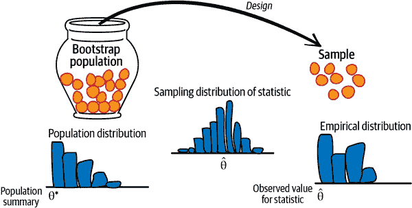
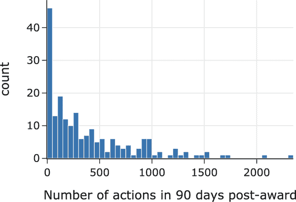
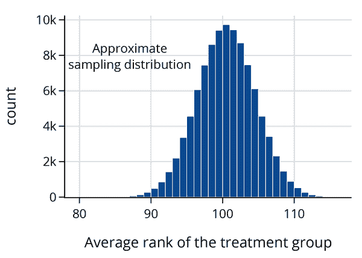
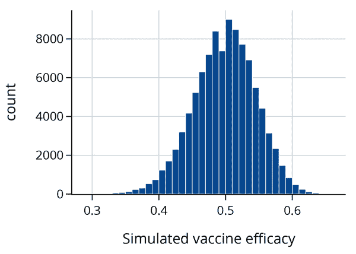
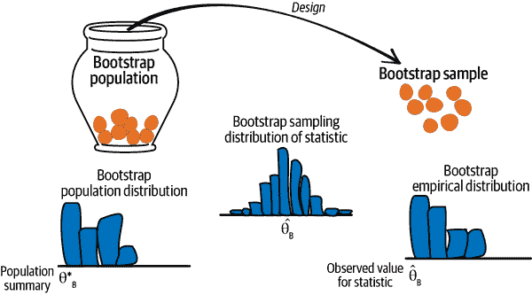
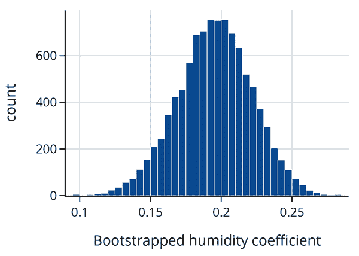
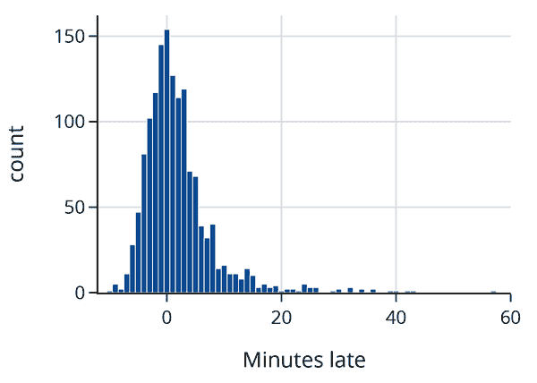
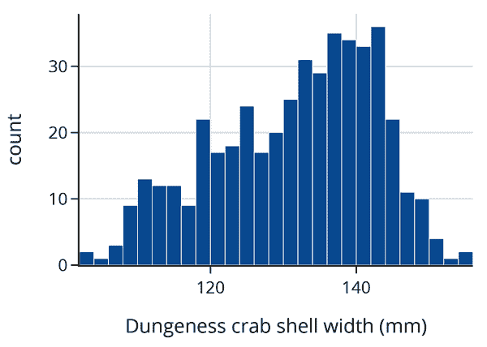
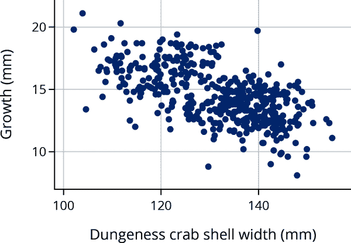
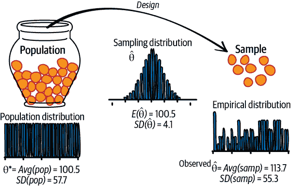

# 第十七章\. 推断和预测的理论

当您希望将您的研究结果推广到更大的背景中时，数据需要代表该更大的世界。例如，您可能希望基于传感器读数预测未来时间的空气质量（见第十二章），基于实验结果测试激励是否提高了贡献者的生产力（见第三章），或者构建一个时间间隔估计，用于估计等待公交车的时间（见第五章）。我们在前几章已经涉及了所有这些情境。在本章中，我们将正式化用于预测和推断的框架。

在这个框架的核心是分布的概念，无论是总体、经验（也称为样本）还是概率分布。理解这些分布之间的联系对于假设检验、置信区间、预测带和风险的基础至关重要。我们首先简要回顾了在第三章介绍的瓮模型，然后介绍了假设检验、置信区间和预测带的正式定义。我们在示例中使用模拟，包括引导样本作为特例。我们通过对期望、方差和标准误差的正式定义来结束本章——这些是测试、推断和预测理论中的基本概念。

# 分布：总体、经验、抽样

总体、抽样和经验分布是我们在对模型进行推断或对新观察进行预测时的重要概念。图 17-1 提供了一个图示，可以帮助区分它们。该图示使用了来自第二章的总体和访问框架以及来自第三章的瓮模型的概念。左侧是我们研究的总体，以一个瓮中的弹珠表示，每个单位一个。我们简化了情况，使得访问框架和总体相同；也就是说，我们可以访问总体中的每个单位。 （当这种情况不成立时所出现的问题在第二章和第三章中有所涉及。）从瓮到样本的箭头表示设计，意味着从框架中选择样本的协议。图示将此选择过程显示为一个机会机制，以从装有难以区分的弹珠的瓮中抽取来表示。图示的右侧，弹珠的集合构成了我们的样本（我们得到的数据）。



###### 图 17-1\. 数据生成过程的图示

我们通过考虑仅一个特征的测量来简化图表。在图表中的瓮下方是该特征的*总体直方图*。总体直方图表示整个总体中数值的分布。在图的最右边，*经验直方图*展示了我们实际样本的数值分布。请注意，这两个分布在形状上相似。当我们的抽样机制产生代表性样本时，就会出现这种情况。

我们通常对样本测量的摘要感兴趣，比如均值、中位数、简单线性模型的斜率等等。通常，这种摘要统计量是总体参数的估计，比如总体均值或中位数。总体参数在图的左侧显示为<math><msup><mi>θ</mi> <mo>∗</mo></msup></math>；而在右侧，从样本计算出的摘要统计量显示为<math><mrow><mover><mi>θ</mi> <mo stretchy="false">^</mo></mover></mrow></math> 。

我们的样本生成机制很可能在我们再次进行调查时生成不同的数据集。但是如果协议设计良好，我们预期样本仍将类似于总体。换句话说，我们可以从样本计算出的摘要统计量推断总体参数。图中间的*抽样分布*是统计量的*概率分布*。它展示了不同样本可能取得的统计量数值及其概率。在第三章中，我们使用模拟来估计了几个示例中的抽样分布。在本章中，我们重访了这些以及前几章的其他示例，以形式化分析。

最后，关于这三个直方图的一个重要点：正如在第十章中介绍的，矩形提供了任何箱中观察结果的比例。在总体直方图的情况下，这是整个总体的比例；对于经验直方图，该区域表示样本中的比例；而对于抽样分布，则表示数据生成机制在该箱中产生样本统计量的机会。

最后，我们通常不了解总体分布或参数，并试图推断参数或预测未见单位的值。其他时候，可以使用样本测试关于总体的推测。测试将是下一节的主题。

# 假设检验基础

根据我们的经验，假设检验是数据科学中较具挑战性的领域之一——学习起来困难，应用起来也具挑战性。这不一定是因为假设检验深奥技术性强；相反，假设检验可能令人感到反直觉，因为它利用了矛盾。顾名思义，我们通常从一个*假设*开始进行假设检验：关于我们想要验证的世界的一个陈述。

在理想的情况下，我们将直接证明我们的假设是正确的。不幸的是，我们通常无法获得确定真相所需的所有信息。例如，我们可能假设一种新的疫苗有效，但当代医学尚未完全理解支配疫苗效力的生物学细节。因此，我们转向概率、随机抽样和数据设计的工具。

假设检验之所以令人困惑的一个原因是，它很像“反证法”，我们假设与我们的假设相反是真的，并尝试证明我们观察到的数据与该假设不一致。我们采用这种方式来解决问题，因为通常，某事可能由许多原因导致，但我们只需要一个例子来反驳一个假设。我们称这个“相反假设”为 *空假设*，我们的原始假设为 *备择假设*。

使事情变得有点混乱的是，概率的工具并不直接证明或证伪事物。相反，它们告诉我们，在假设的情况下，我们观察到的某事有多么可能或不可能。这就是为什么设计数据收集如此重要的原因。

回顾 J&J 疫苗的随机临床试验（第三章），在这个试验中，有 43,738 人参加了试验，并被随机分成两组。治疗组接受了疫苗，对照组接受了一种假疫苗，称为安慰剂。这种随机分配创建了两个在除了疫苗之外的每个方面都相似的群体。

在这个试验中，治疗组中有 117 人生病，对照组中有 351 人生病。由于我们希望提供令人信服的证据证明疫苗有效，我们从一个空假设开始，即疫苗没有作用，这意味着随机分配导致治疗组中生病的人数如此之少纯属偶然。然后，我们可以使用概率来计算观察到如此少的治疗组生病的机会。概率计算基于一个有 43,738 个彩球的瓮，其中 468 个标记为 1 表示一个生病的人。然后我们发现，21,869 次有放回地从瓮中抽取最多 117 个彩球的概率几乎为零。我们把这个作为拒绝空假设的证据，支持备择假设即疫苗有效。因为 J&J 的实验设计良好，对空假设的拒绝使我们得出结论，即疫苗有效。换句话说，假设的真相取决于我们以及我们有多愿意可能是错误的。

在本节的其余部分，我们将介绍假设检验的四个基本步骤。然后我们提供两个示例，继续介绍来自 第三章 的两个示例，并深入探讨测试的形式。

假设检验有四个基本步骤：

第一步：建立

你已经有了你的数据，并且你想要测试一个特定的模型是否与数据相一致。 所以你指定一个统计量，<math><mrow><mover><mi>θ</mi> <mo stretchy="false">^</mo></mover></mrow></math>，比如样本平均值、样本中零的比例或拟合的回归系数，目的是将你的数据的统计量与模型下可能产生的值进行比较。

第二步：模型

你要将要测试的模型以数据生成机制的形式呈现出来，以及关于总体的任何特定假设。 这个模型通常包括指定<math><msup><mi>θ</mi> <mo>∗</mo></msup></math>，它可能是总体均值、零的比例或回归系数。 在这个模型下统计量的抽样分布称为*零分布*，而模型本身称为*零假设*。

第三步：计算

根据第二步中的零模型，你得到的数据（以及产生的统计量）至少与你在第一步中实际得到的数据有多相似？ 在形式推断中，这个概率被称为<math><mi>p</mi></math> -*值*。 为了近似<math><mi>p</mi></math> -值，我们经常使用计算机使用模型中的假设生成大量重复的随机试验，并找到给定统计量的值至少与我们观察到的值一样极端的样本的比例。 其他时候，我们可以使用数学理论来找到<math><mi>p</mi></math> -值。

第四步：解释

<math><mi>p</mi></math> -值用作惊奇的度量。 如果你在第二步中规定的模型是可信的，那么你得到的数据（和总结统计量）应该有多么惊讶？ 一个中等大小的<math><mi>p</mi></math> -值意味着观察到的统计量基本上是你预期的在零模型生成的数据中得到的。 一个微小的<math><mi>p</mi></math> -值会对零模型提出质疑。 换句话说，如果模型是正确的（或者近似正确的），那么从模型生成的数据中得到这样一个极端值是非常不寻常的。 在这种情况下，要么零模型是错误的，要么发生了一个非常不可能的结果。 统计逻辑表明要得出结论，模式是真实的，不仅仅是巧合。 然后就轮到你解释为什么数据生成过程会导致这样一个不寻常的值。 这是什么时候仔细考虑范围的重要性。

让我们用几个例子来演示测试过程中的这些步骤。

## 例子：用于比较维基百科贡献者生产力的等级测试

回想一下来自第二章的维基百科示例，在英语维基百科上过去 30 天活跃的前 1%的贡献者中，从未接受过奖励。这 200 名贡献者被随机分成两组各 100 人。一个组的贡献者，即实验组，每人获得一份非正式奖励，而另一个组则没有。所有 200 名贡献者被跟踪记录了 90 天，记录他们在维基百科上的活动。

有人推测非正式奖励对志愿者工作有一种强化作用，这个实验旨在正式研究这一推测。我们基于数据排名进行假设检验。

首先，我们将数据读入数据框架：

```py
`wiki` `=` `pd``.``read_csv``(``"``data/Wikipedia.csv``"``)`
`wiki``.``shape`

```

```py
(200, 2)

```

```py
`wiki``.``describe``(``)``[``3``:``]`

```

|   | experiment | postproductivity |
| --- | --- | --- |
| **min** | 0.0 | 0.0 |
| **25%** | 0.0 | 57.5 |
| **50%** | 0.5 | 250.5 |
| **75%** | 1.0 | 608.0 |
| **max** | 1.0 | 2344.0 |

数据框架有 200 行，每行代表一个贡献者。特征`experiment`要么是 0 要么是 1，取决于贡献者是在对照组还是实验组，而`postproductivity`是在授予奖励后 90 天内贡献者编辑次数的计数。四分位数（下、中、上）之间的差距表明生产力的分布是倾斜的。我们制作直方图进行确认：

```py
px.histogram(
	wiki, x='postproductivity', nbins=50,
	labels={'postproductivity': 'Number of actions in 90 days post award'},
	width=350, height=250)

```



实际上，授奖后的生产力直方图高度倾斜，在接近零的地方有一个峰值。这种偏斜性表明基于两个样本值排序的统计量。

要计算我们的统计量，我们将所有生产力值（来自两个组）从最小到最大排序。最小值的排名为 1，第二小的排名为 2，依此类推，直到最大值，其排名为 200。我们使用这些排名来计算我们的统计量，<math><mrow><mover><mi>θ</mi> <mo stretchy="false">^</mo></mover></mrow></math> ，它是实验组的平均排名。我们选择这个统计量是因为它对高度倾斜的分布不敏感。例如，无论最大值是 700 还是 700,000，它仍然获得相同的排名，即 200。如果非正式奖励激励贡献者，那么我们期望实验组的平均排名通常高于对照组。

零模型假设非正式奖励对生产力没有*任何*影响，观察到的实验组和对照组之间的任何差异都是由于将贡献者分配到组的偶然过程。零假设被设置为拒绝现状；也就是说，我们希望找到一个假设没有效果的惊喜。

零假设可以用从一个装有 200 个标有 1、2、3、...、200 的彩球的罐子中抽取 100 次的结果来表示。在这种情况下，平均等级将是 <math><mo stretchy="false">(</mo> <mn>1</mn> <mo>+</mo> <mn>200</mn> <mo stretchy="false">)</mo> <mrow><mo>/</mo></mrow> <mn>2</mn> <mo>=</mo> <mn>100.5</mn></math> 。

我们使用 `scipy.stats` 中的 `rankdata` 方法对这 200 个值进行排名，并计算治疗组中等级的总和：

```py
`from` `scipy``.``stats` `import` `rankdata`
`ranks` `=` `rankdata``(``wiki``[``'``postproductivity``'``]``,` `'``average``'``)`

```

让我们确认 200 个值的平均等级是 100.5：

```py
`np``.``average``(``ranks``)`

```

```py
100.5

```

并找出治疗组中 100 个生产力分数的平均等级：

```py
`observed` `=` `np``.``average``(``ranks``[``100``:``]``)`
`observed`

```

```py
113.68

```

治疗组的平均等级高于预期，但我们想要弄清楚这是否是一个异常高的值。我们可以使用模拟来找出这个统计量的抽样分布，以确定 113 是一个常规值还是一个令人惊讶的值。

为了进行这个模拟，我们将数据中的 `ranks` 数组设为罐子中的彩球。对数组中的 200 个值进行洗牌，并取前 100 个值代表一个随机抽取的治疗组。我们编写一个函数来洗牌排名数组并找出前 100 个的平均值。

```py
`rng` `=` `np``.``random``.``default_rng``(``42``)`
`def` `rank_avg``(``ranks``,` `n``)``:`
    `rng``.``shuffle``(``ranks``)`
    `return` `np``.``average``(``ranks``[``n``:``]``)`      

```

我们的模拟混合了罐子中的彩球，抽取 100 次，计算 100 次抽取的平均等级，然后重复 100,000 次。

```py
`rank_avg_simulation` `=` `[``rank_avg``(``ranks``,` `100``)` `for` `_` `in` `range``(``100_000``)``]` 

```

这里是模拟平均值的直方图：



正如我们预期的那样，平均等级的抽样分布以 100（实际上是 100.5）为中心，并呈钟形曲线。这个分布的中心反映了治疗没有影响的假设。我们观察到的统计量远远超出了模拟平均等级的典型范围，我们使用这个模拟的抽样分布来找到观察到的统计量的近似 <math><mi>p</mi></math> -值：

```py
`np``.``mean``(``rank_avg_simulation` `>` `observed``)`

```

```py
0.00058

```

这真是一个大惊喜。根据零假设，我们看到一个平均等级至少与我们的一样大的机会约为 10,000 分之 5。

这个测试对零模型提出了质疑。统计逻辑使我们得出结论，这种模式是真实存在的。我们如何解释这个结果？这个实验设计得很好。从顶尖 1% 中随机选择了 200 名贡献者，然后随机将他们分为两组。这些随机过程表明，我们可以依赖于这 200 个样本代表了顶尖贡献者，并且治疗组和对照组在除了治疗（奖励）的应用之外的其他方面上都是相似的。考虑到精心的设计，我们得出结论，非正式的奖励对顶尖贡献者的生产力有积极的影响。

早些时候，我们实施了一个模拟来找到我们观察到的统计量的 <math><mi>p</mi></math> -值。在实践中，排名测试通常被广泛使用，并在大多数统计软件中提供：

```py
`from` `scipy``.``stats` `import` `ranksums`

`ranksums``(``x``=``wiki``.``loc``[``wiki``.``experiment` `==` `1``,` `'``postproductivity``'``]``,`
         `y``=``wiki``.``loc``[``wiki``.``experiment` `==` `0``,` `'``postproductivity``'``]``)`

```

```py
RanksumsResult(statistic=3.220386553232206, pvalue=0.0012801785007519996)

```

这里的<math><mi>p</mi></math>值是我们计算的<math><mi>p</mi></math>值的两倍，因为我们只考虑大于观察值的值，而`ranksums`测试计算了分布两侧的<math><mi>p</mi></math>值。在我们的示例中，我们只对提高生产力感兴趣，因此使用单侧<math><mi>p</mi></math>值，这是报告值（0.0006）的一半，接近我们模拟的值。

这种使用排名而不是实际数据值的不太常见的检验统计量是在 1950 年代和 1960 年代开发的，在当今强大笔记本电脑时代之前。排名统计量的数学属性已经很好地发展，并且抽样分布表现良好（即使对于小数据集也是对称的，形状像钟形曲线）。排名测试在 A/B 测试中仍然很受欢迎，其中样本倾向于高度偏斜，并且通常会进行许多许多测试，可以从正态分布中快速计算出<math><mi>p</mi></math>值。

下一个示例重新讨论了来自第三章关于疫苗有效性的例子。在那里，我们遇到了一个假设检验，尽管并未明确称其为假设检验。

## 示例：疫苗有效性的比例检验

疫苗的批准需满足比我们之前执行的简单测试更严格的要求，其中我们比较了治疗组和对照组中的疾病计数。CDC 要求更强的成功证据，基于每组中患病者比例的比较。为了解释，我们将控制组和治疗组中患病人数的样本比例表示为<math><msub><mrow><mover><mi>p</mi> <mo stretchy="false">^</mo></mover></mrow> <mrow><mi>C</mi></mrow></msub></math> 和 <math><msub><mrow><mover><mi>p</mi> <mo stretchy="false">^</mo></mover></mrow> <mi>T</mi></msub></math>，并使用这些比例计算疫苗有效性：

<math display="block"><mrow><mover><mi>θ</mi> <mo stretchy="false">^</mo></mover></mrow> <mo>=</mo> <mfrac><mrow><msub><mrow><mover><mi>p</mi> <mo stretchy="false">^</mo></mover></mrow> <mrow><mi>C</mi></mrow></msub> <mo>−</mo> <msub><mrow><mover><mi>p</mi> <mo stretchy="false">^</mo></mover></mrow> <mi>T</mi></msub></mrow> <msub><mrow><mover><mi>p</mi> <mo stretchy="false">^</mo></mover></mrow> <mi>C</mi></msub></mfrac> <mo>=</mo> <mn>1</mn> <mo>−</mo> <mfrac><msub><mrow><mover><mi>p</mi> <mo stretchy="false">^</mo></mover></mrow> <mi>T</mi></msub> <msub><mrow><mover><mi>p</mi> <mo stretchy="false">^</mo></mover></mrow> <mi>C</mi></msub></mfrac></math>

在 J&J 试验中观察到的疫苗有效性数值为：

<math display="block"><mn>1</mn> <mo>−</mo> <mfrac><mrow><mn>117</mn> <mrow><mo>/</mo></mrow> <mn>21869</mn></mrow> <mrow><mn>351</mn> <mrow><mo>/</mo></mrow> <mn>21869</mn></mrow></mfrac> <mo>=</mo> <mn>1</mn> <mo>−</mo> <mfrac><mn>117</mn> <mn>351</mn></mfrac> <mo>=</mo> <mn>0.667</mn></math>

如果治疗不起作用，有效性将接近于 0。CDC 设定了疫苗有效性的标准为 50%，意味着有效性必须超过 50%才能获得批准用于分发。在这种情况下，零模型假设疫苗有效性为 50%（<math><msup><mi>θ</mi> <mo>∗</mo></msup> <mo>=</mo> <mn>0.5</mn></math>），观察值与预期值的任何差异都归因于随机过程中将人们分配到不同组中。再次强调，我们设定零假设为当前状态，即疫苗不足以获得批准，我们希望发现一个意外并拒绝零假设。

简单代数运算后，零模型 <math><mn>0.5</mn> <mo>=</mo> <mn>1</mn> <mo>−</mo> <msub><mi>p</mi> <mi>T</mi></msub> <mrow><mo>/</mo></mrow> <msub><mi>p</mi> <mi>C</mi></msub></math> 可以简化为 <math><msub><mi>p</mi> <mi>T</mi></msub> <mo>=</mo> <mn>0.5</mn> <msub><mi>p</mi> <mi>C</mi></msub></math> 。也就是说，零假设暗示接受治疗的人群中患病的比例最多是对照组的一半。请注意，零假设并不假设治疗无效，而是假设其有效性不超过 0.5。

在这种情况下，我们的瓮模型与我们在第三章中设定的有所不同。这个瓮仍然有 43,738 颗弹珠，对应于实验中的受试者。但现在每颗弹珠上有两个数字，为了简单起见，这些数字以一对的形式出现，比如<math><mo stretchy="false">(</mo> <mn>0</mn> <mo>,</mo> <mn>1</mn> <mo stretchy="false">)</mo></math> 。左边的数字是如果人接受治疗后的反应，右边的数字对应于未接受治疗时的反应（对照组）。通常情况下，1 表示他们生病了，0 表示他们保持健康。

零模型假设一对中左边数字的比例是右边数字的一半。由于我们不知道这两个比例，我们可以使用数据来估计它们。瓮中有三种类型的弹珠：<math><mo stretchy="false">(</mo> <mn>0</mn> <mo>,</mo> <mn>0</mn> <mo stretchy="false">)</mo></math> ，<math><mo stretchy="false">(</mo> <mn>0</mn> <mo>,</mo> <mn>1</mn> <mo stretchy="false">)</mo></math> 和<math><mo stretchy="false">(</mo> <mn>1</mn> <mo>,</mo> <mn>1</mn> <mo stretchy="false">)</mo></math> 。我们假设<math><mo stretchy="false">(</mo> <mn>1</mn> <mo>,</mo> <mn>0</mn> <mo stretchy="false">)</mo></math> ，即治疗后患病但对照组未患病的情况是不可能发生的。我们观察到在对照组中有 351 人生病，在治疗组中有 117 人生病。在假设治疗组的患病率是对照组的一半的情况下，我们可以尝试瓮中弹珠的构成情况。例如，我们可以研究这样一种情况，即 117 人在治疗组没有生病，但如果他们在对照组，则所有 585 人（<math><mn>351</mn> <mo>+</mo> <mn>117</mn> <mo>+</mo> <mn>117</mn></math> ）都会感染病毒，其中一半不会感染病毒。表格 17-1 展示了这些计数。

表格 17-1\. 疫苗试验瓮模型

| 标签 | 计数 |
| --- | --- |
| (0, 0) | 43,152 |
| (0, 1) | 293 |
| (1, 0) | 0 |
| (1, 1) | 293 |
| 总数 | 43,738 |

我们可以利用这些计数来进行临床试验的模拟，并计算疫苗有效性。如第三章所示，多变量超几何函数模拟从一个装有不止两种颜色的弹珠的罐中抽取弹珠。我们建立这个罐和抽样过程：

```py
`N` `=` `43738`
`n_samp` `=` `21869`
`N_groups` `=` `np``.``array``(``[``293``,` `293``,` `(``N` `-` `586``)``]``)`

`from` `scipy``.``stats` `import` `multivariate_hypergeom`

`def` `vacc_eff``(``N_groups``,` `n_samp``)``:`
    `treat` `=` `multivariate_hypergeom``.``rvs``(``N_groups``,` `n_samp``)`
    `ill_t` `=` `treat``[``1``]`
    `ill_c` `=` `N_groups``[``0``]` `-` `treat``[``0``]` `+` `N_groups``[``1``]` `-` `treat``[``1``]`
    `return` `(``ill_c` `-` `ill_t``)` `/` `ill_c`

```

现在我们可以对临床试验进行 10 万次模拟，并计算每次试验的疫苗有效性：

```py
`np``.``random``.``seed``(``42``)`
`sim_vacc_eff` `=` `np``.``array``(``[``vacc_eff``(``N_groups``,` `n_samp``)` `for` `_` `in` `range``(``100_000``)``]``)`

```

```py
`px``.``histogram``(``x``=``sim_vacc_eff``,` `nbins``=``50``,`
            `labels``=``dict``(``x``=``'``Simulated vaccine efficacy``'``)``,`
            `width``=``350``,` `height``=``250``)`

```



抽样分布的中心在 0.5 处，这与我们的模型假设一致。我们看到 0.667 远离了这个分布的尾部：

```py
`np``.``mean``(``sim_vacc_eff` `>` `0.667``)`

```

```py
1e-05

```

只有极少数的 10 万次模拟中，疫苗有效性达到了观察到的 0.667。这是一个罕见事件，这就是为什么 CDC 批准了强生公司的疫苗进行分发。

在这个假设检验的例子中，我们无法完全指定模型，并且必须根据我们观察到的<math><msub><mi>p</mi> <mi>C</mi></msub></math>和<math><msub><mi>p</mi> <mi>T</mi></msub></math>的近似值来提供近似值<math><msub><mrow><mover><mi>p</mi> <mo stretchy="false">^</mo></mover></mrow> <mi>C</mi></msub></math>和<math><msub><mrow><mover><mi>p</mi> <mo stretchy="false">^</mo></mover></mrow> <mi>T</mi></msub></math> 。有时，零模型并没有完全被指定，我们必须依靠数据来建立模型。下一节介绍了一种通用的方法，称为自举法（bootstrap），用于利用数据近似模型。

# 推断的自举

在许多假设检验中，零假设的假设导致对一个假设总体和数据设计进行完全规范化（参见图 17-1），我们利用这个规范化来模拟统计量的抽样分布。例如，维基百科实验的秩检验导致我们抽样整数 1, …, 200，这很容易模拟。不幸的是，我们并不能总是完全指定总体和模型。为了弥补这种情况，我们用数据代替总体。这种替代是自举概念的核心。图 17-2 更新了图 17-1 以反映这个想法；这里总体分布被经验分布替代，以创建所谓的*自举总体*。



###### 第 17-2 图。引导数据生成过程的示意图

自举的理由如下：

+   你的样本看起来像是总体，因为它是一个代表性样本，所以我们用样本代替总体，并称之为自举总体。

+   使用产生原始样本的相同数据生成过程来获得一个新样本，这被称为*自助样本*，以反映人群的变化。以与之前相同的方式计算自助样本上的统计量，并称之为*自助统计量*。自助统计量的*自助抽样分布*在形状和传播上应与统计量的真实抽样分布类似。

+   模拟数据生成过程多次，使用自助人群，以获得自助样本及其自助统计量。模拟自助统计量的分布近似于自助统计量的自助抽样分布，后者本身近似于原始抽样分布。

仔细观察图 17-2 并将其与图 17-1 进行比较。基本上，自助模拟涉及两个近似值：原始样本近似于人群，而模拟则近似于抽样分布。到目前为止，我们在例子中一直在使用第二种近似值；样本通过样本来近似人群的近似是自助法的核心概念。注意，在图 17-2 中，自助人群的分布（左侧）看起来像原始样本的直方图；抽样分布（中间）仍然是基于与原始研究中相同的数据生成过程的概率分布，但现在使用的是自助人群；样本分布（右侧）是从自助人群中抽取的一个样本的直方图。

您可能想知道如何从自助人群中简单随机抽取样本，而不是每次都得到完全相同的样本。毕竟，如果您的样本中有 100 个单位，并且将其用作您的自助人群，那么从自助人群中抽取的 100 个单位（不重复）将获取所有单位，并且每次都给出相同的自助样本。解决此问题有两种方法：

+   当从自助人群中抽样时，使用带替换的方式从自助人群中抽取单位。基本上，如果原始人群非常大，则使用替换和不使用替换之间几乎没有区别。这是迄今为止更常见的方法。

+   将样本“扩展”到与原始人群相同的大小。即，计算样本中每个唯一值的比例，并向自助人群中添加单位，使其与原始人群大小相同，同时保持这些比例。例如，如果样本大小为 30，并且样本值的 1/3 是 0，则包含 750 个单位的自助人群应包括 250 个零。一旦有了这个自助人群，就使用原始数据生成过程来进行自助抽样。

疫苗有效性的例子使用了类似 Bootstrap 的过程，称为*参数化 Bootstrap*。我们的空模型指定了 0-1 瓮，但我们不知道要在瓮中放多少个 0 和 1。我们使用样本来确定 0 和 1 的比例；也就是说，样本指定了多元超几何分布的参数。接下来，我们使用校准空气质量监测器的例子来展示如何使用 Bootstrap 方法来测试假设。

###### 警告

常见的错误是认为 Bootstrap 采样分布的中心与真实采样分布的中心相同。如果样本的均值不为 0，则 Bootstrap 总体的均值也不为 0。这就是为什么在假设检验中我们使用 Bootstrap 分布的传播范围而不是它的中心。下一个例子展示了我们如何使用 Bootstrap 方法来测试假设。

在校准空气质量监测仪器的案例研究中（见第十二章），我们拟合了一个模型来调整廉价监测器的测量值，使其更准确地反映真实的空气质量。这种调整包括与湿度相关的模型项。拟合系数约为<math><mn>0.2</mn></math>，这意味着在高湿度的日子里，测量值的调整幅度比低湿度的日子大。然而，这个系数接近于 0，我们可能会怀疑在模型中是否真的需要包含湿度。换句话说，我们想要检验线性模型中湿度系数是否为 0。不幸的是，我们无法完全指定模型，因为它是基于一组空气监测器（包括 PurpleAir 和 EPA 维护的监测器）在特定时间段内采集的测量数据。这就是 Bootstrap 方法可以帮助的地方。

我们的模型假设所采集的空气质量测量值类似于整体测量值的总体。请注意，天气条件、时间和监测器的位置使得这种说法有些模糊；我们的意思是在原始测量数据采集时，相同条件下的其他测量值类似于这些测量值。此外，由于我们可以想象有一个几乎无限的空气质量测量数据供应，我们认为生成测量数据的过程类似于从瓮中重复有放回地抽取。回顾一下，在第二章中，我们将瓮建模为从测量误差瓮中重复有放回地抽取的过程。这种情况有些不同，因为我们还包括了已经提到的其他因素（天气、季节、位置）。

我们的模型专注于线性模型中湿度系数：

<math display="block"><mtable columnalign="right" displaystyle="true" rowspacing="3pt"><mtr><mtd><mtext>PA</mtext> <mo>≈</mo> <msub><mi>θ</mi> <mn>0</mn></msub> <mo>+</mo> <msub><mi>θ</mi> <mn>1</mn></msub> <mtext>AQ</mtext> <mo>+</mo> <msub><mi>θ</mi> <mn>2</mn></msub> <mtext>RH</mtext></mtd></mtr></mtable></math>

在这里，<math><mtext>PA</mtext></math>指的是 PurpleAir PM2.5 测量，<math><mtext>RH</mtext></math>是相对湿度，<math><mtext>AQ</mtext></math>表示更精确的 PM2.5 测量，由更准确的 AQS 监测器进行。零假设是<math><msub><mi>θ</mi> <mn>2</mn></msub> <mo>=</mo> <mn>0</mn></math>；也就是说，零模型是简单模型：

<math display="block"><mtable columnalign="right" displaystyle="true" rowspacing="3pt"><mtr><mtd><mtext>PA</mtext> <mo>≈</mo> <msub><mi>θ</mi> <mn>0</mn></msub> <mo>+</mo> <msub><mi>θ</mi> <mn>1</mn></msub> <mtext>AQ</mtext></mtd></mtr></mtable></math>

为了估计<math><msub><mi>θ</mi> <mn>2</mn></msub></math>，我们使用从第十五章的线性模型拟合过程中获取的结果。

我们的 bootstrap 总体由我们在第十五章中使用的来自乔治亚州的测量值组成。现在我们使用`randint`的机会机制从数据框中（相当于我们的乌尔恩）有放回地抽样行。这个函数从一组整数中有放回地随机抽取样本。我们使用随机索引样本创建数据框的 bootstrap 样本。然后我们拟合线性模型，并得到湿度系数（我们的 bootstrap 统计量）。以下的`boot_stat`函数执行这个模拟过程：

```py
`from` `scipy``.``stats` `import` `randint`

`def` `boot_stat``(``X``,` `y``)``:`
    `n` `=` `len``(``X``)`
    `bootstrap_indexes` `=` `randint``.``rvs``(``low``=``0``,` `high``=``(``n` `-` `1``)``,` `size``=``n``)`
    `theta2` `=` `(`
        `LinearRegression``(``)`
        `.``fit``(``X``.``iloc``[``bootstrap_indexes``,` `:``]``,` `y``.``iloc``[``bootstrap_indexes``]``)`
        `.``coef_``[``1``]`
    `)`
    `return` `theta2`

```

我们设置设计矩阵和结果变量，并检查我们的`boot_stat`函数一次以测试它：

```py
`X` `=` `GA``[``[``'``pm25aqs``'``,` `'``rh``'``]``]`
`y` `=` `GA``[``'``pm25pa``'``]`

`boot_stat``(``X``,` `y``)`

```

```py
0.21572251745549495

```

当我们重复这个过程 10,000 次时，我们得到了对 bootstrap 统计量（拟合湿度系数）的 bootstrap 抽样分布的近似：

```py
`np``.``random``.``seed``(``42``)`
`boot_theta_hat` `=` `np``.``array``(``[``boot_stat``(``X``,` `y``)` `for` `_` `in` `range``(``10_000``)``]``)`

```

我们对这个 bootstrap 抽样分布的形状和传播感兴趣（我们知道中心将接近原系数<math><mn>0.21</mn></math>）：

```py
`px``.``histogram``(``x``=``boot_theta_hat``,` `nbins``=``50``,`
             `labels``=``dict``(``x``=``'``Bootstrapped humidity coefficient``'``)``,`
             `width``=``350``,` `height``=``250``)`

```



按设计，bootstrap 抽样分布的中心将接近<math><mrow><mover><mi>θ</mi> <mo stretchy="false">^</mo></mover></mrow></math>，因为 bootstrap 总体由观测数据组成。因此，我们不是计算观察统计量至少大于某个值的机会，而是找到至少小于 0 的值的机会。假设值 0 远离抽样分布。

10,000 个模拟回归系数中没有一个像假设的系数那么小。统计逻辑引导我们拒绝零假设，即我们不需要调整湿度模型。

我们在这里执行的假设检验形式与早期的检验看起来不同，因为统计量的抽样分布不是集中在零假设上。这是因为我们使用 bootstrap 创建抽样分布。实际上，我们使用系数的置信区间来测试假设。在下一节中，我们更广泛地介绍区间估计，包括基于 bootstrap 的区间估计，并连接假设检验和置信区间的概念。

# 置信区间基础

我们已经看到，建模可以导致估计，例如公交车迟到的典型时间（见第 4 章），空气质量测量的湿度调整（见第 15 章），以及疫苗效力的估计（见第 2 章）。这些例子是未知值的点估计，称为*参数*：公交车迟到的中位数为 0.74 分钟；空气质量的湿度调整为每湿度百分点 0.21 PM2.5；而疫苗效力中 COVID 感染率的比率为 0.67。然而，不同的样本会产生不同的估计。简单提供点估计并不能反映估计的精度。相反，区间估计可以反映估计的准确性。这些区间通常采用以下两种形式：

+   一个基于 bootstrap 采样分布百分位数创建的*自举置信区间*。

+   使用抽样分布的标准误差（SE）和关于分布为正态曲线形状的额外假设构建的*正态置信区间*

我们描述了这两种类型的区间，然后给出了一个例子。回想一下抽样分布（见图 17-1）是反映不同<math><mrow><mover><mi>θ</mi> <mo stretchy="false">^</mo></mover></mrow></math>值观察概率的概率分布。置信区间是根据<math><mrow><mover><mi>θ</mi> <mo stretchy="false">^</mo></mover></mrow></math>的抽样分布扩展构建的，因此区间端点是随机的，因为它们基于<math><mrow><mover><mi>θ</mi> <mo stretchy="false">^</mo></mover></mrow></math>。这些区间被设计成 95%的时间覆盖<math><msup><mi>θ</mi> <mo>∗</mo></msup></math>。

正如其名称所示，基于百分位数的 bootstrap 置信区间是从 bootstrap 采样分布的百分位数创建的。具体来说，我们计算<math><msub><mrow><mover><mi>θ</mi> <mo stretchy="false">^</mo></mover></mrow> <mi>B</mi></msub></math>的抽样分布的分位数，其中<math><msub><mrow><mover><mi>θ</mi> <mo stretchy="false">^</mo></mover></mrow> <mi>B</mi></msub></math>是 bootstrap 统计量。对于 95th 百分位数区间，我们确定 2.5 和 97.5 分位数，分别称为<math><msub><mi>q</mi> <mrow><mn>2.5</mn> <mo>,</mo> <mi>B</mi></mrow></msub></math>和<math><msub><mi>q</mi> <mrow><mn>97.5</mn> <mo>,</mo> <mi>B</mi></mrow></msub></math>，其中 95%的时间，bootstrap 统计量在以下区间内：

<math display="block"><msub><mi>q</mi> <mrow><mn>2.5</mn> <mo>,</mo> <mi>B</mi></mrow></msub> <mo>≤</mo> <msub><mrow><mover><mi>θ</mi> <mo stretchy="false">^</mo></mover></mrow> <mi>B</mi></msub>  <mo>≤</mo>  <msub><mi>q</mi> <mrow><mn>97.5</mn> <mo>,</mo> <mi>B</mi></mrow></msub></math>

这个 bootstrap 百分位数置信区间被认为是一种快速而粗糙的区间估计方法。有许多替代方法可以调整偏差，考虑分布形状，并且更适合于小样本。

百分位置信区间不依赖于抽样分布具有特定形状或分布中心为<math><msup><mi>θ</mi> <mo>∗</mo></msup></math>。相比之下，正态置信区间通常不需要引导抽样来计算，但它确实对<math><mrow><mover><mi>θ</mi> <mo stretchy="false">^</mo></mover></mrow></math>的抽样分布形状做了额外的假设。

我们在抽样分布可以很好地近似于正态曲线时使用正常的置信区间。对于正态概率分布，以中心<math><mi>μ</mi></math>和扩展<math><mi>σ</mi></math>，有 95%的概率，从这个分布中随机取得的值在区间<math><mi>μ</mi>  <mo>±</mo>  <mn>1.96</mn> <mi>σ</mi></math>内。由于抽样分布的中心通常是<math><msup><mi>θ</mi> <mo>∗</mo></msup></math>，对于随机生成的<math><mrow><mover><mi>θ</mi> <mo stretchy="false">^</mo></mover></mrow></math>，有 95%的概率是：

<math display="block"><mo stretchy="false">|</mo> <mrow><mover><mi>θ</mi> <mo stretchy="false">^</mo></mover></mrow> <mo>−</mo> <msup><mi>θ</mi> <mo>∗</mo></msup> <mrow><mo stretchy="false">|</mo></mrow> <mo>≤</mo> <mn>1.96</mn> <mi>S</mi> <mi>E</mi> <mo stretchy="false">(</mo> <mrow><mover><mi>θ</mi> <mo stretchy="false">^</mo></mover></mrow> <mo stretchy="false">)</mo></math>

其中<math><mi>S</mi> <mi>E</mi> <mo stretchy="false">(</mo> <mrow><mover><mi>θ</mi> <mo stretchy="false">^</mo></mover></mrow> <mo stretchy="false">)</mo></math>是<math><mrow><mover><mi>θ</mi> <mo stretchy="false">^</mo></mover></mrow></math>的抽样分布的扩展。我们使用这个不等式来为<math><msup><mi>θ</mi> <mo>∗</mo></msup></math>做一个 95%的置信区间：

<math display="block"><mo stretchy="false">[</mo> <mrow><mover><mi>θ</mi> <mo stretchy="false">^</mo></mover></mrow>  <mo>−</mo>  <mn>1.96</mn> <mi>S</mi> <mi>E</mi> <mo stretchy="false">(</mo> <mrow><mover><mi>θ</mi> <mo stretchy="false">^</mo></mover></mrow> <mo stretchy="false">)</mo> <mo>,</mo>    <mrow><mover><mi>θ</mi> <mo stretchy="false">^</mo></mover></mrow>  <mo>+</mo>  <mn>1.96</mn> <mi>S</mi> <mi>E</mi> <mo stretchy="false">(</mo> <mrow><mover><mi>θ</mi> <mo stretchy="false">^</mo></mover></mrow> <mo stretchy="false">)</mo> <mo stretchy="false">]</mo></math>

可以使用不同倍数的<math><mi>S</mi> <mi>E</mi> <mo stretchy="false">(</mo> <mrow><mover><mi>θ</mi> <mo stretchy="false">^</mo></mover></mrow> <mo stretchy="false">)</mo></math>基于正态曲线形成其他尺寸的置信区间。例如，99%置信区间为<math><mo>±</mo> <mn>2.58</mn> <mi>S</mi> <mi>E</mi></math>，单侧上限 95%置信区间为<math><mo stretchy="false">[</mo> <mrow><mover><mi>θ</mi> <mo stretchy="false">^</mo></mover></mrow>  <mo>−</mo>  <mn>1.64</mn> <mi>S</mi> <mi>E</mi> <mo stretchy="false">(</mo> <mrow><mover><mi>θ</mi> <mo stretchy="false">^</mo></mover></mrow> <mo stretchy="false">)</mo> <mo>,</mo>   <mi mathvariant="normal">∞</mi> <mo stretchy="false">]</mo></math>。

###### 注意

参数估计的标准差通常称为*标准误差*或 SE，以区别于样本、总体或来自容器的一次抽样的标准差。在本书中，我们不加区分地称之为标准差。

接下来我们提供每种类型的示例。

在本章的早些时候，我们测试了线性空气质量模型中湿度系数为 0 的假设。这些数据的拟合系数为<math><mn>0.21</mn></math> 。由于空模型未完全指定数据生成机制，我们转而使用自举法。也就是说，我们将数据视为总体，从自举总体中有放回地抽取了 11,226 条记录，并拟合模型以找到湿度的自举样本系数。我们的模拟重复了这一过程 10,000 次，以获得近似的自举抽样分布。

我们可以使用这个自举抽样分布的百分位数来创建<math><msup><mi>θ</mi> <mo>∗</mo></msup></math>的 99% 置信区间。为此，我们找到自举抽样分布的分位数<math><msub><mi>q</mi> <mrow><mn>0.5</mn></mrow></msub></math> 和<math><msub><mi>q</mi> <mrow><mn>99.5</mn></mrow></msub></math>：

```py
`q_995` `=` `np``.``percentile``(``boot_theta_hat``,` `99.5``,` `method``=``'``lower``'``)`
`q_005` `=` `np``.``percentile``(``boot_theta_hat``,` `0.05``,` `method``=``'``lower``'``)`

`print``(``f``"``Lower 0.05th percentile:` `{``q_005``:``.3f``}``"``)`
`print``(``f``"``Upper 99.5th percentile:` `{``q_995``:``.3f``}``"``)`

```

```py
Lower 0.05th percentile: 0.099
Upper 99.5th percentile: 0.260

```

或者，由于抽样分布的直方图形状大致呈正态分布，我们可以基于正态分布创建一个 99% 置信区间。首先，我们找到<math><mrow><mover><mi>θ</mi> <mo stretchy="false">^</mo></mover></mrow></math>的标准误差，这只是<math><mrow><mover><mi>θ</mi> <mo stretchy="false">^</mo></mover></mrow></math>的抽样分布的标准偏差：

```py
`standard_error` `=` `np``.``std``(``boot_theta_hat``)`
`standard_error`

```

```py
0.02653498609330345

```

然后，<math><msup><mi>θ</mi> <mo>∗</mo></msup></math>的 99% 置信区间是观察到的<math><mrow><mover><mi>θ</mi> <mo stretchy="false">^</mo></mover></mrow></math>的<math><mn>2.58</mn></math> 个标准误差的距离，向任何方向：

```py
`print``(``f``"``Lower 0.05th endpoint:` `{``theta2_hat` `-` `(``2.58` `*` `standard_error``)``:``.3f``}``"``)`
`print``(``f``"``Upper 99.5th endpoint:` `{``theta2_hat` `+` `(``2.58` `*` `standard_error``)``:``.3f``}``"``)`

```

```py
Lower 0.05th endpoint: 0.138
Upper 99.5th endpoint: 0.275

```

这两个区间（自举百分位和正态）非常接近但显然不相同。考虑到自举抽样分布中的轻微不对称性，我们可能会预期到这一点。

还有其他基于正态分布的置信区间版本，反映了使用数据的抽样分布的标准误差的估计的变异性。还有一些针对统计量而不是平均数的百分位数的其他置信区间。（还要注意，对于置换测试，自举法的准确性不如正态近似。）

###### 注意

置信区间很容易被误解为参数<math><msup><mi>θ</mi> <mo>∗</mo></msup></math> 在区间内的概率。然而，置信区间是从抽样分布的一个实现中创建的。抽样分布给出了一个不同的概率陈述；以这种方式构建的区间将在 95% 的时间内包含<math><msup><mi>θ</mi> <mo>∗</mo></msup></math> 。不幸的是，我们不知道这个特定时间是否是那些发生了 100 次中的 95 次之一。这就是为什么使用术语*置信度*而不是*概率*或*机会*，并且我们说我们有 95% 的置信度参数在我们的区间内。

置信区间和假设检验有以下关系。比如说，如果一个 95%的置信区间包含了假设值 <math><msup><mi>θ</mi> <mo>∗</mo></msup></math> ，那么这个检验的 <math><mi>p</mi></math> 值小于 5%。也就是说，我们可以反过来利用置信区间来创建假设检验。我们在前一节中使用了这种技术，当我们进行了对空气质量模型中湿度系数是否为 0 的检验。在本节中，我们基于自举百分位数创建了一个 99%的系数置信区间，由于 0 不在区间内，所以 <math><mi>p</mi></math> 值小于 1%，根据统计逻辑，我们可以得出结论系数不为 0。

另一种区间估计是预测区间。预测区间侧重于观测值的变化而不是估计量的变化。我们接下来来探索这些内容。

# 预测区间的基础

置信区间传达了估计量的准确性，但有时我们想要对未来观测的预测准确性。例如，有人可能会说：我的公交车三分之一的时间最多晚到三四分之一分钟，但它可能晚多久？另一个例子是，加利福尼亚州鱼类和野生动物部门将达摩尼斯蟹的最小捕捞尺寸设定为 146 毫米，一个休闲钓鱼公司可能会想知道他们顾客的捕捞品是否比 146 毫米更大。还有一个例子，兽医根据驴的长度和腰围估算其重量为 169 公斤，并使用这一估算来给驴注射药物。为了驴的安全，兽医希望知道驴的真实重量可能与这一估算相差多少。

这些例子的共同点是对未来观测的预测以及量化未来观测可能与预测之间的距离。就像置信区间一样，我们计算统计量（估计量），并在预测中使用它，但现在我们关心的是未来观测与预测之间的典型偏差。在接下来的几节中，我们通过基于分位数、标准偏差以及条件协变量的示例来工作，展示预测区间的例子。沿途我们还提供了关于观测值典型变化的额外信息。

## 示例：预测公交车晚点情况

第四章 模型化了西雅图公交车到达特定站点的晚点情况。我们观察到分布高度倾斜，并选择以中位数 0.74 分钟估算典型的晚点情况。我们在此重现了该章节的样本直方图：

```py
`times` `=` `pd``.``read_csv``(``"``data/seattle_bus_times_NC.csv``"``)`
`fig` `=` `px``.``histogram``(``times``,` `x``=``"``minutes_late``"``,` `width``=``350``,` `height``=``250``)`
`fig``.``update_xaxes``(``range``=``[``-``12``,` `60``]``,` `title_text``=``"``Minutes late``"``)`
`fig`

```



预测问题解决了公交车可能晚点多久的问题。虽然中位数信息丰富，但它并不提供关于分布偏斜程度的信息。也就是说，我们不知道公交车可能会有多晚。第 75 百分位数，甚至第 95 百分位数，会增加有用的考虑信息。我们在这里计算这些百分位数：

```py
median:          0.74 mins late
75th percentile: 3.78 mins late
95th percentile: 13.02 mins late

```

从这些统计数据中，我们了解到，超过一半的时间，公交车甚至不晚一分钟，四分之一的时间几乎晚了四分钟，有时几乎可以发生公交车晚了近 15 分钟。这三个值共同帮助我们制定计划。

## 示例：预测螃蟹大小

对于捕捞遠缅蟹的高度规定，包括限制螃蟹捕捞的贝壳宽度为 146 毫米。为了更好地理解加州渔猎和野生动物部与北加州和南俄勒冈州的商业螃蟹捕捞者合作捕捉、测量和释放螃蟹。这里是约 450 只捕获螃蟹的贝壳大小直方图：



分布略微向左倾斜，但平均值和标准差是分布的合理摘要统计数据：

```py
`crabs``[``'``shell``'``]``.``describe``(``)``[``:``3``]`

```

```py
count    452.00
mean     131.53
std       11.07
Name: shell, dtype: float64

```

平均值 132 毫米是典型螃蟹大小的良好预测。然而，它缺乏有关个体螃蟹可能与平均值相差多远的信息。标准差可以填补这一空白。

除了个别观察值围绕分布中心的可变性之外，我们还考虑了我们对平均贝壳大小估计的可变性。我们可以使用自助法来估计这种可变性，或者我们可以使用概率论（我们在下一节中会这样做）来展示估计值的标准差是<math><mi>S</mi> <mi>D</mi> <mo stretchy="false">(</mo> <mi>p</mi> <mi>o</mi> <mi>p</mi> <mo stretchy="false">)</mo> <mrow><mo>/</mo></mrow> <msqrt><mi>n</mi></msqrt></math>。我们还在下一节中展示，这两种变化来源结合如下：

<math display="block"><msqrt><mi>S</mi> <mi>D</mi> <mo stretchy="false">(</mo> <mi>p</mi> <mi>o</mi> <mi>p</mi> <msup><mo stretchy="false">)</mo> <mn>2</mn></msup> <mo>+</mo> <mfrac><mrow><mi>S</mi> <mi>D</mi> <mo stretchy="false">(</mo> <mi>p</mi> <mi>o</mi> <mi>p</mi> <msup><mo stretchy="false">)</mo> <mn>2</mn></msup></mrow> <mi>n</mi></mfrac></msqrt>  <mo>=</mo>  <mi>S</mi> <mi>D</mi> <mo stretchy="false">(</mo> <mi>p</mi> <mi>o</mi> <mi>p</mi> <mo stretchy="false">)</mo> <msqrt><mn>1</mn> <mo>+</mo> <mfrac><mn>1</mn> <mi>n</mi></mfrac></msqrt></math>

我们用<math><mi>S</mi> <mi>D</mi> <mo stretchy="false">(</mo> <mi>s</mi> <mi>a</mi> <mi>m</mi> <mi>p</mi> <mi>l</mi> <mi>e</mi> <mo stretchy="false">)</mo></math>替换<math><mi>S</mi> <mi>D</mi> <mo stretchy="false">(</mo> <mi>p</mi> <mi>o</mi> <mi>p</mi> <mo stretchy="false">)</mo></math>并将此公式应用于我们的螃蟹：

```py
`np``.``std``(``crabs``[``'``shell``'``]``)` `*` `np``.``sqrt``(``1` `+` `1``/``len``(``crabs``)``)`

```

```py
11.073329460297957

```

我们看到包括样本平均值的 SE 基本上不会改变预测误差，因为样本如此之大。我们得出结论，螃蟹通常与 132 毫米的典型大小相差 11 至 22 毫米。这些信息有助于制定围绕螃蟹捕捞的政策，以维护螃蟹种群的健康，并为娱乐捕鱼者设定期望。

## 示例：预测螃蟹的增长

加州渔业和野生动物部希望更好地理解蟹的生长，以便能够制定更好的捕捞限制，从而保护蟹的种群。在前述例子中提到的研究中捕获的蟹即将脱壳，除了它们的大小外，还记录了换壳前后壳尺寸的变化：

```py
`crabs``.``corr``(``)`

```

|   | 壳 | 增量 |
| --- | --- | --- |
| **壳** | 1.0 | -0.6 |
| **增量** | -0.6 | 1.0 |

这两个测量值呈负相关，意味着蟹越大，它们换壳时的生长就越少。我们绘制生长增量与壳尺寸的关系图，以确定这些变量之间的关系是否大致为线性：

```py
px.scatter(crabs, y='inc', x= 'shell', width=350, height=250,
	labels=dict(shell='Dungeness crab shell width (mm)',
				inc='Growth (mm)'))

```



关系看起来是线性的，我们可以拟合一个简单的线性模型来解释壳前换壳大小的生长增量。在本例中，我们使用`statsmodels`库，它提供了使用`get_prediction`生成预测区间的功能。我们首先设置设计矩阵和响应变量，然后使用最小二乘法拟合模型：

```py
`import` `statsmodels``.``api` `as` `sm`

`X` `=` `sm``.``add_constant``(``crabs``[``[``'``shell``'``]``]``)`
`y` `=` `crabs``[``'``inc``'``]`

`inc_model` `=` `sm``.``OLS``(``y``,` `X``)``.``fit``(``)`

`print``(``f``"``Increment estimate =` `{``inc_model``.``params``[``0``]``:``0.2f``}` `+` `"``,` 
      `f``"``{``inc_model``.``params``[``1``]``:``0.2f``}` `x Shell Width``"``)`

```

```py
Increment estimate = 29.80 +  -0.12 x Shell Width

```

建模时，我们为解释变量的给定值创建预测区间。例如，如果一只新捕获的蟹的壳宽度为 120 毫米，那么我们使用我们拟合的模型来预测其壳的生长。

如前例所示，我们对单个观测值的预测的可变性包括我们对蟹的生长估计的可变性以及蟹壳尺寸的蟹对蟹变异。我们可以再次使用自助法来估计这种变异，或者可以使用概率理论来展示这两种变异源如下组合：

<math display="block"><mi>S</mi> <mi>D</mi> <mo stretchy="false">(</mo> <mrow><mi mathvariant="bold">e</mi></mrow> <mo stretchy="false">)</mo> <msqrt><mn>1</mn> <mo>+</mo> <msub><mrow><mi mathvariant="bold">x</mi></mrow> <mn>0</mn></msub> <mo stretchy="false">(</mo> <msup><mtext mathvariant="bold">X</mtext> <mi mathvariant="normal">⊤</mi></msup> <mtext mathvariant="bold">X</mtext> <msup><mo stretchy="false">)</mo> <mrow><mo>−</mo> <mn>1</mn></mrow></msup> <msubsup><mrow><mi mathvariant="bold">x</mi></mrow> <mn>0</mn> <mi mathvariant="normal">⊤</mi></msubsup></msqrt></math>

在这里，<math><mtext mathvariant="bold">X</mtext></math>是由原始数据组成的设计矩阵，<math><mrow><mi mathvariant="bold">e</mi></mrow></math>是来自回归的残差的<math><mi>n</mi> <mo>×</mo> <mn>1</mn></math>列向量，而<math><msub><mrow><mi mathvariant="bold">x</mi></mrow> <mn>0</mn></msub></math>是新观测值的<math><mn>1</mn> <mo>×</mo> <mo stretchy="false">(</mo> <mi>p</mi> <mo>+</mo> <mn>1</mn> <mo stretchy="false">)</mo></math>行特征向量（在本例中，这些是<math><mrow><mo>[</mo> <mn>1</mn> <mo>,</mo> <mn>120</mn> <mo>]</mo></mrow></math>）：

```py
`new_data` `=` `dict``(``const``=``1``,` `shell``=``120``)`
`new_X` `=` `pd``.``DataFrame``(``new_data``,` `index``=``[``0``]``)`
`new_X`

```

|   | 常数 | 壳 |
| --- | --- | --- |
| **0** | 1 | 120 |

我们使用`statsmodels`中的`get_prediction`方法为壳宽度为 120 毫米的蟹找到 95%的预测区间：

```py
`pred` `=` `inc_model``.``get_prediction``(``new_X``)`
`pred``.``summary_frame``(``alpha``=``0.05``)`

```

|   | 均值 | 均值标准误 | 均值置信区间下限 | 均值置信区间上限 | 观测置信区间下限 | 观测置信区间上限 |
| --- | --- | --- | --- | --- | --- | --- |
| **0** | 15.86 | 0.12 | 15.63 | 16.08 | 12.48 | 19.24 |

在这里，我们有一个对贝壳大小为 120 毫米的螃蟹平均生长增量的置信区间为[15.6, 16.1]，以及生长增量的预测区间为[12.5, 19.2]。预测区间要宽得多，因为它考虑了个体螃蟹的变异性。这种变异性体现在点围绕回归线的分布中，我们通过残差的标准偏差来近似。贝壳大小和生长增量之间的相关性意味着对于特定贝壳大小的生长增量预测的变异性要小于生长增量的整体标准偏差：

```py
`print``(``f``"``Residual SD:` `{``np``.``std``(``inc_model``.``resid``)``:``0.2f``}``"``)`
`print``(``f``"``Crab growth SD:` `{``np``.``std``(``crabs``[``'``inc``'``]``)``:``0.2f``}``"``)`

```

```py
Residual SD:    1.71
Crab growth SD: 2.14

```

`get_prediction`提供的区间依赖于增长增量分布的正态近似。这就是为什么 95% 的预测区间端点大约是预测值两倍的残差标准偏差之外。在下一节中，我们将深入探讨这些标准差、估计值和预测的计算。我们还讨论了在计算它们时所做的一些假设。

# 推断和预测的概率

假设检验、置信区间和预测区间依赖于从抽样分布和数据生成过程计算的概率计算。这些概率框架还使我们能够对假设调查、实验或其他机会过程进行模拟和自举研究，以研究其随机行为。例如，我们在维基百科实验中找到了排名平均值的抽样分布，假设该实验中的处理方式不有效。使用模拟，我们量化了期望结果的典型偏差和摘要统计量可能值的分布。图 17-1 中的三联画提供了一个图表，指导我们进行这个过程；它有助于区分人群、概率和样本之间的差异，并展示它们之间的联系。在本节中，我们为这些概念带来了更多的数学严谨性。

我们正式介绍了期望值、标准偏差和随机变量的概念，并将它们与本章中用于检验假设、制定置信区间和预测区间的概念联系起来。我们从维基百科实验的具体例子开始，然后进行概括。在此过程中，我们将这种形式主义与贯穿本章的三联画连接起来，作为我们的指导。

## 平均等级统计理论的形式化

回想一下在 Wikipedia 实验中，我们汇总了治疗组和对照组的奖后生产力值，并将它们转换为排名，<math><mn>1</mn> <mo>,</mo> <mn>2</mn> <mo>,</mo> <mn>3</mn> <mo>,</mo> <mo>…</mo> <mo>,</mo> <mn>200</mn></math> ，因此总体仅由整数 1 到 200 组成。图 17-3 是代表这种特定情况的图表。注意，总体分布是平坦的，范围从 1 到 200（图 17-3 的左侧）。此外，我们使用的总体总结（称为 *总体参数*）是平均排名：

<math display="block"><msup><mi>θ</mi> <mo>∗</mo></msup>  <mo>=</mo>  <mtext>Avg</mtext> <mo stretchy="false">(</mo> <mtext>pop</mtext> <mo stretchy="false">)</mo>  <mo>=</mo>  <mfrac><mn>1</mn> <mn>200</mn></mfrac> <msubsup><mi mathvariant="normal">Σ</mi> <mrow><mi>k</mi> <mo>=</mo> <mn>1</mn></mrow> <mrow><mn>200</mn></mrow></msubsup> <mi>k</mi>  <mo>=</mo>  <mn>100.5</mn></math>

另一个相关的总结是关于 <math><msup><mi>θ</mi> <mo>∗</mo></msup></math> 的分布，定义为总体标准偏差：

<math display="block"><mtext>SD</mtext> <mo stretchy="false">(</mo> <mtext>pop</mtext> <mo stretchy="false">)</mo>  <mo>=</mo>  <msqrt><mfrac><mn>1</mn> <mn>200</mn></mfrac> <msubsup><mi mathvariant="normal">Σ</mi> <mrow><mi>k</mi> <mo>=</mo> <mn>1</mn></mrow> <mrow><mn>200</mn></mrow></msubsup> <mo stretchy="false">(</mo> <mi>k</mi> <mo>−</mo> <msup><mi>θ</mi> <mo>∗</mo></msup> <msup><mo stretchy="false">)</mo> <mn>2</mn></msup></msqrt>  <mo>=</mo>  <msqrt><mfrac><mn>1</mn> <mn>200</mn></mfrac> <msubsup><mi mathvariant="normal">Σ</mi> <mrow><mi>k</mi> <mo>=</mo> <mn>1</mn></mrow> <mrow><mn>200</mn></mrow></msubsup> <mo stretchy="false">(</mo> <mi>k</mi> <mo>−</mo> <mn>100.5</mn> <msup><mo stretchy="false">)</mo> <mn>2</mn></msup></msqrt>  <mo>≈</mo>  <mn>57.7</mn></math>

SD(pop) 表示一个排名与整体平均值的典型偏差。为了计算这个例子的 SD(pop)，需要进行一些数学手工操作：



###### 图 17-3\. Wikipedia 实验数据生成过程的示意图；这是一个我们知道总体的特殊情况

观察到的样本由治疗组的整数排名组成；我们将这些值称为 <math><msub><mi>k</mi> <mn>1</mn></msub> <mo>,</mo> <msub><mi>k</mi> <mn>2</mn></msub> <mo>,</mo> <mo>…</mo> <mo>,</mo> <msub><mi>k</mi> <mrow><mn>100</mn></mrow></msub><mo>.</mo></math> 样本分布显示在 图 17-3 的右侧（100 个整数每个出现一次）。

与总体平均值相对应的是样本平均值，这是我们感兴趣的统计量：

<math display="block"><mtext>Avg</mtext> <mo stretchy="false">(</mo> <mtext>sample</mtext> <mo stretchy="false">)</mo>  <mo>=</mo>  <mfrac><mn>1</mn> <mn>100</mn></mfrac> <msubsup><mi mathvariant="normal">Σ</mi> <mrow><mi>i</mi> <mo>=</mo> <mn>1</mn></mrow> <mrow><mn>100</mn></mrow></msubsup> <msub><mi>k</mi> <mi>i</mi></msub>  <mo>=</mo>  <mrow><mover><mi>k</mi> <mo stretchy="false">¯</mo></mover></mrow>  <mo>=</mo>  <mn>113.7</mn></math>

<math><mtext>样本</mtext> <mo stretchy="false">)</mo> <mo></mo>的观察值是 <math><mrow><mover><mi>θ</mi> <mo stretchy="false">^</mo></mover></mrow></math> 。同样，关于 <math><mtext>样本</mtext> <mo stretchy="false">)</mo> <mo></mo>的分布，被称为样本的标准偏差，表示一个样本中排名与样本平均值的典型偏差：

<math display="block"><mtext>SD</mtext> <mo stretchy="false">(</mo> <mtext>sample</mtext> <mo stretchy="false">)</mo>  <mo>=</mo>  <msqrt><mfrac><mn>1</mn> <mn>100</mn></mfrac> <msubsup><mi mathvariant="normal">Σ</mi> <mrow><mi>i</mi> <mo>=</mo> <mn>1</mn></mrow> <mrow><mn>100</mn></mrow></msubsup> <mo stretchy="false">(</mo> <msub><mi>k</mi> <mi>i</mi></msub> <mo>−</mo> <mrow><mover><mi>k</mi> <mo stretchy="false">¯</mo></mover></mrow> <msup><mo stretchy="false">)</mo> <mn>2</mn></msup></msqrt>  <mo>=</mo>  <mn>553.</mn></math>

注意在平均值情况下样本统计量和总体参数的定义之间的平行。两个标准偏差之间的平行也值得注意。

接下来我们转向数据生成过程：从乌龙球中抽取 100 个弹珠（其值为 <math><mn>1</mn> <mo>,</mo> <mn>2</mn> <mo>,</mo> <mo>…</mo> <mo>,</mo> <mn>200</mn></math> ），无放回地创建治疗排名。我们用大写字母 <math><msub><mi>Z</mi> <mn>1</mn></msub></math> 表示从乌龙球中抽取第一个弹珠以及我们得到的整数。这个 <math><msub><mi>Z</mi> <mn>1</mn></msub></math> 被称为 *随机变量*。它有一个由乌龙球模型确定的概率分布。也就是说，我们可以列出 <math><msub><mi>Z</mi> <mn>1</mn></msub></math> 可能取到的所有值以及每个值对应的概率：

<math display="block"><mrow><mrow><mi mathvariant="double-struck">P</mi></mrow></mrow> <mo stretchy="false">(</mo> <msub><mi>Z</mi> <mn>1</mn></msub> <mo>=</mo> <mi>k</mi> <mo stretchy="false">)</mo>  <mo>=</mo>  <mfrac><mn>1</mn> <mn>200</mn></mfrac>     <mtext> for </mtext> <mi>k</mi> <mo>=</mo> <mn>1</mn> <mo>,</mo> <mo>…</mo> <mo>,</mo> <mn>200</mn></math>

在本例中，<math><msub><mi>Z</mi> <mn>1</mn></msub></math>的概率分布由一个简单的公式确定，因为从罐子中抽取的所有整数都有相等的可能性。

我们经常通过*期望值*和*标准差*来总结随机变量的分布。就像在人群和样本中一样，这两个量给了我们预期结果和实际值可能偏离预期的程度的感觉。

对于我们的例子，<math><msub><mi>Z</mi> <mn>1</mn></msub></math>的期望值简单地是：

<math display="block"><mtable columnalign="right" columnspacing="0em" displaystyle="true" rowspacing="3pt"><mtr><mtd><mtable columnalign="right left" columnspacing="0em" displaystyle="true" rowspacing="3pt"><mtr><mtd><mrow><mi mathvariant="double-struck">E</mi></mrow> <mo stretchy="false">[</mo> <msub><mi>Z</mi> <mn>1</mn></msub> <mo stretchy="false">]</mo></mtd> <mtd><mo>=</mo> <mn>1</mn> <mrow><mi mathvariant="double-struck">P</mi></mrow> <mo stretchy="false">(</mo> <msub><mi>Z</mi> <mn>1</mn></msub> <mo>=</mo> <mn>1</mn> <mo stretchy="false">)</mo> <mo>+</mo> <mn>2</mn> <mrow><mi mathvariant="double-struck">P</mi></mrow> <mo stretchy="false">(</mo> <msub><mi>Z</mi> <mn>1</mn></msub> <mo>=</mo> <mn>2</mn> <mo stretchy="false">)</mo> <mo>+</mo> <mo>⋯</mo> <mo>+</mo> <mn>200</mn> <mrow><mi mathvariant="double-struck">P</mi></mrow> <mo stretchy="false">(</mo> <msub><mi>Z</mi> <mn>1</mn></msub> <mo>=</mo> <mn>200</mn> <mo stretchy="false">)</mo></mtd></mtr> <mtr><mtd><mo>=</mo> <mn>1</mn> <mo>×</mo> <mfrac><mn>1</mn> <mn>200</mn></mfrac> <mo>+</mo> <mn>2</mn> <mo>×</mo> <mfrac><mn>1</mn> <mn>200</mn></mfrac> <mo>+</mo> <mo>⋯</mo> <mo>+</mo> <mn>200</mn> <mo>×</mo> <mfrac><mn>1</mn> <mn>200</mn></mfrac></mtd></mtr> <mtr><mtd><mo>=</mo> <mn>100.5</mn></mtd></mtr></mtable></mtd></mtr></mtable></math>

注意，<math><mrow><mi mathvariant="double-struck">E</mi></mrow> <mo stretchy="false">[</mo> <msub><mi>Z</mi> <mn>1</mn></msub> <mo stretchy="false">]</mo> <mo>=</mo> <msup><mi>θ</mi> <mo>∗</mo></msup></math> ，即来自于罐子的总体平均值。在人群中的平均值以及代表从包含该人群的罐子中随机抽取的随机变量的期望值始终相同。通过将人群平均值表达为人群中唯一值的加权平均值，权重为具有该值的单位比例，这一点更容易理解。从人群罐子中随机抽取的随机变量的期望值使用完全相同的权重，因为它们匹配选择特定值的几率。

###### 注意

术语*期望值*可能会有点令人困惑，因为它不一定是随机变量的可能值。例如，<math><mrow><mi mathvariant="double-struck">E</mi></mrow> <mo stretchy="false">[</mo> <msub><mi>Z</mi> <mn>1</mn></msub> <mo stretchy="false">]</mo> <mo>=</mo> <mn>100.5</mn></math>，但<math><msub><mi>Z</mi> <mn>1</mn></msub></math>只可能是整数。

接下来，<math><msub><mi>Z</mi> <mn>1</mn></msub></math>的方差定义如下：

<math display="block"><mtable columnalign="right" columnspacing="0em" displaystyle="true" rowspacing="3pt"><mtr><mtd><mtable columnalign="right left" columnspacing="0em" displaystyle="true" rowspacing="3pt"><mtr><mtd><mrow><mi mathvariant="double-struck">V</mi></mrow> <mo stretchy="false">(</mo> <msub><mi>Z</mi> <mn>1</mn></msub> <mo stretchy="false">)</mo></mtd> <mtd><mo>=</mo> <mrow><mi mathvariant="double-struck">E</mi></mrow> <mo stretchy="false">[</mo> <msub><mi>Z</mi> <mn>1</mn></msub> <mo>−</mo> <mrow><mi mathvariant="double-struck">E</mi></mrow> <mo stretchy="false">(</mo> <msub><mi>Z</mi> <mn>1</mn></msub> <mo stretchy="false">)</mo> <msup><mo stretchy="false">]</mo> <mn>2</mn></msup></mtd></mtr> <mtr><mtd><mo>=</mo> <mo stretchy="false">[</mo> <mn>1</mn> <mo>−</mo> <mrow><mi mathvariant="double-struck">E</mi></mrow> <mo stretchy="false">(</mo> <msub><mi>Z</mi> <mn>1</mn></msub> <mo stretchy="false">)</mo> <msup><mo stretchy="false">]</mo> <mn>2</mn></msup> <mrow><mi mathvariant="double-struck">P</mi></mrow> <mo stretchy="false">(</mo> <msub><mi>Z</mi> <mn>1</mn></msub> <mo>=</mo> <mn>1</mn> <mo stretchy="false">)</mo> <mo>+</mo> <mo>⋯</mo> <mo>+</mo> <mo stretchy="false">[</mo> <mn>200</mn> <mo>−</mo> <mrow><mi mathvariant="double-struck">E</mi></mrow> <mo stretchy="false">(</mo> <msub><mi>Z</mi> <mn>1</mn></msub> <mo stretchy="false">)</mo> <msup><mo stretchy="false">]</mo> <mn>2</mn></msup> <mrow><mi mathvariant="double-struck">P</mi></mrow> <mo stretchy="false">(</mo> <msub><mi>Z</mi> <mn>1</mn></msub> <mo>=</mo> <mn>200</mn> <mo stretchy="false">)</mo></mtd></mtr> <mtr><mtd><mo>=</mo> <mo stretchy="false">(</mo> <mn>1</mn> <mo>−</mo> <mn>100.5</mn> <msup><mo stretchy="false">)</mo> <mn>2</mn></msup> <mo>×</mo> <mfrac><mn>1</mn> <mn>200</mn></mfrac> <mo>+</mo> <mo>⋯</mo> <mo>+</mo> <mo stretchy="false">(</mo> <mn>200</mn> <mo>−</mo> <mn>100.5</mn> <msup><mo stretchy="false">)</mo> <mn>2</mn></msup> <mo>×</mo> <mfrac><mn>1</mn> <mn>200</mn></mfrac></mtd></mtr> <mtr><mtd><mo>=</mo> <mn>3333.25</mn></mtd></mtr></mtable></mtd></mtr></mtable></math>

此外，我们定义<math><msub><mi>Z</mi> <mn>1</mn></msub></math>的标准差如下所示：

<math display="block"><mtext>SD</mtext> <mo stretchy="false">(</mo> <msub><mi>Z</mi> <mn>1</mn></msub> <mo stretchy="false">)</mo> <mo>=</mo> <msqrt><mrow><mi mathvariant="double-struck">V</mi></mrow> <mo stretchy="false">(</mo> <msub><mi>Z</mi> <mn>1</mn></msub> <mo stretchy="false">)</mo></msqrt> <mo>=</mo> <mn>57.7</mn></math>

再次指出<math><msub><mi>Z</mi> <mn>1</mn></msub></math>的标准差与<math><mtext>SD</mtext></math>（pop）相匹配。

为了描述图 17-3 中的整个数据生成过程，我们还定义<math><msub><mi>Z</mi> <mn>2</mn></msub>，<msub><mi>Z</mi> <mn>3</mn></msub>，…，<msub><mi>Z</mi> <mrow><mn>100</mn></mrow></msub></math>作为从罐子中进行的其余 99 次抽样的结果。基于对称性，这些随机变量应该都具有相同的概率分布。也就是说，对于任意的<math><mi>k</mi> <mo>=</mo> <mn>1</mn>，…，<mn>200</mn></math>：

<math display="block"><mrow><mi mathvariant="double-struck">P</mi></mrow> <mo stretchy="false">(</mo> <msub><mi>Z</mi> <mn>1</mn></msub> <mo>=</mo> <mi>k</mi> <mo stretchy="false">)</mo>  <mo>=</mo>  <mrow><mi mathvariant="double-struck">P</mi></mrow> <mo stretchy="false">(</mo> <msub><mi>Z</mi> <mn>2</mn></msub> <mo>=</mo> <mi>k</mi> <mo stretchy="false">)</mo>  <mo>=</mo>  <mo>⋯</mo>  <mo>=</mo>  <mrow><mi mathvariant="double-struck">P</mi></mrow> <mo stretchy="false">(</mo> <msub><mi>Z</mi> <mrow><mn>100</mn></mrow></msub> <mo>=</mo> <mi>k</mi> <mo stretchy="false">)</mo>  <mo>=</mo>  <mfrac><mn>1</mn> <mn>200</mn></mfrac></math>

这意味着每个<math><msub><mi>Z</mi> <mi>i</mi></msub></math>的期望值和标准差均相同，分别为 100.5 和 57.7。然而，这些随机变量并不独立。例如，如果你知道<math><msub><mi>Z</mi> <mn>1</mn></msub> <mo>=</mo> <mn>17</mn></math>，那么<math><msub><mi>Z</mi> <mn>2</mn></msub> <mo>=</mo> <mn>17</mn></math> 是不可能的。

要完成图 17-3 的中间部分，涉及<math><mrow><mover><mi>θ</mi> <mo stretchy="false">^</mo></mover></mrow></math>的抽样分布，我们将平均秩统计量表示如下：

<math display="block"><mrow><mover><mi>θ</mi> <mo stretchy="false">^</mo></mover></mrow> <mo>=</mo> <mfrac><mn>1</mn> <mn>100</mn></mfrac> <msubsup><mi mathvariant="normal">Σ</mi> <mrow><mi>i</mi> <mo>=</mo> <mn>1</mn></mrow> <mrow><mn>100</mn></mrow></msubsup> <msub><mi>Z</mi> <mi>i</mi></msub></math>

我们可以利用<math><msub><mi>Z</mi> <mn>1</mn></msub></math>的期望值和标准差以及我们对数据生成过程的了解，找到<math><mrow><mover><mi>θ</mi> <mo stretchy="false">^</mo></mover></mrow></math>的期望值和标准差。首先我们找到<math><mrow><mover><mi>θ</mi> <mo stretchy="false">^</mo></mover></mrow></math>的期望值：

<math display="block"><mtable columnalign="right" columnspacing="0em" displaystyle="true" rowspacing="3pt"><mtr><mtd><mtable columnalign="right left" columnspacing="0em" displaystyle="true" rowspacing="3pt"><mtr><mtd><mrow><mi mathvariant="double-struck">E</mi></mrow> <mo stretchy="false">(</mo> <mrow><mover><mi>θ</mi> <mo stretchy="false">^</mo></mover></mrow> <mo stretchy="false">)</mo></mtd> <mtd><mo>=</mo>  <mrow><mi mathvariant="double-struck">E</mi></mrow> <mrow><mo>[</mo> <mfrac><mn>1</mn> <mn>100</mn></mfrac> <msubsup><mi mathvariant="normal">Σ</mi> <mrow><mi>i</mi> <mo>=</mo> <mn>1</mn></mrow> <mrow><mn>100</mn></mrow></msubsup> <msub><mi>Z</mi> <mi>i</mi></msub> <mo>]</mo></mrow></mtd></mtr> <mtr><mtd><mo>=</mo>  <mfrac><mn>1</mn> <mn>100</mn></mfrac> <msubsup><mi mathvariant="normal">Σ</mi> <mrow><mi>i</mi> <mo>=</mo> <mn>1</mn></mrow> <mrow><mn>100</mn></mrow></msubsup> <mrow><mi mathvariant="double-struck">E</mi></mrow> <mo stretchy="false">[</mo> <msub><mi>Z</mi> <mi>i</mi></msub> <mo stretchy="false">]</mo></mtd></mtr> <mtr><mtd><mo>=</mo>  <mn>100.5</mn></mtd></mtr> <mtr><mtd><mo>=</mo>  <msup><mi>θ</mi> <mo>∗</mo></msup></mtd></mtr></mtable></mtd></mtr></mtable></math>

换句话说，从总体中随机抽取的平均值的期望值等于总体平均值。这里我们提供了关于总体方差和平均值方差的公式，以及标准差：

<math display="block"><mtable columnalign="right" columnspacing="0em" displaystyle="true" rowspacing="3pt"><mtr><mtd><mtable columnalign="right left" columnspacing="0em" displaystyle="true" rowspacing="3pt"><mtr><mtd><mrow><mi mathvariant="double-struck">V</mi></mrow> <mo stretchy="false">(</mo> <mrow><mover><mi>θ</mi> <mo stretchy="false">^</mo></mover></mrow> <mo stretchy="false">)</mo></mtd> <mtd><mo>=</mo>  <mrow><mi mathvariant="double-struck">V</mi></mrow> <mrow><mo>[</mo> <mfrac><mn>1</mn> <mn>100</mn></mfrac> <msubsup><mi mathvariant="normal">Σ</mi> <mrow><mi>i</mi> <mo>=</mo> <mn>1</mn></mrow> <mrow><mn>100</mn></mrow></msubsup> <msub><mi>Z</mi> <mi>i</mi></msub> <mo>]</mo></mrow></mtd></mtr> <mtr><mtd><mo>=</mo>  <mfrac><mrow><mn>200</mn> <mo>−</mo> <mn>100</mn></mrow> <mrow><mn>100</mn> <mo>−</mo> <mn>1</mn></mrow></mfrac> <mo>×</mo> <mfrac><mrow><mrow><mi mathvariant="double-struck">V</mi></mrow> <mo stretchy="false">(</mo> <msub><mi>Z</mi> <mi>i</mi></msub> <mo stretchy="false">)</mo></mrow> <mn>100</mn></mfrac></mtd></mtr> <mtr><mtd><mo>=</mo>  <mn>16.75</mn></mtd></mtr> <mtr><mtd><mtext>SD</mtext> <mo stretchy="false">(</mo> <mrow><mover><mi>θ</mi> <mo stretchy="false">^</mo></mover></mrow> <mo stretchy="false">)</mo></mtd> <mtd><mo>=</mo>  <msqrt><mfrac><mn>100</mn> <mn>199</mn></mfrac></msqrt> <mfrac><mrow><mtext>SD</mtext> <mo stretchy="false">(</mo> <msub><mi>Z</mi> <mn>1</mn></msub> <mo stretchy="false">)</mo></mrow> <mn>10</mn></mfrac></mtd></mtr> <mtr><mtd><mo>=</mo>  <mn>4.1</mn></mtd></mtr></mtable></mtd></mtr></mtable></math>

这些计算依赖于随机变量的期望值和方差以及随机变量和随机变量和的若干性质。接下来，我们提供用于推导刚才提出的公式的随机变量和随机变量平均数的性质。

## 随机变量的一般性质

一般来说，*随机变量*表示机会事件的数值结果。在本书中，我们使用像<math><mi>X</mi></math>、<math><mi>Y</mi></math>或<math><mi>Z</mi></math>这样的大写字母来表示随机变量。<math><mi>X</mi></math>的概率分布是指定的<math><mrow><mi mathvariant="double-struck">P</mi></mrow> <mo stretchy="false">(</mo> <mi>X</mi> <mo>=</mo> <mi>x</mi> <mo stretchy="false">)</mo> <mo>=</mo> <msub><mi>p</mi> <mi>x</mi></msub></math>，适用于随机变量可能取的所有值<math><mi>x</mi></math>。

因此，<math><mi>X</mi></math>的期望值定义如下：

<math display="block"><mrow><mi mathvariant="double-struck">E</mi></mrow> <mo stretchy="false">[</mo> <mi>X</mi> <mo stretchy="false">]</mo> <mo>=</mo> <munder><mo>∑</mo> <mrow><mi>x</mi></mrow></munder> <mi>x</mi> <msub><mi>p</mi> <mi>x</mi></msub></math>

方差<math><mi>X</mi></math>的定义如下：

<math display="block"><mtable columnalign="right" columnspacing="0em" displaystyle="true" rowspacing="3pt"><mtr><mtd><mtable columnalign="right left" columnspacing="0em" displaystyle="true" rowspacing="3pt"><mtr><mtd><mrow><mi mathvariant="double-struck">V</mi></mrow> <mo stretchy="false">(</mo> <mi>X</mi> <mo stretchy="false">)</mo></mtd> <mtd><mo>=</mo>  <mrow><mi mathvariant="double-struck">E</mi></mrow> <mo stretchy="false">[</mo> <mo stretchy="false">(</mo> <mi>X</mi> <mo>−</mo> <mrow><mi mathvariant="double-struck">E</mi></mrow> <mo stretchy="false">[</mo> <mi>X</mi> <mo stretchy="false">]</mo> <msup><mo stretchy="false">)</mo> <mn>2</mn></msup> <mo stretchy="false">]</mo></mtd></mtr> <mtr><mtd><mo>=</mo>  <munder><mo>∑</mo> <mrow><mi>x</mi></mrow></munder> <mo stretchy="false">[</mo> <mi>x</mi> <mo>−</mo> <mrow><mi mathvariant="double-struck">E</mi></mrow> <mo stretchy="false">(</mo> <mi>X</mi> <mo stretchy="false">)</mo> <msup><mo stretchy="false">]</mo> <mn>2</mn></msup> <msub><mi>p</mi> <mi>x</mi></msub></mtd></mtr></mtable></mtd></mtr></mtable></math>

而<math><mtext>SD</mtext> <mo stretchy="false">(</mo> <mi>X</mi> <mo stretchy="false">)</mo></math>是<math><mrow><mi mathvariant="double-struck">V</mi></mrow> <mo stretchy="false">(</mo> <mi>X</mi> <mo stretchy="false">)</mo></math>的平方根。

###### 注意

尽管随机变量可以表示数量，这些数量可以是离散的（例如从总体中随机抽取的家庭中孩子的数量）或连续的（例如由空气监测仪器测量的空气质量），但我们在本书中只讨论具有离散结果的随机变量。由于大多数测量都具有一定程度的精确性，这种简化并不会太大限制我们。

简单的公式提供了期望值、方差和标准差，当我们对随机变量进行比例和移位变化时，比如对于常数<math><mi>a</mi></math>和<math><mi>b</mi></math>，如<math><mi>a</mi> <mo>+</mo> <mi>b</mi> <mi>X</mi></math>：

<math display="block"><mtable columnalign="right" columnspacing="0em" displaystyle="true" rowspacing="3pt"><mtr><mtd><mtable columnalign="right left" columnspacing="0em" displaystyle="true" rowspacing="3pt"><mtr><mtd><mrow><mi mathvariant="double-struck">E</mi></mrow> <mo stretchy="false">(</mo> <mi>a</mi> <mo>+</mo> <mi>b</mi> <mi>X</mi> <mo stretchy="false">)</mo></mtd> <mtd><mo>=</mo>  <mi>a</mi> <mo>+</mo> <mi>b</mi> <mrow><mi mathvariant="double-struck">E</mi></mrow> <mo stretchy="false">(</mo> <mi>X</mi> <mo stretchy="false">)</mo></mtd></mtr> <mtr><mtd><mrow><mi mathvariant="double-struck">V</mi></mrow> <mo stretchy="false">(</mo> <mi>a</mi> <mo>+</mo> <mi>b</mi> <mi>X</mi> <mo stretchy="false">)</mo></mtd> <mtd><mo>=</mo>  <msup><mi>b</mi> <mn>2</mn></msup> <mrow><mi mathvariant="double-struck">V</mi></mrow> <mo stretchy="false">(</mo> <mi>X</mi> <mo stretchy="false">)</mo></mtd></mtr> <mtr><mtd><mi>S</mi> <mi>D</mi> <mo stretchy="false">(</mo> <mi>a</mi> <mo>+</mo> <mi>b</mi> <mi>X</mi> <mo stretchy="false">)</mo></mtd> <mtd><mo>=</mo>  <mrow><mo stretchy="false">|</mo></mrow> <mi>b</mi> <mrow><mo stretchy="false">|</mo></mrow> <mi>S</mi> <mi>D</mi> <mo stretchy="false">(</mo> <mi>X</mi> <mo stretchy="false">)</mo></mtd></mtr></mtable></mtd></mtr></mtable></math>

要确信这些公式是合理的，请考虑如果向每个值添加常数<math><mi>a</mi></math>或将每个值按比例<math><mi>b</mi></math>缩放，分布如何变化。向每个值添加<math><mi>a</mi></math>只会简单地移动分布，从而移动期望值但不改变偏离期望值的大小。另一方面，例如将值按 2 倍缩放会扩展分布，并且基本上会使期望值和偏离期望值的大小加倍。

我们还对两个或更多随机变量的和的属性感兴趣。让我们考虑两个随机变量，<math><mi>X</mi></math>和<math><mi>Y</mi></math>。那么：

<math display="block"><mrow><mi mathvariant="double-struck">E</mi></mrow> <mo stretchy="false">(</mo> <mi>a</mi> <mo>+</mo> <mi>b</mi> <mi>X</mi> <mo>+</mo> <mi>c</mi> <mi>Y</mi> <mo stretchy="false">)</mo>  <mo>=</mo>  <mi>a</mi> <mo>+</mo> <mi>b</mi> <mrow><mi mathvariant="double-struck">E</mi></mrow> <mo stretchy="false">(</mo> <mi>X</mi> <mo stretchy="false">)</mo> <mo>+</mo> <mi>c</mi> <mrow><mi mathvariant="double-struck">E</mi></mrow> <mo stretchy="false">(</mo> <mi>Y</mi> <mo stretchy="false">)</mo></math>

但是要找到<math><mi>a</mi> <mo>+</mo> <mi>b</mi> <mi>X</mi> <mo>+</mo> <mi>c</mi> <mi>Y</mi></math>的方差，我们需要知道<math><mi>X</mi></math>和<math><mi>Y</mi></math>如何一起变化，这称为<math><mi>X</mi></math>和<math><mi>Y</mi></math>的*联合分布*。<math><mi>X</mi></math>和<math><mi>Y</mi></math>的联合分布将概率分配给它们结果的组合：

<math display="block"><mrow><mi mathvariant="double-struck">P</mi></mrow> <mo stretchy="false">(</mo> <mi>X</mi> <mo>=</mo> <mi>x</mi> <mo>,</mo> <mi>Y</mi> <mo>=</mo> <mi>y</mi> <mo stretchy="false">)</mo>  <mo>=</mo>  <msub><mi>p</mi> <mrow><mi>x</mi> <mo>,</mo> <mi>y</mi></mrow></msub></math>

描述<math><mi>X</mi></math>和<math><mi>Y</mi></math>如何一起变化的总结，称为*协方差*，定义如下：

<math display="block"><mtable columnalign="right" columnspacing="0em" displaystyle="true" rowspacing="3pt"><mtr><mtd><mtable columnalign="right left" columnspacing="0em" displaystyle="true" rowspacing="3pt"><mtr><mtd><mi>C</mi> <mi>o</mi> <mi>v</mi> <mo stretchy="false">(</mo> <mi>X</mi> <mo>,</mo> <mi>Y</mi> <mo stretchy="false">)</mo></mtd> <mtd><mo>=</mo>  <mrow><mi mathvariant="double-struck">E</mi></mrow> <mo stretchy="false">[</mo> <mo stretchy="false">(</mo> <mi>X</mi> <mo>−</mo> <mrow><mi mathvariant="double-struck">E</mi></mrow> <mo stretchy="false">[</mo> <mi>X</mi> <mo stretchy="false">]</mo> <mo stretchy="false">)</mo> <mo stretchy="false">(</mo> <mi>Y</mi> <mo>−</mo> <mrow><mi mathvariant="double-struck">E</mi></mrow> <mo stretchy="false">[</mo> <mi>Y</mi> <mo stretchy="false">]</mo> <mo stretchy="false">)</mo> <mo stretchy="false">]</mo></mtd></mtr> <mtr><mtd><mo>=</mo>  <mrow><mi mathvariant="double-struck">E</mi></mrow> <mo stretchy="false">[</mo> <mo stretchy="false">(</mo> <mi>X</mi> <mi>Y</mi> <mo stretchy="false">)</mo> <mo>−</mo> <mrow><mi mathvariant="double-struck">E</mi></mrow> <mo stretchy="false">(</mo> <mi>X</mi> <mo stretchy="false">)</mo> <mrow><mi mathvariant="double-struck">E</mi></mrow> <mo stretchy="false">(</mo> <mi>Y</mi> <mo stretchy="false">)</mo> <mo stretchy="false">]</mo></mtd></mtr> <mtr><mtd><mo>=</mo>  <msub><mi mathvariant="normal">Σ</mi> <mrow><mi>x</mi> <mo>,</mo> <mi>y</mi></mrow></msub> <mo stretchy="false">[</mo> <mo stretchy="false">(</mo> <mi>x</mi> <mi>y</mi> <mo stretchy="false">)</mo> <mo>−</mo> <mrow><mi mathvariant="double-struck">E</mi></mrow> <mo stretchy="false">(</mo> <mi>X</mi> <mo stretchy="false">)</mo> <mrow><mi mathvariant="double-struck">E</mi></mrow> <mo stretchy="false">(</mo> <mi>Y</mi> <mo stretchy="false">)</mo> <mo stretchy="false">]</mo> <msub><mi>p</mi> <mrow><mi>x</mi> <mo>,</mo> <mi>y</mi></mrow></msub></mtd></mtr></mtable></mtd></mtr></mtable></math>

协方差进入到<math><mrow><mo mathvariant="bold" stretchy="false">(</mo></mrow> <mi>a</mi> <mo>+</mo> <mi>b</mi> <mi>X</mi> <mo>+</mo> <mi>c</mi> <mi>Y</mi> <mo stretchy="false">)</mo></math>的计算中，如下所示：

<math display="block"><mrow><mi mathvariant="double-struck">V</mi></mrow> <mo stretchy="false">(</mo> <mi>a</mi> <mo>+</mo> <mi>b</mi> <mi>X</mi> <mo>+</mo> <mi>c</mi> <mi>Y</mi> <mo stretchy="false">)</mo>  <mo>=</mo>  <msup><mi>b</mi> <mn>2</mn></msup> <mrow><mi mathvariant="double-struck">V</mi></mrow> <mo stretchy="false">(</mo> <mi>X</mi> <mo stretchy="false">)</mo> <mo>+</mo> <mn>2</mn> <mi>b</mi> <mi>c</mi> <mi>C</mi> <mi>o</mi> <mi>v</mi> <mo stretchy="false">(</mo> <mi>X</mi> <mo>,</mo> <mi>Y</mi> <mo stretchy="false">)</mo> <mo>+</mo> <msup><mi>c</mi> <mn>2</mn></msup> <mrow><mi mathvariant="double-struck">V</mi></mrow> <mo stretchy="false">(</mo> <mi>Y</mi> <mo stretchy="false">)</mo></math>

在<math><mi>X</mi></math>和<math><mi>Y</mi></math>独立的特殊情况下，它们的联合分布简化为<math><msub><mi>p</mi> <mrow><mi>x</mi> <mo>,</mo> <mi>y</mi></mrow></msub> <mo>=</mo> <msub><mi>p</mi> <mi>x</mi></msub> <msub><mi>p</mi> <mi>y</mi></msub>。在这种情况下，<math><mi>C</mi> <mi>o</mi> <mi>v</mi> <mo stretchy="false">(</mo> <mi>X</mi> <mo>,</mo> <mi>Y</mi> <mo stretchy="false">)</mo> <mo>=</mo> <mn>0</mn></math>，因此：

<math display="block"><mrow><mi mathvariant="double-struck">V</mi></mrow> <mo stretchy="false">(</mo> <mi>a</mi> <mo>+</mo> <mi>b</mi> <mi>X</mi> <mo>+</mo> <mi>c</mi> <mi>Y</mi> <mo stretchy="false">)</mo>  <mo>=</mo>  <msup><mi>b</mi> <mn>2</mn></msup> <mrow><mi mathvariant="double-struck">V</mi></mrow> <mo stretchy="false">(</mo> <mi>X</mi> <mo stretchy="false">)</mo> <mo>+</mo> <msup><mi>c</mi> <mn>2</mn></msup> <mrow><mi mathvariant="double-struck">V</mi></mrow> <mo stretchy="false">(</mo> <mi>Y</mi> <mo stretchy="false">)</mo></math>

这些性质可以用来表明，对于独立的随机变量<math><msub><mi>X</mi> <mn>1</mn></msub> <mo>,</mo> <msub><mi>X</mi> <mn>2</mn></msub> <mo>,</mo> <mo>…</mo> <mo>,</mo> <msub><mi>X</mi> <mn>n</mn></msub></math>，其期望值为<math><mi>μ</mi></math>，标准差为<math><mi>σ</mi></math>，平均值<math><mrow><mover><mi>X</mi> <mo stretchy="false">¯</mo></mover></mrow></math>的期望值、方差和标准差如下：

<math display="block"><mtable columnalign="right" columnspacing="0em" displaystyle="true" rowspacing="3pt"><mtr><mtd><mtable columnalign="right left" columnspacing="0em" displaystyle="true" rowspacing="3pt"><mtr><mtd><mrow><mi mathvariant="double-struck">E</mi></mrow> <mo stretchy="false">(</mo> <mrow><mover><mi>X</mi> <mo stretchy="false">¯</mo></mover></mrow> <mo stretchy="false">)</mo></mtd> <mtd><mo>=</mo>  <mi>μ</mi></mtd></mtr> <mtr><mtd><mrow><mi mathvariant="double-struck">V</mi></mrow> <mo stretchy="false">(</mo> <mrow><mover><mi>X</mi> <mo stretchy="false">¯</mo></mover></mrow> <mo stretchy="false">)</mo></mtd> <mtd><mo>=</mo>  <msup><mi>σ</mi> <mn>2</mn></msup> <mrow><mo>/</mo></mrow> <mi>n</mi></mtd></mtr> <mtr><mtd><mi>S</mi> <mi>D</mi> <mo stretchy="false">(</mo> <mrow><mover><mi>X</mi> <mo stretchy="false">¯</mo></mover></mrow> <mo stretchy="false">)</mo></mtd> <mtd><mo>=</mo>  <mi>σ</mi> <mrow><mo>/</mo></mrow> <msqrt><mi>n</mi></msqrt></mtd></mtr></mtable></mtd></mtr></mtable></math>

这种情况发生在乌恩模型中，<math><msub><mi>X</mi> <mn>1</mn></msub> <mo>,</mo> <mo>…</mo> <mo>,</mo> <msub><mi>X</mi> <mi>n</mi></msub></math>是带替换随机抽取的结果。在这种情况下，<math><mi>μ</mi></math>代表乌恩的平均值，<math><mi>σ</mi></math>代表标准差。

然而，当我们从乌恩中无替换随机抽取时，<math><msub><mi>X</mi> <mi>i</mi></msub></math>不是独立的。在这种情况下，<math><mrow><mover><mi>X</mi> <mo stretchy="false">¯</mo></mover></mrow></math>具有以下期望值和方差：

<math display="block"><mtable columnalign="right" columnspacing="0em" displaystyle="true" rowspacing="3pt"><mtr><mtd><mtable columnalign="right left" columnspacing="0em" displaystyle="true" rowspacing="3pt"><mtr><mtd><mrow><mi mathvariant="double-struck">E</mi></mrow> <mo stretchy="false">(</mo> <mrow><mover><mi>X</mi> <mo stretchy="false">¯</mo></mover></mrow> <mo stretchy="false">)</mo></mtd> <mtd><mo>=</mo>  <mi>μ</mi></mtd></mtr> <mtr><mtd><mrow><mi mathvariant="double-struck">V</mi></mrow> <mo stretchy="false">(</mo> <mrow><mover><mi>X</mi> <mo stretchy="false">¯</mo></mover></mrow> <mo stretchy="false">)</mo></mtd> <mtd><mo>=</mo>  <mfrac><mrow><mi>N</mi> <mo>−</mo> <mi>n</mi></mrow> <mrow><mi>N</mi> <mo>−</mo> <mn>1</mn></mrow></mfrac> <mo>×</mo> <mfrac><msup><mi>σ</mi> <mn>2</mn></msup> <mi>n</mi></mfrac></mtd></mtr></mtable></mtd></mtr></mtable></math>

请注意，虽然期望值与无替换抽取时相同，但方差和标准差较小。这些量由称为*有限总体修正因子*的公式调整，公式为<math><mo stretchy="false">(</mo> <mi>N</mi> <mo>−</mo> <mi>n</mi> <mo stretchy="false">)</mo> <mrow><mo>/</mo></mrow> <mo stretchy="false">(</mo> <mi>N</mi> <mo>−</mo> <mn>1</mn> <mo stretchy="false">)</mo></math>。我们先前在维基百科示例中使用了这个公式来计算<math><mi>S</mi> <mi>D</mi> <mo stretchy="false">(</mo> <mrow><mover><mi>θ</mi> <mo stretchy="false">^</mo></mover></mrow> <mo stretchy="false">)</mo></math>。

返回到图 17-3，我们看到在图表中央的<math><mrow><mover><mi>X</mi> <mo stretchy="false">¯</mo></mover></mrow></math>的抽样分布具有与总体平均值匹配的期望；标准差像<math><mn>1</mn> <mrow><mo>/</mo></mrow> <msqrt><mi>n</mi></msqrt></math>减小，但更快，因为我们是无替换抽取；并且分布形状类似正态曲线。我们在模拟研究中早些时候已经看到了这些特性。

现在我们已经概述了随机变量及其总和的一般性质，我们将这些想法与测试、置信区间和预测区间联系起来。

## 测试和区间背后的概率

正如本章开头提到的那样，概率是进行假设检验、为估计器提供置信区间和未来观测的预测区间的基础。

现在我们有了技术装备来解释这些概念，在本章中我们已经仔细定义了这些概念，没有使用正式的技术术语。这一次，我们用随机变量及其分布来展示结果。

请记住，假设检验依赖于一个提供统计量<math><mrow><mover><mi>θ</mi> <mo stretchy="false">^</mo></mover></mrow></math>的概率分布的空模型。我们进行的测试本质上是计算（有时是近似地）以下概率。鉴于空分布的假设：

<math display="block"><mrow><mi mathvariant="double-struck">P</mi></mrow> <mo stretchy="false">(</mo> <mrow><mover><mi>θ</mi> <mo stretchy="false">^</mo></mover></mrow> <mo>≥</mo> <mtext>observed statistic</mtext> <mo stretchy="false">)</mo></math>

通常，随机变量被标准化以使计算更容易和标准化：

<math display="block"><mrow><mi mathvariant="double-struck">P</mi></mrow> <mrow><mo>(</mo> <mfrac><mrow><mrow><mover><mi>θ</mi> <mo stretchy="false">^</mo></mover></mrow> <mo>−</mo> <msup><mrow><mi>θ</mi></mrow> <mo>∗</mo></msup></mrow> <mrow><mi>S</mi> <mi>D</mi> <mo stretchy="false">(</mo> <mrow><mover><mi>θ</mi> <mo stretchy="false">^</mo></mover></mrow> <mo stretchy="false">)</mo></mrow></mfrac> <mo>≥</mo> <mfrac><mrow><mtext>observed stat</mtext> <mo>−</mo> <msup><mi>θ</mi> <mo>∗</mo></msup></mrow> <mrow><mi>S</mi> <mi>D</mi> <mo stretchy="false">(</mo> <mrow><mover><mi>θ</mi> <mo stretchy="false">^</mo></mover></mrow> <mo stretchy="false">)</mo></mrow></mfrac> <mo>)</mo></mrow></math>

当<math><mi>S</mi> <mi>D</mi> <mo stretchy="false">(</mo> <mrow><mover><mi>θ</mi> <mo stretchy="false">^</mo></mover></mrow> <mo stretchy="false">)</mo></math>未知时，我们通过模拟来近似它，并且当我们有关于<math><mi>S</mi> <mi>D</mi> <mo stretchy="false">(</mo> <mrow><mover><mi>θ</mi> <mo stretchy="false">^</mo></mover></mrow> <mo stretchy="false">)</mo></math>的公式，以<math><mi>S</mi> <mi>D</mi> <mo stretchy="false">(</mo> <mi>p</mi> <mi>o</mi> <mi>p</mi> <mo stretchy="false">)</mo></math>为替代。这种标准化很流行，因为它简化了零分布。例如，如果<math><mrow><mover><mi>θ</mi> <mo stretchy="false">^</mo></mover></mrow></math>近似服从正态分布，那么标准化版本将具有以 0 为中心和标准差 1 的标准正态分布。这些近似在进行大量假设检验时非常有用，比如 A/B 测试，因为不需要为每个统计量模拟，只需使用正态曲线的概率即可。

信心区间背后的概率陈述与测试中使用的概率计算非常相似。特别是，为了创建一个 95%的信心区间，其中估计量的抽样分布大致为正态分布，我们进行标准化并使用概率：

<math display="block"><mtable columnalign="right" columnspacing="0em" displaystyle="true" rowspacing="3pt"><mtr><mtd><mtable columnalign="right left" columnspacing="0em" displaystyle="true" rowspacing="3pt"><mtr><mtd><mrow><mi mathvariant="double-struck">P</mi></mrow> <mrow><mo>(</mo> <mfrac><mrow><mo stretchy="false">|</mo> <mrow><mover><mi>θ</mi> <mo stretchy="false">^</mo></mover></mrow> <mo>−</mo> <msup><mi>θ</mi> <mo>∗</mo></msup> <mo stretchy="false">|</mo></mrow> <mrow><mi>S</mi> <mi>D</mi> <mo stretchy="false">(</mo> <mrow><mover><mi>θ</mi> <mo stretchy="false">^</mo></mover></mrow> <mo stretchy="false">)</mo></mrow></mfrac> <mo>≤</mo> <mn>1.96</mn> <mo>)</mo></mrow></mtd> <mtd><mo>=</mo>  <mrow><mi mathvariant="double-struck">P</mi></mrow> <mrow><mo>(</mo> <mrow><mover><mi>θ</mi> <mo stretchy="false">^</mo></mover></mrow> <mo>−</mo> <mn>1.96</mn> <mi>S</mi> <mi>D</mi> <mo stretchy="false">(</mo> <mrow><mover><mi>θ</mi> <mo stretchy="false">^</mo></mover></mrow> <mo stretchy="false">)</mo> <mo>≤</mo> <msup><mi>θ</mi> <mo>∗</mo></msup> <mo>≤</mo> <mrow><mover><mi>θ</mi> <mo stretchy="false">^</mo></mover></mrow> <mo>+</mo> <mn>1.96</mn> <mi>S</mi> <mi>D</mi> <mo stretchy="false">(</mo> <mrow><mover><mi>θ</mi> <mo stretchy="false">^</mo></mover></mrow> <mo stretchy="false">)</mo> <mo>)</mo></mrow></mtd></mtr> <mtr> <mtd><mo>≈</mo>  <mn>0.95</mn></mtd></mtr></mtable></mtd></mtr></mtable></math>

请注意，在前述概率陈述中<math><mrow><mover><mi>θ</mi> <mo stretchy="false">^</mo></mover></mrow></math>是一个随机变量，而<math><msup><mi>θ</mi> <mo>∗</mo></msup></math>被认为是一个固定的未知参数值。通过将观察到的统计量替换为<math><mrow><mover><mi>θ</mi> <mo stretchy="false">^</mo></mover></mrow></math>来创建 95%的信心区间：

<math display="block"><mrow><mo>[</mo> <mtext>observed stat</mtext> <mo>−</mo> <mn>1.96</mn> <mi>S</mi> <mi>D</mi> <mo stretchy="false">(</mo> <mrow><mover><mi>θ</mi> <mo stretchy="false">^</mo></mover></mrow> <mo stretchy="false">)</mo> <mo>,</mo>  <mtext>observed stat</mtext> <mo>+</mo> <mn>1.96</mn> <mi>S</mi> <mi>D</mi> <mo stretchy="false">(</mo> <mrow><mover><mi>θ</mi> <mo stretchy="false">^</mo></mover></mrow> <mo stretchy="false">)</mo> <mo>]</mo></mrow></math>

一旦观察到的统计量替换了随机变量，那么我们说我们有 95%的信心，我们创建的区间包含真值<math><msup><mi>θ</mi> <mo>∗</mo></msup></math>。换句话说，在这样计算区间的 100 个案例中，我们期望 95 个覆盖我们正在估计的总体参数。

接下来，我们考虑预测区间。基本概念是提供一个区间，表示未来观察的期望变化约估器。在简单情况下，统计量为<math><mrow><mover><mi>X</mi><mo stretchy="false">¯</mo></mover></mrow></math>，我们有一个假设的新观测值<math><msub><mi>X</mi><mn>0</mn></msub></math>，其期望值相同，即<math><mi>μ</mi></math>，和标准差，即<math><mi>σ</mi></math>，与<math><msub><mi>X</mi><mi>i</mi></msub></math>的相同。然后我们找到平方损失的期望变化：

<math display="block"><mtable columnalign="right" columnspacing="0em" displaystyle="true" rowspacing="3pt"><mtr><mtd><mtable columnalign="right left" columnspacing="0em" displaystyle="true" rowspacing="3pt"><mtr><mtd><mrow><mi mathvariant="double-struck">E</mi></mrow> <mo stretchy="false">[</mo> <mo stretchy="false">(</mo> <msub><mi>X</mi> <mn>0</mn></msub> <mo>−</mo> <mrow><mover><mi>X</mi> <mo stretchy="false">¯</mo></mover></mrow> <msup><mo stretchy="false">)</mo> <mn>2</mn></msup> <mo stretchy="false">]</mo></mtd> <mtd><mo>=</mo>  <mrow><mi mathvariant="double-struck">E</mi></mrow> <mo fence="false" stretchy="false">{</mo> <mo stretchy="false">[</mo> <mo stretchy="false">(</mo> <msub><mi>X</mi> <mn>0</mn></msub> <mo>−</mo> <mi>μ</mi> <mo stretchy="false">)</mo> <mo>−</mo> <mo stretchy="false">(</mo> <mrow><mover><mi>X</mi> <mo stretchy="false">¯</mo></mover></mrow> <mo>−</mo> <mi>μ</mi> <mo stretchy="false">)</mo> <msup><mo stretchy="false">]</mo> <mn>2</mn></msup> <mo fence="false" stretchy="false">}</mo></mtd></mtr> <mtr><mtd><mo>=</mo>  <mrow><mi mathvariant="double-struck">V</mi></mrow> <mo stretchy="false">(</mo> <msub><mi>X</mi> <mn>0</mn></msub> <mo stretchy="false">)</mo> <mo>+</mo> <mrow><mi mathvariant="double-struck">V</mi></mrow> <mo stretchy="false">(</mo> <mrow><mover><mi>X</mi> <mo stretchy="false">¯</mo></mover></mrow> <mo stretchy="false">)</mo></mtd></mtr> <mtr><mtd><mo>=</mo>  <msup><mi>σ</mi> <mn>2</mn></msup> <mo>+</mo> <msup><mi>σ</mi> <mn>2</mn></msup> <mrow><mo>/</mo></mrow> <mi>n</mi></mtd></mtr> <mtr><mtd><mo>=</mo>  <mi>σ</mi> <msqrt><mn>1</mn> <mo>+</mo> <mn>1</mn> <mrow><mo>/</mo></mrow> <mi>n</mi></msqrt></mtd></mtr></mtable></mtd></mtr></mtable></math>

注意，变化有两部分：一部分是由于<math><msub><mi>X</mi><mn>0</mn></msub></math>的变化，另一部分是由于<math><mrow><mi mathvariant="double-struck">E</mi></mrow> <mo stretchy="false">(</mo><msub><mi>X</mi><mn>0</mn></msub><mo stretchy="false">)</mo></math>由<math><mrow><mover><mi>X</mi><mo stretchy="false">¯</mo></mover></mrow></math>逼近。 

对于更复杂的模型，预测的变化也分解为两个组成部分：关于模型的数据固有变化以及由于模型估计的抽样分布的变化。假设模型大致正确，我们可以表达如下：

<math display="block"><mrow><mi mathvariant="bold">Y</mi></mrow>  <mo>=</mo>  <mtext mathvariant="bold">X</mtext> <msup><mi mathvariant="bold-italic">θ</mi> <mrow><mo>∗</mo></mrow></msup> <mo>+</mo> <mi mathvariant="bold-italic">ϵ</mi></math>

其中<math><msup><mi mathvariant="bold-italic">θ</mi> <mo>∗</mo></msup></math>是一个<math><mo stretchy="false">(</mo><mi>p</mi><mo>+</mo><mn>1</mn><mo stretchy="false">)</mo><mo>×</mo><mn>1</mn></math>列向量，<math><mtext mathvariant="bold">X</mtext></math>是一个<math><mi>n</mi><mo>×</mo><mo stretchy="false">(</mo><mi>p</mi><mo>+</mo><mn>1</mn><mo stretchy="false">)</mo></math>设计矩阵，<math><mi mathvariant="bold-italic">ϵ</mi></math>由<math><mi>n</mi></math>个独立的随机变量组成，每个变量的期望值为 0，方差为<math><msup><mi>σ</mi><mn>2</mn></msup></math>。在这个方程中，<math><mrow><mi mathvariant="bold">Y</mi></mrow></math>是一个随机变量向量，每个变量的期望值由设计矩阵确定，方差为<math><msup><mi>σ</mi><mn>2</mn></msup></math>。也就是说，关于直线的变化是恒定的，即它不随<math><mrow><mi mathvariant="bold">x</mi></mrow></math>的变化而变化。

当我们在回归中创建预测区间时，它们会被赋予一个协变量的 <math><mn>1</mn> <mo>×</mo> <mo stretchy="false">(</mo> <mi>p</mi> <mo>+</mo> <mn>1</mn> <mo stretchy="false">)</mo></math> 行向量，称为 <math><msub><mrow><mi mathvariant="bold">x</mi></mrow> <mn>0</mn></msub></math> 。然后预测是 <math><msub><mrow><mi mathvariant="bold">x</mi></mrow> <mn>0</mn></msub> <mrow><mover><mi mathvariant="bold-italic">θ</mi> <mo mathvariant="bold" stretchy="false">^</mo></mover></mrow></math> ，其中 <math><mrow><mover><mi mathvariant="bold-italic">θ</mi> <mo mathvariant="bold" stretchy="false">^</mo></mover></mrow></math> 是基于原始 <math><mrow><mi mathvariant="bold">y</mi></mrow></math> 和设计矩阵 <math><mtext mathvariant="bold">X</mtext></math> 的估计参数向量。这种预测的预期平方误差是：

<math display="block"><mtable columnalign="right" columnspacing="0em" displaystyle="true" rowspacing="3pt"><mtr><mtd><mtable columnalign="right left" columnspacing="0em" displaystyle="true" rowspacing="3pt"><mtr><mtd><mrow><mi mathvariant="double-struck">E</mi></mrow> <mo stretchy="false">[</mo> <mo stretchy="false">(</mo> <msub><mi>Y</mi> <mn>0</mn></msub> <mo>−</mo> <mrow><msub><mi mathvariant="bold">x</mi> <mn mathvariant="bold">0</mn></msub></mrow> <mrow><mover><mi mathvariant="bold-italic">θ</mi> <mo mathvariant="bold" stretchy="false">^</mo></mover></mrow> <msup><mo stretchy="false">)</mo> <mn>2</mn></msup> <mo stretchy="false">]</mo></mtd> <mtd><mo>=</mo>  <mrow><mi mathvariant="double-struck">E</mi></mrow> <mo fence="false" stretchy="false">{</mo> <mo stretchy="false">[</mo> <mo stretchy="false">(</mo> <msub><mi>Y</mi> <mn>0</mn></msub> <mo>−</mo> <mrow><msub><mi mathvariant="bold">x</mi> <mn mathvariant="bold">0</mn></msub> <msup><mi mathvariant="bold-italic">θ</mi> <mrow><mo mathvariant="bold">∗</mo></mrow></msup></mrow> <mo stretchy="false">)</mo> <mo>−</mo> <mo stretchy="false">(</mo> <mrow><msub><mi mathvariant="bold">x</mi> <mn mathvariant="bold">0</mn></msub></mrow> <mrow><mover><mi mathvariant="bold-italic">θ</mi> <mo mathvariant="bold" stretchy="false">^</mo></mover></mrow> <mo>−</mo> <mrow><msub><mi mathvariant="bold">x</mi> <mn mathvariant="bold">0</mn></msub></mrow> <msup><mi mathvariant="bold-italic">θ</mi> <mrow><mo>∗</mo></mrow></msup> <mo stretchy="false">)</mo> <msup><mo stretchy="false">]</mo> <mn>2</mn></msup> <mo fence="false" stretchy="false">}</mo></mtd></mtr> <mtr><mtd><mo>=</mo>  <mrow><mi mathvariant="double-struck">V</mi></mrow> <mo stretchy="false">(</mo> <msub><mi>ϵ</mi> <mn>0</mn></msub> <mo stretchy="false">)</mo> <mo>+</mo> <mrow><mi mathvariant="double-struck">V</mi></mrow> <mo stretchy="false">(</mo> <mrow><msub><mi mathvariant="bold">x</mi> <mn mathvariant="bold">0</mn></msub></mrow> <mrow><mover><mi mathvariant="bold-italic">θ</mi> <mo mathvariant="bold" stretchy="false">^</mo></mover></mrow> <mo stretchy="false">)</mo></mtd></mtr> <mtr><mtd><mo>=</mo>  <msup><mi>σ</mi> <mn>2</mn></msup> <mo stretchy="false">[</mo> <mn>1</mn> <mo>+</mo> <msub><mrow><mi mathvariant="bold">x</mi></mrow> <mn>0</mn></msub> <mo stretchy="false">(</mo> <msup><mtext mathvariant="bold">X</mtext> <mi mathvariant="normal">⊤</mi></msup> <mtext mathvariant="bold">X</mtext> <msup><mo stretchy="false">)</mo> <mrow><mo>−</mo> <mn>1</mn></mrow></msup> <msubsup><mrow><mi mathvariant="bold">x</mi></mrow> <mn>0</mn> <mi mathvariant="normal">⊤</mi></msubsup> <mo stretchy="false">]</mo></mtd></mtr></mtable></mtd></mtr></mtable></math>

我们用最小二乘拟合的残差的方差来近似<math><mi>ϵ</mi></math> 的方差。

我们使用正态曲线创建的预测区间还依赖于另一个假设，即错误的分布近似正态。这是一个比我们为置信区间所做的假设更强的假设。对于置信区间，<math><msub><mi>X</mi> <mi>i</mi></msub></math> 的概率分布不需要看起来正态，<math><mrow><mover><mi>X</mi> <mo stretchy="false">¯</mo></mover></mrow></math> 的概率分布就会近似正态。同样，在线性模型中，<math><mi mathvariant="bold-italic">ϵ</mi></math> 的概率分布不需要看起来正态，估计参数 <math><mrow><mover><mi>θ</mi> <mo stretchy="false">^</mo></mover></mrow></math> 就会近似正态。

当我们制作这些预测区间时，我们还假设线性模型近似正确。在第十六章中，我们考虑了拟合模型不匹配产生数据的模型的情况。我们现在有技术机器可以推导出该章节中介绍的模型偏差-方差权衡。它与带有一些小变化的预测区间推导非常相似。

## 模型选择背后的概率

在第十六章中，我们用均方误差（MSE）介绍了模型欠拟合和过拟合。我们描述了一般设置，其中数据可能表示为如下所示：

<math display="block"><mi>y</mi> <mo>=</mo> <mi>g</mi> <mo stretchy="false">(</mo> <mrow><mi mathvariant="bold">x</mi></mrow> <mo stretchy="false">)</mo> <mo>+</mo> <mrow><mi>ϵ</mi></mrow></math>

假设<math><mi>ϵ</mi></math> 表现为没有趋势或模式、方差恒定且彼此独立的随机误差。模型中的 *信号* 是函数 <math><mi>g</mi> <mo stretchy="false">(</mo> <mo stretchy="false">)</mo></math> 。数据是 <math><mo stretchy="false">(</mo> <msub><mrow><mi mathvariant="bold">x</mi></mrow> <mi>i</mi></msub> <mo>,</mo> <msub><mi>y</mi> <mi>i</mi></msub> <mo stretchy="false">)</mo></math> 对，我们通过最小化均方误差来拟合模型：

<math display="block"><munder><mo movablelimits="true">min</mo> <mrow><mi>f</mi> <mo>∈</mo> <mrow><mi mathvariant="script">F</mi></mrow></mrow></munder> <mfrac><mn>1</mn> <mi>n</mi></mfrac> <munderover><mo>∑</mo> <mrow><mi>i</mi> <mo>=</mo> <mn>1</mn></mrow> <mrow><mi>n</mi></mrow></munderover> <mo stretchy="false">(</mo> <msub><mi>y</mi> <mi>i</mi></msub> <mo>−</mo> <mi>f</mi> <mo stretchy="false">(</mo> <msub><mrow><mi mathvariant="bold">x</mi></mrow> <mi>i</mi></msub> <msup><mo stretchy="false">)</mo> <mn>2</mn></msup></math>

这里<math><mrow><mi mathvariant="script">F</mi></mrow></math>是我们正在最小化的模型集合。这个集合可能是所有$m$次或更低次多项式，有一个在点$k$处弯曲的曲线，等等。注意$g$不一定要在我们用来拟合模型的函数集合中。

我们在模型选择中的目标是选择一个能够很好地预测新观测的模型。对于一个新的观测，我们希望期望损失很小：

<math display="block"><mrow><mi mathvariant="double-struck">E</mi></mrow> <mo stretchy="false">[</mo> <msub><mi>y</mi> <mn>0</mn></msub> <mo>−</mo> <mi>f</mi> <mo stretchy="false">(</mo> <msub><mrow><mi mathvariant="bold">x</mi></mrow> <mn>0</mn></msub> <mo stretchy="false">)</mo> <msup><mo stretchy="false">]</mo> <mn>2</mn></msup></math>

这种期望是关于可能的分布<math><mo stretchy="false">(</mo> <msub><mrow><mi mathvariant="bold">x</mi></mrow> <mn>0</mn></msub> <mo>,</mo> <msub><mi>y</mi> <mn>0</mn></msub> <mo stretchy="false">)</mo></math> 的，并被称为*风险*。由于我们不知道<math><mo stretchy="false">(</mo> <msub><mrow><mi mathvariant="bold">x</mi></mrow> <mn>0</mn></msub> <mo>,</mo> <msub><mi>y</mi> <mn>0</mn></msub> <mo stretchy="false">)</mo></math> 的总体分布，因此我们无法计算风险，但我们可以通过收集到的数据上的平均损失来近似计算：

<math display="block"><mtable columnalign="right" columnspacing="0em" displaystyle="true" rowspacing="3pt"><mtr><mtd><mtable columnalign="right left" columnspacing="0em" displaystyle="true" rowspacing="3pt"><mtr><mtd><mrow><mi mathvariant="double-struck">E</mi></mrow> <mo stretchy="false">[</mo> <msub><mi>y</mi> <mn>0</mn></msub> <mo>−</mo> <mi>f</mi> <mo stretchy="false">(</mo> <msub><mrow><mi mathvariant="bold">x</mi></mrow> <mn>0</mn></msub> <mo stretchy="false">)</mo> <msup><mo stretchy="false">]</mo> <mn>2</mn></msup></mtd> <mtd><mo>≈</mo> <mfrac><mn>1</mn> <mi>n</mi></mfrac> <munderover><mo>∑</mo> <mrow><mi>i</mi> <mo>=</mo> <mn>1</mn></mrow> <mrow><mi>n</mi></mrow></munderover> <mo stretchy="false">(</mo> <msub><mi>y</mi> <mi>i</mi></msub> <mo>−</mo> <mi>f</mi> <mo stretchy="false">(</mo> <msub><mrow><mi mathvariant="bold">x</mi></mrow> <mi>i</mi></msub> <mo stretchy="false">)</mo> <msup><mo stretchy="false">)</mo> <mn>2</mn></msup></mtd></mtr></mtable></mtd></mtr></mtable></math>

这个近似被称为*经验风险*。但希望你能认出它是 MSE：

我们通过最小化所有可能模型上的经验风险（或 MSE）来拟合模型，<math><mrow><mi mathvariant="script">F</mi></mrow> <mo mathvariant="script">=</mo> <mo fence="false" stretchy="false">{</mo> <mi mathvariant="script">f</mi> <mo fence="false" stretchy="false">}</mo></math> ：

<math display="block"><munder><mo movablelimits="true">min</mo> <mrow><mi>f</mi> <mo>∈</mo> <mrow><mi mathvariant="script">F</mi></mrow></mrow></munder> <mfrac><mn>1</mn> <mi>n</mi></mfrac> <munderover><mo>∑</mo> <mrow><mi>i</mi> <mo>=</mo> <mn>1</mn></mrow> <mrow><mi>n</mi></mrow></munderover> <mo stretchy="false">(</mo> <msub><mi>y</mi> <mi>i</mi></msub> <mo>−</mo> <mi>f</mi> <mo stretchy="false">(</mo> <msub><mrow><mi mathvariant="bold">x</mi></mrow> <mi>i</mi></msub> <mo stretchy="false">)</mo> <msup><mo stretchy="false">)</mo> <mn>2</mn></msup></math>

拟合的模型称为<math><mrow><mover><mi>f</mi> <mo stretchy="false">^</mo></mover></mrow></math>，它是线性模型<math><mtext mathvariant="bold">X</mtext> <mrow><mover><mi mathvariant="bold-italic">θ</mi> <mo stretchy="false">^</mo></mover></mrow></math> 的稍微更一般的表示。这个技术被称为*经验风险最小化*。

在第十六章中，我们看到当我们使用经验风险来既拟合模型又评估新观测的风险时出现问题。理想情况下，我们希望估计风险（期望损失）：

<math display="block"><mtable columnalign="right" displaystyle="true" rowspacing="3pt"><mtr><mtd><mrow><mi mathvariant="double-struck">E</mi></mrow> <mo stretchy="false">[</mo> <mo stretchy="false">(</mo> <msub><mi>y</mi> <mn>0</mn></msub> <mo>−</mo> <mrow><mover><mi>f</mi> <mo stretchy="false">^</mo></mover></mrow> <mo stretchy="false">(</mo> <msub><mrow><mi mathvariant="bold">x</mi></mrow> <mn>0</mn></msub> <mo stretchy="false">)</mo> <msup><mo stretchy="false">)</mo> <mn>2</mn></msup> <mo stretchy="false">]</mo></mtd></mtr></mtable></math>

期望值是关于新观测<math><mo stretchy="false">(</mo> <msub><mrow><mi mathvariant="bold">x</mi></mrow> <mn>0</mn></msub> <mo>,</mo> <msub><mi>y</mi> <mn>0</mn></msub> <mo stretchy="false">)</mo></math> 和<math><mrow><mrow><mover><mi>f</mi> <mo stretchy="false">^</mo></mover></mrow></mrow></math>（其中包括原始数据<math><mo stretchy="false">(</mo> <msub><mtext mathvariant="bold">x</mtext> <mi>i</mi></msub> <mo>,</mo> <msub><mrow><mi>y</mi></mrow> <mi>i</mi></msub> <mo stretchy="false">)</mo></math>，$i=1，\ldots，n$）。

为了理解问题，我们将这种风险分解为代表模型偏差、模型方差和来自$\epsilon$的不可约误差的三个部分：

<math display="block"><mtable columnalign="right" columnspacing="0em" displaystyle="true" rowspacing="3pt"><mtr><mtd><mtable columnalign="right left right" columnspacing="0em 2em" displaystyle="true" rowspacing="3pt"><mtr><mtd><mrow><mi mathvariant="double-struck">E</mi></mrow></mtd> <mtd><mo stretchy="false">[</mo> <msub><mi>y</mi> <mn>0</mn></msub> <mo>−</mo> <mrow><mover><mi>f</mi> <mo stretchy="false">^</mo></mover></mrow> <mo stretchy="false">(</mo> <msub><mi>x</mi> <mn>0</mn></msub> <mo stretchy="false">)</mo> <msup><mo stretchy="false">]</mo> <mn>2</mn></msup></mtd></mtr> <mtr><mtd><mo>=</mo> <mrow><mi mathvariant="double-struck">E</mi></mrow> <mo stretchy="false">[</mo> <mi>g</mi> <mo stretchy="false">(</mo> <msub><mi>x</mi> <mn>0</mn></msub> <mo stretchy="false">)</mo> <mo>+</mo> <msub><mi>ϵ</mi> <mn>0</mn></msub> <mo>−</mo> <mrow><mover><mi>f</mi> <mo stretchy="false">^</mo></mover></mrow> <mo stretchy="false">(</mo> <msub><mi>x</mi> <mn>0</mn></msub> <mo stretchy="false">)</mo> <msup><mo stretchy="false">]</mo> <mn>2</mn></msup></mtd> <mtd><mtext>definition</mtext>  <mtext>of</mtext>  <msub><mi>y</mi> <mn>0</mn></msub></mtd></mtr> <mtr><mtd><mo>=</mo> <mrow><mi mathvariant="double-struck">E</mi></mrow> <mo stretchy="false">[</mo> <mi>g</mi> <mo stretchy="false">(</mo> <msub><mi>x</mi> <mn>0</mn></msub> <mo stretchy="false">)</mo> <mo>+</mo> <msub><mi>ϵ</mi> <mn>0</mn></msub> <mo>−</mo> <mrow><mi mathvariant="double-struck">E</mi></mrow> <mo stretchy="false">[</mo> <mrow><mover><mi>f</mi> <mo stretchy="false">^</mo></mover></mrow> <mo stretchy="false">(</mo> <msub><mi>x</mi> <mn>0</mn></msub> <mo stretchy="false">)</mo> <mo stretchy="false">]</mo> <mo>+</mo> <mrow><mi mathvariant="double-struck">E</mi></mrow> <mo stretchy="false">[</mo> <mrow><mover><mi>f</mi> <mo stretchy="false">^</mo></mover></mrow> <mo stretchy="false">(</mo> <msub><mi>x</mi> <mn>0</mn></msub> <mo stretchy="false">)</mo> <mo stretchy="false">]</mo> <mo>−</mo> <mrow><mover><mi>f</mi> <mo stretchy="false">^</mo></mover></mrow> <mo stretchy="false">(</mo> <msub><mi>x</mi> <mn>0</mn></msub> <mo stretchy="false">)</mo> <msup><mo stretchy="false">]</mo> <mn>2</mn></msup></mtd> <mtd><mtext>adding</mtext>  <mo>±</mo> <mrow><mi mathvariant="double-struck">E</mi></mrow> <mo stretchy="false">[</mo> <mrow><mover><mi>f</mi> <mo stretchy="false">^</mo></mover></mrow> <mo stretchy="false">(</mo> <msub><mi>x</mi> <mn>0</mn></msub> <mo stretchy="false">)</mo> <mo stretchy="false">]</mo></mtd></mtr> <mtr><mtd><mo>=</mo> <mrow><mi mathvariant="double-struck">E</mi></mrow> <mo stretchy="false">[</mo> <mi>g</mi> <mo stretchy="false">(</mo> <msub><mi>x</mi> <mn>0</mn></msub> <mo stretchy="false">)</mo> <mo>−</mo> <mrow><mi mathvariant="double-struck">E</mi></mrow> <mo stretchy="false">[</mo> <mrow><mover><mi>f</mi> <mo stretchy="false">^</mo></mover></mrow> <mo stretchy="false">(</mo> <msub><mi>x</mi> <mn>0</mn></msub> <mo stretchy="false">)</mo> <mo stretchy="false">]</mo> <mo>−</mo> <mo stretchy="false">(</mo> <mrow><mover><mi>f</mi> <mo stretchy="false">^</mo></mover></mrow> <mo stretchy="false">(</mo> <msub><mi>x</mi> <mn>0</mn></msub> <mo stretchy="false">)</mo> <mo>−</mo> <mrow><mi mathvariant="double-struck">E</mi></mrow> <mo stretchy="false">[</mo> <mrow><mover><mi>f</mi> <mo stretchy="false">^</mo></mover></mrow> <mo stretchy="false">(</mo> <msub><mi>x</mi> <mn>0</mn></msub> <mo stretchy="false">)</mo> <mo stretchy="false">]</mo> <mo stretchy="false">)</mo> <mo>+</mo> <msub><mi>ϵ</mi> <mn>0</mn></msub> <msup><mo stretchy="false">]</mo> <mn>2</mn></msup></mtd> <mtd><mtext>rearranging terms</mtext></mtd></mtr> <mtr><mtd><mo>=</mo> <mo stretchy="false">[</mo> <mi>g</mi> <mo stretchy="false">(</mo> <msub><mi>x</mi> <mn>0</mn></msub> <mo stretchy="false">)</mo> <mo>−</mo> <mrow><mi mathvariant="double-struck">E</mi></mrow> <mo stretchy="false">[</mo> <mrow><mover><mi>f</mi> <mo stretchy="false">^</mo></mover></mrow> <mo stretchy="false">(</mo> <msub><mi>x</mi> <mn>0</mn></msub> <mo stretchy="false">)</mo> <mo stretchy="false">]</mo> <msup><mo stretchy="false">]</mo> <mn>2</mn></msup> <mo>+</mo> <mrow><mi mathvariant="double-struck">E</mi></mrow> <mo stretchy="false">[</mo> <mrow><mover><mi>f</mi> <mo stretchy="false">^</mo></mover></mrow> <mo stretchy="false">(</mo> <msub><mi>x</mi> <mn>0</mn></msub> <mo stretchy="false">)</mo> <mo>−</mo> <mrow><mi mathvariant="double-struck">E</mi></mrow> <mo stretchy="false">[</mo> <mrow><mover><mi>f</mi> <mo stretchy="false">^</mo></mover></mrow> <mo stretchy="false">(</mo> <msub><mi>x</mi> <mn>0</mn></msub> <mo stretchy="false">)</mo> <mo stretchy="false">]</mo> <msup><mo stretchy="false">]</mo> <mn>2</mn></msup> <mo>+</mo> <msup><mi>σ</mi> <mn>2</mn></msup></mtd> <mtd><mtext>expanding the square</mtext></mtd></mtr> <mtr><mtd><mo>=</mo>    <msup><mtext>model bias</mtext> <mn>2</mn></msup>    <mo>+</mo>    <mtext>model variance</mtext>   <mo>+</mo>   <mtext>error</mtext></mtd></mtr></mtable></mtd></mtr></mtable></math>

要推导标记为“展开平方”的等式，我们需要正式证明展开中的交叉项都是 0。这需要一些代数，我们在此不详细介绍。但主要思想是术语<math><msub><mi>ϵ</mi> <mn>0</mn></msub></math>和<math><mo stretchy="false">(</mo> <mrow><mover><mi>f</mi> <mo stretchy="false">^</mo></mover></mrow> <mo stretchy="false">(</mo> <msub><mi>x</mi> <mn>0</mn></msub> <mo stretchy="false">)</mo> <mo>−</mo> <mrow><mi mathvariant="double-struck">E</mi></mrow> <mo stretchy="false">[</mo> <mrow><mover><mi>f</mi> <mo stretchy="false">^</mo></mover></mrow> <mo stretchy="false">(</mo> <msub><mi>x</mi> <mn>0</mn></msub> <mo stretchy="false">]</mo> <mo stretchy="false">)</mo></math>是独立的，并且两者的期望值都为 0。最终方程中的其余三项——模型偏差、模型方差和不可减少的错误——如下所述：

模型偏差

最终方程中的第一个术语是模型偏差（平方）。当信号<math><mi>g</mi></math>不属于模型空间时，我们有模型偏差。如果模型空间能很好地逼近<math><mi>g</mi></math>，那么偏差就很小。请注意，我们的预测区间中不存在（或只有极少量的）模型偏差。

模型方差

第二项代表来自数据的拟合模型的变异性。在早期的例子中，我们看到高阶多项式可能会过拟合，因此在不同数据集之间变化很大。模型空间越复杂，拟合模型的变异性越大。

不可减少的错误

最后，最后一个术语是错误的可变性，即<math><msub><mi>ϵ</mi> <mn>0</mn></msub></math>，也称为“不可减少的错误”。这种错误会保留下来，无论我们是使用简单模型（高偏差）还是复杂模型（高方差）进行欠拟合或过拟合。

这种预期损失的表示显示了拟合模型的偏差-方差分解。模型选择旨在平衡这两种竞争性误差来源。在第十六章介绍的训练-测试分割、交叉验证和正则化是模仿新观察预期损失或惩罚模型过拟合的技术。

虽然本章涵盖了大量的理论内容，我们尝试将其与乌尔姆模型的基础以及三种分布（总体、样本和抽样）联系起来。在进行假设检验和制作置信度或预测区间时，请牢记以下几点。

# 总结

本章的整个过程基于乌尔姆模型来发展推断和预测的理论。乌尔姆模型引入了估计量的概率分布，例如样本均值和最小二乘回归系数。我们在此结束本章，并提出一些关于这些统计程序的注意事项。

我们看到，估计量的标准差在分母中有样本大小的平方根因子。当样本很大时，标准差可能会很小，从而导致拒绝假设或非常窄的置信区间。在这种情况下，考虑以下几点是很有必要的：

+   您检测到的差异是否重要？也就是说，<p>-值可能会很小，表明一个令人惊讶的结果，但观察到的实际效果可能不重要。*统计显著性*并不意味着*实际显著性*。

+   请记住，这些计算不包括偏差，如非响应偏差和测量偏差。这种偏差可能比由抽样分布中的偶然变化引起的任何差异都要大。

有时，我们知道样本不是来自于随机机制，但进行假设检验仍然有用。在这种情况下，零模型将检验样本（和估计量）是否像是随机的。当这个检验被拒绝时，我们确认某些非随机因素导致了观察到的数据。这可能是一个有用的结论：我们观察到的差异不能仅仅通过偶然性来解释。

在其他时候，样本包含整个人群。这种情况下，我们可能不需要进行置信区间或假设检验，因为我们已经观察到了人群中的所有值。也就是说，不需要进行推断。但是，我们可以对假设检验进行不同的解释：我们可以假设观察到的两个特征之间的任何关系是随机分布的，而彼此之间没有关联。

我们还看到了当我们没有足够的关于人群的信息时，如何利用自助法。自助法是一种强大的技术，但它也有局限性：

+   确保原始样本是大且随机的，以使样本类似于人群。

+   重复自助法过程多次。通常进行 10,000 次重复是一个合理的数量。

+   自助法在以下情况下往往会遇到困难：

    +   估计量受异常值的影响。

    +   参数基于分布的极端值。

    +   统计量的抽样分布远非钟形。

或者，我们依赖于抽样分布大致呈正态形状的情况。有时，抽样分布看起来大致正态，但尾部较厚。在这些情况下，使用<t>-分布家族可能比正态分布更合适。

模型通常只是底层现实的一种近似，而 <math><msup><mi>θ</mi> <mo>∗</mo></msup></math> 精确等于 0 的说法与这种模型的概念相左。推断取决于我们模型的正确性。我们可以部分地检查模型的假设，但任何模型都会存在一定的怀疑。事实上，往往数据表明可能存在多个可能的模型，这些模型甚至可能是矛盾的。

最后，有时候假设检验或置信区间的数量可能会相当大，我们需要小心避免产生虚假结果。这个问题被称为 <math><mi>p</mi></math> -hacking，是科学中描述的可重复性危机的另一个例子，详见第十章。 <math><mi>P</mi></math> -hacking 基于这样的观点，即如果我们测试，比如说，100 个假设，所有这些假设都是真实的，那么我们预计会得到一些意外的结果并拒绝其中一些假设。这种现象在多元线性回归中可能会发生，特别是在模型中具有大量特征时，已经开发出技术来限制这些虚假发现的危险。

我们接下来通过一个案例研究来总结建模过程。
