# 第十九章：分类

本章继续探讨数据科学生命周期的第四阶段：拟合和评估模型以理解世界。到目前为止，我们已经描述了如何使用绝对误差拟合常数模型（第四章）以及使用平方误差拟合简单和多元线性模型（第十五章）。我们还拟合了带有不对称损失函数的线性模型（第十八章）和带有正则化损失的线性模型（第十六章）。在所有这些情况下，我们的目标是预测或解释数值结果的行为——公交等待时间、空气中的烟粒子和驴子的体重都是数值变量。

在本章中，我们扩展了对建模的视角。我们不再预测数值结果，而是构建模型来预测名义结果。这些模型使银行能够预测信用卡交易是否欺诈，医生能够将肿瘤分类为良性或恶性，以及您的电子邮件服务能够识别垃圾邮件并将其与常规邮件区分开来。这种类型的建模称为*分类*，在数据科学中广泛应用。

就像线性回归一样，我们制定一个模型，选择一个损失函数，通过最小化数据的平均损失来拟合模型，并评估拟合的模型。但与线性回归不同的是，我们的模型不是线性的，损失函数也不是平方误差，我们的评估比较不同类型的分类错误。尽管存在这些差异，模型拟合的整体结构在这种情况下仍然适用。回归和分类共同组成了*监督学习*的主要方法，即基于观察结果和协变量拟合模型的一般任务。

我们首先介绍一个示例，在本章中我们将一直使用它。

# 例子：受风损坏的树木

1999 年，一场风速超过 90 英里每小时的巨大风暴损坏了[边界水道独木舟区野外](https://oreil.ly/O2qOL)（BWCAW）中数百万棵树木，该地区是美国东部最大的原始森林地带。为了了解树木对风害的敏感性，名叫[罗伊·劳伦斯·里奇](https://oreil.ly/plX02)的研究人员对 BWCAW 进行了地面调查。在此研究后的几年里，其他研究人员利用这一数据集对*风倒*（即树木在强风中被连根拔起）进行了建模。

研究对象是 BWCAW 中的树木群落。访问框架是*样线*：穿过自然景观的直线。这些特定的样线从湖边开始，沿着地形的梯度直角行驶 250 至 400 米。沿着这些样线，调查员每隔 25 米停下来，检查一个 5 乘 5 米的小区。在每个小区，树木被计数，分类为倒伏或直立，以 6 英尺高处的直径测量，并记录它们的种类。

像这样的采样协议在研究自然资源时很常见。在 BWCAW 中，该地区 80%以上的土地距离湖泊不到 500 米，因此几乎覆盖了整个人口。该研究于 2000 年和 2001 年夏季进行，1999 年暴风雨和数据收集之间没有发生其他自然灾害。

收集了 3600 多棵树的测量数据，但在这个例子中，我们仅研究了黑云杉。有 650 多棵。我们读取了这些数据：

```py
`trees` `=` `pd``.``read_csv``(``'``data/black_spruce.csv``'``)`
`trees`

```

|   | 直径 | 暴风雨 | 状态 |
| --- | --- | --- | --- |
| **0** | 9.0 | 0.02 | 站立 |
| **1** | 11.0 | 0.03 | 站立 |
| **2** | 9.0 | 0.03 | 站立 |
| **...** | ... | ... | ... |
| **656** | 9.0 | 0.94 | 倒下 |
| **657** | 17.0 | 0.94 | 倒下 |
| **658** | 8.0 | 0.98 | 倒下 |

```py
659 rows × 3 columns
```

每行对应一个单独的树，具有以下属性：

`直径`

直径为厘米，测量高度在地面以上 6 英尺处的树木

`暴风雨`

暴风雨的严重程度（25 米宽区域内倒下的树木占比）

`状态`

树木“倒下”或“站立”

在我们转向建模之前，让我们进行一些探索性分析。首先，我们计算一些简单的摘要统计信息：

```py
`trees``.``describe``(``)``[``3``:``]`

```

|   | 直径 | 暴风雨 |
| --- | --- | --- |
| **最小** | 5.0 | 0.02 |
| **25%** | 6.0 | 0.21 |
| **50%** | 8.0 | 0.36 |
| **75%** | 12.0 | 0.55 |
| **最大** | 32.0 | 0.98 |

基于四分位数，树直径的分布似乎向右倾斜。让我们用直方图比较站立和倒下树木的直径分布：

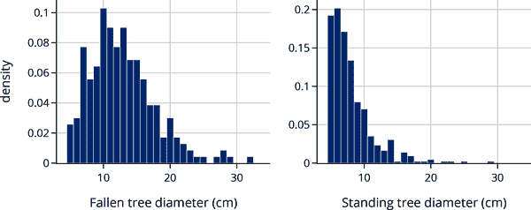

在暴风雨中倒下的树木直径分布以 12 厘米为中心，呈右偏态。相比之下，站立的树几乎都在 10 厘米以下，众数约为 6 厘米（研究中仅包括直径至少为 5 厘米的树木）。

还有一个要调查的特征是暴风雨的强度。我们将暴风雨强度与树木直径绘制成图，使用符号和标记颜色来区分站立的树木和倒下的树木。由于直径基本上是以厘米为单位测量的，所以许多树木具有相同的直径，因此我们通过为直径值添加一些噪声来减少过度绘制（参见第十一章）。我们还调整了标记颜色的不透明度，以显示图中的密集区域：

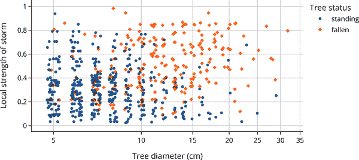

从这张图中可以看出，树木直径和暴风雨的强度与风倒有关：树木是被连根拔起还是留在原地。请注意，我们想要预测的风倒是一个名义变量。在下一节中，我们考虑了这如何影响预测问题。

# 建模和分类

我们希望创建一个解释树木易受风倒的模型。换句话说，我们需要为两级名义特征构建模型：倒下或站立。当响应变量是名义的时，这个建模任务称为*分类*。在这种情况下只有两个级别，所以这个任务更具体地称为*二元分类*。

## 一个常数模型

让我们首先考虑最简单的模型：一个始终预测一类的常数模型。我们使用<math><mi>C</mi></math>来表示常数模型的预测。对于我们的风倒数据集，这个模型将为每个输入预测<math><mi>C</mi> <mo>=</mo> <mtext>站立</mtext></math>或<math><mi>C</mi> <mo>=</mo> <mtext>倒下</mtext></math>。

在分类中，我们想追踪我们的模型多频繁地预测了正确的类别。现在，我们只是使用正确预测的计数。这有时被称为*零一误差*，因为损失函数有两个可能的值之一：当进行错误的预测时为 1，进行正确的预测时为 0。对于给定的观察结果<math><msub><mi>y</mi> <mi>i</mi></msub></math>和预测<math><mi>C</mi></math>，我们可以将这个损失函数表示为：

<math display="block"><mtable columnalign="right" columnspacing="0em" displaystyle="true" rowspacing="3pt"><mtr><mtd><mtable displaystyle="true" rowspacing="3pt"><mtr><mtd><mrow><mi>ℓ</mi></mrow> <mo stretchy="false">(</mo> <mi>C</mi> <mo>,</mo> <mi>y</mi> <mo stretchy="false">)</mo> <mo>=</mo> <mrow><mo>{</mo> <mtable columnalign="left left" columnspacing="1em" rowspacing=".2em"><mtr><mtd><mn>0</mn></mtd> <mtd><mtext>when </mtext> <mi>C</mi> <mtext> matches </mtext> <mi>y</mi></mtd></mtr> <mtr><mtd><mn>1</mn></mtd> <mtd><mtext>when </mtext> <mi>C</mi> <mtext> is a mismatch for </mtext> <mi>y</mi></mtd></mtr></mtable></mrow></mtd></mtr></mtable></mtd></mtr></mtable></math>

当我们收集了数据<math><mrow><mi mathvariant="bold">y</mi></mrow> <mo>=</mo> <mo stretchy="false">[</mo> <msub><mi>y</mi> <mn>1</mn></msub> <mo>,</mo> <mo>…</mo> <mo>,</mo> <msub><mi>y</mi> <mi>n</mi></msub> <mo stretchy="false">]</mo></math>时，平均损失为：

<math display="block"><mtable columnalign="right" columnspacing="0em" displaystyle="true" rowspacing="3pt"><mtr><mtd><mtable columnalign="right left" columnspacing="0em" displaystyle="true" rowspacing="3pt"><mtr><mtd><mi>L</mi> <mo stretchy="false">(</mo> <mi>C</mi> <mo>,</mo> <mrow><mi mathvariant="bold">y</mi></mrow> <mo stretchy="false">)</mo></mtd> <mtd><mo>=</mo> <mfrac><mn>1</mn> <mi>n</mi></mfrac> <munderover><mo>∑</mo> <mrow><mi>i</mi> <mo>=</mo> <mn>1</mn></mrow> <mi>n</mi></munderover> <mrow><mi>ℓ</mi></mrow> <mo stretchy="false">(</mo> <mi>C</mi> <mo>,</mo> <mi>y</mi> <mo stretchy="false">)</mo></mtd></mtr> <mtr><mtd><mo>=</mo> <mfrac><mrow><mi mathvariant="normal">#</mi> <mtext> mismatches</mtext></mrow> <mi>n</mi></mfrac></mtd></mtr></mtable></mtd></mtr></mtable></math>

对于常数模型（见第四章），当<math><mi>C</mi></math>设置为最常见的类别时，模型可以最小化损失。

就黑云杉而言，我们有以下比例的站立和倒下的树木：

```py
`trees``[``'``status``'``]``.``value_counts``(``)` `/` `len``(``trees``)`

```

```py
status
standing    0.65
fallen      0.35
Name: count, dtype: float64

```

所以我们的预测是一棵树站立，而我们数据集的平均损失为<math><mn>0.35</mn></math>。

这就是说，这个预测并不特别有用或有见地。例如，在我们对树木数据集进行的 EDA 中，我们发现树木的大小与树木是否站立或倒下有关联。理想情况下，我们可以将这些信息纳入模型，但常数模型不允许我们这样做。让我们对如何将预测因子纳入我们的模型建立一些直觉。

## 检查尺寸和风倒之间的关系

我们想更仔细地研究树木尺寸与风倒的关系。为了方便起见，我们将名义风倒特征转换为 0-1 数字特征，其中 1 表示倒下的树木，0 表示站立的树木：

```py
`trees``[``'``status_0_1``'``]` `=` `(``trees``[``'``status``'``]` `==` `'``fallen``'``)``.``astype``(``int``)`
`trees`

```

|   | 直径 | 风暴 | 状态 | 状态 _0_1 |
| --- | --- | --- | --- | --- |
| **0** | 9.0 | 0.02 | 站立 | 0 |
| **1** | 11.0 | 0.03 | 站立 | 0 |
| **2** | 9.0 | 0.03 | 站立 | 0 |
| **...** | ... | ... | ... | ... |
| **656** | 9.0 | 0.94 | 倒下 | 1 |
| **657** | 17.0 | 0.94 | 倒下 | 1 |
| **658** | 8.0 | 0.98 | 倒下 | 1 |

```py
659 rows × 4 columns
```

这种表示在许多方面都是有用的。例如，`status_0_1` 的平均值是数据集中倒下的树木比例：

```py
`pr_fallen` `=` `np``.``mean``(``trees``[``'``status_0_1``'``]``)`
`print``(``f``"``Proportion of fallen black spruce:` `{``pr_fallen``:``0.2f``}``"``)`

```

```py
Proportion of fallen black spruce: 0.35

```

具备这种 0-1 特征，我们可以制作一张图来展示树木直径与风倒之间的关系。这类似于我们进行线性回归的过程，其中我们绘制结果变量与解释变量之间的散点图（参见 第十五章）。

在这里，我们将树木状态绘制为直径的函数，但是我们在状态中添加了一点随机噪声，以帮助我们查看每个直径处 0 和 1 值的密度。与之前一样，我们也会扰动直径值，并调整标记的不透明度以减少重叠绘制。我们还在倒下的树木比例处添加了一条水平线：

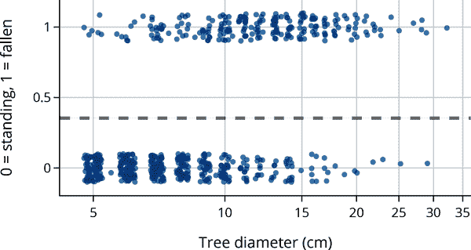

这个散点图显示较小的树更有可能直立，而较大的树更有可能倒下。请注意，树木的平均状态（0.35）基本上适合将一个恒定模型应用于响应变量。如果我们将树木直径视为一个解释特征，我们应该能够改进模型。

一个起点可能是计算不同直径树木的倒下比例。以下代码块将树木直径分成区间，并计算每个区间内倒下的树木比例：

```py
`splits` `=` `[``4``,` `5``,` `6``,` `7``,` `8``,` `9``,` `10``,` `12``,` `14``,` `17``,` `20``,` `25``,` `32``]`
`tree_bins` `=` `(`
    `trees``[``"``status_0_1``"``]`
    `.``groupby``(``pd``.``cut``(``trees``[``"``diameter``"``]``,` `splits``)``)`
    `.``agg``(``[``"``mean``"``,` `"``count``"``]``)`
    `.``rename``(``columns``=``{``"``mean``"``:` `"``proportion``"``}``)`
    `.``assign``(``diameter``=``lambda` `df``:` `[``i``.``right` `for` `i` `in` `df``.``index``]``)`
`)`

```

我们可以将这些比例绘制成树木直径的函数图：

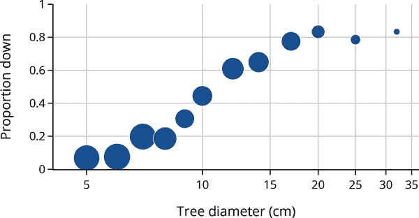

标记的大小反映了直径区间内树木的数量。我们可以利用这些比例来改进我们的模型。例如，对于直径为 6 厘米的树木，我们会将其分类为直立，而对于 20 厘米的树木，我们的分类则是倒下的。二元分类的一个自然起点是对观察到的比例进行建模，然后利用这些比例进行分类。接下来，我们为这些比例开发一个模型。

# 建模比例（和概率）

回顾一下，当我们建模时，我们需要选择三样东西：一个模型，一个损失函数，以及一种方法来最小化训练集上的平均损失。在前一节中，我们选择了一个恒定模型，0-1 损失，并进行了一些适合模型的证明。然而，这个恒定模型并没有包含预测变量。在本节中，我们通过引入一个称为*逻辑*模型的新模型来解决这个问题。

为了推动这些模型，注意到树木直径与倒下树木比例之间的关系似乎不是线性的。为了演示，让我们对这些数据拟合一个简单的线性模型，以显示它具有几个不良特征。使用 第十五章 中的技术，我们对树木状态与直径进行了线性模型的拟合：

```py
`from` `sklearn``.``linear_model` `import` `LinearRegression`
`X` `=` `trees``[``[``'``diameter``'``]``]`
`y` `=` `trees``[``'``status_0_1``'``]`

`lin_reg` `=` `LinearRegression``(``)``.``fit``(``X``,` `y``)`

```

然后，我们将这条拟合线添加到比例散点图中：

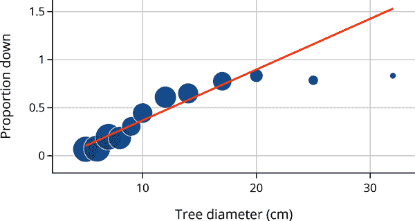

显然，模型对比例的拟合效果并不理想。存在几个问题：

+   模型对大树给出大于 1 的比例。

+   模型没有捕捉到比例中的曲线特征。

+   极端点（例如直径为 30 厘米的树木）将拟合线向右移动，远离大部分数据。

为了解决这些问题，我们引入了*逻辑模型*。

## 逻辑模型

逻辑模型是最广泛使用的基础分类模型之一，是线性模型的简单扩展。*逻辑函数*，通常称为*sigmoid 函数*，定义如下：

<math display="block"><mtext mathvariant="bold">logistic</mtext> <mo stretchy="false">(</mo> <mi>t</mi> <mo stretchy="false">)</mo> <mo>=</mo> <mfrac><mn>1</mn> <mrow><mn>1</mn> <mo>+</mo> <mi>exp</mi> <mo>⁡</mo> <mo stretchy="false">(</mo> <mo>−</mo> <mi>t</mi> <mo stretchy="false">)</mo></mrow></mfrac></math>

###### 警告

*Sigmoid*函数通常用<math><mi>σ</mi> <mo stretchy="false">(</mo> <mi>t</mi> <mo stretchy="false">)</mo></math>表示。不幸的是，希腊字母<math><mi>σ</mi></math>在数据科学和统计学中有多种含义，如标准差、逻辑函数和置换。看到<math><mi>σ</mi></math>时，必须根据上下文理解其含义。

我们可以绘制逻辑函数以显示其 S 形状，并确认其输出在 0 到 1 之间。函数随着<math><mi>t</mi></math>单调增加，<math><mi>t</mi></math>的大值接近 1：

```py
`def` `logistic``(``t``)``:`
    `return` `1.` `/` `(``1.` `+` `np``.``exp``(``-``t``)``)`

```

由于逻辑函数映射到 0 到 1 之间的区间，通常用于建模比例和概率。此外，我们可以将逻辑写成线性函数的形式，如<math><msub><mi>θ</mi> <mn>0</mn></msub> <mo>+</mo> <msub><mi>θ</mi> <mn>1</mn></msub> <mi>x</mi></math>：

<math display="block"><mi>σ</mi> <mrow><mo>(</mo> <msub><mi>θ</mi> <mn>0</mn></msub> <mo>+</mo> <msub><mi>θ</mi> <mn>1</mn></msub> <mi>x</mi> <mo>)</mo></mrow> <mo>=</mo> <mfrac><mn>1</mn> <mrow><mn>1</mn> <mo>+</mo> <mi>exp</mi> <mo>⁡</mo> <mo stretchy="false">(</mo> <mo>−</mo> <msub><mi>θ</mi> <mn>0</mn></msub> <mo>−</mo> <msub><mi>θ</mi> <mn>1</mn></msub> <mi>x</mi> <mo stretchy="false">)</mo></mrow></mfrac></math>

为了帮助你直观地理解该函数的形状，下图显示了我们变化<math><msub><mi>θ</mi> <mn>0</mn></msub></math>和<math><msub><mi>θ</mi> <mn>1</mn></msub></math>时的逻辑函数。

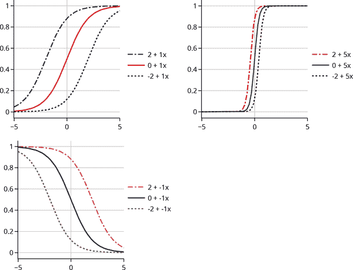

我们可以看到改变<math><msub><mrow><mi>θ</mi></mrow> <mn>1</mn></msub></math>的大小会改变曲线的陡峭程度；离 0 越远，曲线越陡。改变<math><msub><mrow><mi>θ</mi></mrow> <mn>1</mn></msub></math>的符号将曲线反映在竖直线<math><mi>x</mi> <mo>=</mo> <mn>0</mn></math>周围。改变<math><msub><mi>θ</mi> <mn>0</mn></msub></math>会使曲线左右移动。

逻辑函数可以看作是一种转换：将线性函数转换为非线性平滑曲线，其输出始终位于 0 到 1 之间。实际上，逻辑函数的输出具有更深层次的概率解释，接下来我们将描述它。

## 对数几率

记住，赔率是概率<math><mi>p</mi></math>的比率<math><mi>p</mi> <mrow><mo>/</mo></mrow> <mo stretchy="false">(</mo> <mn>1</mn> <mo>−</mo> <mi>p</mi> <mo stretchy="false">)</mo></math>。例如，投掷一个公平硬币时，得到正面的赔率是 1；对于一个比尾部更有可能出现两倍的硬币（<math><mi>p</mi> <mo>=</mo> <mn>2</mn> <mrow><mo>/</mo></mrow> <mn>3</mn></math>），得到正面的赔率是 2。逻辑模型也称为*对数几率*模型，因为逻辑函数与对数几率的线性函数重合。

我们可以在以下方程中看到这一点。为了展示这一点，我们将 Sigmoid 函数的分子和分母分别乘以 <math><mi>exp</mi> <mo>⁡</mo> <mo stretchy="false">(</mo> <mi>t</mi> <mo stretchy="false">)</mo></math>：

<math display="block"><mtable columnalign="right" columnspacing="0em" displaystyle="true" rowspacing="3pt"><mtr><mtd><mtable columnalign="right left" columnspacing="0em" displaystyle="true" rowspacing="3pt"><mtr><mtd><mi>σ</mi> <mo stretchy="false">(</mo> <mi>t</mi> <mo stretchy="false">)</mo></mtd> <mtd><mo>=</mo> <mfrac><mn>1</mn> <mrow><mn>1</mn> <mo>+</mo> <mi>exp</mi> <mo>⁡</mo> <mo stretchy="false">(</mo> <mo>−</mo> <mi>t</mi> <mo stretchy="false">)</mo></mrow></mfrac> <mo>=</mo> <mfrac><mrow><mi>exp</mi> <mo>⁡</mo> <mo stretchy="false">(</mo> <mi>t</mi> <mo stretchy="false">)</mo></mrow> <mrow><mn>1</mn> <mo>+</mo> <mi>exp</mi> <mo>⁡</mo> <mo stretchy="false">(</mo> <mi>t</mi> <mo stretchy="false">)</mo></mrow></mfrac></mtd></mtr> <mtr><mtd><mo stretchy="false">(</mo> <mn>1</mn> <mo>−</mo> <mi>σ</mi> <mo stretchy="false">(</mo> <mi>t</mi> <mo stretchy="false">)</mo> <mo stretchy="false">)</mo></mtd> <mtd><mo>=</mo> <mn>1</mn> <mo>−</mo> <mfrac><mrow><mi>exp</mi> <mo>⁡</mo> <mo stretchy="false">(</mo> <mi>t</mi> <mo stretchy="false">)</mo></mrow> <mrow><mn>1</mn> <mo>+</mo> <mi>exp</mi> <mo>⁡</mo> <mo stretchy="false">(</mo> <mi>t</mi> <mo stretchy="false">)</mo></mrow></mfrac> <mo>=</mo> <mfrac><mn>1</mn> <mrow><mn>1</mn> <mo>+</mo> <mi>exp</mi> <mo>⁡</mo> <mo stretchy="false">(</mo> <mi>t</mi> <mo stretchy="false">)</mo></mrow></mfrac></mtd></mtr></mtable></mtd></mtr></mtable></math>

然后我们取对数几率并简化：

<math display="block"><mtable columnalign="right" columnspacing="0em" displaystyle="true" rowspacing="3pt"><mtr><mtd><mtable columnalign="right left" columnspacing="0em" displaystyle="true" rowspacing="3pt"><mtr><mtd><mi>log</mi> <mo>⁡</mo> <mrow><mo>(</mo> <mfrac><mrow><mi>σ</mi> <mo stretchy="false">(</mo> <mi>t</mi> <mo stretchy="false">)</mo></mrow> <mrow><mn>1</mn> <mo>−</mo> <mi>σ</mi> <mo stretchy="false">(</mo> <mi>t</mi> <mo stretchy="false">)</mo></mrow></mfrac> <mo>)</mo></mrow></mtd> <mtd><mo>=</mo> <mi>log</mi> <mo>⁡</mo> <mo stretchy="false">(</mo> <mi>exp</mi> <mo>⁡</mo> <mrow><mo stretchy="false">(</mo> <mi>t</mi> <mo stretchy="false">)</mo></mrow> <mo stretchy="false">)</mo> <mo>=</mo> <mi>t</mi></mtd></mtr></mtable></mtd></mtr></mtable></math>

因此，对于 <math><mi>σ</mi> <mo stretchy="false">(</mo> <msub><mi>θ</mi> <mn>0</mn></msub> <mo>+</mo> <msub><mi>θ</mi> <mn>1</mn></msub> <mi>x</mi> <mo stretchy="false">)</mo></math> ，我们发现对数几率是 <math><mi>x</mi></math> 的线性函数：

<math display="block"><mtable columnalign="right" columnspacing="0em" displaystyle="true" rowspacing="3pt"><mtr><mtd><mtable columnalign="right left" columnspacing="0em" displaystyle="true" rowspacing="3pt"><mtr><mtd><mi>log</mi> <mo>⁡</mo> <mrow><mo>(</mo> <mfrac><mrow><mi>σ</mi> <mo stretchy="false">(</mo> <msub><mi>θ</mi> <mn>0</mn></msub> <mo>+</mo> <msub><mi>θ</mi> <mn>1</mn></msub> <mi>x</mi> <mo stretchy="false">)</mo></mrow> <mrow><mn>1</mn> <mo>−</mo> <mi>σ</mi> <mo stretchy="false">(</mo> <msub><mi>θ</mi> <mn>0</mn></msub> <mo>+</mo> <msub><mi>θ</mi> <mn>1</mn></msub> <mi>x</mi> <mo stretchy="false">)</mo></mrow></mfrac> <mo>)</mo></mrow></mtd> <mtd><mo>=</mo> <mi>log</mi> <mo>⁡</mo> <mo stretchy="false">(</mo> <mi>exp</mi> <mo>⁡</mo> <mrow><mo stretchy="false">(</mo> <msub><mi>θ</mi> <mn>0</mn></msub> <mo>+</mo> <msub><mi>θ</mi> <mn>1</mn></msub> <mi>x</mi> <mo stretchy="false">)</mo></mrow> <mo stretchy="false">)</mo> <mo>=</mo> <msub><mi>θ</mi> <mn>0</mn></msub> <mo>+</mo> <msub><mi>θ</mi> <mn>1</mn></msub> <mi>x</mi></mtd></mtr></mtable></mtd></mtr></mtable></math>

以对数几率的形式表示 logistic 对于系数 <math><msub><mi>θ</mi> <mn>1</mn></msub></math> 给出了一个有用的解释。假设解释变量增加 1，则几率的变化如下：

<math display="block"><mtable columnalign="right" columnspacing="0em" displaystyle="true" rowspacing="3pt"><mtr><mtd><mtable columnalign="right left" columnspacing="0em" displaystyle="true" rowspacing="3pt"><mtr><mtd><mtext> odds </mtext> <mo>=</mo></mtd> <mtd><mi>exp</mi> <mo>⁡</mo> <mrow><mo>(</mo> <msub><mi>θ</mi> <mn>0</mn></msub> <mo>+</mo> <msub><mi>θ</mi> <mn>1</mn></msub> <mo stretchy="false">(</mo> <mi>x</mi> <mo>+</mo> <mn>1</mn> <mo stretchy="false">)</mo> <mo>)</mo></mrow></mtd></mtr> <mtr><mtd><mo>=</mo></mtd> <mtd> <mi>exp</mi> <mo>⁡</mo> <mo stretchy="false">(</mo> <msub><mi>θ</mi> <mn>1</mn></msub> <mo stretchy="false">)</mo> <mo>×</mo> <mi>exp</mi> <mo>⁡</mo> <mrow><mo stretchy="false">(</mo> <msub><mi>θ</mi> <mn>0</mn></msub> <mo>+</mo> <msub><mi>θ</mi> <mn>1</mn></msub> <mi>x</mi> <mo stretchy="false">)</mo></mrow></mtd></mtr></mtable></mtd></mtr></mtable></math>

我们看到几率增加或减少了 <math><mi>exp</mi> <mo>⁡</mo> <mo stretchy="false">(</mo> <msub><mi>θ</mi> <mn>1</mn></msub> <mo stretchy="false">)</mo></math> 倍。

###### 注意

这里，<math><mi>log</mi></math> 函数是自然对数。由于自然对数在数据科学中是默认的，因此我们通常不必写成 <math><mi>ln</mi></math>。

接下来，让我们在我们的比例图中添加一个 logistic 曲线，以了解它对数据的拟合效果。

## 使用 Logistic 曲线

在下面的图中，我们在倒下的树木比例的图上添加了一个 logistic 曲线：

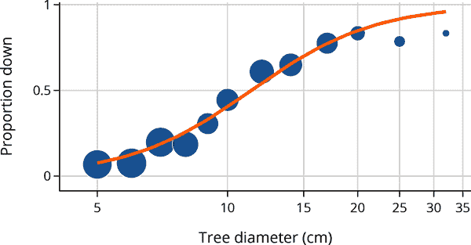

我们可以看到曲线相对比例很好。事实上，我们选择了这个特定的 logistic 通过将其拟合到数据。拟合的 logistic 回归是：

```py
σ(-7.4 + 3.0x)

```

现在我们已经看到 logistic 曲线可以很好地建模概率，我们转向将 logistic 曲线拟合到数据的过程。在下一节中，我们继续我们建模的第二步：选择一个合适的损失函数。

# Logistic 模型的损失函数

Logistic 模型给我们提供了概率（或经验比例），因此我们将损失函数写成 <math><mi>ℓ</mi> <mo stretchy="false">(</mo> <mi>p</mi> <mo>,</mo> <mi>y</mi> <mo stretchy="false">)</mo></math> ，其中 <math><mi>p</mi></math> 在 0 和 1 之间。响应采用两个值之一，因为我们的输出特征是二元分类。因此，任何损失函数都可以简化为：

<math display="block"><mtable columnalign="right" columnspacing="0em" displaystyle="true" rowspacing="3pt"><mtr><mtd><mtable displaystyle="true" rowspacing="3pt"><mtr><mtd><mrow><mi>ℓ</mi></mrow> <mo stretchy="false">(</mo> <mi>p</mi> <mo>,</mo> <mi>y</mi> <mo stretchy="false">)</mo> <mo>=</mo> <mrow><mo>{</mo> <mtable columnalign="left left" columnspacing="1em" rowspacing=".2em"><mtr><mtd><mi>ℓ</mi> <mo stretchy="false">(</mo> <mi>p</mi> <mo>,</mo> <mn>0</mn> <mo stretchy="false">)</mo></mtd> <mtd><mrow><mtext>if </mtext> <mrow><mi>y</mi></mrow> <mtext> is 0</mtext></mrow></mtd></mtr> <mtr><mtd><mi>ℓ</mi> <mo stretchy="false">(</mo> <mi>p</mi> <mo>,</mo> <mn>1</mn> <mo stretchy="false">)</mo></mtd> <mtd><mrow><mtext>if </mtext> <mrow><mi>y</mi></mrow> <mtext> is 1</mtext></mrow></mtd></mtr></mtable></mrow></mtd></mtr></mtable></mtd></mtr></mtable></math>

再次使用 0 和 1 来表示类别具有优势，因为我们可以方便地写出损失函数为：

<math display="block"><mi>ℓ</mi> <mo stretchy="false">(</mo> <mi>p</mi> <mo>,</mo> <mi>y</mi> <mo stretchy="false">)</mo> <mo>=</mo>  <mi>y</mi> <mi>ℓ</mi> <mo stretchy="false">(</mo> <mi>p</mi> <mo>,</mo> <mi>y</mi> <mo stretchy="false">)</mo> <mo>+</mo> <mo stretchy="false">(</mo> <mn>1</mn> <mo>−</mo> <mi>y</mi> <mo stretchy="false">)</mo> <mi>ℓ</mi> <mo stretchy="false">(</mo> <mi>p</mi> <mo>,</mo> <mn>1</mn> <mo>−</mo> <mi>y</mi> <mo stretchy="false">)</mo></math>

我们鼓励你通过考虑 <math><mi>y</mi> <mo>=</mo> <mn>1</mn></math> 和 <math><mi>y</mi> <mo>=</mo> <mn>0</mn></math> 两种情况来确认这种等价性。

Logistic 模型与*对数损失*配合得很好：

<math display="block"><mtable columnalign="right" columnspacing="0em" displaystyle="true" rowspacing="3pt"><mtr><mtd><mtable columnalign="right left" columnspacing="0em" displaystyle="true" rowspacing="3pt"><mtr><mtd><mrow><mi>ℓ</mi></mrow> <mo stretchy="false">(</mo> <mi>p</mi> <mo>,</mo> <mi>y</mi> <mo stretchy="false">)</mo> <mo>=</mo></mtd> <mtd><mrow><mo>{</mo> <mtable columnalign="left left" columnspacing="1em" rowspacing=".2em"><mtr><mtd><mo>−</mo> <mi>log</mi> <mo>⁡</mo> <mo stretchy="false">(</mo> <mi>p</mi> <mo stretchy="false">)</mo></mtd> <mtd><mrow><mtext>if </mtext> <mrow><mi>y</mi></mrow> <mtext> is 1</mtext></mrow></mtd></mtr> <mtr><mtd><mo>−</mo> <mi>log</mi> <mo>⁡</mo> <mo stretchy="false">(</mo> <mn>1</mn> <mo>−</mo> <mi>p</mi> <mo stretchy="false">)</mo></mtd> <mtd><mrow><mtext>if </mtext> <mrow><mi>y</mi></mrow> <mtext> is 0</mtext></mrow></mtd></mtr></mtable></mrow></mtd></mtr> <mtr><mtd><mo>=</mo></mtd> <mtd><mo>−</mo> <mi>y</mi> <mi>log</mi> <mo>⁡</mo> <mo stretchy="false">(</mo> <mi>p</mi> <mo stretchy="false">)</mo> <mo>−</mo> <mo stretchy="false">(</mo> <mn>1</mn> <mo>−</mo> <mi>y</mi> <mo stretchy="false">)</mo> <mi>log</mi> <mo>⁡</mo> <mo stretchy="false">(</mo> <mn>1</mn> <mo>−</mo> <mi>p</mi> <mo stretchy="false">)</mo></mtd></mtr></mtable></mtd></mtr></mtable></math>

注意 log 损失在 0 和 1 处未定义，因为<math><mo>−</mo> <mi>log</mi> <mo>⁡</mo> <mo stretchy="false">(</mo> <mi>p</mi> <mo stretchy="false">)</mo></math>当<math><mi>p</mi></math>趋向 0 时趋近于<math><mi mathvariant="normal">∞</mi></math>，类似地，<math><mo>−</mo> <mi>log</mi> <mo>⁡</mo> <mo stretchy="false">(</mo> <mn>1</mn> <mo>−</mo> <mi>p</mi> <mo stretchy="false">)</mo></math>当<math><mi>p</mi></math>趋向 1 时也如此。我们在最小化过程中需要小心避免这些端点。下图显示了这两种损失函数的情况：

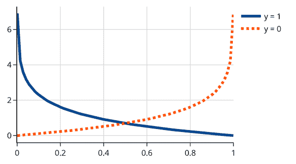

当<math><mi>y</mi></math>为 1（实线）时，在<math><mi>p</mi></math>接近 1 时损失较小，当<math><mi>y</mi></math>为 0（虚线）时，在<math><mi>p</mi></math>接近 0 时损失较小。

如果我们的目标是使用 log 损失对数据拟合一个常数，那么平均损失为：

<math display="block"><mtable columnalign="right" columnspacing="0em" displaystyle="true" rowspacing="3pt"><mtr><mtd><mtable columnalign="right left" columnspacing="0em" displaystyle="true" rowspacing="3pt"><mtr><mtd><mi>L</mi> <mo stretchy="false">(</mo> <mi>p</mi> <mo>,</mo> <mtext mathvariant="bold">y</mtext> <mo stretchy="false">)</mo> <mo>=</mo></mtd> <mtd><mfrac><mn>1</mn> <mi>n</mi></mfrac> <munder><mo>∑</mo> <mi>i</mi></munder> <mo stretchy="false">[</mo> <mo>−</mo> <msub><mi>y</mi> <mi>i</mi></msub> <mi>log</mi> <mo>⁡</mo> <mo stretchy="false">(</mo> <mi>p</mi> <mo stretchy="false">)</mo> <mo>−</mo> <mo stretchy="false">(</mo> <mn>1</mn> <mo>−</mo> <msub><mi>y</mi> <mi>i</mi></msub> <mo stretchy="false">)</mo> <mi>log</mi> <mo>⁡</mo> <mo stretchy="false">(</mo> <mn>1</mn> <mo>−</mo> <mi>p</mi> <mo stretchy="false">)</mo> <mo stretchy="false">]</mo></mtd></mtr> <mtr><mtd><mo>=</mo></mtd> <mtd><mo>−</mo> <mfrac><msub><mi>n</mi> <mn>1</mn></msub> <mi>n</mi></mfrac> <mi>log</mi> <mo>⁡</mo> <mo stretchy="false">(</mo> <mi>p</mi> <mo stretchy="false">)</mo> <mo>−</mo> <mfrac><msub><mi>n</mi> <mn>0</mn></msub> <mi>n</mi></mfrac> <mi>log</mi> <mo>⁡</mo> <mo stretchy="false">(</mo> <mn>1</mn> <mo>−</mo> <mi>p</mi> <mo stretchy="false">)</mo> <mo stretchy="false">)</mo></mtd></mtr></mtable></mtd></mtr></mtable></math>

这里<math><msub><mi>n</mi> <mn>0</mn></msub></math>和<math><msub><mi>n</mi> <mn>1</mn></msub></math>分别是值为 0 和 1 的<math><msub><mi>y</mi> <mi>i</mi></msub></math>的数量。我们可以对<math><mi>p</mi></math>进行微分以找到最小值点。

<math display="block"><mfrac><mrow><mi>∂</mi> <mi>L</mi> <mo stretchy="false">(</mo> <mi>p</mi> <mo>,</mo> <mtext mathvariant="bold">y</mtext> <mo stretchy="false">)</mo></mrow> <mrow><mi>∂</mi> <mi>p</mi></mrow></mfrac> <mo>=</mo> <mo>−</mo> <mfrac><msub><mi>n</mi> <mn>1</mn></msub> <mrow><mi>n</mi> <mi>p</mi></mrow></mfrac> <mo>+</mo> <mfrac><msub><mi>n</mi> <mn>0</mn></msub> <mrow><mi>n</mi> <mo stretchy="false">(</mo> <mn>1</mn> <mo>−</mo> <mi>p</mi> <mo stretchy="false">)</mo></mrow></mfrac></math>

然后我们将导数设置为 0 并解出最小化值<math><mrow><mover><mi>p</mi> <mo stretchy="false">^</mo></mover></mrow></math>：

<math display="block"><mtable columnalign="right" columnspacing="0em" displaystyle="true" rowspacing="3pt"><mtr><mtd><mtable columnalign="right left" columnspacing="0em" displaystyle="true" rowspacing="3pt"><mtr><mtd><mn>0</mn></mtd> <mtd><mo>=</mo> <mo>−</mo> <mfrac><msub><mi>n</mi> <mn>1</mn></msub> <mrow><mi>n</mi> <mrow><mrow><mover><mi>p</mi> <mo stretchy="false">^</mo></mover></mrow></mrow></mrow></mfrac> <mo>+</mo> <mfrac><msub><mi>n</mi> <mn>0</mn></msub> <mrow><mi>n</mi> <mo stretchy="false">(</mo> <mn>1</mn> <mo>−</mo> <mrow><mrow><mover><mi>p</mi> <mo stretchy="false">^</mo></mover></mrow></mrow> <mo stretchy="false">)</mo></mrow></mfrac></mtd></mtr> <mtr><mtd><mn>0</mn></mtd> <mtd><mo>=</mo> <mo>−</mo> <mrow><mover><mi>p</mi> <mo stretchy="false">^</mo></mover></mrow> <mo stretchy="false">(</mo> <mn>1</mn> <mo>−</mo> <mrow><mover><mi>p</mi> <mo stretchy="false">^</mo></mover></mrow> <mo stretchy="false">)</mo> <mfrac><msub><mi>n</mi> <mn>1</mn></msub> <mrow><mover><mi>p</mi> <mo stretchy="false">^</mo></mover></mrow></mfrac> <mo>+</mo> <mrow><mover><mi>p</mi> <mo stretchy="false">^</mo></mover></mrow> <mo stretchy="false">(</mo> <mn>1</mn> <mo>−</mo> <mrow><mover><mi>p</mi> <mo stretchy="false">^</mo></mover></mrow> <mo stretchy="false">)</mo> <mfrac><msub><mi>n</mi> <mn>0</mn></msub> <mrow><mo stretchy="false">(</mo> <mn>1</mn> <mo>−</mo> <mrow><mrow><mover><mi>p</mi> <mo stretchy="false">^</mo></mover></mrow></mrow> <mo stretchy="false">)</mo></mrow></mfrac></mtd></mtr> <mtr><mtd><mrow><msub><mi>n</mi> <mn>1</mn></msub></mrow> <mo stretchy="false">(</mo> <mn>1</mn> <mo>−</mo> <mrow><mover><mi>p</mi> <mo stretchy="false">^</mo></mover></mrow> <mo stretchy="false">)</mo></mtd> <mtd><mo>=</mo> <mrow><msub><mi>n</mi> <mn>0</mn></msub></mrow> <mrow><mover><mi>p</mi> <mo stretchy="false">^</mo></mover></mrow></mtd></mtr> <mtr><mtd><mrow><mover><mi>p</mi> <mo stretchy="false">^</mo></mover></mrow></mtd> <mtd><mo>=</mo> <mfrac><msub><mi>n</mi> <mn>1</mn></msub> <mi>n</mi></mfrac></mtd></mtr></mtable></mtd></mtr></mtable></math>

（最终的方程来自于注意到<math><msub><mi>n</mi> <mn>0</mn></msub> <mo>+</mo> <msub><mi>n</mi> <mn>1</mn></msub> <mo>=</mo> <mi>n</mi></math>。）

要基于逻辑函数拟合更复杂的模型，我们可以将<math><mi>σ</mi> <mo stretchy="false">(</mo> <msub><mi>θ</mi> <mn>0</mn></msub> <mo>+</mo> <msub><mi>θ</mi> <mn>1</mn></msub> <mi>x</mi> <mo stretchy="false">)</mo></math>代入<math><mi>p</mi></math>。逻辑模型的损失变为：

<math display="block"><mtable columnalign="right" columnspacing="0em" displaystyle="true" rowspacing="3pt"><mtr><mtd><mtable columnalign="right left" columnspacing="0em" displaystyle="true" rowspacing="3pt"><mtr><mtd><mrow><mi>ℓ</mi></mrow> <mo stretchy="false">(</mo> <mi>σ</mi> <mo stretchy="false">(</mo> <msub><mi>θ</mi> <mn>0</mn></msub> <mo>+</mo> <msub><mi>θ</mi> <mn>1</mn></msub> <mi>x</mi> <mo stretchy="false">)</mo> <mo>,</mo> <mi>y</mi> <mo stretchy="false">)</mo></mtd> <mtd><mo>=</mo>  <mi>y</mi> <mi>ℓ</mi> <mo stretchy="false">(</mo> <mi>σ</mi> <mo stretchy="false">(</mo> <msub><mi>θ</mi> <mn>0</mn></msub> <mo>+</mo> <msub><mi>θ</mi> <mn>1</mn></msub> <mi>x</mi> <mo stretchy="false">)</mo> <mo>,</mo> <mi>y</mi> <mo stretchy="false">)</mo> <mo>+</mo> <mo stretchy="false">(</mo> <mn>1</mn> <mo>−</mo> <mi>y</mi> <mo stretchy="false">)</mo> <mi>ℓ</mi> <mo stretchy="false">(</mo> <mi>σ</mi> <mo stretchy="false">(</mo> <msub><mi>θ</mi> <mn>0</mn></msub> <mo>+</mo> <msub><mi>θ</mi> <mn>1</mn></msub> <mi>x</mi> <mo stretchy="false">)</mo> <mo>,</mo> <mn>1</mn> <mo>−</mo> <mi>y</mi> <mo stretchy="false">)</mo></mtd></mtr> <mtr><mtd><mo>=</mo> <mi>y</mi> <mi>log</mi> <mo>⁡</mo> <mo stretchy="false">(</mo> <mi>σ</mi> <mo stretchy="false">(</mo> <msub><mi>θ</mi> <mn>0</mn></msub> <mo>+</mo> <msub><mi>θ</mi> <mn>1</mn></msub> <mi>x</mi> <mo stretchy="false">)</mo> <mo stretchy="false">)</mo> <mo>+</mo> <mo stretchy="false">(</mo> <mn>1</mn> <mo>−</mo> <mi>y</mi> <mo stretchy="false">)</mo> <mi>log</mi> <mo>⁡</mo> <mo stretchy="false">(</mo> <mi>σ</mi> <mo stretchy="false">(</mo> <msub><mi>θ</mi> <mn>0</mn></msub> <mo>+</mo> <msub><mi>θ</mi> <mn>1</mn></msub> <mi>x</mi> <mo stretchy="false">)</mo> <mo stretchy="false">)</mo></mtd></mtr></mtable></mtd></mtr></mtable></math>

对数据的损失进行平均，我们得到：

<math display="block"><mtable columnalign="right" columnspacing="0em" displaystyle="true" rowspacing="3pt"><mtr><mtd><mtable columnalign="right left" columnspacing="0em" displaystyle="true" rowspacing="3pt"><mtr><mtd><mi>L</mi> <mo stretchy="false">(</mo> <msub><mi>θ</mi> <mn>0</mn></msub> <mo>,</mo> <msub><mi>θ</mi> <mn>1</mn></msub> <mo>,</mo> <mtext mathvariant="bold">x</mtext> <mo>,</mo> <mtext mathvariant="bold">y</mtext> <mo stretchy="false">)</mo> <mo>=</mo> <mfrac><mn>1</mn> <mi>n</mi></mfrac> <munder><mo>∑</mo> <mi>i</mi></munder></mtd> <mtd><mo>−</mo> <msub><mi>y</mi> <mi>i</mi></msub> <mi>log</mi> <mo>⁡</mo> <mo stretchy="false">(</mo> <mi>σ</mi> <mo stretchy="false">(</mo> <msub><mi>θ</mi> <mn>0</mn></msub> <mo>+</mo> <msub><mi>θ</mi> <mn>1</mn></msub> <msub><mi>x</mi> <mi>i</mi></msub> <mo stretchy="false">)</mo> <mo stretchy="false">)</mo></mtd></mtr> <mtr><mtd><mo>−</mo> <mo stretchy="false">(</mo> <mn>1</mn> <mo>−</mo> <msub><mi>y</mi> <mi>i</mi></msub> <mo stretchy="false">)</mo> <mi>log</mi> <mo>⁡</mo> <mo stretchy="false">(</mo> <mn>1</mn> <mo>−</mo> <mi>σ</mi> <mo stretchy="false">(</mo> <msub><mi>θ</mi> <mn>0</mn></msub> <mo>+</mo> <msub><mi>θ</mi> <mn>1</mn></msub> <msub><mi>x</mi> <mi>i</mi></msub> <mo stretchy="false">)</mo> <mo stretchy="false">)</mo></mtd></mtr></mtable></mtd></mtr></mtable></math>

与平方损失不同，此损失函数没有封闭形式的解。我们使用像梯度下降这样的迭代方法（见第二十章）来最小化平均损失。这也是我们不在逻辑模型中使用平方误差损失的原因之一——平均平方误差是非凸的，这使得优化变得困难。凸性的概念在第二十章有更详细的讨论，图 20-4 提供了直观的图示。

###### 注意

log 损失也称为*逻辑损失*和*交叉熵损失*。它的另一个名称是*负对数似然*。这个名称指的是使用似然性来拟合模型的技术，即我们的数据来自于某个概率分布的似然性。在这里我们不深入探讨这些替代方法的背景。

拟合逻辑模型（使用 log 损失）被称为*逻辑回归*。逻辑回归是广义线性模型的一个示例，它是带有非线性变换的线性模型。

我们可以使用 `scikit-learn` 来拟合逻辑模型。包的设计者使 API 与最小二乘法拟合线性模型非常相似（见第十五章）。首先，我们导入逻辑回归模块：

```py
`from` `sklearn``.``linear_model` `import` `LogisticRegression`

```

然后，我们用结果 `y`，即树的状态，和协变量 `X`，即直径（我们已对其进行了对数变换），设置回归问题：

```py
`trees``[``'``log_diam``'``]` `=` `np``.``log``(``trees``[``'``diameter``'``]``)` 
`X` `=` `trees``[``[``'``log_diam``'``]``]`
`y` `=` `trees``[``'``status_0_1``'``]`

```

然后，我们拟合逻辑回归，并检查直径的截距和系数：

```py
`lr_model` `=` `LogisticRegression``(``)`
`lr_model``.``fit``(``X``,` `y``)`

`[``intercept``]` `=` `lr_model``.``intercept_`
`[``[``coef``]``]` `=` `lr_model``.``coef_`
`print``(``f``'``Intercept:` `{``intercept``:``.1f``}``'``)`
`print``(``f``'``Diameter coefficient:` `{``coef``:``.1f``}``'``)`

```

```py
Intercept:           -7.4
Diameter coefficient: 3.0

```

在进行预测时，`predict` 函数返回预测的（最可能的）类别，而 `predict_proba` 返回预测的概率。对于直径为 6 的树，我们预计预测为 0（即 `站立` ）的概率很高。我们来检查一下：

```py
`diameter6` `=` `pd``.``DataFrame``(``{``'``log_diam``'``:` `[``np``.``log``(``6``)``]``}``)`
`[``pred_prof``]` `=` `lr_model``.``predict_proba``(``diameter6``)`
`print``(``f``'``Predicted probabilities:` `{``pred_prof``}``'``)`

```

```py
Predicted probabilities: [0.87 0.13]

```

因此，模型预测直径为 6 的树以 `站立` 类别有 0.87 的概率，以 `倒下` 类别有 0.13 的概率。

现在我们已经用一个特征拟合了一个模型，我们可能想要看看是否包含另一个特征，比如风暴的强度，是否可以改善模型。为此，我们可以通过将一个特征添加到 `X` 中，并再次拟合模型来拟合多元逻辑回归。

请注意，逻辑回归拟合一个模型来预测概率——模型预测直径为 6 的树以 `站立` 类别有 0.87 的概率，以 `倒下` 类别有 0.13 的概率。由于概率可以是介于 0 和 1 之间的任何数，我们需要将概率转换回类别以执行分类。我们将在下一节中解决这个分类问题。

# 从概率到分类

我们在本章开始时介绍了一个二元分类问题，我们想要建模一个名义响应变量。到目前为止，我们已经使用逻辑回归来建模比例或概率，现在我们准备返回原始问题：我们使用预测的概率来分类记录。对于我们的例子，这意味着对于特定直径的树，我们使用逻辑回归中拟合的系数来估计其倒下的可能性。如果可能性很高，我们将树分类为倒下；否则，我们将其分类为站立。但是我们需要选择一个阈值来制定这个 *决策规则*。

`sklearn` 的逻辑回归模型的 `predict` 函数实现了基本的决策规则：如果预测的概率 <math><mi>p</mi> <mo>></mo> <mn>0.5</mn></math> ，则预测 `1` 。否则，预测 `0` 。我们将这个决策规则以虚线叠加在模型预测之上：

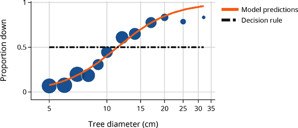

在本节中，我们考虑一个更一般的决策规则。对于某些选择的 <math><mi>τ</mi></math> ，如果模型预测的概率 <math><mi>p</mi> <mo>></mo> <mi>τ</mi></math> ，则预测 `1` ，否则预测 `0` 。默认情况下，`sklearn` 设置 <math><mi>τ</mi> <mo>=</mo> <mn>0.5</mn></math> 。让我们探讨当 <math><mi>τ</mi></math> 被设置为其他值时会发生什么。

选择适当的<math><mi>τ</mi></math>值取决于我们的目标。假设我们希望最大化准确率。分类器的*准确率*是正确预测的分数。我们可以计算不同阈值下的准确率，即不同的<math><mi>τ</mi></math>值：

```py
`def` `threshold_predict``(``model``,` `X``,` `threshold``)``:`
    `return` `np``.``where``(``model``.``predict_proba``(``X``)``[``:``,` `1``]` `>` `threshold``,` `1.0``,` `0.0``)`

`def` `accuracy``(``threshold``,` `X``,` `y``)``:`
    `return` `np``.``mean``(``threshold_predict``(``lr_model``,` `X``,` `threshold``)` `==` `y``)`

`thresholds` `=` `np``.``linspace``(``0``,` `1``,` `200``)`
`accs` `=` `[``accuracy``(``t``,` `X``,` `y``)` `for` `t` `in` `thresholds``]`

```

要理解准确率如何随<math><mi>τ</mi></math>变化而变化，我们制作了一个图表：

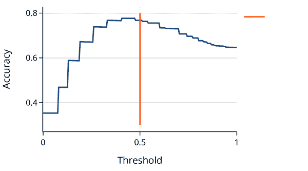

注意，具有最高准确率的阈值并不完全在 0.5 处。在实践中，我们应该使用交叉验证来选择阈值（参见第十六章）。

最大化准确率的阈值可能不是 0.5，这有许多原因，但一个常见的原因是*类别不平衡*，其中一个类别比另一个类别频繁。类别不平衡可能导致模型将记录分类为更常见的类别。在极端情况下（如欺诈检测），当数据中只有很小一部分包含特定类别时，我们的模型可以通过始终预测频繁类别而不学习如何生成适合稀有类别的好分类器来实现高准确率。有一些管理类别不平衡的技术，例如：

+   对数据进行重新采样以减少或消除类别不平衡

+   调整损失函数以对较小类别施加更大的惩罚

在我们的示例中，类别不平衡并不那么严重，因此我们继续进行而不进行这些调整。

类别不平衡问题解释了为什么单靠准确率通常不是我们评判模型的方式。相反，我们希望区分不同类型的正确和错误分类。我们接下来描述这些内容。

## 混淆矩阵

在二元分类中可视化错误的一个方便方法是查看混淆矩阵。混淆矩阵比较模型预测与实际结果。在这种情况下存在两种类型的错误：

*假阳性*

当实际类别为 0（错误）但模型预测为 1（真实）

*假阴性*

当实际类别为 1（真实）但模型预测为 0（错误）

理想情况下，我们希望尽量减少两种错误，但我们经常需要平衡这两种来源之间的关系。

###### 注意

“正面”和“负面”这些术语来自于疾病测试，其中指示存在疾病的测试被称为正面结果。这可能有点令人困惑，因为患病似乎并不是一件积极的事情。而<math><mi>y</mi> <mo>=</mo> <mn>1</mn></math>表示“正面”案例。为了保持清晰，确认你对<math><mi>y</mi> <mo>=</mo> <mn>1</mn></math>在你数据背景下的理解是个好主意。

`scikit-learn`有一个函数来计算和绘制混淆矩阵：

```py
`from` `sklearn``.``metrics` `import` `confusion_matrix`
`mat` `=` `confusion_matrix``(``y``,` `lr_model``.``predict``(``X``)``)`
`mat`

```

```py
array([[377,  49],
       [104, 129]])

```

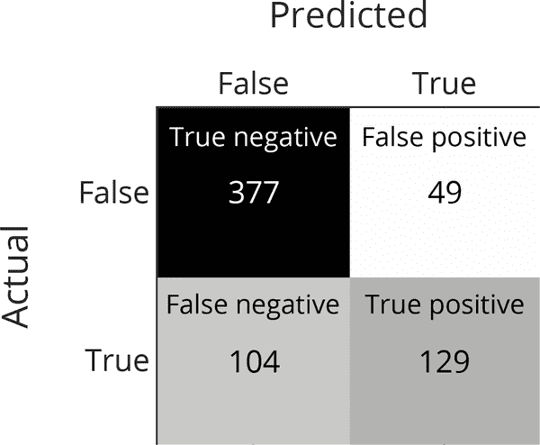

理想情况下，我们希望在对角方格中看到所有计数 True negative 和 True positive。这意味着我们已经正确分类了所有内容。但这很少见，我们需要评估错误的规模。为此，比较率而不是计数更容易。接下来，我们描述不同的率以及何时可能更喜欢优先考虑其中之一。

## 精度与召回率

在某些情况下，错过阳性案例的成本可能会更高。例如，如果我们正在构建一个用于识别肿瘤的分类器，我们希望确保不会错过任何恶性肿瘤。相反，我们不太关心将良性肿瘤分类为恶性，因为病理学家仍然需要仔细查看以验证恶性分类。在这种情况下，我们希望在实际上为阳性的记录中具有很高的真阳性率。该率称为*敏感度*或*召回率*：

<math display="block"><mtext>Recall</mtext> <mo>=</mo> <mfrac><mtext>True Positives</mtext> <mrow><mtext>True Positives</mtext> <mo>+</mo> <mtext>False Negatives</mtext></mrow></mfrac> <mo>=</mo> <mfrac><mtext>True Positives</mtext> <mtext>Actually True</mtext></mfrac></math>

较高的召回率会冒着将假记录预测为真的风险（假阳性）。

另一方面，当将电子邮件分类为垃圾邮件（阳性）或非垃圾邮件（阴性）时，如果一封重要的电子邮件被放入垃圾邮件文件夹中，我们可能会感到烦恼。在这种情况下，我们希望有高的*精度*，即模型对于阳性预测的准确性：

<math display="block"><mtext>Precision</mtext> <mo>=</mo> <mfrac><mtext>True Positives</mtext> <mrow><mtext>True Positives</mtext> <mo>+</mo> <mtext>False Positives</mtext></mrow></mfrac> <mo>=</mo> <mfrac><mtext>True Positives</mtext> <mtext>Predicted True</mtext></mfrac></math>

较高精度的模型通常更有可能预测真实观察结果为负（更高的假阴性率）。

常见的分析比较不同阈值下的精度和召回率：

```py
`from` `sklearn` `import` `metrics`
`precision``,` `recall``,` `threshold` `=` `(`
    `metrics``.``precision_recall_curve``(``y``,` `lr_model``.``predict_proba``(``X``)``[``:``,` `1``]``)``)`

`tpr_df` `=` `pd``.``DataFrame``(``{``"``threshold``"``:``threshold``,` 
                       `"``precision``"``:``precision``[``:``-``1``]``,` `"``recall``"``:` `recall``[``:``-``1``]``,` `}``)`

```

为了查看精度和召回率之间的关系，我们将它们都绘制在阈值<math><mi>τ</mi></math>上：

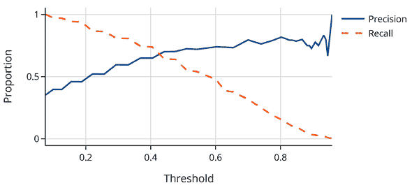

另一个评估分类器性能的常见图表是*精度-召回率曲线*，简称 PR 曲线。它绘制了每个阈值的精度-召回率对：

```py
`fig` `=` `px``.``line``(``tpr_df``,` `x``=``"``recall``"``,` `y``=``"``precision``"``,`
              `labels``=``{``"``recall``"``:``"``Recall``"``,``"``precision``"``:``"``Precision``"``}``)`
`fig``.``update_layout``(``width``=``450``,` `height``=``250``,` `yaxis_range``=``[``0``,` `1``]``)`
`fig`

```

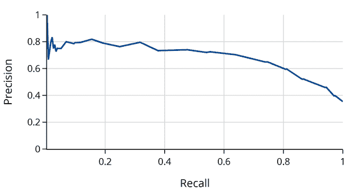

注意，曲线的右端反映了样本中的不平衡性。精度与样本中倒下树木的比例相匹配，为 0.35。为不同模型绘制多个 PR 曲线可以帮助比较模型。

使用精度和召回率使我们能够更好地控制哪种类型的错误更重要。例如，假设我们想确保至少 75%的倒下树木被分类为倒下。我们可以找到发生这种情况的阈值：

```py
`fall75_ind` `=` `np``.``argmin``(``recall` `>``=` `0.75``)` `-` `1`

`fall75_threshold` `=` `threshold``[``fall75_ind``]`
`fall75_precision` `=` `precision``[``fall75_ind``]`
`fall75_recall` `=` `recall``[``fall75_ind``]`

```

```py
Threshold: 0.33
Precision: 0.59
Recall:    0.81

```

我们发现约 41%（1 - 精度）的我们分类为倒下的树实际上是站立的。此外，我们发现低于此阈值的树木比例为：

```py
`print``(``"``Proportion of samples below threshold:``"``,` 
      `f``"``{``np``.``mean``(``lr_model``.``predict_proba``(``X``)``[``:``,``1``]` `<` `fall75_threshold``)``:``0.2f``}``"``)`

```

```py
Proportion of samples below threshold: 0.52

```

因此，我们已将 52%的样本分类为站立（负面）。*特异性*（也称为*真负率*）衡量分类器将属于负类的数据标记为负类的比例：

<math display="block"><mtext>Specificity</mtext> <mo>=</mo> <mfrac><mtext>True Negatives</mtext> <mrow><mtext>True Negatives</mtext> <mo>+</mo> <mtext>False Positives</mtext></mrow></mfrac> <mo>=</mo> <mfrac><mtext>True Negatives</mtext> <mtext>Predicted False</mtext></mfrac></math>

我们的阈值的特异性为：

```py
`act_neg` `=` `(``y` `==` `0``)`
`true_neg` `=` `(``lr_model``.``predict_proba``(``X``)``[``:``,``1``]` `<` `fall75_threshold``)` `&` `act_neg`

```

```py
Specificity: 0.70

```

换句话说，70%的被分类为站立的树实际上是站立的。

如我们所见，有几种使用 2x2 混淆矩阵的方法。理想情况下，我们希望准确率、精确率和召回率都很高。这种情况发生在大多数预测落在表格的对角线上，因此我们的预测几乎全部正确——真负类和真正类。不幸的是，在大多数情况下，我们的模型会有一定程度的错误。在我们的例子中，相同直径的树木包括倒下的和站立的混合，因此我们不能完美地根据它们的直径分类树木。在实践中，当数据科学家选择一个阈值时，他们需要考虑自己的背景来决定是优先考虑精确率、召回率还是特异性。

# 总结

在本章中，我们用一个解释变量拟合简单的逻辑回归，但是我们可以通过将更多特征添加到我们的设计矩阵中来轻松地包含模型中的其他变量。例如，如果某些预测变量是分类的，我们可以将它们作为独热编码特征包含进来。这些想法直接延续自第十五章。正则化技术（来自第十六章）也适用于逻辑回归。我们将在第二十一章的案例研究中整合所有这些建模技术——包括使用训练集-测试集分割来评估模型和交叉验证来选择阈值——以开发一个用于分类假新闻的模型。

逻辑回归是机器学习中的基石，因为它自然地扩展到更复杂的模型中。例如，逻辑回归是神经网络的基本组成部分之一。当响应变量有多于两个类别时，逻辑回归可以扩展为多项逻辑回归。适用于建模计数的逻辑回归的另一个扩展称为泊松回归。这些不同形式的回归与最大似然密切相关，其中响应的潜在模型分别为二项式、多项式或泊松分布，目标是优化参数的数据似然。这些模型家族也被称为广义线性模型。在所有这些场景中，不存在用于最小化损失的封闭形式解决方案，因此平均损失的优化依赖于数值方法，我们将在下一章中介绍。
