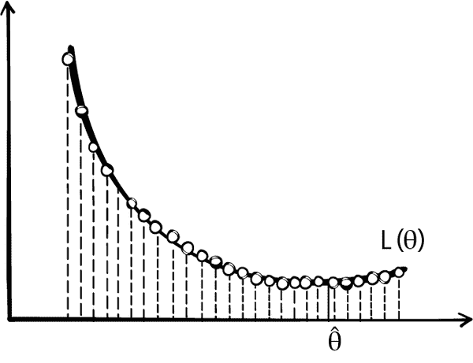
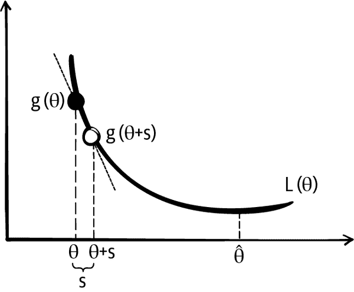
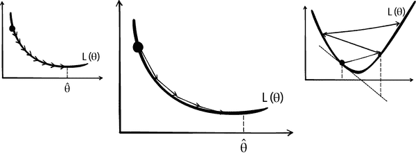
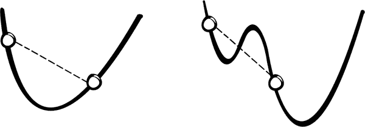
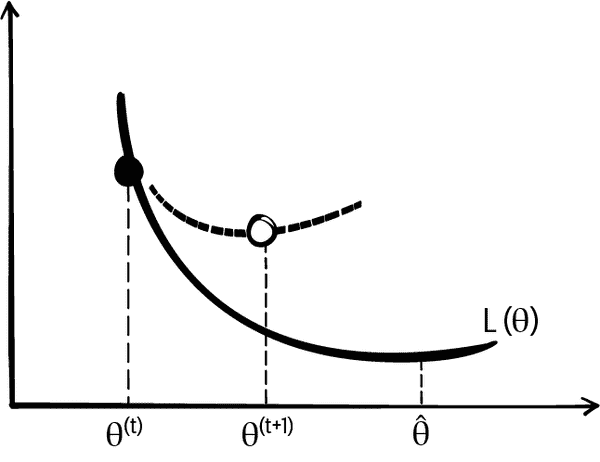

# 第二十章：数值优化

在本书的这一部分，我们的建模过程应该感到很熟悉：我们定义一个模型，选择一个损失函数，并通过最小化训练数据上的平均损失来拟合模型。我们已经看到了几种最小化损失的技术。例如，我们在第十五章中使用了微积分和几何论证，找到了使用平方损失拟合线性模型的简单表达式。

但经验损失最小化并不总是那么简单。**Lasso 回归**在平均平方损失中加入<math><msub><mi>L</mi> <mn>1</mn></msub></math>惩罚后，不再有闭合形式的解，而逻辑回归使用交叉熵损失来拟合非线性模型。在这些情况下，我们使用*数值优化*来拟合模型，系统地选择参数值以评估平均损失，以寻找最小化的值。

当我们在第四章介绍损失函数时，我们执行了一个简单的数值优化，以找到平均损失的最小化者。我们创建了一个<math><mi>θ</mi></math>值的网格，并在网格中的所有点上评估平均损失（见图 20-1）。具有最小平均损失的网格点我们认为是最佳拟合。不幸的是，这种网格搜索很快变得不切实际，原因如下：

+   对于具有许多特征的复杂模型，网格变得难以管理。对于仅具有四个特征和每个特征 100 个值的网格，我们必须评估<math><msup><mn>100</mn> <mn>4</mn></msup> <mo>=</mo> <mn>100,000,000</mn></math>个网格点上的平均损失。

+   必须事先指定要搜索的参数值范围，以创建网格。当我们对范围没有很好的感觉时，我们需要从一个宽网格开始，可能需要在更窄的范围内重复网格搜索。

+   对于大量观测值，评估网格点上的平均损失可能会很慢。



###### 图 20-1\. 在网格点上搜索可能计算速度慢或不准确

在本章中，我们介绍利用损失函数的形状和平滑性寻找最小化参数值的数值优化技术。我们首先介绍梯度下降技术的基本思想，然后给出一个示例，描述使梯度下降起作用的损失函数的特性，最后提供了梯度下降的几个扩展。

# 梯度下降基础知识

梯度下降基于以下观念：对于许多损失函数，函数在参数的小邻域内大致是线性的。图 20-2 给出了这个基本思想的示意图。



###### 图 20-2\. 梯度下降技术是向最小化参数值的方向进行小增量移动的技术。

在图中，我们画出了损失曲线<math><mi>L</mi></math>在最小化值<math><mrow><mover><mi>θ</mi> <mo stretchy="false">^</mo></mover></mrow></math> 左侧某点的切线。注意到切线的斜率为负。在<math><mrow><mi>θ</mi></mrow></math> 右侧前进一个短距离<math><mrow><mi>θ</mi></mrow> <mo>+</mo> <mtext>s</mtext></math> （其中<math><mtext>s</mtext></math> 是一小量）给出切线上接近<math><mrow><mi>θ</mi></mrow> <mo>+</mo> <mtext>s</mtext></math> 处的损失，且该损失小于<math><mi>L</mi> <mo stretchy="false">(</mo> <mrow><mover><mi>θ</mi> <mo stretchy="false">~</mo></mover></mrow> <mo stretchy="false">)</mo></math> 。也就是说，由于斜率<math><mi>b</mi></math> 为负，并且切线在<math><mrow><mi>θ</mi></mrow></math> 附近近似损失函数，我们有：

<math display="block"><mi>L</mi> <mo stretchy="false">(</mo> <mrow><mi>θ</mi></mrow> <mo>+</mo> <mtext>s</mtext> <mo stretchy="false">)</mo> <mo>≈</mo> <mi>L</mi> <mo stretchy="false">(</mo> <mi>θ</mi> <mo stretchy="false">)</mo> <mo>+</mo> <mi>b</mi> <mo>×</mo> <mtext>s</mtext> <mo><</mo> <mi>L</mi> <mo stretchy="false">(</mo> <mi>θ</mi> <mo stretchy="false">)</mo></math>

因此，向<math><mrow><mi>θ</mi></mrow></math> 的右侧小步骤会减小损失。另一方面，在图 Figure 20-2 中<math><mrow><mover><mi>θ</mi> <mo stretchy="false">^</mo></mover></mrow></math> 的另一侧，切线是正的，向左侧小步骤也会减小损失。

当我们根据切线斜率的正负指示重复采取小步骤时，这导致平均损失值越来越小，最终使我们接近或达到最小化值<math><mrow><mover><mi>θ</mi> <mo stretchy="false">^</mo></mover></mrow></math> 。这就是梯度下降背后的基本思想。

更正式地说，为了最小化一般参数向量<math><mi mathvariant="bold-italic">θ</mi></math> 的损失函数<math><mi>L</mi> <mo stretchy="false">(</mo> <mi mathvariant="bold-italic">θ</mi> <mo stretchy="false">)</mo></math> ，梯度（一阶偏导数）决定了应该采取的步长和方向。如果我们将梯度<math><msub><mi mathvariant="normal">∇</mi> <mi>θ</mi></msub> <mi>L</mi> <mo stretchy="false">(</mo> <mi mathvariant="bold-italic">θ</mi> <mo stretchy="false">)</mo></math> 简单写作<math><mi>g</mi> <mo stretchy="false">(</mo> <mi mathvariant="bold-italic">θ</mi> <mo stretchy="false">)</mo></math> ，那么梯度下降法指出每次增量或步长为<math><mo>−</mo> <mi>α</mi> <mi>g</mi> <mo stretchy="false">(</mo> <mi mathvariant="bold-italic">θ</mi> <mo stretchy="false">)</mo></math> ，其中<math><mi>α</mi></math> 是某个小正数。然后，在新位置的平均损失是：

<math display="block"><mtable columnalign="right" columnspacing="0em" displaystyle="true" rowspacing="3pt"><mtr><mtd><mtable columnalign="right left" columnspacing="0em" displaystyle="true" rowspacing="3pt"><mtr><mtd><mi>L</mi> <mo stretchy="false">(</mo> <mi>θ</mi> <mo>+</mo> <mo stretchy="false">(</mo> <mo>−</mo> <mi>α</mi> <mi>g</mi> <mo stretchy="false">(</mo> <mi mathvariant="bold-italic">θ</mi> <mo stretchy="false">)</mo> <mo stretchy="false">)</mo></mtd> <mtd><mo>≈</mo> <mi>L</mi> <mo stretchy="false">(</mo> <mi>θ</mi> <mo stretchy="false">)</mo> <mo>−</mo> <mi>α</mi> <mi>g</mi> <mo stretchy="false">(</mo> <mi mathvariant="bold-italic">θ</mi> <msup><mo stretchy="false">)</mo> <mi>T</mi></msup> <mi>g</mi> <mo stretchy="false">(</mo> <mi mathvariant="bold-italic">θ</mi> <mo stretchy="false">)</mo></mtd></mtr> <mtr><mtd><mo><</mo> <mi>L</mi> <mo stretchy="false">(</mo> <mi>θ</mi> <mo stretchy="false">)</mo></mtd></mtr></mtable></mtd></mtr></mtable></math>

注意 <math><mi>g</mi> <mo stretchy="false">(</mo> <mi mathvariant="bold-italic">θ</mi> <mo stretchy="false">)</mo></math> 是一个 <math><mi>p</mi> <mo>×</mo> <mn>1</mn></math> 向量，而 <math><mi>g</mi> <mo stretchy="false">(</mo> <mi mathvariant="bold-italic">θ</mi> <msup><mo stretchy="false">)</mo> <mi>T</mi></msup> <mi>g</mi> <mo stretchy="false">(</mo> <mi mathvariant="bold-italic">θ</mi> <mo stretchy="false">)</mo></math> 是正的。

梯度下降算法的步骤如下：

1.  选择一个起始值，称为 <math><msup><mi mathvariant="bold-italic">θ</mi> <mrow><mo stretchy="false">(</mo> <mn>0</mn> <mo stretchy="false">)</mo></mrow></msup></math>（一个常见的选择是 <math><msup><mi mathvariant="bold-italic">θ</mi> <mrow><mo stretchy="false">(</mo> <mn>0</mn> <mo stretchy="false">)</mo></mrow></msup> <mo>=</mo> <mn>0</mn></math>）。

1.  计算 <math><msup><mi mathvariant="bold-italic">θ</mi> <mrow><mo stretchy="false">(</mo> <mi>t</mi> <mo>+</mo> <mn>1</mn> <mo stretchy="false">)</mo></mrow></msup> <mo>=</mo> <msup><mi mathvariant="bold-italic">θ</mi> <mrow><mo stretchy="false">(</mo> <mi>t</mi> <mo stretchy="false">)</mo></mrow></msup> <mo>−</mo> <mi>α</mi> <mi>g</mi> <mo stretchy="false">(</mo> <mi mathvariant="bold-italic">θ</mi> <mo stretchy="false">)</mo></math> 。

1.  重复步骤 2 直到 <math><msup><mi mathvariant="bold-italic">θ</mi> <mrow><mo stretchy="false">(</mo> <mi>t</mi> <mo>+</mo> <mn>1</mn> <mo stretchy="false">)</mo></mrow></msup></math> 不再改变（或变化很小）为止。

数量 <math><mi>α</mi></math> 被称为*学习率*。设置 <math><mi>α</mi></math> 可能比较棘手。它需要足够小以避免超过最小值，但足够大以在合理步数内达到最小值（见 图 20-3）。有许多设置 <math><mi>α</mi></math> 的策略。例如，随着时间的推移减少 <math><mi>α</mi></math> 可能会很有用。当 <math><mi>α</mi></math> 在迭代之间变化时，我们使用符号 <math><msup><mi>α</mi> <mrow><mo stretchy="false">(</mo> <mi>t</mi> <mo stretchy="false">)</mo></mrow></msup></math> 表示学习率在搜索过程中变化。



###### 图 20-3\. 较小的学习率需要许多步骤才能收敛（左），较大的学习率可能会发散（右）；选择适当的学习率可以快速收敛到最小值（中）。

梯度下降算法简单而强大，因为我们可以用它来拟合许多类型的模型和许多类型的损失函数。它是拟合许多模型的计算工具首选，包括大数据集上的线性回归和逻辑回归。接下来，我们演示使用该算法来拟合巴士延误数据中的常量（来自 第四章）。

# 最小化 Huber 损失

*Huber 损失* 结合了绝对损失和平方损失，得到一个既可微（像平方损失）又对异常值不那么敏感（像绝对损失）的函数：

<math display="block"><mtable columnalign="right" columnspacing="0em" displaystyle="true" rowspacing="3pt"><mtr><mtd><mi>L</mi> <mo stretchy="false">(</mo> <mi>θ</mi> <mo>,</mo> <mtext mathvariant="bold">y</mtext> <mo stretchy="false">)</mo> <mo>=</mo> <mfrac><mn>1</mn> <mi>n</mi></mfrac> <munderover><mo>∑</mo> <mrow><mi>i</mi> <mo>=</mo> <mn>1</mn></mrow> <mi>n</mi></munderover> <mrow><mo>{</mo> <mtable columnalign="left left" columnspacing="1em" rowspacing=".2em"><mtr><mtd><mfrac><mn>1</mn> <mn>2</mn></mfrac> <mo stretchy="false">(</mo> <msub><mi>y</mi> <mi>i</mi></msub> <mo>−</mo> <mi>θ</mi> <msup><mo stretchy="false">)</mo> <mn>2</mn></msup></mtd> <mtd><mo stretchy="false">|</mo> <msub><mi>y</mi> <mi>i</mi></msub> <mo>−</mo> <mi>θ</mi> <mrow><mo stretchy="false">|</mo></mrow> <mo>≤</mo> <mi>γ</mi></mtd></mtr> <mtr><mtd><mi>γ</mi> <mo stretchy="false">(</mo> <mrow><mo stretchy="false">|</mo></mrow> <msub><mi>y</mi> <mi>i</mi></msub> <mo>−</mo> <mi>θ</mi> <mrow><mo stretchy="false">|</mo></mrow> <mo>−</mo> <mfrac><mn>1</mn> <mn>2</mn></mfrac> <mi>γ</mi> <mo stretchy="false">)</mo></mtd> <mtd><mtext>otherwise</mtext></mtd></mtr></mtable></mrow></mtd></mtr></mtable></math>

由于 Huber 损失是可微的，我们可以使用梯度下降。我们首先找到平均 Huber 损失的梯度：

<math display="block"><mtable columnalign="right" columnspacing="0em" displaystyle="true" rowspacing="3pt"><mtr><mtd><msub><mi mathvariant="normal">∇</mi> <mrow><mi>θ</mi></mrow></msub> <mi>L</mi> <mo stretchy="false">(</mo> <mi>θ</mi> <mo>,</mo> <mtext mathvariant="bold">y</mtext> <mo stretchy="false">)</mo> <mo>=</mo> <mfrac><mn>1</mn> <mi>n</mi></mfrac> <munderover><mo>∑</mo> <mrow><mi>i</mi> <mo>=</mo> <mn>1</mn></mrow> <mi>n</mi></munderover> <mrow><mo>{</mo> <mtable columnalign="left left" columnspacing="1em" rowspacing=".2em"><mtr><mtd><mo>−</mo> <mo stretchy="false">(</mo> <msub><mi>y</mi> <mi>i</mi></msub> <mo>−</mo> <mi>θ</mi> <mo stretchy="false">)</mo></mtd> <mtd><mo stretchy="false">|</mo> <msub><mi>y</mi> <mi>i</mi></msub> <mo>−</mo> <mi>θ</mi> <mrow><mo stretchy="false">|</mo></mrow> <mo>≤</mo> <mi>γ</mi></mtd></mtr> <mtr><mtd><mo>−</mo> <mi>γ</mi> <mo>⋅</mo> <mtext>sign</mtext> <mo stretchy="false">(</mo> <msub><mi>y</mi> <mi>i</mi></msub> <mo>−</mo> <mi>θ</mi> <mo stretchy="false">)</mo></mtd> <mtd><mtext>otherwise</mtext></mtd></mtr></mtable></mrow></mtd></mtr></mtable></math>

我们创建了 `huber_loss` 和 `grad_huber_loss` 函数来计算平均损失及其梯度。我们编写这些函数时签名设计使我们能够指定参数以及我们平均的观察数据和损失函数的转折点：

```py
`def` `huber_loss``(``theta``,` `dataset``,` `gamma``=``1``)``:`
    `d` `=` `np``.``abs``(``theta` `-` `dataset``)`
    `return` `np``.``mean``(`
        `np``.``where``(``d` `<``=` `gamma``,`
                 `(``theta` `-` `dataset``)``*``*``2` `/` `2.0``,`
                 `gamma` `*` `(``d` `-` `gamma` `/` `2.0``)``)`
    `)`

`def` `grad_huber_loss``(``theta``,` `dataset``,` `gamma``=``1``)``:`
    `d` `=` `np``.``abs``(``theta` `-` `dataset``)`
    `return` `np``.``mean``(`
        `np``.``where``(``d` `<``=` `gamma``,`
                 `-``(``dataset` `-` `theta``)``,`
                 `-``gamma` `*` `np``.``sign``(``dataset` `-` `theta``)``)`
    `)`

```

接下来，我们编写了梯度下降的简单实现。我们的函数签名包括损失函数、其梯度和要平均的数据。我们还提供学习率。

```py
`def` `minimize``(``loss_fn``,` `grad_loss_fn``,` `dataset``,` `alpha``=``0.2``,` `progress``=``False``)``:`
    `'''`
 `Uses gradient descent to minimize loss_fn. Returns the minimizing value of`
 `theta_hat once theta_hat changes less than 0.001 between iterations.`
 `'''`
    `theta` `=` `0`
    `while` `True``:`
        `if` `progress``:`
            `print``(``f``'``theta:` `{``theta``:``.2f``}` `| loss:` `{``loss_fn``(``theta``,` `dataset``)``:``.3f``}``'``)`
        `gradient` `=` `grad_loss_fn``(``theta``,` `dataset``)`
        `new_theta` `=` `theta` `-` `alpha` `*` `gradient`

        `if` `abs``(``new_theta` `-` `theta``)` `<` `0.001``:`
            `return` `new_theta`

        `theta` `=` `new_theta`

```

请回想一下，公交车延误数据集包含超过 1,000 个测量值，即北行 C 线公交车在抵达西雅图第三大道和派克街站点时晚多少分钟：

```py
`delays` `=` `pd``.``read_csv``(``'``data/seattle_bus_times_NC.csv``'``)`

```

在 第四章 中，我们为这些数据拟合了一个常数模型，以得到绝对损失和平方损失。我们发现绝对损失产生了数据的中位数，而平方损失产生了数据的均值：

```py
`print``(``f``"``Mean:` `{``np``.``mean``(``delays``[``'``minutes_late``'``]``)``:``.3f``}``"``)`
`print``(``f``"``Median:` `{``np``.``median``(``delays``[``'``minutes_late``'``]``)``:``.3f``}``"``)`    

```

```py
Mean:   1.920
Median: 0.742

```

现在我们使用梯度下降算法来找到最小化 Huber 损失的常数模型：

```py
`%``%``time`
`theta_hat` `=` `minimize``(``huber_loss``,` `grad_huber_loss``,` `delays``[``'``minutes_late``'``]``)`
`print``(``f``'``Minimizing theta:` `{``theta_hat``:``.3f``}``'``)`
`print``(``)`

```

```py
Minimizing theta: 0.701

CPU times: user 93 ms, sys: 4.24 ms, total: 97.3 ms
Wall time: 140 ms

```

Huber 损失的优化常数接近最小化绝对损失的值。这是由于 Huber 损失函数的形状决定的。它在尾部是线性的，因此不像绝对损失那样受到异常值的影响，也不像平方损失那样受到影响。

###### 警告

我们编写了我们的 `minimize` 函数来演示算法背后的思想。在实践中，您应该使用经过充分测试的、数值上稳定的优化算法的实现。例如，`scipy` 包中有一个 `minimize` 方法，我们可以用它来找到平均损失的最小化器，甚至不需要计算梯度。这个算法可能比我们可能编写的任何一个算法都要快得多。事实上，我们在 第十八章 中使用它来创建我们自己的二次损失的非对称修改，特别是在我们希望损失对于最小值的一侧的错误更大而另一侧的影响较小的特殊情况下。

更一般地，我们通常在迭代之间<math><msup><mi>θ</mi> <mrow><mo stretchy="false">(</mo> <mi>t</mi> <mo stretchy="false">)</mo></mrow></msup></math> 不太改变时停止算法。在我们的函数中，我们停止当<math><msup><mi>θ</mi> <mrow><mo stretchy="false">(</mo> <mi>t</mi> <mo>+</mo> <mn>1</mn> <mo stretchy="false">)</mo></mrow></msup> <mo>−</mo> <msup><mi>θ</mi> <mrow><mo stretchy="false">(</mo> <mi>t</mi> <mo stretchy="false">)</mo></mrow></msup></math> 小于 0.001 时。在迭代次数较多时，例如 1,000 次，停止搜索也很常见。如果算法在 1,000 次迭代后仍未到达最小值，则可能是因为学习率过大，或者最小值可能存在于极限处<math><mo>±</mo> <mi mathvariant="normal">∞</mi></math>。

当我们无法通过解析方法轻松求解最小值或者最小化计算成本很高时，梯度下降给了我们一个通用的最小化平均损失的方法。该算法依赖于平均损失函数的两个重要属性：它在<math><mi mathvariant="bold-italic">θ</mi></math> 上既是凸的又是可微的。我们接下来讨论算法如何依赖这些属性。

# 凸和可微损失函数

正如其名字所示，梯度下降算法要求被最小化的函数是可微的。梯度<math><msub><mi mathvariant="normal">∇</mi> <mi>θ</mi></msub> <mi>L</mi> <mo stretchy="false">(</mo> <mi mathvariant="bold-italic">θ</mi> <mo stretchy="false">)</mo></math> ，使我们能够对<math><mi mathvariant="bold-italic">θ</mi></math> 的小邻域内的平均损失进行线性近似。这个近似给出了我们的步长的方向（和大小），只要我们不超过最小值<math><mrow><mover><mi mathvariant="bold-italic">θ</mi> <mo mathvariant="bold" stretchy="false">^</mo></mover></mrow></math> ，我们就一定会最终到达它。嗯，只要损失函数也是凸的。

最小值的逐步搜索也依赖于损失函数是凸函数。左图中的函数是凸的，但右图中的函数不是。右图中的函数有一个局部最小值，根据算法开始的位置，它可能会收敛到这个局部最小值并完全错过真正的最小值。凸性质避免了这个问题。*凸函数*避免了局部最小值的问题。所以，通过适当的步长，梯度下降可以找到任何凸、可微函数的全局最优解<math><mi>θ</mi></math>。



###### 图 20-4。对于非凸函数（右图），梯度下降可能会找到局部最小值而不是全局最小值，而凸函数（左图）不可能出现这种情况。

形式上，函数 <math><mi>f</mi></math> 如果对于任意的输入值 <math><msub><mi mathvariant="bold-italic">θ</mi> <mi>a</mi></msub></math> 和 <math><msub><mi mathvariant="bold-italic">θ</mi> <mi>b</mi></msub></math>，以及介于 0 和 1 之间的任意 <math><mi>q</mi></math> 都是凸的：

<math display="block"><mi>q</mi> <mi>f</mi> <mo stretchy="false">(</mo> <msub><mi mathvariant="bold-italic">θ</mi> <mi>a</mi></msub> <mo stretchy="false">)</mo> <mo>+</mo> <mo stretchy="false">(</mo> <mn>1</mn> <mo>−</mo> <mi>q</mi> <mo stretchy="false">)</mo> <mi>f</mi> <mo stretchy="false">(</mo> <msub><mi mathvariant="bold-italic">θ</mi> <mi>b</mi></msub> <mo stretchy="false">)</mo> <mo>≥</mo> <mi>f</mi> <mo stretchy="false">(</mo> <mi>q</mi> <msub><mi mathvariant="bold-italic">θ</mi> <mi>a</mi></msub> <mo>+</mo> <mo stretchy="false">(</mo> <mn>1</mn> <mo>−</mo> <mi>q</mi> <mo stretchy="false">)</mo> <msub><mi mathvariant="bold-italic">θ</mi> <mi>b</mi></msub> <mo stretchy="false">)</mo></math>

这个不等式意味着连接函数的任意两个点的线段必须位于或位于函数本身之上。从启发式的角度来看，这意味着无论我们在梯度为负时向右走还是在梯度为正时向左走，只要我们采取足够小的步伐，我们就会朝向函数的最小值方向前进。

凸性的正式定义为我们提供了确定一个函数是否为凸函数的精确方式。我们可以利用这个定义来将平均损失函数 <math><mi>L</mi> <mo stretchy="false">(</mo> <mi mathvariant="bold-italic">θ</mi> <mo stretchy="false">)</mo></math> 的凸性与损失函数 <math><mrow><mi mathvariant="script">l</mi></mrow> <mo mathvariant="script" stretchy="false">(</mo> <mi mathvariant="bold-italic">θ</mi> <mo mathvariant="script" stretchy="false">)</mo></math> 连接起来。迄今为止，在本章中，我们通过不提及数据来简化了 <math><mi>L</mi> <mo stretchy="false">(</mo> <mi mathvariant="bold-italic">θ</mi> <mo stretchy="false">)</mo></math> 的表示。回顾一下：

<math display="block"><mtable columnalign="right left" columnspacing="0em" displaystyle="true" rowspacing="3pt"><mtr><mtd><mi>L</mi> <mo stretchy="false">(</mo> <mi mathvariant="bold-italic">θ</mi> <mo>,</mo> <mtext mathvariant="bold">X</mtext> <mo>,</mo> <mrow><mi mathvariant="bold">y</mi></mrow> <mo stretchy="false">)</mo></mtd> <mtd><mo>=</mo> <mfrac><mn>1</mn> <mi>n</mi></mfrac> <munderover><mo>∑</mo> <mrow><mi>i</mi> <mo>=</mo> <mn>1</mn></mrow> <mrow><mi>n</mi></mrow></munderover> <mrow><mi mathvariant="script">l</mi></mrow> <mo stretchy="false">(</mo> <mi mathvariant="bold-italic">θ</mi> <mo>,</mo> <msub><mrow><mi mathvariant="bold">x</mi></mrow> <mi>i</mi></msub> <mo>,</mo> <msub><mi>y</mi> <mi>i</mi></msub> <mo stretchy="false">)</mo></mtd></mtr></mtable></math>

其中 <math><mtext mathvariant="bold">X</mtext></math> 是一个 <math><mi>n</mi> <mo>×</mo> <mi>p</mi></math> 设计矩阵，<math><msub><mrow><mi mathvariant="bold">x</mi></mrow> <mi>i</mi></msub></math> 是设计矩阵的第 <math><mi>i</mi></math> 行，对应于数据集中的第 <math><mi>i</mi></math> 个观测值。这意味着梯度可以表示为：

<math display="block"><mtable columnalign="right left" columnspacing="0em" displaystyle="true" rowspacing="3pt"><mtr><mtd><msub><mi mathvariant="normal">∇</mi> <mrow><mi>θ</mi></mrow></msub> <mi>L</mi> <mo stretchy="false">(</mo> <mi mathvariant="bold-italic">θ</mi> <mo>,</mo> <mtext mathvariant="bold">X</mtext> <mo>,</mo> <mrow><mi mathvariant="bold">y</mi></mrow> <mo stretchy="false">)</mo></mtd> <mtd><mo>=</mo> <mfrac><mn>1</mn> <mi>n</mi></mfrac> <munderover><mo>∑</mo> <mrow><mi>i</mi> <mo>=</mo> <mn>1</mn></mrow> <mrow><mi>n</mi></mrow></munderover> <msub><mi mathvariant="normal">∇</mi> <mrow><mi>θ</mi></mrow></msub> <mrow><mi mathvariant="script">l</mi></mrow> <mo stretchy="false">(</mo> <mi mathvariant="bold-italic">θ</mi> <mo>,</mo> <msub><mrow><mi mathvariant="bold">x</mi></mrow> <mi>i</mi></msub> <mo>,</mo> <msub><mi>y</mi> <mi>i</mi></msub> <mo stretchy="false">)</mo></mtd></mtr></mtable></math>

如果<math><mrow><mi mathvariant="script">l</mi></mrow> <mo mathvariant="script" stretchy="false">(</mo> <mi mathvariant="bold-italic">θ</mi> <mo mathvariant="script">,</mo> <msub><mrow><mi mathvariant="bold">x</mi></mrow> <mi mathvariant="script">i</mi></msub> <mo mathvariant="script">,</mo> <msub><mi mathvariant="script">y</mi> <mi mathvariant="script">i</mi></msub> <mo mathvariant="script" stretchy="false">)</mo></math>是关于<math><mi mathvariant="bold-italic">θ</mi></math>的凸函数，则平均损失也是凸的。对于导数也是类似的：<math><mrow><mi mathvariant="script">l</mi></mrow> <mo mathvariant="script" stretchy="false">(</mo> <mi mathvariant="bold-italic">θ</mi> <mo mathvariant="script">,</mo> <msub><mrow><mi mathvariant="bold">x</mi></mrow> <mi mathvariant="script">i</mi></msub> <mo mathvariant="script">,</mo> <msub><mi mathvariant="script">y</mi> <mi mathvariant="script">i</mi></msub> <mo mathvariant="script" stretchy="false">)</mo></math>的导数被平均到数据上以评估<math><mi>L</mi> <mo stretchy="false">(</mo> <mi mathvariant="bold-italic">θ</mi> <mo>,</mo> <mtext mathvariant="bold">X</mtext> <mo>,</mo> <mrow><mi mathvariant="bold">y</mi></mrow> <mo stretchy="false">)</mo></math>的导数。我们将在练习中详细讨论凸性质。

现在，有了大量数据，计算<math><msup><mi>θ</mi> <mrow><mo stretchy="false">(</mo> <mi>t</mi> <mo stretchy="false">)</mo></mrow></msup></math>可能会非常耗时，因为它涉及到所有<math><mo stretchy="false">(</mo> <msub><mtext mathvariant="bold">x</mtext> <mi>i</mi></msub> <mo>,</mo> <msub><mi>y</mi> <mi>i</mi></msub> <mo stretchy="false">)</mo></math>上的梯度<math><msub><mi mathvariant="normal">∇</mi> <mrow><mi>θ</mi></mrow></msub> <mrow><mi mathvariant="script">l</mi></mrow></math>的平均值。接下来，我们考虑梯度下降的变体，这些变体可以更快地计算，因为它们不会对所有数据进行平均。

# 梯度下降的变体

梯度下降的两个变体，随机梯度下降和小批量梯度下降，在计算平均损失的梯度时使用数据子集，并且对于具有大型数据集的优化问题很有用。第三个选择是牛顿法，它假设损失函数是两次可微的，并且使用损失函数的二次近似，而不是梯度下降中使用的线性近似。

回顾一下，梯度下降是根据梯度采取步骤的。在步骤<math><mi>t</mi></math>，我们从<math><msup><mi mathvariant="bold-italic">θ</mi> <mrow><mo stretchy="false">(</mo> <mi>t</mi> <mo stretchy="false">)</mo></mrow></msup></math>移动到：

<math display="block"><msup><mrow><mi mathvariant="bold-italic">θ</mi></mrow> <mrow><mo stretchy="false">(</mo> <mi>t</mi> <mo>+</mo> <mn>1</mn> <mo stretchy="false">)</mo></mrow></msup> <mo>=</mo> <msup><mi mathvariant="bold-italic">θ</mi> <mrow><mo stretchy="false">(</mo> <mi>t</mi> <mo stretchy="false">)</mo></mrow></msup> <mo>−</mo> <mi>α</mi> <mo>⋅</mo> <msub><mi mathvariant="normal">∇</mi> <mrow><mi>θ</mi></mrow></msub> <mi>L</mi> <mo stretchy="false">(</mo> <msup><mi mathvariant="bold-italic">θ</mi> <mrow><mo stretchy="false">(</mo> <mi>t</mi> <mo stretchy="false">)</mo></mrow></msup> <mo>,</mo> <mtext mathvariant="bold">X</mtext> <mo>,</mo> <mtext mathvariant="bold">y</mtext> <mo stretchy="false">)</mo></math>

由于 <math><msub><mi mathvariant="normal">∇</mi> <mrow><mi>θ</mi></mrow></msub> <mi>L</mi> <mo stretchy="false">(</mo> <mi mathvariant="bold-italic">θ</mi> <mo>,</mo> <mtext mathvariant="bold">X</mtext> <mo>,</mo> <mtext mathvariant="bold">y</mtext> <mo stretchy="false">)</mo></math> 可以表示为损失函数 <math><mi mathvariant="script">l</mi></math> 的平均梯度，我们有：

<math display="block"><mtable columnalign="right left" columnspacing="0em" displaystyle="true" rowspacing="3pt"><mtr><mtd><msub><mi mathvariant="normal">∇</mi> <mrow><mi>θ</mi></mrow></msub> <mi>L</mi> <mo stretchy="false">(</mo> <mi mathvariant="bold-italic">θ</mi> <mo>,</mo> <mtext mathvariant="bold">X</mtext> <mo>,</mo> <mtext mathvariant="bold">y</mtext> <mo stretchy="false">)</mo></mtd> <mtd><mo>=</mo> <mfrac><mn>1</mn> <mi>n</mi></mfrac> <munderover><mo>∑</mo> <mrow><mi>i</mi> <mo>=</mo> <mn>1</mn></mrow> <mrow><mi>n</mi></mrow></munderover> <msub><mi mathvariant="normal">∇</mi> <mrow><mi>θ</mi></mrow></msub> <mrow><mi mathvariant="script">l</mi></mrow> <mo stretchy="false">(</mo> <mi mathvariant="bold-italic">θ</mi> <mo>,</mo> <msub><mtext mathvariant="bold">x</mtext> <mi>i</mi></msub> <mo>,</mo> <msub><mi>y</mi> <mi>i</mi></msub> <mo stretchy="false">)</mo></mtd></mtr></mtable></math>

这种根据数据中每个点处损失的梯度的平均来表示平均损失梯度的方法说明了为什么这个算法也被称为*批梯度下降*。批梯度下降的两个变体使用较小数量的数据而不是完整的“批次”。第一个，随机梯度下降，在算法的每一步中只使用一个观察。

## 随机梯度下降

尽管批梯度下降通常能在相对较少的迭代中找到最优的 <math><mi mathvariant="bold-italic">θ</mi></math>，但如果数据集包含许多观察结果，每次迭代可能需要很长时间来计算。为了克服这个困难，随机梯度下降通过单个、随机选择的数据点来近似整体梯度。由于此观察是随机选择的，我们期望使用在随机选择观察点处的梯度，平均而言会朝着正确的方向移动，从而最终收敛到最小化参数。

简而言之，为了进行随机梯度下降，我们将平均梯度替换为单个数据点处的梯度。因此，更新后的公式就是：

<math display="block"><msup><mrow><mi mathvariant="bold-italic">θ</mi></mrow> <mrow><mo stretchy="false">(</mo> <mi>t</mi> <mo>+</mo> <mn>1</mn> <mo stretchy="false">)</mo></mrow></msup> <mo>=</mo> <msup><mrow><mi mathvariant="bold-italic">θ</mi></mrow> <mrow><mo stretchy="false">(</mo> <mi>t</mi> <mo stretchy="false">)</mo></mrow></msup> <mo>−</mo> <mi>α</mi> <mo>⋅</mo> <msub><mi mathvariant="normal">∇</mi> <mrow><mi>θ</mi></mrow></msub> <mrow><mi mathvariant="script">l</mi></mrow> <mo stretchy="false">(</mo> <msup><mrow><mi mathvariant="bold-italic">θ</mi></mrow> <mrow><mo stretchy="false">(</mo> <mi>t</mi> <mo stretchy="false">)</mo></mrow></msup> <mo>,</mo> <msub><mtext mathvariant="bold">x</mtext> <mi>i</mi></msub> <mo>,</mo> <msub><mi>y</mi> <mi>i</mi></msub> <mo stretchy="false">)</mo></math>

在这个公式中，<math><msup><mi>i</mi> <mrow><mi>t</mi> <mi>h</mi></mrow></msup></math> 观测值 <math><mo stretchy="false">(</mo> <msub><mtext mathvariant="bold">x</mtext> <mi>i</mi></msub> <mo>,</mo> <msub><mi>y</mi> <mi>i</mi></msub> <mo stretchy="false">)</mo></math> 是从数据中随机选择的。随机选择点对于随机梯度下降的成功至关重要。如果点不是随机选择的，算法可能会产生比批梯度下降更差的结果。

我们通常通过随机重新排列所有数据点并按照它们的重新排列顺序使用每个点，直到完成一整个数据的遍历来运行随机梯度下降。如果算法尚未收敛，那么我们会重新洗牌数据并再次遍历数据。每个*迭代*的随机梯度下降看一个数据点；每个完整的数据遍历称为*epoch*。

由于随机下降每次只检查一个数据点，有时会朝着极小化器<math><mrow><mover><mi mathvariant="bold-italic">θ</mi> <mo stretchy="false">^</mo></mover></mrow></math>的方向迈出步伐，但平均而言这些步骤是朝着正确的方向。由于该算法的更新速度比批量梯度下降快得多，因此它可以在批量梯度下降完成单次更新时朝着最优<math><mrow><mover><mi mathvariant="bold-italic">θ</mi> <mo mathvariant="bold" stretchy="false">^</mo></mover></mrow></math>取得显著进展。

## 小批量梯度下降

正如其名称所示，*小批量梯度下降* 在批量梯度下降和随机梯度下降之间取得平衡，通过在每次迭代中随机选择更多的观测值来增加样本数。在小批量梯度下降中，我们对少量数据点的损失函数梯度进行平均，而不是单个点或所有点的梯度。我们让<math><mrow><mi mathvariant="script">B</mi></mrow></math>表示从数据集中随机抽取的小批次数据点，并定义算法的下一步为：

<math display="block"><msup><mrow><mi mathvariant="bold-italic">θ</mi></mrow> <mrow><mo stretchy="false">(</mo> <mi>t</mi> <mo>+</mo> <mn>1</mn> <mo stretchy="false">)</mo></mrow></msup> <mo>=</mo> <msup><mrow><mi mathvariant="bold-italic">θ</mi></mrow> <mrow><mo stretchy="false">(</mo> <mi>t</mi> <mo stretchy="false">)</mo></mrow></msup> <mo>−</mo> <mi>α</mi> <mo>⋅</mo> <mfrac><mn>1</mn> <mrow><mo stretchy="false">|</mo> <mrow><mi mathvariant="script">B</mi></mrow> <mo stretchy="false">|</mo></mrow></mfrac> <munder><mo>∑</mo> <mrow><mrow><mi>i</mi> <mo>∈</mo> <mrow><mi mathvariant="script">B</mi></mrow></mrow></mrow></munder> <msub><mi mathvariant="normal">∇</mi> <mrow><mi>θ</mi></mrow></msub> <mrow><mi mathvariant="script">l</mi></mrow> <mo stretchy="false">(</mo> <mi mathvariant="bold-italic">θ</mi> <mo>,</mo> <msub><mtext mathvariant="bold">x</mtext> <mi>i</mi></msub> <mo>,</mo> <msub><mi>y</mi> <mi>i</mi></msub> <mo stretchy="false">)</mo></math>

与随机梯度下降类似，我们通过随机洗牌数据来执行小批量梯度下降。然后我们将数据分割成连续的小批次，并按顺序迭代这些批次。每个 epoch 后，重新洗牌数据并选择新的小批次。

虽然我们已经区分了随机梯度下降和小批量梯度下降，*随机梯度下降* 有时被用作一个总称，包括任意大小的小批次的选择。

另一种常见的优化技术是牛顿法。

## 牛顿法

牛顿法利用二阶导数优化损失。其基本思想是在<math><mi>L</mi> <mo stretchy="false">(</mo> <mi mathvariant="bold-italic">θ</mi> <mo stretchy="false">)</mo></math> 的小邻域内，用二次曲线而不是线性逼近来近似平均损失。对于一个小步长<math><mrow><mi mathvariant="bold">s</mi></mrow></math>，逼近如下所示：

<math display="block"><mtable columnalign="right" displaystyle="true" rowspacing="3pt"><mtr><mtd><mi>L</mi> <mo stretchy="false">(</mo> <mi mathvariant="bold-italic">θ</mi> <mo>+</mo> <mrow><mi mathvariant="bold">s</mi></mrow> <mo stretchy="false">)</mo> <mo>≈</mo> <mi>L</mi> <mo stretchy="false">(</mo> <mi mathvariant="bold-italic">θ</mi> <mo stretchy="false">)</mo> <mo>+</mo> <mi>g</mi> <mo stretchy="false">(</mo> <mi mathvariant="bold-italic">θ</mi> <msup><mo stretchy="false">)</mo> <mi>T</mi></msup> <mrow><mi mathvariant="bold">s</mi></mrow> <mo>+</mo> <mfrac><mn>1</mn> <mn>2</mn></mfrac> <msup><mrow><mi mathvariant="bold">s</mi></mrow> <mi>T</mi></msup> <mi>H</mi> <mo stretchy="false">(</mo> <mi mathvariant="bold-italic">θ</mi> <mo stretchy="false">)</mo> <mrow><mi mathvariant="bold">s</mi></mrow></mtd></mtr></mtable></math>

其中<math><mi>g</mi> <mo stretchy="false">(</mo> <mi mathvariant="bold-italic">θ</mi> <mo stretchy="false">)</mo> <mo>=</mo> <msub><mi mathvariant="normal">∇</mi> <mrow><mi>θ</mi></mrow></msub> <mi>L</mi> <mo stretchy="false">(</mo> <mi mathvariant="bold-italic">θ</mi> <mo stretchy="false">)</mo></math>是梯度，<math><mi>H</mi> <mo stretchy="false">(</mo> <mi mathvariant="bold-italic">θ</mi> <mo stretchy="false">)</mo> <mo>=</mo> <msubsup><mi mathvariant="normal">∇</mi> <mrow><mi>θ</mi></mrow> <mn>2</mn></msubsup> <mi>L</mi> <mo stretchy="false">(</mo> <mi mathvariant="bold-italic">θ</mi> <mo stretchy="false">)</mo></math>是<math><mi>L</mi> <mo stretchy="false">(</mo> <mi mathvariant="bold-italic">θ</mi> <mo stretchy="false">)</mo></math>的海森矩阵。更具体地说，<math><mi>H</mi></math>是<math><mi mathvariant="bold-italic">θ</mi></math>中的二阶偏导数的<math><mi>p</mi> <mo>×</mo> <mi>p</mi></math>矩阵，具有<math><mi>i</mi></math>，<math><mi>j</mi></math>元素：

<math display="block"><mtable columnalign="right" displaystyle="true" rowspacing="3pt"><mtr><mtd><msub><mi>H</mi> <mrow><mi>i</mi> <mo>,</mo> <mi>j</mi></mrow></msub> <mo>=</mo> <mfrac><mrow><msup><mi>∂</mi> <mn>2</mn></msup> <mrow><mi mathvariant="script">l</mi></mrow></mrow> <mrow><mi>∂</mi> <msub><mi>θ</mi> <mi>i</mi></msub> <mi>∂</mi> <msub><mi>θ</mi> <mi>j</mi></msub></mrow></mfrac></mtd></mtr></mtable></math>

对<math><mi>L</mi> <mo stretchy="false">(</mo> <mi mathvariant="bold-italic">θ</mi> <mo>+</mo> <mrow><mi mathvariant="bold">s</mi></mrow> <mo stretchy="false">)</mo></math>的二次逼近在<math><mrow><mi mathvariant="bold">s</mi></mrow> <mo>=</mo> <mo>−</mo> <mo stretchy="false">[</mo> <msup><mi>H</mi> <mrow><mo>−</mo> <mn>1</mn></mrow></msup> <mo stretchy="false">(</mo> <mi mathvariant="bold-italic">θ</mi> <mo stretchy="false">)</mo> <mo stretchy="false">]</mo> <mi>g</mi> <mo stretchy="false">(</mo> <mi mathvariant="bold-italic">θ</mi> <mo stretchy="false">)</mo></math> 处具有最小值。（凸性意味着<math><mi>H</mi></math>是对称方阵，可以被反转。）然后算法中的一步从<math><msup><mi mathvariant="bold-italic">θ</mi> <mrow><mo stretchy="false">(</mo> <mi>t</mi> <mo stretchy="false">)</mo></mrow></msup></math>移动到：

<math display="block"><msup><mi mathvariant="bold-italic">θ</mi> <mrow><mo stretchy="false">(</mo> <mi>t</mi> <mo>+</mo> <mn>1</mn> <mo stretchy="false">)</mo></mrow></msup> <mo>=</mo> <msup><mi mathvariant="bold-italic">θ</mi> <mrow><mo stretchy="false">(</mo> <mi>t</mi> <mo stretchy="false">)</mo></mrow></msup> <mo>+</mo> <mfrac><mn>1</mn> <mi>n</mi></mfrac> <munderover><mo>∑</mo> <mrow><mi>i</mi> <mo>=</mo> <mn>1</mn></mrow> <mrow><mi>n</mi></mrow></munderover> <mo>−</mo> <mo stretchy="false">[</mo> <msup><mi>H</mi> <mrow><mo>−</mo> <mn>1</mn></mrow></msup> <mo stretchy="false">(</mo> <msup><mi mathvariant="bold-italic">θ</mi> <mrow><mo stretchy="false">(</mo> <mi>t</mi> <mo stretchy="false">)</mo></mrow></msup> <mo stretchy="false">]</mo> <mi>g</mi> <mo stretchy="false">(</mo> <msup><mi mathvariant="bold-italic">θ</mi> <mrow><mo stretchy="false">(</mo> <mi>t</mi> <mo stretchy="false">)</mo></mrow></msup> <mo stretchy="false">)</mo></math>

图 20-5 展示了牛顿法优化的思想。



###### 图 20-5。牛顿法使用对曲线的局部二次逼近来朝着凸、两次可微函数的最小值迈出步伐

此技术在逼近准确且步长小的情况下会快速收敛。否则，牛顿法可能会发散，这通常发生在函数在某个维度上几乎平坦的情况下。当函数相对平坦时，导数接近于零，其倒数可能非常大。大步长可能会移动到离逼近准确点很远的<math><mi mathvariant="bold-italic">θ</mi></math>处。（与梯度下降不同，没有学习率可以保持步长小。）

# 摘要

在本章中，我们介绍了几种利用损失函数的形状和平滑性进行数值优化的技术，以搜索最小化参数值。我们首先介绍了梯度下降，它依赖于损失函数的可微性。梯度下降，也称为批量梯度下降，通过迭代改善模型参数，直到模型达到最小损失。由于批量梯度下降在处理大数据集时计算复杂度高，我们通常改用随机梯度下降来拟合模型。

小批量梯度下降在运行在某些计算机上找到的图形处理单元（GPU）芯片时最为优化。由于这些硬件类型可以并行执行计算，使用小批量可以提高梯度的准确性，而不增加计算时间。根据 GPU 的内存大小，小批量大小通常设置在 10 到 100 个观测之间。

或者，如果损失函数是二次可微的，则牛顿法可以非常快速地收敛，尽管在迭代中计算一步较为昂贵。混合方法也很受欢迎，先用梯度下降（某种类型），然后切换算法至牛顿法。这种方法可以避免发散，并且比单独使用梯度下降更快。通常，在最优点附近，牛顿法使用的二阶近似更为合适且收敛速度快。

最后，另一个选项是自适应设置步长。此外，如果不同特征的规模不同或频率不同，则设置不同的学习率可能很重要。例如，单词计数在常见单词和罕见单词之间可能会有很大差异。

在第十九章介绍的逻辑回归模型是通过本章描述的数值优化方法拟合的。我们最后介绍了一个案例研究，使用逻辑回归来拟合一个具有数千个特征的复杂模型。
