# 第二十一章\. 案例研究：检测假新闻

*假新闻*——为了欺骗他人而创造的虚假信息——是一个重要问题，因为它可能会伤害人们。例如，社交媒体上的帖子在 图 21-1 中自信地宣称手部消毒剂对冠状病毒无效。尽管事实不确，但它还是通过社交媒体传播开来：被分享了近 10 万次，很可能被数百万人看到。


###### 图 21-1\. 2020 年 3 月推特上流行的一条帖子错误地声称消毒剂不能杀死冠状病毒。

我们可能会想知道是否可以在不阅读故事的情况下自动检测假新闻。对于这个案例研究，我们遵循数据科学生命周期的步骤。我们首先细化我们的研究问题并获取新闻文章和标签的数据集。然后我们清理和转换数据。接下来，我们探索数据以理解其内容，并设计用于建模的特征。最后，我们使用逻辑回归构建模型，预测新闻文章是否真实或虚假，并评估其性能。

我们包括这个案例研究是因为它让我们重申数据科学中的几个重要概念。首先，自然语言数据经常出现，即使是基本技术也能进行有用的分析。其次，模型选择是数据分析的重要部分，在这个案例研究中，我们应用了交叉验证、偏差-方差权衡和正则化的学习成果。最后，即使在测试集上表现良好的模型，在实际应用中也可能存在固有限制，我们很快就会看到。

让我们首先细化我们的研究问题，并理解我们数据的范围。

# 问题和范围

我们最初的研究问题是：我们能自动检测假新闻吗？为了细化这个问题，我们考虑了用于建立检测假新闻模型的信息类型。如果我们手动分类了新闻故事，人们已阅读每个故事并确定其真假，那么我们的问题变成了：我们能否建立一个模型来准确预测新闻故事是否为假的，基于其内容？

为了解决这个问题，我们可以使用 FakeNewsNet 数据库，如 [Shu et al](https://arxiv.org/abs/1809.01286) 所述。该数据库包含来自新闻和社交媒体网站的内容，以及用户参与度等元数据。为简单起见，我们只查看数据集的政治新闻文章。该数据子集仅包括由 [Politifact](https://www.politifact.com) 进行事实检查的文章，Politifact 是一个声誉良好的非党派组织。数据集中的每篇文章都有基于 Politifact 评估的“真实”或“虚假”标签，我们将其用作基准真实性。

Politifact 使用非随机抽样方法选择文章进行事实核查。根据其网站，Politifact 的记者每天选择“最有新闻价值和重要性”的主张。Politifact 始于 2007 年，存储库发布于 2020 年，因此大多数文章发布于 2007 年到 2020 年之间。

总结这些信息，我们确定目标人群包括所有在线发布的政治新闻故事，时间跨度从 2007 年到 2020 年（我们也想列出这些故事的来源）。访问框架由 Politifact 确定，标识出当天最有新闻价值的主张。因此，这些数据的主要偏见来源包括：

覆盖偏见

新闻媒体仅限于 Politifact 监控的那些，这可能会忽略奥秘或短暂存在的网站。

选择偏见

数据仅限于 Politifact 认为足够有趣以进行事实核查的文章，这意味着文章可能偏向于广泛分享和具有争议性的文章。

测量偏见

故事是否应标记为“假”或“真”由一个组织（Politifact）决定，并反映了该组织在其事实核查方法中存在的偏见，无论是有意还是无意。

漂移

由于我们只有 2007 年到 2020 年间发布的文章，内容可能会有些漂移。话题在快速发展的新闻趋势中被推广和伪造。

我们在开始整理数据之前，会牢记这些数据的限制，以便将其整理成可分析的形式。

# 获取和整理数据

让我们使用[FakeNewsNet 的 GitHub 页面](https://oreil.ly/0DOHd)将数据导入 Python。阅读存储库描述和代码后，我们发现该存储库实际上并不存储新闻文章本身。相反，运行存储库代码将直接从在线网页上抓取新闻文章（使用我们在第十四章中介绍的技术）。这带来了一个挑战：如果一篇文章不再在网上可用，那么它很可能会在我们的数据集中丢失。注意到这一点后，让我们继续下载数据。

###### 注意

FakeNewsNet 代码突显了可重复研究中的一个挑战——在线数据集随时间变化，但如果在存储库中存储和共享这些数据可能会面临困难（甚至违法）。例如，FakeNewsNet 数据集的其他部分使用 Twitter 帖子，但如果创建者在其存储库中存储帖子副本则会违反 Twitter 的条款和服务。在处理从网络收集的数据时，建议记录数据收集日期并仔细阅读数据来源的条款和服务。

运行脚本下载 Politifact 数据大约需要一个小时。之后，我们将数据文件放入*data/politifact*文件夹中。Politifact 标记为假和真的文章分别位于*data/politifact/fake*和*data/politifact/real*文件夹中。让我们看一看其中一个标记为“真实”的文章：

```py
`!`ls -l data/politifact/real `|` head -n `5`

```

```py
total 0
drwxr-xr-x  2 sam  staff  64 Jul 14  2022 politifact100
drwxr-xr-x  3 sam  staff  96 Jul 14  2022 politifact1013
drwxr-xr-x  3 sam  staff  96 Jul 14  2022 politifact1014
drwxr-xr-x  2 sam  staff  64 Jul 14  2022 politifact10185
ls: stdout: Undefined error: 0

```

```py
`!`ls -lh data/politifact/real/politifact1013/

```

```py
total 16
-rw-r--r--  1 sam  staff   5.7K Jul 14  2022 news content.json

```

每篇文章的数据存储在名为 *news content.json* 的 JSON 文件中。让我们将一篇文章的 JSON 加载到 Python 字典中（参见 第十四章）：

```py
`import` `json`
`from` `pathlib` `import` `Path`

`article_path` `=` `Path``(``'``data/politifact/real/politifact1013/news content.json``'``)`
`article_json` `=` `json``.``loads``(``article_path``.``read_text``(``)``)`

```

这里，我们将 `article_json` 中的键和值显示为表格：

|   | value |
| --- | --- |
| key |   |
| --- | --- |
| **url** | http://www.senate.gov/legislative/LIS/roll_cal... |
| **text** | Roll Call Vote 111th Congress - 1st Session\n\... |
| **images** | [http://statse.webtrendslive.com/dcs222dj3ow9j... |
| **top_img** | http://www.senate.gov/resources/images/us_sen.ico |
| **keywords** | [] |
| **authors** | [] |
| **canonical_link** |   |
| **title** | U.S. Senate: U.S. Senate Roll Call Votes 111th... |
| **meta_data** | {'viewport’: ‘width=device-width, initial-scal... |
| **movies** | [] |
| **publish_date** | None |
| **source** | http://www.senate.gov |
| **summary** |   |

JSON 文件中有很多字段，但是对于这个分析，我们只关注几个与文章内容主要相关的字段：文章的标题、文本内容、URL 和发布日期。我们创建一个数据框，其中每一行代表一篇文章（新闻报道的粒度）。为此，我们将每个可用的 JSON 文件加载为 Python 字典，然后提取感兴趣的字段以存储为 `pandas` 的 `DataFrame`，命名为 `df_raw`：

```py
`from` `pathlib` `import` `Path`

`def` `df_row``(``content_json``)``:`
    `return` `{`
        `'``url``'``:` `content_json``[``'``url``'``]``,`
        `'``text``'``:` `content_json``[``'``text``'``]``,`
        `'``title``'``:` `content_json``[``'``title``'``]``,`
        `'``publish_date``'``:` `content_json``[``'``publish_date``'``]``,`
    `}`

`def` `load_json``(``folder``,` `label``)``:`
    `filepath` `=` `folder` `/` `'``news content.json``'`
    `data` `=` `df_row``(``json``.``loads``(``filepath``.``read_text``(``)``)``)` `if` `filepath``.``exists``(``)` `else` `{``}`
    `return` `{`
        `*``*``data``,`
        `'``label``'``:` `label``,`
    `}`

`fakes` `=` `Path``(``'``data/politifact/fake``'``)`
`reals` `=` `Path``(``'``data/politifact/real``'``)`

`df_raw` `=` `pd``.``DataFrame``(``[``load_json``(``path``,` `'``fake``'``)` `for` `path` `in` `fakes``.``iterdir``(``)``]` `+`
                      `[``load_json``(``path``,` `'``real``'``)` `for` `path` `in` `reals``.``iterdir``(``)``]``)`

```

```py
`df_raw``.``head``(``2``)`

```

|   | url | text | title | publish_date | label |
| --- | --- | --- | --- | --- | --- |
| 0 | dailybuzzlive.com/cannibals-arrested-florida/ | Police in Vernal Heights, Florida, arrested 3-... | Cannibals Arrested in Florida Claim Eating Hum... | 1.62e+09 | fake |
| 1 | https://web.archive.org/web/20171228192703/htt... | WASHINGTON — Rod Jay Rosenstein, Deputy Attorn... | BREAKING: Trump fires Deputy Attorney General ... | 1.45e+09 | fake |

探索这个数据框会揭示一些在开始分析之前我们想要解决的问题。例如：

+   一些文章无法下载。当出现这种情况时，`url` 列包含 `NaN`。

+   一些文章没有文本（例如只有视频内容的网页）。我们从数据框中删除这些文章。

+   `publish_date` 列以 Unix 格式（自 Unix 纪元以来的秒数）存储时间戳，因此我们需要将它们转换为 `pandas.Timestamp` 对象。

+   我们对网页的基本 URL 感兴趣。然而，JSON 文件中的 `source` 字段与 `url` 列相比有许多缺失值，所以我们必须使用 `url` 列中的完整 URL 提取基本 URL。例如，从 *dailybuzzlive.com/cannibals-arrested-florida/* 我们得到 *dailybuzzlive.com*。

+   一些文章是从存档网站（`web.archive.org`）下载的。当这种情况发生时，我们希望从原始的 URL 中提取实际的基本 URL，通过移除 `web.archive.org` 前缀。

+   我们希望将 `title` 和 `text` 列连接成一个名为 `content` 的单一列，其中包含文章的所有文本内容。

我们可以使用 `pandas` 函数和正则表达式来解决这些数据问题：

```py
`import` `re`

`# [1], [2]`
`def` `drop_nans``(``df``)``:`
    `return` `df``[``~``(``df``[``'``url``'``]``.``isna``(``)` `|`
                `(``df``[``'``text``'``]``.``str``.``strip``(``)` `==` `'``'``)` `|` 
                `(``df``[``'``title``'``]``.``str``.``strip``(``)` `==` `'``'``)``)``]`

`# [3]`
`def` `parse_timestamps``(``df``)``:`
    `timestamp` `=` `pd``.``to_datetime``(``df``[``'``publish_date``'``]``,` `unit``=``'``s``'``,` `errors``=``'``coerce``'``)`
    `return` `df``.``assign``(``timestamp``=``timestamp``)`

`# [4], [5]`
`archive_prefix_re` `=` `re``.``compile``(``r``'``https://web.archive.org/web/``\``d+/``'``)`
`site_prefix_re` `=` `re``.``compile``(``r``'``(https?://)?(www``\``.)?``'``)`
`port_re` `=` `re``.``compile``(``r``'``:``\``d+``'``)`

`def` `url_basename``(``url``)``:`
    `if` `archive_prefix_re``.``match``(``url``)``:`
        `url` `=` `archive_prefix_re``.``sub``(``'``'``,` `url``)`
    `site` `=` `site_prefix_re``.``sub``(``'``'``,` `url``)``.``split``(``'``/``'``)``[``0``]`
    `return` `port_re``.``sub``(``'``'``,` `site``)`

`# [6]`
`def` `combine_content``(``df``)``:`
    `return` `df``.``assign``(``content``=``df``[``'``title``'``]` `+` `'` `'` `+` `df``[``'``text``'``]``)`

`def` `subset_df``(``df``)``:`
    `return` `df``[``[``'``timestamp``'``,` `'``baseurl``'``,` `'``content``'``,` `'``label``'``]``]`

`df` `=` `(``df_raw`
 `.``pipe``(``drop_nans``)`
 `.``reset_index``(``drop``=``True``)`
 `.``assign``(``baseurl``=``lambda` `df``:` `df``[``'``url``'``]``.``apply``(``url_basename``)``)`
 `.``pipe``(``parse_timestamps``)`
 `.``pipe``(``combine_content``)`
 `.``pipe``(``subset_df``)`
`)`

```

数据整理后，我们得到名为`df`的以下数据框架：

```py
`df``.``head``(``2``)`

```

|   | timestamp | baseurl | content | label |
| --- | --- | --- | --- | --- |
| **0** | 2021-04-05 16:39:51 | dailybuzzlive.com | 佛罗里达州被捕的食人族声称吃... | 假 |
| **1** | 2016-01-01 23:17:43 | houstonchronicle-tv.com | 突发新闻：特朗普解雇副检察... | 假 |

现在我们已加载并清理了数据，可以进行探索性数据分析。

# 探索数据

我们正在探索的新闻文章数据集只是更大的 FakeNewsNet 数据集的一部分。因此，原始论文并未提供有关我们数据子集的详细信息。因此，为了更好地理解数据，我们必须自己进行探索。

在开始探索性数据分析之前，我们遵循标准做法，将数据分割为训练集和测试集。我们只使用训练集进行 EDA：

```py
`from` `sklearn``.``model_selection` `import` `train_test_split`

`df``[``'``label``'``]` `=` `(``df``[``'``label``'``]` `==` `'``fake``'``)``.``astype``(``int``)`

`X_train``,` `X_test``,` `y_train``,` `y_test` `=` `train_test_split``(`
    `df``[``[``'``timestamp``'``,` `'``baseurl``'``,` `'``content``'``]``]``,` `df``[``'``label``'``]``,`
    `test_size``=``0.25``,` `random_state``=``42``,`
`)`

```

```py
`X_train``.``head``(``2``)`

```

|   | timestamp | baseurl | content |
| --- | --- | --- | --- |
| **164** | 2019-01-04 19:25:46 | worldnewsdailyreport.com | 中国月球车未发现美国... |
| **28** | 2016-01-12 21:02:28 | occupydemocrats.com | 弗吉尼亚州共和党人要求学校检查... |

让我们统计训练集中真假文章的数量：

```py
`y_train``.``value_counts``(``)`

```

```py
label
0    320
1    264
Name: count, dtype: int64

```

我们的训练集有 584 篇文章，实际文章比虚假文章多约 60 篇。接下来，我们检查这三个字段中是否存在缺失值：

```py
`X_train``.``info``(``)`

```

```py
<class 'pandas.core.frame.DataFrame'>
Index: 584 entries, 164 to 102
Data columns (total 3 columns):
 #   Column     Non-Null Count  Dtype         
---  ------     --------------  -----         
 0   timestamp  306 non-null    datetime64[ns]
 1   baseurl    584 non-null    object        
 2   content    584 non-null    object        
dtypes: datetime64ns, object(2)
memory usage: 18.2+ KB

```

时间戳几乎一半为空。如果我们在分析中使用它，这个特征将限制数据集。让我们仔细查看`baseurl`，它表示发布原始文章的网站。

## 探索出版商

要理解`baseurl`列，我们首先统计每个网站的文章数：

```py
`X_train``[``'``baseurl``'``]``.``value_counts``(``)`

```

```py
baseurl
whitehouse.gov               21
abcnews.go.com               20
nytimes.com                  17
                             ..
occupydemocrats.com           1
legis.state.ak.us             1
dailynewsforamericans.com     1
Name: count, Length: 337, dtype: int64

```

我们的训练集有 584 行，我们发现有 337 个独特的发布网站。这意味着数据集包含许多只有少数文章的出版物。每个网站发布的文章数量的直方图证实了这一点：

```py
fig = px.histogram(X_train['baseurl'].value_counts(), width=450, height=250,
                   labels={"value": "Number of articles published at a URL"})

`fig``.``update_layout``(``showlegend``=``False``)`

```

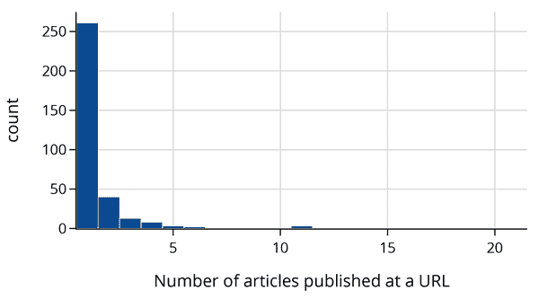

此直方图显示，绝大多数网站（337 中的 261 个）在训练集中只有一篇文章，只有少数网站在训练集中有超过五篇文章。尽管如此，识别发布最多假或真文章的网站可能具有信息量。首先，我们找出发布最多假文章的网站：

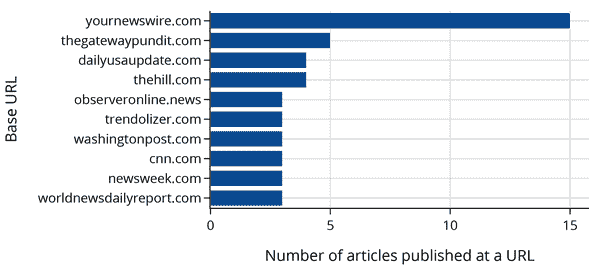

接下来，我们列出发布最多真实文章的网站：

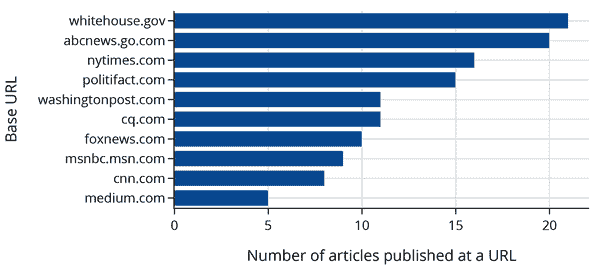

`cnn.com` 和 `washingtonpost.com` 出现在两个列表中。即使我们不知道这些网站的文章总数，我们可能会预期来自 `yournewswire.com` 的文章更有可能被标记为“假”，而来自 `whitehouse.gov` 的文章更有可能被标记为“真”。尽管如此，我们并不指望使用发布网站来预测文章的真实性会非常有效；数据集中大多数网站的文章数量实在太少。

接下来，让我们探索`timestamp`列，记录新闻文章的发布日期。

## 探索发布日期

将时间戳绘制在直方图上显示，大多数文章是在 2000 年之后发布的，尽管至少有一篇文章是在 1940 年之前发布的：

```py
`fig` `=` `px``.``histogram``(`
    `X_train``[``"``timestamp``"``]``,`
    `labels``=``{``"``value``"``:` `"``Publication year``"``}``,` `width``=``550``,` `height``=``250``,`
`)`
`fig``.``update_layout``(``showlegend``=``False``)`

```

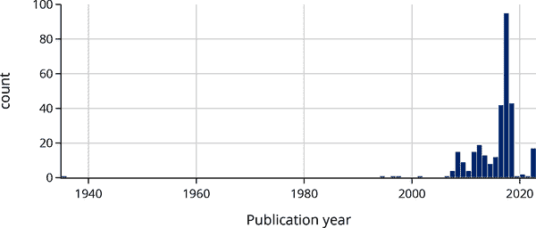

当我们更仔细地查看发布于 2000 年之前的新闻文章时，我们发现时间戳与文章的实际发布日期不符。这些日期问题很可能与网络爬虫从网页中收集到的不准确信息有关。我们可以放大直方图中 2000 年之后的区域：

```py
`fig` `=` `px``.``histogram``(`
    `X_train``.``loc``[``X_train``[``"``timestamp``"``]` `>` `"``2000``"``,` `"``timestamp``"``]``,`
    `labels``=``{``"``value``"``:` `"``Publication year``"``}``,` `width``=``550``,` `height``=``250``,` 
`)`
`fig``.``update_layout``(``showlegend``=``False``)`

```

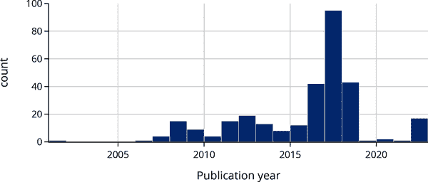

正如预期的那样，大多数文章是在 2007 年（Politifact 成立的年份）至 2020 年（FakeNewsNet 仓库发布的年份）之间发布的。但我们还发现，时间戳主要集中在 2016 年至 2018 年之间——这是有争议的 2016 年美国总统选举年及其后两年。这一发现进一步提示我们的分析局限性可能不适用于非选举年。

我们的主要目标是使用文本内容进行分类。接下来我们探索一些词频。

## 探索文章中的单词

我们想看看文章中使用的单词与文章是否被标记为“假”之间是否存在关系。一个简单的方法是查看像 *军事* 这样的单词，然后统计提到“军事”的文章中有多少被标记为“假”。对于 *军事* 来说，文章提到它的比例应该远高于或远低于数据集中的假文章比例 45%（数据集中假文章的比例：264/584）。

我们可以利用我们对政治话题的领域知识来挑选一些候选单词进行探索：

```py
word_features = [
    # names of presidential candidates
    'trump', 'clinton',
    # congress words
    'state', 'vote', 'congress', 'shutdown',

    # other possibly useful words
    'military', 'princ', 'investig', 'antifa', 
    'joke', 'homeless', 'swamp', 'cnn', 'the'
]

```

然后，我们定义一个函数，为每个单词创建一个新特征，如果文章中出现该单词，则特征为`True`，否则为`False`：

```py
`def` `make_word_features``(``df``,` `words``)``:`
    `features` `=` `{` `word``:` `df``[``'``content``'``]``.``str``.``contains``(``word``)` `for` `word` `in` `words` `}`
    `return` `pd``.``DataFrame``(``features``)`

```

这就像是单词存在的一种独热编码（参见第十五章）。我们可以使用这个函数进一步处理我们的数据，并创建一个包含每个选择的单词特征的新数据框架：

```py
`df_words` `=` `make_word_features``(``X_train``,` `word_features``)`
`df_words``[``"``label``"``]` `=` `df``[``"``label``"``]`

```

```py
`df_words``.``shape`

```

```py
(584, 16)

```

```py
`df_words``.``head``(``4``)`

```

|   | trump | clinton | state | vote | ... | swamp | cnn | the | label |
| --- | --- | --- | --- | --- | --- | --- | --- | --- | --- |
| **164** | False | False | True | False | ... | False | False | True | 1 |
| **28** | False | False | False | False | ... | False | False | True | 1 |
| **708** | False | False | True | True | ... | False | False | True | 0 |
| **193** | False | False | False | False | ... | False | False | True | 1 |

```py
4 rows × 16 columns
```

现在我们可以找出这些文章中被标记为`fake`的比例。我们在以下图表中可视化了这些计算结果。在左图中，我们用虚线标记了整个训练集中`fake`文章的比例，这有助于我们理解每个单词特征的信息量—一个高信息量的单词将使得其点远离该线：

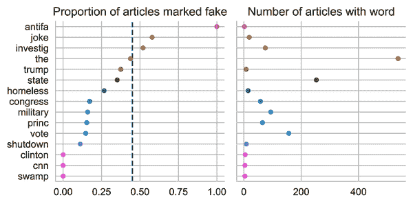

这个图表揭示了建模的一些有趣的考虑因素。例如，注意到单词*antifa*具有很高的预测性—所有提到单词*antifa*的文章都标记为`fake`。然而，*antifa*只出现在少数文章中。另一方面，单词*the*几乎出现在每篇文章中，但对于区分`real`和`fake`文章没有信息量，因为含有*the*的文章的比例与总体 fake 文章的比例相匹配。我们可能会更喜欢像*vote*这样的单词，它既有预测能力又出现在许多新闻文章中。

这个探索性分析使我们了解了我们的新闻文章发表的时间框架，数据中涵盖的广泛发布网站以及用于预测的候选词。接下来，我们为预测文章是真实还是虚假拟合模型。

# 建模

现在我们已经获得、清洗并探索了我们的数据，让我们拟合模型来预测文章是真实还是虚假。在本节中，我们使用逻辑回归因为我们面临二元分类问题。我们拟合了三种不同复杂度的模型。首先，我们拟合了一个仅使用单个手动选择的单词作为解释特征的模型。然后我们拟合了一个使用多个手动选择的单词的模型。最后，我们拟合了一个使用所有在训练集中的单词，并使用 tf-idf 转换向量化的模型（介绍见第十三章）。让我们从简单的单词模型开始。

## 单词模型

我们的探索性数据分析表明，单词*vote*与文章被标记为`real`或`fake`相关。为了验证这一点，我们使用一个二元特征拟合了逻辑回归模型：如果文章中出现单词*vote*则为`1`，否则为`0`。我们首先定义一个函数将文章内容转为小写：

```py
`def` `lowercase``(``df``)``:`
    `return` `df``.``assign``(``content``=``df``[``'``content``'``]``.``str``.``lower``(``)``)`

```

对于我们的第一个分类器，我们只使用单词*vote*：

```py
`one_word` `=` `[``'``vote``'``]`

```

我们可以将`lowercase`函数和来自我们的探索性数据分析的`make_word_features`函数链在一起成为一个`scikit-learn`管道。这提供了一种方便的方式来一次性地转换和拟合数据：

```py
`from` `sklearn``.``pipeline` `import` `make_pipeline`
`from` `sklearn``.``linear_model` `import` `LogisticRegressionCV`
`from` `sklearn``.``preprocessing` `import` `FunctionTransformer`

```

```py
`model1` `=` `make_pipeline``(`
    `FunctionTransformer``(``lowercase``)``,`
    `FunctionTransformer``(``make_word_features``,` `kw_args``=``{``'``words``'``:` `one_word``}``)``,`
    `LogisticRegressionCV``(``Cs``=``10``,` `solver``=``'``saga``'``,` `n_jobs``=``4``,` `max_iter``=``10000``)``,`
`)`

```

在使用时，前面的流水线将文章内容中的字符转换为小写，为每个感兴趣的单词创建一个二元特征的数据框，并使用<math><msub><mi>L</mi> <mn>2</mn></msub></math>正则化在数据上拟合逻辑回归模型。另外，`LogisticRegressionCV`函数使用交叉验证（默认为五折）来选择最佳的正则化参数。（有关正则化和交叉验证的更多信息，请参见第十六章。）

让我们使用管道来拟合训练数据：

```py
`%``%``time`

`model1``.``fit``(``X_train``,` `y_train``)`
`print``(``f``'``{``model1``.``score``(``X_train``,` `y_train``)``:``.1%``}` `accuracy on training set.``'``)`

```

```py
64.9% accuracy on training set.
CPU times: user 110 ms, sys: 42.7 ms, total: 152 ms
Wall time: 144 ms

```

总体而言，单词分类器只能正确分类 65% 的文章。我们在训练集上绘制分类器的混淆矩阵，以查看它所犯的错误类型：

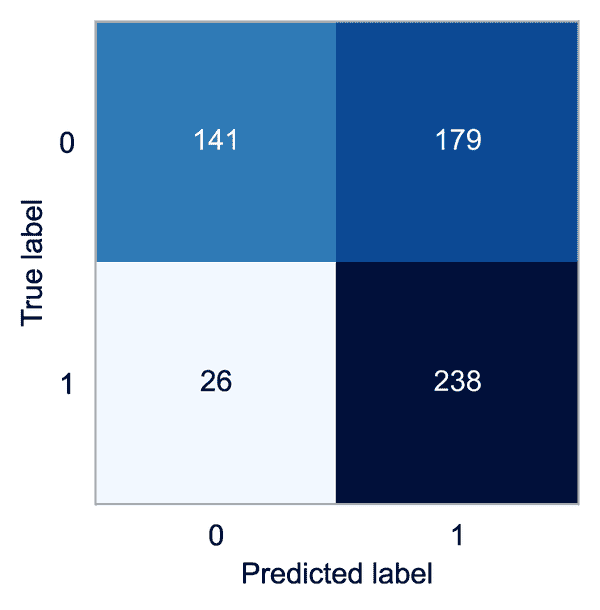

我们的模型经常将真实文章（0）错误地分类为虚假（1）。由于这个模型很简单，我们可以看一下这两种情况的概率：文章中是否包含*vote*这个词：

```py
"vote" present: [[0.72 0.28]]
"vote" absent: [[0.48 0.52]]

```

当文章包含*vote*这个词时，模型会给出文章为真实的高概率，而当*vote*缺失时，概率略微倾向于文章为虚假。我们鼓励读者使用逻辑回归模型的定义和拟合系数来验证这一点：

```py
`print``(``f``'``Intercept:` `{``log_reg``.``intercept_``[``0``]``:``.2f``}``'``)`
`[``[``coef``]``]` `=` `log_reg``.``coef_`
`print``(``f``'``"``vote``"` `Coefficient:` `{``coef``:``.2f``}``'``)`

```

```py
Intercept: 0.08
"vote" Coefficient: -1.00

```

正如我们在第十九章中看到的那样，系数表示随着解释变量的变化而发生的几率变化的大小。对于像文章中的一个 0-1 变量这样的变量，这有着特别直观的含义。对于一个包含*vote*的文章，其为虚假的几率会减少一个因子<math><mi>exp</mi> <mo>⁡</mo> <mo stretchy="false">(</mo> <msub><mi>θ</mi> <mrow><mi>v</mi> <mi>o</mi> <mi>t</mi> <mi>e</mi></mrow></msub> <mo stretchy="false">)</mo></math>，即：

```py
`np``.``exp``(``coef``)` 

```

```py
0.36836305405149367

```

###### 注意

请记住，在这种建模场景中，标签`0`表示真实文章，标签`1`表示虚假文章。这可能看起来有点反直觉—我们说“真正的正例”是当模型正确预测一篇虚假文章为虚假时。在二元分类中，我们通常说“正面”的结果是指存在某种不寻常情况的结果。例如，测试结果为阳性的人可能会有这种疾病。

让我们通过引入额外的单词特征来使我们的模型变得更加复杂一些。

## 多单词模型

我们创建了一个模型，该模型使用了我们在训练集的探索性数据分析（EDA）中检查过的所有单词，除了*the*。让我们使用这 15 个特征来拟合一个模型：

```py
`model2` `=` `make_pipeline``(`
    `FunctionTransformer``(``lowercase``)``,`
    `FunctionTransformer``(``make_word_features``,` `kw_args``=``{``'``words``'``:` `word_features``}``)``,`
    `LogisticRegressionCV``(``Cs``=``10``,` `solver``=``'``saga``'``,` `n_jobs``=``4``,` `max_iter``=``10000``)``,`
`)`

```

```py
`%``%``time`

`model2``.``fit``(``X_train``,` `y_train``)`
`print``(``f``'``{``model2``.``score``(``X_train``,` `y_train``)``:``.1%``}` `accuracy on training set.``'``)`

```

```py
74.8% accuracy on training set.
CPU times: user 1.54 s, sys: 59.1 ms, total: 1.6 s
Wall time: 637 ms

```

该模型比单词模型准确率高约 10 个百分点。从一个单词模型转换为一个 15 个单词模型仅获得 10 个百分点可能会有点令人惊讶。混淆矩阵有助于揭示出所犯错误的类型：

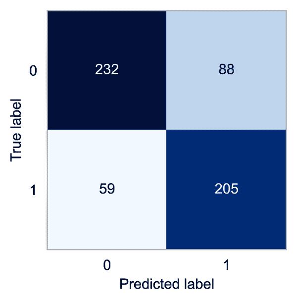

我们可以看到，这个分类器在准确分类真实文章方面做得更好。然而，在将虚假文章分类时，它会犯更多错误——有 59 篇虚假文章被错误分类为真实文章。在这种情况下，我们可能更关注将一篇文章误分类为虚假而实际上它是真实的。因此，我们希望有很高的精确度——正确预测为虚假文章的虚假文章比例：

```py
`model1_precision` `=` `238` `/` `(``238` `+` `179``)`
`model2_precision` `=` `205` `/` `(``205` `+` `88``)`

`[``round``(``num``,` `2``)` `for` `num` `in` `[``model1_precision``,` `model2_precision``]``]`

```

```py
[0.57, 0.7]

```

我们更大的模型中的精确度有所提高，但约有 30% 的被标记为虚假的文章实际上是真实的。让我们来看一下模型的系数：

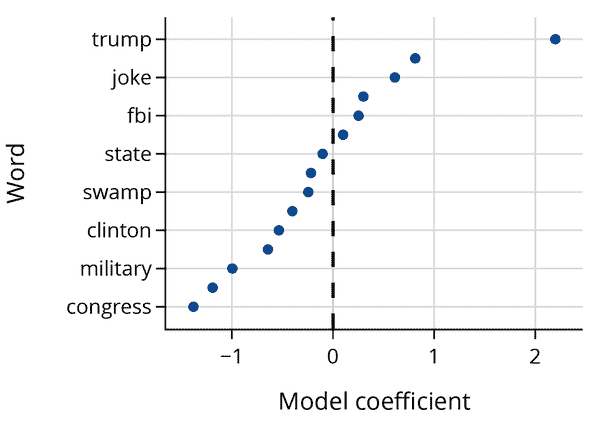

通过观察它们的符号，我们可以快速解释系数。*trump* 和 *investig* 上的大正值表明模型预测包含这些词的新文章更有可能是虚假的。对于像 *congress* 和 *vote* 这样具有负权重的词来说情况相反。我们可以使用这些系数来比较文章是否包含特定词时的对数几率。

尽管这个更大的模型的表现比简单的单词模型更好，但我们不得不使用我们对新闻的知识手动挑选单词特征。如果我们漏掉了高度预测性的词怎么办？为了解决这个问题，我们可以使用 tf-idf 转换将所有文章中的所有单词合并起来。

## 使用 tf-idf 转换进行预测

对于第三个也是最后一个模型，我们使用了第十三章中的 term frequency-inverse document frequency (tf-idf) 转换来向量化训练集中所有文章的整个文本。回想一下，使用此转换，一篇文章被转换为一个向量，其中每个词的出现次数在任何 564 篇文章中都会出现。该向量由词在文章中出现的次数的归一化计数组成，除以该词的稀有度。tf-idf 对仅出现在少数文档中的词赋予更高的权重。这意味着我们的分类器用于预测的是训练集新闻文章中的所有单词。正如我们之前介绍 tf-idf 时所做的那样，首先我们移除停用词，然后对单词进行标记化，最后我们使用 `scikit-learn` 中的 `TfidfVectorizer`：

```py
`tfidf` `=` `TfidfVectorizer``(``tokenizer``=``stemming_tokenizer``,` `token_pattern``=``None``)`

```

```py
`from` `sklearn``.``compose` `import` `make_column_transformer`

`model3` `=` `make_pipeline``(`
    `FunctionTransformer``(``lowercase``)``,`
    `make_column_transformer``(``(``tfidf``,` `'``content``'``)``)``,`
    `LogisticRegressionCV``(``Cs``=``10``,`
                         `solver``=``'``saga``'``,`
                         `n_jobs``=``8``,`
                         `max_iter``=``1000``)``,`
    `verbose``=``True``,`
`)`

```

```py
`%``%``time`

`model3``.``fit``(``X_train``,` `y_train``)`
`print``(``f``'``{``model3``.``score``(``X_train``,` `y_train``)``:``.1%``}` `accuracy on training set.``'``)`

```

```py
[Pipeline]  (step 1 of 3) Processing functiontransformer, total=   0.0s
[Pipeline] . (step 2 of 3) Processing columntransformer, total=  14.5s
[Pipeline]  (step 3 of 3) Processing logisticregressioncv, total=   6.3s
100.0% accuracy on training set.
CPU times: user 50.2 s, sys: 508 ms, total: 50.7 s
Wall time: 34.2 s

```

我们发现这个模型在训练集上实现了 100% 的准确率。我们可以查看 tf-idf 转换器来更好地理解模型。让我们首先找出分类器使用的唯一标记的数量：

```py
`tfidf` `=` `model3``.``named_steps``.``columntransformer``.``named_transformers_``.``tfidfvectorizer`
`n_unique_tokens` `=` `len``(``tfidf``.``vocabulary_``.``keys``(``)``)`
`print``(``f``'``{``n_unique_tokens``}` `tokens appeared across` `{``len``(``X_train``)``}` `examples.``'``)`

```

```py
23800 tokens appeared across 584 examples.

```

这意味着我们的分类器有 23,812 个特征，比我们之前的模型大幅增加，之前的模型只有 15 个。由于我们无法显示那么多模型权重，我们显示了 10 个最负和 10 个最正的权重：

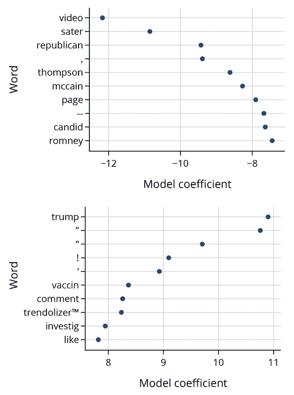

这些系数展示了该模型的一些怪癖。我们看到一些有影响力的特征对应于原始文本中的标点符号。目前尚不清楚我们是否应该清除模型中的标点符号。一方面，标点符号似乎没有单词传达的意义那么多。另一方面，似乎合理的是，例如，一篇文章中有很多感叹号可能有助于模型决定文章是真实还是假的。在这种情况下，我们决定保留标点符号，但是好奇的读者可以在去除标点符号后重复此分析，以查看生成的模型受到的影响。

最后，我们显示了所有三个模型的测试集误差：

|   | 测试集误差 |
| --- | --- |
| **模型 1** | 0.61 |
| **模型 2** | 0.70 |
| **模型 3** | 0.88 |

正如我们所预料的那样，随着我们引入更多的特征，模型变得更加准确。使用 tf-idf 的模型比使用二进制手工选择的词特征的模型表现要好得多，但是它没有达到在训练集上获得的 100% 准确率。这说明了建模中的一种常见权衡：在给定足够的数据的情况下，更复杂的模型通常可以胜过更简单的模型，特别是在这种情况研究中，更简单的模型有太多的模型偏差而表现不佳的情况下。但是，复杂的模型可能更难解释。例如，我们的 tf-idf 模型有超过 20,000 个特征，这使得基本上不可能解释我们的模型如何做出决策。此外，与模型 2 相比，tf-idf 模型需要更长时间进行预测——它的速度慢了 100 倍。在决定使用哪种模型时，所有这些因素都需要考虑在内。

另外，我们需要注意我们的模型适用于什么。在这种情况下，我们的模型使用新闻文章的内容进行预测，这使得它们高度依赖于出现在训练集中的单词。然而，我们的模型可能不会在未来的新闻文章上表现得像在训练集中没有出现的单词那样好。例如，我们的模型使用 2016 年美国选举候选人的名字进行预测，但是它们不会知道要在 2020 或 2024 年纳入候选人的名字。为了在较长时间内使用我们的模型，我们需要解决这个*漂移*问题。

话虽如此，令人惊讶的是，一个逻辑回归模型在相对较少的特征工程（tf-idf）下也能表现良好。我们已经回答了我们最初的研究问题：我们的 tf-idf 模型在检测我们数据集中的假新闻方面表现出色，而且可能可以推广到训练数据覆盖的同一时间段内发布的其他新闻。

# 摘要

我们很快就要结束本章，从而结束这本书。我们从讨论数据科学生命周期开始这本书。让我们再次看看生命周期，在 图 21-2 中，以欣赏您所学到的一切。

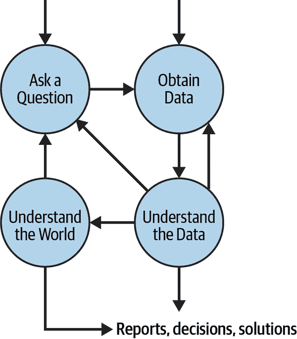

###### 图 21-2。数据科学生命周期的四个高级步骤，本书中我们详细探讨了每个步骤。

本案例研究逐步介绍了数据科学生命周期的每个阶段：

1.  许多数据分析从一个研究问题开始。本章中我们呈现的案例研究从询问我们是否可以创建自动检测假新闻模型开始。

1.  我们使用在线找到的代码将网页抓取到 JSON 文件中来获取数据。由于数据描述相对较少，我们需要清理数据以理解它。这包括创建新的特征来指示文章中特定词语的存在或缺失。

1.  我们的初步探索确定了可能对预测有用的单词。在拟合简单模型并探索它们的精确度和准确度后，我们进一步使用 tf-idf 转换文章，将每篇新闻文章转换为归一化的词向量。

1.  我们将向量化文本作为逻辑模型中的特征，并使用正则化和交叉验证拟合最终模型。最后，在测试集上找到拟合模型的准确度和精确度。

当我们像这样详细列出生命周期中的步骤时，步骤之间似乎流畅连接在一起。但现实是混乱的——正如图表所示，真实数据分析在各个步骤之间来回跳跃。例如，在我们的案例研究结束时，我们发现了可能促使我们重新访问生命周期早期阶段的数据清理问题。尽管我们的模型非常准确，但大部分训练数据来自 2016 年至 2018 年的时期，因此如果我们想要在该时间段之外的文章上使用它，就必须仔细评估模型的性能。

本质上，重要的是在数据分析的每个阶段牢记整个生命周期。作为数据科学家，你将被要求证明你的决策，这意味着你需要深入理解你的研究问题和数据。本书中的原则和技术将为你提供一套基础技能。在你的数据科学旅程中继续前进，我们建议你通过以下方式继续扩展你的技能：

+   重新审视本书的案例研究。首先复制我们的分析，然后深入探讨你对数据的疑问。

+   进行独立的数据分析。提出你感兴趣的研究问题，从网络中找到相关数据，并分析数据，看看数据与你的期望有多大匹配。这样做将使你对整个数据科学生命周期有第一手经验。

+   深入研究一个主题。我们在附加材料附录中提供了许多深入资源。选择你最感兴趣的资源，并深入了解。

世界需要像你这样能够利用数据得出结论的人，因此我们真诚地希望你能利用这些技能帮助他人制定有效的战略、打造更好的产品，并做出明智的决策。
