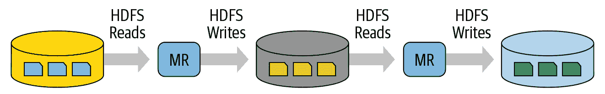
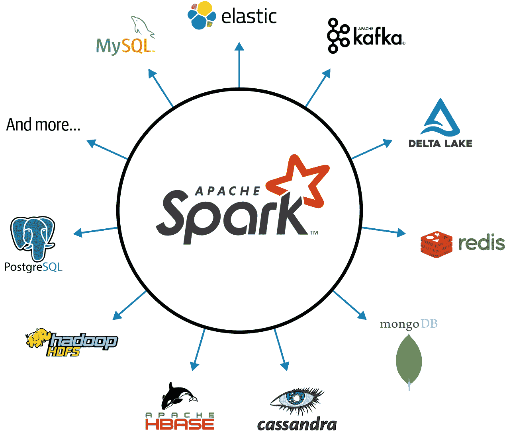
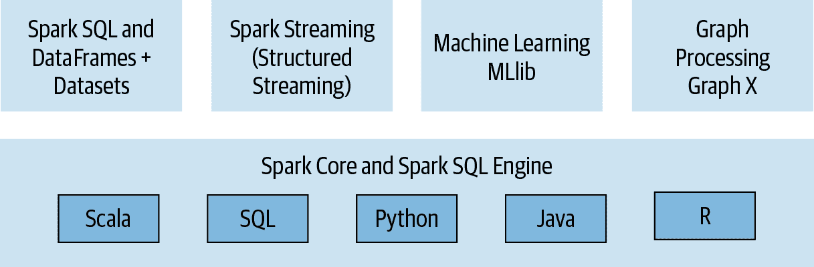
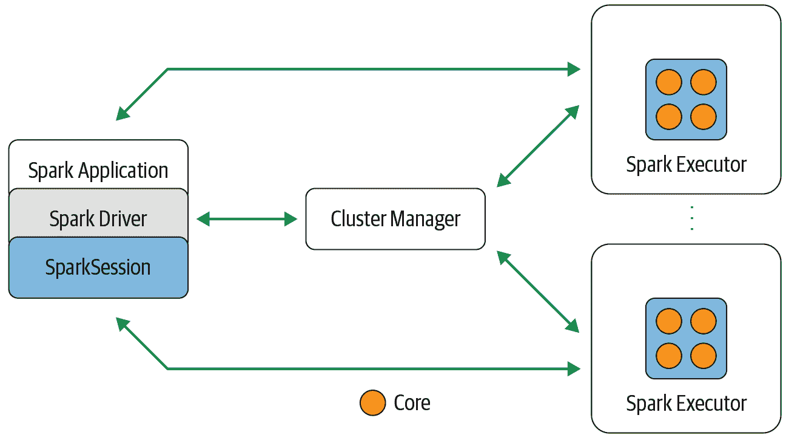
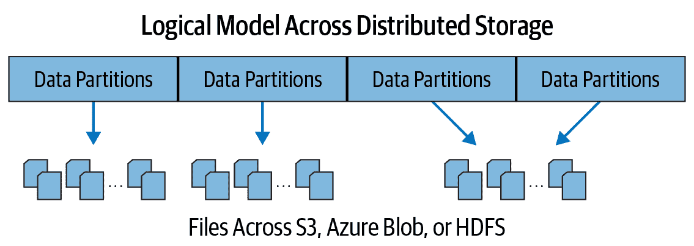
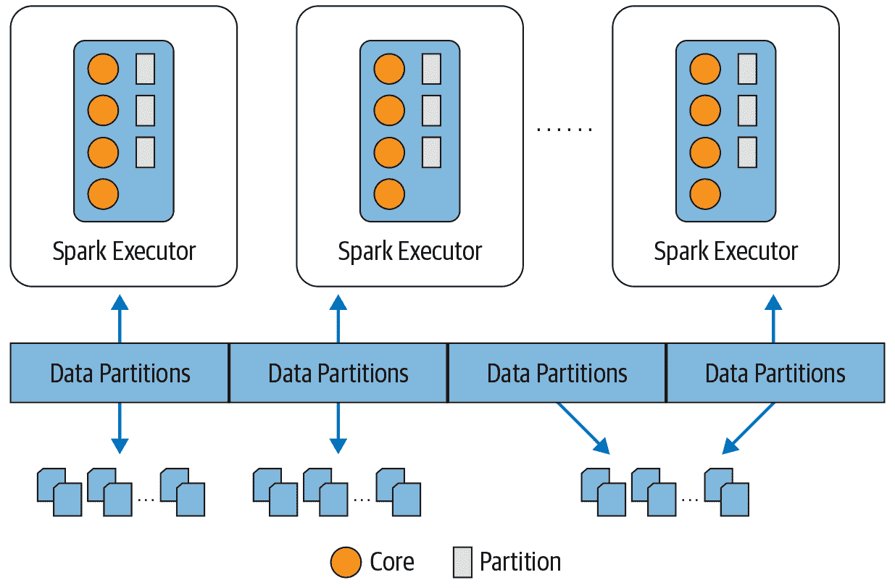
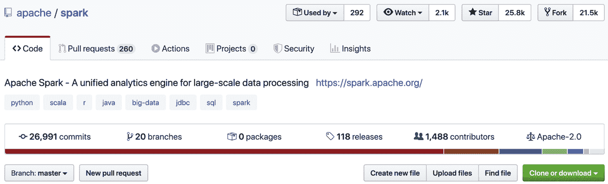

# 第一章：Apache Spark 简介：统一分析引擎

本章概述了 Apache Spark 的起源及其基本理念。它还介绍了项目的主要组件及其分布式架构。如果您熟悉 Spark 的历史和高级概念，可以跳过本章。

# Spark 的起源

在本节中，我们将梳理 Apache Spark 短暂发展的历程：它的起源、灵感以及在社区中作为事实上的大数据统一处理引擎的采用。

## 谷歌的大数据与分布式计算

当我们谈论规模时，我们不禁会想到谷歌搜索引擎在互联网上索引和搜索数据的闪电般速度。谷歌这个名字与规模是同义词。事实上，谷歌是对数学术语 *googol* 的故意拼写错误：那是 1 加上 100 个零！

传统的存储系统如关系数据库管理系统（RDBMS）和命令式编程方式都无法处理谷歌希望构建和搜索互联网索引文档的规模。由此产生的需求推动了 [*Google File System*（GFS）](https://oreil.ly/-6H9D)、[*MapReduce*（MR）](https://oreil.ly/08zaO) 和 [*Bigtable*](https://oreil.ly/KfS8C) 的创建。

虽然 GFS 在集群农场的许多廉价硬件服务器上提供了容错和分布式文件系统，但 Bigtable 在 GFS 上提供了结构化数据的可扩展存储。MR 引入了一种基于函数式编程的新并行编程范式，用于在分布在 GFS 和 Bigtable 上的数据上进行大规模处理。

本质上，您的 MR 应用与 [MapReduce 系统](https://oreil.ly/T0f8r) 交互，将计算代码（映射和减少函数）发送到数据所在的位置，支持数据局部性和集群机架亲和性，而不是将数据带到应用程序。

工作节点聚合和减少中间计算，通过减少函数生成最终附加输出，然后将其写入分布式存储中，供应用程序访问。这种方法显著减少了网络流量，并使大部分输入/输出（I/O）保持在本地磁盘而非分布在网络上。

虽然谷歌的大部分工作是专有的，但上述三篇论文中表达的思想在开源社区中激发了创新思想，尤其是在雅虎等面对类似大规模数据挑战的地方。

## 雅虎的 Hadoop！

谷歌的 GFS 论文中表达的计算挑战和解决方案为[Hadoop 文件系统（HDFS）](https://oreil.ly/JfsBd)提供了一个蓝图，包括作为分布式计算框架的 MapReduce 实现。2006 年 4 月捐赠给[Apache 软件基金会（ASF）](https://www.apache.org/)，这成为了相关模块的 Apache Hadoop 框架的一部分：Hadoop Common、MapReduce、HDFS 和 Apache Hadoop YARN。

虽然 Apache Hadoop 在 Yahoo!之外获得了广泛应用，激发了一个庞大的开源社区，吸引了许多贡献者和两家基于开源的商业公司（Cloudera 和 Hortonworks，现已合并），但在 HDFS 上的 MapReduce 框架存在一些不足之处。

首先，它很难管理和管理，操作复杂性令人生畏。其次，其一般批处理 MapReduce API 冗长，需要大量样板设置代码，容错性脆弱。第三，对于具有许多 MR 任务对的大批量数据作业，每对任务的中间计算结果都写入本地磁盘以供后续阶段操作使用（参见图 1-1）。这种重复的磁盘 I/O 操作付出了代价：大规模 MR 作业可能运行数小时甚至数天。



###### 图 1-1\. 在映射和减少计算之间间歇性迭代的读写

最后，尽管 Hadoop MR 有助于一般批处理的大规模作业，但它在结合其他工作负载（如机器学习、流处理或交互式 SQL 查询）方面表现不佳。

为了处理这些新的工作负载，工程师们开发了定制系统（如 Apache Hive、Apache Storm、Apache Impala、Apache Giraph、Apache Drill、Apache Mahout 等），每个系统都有自己的 API 和集群配置，进一步增加了 Hadoop 的操作复杂性和开发人员的陡峭学习曲线。

当时的问题是（牢记 Alan Kay 的格言：“简单的事情应该简单，复杂的事情应该可能”），是否有办法使 Hadoop 和 MR 更简单更快？

## Spark 在 AMPLab 的早期发展阶段

加州大学伯克利分校的研究人员曾参与过 Hadoop MapReduce 项目，他们接受了这一挑战，并启动了一个名为*Spark*的项目。他们意识到 MR 在交互式或迭代计算作业中效率低下（或难以解决），且是一个复杂的学习框架，因此从一开始就采纳了使 Spark 更简单、更快、更易用的理念。这项努力始于 2009 年的 RAD 实验室，后来成为 AMPLab（现在被称为 RISELab）。

早期关于 Spark 的论文表明，对于某些工作，它比 Hadoop MapReduce 快 10 到 20 倍。今天，它比前者快几个数量级。Spark 项目的核心目标是借鉴 Hadoop MapReduce 的思想，但增强系统：使其高度容错和尴尬并行，支持在迭代和交互式映射和减少计算之间的中间结果内存存储，提供多语言作为编程模型的简单和可组合的 API，并统一支持其他工作负载。我们很快会回到这个统一的概念，因为这是 Spark 中的重要主题。

到了 2013 年，Spark 已被广泛使用，其原始创作者和研究人员之一 —— Matei Zaharia、Ali Ghodsi、Reynold Xin、Patrick Wendell、Ion Stoica 和 Andy Konwinski —— 将 Spark 项目捐赠给 ASF，并成立了名为 Databricks 的公司。

Databricks 和开源社区的开发者们在 Apache Spark 1.0 发布于 2014 年 5 月，由 ASF 管理。这个首个重要版本为未来频繁发布和 Databricks 以及超过 100 家商业供应商贡献显著特性奠定了基础。

# 什么是 Apache Spark？

Apache Spark 是一个统一引擎，专为大规模分布式数据处理设计，可以在数据中心或云中进行。

Spark 提供内存存储以进行中间计算，使其比 Hadoop MapReduce 快得多。它包含具有可组合 API 的库，用于机器学习（MLlib）、交互式查询的 SQL（Spark SQL）、与实时数据交互的流处理（Structured Streaming）以及图处理（GraphX）。

Spark 的设计理念围绕着四个关键特性展开：

+   速度

+   使用便捷性

+   模块化

+   可扩展性

让我们看看这对框架意味着什么。

## 速度

Spark 在多个方面追求速度目标。首先，其内部实现受益于硬件行业近年来在提高 CPU 和内存价格性能方面的巨大进展。如今的商品服务器价格便宜，拥有数百 GB 的内存、多个核心，并且基于 Unix 的操作系统利用高效的多线程和并行处理。框架被优化以充分利用所有这些因素。

其次，Spark 将其查询计算构建为有向无环图（DAG）；其 DAG 调度器和查询优化器构建了一个高效的计算图，通常可以分解为在集群上的工作节点上并行执行的任务。第三，其物理执行引擎 Tungsten 使用整体阶段代码生成来生成紧凑的执行代码（我们将在第三章中讨论 SQL 优化和整体阶段代码生成）。

所有中间结果保留在内存中，并且其有限的磁盘 I/O 使其性能大幅提升。

## 使用简便性

Spark 通过提供一个名为 Resilient Distributed Dataset（RDD）的简单逻辑数据结构的基本抽象来实现简化。所有其他高级结构化数据抽象（如 DataFrames 和 Datasets）都是在此基础上构建的。通过提供一组*转换*和*操作*作为*操作*，Spark 提供了一个简单的编程模型，您可以在熟悉的语言中使用它来构建大数据应用程序。

## 模块化

Spark 操作可应用于多种工作负载类型，并在支持的编程语言（Scala、Java、Python、SQL 和 R）中表达。Spark 提供了统一的库，具有良好文档化的 API，包括以下核心组件模块：Spark SQL、Spark Structured Streaming、Spark MLlib 和 GraphX，将所有工作负载组合在一个引擎下运行。我们将在下一节详细介绍所有这些内容。

您可以编写一个单一的 Spark 应用程序，可以处理所有内容——无需为不同的工作负载使用不同的引擎，也无需学习单独的 API。使用 Spark，您可以获得一个统一的处理引擎来处理您的工作负载。

## 可扩展性

Spark 专注于其快速的并行计算引擎，而不是存储。与同时包括存储和计算的 Apache Hadoop 不同，Spark 将这两者解耦。这意味着您可以使用 Spark 来读取存储在多种来源中的数据——如 Apache Hadoop、Apache Cassandra、Apache HBase、MongoDB、Apache Hive、RDBMS 等，并在内存中处理。Spark 的`DataFrameReader`和`DataFrameWriter`还可以扩展到从其他来源（如 Apache Kafka、Kinesis、Azure Storage 和 Amazon S3）读取数据，将其读入其逻辑数据抽象中，并对其进行操作。

Spark 开发者社区维护着一个[第三方 Spark 包](https://oreil.ly/2tIVP)列表，作为不断增长的生态系统的一部分（见图 1-2）。这个丰富的软件包生态系统包括用于各种外部数据源的 Spark 连接器、性能监视器等。



###### 图 1-2\. Apache Spark 生态系统的连接器

# 统一分析

尽管统一化的概念并不是 Spark 独有的，但它是其设计哲学和演变的核心组成部分。2016 年 11 月，计算机协会（ACM）认可了 Apache Spark，并授予其原始创作者的杰出 ACM 奖，以表彰他们关于 Apache Spark 作为“大数据处理统一引擎”的[论文](https://oreil.ly/eak-T)。获奖论文指出，Spark 取代了所有独立的批处理、图形、流和查询引擎，如 Storm、Impala、Dremel、Pregel 等，使用一个统一的组件堆栈来处理各种工作负载。

## Apache Spark 组件作为统一堆栈

如图 1-3 所示，Spark 提供了四个不同的组件作为用于各种工作负载的库：Spark SQL，Spark MLlib，Spark Structured Streaming 和 GraphX。每个组件都与 Spark 核心的容错引擎分开，您可以使用 API 编写您的 Spark 应用程序，Spark 将其转换为由核心引擎执行的 DAG。因此，无论您是使用提供的结构化 API（我们将在第三章中介绍）还是在 Java、R、Scala、SQL 或 Python 中编写 Spark 代码，底层代码都会被分解为高度紧凑的字节码，在集群中的工作节点的 JVM 中执行。



###### 图 1-3\. Apache Spark 组件和 API 堆栈

让我们更详细地看一下这些组件。

### Spark SQL

该模块适用于结构化数据。您可以读取存储在关系数据库表中的数据或从带有结构化数据的文件格式（CSV、文本、JSON、Avro、ORC、Parquet 等）中读取数据，然后在 Spark 中构建永久或临时表。此外，当使用 Java、Python、Scala 或 R 中的 Spark 结构化 API 时，您可以组合类似 SQL 的查询来查询刚刚读入 Spark DataFrame 中的数据。迄今为止，Spark SQL 符合[ANSI SQL:2003 标准](https://oreil.ly/pJq1C)，它也可以作为纯 SQL 引擎运行。

例如，在这个 Scala 代码片段中，您可以从存储在 Amazon S3 上的 JSON 文件中读取数据，创建一个临时表，并对读入内存的 Spark DataFrame 执行类似 SQL 的查询：

```
// In Scala
// Read data off Amazon S3 bucket into a Spark DataFrame
spark.read.json("s3://apache_spark/data/committers.json")
  .createOrReplaceTempView("committers")
// Issue a SQL query and return the result as a Spark DataFrame
val results = spark.sql("""SELECT name, org, module, release, num_commits
 FROM committers WHERE module = 'mllib' AND num_commits > 10
 ORDER BY num_commits DESC""")
```

您可以在 Python、R 或 Java 中编写类似的代码片段，生成的字节码将是相同的，从而获得相同的性能。

### Spark MLlib

Spark 附带一个包含常见机器学习（ML）算法的库，称为 MLlib。自 Spark 首次发布以来，由于 Spark 2.x 底层引擎的增强，此库组件的性能显著提高。MLlib 提供许多流行的机器学习算法，构建在基于高级 DataFrame 的 API 之上，用于构建模型。

###### 注意

自 Apache Spark 1.6 起，[MLlib 项目](https://oreil.ly/cyc1c) 分为两个包：`spark.mllib` 和 `spark.ml`。基于 DataFrame 的 API 属于后者，而前者包含基于 RDD 的 API，现已处于维护模式。所有新功能都集中在 `spark.ml` 中。本书将“MLlib”称为 Apache Spark 中机器学习的总体库。

这些 API 允许您提取或转换特征、构建流水线（用于训练和评估），以及持久化模型（用于保存和重新加载）。附加工具包括使用常见线性代数运算和统计学。MLlib 还包括其他低级别的 ML 原语，包括通用梯度下降优化。以下 Python 代码片段封装了数据科学家在构建模型时可能进行的基本操作（更详细的示例将在第 10 和第十一章中讨论）：

```
# In Python
from pyspark.ml.classification import LogisticRegression
...
training = spark.read.csv("s3://...")
test = spark.read.csv("s3://...")

# Load training data
lr = LogisticRegression(maxIter=10, regParam=0.3, elasticNetParam=0.8)

# Fit the model
lrModel = lr.fit(training)

# Predict
lrModel.transform(test)
...
```

### Spark 结构化流处理

Apache Spark 2.0 引入了一个实验性的[持续流处理模型](https://oreil.ly/YJSEq)和基于 DataFrame 的 [结构化流处理 API](https://oreil.ly/NYYsJ)，构建在 Spark SQL 引擎之上。到 Spark 2.2，结构化流处理已经普遍可用，意味着开发者可以在生产环境中使用它。

对于大数据开发者而言，需要实时结合和响应来自 Apache Kafka 等引擎及其他流数据源的静态数据和流数据。新模型将流视为持续增长的表，新的数据行追加到末尾。开发者可以将其简单地视为结构化表，并像对待静态表一样进行查询。

在结构化流处理模型下，Spark SQL 核心引擎处理所有容错和延迟数据语义的方面，使开发者能够相对轻松地编写流处理应用程序。这种新模型取代了 Spark 1.x 系列中的旧 DStreams 模型，我们将在第 Chapter 8 中详细讨论。此外，Spark 2.x 和 Spark 3.0 扩展了流数据源的范围，包括 Apache Kafka、Kinesis 和基于 HDFS 或云存储的数据源。

以下代码片段展示了结构化流处理应用程序的典型结构。它从本地主机的套接字读取，并将词频统计结果写入 Apache Kafka 主题：

```
# In Python
# Read a stream from a local host
from pyspark.sql.functions import explode, split
lines = (spark 
  .readStream
  .format("socket")
  .option("host", "localhost")
  .option("port", 9999)
  .load())

# Perform transformation
# Split the lines into words
words = lines.select(explode(split(lines.value, " ")).alias("word"))

# Generate running word count
word_counts = words.groupBy("word").count()

# Write out to the stream to Kafka
query = (word_counts
  .writeStream 
  .format("kafka") 
  .option("topic", "output"))
```

### GraphX

如其名，GraphX 是一个用于操作图形的库（例如社交网络图、路由和连接点或网络拓扑图），并执行图形并行计算。它提供了标准的图形分析、连接和遍历算法，社区用户贡献的算法包括 PageRank、连通组件和三角形计数。¹

这段代码片段展示了如何使用 GraphX API 简单地连接两个图形：

```
// In Scala
val graph = Graph(vertices, edges)
messages = spark.textFile("hdfs://...")
val graph2 = graph.joinVertices(messages) {
  (id, vertex, msg) => ...
}
```

## Apache Spark 的分布式执行

如果你已经阅读到这里，你已经知道 Spark 是一个分布式数据处理引擎，其组件在机群上协作工作。在我们探索本书后续章节中关于 Spark 编程之前，你需要理解 Spark 分布式架构的所有组件如何协同工作和通信，以及可用的部署模式。

让我们从查看图 1-4 中显示的每个个体组件及其如何适应架构开始。在 Spark 架构的高层次上，一个 Spark 应用程序由负责在 Spark 集群上协调并行操作的驱动程序组成。驱动程序通过`SparkSession`访问集群中的分布式组件。



###### 图 1-4\. Apache Spark 的组件和架构

### Spark 驱动程序

作为负责实例化`SparkSession`的 Spark 应用程序的一部分，Spark 驱动程序具有多重角色：它与集群管理器通信；它请求来自集群管理器的资源（CPU、内存等）给 Spark 的执行器（JVMs）；它将所有 Spark 操作转换为 DAG 计算，安排它们，并将它们作为任务分发到 Spark 执行器中。一旦资源分配完成，它直接与执行器通信。

### SparkSession

在 Spark 2.0 中，`SparkSession`成为了所有 Spark 操作和数据的统一通道。它不仅[取代了以前的 Spark 入口点](https://oreil.ly/Ap0Pq)，如`SparkContext`、`SQLContext`、`HiveContext`、`SparkConf`和`StreamingContext`，而且使得使用 Spark 变得更简单更容易。

###### 注意

尽管在 Spark 2.x 中`SparkSession`取代了所有其他上下文，你仍然可以访问各个上下文及其各自的方法。这样做是为了保持向后兼容性。也就是说，你的旧 1.x 版本的代码中使用`SparkContext`或`SQLContext`仍然可以工作。

通过这个统一通道，你可以创建 JVM 运行时参数，定义 DataFrames 和 Datasets，从数据源读取数据，访问目录元数据，并执行 Spark SQL 查询。`SparkSession`为所有 Spark 功能提供了单一统一的入口点。

在独立的 Spark 应用程序中，你可以使用所选编程语言中的一个高级 API 来创建`SparkSession`。在 Spark shell 中（更多内容请参阅下一章节），`SparkSession`会为你创建，并且可以通过全局变量`spark`或`sc`访问它。

在 Spark 1.x 中，您必须创建各种上下文（用于流处理、SQL 等），引入额外的样板代码。而在 Spark 2.x 应用程序中，您可以为每个 JVM 创建一个 `SparkSession`，并使用它执行多个 Spark 操作。

我们来看一个例子：

```
// In Scala
import org.apache.spark.sql.SparkSession

// Build SparkSession
val spark = SparkSession
  .builder
  .appName("LearnSpark")
  .config("spark.sql.shuffle.partitions", 6)
  .getOrCreate()
...
// Use the session to read JSON 
val people = spark.read.json("...")
...
// Use the session to issue a SQL query
val resultsDF = spark.sql("SELECT city, pop, state, zip FROM table_name")
```

### 集群管理器

集群管理器负责管理和分配运行 Spark 应用程序的节点集群的资源。目前，Spark 支持四种集群管理器：内置独立集群管理器、Apache Hadoop YARN、Apache Mesos 和 Kubernetes。

### Spark 执行器

Spark 执行器在集群中的每个工作节点上运行。执行器与驱动程序通信，并负责在工作节点上执行任务。在大多数部署模式中，每个节点上只运行一个执行器。

### 部署模式

Spark 的一个吸引人的特点是其支持多种部署模式，使得 Spark 能够在不同的配置和环境中运行。由于集群管理器对其运行位置不加区分（只要能管理 Spark 的执行器并满足资源请求），Spark 可以部署在一些最流行的环境中，比如 Apache Hadoop YARN 和 Kubernetes，并且可以以不同的模式运行。表 1-1 总结了可用的部署模式。

表 1-1\. Spark 部署模式速查表

| Mode | Spark 驱动程序 | Spark 执行器 | 集群管理器 |
| --- | --- | --- | --- |
| Local | 在单个 JVM 上运行，比如笔记本电脑或单节点 | 在与驱动程序相同的 JVM 上运行 | 在相同的主机上运行 |
| Standalone | 可以在集群中的任何节点上运行 | 集群中的每个节点将启动自己的执行器 JVM | 可以随意分配到集群中的任何主机上 |
| YARN (client) | 运行在客户端，不是集群的一部分 | YARN 的 NodeManager 容器 | YARN 的资源管理器与 YARN 的应用程序主管一起为执行器在 NodeManagers 上分配容器 |
| YARN (cluster) | 与 YARN Application Master 一起运行 | 与 YARN 客户端模式相同 | 与 YARN 客户端模式相同 |
| Kubernetes | 运行在 Kubernetes 的 pod 中 | 每个 worker 在自己的 pod 中运行 | Kubernetes Master |

### 分布式数据和分区

实际的物理数据分布在存储中，作为驻留在 HDFS 或云存储中的分区（见图 1-5）。虽然数据作为分区分布在物理集群中，但 Spark 将每个分区视为高级逻辑数据抽象——即内存中的 DataFrame。尽管这并非总是可能，但每个 Spark 执行器最好被分配一个需要它读取最接近它的网络中分区的任务，以保证数据本地性。



###### 图 1-5\. 数据分布在物理机器上

分区允许有效的并行处理。将数据分解成块或分区的分布方案允许 Spark 执行器仅处理靠近它们的数据，从而最小化网络带宽。也就是说，每个执行器的核心被分配了自己的数据分区来处理（见图 1-6）。



###### 图 1-6\. 每个执行器的核心获得一个数据分区来处理

例如，这段代码片段将把存储在集群中的物理数据分割成八个分区，每个执行器将获取一个或多个分区读入其内存：

```
# In Python
log_df = spark.read.text("path_to_large_text_file").repartition(8)
print(log_df.rdd.getNumPartitions())
```

这段代码将在内存中创建一个包含 10,000 个整数的 DataFrame，分布在八个分区中：

```
# In Python
df = spark.range(0, 10000, 1, 8)
print(df.rdd.getNumPartitions())
```

这两个代码片段都将打印出`8`。

在第三章和第七章中，我们将讨论如何调整和更改分区配置，以实现基于执行器核心数量的最大并行性。

# 开发者的体验

在所有开发者的喜悦中，没有比一组可组合的 API 更吸引人的了，它们可以提高生产力，易于使用，直观且表达力强。Apache Spark 最主要吸引开发者的一个特点是其[易于使用的 API](https://oreil.ly/80dKh)，可用于操作小到大的数据集，跨语言：Scala、Java、Python、SQL 和 R。

Spark 2.x 背后的一个主要动机是通过限制开发者需要处理的概念数量来统一和简化框架。Spark 2.x 引入了更高级别的抽象 API，作为特定领域语言构造，这使得编写 Spark 程序变得高度表达性和开发体验愉快。您只需表达您希望任务或操作计算什么，而不是如何计算它，并让 Spark 来确定如何为您最好地执行。我们将在第三章介绍这些结构化 API，但首先让我们看看 Spark 开发者是谁。

## 谁在使用 Spark，以及用途是什么？

毫不奇怪，大多数处理大数据的开发者是数据工程师、数据科学家或机器学习工程师。他们被吸引到 Spark，因为它允许他们使用单一引擎构建各种应用程序，并使用熟悉的编程语言。

当然，开发者可能会穿很多帽子，有时会同时执行数据科学和数据工程任务，特别是在初创公司或较小的工程团队中。然而，在所有这些任务中，数据——大量的数据——是基础。

### 数据科学任务

作为在大数据时代崭露头角的学科，数据科学是利用数据讲述故事的过程。但在他们能够叙述故事之前，数据科学家必须清洗数据，探索数据以发现模式，并建立模型以预测或建议结果。其中一些任务需要统计学、数学、计算机科学和编程的知识。

大多数数据科学家擅长使用 SQL 等分析工具，熟悉 NumPy 和 pandas 等库，能够使用 R 和 Python 等编程语言。但他们还必须知道如何*处理*或*转换*数据，以及如何使用成熟的分类、回归或聚类算法来构建模型。他们的任务通常是迭代的、交互式的或临时的，或者是为了验证他们的假设进行实验性的。

幸运的是，Spark 支持这些不同的工具。Spark 的 MLlib 提供了一套通用的机器学习算法来构建模型管道，使用高级估计器、转换器和数据特征化工具。Spark SQL 和 Spark Shell 支持对数据的交互式和临时探索。

此外，Spark 使数据科学家能够处理大数据集并扩展其模型训练和评估。Apache Spark 2.4 作为[Project Hydrogen](https://oreil.ly/8h3wr)的一部分引入了新的集群调度程序，以适应分布式训练和调度深度学习模型的容错需求，而 Spark 3.0 引入了在独立、YARN 和 Kubernetes 部署模式下支持 GPU 资源收集的能力。这意味着那些需要深度学习技术的开发人员可以使用 Spark。

### 数据工程任务

在建立模型之后，数据科学家经常需要与其他团队成员合作，这些成员可能负责部署模型。或者他们可能需要与其他人密切合作，将原始的肮脏数据转换为干净的数据，以便其他数据科学家轻松消费或使用。例如，分类或聚类模型并不孤立存在；它们与诸如 Web 应用程序或 Apache Kafka 等流引擎之类的其他组件一起工作，或作为更大数据管道的一部分。这种管道通常由数据工程师构建。

数据工程师对软件工程原则和方法论有很强的理解，并具备构建可扩展数据管道以支持业务用例的技能。数据管道使得从多种来源获取的原始数据能够进行端到端的转换——数据被清洗，以便下游开发者使用，存储在云中或 NoSQL 或 RDBMS 中进行报告生成，或通过商业智能工具对数据分析师可访问。

Spark 2.x 引入了一种称为[*continuous applications*](https://oreil.ly/p0_fC)的进化流处理模型，结构化流处理（在第八章中详细讨论）。通过结构化流处理 API，数据工程师可以构建复杂的数据管道，从实时和静态数据源进行 ETL 数据处理。

数据工程师使用 Spark，因为它提供了并行化计算的简便方式，并隐藏了分布和容错的所有复杂性。这使他们能够专注于使用基于高级 DataFrame 的 API 和领域特定语言（DSL）查询来进行 ETL，读取和合并来自多个源的数据。

由于[Catalyst 优化器](https://oreil.ly/pAHKJ)用于 SQL 和[Tungsten](https://oreil.ly/nIE6h)用于紧凑代码生成，Spark 2.x 和 Spark 3.0 中的性能提升大大简化了数据工程师的生活。他们可以选择使用适合手头任务的三种[Spark API](https://oreil.ly/c1sf8)之一——RDDs、DataFrames 或 Datasets，并享受 Spark 带来的益处。

### 热门的 Spark 使用案例

无论您是数据工程师、数据科学家还是机器学习工程师，您都会发现 Spark 在以下用例中非常有用：

+   并行处理分布在集群中的大数据集

+   执行自由查询或交互式查询以探索和可视化数据集

+   使用 MLlib 构建、训练和评估机器学习模型

+   从多种数据流实现端到端数据管道

+   分析图数据集和社交网络

## 社区采纳与扩展

毫不奇怪，Apache Spark 在开源社区中引起了共鸣，尤其是在数据工程师和数据科学家中间。其设计理念及其作为 Apache 软件基金会项目的纳入，引发了开发者社区的极大兴趣。

全球有超过 600 个[Apache Spark Meetup 小组](https://oreil.ly/XjqQN)，近 50 万名成员。每周，世界各地都有人在 Meetup 或会议上发表演讲或分享博客文章，介绍如何使用 Spark 构建数据流水线。[Spark + AI Summit](https://oreil.ly/G9vYT)是专注于 Spark 在机器学习、数据工程和数据科学等多个垂直领域应用的最大会议。

自 2014 年 Spark 首次发布 1.0 版本以来，已发布了许多次次要和主要版本，其中最近的主要版本是 2020 年的 Spark 3.0。本书将涵盖 Spark 2.x 和 Spark 3.0 的各个方面。到出版时，社区将已发布 Spark 3.0，并且本书中的大部分代码已经在 Spark 3.0-preview2 上进行了测试。

在其发布过程中，Spark 一直吸引着来自全球和多个组织的贡献者。目前，Spark 拥有近 1,500 名贡献者，超过 100 次发布，21,000 个分支，以及约 27,000 次提交，正如图 1-7 所示。我们希望当你阅读完这本书后，也会产生贡献的冲动。



###### 图 1-7\. Apache Spark 在 GitHub 上的状态（来源：[`github.com/apache/spark`](https://github.com/apache/spark)）

现在我们可以开始关注学习的乐趣——在哪里以及如何开始使用 Spark。下一章，我们将向你展示如何通过三个简单的步骤快速启动 Spark。

¹ 作为开源项目由 Databricks 贡献给社区，[GraphFrames](https://oreil.ly/_JGxi) 是一个通用的图处理库，类似于 Apache Spark 的 GraphX，但使用基于 DataFrame 的 API。
