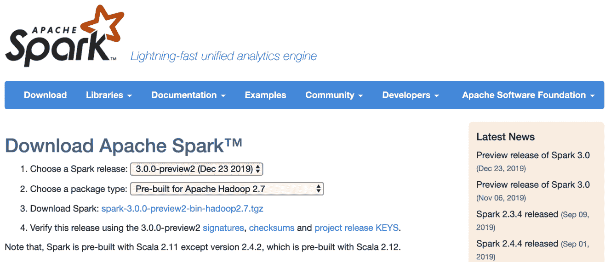
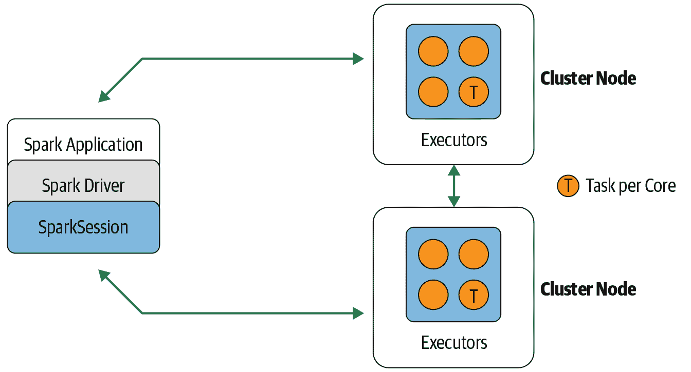
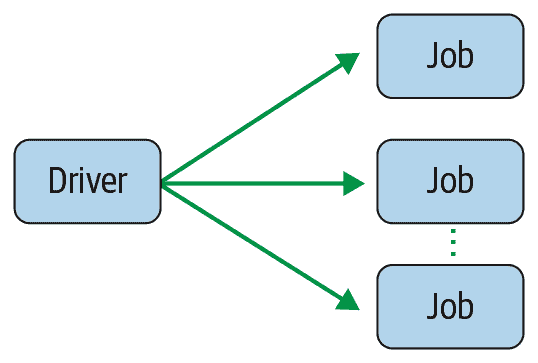
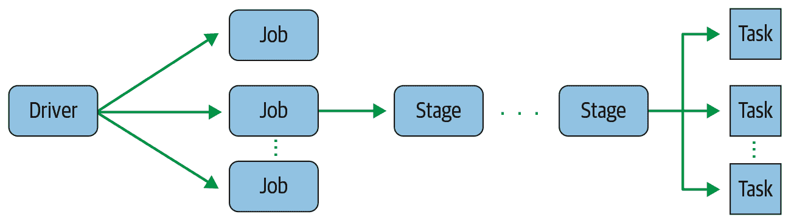
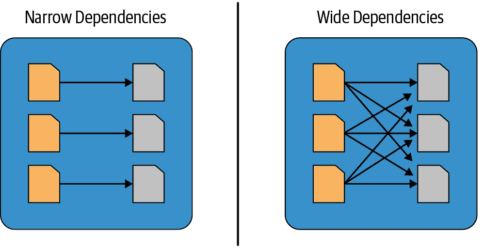
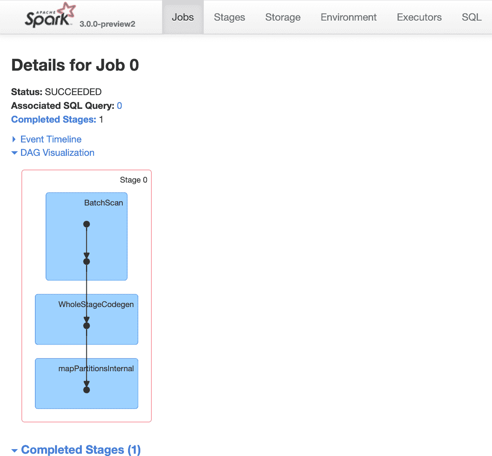
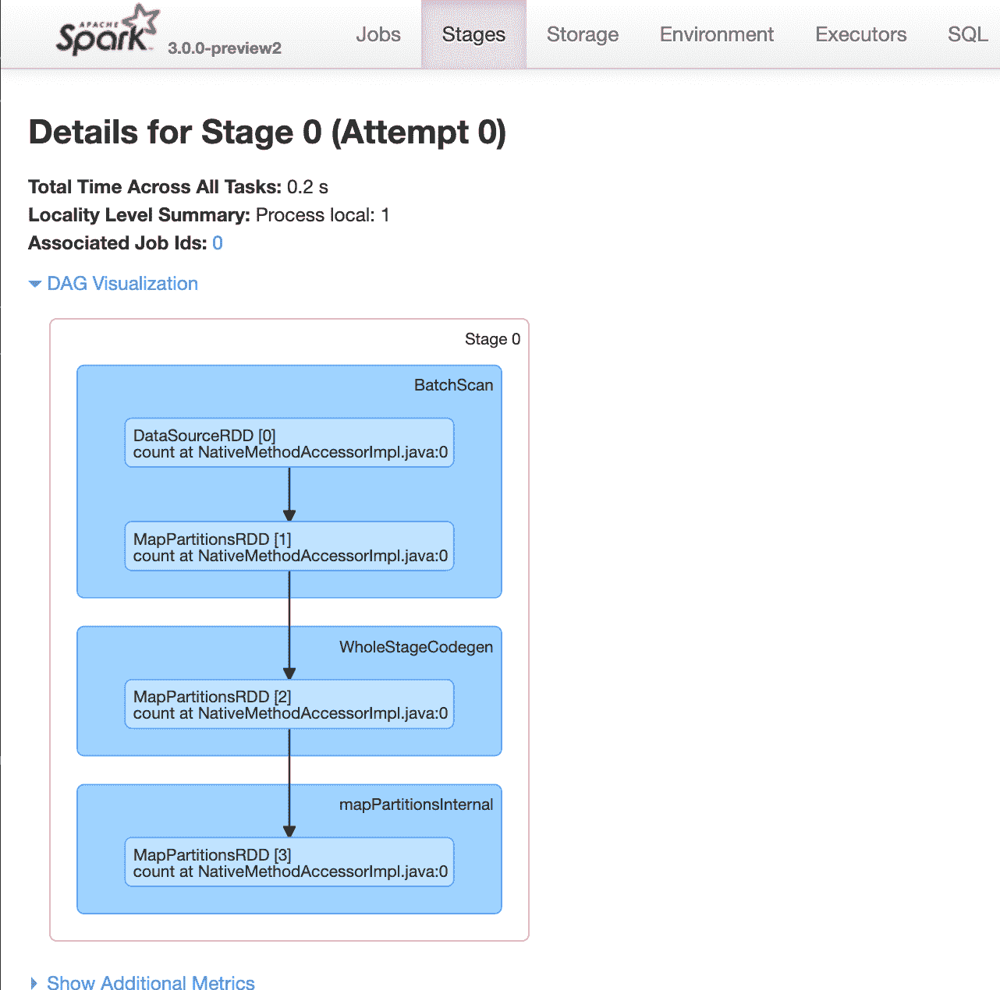

# 第二章：下载 Apache Spark 并开始

在本章中，我们将帮助你设置 Spark，并通过三个简单的步骤来开始编写你的第一个独立应用程序。

我们将使用本地模式，在 Spark shell 中所有处理都在单台机器上完成——这是学习框架的简单方法，提供了迭代执行 Spark 操作的快速反馈循环。使用 Spark shell，你可以在小数据集上原型化 Spark 操作，然后再编写复杂的 Spark 应用程序，但对于大数据集或实际工作中希望利用分布式执行优势的场景，本地模式不适用——你应该使用 YARN 或 Kubernetes 部署模式。

虽然 Spark shell 只支持 Scala、Python 和 R，但你可以使用任何支持的语言（包括 Java）编写 Spark 应用程序，并在 Spark SQL 中发出查询。我们期望你对所选择的语言有一定的熟悉度。

# 第 1 步：下载 Apache Spark

要开始，请访问 [Spark 下载页面](https://oreil.ly/tbKY2)，在第 2 步的下拉菜单中选择 “Pre-built for Apache Hadoop 2.7”，然后在第 3 步点击 “Download Spark” 链接（见 图 2-1）。



###### 图 2-1。Apache Spark 下载页面

这将下载 *spark-3.0.0-preview2-bin-hadoop2.7.tgz* 压缩包，其中包含在笔记本电脑上以本地模式运行 Spark 所需的所有与 Hadoop 相关的二进制文件。或者，如果你要安装到现有的 HDFS 或 Hadoop 安装中，可以从下拉菜单中选择匹配的 Hadoop 版本。如何从源代码构建超出了本书的范围，但你可以在 [文档](https://oreil.ly/fOyIN) 中了解更多。

###### 注意

在本书印刷时，Apache Spark 3.0 仍处于预览模式，但你可以使用相同的下载方法和说明下载最新的 Spark 3.0 版本。

自 Apache Spark 2.2 发布以来，仅关心在 Python 中学习 Spark 的开发人员可以选择从 [PyPI 仓库](https://oreil.ly/gyAi8) 安装 PySpark。如果你只使用 Python 编程，就无需安装运行 Scala、Java 或 R 所需的所有其他库；这使得二进制文件更小。要从 PyPI 安装 PySpark，只需运行 `pip install pyspark`。

对于 SQL、ML 和 MLlib，可以通过 `pip install pyspark[sql,ml,mllib]` 安装一些额外的依赖项（或者如果只需要 SQL 依赖项，可以使用 `pip install pyspark[sql]`）。

###### 注意

你需要在计算机上安装 Java 8 或更高版本，并设置 `JAVA_HOME` 环境变量。请参阅 [文档](https://oreil.ly/c19W9) 以获取有关如何下载和安装 Java 的说明。

如果您想在交互式 shell 模式下运行 R，您必须先[安装 R](https://www.r-project.org)，然后运行 `sparkR`。要使用 R 进行分布式计算，还可以使用由 R 社区创建的开源项目[`sparklyr`](https://github.com/sparklyr/sparklyr)。

## Spark 的目录和文件

我们假设您在您的笔记本电脑或集群上运行 Linux 或 macOS 操作系统的某个版本，并且本书中的所有命令和说明都将使用这种风格。一旦您完成下载 tarball，`cd`到下载的目录，使用 `tar -xf spark-3.0.0-preview2-bin-hadoop2.7.tgz` 提取 tarball 内容，然后`cd`到该目录并查看内容：

```
$ cd spark-3.0.0-preview2-bin-hadoop2.7
$ **ls**
LICENSE   R          RELEASE   conf    examples   kubernetes  python   yarn
NOTICE    README.md  bin       data    jars       licenses    sbin
```

让我们简要总结一下这些文件和目录的意图和目的。在 Spark 2.x 和 3.0 中添加了新项，并且某些现有文件和目录的内容也发生了变化：

README.md

这个文件包含了如何使用 Spark shell、从源代码构建 Spark、运行独立 Spark 示例、查阅 Spark 文档和配置指南以及为 Spark 做贡献的详细说明。

bin

正如其名称所示，这个目录包含大多数用于与 Spark 交互的脚本，包括`Spark shells`（`spark-sql`、`pyspark`、`spark-shell`和`sparkR`）。我们将在本章后面使用这些 shell 和可执行文件提交一个独立的 Spark 应用程序，使用`spark-submit`，并编写一个脚本，在支持 Kubernetes 的 Spark 上运行时构建和推送 Docker 镜像。

sbin

这个目录中的大多数脚本都是用于在集群中以各种部署模式启动和停止 Spark 组件的管理目的。有关部署模式的详细信息，请参阅表 1-1 中的速查表，位于第 1 章中。

kubernetes

自 Spark 2.4 发布以来，这个目录包含用于在 Kubernetes 集群上为您的 Spark 分发创建 Docker 镜像的 Dockerfile。它还包含一个文件，提供了在构建您的 Docker 镜像之前如何构建 Spark 分发的说明。

data

这个目录中填充了作为 Spark 组件输入的**.txt*文件：MLlib、Structured Streaming 和 GraphX。

examples

对于任何开发者，简化学习任何新平台之旅的两个关键点是大量的“如何”代码示例和全面的文档。Spark 提供了 Java、Python、R 和 Scala 的示例，当学习框架时，您会想要使用它们。我们将在本章和后续章节中提到一些这些示例。

# 第 2 步：使用 Scala 或 PySpark Shell

如前所述，Spark 带有四种广泛使用的解释器，它们像交互式的“shell”一样，支持临时数据分析：`pyspark`，`spark-shell`，`spark-sql`和`sparkR`。在很多方面，它们的交互性模拟了您可能已经熟悉的 Python、Scala、R、SQL 或 Unix 操作系统的 shell，如 bash 或 Bourne shell。

这些 shell 已经增强，支持连接到集群并允许您将分布式数据加载到 Spark 工作节点的内存中。无论您处理的是几千兆字节的数据还是小数据集，Spark shell 都有助于快速学习 Spark。

要启动 PySpark，请`cd`到*bin*目录，并键入`**pyspark**`以启动 shell。如果您已从 PyPI 安装了 PySpark，则仅需键入`**pyspark**`即可：

```
$ **pyspark**
Python 3.7.3 (default, Mar 27 2019, 09:23:15)
[Clang 10.0.1 (clang-1001.0.46.3)] on darwin
Type "help", "copyright", "credits" or "license" for more information.
20/02/16 19:28:48 WARN NativeCodeLoader: Unable to load native-hadoop library 
for your platform... using builtin-java classes where applicable
Welcome to
      ____              __
     / __/__  ___ _____/ /__
    _\ \/ _ \/ _ `/ __/  '_/
   /__ / .__/\_,_/_/ /_/\_\   version 3.0.0-preview2
      /_/

Using Python version 3.7.3 (default, Mar 27 2019 09:23:15)
SparkSession available as 'spark'.
>>> **spark.version**
'3.0.0-preview2'
>>>
```

要启动一个类似的 Scala Spark shell，`cd`到*bin*目录，然后键入`**spark-shell**`：

```
$ spark-shell
20/05/07 19:30:26 WARN NativeCodeLoader: Unable to load native-hadoop library 
for your platform... using builtin-java classes where applicable
Spark context Web UI available at http://10.0.1.7:4040
Spark context available as 'sc' (master = local[*], app id = local-1581910231902)
Spark session available as 'spark'.
Welcome to

      ____              __
     / __/__  ___ _____/ /__
    _\ \/ _ \/ _ `/ __/  '_/
   /___/ .__/\_,_/_/ /_/\_\   version 3.0.0-preview2
      /_/

Using Scala version 2.12.10 (Java HotSpot(TM) 64-Bit Server VM, Java 1.8.0_241)
Type in expressions to have them evaluated.
Type :help for more information.
scala> **spark.version**
res0: String = 3.0.0-preview2
scala>
```

## 使用本地机器

现在您已经在本地机器上下载并安装了 Spark，在本章的其余部分中，您将使用本地的 Spark 解释器 shell。也就是说，Spark 将在本地模式下运行。

###### 注意

请参考 Table 1-1 在 Chapter 1 中，以提醒您本地模式下哪些组件运行在哪里。

如前一章所述，Spark 计算被表达为操作。这些操作然后被转换为基于低级 RDD 的字节码作为任务，并分布到 Spark 的执行器进行执行。

让我们看一个简短的示例，在此示例中，我们将文本文件读取为 DataFrame，展示读取的字符串样本，并计算文件中的总行数。这个简单的示例演示了高级结构化 API 的使用，我们将在下一章中介绍。在 Scala shell 中，`show(10, false)`操作在 DataFrame 上只显示前 10 行而不截断；默认情况下，`truncate`布尔标志为`true`。下面是在 Scala shell 中的示例：

```
scala> val strings = spark.read.text("../README.md")
strings: org.apache.spark.sql.DataFrame = [value: string]

scala> strings.show(10, false)
+------------------------------------------------------------------------------+
|value                                                                         |
+------------------------------------------------------------------------------+
|# Apache Spark                                                                |
|                                                                              |
|Spark is a unified analytics engine for large-scale data processing. It       |
|provides high-level APIs in Scala, Java, Python, and R, and an optimized      |
|engine that supports general computation graphs for data analysis. It also    |
|supports a rich set of higher-level tools including Spark SQL for SQL and     |
|DataFrames, MLlib for machine learning, GraphX for graph processing,          |
| and Structured Streaming for stream processing.                              |
|                                                                              |
|<https://spark.apache.org/>                                                   |
+------------------------------------------------------------------------------+
only showing top 10 rows

scala> strings.count()
res2: Long = 109
scala>
```

相当简单。让我们看一个使用 Python 解释器`pyspark`的类似示例：

```
$ pyspark
Python 3.7.3 (default, Mar 27 2019, 09:23:15)
[Clang 10.0.1 (clang-1001.0.46.3)] on darwin
Type "help", "copyright", "credits" or "license" for more information.
WARNING: An illegal reflective access operation has occurred
WARNING: Illegal reflective access by org.apache.spark.unsafe.Platform 
WARNING: Use --illegal-access=warn to enable warnings of further illegal 
reflective access operations
WARNING: All illegal access operations will be denied in a future release
20/01/10 11:28:29 WARN NativeCodeLoader: Unable to load native-hadoop library 
for your platform... using builtin-java classes where applicable
Using Spark's default log4j profile: org/apache/spark/log4j-defaults.properties
Setting default log level to "WARN".
To adjust logging level use sc.setLogLevel(newLevel). For SparkR, use 
setLogLevel(newLevel).
Welcome to

      ____              __
     / __/__  ___ _____/ /__
    _\ \/ _ \/ _ `/ __/  '_/
   /__ / .__/\_,_/_/ /_/\_\   version 3.0.0-preview2
      /_/

Using Python version 3.7.3 (default, Mar 27 2019 09:23:15)
SparkSession available as 'spark'.
>>> **strings = spark.read.text("../README.md")**
>>> **strings.show(10, truncate=False)**
+------------------------------------------------------------------------------+
|value                                                                         |
+------------------------------------------------------------------------------+
|# Apache Spark                                                                |
|                                                                              |
|Spark is a unified analytics engine for large-scale data processing. It       |
|provides high-level APIs in Scala, Java, Python, and R, and an optimized      |
|engine that supports general computation graphs for data analysis. It also    |
|supports a rich set of higher-level tools including Spark SQL for SQL and     |
|DataFrames, MLlib for machine learning, GraphX for graph processing,          |
|and Structured Streaming for stream processing.                               |
|                                                                              |
|<https://spark.apache.org/>                                                   |
+------------------------------------------------------------------------------+
only showing top 10 rows

>>> **strings.count()**
109
>>>
```

要退出任何 Spark shell，请按 Ctrl-D。正如您所看到的，与 Spark shell 的快速交互不仅有助于快速学习，也有助于快速原型开发。

在上述示例中，请注意 Scala 和 Python 之间的 API 语法和签名的一致性。在 Spark 从 1.x 版本到现在的演变过程中，这是持久改进之一。

还请注意，我们使用了高级结构化 API 来将文本文件读取为 Spark DataFrame，而不是 RDD。在本书中，我们将更多地关注这些结构化 API；自 Spark 2.x 以来，RDD 已被归类为低级 API。

###### 注意

在高级结构化 API 中表达的每个计算都被分解为低级优化和生成的 RDD 操作，然后转换为执行器的 JVM 的 Scala 字节码。生成的 RDD 操作代码对用户不可访问，也与用户面向的 RDD API 不同。

# 步骤 3: 理解 Spark 应用概念

现在您已经下载了 Spark，在您的笔记本电脑上以独立模式安装了它，在 Spark shell 中启动了它，并且交互地执行了一些简短的代码示例，您已经准备好迈出最后一步。

要了解我们示例代码底层发生的情况，您需要熟悉一些关键的 Spark 应用概念，以及代码如何作为跨 Spark 执行器的任务转换和执行。我们将从定义一些重要术语开始：

应用

使用其 API 构建的用户程序的一部分。它包括群集上的驱动程序和执行器。

`SparkSession`

一个提供与底层 Spark 功能交互的入口点，并允许使用其 API 编程 Spark 的对象。在交互式 Spark shell 中，Spark 驱动程序为您实例化一个`SparkSession`，而在 Spark 应用程序中，您自己创建一个`SparkSession`对象。

作业

作为响应于 Spark 动作（如`save()`、`collect()`）而生成的多个任务的并行计算。

阶段

每个作业被划分为称为阶段的较小任务集，这些阶段彼此依赖。

任务

一个将被发送到 Spark 执行器的工作或执行的单元。

让我们更详细地探讨这些概念。

## Spark 应用程序和 SparkSession

每个 Spark 应用程序的核心是 Spark 驱动程序程序，它创建一个`SparkSession`对象。当您使用 Spark shell 时，驱动程序是 shell 的一部分，并且`SparkSession`对象（通过变量`spark`访问）在您启动 shell 时已经为您创建，就像在之前的示例中看到的那样。

在这些示例中，因为您在本地笔记本电脑上启动了 Spark shell，所有操作都在单个 JVM 中本地运行。但是，您可以轻松地启动一个 Spark shell，在集群上并行分析数据，就像在本地模式下一样。命令`spark-shell --help`或`pyspark --help`将向您展示如何连接到 Spark 群集管理器。图 2-2 展示了在此操作后 Spark 在集群上执行的方式。



###### 图 2-2\. Spark 组件通过 Spark 驱动程序在 Spark 的分布式架构中进行通信。

一旦您拥有了`SparkSession`，您就可以使用[API 编程 Spark](https://oreil.ly/2r5Xo)来执行 Spark 操作。

## Spark 作业

在与 Spark shell 的交互会话中，驱动程序将您的 Spark 应用程序转换为一个或多个 Spark 作业（图 2-3）。然后将每个作业转换为 DAG。这本质上就是 Spark 的执行计划，其中 DAG 中的每个节点可以是单个或多个 Spark 阶段。



###### 图 2-3\. Spark 驱动程序创建一个或多个 Spark 作业

## Spark 阶段

作为 DAG 节点的一部分，阶段基于可以串行或并行执行的操作创建（图 2-4）。并非所有 Spark 操作都可以在单个阶段中进行，因此它们可能会分成多个阶段。通常，阶段在运算符的计算边界上界定，它们指示 Spark 执行器之间的数据传输。


###### 图 2-4\. Spark 作业创建一个或多个阶段

## Spark 任务

每个阶段由 Spark 任务（执行的单位）组成，然后在每个 Spark 执行器上进行联合；每个任务映射到单个核心并在单个数据分区上工作（图 2-5）。因此，具有 16 个核心的执行器可以并行处理 16 个或更多任务，从而使 Spark 任务的执行极为并行化！



###### 图 2-5\. Spark 阶段创建一个或多个任务以分配给执行器

# 转换、动作和惰性评估

Spark 对分布式数据的操作可以分为两种类型：*转换* 和 *动作*。转换顾名思义，将 Spark DataFrame 转换为新的 DataFrame 而不改变原始数据，具有不可变性的属性。换句话说，诸如 `select()` 或 `filter()` 的操作不会改变原始 DataFrame；相反，它将返回操作的转换结果作为新的 DataFrame。

所有转换都是惰性评估的。也就是说，它们的结果不会立即计算，而是被记录或记忆为 *血统*。记录的血统允许 Spark 在执行计划的稍后时间重新排列某些转换，将其合并，或者优化转换为更有效的阶段。惰性评估是 Spark 延迟执行的策略，直到调用动作或数据被“触及”（从磁盘读取或写入）。

动作触发了所有记录转换的惰性评估。在 图 2-6 中，所有转换 T 被记录，直到调用动作 A。每个转换 T 产生一个新的 DataFrame。


###### 图 2-6\. 懒惰的转换和渴望的动作

惰性评估使得 Spark 能够通过查看链式转换来优化查询，而血统和数据不可变性则提供了容错能力。由于 Spark 记录了每个转换的血统，并且在转换之间的 DataFrame 是不可变的，它可以通过简单地重放记录的血统来恢复其原始状态，从而在发生故障时具有容错能力。

表 2-1 列出了一些转换和操作的示例。

表 2-1\. Spark 操作的转换和操作

| 转换 | 操作 |
| --- | --- |
| `orderBy()` | `show()` |
| `groupBy()` | `take()` |
| `filter()` | `count()` |
| `select()` | `collect()` |
| `join()` | `save()` |

操作和转换贡献到了一个 Spark 查询计划中，我们将在下一章中讨论它。在执行查询计划之前，不会执行任何操作。下面的示例，以 Python 和 Scala 两种语言显示，有两个转换——`read()` 和 `filter()`——以及一个操作——`count()`。操作触发了作为查询执行计划的一部分记录的所有转换的执行。在这个示例中，直到在 shell 中执行 `filtered.count()` 之前，什么都不会发生：

```
# In Python 
>>> `strings` `=` `spark``.``read``.``text``(``"``../README.md``"``)`
>>> `filtered` `=` `strings``.``filter``(``strings``.``value``.``contains``(``"``Spark``"``)``)`
>>> `filtered``.``count``(``)`
20
```

```
// In Scala scala> `import` `org.apache.spark.sql.functions._`
scala> `val` `strings` `=` `spark``.``read``.``text``(``"../README.md"``)`
scala> `val` `filtered` `=` `strings``.``filter``(``col``(``"value"``)``.``contains``(``"Spark"``)``)`
scala> `filtered``.``count``(``)`
res5: Long = 20
```

## 窄转换和宽转换

如前所述，转换是 Spark 惰性评估的操作。惰性评估方案的一个巨大优势在于，Spark 能够检查您的计算查询并确定如何优化它。此优化可以通过连接或流水线一些操作并将它们分配到一个阶段，或者通过确定哪些操作需要在集群之间进行数据洗牌或交换来进行。这将这些操作分解成阶段。

转换可以被分类为具有 *窄依赖* 或 *宽依赖*。任何一个可以从单个输入分区计算单个输出分区的转换都是 *窄* 转换。例如，在前面的代码片段中，`filter()` 和 `contains()` 表示窄转换，因为它们可以在单个分区上操作并产生结果输出分区而无需交换任何数据。

然而，`groupBy()` 或 `orderBy()` 指示 Spark 执行 *宽* 转换，从而读取来自其他分区的数据，将其组合并写入磁盘。由于每个分区将有其自己的包含 “Spark” 词的单词计数的数据行，一个计数 (`groupBy()`) 将会强制进行来自执行器分区的数据在集群中的洗牌。在这个转换中，`orderBy()` 需要来自其他分区的输出来计算最终的聚合。

图 2-7 描述了两种依赖关系的类型。



###### 图 2-7\. 窄转换与宽转换

# Spark UI

Spark 包含一个[图形用户界面](https://oreil.ly/AXg5h)，您可以使用它来检查或监视 Spark 应用程序在其不同分解阶段（即作业、阶段和任务）的情况。根据 Spark 的部署方式，驱动程序会启动一个 Web UI，默认运行在 4040 端口，您可以查看诸如以下详细信息和指标：

+   调度器阶段和任务的列表

+   RDD 大小和内存使用情况的摘要

+   关于环境的信息

+   运行执行器的信息

+   所有的 Spark SQL 查询

在本地模式下，您可以在 Web 浏览器中访问 *http://<localhost>:4040* 来访问此界面。

###### 注意

当您启动 `spark-shell` 时，输出的一部分显示了本地主机的 URL，以访问 4040 端口。

让我们检查前一节中 Python 示例如何转换为作业、阶段和任务。要查看 DAG 的外观，请在 Web UI 中点击“DAG 可视化”。正如图 2-8 所示，驱动程序创建了一个作业和一个阶段。



###### 图 2-8\. 我们简单 Python 示例的 DAG

请注意，由于只有一个阶段，不存在需要在执行器之间交换数据的“交换”操作。阶段的各个操作显示为蓝色框。

阶段 0 由一个任务组成。如果有多个任务，它们将并行执行。您可以在“阶段”选项卡中查看每个阶段的详细信息，如图 2-9 所示。



###### 图 2-9\. 阶段 0 的详细信息

我们将在第七章中更详细地介绍 Spark UI。现在，只需注意 UI 提供了一种深入了解 Spark 内部工作的微观镜头，作为调试和检查工具。

# 您的第一个独立应用程序

为了便于学习和探索，Spark 发行版附带了每个 Spark 组件的一组示例应用程序。您可以浏览安装位置中的 *examples* 目录，以了解可用内容。

从本地机器上的安装目录，您可以使用命令 `bin/run-example *<class> [params]*` 运行提供的几个 Java 或 Scala 示例程序之一。例如：

```
$ **./bin/run-example JavaWordCount README.md**
```

这将在控制台上输出 `INFO` 消息，以及 *README.md* 文件中每个单词及其计数的列表（计数单词是分布式计算的“Hello, World”）。

## 为 Cookie Monster 计算 M&M 的数量

在前面的示例中，我们统计了文件中的单词。如果文件很大，它将分布在由数据的小块组成的集群中，我们的 Spark 程序将分发任务，计算每个分区中每个单词的计数，并返回最终聚合的计数。但是，这个示例已经变成了一个陈词滥调。

让我们解决一个类似的问题，但使用更大的数据集和更多 Spark 分布功能和 DataFrame APIs。我们将在后面的章节中介绍本程序中使用的 APIs，但现在请稍等片刻。

这本书的作者中有一位数据科学家，她喜欢在烤饼干时加入 M&M，并且在她经常教授机器学习和数据科学课程的美国州份给她的学生批量提供这些饼干作为奖励。但显然她是数据驱动的，她希望确保在不同州份的学生得到正确颜色的 M&M 饼干（见 Figure 2-11）。


###### 图 2-11\. M&M 按颜色分布（来源：[*https://oreil.ly/mhWIT*](https://oreil.ly/mhWIT)）

让我们编写一个 Spark 程序，读取一个包含超过 100,000 条记录的文件（每行或行有一个 `<*state*, *mnm_color*, *count*>`），并计算并聚合每种颜色和州的计数。这些聚合计数告诉我们每个州学生喜欢的 M&M 颜色。详细的 Python 代码清单见 Example 2-1。

##### Example 2-1\. 计数和聚合 M&M（Python 版本）

```
# Import the necessary libraries.
# Since we are using Python, import the SparkSession and related functions
# from the PySpark module.
import sys

from pyspark.sql import SparkSession
from pyspark.sql.functions import count

if __name__ == "__main__":
   if len(sys.argv) != 2:
       print("Usage: mnmcount <file>", file=sys.stderr)
       sys.exit(-1)

   # Build a SparkSession using the SparkSession APIs.
   # If one does not exist, then create an instance. There
   # can only be one SparkSession per JVM.
   spark = (SparkSession
     .builder
     .appName("PythonMnMCount")
     .getOrCreate())
   # Get the M&M data set filename from the command-line arguments
   mnm_file = sys.argv[1]
   # Read the file into a Spark DataFrame using the CSV
   # format by inferring the schema and specifying that the
   # file contains a header, which provides column names for comma-
   # separated fields.
   mnm_df = (spark.read.format("csv") 
     .option("header", "true") 
     .option("inferSchema", "true") 
     .load(mnm_file))

   # We use the DataFrame high-level APIs. Note
   # that we don't use RDDs at all. Because some of Spark's 
   # functions return the same object, we can chain function calls.
   # 1\. Select from the DataFrame the fields "State", "Color", and "Count"
   # 2\. Since we want to group each state and its M&M color count,
   #    we use groupBy()
   # 3\. Aggregate counts of all colors and groupBy() State and Color
   # 4  orderBy() in descending order
   count_mnm_df = (mnm_df
     .select("State", "Color", "Count") 
     .groupBy("State", "Color") 
     .agg(count("Count").alias("Total")) 
     .orderBy("Total", ascending=False))
   # Show the resulting aggregations for all the states and colors;
   # a total count of each color per state.
   # Note show() is an action, which will trigger the above
   # query to be executed.
   count_mnm_df.show(n=60, truncate=False)
   print("Total Rows = %d" % (count_mnm_df.count()))
   # While the above code aggregated and counted for all 
   # the states, what if we just want to see the data for 
   # a single state, e.g., CA? 
   # 1\. Select from all rows in the DataFrame
   # 2\. Filter only CA state
   # 3\. groupBy() State and Color as we did above
   # 4\. Aggregate the counts for each color
   # 5\. orderBy() in descending order 
   # Find the aggregate count for California by filtering
   ca_count_mnm_df = (mnm_df
     .select("State", "Color", "Count") 
     .where(mnm_df.State == "CA") 
     .groupBy("State", "Color") 
     .agg(count("Count").alias("Total")) 
     .orderBy("Total", ascending=False))
   # Show the resulting aggregation for California.
   # As above, show() is an action that will trigger the execution of the
   # entire computation. 
   ca_count_mnm_df.show(n=10, truncate=False)
   # Stop the SparkSession
   spark.stop()
```

你可以使用你喜欢的编辑器将此代码输入到名为 *mnmcount.py* 的 Python 文件中，从本书的 [GitHub repo](https://github.com/databricks/LearningSparkV2) 下载 *mnn_dataset.csv* 文件，并使用安装目录中的 *bin* 目录中的 `submit-spark` 脚本将其作为 Spark 作业提交。将你的 `SPARK_HOME` 环境变量设置为你在本地机器上安装 Spark 的根级目录。

###### 注意

上述代码使用了 DataFrame API，读起来像高级 DSL 查询。我们将在下一章中介绍这个和其他 API；现在请注意，你可以清晰简洁地告诉 Spark 要做什么，而不是如何做，与 RDD API 不同。非常酷的东西！

为了避免在控制台上打印冗长的`INFO`消息，请将 *log4j.properties.template* 文件复制到 *log4j.properties*，并在 *conf/log4j.properties* 文件中设置 `log4j.rootCategory=WARN`。

让我们使用 Python APIs 提交我们的第一个 Spark 作业（关于代码功能的解释，请阅读 Example 2-1 中的内联注释）：

```
$SPARK_HOME/bin/spark-submit mnmcount.py data/mnm_dataset.csv

+-----+------+-----+
|State|Color |Total|
+-----+------+-----+
|CA   |Yellow|1807 |
|WA   |Green |1779 |
|OR   |Orange|1743 |
|TX   |Green |1737 |
|TX   |Red   |1725 |
|CA   |Green |1723 |
|CO   |Yellow|1721 |
|CA   |Brown |1718 |
|CO   |Green |1713 |
|NV   |Orange|1712 |
|TX   |Yellow|1703 |
|NV   |Green |1698 |
|AZ   |Brown |1698 |
|CO   |Blue  |1695 |
|WY   |Green |1695 |
|NM   |Red   |1690 |
|AZ   |Orange|1689 |
|NM   |Yellow|1688 |
|NM   |Brown |1687 |
|UT   |Orange|1684 |
|NM   |Green |1682 |
|UT   |Red   |1680 |
|AZ   |Green |1676 |
|NV   |Yellow|1675 |
|NV   |Blue  |1673 |
|WA   |Red   |1671 |
|WY   |Red   |1670 |
|WA   |Brown |1669 |
|NM   |Orange|1665 |
|WY   |Blue  |1664 |
|WA   |Yellow|1663 |
|WA   |Orange|1658 |
|NV   |Brown |1657 |
|CA   |Orange|1657 |
|CA   |Red   |1656 |
|CO   |Brown |1656 |
|UT   |Blue  |1655 |
|AZ   |Yellow|1654 |
|TX   |Orange|1652 |
|AZ   |Red   |1648 |
|OR   |Blue  |1646 |
|UT   |Yellow|1645 |
|OR   |Red   |1645 |
|CO   |Orange|1642 |
|TX   |Brown |1641 |
|NM   |Blue  |1638 |
|AZ   |Blue  |1636 |
|OR   |Green |1634 |
|UT   |Brown |1631 |
|WY   |Yellow|1626 |
|WA   |Blue  |1625 |
|CO   |Red   |1624 |
|OR   |Brown |1621 |
|TX   |Blue  |1614 |
|OR   |Yellow|1614 |
|NV   |Red   |1610 |
|CA   |Blue  |1603 |
|WY   |Orange|1595 |
|UT   |Green |1591 |
|WY   |Brown |1532 |
+-----+------+-----+

Total Rows = 60

+-----+------+-----+
|State|Color |Total|
+-----+------+-----+
|CA   |Yellow|1807 |
|CA   |Green |1723 |
|CA   |Brown |1718 |
|CA   |Orange|1657 |
|CA   |Red   |1656 |
|CA   |Blue  |1603 |
+-----+------+-----+
```

首先，我们看到每个州每种 M&M 颜色的所有聚合结果，然后是仅限于 CA 的那些（那里偏爱黄色）。

如果你想要使用 Scala 版本的同一个 Spark 程序怎么办？这些 APIs 是相似的；在 Spark 中，跨支持的语言保持了良好的一致性，只有少量语法差异。 Example 2-2 是该程序的 Scala 版本。看一看，在下一节中我们将展示如何构建和运行应用程序。

##### Example 2-2\. 计数和聚合 M&M（Scala 版本）

```
package main.scala.chapter2

import org.apache.spark.sql.SparkSession
import org.apache.spark.sql.functions._

*`/*``*`*
 *`*`* Usage: MnMcount <mnm_file_dataset> *`*/`*
object MnMcount {
 def main(args: Array[String]) {
   val spark = SparkSession
     .builder
     .appName("MnMCount")
     .getOrCreate()

   if (args.length < 1) {
     print("Usage: MnMcount <mnm_file_dataset>")
     sys.exit(1)
   }
   // Get the M&M data set filename
   val mnmFile = args(0)
   // Read the file into a Spark DataFrame
   val mnmDF = spark.read.format("csv")
     .option("header", "true")
     .option("inferSchema", "true")
     .load(mnmFile)
   // Aggregate counts of all colors and groupBy() State and Color
   // orderBy() in descending order
   val countMnMDF = mnmDF
     .select("State", "Color", "Count")
     .groupBy("State", "Color")
     .agg(count("Count").alias("Total"))
     .orderBy(desc("Total"))
   // Show the resulting aggregations for all the states and colors
   countMnMDF.show(60)
   println(s"Total Rows = ${countMnMDF.count()}")
   println()
   // Find the aggregate counts for California by filtering
   val caCountMnMDF = mnmDF
     .select("State", "Color", "Count")
     .where(col("State") === "CA")
     .groupBy("State", "Color")
     .agg(count("Count").alias("Total"))
     .orderBy(desc("Total"))
   // Show the resulting aggregations for California
   caCountMnMDF.show(10)
   // Stop the SparkSession
   spark.stop()
 }
}
```

## 在 Scala 中构建独立应用程序

现在我们将展示如何使用 [Scala Build Tool (sbt)](https://www.scala-sbt.org) 构建你的第一个 Scala Spark 程序。

###### 注意

因为 Python 是一种解释性语言，并且没有像编译成字节码那样的编译步骤（尽管可以将 Python 代码编译成 *.pyc* 字节码），我们不会在这里详细介绍这一步骤。有关如何使用 Maven 构建 Java Spark 程序的详细信息，请参阅 Apache Spark 网站上的 [指南](https://oreil.ly/1qMlG)。为了书写简洁，在本书中，我们主要以 Python 和 Scala 示例为主。

*build.sbt* 是类似于 makefile 的规范文件，描述和指导 Scala 编译器如何构建你的 Scala 相关任务，例如 jars、packages、需要解决的依赖以及查找它们的位置。在我们的例子中，我们有一个简单的 sbt 文件用于我们的 M&M 代码 (示例 2-3)。

##### 示例 2-3\. sbt 构建文件

```
// Name of the package
name := "main/scala/chapter2"
// Version of our package
version := "1.0"
// Version of Scala
scalaVersion := "2.12.10"
// Spark library dependencies
libraryDependencies ++= Seq(
  "org.apache.spark" %% "spark-core" % "3.0.0-preview2",
  "org.apache.spark" %% "spark-sql"  % "3.0.0-preview2"
)
```

假设你已经安装了 [Java 开发工具包 (JDK)](https://oreil.ly/AfpMz) 和 sbt，并设置了 `JAVA_HOME` 和 `SPARK_HOME`，通过一条命令，你可以构建你的 Spark 应用程序：

```
$ **sbt clean package**
[info] Updated file /Users/julesdamji/gits/LearningSparkV2/chapter2/scala/
project/build.properties: set sbt.version to 1.2.8
[info] Loading project definition from /Users/julesdamji/gits/LearningSparkV2/
chapter2/scala/project
[info] Updating 
[info] Done updating.
...
[info] Compiling 1 Scala source to /Users/julesdamji/gits/LearningSparkV2/
chapter2/scala/target/scala-2.12/classes ...
[info] Done compiling.
[info] Packaging /Users/julesdamji/gits/LearningSparkV2/chapter2/scala/target/
scala-2.12/main-scala-chapter2_2.12-1.0.jar ...
[info] Done packaging.
[success] Total time: 6 s, completed Jan 11, 2020, 4:11:02 PM
```

成功构建后，你可以像下面这样运行 M&M 计数示例的 Scala 版本：

```
$SPARK_HOME/bin/spark-submit --class main.scala.chapter2.MnMcount \ 
jars/main-scala-chapter2_2.12-1.0.jar data/mnm_dataset.csv
...
...
20/01/11 16:00:48 INFO TaskSchedulerImpl: Killing all running tasks in stage 4: 
Stage finished
20/01/11 16:00:48 INFO DAGScheduler: Job 4 finished: show at MnMcount.scala:49, 
took 0.264579 s
+-----+------+-----+
|State| Color|Total|
+-----+------+-----+
|   CA|Yellow| 1807|
|   CA| Green| 1723|
|   CA| Brown| 1718|
|   CA|Orange| 1657|
|   CA|   Red| 1656|
|   CA|  Blue| 1603|
+-----+------+-----+
```

输出与 Python 运行相同。试一试吧！

就是这样——我们的数据科学家作者将非常乐意使用这些数据来决定在她所教的任何州的课程中要使用什么颜色的 M&M 饼干。

# 摘要

在本章中，我们介绍了开始使用 Apache Spark 的三个简单步骤：下载框架、熟悉 Scala 或 PySpark 交互式 shell，并了解高级 Spark 应用程序的概念和术语。我们快速概述了使用转换和动作编写 Spark 应用程序的过程，并简要介绍了使用 Spark UI 来检查创建的作业、阶段和任务。

最后，通过一个简短的示例，我们向你展示了如何使用高级结构化 API 告诉 Spark 做什么——这将引导我们进入下一章，更详细地探讨这些 API。
