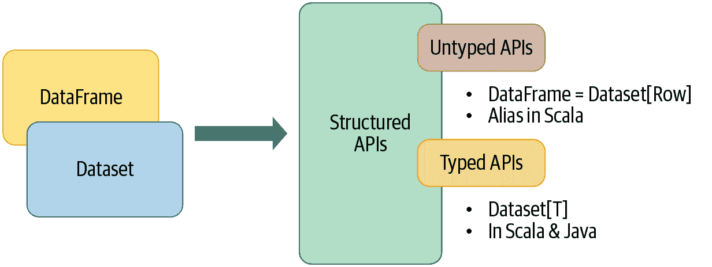
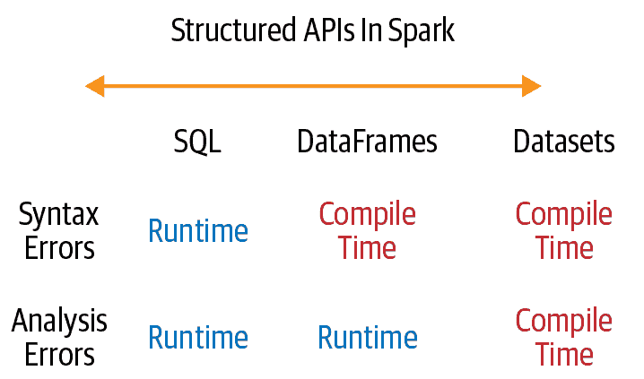
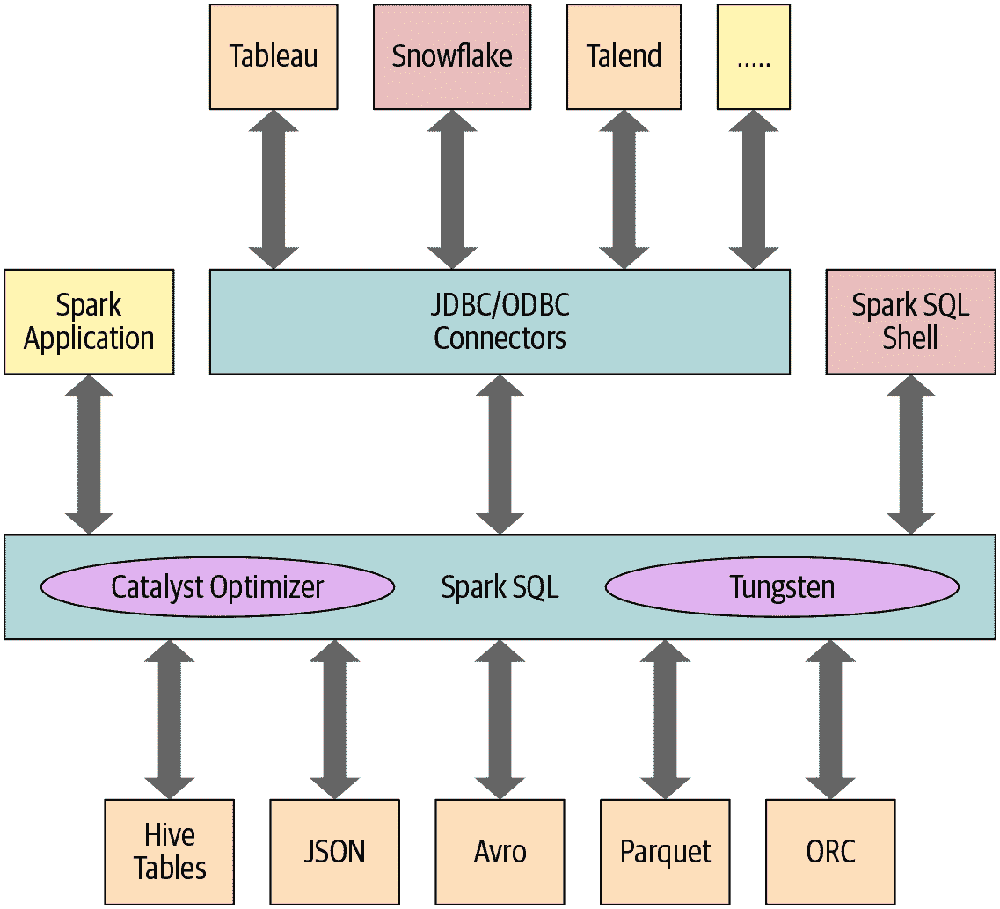
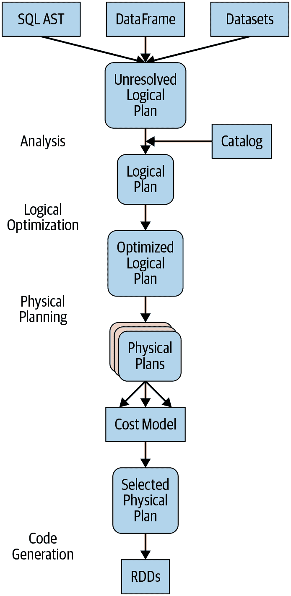
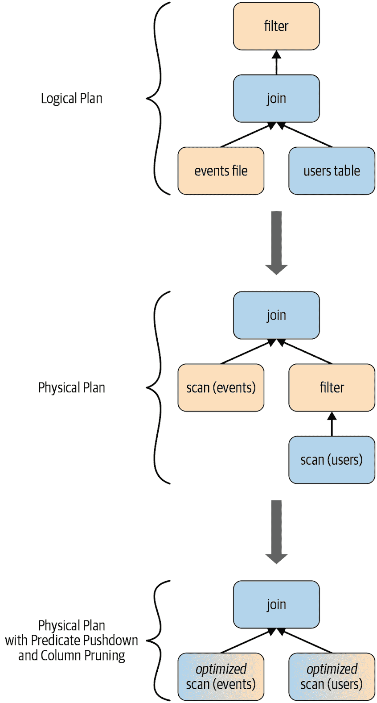

# 第三章：Apache Spark 的结构化 API

在本章中，我们将探索向 Apache Spark 添加结构的主要动机，这些动机如何导致创建高级 API（DataFrames 和 Datasets），以及它们在 Spark 2.x 中的组件之间的统一。我们还将看看支撑这些结构化高级 API 的 Spark SQL 引擎。

当[Spark SQL](https://oreil.ly/cfd1r)在早期 Spark 1.x 版本中首次引入时，紧随其后的是[DataFrames](https://oreil.ly/kErKh)作为[SchemaRDDs](https://oreil.ly/-o1-k)的后继者。我们第一次在 Spark 中看到了结构。Spark SQL 引入了高级表达操作函数，模仿类 SQL 语法，以及 DataFrames，为后续版本中更多结构提供了基础，为 Spark 计算查询中的高性能操作铺平了道路。

但在我们讨论新的结构化 API 之前，让我们简要了解一下在 Spark 中没有结构的情况，通过简单的 RDD 编程 API 模型来看一下。

# Spark：RDD 底层是什么？

[RDD](https://oreil.ly/KON5Y) 是 Spark 中最基本的抽象。与 RDD 关联的有三个关键特征：

+   依赖项

+   分区（带有一些本地化信息）

+   计算函数：Partition => `Iterator[T]`

这三个特性对于构建所有高级功能的简单 RDD 编程 API 模型至关重要。首先，需要一个*依赖项*列表，指导 Spark 如何使用其输入构建 RDD。在需要重现结果时，Spark 可以从这些依赖项重新创建 RDD，并在其上复制操作。这一特性赋予了 RDD 的弹性。

第二，*分区*使得 Spark 能够将工作分割并行化处理分区上的计算。在某些情况下，例如从 HDFS 读取数据，Spark 将使用本地化信息将工作发送到靠近数据的执行者。这样可以减少通过网络传输的数据量。

最后，RDD 具有一个*计算函数*，用于生成将存储在 RDD 中的数据的`Iterator[T]`。

简单而优雅！然而，这个原始模型存在一些问题。首先，计算函数（或计算过程）对 Spark 来说是不透明的。也就是说，Spark 不知道你在计算函数中做了什么。无论是执行连接、过滤、选择还是聚合操作，Spark 只把它视为一个 lambda 表达式。另一个问题是，对于 Python RDDs 来说，`Iterator[T]`数据类型也是不透明的；Spark 只知道它是 Python 中的一个通用对象。

此外，由于无法检查函数中的计算或表达式，Spark 无法优化表达式 —— 它无法理解其意图。最后，Spark 对于 `T` 的具体数据类型一无所知。对于 Spark 来说，它是一个不透明的对象；它无法知道您是否在访问对象内的某个特定类型的列。因此，Spark 只能将不透明对象序列化为一系列字节，而无法使用任何数据压缩技术。

这种不透明性显然阻碍了 Spark 重新排列您的计算以生成高效的查询计划的能力。那么解决方案是什么呢？

# 结构化 Spark

Spark 2.x 引入了几种关键方案来结构化 Spark。其中一种方法是使用在数据分析中常见的通用模式来表达计算。这些模式被表达为诸如过滤、选择、计数、聚合、求平均和分组等高级操作。这样做提供了额外的清晰度和简单性。

通过 DSL 中一组常见操作符的使用，此特定性进一步通过 DSL 中一组常见操作符的使用进行缩小。通过这些操作符，作为 Spark 支持的语言（Java、Python、Spark、R 和 SQL）中的 API 提供，这些操作符让您告诉 Spark 您希望如何计算您的数据，因此，它可以构建一个高效的查询计划来执行。

最终的顺序和结构方案是允许您将数据以表格格式排列，如 SQL 表或电子表格，使用支持的结构化数据类型（我们将很快介绍）。

但所有这些结构有什么好处呢？

## 关键优势和益处

结构化带来了许多好处，包括在 Spark 组件之间提升性能和空间效率。我们稍后将进一步探讨使用 DataFrame 和 Dataset API 时的这些好处，但现在我们将集中讨论其他优势：表达性、简单性、可组合性和统一性。

首先，让我们通过一个简单的代码片段来展示表达性和可组合性。在下面的示例中，我们想要按名称分组，然后计算每个名称的所有年龄的平均值 —— 这是数据分析和探索中常见的模式。如果我们要使用低级别的 RDD API，代码将如下所示：

```
# In Python
# Create an RDD of tuples (name, age)
dataRDD = sc.parallelize([("Brooke", 20), ("Denny", 31), ("Jules", 30), 
  ("TD", 35), ("Brooke", 25)])
# Use map and reduceByKey transformations with their lambda 
# expressions to aggregate and then compute average

agesRDD = (dataRDD
  .map(lambda x: (x[0], (x[1], 1)))
  .reduceByKey(lambda x, y: (x[0] + y[0], x[1] + y[1]))
  .map(lambda x: (x[0], x[1][0]/x[1][1])))
```

没有人会反驳这段代码的晦涩和难以阅读，它告诉 Spark *如何* 对键进行聚合并计算平均值，使用了一系列的 Lambda 函数。换句话说，该代码在指导 Spark 如何计算查询。对于 Spark 来说完全不透明，因为它无法传达意图。此外，在 Scala 中等效的 RDD 代码与此处展示的 Python 代码也有很大不同。

相比之下，如果我们使用高级 DSL 操作符和 DataFrame API 表达相同的查询，从而指导 Spark *做什么*？看一下：

```
# In Python 
from pyspark.sql import SparkSession
from pyspark.sql.functions import avg
# Create a DataFrame using SparkSession
spark = (SparkSession
  .builder
  .appName("AuthorsAges")
  .getOrCreate())
# Create a DataFrame 
data_df = spark.createDataFrame([("Brooke", 20), ("Denny", 31), ("Jules", 30), 
  ("TD", 35), ("Brooke", 25)], ["name", "age"])
# Group the same names together, aggregate their ages, and compute an average
avg_df = data_df.groupBy("name").agg(avg("age"))
# Show the results of the final execution
avg_df.show()

+------+--------+
|  name|avg(age)|
+------+--------+
|Brooke|    22.5|
| Jules|    30.0|
|    TD|    35.0|
| Denny|    31.0|
+------+--------+
```

这个版本的代码不仅更富表现力，而且更简单，因为我们使用高级 DSL 操作符和 API 告诉 Spark 要做什么。实际上，我们已经使用这些操作符来组合我们的查询。由于 Spark 可以检查或解析这个查询并理解我们的意图，它可以优化或安排操作以实现高效执行。Spark 清楚地知道我们希望做什么：按姓名分组人们，聚合他们的年龄，然后计算具有相同姓名的所有人的平均年龄。我们使用高级操作符组合了整个计算作为一个简单的查询——这是多么富有表现力啊？

有人或许会认为，通过仅使用高级别的、富有表现力的 DSL 操作符来映射常见或重复的数据分析模式，以引入秩序和结构，我们限制了开发者指导编译器或控制查询计算方式的能力。请放心，您并不局限于这些结构化模式；您随时可以切换回不结构化的低级 RDD API，尽管我们几乎从不需要这样做。

除了更易于阅读之外，Spark 高级 API 的结构还在其组件和语言之间引入了统一性。例如，这里展示的 Scala 代码与之前的 Python 代码执行相同的操作——而且 API 看起来几乎相同：

```
// In Scala
import org.apache.spark.sql.functions.avg
import org.apache.spark.sql.SparkSession
// Create a DataFrame using SparkSession
val spark = SparkSession
  .builder
  .appName("AuthorsAges")
  .getOrCreate()
// Create a DataFrame of names and ages
val dataDF = spark.createDataFrame(Seq(("Brooke", 20), ("Brooke", 25), 
  ("Denny", 31), ("Jules", 30), ("TD", 35))).toDF("name", "age")
// Group the same names together, aggregate their ages, and compute an average
val avgDF = dataDF.groupBy("name").agg(avg("age"))
// Show the results of the final execution
avgDF.show()

+------+--------+
|  name|avg(age)|
+------+--------+
|Brooke|    22.5|
| Jules|    30.0|
|    TD|    35.0|
| Denny|    31.0|
+------+--------+
```

###### 注意

这些 DSL 操作符中的一些执行类似关系型操作，如果您了解 SQL，您会很熟悉，比如选择、过滤、分组和聚合。

所有这些我们开发者所珍视的简洁性和表达性，都是因为 Spark SQL 引擎的存在，它支持构建高级结构化 API。正是由于这个引擎，作为所有 Spark 组件的基础，我们才能获得统一的 API。无论您是在结构化流处理还是 MLlib 中对 DataFrame 表达查询，您始终是在操作和转换结构化数据。本章稍后我们将更详细地了解 Spark SQL 引擎，但现在让我们来探索这些 API 和 DSL，用于常见操作以及如何用于数据分析。

# DataFrame API

受到[pandas DataFrames](https://oreil.ly/z93hD)在结构、格式以及一些特定操作的启发，Spark DataFrames 就像是带有命名列和模式的分布式内存中的表格，其中每列具有特定的数据类型：整数、字符串、数组、映射、实数、日期、时间戳等。对于人眼来说，Spark DataFrame 就像是一张表。示例见 Table 3-1。

表 3-1\. DataFrame 的表格化格式

| `Id (Int)` | `First (String)` | `Last (String)` | `Url (String)` | `Published (Date)` | `Hits (Int)` | `Campaigns (List[Strings])` |
| --- | --- | --- | --- | --- | --- | --- |
| `1` | `Jules` | `Damji` | `https://tinyurl.1` | `1/4/2016` | `4535` | `[twitter, LinkedIn]` |
| `2` | `Brooke` | `Wenig` | `https://tinyurl.2` | `5/5/2018` | `8908` | `[twitter, LinkedIn]` |
| `3` | `Denny` | `Lee` | `https://tinyurl.3` | `6/7/2019` | `7659` | `[web, twitter, FB, LinkedIn]` |
| `4` | `Tathagata` | `Das` | `https://tinyurl.4` | `5/12/2018` | `10568` | `[twitter, FB]` |
| `5` | `Matei` | `Zaharia` | `https://tinyurl.5` | `5/14/2014` | `40578` | `[web, twitter, FB, LinkedIn]` |
| `6` | `Reynold` | `Xin` | `https://tinyurl.6` | `3/2/2015` | `25568` | `[twitter, LinkedIn]` |

当数据以结构化表格的形式展示时，不仅易于理解，而且在进行常见的行列操作时也易于处理。此外，请回忆一下，正如您在 第 2 章 中学到的那样，DataFrame 是不可变的，Spark 会保留所有转换的历史记录。您可以添加或更改列的名称和数据类型，创建新的 DataFrame，同时保留之前的版本。可以在模式中声明 DataFrame 中命名的列及其关联的 Spark 数据类型。

让我们在使用它们定义模式之前，先检查 Spark 中可用的通用和结构化数据类型。然后，我们将说明如何使用它们创建具有模式的 DataFrame，捕获 表 3-1 中的数据。

## Spark 的基本数据类型

与其支持的编程语言相匹配，Spark 支持基本的内部数据类型。这些数据类型可以在您的 Spark 应用程序中定义或声明。例如，在 Scala 中，您可以定义或声明特定列名为 `String`、`Byte`、`Long` 或 `Map` 等类型。在这里，我们定义了与 Spark 数据类型相关联的变量名：

```
`$SPARK_HOME``/``bin``/``spark``-``shell`
scala> `import` `org.apache.spark.sql.types._`
import org.apache.spark.sql.types._
scala> `val` `nameTypes` `=` `StringType`
nameTypes: org.apache.spark.sql.types.StringType.type = StringType
scala> `val` `firstName` `=` `nameTypes`
firstName: org.apache.spark.sql.types.StringType.type = StringType
scala> `val` `lastName` `=` `nameTypes`
lastName: org.apache.spark.sql.types.StringType.type = StringType
```

表 3-2 列出了 Spark 支持的基本 Scala 数据类型。它们都是 [`DataTypes`](https://oreil.ly/_GifO) 类的子类型，除了 `DecimalType`。

表 3-2\. Spark 中的基本 Scala 数据类型

| 数据类型 | Scala 中分配的值 | 实例化的 API |
| --- | --- | --- |
| `ByteType` | `Byte` | `DataTypes.ByteType` |
| `ShortType` | `Short` | `DataTypes.ShortType` |
| `IntegerType` | `Int` | `DataTypes.IntegerType` |
| `LongType` | `Long` | `DataTypes.LongType` |
| `FloatType` | `Float` | `DataTypes.FloatType` |
| `DoubleType` | `Double` | `DataTypes.DoubleType` |
| `StringType` | `String` | `DataTypes.StringType` |
| `BooleanType` | `Boolean` | `DataTypes.BooleanType` |
| `DecimalType` | `java.math.BigDecimal` | `DecimalType` |

Spark 支持类似的基本 [Python 数据类型](https://oreil.ly/HuREJ)，如 表 3-3 中所列。

表 3-3\. Spark 中的基本 Python 数据类型

| 数据类型 | Python 中分配的值 | 实例化的 API |
| --- | --- | --- |
| `ByteType` | `int` | `DataTypes.ByteType` |
| `ShortType` | `int` | `DataTypes.ShortType` |
| `IntegerType` | `int` | `DataTypes.IntegerType` |
| `LongType` | `int` | `DataTypes.LongType` |
| `FloatType` | `float` | `DataTypes.FloatType` |
| `DoubleType` | `float` | `DataTypes.DoubleType` |
| `StringType` | `str` | `DataTypes.StringType` |
| `BooleanType` | `bool` | `DataTypes.BooleanType` |
| `DecimalType` | `decimal.Decimal` | `DecimalType` |

## Spark 的结构化和复杂数据类型

对于复杂数据分析，您不仅仅处理简单或基本数据类型。您的数据可能是复杂的，通常是结构化或嵌套的，您需要 Spark 来处理这些复杂的数据类型。它们有多种形式：映射（maps）、数组（arrays）、结构（structs）、日期（dates）、时间戳（timestamps）、字段等。表 3-4 列出了 Spark 支持的 Scala 结构化数据类型。

表 3-4\. Scala 中的结构化数据类型在 Spark 中

| 数据类型 | 在 Scala 中分配的值 | 实例化的 API |
| --- | --- | --- |
| `BinaryType` | `Array[Byte]` | `DataTypes.BinaryType` |
| `TimestampType` | `java.sql.Timestamp` | `DataTypes.TimestampType` |
| `DateType` | `java.sql.Date` | `DataTypes.DateType` |
| `ArrayType` | `scala.collection.Seq` | `DataTypes.createArrayType(ElementType)` |
| `MapType` | `scala.collection.Map` | `DataTypes.createMapType(keyType, valueType)` |
| `StructType` | `org.apache.spark.sql.Row` | `StructType(ArrayType[fieldTypes])` |
| `StructField` | 与此字段类型对应的值类型 | `StructField(name, dataType, [nullable])` |

Spark 支持的 Python 中等效的结构化数据类型在 表 3-5 中列举。

表 3-5\. Python 中的结构化数据类型在 Spark 中

| 数据类型 | 在 Python 中分配的值 | 实例化的 API |
| --- | --- | --- |
| `BinaryType` | `bytearray` | `BinaryType()` |
| `TimestampType` | `datetime.datetime` | `TimestampType()` |
| `DateType` | `datetime.date` | `DateType()` |
| `ArrayType` | 列表、元组或数组 | `ArrayType(dataType, [nullable])` |
| `MapType` | `dict` | `MapType(keyType, valueType, [nullable])` |
| `StructType` | 列表或元组 | `StructType([fields])` |
| `StructField` | 与此字段类型对应的值类型 | `StructField(name, dataType, [nullable])` |

尽管这些表展示了支持的多种类型，但更重要的是看到当您为数据定义 schema 时这些类型如何结合在一起。

## Schema 和创建 DataFrame

在 Spark 中，*schema* 定义了 DataFrame 的列名和相关的数据类型。通常情况下，当您从外部数据源读取结构化数据时（更多内容将在下一章讨论），schema 就会发挥作用。与在读取时定义 schema 相比，提前定义 schema 具有三个优点：

+   解除 Spark 推断数据类型的负担。

+   防止 Spark 创建一个单独的作业仅仅是为了读取文件的大部分内容以确定 schema，对于大数据文件来说，这可能既昂贵又耗时。

+   如果数据与 schema 不匹配，您可以及早发现错误。

因此，我们鼓励您无论何时希望从数据源中读取大型文件时都提前定义模式。为了简短示例，让我们为 表 3-1 中的数据定义一个模式，并使用该模式创建一个 DataFrame。

### 两种定义模式的方式

Spark 允许您以两种方式定义模式。一种是以编程方式定义，另一种是使用数据定义语言（DDL）字符串，后者更简单且更易读。

要为具有三个命名列 `author`、`title` 和 `pages` 的 DataFrame 编程定义模式，您可以使用 Spark DataFrame API。例如：

```
// In Scala
import org.apache.spark.sql.types._
val schema = StructType(Array(StructField("author", StringType, false),
  StructField("title", StringType, false),
  StructField("pages", IntegerType, false)))
```

```
# In Python
from pyspark.sql.types import *
schema = StructType([StructField("author", StringType(), False),
  StructField("title", StringType(), False),
  StructField("pages", IntegerType(), False)])
```

使用 DDL 定义相同的模式要简单得多：

```
// In Scala
val schema = "author STRING, title STRING, pages INT"
```

```
# In Python
schema = "author STRING, title STRING, pages INT"
```

您可以选择任何一种方式来定义模式。在许多示例中，我们将同时使用两种方法：

```
# In Python 
from pyspark.sql import SparkSession

# Define schema for our data using DDL 
schema = "`Id` INT, `First` STRING, `Last` STRING, `Url` STRING, 
  `Published` STRING, `Hits` INT, `Campaigns` ARRAY<STRING>"

# Create our static data
data = [[1, "Jules", "Damji", "https://tinyurl.1", "1/4/2016", 4535, ["twitter",
"LinkedIn"]],
       [2, "Brooke","Wenig", "https://tinyurl.2", "5/5/2018", 8908, ["twitter",
"LinkedIn"]],
       [3, "Denny", "Lee", "https://tinyurl.3", "6/7/2019", 7659, ["web",
"twitter", "FB", "LinkedIn"]],
       [4, "Tathagata", "Das", "https://tinyurl.4", "5/12/2018", 10568, 
["twitter", "FB"]],
       [5, "Matei","Zaharia", "https://tinyurl.5", "5/14/2014", 40578, ["web",
"twitter", "FB", "LinkedIn"]],
       [6, "Reynold", "Xin", "https://tinyurl.6", "3/2/2015", 25568, 
["twitter", "LinkedIn"]]
      ]

# Main program
if __name__ == "__main__":
   # Create a SparkSession
   spark = (SparkSession
     .builder
     .appName("Example-3_6")
     .getOrCreate())
   # Create a DataFrame using the schema defined above
   blogs_df = spark.createDataFrame(data, schema)
   # Show the DataFrame; it should reflect our table above
   blogs_df.show()
   # Print the schema used by Spark to process the DataFrame
   print(blogs_df.printSchema())
```

从控制台运行此程序将产生以下输出：

```
$ `spark``-``submit` `Example``-``3``_6``.``py`
...
+-------+---------+-------+-----------------+---------+-----+------------------+
|Id     |First    |Last   |Url              |Published|Hits |Campaigns         |
+-------+---------+-------+-----------------+---------+-----+------------------+
|1      |Jules    |Damji  |https://tinyurl.1|1/4/2016 |4535 |[twitter,...]     |
|2      |Brooke   |Wenig  |https://tinyurl.2|5/5/2018 |8908 |[twitter,...]     |
|3      |Denny    |Lee    |https://tinyurl.3|6/7/2019 |7659 |[web, twitter...] |
|4      |Tathagata|Das    |https://tinyurl.4|5/12/2018|10568|[twitter, FB]     |
|5      |Matei    |Zaharia|https://tinyurl.5|5/14/2014|40578|[web, twitter,...]|
|6      |Reynold  |Xin    |https://tinyurl.6|3/2/2015 |25568|[twitter,...]     |
+-------+---------+-------+-----------------+---------+-----+------------------+

root
 |-- Id: integer (nullable = false)
 |-- First: string (nullable = false)
 |-- Last: string (nullable = false)
 |-- Url: string (nullable = false)
 |-- Published: string (nullable = false)
 |-- Hits: integer (nullable = false)
 |-- Campaigns: array (nullable = false)
 |    |-- element: string (containsNull = false)
```

如果您想在代码的其他位置使用此模式，只需执行 `blogs_df.schema`，它将返回模式定义：

```
StructType(List(StructField("Id",IntegerType,false),
StructField("First",StringType,false),
StructField("Last",StringType,false),
StructField("Url",StringType,false),
StructField("Published",StringType,false),
StructField("Hits",IntegerType,false),
StructField("Campaigns",ArrayType(StringType,true),false)))
```

如您所见，DataFrame 的布局与 表 3-1 的布局以及相应的数据类型和模式输出匹配。

如果您要从 JSON 文件中读取数据而不是创建静态数据，则模式定义将相同。让我们用 Scala 示例说明相同的代码，这次是从 JSON 文件中读取：

```
// In Scala
package main.scala.chapter3

import org.apache.spark.sql.SparkSession
import org.apache.spark.sql.types._

object Example3_7 {
 def main(args: Array[String]) {

   val spark = SparkSession
     .builder
     .appName("Example-3_7")
     .getOrCreate()

   if (args.length <= 0) {
     println("usage Example3_7 <file path to blogs.json>")
     System.exit(1)
   }
   // Get the path to the JSON file
   val jsonFile = args(0)
   // Define our schema programmatically
   val schema = StructType(Array(StructField("Id", IntegerType, false),
     StructField("First", StringType, false),
     StructField("Last", StringType, false),
     StructField("Url", StringType, false),
     StructField("Published", StringType, false),
     StructField("Hits", IntegerType, false),
     StructField("Campaigns", ArrayType(StringType), false)))

   // Create a DataFrame by reading from the JSON file 
   // with a predefined schema
   val blogsDF = spark.read.schema(schema).json(jsonFile)
   // Show the DataFrame schema as output
   blogsDF.show(false)
   // Print the schema
   println(blogsDF.printSchema)
   println(blogsDF.schema)
 }
}
```

毫不奇怪，Scala 程序的输出与 Python 程序的输出相同：

```
+---+---------+-------+-----------------+---------+-----+----------------------+
|Id |First    |Last   |Url              |Published|Hits |Campaigns             |
+---+---------+-------+-----------------+---------+-----+----------------------+
|1  |Jules    |Damji  |https://tinyurl.1|1/4/2016 |4535 |[twitter, LinkedIn]   |
|2  |Brooke   |Wenig  |https://tinyurl.2|5/5/2018 |8908 |[twitter, LinkedIn]   |
|3  |Denny    |Lee    |https://tinyurl.3|6/7/2019 |7659 |[web, twitter,...]    |
|4  |Tathagata|Das    |https://tinyurl.4|5/12/2018|10568|[twitter, FB]         |
|5  |Matei    |Zaharia|https://tinyurl.5|5/14/2014|40578|[web, twitter, FB,...]|
|6  |Reynold  |Xin    |https://tinyurl.6|3/2/2015 |25568|[twitter, LinkedIn]   |
+---+---------+-------+-----------------+---------+-----+----------------------+

root
 |-- Id: integer (nullable = true)
 |-- First: string (nullable = true)
 |-- Last: string (nullable = true)
 |-- Url: string (nullable = true)
 |-- Published: string (nullable = true)
 |-- Hits: integer (nullable = true)
 |-- Campaigns: array (nullable = true)
 |    |-- element: string (containsNull = true)

StructType(StructField("Id",IntegerType,true), 
    StructField("First",StringType,true), 
    StructField("Last",StringType,true), 
    StructField("Url",StringType,true),
    StructField("Published",StringType,true), 
    StructField("Hits",IntegerType,true),
    StructField("Campaigns",ArrayType(StringType,true),true))
```

现在您已经了解如何在 DataFrame 中使用结构化数据和模式，让我们关注 DataFrame API 中的列和行及其操作的含义。

## 列和表达式

如前所述，DataFrame 中的命名列在概念上类似于 pandas 或 R 中的命名列，或者类似于 RDBMS 表中的命名列：它们描述了字段的类型。您可以按其名称列出所有列，并可以使用关系或计算表达式对其值进行操作。在 Spark 支持的语言中，列是具有公共方法的对象（由 `Column` 类型表示）。

您还可以在列上使用逻辑或数学表达式。例如，您可以使用 `expr("columnName * 5")` 或 `(expr("columnName - 5") > col(anothercolumnName))` 创建一个简单的表达式，其中 `columnName` 是 Spark 类型（整数、字符串等）。`expr()` 是 `pyspark.sql.functions`（Python）和 `org.apache.spark.sql.functions`（Scala）包中的一部分。像这些包中的任何其他函数一样，`expr()` 接受 Spark 将解析为表达式并计算结果的参数。

###### 注意

Scala、Java 和 Python 都具有与列关联的 [公共方法](https://oreil.ly/xVBIX)。您会注意到 Spark 文档同时提到了 `col` 和 `Column`。`Column` 是对象的名称，而 `col()` 是一个标准内置函数，返回一个 `Column`。

让我们看一些在 Spark 中可以对列执行的操作示例。每个示例后面都跟着它的输出：

```
// In Scala scala> `import` `org.apache.spark.sql.functions._`
scala> `blogsDF``.``columns`
res2: Array[String] = Array(Campaigns, First, Hits, Id, Last, Published, Url)

// Access a particular column with col and it returns a Column type scala> `blogsDF``.``col``(``"Id"``)`
res3: org.apache.spark.sql.Column = id

// Use an expression to compute a value scala> `blogsDF``.``select``(``expr``(``"Hits * 2"``)``)``.``show``(``2``)`
// or use col to compute value scala> `blogsDF``.``select``(``col``(``"Hits"``)` `*` `2``)``.``show``(``2``)`

+----------+
|(Hits * 2)|
+----------+
|      9070|
|     17816|
+----------+

// Use an expression to compute big hitters for blogs // This adds a new column, Big Hitters, based on the conditional expression blogsDF.withColumn("Big Hitters", (expr("Hits > 10000"))).show()

+---+---------+-------+---+---------+-----+--------------------+-----------+
| Id|    First|   Last|Url|Published| Hits|           Campaigns|Big Hitters|
+---+---------+-------+---+---------+-----+--------------------+-----------+
|  1|    Jules|  Damji|...| 1/4/2016| 4535| [twitter, LinkedIn]|      false|
|  2|   Brooke|  Wenig|...| 5/5/2018| 8908| [twitter, LinkedIn]|      false|
|  3|    Denny|    Lee|...| 6/7/2019| 7659|[web, twitter, FB...|      false|
|  4|Tathagata|    Das|...|5/12/2018|10568|       [twitter, FB]|       true|
|  5|    Matei|Zaharia|...|5/14/2014|40578|[web, twitter, FB...|       true|
|  6|  Reynold|    Xin|...| 3/2/2015|25568| [twitter, LinkedIn]|       true|
+---+---------+-------+---+---------+-----+--------------------+-----------+

// Concatenate three columns, create a new column, and show the 
// newly created concatenated column
blogsDF
  .withColumn("AuthorsId", (concat(expr("First"), expr("Last"), expr("Id"))))
  .select(col("AuthorsId"))
  .show(4)

+-------------+
|    AuthorsId|
+-------------+
|  JulesDamji1|
| BrookeWenig2|
|    DennyLee3|
|TathagataDas4|
+-------------+

// These statements return the same value, showing that 
// expr is the same as a col method call
blogsDF.select(expr("Hits")).show(2)
blogsDF.select(col("Hits")).show(2)
blogsDF.select("Hits").show(2)

+-----+
| Hits|
+-----+
| 4535|
| 8908|
+-----+

// Sort by column "Id" in descending order
blogsDF.sort(col("Id").desc).show()
blogsDF.sort($"Id".desc).show()

+--------------------+---------+-----+---+-------+---------+-----------------+
|           Campaigns|    First| Hits| Id|   Last|Published|              Url|
+--------------------+---------+-----+---+-------+---------+-----------------+
| [twitter, LinkedIn]|  Reynold|25568|  6|    Xin| 3/2/2015|https://tinyurl.6|
|[web, twitter, FB...|    Matei|40578|  5|Zaharia|5/14/2014|https://tinyurl.5|
|       [twitter, FB]|Tathagata|10568|  4|    Das|5/12/2018|https://tinyurl.4|
|[web, twitter, FB...|    Denny| 7659|  3|    Lee| 6/7/2019|https://tinyurl.3|
| [twitter, LinkedIn]|   Brooke| 8908|  2|  Wenig| 5/5/2018|https://tinyurl.2|
| [twitter, LinkedIn]|    Jules| 4535|  1|  Damji| 1/4/2016|https://tinyurl.1|
+--------------------+---------+-----+---+-------+---------+-----------------+
```

在这个最后的例子中，表达式 `blogs_df.sort(col("Id").desc)` 和 `blogsDF.sort($"Id".desc)` 是相同的。它们都按照降序排序名为 `Id` 的 DataFrame 列：一个使用显式函数 `col("Id")` 返回一个 `Column` 对象，而另一个在列名前使用 `$`，这是 Spark 中将列名 `Id` 转换为 `Column` 的函数。

###### 注意

我们在这里只是浅尝辄止，并且仅仅使用了 `Column` 对象上的几种方法。有关 `Column` 对象的所有公共方法的完整列表，请参阅 Spark [文档](https://oreil.ly/TZd3c)。

在 DataFrame 中，`Column` 对象不能单独存在；每列都是记录中的一部分，所有行一起构成一个 DataFrame，在本章后面我们将看到它实际上是 Scala 中的 `Dataset[Row]`。

## 行

在 Spark 中，一行是一个通用的 [`Row` 对象](https://oreil.ly/YLMnw)，包含一个或多个列。每列可以是相同的数据类型（例如整数或字符串），也可以是不同的类型（整数、字符串、映射、数组等）。因为 `Row` 是 Spark 中的对象，是一个有序的字段集合，你可以在 Spark 支持的每种语言中实例化一个 `Row`，并通过从 0 开始的索引访问其字段：

```
// In Scala
import org.apache.spark.sql.Row
// Create a Row
val blogRow = Row(6, "Reynold", "Xin", "https://tinyurl.6", 255568, "3/2/2015", 
  Array("twitter", "LinkedIn"))
// Access using index for individual items
blogRow(1)
res62: Any = Reynold
```

```
# In Python
from pyspark.sql import Row
blog_row = Row(6, "Reynold", "Xin", "https://tinyurl.6", 255568, "3/2/2015", 
  ["twitter", "LinkedIn"])
# access using index for individual items
blog_row[1]
'Reynold'
```

如果需要快速互动和探索，可以使用 `Row` 对象来创建 DataFrame：

```
# In Python 
rows = [Row("Matei Zaharia", "CA"), Row("Reynold Xin", "CA")]
authors_df = spark.createDataFrame(rows, ["Authors", "State"])
authors_df.show()
```

```
// In Scala
val rows = Seq(("Matei Zaharia", "CA"), ("Reynold Xin", "CA"))
val authorsDF = rows.toDF("Author", "State") 
authorsDF.show()

+-------------+-----+
|       Author|State|
+-------------+-----+
|Matei Zaharia|   CA|
|  Reynold Xin|   CA|
+-------------+-----+
```

在实践中，通常会从文件中读取 DataFrame，就像前面所示。在大多数情况下，由于文件可能会很大，定义架构并使用它是创建 DataFrame 的更快更高效的方法。

在创建了一个大型分布式 DataFrame 后，您可能希望对其执行一些常见的数据操作。让我们来看一些您可以在结构化 API 中使用高级关系操作符执行的 Spark 操作。

## 常见的 DataFrame 操作

要在 DataFrame 上执行常见的数据操作，首先需要从包含结构化数据的数据源中加载 DataFrame。Spark 提供了一个接口 [`DataFrameReader`](https://oreil.ly/v3WLZ)，它允许你从多种数据源（如 JSON、CSV、Parquet、Text、Avro、ORC 等格式）中读取数据到 DataFrame 中。同样，要将 DataFrame 写回特定格式的数据源，Spark 使用 [`DataFrameWriter`](https://oreil.ly/vzjau)。

### 使用 `DataFrameReader` 和 `DataFrameWriter`

由于这些高级抽象和社区的贡献，Spark 中的读写操作变得简单，可以连接到各种数据源，包括常见的 NoSQL 存储、RDBMS、流处理引擎（如 Apache Kafka 和 Kinesis）等。

要开始，让我们读取一个包含旧金山消防部门通话数据的大型 CSV 文件。¹如前所述，我们将为此文件定义一个模式，并使用`DataFrameReader`类及其方法告诉 Spark 该做什么。因为这个文件包含 28 列和超过 4,380,660 条记录，²定义模式比让 Spark 推断模式更有效率。

###### 注意

如果您不想指定模式，Spark 可以从较低成本的样本中推断模式。例如，您可以使用`samplingRatio`选项：

```
// In Scala
val sampleDF = spark
  .read
  .option("samplingRatio", 0.001)
  .option("header", true)
  .csv("""/databricks-datasets/learning-spark-v2/
 sf-fire/sf-fire-calls.csv""")
```

让我们看看如何做到这一点：

```
# In Python, define a schema 
from pyspark.sql.types import *

# Programmatic way to define a schema 
fire_schema = StructType([StructField('CallNumber', IntegerType(), True),
                StructField('UnitID', StringType(), True),
                StructField('IncidentNumber', IntegerType(), True),
                StructField('CallType', StringType(), True),                  
                StructField('CallDate', StringType(), True),      
                StructField('WatchDate', StringType(), True),
                StructField('CallFinalDisposition', StringType(), True),
                StructField('AvailableDtTm', StringType(), True),
                StructField('Address', StringType(), True),       
                StructField('City', StringType(), True),       
                StructField('Zipcode', IntegerType(), True),       
                StructField('Battalion', StringType(), True),                 
                StructField('StationArea', StringType(), True),       
                StructField('Box', StringType(), True),       
                StructField('OriginalPriority', StringType(), True),       
                StructField('Priority', StringType(), True),       
                StructField('FinalPriority', IntegerType(), True),       
                StructField('ALSUnit', BooleanType(), True),       
                StructField('CallTypeGroup', StringType(), True),
                StructField('NumAlarms', IntegerType(), True),
                StructField('UnitType', StringType(), True),
                StructField('UnitSequenceInCallDispatch', IntegerType(), True),
                StructField('FirePreventionDistrict', StringType(), True),
                StructField('SupervisorDistrict', StringType(), True),
                StructField('Neighborhood', StringType(), True),
                StructField('Location', StringType(), True),
                StructField('RowID', StringType(), True),
                StructField('Delay', FloatType(), True)])

# Use the DataFrameReader interface to read a CSV file
sf_fire_file = "/databricks-datasets/learning-spark-v2/sf-fire/sf-fire-calls.csv"
fire_df = spark.read.csv(sf_fire_file, header=True, schema=fire_schema)
```

```
// In Scala it would be similar
val fireSchema = StructType(Array(StructField("CallNumber", IntegerType, true),
                   StructField("UnitID", StringType, true),
                   StructField("IncidentNumber", IntegerType, true),
                   StructField("CallType", StringType, true), 
                   StructField("Location", StringType, true),
                   ...
                   ...
                   StructField("Delay", FloatType, true)))

// Read the file using the CSV DataFrameReader
val sfFireFile="/databricks-datasets/learning-spark-v2/sf-fire/sf-fire-calls.csv"
val fireDF = spark.read.schema(fireSchema)
  .option("header", "true")
  .csv(sfFireFile)
```

`spark.read.csv()`函数读取 CSV 文件，并返回一个带有命名列和模式规定类型的 DataFrame 行。

要将 DataFrame 写入您选择的外部数据源中，您可以使用`DataFrameWriter`接口。像`DataFrameReader`一样，它支持[多个数据源](https://oreil.ly/4rYNZ)。Parquet 是一种流行的列格式，默认使用 snappy 压缩来压缩数据。如果 DataFrame 被写入 Parquet，则模式将作为 Parquet 元数据的一部分保留。在这种情况下，后续将 DataFrame 读回时不需要手动提供模式。

#### 将 DataFrame 保存为 Parquet 文件或 SQL 表

一个常见的数据操作是探索和转换数据，然后将 DataFrame 持久化为 Parquet 格式或将其保存为 SQL 表。持久化转换后的 DataFrame 与读取它一样简单。例如，要将我们刚刚使用的 DataFrame 持久化为文件，您可以执行以下操作：

```
// In Scala to save as a Parquet file
val parquetPath = ...
fireDF.write.format("parquet").save(parquetPath)
```

```
# In Python to save as a Parquet file
parquet_path = ...
fire_df.write.format("parquet").save(parquet_path)
```

或者，您可以将其保存为表格，其中注册 Hive 元存储的元数据（我们将在下一章中介绍 SQL 管理和非管理表格、元存储和 DataFrame）：

```
// In Scala to save as a table 
val parquetTable = ... // name of the table
fireDF.write.format("parquet").saveAsTable(parquetTable)
```

```
# In Python
parquet_table = ... # name of the table
fire_df.write.format("parquet").saveAsTable(parquet_table)
```

让我们逐步介绍一些在读取数据后对 DataFrame 执行的常见操作。

### 转换和操作

现在您已经将旧金山消防部门通话的分布式 DataFrame 存储在内存中，作为开发人员，您首先要做的是检查数据以查看列的外观。它们是否是正确的类型？是否有需要转换为不同类型的列？它们是否有`null`值？

在“转换、操作和惰性评估”中的第二章*,*，您可以看到如何使用转换和操作来操作 DataFrame，并看到每个的一些常见示例。我们能从旧金山消防部门的通话中了解到什么？

#### 投影和过滤器

在关系术语中，*投影*是通过使用过滤器返回仅匹配某个关系条件的行的一种方式。在 Spark 中，使用`select()`方法进行投影，而过滤器可以使用`filter()`或`where()`方法来表达。我们可以使用这种技术来检查我们的 SF 消防局数据集的特定方面。

```
# In Python
few_fire_df = (fire_df
  .select("IncidentNumber", "AvailableDtTm", "CallType") 
  .where(col("CallType") != "Medical Incident"))
few_fire_df.show(5, truncate=False)
```

```
// In Scala
val fewFireDF = fireDF
  .select("IncidentNumber", "AvailableDtTm", "CallType")
  .where($"CallType" =!= "Medical Incident")    
fewFireDF.show(5, false)

+--------------+----------------------+--------------+
|IncidentNumber|AvailableDtTm         |CallType      |
+--------------+----------------------+--------------+
|2003235       |01/11/2002 01:47:00 AM|Structure Fire|
|2003235       |01/11/2002 01:51:54 AM|Structure Fire|
|2003235       |01/11/2002 01:47:00 AM|Structure Fire|
|2003235       |01/11/2002 01:47:00 AM|Structure Fire|
|2003235       |01/11/2002 01:51:17 AM|Structure Fire|
+--------------+----------------------+--------------+
only showing top 5 rows
```

如果我们想知道作为火灾呼叫原因记录的不同`CallType`的数量，这些简单而表达力强的查询可以完成工作：

```
# In Python, return number of distinct types of calls using countDistinct()
from pyspark.sql.functions import *
(fire_df
  .select("CallType")
  .where(col("CallType").isNotNull())
  .agg(countDistinct("CallType").alias("DistinctCallTypes"))
  .show())
```

```
// In Scala
import org.apache.spark.sql.functions._
fireDF
  .select("CallType")
  .where(col("CallType").isNotNull)
  .agg(countDistinct('CallType) as 'DistinctCallTypes)
  .show()

+-----------------+
|DistinctCallTypes|
+-----------------+
|               32|
+-----------------+
```

我们可以使用以下查询列出数据集中的不同呼叫类型：

```
# In Python, filter for only distinct non-null CallTypes from all the rows
(fire_df
  .select("CallType")
  .where(col("CallType").isNotNull())
  .distinct()
  .show(10, False))
```

```
// In Scala
fireDF
  .select("CallType")
  .where($"CallType".isNotNull())
  .distinct()
  .show(10, false)

Out[20]: 32

+-----------------------------------+
|CallType                           |
+-----------------------------------+
|Elevator / Escalator Rescue        |
|Marine Fire                        |
|Aircraft Emergency                 |
|Confined Space / Structure Collapse|
|Administrative                     |
|Alarms                             |
|Odor (Strange / Unknown)           |
|Lightning Strike (Investigation)   |
|Citizen Assist / Service Call      |
|HazMat                             |
+-----------------------------------+
only showing top 10 rows
```

#### 重命名、添加和删除列

有时您希望出于样式或约定原因重命名特定列，其他时候则出于可读性或简洁性。SF 消防局数据集中的原始列名带有空格。例如，列名`IncidentNumber`是`Incident Number`。列名中的空格可能会有问题，特别是当您想要将 DataFrame 写入或保存为 Parquet 文件时（这是不允许的）。

通过在架构中使用`StructField`指定所需的列名，我们有效地更改了结果 DataFrame 中的所有名称。

或者，您可以使用`withColumnRenamed()`方法有选择地重命名列。例如，让我们将`Delay`列的名称更改为`ResponseDelayed`并查看响应时间超过五分钟的情况：

```
# In Python
new_fire_df = fire_df.withColumnRenamed("Delay", "ResponseDelayedinMins")
(new_fire_df
  .select("ResponseDelayedinMins")
  .where(col("ResponseDelayedinMins") > 5)
  .show(5, False))
```

```
// In Scala
val newFireDF = fireDF.withColumnRenamed("Delay", "ResponseDelayedinMins")
newFireDF
  .select("ResponseDelayedinMins")
  .where($"ResponseDelayedinMins" > 5)
  .show(5, false)
```

这给我们一个新的重命名列：

```
+---------------------+
|ResponseDelayedinMins|
+---------------------+
|5.233333             |
|6.9333334            |
|6.116667             |
|7.85                 |
|77.333336            |
+---------------------+
only showing top 5 rows
```

###### 注意

因为 DataFrame 转换是不可变的，当我们使用`withColumnRenamed()`重命名列时，我们会得到一个新的 DataFrame，同时保留具有旧列名的原始 DataFrame。

在数据探索期间，修改列的内容或其类型是常见操作。在某些情况下，数据是原始或脏乱的，或者其类型不适合作为关系操作符的参数。例如，在我们的 SF 消防局数据集中，列`CallDate`，`WatchDate`和`AlarmDtTm`是字符串，而不是 Unix 时间戳或 SQL 日期，Spark 都支持并且可以在数据的转换或操作（例如，在数据的日期或时间分析期间）中轻松操作。

那么我们如何将它们转换为更可用的格式呢？由于一些高级 API 方法的帮助，这非常简单。`spark.sql.functions`有一组日期/时间戳函数，如`to_timestamp()`和`to_date()`，我们可以专门为此目的使用它们：

```
# In Python
fire_ts_df = (new_fire_df
  .withColumn("IncidentDate", to_timestamp(col("CallDate"), "MM/dd/yyyy"))
  .drop("CallDate") 
  .withColumn("OnWatchDate", to_timestamp(col("WatchDate"), "MM/dd/yyyy"))
  .drop("WatchDate") 
  .withColumn("AvailableDtTS", to_timestamp(col("AvailableDtTm"), 
  "MM/dd/yyyy hh:mm:ss a"))
  .drop("AvailableDtTm"))

# Select the converted columns
(fire_ts_df
  .select("IncidentDate", "OnWatchDate", "AvailableDtTS")
  .show(5, False))
```

```
// In Scala
val fireTsDF = newFireDF
  .withColumn("IncidentDate", to_timestamp(col("CallDate"), "MM/dd/yyyy"))
  .drop("CallDate")
  .withColumn("OnWatchDate", to_timestamp(col("WatchDate"), "MM/dd/yyyy"))
  .drop("WatchDate") 
  .withColumn("AvailableDtTS", to_timestamp(col("AvailableDtTm"), 
  "MM/dd/yyyy hh:mm:ss a"))
  .drop("AvailableDtTm") 

// Select the converted columns
fireTsDF
  .select("IncidentDate", "OnWatchDate", "AvailableDtTS")
  .show(5, false)
```

这些查询非常有效——发生了很多事情。让我们分解它们的功能：

1.  将现有列的数据类型从字符串转换为 Spark 支持的时间戳。

1.  根据适当的格式字符串`"MM/dd/yyyy"`或`"MM/dd/yyyy hh:mm:ss a"`使用新格式。

1.  在转换为新数据类型后，使用`drop()`旧列并将新列指定为`withColumn()`方法的第一个参数。

1.  将新修改的 DataFrame 分配给`fire_ts_df`。

这些查询结果包含三个新列：

```
+-------------------+-------------------+-------------------+
|IncidentDate       |OnWatchDate        |AvailableDtTS      |
+-------------------+-------------------+-------------------+
|2002-01-11 00:00:00|2002-01-10 00:00:00|2002-01-11 01:58:43|
|2002-01-11 00:00:00|2002-01-10 00:00:00|2002-01-11 02:10:17|
|2002-01-11 00:00:00|2002-01-10 00:00:00|2002-01-11 01:47:00|
|2002-01-11 00:00:00|2002-01-10 00:00:00|2002-01-11 01:51:54|
|2002-01-11 00:00:00|2002-01-10 00:00:00|2002-01-11 01:47:00|
+-------------------+-------------------+-------------------+
only showing top 5 rows
```

现在我们已经修改了日期，我们可以使用 `spark.sql.functions` 中的函数如 `month()`、`year()` 和 `day()` 进行查询，以进一步探索我们的数据。我们可以找出最近七天内记录了多少呼叫，或者我们可以查看数据集中包含了多少年的消防部门呼叫数据：

```
# In Python
(fire_ts_df
  .select(year('IncidentDate'))
  .distinct()
  .orderBy(year('IncidentDate'))
  .show())
```

```
// In Scala
fireTsDF
  .select(year($"IncidentDate"))
  .distinct()
  .orderBy(year($"IncidentDate"))
  .show()
+------------------+
|year(IncidentDate)|
+------------------+
|              2000|
|              2001|
|              2002|
|              2003|
|              2004|
|              2005|
|              2006|
|              2007|
|              2008|
|              2009|
|              2010|
|              2011|
|              2012|
|              2013|
|              2014|
|              2015|
|              2016|
|              2017|
|              2018|
+------------------+
```

到目前为止，在本节中，我们已经探讨了许多常见的数据操作：读写 DataFrames；定义模式并在读取 DataFrame 时使用它；将 DataFrame 保存为 Parquet 文件或表；从现有的 DataFrame 投影和过滤选定的列；以及修改、重命名和删除列。

最后一个常见操作是按列中的值对数据进行分组，并以某种方式聚合数据，比如简单地计数。这种按组和计数的模式和投影、过滤一样常见。让我们试一试。

#### 聚合

如果我们想知道最常见的火警呼叫类型是什么，或者哪些邮政编码占了大多数呼叫？这类问题在数据分析和探索中很常见。

一些在 DataFrames 上的转换和操作，如 `groupBy()`、`orderBy()` 和 `count()`，提供了按列名聚合，然后在它们之间聚合计数的能力。

###### 注意

对于计划对其进行频繁或重复查询的更大的 DataFrame，您可以从缓存中受益。我们将在后续章节中介绍 DataFrame 缓存策略及其好处。

让我们先来回答第一个问题：什么是最常见的火警呼叫类型？

```
# In Python
(fire_ts_df
  .select("CallType")
  .where(col("CallType").isNotNull())
  .groupBy("CallType")
  .count()
  .orderBy("count", ascending=False)
  .show(n=10, truncate=False))
```

```
// In Scala 
fireTsDF
  .select("CallType")
  .where(col("CallType").isNotNull)
  .groupBy("CallType")
  .count()
  .orderBy(desc("count"))
  .show(10, false)

+-------------------------------+-------+
|CallType                       |count  |
+-------------------------------+-------+
|Medical Incident               |2843475|
|Structure Fire                 |578998 |
|Alarms                         |483518 |
|Traffic Collision              |175507 |
|Citizen Assist / Service Call  |65360  |
|Other                          |56961  |
|Outside Fire                   |51603  |
|Vehicle Fire                   |20939  |
|Water Rescue                   |20037  |
|Gas Leak (Natural and LP Gases)|17284  |
+-------------------------------+-------+
```

根据这个输出，我们可以得出最常见的呼叫类型是医疗事件。

###### 注意

DataFrame API 还提供了 `collect()` 方法，但对于非常大的 DataFrame 而言，这是资源密集型（昂贵的）且危险的，因为它可能引起内存溢出（OOM）异常。不像 `count()` 返回给驱动程序一个单一的数字，`collect()` 返回整个 DataFrame 或 Dataset 中所有 `Row` 对象的集合。如果你想看看一些 `Row` 记录，最好使用 `take(*n*)`，它只会返回 DataFrame 的前 `*n*` 个 `Row` 对象。

#### 其他常见的 DataFrame 操作

除了我们已经看到的所有操作，DataFrame API 还提供了描述性统计方法，如 `min()`、`max()`、`sum()` 和 `avg()`。让我们看一些示例，展示如何使用我们的 SF Fire Department 数据集计算它们。

在这里，我们计算了数据集中所有火警呼叫的警报总数、平均响应时间以及最小和最大响应时间，以 Pythonic 的方式导入 PySpark 函数，以避免与内置 Python 函数冲突：

```
# In Python
import pyspark.sql.functions as F
(fire_ts_df
  .select(F.sum("NumAlarms"), F.avg("ResponseDelayedinMins"),
    F.min("ResponseDelayedinMins"), F.max("ResponseDelayedinMins"))
  .show())
```

```
// In Scala
import org.apache.spark.sql.{functions => F}
fireTsDF
  .select(F.sum("NumAlarms"), F.avg("ResponseDelayedinMins"), 
  F.min("ResponseDelayedinMins"), F.max("ResponseDelayedinMins"))
  .show()

+--------------+--------------------------+--------------------------+---------+
|sum(NumAlarms)|avg(ResponseDelayedinMins)|min(ResponseDelayedinMins)|max(...) |
+--------------+--------------------------+--------------------------+---------+
|       4403441|         3.902170335891614|               0.016666668|1879.6167|
+--------------+--------------------------+--------------------------+---------+
```

对于数据科学工作负载中常见的更高级的统计需求，请阅读关于诸如 `stat()`、`describe()`、`correlation()`、`covariance()`、`sampleBy()`、`approxQuantile()`、`frequentItems()` 等方法的 API 文档。

正如您所看到的，使用 DataFrame 的高级 API 和 DSL 运算符可以轻松组合和链式表达查询。如果我们尝试使用 RDD 进行相同操作，代码的可读性和比较的不透明性将难以想象！

## 端到端 DataFrame 示例

旧金山消防局公共数据集上的探索性数据分析、ETL 和常见数据操作有许多可能性，超出我们在此展示的内容。

为了简洁起见，我们不会在这里包含所有示例代码，但书籍的 [GitHub 仓库](https://github.com/databricks/LearningSparkV2) 提供了 Python 和 Scala 笔记本，供您尝试使用此数据集完成端到端的 DataFrame 示例。笔记本探索并回答以下您可能会问到的常见问题，使用 DataFrame API 和 DSL 关系运算符：

+   2018 年所有不同类型的火警呼叫是什么？

+   2018 年哪些月份的火警呼叫次数最高？

+   2018 年旧金山哪个社区产生了最多的火警呼叫？

+   2018 年哪些社区对火警响应时间最差？

+   2018 年的哪个周有最多的火警呼叫？

+   社区、邮政编码和火警呼叫次数之间是否存在相关性？

+   我们如何使用 Parquet 文件或 SQL 表存储这些数据并读取它？

到目前为止，我们已广泛讨论了 DataFrame API，这是涵盖 Spark MLlib 和 Structured Streaming 组件的结构化 API 之一，我们将在本书后面进行讨论。

接下来，我们将把焦点转向 Dataset API，并探索这两个 API 如何为开发者提供统一的结构化接口来编程 Spark。然后，我们将检查 RDD、DataFrame 和 Dataset API 之间的关系，并帮助您确定何时以及为什么使用哪个 API。

# Dataset API

正如本章前面所述，Spark 2.0 [统一了](https://oreil.ly/t3RGF) DataFrame 和 Dataset API 作为具有类似接口的结构化 API，以便开发者只需学习一组 API。数据集具有两种特性：[*类型* 和 *无类型* 的 API](https://oreil.ly/_3quT)，如 图 3-1 所示。



###### 图 3-1\. Apache Spark 中的结构化 API

从概念上讲，在 Scala 中，您可以将 DataFrame 看作是一组通用对象的别名，即 `Dataset[Row]`，其中 `Row` 是一个通用的无类型 JVM 对象，可能包含不同类型的字段。相比之下，Dataset 是 Scala 中的强类型 JVM 对象集合或 Java 中的类。或者，正如 [Dataset 文档](https://oreil.ly/wSkcJ) 所述，Dataset 是：

> 一种强类型的领域特定对象集合，可以使用函数式或关系操作并行转换。每个数据集 [在 Scala 中] 还有一个称为 DataFrame 的无类型视图，它是一个`Row`的数据集。

## 类型化对象、无类型对象和通用行

在 Spark 支持的语言中，数据集仅在 Java 和 Scala 中有意义，而在 Python 和 R 中只有数据框架有意义。这是因为 Python 和 R 不是编译时类型安全的；类型在执行期间动态推断或分配，而不是在编译时。在 Scala 和 Java 中情况恰恰相反：类型在编译时绑定到变量和对象。然而，在 Scala 中，DataFrame 只是非类型化的 `Dataset[Row]` 的别名。表 3-6 简要总结了这一点。

表 3-6\. Spark 中的类型化和非类型化对象

| 语言 | 类型化和非类型化的主要抽象 | 类型化或非类型化 |
| --- | --- | --- |
| Scala | `Dataset[T]` 和 DataFrame（`Dataset[Row]` 的别名） | 既有类型又有非类型 |
| Java | `Dataset<T>` | Typed |
| Python | DataFrame | 通用的 `Row` 非类型化 |
| R | DataFrame | 通用的 `Row` 非类型化 |

`Row` 是 Spark 中的一个通用对象类型，保存一个可以使用索引访问的混合类型集合。在内部，Spark 操纵 `Row` 对象，将它们转换为 表 3-2 和 表 3-3 中涵盖的等效类型。例如，在 `Row` 的字段中，一个 `Int` 将分别映射或转换为 Scala 或 Java 中的 `IntegerType` 或 `IntegerType()`，以及 Python 中的相应类型：

```
// In Scala
import org.apache.spark.sql.Row 
val row = Row(350, true, "Learning Spark 2E", null)
```

```
# In Python
from pyspark.sql import Row
row = Row(350, True, "Learning Spark 2E", None)
```

使用 `Row` 对象的索引，您可以使用其公共 *getter* 方法访问各个字段：

```
// In Scala `row``.``getInt``(``0``)`
res23: Int = 350
`row``.``getBoolean``(``1``)`
res24: Boolean = true
`row``.``getString``(``2``)`
res25: String = Learning Spark 2E
```

```
# In Python
`row``[``0``]`
Out[13]: 350
`row``[``1``]`
Out[14]: True
`row``[``2``]`
Out[15]: 'Learning Spark 2E'
```

相比之下，类型化对象是 JVM 中实际的 Java 或 Scala 类对象。数据集中的每个元素映射到一个 JVM 对象。

## 创建数据集

与从数据源创建数据框架一样，创建数据集时必须了解模式。换句话说，您需要知道数据类型。虽然可以通过 JSON 和 CSV 数据推断模式，但对于大型数据集来说，这是资源密集型的（昂贵的）。在 Scala 中创建数据集的最简单方法是使用案例类来指定结果数据集的模式。在 Java 中，使用 JavaBean 类（我们在 第六章 进一步讨论 JavaBean 和 Scala 案例类）。

### Scala：案例类

当您希望实例化自己的领域特定对象作为数据集时，您可以在 Scala 中定义一个案例类。例如，让我们看一个来自 JSON 文件的物联网设备（IoT）读数集合的示例（我们在本节的最后端对端示例中使用此文件）。

我们的文件包含一系列 JSON 字符串行，如下所示：

```
{"device_id": 198164, "device_name": "sensor-pad-198164owomcJZ", "ip": 
"80.55.20.25", "cca2": "PL", "cca3": "POL", "cn": "Poland", "latitude":
53.080000, "longitude": 18.620000, "scale": "Celsius", "temp": 21, 
"humidity": 65, "battery_level": 8, "c02_level": 1408,"lcd": "red", 
"timestamp" :1458081226051}
```

为了将每个 JSON 条目表示为 `DeviceIoTData`，一个特定于域的对象，我们可以定义一个 Scala 案例类：

```
case class DeviceIoTData (battery_level: Long, c02_level: Long, 
cca2: String, cca3: String, cn: String, device_id: Long, 
device_name: String, humidity: Long, ip: String, latitude: Double,
lcd: String, longitude: Double, scale:String, temp: Long, 
timestamp: Long)
```

一旦定义，我们可以用它来读取文件并将返回的 `Dataset[Row]` 转换为 `Dataset[DeviceIoTData]`（输出被截断以适应页面）：

```
// In Scala
val ds = spark.read
 .json("/databricks-datasets/learning-spark-v2/iot-devices/iot_devices.json")
 .as[DeviceIoTData]

ds: org.apache.spark.sql.Dataset[DeviceIoTData] = [battery_level...]

ds.show(5, false)

+-------------|---------|----|----|-------------|---------|---+
|battery_level|c02_level|cca2|cca3|cn           |device_id|...|
+-------------|---------|----|----|-------------|---------|---+
|8            |868      |US  |USA |United States|1        |...|
|7            |1473     |NO  |NOR |Norway       |2        |...|
|2            |1556     |IT  |ITA |Italy        |3        |...|
|6            |1080     |US  |USA |United States|4        |...|
|4            |931      |PH  |PHL |Philippines  |5        |...|
+-------------|---------|----|----|-------------|---------|---+
only showing top 5 rows
```

## 数据集操作

就像您可以对数据框架执行转换和操作一样，您也可以对数据集执行操作。根据操作的类型，结果会有所不同：

```
// In Scala
val filterTempDS = ds.filter({d => {d.temp > 30 && d.humidity > 70})

filterTempDS: org.apache.spark.sql.Dataset[DeviceIoTData] = [battery_level...]

filterTempDS.show(5, false)

+-------------|---------|----|----|-------------|---------|---+
|battery_level|c02_level|cca2|cca3|cn           |device_id|...|
+-------------|---------|----|----|-------------|---------|---+
|0            |1466     |US  |USA |United States|17       |...|
|9            |986      |FR  |FRA |France       |48       |...|
|8            |1436     |US  |USA |United States|54       |...|
|4            |1090     |US  |USA |United States|63       |...|
|4            |1072     |PH  |PHL |Philippines  |81       |...|
+-------------|---------|----|----|-------------|---------|---+
only showing top 5 rows
```

在这个查询中，我们将函数用作数据集方法 `filter()` 的参数。这是一个具有多个签名的重载方法。我们使用的版本 `filter(func: (T) > Boolean): Dataset[T]` 接受一个 lambda 函数 `func: (T) > Boolean` 作为其参数。

Lambda 函数的参数是 `DeviceIoTData` 类型的 JVM 对象。因此，我们可以使用点（`.`）符号访问其各个数据字段，就像在 Scala 类或 JavaBean 中一样。

另一个需要注意的是，使用数据帧，您可以将 `filter()` 条件表达为类 SQL 的 DSL 操作，这些操作是与语言无关的（正如我们在消防调用示例中看到的）。而在使用数据集时，我们使用语言本地的表达式，如 Scala 或 Java 代码。

这里是另一个示例，生成了另一个较小的数据集：

```
// In Scala
case class DeviceTempByCountry(temp: Long, device_name: String, device_id: Long, 
  cca3: String)
val dsTemp = ds
  .filter(d => {d.temp > 25})
  .map(d => (d.temp, d.device_name, d.device_id, d.cca3))
  .toDF("temp", "device_name", "device_id", "cca3")
  .as[DeviceTempByCountry]
dsTemp.show(5, false)

+----+---------------------+---------+----+
|temp|device_name          |device_id|cca3|
+----+---------------------+---------+----+
|34  |meter-gauge-1xbYRYcj |1        |USA |
|28  |sensor-pad-4mzWkz    |4        |USA |
|27  |sensor-pad-6al7RTAobR|6        |USA |
|27  |sensor-pad-8xUD6pzsQI|8        |JPN |
|26  |sensor-pad-10BsywSYUF|10       |USA |
+----+---------------------+---------+----+
only showing top 5 rows
```

或者，您可以仅检查数据集的第一行：

```
val device = dsTemp.first()
println(device)

device: DeviceTempByCountry =
DeviceTempByCountry(34,meter-gauge-1xbYRYcj,1,USA)
```

或者，您可以使用列名表达相同的查询，然后转换为 `Dataset[DeviceTempByCountry]`：

```
// In Scala
val dsTemp2 = ds
  .select($"temp", $"device_name", $"device_id", $"device_id", $"cca3")
  .where("temp > 25")
  .as[DeviceTempByCountry]
```

###### 注意

从语义上讲，`select()` 类似于前一个查询中的 `map()`，因为这两个查询都选择字段并生成等效的结果。

总结一下，我们可以在数据集上执行的操作——`filter()`、`map()`、`groupBy()`、`select()`、`take()` 等——与数据帧上的操作类似。从某种意义上讲，数据集类似于 RDD，因为它们提供了与上述方法相似的接口和编译时安全性，但具有更易于阅读和面向对象的编程接口。

当我们使用数据集时，底层的 Spark SQL 引擎负责处理 JVM 对象的创建、转换、序列化和反序列化。它还通过数据集编码器处理非 Java 堆内存管理。（我们将在第六章详细讨论数据集和内存管理。）

## 端到端数据集示例

在这个端到端的数据集示例中，您将进行与数据帧示例相似的探索性数据分析、ETL（提取、转换和加载）和数据操作，使用 IoT 数据集。该数据集虽然小而虚构，但我们的主要目标是展示您如何使用数据集表达查询的清晰度以及这些查询的可读性，就像我们使用数据帧时一样。

出于简洁起见，我们不会在此处列出所有示例代码；但是，我们已经在[GitHub 仓库](https://github.com/databricks/LearningSparkV2/)中提供了笔记本。笔记本探讨了您可能对此数据集进行的常见操作。使用数据集 API，我们尝试执行以下操作：

1.  检测电池电量低于阈值的故障设备。

1.  辨别二氧化碳排放高的有问题的国家。

1.  计算温度、电池电量、CO2 和湿度的最小值和最大值。

1.  按平均温度、CO2、湿度和国家进行排序和分组。

# 数据帧与数据集

现在您可能想知道何时应该使用 DataFrames 或 Datasets。在许多情况下，两者都可以使用，取决于您使用的编程语言，但在某些情况下，一个可能比另一个更可取。以下是一些示例：

+   如果您希望告诉 Spark *要做什么*，而不是 *如何做*，请使用 DataFrames 或 Datasets。

+   如果您希望使用丰富的语义、高级抽象和 DSL 操作符，请使用 DataFrames 或 Datasets。

+   如果您希望严格的编译时类型安全，并且不介意为特定的 `Dataset[T]` 创建多个 case 类，请使用 Datasets。

+   如果您的处理需求高级表达式、过滤器、映射、聚合、计算平均值或总和、SQL 查询、列式访问或在半结构化数据上使用关系运算符，请使用 DataFrames 或 Datasets。

+   如果您的处理要求类似于 SQL 查询的关系转换，请使用 DataFrames。

+   如果您希望利用和受益于 Tungsten 的高效序列化与编码器，请使用 [Datasets](https://oreil.ly/13XHQ)。

+   如果您希望统一、优化代码并简化 Spark 组件间的 API 使用，请使用 DataFrames。

+   如果您是 R 用户，请使用 DataFrames。

+   如果您是 Python 用户，请使用 DataFrames，并在需要更多控制时切换到 RDDs。

+   如果您希望获得空间和速度效率，请使用 DataFrames。

+   如果您希望在编译时捕获错误而不是在运行时，请选择适当的 API，如 图 3-2**。**



###### 图 3-2\. 使用结构化 API 检测到错误时。

## 何时使用 RDDs

您可能会问：RDDs 是否被降为二等公民？它们是否已经被弃用？答案是坚定的 *不*！RDD API 将继续得到支持，尽管在 Spark 2.x 和 Spark 3.0 中所有未来的开发工作将继续采用 DataFrame 接口和语义，而不是使用 RDDs。

有一些情况下，您需要考虑使用 RDDs，例如：

+   使用第三方包编写的 RDDs

+   可以放弃使用 DataFrames 和 Datasets 提供的代码优化、有效的空间利用和性能优势。

+   想要精确指导 Spark *如何进行* 查询。

此外，您可以通过简单的 API 方法调用 `df.rdd` 在 DataFrames 或 Datasets 之间无缝移动（但请注意，这样做会有成本，并且应避免除非必要）。毕竟，DataFrames 和 Datasets 是建立在 RDDs 之上的，并且它们在整个阶段代码生成期间被分解为紧凑的 RDD 代码，我们将在下一节讨论此问题。

最后，前面的章节介绍了 Spark 中的结构化 API 如何使开发人员能够使用简单友好的 API 在结构化数据上编写表达性查询。换句话说，您告诉 Spark *要做什么*，而不是 *如何做*，使用高级操作，它会确保构建查询的最有效方式并为您生成紧凑的代码。

构建高效查询并生成紧凑代码的过程是 Spark SQL 引擎的工作。这是我们所关注的结构化 API 构建的基础。现在让我们来看看引擎的内部工作原理。

# Spark SQL 和底层引擎

在编程层面上，Spark SQL 允许开发人员对具有模式的结构化数据发出符合 ANSI SQL:2003 兼容的查询。自 Spark 1.3 引入以来，Spark SQL 已经发展成为一个重要的引擎，许多高级结构化功能都建立在其之上。除了允许您在数据上发出类似 SQL 的查询之外，Spark SQL 引擎还：

+   在 Java、Scala、Python 和 R 中统一 Spark 组件，并允许对 DataFrame/Dataset 进行抽象化，从而简化了处理结构化数据集。

+   连接到 Apache Hive 元存储和表。

+   从结构化文件格式（JSON、CSV、文本、Avro、Parquet、ORC 等）中读取和写入具有特定模式的结构化数据，并将数据转换为临时表。

+   提供交互式的 Spark SQL Shell 用于快速数据探索。

+   通过标准数据库 JDBC/ODBC 连接器提供与外部工具的桥接。

+   为 JVM 生成优化的查询计划和紧凑代码，用于最终执行。

图 3-3 显示了 Spark SQL 与之交互以实现所有这些功能的组件。



###### 图 3-3\. Spark SQL 及其堆栈

Spark SQL 引擎的核心是 Catalyst 优化器和 Project Tungsten。这两者共同支持高级的 DataFrame 和 Dataset API 以及 SQL 查询。我们将在第六章详细讨论 Tungsten；现在让我们更仔细地看看优化器。

## Catalyst 优化器

Catalyst 优化器接受计算查询并将其转换为执行计划。它经历四个转换阶段，如[图 3-4](https://oreil.ly/jMDOi)所示。

1.  分析

1.  逻辑优化

1.  物理计划

1.  代码生成



###### 图 3-4\. Spark 计算的四阶段旅程

例如，考虑我们在第二章的 M&Ms 示例中的一个查询。以下两个示例代码块将经历相同的过程，最终得到类似的查询计划和相同的执行字节码。换句话说，无论您使用哪种语言，您的计算都经历相同的过程，并且生成的字节码可能是相同的：

```
# In Python
count_mnm_df = (mnm_df
  .select("State", "Color", "Count") 
  .groupBy("State", "Color") 
  .agg(count("Count") 
  .alias("Total")) 
  .orderBy("Total", ascending=False))
```

```
-- In SQL
SELECT State, Color, Count, sum(Count) AS Total
FROM MNM_TABLE_NAME
GROUP BY State, Color, Count
ORDER BY Total DESC
```

要查看 Python 代码经历的不同阶段*，* 您可以在 DataFrame 上使用`count_mnm_df.explain(True)`方法。或者，要查看不同的逻辑和物理计划，在 Scala 中可以调用`df.queryExecution.logical`或`df.queryExecution.optimizedPlan`。（在第七章中，我们将讨论更多关于调整和调试 Spark 以及如何阅读查询计划的内容。）这给出了以下输出：

```
`count_mnm_df``.``explain``(``True``)`

== Parsed Logical Plan ==
'Sort ['Total DESC NULLS LAST], true
+- Aggregate [State#10, Color#11], [State#10, Color#11, count(Count#12) AS...]
   +- Project [State#10, Color#11, Count#12]
      +- Relation[State#10,Color#11,Count#12] csv

== Analyzed Logical Plan ==
State: string, Color: string, Total: bigint
Sort [Total#24L DESC NULLS LAST], true
+- Aggregate [State#10, Color#11], [State#10, Color#11, count(Count#12) AS...]
   +- Project [State#10, Color#11, Count#12]
      +- Relation[State#10,Color#11,Count#12] csv

== Optimized Logical Plan ==
Sort [Total#24L DESC NULLS LAST], true
+- Aggregate [State#10, Color#11], [State#10, Color#11, count(Count#12) AS...]
   +- Relation[State#10,Color#11,Count#12] csv

== Physical Plan ==
*(3) Sort [Total#24L DESC NULLS LAST], true, 0
+- Exchange rangepartitioning(Total#24L DESC NULLS LAST, 200)
   +- *(2) HashAggregate(keys=[State#10, Color#11], functions=[count(Count#12)],
output=[State#10, Color#11, Total#24L])
      +- Exchange hashpartitioning(State#10, Color#11, 200)
         +- *(1) HashAggregate(keys=[State#10, Color#11],
functions=[partial_count(Count#12)], output=[State#10, Color#11, count#29L])
            +- *(1) FileScan csv [State#10,Color#11,Count#12] Batched: false,
Format: CSV, Location:
InMemoryFileIndex[file:/Users/jules/gits/LearningSpark2.0/chapter2/py/src/...
dataset.csv], PartitionFilters: [], PushedFilters: [], ReadSchema:
struct<State:string,Color:string,Count:int>
```

让我们考虑另一个 DataFrame 计算的例子。以下 Scala 代码经历了类似的旅程，底层引擎优化其逻辑和物理计划：

```
// In Scala
// Users DataFrame read from a Parquet table
val usersDF  = ...
// Events DataFrame read from a Parquet table
val eventsDF = ...
// Join two DataFrames
val joinedDF = users
  .join(events, users("id") === events("uid"))
  .filter(events("date") > "2015-01-01")
```

经过初步分析阶段后，查询计划由 Catalyst 优化器转换和重排，如图 3-5 所示。



###### 图 3-5\. 一个特定查询转换的示例

让我们逐个讨论四个查询优化阶段..

### 第 1 阶段：分析

Spark SQL 引擎首先为 SQL 或 DataFrame 查询生成一个[抽象语法树（AST）](https://oreil.ly/mOIv4)。在此初始阶段，通过查询内部的`Catalog`解析任何列或表名，这是 Spark SQL 的程序接口，保存列名、数据类型、函数、表、数据库等名称的列表。一旦它们都被成功解析，查询将进入下一个阶段。

### 第 2 阶段：逻辑优化

正如图 3-4 所示，此阶段包括两个内部阶段。应用标准基于规则的优化方法，Catalyst 优化器首先构建一组多个计划，然后使用其[基于成本的优化器 (CBO)](https://oreil.ly/xVVpP)为每个计划分配成本。这些计划被布置为操作树（如图 3-5 中所示）；它们可能包括常量折叠、谓词下推、投影修剪、布尔表达式简化等过程。这个逻辑计划是物理计划的输入。

### 第 3 阶段：物理规划

在这个阶段，Spark SQL 为选定的逻辑计划生成了一个最优的物理计划，使用与 Spark 执行引擎中可用的物理操作符相匹配的操作符。

### 第 4 阶段：代码生成

查询优化的最后阶段涉及生成高效的 Java 字节码，以在每台机器上运行。由于 Spark SQL 可以操作内存中加载的数据集，Spark 可以利用最先进的编译器技术来进行代码生成以加快执行速度。换句话说，它[充当编译器](https://oreil.ly/_PYnW)。项目 Tungsten 在此处发挥了作用，促进了整个阶段的代码生成。

什么是整阶段代码生成？它是一个物理查询优化阶段，将整个查询折叠成一个单一函数，消除了虚拟函数调用，并利用 CPU 寄存器处理中间数据。第二代 Tungsten 引擎，即 Spark 2.0 引入的，使用这种方法为最终执行生成紧凑的 RDD 代码。这种精简的策略显著提高了 CPU 效率和[性能](https://oreil.ly/B3A7y)。

###### 注意

我们在概念层面上讨论了 Spark SQL 引擎的工作原理，其主要组成部分为：Catalyst 优化器和 Project Tungsten。本书不涵盖内部技术工作细节；但是，对于好奇的读者，我们鼓励你查阅文中的参考资料，进行深入的技术讨论。

# 概要

在本章中，我们深入探讨了 Spark 结构化 API，首先回顾了 Spark 中结构的历史和优点。

通过说明常见的数据操作和代码示例，我们展示了高级 DataFrame 和 Dataset API 比低级 RDD API 更具表达力和直观性。结构化 API 专为简化大数据集的处理而设计，提供了领域特定的操作符，增强了代码的清晰度和表现力。

我们探讨了根据使用情景选择 RDD、DataFrame 和 Dataset 的时机。

最后，我们深入了解了 Spark SQL 引擎的主要组件——Catalyst 优化器和 Project Tungsten——是如何支持结构化的高级 API 和 DSL 操作符的。正如你所见，无论你使用 Spark 支持的哪种语言，Spark 查询都经历相同的优化过程，从逻辑和物理计划的构建到最终紧凑的代码生成。

本章的概念和代码示例为接下来的两章奠定了基础，我们将进一步阐述 DataFrame、Dataset 和 Spark SQL 之间无缝互操作的能力。

¹ 这些公共数据可以在[`oreil.ly/iDzQK`](https://oreil.ly/iDzQK)获取。

² 原始数据集有超过 60 列。我们删除了一些不必要的列，移除了包含空值或无效值的记录，并增加了额外的延迟列。
