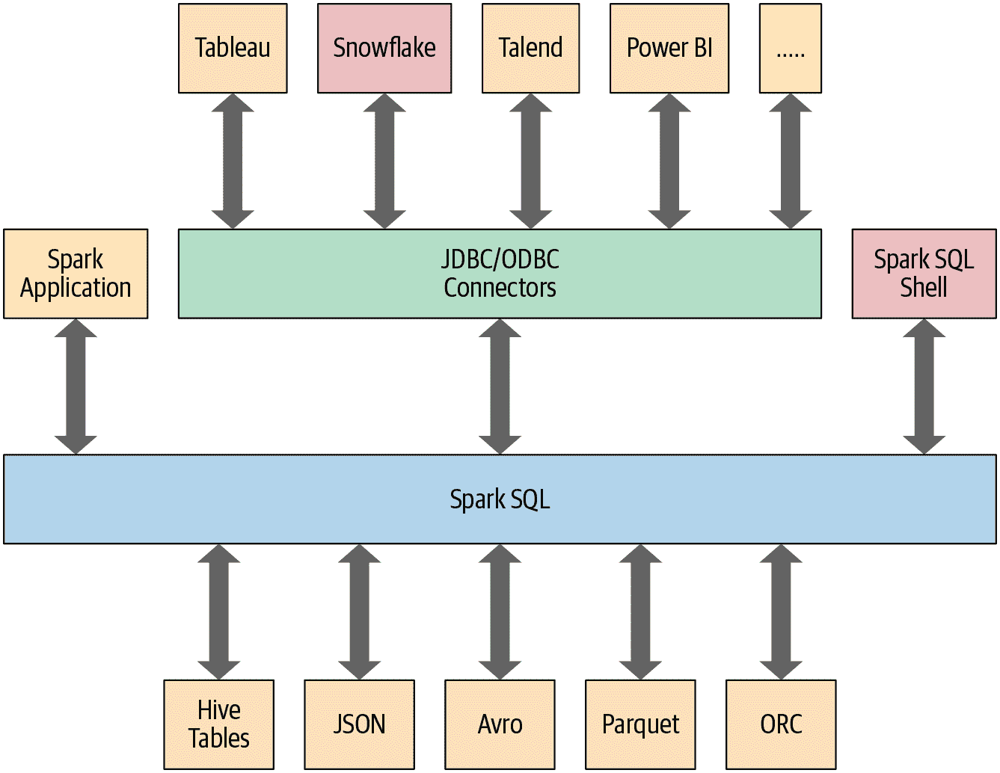

# 第四章：Spark SQL 和 DataFrame：内置数据源简介

在上一章中，我们解释了 Spark 结构化的演变和其结构的合理性。特别是，我们讨论了 Spark SQL 引擎如何为高级 DataFrame 和 Dataset API 提供统一的基础。现在，我们将继续讨论 DataFrame，并探索其与 Spark SQL 的互操作性。

本章和下一章还将探讨 Spark SQL 如何与图中显示的一些外部组件接口交互（参见图 4-1）。

特别是，Spark SQL：

+   提供了高级结构化 API 的引擎，我们在第三章中探索过。

+   可以读取和写入多种结构化格式的数据（例如 JSON、Hive 表、Parquet、Avro、ORC、CSV）。

+   允许您使用来自外部商业智能（BI）数据源的 JDBC/ODBC 连接器（如 Tableau、Power BI、Talend）或来自 RDBMS（如 MySQL 和 PostgreSQL）查询数据。

+   为 Spark 应用程序中的表或视图存储的结构化数据提供了编程接口。

+   提供了一个交互式 shell，用于在您的结构化数据上发出 SQL 查询。

+   支持[ANSI SQL:2003](https://oreil.ly/83QYa)兼容命令和[HiveQL](https://oreil.ly/QFza4)。



###### 图 4-1\. Spark SQL 连接器和数据源

让我们从如何在 Spark 应用程序中使用 Spark SQL 开始。

# 在 Spark 应用程序中使用 Spark SQL

`SparkSession`，在 Spark 2.0 中引入，为使用结构化 API 编程 Spark 提供了一个[统一入口点](https://oreil.ly/B7FZh)。您可以使用 `SparkSession` 访问 Spark 功能：只需导入该类并在代码中创建一个实例。

要发出任何 SQL 查询，请在 `SparkSession` 实例 `spark` 上使用 `sql()` 方法，例如 `spark.sql("SELECT * FROM myTableName")`。以这种方式执行的所有 `spark.sql` 查询都会返回一个 DataFrame，您可以在其上执行进一步的 Spark 操作，如果您愿意——就像我们在第三章中探索的那些操作，以及您将在本章和下一章中学到的操作。

## 基本查询示例

在本节中，我们将通过对[航空准时表现和航班延误原因数据集](https://oreil.ly/gfzLZ)的几个查询示例来进行讲解，该数据集包含有关美国航班的日期、延误、距离、起点和终点的数据。它以 CSV 文件形式提供，包含超过一百万条记录。使用一个模式，我们将数据读入一个 DataFrame 并将该 DataFrame 注册为临时视图（稍后将详细讨论临时视图），以便我们可以使用 SQL 进行查询。

查询示例以代码片段提供，并且包含所有这里展示的代码的 Python 和 Scala 笔记本可以在本书的 [GitHub 仓库](https://github.com/databricks/LearningSparkV2) 中找到。这些示例将为您展示如何通过 [`spark.sql` 编程接口](https://spark.apache.org/sql) 在 Spark 应用程序中使用 SQL。与 DataFrame API 一样，这个接口以其声明性的风格允许您查询结构化数据在您的 Spark 应用程序中。

通常，在独立的 Spark 应用程序中，您会手动创建一个 `SparkSession` 实例，就像下面的例子所示。然而，在 Spark shell（或 Databricks 笔记本）中，`SparkSession` 会自动为您创建，并且可以通过适当命名的变量 `spark` 访问。

让我们首先将数据集读取到临时视图中：

```
// In Scala
import org.apache.spark.sql.SparkSession            
val spark = SparkSession
  .builder
  .appName("SparkSQLExampleApp")
  .getOrCreate()

// Path to data set 
val csvFile="/databricks-datasets/learning-spark-v2/flights/departuredelays.csv"

// Read and create a temporary view
// Infer schema (note that for larger files you may want to specify the schema)
val df = spark.read.format("csv")
  .option("inferSchema", "true")
  .option("header", "true")
  .load(csvFile)
// Create a temporary view
df.createOrReplaceTempView("us_delay_flights_tbl")
```

```
# In Python
from pyspark.sql import SparkSession        
# Create a SparkSession
spark = (SparkSession
  .builder
  .appName("SparkSQLExampleApp")
  .getOrCreate())

# Path to data set
csv_file = "/databricks-datasets/learning-spark-v2/flights/departuredelays.csv"

# Read and create a temporary view
# Infer schema (note that for larger files you 
# may want to specify the schema)
df = (spark.read.format("csv")
  .option("inferSchema", "true")
  .option("header", "true")
  .load(csv_file))
df.createOrReplaceTempView("us_delay_flights_tbl")
```

###### 注意

如果你想指定一个模式（schema），你可以使用一个 DDL 格式的字符串。例如：

```
// In Scala
val schema = "date STRING, delay INT, distance INT, 
 origin STRING, destination STRING"
```

```
# In Python
schema = "`date` STRING, `delay` INT, `distance` INT, 
 `origin` STRING, `destination` STRING"
```

现在我们有了一个临时视图，我们可以使用 Spark SQL 发出 SQL 查询。这些查询与您可能在 MySQL 或 PostgreSQL 数据库中针对 SQL 表发出的查询没有什么不同。这里的重点是显示 Spark SQL 提供了符合 ANSI:2003 标准的 SQL 接口，并演示 SQL 和 DataFrames 之间的互操作性。

美国航班延误数据集有五列：

+   `date` 列包含类似 `02190925` 的字符串。当转换时，这映射为 `02-19 09:25 am`。

+   `delay` 列给出计划和实际起飞时间之间的延迟时间（分钟）。提前起飞显示为负数。

+   `distance` 列给出起飞机场到目的地机场的距离（英里）。

+   `origin` 列包含起飞机场的 IATA 机场代码。

+   `destination` 列包含目的地的 IATA 机场代码。

考虑到这一点，让我们尝试一些针对这个数据集的示例查询。

首先，我们将找到所有距离超过 1,000 英里的航班：

```
spark.sql("""SELECT distance, origin, destination 
FROM us_delay_flights_tbl WHERE distance > 1000 
ORDER BY distance DESC""").show(10)

+--------+------+-----------+
|distance|origin|destination|
+--------+------+-----------+
|4330    |HNL   |JFK        |
|4330    |HNL   |JFK        |
|4330    |HNL   |JFK        |
|4330    |HNL   |JFK        |
|4330    |HNL   |JFK        |
|4330    |HNL   |JFK        |
|4330    |HNL   |JFK        |
|4330    |HNL   |JFK        |
|4330    |HNL   |JFK        |
|4330    |HNL   |JFK        |
+--------+------+-----------+
only showing top 10 rows
```

正如结果所示，所有最长的航班都是在檀香山（HNL）和纽约（JFK）之间。接下来，我们将找到所有从旧金山（SFO）到芝加哥（ORD）的航班，至少延误两小时：

```
spark.sql("""SELECT date, delay, origin, destination 
FROM us_delay_flights_tbl 
WHERE delay > 120 AND ORIGIN = 'SFO' AND DESTINATION = 'ORD' 
ORDER by delay DESC""").show(10)

+--------+-----+------+-----------+
|date    |delay|origin|destination|
+--------+-----+------+-----------+
|02190925|1638 |SFO   |ORD        |
|01031755|396  |SFO   |ORD        |
|01022330|326  |SFO   |ORD        |
|01051205|320  |SFO   |ORD        |
|01190925|297  |SFO   |ORD        |
|02171115|296  |SFO   |ORD        |
|01071040|279  |SFO   |ORD        |
|01051550|274  |SFO   |ORD        |
|03120730|266  |SFO   |ORD        |
|01261104|258  |SFO   |ORD        |
+--------+-----+------+-----------+
only showing top 10 rows
```

看起来在这两个城市之间有许多显著延误的航班，不同的日期。（作为练习，将 `date` 列转换为可读格式，并找出这些延误最常见的日期或月份。这些延误是否与冬季月份或节假日有关？）

让我们尝试一个更复杂的查询，其中我们在 SQL 中使用 `CASE` 子句。在下面的示例中，我们希望标记所有美国航班，无论起飞地和目的地如何，都显示它们经历的延误情况：非常长的延误（> 6 小时），长延误（2–6 小时），等等。我们将在一个名为 `Flight_Delays` 的新列中添加这些人类可读的标签：

```
spark.sql("""SELECT delay, origin, destination,
              CASE
                  WHEN delay > 360 THEN 'Very Long Delays'
                  WHEN delay > 120 AND delay < 360 THEN 'Long Delays'
                  WHEN delay > 60 AND delay < 120 THEN 'Short Delays'
                  WHEN delay > 0 and delay < 60  THEN  'Tolerable Delays'
                  WHEN delay = 0 THEN 'No Delays'
                  ELSE 'Early'
               END AS Flight_Delays
               FROM us_delay_flights_tbl
               ORDER BY origin, delay DESC""").show(10)

+-----+------+-----------+-------------+
|delay|origin|destination|Flight_Delays|
+-----+------+-----------+-------------+
|333  |ABE   |ATL        |Long Delays  |
|305  |ABE   |ATL        |Long Delays  |
|275  |ABE   |ATL        |Long Delays  |
|257  |ABE   |ATL        |Long Delays  |
|247  |ABE   |DTW        |Long Delays  |
|247  |ABE   |ATL        |Long Delays  |
|219  |ABE   |ORD        |Long Delays  |
|211  |ABE   |ATL        |Long Delays  |
|197  |ABE   |DTW        |Long Delays  |
|192  |ABE   |ORD        |Long Delays  |
+-----+------+-----------+-------------+
only showing top 10 rows
```

与 DataFrame 和 Dataset API 一样，通过 `spark.sql` 接口，您可以进行像前一章中探索的常见数据分析操作。这些计算经历了相同的 Spark SQL 引擎过程（详见 “Catalyst 优化器” 在 第三章 中的详细说明），从而给您带来相同的结果。

前面三个 SQL 查询可以用等效的 DataFrame API 查询来表示。例如，第一个查询可以在 Python 的 DataFrame API 中表示为：

```
# In Python
from pyspark.sql.functions import col, desc
(df.select("distance", "origin", "destination")
  .where(col("distance") > 1000)
  .orderBy(desc("distance"))).show(10)

# Or
(df.select("distance", "origin", "destination")
  .where("distance > 1000")
  .orderBy("distance", ascending=False).show(10))
```

这将产生与 SQL 查询相同的结果：

```
+--------+------+-----------+
|distance|origin|destination|
+--------+------+-----------+
|4330    |HNL   |JFK        |
|4330    |HNL   |JFK        |
|4330    |HNL   |JFK        |
|4330    |HNL   |JFK        |
|4330    |HNL   |JFK        |
|4330    |HNL   |JFK        |
|4330    |HNL   |JFK        |
|4330    |HNL   |JFK        |
|4330    |HNL   |JFK        |
|4330    |HNL   |JFK        |
+--------+------+-----------+
only showing top 10 rows
```

作为练习，请尝试将另外两个 SQL 查询转换为使用 DataFrame API 的形式。

正如这些示例所示，使用 Spark SQL 接口查询数据类似于向关系数据库表写入常规 SQL 查询。尽管查询使用 SQL 编写，但您可以感受到与 DataFrame API 操作的可读性和语义的相似性，您在 第三章 中已经遇到并将在下一章进一步探索。

为了使您能够像前面的示例中展示的那样查询结构化数据，Spark 管理创建和管理视图和表的所有复杂性，无论是在内存中还是磁盘上。这将引导我们进入下一个主题：如何创建和管理表和视图。

# SQL 表和视图

表存储数据。在 Spark 中，每个表都有相关的元数据，包括表和数据的信息：模式、描述、表名、数据库名、列名、分区、实际数据存储的物理位置等等。所有这些信息都存储在中央元数据存储中。

与为 Spark 表单独设置元数据存储不同，默认情况下 Spark 使用 Apache Hive 元数据存储，位置在 /user/hive/warehouse，用于持久化表的所有元数据。然而，您可以通过设置 Spark 配置变量 `spark.sql.warehouse.dir` 来更改默认位置，可以设置为本地或外部分布式存储。

## 托管与非托管表

Spark 允许您创建两种类型的表：托管表和非托管表。对于 *托管* 表，Spark 管理文件存储中的元数据和数据。这可以是本地文件系统、HDFS 或对象存储（如 Amazon S3 或 Azure Blob）。对于 *非托管* 表，Spark 只管理元数据，而您需要自己在外部 [数据源](https://oreil.ly/Scvor)（例如 Cassandra）中管理数据。

对于托管表，因为 Spark 管理一切，例如 SQL 命令 `DROP TABLE table_name` 会同时删除元数据和数据。对于非托管表，同样的命令只会删除元数据，而不会删除实际数据。我们将在下一节看一些创建托管和非托管表的示例。

## 创建 SQL 数据库和表

表位于数据库中。默认情况下，Spark 在 `default` 数据库下创建表。要创建自己的数据库名称，您可以从您的 Spark 应用程序或笔记本中发出 SQL 命令。使用美国航班延误数据集，让我们创建一个托管表和一个非托管表。首先，我们将创建一个名为 `learn_spark_db` 的数据库，并告诉 Spark 我们要使用该数据库：

```
// In Scala/Python
spark.sql("CREATE DATABASE learn_spark_db")
spark.sql("USE learn_spark_db")
```

从此处开始，我们在应用程序中发出的任何命令来创建表都将导致这些表被创建在此数据库中，并位于数据库名称 `learn_spark_db` 下。

### 创建一个托管表

要在 `learn_spark_db` 数据库中创建一个托管表，可以执行如下的 SQL 查询：

```
// In Scala/Python
spark.sql("CREATE TABLE managed_us_delay_flights_tbl (date STRING, delay INT, 
 distance INT, origin STRING, destination STRING)")
```

您可以使用 DataFrame API 来执行相同的操作，如下所示：

```
# In Python
# Path to our US flight delays CSV file 
csv_file = "/databricks-datasets/learning-spark-v2/flights/departuredelays.csv"
# Schema as defined in the preceding example
schema="date STRING, delay INT, distance INT, origin STRING, destination STRING"
flights_df = spark.read.csv(csv_file, schema=schema)
flights_df.write.saveAsTable("managed_us_delay_flights_tbl")
```

这两个语句将在 `learn_spark_db` 数据库中创建托管表 `us_delay_flights_tbl`。

### 创建一个非托管表

相反，您可以从您自己的数据源（例如存储在文件存储中的 Parquet、CSV 或 JSON 文件）创建非托管表，这些表对您的 Spark 应用程序可访问。

要从诸如 CSV 文件之类的数据源创建一个非托管表，在 SQL 中使用：

```
spark.sql("""CREATE TABLE us_delay_flights_tbl(date STRING, delay INT, 
  distance INT, origin STRING, destination STRING) 
  USING csv OPTIONS (PATH 
  '/databricks-datasets/learning-spark-v2/flights/departuredelays.csv')""")
```

在 DataFrame API 内使用：

```
(flights_df
  .write
  .option("path", "/tmp/data/us_flights_delay")
  .saveAsTable("us_delay_flights_tbl"))
```

###### 注意

为了让您能够探索这些示例，我们已经创建了 Python 和 Scala 示例笔记本，您可以在本书的 [GitHub 仓库](https://github.com/databricks/LearningSparkV2) 中找到。

## 创建视图

除了创建表外，Spark 还可以在现有表的基础上创建视图。视图可以是全局的（在给定集群上的所有 `SparkSession` 中可见）或会话作用域的（仅对单个 `SparkSession` 可见），它们是临时的：在 Spark 应用程序终止后会消失。

[创建视图](https://oreil.ly/8OqlM) 与在数据库内创建表具有类似的语法。创建视图后，您可以像查询表一样查询它。视图和表的区别在于视图实际上不保存数据；表在 Spark 应用程序终止后保持存在，但视图会消失。

您可以使用 SQL 从现有表创建视图。例如，如果您希望仅处理具有纽约（JFK）和旧金山（SFO）起飞机场的美国航班延误数据集的子集，则以下查询将创建仅由该表切片组成的全局临时视图和临时视图：

```
-- In SQL
CREATE OR REPLACE GLOBAL TEMP VIEW us_origin_airport_SFO_global_tmp_view AS
  SELECT date, delay, origin, destination from us_delay_flights_tbl WHERE 
  origin = 'SFO';

CREATE OR REPLACE TEMP VIEW us_origin_airport_JFK_tmp_view AS
  SELECT date, delay, origin, destination from us_delay_flights_tbl WHERE 
  origin = 'JFK'
```

你可以使用 DataFrame API 来完成相同的事情：

```
# In Python
df_sfo = spark.sql("SELECT date, delay, origin, destination FROM 
  us_delay_flights_tbl WHERE origin = 'SFO'")
df_jfk = spark.sql("SELECT date, delay, origin, destination FROM 
  us_delay_flights_tbl WHERE origin = 'JFK'")

# Create a temporary and global temporary view
df_sfo.createOrReplaceGlobalTempView("us_origin_airport_SFO_global_tmp_view")
df_jfk.createOrReplaceTempView("us_origin_airport_JFK_tmp_view")
```

一旦创建了这些视图，您可以像对待表一样发出查询。请注意，当访问全局临时视图时，您必须使用前缀 `global_temp*.<view_name>*`，因为 Spark 在全局临时数据库 `global_temp` 中创建全局临时视图。例如：

```
-- In SQL 
SELECT * FROM global_temp.us_origin_airport_SFO_global_tmp_view
```

相反，您可以访问普通的临时视图，而无需使用 `global_temp` 前缀：

```
-- In SQL 
SELECT * FROM us_origin_airport_JFK_tmp_view
```

```
// In Scala/Python
spark.read.table("us_origin_airport_JFK_tmp_view")
// Or
spark.sql("SELECT * FROM us_origin_airport_JFK_tmp_view")
```

您还可以像删除表一样删除视图：

```
-- In SQL
DROP VIEW IF EXISTS us_origin_airport_SFO_global_tmp_view;
DROP VIEW IF EXISTS us_origin_airport_JFK_tmp_view
```

```
// In Scala/Python
spark.catalog.dropGlobalTempView("us_origin_airport_SFO_global_tmp_view")
spark.catalog.dropTempView("us_origin_airport_JFK_tmp_view")
```

### 临时视图与全局临时视图

*临时*视图和*全局临时*视图之间的差异微妙，对于刚接触 Spark 的开发人员来说可能会造成轻微混淆。临时视图绑定在 Spark 应用程序中的单个`SparkSession`中。相比之下，全局临时视图在 Spark 应用程序中的多个`SparkSession`中可见。是的，您可以在单个 Spark 应用程序中创建[多个`SparkSession`s](https://oreil.ly/YbTFa)——例如，在您想要访问（和合并）不共享相同 Hive 元存储配置的两个不同`SparkSession`s 的数据时，这可能会很方便。

## 查看元数据

正如之前提到的，Spark 管理每个托管或非托管表相关的元数据。这些数据被捕获在[`Catalog`](https://oreil.ly/56HYV)中，这是 Spark SQL 中用于存储元数据的高级抽象。在 Spark 2.x 中，`Catalog`的功能通过新的公共方法进行了扩展，使您能够查看与您的数据库、表和视图相关的元数据。Spark 3.0 扩展了其使用外部`catalog`的功能（我们在第十二章中简要讨论）。

例如，在 Spark 应用程序中创建`SparkSession`变量`spark`后，您可以通过类似以下方法访问所有存储的元数据：

```
// In Scala/Python
spark.catalog.listDatabases()
spark.catalog.listTables()
spark.catalog.listColumns("us_delay_flights_tbl")
```

从书的[GitHub repo](https://github.com/databricks/LearningSparkV2)导入笔记本并尝试一下。

## 缓存 SQL 表

虽然我们将在下一章讨论表缓存策略，但在这里值得一提的是，与 DataFrame 一样，您可以缓存和取消缓存 SQL 表和视图。在[Spark 3.0](https://oreil.ly/2ptwu)中，除了其他选项外，您还可以指定表为`LAZY`，这意味着它只有在首次使用时才会被缓存，而不是立即缓存：

```
-- In SQL CACHE [LAZY] TABLE *`<``table``-``name``>`*
UNCACHE TABLE *`<``table``-``name``>`*
```

## 将表读取到 DataFrames 中

数据工程师经常会在他们的常规数据摄取和 ETL 过程中构建数据管道。他们会用经过清洗的数据填充 Spark SQL 数据库和表，以便应用程序在下游消费。

假设你有一个现有的数据库，`learn_spark_db`，以及一个准备就绪的表，`us_delay_flights_tbl`。你可以直接使用 SQL 查询该表，并将返回的结果赋给一个 DataFrame：

```
// In Scala
val usFlightsDF = spark.sql("SELECT * FROM us_delay_flights_tbl")
val usFlightsDF2 = spark.table("us_delay_flights_tbl")
```

```
# In Python
us_flights_df = spark.sql("SELECT * FROM us_delay_flights_tbl")
us_flights_df2 = spark.table("us_delay_flights_tbl")
```

现在，您已经从现有的 Spark SQL 表中读取了一个经过清洗的 DataFrame。您还可以使用 Spark 的内置数据源读取其他格式的数据，从而灵活地与各种常见文件格式交互。

# DataFrames 和 SQL 表的数据源

如图 4-1 所示，Spark SQL 提供了与各种数据源交互的接口。它还提供了一套通用方法，用于通过[数据源 API](https://oreil.ly/_8-6A)从这些数据源读取和写入数据。

在本节中，我们将介绍一些[内置数据源](https://oreil.ly/Hj9pd)、可用文件格式以及加载和写入数据的方式，以及与这些数据源相关的特定选项。但首先，让我们更详细地了解两个高级别的数据源 API 构造，它们决定了您与不同数据源交互的方式：`DataFrameReader`和`DataFrameWriter`。

## DataFrameReader

[`DataFrameReader`](https://oreil.ly/UZXdx)是从数据源读取数据到 DataFrame 的核心构造。它具有定义的格式和推荐的使用模式：

```
DataFrameReader.format(args).option("key", "value").schema(args).load()
```

在 Spark 中，将方法串联在一起的模式很常见且易于阅读。在我们探索常见数据分析模式时（见第三章），我们已经看到过这种模式。

请注意，只能通过`SparkSession`实例访问`DataFrameReader`。也就是说，不能创建`DataFrameReader`的实例。要获取对它的实例句柄，请使用：

```
SparkSession.read 
// or 
SparkSession.readStream
```

当使用`read`方法时，返回一个`DataFrameReader`的句柄，用于从静态数据源读取 DataFrame；而使用`readStream`方法时，则返回一个实例，用于从流式数据源读取。（我们将在本书后面讨论结构化流处理。）

`DataFrameReader`的每个公共方法的参数取不同的值。表 4-1 列举了这些参数及其支持的子集。

表 4-1\. DataFrameReader 方法、参数和选项

| 方法 | 参数 | 描述 |
| --- | --- | --- |
| `format()` | `"parquet"`, `"csv"`, `"txt"`, `"json"`, `"jdbc"`, `"orc"`, `"avro"`等 | 如果不指定此方法，则默认为 Parquet 格式或者根据`spark.sql.sources.default`设置的格式。 |

| `option()` | `("mode", {PERMISSIVE &#124; FAILFAST &#124; DROPMALFORMED})` `("inferSchema", {true &#124; false})`

`("path", "path_file_data_source")` | 一系列键/值对和选项。[Spark 文档](https://oreil.ly/XujEK)展示了一些示例，并解释了不同模式及其作用。默认模式是`PERMISSIVE`。`"inferSchema"`和`"mode"`选项特定于 JSON 和 CSV 文件格式。 |

| `schema()` | DDL `String`或`StructType`，例如，`'A INT, B STRING'`或`StructType(...)` | 对于 JSON 或 CSV 格式，可以在`option()`方法中指定推断模式。通常，为任何格式提供模式可以加快加载速度，并确保数据符合预期的模式。 |
| --- | --- | --- |
| `load()` | `"/path/to/data/source"` | 数据源的路径。如果在`option("path", "...")`中指定，则可以为空。 |

虽然我们不会详尽列举所有不同参数和选项的组合，但[Python、Scala、R 和 Java 的文档](https://oreil.ly/RsfRg)提供了建议和指导。尽管如此，展示一些示例仍然是值得的：

```
// In Scala
// Use Parquet 
val file = """/databricks-datasets/learning-spark-v2/flights/summary-
 data/parquet/2010-summary.parquet"""
val df = spark.read.format("parquet").load(file) 
// Use Parquet; you can omit format("parquet") if you wish as it's the default
val df2 = spark.read.load(file)
// Use CSV
val df3 = spark.read.format("csv")
  .option("inferSchema", "true")
  .option("header", "true")
  .option("mode", "PERMISSIVE")
  .load("/databricks-datasets/learning-spark-v2/flights/summary-data/csv/*")
// Use JSON
val df4 = spark.read.format("json")
  .load("/databricks-datasets/learning-spark-v2/flights/summary-data/json/*")
```

###### 注意

一般来说，从静态 Parquet 数据源读取时不需要模式——Parquet 元数据通常包含模式，因此可以推断出   通常，当从静态的 Parquet 数据源读取时，不需要 schema —— Parquet 的元数据通常包含 schema，因此可以推断出来。然而，对于流式数据源，你需要提供 schema。（我们将在第八章介绍如何从流式数据源读取。）

Parquet 是 Spark 的默认和首选数据源，因为它高效，使用列式存储，并采用快速压缩算法。你将在后面看到额外的好处（例如列式下推），当我们更深入介绍 Catalyst 优化器时。

## DataFrameWriter

[`DataFrameWriter`](https://oreil.ly/SM1LR) 的功能与其对应方法相反：它将数据保存或写入到指定的内置数据源。与 `DataFrameReader` 不同，你的实例不是从 `SparkSession` 获取，而是从你希望保存的 DataFrame 获取。它有一些推荐的使用模式：

```
DataFrameWriter.format(args)
  .option(args)
  .bucketBy(args)
  .partitionBy(args)
  .save(path)

DataFrameWriter.format(args).option(args).sortBy(args).saveAsTable(table)
```

要获取实例句柄，使用：

```
DataFrame.write
// or 
DataFrame.writeStream
```

`DataFrameWriter` 的每个方法的参数也会取不同的值。我们在表 4-2 中列出这些参数，并列出了一部分支持的参数。

表 4-2\. DataFrameWriter 方法、参数和选项

| 方法 | 参数 | 描述 |
| --- | --- | --- |
| `format()` | `"parquet"`，`"csv"`，`"txt"`，`"json"`，`"jdbc"`，`"orc"`，`"avro"`，等等。 | 如果不指定此方法，则默认是 Parquet 或 `spark.sql.sources.default` 中设置的格式。 |

| `option()` | `("mode", {append &#124; overwrite &#124; ignore &#124; error or errorifexists} )` `("mode", {SaveMode.Overwrite &#124; SaveMode.Append, SaveMode.Ignore, SaveMode.ErrorIfExists})`

`("path", "path_to_write_to")` | 一系列键/值对和选项。[Spark 文档](https://oreil.ly/w7J0I)展示了一些示例。这是一个重载的方法。默认模式选项是 `error or errorifexists` 和 `SaveMode.ErrorIfExists`；如果数据已存在，在运行时会抛出异常。 |

| `bucketBy()` | `(numBuckets, col, col..., coln)` | 桶的数量和要按其分桶的列名。使用 Hive 的 bucketing 方案在文件系统上。 |
| --- | --- | --- |
| `save()` | `"/path/to/data/source"` | 要保存的路径。如果在 `option("path", "...")` 中指定，这里可以为空。 |
| `saveAsTable()` | `"table_name"` | 要保存到的表名。 |

下面是一个简短的示例片段，说明方法和参数的使用：

```
// In Scala
// Use JSON
val location = ... 
df.write.format("json").mode("overwrite").save(location)
```

## Parquet

我们将从 [Parquet](https://oreil.ly/-wptz) 开始探索数据源，因为它是 Spark 的默认数据源。Parquet 被许多大数据处理框架和平台支持和广泛使用，是一种开源的列式文件格式，提供许多 I/O 优化（例如压缩，节省存储空间并快速访问数据列）。

由于其高效性和这些优化，建议在转换和清洗数据后，将 DataFrame 保存为 Parquet 格式以供下游消费。（Parquet 也是 Delta Lake 的默认表开放格式，我们将在第九章中介绍。）

### 将 Parquet 文件读入 DataFrame

[Parquet 文件](https://oreil.ly/CTVzK)存储在包含数据文件、元数据、若干压缩文件和一些状态文件的目录结构中。页脚中的元数据包含文件格式的版本、模式、列数据（如路径等）等信息。

例如，Parquet 文件目录可能包含一组文件如下所示：

```
_SUCCESS
_committed_1799640464332036264
_started_1799640464332036264
part-00000-tid-1799640464332036264-91273258-d7ef-4dc7-<...>-c000.snappy.parquet
```

在目录中可能有一些压缩文件，文件名为*part-XXXX*（此处显示的名称已缩短以适应页面）。

要将 Parquet 文件读入 DataFrame，只需指定格式和路径：

```
// In Scala
val file = """/databricks-datasets/learning-spark-v2/flights/summary-data/
 parquet/2010-summary.parquet/"""
val df = spark.read.format("parquet").load(file)
```

```
# In Python
file = """/databricks-datasets/learning-spark-v2/flights/summary-data/parquet/
 2010-summary.parquet/"""
df = spark.read.format("parquet").load(file)
```

除非您从流数据源读取，否则无需提供模式，因为 Parquet 将其保存为其元数据的一部分。

### 将 Parquet 文件读入 Spark SQL 表

除了将 Parquet 文件读入 Spark DataFrame 之外，您还可以直接使用 SQL 创建 Spark SQL 非托管表或视图：

```
-- In SQL
CREATE OR REPLACE TEMPORARY VIEW us_delay_flights_tbl
    USING parquet
    OPTIONS (
      path "/databricks-datasets/learning-spark-v2/flights/summary-data/parquet/
 2010-summary.parquet/" )
```

创建表或视图后，您可以使用 SQL 将数据读入 DataFrame，就像我们在一些早期示例中看到的那样：

```
// In Scala
spark.sql("SELECT * FROM us_delay_flights_tbl").show()
```

```
# In Python
spark.sql("SELECT * FROM us_delay_flights_tbl").show()
```

这两个操作返回相同的结果：

```
+-----------------+-------------------+-----+
|DEST_COUNTRY_NAME|ORIGIN_COUNTRY_NAME|count|
+-----------------+-------------------+-----+
|United States    |Romania            |1    |
|United States    |Ireland            |264  |
|United States    |India              |69   |
|Egypt            |United States      |24   |
|Equatorial Guinea|United States      |1    |
|United States    |Singapore          |25   |
|United States    |Grenada            |54   |
|Costa Rica       |United States      |477  |
|Senegal          |United States      |29   |
|United States    |Marshall Islands   |44   |
+-----------------+-------------------+-----+
only showing top 10 rows
```

### 将 DataFrame 写入 Parquet 文件

在 Spark 中，将 DataFrame 写入表或文件是常见操作。要写入 DataFrame，只需使用本章早些时候介绍的`DataFrameWriter`方法和参数，并提供保存 Parquet 文件的位置。例如：

```
// In Scala
df.write.format("parquet")
  .mode("overwrite")
  .option("compression", "snappy")
  .save("/tmp/data/parquet/df_parquet")
```

```
# In Python
(df.write.format("parquet")
  .mode("overwrite")
  .option("compression", "snappy")
  .save("/tmp/data/parquet/df_parquet"))
```

###### 注意

请记住，Parquet 是默认文件格式。如果不包含`format()`方法，DataFrame 仍将保存为 Parquet 文件。

这将在指定路径创建一组紧凑且压缩的 Parquet 文件。由于我们在这里选择了 snappy 作为压缩方式，因此我们将获得 snappy 压缩的文件。为简洁起见，本示例仅生成了一个文件；通常会创建十几个文件：

```
-rw-r--r--  1 jules  wheel    0 May 19 10:58 _SUCCESS
-rw-r--r--  1 jules  wheel  966 May 19 10:58 part-00000-<...>-c000.snappy.parquet
```

### 将 DataFrame 写入 Spark SQL 表

将 DataFrame 写入 SQL 表与写入文件一样简单，只需使用`saveAsTable()`而不是`save()`。这将创建一个名为`us_delay_flights_tbl`的托管表：

```
// In Scala
df.write
  .mode("overwrite")
  .saveAsTable("us_delay_flights_tbl")
```

```
# In Python
(df.write
  .mode("overwrite")
  .saveAsTable("us_delay_flights_tbl"))
```

总之，Parquet 是 Spark 中首选和默认的内置数据源文件格式，并已被许多其他框架采纳。我们建议您在 ETL 和数据摄入过程中使用这种格式。

## JSON

[JavaScript 对象表示法（JSON）](https://oreil.ly/bBdLc)也是一种流行的数据格式。与 XML 相比，它因易于阅读和解析而广受欢迎。它有两种表示格式：单行模式和多行模式。在 Spark 中，两种模式都受支持。

在单行模式下 [每行表示一个单独的 JSON 对象](http://jsonlines.org/)，而在多行模式下整个多行对象构成一个单独的 JSON 对象。要在此模式下读取，请在 `option()` 方法中将 `multiLine` 设置为 true。

### 将 JSON 文件读取到 DataFrame 中

您可以像使用 Parquet 文件一样将 JSON 文件读入 DataFrame 中——只需在 `format()` 方法中指定 `"json"` 即可：

```
// In Scala
val file = "/databricks-datasets/learning-spark-v2/flights/summary-data/json/*"
val df = spark.read.format("json").load(file)
```

```
# In Python
file = "/databricks-datasets/learning-spark-v2/flights/summary-data/json/*"
df = spark.read.format("json").load(file)
```

### 将 JSON 文件读取到 Spark SQL 表中

您还可以像使用 Parquet 一样从 JSON 文件创建 SQL 表：

```
-- In SQL CREATE OR REPLACE TEMPORARY VIEW `us_delay_flights_tbl`
    USING json
    OPTIONS (
      path  "/databricks-datasets/learning-spark-v2/flights/summary-data/json/*"
    )
```

创建表格后，您可以像以前一样使用 SQL 将数据读入 DataFrame 中：

```
// In Scala/Python
spark.sql("SELECT * FROM us_delay_flights_tbl").show()

+-----------------+-------------------+-----+
|DEST_COUNTRY_NAME|ORIGIN_COUNTRY_NAME|count|
+-----------------+-------------------+-----+
|United States    |Romania            |15   |
|United States    |Croatia            |1    |
|United States    |Ireland            |344  |
|Egypt            |United States      |15   |
|United States    |India              |62   |
|United States    |Singapore          |1    |
|United States    |Grenada            |62   |
|Costa Rica       |United States      |588  |
|Senegal          |United States      |40   |
|Moldova          |United States      |1    |
+-----------------+-------------------+-----+
only showing top 10 rows
```

### 将 DataFrame 写入 JSON 文件

将 DataFrame 保存为 JSON 文件很简单。指定适当的 `DataFrameWriter` 方法和参数，并提供保存 JSON 文件的位置：

```
// In Scala
df.write.format("json")
  .mode("overwrite")
  .option("compression", "snappy")
  .save("/tmp/data/json/df_json")
```

```
# In Python
(df.write.format("json")
  .mode("overwrite")
  .option("compression", "snappy")
  .save("/tmp/data/json/df_json"))
```

此操作会在指定路径创建一个目录，并填充一组紧凑的 JSON 文件：

```
-rw-r--r--  1 jules  wheel   0 May 16 14:44 _SUCCESS
-rw-r--r--  1 jules  wheel  71 May 16 14:44 part-00000-<...>-c000.json
```

### JSON 数据源选项

表格 4-3 描述了 [`DataFrameReader`](https://oreil.ly/iDZ2T) 和 [`DataFrameWriter`](https://oreil.ly/MunK1) 的常见 JSON 选项。详细清单请参阅文档。

表格 4-3\. DataFrameReader 和 DataFrameWriter 的 JSON 选项

| 属性名称 | 值 | 含义 | 范围 |
| --- | --- | --- | --- |
| `compression` | `none`, `uncompressed`, `bzip2`, `deflate`, `gzip`, `lz4`, 或 `snappy` | 使用此压缩编解码器进行写入。请注意，读取将仅从文件扩展名检测压缩或编解码器。 | 写入 |
| `dateFormat` | `yyyy-MM-dd` 或 `DateTimeFormatter` | 使用此格式或 Java 的任何 `DateTimeFormatter` 格式。 | 读/写 |
| `multiLine` | `true`, `false` | 使用多行模式。默认为 `false`（单行模式）。 | 读取 |
| `allowUnquotedFieldNames` | `true`, `false` | 允许未引用的 JSON 字段名称。默认为 `false`。 | 读取 |

## CSV

与普通文本文件一样广泛使用的是这种通用文本文件格式，每个数据或字段由逗号分隔；每行逗号分隔的字段表示一个记录。即使逗号是默认分隔符，您也可以在数据中使用其他分隔符来分隔字段，以避免逗号作为数据的一部分。流行的电子表格可以生成 CSV 文件，因此它在数据和业务分析师中很受欢迎的格式。

### 将 CSV 文件读取到 DataFrame 中

与其他内置数据源一样，您可以使用 `DataFrameReader` 方法和参数将 CSV 文件读取到 DataFrame 中：

```
// In Scala
val file = "/databricks-datasets/learning-spark-v2/flights/summary-data/csv/*"
val schema = "DEST_COUNTRY_NAME STRING, ORIGIN_COUNTRY_NAME STRING, count INT"

val df = spark.read.format("csv")
  .schema(schema)
  .option("header", "true")
  .option("mode", "FAILFAST")     // Exit if any errors
  .option("nullValue", "")        // Replace any null data with quotes
  .load(file)
```

```
# In Python
file = "/databricks-datasets/learning-spark-v2/flights/summary-data/csv/*"
schema = "DEST_COUNTRY_NAME STRING, ORIGIN_COUNTRY_NAME STRING, count INT"
df = (spark.read.format("csv")
  .option("header", "true")
  .schema(schema)
  .option("mode", "FAILFAST")  # Exit if any errors
  .option("nullValue", "")     # Replace any null data field with quotes
  .load(file))
```

### 将 CSV 文件读取到 Spark SQL 表中

从 CSV 数据源创建 SQL 表与使用 Parquet 或 JSON 没有区别：

```
-- In SQL
CREATE OR REPLACE TEMPORARY VIEW us_delay_flights_tbl
    USING csv
    OPTIONS (
      path "/databricks-datasets/learning-spark-v2/flights/summary-data/csv/*",
      header "true",
      inferSchema "true",
      mode "FAILFAST"
    )
```

创建表格后，您可以像以前一样使用 SQL 将数据读入 DataFrame 中：

```
// In Scala/Python
spark.sql("SELECT * FROM us_delay_flights_tbl").show(10)

+-----------------+-------------------+-----+
|DEST_COUNTRY_NAME|ORIGIN_COUNTRY_NAME|count|
+-----------------+-------------------+-----+
|United States    |Romania            |1    |
|United States    |Ireland            |264  |
|United States    |India              |69   |
|Egypt            |United States      |24   |
|Equatorial Guinea|United States      |1    |
|United States    |Singapore          |25   |
|United States    |Grenada            |54   |
|Costa Rica       |United States      |477  |
|Senegal          |United States      |29   |
|United States    |Marshall Islands   |44   |
+-----------------+-------------------+-----+
only showing top 10 rows
```

### 将 DataFrame 写入 CSV 文件

将 DataFrame 保存为 CSV 文件很简单。指定适当的 `DataFrameWriter` 方法和参数，并提供保存 CSV 文件的位置：

```
// In Scala
df.write.format("csv").mode("overwrite").save("/tmp/data/csv/df_csv")
```

```
# In Python
df.write.format("csv").mode("overwrite").save("/tmp/data/csv/df_csv")
```

这将在指定位置生成一个文件夹，并填充一堆压缩和紧凑的文件：

```
-rw-r--r--  1 jules  wheel   0 May 16 12:17 _SUCCESS
-rw-r--r--  1 jules  wheel  36 May 16 12:17 part-00000-251690eb-<...>-c000.csv
```

### CSV 数据源选项

表 4-4 描述了 [`DataFrameReader`](https://oreil.ly/Au6Kd) 和 [`DataFrameWriter`](https://oreil.ly/4g-vz) 的一些常见 CSV 选项。因为 CSV 文件可能很复杂，提供了许多选项；详细列表请参阅文档。

表 4-4\. DataFrameReader 和 DataFrameWriter 的 CSV 选项

| 属性名称 | 值 | 含义 | 范围 |
| --- | --- | --- | --- |
| `compression` | `none`, `bzip2`, `deflate`, `gzip`, `lz4` 或 `snappy` | 用于写入的压缩编解码器。 | 写入 |
| `dateFormat` | `yyyy-MM-dd` 或 `DateTimeFormatter` | 使用此格式或 Java 的 `DateTimeFormatter` 中的任何格式。 | 读取/写入 |
| `multiLine` | `true`, `false` | 使用多行模式。默认为`false`（单行模式）。 | 读取 |
| `inferSchema` | `true`, `false` | 如果为 `true`，Spark 将确定列数据类型。默认为 `false`。 | 读取 |
| `sep` | 任意字符 | 用于分隔行中列值的字符。默认分隔符为逗号（`,`）。 | 读取/写入 |
| `escape` | 任意字符 | 用于转义引号的字符。默认为 `\`。 | 读取/写入 |
| `header` | `true`, `false` | 指示第一行是否为标头，表示每个列名。默认为 `false`。 | 读取/写入 |

## Avro

在 [Spark 2.4](https://oreil.ly/gqZl0) 中作为内置数据源引入，[Avro 格式](https://oreil.ly/UaJoR) 被使用，例如由 [Apache Kafka](https://oreil.ly/jhdTI) 用于消息序列化和反序列化。它提供许多好处，包括直接映射到 JSON、速度和效率以及许多编程语言的绑定。

### 将 Avro 文件读取到 DataFrame 中

使用 `DataFrameReader` 将 Avro 文件读取到 DataFrame 中，在本节中，它的使用方式与我们讨论过的其他数据源一致：

```
// In Scala
val df = spark.read.format("avro")
 .load("/databricks-datasets/learning-spark-v2/flights/summary-data/avro/*")
df.show(false)
```

```
# In Python
df = (spark.read.format("avro")
  .load("/databricks-datasets/learning-spark-v2/flights/summary-data/avro/*"))
df.show(truncate=False)

+-----------------+-------------------+-----+
|DEST_COUNTRY_NAME|ORIGIN_COUNTRY_NAME|count|
+-----------------+-------------------+-----+
|United States    |Romania            |1    |
|United States    |Ireland            |264  |
|United States    |India              |69   |
|Egypt            |United States      |24   |
|Equatorial Guinea|United States      |1    |
|United States    |Singapore          |25   |
|United States    |Grenada            |54   |
|Costa Rica       |United States      |477  |
|Senegal          |United States      |29   |
|United States    |Marshall Islands   |44   |
+-----------------+-------------------+-----+
only showing top 10 rows
```

### 将 Avro 文件读取到 Spark SQL 表中

再次，使用 Avro 数据源创建 SQL 表与使用 Parquet、JSON 或 CSV 没有什么不同：

```
-- In SQL 
CREATE OR REPLACE TEMPORARY VIEW episode_tbl
    USING avro
    OPTIONS (
      path "/databricks-datasets/learning-spark-v2/flights/summary-data/avro/*"
    )
```

创建表后，可以使用 SQL 将数据读取到 DataFrame 中：

```
// In Scala
spark.sql("SELECT * FROM episode_tbl").show(false)
```

```
# In Python
spark.sql("SELECT * FROM episode_tbl").show(truncate=False)

+-----------------+-------------------+-----+
|DEST_COUNTRY_NAME|ORIGIN_COUNTRY_NAME|count|
+-----------------+-------------------+-----+
|United States    |Romania            |1    |
|United States    |Ireland            |264  |
|United States    |India              |69   |
|Egypt            |United States      |24   |
|Equatorial Guinea|United States      |1    |
|United States    |Singapore          |25   |
|United States    |Grenada            |54   |
|Costa Rica       |United States      |477  |
|Senegal          |United States      |29   |
|United States    |Marshall Islands   |44   |
+-----------------+-------------------+-----+
only showing top 10 rows
```

### 将 DataFrame 写入 Avro 文件

将 DataFrame 写入 Avro 文件很简单。像往常一样，指定适当的 `DataFrameWriter` 方法和参数，并提供保存 Avro 文件的位置：

```
// In Scala
df.write
  .format("avro")
  .mode("overwrite")
  .save("/tmp/data/avro/df_avro")
```

```
# In Python
(df.write
  .format("avro")
  .mode("overwrite")
  .save("/tmp/data/avro/df_avro"))
```

这将在指定位置生成一个文件夹，其中包含一堆压缩和紧凑的文件：

```
-rw-r--r--  1 jules  wheel    0 May 17 11:54 _SUCCESS
-rw-r--r--  1 jules  wheel  526 May 17 11:54 part-00000-ffdf70f4-<...>-c000.avro
```

### Avro 数据源选项

表 4-5 描述了 `DataFrameReader` 和 `DataFrameWriter` 的常见选项。详细列表请参阅[文档](https://oreil.ly/Jvrd_)。

表 4-5\. DataFrameReader 和 DataFrameWriter 的 Avro 选项

| 属性名称 | 默认值 | 含义 | 范围 |
| --- | --- | --- | --- |
| `avroSchema` | None | 用户以 JSON 格式提供的可选 Avro 模式。记录字段的数据类型和命名应与输入的 Avro 数据或 Catalyst 数据（Spark 内部数据类型）匹配，否则读写操作将失败。 | 读/写 |
| `recordName` | `topLevelRecord` | 写结果中的顶级记录名称，Avro 规范要求的。 | 写 |
| `recordNamespace` | `""` | 写结果中的记录命名空间。 | 写 |
| `ignoreExtension` | `true` | 如果启用此选项，则加载所有文件（带有和不带有 *.avro* 扩展名的文件）。否则，将忽略没有 *.avro* 扩展名的文件。 | 读 |
| `compression` | `snappy` | 允许您指定写入时要使用的压缩编解码器。当前支持的编解码器包括 `uncompressed`、`snappy`、`deflate`、`bzip2` 和 `xz`。如果未设置此选项，则将考虑 `spark.sql.avro.compression.codec` 中的值。 | 写 |

## ORC

作为另一种优化的列式文件格式，Spark 2.x 支持[矢量化 ORC 读取器](https://oreil.ly/N_Brd)。两个 Spark 配置决定了使用哪种 ORC 实现。当 `spark.sql.orc.impl` 设置为 `native` 且 `spark.sql.orc.enableVectorizedReader` 设置为 `true` 时，Spark 使用矢量化 ORC 读取器。[矢量化读取器](https://oreil.ly/E2xiZ)一次读取数据块（通常每块 1,024 行），而不是逐行读取，从而优化了扫描、过滤、聚合和连接等密集操作，减少 CPU 使用。

对于使用 SQL 命令 `USING HIVE OPTIONS (fileFormat 'ORC')` 创建的 Hive ORC SerDe（序列化和反序列化）表，当 Spark 配置参数 `spark.sql.hive.convertMetastoreOrc` 设置为 `true` 时，使用矢量化读取器。

### 将 ORC 文件读取为 DataFrame

要使用 ORC 矢量化读取器读取 DataFrame，您只需使用常规的 `DataFrameReader` 方法和选项：

```
// In Scala 
val file = "/databricks-datasets/learning-spark-v2/flights/summary-data/orc/*"
val df = spark.read.format("orc").load(file)
df.show(10, false)
```

```
# In Python
file = "/databricks-datasets/learning-spark-v2/flights/summary-data/orc/*"
df = spark.read.format("orc").option("path", file).load()
df.show(10, False)

+-----------------+-------------------+-----+
|DEST_COUNTRY_NAME|ORIGIN_COUNTRY_NAME|count|
+-----------------+-------------------+-----+
|United States    |Romania            |1    |
|United States    |Ireland            |264  |
|United States    |India              |69   |
|Egypt            |United States      |24   |
|Equatorial Guinea|United States      |1    |
|United States    |Singapore          |25   |
|United States    |Grenada            |54   |
|Costa Rica       |United States      |477  |
|Senegal          |United States      |29   |
|United States    |Marshall Islands   |44   |
+-----------------+-------------------+-----+
only showing top 10 rows
```

### 将 ORC 文件读入 Spark SQL 表中

使用 ORC 数据源创建 SQL 视图时与 Parquet、JSON、CSV 或 Avro 没有区别：

```
-- In SQL
CREATE OR REPLACE TEMPORARY VIEW us_delay_flights_tbl
    USING orc
    OPTIONS (
      path "/databricks-datasets/learning-spark-v2/flights/summary-data/orc/*"
    )
```

创建表后，您可以像往常一样使用 SQL 将数据读入 DataFrame：

```
// In Scala/Python
spark.sql("SELECT * FROM us_delay_flights_tbl").show()

+-----------------+-------------------+-----+
|DEST_COUNTRY_NAME|ORIGIN_COUNTRY_NAME|count|
+-----------------+-------------------+-----+
|United States    |Romania            |1    |
|United States    |Ireland            |264  |
|United States    |India              |69   |
|Egypt            |United States      |24   |
|Equatorial Guinea|United States      |1    |
|United States    |Singapore          |25   |
|United States    |Grenada            |54   |
|Costa Rica       |United States      |477  |
|Senegal          |United States      |29   |
|United States    |Marshall Islands   |44   |
+-----------------+-------------------+-----+
only showing top 10 rows
```

### 将 DataFrame 写入 ORC 文件

在读取后写回转换后的 DataFrame 同样简单，使用 `DataFrameWriter` 方法：

```
// In Scala
df.write.format("orc")
  .mode("overwrite")
  .option("compression", "snappy")
  .save("/tmp/data/orc/df_orc")
```

```
# In Python
(df.write.format("orc")
  .mode("overwrite")
  .option("compression", "snappy")
  .save("/tmp/data/orc/flights_orc"))
```

结果将是一个指定位置包含一些压缩 ORC 文件的文件夹：

```
-rw-r--r--  1 jules  wheel    0 May 16 17:23 _SUCCESS
-rw-r--r--  1 jules  wheel  547 May 16 17:23 part-00000-<...>-c000.snappy.orc
```

## 图像

在 Spark 2.4 中，社区引入了一个新的数据源，[图像文件](https://oreil.ly/JfKBD)，以支持深度学习和机器学习框架，如 TensorFlow 和 PyTorch。对于基于计算机视觉的机器学习应用，加载和处理图像数据集至关重要。

### 将图像文件读入 DataFrame

与之前所有文件格式一样，您可以使用 `DataFrameReader` 方法和选项来读取图像文件，如下所示：

```
// In Scala
import org.apache.spark.ml.source.image

val imageDir = "/databricks-datasets/learning-spark-v2/cctvVideos/train_images/"
val imagesDF = spark.read.format("image").load(imageDir)

imagesDF.printSchema

imagesDF.select("image.height", "image.width", "image.nChannels", "image.mode", 
  "label").show(5, false)
```

```
# In Python
from pyspark.ml import image

image_dir = "/databricks-datasets/learning-spark-v2/cctvVideos/train_images/"
images_df = spark.read.format("image").load(image_dir)
images_df.printSchema()

root
 |-- image: struct (nullable = true)
 |    |-- origin: string (nullable = true)
 |    |-- height: integer (nullable = true)
 |    |-- width: integer (nullable = true)
 |    |-- nChannels: integer (nullable = true)
 |    |-- mode: integer (nullable = true)
 |    |-- data: binary (nullable = true)
 |-- label: integer (nullable = true)

images_df.select("image.height", "image.width", "image.nChannels", "image.mode", 
  "label").show(5, truncate=False)

+------+-----+---------+----+-----+
|height|width|nChannels|mode|label|
+------+-----+---------+----+-----+
|288   |384  |3        |16  |0    |
|288   |384  |3        |16  |1    |
|288   |384  |3        |16  |0    |
|288   |384  |3        |16  |0    |
|288   |384  |3        |16  |0    |
+------+-----+---------+----+-----+
only showing top 5 rows
```

## 二进制文件

Spark 3.0 增加了对[二进制文件作为数据源的支持](https://oreil.ly/UXHZl)。`DataFrameReader`将每个二进制文件转换为包含文件的原始内容和元数据的单个 DataFrame 行（记录）。二进制文件数据源生成一个包含以下列的 DataFrame：

+   path: StringType

+   modificationTime: TimestampType

+   length: LongType

+   content: BinaryType

### 将二进制文件读取为 DataFrame

要读取二进制文件，请将数据源格式指定为`binaryFile`。您可以使用数据源选项`pathGlobFilter`加载符合给定全局模式的路径的文件，同时保留分区发现的行为。例如，以下代码从输入目录中读取所有 JPG 文件，包括任何分区目录：

```
// In Scala
val path = "/databricks-datasets/learning-spark-v2/cctvVideos/train_images/"
val binaryFilesDF = spark.read.format("binaryFile")
  .option("pathGlobFilter", "*.jpg")
  .load(path)
binaryFilesDF.show(5)
```

```
# In Python
path = "/databricks-datasets/learning-spark-v2/cctvVideos/train_images/"
binary_files_df = (spark.read.format("binaryFile")
  .option("pathGlobFilter", "*.jpg")
  .load(path))
binary_files_df.show(5)

+--------------------+-------------------+------+--------------------+-----+
|                path|   modificationTime|length|             content|label|
+--------------------+-------------------+------+--------------------+-----+
|file:/Users/jules...|2020-02-12 12:04:24| 55037|[FF D8 FF E0 00 1...|    0|
|file:/Users/jules...|2020-02-12 12:04:24| 54634|[FF D8 FF E0 00 1...|    1|
|file:/Users/jules...|2020-02-12 12:04:24| 54624|[FF D8 FF E0 00 1...|    0|
|file:/Users/jules...|2020-02-12 12:04:24| 54505|[FF D8 FF E0 00 1...|    0|
|file:/Users/jules...|2020-02-12 12:04:24| 54475|[FF D8 FF E0 00 1...|    0|
+--------------------+-------------------+------+--------------------+-----+
only showing top 5 rows
```

要忽略目录中的分区数据发现，您可以将`recursiveFileLookup`设置为`"true"`：

```
// In Scala
val binaryFilesDF = spark.read.format("binaryFile")
  .option("pathGlobFilter", "*.jpg")
  .option("recursiveFileLookup", "true")
  .load(path)
binaryFilesDF.show(5)
```

```
# In Python
binary_files_df = (spark.read.format("binaryFile")
  .option("pathGlobFilter", "*.jpg")
  .option("recursiveFileLookup", "true")
  .load(path))
binary_files_df.show(5)

+--------------------+-------------------+------+--------------------+
|                path|   modificationTime|length|             content|
+--------------------+-------------------+------+--------------------+
|file:/Users/jules...|2020-02-12 12:04:24| 55037|[FF D8 FF E0 00 1...|
|file:/Users/jules...|2020-02-12 12:04:24| 54634|[FF D8 FF E0 00 1...|
|file:/Users/jules...|2020-02-12 12:04:24| 54624|[FF D8 FF E0 00 1...|
|file:/Users/jules...|2020-02-12 12:04:24| 54505|[FF D8 FF E0 00 1...|
|file:/Users/jules...|2020-02-12 12:04:24| 54475|[FF D8 FF E0 00 1...|
+--------------------+-------------------+------+--------------------+
only showing top 5 rows
```

当将`recursiveFileLookup`选项设置为`"true"`时，注意`label`列将不存在。

目前，二进制文件数据源不支持将 DataFrame 写回原始文件格式。

在本节中，您将了解如何从一系列支持的文件格式中将数据读取到 DataFrame 中。我们还展示了如何从现有的内置数据源创建临时视图和表。无论您使用 DataFrame API 还是 SQL，查询都会产生相同的结果。您可以在本书的[GitHub 存储库](https://github.com/databricks/LearningSparkV2)中的笔记本中查看其中一些查询。

# 摘要

总结一下，本章探讨了 DataFrame API 与 Spark SQL 之间的互操作性。特别是，您了解了如何使用 Spark SQL 来：

+   使用 Spark SQL 和 DataFrame API 创建托管和非托管表。

+   从各种内置数据源和文件格式读取和写入。

+   使用`spark.sql`编程接口来对存储为 Spark SQL 表或视图的结构化数据发出 SQL 查询。

+   浏览 Spark `Catalog`以检查与表和视图相关联的元数据。

+   使用`DataFrameWriter`和`DataFrameReader` API。

通过本章的代码片段和本书的[GitHub 存储库](https://github.com/databricks/LearningSparkV2)中的笔记本，您可以了解如何使用 DataFrame 和 Spark SQL。在这个过程中，下一章进一步探讨了 Spark 如何与图 4-1 中显示的外部数据源进行交互。您将看到更多关于转换和 DataFrame API 与 Spark SQL 互操作性的深入示例。
