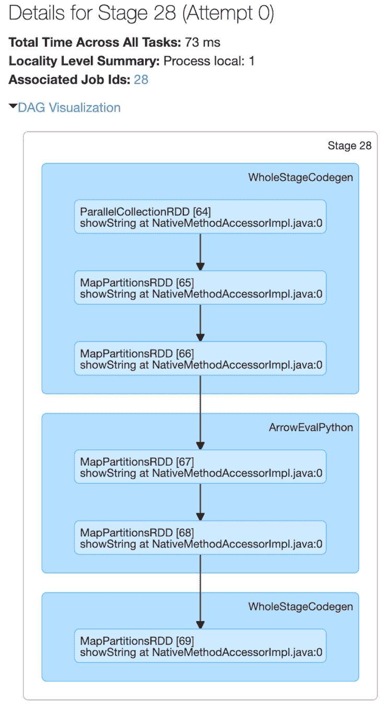
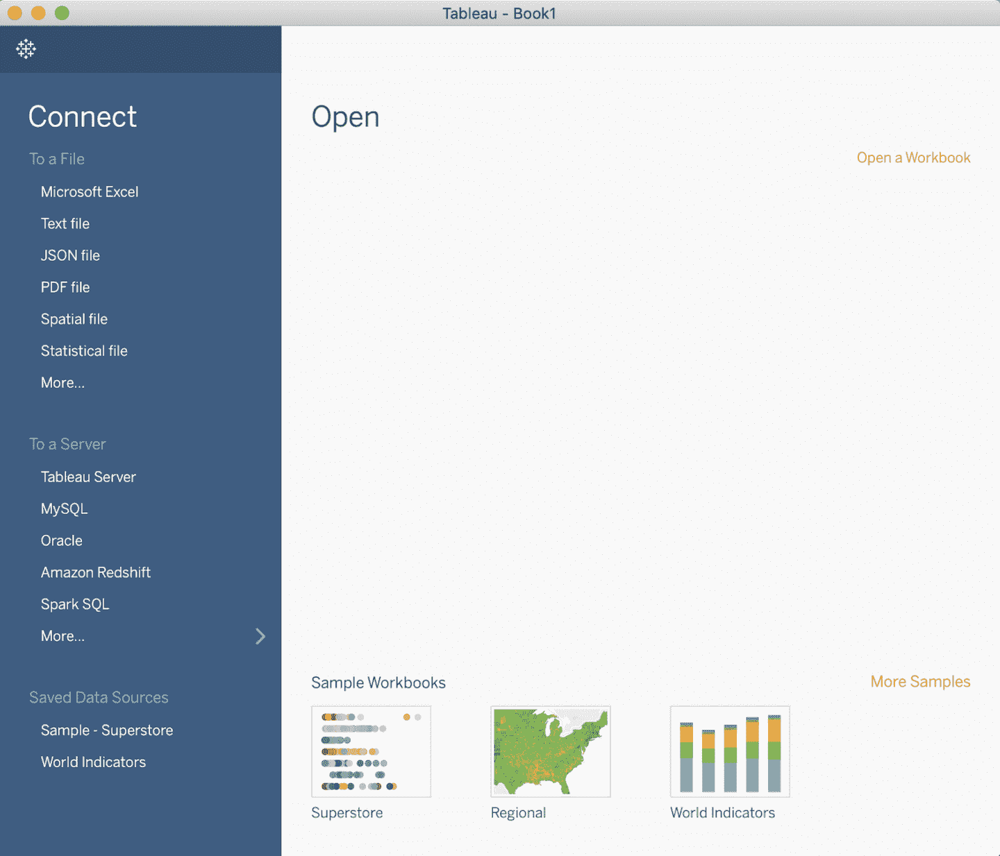
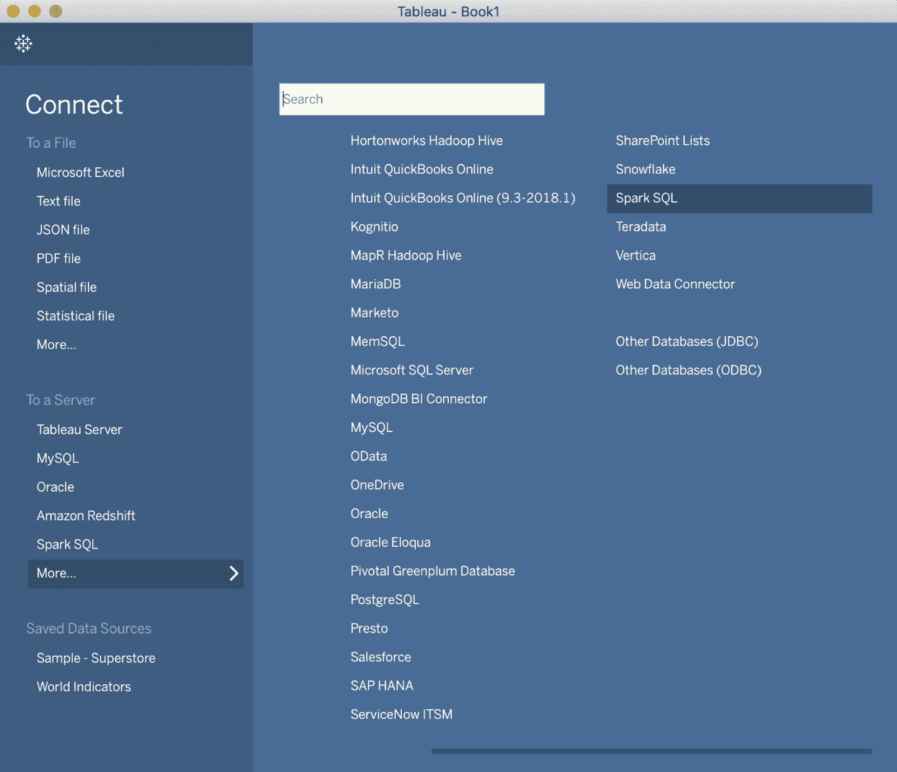
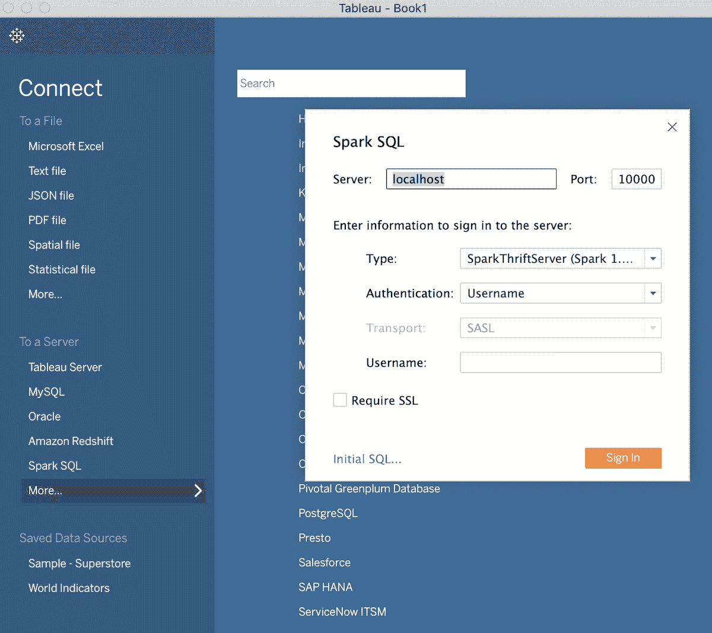
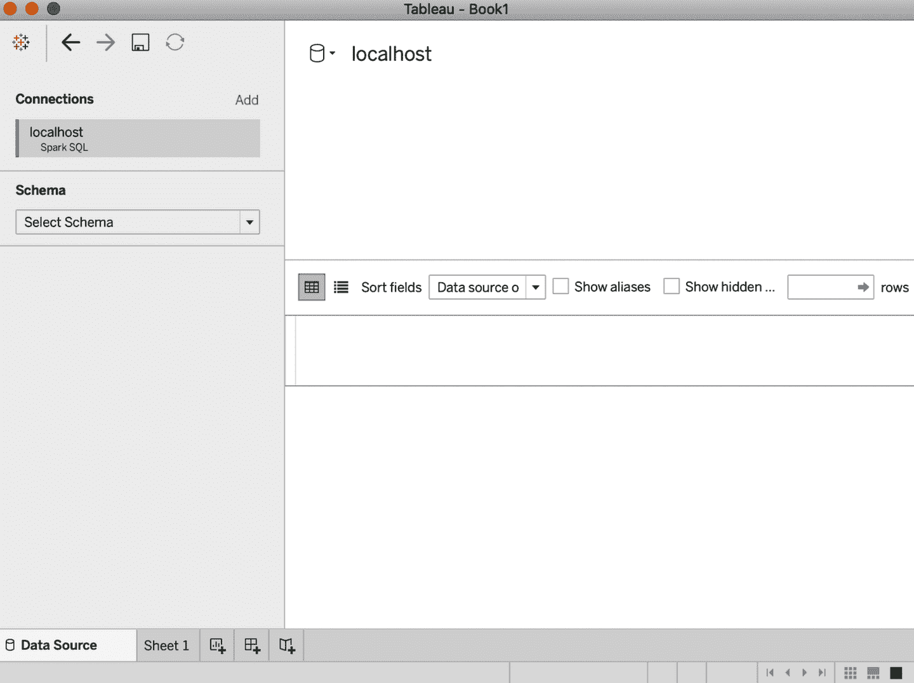
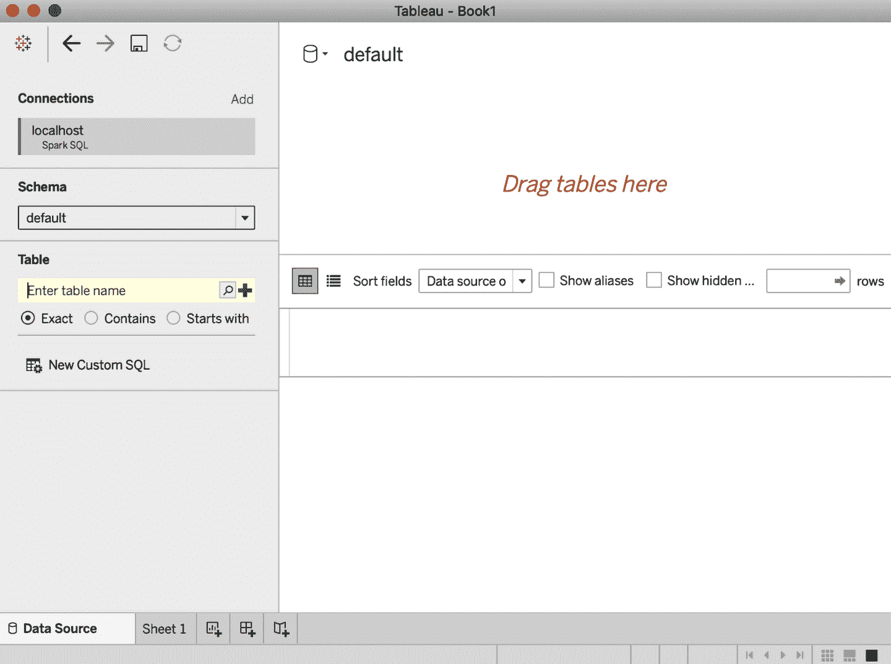
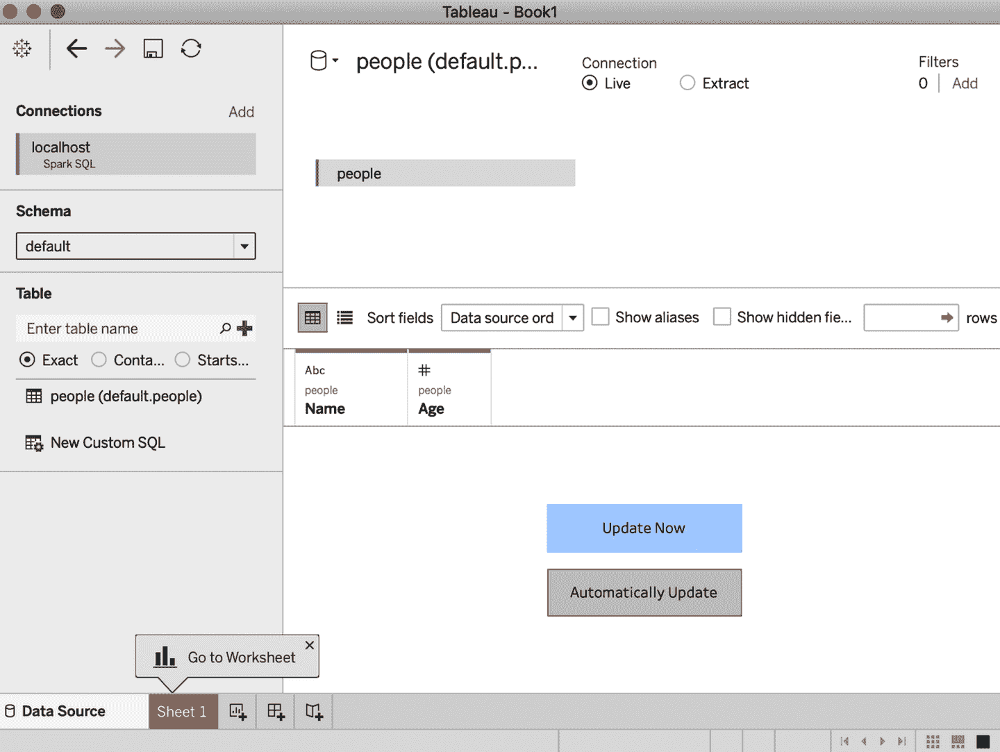
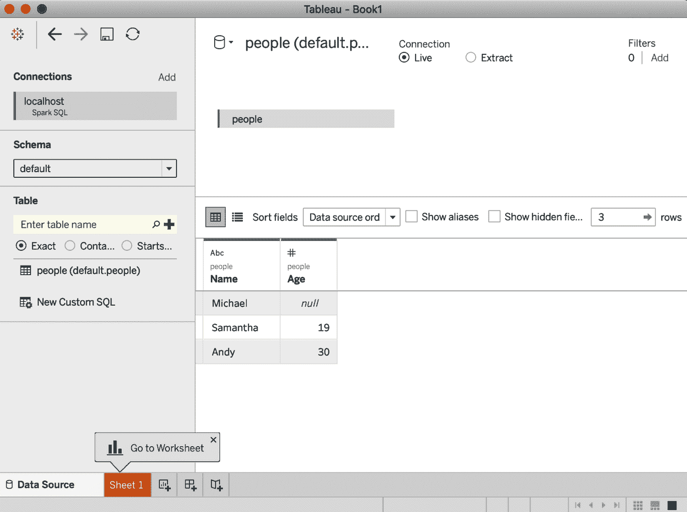

# 第五章：Spark SQL 和 DataFrames：与外部数据源交互

在上一章中，我们探讨了与 Spark 内置数据源的交互。我们还深入研究了 DataFrame API 及其与 Spark SQL 的互操作性。在本章中，我们将重点介绍 Spark SQL 如何与外部组件接口。具体来说，我们将讨论 Spark SQL 如何让您实现以下功能：

+   使用用户定义函数同时适用于 Apache Hive 和 Apache Spark。

+   连接外部数据源，如 JDBC 和 SQL 数据库，PostgreSQL、MySQL、Tableau、Azure Cosmos DB 和 MS SQL Server。

+   处理简单和复杂类型，高阶函数以及常见的关系操作符。

我们还将探讨使用 Spark SQL 查询 Spark 的一些不同选项，例如 Spark SQL shell、Beeline 和 Tableau。

# Spark SQL 和 Apache Hive

Spark SQL 是 Apache Spark 的基础组件，将关系处理与 Spark 的函数式编程 API 结合。它的起源可以追溯到[之前 Shark 的工作](https://oreil.ly/QEixA)。Shark 最初是建立在 Apache Spark 之上的 Hive 代码库，并成为 Hadoop 系统上第一个交互式 SQL 查询引擎之一。它证明了可以拥有[两者兼得的最佳选择](https://oreil.ly/FrPY6)：像企业数据仓库一样快速，并像 Hive/MapReduce 一样可扩展。

Spark SQL 让 Spark 程序员利用更快的性能和关系式编程的优势（例如声明式查询和优化存储），以及调用复杂的分析库（例如机器学习）。正如前一章讨论的那样，从 Apache Spark 2.x 开始，`SparkSession` 提供了一个统一的入口点来操作 Spark 中的数据。

## 用户定义函数

虽然 Apache Spark 拥有大量内置函数，但 Spark 的灵活性允许数据工程师和数据科学家定义自己的函数。这些称为 *用户定义函数*（UDFs）。

### Spark SQL UDFs

创建自己的 PySpark 或 Scala UDF 的好处在于，您（以及其他人）将能够在 Spark SQL 中使用它们。例如，数据科学家可以将 ML 模型封装在 UDF 中，以便数据分析师可以在 Spark SQL 中查询其预测结果，而不必深入了解模型的内部。

下面是创建 Spark SQL UDF 的简化示例。请注意，UDF 操作是会话级别的，并不会持久化在底层的元数据存储中：

```
// In Scala
// Create cubed function
val cubed = (s: Long) => {
  s * s * s
}

// Register UDF
spark.udf.register("cubed", cubed)

// Create temporary view
spark.range(1, 9).createOrReplaceTempView("udf_test")
```

```
# In Python
from pyspark.sql.types import LongType

# Create cubed function
def cubed(s):
  return s * s * s

# Register UDF
spark.udf.register("cubed", cubed, LongType())

# Generate temporary view
spark.range(1, 9).createOrReplaceTempView("udf_test")
```

您现在可以使用 Spark SQL 执行以下任意一个 `cubed()` 函数：

```
// In Scala/Python
// Query the cubed UDF
spark.sql("SELECT id, cubed(id) AS id_cubed FROM udf_test").show()

+---+--------+
| id|id_cubed|
+---+--------+
|  1|       1|
|  2|       8|
|  3|      27|
|  4|      64|
|  5|     125|
|  6|     216|
|  7|     343|
|  8|     512|
+---+--------+
```

### 在 Spark SQL 中进行评估顺序和空值检查

Spark SQL（包括 SQL、DataFrame API 和 Dataset API）不保证子表达式的评估顺序。例如，以下查询不保证 `s is NOT NULL` 子句在 `strlen(s) > 1` 子句之前执行：

```
spark.sql("SELECT s FROM test1 WHERE s IS NOT NULL AND strlen(s) > 1")
```

因此，为了执行适当的 `null` 检查，建议您执行以下操作：

1.  使 UDF 本身具有`null`感知性，并在 UDF 内进行`null`检查。

1.  使用`IF`或`CASE WHEN`表达式对`null`进行检查，并在条件分支中调用 UDF。

### 使用 Pandas UDF 加速和分发 PySpark UDF

以前使用 PySpark UDF 的一个主要问题是，它们的性能比 Scala UDF 慢。这是因为 PySpark UDF 需要在 JVM 和 Python 之间传输数据，这是非常昂贵的。为了解决这个问题，作为 Apache Spark 2.3 的一部分引入了[Pandas UDFs](https://oreil.ly/jo7kl)（也称为向量化 UDFs）。Pandas UDF 使用 Apache Arrow 传输数据并使用 Pandas 处理数据。您可以使用关键字`pandas_udf`作为装饰器来定义 Pandas UDF，或者直接包装函数本身。一旦数据处于[Apache Arrow 格式](https://oreil.ly/TCsur)中，就不再需要序列化/pickle 数据，因为数据已经以 Python 进程可消耗的格式存在。与逐行操作单个输入不同，您正在操作 Pandas Series 或 DataFrame（即向量化执行）。

从 Apache Spark 3.0 开始，使用 Python 3.6 及以上版本，[将 Pandas UDFs 分为两个 API 类别](https://oreil.ly/rXX-L)：Pandas UDFs 和 Pandas 函数 API。

Pandas UDFs

在 Apache Spark 3.0 中，Pandas UDF 根据 Pandas UDF 中的 Python 类型提示推断 Pandas UDF 类型，例如`pandas.Series`、`pandas.DataFrame`、`Tuple`和`Iterator`。以前需要手动定义和指定每个 Pandas UDF 类型。当前在 Pandas UDF 中支持的 Python 类型提示的情况包括 Series 到 Series、Series 迭代器到 Series 迭代器、多个 Series 迭代器到 Series 迭代器以及 Series 到标量（单个值）。

Pandas 函数 API

Pandas 函数 API 允许您直接将本地 Python 函数应用于 PySpark DataFrame，其中输入和输出均为 Pandas 实例。对于 Spark 3.0，支持的 Pandas 函数 API 包括 grouped map、map 和 co-grouped map。

更多信息，请参阅“带有 Python 类型提示的重新设计的 Pandas UDFs”在第十二章。

下面是 Spark 3.0 标量 Pandas UDF 的示例:²

```
# In Python
# Import pandas
import pandas as pd

# Import various pyspark SQL functions including pandas_udf
from pyspark.sql.functions import col, pandas_udf
from pyspark.sql.types import LongType

# Declare the cubed function 
def cubed(a: pd.Series) -> pd.Series:
    return a * a * a

# Create the pandas UDF for the cubed function 
cubed_udf = pandas_udf(cubed, returnType=LongType())
```

上述代码片段声明了一个名为`cubed()`的函数，执行一个*cubed*操作。这是一个常规的 Pandas 函数，额外增加了`cubed_udf = pandas_udf()`调用来创建我们的 Pandas UDF。

让我们从一个简单的 Pandas Series（如定义为`x`）开始，然后应用本地函数`cubed()`进行立方计算：

```
# Create a Pandas Series
x = pd.Series([1, 2, 3])

# The function for a pandas_udf executed with local Pandas data
print(cubed(x))
```

输出如下：

```
0     1
1     8
2    27
dtype: int64
```

现在让我们切换到 Spark DataFrame。我们可以执行此函数作为 Spark 向量化 UDF，如下所示：

```
# Create a Spark DataFrame, 'spark' is an existing SparkSession
df = spark.range(1, 4)

# Execute function as a Spark vectorized UDF
df.select("id", cubed_udf(col("id"))).show()
```

这里是输出：

```
+---+---------+
| id|cubed(id)|
+---+---------+
|  1|        1|
|  2|        8|
|  3|       27|
+---+---------+
```

与本地函数相反，使用矢量化 UDF 将导致执行 Spark 作业；前面的本地函数仅在 Spark 驱动程序上执行 Pandas 函数。当查看此`pandas_udf`函数的一个阶段的 Spark UI 时，这一点变得更加明显（图 5-1）。

###### 注意

要深入了解 Pandas UDF，请参阅[pandas 用户定义函数文档](https://oreil.ly/Qi-pb)。



###### 图 5-1\. Spark UI 执行 Pandas UDF 的阶段

与许多 Spark 作业一样，该作业从`parallelize()`开始，将本地数据（Arrow 二进制批次）发送到执行器，并调用`mapPartitions()`将 Arrow 二进制批次转换为 Spark 的内部数据格式，然后可以分发给 Spark 工作节点。有许多`WholeStageCodegen`步骤，这些步骤代表了性能的重大提升（感谢项目 Tungsten 的[整阶段代码生成](https://oreil.ly/5Khvp)，显著提高了 CPU 效率和性能）。但是，`ArrowEvalPython`步骤指出（在本例中）正在执行 Pandas UDF。

# 使用 Spark SQL Shell、Beeline 和 Tableau 进行查询

有多种机制可以查询 Apache Spark，包括 Spark SQL shell、Beeline CLI 实用程序以及 Tableau 和 Power BI 等报表工具。

在本节中，我们提供了有关 Tableau 的说明；关于 Power BI，请参阅[文档](https://oreil.ly/n_KRU)。

## 使用 Spark SQL Shell

执行 Spark SQL 查询的方便工具是`spark-sql`命令行界面。虽然此实用程序在本地模式下与 Hive 元数据存储服务通信，但它不会与[Thrift JDBC/ODBC 服务器](https://oreil.ly/kdfko)（也称为*Spark Thrift Server*或*STS*）通信。STS 允许 JDBC/ODBC 客户端通过 JDBC 和 ODBC 协议在 Apache Spark 上执行 SQL 查询。

要启动 Spark SQL CLI，请在`$SPARK_HOME`文件夹中执行以下命令：

```
./bin/spark-sql
```

一旦启动了 shell，您可以使用它进行交互式执行 Spark SQL 查询。让我们看几个例子。

### 创建表

要创建一个新的永久性 Spark SQL 表，请执行以下语句：

```
spark-sql> CREATE TABLE people (name STRING, age int);
```

您的输出应该类似于这样，注意创建 Spark SQL 表`people`以及其文件位置（`/user/hive/warehouse/people`）：

```
20/01/11 22:42:16 WARN HiveMetaStore: Location: file:/user/hive/warehouse/people
specified for non-external table:people
Time taken: 0.63 seconds
```

### 向表中插入数据

您可以通过执行类似于以下语句将数据插入到 Spark SQL 表中：

```
INSERT INTO people SELECT name, age FROM ...
```

由于您不依赖于从预先存在的表或文件中加载数据，因此可以使用`INSERT...VALUES`语句向表中插入数据。以下三个语句将三个个体（如果已知，包括其姓名和年龄）插入到`people`表中：

```
spark-sql> **INSERT INTO people VALUES ("Michael", NULL);**
Time taken: 1.696 seconds
spark-sql> **INSERT INTO people VALUES ("Andy", 30);**
Time taken: 0.744 seconds
spark-sql> **INSERT INTO people VALUES ("Samantha", 19);**
Time taken: 0.637 seconds
spark-sql>
```

### 运行 Spark SQL 查询

现在您的表中有了数据，可以对其运行 Spark SQL 查询。让我们从查看我们的元数据存储中存在哪些表开始：

```
spark-sql> **SHOW TABLES;**
default   people     false
Time taken: 0.016 seconds, Fetched 1 row(s)
```

接下来，让我们找出我们的表中有多少人年龄小于 20 岁：

```
spark-sql> **SELECT * FROM people WHERE age < 20;**
Samantha  19
Time taken: 0.593 seconds, Fetched 1 row(s)
```

同样地，让我们看看那些未指定年龄的个体是谁：

```
spark-sql> **SELECT name FROM people WHERE age IS NULL;**
Michael
Time taken: 0.272 seconds, Fetched 1 row(s)
```

## 使用 Beeline

如果您使用过 Apache Hive，可能对命令行工具 [Beeline](https://oreil.ly/Lcrs-) 比较熟悉，这是一个常用工具，用于针对 HiveServer2 运行 HiveQL 查询。Beeline 是基于 [SQLLine CLI](http://sqlline.sourceforge.net) 的 JDBC 客户端。您可以使用同样的工具执行 Spark SQL 查询来连接 Spark Thrift 服务器。请注意，当前实现的 Thrift JDBC/ODBC 服务器对应于 Hive 1.2.1 中的 HiveServer2。您可以使用随 Spark 或 Hive 1.2.1 提供的以下 Beeline 脚本来测试 JDBC 服务器。

### 启动 Thrift 服务器

要启动 Spark Thrift JDBC/ODBC 服务器，请在 `$SPARK_HOME` 文件夹中执行以下命令：

```
./sbin/start-thriftserver.sh
```

###### 注意

如果您尚未启动 Spark 驱动程序和工作进程，请在执行 `start-thriftserver.sh` 命令之前执行以下命令：

```
./sbin/start-all.sh
```

### 通过 Beeline 连接到 Thrift 服务器

要使用 Beeline 测试 Thrift JDBC/ODBC 服务器，请执行以下命令：

```
./bin/beeline
```

然后配置 Beeline 连接到本地 Thrift 服务器：

```
!connect jdbc:hive2://localhost:10000
```

###### 注意

默认情况下，Beeline 处于 *非安全模式*。因此，用户名为您的登录名（例如，`user@learningspark.org`），密码为空。

### 使用 Beeline 执行 Spark SQL 查询

从这里，您可以运行类似于通过 Beeline 运行 Hive 查询的 Spark SQL 查询。以下是几个示例查询及其输出：

```
0: jdbc:hive2://localhost:10000> **SHOW tables;**

+-----------+------------+--------------+
| database  | tableName  | isTemporary  |
+-----------+------------+--------------+
| default   | people     | false        |
+-----------+------------+--------------+
1 row selected (0.417 seconds)

0: jdbc:hive2://localhost:10000> **SELECT * FROM people;**

+-----------+-------+
|   name    |  age  |
+-----------+-------+
| Samantha  | 19    |
| Andy      | 30    |
| Michael   | NULL  |
+-----------+-------+
3 rows selected (1.512 seconds)

0: jdbc:hive2://localhost:10000>
```

### 停止 Thrift 服务器

完成后，您可以使用以下命令停止 Thrift 服务器：

```
./sbin/stop-thriftserver.sh
```

## 使用 Tableau

与通过 Beeline 或 Spark SQL CLI 运行查询类似，您可以通过 Thrift JDBC/ODBC 服务器将喜爱的 BI 工具连接到 Spark SQL。在本节中，我们将向您展示如何将 Tableau Desktop（版本 2019.2）连接到您的本地 Apache Spark 实例。

###### 注意

您需要安装 [Tableau 的 Spark ODBC](https://oreil.ly/wIGnw) 驱动程序版本 1.2.0 或更高版本。如果您已安装（或升级至）Tableau 2018.1 或更高版本，则应预先安装此驱动程序。

### 启动 Thrift 服务器

要从 `$SPARK_HOME` 文件夹启动 Spark Thrift JDBC/ODBC 服务器，请执行以下命令：

```
./sbin/start-thriftserver.sh
```

###### 注意

如果您尚未启动 Spark 驱动程序和工作进程，请在执行 `start-thriftserver.sh` 命令之前执行以下命令：

```
./sbin/start-all.sh
```

### 启动 Tableau

如果您第一次启动 Tableau，将会看到一个连接对话框，允许您连接到多种数据源。默认情况下，左侧的“到服务器”菜单中不包括 Spark SQL 选项（参见图 5-2）。



###### 图 5-2\. Tableau 连接对话框

要访问 Spark SQL 选项，请在列表底部单击“更多…”，然后从主面板出现的列表中选择 Spark SQL，如图 5-3 所示。



###### 图 5-3\. 选择更多… > Spark SQL 连接到 Spark SQL

这将弹出 Spark SQL 对话框（参见图 5-4）。由于您正在连接到本地 Apache Spark 实例，您可以使用以下参数进行非安全用户名身份验证模式：

+   服务器：localhost

+   端口：10000（默认）

+   类型：SparkThriftServer（默认）

+   身份验证：用户名

+   用户名：您的登录，例如，user@learningspark.org

+   需要 SSL：未选中



###### 图 5-4\. Spark SQL 对话框

连接到 Spark SQL 数据源成功后，您将看到类似图 5-5 的数据源连接视图。



###### 图 5-5\. Tableau 数据源连接视图，连接到本地 Spark 实例

在左侧的选择模式下拉菜单中选择“default”。然后输入要查询的表的名称（见图 5-6）。请注意，您可以单击放大镜图标以获取可用表的完整列表。



###### 图 5-6\. 选择模式和要查询的表

###### 注意

欲了解如何使用 Tableau 连接到 Spark SQL 数据库的更多信息，请参阅 Tableau 的[Spark SQL 文档](https://oreil.ly/2A6L7)和 Databricks 的[Tableau 文档](https://oreil.ly/--OXu)。

输入`people`作为表名，然后从左侧拖放表格到主对话框（在“将表拖到此处”标记的空间内）。您应该看到类似图 5-7 的内容。



###### 图 5-7\. 连接到本地 Spark 实例中的 people 表

单击“立即更新”，在幕后 Tableau 将查询您的 Spark SQL 数据源（参见图 5-8）。

现在您可以执行针对 Spark 数据源的查询、表连接等操作，就像处理任何其他 Tableau 数据源一样。



###### 图 5-8\. Tableau 工作表表视图查询本地 Spark 数据源

### 停止 Thrift 服务器

完成后，您可以使用以下命令停止 Thrift 服务器：

```
./sbin/stop-thriftserver.sh
```

# 外部数据源

在本节中，我们将重点介绍如何使用 Spark SQL 连接外部数据源，从 JDBC 和 SQL 数据库开始。

## JDBC 和 SQL 数据库

Spark SQL 包括一个数据源 API，可以使用 [JDBC](https://oreil.ly/PHi6y) 从其他数据库读取数据。它简化了对这些数据源的查询，因为它将结果作为 DataFrame 返回，从而提供了 Spark SQL 的所有优势（包括性能和与其他数据源的连接能力）。

要开始使用，您需要为 JDBC 数据源指定 JDBC 驱动程序，并将其放置在 Spark 类路径中。从 `$SPARK_HOME` 文件夹中，您可以执行如下命令：

```
./bin/spark-shell --driver-class-path $database.jar --jars $database.jar
```

使用数据源 API，可以将远程数据库的表加载为 DataFrame 或 Spark SQL 临时视图。用户可以在数据源选项中指定 JDBC 连接属性。Table 5-1 包含 Spark 支持的一些常见连接属性（不区分大小写）。

Table 5-1\. 常见连接属性

| 属性名称 | 描述 |
| --- | --- |
| `user`, `password` | 这些通常作为连接属性提供，用于登录数据源。 |
| `url` | JDBC 连接 URL，例如，`jdbc:postgresql://localhost/test?user=fred&password=secret`。 |
| `dbtable` | 要读取或写入的 JDBC 表。不能同时指定 `dbtable` 和 `query` 选项。 |
| `query` | 用于从 Apache Spark 读取数据的查询，例如，`SELECT column1, column2, ..., columnN FROM [table | subquery]`。不能同时指定 `query` 和 `dbtable` 选项。 |
| `driver` | 用于连接到指定 URL 的 JDBC 驱动程序的类名。 |

查看完整的连接属性列表，请参阅[Spark SQL 文档](https://oreil.ly/OUG9A)。

### 分区的重要性

在 Spark SQL 和 JDBC 外部数据源之间传输大量数据时，重要的是对数据源进行分区。所有数据都通过一个驱动程序连接，这可能会使数据提取的性能显著下降，并可能使源系统的资源饱和。虽然这些 JDBC 属性是可选的，但对于任何大规模操作，强烈建议使用 Table 5-2 中显示的属性。

Table 5-2\. 分区连接属性

| 属性名称 | 描述 |
| --- | --- |
| `numPartitions` | 用于表读写并行性的最大分区数。这也决定了最大并发 JDBC 连接数。 |
| `partitionColumn` | 在读取外部数据源时，`partitionColumn` 是用于确定分区的列；请注意，`partitionColumn` 必须是数值、日期或时间戳列。 |
| `lowerBound` | 设置分区步长中`partitionColumn`的最小值。 |
| `upperBound` | 设置分区步长中`partitionColumn`的最大值。 |

让我们看一个 [示例](https://oreil.ly/g7Cjc)，帮助您理解这些属性如何工作。假设我们使用以下设置：

+   `numPartitions`：`10`

+   `lowerBound`：`1000`

+   `upperBound`：`10000`

然后步长为 1,000，将创建 10 个分区。这相当于执行这 10 个查询（每个分区一个）：

+   `SELECT * FROM table WHERE partitionColumn BETWEEN 1000 and 2000`

+   `SELECT * FROM table WHERE partitionColumn BETWEEN 2000 and 3000`

+   `...`

+   `SELECT * FROM table WHERE partitionColumn BETWEEN 9000 and 10000`

虽然不是全面的，但以下是在使用这些属性时要记住的一些提示：

+   `numPartitions` 的一个良好起点是使用 Spark 工作节点数量的倍数。例如，如果您有四个 Spark 工作节点，可以从 4 或 8 个分区开始。但重要的是注意源系统如何处理读取请求。对于有处理窗口的系统，可以最大化对源系统的并发请求；对于没有处理窗口的系统（例如连续处理数据的 OLTP 系统），应减少并发请求以避免源系统饱和。

+   最初，基于 `partitionColumn` 的最小和最大 *实际* 值来计算 `lowerBound` 和 `upperBound`。例如，如果您选择 `{numPartitions:10, lowerBound: 1000, upperBound: 10000}`，但所有值都在 `2000` 和 `4000` 之间，那么这 10 个查询（每个分区一个）中只有 2 个将承担所有工作。在这种情况下，更好的配置是 `{numPartitions:10, lowerBound: 2000, upperBound: 4000}`。

+   选择一个可以均匀分布的 `partitionColumn`，以避免数据倾斜。例如，如果大多数 `partitionColumn` 的值为 `2500`，那么在 `{numPartitions:10, lowerBound: 1000, upperBound: 10000}` 的情况下，大部分工作将由请求值在 `2000` 和 `3000` 之间的任务执行。相反，选择一个不同的 `partitionColumn`，或者如果可能的话生成一个新的（可能是多列的哈希）以更均匀地分布分区。

## PostgreSQL

要连接到 PostgreSQL 数据库，请构建或从 [Maven](https://oreil.ly/Tg5Z3) 下载 JDBC jar 并将其添加到类路径中。然后启动 Spark shell (`spark-shell` 或 `pyspark`)，指定该 jar 文件：

```
bin/spark-shell --jars postgresql-42.2.6.jar
```

以下示例展示了如何使用 Spark SQL 数据源 API 和 Scala 中的 JDBC 从 PostgreSQL 数据库加载数据和保存数据：

```
// In Scala
// Read Option 1: Loading data from a JDBC source using load method
val jdbcDF1 = spark
  .read
  .format("jdbc")
  .option("url", "jdbc:postgresql:[DBSERVER]")
  .option("dbtable", "[SCHEMA].[TABLENAME]")
  .option("user", "[USERNAME]")
  .option("password", "[PASSWORD]")
  .load()

// Read Option 2: Loading data from a JDBC source using jdbc method
// Create connection properties
import java.util.Properties
val cxnProp = new Properties()
cxnProp.put("user", "[USERNAME]") 
cxnProp.put("password", "[PASSWORD]")

// Load data using the connection properties
val jdbcDF2 = spark
  .read
  .jdbc("jdbc:postgresql:[DBSERVER]", "[SCHEMA].[TABLENAME]", cxnProp)

// Write Option 1: Saving data to a JDBC source using save method
jdbcDF1
  .write
  .format("jdbc")
  .option("url", "jdbc:postgresql:[DBSERVER]")
  .option("dbtable", "[SCHEMA].[TABLENAME]")
  .option("user", "[USERNAME]")
  .option("password", "[PASSWORD]")
  .save()

// Write Option 2: Saving data to a JDBC source using jdbc method
jdbcDF2.write
  .jdbc(s"jdbc:postgresql:[DBSERVER]", "[SCHEMA].[TABLENAME]", cxnProp)
```

以下是如何在 PySpark 中执行此操作的示例：

```
# In Python
# Read Option 1: Loading data from a JDBC source using load method
jdbcDF1 = (spark
  .read
  .format("jdbc") 
  .option("url", "jdbc:postgresql://[DBSERVER]")
  .option("dbtable", "[SCHEMA].[TABLENAME]")
  .option("user", "[USERNAME]")
  .option("password", "[PASSWORD]")
  .load())

# Read Option 2: Loading data from a JDBC source using jdbc method
jdbcDF2 = (spark
  .read 
  .jdbc("jdbc:postgresql://[DBSERVER]", "[SCHEMA].[TABLENAME]",
          properties={"user": "[USERNAME]", "password": "[PASSWORD]"}))

# Write Option 1: Saving data to a JDBC source using save method
(jdbcDF1
  .write
  .format("jdbc")
  .option("url", "jdbc:postgresql://[DBSERVER]")
  .option("dbtable", "[SCHEMA].[TABLENAME]") 
  .option("user", "[USERNAME]")
  .option("password", "[PASSWORD]")
  .save())

# Write Option 2: Saving data to a JDBC source using jdbc method
(jdbcDF2
  .write 
  .jdbc("jdbc:postgresql:[DBSERVER]", "[SCHEMA].[TABLENAME]",
          properties={"user": "[USERNAME]", "password": "[PASSWORD]"}))
```

## MySQL

要连接到 MySQL 数据库，请从 [Maven](https://oreil.ly/c1sAC) 或 [MySQL](https://oreil.ly/bH5zb) （后者更简单！）构建或下载 JDBC jar 并将其添加到类路径中。然后启动 Spark shell (`spark-shell` 或 `pyspark`)，指定该 jar 文件：

```
bin/spark-shell --jars mysql-connector-java_8.0.16-bin.jar
```

以下示例展示了如何使用 Spark SQL 数据源 API 和 JDBC 在 Scala 中从 MySQL 数据库加载数据并保存数据：

```
// In Scala
// Loading data from a JDBC source using load 
val jdbcDF = spark
  .read
  .format("jdbc")
  .option("url", "jdbc:mysql://[DBSERVER]:3306/[DATABASE]")
  .option("driver", "com.mysql.jdbc.Driver")
  .option("dbtable", "[TABLENAME]")
  .option("user", "[USERNAME]")
  .option("password", "[PASSWORD]")
  .load()

// Saving data to a JDBC source using save 
jdbcDF
  .write
  .format("jdbc")
  .option("url", "jdbc:mysql://[DBSERVER]:3306/[DATABASE]")
  .option("driver", "com.mysql.jdbc.Driver")
  .option("dbtable", "[TABLENAME]")
  .option("user", "[USERNAME]")
  .option("password", "[PASSWORD]")
  .save()
```

而这是如何在 Python 中执行该操作的：

```
# In Python
# Loading data from a JDBC source using load 
jdbcDF = (spark
  .read
  .format("jdbc")
  .option("url", "jdbc:mysql://[DBSERVER]:3306/[DATABASE]")
  .option("driver", "com.mysql.jdbc.Driver") 
  .option("dbtable", "[TABLENAME]")
  .option("user", "[USERNAME]")
  .option("password", "[PASSWORD]")
  .load())

# Saving data to a JDBC source using save 
(jdbcDF
  .write 
  .format("jdbc") 
  .option("url", "jdbc:mysql://[DBSERVER]:3306/[DATABASE]")
  .option("driver", "com.mysql.jdbc.Driver") 
  .option("dbtable", "[TABLENAME]") 
  .option("user", "[USERNAME]")
  .option("password", "[PASSWORD]")
  .save())
```

## Azure Cosmos DB

要连接到 Azure Cosmos DB 数据库，构建或下载来自 [Maven](https://oreil.ly/vDVQ6) 或 [GitHub](https://oreil.ly/dJMx1) 的 JDBC jar，并将其添加到您的类路径中。然后启动 Scala 或 PySpark shell，指定这个 jar（请注意，此示例使用的是 Spark 2.4）：

```
bin/spark-shell --jars azure-cosmosdb-spark_2.4.0_2.11-1.3.5-uber.jar
```

您还可以选择使用 `--packages` 从 [Spark Packages](https://spark-packages.org) 使用其 Maven 坐标来获取连接器：

```
export PKG="com.microsoft.azure:azure-cosmosdb-spark_2.4.0_2.11:1.3.5"
bin/spark-shell --packages $PKG

```

以下示例展示了如何使用 Spark SQL 数据源 API 和 JDBC 在 Scala 和 PySpark 中从 Azure Cosmos DB 数据库加载数据并保存数据。请注意，通常使用 `query_custom` 配置来利用 Cosmos DB 中的各种索引：

```
// In Scala
// Import necessary libraries
import com.microsoft.azure.cosmosdb.spark.schema._
import com.microsoft.azure.cosmosdb.spark._
import com.microsoft.azure.cosmosdb.spark.config.Config

// Loading data from Azure Cosmos DB
// Configure connection to your collection
val query = "SELECT c.colA, c.coln FROM c WHERE c.origin = 'SEA'"
val readConfig = Config(Map(
  "Endpoint" -> "https://[ACCOUNT].documents.azure.com:443/", 
  "Masterkey" -> "[MASTER KEY]",
  "Database" -> "[DATABASE]",
  "PreferredRegions" -> "Central US;East US2;",
  "Collection" -> "[COLLECTION]",
  "SamplingRatio" -> "1.0",
  "query_custom" -> query
))

// Connect via azure-cosmosdb-spark to create Spark DataFrame
val df = spark.read.cosmosDB(readConfig)
df.count

// Saving data to Azure Cosmos DB
// Configure connection to the sink collection
val writeConfig = Config(Map(
  "Endpoint" -> "https://[ACCOUNT].documents.azure.com:443/",
  "Masterkey" -> "[MASTER KEY]",
  "Database" -> "[DATABASE]",
  "PreferredRegions" -> "Central US;East US2;",
  "Collection" -> "[COLLECTION]",
  "WritingBatchSize" -> "100"
))

// Upsert the DataFrame to Azure Cosmos DB
import org.apache.spark.sql.SaveMode
df.write.mode(SaveMode.Overwrite).cosmosDB(writeConfig)
```

```
# In Python
# Loading data from Azure Cosmos DB
# Read configuration
query = "SELECT c.colA, c.coln FROM c WHERE c.origin = 'SEA'"
readConfig = {
  "Endpoint" : "https://[ACCOUNT].documents.azure.com:443/", 
  "Masterkey" : "[MASTER KEY]",
  "Database" : "[DATABASE]",
  "preferredRegions" : "Central US;East US2",
  "Collection" : "[COLLECTION]",
  "SamplingRatio" : "1.0",
  "schema_samplesize" : "1000",
  "query_pagesize" : "2147483647",
  "query_custom" : query
}

# Connect via azure-cosmosdb-spark to create Spark DataFrame
df = (spark
  .read
  .format("com.microsoft.azure.cosmosdb.spark")
  .options(**readConfig)
  .load())

# Count the number of flights
df.count()

# Saving data to Azure Cosmos DB
# Write configuration
writeConfig = {
 "Endpoint" : "https://[ACCOUNT].documents.azure.com:443/",
 "Masterkey" : "[MASTER KEY]",
 "Database" : "[DATABASE]",
 "Collection" : "[COLLECTION]",
 "Upsert" : "true"
}

# Upsert the DataFrame to Azure Cosmos DB
(df.write
  .format("com.microsoft.azure.cosmosdb.spark")
  .options(**writeConfig)
  .save())
```

欲了解更多信息，请参阅 [Azure Cosmos DB 文档](https://oreil.ly/OMXBH)。

## MS SQL Server

要连接到 MS SQL Server 数据库，[下载 JDBC jar](https://oreil.ly/xHkDl) 并将其添加到您的类路径中。然后启动 Scala 或 PySpark shell，指定这个 jar：

```
bin/spark-shell --jars mssql-jdbc-7.2.2.jre8.jar
```

以下示例展示了如何使用 Spark SQL 数据源 API 和 JDBC 在 Scala 和 PySpark 中从 MS SQL Server 数据库加载数据并保存数据：

```
// In Scala
// Loading data from a JDBC source
// Configure jdbcUrl
val jdbcUrl = "jdbc:sqlserver://[DBSERVER]:1433;database=[DATABASE]"

// Create a Properties() object to hold the parameters. 
// Note, you can create the JDBC URL without passing in the
// user/password parameters directly.
val cxnProp = new Properties()
cxnProp.put("user", "[USERNAME]") 
cxnProp.put("password", "[PASSWORD]") 
cxnProp.put("driver", "com.microsoft.sqlserver.jdbc.SQLServerDriver")

// Load data using the connection properties
val jdbcDF = spark.read.jdbc(jdbcUrl, "[TABLENAME]", cxnProp)

// Saving data to a JDBC source
jdbcDF.write.jdbc(jdbcUrl, "[TABLENAME]", cxnProp)
```

```
# In Python
# Configure jdbcUrl
jdbcUrl = "jdbc:sqlserver://[DBSERVER]:1433;database=[DATABASE]"

# Loading data from a JDBC source
jdbcDF = (spark
  .read
  .format("jdbc") 
  .option("url", jdbcUrl)
  .option("dbtable", "[TABLENAME]")
  .option("user", "[USERNAME]")
  .option("password", "[PASSWORD]")
  .load())

# Saving data to a JDBC source
(jdbcDF
  .write
  .format("jdbc") 
  .option("url", jdbcUrl)
  .option("dbtable", "[TABLENAME]")
  .option("user", "[USERNAME]")
  .option("password", "[PASSWORD]")
  .save())
```

## 其他外部来源

这些仅是 Apache Spark 可以连接的许多外部数据源之一；其他流行的数据源包括：

+   [Apache Cassandra](https://oreil.ly/j8XSa)

+   [Snowflake](https://oreil.ly/NJOii)

+   [MongoDB](https://oreil.ly/MK64A)

# 数据框架和 Spark SQL 中的高阶函数

由于复杂数据类型是简单数据类型的综合，直接操作它们是很诱人的。有两种 [典型解决方案](https://oreil.ly/JL1UJ) 用于操作复杂数据类型：

+   将嵌套结构扩展为单独的行，应用某些函数，然后重新创建嵌套结构

+   构建用户定义函数

这些方法的好处是可以以表格格式思考问题。它们通常涉及（但不限于）使用 [utility functions](https://oreil.ly/gF-0D) 如 `get_json_object()`、`from_json()`、`to_json()`、`explode()` 和 `selectExpr()`。

让我们更仔细地看看这两个选项。

## 选项 1：展开和收集

在这个嵌套的 SQL 语句中，我们首先执行 `explode(values)`，这会为 `values` 中的每个元素 `value` 创建一个带有 `id` 的新行：

```
-- In SQL
SELECT id, collect_list(value + 1) AS values
FROM  (SELECT id, EXPLODE(values) AS value
        FROM table) x
GROUP BY id
```

当使用 `collect_list()` 返回带有重复对象的列表时，`GROUP BY` 语句需要执行洗牌操作，这意味着重新收集的数组的顺序不一定与原始数组相同。由于 `values` 可能具有任意数量的维度（一个非常宽或非常长的数组），并且我们正在进行 `GROUP BY`，这种方法可能非常昂贵。

## 选项 2：用户定义函数

要执行相同的任务（将 `values` 中的每个元素加 `1`），我们还可以创建一个使用 `map()` 迭代每个元素 `value` 并执行加法操作的 UDF：

```
-- In SQL
SELECT id, collect_list(value + 1) AS values
FROM  (SELECT id, EXPLODE(values) AS value
        FROM table) x
GROUP BY id
```

我们可以在 Spark SQL 中如下使用此 UDF：

```
spark.sql("SELECT id, plusOneInt(values) AS values FROM table").show()
```

虽然这比使用 `explode()` 和 `collect_list()` 更好，因为不会有任何排序问题，但序列化和反序列化过程本身可能很昂贵。然而，值得注意的是，对于大数据集，`collect_list()` 可能会导致执行器遇到内存不足的问题，而使用 UDF 则可以缓解这些问题。

## 复杂数据类型的内置函数

您可以尝试使用 Apache Spark 2.4 及更高版本提供的一些复杂数据类型的内置函数，其中一些常见函数列在表 5-3（数组类型）和表 5-4（映射类型）中；完整列表请参阅[Databricks 文档中的笔记本](https://oreil.ly/GOJ5z)。

表 5-3\. 数组类型函数

| 函数/描述 | 查询 | 输出 |
| --- | --- | --- |
| `array_distinct(array<T>): array<T>` 从数组中移除重复项 | `SELECT array_distinct(array(1, 2, 3, null, 3));` | `[1,2,3,null]` |
| `array_intersect(array<T>, array<T>): array<T>` 返回两个数组的交集（去重） | `SELECT array_intersect(array(1, 2, 3), array(1, 3, 5));` | `[1,3]` |
| `array_union(array<T>, array<T>): array<T>` 返回两个数组的并集，无重复 | `SELECT array_union(array(1, 2, 3), array(1, 3, 5));` | `[1,2,3,5]` |
| `array_except(array<T>, array<T>): array<T>` 返回存在于 `array1` 中但不存在于 `array2` 中的元素，无重复 | `SELECT array_except(array(1, 2, 3), array(1, 3, 5));` | `[2]` |
| `array_join(array<String>, String[, String]): String` 使用分隔符连接数组的元素 | `SELECT array_join(array('hello', 'world'), ' ');` | `hello world` |
| `array_max(array<T>): T` 返回数组中的最大值；跳过 `null` 元素 | `SELECT array_max(array(1, 20, null, 3));` | `20` |
| `array_min(array<T>): T` 返回数组中的最小值；跳过 `null` 元素 | `SELECT array_min(array(1, 20, null, 3));` | `1` |
| `array_position(array<T>, T): Long` 返回给定数组的第一个元素的（从 1 开始的）索引作为 `Long` | `SELECT array_position(array(3, 2, 1), 1);` | `3` |
| `array_remove(array<T>, T): array<T>` 从给定的数组中移除所有等于给定元素的元素 | `SELECT array_remove(array(1, 2, 3, null, 3), 3);` | `[1,2,null]` |
| `arrays_overlap(array<T>, array<T>): array<T>` 如果 `array1` 包含至少一个非 `null` 元素，同时也存在于 `array2` 中，则返回 `true` | `SELECT arrays_overlap(array(1, 2, 3), array(3, 4, 5));` | `true` |
| `array_sort(array<T>): array<T>` 将输入数组按升序排序，将 null 元素放置在数组末尾 | `SELECT array_sort(array('b', 'd', null, 'c', 'a'));` | `["a","b","c","d",null]` |
| `concat(array<T>, ...): array<T>` 连接字符串、二进制、数组等 | `SELECT concat(array(1, 2, 3), array(4, 5), array(6));` | `[1,2,3,4,5,6]` |
| `flatten(array<array<T>>): array<T>` 将数组的数组展平为单个数组 | `SELECT flatten(array(array(1, 2), array(3, 4)));` | `[1,2,3,4]` |
| `array_repeat(T, Int): array<T>` 返回包含指定元素的数组，元素重复指定次数 | `SELECT array_repeat('123', 3);` | `["123","123","123"]` |
| `reverse(array<T>): array<T>` 返回反转顺序的字符串或数组 | `SELECT reverse(array(2, 1, 4, 3));` | `[3,4,1,2]` |

| `sequence(T, T[, T]): array<T>` 通过递增步长生成从起始到结束（包括）的元素数组 | `SELECT sequence(1, 5);` `SELECT sequence(5, 1);`

`SELECT sequence(to_date('2018-01-01'), to_date('2018-03-01'), interval 1 month);` | `[1,2,3,4,5]` `[5,4,3,2,1]` |

`["2018-01-01", "2018-02-01", "2018-03-01"]` |

| `shuffle(array<T>): array<T>` 返回给定数组的随机排列 | `SELECT shuffle(array(1, 20, null, 3));` | `[null,3,20,1]` |
| --- | --- | --- |
| `slice(array<T>, Int, Int): array<T>` 返回从给定索引开始的给定长度的子数组（如果索引为负数则从末尾计数） | `SELECT slice(array(1, 2, 3, 4), -2, 2);` | `[3,4]` |
| `array_zip(array<T>, array<U>, ...): array<struct<T, U, ...>>` 返回合并的结构数组 | `SELECT arrays_zip(array(1, 2), array(2, 3), array(3, 4));` | `[{"0":1,"1":2,"2":3},{"0":2,"1":3,"2":4}]` |
| `element_at(array<T>, Int): T /` 返回给定数组在指定（基于 1 的）索引处的元素 | `SELECT element_at(array(1, 2, 3), 2);` | `2` |
| `cardinality(array<T>): Int` `size` 的别名；返回给定数组或映射的大小 | `SELECT cardinality(array('b', 'd', 'c', 'a'));` | `4` |

表 5-4\. 映射函数

| 函数/描述 | 查询 | 输出 |
| --- | --- | --- |
| `map_form_arrays(array<K>, array<V>): map<K, V>` 从给定的键/值数组对创建映射；键中的元素不应为 `null` | `SELECT map_from_arrays(array(1.0, 3.0), array('2', '4'));` | `{"1.0":"2", "3.0":"4"}` |
| `map_from_entries(array<struct<K, V>>): map<K, V>` 返回从给定数组创建的映射 | `SELECT map_from_entries(array(struct(1, 'a'), struct(2, 'b')));` | `{"1":"a", "2":"b"}` |
| `map_concat(map<K, V>, ...): map<K, V>` 返回输入映射的并集 | `SELECT map_concat(map(1, 'a', 2, 'b'), map(2, 'c', 3, 'd'));` | `{"1":"a", "2":"c","3":"d"}` |
| `element_at(map<K, V>, K): V` 返回给定键的值，如果映射中不包含该键则返回 `null` | `SELECT element_at(map(1, 'a', 2, 'b'), 2);` | `b` |
| `cardinality(array<T>): Int` `size` 的别名；返回给定数组或映射的大小 | `SELECT cardinality(map(1, 'a', 2, 'b'));` | `2` |

## Higher-Order Functions

除了前述的内置函数外，还有接受匿名 lambda 函数作为参数的高阶函数。一个高阶函数的例子如下：

```
-- In SQL
transform(values, value -> lambda expression)
```

`transform()`函数接受一个数组（`values`）和匿名函数（`lambda`表达式）作为输入。该函数通过将匿名函数应用于每个元素来透明地创建一个新数组，并将结果分配给输出数组（类似于 UDF 方法，但更高效）。

让我们创建一个样本数据集，以便我们可以运行一些示例：

```
# In Python
from pyspark.sql.types import *
schema = StructType([StructField("celsius", ArrayType(IntegerType()))])

t_list = [[35, 36, 32, 30, 40, 42, 38]], [[31, 32, 34, 55, 56]]
t_c = spark.createDataFrame(t_list, schema)
t_c.createOrReplaceTempView("tC")

# Show the DataFrame
t_c.show()
```

```
// In Scala
// Create DataFrame with two rows of two arrays (tempc1, tempc2)
val t1 = Array(35, 36, 32, 30, 40, 42, 38)
val t2 = Array(31, 32, 34, 55, 56)
val tC = Seq(t1, t2).toDF("celsius")
tC.createOrReplaceTempView("tC")

// Show the DataFrame
tC.show()
```

这是输出：

```
+--------------------+
|             celsius|
+--------------------+
|[35, 36, 32, 30, ...|
|[31, 32, 34, 55, 56]|
+--------------------+
```

使用上述 DataFrame，您可以运行以下高阶函数查询。

### `transform()`

```
transform(array<T>, function<T, U>): array<U>
```

`transform()`函数通过将函数应用于输入数组的每个元素来生成一个数组（类似于`map()`函数）：

```
// In Scala/Python
// Calculate Fahrenheit from Celsius for an array of temperatures
spark.sql("""
SELECT celsius, 
 transform(celsius, t -> ((t * 9) div 5) + 32) as fahrenheit 
 FROM tC
""").show()

+--------------------+--------------------+
|             celsius|          fahrenheit|
+--------------------+--------------------+
|[35, 36, 32, 30, ...|[95, 96, 89, 86, ...|
|[31, 32, 34, 55, 56]|[87, 89, 93, 131,...|
+--------------------+--------------------+
```

### `filter()`

```
filter(array<T>, function<T, Boolean>): array<T>
```

`filter()`函数生成一个数组，其中只包含布尔函数为`true`的输入数组的元素：

```
// In Scala/Python
// Filter temperatures > 38C for array of temperatures
spark.sql("""
SELECT celsius, 
 filter(celsius, t -> t > 38) as high 
 FROM tC
""").show()

+--------------------+--------+
|             celsius|    high|
+--------------------+--------+
|[35, 36, 32, 30, ...|[40, 42]|
|[31, 32, 34, 55, 56]|[55, 56]|
+--------------------+--------+
```

### `exists()`

```
exists(array<T>, function<T, V, Boolean>): Boolean
```

`exists()`函数如果布尔函数对输入数组中的任何元素成立，则返回`true`：

```
// In Scala/Python
// Is there a temperature of 38C in the array of temperatures
spark.sql("""
SELECT celsius, 
 exists(celsius, t -> t = 38) as threshold
 FROM tC
""").show()

+--------------------+---------+
|             celsius|threshold|
+--------------------+---------+
|[35, 36, 32, 30, ...|     true|
|[31, 32, 34, 55, 56]|    false|
+--------------------+---------+
```

### `reduce()`

```
reduce(array<T>, B, function<B, T, B>, function<B, R>)
```

`reduce()`函数通过将元素合并到缓冲区`B`中，使用`function<B, T, B>`，并在最终缓冲区上应用结束`function<B, R>`，将输入数组的元素减少为单个值：

```
// In Scala/Python
// Calculate average temperature and convert to F
spark.sql("""
SELECT celsius, 
 reduce(
 celsius, 
 0, 
 (t, acc) -> t + acc, 
 acc -> (acc div size(celsius) * 9 div 5) + 32
 ) as avgFahrenheit 
 FROM tC
""").show()

+--------------------+-------------+
|             celsius|avgFahrenheit|
+--------------------+-------------+
|[35, 36, 32, 30, ...|           96|
|[31, 32, 34, 55, 56]|          105|
+--------------------+-------------+
```

# 常见的 DataFrame 和 Spark SQL 操作

Spark SQL 的强大之处在于支持的广泛 DataFrame 操作（也称为无类型 Dataset 操作）。支持的操作列表非常广泛，包括：

+   聚合函数

+   集合函数

+   日期时间函数

+   数学函数

+   杂项函数

+   非聚合函数

+   排序功能

+   字符串函数

+   UDF 函数

+   窗口函数

完整列表请参阅[Spark SQL 文档](https://oreil.ly/e1AYA)。

在本章中，我们将专注于以下常见的关系操作：

+   联合和连接

+   窗口函数

+   修改

要执行这些 DataFrame 操作，我们首先要准备一些数据。在以下代码片段中，我们：

1.  导入两个文件并创建两个 DataFrame，一个用于机场（`airportsna`）信息，另一个用于美国航班延误（`departureDelays`）。

1.  使用`expr()`，将`delay`和`distance`列从`STRING`转换为`INT`。

1.  创建一个较小的表`foo`，我们可以专注于我们的演示示例；它只包含从西雅图（SEA）出发到旧金山（SFO）目的地的三个航班的信息，时间范围较小。

让我们开始吧：

```
// In Scala
import org.apache.spark.sql.functions._

// Set file paths
val delaysPath = 
  "/databricks-datasets/learning-spark-v2/flights/departuredelays.csv"
val airportsPath = 
  "/databricks-datasets/learning-spark-v2/flights/airport-codes-na.txt"

// Obtain airports data set
val airports = spark.read
  .option("header", "true")
  .option("inferschema", "true")
  .option("delimiter", "\t")
  .csv(airportsPath)
airports.createOrReplaceTempView("airports_na")

// Obtain departure Delays data set
val delays = spark.read
  .option("header","true")
  .csv(delaysPath)
  .withColumn("delay", expr("CAST(delay as INT) as delay"))
  .withColumn("distance", expr("CAST(distance as INT) as distance"))
delays.createOrReplaceTempView("departureDelays")

// Create temporary small table
val foo = delays.filter(
  expr("""origin == 'SEA' AND destination == 'SFO' AND 
 date like '01010%' AND delay > 0"""))
foo.createOrReplaceTempView("foo")

```

```
# In Python
# Set file paths
from pyspark.sql.functions import expr
tripdelaysFilePath = 
  "/databricks-datasets/learning-spark-v2/flights/departuredelays.csv"
airportsnaFilePath = 
  "/databricks-datasets/learning-spark-v2/flights/airport-codes-na.txt"

# Obtain airports data set
airportsna = (spark.read
  .format("csv")
  .options(header="true", inferSchema="true", sep="\t")
  .load(airportsnaFilePath))

airportsna.createOrReplaceTempView("airports_na")

# Obtain departure delays data set
departureDelays = (spark.read
  .format("csv")
  .options(header="true")
  .load(tripdelaysFilePath))

departureDelays = (departureDelays
  .withColumn("delay", expr("CAST(delay as INT) as delay"))
  .withColumn("distance", expr("CAST(distance as INT) as distance")))

departureDelays.createOrReplaceTempView("departureDelays")

# Create temporary small table
foo = (departureDelays
  .filter(expr("""origin == 'SEA' and destination == 'SFO' and 
 date like '01010%' and delay > 0""")))
foo.createOrReplaceTempView("foo")
```

`departureDelays` DataFrame 包含超过 1.3M 个航班的数据，而`foo` DataFrame 只包含三行关于从 SEA 到 SFO 的航班信息，具体时间范围如下输出所示：

```
// Scala/Python spark.sql("SELECT * FROM airports_na LIMIT 10").show()

+-----------+-----+-------+----+
|       City|State|Country|IATA|
+-----------+-----+-------+----+
| Abbotsford|   BC| Canada| YXX|
|   Aberdeen|   SD|    USA| ABR|
|    Abilene|   TX|    USA| ABI|
|      Akron|   OH|    USA| CAK|
|    Alamosa|   CO|    USA| ALS|
|     Albany|   GA|    USA| ABY|
|     Albany|   NY|    USA| ALB|
|Albuquerque|   NM|    USA| ABQ|
| Alexandria|   LA|    USA| AEX|
|  Allentown|   PA|    USA| ABE|
+-----------+-----+-------+----+

spark.sql("SELECT * FROM departureDelays LIMIT 10").show()

+--------+-----+--------+------+-----------+
|    date|delay|distance|origin|destination|
+--------+-----+--------+------+-----------+
|01011245|    6|     602|   ABE|        ATL|
|01020600|   -8|     369|   ABE|        DTW|
|01021245|   -2|     602|   ABE|        ATL|
|01020605|   -4|     602|   ABE|        ATL|
|01031245|   -4|     602|   ABE|        ATL|
|01030605|    0|     602|   ABE|        ATL|
|01041243|   10|     602|   ABE|        ATL|
|01040605|   28|     602|   ABE|        ATL|
|01051245|   88|     602|   ABE|        ATL|
|01050605|    9|     602|   ABE|        ATL|
+--------+-----+--------+------+-----------+

spark.sql("SELECT * FROM foo").show()

`+--------+-----+--------+------+-----------+`
`|`    `date``|``delay``|``distance``|``origin``|``destination``|`
`+--------+-----+--------+------+-----------+`
`|``01010710``|`   `31``|`     `590``|`   `SEA``|`        `SFO``|`
`|``01010955``|`  `104``|`     `590``|`   `SEA``|`        `SFO``|`
`|``01010730``|`    `5``|`     `590``|`   `SEA``|`        `SFO``|`
`+--------+-----+--------+------+-----------+`
```

在接下来的章节中，我们将使用这些数据执行 union、join 和 windowing 示例。

## 联合

Apache Spark 中的常见模式之一是将两个具有相同模式的不同 DataFrame 联合在一起。这可以通过`union()`方法实现：

```
// Scala
// Union two tables
val bar = delays.union(foo)
bar.createOrReplaceTempView("bar")
bar.filter(expr("""origin == 'SEA' AND destination == 'SFO'
AND date LIKE '01010%' AND delay > 0""")).show()
```

```
# In Python
# Union two tables
bar = departureDelays.union(foo)
bar.createOrReplaceTempView("bar")

# Show the union (filtering for SEA and SFO in a specific time range)
bar.filter(expr("""origin == 'SEA' AND destination == 'SFO'
AND date LIKE '01010%' AND delay > 0""")).show()
```

`bar` DataFrame 是`foo`与`delays`的并集。使用相同的过滤条件得到`bar` DataFrame，我们看到`foo`数据的重复，这是预期的：

```
-- In SQL
spark.sql("""
SELECT * 
 FROM bar 
 WHERE origin = 'SEA' 
 AND destination = 'SFO' 
 AND date LIKE '01010%' 
 AND delay > 0
""").show()

+--------+-----+--------+------+-----------+
|    date|delay|distance|origin|destination|
+--------+-----+--------+------+-----------+
|01010710|   31|     590|   SEA|        SFO|
|01010955|  104|     590|   SEA|        SFO|
|01010730|    5|     590|   SEA|        SFO|
|01010710|   31|     590|   SEA|        SFO|
|01010955|  104|     590|   SEA|        SFO|
|01010730|    5|     590|   SEA|        SFO|
+--------+-----+--------+------+-----------+
```

## 连接

一个常见的 DataFrame 操作是将两个 DataFrame（或表）连接在一起。默认情况下，Spark SQL 连接是一个`inner join`，选项包括`inner`、`cross`、`outer`、`full`、`full_outer`、`left`、`left_outer`、`right`、`right_outer`、`left_semi`和`left_anti`。更多信息请参阅[文档](https://oreil.ly/CFEhb)（适用于 Scala 和 Python）。

以下代码示例执行了`airportsna`和`foo` DataFrames 之间的默认`inner`连接：

```
// In Scala
foo.join(
  airports.as('air), 
  $"air.IATA" === $"origin"
).select("City", "State", "date", "delay", "distance", "destination").show()
```

```
# In Python
# Join departure delays data (foo) with airport info
foo.join(
  airports, 
  airports.IATA == foo.origin
).select("City", "State", "date", "delay", "distance", "destination").show()
```

```
-- In SQL
spark.sql("""
SELECT a.City, a.State, f.date, f.delay, f.distance, f.destination 
 FROM foo f
 JOIN airports_na a
 ON a.IATA = f.origin
""").show()
```

上述代码允许您查看从`foo` DataFrame 连接到`airports` DataFrame 的城市和州信息的日期、延误、距离和目的地信息：

```
+-------+-----+--------+-----+--------+-----------+
|   City|State|    date|delay|distance|destination|
+-------+-----+--------+-----+--------+-----------+
|Seattle|   WA|01010710|   31|     590|        SFO|
|Seattle|   WA|01010955|  104|     590|        SFO|
|Seattle|   WA|01010730|    5|     590|        SFO|
+-------+-----+--------+-----+--------+-----------+
```

## 窗口化

[窗口函数](https://oreil.ly/PV7si)使用窗口中行的值（一系列输入行）来返回一组值，通常以另一行的形式。使用窗口函数，可以在一组行上操作，同时为每个输入行返回单个值。在本节中，我们将展示如何使用`dense_rank()`窗口函数；如表 5-5 所示，还有许多其他函数。

表 5-5\. 窗口函数

|   | SQL | DataFrame API |
| --- | --- | --- |
| **排名函数** | `rank()` | `rank()` |
|   | `dense_rank()` | `denseRank()` |
|   | `percent_rank()` | `percentRank()` |
|   | `ntile()` | `ntile()` |
|   | `row_number()` | `rowNumber()` |
| **分析函数** | `cume_dist()` | `cumeDist()` |
|   | `first_value()` | `firstValue()` |
|   | `last_value()` | `lastValue()` |
|   | `lag()` | `lag()` |
|   | `lead()` | `lead()` |

让我们从查看源自西雅图（SEA）、旧金山（SFO）和纽约市（JFK）并且前往特定目的地的航班所经历的`TotalDelays`（通过`sum(Delay)`计算）开始。

```
-- In SQL
DROP TABLE IF EXISTS departureDelaysWindow;

CREATE TABLE departureDelaysWindow AS
SELECT origin, destination, SUM(delay) AS TotalDelays 
  FROM departureDelays 
 WHERE origin IN ('SEA', 'SFO', 'JFK') 
   AND destination IN ('SEA', 'SFO', 'JFK', 'DEN', 'ORD', 'LAX', 'ATL') 
 GROUP BY origin, destination;

SELECT * FROM departureDelaysWindow

+------+-----------+-----------+
|origin|destination|TotalDelays|
+------+-----------+-----------+
|   JFK|        ORD|       5608|
|   SEA|        LAX|       9359|
|   JFK|        SFO|      35619|
|   SFO|        ORD|      27412|
|   JFK|        DEN|       4315|
|   SFO|        DEN|      18688|
|   SFO|        SEA|      17080|
|   SEA|        SFO|      22293|
|   JFK|        ATL|      12141|
|   SFO|        ATL|       5091|
|   SEA|        DEN|      13645|
|   SEA|        ATL|       4535|
|   SEA|        ORD|      10041|
|   JFK|        SEA|       7856|
|   JFK|        LAX|      35755|
|   SFO|        JFK|      24100|
|   SFO|        LAX|      40798|
|   SEA|        JFK|       4667|
+------+-----------+-----------+
```

如果对于每个起点机场，您想要找到经历最多延误的三个目的地怎么办？您可以为每个起点运行三个不同的查询，然后像这样合并结果：

```
-- In SQL
SELECT origin, destination, SUM(TotalDelays) AS TotalDelays
 FROM departureDelaysWindow
WHERE origin = '[ORIGIN]'
GROUP BY origin, destination
ORDER BY SUM(TotalDelays) DESC
LIMIT 3
```

其中`[ORIGIN]`是`JFK`、`SEA`和`SFO`的三个不同起点值。

但更好的方法是使用类似`dense_rank()`的窗口函数来执行以下计算：

```
-- In SQL
spark.sql("""
SELECT origin, destination, TotalDelays, rank 
 FROM ( 
 SELECT origin, destination, TotalDelays, dense_rank() 
 OVER (PARTITION BY origin ORDER BY TotalDelays DESC) as rank 
 FROM departureDelaysWindow
 ) t 
 WHERE rank <= 3
""").show()

+------+-----------+-----------+----+
|origin|destination|TotalDelays|rank|
+------+-----------+-----------+----+
|   SEA|        SFO|      22293|   1|
|   SEA|        DEN|      13645|   2|
|   SEA|        ORD|      10041|   3|
|   SFO|        LAX|      40798|   1|
|   SFO|        ORD|      27412|   2|
|   SFO|        JFK|      24100|   3|
|   JFK|        LAX|      35755|   1|
|   JFK|        SFO|      35619|   2|
|   JFK|        ATL|      12141|   3|
+------+-----------+-----------+----+
```

通过使用`dense_rank()`窗口函数，我们可以快速确定对于这三个起点城市而言，延误最严重的目的地是：

+   西雅图（SEA）：旧金山（SFO）、丹佛（DEN）和芝加哥（ORD）

+   旧金山（SFO）：洛杉矶（LAX）、芝加哥（ORD）和纽约（JFK）

+   纽约（JFK）：洛杉矶（LAX）、旧金山（SFO）和亚特兰大（ATL）

需要注意的是，每个窗口分组需要适合单个执行器，并在执行期间组成单个分区。因此，需要确保查询不是无界的（即限制窗口的大小）。

## 修改

另一个常见操作是对 DataFrame 执行*修改*。虽然 DataFrame 本身是不可变的，但可以通过创建新的、不同的 DataFrame 进行修改，例如添加不同的列。 （回想一下前几章中提到的底层 RDD 是不可变的——即不能更改的——以确保 Spark 操作有数据血统。）让我们从之前的小 DataFrame 示例开始：

```
// In Scala/Python
foo.show()

--------+-----+--------+------+-----------+
|    date|delay|distance|origin|destination|
+--------+-----+--------+------+-----------+
|01010710|   31|     590|   SEA|        SFO|
|01010955|  104|     590|   SEA|        SFO|
|01010730|    5|     590|   SEA|        SFO|
+--------+-----+--------+------+-----------+
```

### 添加新列

要向`foo` DataFrame 添加新列，请使用`withColumn()`方法：

```
// In Scala
import org.apache.spark.sql.functions.expr
val foo2 = foo.withColumn(
              "status", 
              expr("CASE WHEN delay <= 10 THEN 'On-time' ELSE 'Delayed' END")
           )
```

```
# In Python
from pyspark.sql.functions import expr
foo2 = (foo.withColumn(
          "status", 
          expr("CASE WHEN delay <= 10 THEN 'On-time' ELSE 'Delayed' END")
        ))
```

新创建的`foo2` DataFrame 包含了原始`foo` DataFrame 的内容，还增加了由`CASE`语句定义的`status`列：

```
// In Scala/Python
foo2.show()

+--------+-----+--------+------+-----------+-------+
|    date|delay|distance|origin|destination| status|
+--------+-----+--------+------+-----------+-------+
|01010710|   31|     590|   SEA|        SFO|Delayed|
|01010955|  104|     590|   SEA|        SFO|Delayed|
|01010730|    5|     590|   SEA|        SFO|On-time|
+--------+-----+--------+------+-----------+-------+
```

### 处理数据时，有时候需要交换列和行，即[*些使用高阶函数的示例。最后，我们讨论了一些常见的关系运算符，并展示了如何执行一些 DataFrame 操作。

要删除列，请使用`drop()`方法。例如，让我们移除`delay`列，因为在上一节中已经添加了`status`列：

```
// In Scala
val foo3 = foo2.drop("delay")
foo3.show()
```

```
# In Python
foo3 = foo2.drop("delay")
foo3.show()

+--------+--------+------+-----------+-------+
|    date|distance|origin|destination| status|
+--------+--------+------+-----------+-------+
|01010710|     590|   SEA|        SFO|Delayed|
|01010955|     590|   SEA|        SFO|Delayed|
|01010730|     590|   SEA|        SFO|On-time|
+--------+--------+------+-----------+-------+
```

### 重命名列

可以使用`rename()`方法重命名列：

```
// In Scala
val foo4 = foo3.withColumnRenamed("status", "flight_status")
foo4.show()
```

```
# In Python
foo4 = foo3.withColumnRenamed("status", "flight_status")
foo4.show()

+--------+--------+------+-----------+-------------+
|    date|distance|origin|destination|flight_status|
+--------+--------+------+-----------+-------------+
|01010710|     590|   SEA|        SFO|      Delayed|
|01010955|     590|   SEA|        SFO|      Delayed|
|01010730|     590|   SEA|        SFO|      On-time|
+--------+--------+------+-----------+-------------+
```

### 透视

在   当处理数据时，有时需要交换列和行，即[*将数据透视*](https://oreil.ly/XXmqM)。让我们获取一些数据来演示这个概念：

```
-- In SQL
SELECT destination, CAST(SUBSTRING(date, 0, 2) AS int) AS month, delay 
  FROM departureDelays 
 WHERE origin = 'SEA'

+-----------+-----+-----+
|destination|month|delay|
+-----------+-----+-----+
|        ORD|    1|   92|
|        JFK|    1|   -7|
|        DFW|    1|   -5|
|        MIA|    1|   -3|
|        DFW|    1|   -3|
|        DFW|    1|    1|
|        ORD|    1|  -10|
|        DFW|    1|   -6|
|        DFW|    1|   -2|
|        ORD|    1|   -3|
+-----------+-----+-----+
only showing top 10 rows
```

透视允许你将名称放置在`month`列中（而不是`1`和`2`，你可以显示`Jan`和`Feb`），并对目的地和月份的延迟进行聚合计算（本例中为平均值和最大值）：

```
-- In SQL
SELECT * FROM (
SELECT destination, CAST(SUBSTRING(date, 0, 2) AS int) AS month, delay 
  FROM departureDelays WHERE origin = 'SEA' 
) 
PIVOT (
  CAST(AVG(delay) AS DECIMAL(4, 2)) AS AvgDelay, MAX(delay) AS MaxDelay
  FOR month IN (1 JAN, 2 FEB)
)
ORDER BY destination

+-----------+------------+------------+------------+------------+
|destination|JAN_AvgDelay|JAN_MaxDelay|FEB_AvgDelay|FEB_MaxDelay|
+-----------+------------+------------+------------+------------+
|        ABQ|       19.86|         316|       11.42|          69|
|        ANC|        4.44|         149|        7.90|         141|
|        ATL|       11.98|         397|        7.73|         145|
|        AUS|        3.48|          50|       -0.21|          18|
|        BOS|        7.84|         110|       14.58|         152|
|        BUR|       -2.03|          56|       -1.89|          78|
|        CLE|       16.00|          27|        null|        null|
|        CLT|        2.53|          41|       12.96|         228|
|        COS|        5.32|          82|       12.18|         203|
|        CVG|       -0.50|           4|        null|        null|
|        DCA|       -1.15|          50|        0.07|          34|
|        DEN|       13.13|         425|       12.95|         625|
|        DFW|        7.95|         247|       12.57|         356|
|        DTW|        9.18|         107|        3.47|          77|
|        EWR|        9.63|         236|        5.20|         212|
|        FAI|        1.84|         160|        4.21|          60|
|        FAT|        1.36|         119|        5.22|         232|
|        FLL|        2.94|          54|        3.50|          40|
|        GEG|        2.28|          63|        2.87|          60|
|        HDN|       -0.44|          27|       -6.50|           0|
+-----------+------------+------------+------------+------------+
only showing top 20 rows
```

# 总结

本章探讨了 Spark SQL 如何与外部组件进行交互。我们讨论了创建用户定义函数（包括 Pandas UDFs），并介绍了执行 Spark SQL 查询的一些选项（包括 Spark SQL shell、Beeline 和 Tableau）。然后，我们提供了如何使用 Spark SQL 与各种外部数据源连接的示例，如 SQL 数据库、PostgreSQL、MySQL、Tableau、Azure Cosmos DB、MS SQL Server 等。

我们探讨了 Spark 用于复杂数据类型的内置函数，并给出了使用高阶函数的一些示例。最后，我们讨论了一些常见的关系操作符，并展示了如何执行一系列 DataFrame 操作。

在下一章中，我们将探讨如何处理 Datasets，强类型操作的好处，以及何时以及为何使用它们。

¹ 当前的 Spark SQL 引擎在实现中不再使用 Hive 代码。

² 注意，在处理 Pandas UDF 时，Spark [2.3](https://oreil.ly/pIZk-)、[2.4](https://oreil.ly/0NYG-)和[3.0](https://oreil.ly/9wA4s)之间有些许差异。
