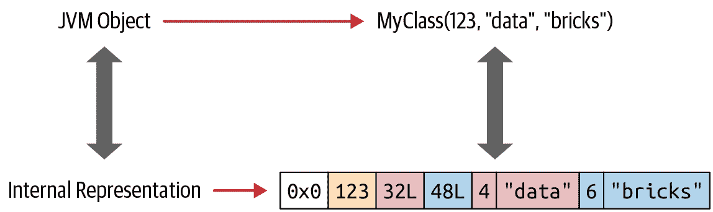
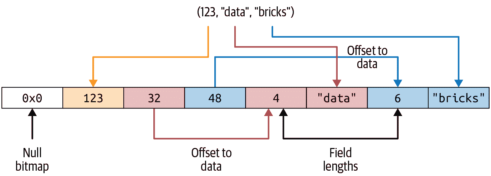
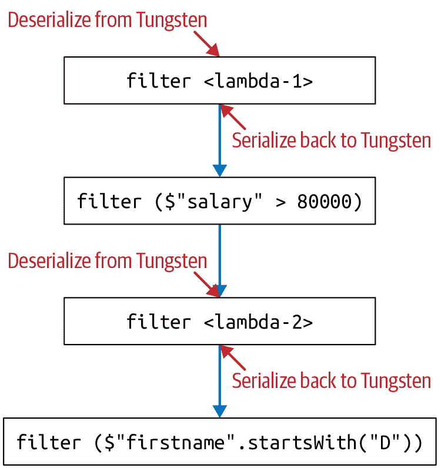

# 第六章：Spark SQL 和 Datasets

在第四章和第五章中，我们介绍了 Spark SQL 和 DataFrame API。我们探讨了如何连接内置和外部数据源，瞥见了 Spark SQL 引擎，并探索了 SQL 和 DataFrame 之间的互操作性，创建和管理视图和表，以及高级 DataFrame 和 SQL 转换。

虽然我们在第三章中简要介绍了 Dataset API，但我们只是简略地涉及了如何创建、存储、序列化和反序列化 Datasets —— 强类型分布式集合的显著方面。

在本章中，我们深入了解 Datasets：我们将探讨在 Java 和 Scala 中使用 Datasets，Spark 如何管理内存以容纳 Dataset 构造作为高级 API 的一部分，以及使用 Datasets 所涉及的成本。

# Java 和 Scala 的单一 API

正如你可能记得的那样，在第三章中（图 3-1 和表 3-6），Datasets 提供了一个统一且独特的 API 用于强类型对象。在 Spark 支持的语言中，只有 Scala 和 Java 是强类型的；因此，Python 和 R 只支持无类型的 DataFrame API。

Datasets 是特定于领域的强类型对象，可以使用函数式编程或来自 DataFrame API 的 DSL 操作符并行操作它们。

由于这个统一的 API，Java 开发者不再面临落后的风险。例如，对于 Scala 的 `groupBy()`、`flatMap()`、`map()` 或 `filter()` API 的任何未来接口或行为更改，对于 Java 也是相同的，因为它是一个公共的统一接口。

## Scala 的 Case Classes 和 JavaBeans 用于 Datasets

如果你还记得从第三章中（表 3-2），Spark 拥有内部数据类型，如 `StringType`、`BinaryType`、`IntegerType`、`BooleanType` 和 `MapType`，它在 Spark 操作期间使用这些类型无缝映射到 Scala 和 Java 的语言特定数据类型。这种映射是通过编码器完成的，我们将在本章后面讨论它们。

要创建 `Dataset[T]`，其中 `T` 是你在 Scala 中定义的类型化对象，你需要一个[案例类](https://oreil.ly/06xko)来定义这个对象。使用我们在第三章中的示例数据（表 3-1），假设我们有一个 JSON 文件，包含数百万条关于博客作者写作 Apache Spark 的条目，格式如下：

```
{id: 1, first: "Jules", last: "Damji", url: "https://tinyurl.1", date: 
"1/4/2016", hits: 4535, campaigns: {"twitter", "LinkedIn"}},
...
{id: 87, first: "Brooke", last: "Wenig", url: "https://tinyurl.2", date:
"5/5/2018", hits: 8908, campaigns: {"twitter", "LinkedIn"}}
```

要创建分布式的 `Dataset[Bloggers]`，我们必须先定义一个 Scala 案例类，该类定义了构成 Scala 对象的每个单独字段。这个案例类作为 `Bloggers` 类型对象的蓝图或模式：

```
// In Scala
case class Bloggers(id:Int, first:String, last:String, url:String, date:String, 
hits: Int, campaigns:Array[String])
```

现在我们可以从数据源读取文件：

```
val bloggers = "../data/bloggers.json"
val bloggersDS = spark
  .read
  .format("json")
  .option("path", bloggers)
  .load()
  .as[Bloggers]
```

结果分布式数据集中的每行都是类型为 `Bloggers` 的对象。

同样地，您可以在 Java 中创建一个名为 `Bloggers` 的 JavaBean 类，然后使用编码器创建一个 `Dataset<Bloggers>`：

```
// In Java
import org.apache.spark.sql.Encoders;
import java.io.Serializable;

public class Bloggers implements Serializable {
    private int id;
    private String first;
    private String last;
    private String url;
    private String date;
    private int hits;
    private Array[String] campaigns;

// JavaBean getters and setters
int getID() { return id; }
void setID(int i) { id = i; }
String getFirst() { return first; }
void setFirst(String f) { first = f; }
String getLast() { return last; }
void setLast(String l) { last = l; }
String getURL() { return url; }
void setURL (String u) { url = u; }
String getDate() { return date; }
Void setDate(String d) { date = d; }
int getHits() { return hits; }
void setHits(int h) { hits = h; }

Array[String] getCampaigns() { return campaigns; }
void setCampaigns(Array[String] c) { campaigns = c; }
}

// Create Encoder
Encoder<Bloggers> BloggerEncoder = Encoders.bean(Bloggers.class);
String bloggers = "../bloggers.json"
Dataset<Bloggers>bloggersDS = spark
  .read
  .format("json")
  .option("path", bloggers)
  .load()
  .as(BloggerEncoder);
```

正如您所看到的，在 Scala 和 Java 中创建数据集需要一些预先考虑，因为您必须了解读取的每行的所有单独列名和类型。与 DataFrame 不同，您可以选择让 Spark 推断模式，但是 Dataset API 要求您提前定义数据类型，并且您的案例类或 JavaBean 类必须与您的模式匹配。

###### 注意

在 Scala 案例类或 Java 类定义中，字段的名称必须与数据源中的顺序匹配。数据中每行的列名会自动映射到类中相应的名称，并且类型会自动保留。

如果字段名称与输入数据匹配，则可以使用现有的 Scala 案例类或 JavaBean 类。使用 Dataset API 与使用 DataFrame 一样简单、简洁和声明性。对于大多数数据集的转换，您可以使用与之前章节中学习的相同的关系运算符。

让我们来看一些使用示例数据集的方面。

# 使用数据集

创建示例数据集的一种简单而动态的方式是使用 `SparkSession` 实例。在此场景中，为了说明目的，我们动态创建一个 Scala 对象，其中包含三个字段：`uid`（用户的唯一 ID）、`uname`（随机生成的用户名字符串）和`usage`（服务器或服务使用的分钟数）。

## 创建示例数据

首先，让我们生成一些示例数据：

```
// In Scala
import scala.util.Random._
// Our case class for the Dataset
case class Usage(uid:Int, uname:String, usage: Int)
val r = new scala.util.Random(42)
// Create 1000 instances of scala Usage class 
// This generates data on the fly
val data = for (i <- 0 to 1000) 
  yield (Usage(i, "user-" + r.alphanumeric.take(5).mkString(""),
  r.nextInt(1000)))
// Create a Dataset of Usage typed data
val dsUsage = spark.createDataset(data)
dsUsage.show(10)

+---+----------+-----+
|uid|     uname|usage|
+---+----------+-----+
|  0|user-Gpi2C|  525|
|  1|user-DgXDi|  502|
|  2|user-M66yO|  170|
|  3|user-xTOn6|  913|
|  4|user-3xGSz|  246|
|  5|user-2aWRN|  727|
|  6|user-EzZY1|   65|
|  7|user-ZlZMZ|  935|
|  8|user-VjxeG|  756|
|  9|user-iqf1P|    3|
+---+----------+-----+
only showing top 10 rows
```

在 Java 中，思路类似，但我们必须使用显式的 `Encoder`（在 Scala 中，Spark 会隐式处理这一点）：

```
// In Java
import org.apache.spark.sql.Encoders;
import org.apache.commons.lang3.RandomStringUtils;
import java.io.Serializable;
import java.util.Random;
import java.util.ArrayList;
import java.util.List;

// Create a Java class as a Bean
public class Usage implements Serializable {
   int uid;                // user id
   String uname;           // username
   int usage;              // usage

   public Usage(int uid, String uname, int usage) {
       this.uid = uid;
       this.uname = uname;
       this.usage = usage;
   }
   // JavaBean getters and setters 
   public int getUid() { return this.uid; }
   public void setUid(int uid) { this.uid = uid; }
   public String getUname() { return this.uname; }
   public void setUname(String uname) { this.uname = uname; }
   public int getUsage() { return this.usage; }
   public void setUsage(int usage) { this.usage = usage; }

   public Usage() {
   }

   public String toString() {
       return "uid: '" + this.uid + "', uame: '" + this.uname + "', 
 usage: '" + this.usage + "'";
   }
}

// Create an explicit Encoder 
Encoder<Usage> usageEncoder = Encoders.bean(Usage.class);
Random rand = new Random();
rand.setSeed(42);
List<Usage> data = new ArrayList<Usage>()

// Create 1000 instances of Java Usage class 
for (int i = 0; i < 1000; i++) {
  data.add(new Usage(i, "user" + 
  RandomStringUtils.randomAlphanumeric(5),
  rand.nextInt(1000));

// Create a Dataset of Usage typed data
Dataset<Usage> dsUsage = spark.createDataset(data, usageEncoder);
```

###### 注意

Scala 和 Java 生成的数据集会有所不同，因为随机种子算法可能不同。因此，Scala 和 Java 的查询结果会有所不同。

现在我们有了生成的数据集 `dsUsage`，让我们执行一些在之前章节中已经做过的常见转换。

## 转换示例数据

请记住，数据集是强类型的特定领域对象的集合。这些对象可以并行转换，使用功能或关系操作。这些转换的示例包括 `map()`、`reduce()`、`filter()`、`select()` 和 `aggregate()`。作为[高阶函数](https://oreil.ly/KHaqt)的示例，这些方法可以接受 lambda、闭包或函数作为参数并返回结果。因此，它们非常适合[函数式编程](https://oreil.ly/jvWtM)。

Scala 是一种函数式编程语言，最近 Java 也添加了 lambda、函数参数和闭包。让我们在 Spark 中尝试一些高阶函数，并使用之前创建的样本数据进行函数式编程构造。

### 高阶函数和函数式编程

举个简单的例子，让我们使用 `filter()` 返回 `dsUsage` Dataset 中所有使用超过 900 分钟的用户。一种方法是使用函数表达式作为 `filter()` 方法的参数：

```
// In Scala
import org.apache.spark.sql.functions._
dsUsage
  .filter(d => d.usage > 900)
  .orderBy(desc("usage"))
  .show(5, false)
```

另一种方式是定义一个函数，并将该函数作为 `filter()` 的参数提供：

```
def filterWithUsage(u: Usage) = u.usage > 900
dsUsage.filter(filterWithUsage(_)).orderBy(desc("usage")).show(5)

+---+----------+-----+
|uid|     uname|usage|
+---+----------+-----+
|561|user-5n2xY|  999|
|113|user-nnAXr|  999|
|605|user-NL6c4|  999|
|634|user-L0wci|  999|
|805|user-LX27o|  996|
+---+----------+-----+
only showing top 5 rows
```

在第一个案例中，我们使用了一个 lambda 表达式 `{d.usage > 900}` 作为 `filter()` 方法的参数，而在第二个案例中，我们定义了一个 Scala 函数 `def filterWithUsage(u: Usage) = u.usage > 900`。在两种情况下，`filter()` 方法迭代分布式 Dataset 中的每一行 `Usage` 对象，并应用表达式或执行函数，返回一个新的 `Usage` 类型的 Dataset，其中表达式或函数的值为 `true`。（详见 [Scala 文档](https://oreil.ly/5yW8d) 获取方法签名的详细信息。）

在 Java 中，`filter()` 的参数类型为 [`FilterFunction<T>`](https://oreil.ly/PBNt4)。这可以匿名内联定义，也可以使用命名函数。在本例中，我们将通过命名方式定义我们的函数，并将其赋值给变量 `f`。将此函数应用于 `filter()` 将返回一个新的 Dataset，其中包含所有满足我们过滤条件的行（条件为 `true`）：

```
// In Java
// Define a Java filter function
FilterFunction<Usage> f = new FilterFunction<Usage>() {
   public boolean call(Usage u) {
       return (u.usage > 900);
   }
};

// Use filter with our function and order the results in descending order
dsUsage.filter(f).orderBy(col("usage").desc()).show(5);

+---+----------+-----+
|uid|uname     |usage|
+---+----------+-----+
|67 |user-qCGvZ|997  |
|878|user-J2HUU|994  |
|668|user-pz2Lk|992  |
|750|user-0zWqR|991  |
|242|user-g0kF6|989  |
+---+----------+-----+
only showing top 5 rows
```

并非所有的 lambda 或函数参数都必须评估为 `Boolean` 值；它们也可以返回计算出的值。考虑使用高阶函数 `map()` 的这个例子，我们的目的是找出每个 `usage` 值超过某个阈值的用户的使用费用，以便我们可以为这些用户提供每分钟的特价。

```
// In Scala
// Use an if-then-else lambda expression and compute a value
dsUsage.map(u => {if (u.usage > 750) u.usage * .15 else u.usage * .50 })
  .show(5, false)
// Define a function to compute the usage
def computeCostUsage(usage: Int): Double = {
  if (usage > 750) usage * 0.15 else usage * 0.50
}
// Use the function as an argument to map()
dsUsage.map(u => {computeCostUsage(u.usage)}).show(5, false)
+------+
|value |
+------+
|262.5 |
|251.0 |
|85.0  |
|136.95|
|123.0 |
+------+
only showing top 5 rows
```

要在 Java 中使用 `map()`，必须定义一个 [`MapFunction<T>`](https://oreil.ly/BP0iY)。这可以是匿名类，也可以是扩展了 `MapFunction<T>` 的定义类。在本例中，我们在方法调用本身内联使用它：

```
// In Java
// Define an inline MapFunction
dsUsage.map((MapFunction<Usage, Double>) u -> {
   if (u.usage > 750)
       return u.usage * 0.15;
   else
       return u.usage * 0.50;
}, Encoders.DOUBLE()).show(5); // We need to explicitly specify the Encoder
+------+
|value |
+------+
|65.0  |
|114.45|
|124.0 |
|132.6 |
|145.5 |
+------+
only showing top 5 rows
```

尽管我们已经计算出了使用费用的值，但我们不知道这些计算值与哪些用户相关联。我们如何获取这些信息呢？

步骤很简单：

1.  创建一个 Scala case 类或 JavaBean 类 `UsageCost`，带有一个名为 `cost` 的附加字段或列。

1.  定义一个函数来计算 `cost`，并在 `map()` 方法中使用它。

这在 Scala 中的实现如下：

```
// In Scala
// Create a new case class with an additional field, cost
case class UsageCost(uid: Int, uname:String, usage: Int, cost: Double)

// Compute the usage cost with Usage as a parameter
// Return a new object, UsageCost
def computeUserCostUsage(u: Usage): UsageCost = {
  val v = if (u.usage > 750) u.usage * 0.15 else u.usage * 0.50
    UsageCost(u.uid, u.uname, u.usage, v)
}

// Use map() on our original Dataset
dsUsage.map(u => {computeUserCostUsage(u)}).show(5)

+---+----------+-----+------+
|uid|     uname|usage|  cost|
+---+----------+-----+------+
|  0|user-Gpi2C|  525| 262.5|
|  1|user-DgXDi|  502| 251.0|
|  2|user-M66yO|  170|  85.0|
|  3|user-xTOn6|  913|136.95|
|  4|user-3xGSz|  246| 123.0|
+---+----------+-----+------+
only showing top 5 rows
```

现在，我们有一个经过转换的 Dataset，其中包含通过我们 `map()` 转换中的函数计算的新列 `cost`，以及所有其他列。

同样，在 Java 中，如果我们想要每个用户关联的成本，我们需要定义一个 JavaBean 类 `UsageCost` 和 `MapFunction<T>`。有关完整的 JavaBean 示例，请参见本书的[GitHub repo](https://github.com/databricks/LearningSparkV2)；为简洁起见，我们仅在此展示内联的 `MapFunction<T>`：

```
// In Java
// Get the Encoder for the JavaBean class
Encoder<UsageCost> usageCostEncoder = Encoders.bean(UsageCost.class);

// Apply map() function to our data
dsUsage.map( (MapFunction<Usage, UsageCost>) u -> {
       double v = 0.0;
       if (u.usage > 750) v = u.usage * 0.15; else v = u.usage * 0.50;
       return new UsageCost(u.uid, u.uname,u.usage, v); },
		          usageCostEncoder).show(5);

+------+---+----------+-----+
|  cost|uid|     uname|usage|
+------+---+----------+-----+
|  65.0|  0|user-xSyzf|  130|
|114.45|  1|user-iOI72|  763|
| 124.0|  2|user-QHRUk|  248|
| 132.6|  3|user-8GTjo|  884|
| 145.5|  4|user-U4cU1|  970|
+------+---+----------+-----+
only showing top 5 rows
```

使用高阶函数和 Datasets 需要注意的几点：

+   我们正在使用作为函数参数的类型化 JVM 对象。

+   我们使用点符号（来自面向对象编程）来访问类型化的 JVM 对象内的各个字段，使其更易于阅读。

+   我们的一些函数和 lambda 签名可以是类型安全的，确保在编译时检测错误，并指导 Spark 在哪些数据类型上工作，执行什么操作等。

+   我们的代码可读性强，表达力强，使用 Java 或 Scala 语言特性中的 lambda 表达式。

+   Spark 提供了在 Java 和 Scala 中无需高阶函数构造的 `map()` 和 `filter()` 的等效方法，因此您并不需要强制使用 Datasets 或 DataFrames 中的函数式编程。相反，您可以简单地使用条件 DSL 操作符或 SQL 表达式：例如，`dsUsage.filter("usage > 900")` 或 `dsUsage($"usage" > 900)`。（有关更多信息，请参见 “Costs of Using Datasets”。）

+   对于 Datasets，我们使用编码器来高效地在 JVM 和 Spark 的内部二进制格式之间转换数据类型（关于此的更多信息请见 “Dataset Encoders”）。

###### 注意

高阶函数和函数式编程并不是 Spark Datasets 独有的；您也可以在 DataFrames 中使用它们。回想一下，一个 DataFrame 是一个 `Dataset[Row]`，其中 `Row` 是一个通用的未类型化 JVM 对象，可以包含不同类型的字段。该方法签名接受在 `Row` 上操作的表达式或函数，这意味着每个 `Row` 的数据类型可以作为表达式或函数的输入值。

### 将 DataFrames 转换为 Datasets

为了对查询和结构进行强类型检查，您可以将 DataFrame 转换为 Datasets。要将现有的 DataFrame `df` 转换为类型为 `SomeCaseClass` 的 Dataset，只需使用 `df.as[SomeCaseClass]` 表示法。我们之前已经看到了一个例子：

```
// In Scala
val bloggersDS = spark
  .read
  .format("json")
  .option("path", "/data/bloggers/bloggers.json")
  .load()
  .as[Bloggers]
```

`spark.read.format("json")` 返回一个 `DataFrame<Row>`，在 Scala 中是 `Dataset[Row]` 的类型别名。使用 `.as[Bloggers]` 指示 Spark 使用编码器（本章后面讨论）来将对象从 Spark 的内部内存表示序列化/反序列化为 JVM `Bloggers` 对象。

# Datasets 和 DataFrames 的内存管理

Spark 是一种高效的内存分布式大数据引擎，因此其对内存的高效利用对其执行速度至关重要。¹ 在其发布历史中，Spark 对内存的使用已经[显著发展](https://oreil.ly/sL56g)：

+   Spark 1.0 使用基于 RDD 的 Java 对象进行内存存储、序列化和反序列化，这在资源和速度方面都很昂贵。此外，存储是在 Java 堆上分配的，因此在处理大数据集时受到 JVM 的垃圾回收（GC）的影响。

+   Spark 1.x 引入了[Project Tungsten](https://oreil.ly/wCQZB)。其突出特点之一是引入了新的基于行的内部格式，用于在非堆内存中布局 Datasets 和 DataFrames，使用偏移量和指针。Spark 使用高效的*encoders*机制在 JVM 和其内部 Tungsten 格式之间进行序列化和反序列化。在非堆内存分配内存意味着 Spark 不会受到 GC 的过多限制。

+   Spark 2.x 引入了[第二代 Tungsten 引擎](https://oreil.ly/hmjz_)，具备整体阶段代码生成和矢量化基于列的内存布局。建立在现代编译器的思想和技术之上，这个新版本还利用了现代 CPU 和缓存架构，采用“单指令多数据”（SIMD）方法进行快速并行数据访问。

# Dataset Encoders

Encoders 将数据从 Spark 的内部 Tungsten 格式转换为 JVM Java 对象的非堆内存。换句话说，它们将 Spark 的 Dataset 对象从内部格式序列化和反序列化为 JVM 对象，包括基本数据类型。例如，一个`Encoder[T]`将会把数据从 Spark 的内部 Tungsten 格式转换为`Dataset[T]`。

Spark 具有内置支持，可自动生成原始类型（例如字符串、整数、长整数）、Scala case 类和 JavaBeans 的 encoders。与 Java 和 Kryo 序列化和反序列化相比，Spark 的 encoders 速度[显著更快](https://oreil.ly/zz-x9)。

在我们之前的 Java 示例中，我们明确地创建了一个编码器：

```
Encoder<UsageCost> usageCostEncoder = Encoders.bean(UsageCost.class);
```

然而，对于 Scala，Spark 会自动为这些高效的转换器生成字节码。让我们来看看 Spark 的内部 Tungsten 基于行的格式。

## Spark 的内部格式与 Java 对象格式对比

Java 对象具有较大的开销——头部信息、哈希码、Unicode 信息等。即使是一个简单的 Java 字符串如“abcd”，也占用 48 字节的存储空间，而不是你可能期望的 4 字节。想象一下创建一个`MyClass(Int, String, String)`对象的开销。

不创建基于 JVM 的 Datasets 或 DataFrames 对象，而是 Spark 分配*非堆*Java 内存来布局它们的数据，并使用 encoders 将数据从内存表示转换为 JVM 对象。例如，Figure 6-1 展示了 JVM 对象`MyClass(Int, String, String)`在内部的存储方式。



###### 图 6-1\. JVM 对象存储在由 Spark 管理的连续非堆 Java 内存中

当数据以这种连续的方式存储并通过指针算术和偏移量访问时，编码器可以快速地序列化或反序列化这些数据。这意味着什么？

## 序列化和反序列化（SerDe）

在分布式计算中并不是一个新概念，数据经常在集群中的计算机节点之间传输，*序列化和反序列化*是发送方将一个类型化对象进行*编码*（序列化）成二进制表示或格式的过程，并由接收方将其从二进制格式进行*解码*（反序列化）成其相应的数据类型对象。

例如，如果在 Spark 集群中的节点之间共享 JVM 对象`MyClass`（参见图 6-1），发送方将其序列化为字节数组，接收方将其反序列化回类型为`MyClass`的 JVM 对象。

JVM 具有其内置的 Java 序列化器和反序列化器，但效率低下，因为（正如我们在前一节中看到的那样）JVM 在堆内存中创建的 Java 对象臃肿。因此，该过程较慢。

这就是数据集编码器发挥作用的地方，由于几个原因：

+   Spark 的内部 Tungsten 二进制格式（参见图 6-1 和 6-2）将对象存储在 Java 堆内存之外，并且紧凑，因此这些对象占用的空间较少。

+   编码器可以通过使用简单的指针算术与内存地址和偏移量遍历内存，快速进行序列化（参见图 6-2）。

+   在接收端，编码器可以快速将二进制表示反序列化为 Spark 内部的表示形式。编码器不受 JVM 垃圾收集暂停的影响。



###### 图 6-2\. Spark 内部 Tungsten 基于行的格式

然而，生活中的大多数好事都是要付出代价的，接下来我们将讨论这一点。

# 使用数据集的成本

在“数据框架与数据集”中的第三章，我们概述了使用数据集的一些好处，但这些好处也伴随着代价。如前一节所述，当数据集传递给高阶函数（如`filter()`、`map()`或`flatMap()`）时，这些函数接受 Lambda 和函数参数，从 Spark 内部 Tungsten 格式反序列化为 JVM 对象存在成本。

与在引入 Spark 编码器之前使用的其他序列化器相比，这种成本是较小且可容忍的。然而，对于更大的数据集和许多查询，这种成本会累积，并可能影响性能。

## 缓解成本的策略

缓解过度序列化和反序列化的一种策略是在查询中使用 DSL 表达式，避免将 lambda 作为匿名函数传递给高阶函数。因为 lambda 是匿名的且在运行时对 Catalyst 优化器不透明，所以当您使用它们时，它不能有效地辨别您在做什么（您没有告诉 Spark *要做什么*），因此不能优化您的查询（参见“The Catalyst Optimizer”在第三章）。

第二种策略是将您的查询链在一起，以最小化序列化和反序列化。在 Spark 中，将查询链在一起是一种常见的做法。

让我们通过一个简单的例子来说明。假设我们有一个类型为`Person`的数据集，其中`Person`定义为 Scala 案例类：

```
// In Scala
Person(id: Integer, firstName: String, middleName: String, lastName: String,
gender: String, birthDate: String, ssn: String, salary: String)
```

我们希望对这个数据集发出一系列查询，使用函数式编程。

让我们看一个案例，我们以一种低效的方式组合查询，从而无意中产生了重复序列化和反序列化的成本：

```
import java.util.Calendar
val earliestYear = Calendar.getInstance.get(Calendar.YEAR) - 40

personDS

  // Everyone above 40: lambda-1
  .filter(x => x.birthDate.split("-")(0).toInt > earliestYear)

  // Everyone earning more than 80K
  .filter($"salary" > 80000)

  // Last name starts with J: lambda-2
  .filter(x => x.lastName.startsWith("J"))

  // First name starts with D
  .filter($"firstName".startsWith("D"))
  .count()
```

正如您在图 6-3 中所观察到的那样，每当我们从 lambda 转到 DSL（`filter($"salary" > 8000)`）时，我们都会产生序列化和反序列化`Person` JVM 对象的成本。



###### 图 6-3\. 使用 lambda 和 DSL 串联查询的低效方法

相比之下，下面的查询仅使用 DSL 而不使用 lambda。因此，它效率更高——在整个组合和链式查询过程中不需要序列化/反序列化：

```
personDS
  .filter(year($"birthDate") > earliestYear) // Everyone above 40
  .filter($"salary" > 80000) // Everyone earning more than 80K
  .filter($"lastName".startsWith("J")) // Last name starts with J
  .filter($"firstName".startsWith("D")) // First name starts with D
  .count()
```

对于好奇的人，您可以在本书 GitHub 存储库的本章笔记本中查看两次运行之间的时间差异。

# 总结

本章详细讨论了如何在 Java 和 Scala 中处理数据集。我们探讨了 Spark 如何管理内存以适应数据集构造作为其统一且高级 API 的一部分，并考虑了使用数据集的一些成本及其如何减少这些成本。我们还展示了如何在 Spark 中使用 Java 和 Scala 的函数式编程构造。

最后，我们深入探讨了编码器如何将数据从 Spark 的内部 Tungsten 二进制格式序列化和反序列化为 JVM 对象。

在下一章中，我们将通过检查高效的 I/O 策略、优化和调整 Spark 配置，以及在调试 Spark 应用程序时要查找的属性和信号，来优化 Spark。

¹ 想要了解更多关于 Spark 如何管理内存的详细信息，请参阅文本和演示中提供的参考资料以及[“Apache Spark Memory Management”](https://oreil.ly/BlR_u)和[“Deep Dive into Project Tungsten Bringing Spark Closer to Bare Metal”](https://oreil.ly/YuH3a)。
