# 第八章：结构化流处理

在前几章中，您学习了如何使用结构化 API 处理非常大但有限的数据量。然而，数据通常是连续到达并需要实时处理。在本章中，我们将讨论如何使用相同的结构化 API 处理数据流。

# Apache Spark 流处理引擎的演变

流处理被定义为对无休止数据流的连续处理。随着大数据的到来，流处理系统从单节点处理引擎过渡到多节点、分布式处理引擎。传统上，分布式流处理是使用*逐记录处理模型*实现的，如图 8-1 所示。

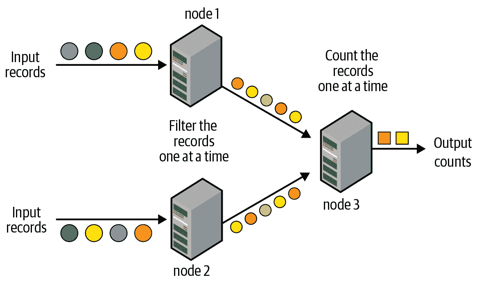

###### 图 8-1\. 传统逐记录处理模型

处理管道由节点的有向图组成，如图 8-1 所示；每个节点连续接收一个记录，处理它，然后将生成的记录转发给图中的下一个节点。这种处理模型可以实现非常低的延迟——即，输入记录可以在毫秒内通过管道进行处理并生成结果输出。然而，这种模型在从节点故障和落后节点（即比其他节点慢的节点）中恢复时效率不高；它可以通过大量额外的故障转移资源快速恢复故障，或者使用最少的额外资源但恢复速度较慢。¹

## 微批次流处理的出现

当 Apache Spark 引入 Spark Streaming（也称为 DStreams）时，挑战了这种传统方法。它引入了*微批次流处理*的概念，其中流处理被建模为连续的小型 map/reduce 风格的批处理作业（因此称为“微批次”），针对流数据的小块。如图 8-2 所示。

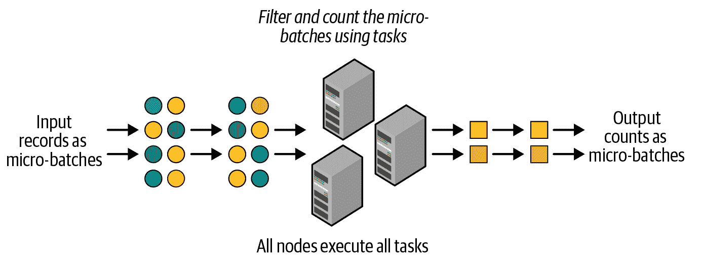

###### 图 8-2\. 结构化流使用微批处理模型

正如所示，Spark Streaming 将输入流的数据划分为，比如，1 秒的微批次。每个批次在 Spark 集群中以分布式方式处理，使用小的确定性任务生成微批次的输出。将流计算分解为这些小任务，相比传统的连续操作模型，有两个优势：

+   Spark 的灵活任务调度可以通过在其他执行者上重新调度任务的一个或多个副本，非常快速且高效地从故障和落后执行者中恢复。

+   任务的确定性质保证了无论任务重新执行多少次，输出数据都是相同的。这一关键特性使得 Spark Streaming 能够提供端到端的精确一次处理保证，即生成的输出结果将确保每个输入记录仅被处理一次。

这种高效的容错性是以延迟为代价的——微批处理模型无法达到毫秒级的延迟；通常情况下，它可以达到几秒钟的延迟（在某些情况下甚至可以低至半秒）。然而，我们观察到，对于绝大多数流处理应用场景来说，微批处理的优势远远超过秒级延迟的缺点。这是因为大多数流水线至少具备以下一种特性：

+   管道不需要低于几秒钟的延迟。例如，如果流式输出仅由每小时作业读取，生成具有亚秒级延迟的输出就没有用处。

+   管道的其他部分存在较大的延迟。例如，如果传感器向 Apache Kafka（用于摄取数据流的系统）写入的操作被批处理以获得更高的吞吐量，那么在下游处理系统中进行任何优化也无法使端到端延迟低于批处理延迟。

此外，DStream API 是建立在 Spark 的批处理 RDD API 之上的。因此，DStreams 具有与 RDDs 相同的功能语义和容错模型。因此，Spark Streaming 证明了单一统一的处理引擎可以为批处理、交互式和流处理工作负载提供一致的 API 和语义。这种流处理中的基本范式转变推动了 Spark Streaming 成为最广泛使用的开源流处理引擎之一。

## 从 Spark Streaming（DStreams）中学到的教训

尽管如此，DStream API 也存在一些缺陷。以下是一些需要改进的关键领域：

缺乏批处理和流处理的单一 API

即使 DStreams 和 RDDs 具有一致的 API（即相同的操作和语义），开发人员在将批处理作业转换为流处理作业时仍然需要显式重写其代码以使用不同的类。

缺乏逻辑计划和物理计划之间的分离

Spark Streaming 以开发人员指定的顺序执行 DStream 操作。由于开发人员有效地指定了确切的物理执行计划，因此没有自动优化的余地，开发人员必须手动优化其代码以获得最佳性能。

缺乏对事件时间窗口的本机支持

DStreams 仅基于 Spark Streaming 接收每条记录的时间（称为*处理时间*）定义窗口操作。然而，许多使用案例需要根据记录生成的时间（称为*事件时间*）计算窗口聚合，而不是它们接收或处理的时间。缺乏对事件时间窗口的本机支持使得开发者难以使用 Spark Streaming 构建这样的管道。

这些缺点塑造了我们将在接下来讨论的结构化流处理的设计理念。

## 结构化流处理的哲学

基于这些来自 DStreams 的经验教训，结构化流处理从头开始设计，核心理念是对开发者而言，编写流处理管道应该像编写批处理管道一样简单。总结来说，结构化流处理的指导原则包括：

批处理和流处理的统一编程模型和接口

这种统一模型为批处理和流处理工作负载提供了简单的 API 接口。您可以像在批处理上一样在流上使用熟悉的 SQL 或类似批处理的 DataFrame 查询（就像您在之前章节中学到的那样），将处理故障容忍、优化和延迟数据等底层复杂性留给引擎处理。在接下来的部分中，我们将研究您可能编写的一些查询。

流处理的更广泛定义

大数据处理应用程序变得足够复杂，以至于实时处理和批处理之间的界限显著模糊化。结构化流处理的目标是从传统的流处理扩展其适用性到更大类别的应用程序；任何定期（例如每几小时）到连续（如传统流处理应用程序）处理数据的应用程序都应该能够使用结构化流处理表达。

接下来，我们将讨论结构化流处理使用的编程模型。

# 结构化流处理的编程模型

“表”是在构建批处理应用程序时开发者熟悉的概念。结构化流处理通过将流视为无界、持续追加的表来将此概念扩展到流应用程序中，如图 8-3 所示。

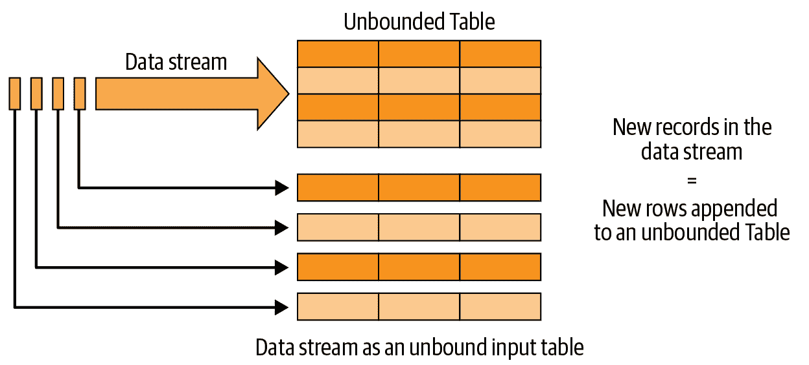

###### 图 8-3\. 结构化流处理的编程模型：数据流作为无界表

数据流中接收的每条新记录就像附加到无界输入表的新行。结构化流处理不会实际保留所有输入，但结构化流处理产生的输出直到时间 T 将等同于在静态有界表中具有直到 T 的所有输入并在表上运行批处理作业的效果。

如图 8-4 所示，开发人员随后定义在这个概念输入表上的查询，就像它是一个静态表，以计算将写入输出汇聚的结果表。结构化流将自动将这种类似批处理的查询转换为流执行计划。这称为*增量化*：结构化流会找出每次记录到达时需要维护的状态。最后，开发人员指定触发策略来控制何时更新结果。每次触发器触发时，结构化流都会检查新数据（即输入表中的新行），并增量更新结果。

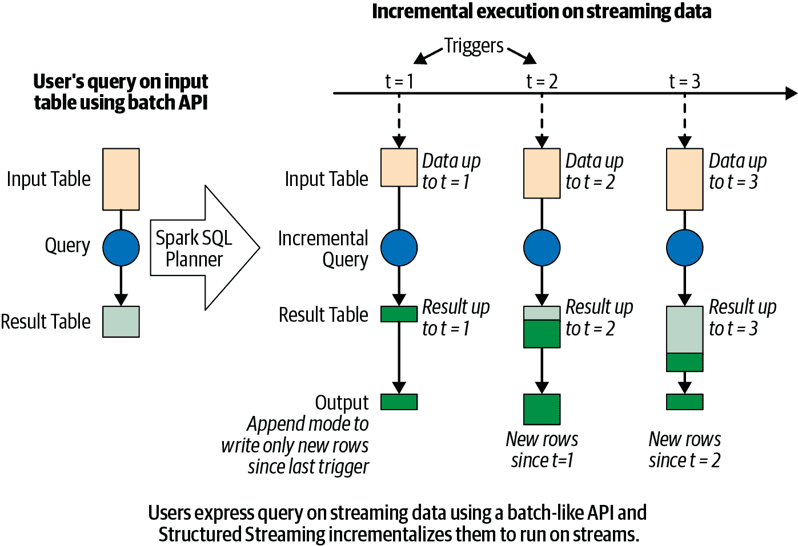

###### 图 8-4\. 结构化流处理模型

模型的最后部分是输出模式。每当更新结果表时，开发人员都希望将更新写入外部系统，例如文件系统（例如 HDFS，Amazon S3）或数据库（例如 MySQL，Cassandra）。通常我们希望增量写入输出。为此，结构化流提供了三种输出模式：

追加模式

自上次触发以来附加到结果表的新行将被写入外部存储。这仅适用于查询中现有结果表中的行不可更改的情况（例如，输入流的映射）。

更新模式

自上次触发以来在结果表中更新的唯一行将在外部存储中更改。这种模式适用于可以原地更新的输出汇聚，例如 MySQL 表。

完整模式

更新后的整个结果表将被写入外部存储。

###### 注意

除非指定了完整模式，否则结构化流不会完全实现结果表。只会维护足够的信息（称为“状态”），以确保能够计算结果表中的更改并输出更新。

将数据流视为表不仅使得在数据上进行逻辑计算更容易概念化，而且使得在代码中表达这些计算更加容易。由于 Spark 的 DataFrame 是表的编程表示，您可以使用 DataFrame API 来表达对流数据的计算。您只需从流数据源定义一个输入 DataFrame（即输入表），然后以与在批处理源上定义 DataFrame 相同的方式对 DataFrame 应用操作。

在接下来的部分中，您将看到使用 DataFrame 编写结构化流查询是多么简单。

# 结构化流查询的基础知识

在本节中，我们将介绍一些您需要理解以开发结构化流查询的高级概念。我们将首先介绍定义和启动流查询的关键步骤，然后讨论如何监视活动查询并管理其生命周期。

## 定义流查询的五个步骤

如前一节所讨论的，结构化流处理使用与批处理查询相同的 DataFrame API 来表达数据处理逻辑。但是，在定义结构化流查询时，您需要了解一些关键的不同之处。在本节中，我们将通过构建一个简单的查询来探索定义流查询的步骤，该查询从套接字上的文本数据流中读取并计算单词数。

### 步骤 1：定义输入源

与批处理查询一样，第一步是从流源定义一个 DataFrame。但是，当读取批处理数据源时，我们需要使用 `spark.read` 创建一个 `DataFrameReader`，而在流处理源中，我们需要使用 `spark.readStream` 创建一个 `DataStreamReader`。`DataStreamReader` 具有与 `DataFrameReader` 大部分相同的方法，因此可以类似地使用它。以下是从通过套接字连接接收的文本数据流创建 DataFrame 的示例：

```
# In Python
spark = SparkSession...
lines = (spark
  .readStream.format("socket")
  .option("host", "localhost")
  .option("port", 9999)
  .load())
```

```
// In Scala 
val spark = SparkSession...
val lines = spark
  .readStream.format("socket")
  .option("host", "localhost")
  .option("port", 9999)
  .load()
```

此代码将 `lines` DataFrame 生成为从 localhost:9999 读取的换行分隔文本数据的无界表。需要注意的是，类似于使用 `spark.read` 读取批处理源一样，这并不会立即开始读取流数据；它只是设置了读取数据的配置，一旦显式启动流查询，数据才会被读取。

除了套接字外，Apache Spark 还原生支持从 Apache Kafka 和所有 `DataFrameReader` 支持的各种基于文件的格式（Parquet、ORC、JSON 等）读取数据流。这些源的详细信息及其支持的选项将在本章后面讨论。此外，流查询可以定义多个输入源，包括流式和批处理，可以使用像 union 和 join 这样的 DataFrame 操作进行组合（同样在本章后面讨论）。

### 步骤 2：转换数据

现在我们可以应用常规的 DataFrame 操作，比如将行拆分为单词并计数它们，如下所示的代码：

```
# In Python
from pyspark.sql.functions import *
words = lines.select(split(col("value"), "\\s").alias("word"))
counts = words.groupBy("word").count()
```

```
// In Scala
import org.apache.spark.sql.functions._
val words = lines.select(split(col("value"), "\\s").as("word"))
val counts = words.groupBy("word").count()
```

`counts` 是一个*流处理 DataFrame*（即在无界流数据上的 DataFrame），表示在流查询启动并持续处理流输入数据时将计算的运行单词计数。

需要注意的是，用于转换 `lines` 流处理 DataFrame 的这些操作如果 `lines` 是批处理 DataFrame 也会以完全相同的方式工作。通常情况下，大多数可以应用于批处理 DataFrame 的 DataFrame 操作也可以应用于流处理 DataFrame。要了解结构化流处理支持哪些操作，您必须了解两类广泛的数据转换：

无状态转换

`select()`、`filter()`、`map()` 等操作不需要来自前一行的任何信息来处理下一行；每行可以单独处理。这些操作在处理中不涉及先前的“状态”，因此被称为无状态操作。无状态操作可以应用于批处理和流处理的 DataFrame。

有状态转换

相比之下，像 `count()` 这样的聚合操作需要维护状态以跨多行合并数据。具体来说，涉及分组、连接或聚合的任何数据框架操作都是有状态的转换。虽然结构化流支持其中许多操作，但由于计算难度大或无法以增量方式计算，有些组合操作不受支持。

结构化流支持的有状态操作及如何在运行时管理它们的状态将在本章后面讨论。

### 第三步：定义输出目的地和输出模式

在转换数据后，我们可以使用 `DataFrame.writeStream`（而不是用于批处理数据的 `DataFrame.write`）定义如何写入处理后的输出数据。这将创建一个 `DataStreamWriter`，类似于 `DataFrameWriter`，它具有额外的方法来指定以下内容：

+   输出写入详细信息（输出位置及方式）

+   处理细节（如何处理数据及如何从故障中恢复）

让我们从输出写入详细信息开始（我们将在下一步关注处理细节）。例如，以下片段展示了如何将最终的`counts`写入控制台：

```
# In Python
writer = counts.writeStream.format("console").outputMode("complete")
```

```
// In Scala
val writer = counts.writeStream.format("console").outputMode("complete")
```

在这里，我们指定了 `"console"` 作为输出流目的地，`"complete"` 作为输出模式。流查询的输出模式指定在处理新输入数据后写出更新后输出的部分。在此示例中，当处理一块新的输入数据并更新单词计数时，我们可以选择打印到控制台所有迄今为止看到的单词计数（即*完整模式*），或者只打印最后一块输入数据中更新的单词。这由指定的输出模式决定，可以是以下之一（正如我们在“结构化流的编程模型”中已经看到的）：

追加模式

这是默认模式，只有自上次触发以来新增加到结果表/数据框架（例如，`counts` 表）的新行会输出到目标位置。从语义上讲，此模式保证输出的任何行将不会被将来的查询修改或更新。因此，追加模式仅支持那些永远不会修改先前输出数据的查询（例如无状态查询）。相比之下，我们的词频统计查询可以更新先前生成的计数，因此不支持追加模式。

完整模式

在这种模式下，结果表/数据框架的所有行将在每次触发结束时输出。这种模式适用于结果表比输入数据要小得多，因此可以在内存中保留。例如，我们的词频统计查询支持完整模式，因为计数数据很可能比输入数据小得多。

更新模式

在此模式下，只有自上次触发以来更新的结果表/DataFrame 行将在每次触发结束时输出。这与追加模式相反，因为输出行可能会被查询修改，并在未来再次输出。大多数查询支持更新模式。

###### 注意

有关不同查询支持的输出模式的详细信息可以在最新的[结构化流编程指南](https://oreil.ly/hyuKL)中找到。

除了将输出写入控制台外，结构化流还原生支持将流式数据写入文件和 Apache Kafka。此外，您还可以使用 `foreachBatch()` 和 `foreach()` API 方法将数据写入任意位置。事实上，您可以使用 `foreachBatch()` 来使用现有的批数据源写入流式输出（但您将失去精确一次性保证）。这些输出位置的详细信息及其支持的选项将在本章后面讨论。

### 第四步：指定处理细节

在启动查询之前的最后一步是指定如何处理数据的详细信息。继续使用我们的词频统计示例，我们将如下指定处理细节：

```
# In Python
checkpointDir = "..."
writer2 = (writer
  .trigger(processingTime="1 second")
  .option("checkpointLocation", checkpointDir))
```

```
// In Scala
import org.apache.spark.sql.streaming._
val checkpointDir = "..."
val writer2 = writer
  .trigger(Trigger.ProcessingTime("1 second"))
  .option("checkpointLocation", checkpointDir)
```

在此处，我们使用 `DataFrame.writeStream` 创建的 `DataStreamWriter` 指定了两种类型的详细信息：

触发详情

这指示何时触发新可用流式数据的发现和处理。有四个选项：

默认

当未显式指定触发器时，默认情况下，流式查询以微批次处理数据，其中下一个微批次在前一个微批次完成后立即触发。

使用触发间隔的处理时间

您可以显式指定 `ProcessingTime` 触发器及其间隔，并且查询将在固定间隔触发微批处理。

一次

在这种模式下，流式查询将精确执行一个微批处理，处理所有新的可用数据并随后停止。这在你希望通过外部调度程序控制触发和处理，并使用任意自定义时间表重新启动查询（例如，仅执行一次查询[每天一次](https://oreil.ly/Y7EZy)）时非常有用。

连续

这是一个实验性模式（截至 Spark 3.0），流式查询将连续处理数据，而不是以微批次处理。虽然只有 DataFrame 操作的一个小子集允许使用此模式，但它可以提供比微批处理触发模式更低的延迟（低至毫秒）。有关最新信息，请参阅最新的[结构化流编程指南](https://oreil.ly/7cERT)。

检查点位置

这是任何与 HDFS 兼容的文件系统中的目录，流查询将其进度信息保存在其中——即已成功处理的数据。在失败时，此元数据用于在失败时恢复查询，确切一次性保证因此设置此选项对于故障恢复是必要的。

### 第 5 步：启动查询

一旦所有内容都已指定，最后一步是启动查询，可以通过以下方式完成：

```
# In Python
streamingQuery = writer2.start()
```

```
// In Scala
val streamingQuery = writer2.start()
```

类型为`streamingQuery`的返回对象表示活动查询，并可用于管理查询，这将在本章后面介绍。

注意，`start()`是一个非阻塞方法，因此一旦查询在后台启动，它就会立即返回。如果你希望主线程阻塞，直到流查询终止，可以使用`streamingQuery.awaitTermination()`。如果查询在后台因错误而失败，`awaitTermination()`也将因同样的异常而失败。

您可以使用`awaitTermination(timeoutMillis)`等待超时时长，也可以使用`streamingQuery.stop()`显式停止查询。

### 将所有内容整合在一起

总结一下，这里是通过套接字读取文本流数据、计算单词数并将计数打印到控制台的完整代码：

```
# In Python
from pyspark.sql.functions import *
spark = SparkSession...
lines = (spark
  .readStream.format("socket")
  .option("host", "localhost")
  .option("port", 9999)
  .load())

words = lines.select(split(col("value"), "\\s").alias("word"))
counts = words.groupBy("word").count()
checkpointDir = "..."
streamingQuery = (counts
  .writeStream
  .format("console")
  .outputMode("complete")
  .trigger(processingTime="1 second")
  .option("checkpointLocation", checkpointDir)
  .start())
streamingQuery.awaitTermination()
```

```
// In Scala
import org.apache.spark.sql.functions._
import org.apache.spark.sql.streaming._
val spark = SparkSession...
val lines = spark
  .readStream.format("socket")
  .option("host", "localhost")
  .option("port", 9999)
  .load()

val words = lines.select(split(col("value"), "\\s").as("word"))
val counts = words.groupBy("word").count()

val checkpointDir = "..."
val streamingQuery = counts.writeStream
  .format("console")
  .outputMode("complete")
  .trigger(Trigger.ProcessingTime("1 second"))
  .option("checkpointLocation", checkpointDir)
  .start()
streamingQuery.awaitTermination()
```

查询启动后，后台线程不断从流源读取新数据，处理它，并将其写入流接收器。接下来，让我们快速看一下这是如何执行的。

## 主动流查询的内部运行机制

查询启动后，引擎中会出现以下步骤序列，如图 8-5 所示。DataFrame 操作转换为逻辑计划，这是 Spark SQL 用来计划查询的抽象表示：

1.  Spark SQL 分析和优化此逻辑计划，以确保可以在流数据上以增量和高效的方式执行。

1.  Spark SQL 启动了一个后台线程，不断执行以下循环：²

    1.  基于配置的触发间隔，线程检查流源以查看是否有新数据可用。

    1.  如果有新数据可用，则通过运行微批处理来执行它。从优化的逻辑计划中生成优化的 Spark 执行计划，该计划从源读取新数据，逐步计算更新结果，并根据配置的输出模式将输出写入接收器。

    1.  对于每个微批处理，处理的确切数据范围（例如文件集或 Apache Kafka 偏移量的范围）和任何相关状态都保存在配置的检查点位置，以便在需要时确定性地重新处理确切的范围。

1.  此循环持续到查询终止，可能出现以下原因之一：

    1.  查询发生了故障（无论是处理错误还是集群中的故障）。

    1.  使用`streamingQuery.stop()`明确停止查询。

    1.  如果触发器设置为`Once`，则查询将在执行包含所有可用数据的单个微批次后自行停止。

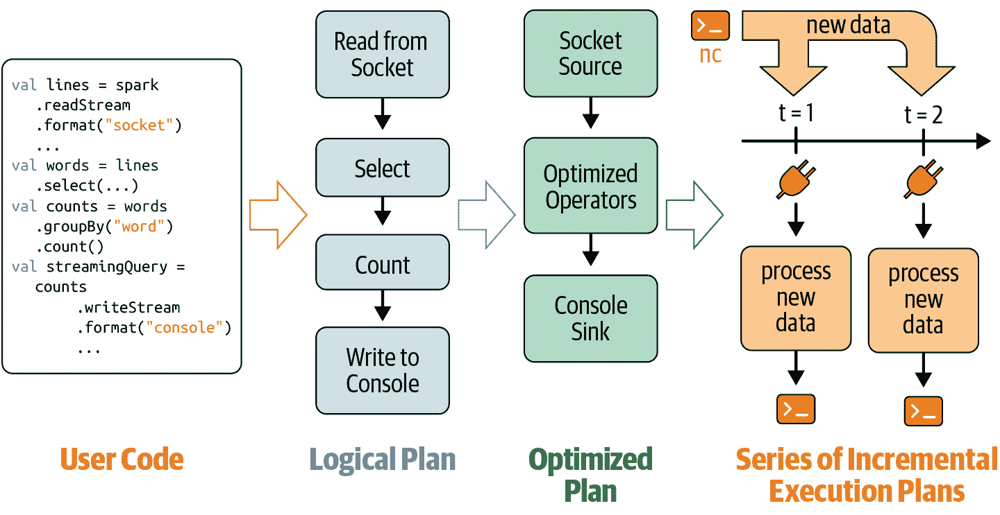

###### 图 8-5\. 流式查询的增量执行

###### 注意

关于结构化流处理的一个关键点是，在其背后实际上使用的是 Spark SQL 来执行数据。因此，充分利用了 Spark SQL 的超优化执行引擎的全部能力，以最大化流处理吞吐量，提供关键的性能优势。

接下来，我们将讨论如何在终止后重新启动流查询以及流查询的生命周期。

## 使用精确一次性保证从故障中恢复

要在完全新的进程中重新启动终止的查询，您必须创建一个新的`SparkSession`，重新定义所有的 DataFrame，并在最终结果上使用与第一次启动查询时相同的检查点位置开始流式查询。对于我们的词频统计示例，您可以简单地重新执行从第一行的`spark`定义到最后一行的`start()`的整个代码片段。

检查点位置在重启时必须保持一致，因为该目录包含流查询的唯一标识，并确定查询的生命周期。如果删除检查点目录或者使用不同的检查点目录启动相同查询，则相当于从头开始一个新的查询。具体来说，检查点具有记录级信息（例如，Apache Kafka 偏移量），以跟踪上一个查询正在处理的最后一个不完整微批次的数据范围。重新启动的查询将使用此信息在成功完成的最后一个微批次之后精确地开始处理记录。如果先前的查询已计划一个微批次但在完成之前终止，则重新启动的查询将重新处理相同范围的数据，然后处理新数据。结合 Spark 的确定性任务执行，生成的输出将与重启前预期的输出相同。

当满足以下条件时，结构化流处理可以确保*端到端的精确一次性保证*（即，输出就像每个输入记录确实只处理了一次）：

可重放的流源

最后一个不完整的微批次的数据范围可以从源头重新读取。

确定性计算

所有数据转换在给定相同输入数据时都能确定性地产生相同的结果。

幂等的流接收器

接收器可以识别重新执行的微批次，并忽略由重启可能引起的重复写入。

请注意，我们的词频统计示例不提供精确一次性保证，因为套接字源不可重放，控制台接收器不是幂等的。

关于重新启动查询的最后一点，可以在重新启动之间对查询进行微小修改。以下是几种可以修改查询的方式：

DataFrame 转换

您可以在重新启动之间对转换进行微小修改。例如，在我们的流式字数示例中，如果要忽略具有可能导致查询崩溃的损坏字节序列的行，则可以在转换中添加一个过滤器：

```
# In Python
# isCorruptedUdf = udf to detect corruption in string

filteredLines = lines.filter("isCorruptedUdf(value) = false")
words = filteredLines.select(split(col("value"), "\\s").alias("word"))
```

```
// In Scala
// val isCorruptedUdf = udf to detect corruption in string

val filteredLines = lines.filter("isCorruptedUdf(value) = false")
val words = filteredLines.select(split(col("value"), "\\s").as("word"))
```

使用此修改后的`words` DataFrame 重新启动后，重新启动的查询将对自重新启动以来处理的所有数据应用过滤器（包括最后一个不完整的微批次），以防止再次失败。

源和接收端选项

在重新启动之间是否可以更改`readStream`或`writeStream`选项取决于特定源或接收端的语义。例如，如果数据将发送到该主机和端口，则不应更改`host`和`port`选项的套接字源。但是，您可以向控制台接收端添加一个选项，以在每次触发后打印最多一百个变更计数：

```
writeStream.format("console").option("numRows", "100")...
```

处理细节

正如前面讨论的，检查点位置在重新启动之间不能更改。但是，可以在不破坏容错保证的情况下更改其他细节，如触发间隔。

有关在重新启动之间允许的狭窄变化集的更多信息，请参阅最新的[结构化流编程指南](https://oreil.ly/am885)。

## 监视活动查询

在生产中运行流水线的重要部分是跟踪其健康状况。结构化流提供了几种方法来跟踪活动查询的状态和处理指标。

### 使用 StreamingQuery 查询当前状态

您可以使用`StreamingQuery`实例查询活动查询的当前健康状况。以下是两种方法：

#### 使用 StreamingQuery 获取当前指标

当查询在微批次中处理一些数据时，我们认为它已经取得了一些进展。`lastProgress()`返回上一个完成的微批次的信息。例如，打印返回的对象（在 Scala/Java 中为`StreamingQueryProgress`，在 Python 中为字典）将产生类似于以下的内容：

```
// In Scala/Python
{
  "id" : "ce011fdc-8762-4dcb-84eb-a77333e28109",
  "runId" : "88e2ff94-ede0-45a8-b687-6316fbef529a",
  "name" : "MyQuery",
  "timestamp" : "2016-12-14T18:45:24.873Z",
  "numInputRows" : 10,
  "inputRowsPerSecond" : 120.0,
  "processedRowsPerSecond" : 200.0,
  "durationMs" : {
    "triggerExecution" : 3,
    "getOffset" : 2
  },
  "stateOperators" : [ ],
  "sources" : [ {
    "description" : "KafkaSource[Subscribe[topic-0]]",
    "startOffset" : {
      "topic-0" : {
        "2" : 0,
        "1" : 1,
        "0" : 1
      }
    },
    "endOffset" : {
      "topic-0" : {
        "2" : 0,
        "1" : 134,
        "0" : 534
      }
    },
    "numInputRows" : 10,
    "inputRowsPerSecond" : 120.0,
    "processedRowsPerSecond" : 200.0
  } ],
  "sink" : {
    "description" : "MemorySink"
  }
}
```

一些值得注意的列包括：

`id`

与检查点位置绑定的唯一标识符。这将在查询的整个生命周期内保持不变（即在重新启动之间）。

`runId`

与当前（重新）启动查询实例相关联的唯一标识符。每次重新启动时都会更改。

`numInputRows`

上一微批次中处理的输入行数。

`inputRowsPerSecond`

源处生成输入行的当前速率（在上一个微批次持续时间内的平均值）。

`processedRowsPerSecond`

通过接收器处理的行的当前速率（在最后一次微批处理的平均时间内）。如果此速率一直低于输入速率，则查询无法像源生成数据那样快速处理数据。这是查询健康状况的关键指标。

`sources` 和 `sink`

提供了最后一个批次中处理的数据的源/接收器特定细节。

#### 使用`StreamingQuery.status()`获取当前状态

这提供了有关后台查询线程此刻正在执行的操作的信息。例如，打印返回的对象将产生类似以下的输出：

```
// In Scala/Python
{
  "message" : "Waiting for data to arrive",
  "isDataAvailable" : false,
  "isTriggerActive" : false
}
```

### 使用 Dropwizard Metrics 发布度量

Spark 支持通过一个称为[Dropwizard Metrics](https://metrics.dropwizard.io)的流行库报告度量。此库允许度量数据发布到许多流行的监控框架（Ganglia、Graphite 等）。由于报告的数据量很大，这些度量默认情况下不会为结构化流查询启用。要启用它们，除了[为 Spark 配置 Dropwizard Metrics](https://oreil.ly/4xenP)之外，您还必须在启动查询之前显式设置`SparkSession`配置`spark.sql.streaming.metricsEnabled`为`true`。

注意，仅通过`StreamingQuery.lastProgress()`公布了 Dropwizard Metrics 中可用的部分信息。如果您想持续将更多进度信息发布到任意位置，您必须编写自定义监听器，如下所述。

### 使用自定义 StreamingQueryListeners 发布度量

`StreamingQueryListener`是一个事件监听器接口，您可以使用它注入任意逻辑以持续发布度量。此开发者 API 仅在 Scala/Java 中可用。使用自定义监听器有两个步骤：

1.  定义您的自定义监听器。`StreamingQueryListener`接口提供了三种方法，您可以通过自己的实现定义这三种类型的与流查询相关的事件：启动、进度（即执行了触发器）和终止。这里是一个例子：

    ```
    // In Scala
    import org.apache.spark.sql.streaming._
    val myListener = new StreamingQueryListener() {
      override def onQueryStarted(event: QueryStartedEvent): Unit = {
        println("Query started: " + event.id)
      }
      override def onQueryTerminated(event: QueryTerminatedEvent): Unit = {
        println("Query terminated: " + event.id)
      }
      override def onQueryProgress(event: QueryProgressEvent): Unit = {
        println("Query made progress: " + event.progress)
      }
    }
    ```

1.  在启动查询之前将监听器添加到`SparkSession`：

    ```
    // In Scala
    spark.streams.addListener(myListener)
    ```

    添加监听器后，运行在此`SparkSession`上的所有流查询事件将开始调用监听器的方法。

# 流数据源和接收器

现在我们已经介绍了表达端到端结构化流查询所需的基本步骤，让我们看看如何使用内置的流数据源和接收器。作为提醒，您可以使用`SparkSession.readStream()`从流源创建 DataFrame，并使用`DataFrame.writeStream()`将结果 DataFrame 的输出写入。在每种情况下，您可以使用`format()`方法指定源类型。稍后我们将看到几个具体的例子。

## 文件

结构化流支持从文件中读取和写入数据流，格式与批处理中支持的格式相同：纯文本、CSV、JSON、Parquet、ORC 等。在这里，我们将讨论如何在文件上操作结构化流。

### 从文件读取

结构化流可以将写入目录的文件视为数据流。以下是一个示例：

```
# In Python
from pyspark.sql.types import *
inputDirectoryOfJsonFiles =  ... 

fileSchema = (StructType()
  .add(StructField("key", IntegerType()))
  .add(StructField("value", IntegerType())))

inputDF = (spark
  .readStream
  .format("json")
  .schema(fileSchema)
  .load(inputDirectoryOfJsonFiles))
```

```
// In Scala
import org.apache.spark.sql.types._
val inputDirectoryOfJsonFiles =  ... 

val fileSchema = new StructType()
  .add("key", IntegerType)
  .add("value", IntegerType)

val inputDF = spark.readStream
  .format("json")
  .schema(fileSchema)
  .load(inputDirectoryOfJsonFiles)
```

返回的流 DataFrame 将具有指定的模式。在使用文件时，有几个需要记住的关键点：

+   所有文件必须具有相同的格式，并且预计具有相同的模式。例如，如果格式是`"json"`，则所有文件必须以每行一个 JSON 记录的 JSON 格式。每个 JSON 记录的模式必须与`readStream()`指定的模式匹配。违反这些假设可能导致不正确的解析（例如，意外的`null`值）或查询失败。

+   每个文件必须在目录列表中以原子方式显示——也就是说，整个文件必须一次性可用于读取，一旦可用，文件就不能被更新或修改。这是因为结构化流处理会在引擎找到文件后（使用目录列表）处理文件，并在内部标记为已处理。对该文件的任何更改都不会被处理。

+   当有多个新文件要处理但在下一个微批处理中只能选择其中一些（例如，因为速率限制），它将选择具有最早时间戳的文件。然而，在微批处理内部，选择的文件没有预定义的读取顺序；所有这些文件将并行读取。

###### 注意

此流文件源支持许多常见选项，包括由`spark.read()`支持的特定于文件格式的选项（参见“DataFrame 和 SQL 表的数据源”第第四章）和几个流特定选项（例如，`maxFilesPerTrigger`限制文件处理速率）。请查阅[编程指南](https://oreil.ly/VxU9U)获取完整详细信息。

### 写入文件

结构化流支持将流查询输出写入与读取相同格式的文件。但是，它只支持追加模式，因为在输出目录写入新文件很容易（即向目录追加数据），但修改现有数据文件则很难（如更新和完成模式所期望的）。它还支持分区。以下是一个示例：

```
# In Python
outputDir = ...
checkpointDir = ...
resultDF = ...

streamingQuery = (resultDF.writeStream
  .format("parquet")
  .option("path", outputDir)
  .option("checkpointLocation", checkpointDir)
  .start())
```

```
// In Scala
val outputDir = ...
val checkpointDir = ...
val resultDF = ...

val streamingQuery = resultDF
  .writeStream
  .format("parquet")
  .option("path", outputDir)
  .option("checkpointLocation", checkpointDir)
  .start()
```

您可以直接指定输出目录作为`start(outputDir)`，而不是使用`"path"`选项。

一些需要记住的关键点：

+   Structured Streaming 在写入文件时实现端到端的精确一次性保证，通过维护已写入目录的数据文件日志。此日志保存在子目录 *_spark_metadata* 中。对目录（而非其子目录）的任何 Spark 查询都将自动使用日志来读取正确的数据文件集，以保持精确一次性保证（即不会读取重复数据或部分文件）。请注意，其他处理引擎可能不了解此日志，因此可能无法提供相同的保证。

+   如果在重启之间更改结果 DataFrame 的模式，则输出目录将包含多个模式的数据。在查询目录时，这些模式必须进行协调。

## Apache Kafka

[Apache Kafka](https://kafka.apache.org/) 是一种流行的发布/订阅系统，广泛用于数据流的存储。Structured Streaming 内置支持从 Apache Kafka 读取和写入数据。

### 从 Kafka 读取

要从 Kafka 执行分布式读取，您必须使用选项来指定如何连接到源。假设您想订阅来自主题 `"events"` 的数据。以下是如何创建流式 DataFrame 的方法：

```
# In Python
inputDF = (spark
  .readStream
  .format("kafka")
  .option("kafka.bootstrap.servers", "host1:port1,host2:port2")
  .option("subscribe", "events")
  .load())
```

```
// In Scala
val inputDF = spark
  .readStream
  .format("kafka")
  .option("kafka.bootstrap.servers", "host1:port1,host2:port2")
  .option("subscribe", "events")
  .load()
```

返回的 DataFrame 将具有 表 8-1 中描述的模式。

表 8-1\. 由 Kafka 源生成的 DataFrame 的模式

| 列名 | 列类型 | 描述 |
| --- | --- | --- |
| `key` | `binary` | 记录键的字节数据。 |
| `value` | `binary` | 记录值的字节数据。 |
| `topic` | `string` | 订阅多个主题时，记录所在的 Kafka 主题。 |
| `partition` | `int` | 记录所在 Kafka 主题的分区。 |
| `offset` | `long` | 记录的偏移值。 |
| `timestamp` | `long` | 记录相关联的时间戳。 |
| `timestampType` | `int` | 与记录相关联的时间戳类型的枚举。 |

您还可以选择订阅多个主题、主题模式，甚至特定主题的分区。此外，您可以选择是否只读取订阅主题中的新数据或处理这些主题中的所有可用数据。您甚至可以从批处理查询中读取 Kafka 数据，即将 Kafka 主题视为表格。有关更多详情，请参阅 [Kafka 集成指南](https://oreil.ly/FVP0l)。

### 写入 Kafka

对于写入 Kafka，Structured Streaming 期望结果 DataFrame 具有特定名称和类型的几列，如 表 8-2 所述。

表 8-2\. 可写入 Kafka sink 的 DataFrame 模式

| 列名 | 列类型 | 描述 |
| --- | --- | --- |
| `key`（可选） | `string` 或 `binary` | 如果存在，则将以 Kafka 记录键的形式写入的字节；否则，键将为空。 |
| `value`（必需） | `string` 或 `binary` | 将以 Kafka 记录值的形式写入的字节。 |
| `topic`（仅在未将 `"topic"` 指定为选项时需要） | `string` | 如果未将 `"topic"` 指定为选项，则确定要将键/值写入的主题。这对于将写入扇出到多个主题非常有用。如果已指定 `"topic"` 选项，则忽略此值。 |

您可以在所有三种输出模式下将数据写入 Kafka，尽管不推荐使用完整模式，因为它会重复输出相同的记录。以下是将前面的单词计数查询输出写入 Kafka 的具体示例，使用更新模式：

```
# In Python
counts = ... # DataFrame[word: string, count: long]
streamingQuery = (counts
  .selectExpr(
    "cast(word as string) as key", 
    "cast(count as string) as value")
  .writeStream
  .format("kafka")
  .option("kafka.bootstrap.servers", "host1:port1,host2:port2")
  .option("topic", "wordCounts")
  .outputMode("update")
  .option("checkpointLocation", checkpointDir)
  .start())
```

```
// In Scala
val counts = ... // DataFrame[word: string, count: long]
val streamingQuery = counts
  .selectExpr(
    "cast(word as string) as key", 
    "cast(count as string) as value")
  .writeStream
  .format("kafka")
  .option("kafka.bootstrap.servers", "host1:port1,host2:port2")
  .option("topic", "wordCounts")
  .outputMode("update")
  .option("checkpointLocation", checkpointDir)
  .start()
```

有关详细信息，请参阅 [Kafka 集成指南](https://oreil.ly/tFo-N)。

## 自定义流源和接收器

在本节中，我们将讨论如何读取和写入不具备结构化流内置支持的存储系统。特别是，您将看到如何使用 `foreachBatch()` 和 `foreach()` 方法来实现自定义逻辑以写入您的存储。

### 写入任何存储系统

有两种操作允许您将流查询的输出写入任意存储系统：`foreachBatch()` 和 `foreach()`。它们有略微不同的用例：`foreach()` 允许在每一行上进行自定义写入逻辑，而 `foreachBatch()` 则允许在每个微批次的输出上执行任意操作和自定义逻辑。让我们更详细地探讨它们的用法。

#### 使用 foreachBatch()

`foreachBatch()` 允许您指定一个函数，在流查询的每个微批次的输出上执行该函数。它接受两个参数：一个 DataFrame 或 Dataset，它包含微批次的输出，以及微批次的唯一标识符。例如，假设我们想要将前面的单词计数查询的输出写入 [Apache Cassandra](http://cassandra.apache.org/)。截至 [Spark Cassandra Connector 2.4.2](https://oreil.ly/I7Mof)，尚不支持写入流数据集。但是，您可以使用连接器的批处理 DataFrame 支持，将每个批次的输出（即更新的单词计数）写入 Cassandra，如下所示：

```
# In Python
hostAddr = "<ip address>"
keyspaceName = "<keyspace>"
tableName = "<tableName>"

spark.conf.set("spark.cassandra.connection.host", hostAddr)

def writeCountsToCassandra(updatedCountsDF, batchId):
    # Use Cassandra batch data source to write the updated counts
    (updatedCountsDF
      .write
      .format("org.apache.spark.sql.cassandra")
      .mode("append")
      .options(table=tableName, keyspace=keyspaceName)
      .save())

streamingQuery = (counts
  .writeStream
  .foreachBatch(writeCountsToCassandra)
  .outputMode("update")
  .option("checkpointLocation", checkpointDir)
  .start())
```

```
// In Scala
import org.apache.spark.sql.DataFrame

val hostAddr = "<ip address>"
val keyspaceName = "<keyspace>"
val tableName = "<tableName>"

spark.conf.set("spark.cassandra.connection.host", hostAddr)

def writeCountsToCassandra(updatedCountsDF: DataFrame, batchId: Long) {
    // Use Cassandra batch data source to write the updated counts
    updatedCountsDF
      .write
      .format("org.apache.spark.sql.cassandra")
      .options(Map("table" -> tableName, "keyspace" -> keyspaceName))
      .mode("append")
      .save()
    }

val streamingQuery = counts
  .writeStream
  .foreachBatch(writeCountsToCassandra _)
  .outputMode("update")
  .option("checkpointLocation", checkpointDir)
  .start()
```

使用 `foreachBatch()`，您可以执行以下操作：

重用现有的批处理数据源

如前面的示例所示，通过 `foreachBatch()` 您可以使用现有的批处理数据源（即支持写入批处理 DataFrame 的数据源）来写入流查询的输出。

写入多个位置

如果要将流查询的输出写入多个位置（例如 OLAP 数据仓库和 OLTP 数据库），则可以简单地多次写入输出 DataFrame/Dataset。然而，每次写入尝试可能导致输出数据重新计算（包括可能重新读取输入数据）。为了避免重新计算，您应该将 `batchOutputDataFrame` 缓存起来，将其写入多个位置，然后取消缓存：

```
# In Python
def writeCountsToMultipleLocations(updatedCountsDF, batchId):
  updatedCountsDF.persist()
  updatedCountsDF.write.format(...).save()  # Location 1
  updatedCountsDF.write.format(...).save()  # Location 2
  updatedCountsDF.unpersist()
```

```
// In Scala
def writeCountsToMultipleLocations(
  updatedCountsDF: DataFrame, 
  batchId: Long) {
    updatedCountsDF.persist()
    updatedCountsDF.write.format(...).save()  // Location 1
    updatedCountsDF.write.format(...).save()  // Location 2
    updatedCountsDF.unpersist()
 }
```

应用额外的 DataFrame 操作

许多 DataFrame API 操作在流式 DataFrame 上不受支持³，因为结构化流在这些情况下不支持生成增量计划。使用 `foreachBatch()`，您可以在每个微批次输出上应用其中一些操作。但是，您必须自行推理执行操作的端到端语义。

###### 注意

`foreachBatch()` 仅提供至少一次写入保证。通过使用 `batchId` 来消除重新执行的微批次中的多次写入，可以获得精确一次的保证。

#### 使用 foreach()

如果 `foreachBatch()` 不是一个选项（例如，不存在相应的批数据写入器），那么可以使用 `foreach()` 表达您自定义的写入逻辑。具体而言，您可以通过将其分为 `open()`、`process()` 和 `close()` 三种方法来表达数据写入逻辑。结构化流将使用这些方法来写入输出记录的每个分区。以下是一个抽象示例：

```
# In Python
# Variation 1: Using function
def process_row(row):
    # Write row to storage
    pass

query = streamingDF.writeStream.foreach(process_row).start()  

# Variation 2: Using the ForeachWriter class
class ForeachWriter:
  def open(self, partitionId, epochId):
    # Open connection to data store
    # Return True if write should continue
    # This method is optional in Python 
    # If not specified, the write will continue automatically
    return True

  def process(self, row):
    # Write string to data store using opened connection
    # This method is NOT optional in Python
    pass

  def close(self, error):
    # Close the connection. This method is optional in Python
    pass

resultDF.writeStream.foreach(ForeachWriter()).start()
```

```
// In Scala
import org.apache.spark.sql.ForeachWriter
val foreachWriter = new ForeachWriter[String] {  // typed with Strings

    def open(partitionId: Long, epochId: Long): Boolean = {
      // Open connection to data store
      // Return true if write should continue
    }

    def process(record: String): Unit = {
      // Write string to data store using opened connection
    }

    def close(errorOrNull: Throwable): Unit = {
      // Close the connection
    }
 }

resultDSofStrings.writeStream.foreach(foreachWriter).start()
```

关于这些方法的详细语义如何执行，请参阅[结构化流编程指南](https://oreil.ly/dL7mc)。

### 从任何存储系统读取

不幸的是，截至 Spark 3.0，构建自定义流源和接收器的 API 仍处于实验阶段。Spark 3.0 中的 DataSourceV2 倡议引入了流式 API，但尚未宣布稳定。因此，目前没有官方方法可以从任意存储系统读取。

# 数据转换

在本节中，我们将深入探讨结构化流支持的数据转换。正如之前简要讨论的那样，在结构化流中，只支持可以增量执行的 DataFrame 操作。这些操作广泛分为*无状态*和*有状态*操作。我们将定义每种操作类型，并解释如何识别哪些操作是有状态的。

## 增量执行和流式状态

正如我们在[“一个活跃流式查询的内部工作原理”](https://oreil.ly/dL7mc)中讨论的那样，在 Spark SQL 的 Catalyst 优化器中，将所有 DataFrame 操作转换为优化的逻辑计划。Spark SQL 计划器决定如何执行逻辑计划时，会识别这是一个需要在连续数据流上操作的流式逻辑计划。因此，计划器不会将逻辑计划转换为一次性物理执行计划，而是生成连续的执行计划序列。每个执行计划都会增量更新最终的结果 DataFrame —— 也就是说，该计划仅处理来自输入流的新数据块，可能还会处理上一个执行计划计算的一些中间部分结果。

每次执行被视为一个微批处理，并且在执行之间传递的部分中间结果被称为流“状态”。DataFrame 操作可以根据执行操作增量需要维护状态来广泛分类为无状态和有状态操作。在本节的其余部分，我们将探讨无状态和有状态操作之间的区别，以及它们在流查询中的存在如何需要不同的运行时配置和资源管理。

###### 注意

一些逻辑操作基本上不可能或者计算增量非常昂贵，因此不支持结构化流。例如，任何尝试以`cube()`或`rollup()`等操作启动流查询的尝试将引发`UnsupportedOperationException`。

## 无状态转换

所有投影操作（例如`select()`、`explode()`、`map()`、`flatMap()`）和选择操作（例如`filter()`、`where()`）都会逐个处理每个输入记录，无需任何先前行的信息。这种不依赖于先前输入数据的特性使它们成为无状态操作。

仅具有无状态操作的流查询支持追加和更新输出模式，但不支持完整模式。这是有道理的：由于此类查询的任何处理输出行都不能被未来的数据修改，因此可以将其写入所有流式接收器的追加模式中（包括仅追加的接收器，如任何格式的文件）。另一方面，这样的查询自然不会跨输入记录组合信息，因此可能不会减少结果中数据的量。通常不支持完整模式，因为存储不断增长的结果数据通常代价高昂。这与有状态的转换形成鲜明对比，接下来我们将讨论这一点。

## 有状态的转换

有状态转换的最简单示例是`DataFrame.groupBy().count()`，它生成自查询开始以来接收到的记录数量的累积计数。在每个微批处理中，增量计划将新记录的计数添加到前一个微批处理生成的先前计数中。计划之间传递的部分计数即为状态。这种状态保存在 Spark 执行器的内存中，并且以检查点的方式保存到配置的位置，以容忍故障。尽管 Spark SQL 会自动管理此状态的生命周期以确保正确的结果，但通常需要调整一些参数来控制维护状态的资源使用情况。在本节中，我们将探讨不同有状态操作符在底层管理其状态的方式。

### 分布式和容错的状态管理

从第一章和第二章回忆起，运行在集群中的 Spark 应用程序具有一个 driver 和一个或多个 executor。驱动器中运行的 Spark 调度程序将您的高级操作分解为更小的任务，并将它们放入任务队列中，当资源可用时，执行者从队列中拉取任务以执行。流查询中的每个微批次基本上执行一组从流源读取新数据并将更新后的输出写入流接收器的任务集。对于有状态的流处理查询，除了写入接收器，每个微批次的任务还会生成中间状态数据，这些数据将由下一个微批次消耗。这些状态数据生成完全分区和分布（与 Spark 中的所有读取、写入和处理一样），并且被缓存在执行者内存中以便高效消费。这在 图 8-6 中有所体现，展示了我们原始的流式单词计数查询中的状态管理方式。

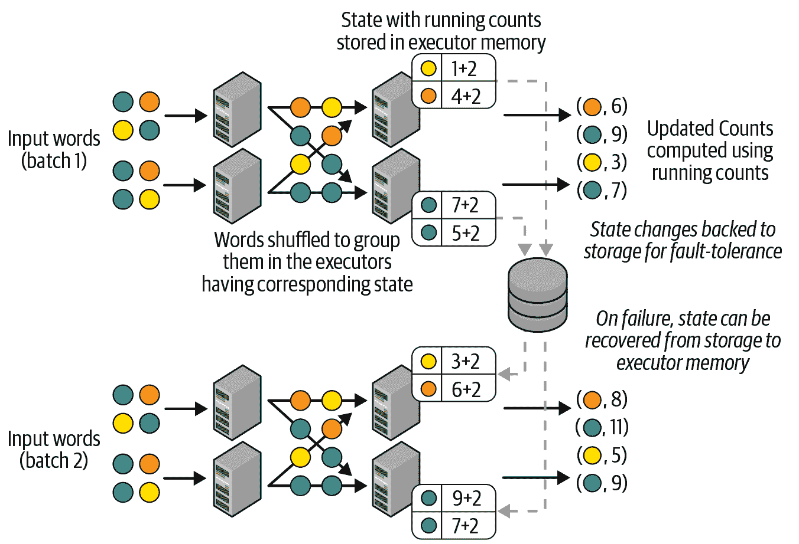

###### 图 8-6\. 结构化流式处理中的分布式状态管理

每个微批次读取一组新的单词，将它们在执行者内部进行分组以计算每个微批次中的计数，最后将它们添加到运行计数中以生成新的计数。这些新计数既是输出也是下一个微批次的状态，并因此缓存在执行者的内存中。下一个数据微批次在执行者之间的分组方式与之前完全相同，因此每个单词始终由相同的执行者处理，可以在本地读取和更新其运行计数。

然而，仅仅将这些状态保存在内存中是不够的，因为任何失败（无论是执行者的失败还是整个应用程序的失败）都会导致内存中的状态丢失。为了避免丢失，我们将键/值状态更新同步保存为用户提供的检查点位置中的变更日志。这些更改与每个批次处理的偏移范围共同版本化，通过读取检查点日志可以自动重建所需版本的状态。在任何故障情况下，结构化流处理能够通过重新处理相同的输入数据以及之前微批次中的相同状态来重新执行失败的微批次，从而生成与没有失败时相同的输出数据。这对于确保端到端的精确一次性保证至关重要。

总结一下，对于所有有状态操作，结构化流处理通过在分布式方式下自动保存和恢复状态来确保操作的正确性。根据有状态操作的不同，您可能只需调整状态清理策略，以便可以自动从缓存状态中丢弃旧键和值。接下来我们将讨论这一点。

### 有状态操作类型

流式状态的核心是保留过去数据的摘要。有时需要清理状态中的旧摘要，以为新摘要腾出空间。根据操作方式的不同，我们可以区分两种类型的有状态操作：

托管的有状态操作

这些操作根据特定于操作的“旧”定义自动识别和清理旧状态。您可以调整“旧”定义以控制资源使用情况（例如，用于存储状态的执行器内存）。属于此类别的操作包括：

+   流式聚合

+   流-流连接

+   流式去重

非托管的有状态操作

这些操作允许您定义自己的自定义状态清理逻辑。本类别中的操作包括：

+   `MapGroupsWithState`

+   `FlatMapGroupsWithState`

这些操作允许您定义任意的有状态操作（如会话化等）。

以下各操作在以下各节中详细讨论。

# 有状态流聚合

结构化流处理可以逐步执行大多数 DataFrame 聚合操作。您可以按键（例如，流式词频统计）和/或时间（例如，每小时接收到的记录计数）聚合数据。在本节中，我们将讨论调整这些不同类型流式聚合的语义和操作细节。我们还将简要讨论一些不支持流式操作的聚合类型。让我们从不涉及时间的聚合开始。

## 不基于时间的聚合

不涉及时间的聚合可以大致分为两类：

全局聚合

跨流中所有数据的聚合。例如，假设您有一个名为 `sensorReadings` 的流式 DataFrame，表示传感器读数流。您可以使用以下查询计算接收到的读数总数的运行计数：

```
# In Python
runningCount = sensorReadings.groupBy().count()
```

```
// In Scala
val runningCount = sensorReadings.groupBy().count()
```

###### 注意

您不能在流式 DataFrame 上直接使用聚合操作，例如 `DataFrame.count()` 和 `Dataset.reduce()`。这是因为对于静态 DataFrame，这些操作会立即返回最终计算的聚合结果，而对于流式 DataFrame，聚合结果必须持续更新。因此，您必须始终使用 `DataFrame.groupBy()` 或 `Dataset.groupByKey()` 进行流式 DataFrame 的聚合。

分组聚合

在数据流中的每个组或键中进行聚合。例如，如果 `sensorReadings` 包含来自多个传感器的数据，则可以计算每个传感器的运行平均读数（例如，为每个传感器设置基准值），如下所示：

```
# In Python 
baselineValues = sensorReadings.groupBy("sensorId").mean("value")
```

```
// In Scala
val baselineValues = sensorReadings.groupBy("sensorId").mean("value")
```

除计数和平均值之外，流式 DataFrame 还支持以下类型的聚合（类似于批处理 DataFrame）：

所有内置的聚合函数

`sum()`, `mean()`, `stddev()`, `countDistinct()`, `collect_set()`, `approx_count_distinct()` 等。更多详细信息请参阅 API 文档（[Python](https://oreil.ly/olWT0) 和 [Scala](https://oreil.ly/gvoeK)）。

一起计算多个聚合

您可以将多个聚合函数应用于以下方式一起计算：

```
# In Python
from pyspark.sql.functions import *
multipleAggs = (sensorReadings
  .groupBy("sensorId")
  .agg(count("*"), mean("value").alias("baselineValue"), 
    collect_set("errorCode").alias("allErrorCodes")))
```

```
// In Scala
import org.apache.spark.sql.functions.*
val multipleAggs = sensorReadings
  .groupBy("sensorId")
  .agg(count("*"), mean("value").alias("baselineValue"),
    collect_set("errorCode").alias("allErrorCodes"))
```

用户定义的聚合函数

支持所有用户定义的聚合函数。有关无类型和有类型用户定义聚合函数的更多详细信息，请参阅 [Spark SQL 编程指南](https://oreil.ly/8nvJ2)。

关于执行此类流式聚合，我们已经在前面的章节中说明了如何将运行聚合保持为分布式状态。除此之外，还有两个非常重要的注意事项适用于非时间依赖的聚合：用于此类查询的输出模式和通过状态规划资源使用。这些将在本节末尾讨论。接下来，我们将讨论在时间窗口内组合数据的聚合。

## 事件时间窗口内的聚合

在许多情况下，不是对整个流执行聚合，而是希望对按时间窗口分桶的数据执行聚合。继续使用传感器示例，假设每个传感器每分钟最多发送一次读数，并且我们希望检测任何传感器报告异常高次数。为了找到这样的异常，我们可以计算每个传感器在五分钟间隔内接收到的读数数量。此外，为了保证稳健性，应基于数据在传感器生成时生成的时间间隔计算时间间隔，而不是基于接收数据时的时间，因为任何传输延迟都会使结果偏斜。换句话说，我们要使用*事件时间*——即记录中的时间戳，表示生成读数的时间。假设 `sensorReadings` DataFrame 具有命名为 `eventTime` 的生成时间戳列。我们可以将这个五分钟计数表示如下：

```
# In Python
from pyspark.sql.functions import *
(sensorReadings
  .groupBy("sensorId", window("eventTime", "5 minute"))
  .count())
```

```
// In Scala
import org.apache.spark.sql.functions.*
sensorReadings
  .groupBy("sensorId", window("eventTime", "5 minute"))
  .count()
```

这里需要注意的关键是 `window()` 函数，它允许我们将五分钟窗口表达为动态计算的分组列。启动时，此查询将为每个传感器读数执行以下操作：

+   使用 `eventTime` 值计算传感器读数所在的五分钟时间窗口。

+   基于组合组 `(*<computed window>*, SensorId)` 对读数进行分组。

+   更新组合组的计数。

让我们通过一个示例来理解这个过程。图 8-7 展示了如何将一些传感器读数映射到基于事件时间的五分钟滚动（即非重叠）窗口组。两个时间线展示了每个接收事件将被结构化流处理的时间，以及事件数据中的时间戳（通常是传感器生成事件时的时间）。

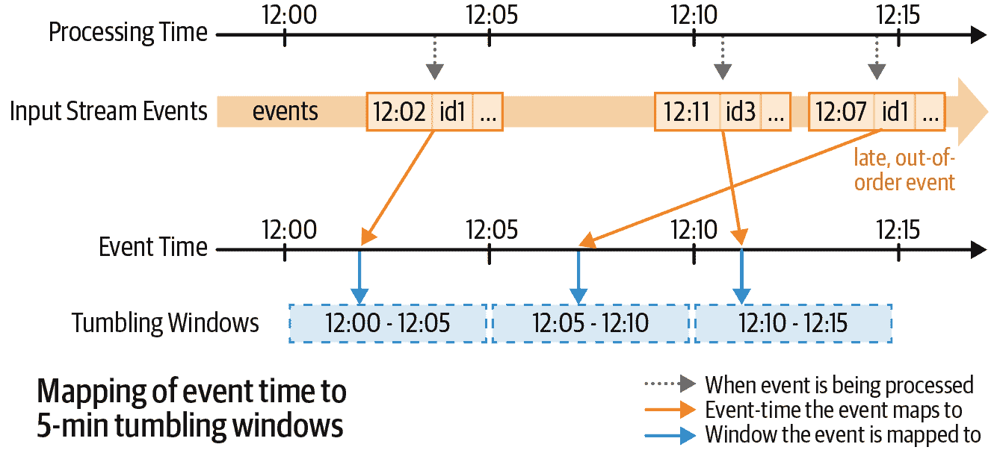

###### 图 8-7\. 事件时间映射到滚动窗口

基于事件时间，每个五分钟窗口都用于基于组的计数。请注意，事件可能会以晚到或乱序的方式到达。如图所示，事件时间为 12:07 的事件在事件时间为 12:11 的事件之后接收和处理。然而，无论它们何时到达，每个事件都会根据其事件时间分配到适当的组中。实际上，根据窗口规范，每个事件可能会分配到多个组。例如，如果要计算每隔 5 分钟滑动的 10 分钟窗口对应的计数，则可以执行以下操作：

```
# In Python
(sensorReadings
  .groupBy("sensorId", window("eventTime", "10 minute", "5 minute"))
  .count())
```

```
// In Scala
sensorReadings
  .groupBy("sensorId", window("eventTime", "10 minute", "5 minute"))
  .count()
```

在此查询中，每个事件都将被分配到两个重叠的窗口，如图 8-8 所示。

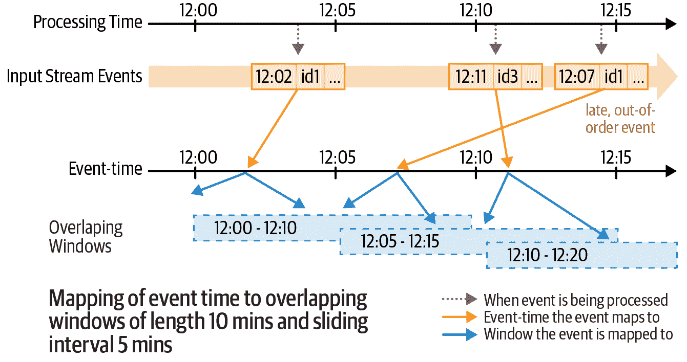

###### 图 8-8\. 事件时间映射到多个重叠窗口

每个唯一的元组`(*<分配的时间窗口>*, sensorId)`被视为动态生成的组，将对其进行计数。例如，事件`[eventTime = 12:07, sensorId = id1]`映射到两个时间窗口，因此生成两个组，`(12:00-12:10, id1)`和`(12:05-12:15, id1)`。这两个窗口的计数分别增加了 1\. 图 8-9 对之前展示的事件进行了说明。

假设输入记录以五分钟的触发间隔进行处理，底部的表在图 8-9 显示了结果表（即计数）在每个微批处理时的状态。随着事件时间的推移，新的组会自动创建并且它们的聚合会自动更新。晚到和乱序的事件会被自动处理，因为它们只是更新旧的组。

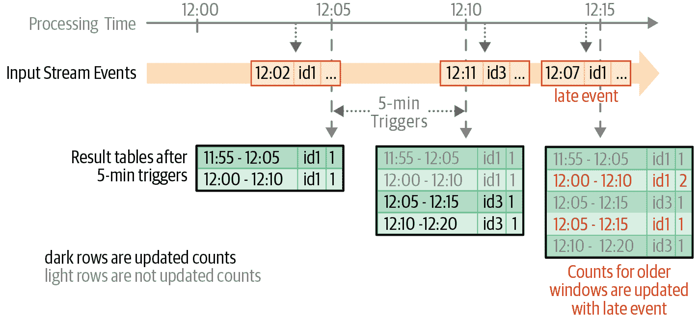

###### 图 8-9\. 每隔五分钟触发后结果表中的更新计数

然而，从资源使用的角度来看，这带来了另一个问题——状态大小无限增长。随着创建新组对应于最新时间窗口，旧组继续占用状态内存，等待任何延迟数据更新它们。即使在实践中，输入数据的延迟可能有一个界限（例如，数据不能迟于七天），但查询不知道这些信息。因此，它不知道何时将窗口视为“太旧以接收更新”并将其从状态中删除。为了向查询提供延迟边界（并防止无界状态），您可以指定*水印*，接下来我们将讨论它。

### 处理延迟数据与水印

*水印*定义为事件时间中的移动阈值，落后于查询在处理数据中观察到的最大事件时间。这种落后的间隙被称为*水印延迟*，它定义了引擎等待延迟数据到达的时间。通过了解对于给定组不会再有更多数据到达的时间点，引擎可以自动完成某些组的聚合并将其从状态中删除。这限制了引擎必须维护的状态总量，以计算查询结果。

例如，假设您知道您的传感器数据不会迟到超过 10 分钟。那么，您可以设置水印如下：

```
# In Python
(sensorReadings
  .withWatermark("eventTime", "10 minutes")
  .groupBy("sensorId", window("eventTime", "10 minutes", "5 minutes"))
  .mean("value"))
```

```
// In Scala
sensorReadings
  .withWatermark("eventTime", "10 minutes")
  .groupBy("sensorId", window("eventTime", "10 minutes", "5 minute"))
  .mean("value")
```

请注意，在`groupBy()`之前必须调用`withWatermark()`，并且在与用于定义窗口的时间戳列相同的时间戳列上。当执行此查询时，结构化流将持续跟踪`eventTime`列的观察到的最大值，并相应更新水印，过滤“太迟”的数据，并清除旧状态。也就是说，任何迟到超过 10 分钟的数据都将被忽略，并且所有比最新（按事件时间）输入数据早 10 分钟以上的时间窗口将从状态中清除。为了澄清此查询的执行方式，请考虑图 8-10 中显示的时间线，显示了如何处理输入记录的选择。

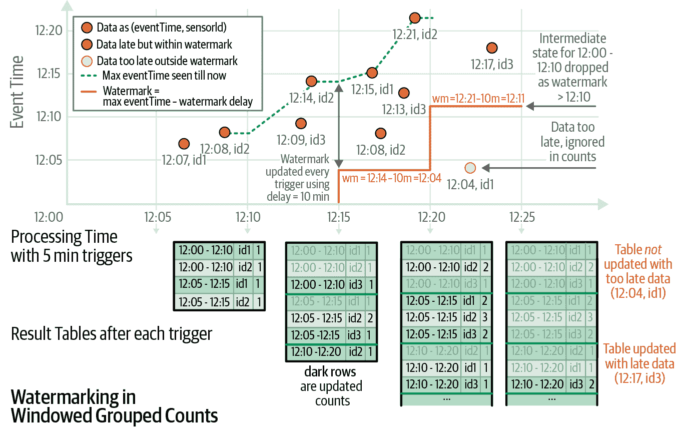

###### 图 8-10\. 展示引擎如何跟踪事件的最大时间戳，更新水印，并相应处理延迟数据

此图显示了记录按其处理时间（x 轴）和事件时间（y 轴）处理的二维图。记录以五分钟的微批次处理，并标记为圆圈。底部的表显示了每个微批次完成后结果表的状态。

每条记录在所有左侧记录接收并处理后收到。考虑两条记录 `[12:15, id1]`（大约在 12:17 处理）和 `[12:13, id3]`（大约在 12:18 处理）。记录 `id3` 因为在传感器生成 `id1` 记录之前生成，但在后者之后处理，因此被认为是迟到的（并因此标记为红色实线）。然而，在处理时间范围为 12:15–12:20 的微批次中，水印使用的是 12:04，该时间基于前一微批次中看到的最大事件时间（即 12:14 减去 10 分钟水印延迟）。因此，迟到的记录 `[12:13, id3]` 不被认为太迟并成功计数。相反，在下一个微批次中，记录 `[12:04, id1]` 因与新水印 12:11 比较被认为太迟，并被丢弃。

您可以根据应用程序的要求设置水印延迟——此参数的较大值允许数据稍晚到达，但代价是增加状态大小（即内存使用），反之亦然。

#### 水印的语义保证

在我们结束关于水印的本节之前，让我们考虑水印提供的精确语义保证。10 分钟的水印保证引擎 *永远不会丢弃* 与输入数据中的最新事件时间相比延迟不到 10 分钟的任何数据。然而，该保证仅在一个方向上严格。延迟超过 10 分钟的数据不保证会被丢弃——也就是说，它可能会被聚合。输入记录是否会聚合取决于记录接收和触发处理它的微批次的确切时间。

### 支持的输出模式

与不涉及时间的流聚合不同，使用时间窗口的聚合可以使用所有三种输出模式。然而，根据模式，您需要注意与状态清理相关的其他影响：

更新模式

在此模式下，每个微批次仅输出聚合得到更新的行。此模式可用于所有类型的聚合。特别是对于时间窗口聚合，水印将确保状态定期清理。这是运行带有流聚合查询的最有用和高效的模式。然而，您不能使用此模式将聚合写入仅附加流目标，如任何基于文件的格式，如 Parquet 和 ORC（除非您使用 Delta Lake，我们将在下一章中讨论）。

完全模式

在此模式下，每个微批次都会输出所有更新的聚合结果，无论它们的年龄或是否包含更改。虽然这种模式可用于所有类型的聚合，但对于时间窗口聚合来说，使用完整模式意味着即使指定了水印，状态也不会被清除。输出所有聚合需要所有过去的状态，因此即使已定义水印，聚合数据也必须保留。在使用时间窗口聚合时要谨慎使用此模式，因为这可能导致状态大小和内存使用无限增加。

追加模式

*此模式仅适用于事件时间窗口上的聚合，并且启用了水印*。请注意，追加模式不允许先前输出的结果更改。对于没有水印的聚合，每个聚合都可能随着未来数据的变化而更新，因此不能在追加模式下输出。只有在事件时间窗口上启用了水印时，查询才知道聚合不会再次更新。因此，追加模式仅在水印确保聚合不会再次更新时输出每个键及其最终聚合值。此模式的优势在于允许你将聚合结果写入追加模式的流数据接收器（例如文件）。缺点是输出会延迟水印持续时间——查询必须等待尾随水印超过键的时间窗口，然后才能完成聚合输出。

# 流连接

结构化流支持将流数据集与另一个静态或流数据集进行连接。在本节中，我们将探讨支持的不同类型的连接（内连接、外连接等），以及如何使用水印来限制用于有状态连接的存储。我们将从连接数据流和静态数据集的简单情况开始。

## 流-静态连接

许多使用情况需要将数据流与静态数据集连接。例如，让我们考虑广告变现的情况。假设你是一家在网站上展示广告并且当用户点击时赚钱的广告公司。假设你有一个静态数据集，其中包含所有要展示的广告（称为展示次数），以及另一个流事件流，记录用户每次点击展示的广告。为了计算点击收入，你需要将事件流中的每次点击与表中对应的广告展示次数进行匹配。首先，我们将数据表示为两个 DataFrame，一个是静态的，一个是流式的，如下所示：

```
# In Python
# Static DataFrame [adId: String, impressionTime: Timestamp, ...]
# reading from your static data source 
impressionsStatic = spark.read. ... 

# Streaming DataFrame [adId: String, clickTime: Timestamp, ...] 
# reading from your streaming source
clicksStream = spark.readStream. ...
```

```
// In Scala
// Static DataFrame [adId: String, impressionTime: Timestamp, ...]
// reading from your static data source 
val impressionsStatic = spark.read. ...

// Streaming DataFrame [adId: String, clickTime: Timestamp, ...]
// reading from your streaming source 
val clicksStream = spark.readStream. ...
```

要将点击与广告展示次数进行匹配，可以简单地使用它们之间共同的`adId`列进行内连接等值连接：

```
# In Python
matched = clicksStream.join(impressionsStatic, "adId")
```

```
// In Scala
val matched = clicksStream.join(impressionsStatic, "adId")
```

这与如果印象和点击都是静态数据框架所写的代码相同 - 唯一的区别是您用于批处理的`spark.read()`和用于流的`spark.readStream()`。 执行此代码时，每个点击的微批次都会与静态印象表进行内连接，以生成匹配事件的输出流。

除了内连接外，结构化流还支持两种流 - 静态外连接：

+   在左侧是流数据框架时的左外连接

+   在右侧是流数据框架时的右外连接

不支持其他类型的外连接（例如，在右侧是流数据框架的完全外连接和左外连接），因为它们不容易进行增量运行。 在这两种支持的情况下，代码与在两个静态数据框架之间进行左/右外连接时完全相同：

```
# In Python
matched = clicksStream.join(impressionsStatic, "adId", "leftOuter")
```

```
// In Scala
val matched = clicksStream.join(impressionsStatic, Seq("adId"), "leftOuter")
```

关于流-静态连接，有几个关键点需要注意：

+   流-静态连接是无状态操作，因此不需要任何水印。

+   静态数据框架在与每个微批次的流数据进行连接时被重复读取，因此可以缓存静态数据框架以加快读取速度。

+   如果在定义静态数据框架的数据源中的底层数据发生更改，则流查询是否看到这些更改取决于数据源的具体行为。 例如，如果静态数据框架是在文件上定义的，则对这些文件的更改（例如，附加）将在重新启动流查询之前不会被检测到。

在这个流-静态示例中，我们做了一个重要的假设：印象表是一个静态表。 实际上，随着新广告的显示，将生成新的印象流。 虽然流-静态连接适用于在一个流中使用额外的静态（或缓慢变化）信息来丰富数据，但当数据源都在快速变化时，这种方法是不足够的。 为此，您需要流-流连接，我们将在下面讨论。

## 流-流连接

在两个数据流之间生成连接的挑战在于，在任何时间点，任一数据集的视图都是不完整的，这使得在输入之间查找匹配事件变得更加困难。 两个流的匹配事件可能以任何顺序到达，并可能被任意延迟。 例如，在我们的广告使用案例中，可能会以任意顺序到达印象事件及其对应的点击事件，并可能存在任意延迟。 结构化流通过缓冲来自两侧的输入数据作为流状态，并在接收到新数据时持续检查匹配来解决这些延迟。 图 8-11 中概述了概念想法。

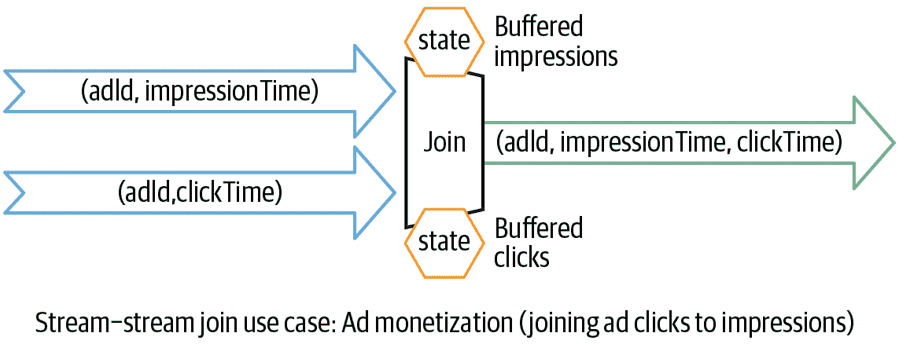

###### 图 8-11。 使用流-流连接进行广告货币化

让我们更详细地考虑这一点，首先是内连接，然后是外连接。

### 带有可选水印的内连接

假设我们已重新定义我们的`impressions` DataFrame 为流 DataFrame。为了获取匹配的展示和它们对应的点击的流，我们可以使用我们之前用于静态连接和流-静态连接的相同代码：

```
# In Python
# Streaming DataFrame [adId: String, impressionTime: Timestamp, ...]
impressions = spark.readStream. ... 

# Streaming DataFrame[adId: String, clickTime: Timestamp, ...]
clicks = spark.readStream. ...
matched = impressions.join(clicks, "adId")
```

```
// In Scala
// Streaming DataFrame [adId: String, impressionTime: Timestamp, ...] 
val impressions = spark.readStream. ...

// Streaming DataFrame[adId: String, clickTime: Timestamp, ...] 
val clicks = spark.readStream. ...
val matched = impressions.join(clicks, "adId")
```

尽管代码相同，执行方式完全不同。当执行此查询时，处理引擎将识别它为流-流连接而不是流-静态连接。引擎将所有点击和展示作为状态进行缓冲，并在接收到的点击与缓冲的展示（或相反，取决于哪个先收到）匹配时生成匹配的展示和点击。让我们通过示例事件时间轴图 图 8-12 来可视化这个内连接是如何工作的。

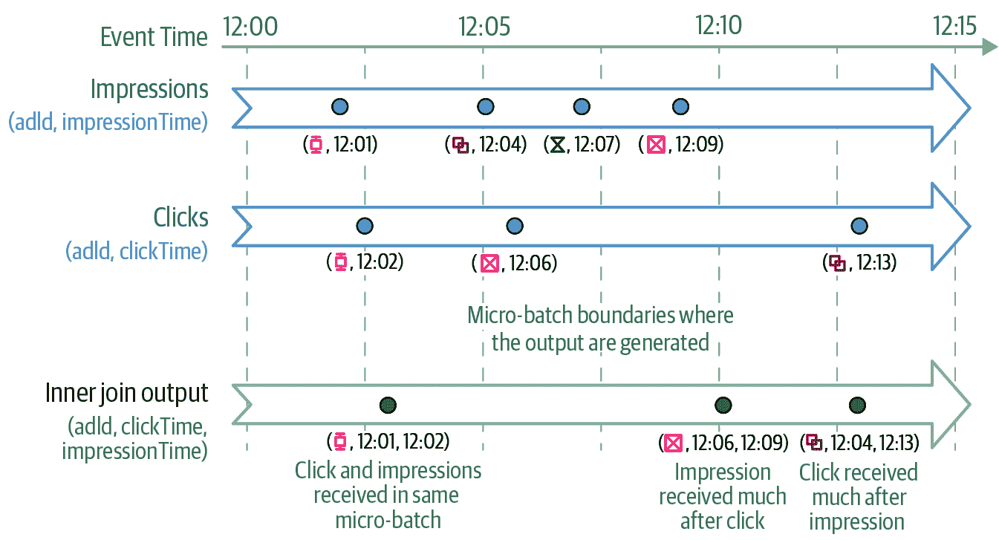

###### 图 8-12\. 点击、展示和它们的连接输出的示意时间轴

在图 8-12 中，蓝色点表示在不同微批次（用虚线灰色线分隔）中接收到的展示和点击事件的事件时间。为了本示例，假设每个事件实际上在相同的挂钟时间收到。注意相关事件被连接的不同场景。`adId` = **⧮** 的两个事件在同一微批次中接收，因此它们的连接输出由该微批次生成。然而，对于`adId` = **⧉**，展示事件在 12:04 收到，比其对应的点击事件 12:13 要早得多。结构化流处理将首先在 12:04 收到展示并将其缓冲在状态中。对于每个收到的点击，引擎将尝试将其与所有已缓冲的展示事件（反之亦然）进行连接。最终，在稍后大约 12:13 左右运行的微批次中，引擎收到`adId` = **⧉** 的点击事件并生成了连接的输出。

然而，在这个查询中，我们没有给出引擎缓冲事件以找到匹配的时间长度的任何指示。因此，引擎可能会无限期地缓冲事件，并积累无界限的流状态。为了限制流-流连接维护的流状态，您需要了解关于您的用例的以下信息：

+   *两个事件在它们各自源生成之间的最大时间范围是多少？* 在我们的用例背景下，假设一个点击可以在相应展示之后的零秒到一小时内发生。

+   *事件在源和处理引擎之间最长可以延迟多久？* 例如，来自浏览器的广告点击可能由于间歇性连接问题而延迟到达，并且顺序可能错乱。假设展示和点击最多可以分别延迟两个小时和三个小时到达。

这些延迟限制和事件时间约束可以通过数据框操作使用水印和时间范围条件进行编码。换句话说，您将需要在连接中执行以下附加步骤，以确保状态清理：

1.  在两个输入上定义水印延迟，使引擎知道输入可以延迟多久（类似于流聚合）。

1.  在两个输入之间定义事件时间约束，以便引擎可以确定不需要旧行数据（即不满足时间约束的数据）与另一个输入匹配。可以通过以下一种方式定义此约束：

    1.  时间范围连接条件（例如，连接条件 = `"leftTime BETWEEN rightTime AND rightTime + INTERVAL 1 HOUR"`）

    1.  在事件时间窗口上进行连接（例如，连接条件 = `"leftTimeWindow = rightTimeWindow"`）

在我们的广告使用案例中，我们的内连接代码会变得稍微复杂一些：

```
# In Python
# Define watermarks
impressionsWithWatermark = (impressions
  .selectExpr("adId AS impressionAdId", "impressionTime")
  .withWatermark("impressionTime", "2 hours"))

clicksWithWatermark = (clicks
  .selectExpr("adId AS clickAdId", "clickTime")
  .withWatermark("clickTime", "3 hours"))

# Inner join with time range conditions
(impressionsWithWatermark.join(clicksWithWatermark,
  expr(""" 
 clickAdId = impressionAdId AND 
 clickTime BETWEEN impressionTime AND impressionTime + interval 1 hour""")))
```

```
// In Scala
// Define watermarks
val impressionsWithWatermark = impressions
  .selectExpr("adId AS impressionAdId", "impressionTime")
  .withWatermark("impressionTime", "2 hours ")

val clicksWithWatermark = clicks
  .selectExpr("adId AS clickAdId", "clickTime")
  .withWatermark("clickTime", "3 hours")

// Inner join with time range conditions
impressionsWithWatermark.join(clicksWithWatermark,
  expr(""" 
 clickAdId = impressionAdId AND 
 clickTime BETWEEN impressionTime AND impressionTime + interval 1 hour"""))
```

有了每个事件的时间约束，处理引擎可以自动计算事件需要缓冲多长时间以生成正确的结果，并确定何时可以从状态中删除事件。例如，它将评估以下内容（如图 8-13 中所示）

+   展示需要最多缓冲四个小时（按事件时间计算），因为三小时延迟的点击事件可能与四小时前的展示匹配（即三小时延迟 + 展示和点击事件之间最多一小时的延迟）。

+   相反，点击事件需要最多缓冲两个小时（按事件时间计算），因为两小时延迟的展示可能与两小时前收到的点击事件匹配。

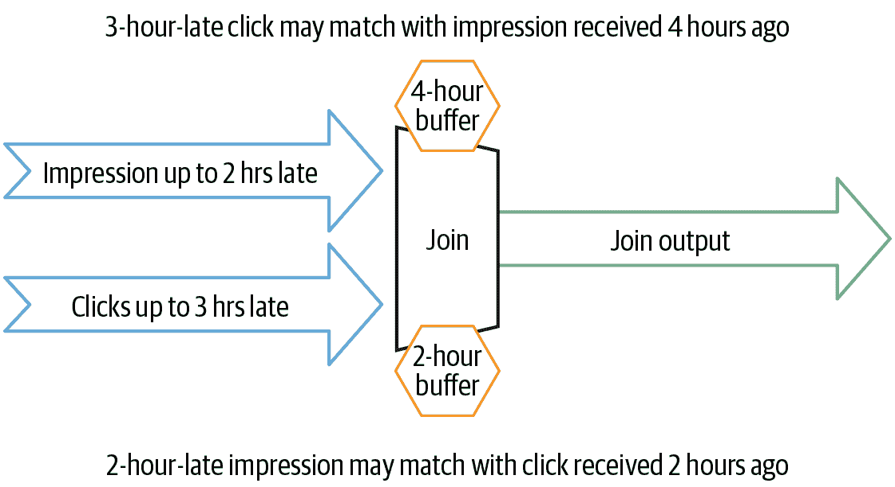

###### 图 8-13。结构化流处理会使用水印延迟和时间范围条件自动计算状态清理的阈值

关于内连接有几个关键点需要记住：

+   对于内连接，指定水印和事件时间约束都是可选的。换句话说，在可能存在无界状态的风险下，您可以选择不指定它们。只有当两者都指定时，才会进行状态清理。

+   类似于水印在聚合中提供的保证，两小时的水印延迟保证引擎不会丢弃或不匹配少于两小时延迟的任何数据，但延迟超过两小时的数据可能会被处理或不会被处理。

### 使用水印的外连接

先前的内连接只会输出那些已收到两个事件的广告。换句话说，未收到任何点击的广告将不被报告。相反，您可能希望报告所有广告展示，无论是否有相关点击数据，以便稍后进行额外分析（例如点击率）。这带我们来到 *流-流外连接*。要实现这一点，您只需指定外连接类型：

```
# In Python
# Left outer join with time range conditions
(impressionsWithWatermark.join(clicksWithWatermark,
  expr(""" 
 clickAdId = impressionAdId AND 
 clickTime BETWEEN impressionTime AND impressionTime + interval 1 hour"""),
  "leftOuter"))  # only change: set the outer join type
```

```
// In Scala
// Left outer join with time range conditions
impressionsWithWatermark.join(clicksWithWatermark,
  expr(""" 
 clickAdId = impressionAdId AND 
 clickTime BETWEEN impressionTime AND impressionTime + interval 1 hour"""),
  "leftOuter")  // Only change: set the outer join type
```

如外连接所预期的那样，此查询将开始为每个展示生成输出，无论是否有（即使用`NULL`）点击数据。然而，关于外连接还有一些额外的要点需要注意：

+   与内连接不同，外连接不可选的水印延迟和事件时间约束。这是因为为了生成`NULL`结果，引擎必须知道事件何时不会与将来的任何其他事件匹配。为了获得正确的外连接结果和状态清理，必须指定水印和事件时间约束。

+   因此，外部`NULL`结果将会有延迟生成，因为引擎必须等待一段时间以确保没有任何匹配。这个延迟是引擎为每个事件计算的最大缓冲时间（关于事件时间）如前一节所讨论的（即展示四小时，点击两小时）。

# 任意有状态的计算

许多用例需要比我们目前讨论的 SQL 操作更复杂的逻辑。例如，假设您想通过实时跟踪用户的活动（例如点击）来跟踪用户的状态（例如登录、忙碌、空闲）。为了构建这个流处理管道，您将必须跟踪每个用户的活动历史作为带有任意数据结构的状态，并基于用户的操作在数据结构上连续应用任意复杂的更改。`mapGroupsWithState()` 操作及其更灵活的对应变体 `flatMapGroupsWithState()` 专为这种复杂的分析用例设计。

###### 注意

截至 Spark 3.0，在 Scala 和 Java 中才能使用这两种操作。

在本节中，我们将从一个简单的示例开始，使用`mapGroupsWithState()`来说明建模自定义状态数据和定义自定义操作的四个关键步骤。然后我们将讨论超时的概念及如何使用它们来清除长时间未更新的状态。最后我们将介绍`flatMapGroupsWithState()`，它能给予你更多的灵活性。

## 使用`mapGroupsWithState()`建模任意有状态的操作

具有任意模式和任意状态转换的状态被建模为一个用户定义函数，该函数将先前版本的状态值和新数据作为输入，并生成更新后的状态和计算结果作为输出。在 Scala 中编程时，您需要定义以下签名的函数（`K`、`V`、`S` 和 `U` 是稍后将要解释的数据类型）：

```
// In Scala
def arbitraryStateUpdateFunction(
    key: K, 
    newDataForKey: Iterator[V], 
    previousStateForKey: GroupState[S]
): U
```

这个函数通过 `groupByKey()` 和 `mapGroupsWithState()` 操作提供给流式查询，如下所示：

```
// In Scala
val inputDataset: Dataset[V] =  // input streaming Dataset

inputDataset
  .groupByKey(keyFunction)   // keyFunction() generates key from input
  .mapGroupsWithState(arbitraryStateUpdateFunction)
```

当启动这个流式查询时，Spark 将在每个微批次中的数据中为每个唯一键调用 `arbitraryStateUpdateFunction()`。让我们更详细地看看参数是什么以及 Spark 将使用哪些参数值调用函数：

`key: K`

`K` 是状态和输入中定义的公共键的数据类型。Spark 将为数据中的每个唯一键调用此函数。

`newDataForKey: Iterator[V]`

`V` 是输入数据集的数据类型。当 Spark 调用此函数来处理一个键时，这个参数将包含对应于该键的所有新输入数据。注意，迭代器中输入数据对象的顺序是不确定的。

`previousStateForKey: GroupState[S]`

`S` 是您要维护的任意状态的数据类型，而 `GroupState[S]` 是一个类型化的包装对象，提供访问和管理状态值的方法。当 Spark 为一个键调用此函数时，这个对象将提供先前微批次中 Spark 上次为该键调用此函数时设置的状态值。

`U`

`U` 是函数输出的数据类型。

###### 注意

还有一些额外的参数需要提供。所有类型（`K`、`V`、`S`、`U`）必须能够由 Spark SQL 的编码器进行编码。因此，在 `mapGroupsWithState()` 中，您必须在 Scala 中隐式提供或在 Java 中显式提供 `S` 和 `U` 的类型化编码器。有关更多详细信息，请参阅 “Dataset Encoders” 第六章 Chapter 6。

让我们通过一个例子来看看如何以这种格式表达所需的状态更新函数。假设我们想根据用户的操作理解他们的行为。从概念上讲，这很简单：在每个微批次中，对于每个活跃用户，我们将使用用户执行的新操作并更新用户的“状态”。在程序上，我们可以定义以下步骤的状态更新函数：

1.  定义数据类型。我们需要定义 `K`、`V`、`S` 和 `U` 的确切类型。在这种情况下，我们将使用以下内容：

    1.  输入数据 (`V`) = `case class UserAction(userId: String, action: String)`

    1.  键 (`K`) = `String`（即 `userId`）

    1.  状态 (`S`) = `case class UserStatus(userId: String, active: Boolean)`

    1.  输出 (`U`) = `UserStatus`，因为我们希望输出最新的用户状态。

        注意，所有这些数据类型都受编码器支持。

1.  定义函数。基于所选类型，让我们将概念理念翻译成代码。当此函数与新用户行动一起调用时，我们需要处理两种主要情况：是否存在该键（即 `userId`）的先前状态（即先前用户状态）。因此，我们将初始化用户状态，或者使用新行动更新现有状态。我们将明确使用新的运行计数更新状态，并最终返回更新的 `userId`-`userStatus` 对：

    ```
    // In Scala
    import org.apache.spark.sql.streaming._

     def updateUserStatus(
        userId: String, 
        newActions: Iterator[UserAction],
        state: GroupState[UserStatus]): UserStatus = {

      val userStatus = state.getOption.getOrElse {
        new UserStatus(userId, false)
      }
      newActions.foreach { action => 
        userStatus.updateWith(action) 
      }
      state.update(userStatus) 
      return userStatus
    }
    ```

1.  对行动应用函数。我们将使用 `groupByKey()` 对输入的行动数据集进行分组，然后使用 `mapGroupsWithState()` 应用 `updateUserStatus` 函数：

    ```
    // In Scala
    val userActions: Dataset[UserAction] = ...
    val latestStatuses = userActions
      .groupByKey(userAction => userAction.userId) 
      .mapGroupsWithState(updateUserStatus _)
    ```

一旦我们启动带有控制台输出的流式查询，我们将看到打印出更新的用户状态。

在我们进入更高级话题之前，有几个值得注意的点要记住：

+   当调用函数时，新数据迭代器（例如 `newActions`）中的输入记录没有明确定义的顺序。如果需要按特定顺序（例如按操作执行的顺序）更新状态，则必须显式重新排序它们（例如基于事件时间戳或某种其他排序 ID）。实际上，如果存在从源读取的操作可能无序的情况，则必须考虑未来微批处理可能接收到应在当前批处理数据之前处理的数据的可能性。在这种情况下，必须将记录作为状态的一部分进行缓冲。

+   在微批处理中，如果微批处理为特定键提供了数据，则仅对该键调用函数一次。例如，如果用户变得不活跃并且长时间没有提供新的行动，那么默认情况下函数将长时间不被调用。如果你想根据用户在长时间内的不活动来更新或移除状态，那么你必须使用超时，我们将在下一节讨论这一点。

+   `mapGroupsWithState()` 的输出被增量处理引擎假定为持续更新的键/值记录，类似于聚合的输出。这限制了在 `mapGroupsWithState()` 之后查询支持的操作以及支持的输出目的地。例如，不支持将输出追加到文件中。如果你希望以更大的灵活性应用任意有状态的操作，那么你必须使用 `flatMapGroupsWithState()`。我们将在超时后讨论这一点。

## 使用超时来管理非活动组

在跟踪活跃用户会话的上述示例中，随着更多用户变得活跃，状态中的键的数量将不断增加，状态使用的内存也会增加。然而，在实际情况中，用户可能不会一直保持活跃状态。保持不活动用户状态可能并不是非常有用，因为在这些用户再次变得活跃之前，状态不会再次改变。因此，我们可能希望明确地删除所有不活跃用户的信息。但是，用户可能不会明确采取任何行动来变得不活跃（例如，明确注销），我们可能需要定义不活动为一段时间没有任何操作。这在函数中编码变得棘手，因为在没有来自用户的新动作之前，函数不会为用户调用。

为了编码基于时间的不活动，`mapGroupsWithState()`支持以下定义的超时：

+   每次在键上调用函数时，可以根据持续时间或阈值时间戳设置超时。

+   如果某个键没有接收到任何数据，使得超时条件得到满足，该键将被标记为“超时”。下一个微批次将即使对于该键没有新数据，也会调用该键上的函数。在这个特殊的函数调用中，新的输入数据迭代器将为空（因为没有新数据），并且`GroupState.hasTimedOut()`将返回`true`。这是函数内部最佳的识别调用原因是由于新数据还是超时的方式。

有两种类型的超时，基于我们的两种时间概念：处理时间和事件时间。处理时间超时是其中更简单的一种，因此我们将从这里开始。

### 处理时间超时

处理时间超时基于运行流查询的机器的系统时间（也称为挂钟时间），定义如下：如果一个键在系统时间戳`T`时最后接收到数据，而当前时间戳超过`(T + *<超时时长>*)`，则函数将再次被调用，但是使用一个新的空数据迭代器。

让我们通过更新我们的用户示例来调查如何使用超时，以便根据一小时的不活动时间删除用户的状态。我们将进行三处更改：

+   在`mapGroupsWithState()`中，我们将超时指定为`GroupStateTimeout.ProcessingTimeTimeout`。

+   在状态更新函数中，在使用新数据更新状态之前，我们必须检查状态是否已经超时。相应地，我们将更新或删除状态。

+   另外，每次使用新数据更新状态时，我们将设置超时时长。

以下是更新后的代码：

```
// In Scala
def updateUserStatus(
    userId: String, 
    newActions: Iterator[UserAction],
    state: GroupState[UserStatus]): UserStatus = {

  if (!state.hasTimedOut) {       // Was not called due to timeout
    val userStatus = state.getOption.getOrElse {
      new UserStatus(userId, false)
    }
    newActions.foreach { action => userStatus.updateWith(action) }
    state.update(userStatus) 
    state.setTimeoutDuration("1 hour") // Set timeout duration
    return userStatus

  } else {
    val userStatus = state.get()
    state.remove()                  // Remove state when timed out
    return userStatus.asInactive()  // Return inactive user's status
  }
}

val latestStatuses = userActions
  .groupByKey(userAction => userAction.userId) 
  .mapGroupsWithState(
    GroupStateTimeout.ProcessingTimeTimeout)(
    updateUserStatus _)
```

这个查询会自动清理那些超过一个小时没有处理任何数据的用户的状态。但是，关于超时需要注意几点：

+   当再次调用函数时，最后一次调用函数设置的超时将自动取消，无论是为了新接收的数据还是为了超时。因此，每次调用函数时，都需要显式设置超时持续时间或时间戳以启用超时。

+   由于超时是在微批处理期间处理的，它们的执行时间是不精确的，并且严重依赖触发间隔和微批处理时间。因此，不建议使用超时来进行精确的时间控制。

+   虽然处理时间超时易于理解，但对于减速和停机不够健壮。如果流查询经历超过一小时的停机时间，那么重新启动后，状态中的所有键都将超时，因为每个键自接收数据以来已经过去了一小时以上。如果查询处理数据的速度比从源头到达的速度慢（例如，如果数据到达并在 Kafka 中缓冲），则可能发生类似的大规模超时。例如，如果超时为五分钟，那么处理速率突然下降（或数据到达速率激增），导致五分钟延迟，可能会产生偶发超时。为了避免这种问题，我们可以使用事件时间超时，接下来将讨论。

### 事件时间超时

事件时间超时不是基于系统时钟时间，而是基于数据中的事件时间（类似于基于时间的聚合）和在事件时间上定义的水印。如果一个键配置了特定的超时时间戳`T`（即不是一个持续时间），那么如果自上次调用函数以来该键未接收到新数据，则当水印超过`T`时，该键将超时。请注意，水印是一个移动的阈值，在处理数据时会落后于所见的最大事件时间。因此，与系统时间不同，水印以数据处理的速度向前移动。这意味着（与处理时间超时不同）查询处理中的任何减速或停机都不会导致偶发超时。

让我们修改我们的示例以使用事件时间超时。除了我们已经为使用处理时间超时所做的更改外，我们还将进行以下更改：

+   在输入数据集上定义水印（假设类`UserAction`有一个`eventTimestamp`字段）。请注意，水印阈值表示输入数据可以延迟和无序的可接受时间量。

+   更新`mapGroupsWithState()`以使用`EventTimeTimeout`。

+   更新函数以设置将发生超时的阈值时间戳。请注意，事件时间超时不允许设置超时持续时间，如处理时间超时。稍后我们将讨论这一点的原因。在本例中，我们将计算此超时为当前水印加一小时。

这里是更新后的示例：

```
// In Scala
def updateUserStatus(
    userId: String, 
    newActions: Iterator[UserAction],
    state: GroupState[UserStatus]):UserStatus = {

  if (!state.hasTimedOut) {  // Was not called due to timeout
    val userStatus = if (state.getOption.getOrElse {
      new UserStatus()
    }
    newActions.foreach { action => userStatus.updateWith(action) }
    state.update(userStatus)

    // Set the timeout timestamp to the current watermark + 1 hour
    state.setTimeoutTimestamp(state.getCurrentWatermarkMs, "1 hour") 
    return userStatus
  } else {
    val userStatus = state.get()
    state.remove()
    return userStatus.asInactive() }
}

val latestStatuses = userActions
  .withWatermark("eventTimestamp", "10 minutes") 
  .groupByKey(userAction => userAction.userId) 
  .mapGroupsWithState(
    GroupStateTimeout.EventTimeTimeout)(
    updateUserStatus _)
```

这个查询将更加健壮，能够抵御由于重新启动和处理延迟引起的偶发超时。

关于事件时间超时，有几点需要注意：

+   与处理时间超时的前一个示例不同，我们使用了`GroupState.setTimeoutTimestamp()`而不是`GroupState.setTimeoutDuration()`。这是因为对于处理时间超时，持续时间足以计算未来精确的时间戳（即，当前系统时间 + 指定持续时间），超时会发生，但对于事件时间超时则不是这样。不同的应用可能希望使用不同的策略来计算阈值时间戳。在本例中，我们简单地基于当前水印计算它，但是不同的应用可能选择基于该键的最大事件时间戳来计算超时时间戳（作为状态的一部分进行跟踪和保存）。

+   超时时间戳必须设置为大于当前水印的值。这是因为超时预期会在时间戳穿过水印时发生，因此将时间戳设置为已经大于当前水印的值是不合逻辑的。

在我们讨论超时机制的更多创造性处理方式之前，有一件事情需要记住，那就是你可以使用这些超时机制来进行比固定持续时间超时更有创意的处理。例如，你可以通过在状态中保存上次任务执行的时间戳，并使用它来设置处理时间超时持续时间来实现大约周期性的任务（比如，每小时一次），如本代码片段所示：

```
// In Scala
timeoutDurationMs = lastTaskTimstampMs + periodIntervalMs - 
groupState.getCurrentProcessingTimeMs()
```

## 使用`flatMapGroupsWithState()`进行泛化

`mapGroupsWithState()`存在两个关键限制，可能限制我们想要实现更复杂用例（例如，链式会话化）的灵活性：

+   每次调用`mapGroupsWithState()`时，你必须返回一个且仅返回一个记录。对于某些应用程序，在某些触发器中，你可能根本不想输出任何内容。

+   使用`mapGroupsWithState()`时，由于对不透明状态更新函数的更多信息缺乏，引擎假定生成的记录是更新的键/值数据对。因此，它推理关于下游操作并允许或禁止其中的一些。例如，使用`mapGroupsWithState()`生成的 DataFrame 不能以追加模式写入文件。然而，某些应用程序可能希望生成可以视为追加的记录。

`flatMapGroupsWithState()`克服了这些限制，代价是稍微复杂的语法。它与`mapGroupsWithState()`有两个不同之处：

+   返回类型是一个迭代器，而不是单个对象。这允许函数返回任意数量的记录，或者如果需要的话，根本不返回记录。

+   它还带有一个称为*操作员输出模式*的参数（不要与本章前面讨论的查询输出模式混淆），该参数定义了输出记录是可以追加的新记录（`OutputMode.Append`）还是更新键/值记录（`OutputMode.Update`）。

为了说明此函数的使用，让我们扩展我们的用户跟踪示例（我们已经删除了超时以保持代码简单）。例如，如果我们只想为某些用户更改生成警报，并且我们希望将输出警报写入文件，我们可以执行以下操作：

```
// In Scala
def getUserAlerts(
    userId: String, 
    newActions: Iterator[UserAction],
    state: GroupState[UserStatus]): Iterator[UserAlert] = {

  val userStatus = state.getOption.getOrElse {
    new UserStatus(userId, false) 
  }
  newActions.foreach { action => 
    userStatus.updateWith(action)
  } 
  state.update(userStatus)

  // Generate any number of alerts
  return userStatus.generateAlerts().toIterator  
}

val userAlerts = userActions
  .groupByKey(userAction => userAction.userId) 
  .flatMapGroupsWithState(
    OutputMode.Append, 
    GroupStateTimeout.NoTimeout)(
    getUserAlerts)
```

# 性能调整

结构化流使用 Spark SQL 引擎，因此可以使用与讨论 Spark SQL 章节中相同的参数进行调优 5 和 7。然而，与可能处理几十亿到几百万亿字节数据的批处理作业不同，微批处理作业通常处理的数据量要小得多。因此，运行流处理查询的 Spark 集群通常需要略微不同的调优。以下是一些需要记住的考虑因素：

集群资源配置

由于运行流处理查询的 Spark 集群将会全天候运行，因此适当地配置资源非常重要。资源配置不足可能会导致流处理查询落后（微批处理需要的时间越来越长），而过度配置（例如分配但未使用的核心）可能会导致不必要的成本。此外，分配应根据流处理查询的性质进行：无状态查询通常需要更多核心，而有状态查询通常需要更多内存。

洗牌分区的数量

对于结构化流查询，洗牌分区的数量通常需要设置比大多数批处理查询低得多——过度划分计算会增加开销并降低吞吐量。此外，由于检查点，由有状态操作引起的洗牌具有显着更高的任务开销。因此，对于具有几秒到几分钟触发间隔的流处理查询，建议将洗牌分区的数量从默认值 200 调整为至多分配核心数的两到三倍。

为稳定性设置源速率限制

在为查询的预期输入数据速率优化了分配的资源和配置之后，突然的数据速率激增可能会生成意外的大型作业和随后的不稳定性。除了过度配置的昂贵方法之外，您可以使用源速率限制来防止不稳定性。在支持的源（例如 Kafka 和文件）中设置限制可以防止查询在单个微批处理中消耗过多的数据。激增的数据将保留在源中，并且查询最终会赶上。但是，请注意以下事项：

+   将限制设置得太低可能导致查询未充分利用分配的资源并落后于输入速率。

+   限制不能有效防范输入速率持续增加。尽管保持稳定性，但在源头处未处理的缓冲数据量将无限增长，端到端延迟也会增加。

在同一 Spark 应用程序中运行多个流查询

在相同的`SparkContext`或`SparkSession`中运行多个流查询可以实现细粒度的资源共享。然而：

+   每个查询持续执行会消耗 Spark 驱动程序（即运行它的 JVM）中的资源。这限制了驱动程序可以同时执行的查询数量。达到这些限制可能会成为任务调度的瓶颈（即未充分利用执行者），或超出内存限制。

+   您可以通过设置流到不同调度程序池的方式，在同一上下文中确保更公平的资源分配。为每个流设置`SparkContext`的线程本地属性`spark.scheduler.pool`为不同的字符串值：

```
// In Scala
// Run streaming query1 in scheduler pool1
spark.sparkContext.setLocalProperty("spark.scheduler.pool", "pool1")
df.writeStream.queryName("query1").format("parquet").start(path1)

// Run streaming query2 in scheduler pool2
spark.sparkContext.setLocalProperty("spark.scheduler.pool", "pool2")
df.writeStream.queryName("query2").format("parquet").start(path2)
```

```
# In Python
# Run streaming query1 in scheduler pool1
spark.sparkContext.setLocalProperty("spark.scheduler.pool", "pool1")
df.writeStream.queryName("query1").format("parquet").start(path1)

# Run streaming query2 in scheduler pool2
spark.sparkContext.setLocalProperty("spark.scheduler.pool", "pool2")
df.writeStream.queryName("query2").format("parquet").start(path2)
```

# 总结

本章探讨了使用 DataFrame API 编写结构化流查询的方法。具体而言，我们讨论了：

+   结构化流的核心理念以及将输入数据流视为无界表的处理模型

+   定义、启动、重启和监视流查询的关键步骤

+   如何使用各种内置流源和汇以及编写自定义流汇

+   如何使用和调整管理的有状态操作，例如流聚合和流-流连接

+   表达自定义有状态计算的技术

通过分析本章的代码片段和书籍的 [GitHub 存储库](https://github.com/databricks/LearningSparkV2) 中的笔记本，您将深入了解如何有效使用结构化流。在下一章中，我们将探讨如何管理从批处理和流处理工作负载中同时读取和写入的结构化数据。

¹ 更详细的解释，请参阅 Matei Zaharia 等人（2013）的原始研究论文 [“Discretized Streams: Fault-Tolerant Streaming Computation at Scale”](https://oreil.ly/Lz8mM)。

² 这个执行循环适用于基于微批次触发模式（即`ProcessingTime`和`Once`），但不适用于`Continuous`触发模式。

³ 有关不支持操作的完整列表，请参阅[结构化流编程指南](https://oreil.ly/wa60L)。
