# 第十章：MLlib 机器学习

直到此刻，我们一直专注于使用 Apache Spark 进行数据工程工作负载。数据工程通常是为机器学习（ML）任务准备数据的前奏步骤，这也是本章的重点。我们生活在一个机器学习和人工智能应用成为生活中不可或缺部分的时代。无论我们是否意识到，每天我们都可能接触到用于在线购物推荐和广告、欺诈检测、分类、图像识别、模式匹配等目的的 ML 模型。这些 ML 模型对许多公司的重要业务决策起着推动作用。根据[这项麦肯锡研究](https://oreil.ly/Dxj0A)，消费者在亚马逊购买的 35%和在 Netflix 观看的 75%产品是基于机器学习的产品推荐。构建一个表现良好的模型可以成败企业。

在本章中，我们将带您开始使用[MLlib](https://oreil.ly/_XSOs)，这是 Apache Spark 中的事实上的机器学习库来构建 ML 模型。我们将从机器学习的简要介绍开始，然后涵盖在规模上进行分布式 ML 和特征工程的最佳实践（如果您已经熟悉机器学习基础知识，您可以直接跳转到“设计机器学习管道”）。通过本书中呈现的简短代码片段和可在书的[GitHub 库](https://github.com/databricks/LearningSparkV2)中找到的笔记本，您将学习如何构建基本的 ML 模型并使用 MLlib。

###### 注意

本章涵盖了 Scala 和 Python 的 API；如果您有兴趣使用 R（`sparklyr`）与 Spark 进行机器学习，我们建议您查阅[*Mastering Spark with R*](http://shop.oreilly.com/product/0636920223764.do)由 Javier Luraschi、Kevin Kuo 和 Edgar Ruiz（O’Reilly）编著。

# 什么是机器学习？

当今机器学习受到了很多炒作，但它究竟是什么？广义地说，机器学习是一个从您的数据中提取模式的过程，使用统计学、线性代数和数值优化。机器学习可以应用于诸如预测能耗、确定您的视频中是否有猫，或者对具有相似特征的项目进行聚类等问题。

机器学习有几种类型，包括监督学习、半监督学习、无监督学习和强化学习。本章将主要关注监督学习，并简要涉及无监督学习。在我们深入讨论之前，让我们简要讨论一下监督学习和无监督学习的区别。

## **监督学习**

在 [监督学习](https://oreil.ly/fVOVL) 中，你的数据包含一组输入记录，每个记录都有相关的标签，目标是在给定新的未标记输入时预测输出标签。这些输出标签可以是*离散*的或*连续*的，这就引出了监督学习的两种类型：*分类*和*回归*。

在分类问题中，目标是将输入分为一组离散的类别或标签。在*二元*分类中，有两个离散的标签需要预测，例如“狗”或“非狗”，正如 图 10-1 所示。


###### 图 10-1\. 二元分类示例：狗或非狗

在*多类*，也称为*多项式*，分类中，可能有三个或更多的离散标签，例如预测狗的品种（例如澳大利亚牧羊犬、金毛寻回犬或贵宾犬，如图 10-2](#multinomial_classification_example_austr) 所示。

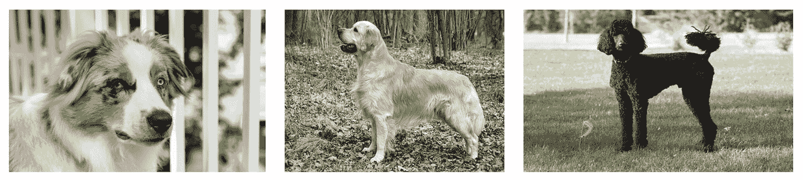

###### 图 10-2\. 多项分类示例：澳大利亚牧羊犬、金毛寻回犬或贵宾犬

在回归问题中，要预测的值是一个连续的数字，而不是一个标签。这意味着你的模型可能会预测在训练过程中从未见过的值，就像在 图 10-3 中展示的那样。例如，你可以建立一个模型来预测根据温度每日的冰淇淋销量。即使它在训练时没有看到过这个值的输入/输出对，你的模型可能会预测出值 $77.67$。

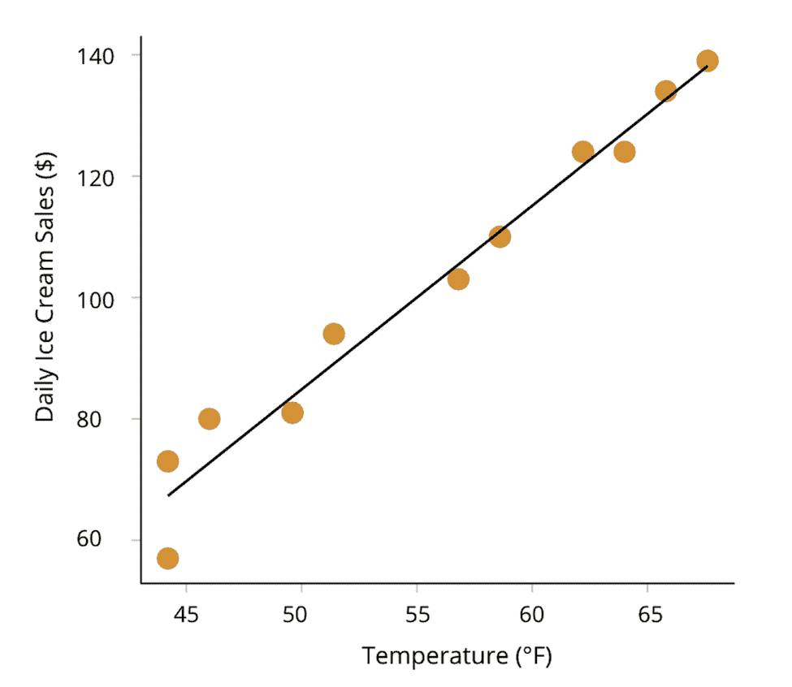

###### 图 10-3\. 回归示例：根据温度预测冰淇淋销量

表 10-1 列出了一些常用的监督机器学习算法，这些算法可以在 [Spark MLlib](https://oreil.ly/Yt0uu) 中使用，表明它们可以用于回归、分类或两者。

表 10-1\. 热门分类和回归算法

| 算法 | 典型用法 |
| --- | --- |
| 线性回归 | 回归 |
| 逻辑回归 | 分类（我们知道它的名字里有回归！） |
| 决策树 | 两者 |
| 梯度提升树 | 两者 |
| 随机森林 | 两者 |
| 朴素贝叶斯 | 分类 |
| 支持向量机 (SVMs) | 分类 |

## 无监督学习

获得监督机器学习所需的带标签数据可能非常昂贵和/或不可行。这就是 [无监督学习](https://oreil.ly/J80ym) 发挥作用的地方。与预测标签不同，无监督 ML 帮助你更好地理解数据的结构。

例如，考虑左侧原始未聚类数据在图 10-4 中。这些数据点（*x*[1]、*x*[2]）没有已知的真实标签，但通过应用无监督机器学习，我们可以找到自然形成的聚类，如右侧所示。

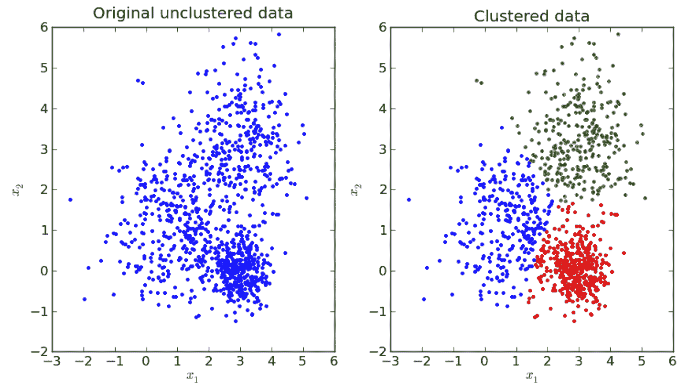

###### 图 10-4\. 聚类示例

无监督机器学习可用于异常检测或作为监督机器学习的预处理步骤，例如用于[减少数据集的维度](https://oreil.ly/N5JWF)（即每个数据点的维数），这对于减少存储需求或简化下游任务非常有用。MLlib 中一些[无监督机器学习算法](https://oreil.ly/NLYo6)包括 *k*-means、潜在狄利克雷分配（LDA）和高斯混合模型。

## 为什么选择 Spark 进行机器学习？

Spark 是一个统一的分析引擎，提供了数据摄取、特征工程、模型训练和部署的生态系统。没有 Spark，开发人员需要使用许多不同的工具来完成这些任务，并且可能仍然面临可扩展性问题。

Spark 有两个机器学习包：[`spark.mllib`](https://oreil.ly/qy-PT) 和 [`spark.ml`](https://oreil.ly/WBGzN)。`spark.mllib` 是基于 RDD API 的原始机器学习 API（自 Spark 2.0 起处于维护模式），而 `spark.ml` 是基于 DataFrames 的较新 API。本章的其余部分将重点介绍如何使用 `spark.ml` 包及如何设计 Spark 中的机器学习管道。然而，我们使用“MLlib”作为一个统称，用来指代 Apache Spark 中的两个机器学习库包。

使用 `spark.ml`，数据科学家可以在数据准备和模型构建中使用一个生态系统，而无需将数据降采样以适应单台机器。`spark.ml` 专注于 O(*n*) 的规模扩展，其中模型随着数据点数量线性扩展，因此可以适应大量数据。在接下来的章节中，我们将讨论在选择分布式框架（如 `spark.ml`）和单节点框架（如[`scikit-learn`](https://oreil.ly/WSz_8) (`sklearn`)）之间涉及的一些权衡。如果您之前使用过 `scikit-learn`，那么 `spark.ml` 中的许多 API 将感觉非常熟悉，但我们将讨论一些细微的差异。

# 设计机器学习管道

在本节中，我们将介绍如何创建和调整 ML 管道。管道的概念在许多 ML 框架中都很常见，作为一种组织一系列操作并应用于数据的方式。在 MLlib 中，[Pipeline API](https://oreil.ly/FdTA_) 提供了一个基于 DataFrames 构建的高级 API，用于组织您的机器学习工作流程。Pipeline API 由一系列转换器和评估器组成，我们稍后将深入讨论。

在本章中，我们将使用来自 [Inside Airbnb](https://oreil.ly/hBfNj) 的旧金山住房数据集。它包含有关旧金山 Airbnb 租赁的信息，如卧室数量、位置、评论得分等，我们的目标是建立一个模型来预测该市房源的每晚租金。这是一个回归问题，因为价格是一个连续变量。我们将引导你完成数据科学家处理这个问题的工作流程，包括特征工程、构建模型、超参数调优和评估模型性能。这个数据集相当凌乱，建模可能会比较困难（就像大多数真实世界的数据集一样！），所以如果你自己在尝试时，早期的模型不理想也不要感到沮丧。

本   本章的目的不是向你展示 MLlib 中的所有 API，而是装备你掌握使用 MLlib 构建端到端管道的技能和知识。在详细讲解之前，让我们先定义一些 MLlib 的术语：

转换器

接受 DataFrame 作为输入，并返回一个新 DataFrame，附加一个或多个列。转换器不会从数据中学习任何参数，而是简单地应用基于规则的转换，既为模型训练准备数据，又使用训练好的 MLlib 模型生成预测。它们有一个 `.transform()` 方法。

估计器

从你的 DataFrame 通过 `.fit()` 方法学习（或“拟合”）参数，并返回一个 `Model`，即一个转换器。

管道

将一系列转换器和估计器组织成一个单一的模型。虽然管道本身是估计器，但 `pipeline.fit()` 的输出返回一个 `PipelineModel`，即一个转换器。

虽然这些概念现在看起来可能相当抽象，但本章中的代码片段和示例将帮助你理解它们是如何结合在一起的。但在我们构建 ML 模型并使用转换器、估计器和管道之前，我们需要加载数据并进行一些数据准备。

## 数据获取和探索

我们对示例数据集进行了稍微的预处理，去除了异常值（例如，Airbnb 发布的每晚 $0），将所有整数转换为浮点数，并选择了超过一百个字段的有信息量的子集。此外，对于数据列中的任何缺失数值，我们使用中位数值进行了填充，并添加了一个指标列（列名后跟 `_na`，如 `bedrooms_na`）。这样，ML 模型或人工分析师就可以将该列中的任何值解释为填充值，而不是真实值。你可以在书的 [GitHub 仓库](https://github.com/databricks/LearningSparkV2) 中查看数据准备笔记本。请注意，还有许多其他处理缺失值的方法，超出了本书的范围。

让我们快速浏览一下数据集和相应的模式（输出仅显示部分列）：

```
# In Python
filePath = """/databricks-datasets/learning-spark-v2/sf-airbnb/
sf-airbnb-clean.parquet/"""
airbnbDF = spark.read.parquet(filePath)
airbnbDF.select("neighbourhood_cleansed", "room_type", "bedrooms", "bathrooms", 
                "number_of_reviews", "price").show(5)
```

```
// In Scala
val filePath = 
  "/databricks-datasets/learning-spark-v2/sf-airbnb/sf-airbnb-clean.parquet/"
val airbnbDF = spark.read.parquet(filePath)
airbnbDF.select("neighbourhood_cleansed", "room_type", "bedrooms", "bathrooms", 
                "number_of_reviews", "price").show(5)

+----------------------+---------------+--------+---------+----------+-----+
|neighbourhood_cleansed|      room_type|bedrooms|bathrooms|number_...|price|
+----------------------+---------------+--------+---------+----------+-----+
|      Western Addition|Entire home/apt|     1.0|      1.0|     180.0|170.0|
|        Bernal Heights|Entire home/apt|     2.0|      1.0|     111.0|235.0|
|        Haight Ashbury|   Private room|     1.0|      4.0|      17.0| 65.0|
|        Haight Ashbury|   Private room|     1.0|      4.0|       8.0| 65.0|
|      Western Addition|Entire home/apt|     2.0|      1.5|      27.0|785.0|
+----------------------+---------------+--------+---------+----------+-----+
```

我们的目标是预测租赁物业每晚的价格，给定我们的特征。

###### 注

在数据科学家可以开始建模之前，他们需要探索和理解他们的数据。他们经常使用 Spark 对数据进行分组，然后使用诸如 [matplotlib](https://matplotlib.org) 等数据可视化库来可视化数据。我们将数据探索留给读者作为练习。

## 创建训练和测试数据集

在我们开始特征工程和建模之前，我们将把数据集分成两组：*训练集*和*测试集*。根据您的数据集大小，您的训练/测试比例可能会有所不同，但许多数据科学家使用 80/20 作为标准的训练/测试分割。您可能会想：“为什么不使用整个数据集来训练模型呢？”问题在于，如果我们在整个数据集上建立模型，可能会导致模型记忆或“过拟合”我们提供的训练数据，并且我们将没有更多数据来评估它在以前未见数据上的泛化能力。模型在测试集上的表现是它在未见数据（即在野外或生产环境中）上表现良好的代理，假设数据遵循相似的分布。这种分割在图 10-5 中有所描绘。

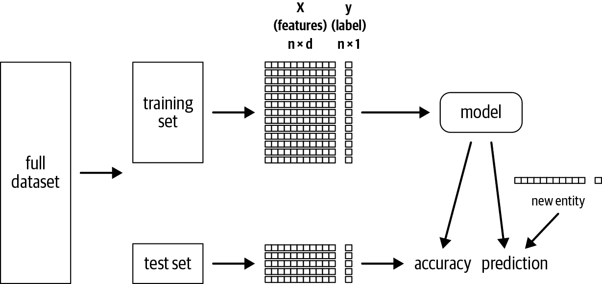

###### 图 10-5\. 训练/测试分割

我们的训练集包含一组特征 X 和一个标签 y。这里我们使用大写 X 表示一个维度为 *n* x *d* 的矩阵，其中 *n* 是数据点（或示例）的数量，*d* 是特征的数量（这就是我们在 DataFrame 中称为字段或列的东西）。我们使用小写 y 表示一个向量，维度为 *n* x 1；对于每个示例，都有一个标签。

不同的度量标准用于衡量模型的性能。对于分类问题，一个标准度量标准是*准确度*，或者正确预测的百分比。一旦模型在训练集上使用该度量标准表现良好，我们将把模型应用到我们的测试集上。如果它根据我们的评估指标在我们的测试集上表现良好，那么我们可以确信我们已经构建了一个能够“泛化”到未见数据的模型。

对于我们的 Airbnb 数据集，我们将保留 80%作为训练集，并将 20%的数据留作测试集。此外，我们将设置一个随机种子以确保可重现性，这样如果我们重新运行此代码，我们将得到相同的数据点分配到我们的训练和测试数据集中。种子本身的值*不应该*有影响，但是数据科学家经常喜欢将其设置为 42，因为这是生命的[终极问题的答案](https://oreil.ly/sE12h)。

```
# In Python
trainDF, testDF = airbnbDF.randomSplit([.8, .2], seed=42)
print(f"""There are {trainDF.count()} rows in the training set, 
and {testDF.count()} in the test set""")
```

```
// In Scala
val Array(trainDF, testDF) = airbnbDF.randomSplit(Array(.8, .2), seed=42)
println(f"""There are ${trainDF.count} rows in the training set, and 
${testDF.count} in the test set""")
```

这会产生以下输出：

```
There are 5780 rows in the training set, and 1366 in the test set
```

但是，如果我们改变 Spark 集群中执行器的数量会发生什么呢？Catalyst 优化器根据集群资源和数据集的大小作为函数确定 [数据分区的最佳方式](https://oreil.ly/Ecd_m)。考虑到 Spark DataFrame 中的数据是行分区的，每个工作节点独立执行其分区，如果分区中的数据发生变化，则 `randomSplit()` 的结果将不同。

虽然您可以固定您的集群配置和种子以确保获得一致的结果，但我们建议您仅拆分数据一次，然后将其写入到自己的训练/测试文件夹中，以避免这些可再现性问题。

###### 注意

在探索性分析期间，您应该缓存训练数据集，因为在整个机器学习过程中您将经常访问它。请参考 第七章 中关于 “数据缓存和持久化” 的部分。

## 使用转换器准备特征

现在我们已经将数据分成了训练集和测试集，让我们准备数据来构建一个线性回归模型，预测给定卧室数量的价格。在稍后的示例中，我们将包括所有相关特征，但现在让我们确保已经准备好了机制。线性回归（像 Spark 中的许多其他算法一样）要求所有输入特征都包含在 DataFrame 中的单个向量中。因此，我们需要 *转换* 我们的数据。

Spark 中的转换器接受 DataFrame 作为输入，并返回一个新的 DataFrame，其中附加了一个或多个列。它们不会从您的数据中学习，而是使用 `transform()` 方法应用基于规则的转换。

对于将所有特征放入单个向量的任务，我们将使用 [`VectorAssembler` 转换器](https://oreil.ly/r2MSV)。`VectorAssembler` 接受一列输入列的列表，并创建一个新的 DataFrame，其中包含一个额外的列，我们将其称为 `features`。它将这些输入列的值合并到一个单独的向量中：

```
# In Python
from pyspark.ml.feature import VectorAssembler
vecAssembler = VectorAssembler(inputCols=["bedrooms"], outputCol="features")
vecTrainDF = vecAssembler.transform(trainDF)
vecTrainDF.select("bedrooms", "features", "price").show(10)
```

```
// In Scala
import org.apache.spark.ml.feature.VectorAssembler
val vecAssembler = new VectorAssembler()
  .setInputCols(Array("bedrooms"))
  .setOutputCol("features")
val vecTrainDF = vecAssembler.transform(trainDF)
vecTrainDF.select("bedrooms", "features", "price").show(10)

+--------+--------+-----+
|bedrooms|features|price|
+--------+--------+-----+
|     1.0|   [1.0]|200.0|
|     1.0|   [1.0]|130.0|
|     1.0|   [1.0]| 95.0|
|     1.0|   [1.0]|250.0|
|     3.0|   [3.0]|250.0|
|     1.0|   [1.0]|115.0|
|     1.0|   [1.0]|105.0|
|     1.0|   [1.0]| 86.0|
|     1.0|   [1.0]|100.0|
|     2.0|   [2.0]|220.0|
+--------+--------+-----+
```

您会注意到，在 Scala 代码中，我们必须实例化新的 `VectorAssembler` 对象，并使用 setter 方法来更改输入和输出列。在 Python 中，您可以直接将参数传递给 `VectorAssembler` 的构造函数，或者使用 setter 方法，但在 Scala 中只能使用 setter 方法。

接下来我们将讲解线性回归的基础知识，但如果您已经熟悉这种算法，请跳转到 “使用估算器构建模型”。

## 理解线性回归

[线性回归](https://oreil.ly/dhgZf)模型描述了依赖变量（或标签）与一个或多个独立变量（或特征）之间的线性关系。在我们的案例中，我们希望拟合一个线性回归模型，以预测 Airbnb 租金的价格，根据卧室数量。

在图 10-6 中，我们有一个特征*x*和一个输出*y*（这是我们的因变量）。线性回归旨在为*x*和*y*拟合一条直线方程，对于标量变量，可以表示为*y = mx + b*，其中*m*是斜率，*b*是偏移或截距。

点表示我们数据集中的真实(*x*, *y*)对，实线表示该数据集的最佳拟合线。数据点并不完全对齐，因此我们通常认为线性回归是将模型拟合到 y ≈ *mx* + *b* + ε的过程，其中ε（epsilon）是从某个分布独立抽取的每个记录*x*的误差。这些是我们模型预测与真实值之间的误差。通常我们将ε视为高斯或正态分布。回归线上方的垂直线表示正ε（或残差），即您的真实值高于预测值，而回归线下方的垂直线表示负残差。线性回归的目标是找到最小化这些残差平方的线。您会注意到，该线可以对其未见数据点进行预测。

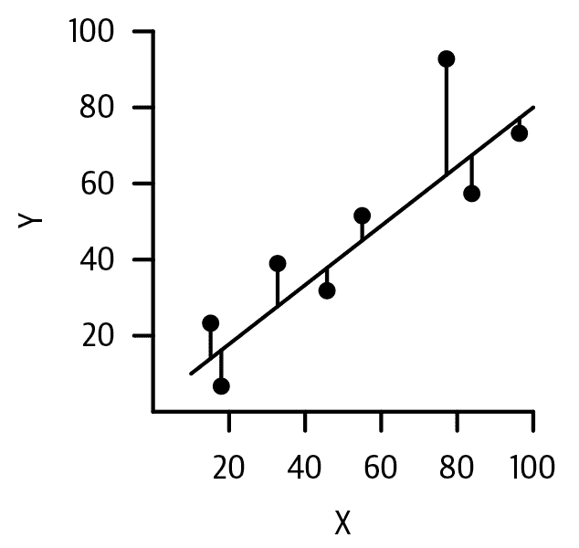

###### 图 10-6\. 单变量线性回归

线性回归也可以扩展到处理多个独立变量。如果我们有三个输入特征，*x* = [*x*[1], *x*[2], *x*[3]]，那么我们可以将*y*建模为*y* ≈ *w*[0] + *w*[1]*x*[1] + *w*[2]*x*[2] + *w*[3]*x*[3] + ε。在这种情况下，每个特征都有一个单独的系数（或权重），并且一个单独的截距（这里是*w*[0]而不是*b*）。估计我们模型的系数和截距的过程称为*学习*（或*拟合*）模型的参数。现在，我们将专注于预测价格与卧室数量的单变量回归示例，并稍后再讨论多变量线性回归。

## 使用估计器构建模型

设置好我们的`vectorAssembler`后，我们准备好了我们的数据，并将其转换为我们的线性回归模型所需的格式。在 Spark 中，[`LinearRegression`](https://oreil.ly/zxlnL)是一种类型的估计器——它接受一个 DataFrame 并返回一个`Model`。估计器从您的数据中学习参数，具有`estimator_name.fit()`方法，并且会立即评估（即启动 Spark 作业），而变换器则是延迟评估的。其他一些估计器的示例包括`Imputer`、`DecisionTreeClassifier`和`RandomForestRegressor`。

您会注意到，我们线性回归的输入列（`features`）是我们的`vectorAssembler`的输出：

```
# In Python
from pyspark.ml.regression import LinearRegression
lr = LinearRegression(featuresCol="features", labelCol="price")
lrModel = lr.fit(vecTrainDF)
```

```
// In Scala
import org.apache.spark.ml.regression.LinearRegression
val lr = new LinearRegression()
  .setFeaturesCol("features")
  .setLabelCol("price")

val lrModel = lr.fit(vecTrainDF)
```

`lr.fit()`返回一个[`LinearRegressionModel`](https://oreil.ly/LASya) (`lrModel`)，它是一个转换器。换句话说，估计器的`fit()`方法的输出是一个转换器。一旦估计器学习了参数，转换器可以将这些参数应用于新的数据点以生成预测结果。让我们检查它学到的参数：

```
# In Python
m = round(lrModel.coefficients[0], 2)
b = round(lrModel.intercept, 2)
print(f"""The formula for the linear regression line is 
price = {m}*bedrooms + {b}""")
```

```
// In Scala
val m = lrModel.coefficients(0)
val b = lrModel.intercept
println(f"""The formula for the linear regression line is 
price = $m%1.2f*bedrooms + $b%1.2f""")
```

这将打印：

```
The formula for the linear regression line is price = 123.68*bedrooms + 47.51
```

## 创建一个 Pipeline

如果我们想将我们的模型应用于测试集，那么我们需要以与训练集相同的方式准备数据（即通过向量组合器）。通常数据准备流水线会有多个步骤，记住应用哪些步骤以及步骤的顺序变得很麻烦。这就是[Pipeline API](https://oreil.ly/MG3YM)的动机：您只需指定您希望数据通过的阶段，并按顺序进行处理，Spark 会为您处理处理过程。它们提供了更好的代码重用性和组织性。在 Spark 中，`Pipeline`是估计器，而经过拟合的`PipelineModel`是转换器。

现在让我们构建我们的流水线：

```
# In Python
from pyspark.ml import Pipeline
pipeline = Pipeline(stages=[vecAssembler, lr])
pipelineModel = pipeline.fit(trainDF)
```

```
// In Scala
import org.apache.spark.ml.Pipeline
val pipeline = new Pipeline().setStages(Array(vecAssembler, lr))
val pipelineModel = pipeline.fit(trainDF)
```

使用 Pipeline API 的另一个优点是它会为您确定哪些阶段是估计器/转换器，因此您不必担心为每个阶段指定`*name*.fit()`与`*name*.transform()`。

因为`pipelineModel`是一个转换器，所以将其应用于我们的测试数据集也很简单：

```
# In Python
predDF = pipelineModel.transform(testDF)
predDF.select("bedrooms", "features", "price", "prediction").show(10)
```

```
// In Scala
val predDF = pipelineModel.transform(testDF)
predDF.select("bedrooms", "features", "price", "prediction").show(10)

+--------+--------+------+------------------+
|bedrooms|features| price|        prediction|
+--------+--------+------+------------------+
|     1.0|   [1.0]|  85.0|171.18598011578285|
|     1.0|   [1.0]|  45.0|171.18598011578285|
|     1.0|   [1.0]|  70.0|171.18598011578285|
|     1.0|   [1.0]| 128.0|171.18598011578285|
|     1.0|   [1.0]| 159.0|171.18598011578285|
|     2.0|   [2.0]| 250.0|294.86172649777757|
|     1.0|   [1.0]|  99.0|171.18598011578285|
|     1.0|   [1.0]|  95.0|171.18598011578285|
|     1.0|   [1.0]| 100.0|171.18598011578285|
|     1.0|   [1.0]|2010.0|171.18598011578285|
+--------+--------+------+------------------+
```

在这段代码中，我们只使用一个特征`bedrooms`来构建模型（您可以在书的[GitHub 仓库](https://github.com/databricks/LearningSparkV2)中找到本章的笔记本）。然而，您可能希望使用所有特征构建模型，其中一些可能是分类的，例如`host_is_superhost`。分类特征具有离散值并且没有内在的顺序——例如职业或国家名称。在下一节中，我们将考虑如何处理这些类型的变量的解决方案，称为*独热编码*。

### 独热编码

在我们刚创建的流水线中，我们只有两个阶段，我们的线性回归模型只使用了一个特征。让我们看看如何构建一个稍微复杂的流水线，其中包含所有数值和分类特征。

MLlib 中的大多数机器学习模型都希望输入数值，表示为向量。为了将分类值转换为数值，我们可以使用一种称为独热编码（OHE）的技术。假设我们有一个名为`Animal`的列，有三种动物：`Dog`、`Cat`和`Fish`。我们不能直接将字符串类型传递给我们的 ML 模型，因此我们需要分配一个数值映射，例如这样：

```
Animal = {"Dog", "Cat", "Fish"}
"Dog" = 1, "Cat" = 2, "Fish" = 3
```

然而，使用这种方法，我们在数据集中引入了一些不存在的虚假关系。例如，为什么我们给`Cat`分配了`Dog`的两倍的值？我们使用的数值不应该在数据集中引入任何关系。相反，我们希望为我们`Animal`列中的每个不同值创建单独的列：

```
"Dog" = [ 1, 0, 0]
"Cat" = [ 0, 1, 0]
"Fish" = [0, 0, 1]
```

如果动物是狗，则在第一列中有一个`1`，其他位置为`0`。如果是猫，则在第二列中有一个`1`，其他位置为`0`。列的顺序不重要。如果您之前使用过 pandas，您会注意到这与[`pandas.get_dummies()`](https://oreil.ly/4BsUq)的功能相同。

如果我们有一只有 300 只动物的动物园，那么独热编码会大幅增加内存/计算资源的消耗吗？不会，使用 Spark！Spark 在大部分条目为`0`（通常在独热编码后如此）时内部使用[`SparseVector`](https://oreil.ly/7rOcC)，因此不会浪费空间存储`0`值。让我们通过一个例子更好地理解`SparseVector`的工作原理：

```
DenseVector(0, 0, 0, 7, 0, 2, 0, 0, 0, 0)
SparseVector(10, [3, 5], [7, 2])
```

在这个例子中，[`DenseVector`](https://oreil.ly/F37Ht) 包含了 10 个值，除了 2 个值外其余都是`0`。要创建一个`SparseVector`，我们需要跟踪向量的大小、非零元素的索引以及这些索引处的对应值。在这个例子中，向量的大小是 10，索引 3 和 5 处有两个非零值，这些索引处的值分别为 7 和 2。

有几种方法可以使用 Spark 对数据进行独热编码。常见的方法是使用[`StringIndexer`](https://oreil.ly/mqGP6)和[`OneHotEncoder`](https://oreil.ly/D07R0)。使用这种方法的第一步是将`StringIndexer`估算器应用于将分类值转换为类别索引。这些类别索引按标签频率排序，因此最常见的标签获得索引 0，这使得我们可以在相同数据的多次运行中获得可重复的结果。

一旦创建了类别索引，您可以将其作为输入传递给`OneHotEncoder`（如果使用 Spark 2.3/2.4，则为[`OneHotEncoderEstimator`](https://oreil.ly/SmZTw)）。`OneHotEncoder`将类别索引列映射到二进制向量列。查看表 10-2 以了解从 Spark 2.3/2.4 到 3.0 中`StringIndexer`和`OneHotEncoder` API 的差异。

表 10-2\. Spark 3.0 中`StringIndexer`和`OneHotEncoder`的更改

|   | Spark 2.3 和 2.4 | Spark 3.0 |
| --- | --- | --- |
| `StringIndexer` | 单列作为输入/输出 | 多列作为输入/输出 |
| `OneHotEncoder` | 已弃用 | 多列作为输入/输出 |
| `OneHotEncoderEstimator` | 多列作为输入/输出 | 不适用 |

下面的代码演示了如何对我们的分类特征进行独热编码。在我们的数据集中，任何类型为`string`的列都被视为分类特征，但有时您可能希望将数值特征视为分类特征，反之亦然。您需要仔细识别哪些列是数值型的，哪些是分类的：

```
# In Python
from pyspark.ml.feature import OneHotEncoder, StringIndexer

categoricalCols = [field for (field, dataType) in trainDF.dtypes 
                   if dataType == "string"]
indexOutputCols = [x + "Index" for x in categoricalCols]
oheOutputCols = [x + "OHE" for x in categoricalCols]

stringIndexer = StringIndexer(inputCols=categoricalCols, 
                              outputCols=indexOutputCols, 
                              handleInvalid="skip")
oheEncoder = OneHotEncoder(inputCols=indexOutputCols, 
                           outputCols=oheOutputCols)

numericCols = [field for (field, dataType) in trainDF.dtypes 
               if ((dataType == "double") & (field != "price"))]
assemblerInputs = oheOutputCols + numericCols
vecAssembler = VectorAssembler(inputCols=assemblerInputs, 
                               outputCol="features")
```

```
// In Scala
import org.apache.spark.ml.feature.{OneHotEncoder, StringIndexer}

val categoricalCols = trainDF.dtypes.filter(_._2 == "StringType").map(_._1)
val indexOutputCols = categoricalCols.map(_ + "Index")
val oheOutputCols = categoricalCols.map(_ + "OHE")

val stringIndexer = new StringIndexer()
  .setInputCols(categoricalCols)
  .setOutputCols(indexOutputCols)
  .setHandleInvalid("skip")

val oheEncoder = new OneHotEncoder()
  .setInputCols(indexOutputCols)
  .setOutputCols(oheOutputCols)

val numericCols = trainDF.dtypes.filter{ case (field, dataType) => 
  dataType == "DoubleType" && field != "price"}.map(_._1)
val assemblerInputs = oheOutputCols ++ numericCols
val vecAssembler = new VectorAssembler()
  .setInputCols(assemblerInputs)
  .setOutputCol("features")
```

现在您可能会想，“`StringIndexer`如何处理测试数据集中出现但训练数据集中不存在的新类别？” 这里有一个`handleInvalid`参数，用于指定您想要如何处理它们。选项有`skip`（过滤掉无效数据的行），`error`（抛出错误）或`keep`（将无效数据放入特殊的附加桶中，索引为`numLabels`）。在本例中，我们只跳过了无效记录。

此方法的一个困难在于，您需要明确告诉`StringIndexer`哪些特征应被视为分类特征。您可以使用[`VectorIndexer`](https://oreil.ly/tNE1d)自动检测所有分类变量，但这会消耗大量计算资源，因为它必须遍历每一列并检测其是否具有少于`maxCategories`个不同值。`maxCategories`是用户指定的参数，确定该值也可能很困难。

另一种方法是使用[`RFormula`](https://oreil.ly/Jh7Q9)。其语法受到 R 编程语言的启发。使用`RFormula`时，您提供标签和要包含的特征。它支持 R 语言的有限子集运算符，包括`~`、`.`、`:`、`+`和`-`。例如，您可以指定`formula = "y ~ bedrooms + bathrooms"`，这意味着根据`bedrooms`和`bathrooms`预测`y`，或者`formula = "y ~ ."`，这意味着使用所有可用特征（并自动排除`y`）。`RFormula`将自动`StringIndex`和 OHE 所有您的`string`列，将您的数值列转换为`double`类型，并使用`VectorAssembler`将所有这些组合成一个单一向量。因此，我们可以用一行代码替换所有前面的代码，得到相同的结果：

```
# In Python
from pyspark.ml.feature import RFormula

rFormula = RFormula(formula="price ~ .", 
                    featuresCol="features", 
                    labelCol="price", 
                    handleInvalid="skip")
```

```
// In Scala
import org.apache.spark.ml.feature.RFormula

val rFormula = new RFormula()
  .setFormula("price ~ .")
  .setFeaturesCol("features")
  .setLabelCol("price")
  .setHandleInvalid("skip")
```

`RFormula`自动结合`StringIndexer`和`OneHotEncoder`的缺点在于，并非所有算法都需要或建议使用独热编码。例如，基于树的算法可以直接处理分类变量，只需使用`StringIndexer`处理分类特征即可。对于基于树的方法，您不需要对分类特征进行独热编码，通常这样做会使您的基于树的模型表现更差（详情见[这里](https://oreil.ly/xfR-_)）。不幸的是，特征工程并没有一种适合所有情况的解决方案，最佳方法与您计划应用于数据集的下游算法密切相关。

###### 注意

如果有人为您执行特征工程，请确保他们记录了如何生成这些特征。

一旦编写了用于转换数据集的代码，您可以使用所有特征作为输入添加线性回归模型。

在这里，我们将所有特征准备和模型构建放入管道中，并将其应用于我们的数据集：

```
# In Python
lr = LinearRegression(labelCol="price", featuresCol="features")
pipeline = Pipeline(stages = [stringIndexer, oheEncoder, vecAssembler, lr])
# Or use RFormula
# pipeline = Pipeline(stages = [rFormula, lr])

pipelineModel = pipeline.fit(trainDF)
predDF = pipelineModel.transform(testDF)
predDF.select("features", "price", "prediction").show(5)
```

```
// In Scala
val lr = new LinearRegression()
  .setLabelCol("price")
  .setFeaturesCol("features")
val pipeline = new Pipeline()
  .setStages(Array(stringIndexer, oheEncoder, vecAssembler, lr))
// Or use RFormula
// val pipeline = new Pipeline().setStages(Array(rFormula, lr))

val pipelineModel = pipeline.fit(trainDF)
val predDF = pipelineModel.transform(testDF)
predDF.select("features", "price", "prediction").show(5)

+--------------------+-----+------------------+
|            features|price|        prediction|
+--------------------+-----+------------------+
|(98,[0,3,6,7,23,4...| 85.0| 55.80250714362137|
|(98,[0,3,6,7,23,4...| 45.0| 22.74720286761658|
|(98,[0,3,6,7,23,4...| 70.0|27.115811183814913|
|(98,[0,3,6,7,13,4...|128.0|-91.60763412465076|
|(98,[0,3,6,7,13,4...|159.0| 94.70374072351933|
+--------------------+-----+------------------+
```

如您所见，特征列表示为`SparseVector`。经过独热编码后有 98 个特征，接着是非零索引，然后是值本身。如果将`truncate=False`传递给`show()`，您可以看到完整的输出。

我们的模型表现如何？您可以看到，尽管某些预测可能被认为“接近”，但其他预测则差距很大（租金为负数！？）。接下来，我们将在整个测试集上数值评估我们模型的表现。

## 评估模型

现在我们已经建立了一个模型，我们需要评估其表现。在`spark.ml`中，有分类、回归、聚类和排名评估器（在 Spark 3.0 中引入）。鉴于这是一个回归问题，我们将使用[均方根误差（RMSE）](https://oreil.ly/mAQXq)和[*R*²](https://oreil.ly/nE8Cp)（发音为“R 平方”）来评估我们模型的表现。

### RMSE

RMSE 是一个从零到无穷大的度量。它越接近零，表现越好。

让我们逐步浏览数学公式：

1.  计算真实值*y[i]*和预测值*ŷ[i]*（发音为*y*-hat，其中“hat”表示它是帽子下的预测值）之间的差异（或误差）：

    <math display="block"><mrow><mtext>Error</mtext> <mo>=</mo> <mo>(</mo> <msub><mi>y</mi> <mi>i</mi></msub> <mo>-</mo> <msub><mover accent="true"><mi>y</mi> <mo>^</mo></mover> <mi>i</mi></msub> <mo>)</mo></mrow></math>

1.  对*y[i]*和*ŷ[i]*之间的差异进行平方，以防止我们的正负残差相互抵消。这称为平方误差：

    <math display="block"><mrow><mtext>Square Error (SE)</mtext> <mo>=</mo> <msup><mrow><mo>(</mo><msub><mi>y</mi> <mi>i</mi></msub> <mo>-</mo><msub><mover accent="true"><mi>y</mi> <mo>^</mo></mover> <mi>i</mi></msub> <mo>)</mo></mrow> <mn>2</mn></msup></mrow></math>

1.  然后，我们对所有*n*个数据点的平方误差求和，称为平方误差和（SSE）或平方残差和：

    <math display="block"><mrow><mtext>Sum of Squared Errors (SSE)</mtext> <mo>=</mo> <munderover><mo>∑</mo> <mrow><mi>i</mi><mo>=</mo><mn>1</mn></mrow> <mi>n</mi></munderover> <msup><mrow><mo>(</mo><msub><mi>y</mi> <mi>i</mi></msub> <mo>-</mo><msub><mover accent="true"><mi>y</mi> <mo>^</mo></mover> <mi>i</mi></msub> <mo>)</mo></mrow> <mn>2</mn></msup></mrow></math>

1.  然而，SSE 随数据集中记录数*n*的增加而增长，因此我们希望通过记录数对其进行归一化。这给出了均方误差（MSE），一个非常常用的回归指标：

    <math display="block"><mrow><mtext>Mean Squared Error (MSE)</mtext> <mo>=</mo> <mfrac><mn>1</mn> <mi>n</mi></mfrac> <munderover><mo>∑</mo> <mrow><mi>i</mi><mo>=</mo><mn>1</mn></mrow> <mi>n</mi></munderover> <msup><mrow><mo>(</mo><msub><mi>y</mi> <mi>i</mi></msub> <mo>-</mo><msub><mover accent="true"><mi>y</mi> <mo>^</mo></mover> <mi>i</mi></msub> <mo>)</mo></mrow> <mn>2</mn></msup></mrow></math>

1.  如果我们停留在 MSE，那么我们的误差项在*unit*²的规模上。我们通常会取 MSE 的平方根，以使误差回到原始单位的尺度上，这就是均方根误差（RMSE）：

    <math display="block"><mrow><mtext>Root Mean Squared Error (RMSE)</mtext> <mo>=</mo> <msqrt><mrow><mfrac><mn>1</mn> <mi>n</mi></mfrac> <munderover><mo>∑</mo> <mrow><mi>i</mi><mo>=</mo><mn>1</mn></mrow> <mi>n</mi></munderover> <msup><mrow><mo>(</mo><msub><mi>y</mi> <mi>i</mi></msub> <mo>-</mo><msub><mover accent="true"><mi>y</mi> <mo>^</mo></mover> <mi>i</mi></msub> <mo>)</mo></mrow> <mn>2</mn></msup></mrow></msqrt></mrow></math>

让我们使用 RMSE 来评估我们的模型：

```
# In Python
from pyspark.ml.evaluation import RegressionEvaluator
regressionEvaluator = RegressionEvaluator(
  predictionCol="prediction", 
  labelCol="price", 
  metricName="rmse")
rmse = regressionEvaluator.evaluate(predDF)
print(f"RMSE is {rmse:.1f}")
```

```
// In Scala
import org.apache.spark.ml.evaluation.RegressionEvaluator
val regressionEvaluator = new RegressionEvaluator()
  .setPredictionCol("prediction")
  .setLabelCol("price")
  .setMetricName("rmse")
val rmse = regressionEvaluator.evaluate(predDF)
println(f"RMSE is $rmse%.1f")
```

这产生了以下输出：

```
RMSE is 220.6
```

#### 解释 RMSE 的值

那么我们如何知道 220.6 是 RMSE 的一个好值？有多种方法可以解释这个值，其中一种方法是构建一个简单的基线模型并计算其 RMSE 以进行比较。回归任务的一个常见基线模型是计算训练集标签的平均值*ȳ*（读作*y*-bar），然后为测试数据集中的每条记录预测*ȳ*并计算结果的 RMSE（示例代码可在该书的[GitHub repo](https://github.com/databricks/LearningSparkV2)找到）。如果您尝试这样做，您会看到我们的基线模型具有 240.7 的 RMSE，所以我们打败了基线。如果您没有击败基线，则可能是在建模过程中出了问题。

###### 注意

如果这是一个分类问题，您可能希望预测最普遍的类作为您的基线模型。

请记住，您标签的单位直接影响您的 RMSE。例如，如果您的标签是高度，则如果您使用厘米而不是米作为您的测量单位，您的 RMSE 将更高。您可以通过使用不同的单位任意减少 RMSE，这就是为什么比较 RMSE 与基线非常重要。

也有一些指标自然地让您直觉地了解您与基准的表现如何，例如*R*²，接下来我们将讨论它。

### R²

尽管名为*R*²的名称包含“平方”，*R*²值的范围从负无穷到 1。让我们来看看这一度量背后的数学。*R*²的计算如下：

<math display="block"><mrow><msup><mi>R</mi> <mn>2</mn></msup> <mo>=</mo> <mn>1</mn> <mo>-</mo> <mfrac><mrow><mi>S</mi><msub><mi>S</mi> <mrow><mi>r</mi><mi>e</mi><mi>s</mi></mrow></msub></mrow> <mrow><mi>S</mi><msub><mi>S</mi> <mrow><mi>t</mi><mi>o</mi><mi>t</mi></mrow></msub></mrow></mfrac></mrow></math>

其中*SS[tot]*是如果您始终预测*ȳ*的总平方和：

<math display="block"><mrow><mi>S</mi> <msub><mi>S</mi> <mrow><mi>t</mi><mi>o</mi><mi>t</mi></mrow></msub> <mo>=</mo> <munderover><mo>∑</mo> <mrow><mi>i</mi><mo>=</mo><mn>1</mn></mrow> <mi>n</mi></munderover> <msup><mrow><mo>(</mo><msub><mi>y</mi> <mi>i</mi></msub> <mo>-</mo><mover accent="true"><mi>y</mi> <mo>¯</mo></mover><mo>)</mo></mrow> <mn>2</mn></msup></mrow></math>

而*SS[res]*是从您的模型预测中残差平方和（也称为平方误差和，我们用它来计算 RMSE）：

<math display="block"><mrow><mi>S</mi> <msub><mi>S</mi> <mrow><mi>r</mi><mi>e</mi><mi>s</mi></mrow></msub> <mo>=</mo> <munderover><mo>∑</mo> <mrow><mi>i</mi><mo>=</mo><mn>1</mn></mrow> <mi>n</mi></munderover> <msup><mrow><mo>(</mo><msub><mi>y</mi> <mi>i</mi></msub> <mo>-</mo><msub><mover accent="true"><mi>y</mi> <mo>^</mo></mover> <mi>i</mi></msub> <mo>)</mo></mrow> <mn>2</mn></msup></mrow></math>

如果您的模型完美预测每个数据点，那么您的*SS[res]* = 0，使您的*R*² = 1。如果您的*SS[res]* = *SS[tot]*，那么分数是 1/1，因此您的*R*²为 0。这就是如果您的模型表现与始终预测平均值*ȳ*相同会发生的情况。

但是如果您的模型表现比始终预测*ȳ*还要差，而且您的*SS[res]*非常大怎么办？那么您的*R*²实际上可以是负的！如果您的*R*²为负数，您应该重新评估您的建模过程。使用*R*²的好处是您不一定需要定义一个基线模型进行比较。

如果我们想要更改我们的回归评估器以使用*R*²，而不是重新定义回归评估器，我们可以使用设置器属性来设置指标名称：

```
# In Python
r2 = regressionEvaluator.setMetricName("r2").evaluate(predDF)
print(f"R2 is {r2}")
```

```
// In Scala
val r2 = regressionEvaluator.setMetricName("r2").evaluate(predDF)
println(s"R2 is $r2")
```

输出为：

```
R2 is 0.159854
```

我们的 *R*² 是正值，但非常接近 0\. 我们的模型表现不佳的一个原因是，我们的标签 `price` 看起来呈现出[对数正态分布](https://oreil.ly/0Patq)。如果一个分布是对数正态的，这意味着如果我们取该值的对数，结果看起来像正态分布。价格通常是对数正态分布的。如果您考虑一下旧金山的租金价格，大多数每晚约为 200 美元，但有些则每晚租金高达数千美元！您可以在我们的训练数据集中查看 Airbnb 价格的分布，见图 10-7。

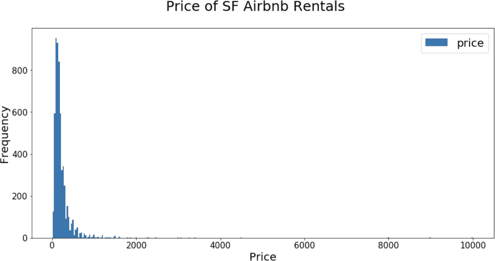

###### 图 10-7\. 旧金山房屋价格分布

让我们看看如果我们查看价格的对数而不是价格本身的分布情况（图 10-8）。

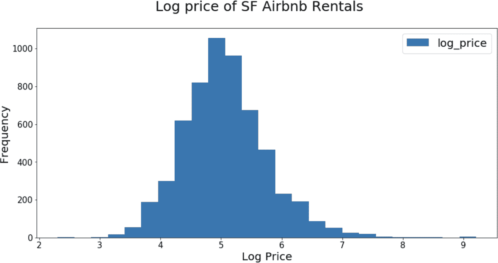

###### 图 10-8\. 旧金山房屋对数价格分布

您可以看到我们的对数价格分布看起来更像正态分布。作为练习，尝试构建一个模型来预测对数尺度上的价格，然后指数化预测以将其从对数尺度转换出来，并评估您的模型。代码也可以在本章的笔记本以及书籍的 [GitHub 仓库](https://github.com/databricks/LearningSparkV2) 中找到。您应该会发现，对于这个数据集，您的 RMSE 减小，*R*² 增加。

## 保存和加载模型

现在我们已经构建并评估了一个模型，让我们将其保存到持久存储中以便以后重用（或者在我们的集群崩溃时，我们不需要重新计算模型）。保存模型与编写 DataFrame 非常相似——API 是 `model.write().save(*path*)`。您可以选择使用 `overwrite()` 命令来覆盖该路径中包含的任何数据：

```
# In Python
pipelinePath = "/tmp/lr-pipeline-model"
pipelineModel.write().overwrite().save(pipelinePath)
```

```
// In Scala
val pipelinePath = "/tmp/lr-pipeline-model"
pipelineModel.write.overwrite().save(pipelinePath)
```

当您加载已保存的模型时，您需要指定要重新加载的模型类型（例如，是 `LinearRegressionModel` 还是 `LogisticRegressionModel`？）。出于这个原因，我们建议您始终将您的转换器/估计器放入 `Pipeline` 中，这样对于所有加载的模型，您只需加载一个 `PipelineModel` 并且只需更改模型的文件路径：

```
# In Python
from pyspark.ml import PipelineModel
savedPipelineModel = PipelineModel.load(pipelinePath)
```

```
// In Scala
import org.apache.spark.ml.PipelineModel
val savedPipelineModel = PipelineModel.load(pipelinePath)
```

加载完成后，您可以将其应用于新的数据点。但是，您不能使用此模型的权重作为初始化参数来训练新模型（而不是从随机权重开始），因为 Spark 没有“热启动”的概念。如果您的数据集略有变化，您将不得不从头开始重新训练整个线性回归模型。

我们构建并评估了线性回归模型之后，让我们看看我们的数据集上其他几种模型的表现。在下一节中，我们将探讨基于树的模型，并查看一些常见的超参数，以调整模型性能。

# 超参数调优

当数据科学家讨论调整模型时，他们经常讨论调整超参数以提高模型的预测能力。*超参数*是在训练之前定义的关于模型的属性，并且在训练过程中不会学习（不要与在训练过程中学习的*参数*混淆）。你随机森林中的树的数量就是一个超参数的例子。

在本节中，我们将重点讨论使用基于树的模型作为超参数调整程序的示例，但这些概念同样适用于其他模型。一旦我们设置好使用`spark.ml`进行超参数调整的机制，我们将讨论如何优化流程。让我们从决策树的简要介绍开始，然后介绍如何在`spark.ml`中使用它们。

## 基于树的模型

决策树等基于树的模型，如决策树、梯度提升树和随机森林，是相对简单而强大的模型，易于解释（也就是说，易于解释它们所做的预测）。因此，它们在机器学习任务中非常流行。我们很快就会讨论随机森林，但首先我们需要掌握决策树的基础知识。

### 决策树

作为现成的解决方案，决策树非常适合数据挖掘。它们相对快速建立，高度可解释，并且与缩放无关（即，标准化或缩放数值特征不会改变树的性能）。那么，什么是决策树呢？

决策树是从数据中学习的一系列 if-then-else 规则，用于分类或回归任务。假设我们试图建立一个模型来预测某人是否接受工作提议，特征包括工资、通勤时间、免费咖啡等等。如果我们将决策树拟合到这个数据集，我们可能会得到一个看起来像图 10-9 的模型。

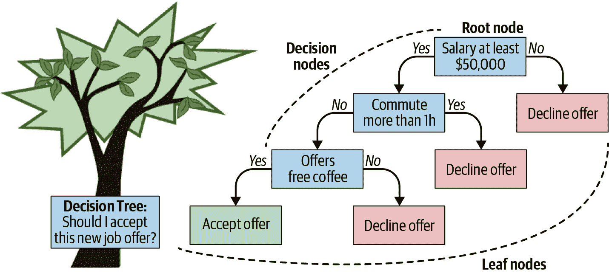

###### 图 10-9\. 决策树示例

树的顶部节点称为树的“根”，因为它是我们“分割”的第一个特征。这个特征应该提供最具信息量的分割——在这种情况下，如果工资低于$50,000，那么大多数候选人会拒绝工作提议。“拒绝提议”节点被称为“叶子节点”，因为在该节点没有其他分割出来；它在一个分支的末端。（是的，我们称之为决策“树”，但是把树的根画在顶部，把叶子画在底部确实有点有趣！）

然而，如果提供的工资高于$50,000，我们会继续处理决策树中下一个最具信息量的特征，即通勤时间。即使工资超过$50,000，如果通勤时间超过一小时，那么大多数人也会拒绝工作提议。

###### 注意

我们不会在这里详细讨论如何确定哪些特征将为您提供最高的信息增益，但如果您感兴趣，可以查阅《[*统计学习的要素*](https://oreil.ly/VHVOW)》第九章，作者是 Trevor Hastie，Robert Tibshirani 和 Jerome Friedman（Springer）。

我们模型中的最终特征是免费咖啡。在这种情况下，决策树显示，如果薪水超过$50,000，通勤时间少于一小时，并且有免费咖啡，那么大多数人将接受我们的工作提议（如果事情真的那么简单的话！）。作为后续资源，[R2D3](https://oreil.ly/uKD8q)提供了关于决策树工作原理的出色可视化。

###### 注意

单个决策树中可能会在同一特征上多次分裂，但每次分裂将发生在不同的值上。

决策树的*深度*是从根节点到任何给定叶节点的最长路径。在图 10-9 中，深度为三。非常深的树容易过拟合，即在训练数据集中记住噪音，但是过于浅的树将对数据集欠拟合（即可能没有从数据中获取更多信号）。

解释了决策树的本质后，让我们重新回到为决策树准备特征的话题。对于决策树，您无需担心标准化或缩放输入特征，因为这对分裂没有影响，但是您必须注意如何准备分类特征。

基于树的方法可以自然地处理分类变量。在`spark.ml`中，您只需将分类列传递给`StringIndexer`，决策树就可以处理其余的部分。让我们将一个决策树拟合到我们的数据集中：

```
# In Python
from pyspark.ml.regression import DecisionTreeRegressor

dt = DecisionTreeRegressor(labelCol="price")

# Filter for just numeric columns (and exclude price, our label)
numericCols = [field for (field, dataType) in trainDF.dtypes 
               if ((dataType == "double") & (field != "price"))]

# Combine output of StringIndexer defined above and numeric columns
assemblerInputs = indexOutputCols + numericCols
vecAssembler = VectorAssembler(inputCols=assemblerInputs, outputCol="features")

# Combine stages into pipeline
stages = [stringIndexer, vecAssembler, dt]
pipeline = Pipeline(stages=stages)
pipelineModel = pipeline.fit(trainDF) # This line should error
```

```
// In Scala
import org.apache.spark.ml.regression.DecisionTreeRegressor

val dt = new DecisionTreeRegressor()
  .setLabelCol("price")

// Filter for just numeric columns (and exclude price, our label)
val numericCols = trainDF.dtypes.filter{ case (field, dataType) => 
  dataType == "DoubleType" && field != "price"}.map(_._1)

// Combine output of StringIndexer defined above and numeric columns
val assemblerInputs = indexOutputCols ++ numericCols
val vecAssembler = new VectorAssembler()
  .setInputCols(assemblerInputs)
  .setOutputCol("features")

// Combine stages into pipeline
val stages = Array(stringIndexer, vecAssembler, dt)
val pipeline = new Pipeline()
  .setStages(stages)

val pipelineModel = pipeline.fit(trainDF) // This line should error
```

这会产生以下错误：

```
java.lang.IllegalArgumentException: requirement failed: DecisionTree requires
maxBins (= 32) to be at least as large as the number of values in each 
categorical feature, but categorical feature 3 has 36 values. Consider removing 
this and other categorical features with a large number of values, or add more 
training examples.
```

我们可以看到`maxBins`参数存在问题。该参数是做什么用的？`maxBins`确定连续特征分成的箱数或分裂数。这个离散化步骤对执行分布式训练至关重要。在`scikit-learn`中没有`maxBins`参数，因为所有数据和模型都驻留在单个机器上。然而，在 Spark 中，工作节点具有数据的所有列，但只有数据的部分行。因此，在通信关于分裂值的特征和值时，我们需要确保它们都在训练时从相同的离散化设置中获取。让我们看一下图 10-10，展示了[PLANET](https://oreil.ly/a0teT)分布式决策树的实现，以更好地理解分布式机器学习并说明`maxBins`参数。

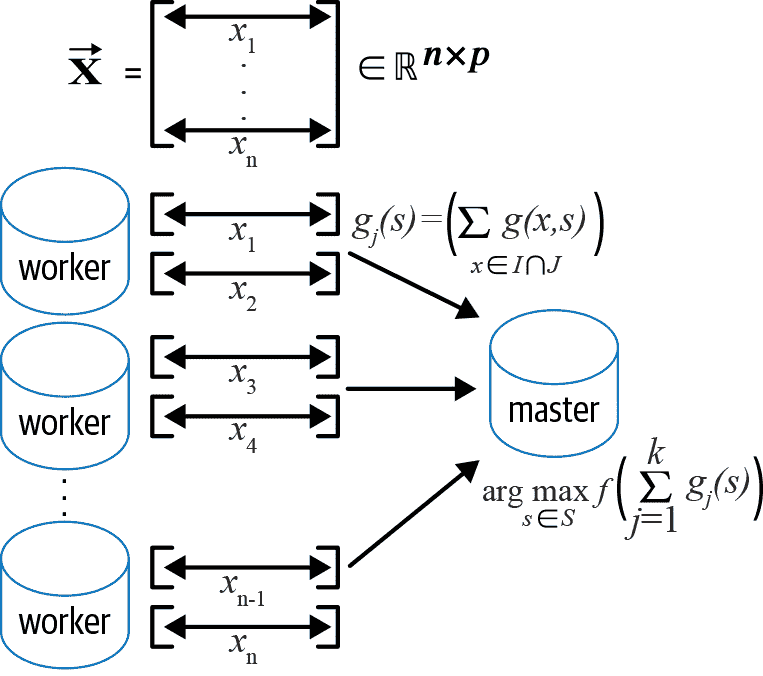

###### 图 10-10\. PLANET 分布式决策树实现（来源：[*https://oreil.ly/RAvvP*](https://oreil.ly/RAvvP)）

每个工作进程都必须计算每个特征和每个可能分割点的汇总统计信息，并且这些统计信息将在工作进程之间进行聚合。MLlib 要求 `maxBins` 要足够大，以处理分类列的离散化。`maxBins` 的默认值为 `32`，而我们有一个具有 36 个不同值的分类列，这就是我们之前遇到错误的原因。虽然我们可以将 `maxBins` 增加到 `64`，以更准确地表示我们的连续特征，但这将使连续变量的可能分割数翻倍，大大增加计算时间。让我们将 `maxBins` 设置为 `40`，然后重新训练管道。在这里，您会注意到我们使用 `setMaxBins()` 设置器方法来修改决策树，而不是完全重新定义它：

```
# In Python
dt.setMaxBins(40)
pipelineModel = pipeline.fit(trainDF)
```

```
// In Scala
dt.setMaxBins(40)
val pipelineModel = pipeline.fit(trainDF)
```

###### 注

由于实现上的差异，当使用 `scikit-learn` 与 MLlib 构建模型时，结果通常不会完全相同。然而，这没有关系。关键是理解它们之间的差异，并查看哪些参数在您的控制之下，以使它们表现出您需要的方式。如果您正在从 `scikit-learn` 迁移工作负载到 MLlib，请查看 [`spark.ml`](https://oreil.ly/qFgc5) 和 [`scikit-learn`](https://scikit-learn.org/stable) 文档，了解不同的参数，并调整这些参数以获得相同数据的可比较结果。一旦数值足够接近，您可以将您的 MLlib 模型扩展到 `scikit-learn` 无法处理的更大数据规模。

现在我们已经成功构建了我们的模型，我们可以提取决策树学到的 if-then-else 规则：

```
# In Python
dtModel = pipelineModel.stages[-1]
print(dtModel.toDebugString)
```

```
// In Scala
val dtModel = pipelineModel.stages.last
  .asInstanceOf[org.apache.spark.ml.regression.DecisionTreeRegressionModel]
println(dtModel.toDebugString)

DecisionTreeRegressionModel: uid=dtr_005040f1efac, depth=5, numNodes=47,...
  If (feature 12 <= 2.5)
   If (feature 12 <= 1.5)
    If (feature 5 in {1.0,2.0})
     If (feature 4 in {0.0,1.0,3.0,5.0,9.0,10.0,11.0,13.0,14.0,16.0,18.0,24.0})
      If (feature 3 in
{0.0,1.0,2.0,3.0,4.0,5.0,6.0,7.0,8.0,9.0,10.0,11.0,12.0,13.0,14.0,...})
       Predict: 104.23992784125075
      Else (feature 3 not in {0.0,1.0,2.0,3.0,4.0,5.0,6.0,7.0,8.0,9.0,10.0,...})
       Predict: 250.7111111111111
...
```

这只是打印输出的一个子集，但您会注意到可以多次在同一特征上分割（例如特征 12），但在不同的分割值上。还请注意决策树在数值特征和分类特征上分割的不同之处：对于数值特征，它检查值是否小于或等于阈值，而对于分类特征，则检查值是否在该集合中。

我们还可以从模型中提取特征重要性分数，以查看最重要的特征：

```
# In Python
import pandas as pd

featureImp = pd.DataFrame(
  list(zip(vecAssembler.getInputCols(), dtModel.featureImportances)),
  columns=["feature", "importance"])
featureImp.sort_values(by="importance", ascending=False)
```

```
// In Scala
val featureImp = vecAssembler
  .getInputCols.zip(dtModel.featureImportances.toArray)
val columns = Array("feature", "Importance")
val featureImpDF = spark.createDataFrame(featureImp).toDF(columns: _*)

featureImpDF.orderBy($"Importance".desc).show()
```

| Feature | Importance |
| --- | --- |
| bedrooms | 0.283406 |
| cancellation_policyIndex | 0.167893 |
| instant_bookableIndex | 0.140081 |
| property_typeIndex | 0.128179 |
| number_of_reviews | 0.126233 |
| neighbourhood_cleansedIndex | 0.056200 |
| longitude | 0.038810 |
| minimum_nights | 0.029473 |
| beds | 0.015218 |
| room_typeIndex | 0.010905 |
| accommodates | 0.003603 |

虽然决策树非常灵活且易于使用，但并不总是最精确的模型。如果我们在测试数据集上计算我们的 *R*²，实际上会得到一个负分数！这比仅预测平均值更糟糕。（您可以在本章的笔记本中查看本书的 [GitHub 仓库](https://github.com/databricks/LearningSparkV2) 中的具体情况。）

让我们通过使用*集成*方法来改进这个模型，这种方法结合了不同的模型以获得更好的结果：随机森林。

### 随机森林

[集成](https://oreil.ly/DoQPU)采用民主的方法。想象一下罐子里有很多颗 M&M 巧克力。你请一百个人猜猜 M&M 的数量，然后取所有猜测的平均值。平均值可能比大多数个体猜测更接近真实值。这个概念同样适用于机器学习模型。如果建立多个模型并组合/平均它们的预测结果，它们将比任何单个模型更加健壮。

[*随机森林*](https://oreil.ly/kpfTc)是由决策树组成的集成学习方法，具有两个关键调整：

行的自助抽样

*自助法*是通过从原始数据中有放回地抽样来模拟新数据的技术。每棵决策树都是在数据集的不同自助样本上训练的，这会产生略有不同的决策树，然后汇总它们的预测结果。这种技术被称为[*自助聚合*](https://oreil.ly/CfWIe)，或者称为*装袋*。在典型的随机森林实现中，每棵树都从原始数据集中有放回地抽取相同数量的数据点进行样本，而这个数量可以通过参数`subsamplingRate`来控制。

列的随机特征选择

装袋的主要缺点在于所有树都高度相关，因此在数据中学习相似的模式。为了减轻这个问题，每次想要进行分裂时只考虑列的随机子集（对于`RandomForestRegressor`为特征数的 1/3，对于`RandomForestClassifier`为特征数的<math display="inline"><msqrt><mo>#</mo><mtext>features</mtext></msqrt></math>）。由于引入了这种随机性，你通常希望每棵树都相对较浅。你可能会想：每棵树都会比任何单个决策树表现得更差，那么这种方法怎么可能更好呢？事实证明，这些树各自从你的数据集中学到了不同的东西，将这些“弱”学习者组合成一个集成使得随机森林比单个决策树更加健壮。

图 10-11 说明了随机森林在训练时的情况。在每次分裂时，它考虑原始特征中的 3 个来进行分裂；最终选择其中最佳的。

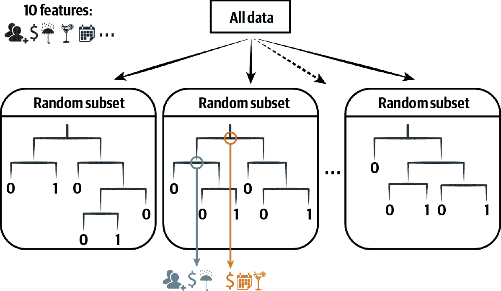

###### 图 10-11\. 随机森林训练

随机森林和决策树的 API 类似，都可以应用于回归或分类任务：

```
# In Python
from pyspark.ml.regression import RandomForestRegressor
rf = RandomForestRegressor(labelCol="price", maxBins=40, seed=42)
```

```
// In Scala
import org.apache.spark.ml.regression.RandomForestRegressor
val rf = new RandomForestRegressor()
  .setLabelCol("price")
  .setMaxBins(40)
  .setSeed(42)
```

一旦训练了随机森林，就可以将新数据点通过集成中训练的不同树。

如图 10-12 所示，如果你构建一个用于分类的随机森林，它会通过森林中的每棵树传递测试点，并对每棵树的预测结果进行多数投票。（相比之下，在回归中，随机森林仅仅是对这些预测进行了平均。）尽管这些树中的每一棵都比任何单独的决策树表现都要差，但集合（或整体）实际上提供了一个更为健壮的模型。

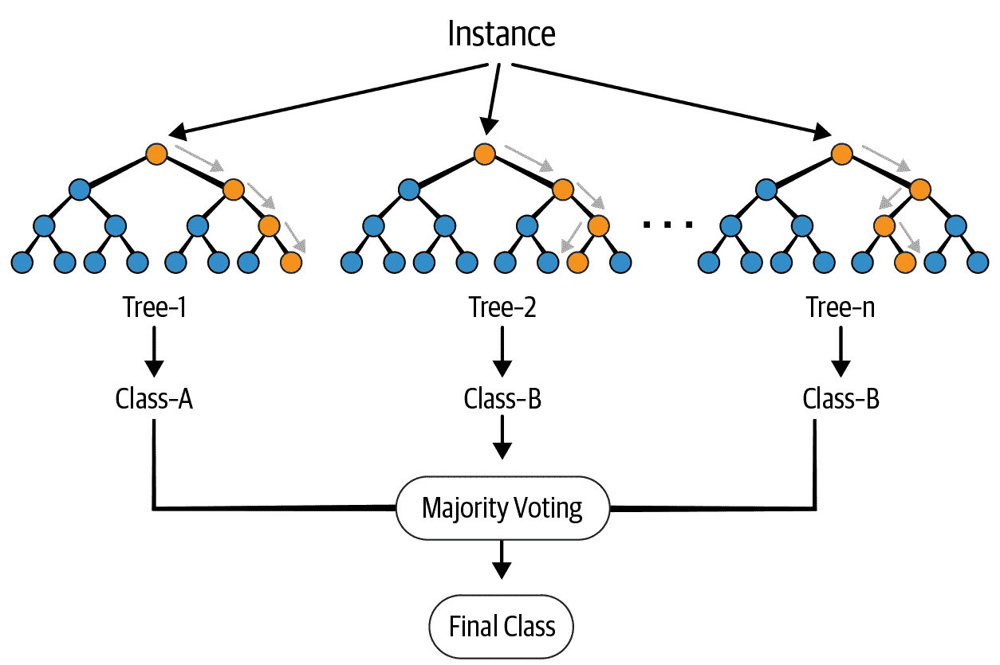

###### 图 10-12\. 随机森林预测

随机森林真正展示了使用 Spark 进行分布式机器学习的威力，因为每棵树都可以独立构建（例如，在构建第 10 棵树之前，你不需要先构建第 3 棵树）。此外，在树的每个层级内，你可以并行处理以找到最优的分割点。

那么我们如何确定我们随机森林中的树的最佳数量或这些树的最大深度应该是多少呢？这个过程被称为[*超参数调优*](https://oreil.ly/SqPGA)。与参数不同，超参数是控制学习过程或模型结构的值，在训练过程中不会被学习。树的数量和最大深度都是你可以为随机森林调整的超参数的例子。现在让我们把焦点转移到如何通过调整一些超参数来发现和评估最佳的随机森林模型。

## k 折交叉验证

我们应该使用哪个数据集来确定最佳超参数值呢？如果我们使用训练集，那么模型可能会过拟合，即记住我们训练数据的细微差别。这意味着它很可能不能很好地推广到未见过的数据。但是如果我们使用测试集，那么它就不再代表“未见过”的数据，因此我们不能用它来验证模型的泛化能力。因此，我们需要另一个数据集来帮助我们确定最佳的超参数：*验证* 数据集。

例如，我们可以将数据划分为 60/20/20 的训练、验证和测试数据集，而不是之前的 80/20 划分。然后我们可以在训练集上构建我们的模型，在验证集上评估性能以选择最佳的超参数配置，并在测试集上应用模型以查看它在新数据上的表现。然而，这种方法的一个缺点是我们失去了 25%的训练数据（80% -> 60%），这些数据本来可以帮助改进模型。这促使我们使用*k 折交叉验证*技术来解决这个问题。

采用这种方法，我们不是将数据集分割为单独的训练、验证和测试集，而是将其分割为与以前相同的训练和测试集，但是我们使用训练数据进行训练和验证。为此，我们将我们的训练数据分成*k*个子集或“折叠”（例如三个）。然后，对于给定的超参数配置，我们在*k-1*个折叠上训练我们的模型，并在剩余的一个折叠上评估，重复这个过程*k*次。图 10-13 说明了这种方法。

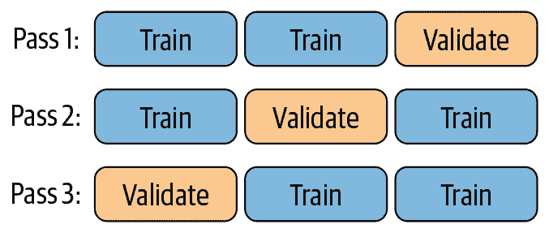

###### 图 10-13。k 折交叉验证

正如本图所示，如果我们将数据分成三折，我们的模型首先在数据的第一和第二折（或分割）上进行训练，并在第三折上进行评估。然后，我们使用相同的超参数在数据的第一和第三折上构建相同的模型，并在第二折上评估其性能。最后，我们在第二和第三折上构建模型，并在第一折上评估它。然后，我们对这三个（或*k*）验证数据集的性能取平均值，作为这个模型在未见数据上表现如何的代理，因为每个数据点有机会恰好成为验证数据集的一部分一次。接下来，我们针对所有不同的超参数配置重复此过程，以确定最佳的配置。

确定超参数的搜索空间可能很困难，通常进行超参数的随机搜索[优于结构化的网格搜索](https://oreil.ly/gI7G-)。有专门的库，比如[Hyperopt](http://hyperopt.github.io/hyperopt)，可以帮助您确定最佳的[超参数配置](https://oreil.ly/7IoxC)，我们在第十一章中有所涉及。

要在 Spark 中执行超参数搜索，请按以下步骤进行：

1.  定义您想要评估的`estimator`。

1.  使用[`ParamGridBuilder`](https://oreil.ly/qOHrU)指定您要变化的超参数及其相应的值。

1.  定义一个`evaluator`来指定用于比较各种模型的度量标准。

1.  使用[`CrossValidator`](https://oreil.ly/ygbF8)执行交叉验证，评估各种模型。

让我们首先定义我们的管道估计器：

```
# In Python
pipeline = Pipeline(stages = [stringIndexer, vecAssembler, rf])
```

```
// In Scala
val pipeline = new Pipeline()
  .setStages(Array(stringIndexer, vecAssembler, rf))
```

对于我们的`ParamGridBuilder`，我们将变化我们的`maxDepth`为 2、4 或 6，以及`numTrees`（随机森林中的树的数量）为 10 或 100。这将给我们总共 6 个（3 x 2）不同的超参数配置网格：

```
(maxDepth=2, numTrees=10)
(maxDepth=2, numTrees=100)
(maxDepth=4, numTrees=10)
(maxDepth=4, numTrees=100)
(maxDepth=6, numTrees=10)
(maxDepth=6, numTrees=100)
```

```
# In Python
from pyspark.ml.tuning import ParamGridBuilder
paramGrid = (ParamGridBuilder()
            .addGrid(rf.maxDepth, [2, 4, 6])
            .addGrid(rf.numTrees, [10, 100])
            .build())
```

```
// In Scala
import org.apache.spark.ml.tuning.ParamGridBuilder
val paramGrid = new ParamGridBuilder()
  .addGrid(rf.maxDepth, Array(2, 4, 6))
  .addGrid(rf.numTrees, Array(10, 100))
  .build()
```

现在我们已经设置好了超参数网格，我们需要定义如何评估每个模型，以确定哪一个表现最佳。为此，我们将使用`RegressionEvaluator`，并将 RMSE 作为我们感兴趣的度量标准：

```
# In Python
evaluator = RegressionEvaluator(labelCol="price", 
                                predictionCol="prediction", 
                                metricName="rmse")
```

```
// In Scala
val evaluator = new RegressionEvaluator()
  .setLabelCol("price")
  .setPredictionCol("prediction")
  .setMetricName("rmse")
```

我们将使用`CrossValidator`执行我们的*k*折交叉验证，它接受一个`estimator`、`evaluator`和`estimatorParamMaps`，以便知道要使用哪个模型，如何评估模型以及为模型设置哪些超参数。我们还可以设置我们希望将数据拆分为的折数（`numFolds=3`），以及设置一个种子，以便在折叠之间具有可重现的拆分（`seed=42`）。然后让我们将这个交叉验证器适配到我们的训练数据集上：

```
# In Python
from pyspark.ml.tuning import CrossValidator

cv = CrossValidator(estimator=pipeline, 
                    evaluator=evaluator, 
                    estimatorParamMaps=paramGrid, 
                    numFolds=3, 
                    seed=42)
cvModel = cv.fit(trainDF)
```

```
// In Scala
import org.apache.spark.ml.tuning.CrossValidator

val cv = new CrossValidator()
 .setEstimator(pipeline)
 .setEvaluator(evaluator)
 .setEstimatorParamMaps(paramGrid)
 .setNumFolds(3)
 .setSeed(42)
val cvModel = cv.fit(trainDF)
```

输出告诉我们操作花费了多长时间：

```
Command took 1.07 minutes
```

那么，我们刚刚训练了多少个模型？如果你回答 18（6 个超参数配置 x 3 折交叉验证），你就接近了。一旦确定了最佳的超参数配置，如何将这三个（或*k*个）模型组合在一起呢？虽然有些模型可能很容易平均起来，但有些则不是。因此，Spark 在确定了最佳的超参数配置后会在整个训练数据集上重新训练您的模型，因此最终我们训练了 19 个模型。如果您想保留训练的中间模型，可以在`CrossValidator`中设置`collectSubModels=True`。

要检查交叉验证器的结果，您可以查看`avgMetrics`：

```
# In Python
list(zip(cvModel.getEstimatorParamMaps(), cvModel.avgMetrics))
```

```
// In Scala
cvModel.getEstimatorParamMaps.zip(cvModel.avgMetrics)
```

这里是输出：

```
res1: Array[(org.apache.spark.ml.param.ParamMap, Double)] =
Array(({
    rfr_a132fb1ab6c8-maxDepth: 2,
    rfr_a132fb1ab6c8-numTrees: 10
},303.99522869739343), ({
    rfr_a132fb1ab6c8-maxDepth: 2,
    rfr_a132fb1ab6c8-numTrees: 100
},299.56501993529474), ({
    rfr_a132fb1ab6c8-maxDepth: 4,
    rfr_a132fb1ab6c8-numTrees: 10
},310.63687030886894), ({
    rfr_a132fb1ab6c8-maxDepth: 4,
    rfr_a132fb1ab6c8-numTrees: 100
},294.7369599168999), ({
    rfr_a132fb1ab6c8-maxDepth: 6,
    rfr_a132fb1ab6c8-numTrees: 10
},312.6678169109293), ({
    rfr_a132fb1ab6c8-maxDepth: 6,
    rfr_a132fb1ab6c8-numTrees: 100
},292.101039874209))
```

我们可以看到，我们的`CrossValidator`中最佳模型（具有最低的 RMSE）具有`maxDepth=6`和`numTrees=100`。然而，这需要很长时间才能运行。在接下来的部分中，我们将看看如何在保持相同模型性能的同时缩短训练时间。

## 优化管道

如果您的代码执行时间足够长，需要考虑如何改进它，那么您应该对其进行优化。在前面的代码中，尽管交叉验证器中的每个模型在技术上是独立的，但`spark.ml`实际上是按顺序而不是并行地训练模型集合。在 Spark 2.3 中，引入了一个[`parallelism`](https://oreil.ly/7-zyU)参数来解决这个问题。此参数确定并行训练的模型数量，这些模型本身是并行适配的。从[Spark 调优指南](https://oreil.ly/FCXV7)中了解更多：

> `parallelism`的值应该谨慎选择，以最大化并行处理能力，而不超过集群资源，并且较大的值并不总是会带来更好的性能。一般来说，大多数集群最多可以使用值为`10`的参数。

将这个值设为`4`，看看我们是否可以更快地训练：

```
# In Python
cvModel = cv.setParallelism(4).fit(trainDF)
```

```
// In Scala
val cvModel = cv.setParallelism(4).fit(trainDF)
```

答案是肯定的：

```
Command took 31.45 seconds
```

我们将训练时间减少了一半（从 1.07 分钟到 31.45 秒），但我们仍然可以进一步改进！还有另一个技巧可以加快模型训练速度：将交叉验证器放在流水线内部（例如，`Pipeline(stages=[..., cv])`），而不是将流水线放在交叉验证器内部（例如，`CrossValidator(estimator=pipeline, ...)`）。每次交叉验证器评估流水线时，它会针对每个模型运行流水线的每个步骤，即使某些步骤不变，比如`StringIndexer`也是如此。通过重新评估流水线中的每个步骤，我们反复学习相同的`StringIndexer`映射，尽管它并未更改。

如果我们将交叉验证器放在流水线内部，那么我们将不会在每次尝试不同模型时重新评估`StringIndexer`（或任何其他估算器）：

```
# In Python
cv = CrossValidator(estimator=rf, 
                    evaluator=evaluator, 
                    estimatorParamMaps=paramGrid, 
                    numFolds=3, 
                    parallelism=4, 
                    seed=42)

pipeline = Pipeline(stages=[stringIndexer, vecAssembler, cv])
pipelineModel = pipeline.fit(trainDF)
```

```
// In Scala
val cv = new CrossValidator()
  .setEstimator(rf)
  .setEvaluator(evaluator)
  .setEstimatorParamMaps(paramGrid)
  .setNumFolds(3)
  .setParallelism(4)
  .setSeed(42)

val pipeline = new Pipeline()
                   .setStages(Array(stringIndexer, vecAssembler, cv))
val pipelineModel = pipeline.fit(trainDF)
```

这减少了我们训练时间的五秒钟：

```
Command took 26.21 seconds
```

借助`parallelism`参数和重排我们的流水线顺序，上次运行速度最快，如果您将其应用于测试数据集，您会发现结果相同。尽管这些收益仅为几秒钟，但同样的技术也适用于更大的数据集和模型，相应地节省了更多时间。您可以通过访问书籍的[GitHub repo](https://github.com/databricks/LearningSparkV2)中的笔记本来尝试运行此代码。

# 总结

在本章中，我们讨论了如何使用 Spark MLlib 构建流水线，特别是其基于 DataFrame 的 API 包`spark.ml`。我们讨论了转换器和估算器之间的区别，如何使用 Pipeline API 组合它们，以及一些不同的评估模型的指标。然后，我们探讨了如何使用交叉验证进行超参数调优以提供最佳模型，以及优化交叉验证和模型训练在 Spark 中的技巧。

所有这些为我们讨论下一章提供了背景，下一章中我们将讨论使用 Spark 管理和扩展机器学习流水线的部署策略。
