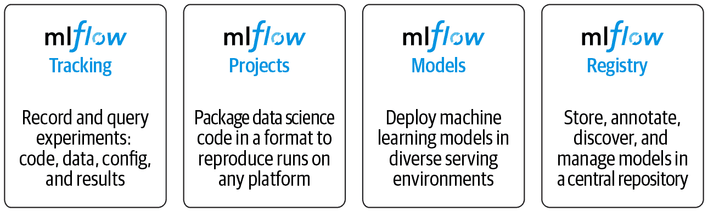
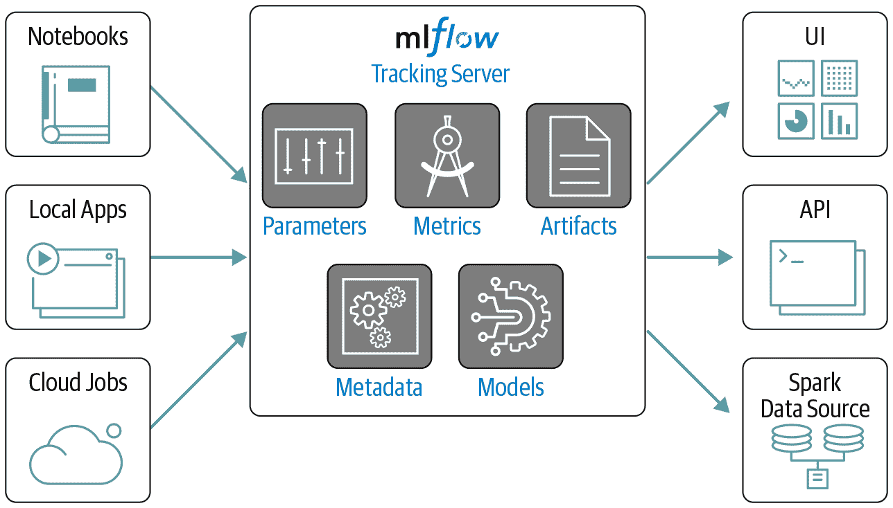
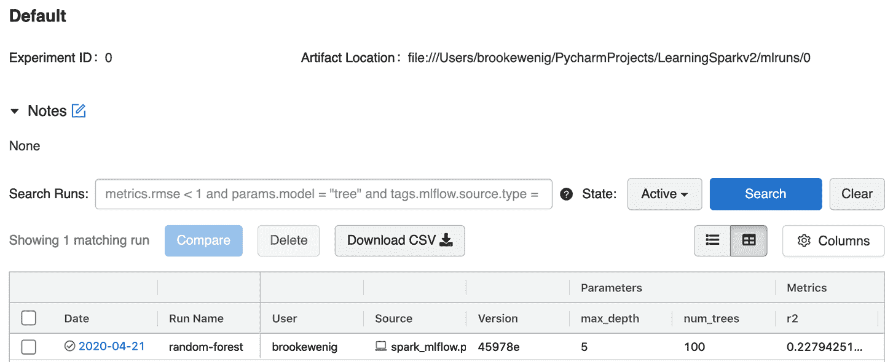
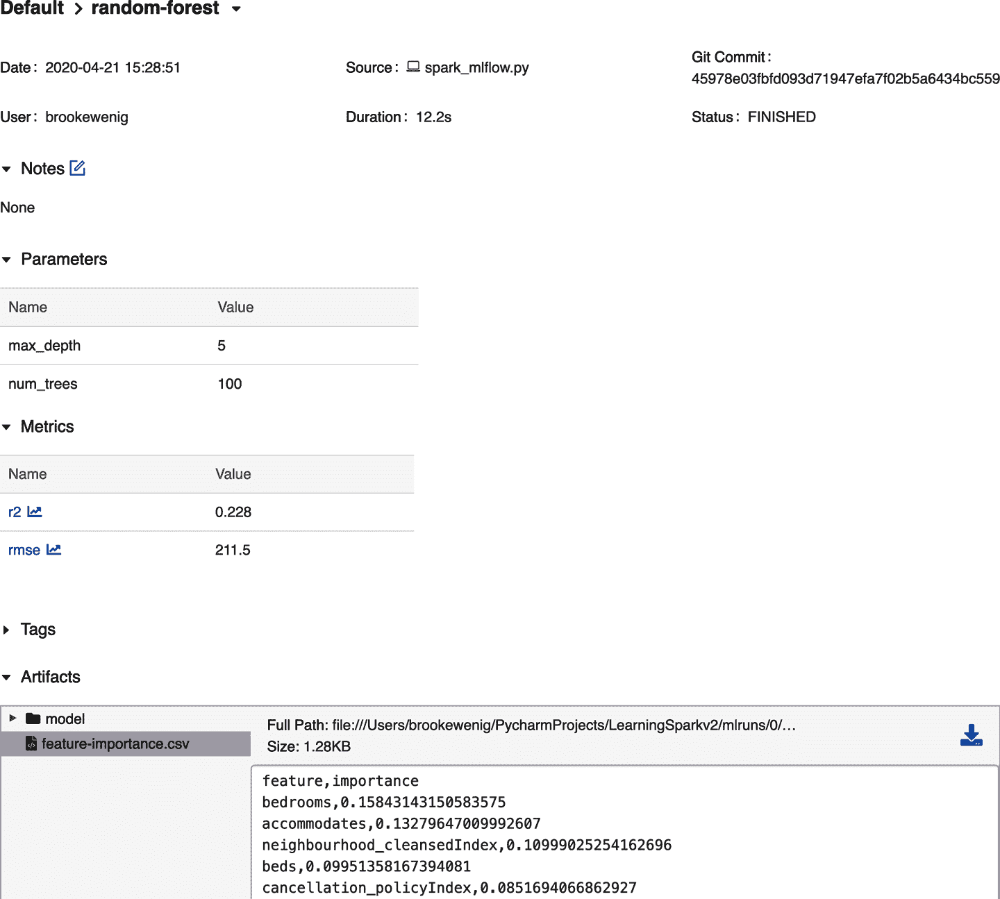
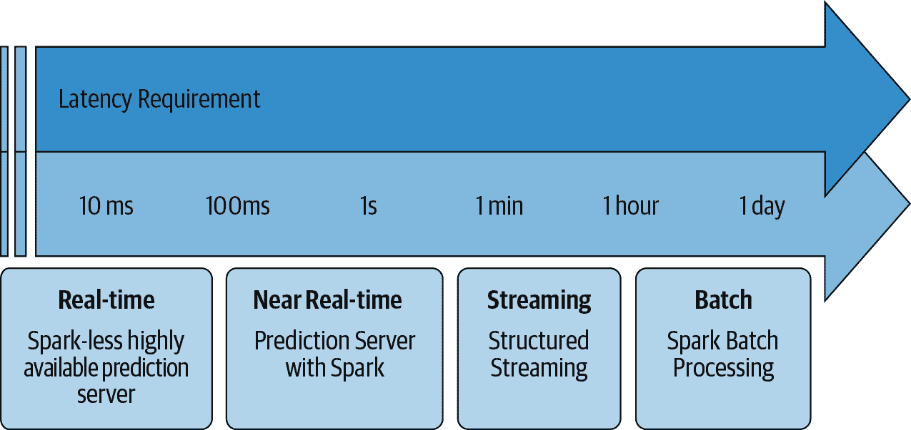
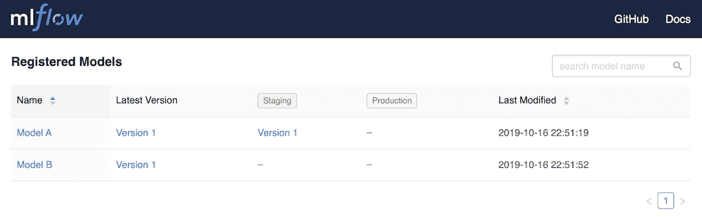
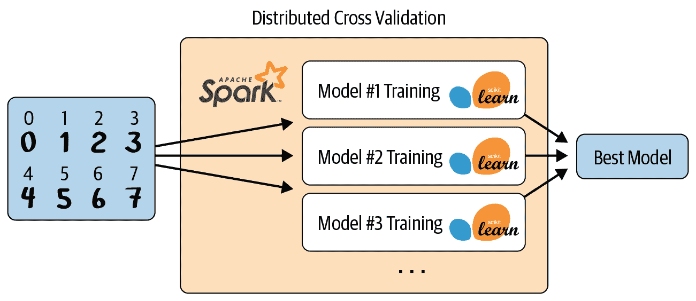

# 第十一章：使用 Apache Spark 管理、部署和扩展机器学习管道

在上一章中，我们介绍了如何使用 MLlib 构建机器学习管道。本章将专注于如何管理和部署你训练的模型。通过本章的学习，你将能够使用 MLflow 跟踪、复现和部署你的 MLlib 模型，讨论各种模型部署场景中的困难和权衡，并设计可扩展的机器学习解决方案。但在讨论部署模型之前，让我们首先讨论一些模型管理的最佳实践，为你的模型部署做好准备。

# 模型管理

在部署机器学习模型之前，你应该确保能够复现和跟踪模型的性能。对于我们来说，端到端的机器学习解决方案的可复现性意味着我们需要能够复现生成模型的代码，训练时使用的环境，训练模型的数据以及模型本身。每个数据科学家都喜欢提醒你设置种子，这样你就可以复现你的实验（例如，在使用具有内在随机性的模型（如随机森林）时进行的训练/测试分割）。然而，影响可复现性的因素远不止设置种子，其中一些因素要微妙得多。以下是一些例子：

库版本管理

当一位数据科学家交给你他们的代码时，他们可能会或者不会提到依赖的库。虽然你可以通过错误消息找出需要的库，但你不确定他们使用的库版本，所以你可能会安装最新的版本。但如果他们的代码是建立在之前的库版本上的，这些版本可能利用了一些与你安装的最新版本不同的默认行为，使用最新版本可能会导致代码出错或结果不同（例如，考虑[XGBoost](https://xgboost.readthedocs.io/en/latest)在 v0.90 中如何改变了处理缺失值的方式）。

数据演变

假设你在 2020 年 6 月 1 日构建了一个模型，并跟踪了所有的超参数、库等信息。然后你试图在 2020 年 7 月 1 日复现同样的模型——但是管道中断或结果不同，因为底层数据发生了变化，这可能是因为某人在初始构建之后添加了额外的列或数量级更多的数据。

执行顺序

如果一位数据科学家交给你他们的代码，你应该能够顺利地从头到尾运行它。然而，数据科学家以非按顺序运行事物而著称，或者多次运行同一个有状态的单元格，使得他们的结果非常难以复现。（他们可能还会检查代码的副本，其中的超参数与用于训练最终模型的超参数不同！）

并行操作

为了最大化吞吐量，GPU 将并行运行许多操作。然而，并不总是能保证执行的顺序，这可能导致不确定性的输出。这是使用诸如 [`tf.reduce_sum()`](https://oreil.ly/FxNt2) 和聚合浮点数（具有有限精度）时的已知问题：添加它们的顺序可能会生成略有不同的结果，这在许多迭代中可能会恶化。

无法重现你的实验通常会成为业务部门接受你的模型或将其投入生产的障碍。虽然你可以构建自己的内部工具来追踪模型、数据、依赖版本等，但它们可能会变得过时、脆弱，并需要大量的开发工作来维护。同样重要的是，具有行业标准的模型管理工具，可以让模型轻松共享给合作伙伴。有开源和专有工具可以帮助我们通过抽象掉许多常见困难来重现我们的机器学习实验。本节将重点介绍 MLflow，因为它与当前可用的开源模型管理工具中的 MLlib 集成最紧密。

## MLflow

[MLflow](https://mlflow.org) 是一个开源平台，帮助开发者重现和分享实验，管理模型等等。它提供了 Python、R 和 Java/Scala 的接口，以及一个 REST API。如图 11-1 所示，MLflow 主要包括四个组件：

追踪（Tracking）

提供 API 来记录参数、度量、代码版本、模型和诸如图表和文本等工件。

项目（Projects）

一个标准化的格式，用于打包你的数据科学项目及其依赖项，以在其他平台上运行。它帮助你管理模型训练过程。

模型（Models）

一个标准化的格式，用于打包模型以部署到不同的执行环境。它提供了一致的 API 来加载和应用模型，无论使用何种算法或库来构建模型。

注册（Registry）

一个存储模型谱系、模型版本、阶段转换和注释的库。



###### 图 11-1\. MLflow 组件

让我们追踪 MLlib 模型实验，在第十章中运行，以便重现。然后我们将讨论模型部署时 MLflow 的其他组件如何发挥作用。要开始使用 MLflow，只需在本地主机上运行 `pip install mlflow`。

### 追踪（Tracking）

MLflow Tracking 是一个日志记录 API，它对实际执行训练的库和环境是不可知的。它围绕数据科学代码执行的概念组织，称为 *runs*。Runs 被聚合成 *experiments*，因此许多 runs 可以成为给定实验的一部分。

MLflow 跟踪服务器可以托管多个实验。您可以使用笔记本、本地应用程序或云作业将日志记录到跟踪服务器，如图 11-2 所示。



###### 图 11-2\. MLflow 跟踪服务器

让我们检查一些可以记录到跟踪服务器的内容：

参数

代码中的键/值输入，例如随机森林中的超参数`num_trees`或`max_depth`

指标

数值（随时间更新）例如 RMSE 或准确率数值

艺术品

文件、数据和模型，例如`matplotlib`图像或 Parquet 文件

元数据

运行信息，比如执行了运行的源代码或代码版本（例如，代码版本的 Git 提交哈希字符串）

模型

您训练的模型（们）

默认情况下，跟踪服务器将所有内容记录到文件系统，但您可以[指定一个数据库](https://oreil.ly/awTsZ)以进行更快的查询，例如参数和指标。让我们为我们的随机森林代码从第十章添加 MLflow 跟踪：

```
# In Python
from pyspark.ml import Pipeline
from pyspark.ml.feature import StringIndexer, VectorAssembler
from pyspark.ml.regression import RandomForestRegressor
from pyspark.ml.evaluation import RegressionEvaluator

filePath = """/databricks-datasets/learning-spark-v2/sf-airbnb/
sf-airbnb-clean.parquet"""
airbnbDF = spark.read.parquet(filePath)
(trainDF, testDF) = airbnbDF.randomSplit([.8, .2], seed=42)

categoricalCols = [field for (field, dataType) in trainDF.dtypes 
                   if dataType == "string"]
indexOutputCols = [x + "Index" for x in categoricalCols]
stringIndexer = StringIndexer(inputCols=categoricalCols, 
                              outputCols=indexOutputCols, 
                              handleInvalid="skip")

numericCols = [field for (field, dataType) in trainDF.dtypes 
               if ((dataType == "double") & (field != "price"))]
assemblerInputs = indexOutputCols + numericCols
vecAssembler = VectorAssembler(inputCols=assemblerInputs, 
                               outputCol="features")

rf = RandomForestRegressor(labelCol="price", maxBins=40, maxDepth=5, 
                           numTrees=100, seed=42)

pipeline = Pipeline(stages=[stringIndexer, vecAssembler, rf])
```

要开始使用`mlflow.start_run()`记录日志，您需要启动一个运行。本章节的示例将使用`with`子句来自动结束`with`块时自动结束运行，而不是显式调用`mlflow.end_run()`：

```
# In Python 
import mlflow
import mlflow.spark
import pandas as pd

with mlflow.start_run(run_name="random-forest") as run:
  # Log params: num_trees and max_depth
  mlflow.log_param("num_trees", rf.getNumTrees())
  mlflow.log_param("max_depth", rf.getMaxDepth())

  # Log model
  pipelineModel = pipeline.fit(trainDF)
  mlflow.spark.log_model(pipelineModel, "model")

  # Log metrics: RMSE and R2
  predDF = pipelineModel.transform(testDF)
  regressionEvaluator = RegressionEvaluator(predictionCol="prediction", 
                                            labelCol="price")
  rmse = regressionEvaluator.setMetricName("rmse").evaluate(predDF)
  r2 = regressionEvaluator.setMetricName("r2").evaluate(predDF)
  mlflow.log_metrics({"rmse": rmse, "r2": r2})

  # Log artifact: feature importance scores
  rfModel = pipelineModel.stages[-1]
  pandasDF = (pd.DataFrame(list(zip(vecAssembler.getInputCols(), 
                                    rfModel.featureImportances)), 
                           columns=["feature", "importance"])
              .sort_values(by="importance", ascending=False))

  # First write to local filesystem, then tell MLflow where to find that file
  pandasDF.to_csv("feature-importance.csv", index=False)
  mlflow.log_artifact("feature-importance.csv")
```

让我们检查 MLflow 用户界面，您可以通过在终端中运行`mlflow ui`并导航至*http://localhost:5000/*来访问。图 11-3 显示了用户界面的截图。



###### 图 11-3\. MLflow 用户界面

用户界面存储了给定实验的所有运行。您可以搜索所有运行，按特定条件过滤运行，比较运行并排查等。如果希望，您还可以将内容导出为 CSV 文件进行本地分析。在 UI 中点击名为`"random-forest"`的运行。您应该看到类似图 11-4 的屏幕。



###### 图 11-4\. 随机森林运行

您会注意到它记录了用于此 MLflow 运行的源代码，并存储了所有相应的参数、指标等。您可以添加关于此运行的自由文本注释，以及标签。运行完成后无法修改参数或指标。

您还可以使用`MlflowClient`或 REST API 查询跟踪服务器：

```
# In Python
from mlflow.tracking import MlflowClient

client = MlflowClient()
runs = client.search_runs(run.info.experiment_id, 
                          order_by=["attributes.start_time desc"], 
                          max_results=1)

run_id = runs[0].info.run_id
runs[0].data.metrics
```

这将产生以下输出：

```
{'r2': 0.22794251914574226, 'rmse': 211.5096898777315}
```

我们将这段代码作为[MLflow 项目](https://oreil.ly/PleOQ)托管在本书的[GitHub 存储库](https://github.com/databricks/LearningSparkV2)中，因此您可以尝试使用不同的超参数值（例如`max_depth`和`num_trees`）运行它。MLflow 项目内的 YAML 文件指定了库依赖关系，因此此代码可以在其他环境中运行：

```
# In Python
mlflow.run(
  "https://github.com/databricks/LearningSparkV2/#mlflow-project-example", 
  parameters={"max_depth": 5, "num_trees": 100})

# Or on the command line
mlflow run https://github.com/databricks/LearningSparkV2/#mlflow-project-example
-P max_depth=5 -P num_trees=100
```

现在您已经跟踪并复现了您的实验，让我们讨论可用于 MLlib 模型的各种部署选项。

# 使用 MLlib 的模型部署选项

部署机器学习模型对每个组织和用例来说意味着不同的事情。业务约束将对延迟、吞吐量、成本等施加不同的要求，这些要求决定了哪种模型部署模式适合当前任务——无论是批处理、流式处理、实时处理还是移动/嵌入式。在本书之外的范围内，将模型部署到移动/嵌入式系统，因此我们将主要关注其他选项。表 11-1 显示了生成预测的这三种部署选项的[吞吐量](https://oreil.ly/qp1nZ)和[延迟](https://oreil.ly/R7fzj)权衡。我们关心同时请求的数量和请求的大小，所得到的解决方案将会有很大的不同。

表 11-1\. 批处理、流式处理和实时处理比较

|  | 吞吐量 | 延迟 | 示例应用程序 |
| --- | --- | --- | --- |
| **批处理** | 高 | 高（几小时到几天） | 客户流失预测 |
| **流式处理** | 中等 | 中等（秒到分钟） | 动态定价 |
| **实时处理** | 低 | 低（毫秒级） | 在线广告竞价 |

批处理会定期生成预测并将结果写入持久存储以供其他地方提供服务。通常它是最便宜和最简单的部署选项，因为您只需在计划运行期间支付计算费用。批处理每个数据点的效率更高，因为在所有进行的预测中摊销更少的开销。这在 Spark 中特别明显，因为在驱动程序和执行器之间来回通信的开销很大——您不希望逐个数据点地进行预测！然而，它的主要缺点是延迟，因为通常会安排几小时或几天的时间来生成下一批预测。

流式处理在吞吐量和延迟之间提供了一个很好的权衡。您将持续对数据的微批次进行预测，并在几秒钟到几分钟内获取预测结果。如果您使用结构化流处理，几乎所有代码看起来都与批处理用例相同，这使得在这两个选项之间来回切换变得容易。使用流式处理，您将不得不为使用的虚拟机或计算资源支付费用，以确保系统能够持续运行，并确保正确配置流以实现容错和在数据传入出现峰值时提供缓冲。

实时部署优先考虑延迟而非吞吐量，并在几毫秒内生成预测。如果需求激增（例如，在假期期间的在线零售商），您的基础架构需要支持负载平衡，并能够扩展到许多并发请求。有时，当人们提到“实时部署”时，他们指的是实时提取预先计算的预测，但在这里，我们指的是实时生成模型预测。实时部署是 Spark 无法满足延迟要求的唯一选项，因此如果要使用它，您需要在 Spark 之外导出您的模型。例如，如果您打算使用 REST 端点进行实时模型推断（例如，在 50 毫秒内计算预测），MLlib 无法满足此应用所需的延迟要求，如图 11-5 所示。您需要将特征准备和模型移出 Spark，这可能是耗时且困难的过程。



###### 图 11-5. MLlib 的部署选项

在开始建模过程之前，您需要定义您的模型部署要求。MLlib 和 Spark 只是您工具箱中的几个工具，您需要理解何时以及在何处应用它们。本节的其余部分将更深入地讨论 MLlib 的部署选项，然后我们将考虑非 MLlib 模型的 Spark 部署选项。

## 批量

批量部署代表了部署机器学习模型的大多数用例，并且这可能是最容易实现的选项。您将运行定期作业来生成预测，并将结果保存到表格、数据库、数据湖等以供下游消费。事实上，您已经在第十章中看到了如何使用 MLlib 生成批量预测。MLlib 的`model.transform()`将并行地将模型应用于 DataFrame 的所有分区：

```
# In Python
# Load saved model with MLflow
import mlflow.spark
pipelineModel = mlflow.spark.load_model(f"runs:/{run_id}/model")

# Generate predictions
inputDF = spark.read.parquet("/databricks-datasets/learning-spark-v2/
  sf-airbnb/sf-airbnb-clean.parquet")

predDF = pipelineModel.transform(inputDF)
```

批量部署需要注意以下几点：

您将多频繁地生成预测？

存在延迟和吞吐量之间的权衡。批量将多个预测批次在一起可以获得更高的吞吐量，但接收任何单个预测结果的时间会更长，延迟您对这些预测的行动能力。

您会多频繁地重新训练模型？

不像像 sklearn 或 TensorFlow 这样的库，MLlib 不支持在线更新或热启动。如果您想重新训练模型以整合最新数据，您需要从头开始重新训练整个模型，而不是利用现有参数。关于重新训练的频率，有些人会设置定期作业来重新训练模型（例如，每月一次），而其他人则会积极[监控模型漂移](https://oreil.ly/aX4dT)以确定何时需要重新训练。

您将如何对模型进行版本管理？

您可以使用[MLflow 模型注册表](https://oreil.ly/D5LR6)来跟踪您正在使用的模型，并控制它们如何在暂存、生产和归档之间过渡。您可以在图 11-6 中查看模型注册表的截图。您还可以将模型注册表与其他部署选项一起使用。



###### 图 11-6\. MLflow 模型注册表

除了使用 MLflow UI 来管理您的模型外，您还可以以编程方式管理它们。例如，一旦您注册了生产模型，它就有一个一致的 URI，您可以使用它来检索最新版本：

```
# Retrieve latest production model
model_production_uri = f"models:/{model_name}/production"
model_production = mlflow.spark.load_model(model_production_uri)
```

## 流式处理

不必等待每小时或每夜的作业来处理数据并生成预测，结构化流处理可以连续对传入数据进行推断。虽然这种方法比批处理解决方案更昂贵，因为您必须持续支付计算时间（并且获得较低的吞吐量），但您可以更频繁地生成预测，以便更早地采取行动。总体而言，流处理解决方案比批处理解决方案更复杂，需要更多的维护和监控工作，但提供更低的延迟。

使用 Spark，将批量预测转换为流式预测非常容易，实际上所有的代码都是一样的。唯一的区别在于，在读取数据时，您需要使用`spark.readStream()`而不是`spark.read()`并更改数据源。在下面的示例中，我们将通过流式处理一组 Parquet 文件的方式模拟读取流数据。您会注意到，尽管我们使用 Parquet 文件，但我们仍需要定义模式，因为在处理流数据时需要事先定义模式。在此示例中，我们将使用在前一章节中基于我们的 Airbnb 数据集训练的随机森林模型来执行这些流式预测。我们将使用 MLflow 加载保存的模型。我们将源文件分成了一百个小的 Parquet 文件，以便您可以在每个触发间隔看到输出变化：

```
# In Python
# Load saved model with MLflow
pipelineModel = mlflow.spark.load_model(f"runs:/{run_id}/model")

# Set up simulated streaming data
repartitionedPath = "/databricks-datasets/learning-spark-v2/sf-airbnb/
  sf-airbnb-clean-100p.parquet"
schema = spark.read.parquet(repartitionedPath).schema

streamingData = (spark
                 .readStream
                 .schema(schema) # Can set the schema this way
                 .option("maxFilesPerTrigger", 1)
                 .parquet(repartitionedPath))

# Generate predictions
streamPred = pipelineModel.transform(streamingData)
```

在生成这些预测之后，您可以将它们写入任何目标位置，以便稍后检索（请参阅第 8 章中关于结构化流处理的提示）。正如您所见，批处理和流处理场景之间的代码几乎没有变化，这使得 MLlib 成为两者的良好解决方案。然而，根据任务对延迟的需求不同，MLlib 可能不是最佳选择。使用 Spark 在生成查询计划和在驱动程序与工作节点之间传输任务和结果时会涉及显著的开销。因此，如果您需要真正低延迟的预测，您需要将模型导出到 Spark 之外。

## 实时推理的模型导出模式

有一些领域需要实时推断，包括欺诈检测、广告推荐等。尽管使用少量记录进行预测可以达到实时推断所需的低延迟，但您将需要处理负载平衡（处理许多并发请求）以及延迟关键任务中的地理位置。有一些流行的托管解决方案，例如 [AWS SageMaker](https://aws.amazon.com/sagemaker) 和 [Azure ML](https://oreil.ly/OzEnY)，提供了低延迟模型服务解决方案。在本节中，我们将展示如何导出您的 MLlib 模型，以便部署到这些服务中。

将模型从 Spark 导出的一种方法是在 Python、C 等中本地重新实现模型。虽然提取模型的系数似乎很简单，但连同特征工程和预处理步骤（`OneHotEncoder`、`VectorAssembler` 等）导出时会很麻烦，并且容易出错。有一些开源库，如 [MLeap](https://mleap-docs.combust.ml) 和 [ONNX](https://onnx.ai)，可以帮助您自动导出 MLlib 模型的支持子集，以消除它们对 Spark 的依赖。然而，到撰写本文时，开发 MLeap 的公司已不再支持它。MLeap 也尚不支持 Scala 2.12/Spark 3.0。

另一方面，ONNX（开放神经网络交换）已成为机器学习互操作性的事实开放标准。您可能还记得其他机器学习互操作格式，如 PMML（预测模型标记语言），但它们从未像现在的 ONNX 那样广受欢迎。在深度学习社区中，ONNX 作为一种工具非常受欢迎，它允许开发人员轻松在不同库和语言之间切换，并在撰写本文时，它已经具有对 MLlib 的实验性支持。

与导出 MLlib 模型不同，还有其他第三方库与 Spark 集成，方便在实时场景中部署，例如 [XGBoost](https://oreil.ly/7-iZJ) 和 H2O.ai 的 [Sparkling Water](https://oreil.ly/yhKP9)（其名称源自 H2O 和 Spark 的结合）。

XGBoost 是结构化数据问题中 [最成功的算法之一](https://oreil.ly/iReUA) 在 [Kaggle 竞赛](https://www.kaggle.com) 中，它是数据科学家中非常流行的库。虽然 XGBoost 技术上不属于 MLlib 的一部分，但 [XGBoost4J-Spark 库](https://oreil.ly/XGg5c) 允许您将分布式 XGBoost 集成到 MLlib 流水线中。XGBoost 的一个好处是部署的简易性：在训练 MLlib 流水线后，您可以提取 XGBoost 模型并保存为非 Spark 模型，用于 Python 服务，如此展示：

```
// In Scala
val xgboostModel = 
  xgboostPipelineModel.stages.last.asInstanceOf[XGBoostRegressionModel]
xgboostModel.nativeBooster.saveModel(nativeModelPath)
```

```
# In Python
import xgboost as xgb
bst = xgb.Booster({'nthread': 4})
bst.load_model("xgboost_native_model")
```

###### 注意

到撰写本文时，分布式 XGBoost API 仅在 Java/Scala 中可用。书中的示例可以在 [GitHub 仓库](https://github.com/databricks/LearningSparkV2) 找到。

现在您已经了解了不同的导出 MLlib 模型以在实时服务环境中使用的方式，请讨论我们如何利用 Spark 对非 MLlib 模型进行优化。

# 利用 Spark 进行非 MLlib 模型

正如之前提到的，MLlib 并不总是满足您的机器学习需求的最佳解决方案。它可能无法满足超低延迟推断要求，或者没有内置支持您想要使用的算法。对于这些情况，您仍然可以利用 Spark，但不使用 MLlib。在本节中，我们将讨论如何使用 Spark 执行单节点模型的分布式推断，使用 Pandas UDFs 进行超参数调整和特征工程的扩展。

## Pandas UDFs

虽然 MLlib 在分布式训练模型方面非常出色，但您不仅限于仅使用 MLlib 在 Spark 中进行批处理或流式预测，您可以创建自定义函数以在规模化时应用您预先训练的模型，称为用户定义函数（UDFs，在 第五章 中有介绍）。一个常见的用例是在单台机器上构建 scikit-learn 或 TensorFlow 模型，可能在数据子集上，但使用 Spark 在整个数据集上进行分布式推断。

如果您在 Python 中定义自己的 UDF 来将模型应用于 DataFrame 的每条记录，请选择 [pandas UDFs](https://oreil.ly/ww2_S) 进行优化的序列化和反序列化，如 第五章 中所讨论的。但是，如果您的模型非常庞大，则 Pandas UDF 对于每个批次重复加载相同模型会有很高的开销。在 Spark 3.0 中，Pandas UDF 可以接受 `pandas.Series` 或 `pandas.DataFrame` 的迭代器，因此您只需加载一次模型，而不是在迭代器中的每个系列中重复加载。有关 Apache Spark 3.0 中 Pandas UDF 的新功能详情，请参阅 第十二章。

###### 注意

如果工作节点在第一次加载后缓存了模型权重，使用相同模型加载的同一个 UDF 的后续调用将变得显著更快。

在下面的示例中，我们将使用 Spark 3.0 中引入的 `mapInPandas()` 来将 `scikit-learn` 模型应用于我们的 Airbnb 数据集。`mapInPandas()` 接受 `pandas.DataFrame` 的迭代器作为输入，并输出另一个 `pandas.DataFrame` 的迭代器。如果您的模型需要所有列作为输入，它非常灵活且易于使用，但需要整个 DataFrame 的序列化/反序列化（因为它传递给其输入）。您可以通过 `spark.sql.execution.arrow.maxRecordsPerBatch` 配置来控制每个 `pandas.DataFrame` 的大小。可以在本书的 [GitHub 仓库](https://github.com/databricks/LearningSparkV2) 中找到生成模型的完整代码，但在这里我们只关注从 MLflow 加载保存的 `scikit-learn` 模型并将其应用于我们的 Spark DataFrame：

```
# In Python
import mlflow.sklearn
import pandas as pd

def predict(iterator):
  model_path = f"runs:/{run_id}/random-forest-model"
  model = mlflow.sklearn.load_model(model_path) # Load model
  for features in iterator:
    yield pd.DataFrame(model.predict(features))

df.mapInPandas(predict, "prediction double").show(3)

+-----------------+
|       prediction|
+-----------------+
| 90.4355866254844|
|255.3459534312323|
| 499.625544914651|
+-----------------+
```

除了使用 Pandas UDF 扩展规模应用模型之外，你还可以使用它们来并行化构建多个模型的过程。例如，你可能希望为每种 IoT 设备类型构建一个模型来预测故障时间。你可以使用 `pyspark.sql.GroupedData.applyInPandas()`（在 Spark 3.0 中引入）来完成此任务。该函数接受一个 `pandas.DataFrame` 并返回另一个 `pandas.DataFrame`。本书的 GitHub 存储库包含了构建每种 IoT 设备类型模型的完整代码示例，并使用 MLflow 跟踪各个模型；这里只包含了一个简短的片段以保持简洁：

```
# In Python
df.groupBy("device_id").applyInPandas(build_model, schema=trainReturnSchema)
```

`groupBy()` 会导致数据集完全洗牌，你需要确保每个组的模型和数据都能在一台机器上适合。你们中的一些人可能熟悉 `pyspark.sql.GroupedData.apply()`（例如，`df.groupBy("device_id").apply(build_model)`），但该 API 将在未来的 Spark 版本中弃用，推荐使用 `pyspark.sql.GroupedData.applyInPandas()`。

现在你已经看到如何应用 UDF 进行分布式推断和并行化模型构建，让我们看看如何使用 Spark 进行分布式超参数调整。

## Spark 用于分布式超参数调整

即使你不打算进行分布式推断或不需要 MLlib 的分布式训练能力，你仍然可以利用 Spark 进行分布式超参数调整。本节将特别介绍两个开源库：Joblib 和 Hyperopt。

### Joblib

根据其文档，[Joblib](https://github.com/joblib/joblib) 是“提供 Python 中轻量级管道处理的一组工具”。它具有 Spark 后端，可在 Spark 集群上分发任务。Joblib 可用于超参数调整，因为它会自动将数据的副本广播到所有工作节点，然后在数据的各自副本上使用不同的超参数创建自己的模型。这允许你并行训练和评估多个模型。但你仍然有一个基本限制，即单个模型和所有数据必须适合一台机器，但你可以轻松地并行化超参数搜索，正如 图 11-7 中所示。



###### 图 11-7\. 分布式超参数搜索

要使用 Joblib，请通过 `pip install joblibspark` 进行安装。确保你使用的是 `scikit-learn` 版本 0.21 或更高以及 `pyspark` 版本 2.4.4 或更高。这里展示了一个分布式交叉验证的示例，相同的方法也适用于分布式超参数调整：

```
# In Python
from sklearn.utils import parallel_backend
from sklearn.ensemble import RandomForestRegressor
from sklearn.model_selection import train_test_split
from sklearn.model_selection import GridSearchCV
import pandas as pd
from joblibspark import register_spark

register_spark() # Register Spark backend

df = pd.read_csv("/dbfs/databricks-datasets/learning-spark-v2/sf-airbnb/
  sf-airbnb-numeric.csv")
X_train, X_test, y_train, y_test = train_test_split(df.drop(["price"], axis=1), 
  df[["price"]].values.ravel(), random_state=42)

rf = RandomForestRegressor(random_state=42)
param_grid = {"max_depth": [2, 5, 10], "n_estimators": [20, 50, 100]}
gscv = GridSearchCV(rf, param_grid, cv=3)

with parallel_backend("spark", n_jobs=3):
  gscv.fit(X_train, y_train)

print(gscv.cv_results_)
```

查看 `scikit-learn` [GridSearchCV 文档](https://oreil.ly/zjuSD)，了解交叉验证器返回的参数解释。

### Hyperopt

[Hyperopt](https://oreil.ly/N9TVh) 是一个 Python 库，用于“在棘手的搜索空间上进行串行和并行优化，这些空间可能包括实值、离散和条件维度”。您可以通过 `pip install hyperopt` 安装它。有两种主要方法可以使用 [Apache Spark 扩展 Hyperopt](https://oreil.ly/D07fV)：

+   使用单机 Hyperopt 与分布式训练算法（例如 MLlib）

+   使用 `SparkTrials` 类的分布式 Hyperopt 与单机训练算法

对于前一种情况，与使用 Hyperopt 与任何其他库相比，您无需特别配置 MLlib。所以，让我们看看后一种情况：单节点模型的分布式 Hyperopt。不幸的是，您目前无法将分布式超参数评估与分布式训练模型结合起来。有关为 [Keras](https://oreil.ly/XbHSG) 模型并行化超参数搜索的完整代码示例可以在该书的 [GitHub 仓库](https://github.com/databricks/LearningSparkV2) 中找到；这里仅包含一个片段，以说明 Hyperopt 的关键组成部分：

```
# In Python
import hyperopt

best_hyperparameters = hyperopt.fmin(
  fn = training_function,
  space = search_space,
  algo = hyperopt.tpe.suggest,
  max_evals = 64,
  trials = hyperopt.SparkTrials(parallelism=4))
```

`fmin()` 生成新的超参数配置，用于您的 `training_function` 并传递给 `SparkTrials`。 `SparkTrials` 将这些训练任务的批次作为单个 Spark 作业并行运行在每个 Spark 执行器上。当 Spark 任务完成时，它将结果和相应的损失返回给驱动程序。Hyperopt 使用这些新结果来计算未来任务的更好超参数配置。这允许进行大规模超参数调整。MLflow 也与 Hyperopt 集成，因此您可以跟踪您作为超参数调整一部分训练的所有模型的结果。

`SparkTrials` 的一个重要参数是 `parallelism`。这确定同时评估的最大试验数。如果 `parallelism=1`，则您是按顺序训练每个模型，但通过充分利用自适应算法，您可能会获得更好的模型。如果设置 `parallelism=max_evals`（要训练的总模型数），那么您只是在进行随机搜索。在 `1` 到 `max_evals` 之间的任何数字允许您在可扩展性和适应性之间进行权衡。默认情况下，`parallelism` 设置为 Spark 执行器的数量。您还可以指定 `timeout` 来限制 `fmin()` 允许花费的最大秒数。

即使 MLlib 对您的问题不合适，希望您能看到在任何机器学习任务中使用 Spark 的价值。

# 摘要

在本章中，我们涵盖了多种管理和部署机器学习流水线的最佳实践。您看到了 MLflow 如何帮助您跟踪和重现实验，并将您的代码及其依赖打包以便在其他地方部署。我们还讨论了主要的部署选项——批处理、流处理和实时处理——及其相关的权衡取舍。MLlib 是大规模模型训练和批处理/流处理用例的绝佳解决方案，但在小数据集上进行实时推断时，它无法与单节点模型相提并论。您的部署需求直接影响您可以使用的模型和框架类型，因此在开始模型构建过程之前讨论这些需求至关重要。

在下一章中，我们将重点介绍 Spark 3.0 的几个关键新功能，以及如何将它们整合到您的 Spark 工作负载中。
