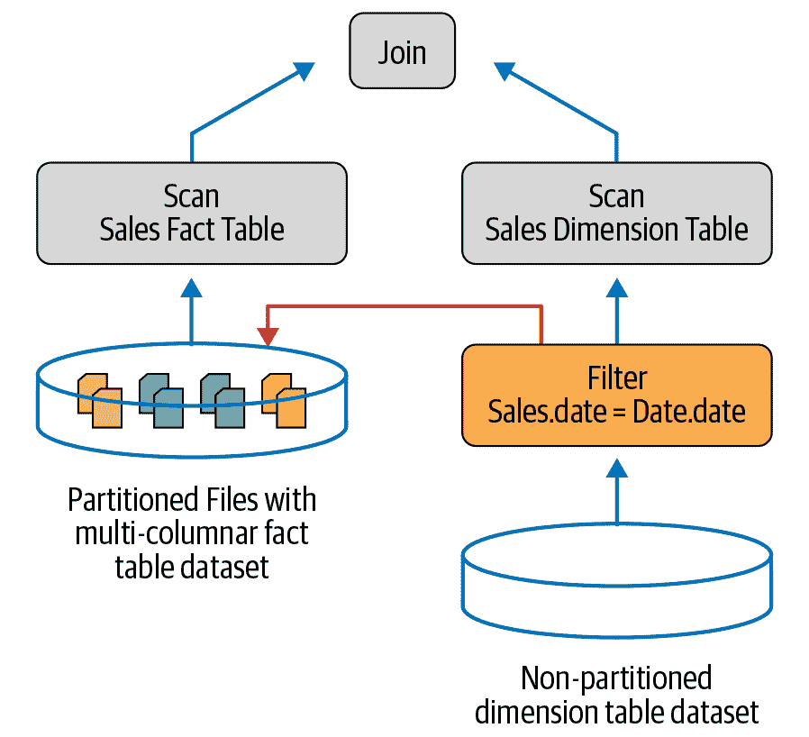
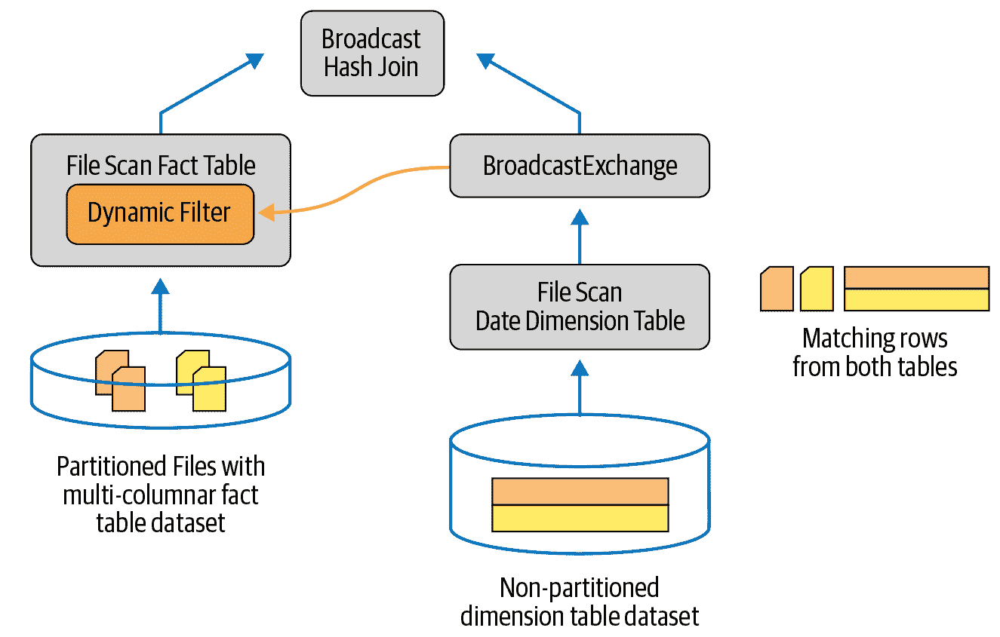
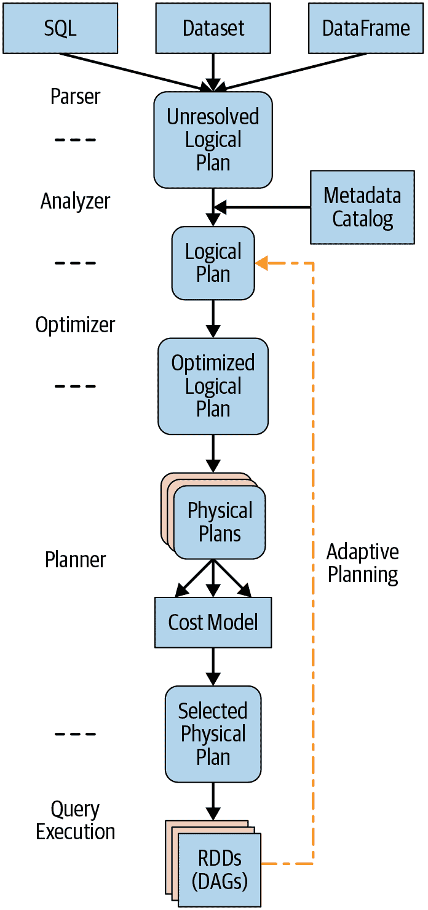
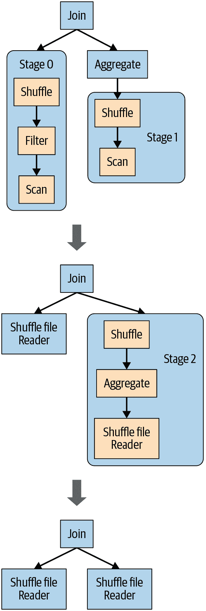
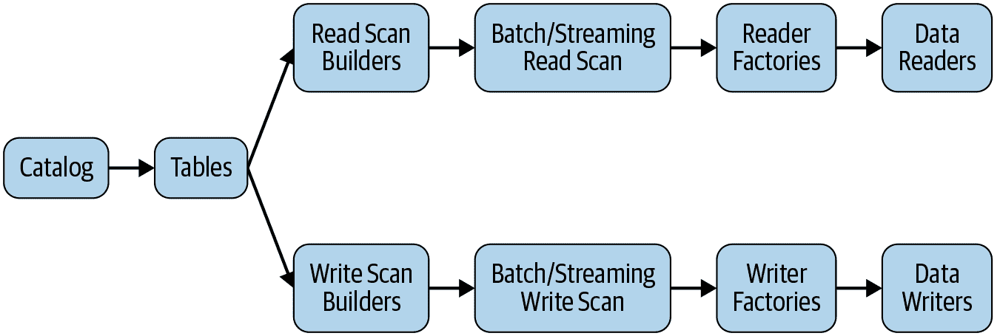
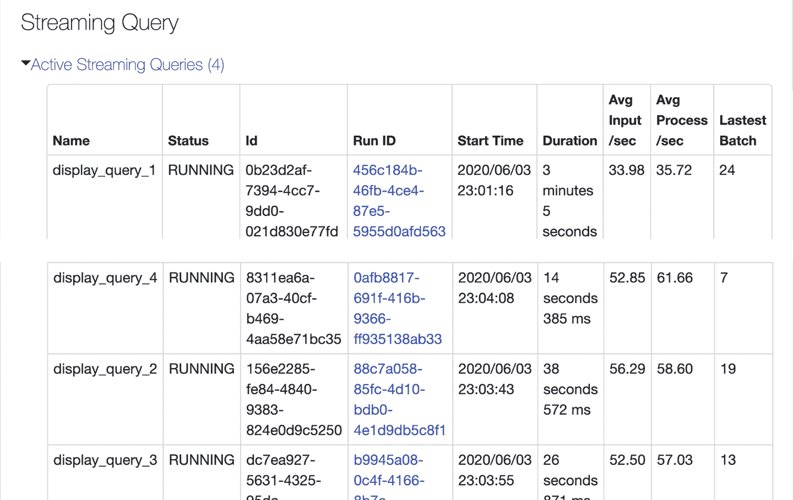
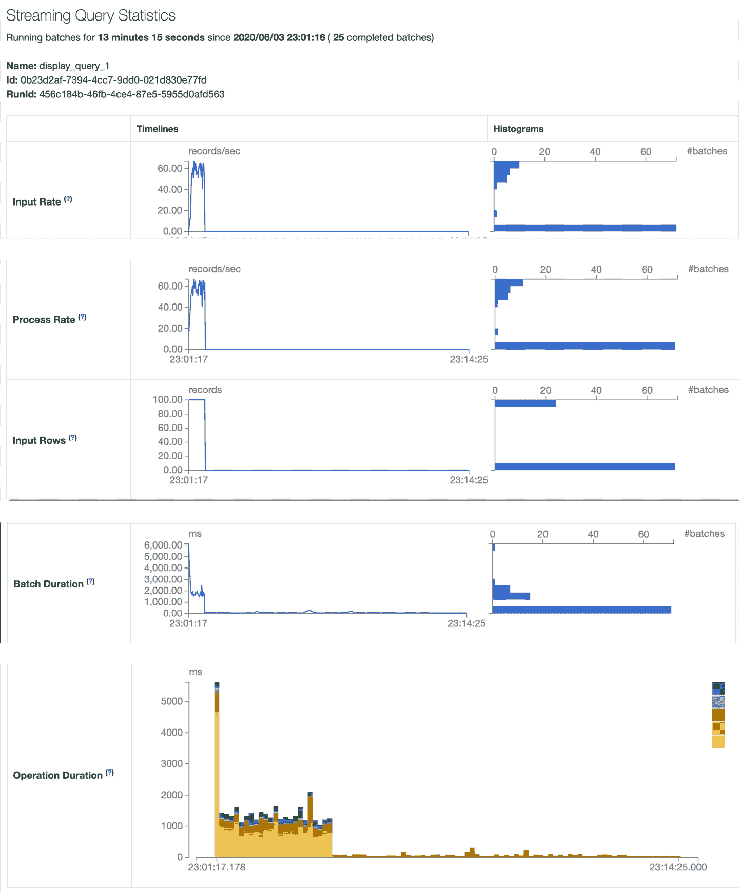

# 第十二章：结语：Apache Spark 3.0

我们撰写本书时，Apache Spark 3.0 尚未正式发布；它仍在开发中，我们使用的是 Spark 3.0.0-preview2 版本。本书中的所有代码示例均经过 Spark 3.0.0-preview2 版本测试，且它们在正式发布的 Spark 3.0 版本中应该没有区别。在各章节中，尽可能地提及了 Spark 3.0 中新增的特性和行为变化。在本章中，我们对这些变化进行了概述。

修复的错误和功能增强非常多，为了简洁起见，我们仅突出了与 Spark 组件相关的一些显著变化和功能。一些新功能在幕后非常先进，超出了本书的范围，但我们在此提到它们，以便您在发布普遍可用时进行探索。

# Spark Core 和 Spark SQL

让我们首先考虑一下底层的新变化。Spark Core 和 Spark SQL 引擎都引入了一些变化来加快查询速度。一种加快查询速度的方法是通过动态分区裁剪来减少读取的数据量。另一种方法是在执行期间调整和优化查询计划。

## 动态分区裁剪

[动态分区裁剪（DPP）](https://oreil.ly/fizdc) 的理念是跳过查询结果中不需要的数据。DPP 最适合的典型场景是在联接两个表时：一个是分区的事实表，另一个是非分区的维度表，如图 12-1 所示。通常，过滤器位于表的非分区一侧（在我们的例子中是`Date`）。例如，考虑以下在两个表`Sales`和`Date`上执行的常见查询：

```
-- In SQL
SELECT * FROM Sales JOIN ON Sales.date = Date.date
```



###### 图 12-1。动态过滤器从维度表注入到事实表中

DPP 中的关键优化技术是将来自维度表的过滤结果作为扫描操作的一部分注入到事实表中，以限制读取的数据量，如图 12-1 所示。

假设维度表比事实表小，并且我们进行了一个联接操作，如图 12-2 所示。在这种情况下，Spark 很可能会执行广播联接（在 第七章 中讨论）。在此联接过程中，Spark 将执行以下步骤来最小化从较大的事实表中扫描的数据量：

1.  在联接的维度表侧，Spark 将从维度表构建一个哈希表，也称为构建关系，作为此过滤查询的一部分。

1.  Spark 将把此查询的结果插入到哈希表中，并将其分配给广播变量，该广播变量分发到所有参与此联接操作的执行器。

1.  在每个执行器上，Spark 将探测广播的哈希表，以确定从事实表中读取哪些对应的行。

1.  最后，Spark 将动态地将此过滤器注入到事实表的文件扫描操作中，并重用广播变量的结果。这样，在事实表的文件扫描操作中，只会扫描与过滤器匹配的分区，并且只会读取所需的数据。



###### 图 12-2\. Spark 在广播连接期间将一个维度表过滤器注入到事实表中

默认情况下启用，因此您无需显式配置，在执行两个表之间的连接时会动态发生这一切。通过 DPP 优化，Spark 3.0 可以更好地处理星型模式查询。

## 自适应查询执行

Spark 3.0 另一种优化查询性能的方法是在运行时调整其物理执行计划。[*自适应查询执行（AQE）*](https://oreil.ly/mO8Ua) 根据在查询执行过程中收集的运行时统计信息，重新优化和调整查询计划。它试图在运行时执行以下操作：

+   通过减少洗牌阶段的 Reducer 数量来减少洗牌分区的数量。

+   优化查询的物理执行计划，例如在适当的情况下将`SortMergeJoin`转换为`BroadcastHashJoin`。

+   处理连接期间的数据倾斜。

所有这些自适应措施都发生在运行时计划的执行过程中，如图 12-3 所示。要在 Spark 3.0 中使用 AQE，请将配置`spark.sql.adaptive.enabled`设置为`true`。



###### 图 12-3\. AQE 在运行时重新检查并重新优化执行计划

### AQE 框架

查询中的 Spark 操作被流水线化并并行执行，但是洗牌或广播交换会打破这个流水线，因为一个阶段的输出需要作为下一个阶段的输入（参见“第 3 步：理解 Spark 应用概念” 在第二章）。在查询阶段中，这些断点称为*物化点*，它们提供了重新优化和重新检查查询的机会，如图 12-4 所示。



###### 图 12-4\. 在 AQE 框架中重新优化的查询计划

这里是 AQE 框架迭代的概念步骤，如图所示：

1.  执行每个阶段的所有叶节点，例如扫描操作。

1.  一旦物化点执行完成，它被标记为完成，并且在其逻辑计划中更新所有相关的统计信息。

1.  基于这些统计数据，如读取的分区数、读取的数据字节数等，框架再次运行 Catalyst 优化器，以了解它是否可以：

    1.  合并分区数以减少读取洗牌数据的减少器数量。

    1.  根据读取的表的大小，用广播连接替换排序合并连接。

    1.  尝试修复倾斜连接。

    1.  创建一个新的优化逻辑计划，然后创建一个新的优化物理计划。

直到查询计划的所有阶段都执行完毕为止，该过程将重复进行。

简而言之，这种重新优化是动态进行的，如图 12-3 所示，其目标是动态合并洗牌分区、减少需要读取洗牌输出数据的减少器数量、在适当时切换连接策略并修复任何倾斜连接。

两个 Spark SQL 配置决定了 AQE 如何减少减少器的数量：

+   `spark.sql.adaptive.coalescePartitions.enabled`（设置为`true`）

+   `spark.sql.adaptive.skewJoin.enabled`（设置为`true`）

在撰写本文时，Spark 3.0 社区博客、文档和示例尚未公开发布，但在出版时它们应该已经发布。如果您希望了解这些功能在幕后的工作原理——包括如何注入 SQL 连接提示，我们将在接下来讨论。

## SQL 连接提示

除了连接的现有`BROADCAST`提示外，Spark 3.0 还为所有[Spark 连接策略](https://oreil.ly/GqlqH)添加了连接提示（参见“Spark 连接家族”中的第七章）。下面为每种连接类型提供了示例。

### 洗牌排序合并连接（SMJ）

借助这些新提示，您可以建议 Spark 在连接表`a`和`b`或`customers`和`orders`时执行`SortMergeJoin`，如下例所示。您可以在`/*+ ... */`注释块内的`SELECT`语句中添加一个或多个提示：

```
SELECT /*+ MERGE(a, b) */ id FROM a JOIN b ON a.key = b.key
SELECT /*+ MERGE(customers, orders) */ * FROM customers, orders WHERE 
    orders.custId = customers.custId
```

### 广播哈希连接（BHJ）

同样地，对于广播哈希连接，您可以向 Spark 提供提示，表明您更喜欢广播连接。例如，在这里我们将表`a`广播连接到表`b`和表`customers`广播连接到表`orders`：

```
SELECT /*+ BROADCAST(a) */ id FROM a JOIN b ON a.key = b.key
SELECT /*+ BROADCAST(customers) */ * FROM customers, orders WHERE 
    orders.custId = customers.custId
```

### 洗牌哈希连接（SHJ）

您可以以类似的方式提供提示以执行洗牌哈希连接，尽管这比前两种支持的连接策略更少见：

```
SELECT /*+ SHUFFLE_HASH(a, b) */ id FROM a JOIN b ON a.key = b.key
SELECT /*+ SHUFFLE_HASH(customers, orders) */ * FROM customers, orders WHERE 
    orders.custId = customers.custId
```

### 洗牌并复制嵌套循环连接（SNLJ）

最后，洗牌并复制嵌套循环连接遵循相似的形式和语法：

```
SELECT /*+ SHUFFLE_REPLICATE_NL(a, b) */ id FROM a JOIN b
```

## 目录插件 API 和 DataSourceV2

Spark 3.0 的实验性 DataSourceV2 API 不仅限于 Hive 元数据存储和目录，还扩展了 Spark 生态系统，并为开发人员提供了三个核心能力。具体来说，它：

+   允许插入外部数据源以进行目录和表管理

+   支持将谓词下推到其他数据源，支持的文件格式如 ORC、Parquet、Kafka、Cassandra、Delta Lake 和 Apache Iceberg。

+   为流数据源和汇提供统一的 API，支持数据的批处理和流处理

针对希望扩展 Spark 使用外部源和汇的开发人员，Catalog API 提供了 SQL 和编程 API，以从指定的可插拔目录创建、修改、加载和删除表。该目录提供了不同层次上执行的功能和操作的分层抽象，如图 12-5 所示。



###### 图 12-5\. Catalog plugin API 的功能层次结构

Spark 与特定连接器的初始交互是将关系解析为其实际的`Table`对象。`Catalog`定义了如何在此连接器中查找表。此外，`Catalog`还可以定义如何修改其自身的元数据，从而实现像`CREATE TABLE`、`ALTER TABLE`等操作。

例如，在 SQL 中，您现在可以发出命令为您的目录创建命名空间。要使用可插拔目录，在您的*spark-defaults.conf*文件中启用以下配置：

```
spark.sql.catalog.ndb_catalog com.ndb.ConnectorImpl # connector implementation
spark.sql.catalog.ndb_catalog.option1  value1
spark.sql.catalog.ndb_catalog.option2  value2
```

在这里，与数据源目录的连接器有两个选项：`option1->value1`和`option2->value2`。一旦它们被定义，Spark 或 SQL 中的应用程序用户可以使用`DataFrameReader`和`DataFrameWriter` API 方法或具有这些定义选项的 Spark SQL 命令作为数据源操作的方法。例如：

```
-- In SQL
SHOW TABLES ndb_catalog;
CREATE TABLE ndb_catalog.table_1;
SELECT * from ndb_catalog.table_1;
ALTER TABLE ndb_catalog.table_1
```

```
// In Scala 
df.writeTo("ndb_catalog.table_1")
val dfNBD = spark.read.table("ndb_catalog.table_1")
  .option("option1", "value1")
  .option("option2", "value2")
```

尽管这些目录插件 API 扩展了 Spark 利用外部数据源作为汇和源的能力，但它们仍处于试验阶段，不应在生产环境中使用。本书不涵盖其详细使用指南，但如果您希望编写自定义连接器以将外部数据源作为目录来管理您的外部表及其相关元数据，则建议您查阅发布文档以获取更多信息。

###### 注意

以下是在您定义和实现目录连接器并用数据填充后，您的代码可能看起来像的示例代码片段。

## 加速器感知调度器

[Project Hydrogen](https://oreil.ly/Jk4rA)，一个将人工智能和大数据结合起来的社区倡议，有三个主要目标：实现障碍执行模式、加速器感知调度和优化数据交换。Apache Spark 2.4.0 引入了[障碍执行模式](https://oreil.ly/RDyb1)的基本实现。在 Spark 3.0 中，已实现了基本的[调度器](https://oreil.ly/9TOyT)，以利用目标平台上 Spark 独立模式、YARN 或 Kubernetes 上的 GPU 等硬件加速器。

要使 Spark 以组织良好的方式利用这些 GPU 用于使用它们的专门工作负载，您必须通过配置指定可用的硬件资源。然后，您的应用程序可以通过发现脚本帮助发现它们。在 Spark 应用程序中启用 GPU 使用是一个三步骤过程：

1.  编写一个发现脚本，以发现每个 Spark 执行器上可用的底层 GPU 的地址。此脚本设置在以下 Spark 配置中：

    ```
    spark.worker.resource.gpu.discoveryScript=*/path/to/script.sh*
    ```

1.  配置您的 Spark 执行器以使用这些发现的 GPU：

    ```
    spark.executor.resource.gpu.amount=2
    spark.task.resource.gpu.amount=1
    ```

1.  编写 RDD 代码以利用这些 GPU 完成您的任务：

    ```
    import org.apache.spark.BarrierTaskContext
    val rdd = ...
    rdd.barrier.mapPartitions { it =>
      val context = BarrierTaskContext.getcontext.barrier()
      val gpus = context.resources().get("gpu").get.addresses
      // launch external process that leverages GPU
      launchProcess(gpus)
    }
    ```

###### 注意

这些步骤仍处于实验阶段，未来 Spark 3.x 的进一步开发将继续支持无缝发现 GPU 资源，无论是在命令行（使用 `spark-submit`）还是在 Spark 任务级别。

# 结构化流

要检查您的结构化流作业在执行过程中随数据的起伏如何变化，Spark 3.0 UI 有一个新的结构化流选项卡，与我们在 第七章 探索的其他选项卡并列。此选项卡提供两组统计信息：关于已完成的流查询作业的聚合信息（图 12-6）和关于流查询的详细统计信息，包括输入速率、处理速率、输入行数、批处理持续时间和操作持续时间（图 12-7）。



###### 图 12-6\. 结构化流选项卡显示已完成流作业的聚合统计信息

###### 注意

使用 Spark 3.0.0-preview2 截取的 图 12-7 屏幕截图；在最终版本中，您应该在 UI 页面的名称标识符中看到查询名称和 ID。



###### 图 12-7\. 显示已完成流作业的详细统计信息

[不需要任何配置](https://oreil.ly/wP1QB)；所有配置都在 Spark 3.0 安装后直接工作，默认情况如下：

+   `spark.sql.streaming.ui.enabled=true`

+   `spark.sql.streaming.ui.retainedProgressUpdates=100`

+   `spark.sql.streaming.ui.retainedQueries=100`

# PySpark、Pandas UDF 和 Pandas 函数 API

Spark 3.0 需要 pandas 版本 0.23.2 或更高版本来使用任何与 pandas 相关的方法，例如 `DataFrame.toPandas()` 或 `SparkSession.createDataFrame(pandas.DataFrame)`。

此外，要使用 PyArrow 功能（如 `pandas_udf()`、`DataFrame.toPandas()` 和 `SparkSession.createDataFrame(pandas.DataFrame)`），需要 PyArrow 版本 0.12.1 或更高版本，并将 `spark.sql.execution.arrow.enabled` 配置设置为 `true`。接下来的部分将介绍 Pandas UDF 中的新功能。

## 使用 Python 类型提示重新设计的 Pandas UDFs

Spark 3.0 中的 Pandas UDFs 经过重新设计，利用了 [Python 类型提示](https://oreil.ly/tAEA9)。这使您可以自然地表达 UDFs，而无需评估类型。现在，Pandas UDFs 更具“Pythonic”风格，并且可以自行定义 UDF 应输入和输出的内容，而不需要您像在 Spark 2.4 中那样通过 `@pandas_udf("long", PandasUDFType.SCALAR)` 指定。

以下是一个示例：

```
# Pandas UDFs in Spark 3.0
import pandas as pd
from pyspark.sql.functions import pandas_udf

@pandas_udf("long")
def pandas_plus_one(v: pd.Series) -> pd.Series:
  return v + 1
```

这种新格式带来了多个好处，例如更容易的静态分析。您可以像以前一样应用新的 UDFs：

```
df = spark.range(3)
df.withColumn("plus_one", pandas_plus_one("id")).show()

+---+--------+
| id|plus_one|
+---+--------+
|  0|       1|
|  1|       2|
|  2|       3|
+---+--------+
```

## Pandas UDFs 中的迭代器支持

Pandas UDFs 通常用于加载模型并对单节点机器学习和深度学习模型执行分布式推断。然而，如果模型非常大，则 Pandas UDF 为了在同一 Python 工作进程中的每个批次中重复加载相同的模型会产生高额开销。

在 Spark 3.0 中，Pandas UDFs 可以接受 `pandas.Series` 或 `pandas.DataFrame` 的迭代器，如下所示：

```
from typing import Iterator      

@pandas_udf('long')
def pandas_plus_one(iterator: Iterator[pd.Series]) -> Iterator[pd.Series]:
    return map(lambda s: s + 1, iterator)

df.withColumn("plus_one", pandas_plus_one("id")).show()

+---+--------+
| id|plus_one|
+---+--------+
|  0|       1|
|  1|       2|
|  2|       3|
+---+--------+
```

借助此支持，您可以仅在加载模型一次而不是在迭代器中的每个系列中加载它。以下伪代码说明了如何做到这一点：

```
@pandas_udf(...)
def predict(iterator):
  model = ... # load model
  for features in iterator:
    yield model.predict(features)
```

## 新的 Pandas 函数 APIs

Spark 3.0 引入了几种新类型的 Pandas UDFs，当您希望对整个 DataFrame 而不是列进行函数应用时非常有用，例如 `mapInPandas()`，在 第十一章 中引入。它们接受 `pandas.DataFrame` 的迭代器作为输入，并输出另一个 `pandas.DataFrame` 的迭代器：

```
def pandas_filter(
    iterator: Iterator[pd.DataFrame]) -> Iterator[pd.DataFrame]:
  for pdf in iterator:
    yield pdf[pdf.id == 1]

df.mapInPandas(pandas_filter, schema=df.schema).show()

+---+
| id|
+---+
|  1|
+---+
```

您可以通过在 `spark.sql.execution.arrow.maxRecordsPerBatch` 配置中指定来控制 `pandas.DataFrame` 的大小。请注意，输入大小和输出大小不必匹配，这与大多数 Pandas UDFs 不同。

###### 注意

所有 cogroup 的数据将加载到内存中，这意味着如果存在数据倾斜或某些组过大而无法适应内存，可能会遇到 OOM 问题。

Spark 3.0 还引入了 cogrouped map Pandas UDFs。`applyInPandas()` 函数接受两个共享公共键的 `pandas.DataFrame`，并对每个 cogroup 应用函数。然后将返回的 `pandas.DataFrame` 合并为单个 DataFrame。与 `mapInPandas()` 一样，返回的 `pandas.DataFrame` 的长度没有限制。以下是一个示例：

```
df1 = spark.createDataFrame(
    [(1201, 1, 1.0), (1201, 2, 2.0), (1202, 1, 3.0), (1202, 2, 4.0)],
    ("time", "id", "v1"))
df2 = spark.createDataFrame(
    [(1201, 1, "x"), (1201, 2, "y")], ("time", "id", "v2"))

def asof_join(left: pd.DataFrame, right: pd.DataFrame) -> pd.DataFrame:
    return pd.merge_asof(left, right, on="time", by="id")

df1.groupby("id").cogroup(
    df2.groupby("id")
).applyInPandas(asof_join, "time int, id int, v1 double, v2 string").show()

+----+---+---+---+
|time| id| v1| v2|
+----+---+---+---+
|1201|  1|1.0|  x|
|1202|  1|3.0|  x|
|1201|  2|2.0|  y|
|1202|  2|4.0|  y|
+----+---+---+---+
```

# 功能变更

如果列出 Spark 3.0 中所有功能的更改，会使这本书变成几英寸厚的砖头。因此，为了简洁起见，我们在此提及几个显著的更改，并建议您查阅 Spark 3.0 的发行说明，以获取完整的详细信息和所有细微差别。

## 支持的语言和已弃用的语言

Spark 3.0 支持 Python 3 和 JDK 11，并且需要 Scala 版本 2.12。所有早于 3.6 版本的 Python 和 Java 8 都已不推荐使用。如果您使用这些已弃用版本，将收到警告消息。

## DataFrame 和 Dataset APIs 的变更

在之前的 Spark 版本中，Dataset 和 DataFrame 的 API 已弃用了 `unionAll()` 方法。在 Spark 3.0 中，这一点已被颠倒过来，`unionAll()` 现在是 `union()` 方法的别名。

此外，在较早版本的 Spark 中，`Dataset.groupByKey()` 结果会使得非结构化类型（`int`、`string`、`array` 等）的键在显示时具有误导性地命名为 `value`。因此，查询中的聚合结果看起来反直觉，例如 `(value, count)`。这已被更正为更直观的 `(key, count)`。例如：

```
//  In Scala
val ds = spark.createDataset(Seq(20, 3, 3, 2, 4, 8, 1, 1, 3))
ds.show(5)

+-----+
|value|
+-----+
|   20|
|    3|
|    3|
|    2|
|    4|
+-----+

ds.groupByKey(k=> k).count.show(5)

+---+--------+
|key|count(1)|
+---+--------+
|  1|       2|
|  3|       3|
| 20|       1|
|  4|       1|
|  8|       1|
+---+--------+
only showing top 5 rows
```

然而，如果您愿意，可以通过将 `spark.sql.legacy.dataset.nameNonStructGroupingKeyAsValue` 设置为 `true` 来保留旧格式。

## DataFrame 和 SQL Explain 命令

为了提高可读性和格式化，Spark 3.0 引入了 `DataFrame.explain(*FORMAT_MODE*)` 功能，以显示 Catalyst 优化器生成的计划的不同视图。`*FORMAT_MODE*` 选项包括 `"simple"`（默认）、`"extended"`、`"cost"`、`"codegen"` 和 `"formatted"`。这里是一个简单的示例：

```
// In Scala
val strings = spark
 .read.text("/databricks-datasets/learning-spark-v2/SPARK_README.md")
val filtered = strings.filter($"value".contains("Spark"))
filtered.count()
```

```
# In Python
strings = spark
 .read.text("/databricks-datasets/learning-spark-v2/SPARK_README.md")
filtered = strings.filter(strings.value.contains("Spark"))
filtered.count()
```

```
// In Scala
filtered.explain("simple")
```

```
# In Python
filtered.explain(mode="simple")

== Physical Plan ==
*(1) Project [value#72]
+- *(1) Filter (isnotnull(value#72) AND Contains(value#72, Spark))
   +- FileScan text [value#72] Batched: false, DataFilters: [isnotnull(value#72),
Contains(value#72, Spark)], Format: Text, Location:
InMemoryFileIndex[dbfs:/databricks-datasets/learning-spark-v2/SPARK_README.md],
PartitionFilters: [], PushedFilters: [IsNotNull(value),
StringContains(value,Spark)], ReadSchema: struct<value:string>
```

```
// In Scala
filtered.explain("formatted")
```

```
# In Python
filtered.explain(mode="formatted")

== Physical Plan ==
* Project (3)
+- * Filter (2)
   +- Scan text  (1)

(1) Scan text  
Output [1]: [value#72]
Batched: false
Location: InMemoryFileIndex [dbfs:/databricks-datasets/learning-spark-v2/...
PushedFilters: [IsNotNull(value), StringContains(value,Spark)]
ReadSchema: struct<value:string>

(2) Filter [codegen id : 1]
Input [1]: [value#72]
Condition : (isnotnull(value#72) AND Contains(value#72, Spark))

(3) Project [codegen id : 1]
Output [1]: [value#72]
Input [1]: [value#72]
```

```
-- In SQL
EXPLAIN FORMATTED 
SELECT * 
FROM tmp_spark_readme 
WHERE value like "%Spark%"

== Physical Plan ==
* Project (3)
+- * Filter (2)
   +- Scan text  (1)

(1) Scan text 
Output [1]: [value#2016]
Batched: false
Location: InMemoryFileIndex [dbfs:/databricks-datasets/
learning-spark-v2/SPARK_README.md]
PushedFilters: [IsNotNull(value), StringContains(value,Spark)]
ReadSchema: struct<value:string>

(2) Filter [codegen id : 1]
Input [1]: [value#2016]
Condition : (isnotnull(value#2016) AND Contains(value#2016, Spark))

(3) Project [codegen id : 1]
Output [1]: [value#2016]
Input [1]: [value#2016]
```

要查看其它格式模式的示例，您可以尝试书中的笔记本 [GitHub 仓库](https://github.com/databricks/LearningSparkV2)。同时查看从 Spark 2.x 迁移到 Spark 3.0 的 [迁移指南](https://spark.apache.org/docs/latest/migration-guide.html)。

# 总结

本章简要介绍了 Spark 3.0 的新功能亮点。我们随意提到了一些值得注意的高级功能。这些功能在 API 层面之下运作。特别是，我们研究了动态分区剪裁（DPP）和自适应查询执行（AQE）这两种优化，它们在执行时提升了 Spark 的性能。我们还探讨了实验性的 Catalog API 如何将 Spark 生态系统扩展到自定义数据存储，供批处理和流处理数据的源和汇。我们还看了 Spark 3.0 中的新调度器，使其能够利用执行器中的 GPU。

在我们讨论 Spark UI 的补充中，第七章 我们还向您展示了新的结构化流选项卡，提供了关于流作业的累积统计信息、额外的可视化效果以及每个查询的详细指标。

在 Spark 3.0 中，Python 版本低于 3.6 已被弃用，并且 Pandas UDF 已被重新设计以支持 Python 类型提示和迭代器作为参数。有 Pandas UDF 可以用于转换整个 DataFrame，以及将两个共组合的 DataFrame 合并为一个新的 DataFrame。

为了更好地阅读查询计划，`DataFrame.explain(*FORMAT_MODE*)` 和 SQL 中的 `EXPLAIN *FORMAT_MODE*` 显示逻辑和物理计划的不同级别和细节。此外，SQL 命令现在可以为 Spark 支持的整个连接家族提供连接提示。

尽管我们无法在本短章节中详细列出最新版本 Spark 中的所有更改，但我们建议您在 Spark 3.0 发布时查阅发布说明以获取更多信息。此外，为了快速了解用户界面的变化以及如何迁移到 Spark 3.0，请参阅迁移指南。

作为提醒，本书中的所有代码都已在 Spark 3.0.0-preview2 上进行了测试，并应在 Spark 3.0 正式发布时正常工作。希望您享受阅读本书，并从这段旅程中收获良多。感谢您的关注！
