# 1 使用代码学习数学

本章涵盖

+   用数学和软件解决有利可图的问题

+   避免学习数学时的常见陷阱

+   从编程中的直觉来理解数学

+   使用 Python 作为强大的可扩展计算器

数学就像棒球，或者诗歌，或者美酒。有些人对数学如此着迷，以至于他们把一生都奉献给了它，而有些人则觉得自己根本不懂。你可能已经因为在学校接受了十二年的强制数学教育而被迫进入了一个阵营或另一个阵营。

如果我们在学校像学习数学一样学习美酒呢？如果每天花一个小时，每周五天，被讲授葡萄品种和发酵技术，我想我可能根本不喜欢葡萄酒。也许在这样的世界里，我可能需要每天喝三到四杯酒来完成老师布置的作业。有时这会是一种美味的教育体验，但有时我可能不想在学校的夜晚喝得烂醉。我的数学课经历就是这样，它让我对这个科目暂时失去了兴趣。就像葡萄酒一样，数学是一种需要培养的口味，每天的课程和作业并不能培养一个人的品味。

容易认为你或者适合数学，或者不适合。如果你已经相信自己，并且对开始学习感到兴奋，那太好了！否则，这一章是为那些不那么乐观的人设计的。对数学感到害怕是很常见的，它有一个名字：*数学焦虑*。我希望消除你可能有的任何焦虑，并展示数学可以是一种令人兴奋的体验，而不是一种令人恐惧的体验。你所需要的只是正确的工具和正确的思维方式。

本书学习的主要工具是 Python 编程语言。我猜当你高中学习数学时，你看到的是写在黑板上的，而不是在计算机代码中。这真是个遗憾，因为高级编程语言比黑板强大得多，比你可能用过的任何高价计算器都要灵活得多。在代码中遇到数学的一个优点是，这些想法必须足够精确，以便计算机能够理解，而且永远不会有人挥手解释新符号的含义。

就像学习任何新学科一样，为了成功，最好的办法是“想要”学习。有很多很好的理由。你可能对数学概念的美感到着迷，或者喜欢数学问题的“脑筋急转弯”感觉。也许有一个你梦想着建造的应用程序或游戏，你需要编写一些数学代码让它工作。现在，我将专注于一种更实际的动机——用软件解决数学问题可以让你赚很多钱。

## 1.1 用数学和软件解决有利可图的问题

在高中数学课上经常听到的一个经典批评是，“我什么时候会在现实生活中用到这些？”我们的老师告诉我们，数学将帮助我们职业上取得成功并赚钱。我认为他们在这方面是正确的，尽管他们的例子不太准确。例如，我并不用手计算复利银行利息（我的银行也不这样做）。也许如果我像我的三角函数老师建议的那样成为建筑工地测量员，我每天都会用正弦和余弦来赚取我的工资。

结果表明，高中教科书中的“现实世界”应用并不那么有用。尽管如此，数学确实有实际应用，其中一些应用非常有利可图。许多应用都是通过将正确的数学思想转化为可用的软件来解决的。我将分享一些我最喜欢的例子。

### 1.1.1 预测金融市场走势

我们都听说过关于股票交易员通过在正确的时间买卖正确的股票而赚取数百万美元的传说。根据我看过的一些电影，我总是想象一个交易员是一个穿着西装的中年男子，在驾驶跑车时对着手机对着经纪人大喊。也许这个刻板印象在某个时刻是准确的，但现在的形势已经不同了。

在曼哈顿摩天大楼的后办公室里，有成千上万的人被称为*量化分析师*。量化分析师，也称为数量分析师，设计数学算法来自动交易股票并获利。他们不穿西装，也不在手机上大喊大叫，但我确信他们中的许多人拥有非常漂亮的跑车。

那么，量化分析师是如何编写一个自动赚钱的程序的呢？对这个问题的最佳答案都是严格保密的商业机密，但你可以确信它们涉及大量的数学。我们可以通过一个简短的例子来了解自动化交易策略可能的工作方式。

*股票*是代表公司所有权份额的金融资产类型。当市场认为一家公司表现良好时，其股价就会上涨−购买股票变得更加昂贵，而卖出股票则更加有利可图。股价实时且不规则地变化。图 1.1 显示了交易日一天中股票价格图表可能的样子。

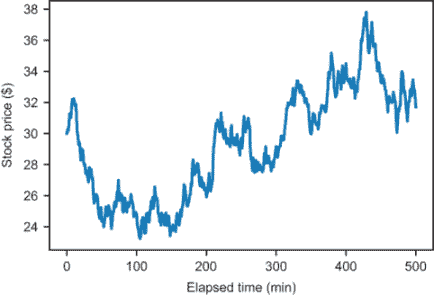

图 1.1 股票价格随时间变化的典型图表

如果你在大约 100 分钟时以 24 美元的价格购买了这只股票的 1000 股，并在 400 分钟时以 38 美元的价格卖出，你一天就能赚 14000 美元。不错！挑战在于你必须事先知道股票会上涨，100 分钟和 400 分钟分别是买入和卖出的最佳时机。可能无法预测确切的最低或最高价格点，但也许你可以找到一天中相对较好的买卖时机。让我们看看如何从数学上解决这个问题。

我们可以通过找到一个“最佳拟合”线来测量股票是上涨还是下跌，这条线大致遵循价格移动的方向。这个过程称为*线性回归*，我们在本书的第三部分中会介绍它。基于数据的可变性，我们可以在“最佳拟合”线之上和之下计算两条线，显示价格波动区域。图 1.2 显示，这些线很好地遵循了趋势。

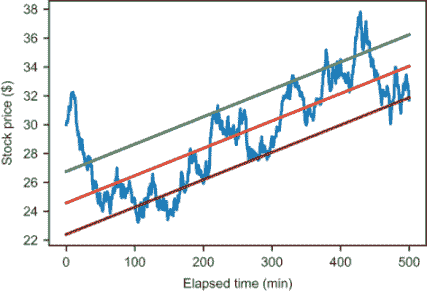

图 1.2 使用线性回归识别变化的股票价格趋势

通过对价格波动的数学理解，我们就可以编写代码，在价格相对于其趋势处于低波动时自动买入，在价格回升时卖出。具体来说，我们的程序可以通过网络连接到证券交易所，当价格穿过底部线时买入 100 股，当价格穿过顶部线时卖出 100 股。图 1.3 展示了这样一笔盈利交易：以约 27.80 美元的价格买入，以约 32.60 美元的价格卖出，一个小时就能赚得 480 美元。

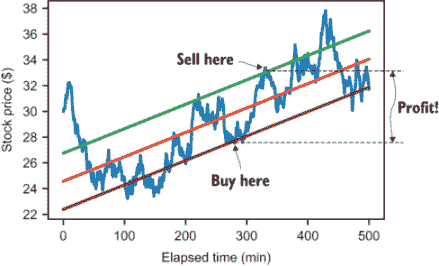

图 1.3 根据我们的基于规则的软件进行买卖以获利

我并不声称我已经向你展示了一个完整或可行的策略，但重点是，有了正确的数学模型，你可以自动获利。此刻，一些未知数量的程序正在构建和更新模型，以衡量股票和其他金融工具的预测趋势。如果你编写这样的程序，你可以在它为你赚钱的同时享受一些闲暇时光！

### 1.1.2 寻找好交易

可能你的资金并不足够去考虑风险股票交易。但数学仍然可以帮助你在其他交易中赚钱和省钱，比如购买二手车。新车是容易理解的商品。如果两个经销商都在卖同一辆车，你显然会想从成本最低的经销商那里购买。但二手车有更多的数字与之相关：一个要价，以及里程数和车型年份。你甚至可以使用特定二手车在市场上停留的时间来评估其质量：停留时间越长，你可能越怀疑。

在数学中，你可以用有序数字列表来描述的对象被称为*向量*，有一个整个领域（称为*线性代数*）专门研究它们。例如，一辆二手车可能对应一个*四维*向量，意味着一组四个数字：

(2015, 41429, 22.27, 16980)

这些数字分别代表车型年份、里程、上市天数和要价。我的一个朋友运营着一个名为 CarGraph.com 的网站，该网站汇总了出售的二手汽车数据。在撰写本文时，它显示了 101 辆出售的丰田普锐斯，并为每一辆提供了一些或所有这四项数据。该网站也如其名，以图形的方式呈现数据（图 1.4）。可视化四维对象很困难，但如果你选择两个维度，比如价格和里程，你可以在散点图上以点的方式绘制它们。

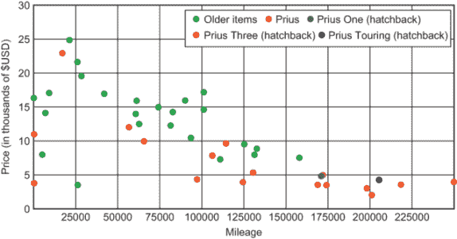

图 1.4 CarGraph.com 上二手普锐斯价格与里程的图表

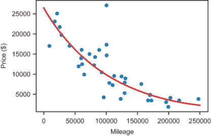

图 1.5 将指数衰减曲线拟合到二手丰田普锐斯的价格与里程数据

我们也许也感兴趣在这里绘制一条趋势线。这个图上的每一个点都代表了对公平价格的一种看法，因此趋势线会将这些看法汇总成一个在任何里程数下都更可靠的估价。在图 1.5 中，我决定拟合一个**指数**衰减曲线而不是直线，并且省略了一些几乎全新的、低于零售价出售的汽车。

为了使数字更易于管理，*我将里程值转换为以万英里为单位，因此 5 表示 50,000 英里。用 p 表示价格，m 表示里程，最佳拟合曲线的方程如下：

p = $26,500 · (0.905)m

方程 1.1

方程 1.1 显示最佳拟合价格是$26,500 乘以 0.905 的里程次方。将值代入方程，我发现如果我的预算是$10,000，那么我应该购买一辆大约行驶了 97,000 英里的普锐斯（图 1.6）。如果我相信曲线表示的是**公平**的价格，那么低于这条线的汽车通常都是好交易。

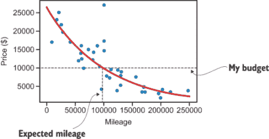

图 1.6 寻找我在$10,000 预算下应该期望的二手普锐斯的里程

但我们可以从方程 1.1 中学到的不仅仅是如何找到一个好交易。它讲述了一个关于汽车贬值的故事。方程中的第一个数字是$26,500，这是指数函数对零里程时价格的解读。这与新普锐斯的零售价非常接近。如果我们使用最佳拟合线，它暗示普锐斯每行驶一英里就会失去固定数量的价值。这个指数函数则说，相反，每行驶一英里就会失去固定**百分比**的价值。根据这个方程，行驶 10,000 英里后，普锐斯的价值只剩下 0.905 或原价的 90.5%。行驶 50,000 英里后，我们将它的价格乘以一个因子(0.905)⁵ = 0.607。这告诉我们，它的价值大约是原始价值的 61%。

为了制作图 1.6 中的图表，我在 Python 中实现了一个`price(mileage)`函数，它接受一个作为输入的里程数（以 10,000 英里为单位）并返回最佳拟合价格作为输出。计算`price(0) − price(5)`和`price(5) − price(10)`告诉我，行驶的前 50,000 英里大约花费了 10,000 美元，而接下来的 50,000 英里则花费了 6,300 美元。

如果我们用最佳拟合线而不是指数曲线，这意味着汽车以每英里 0.10 美元的固定速率贬值。这表明每行驶 50,000 英里会导致 5,000 美元的相同贬值。传统观点认为，新汽车行驶的前几英里是最昂贵的，因此指数函数（方程 1.1）与这一点相符，而线性模型则不然。

记住，这只是一个**二维**分析。我们只建立了一个数学模型来关联描述每辆车的四个数值维度中的两个。在第一部分，你将学习更多关于不同维度的向量以及如何操作高维数据。**在第二部分**，我们将介绍不同类型的函数，如线性函数和指数函数，并通过分析它们的增长率来比较它们。最后，在第三部分，我们将探讨如何构建包含数据集**所有**维度的数学模型，以给我们一个更准确的图景。

### 1.1.3 构建 3D 图形和动画

许多最著名且财务上最成功的软件项目都涉及多维数据，特别是**三维**或**3D**数据。这里我想到了 3D 动画电影和 3D 视频游戏，它们的收入都达到了数十亿美元。例如，皮克斯的 3D 动画软件帮助他们在大银幕上赚了超过 130 亿美元。动视的 3D 动作游戏系列《使命召唤》赚了超过 160 亿美元，而仅《侠盗猎车手 V》就带来了 60 亿美元。

这些备受赞誉的项目每一个都是基于对如何使用三维向量，或形式为 *v* = (*x*, *y*, *z*) 的数字三元组进行计算的理解。一个三元组

在三维空间中，相对于一个称为**原点**的参考点，只需要几个**数字**就可以定位一个点。图 1.7 展示了这三个数字如何告诉你沿着三个垂直方向中的哪一个方向走多远。

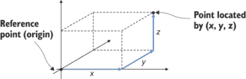

图 1.7 使用三个数字向量 *x, y, z* 标记三维空间中的一个点

从《海底总动员》中的小丑鱼到《使命召唤》中的航空母舰，任何三维物体都可以被计算机定义为一个三维向量的集合。在代码中，这些物体看起来像是一个包含浮点值三元组的列表。有了三个浮点值三元组，我们就有三个空间中的点，可以定义一个三角形（图 1.8）。例如，

```
triangle = [(2.3,1.1,0.9), (4.5,3.3,2.0), (1.0,3.5,3.9)]
```

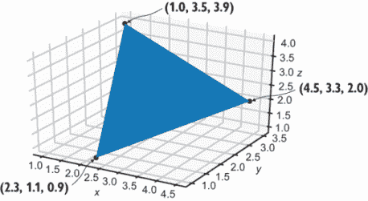

图 1.8 使用每个角落的浮点值三元组构建三维三角形

通过组合许多三角形，你可以定义 3D 物体的表面。使用更多的、更小的三角形，你甚至可以使结果看起来更平滑。图 1.9 展示了使用不断增加的更小三角形来渲染 3D 球体的六种不同方式。

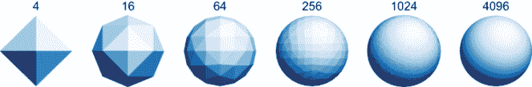

图 1.9 由指定数量的三角形构建的三维（3D）球体。

在第三章和第四章中，你将学习如何使用 3D 向量数学将 3D 模型转换为如图 1.9 所示的着色 2D 图像。你还需要使你的 3D 模型平滑，以便在游戏或电影中显得逼真，并且需要它们以逼真的方式移动和变化。这意味着你的物体应该遵守物理定律，这些定律也用 3D 向量表示。

假设你是一名《侠盗猎车手 V》的游戏程序员，并希望启用一个基本用例，比如向直升机发射火箭筒。火箭筒发射出的抛射体从主角的位置开始，然后其位置随时间变化。你可以使用数字下标来标记它在飞行过程中所经过的各种位置，从*v*[0] = (*x*[0], *y*[0], *z*[0])开始。随着时间的推移，抛射体到达新的位置，这些位置由向量*v*[1] = (*x*[1], *y*[1], *z*[1])、*v*[2] = (*x*[2], *y*[2], *z*[2])等标记。*x*、*y*和*z*值的改变率由火箭筒的方向和速度决定。此外，这些改变率可以随时间变化−由于重力持续向下的作用，抛射体的*z*位置以递减的速率增加（如图 1.10 所示）。

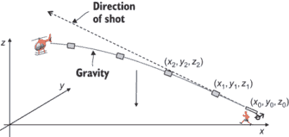

图 1.10 由于初始速度和重力的作用，抛射体的位置矢量随时间变化。

任何有经验的动作游戏玩家都会告诉你，你需要略微瞄准直升机上方才能击中它！为了模拟物理现象，你必须知道力如何影响物体并在时间上引起连续变化。连续变化的数学称为*微积分*，而物理定律通常用微积分中的对象，即*微分方程*来表示。在第四章和第五章中，你将学习如何动画化 3D 对象，然后在第二部分中，你将学习如何使用微积分的思想来模拟物理。

### 1.1.4 建模物理世界

我声称数学软件能产生真实财务价值并非空穴来风；我在自己的职业生涯中见证了其价值。2013 年，我创立了一家名为 Tachyus 的公司，该公司开发软件以优化石油和天然气生产。我们的软件使用数学模型来理解地下油气流动，帮助生产者更高效、更有利可图地提取油气。利用它产生的洞察力，我们的客户每年实现了数百万美元的成本节约和产量增加。

要解释我们的软件是如何工作的，你需要了解一些石油术语。被称为*井*的孔被钻入地下，直到它们达到含有油的孔隙（海绵状）岩石的目标层。地下富含油的岩石层被称为*储层*。油被泵送到地面，然后卖给炼油厂，炼油厂将其转化为我们每天使用的各种产品。图 1.11 展示了油田的示意图（非比例图）。

在过去的几年里，石油价格波动很大，但为了我们的目的，让我们假设它的价值是每桶 50 美元，其中一桶是一个体积单位，等于 42 加仑或大约 159 升。如果通过钻井和有效抽油，一家公司每天能提取 1000 桶石油（相当于几个后院游泳池的体积），它将会有数百万美元的年收入。即使是效率提高几个百分点也可能意味着一大笔钱。

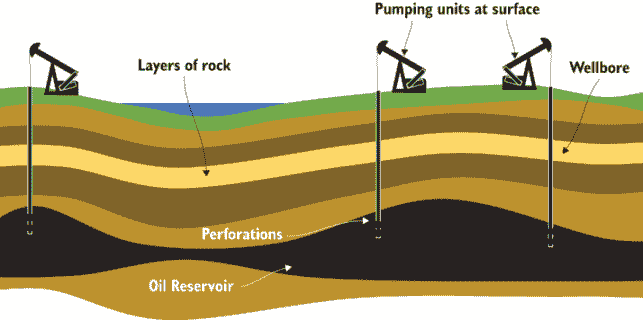

图 1.11  油田的示意图

基本问题是地下发生了什么：现在的油在哪里，它是如何移动的？这是一个复杂的问题，但也可以通过求解微分方程来回答。这里变化的量不是弹道的位置，而是地下流体（如油）的位置、压力和流速。流体流速是一种特殊的函数，它返回一个向量，称为*向量场*。这意味着流体可以在任何三维方向以任何速率流动，并且这个方向和速率可以在储层内的不同位置变化。

对于这些参数的一些最佳猜测，我们可以使用名为*达西定律*的微分方程来预测液体通过多孔岩石介质（如砂岩）的流速。图 1.12 展示了达西定律，但如果某些符号不熟悉，请不要担心！代表流速的函数 q 被加粗，以表示它返回一个向量值。

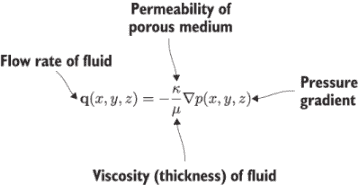

图 1.12  标注了物理方程的达西定律，它控制着流体在多孔岩石中的流动。

这个方程最重要的部分是看起来像倒三角形的符号，它代表向量微积分中的*梯度算子*。在给定点(*x*, *y*, *z*)处的压力函数*p*(*x*, *y*, *z*)的梯度是一个 3D 向量*q*(*x, y, z*)，指示压力增加的方向和在该点压力增加的速率。负号告诉我们流速的 3D 向量是*相反方向*的。这个方程用数学术语表述，即流体从高压区流向低压区。

负梯度在物理学定律中很常见。可以这样理解，自然界总是在寻求向更低势能状态移动。一个球在山上的势能取决于山在任意横向点 *x* 的海拔 *h*。如果山的高度由函数 *h*(*x*) 给出，梯度指向山顶，而球滚动的方向正好相反（图 1.13）。

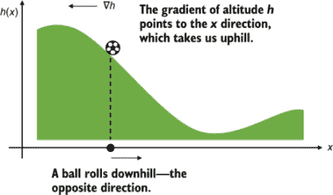

图 1.13 正梯度指向山顶，而负梯度指向山下。

在第十一章中，你将学习如何计算梯度。在那里，我向你展示如何将梯度应用于模拟物理现象，以及解决其他数学问题。梯度恰好是机器学习中最重要的数学概念之一。

我希望这些例子比你在高中数学课上听到的现实世界应用更有说服力和现实性。也许，到了这个时候，你已经相信这些数学概念值得学习，但你担心它们可能太难。确实，学习数学可能很困难，尤其是当你独自一人时。为了使其尽可能顺利，让我们谈谈作为数学学生可能会遇到的陷阱，以及我在这本书中如何帮助你避免它们。

## 1.2 如何避免学习数学

现在有很多数学书籍，但并非所有都同样有用。我有不少程序员朋友试图学习像上一节中那样的数学概念，要么是出于求知欲，要么是出于职业抱负。当他们将传统数学教科书作为主要资源时，他们常常会遇到困难并放弃。以下是一个典型的*失败*的数学学习故事。

### 1.2.1 简想要学习一些数学

我的（虚构的）朋友简是一名全栈网络开发者，在旧金山一家中型科技公司工作。在大学里，简没有深入研究计算机科学或任何数学学科，她以产品经理的身份开始了自己的职业生涯。在过去的十年里，她学习了 Python 和 JavaScript 编程，并成功转型为软件工程师。现在，在她的新工作中，她是团队中最有能力的程序员之一，能够构建数据库、网络服务和用户界面，以向客户交付重要的新功能。显然，她非常聪明！

简意识到学习数据科学可以帮助她在工作中设计和实施更好的功能，利用数据来改善客户的体验。大多数上班的火车上，简都会阅读关于新技术博客和文章，最近，她被几篇关于“深度学习”这个主题的文章所震撼。其中一篇文章讲述了由深度学习驱动的谷歌 AlphaGo 在棋类游戏中击败了世界排名第一的人类选手。另一篇文章展示了由深度学习系统从普通图像生成的令人惊叹的印象派画作。

在阅读了这些文章后，简妮听说她的朋友的朋友马库斯在一家大型科技公司得到了一个深度学习研究工作。据说马库斯每年工资加股票分红超过 40 万美元。想到她职业生涯的下一步，简妮还有什么比在有趣且有利可图的难题上工作更想要的呢？

简妮进行了一些研究，并在网上找到了一个权威的（而且是免费的！）资源：Goodfellow 等人撰写的《深度学习》一书（MIT Press，2016 年）。前言读起来就像她习惯的技术博客文章，这让她对学习这个主题更加兴奋。但随着她继续阅读，书的内容变得越来越难。第一章涵盖了所需的数学概念，并介绍了很多简妮从未见过的术语和符号。她浏览了一下，试图找到书的重点，但内容仍然越来越难。

简妮决定她需要暂停学习人工智能和深度学习，直到她学了一些数学。幸运的是，《深度学习》一书的数学章节为那些从未接触过这个主题的学生列出了一份线性代数参考书目。她找到了这本教科书，Georgi Shilov 撰写的《线性代数》（Dover，1977 年），并发现它有 400 页长，和《深度学习》一样密集。

在花了一下午阅读关于数域、行列式和余子式等概念的晦涩定理之后，她决定放弃。她不知道这些概念如何帮助她编写一个赢得棋盘游戏的程序或生成艺术品，而且她也不再愿意花数十个小时在这枯燥的材料上，试图找出答案。

简妮和我一起喝咖啡，互相了解近况。她告诉我，她因为不知道线性代数而难以阅读真正的 AI 文献。最近，我听到很多类似的抱怨：

**“我正在尝试了解[新技术]，但似乎我需要先学习[数学主题]。”**

她的方法是值得称赞的：她找到了她想要学习的主题的最佳资源，并寻找了她缺少的先决条件的资源。但在将这种方法推向逻辑结论的过程中，她发现自己陷入了一种令人作呕的“深度优先搜索”的技术文献中。

### 1.2.2 拖延数学教科书

简妮挑选的线性代数这类大学水平的数学书籍往往非常公式化。每个部分都遵循相同的格式：定义一些新的术语，使用这些术语陈述一些事实（称为**定理**），然后证明这些定理是正确的。

这听起来像是一个好、逻辑顺序：你介绍你要讨论的概念，陈述一些可以得出的结论，然后证明它们。那么，为什么阅读高级数学教科书这么难呢？

问题在于这并不是数学实际上是如何被创造的。当你提出新的数学思想时，在你甚至找到正确的定义之前，可能会有一个漫长的实验期。我认为大多数职业数学家会这样描述他们的步骤：

1.  发明一个**游戏**。例如，通过尝试列出所有数学对象，在他们之间寻找模式，或者找到一个具有特定属性的对象来开始玩一些数学对象。

1.  形成一些**猜想**。对你的游戏提出一些可以陈述的普遍事实，并且至少要说服自己这些必须是真实的。

1.  为你的游戏和猜想开发一些**精确的语言**来描述。毕竟，除非你能传达它们，否则你的猜想没有任何意义。

1.  最后，带着一些决心和运气，为你的猜想找到一个**证明**，说明为什么它**需要**是真的。

从这个过程中学到的最重要的教训是，你应该先思考大的想法，而形式化可以稍后进行。一旦你对数学是如何工作的有一个大致的想法，词汇和符号就变成了你的资产，而不是干扰。数学教科书通常采用相反的顺序，所以我建议将教科书用作参考，而不是新主题的介绍。

与阅读传统的教科书相比，学习数学的最好方法是探索想法并得出你自己的结论。然而，你一天中并没有足够的时间自己重新发明一切。如何找到正确的平衡点？我将给出我谦逊的意见，这指导了我如何写这本关于数学的非传统书籍。

## 1.3 利用你训练有素的左脑

这本书是为那些有经验的程序员或那些在解决过程中对学习编程感到兴奋的人设计的。为程序员写关于数学的文章是很好的，因为如果你能编写代码，你已经训练了你的分析性左脑。我认为学习数学的最佳方式是借助高级编程语言，并且我预测在不久的将来，这将成为数学课堂上的常态。

有几种具体的方法，像你这样的程序员非常适合学习数学。我在这里列出这些方法，不仅是为了夸奖你，也是为了提醒你，你已经拥有的哪些技能可以在你的数学学习中依赖。

### 1.3.1 使用形式语言

在编程中你最早学到的一个艰难的教训是，你不能像写简单的英语那样编写你的代码。如果你的拼写或语法在给朋友的便条中略有错误，他们可能仍然能理解你试图表达的意思。但代码中的任何语法错误或拼写错误的标识符都会导致你的程序失败。在某些语言中，甚至在其他方面正确的情况下忘记在语句末尾的分号也会阻止程序运行。作为另一个例子，考虑以下两个语句：

```
*x* = 5
5 = x
```

我可以读这两个中的任何一个，认为符号*x*的值是 5。但这并不是这两个中的任何一个在 Python 中的确切含义，实际上，只有第一个是正确的。Python 语句`x` `=` `5`是告诉计算机将变量*x*设置为值 5 的指令。另一方面，你不能将数字 5 设置为具有值*x*。这听起来可能有些繁琐，但你需要知道这一点才能编写正确的程序。

另一个让新手程序员（以及有经验的程序员）感到困惑的例子是引用相等。如果你定义一个新的 Python 类并创建两个相同的实例，它们并不相等！

```
>>> class A(): pass
...
>>> A() == A()
False
```

你可能预期两个相同的表达式应该是相等的，但在 Python 中这显然不是一条规则。因为这些是`A`类的不同实例，所以它们不被认为是相等的。

注意寻找看起来像你已知但行为不同的新数学对象。例如，如果字母*a*和*B*代表数字，那么*a* · *B* = *B* · *a*。但是，正如你将在第五章学到的那样，如果*a*和*B*不是数字，这就不一定是这种情况。如果*a*和*B*是矩阵，那么*a* · *B*和*B* · *a*的乘积是不同的。实际上，可能只有一个乘积是可行的，或者两个乘积都不正确。

当你编写代码时，仅仅写出正确的语法是不够的。你的语句所代表的思想需要有意义才能是有效的。如果你在写数学语句时也这样小心，你就能更快地发现错误。更好的是，如果你用代码写数学语句，计算机可以帮助你检查你的工作。

### 1.3.2 构建自己的计算器

计算器在数学课上很常见，因为检查你的工作是有用的。你需要知道如何不用计算器乘以 6 和 7，但通过查阅计算器来确认你的答案 42 是正确的也很好。一旦你掌握了数学概念，计算器也能帮助你节省时间。如果你在做三角学，需要知道 3.14159 / 6 的答案，计算器就可以处理这个问题，这样你就可以思考答案的意义。计算器能做的功能越多，理论上它应该越有用。

但有时我们的计算器对我们自己来说太复杂了。当我上高中时，我需要得到一个图形计算器，我得到了一个 TI-84。它大约有 40 个按钮，每个按钮有 2 到 3 种不同的模式。我只知道如何使用其中大约 20 个，所以它是一个笨重的学习工具。当我一年级第一次得到计算器时，情况也是一样。只有大约 15 个按钮，但我不知道其中一些按钮的作用。如果我要为学生们发明一个第一台计算器，我会让它看起来像图 1.14 中的那样。


图 1.14 学生学习计数用的计算器

这个计算器只有两个按钮。其中一个将值重置为 1，另一个递增到下一个数字。这样的工具对于学习计数的儿童来说可能是合适的“无装饰”工具。（我的例子可能看起来很傻，但实际上你可以买到这样的计算器！它们通常是机械的，作为计数器出售。）

在你熟练掌握计数之后，你想要练习书写数字和进行加法运算。在这个学习阶段，一个完美的计算器可能会有几个额外的按钮（图 1.15）。

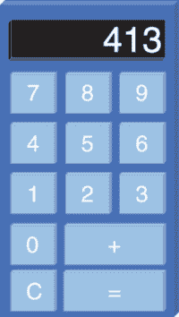

图 1.15 一个能够书写整数并进行加法运算的计算器

在这个阶段，不需要像−、*或÷这样的按钮来妨碍你。当你解决像 5−2 这样的减法问题时，你仍然可以用这个计算器通过确认 3+2=5 来检查你的答案。同样，你可以通过重复加法来解决乘法问题。当你完成对这个计算器的探索后，你可以升级到一个可以进行所有算术运算的计算器。

我认为一个理想的计算器应该是可扩展的，这意味着你可以根据需要向其添加更多功能。例如，你可以为每个新学习的数学运算在你的计算器上添加一个按钮。一旦你进入了代数，也许你可以让它理解像*x*或*y*这样的符号，而不仅仅是数字。当你

学习了微积分后，你可以进一步使其能够理解和操作数学函数。

能够存储多种类型数据的可扩展计算器似乎有些遥远，但当你使用高级编程语言时，这正是你得到的东西。Python 自带算术运算、`math`模块以及你可以在需要时引入的众多第三方数学库，使你的编程环境更加强大。因为 Python 是*图灵完备*的，所以你可以（原则上）计算任何可以计算的东西。你只需要一个足够强大的计算机、足够聪明的实现，或者两者都要。

在这本书中，我们用可重用的 Python 代码实现每个新的数学概念。亲自完成实现可以是你巩固对新概念理解的好方法，到头来，你为你的工具箱增添了一个新工具。在你亲自尝试之后，如果你喜欢，你总是可以替换成一个经过打磨的主流库。无论如何，你构建或导入的新工具为探索更大的想法奠定了基础。

### 1.3.3 使用函数构建抽象

在编程中，我刚才描述的过程被称为*抽象*。例如，当你厌倦了重复计数时，你创造了加法的抽象。当你厌倦了重复的加法运算时，你创造了乘法的抽象，以此类推。

在编程中，你可以采用多种方法进行抽象，其中最重要的一个方法是将其应用到数学中的*函数*。在 Python 中，函数是一种重复某些任务的方式，它可以接受一个或多个输入，或者可以产生一个输出。例如，

```
def greet(name):
    print("Hello %s!" % name)
```

允许我使用简短、富有表现力的代码发出多个问候，如下所示：

```
>>> for name in ["John","Paul","George","Ringo"]:
...     greet(name)
...
Hello John!
Hello Paul!
Hello George!
Hello Ringo!
```

这个函数可能很有用，但它并不像数学函数。数学函数总是接受输入值，并且总是返回输出值，没有副作用。

在编程中，我们将行为类似于数学函数的函数称为*纯函数*。例如，平方函数 *f*(*x*) = *x*² 接受一个数字并返回该数字与自身的乘积。当你评估 *f*(3) 时，结果是 9。这并不意味着数字 3 现在变成了 9。相反，这意味着 9 是函数 *f* 对输入 3 的对应输出。你可以将这个平方函数想象成一个机器，它在输入槽中接受数字，并在其输出槽中产生结果（数字）（图 1.16）。

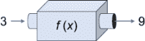

图 1.16 一个具有输入槽和输出槽的函数作为机器

这是一个简单而有用的思维模型，我将在整本书中反复提及它。我最喜欢它的一个方面是，你可以将一个函数想象成一个本身存在的对象。在数学中，就像在 Python 中一样，函数是可以独立操作的数据，甚至可以将它们传递给其他函数。

数学可能令人畏惧，因为它很抽象。记住，就像任何优秀的软件一样，抽象的引入是有原因的：它帮助你组织和传达更大、更强大的想法。当你掌握这些想法并将它们转化为代码时，你将打开一些令人兴奋的可能性。

如果你之前还没有意识到，我希望你现在相信数学在软件开发中有许多令人兴奋的应用。作为一名程序员，你已经拥有了学习一些新数学思想所需的心态和工具。这本书中的想法为我提供了专业和个人上的丰富，我希望它们也能为你带来同样的收获。让我们开始吧！

## 摘要

+   数学在许多软件工程领域都有有趣且有利可图的用途。

+   数学可以帮助你量化随时间变化的数据趋势，例如，预测股价的变动。

+   不同类型的函数传达不同类型的定性行为。例如，指数折旧函数意味着汽车每行驶一英里就会损失其转售价值的一定百分比，而不是固定金额。

+   数字元组（称为*向量*）代表多维数据。具体来说，三维向量是一组数字，可以表示空间中的点。你可以通过组装由向量指定的三角形来构建复杂的 3D 图形。

+   *微积分*是数学对连续变化的研究，许多物理定律都是以称为*微分方程*的微积分方程来表述的。

+   从传统的教科书中学习数学很难！你通过探索来学习数学，而不是简单地按部就班地通过定义和定理。

+   作为程序员，你已经训练自己进行精确思考和交流；这项技能将帮助你学习数学。
