# 2 使用二维向量绘图

本章涵盖了

+   将二维绘图作为向量的集合创建和操作

+   将二维向量视为箭头、位置和坐标的有序对

+   使用向量算术来变换平面上的形状

+   使用三角学来测量平面上的距离和角度

你可能已经对二维或三维的含义有一些直观的理解。一个*二维*(2D)对象就像一张纸上的图像或电脑屏幕上的图像一样平坦。它只有高度和宽度这两个维度。然而，在我们物理世界中，一个*三维*(3D)对象不仅有高度和宽度，还有深度。

二维和三维实体的模型在编程中很重要。任何出现在你手机、平板电脑或电脑屏幕上的东西都是一个二维对象，占据一定的像素宽度和高度。任何代表物理世界的模拟、游戏或动画都存储为三维数据，并最终投影到屏幕的两个维度上。在虚拟和增强现实应用中，三维模型必须与关于用户位置和视角的真实、测量过的三维数据相匹配。

尽管我们的日常经验发生在三维空间中，但将一些数据视为高维数据是有用的。在物理学中，通常将时间视为第四维度。当一个物体存在于三维空间中的某个位置时，一个事件发生在三维位置和指定的时间点。在数据科学问题中，数据集通常具有更多的维度。例如，一个在网站上追踪的用户可能有数百个可测量的属性，这些属性描述了使用模式。在图形学、物理学和数据分析中处理这些问题的框架需要处理高维数据的框架。这个框架是*向量数学*。

向量是多维空间中的对象。它们有自己的算术概念（加法、乘法等）。我们首先研究二维向量，它们易于可视化和计算。在这本书中，我们使用了大量的二维向量，并且在推理更高维问题的时候，我们也把它们作为心理模型来使用。

## 2.1 描绘二维向量

二维世界就像一张纸或电脑屏幕一样平坦。在数学语言中，一个平坦的二维空间被称为*平面*。生活在二维平面上的物体具有高度和宽度这两个维度，但没有深度这个第三维度。同样，你可以通过两个信息来描述二维中的位置：它们的垂直和水平位置。为了描述平面上的点的位置，你需要一个参考点。我们称这个特殊的参考点为*原点*。图 2.1 展示了这种关系。

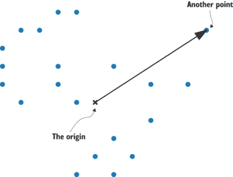

图 2.1 在原点相对于几个点定位

有许多点可供选择，但我们必须将其中一个点固定为我们原点。为了区分它，我们用*x*而不是点标记原点，如图 2.1 所示。从原点出发，我们可以画一个箭头（如图 2.1 中的实心箭头）来显示另一个点的相对位置。

一个*二维向量*是相对于原点的平面上的一个点。等价地，你可以将向量视为平面上的直线箭头；任何箭头都可以放置在原点开始，并指示一个特定的点（见图 2.2）。

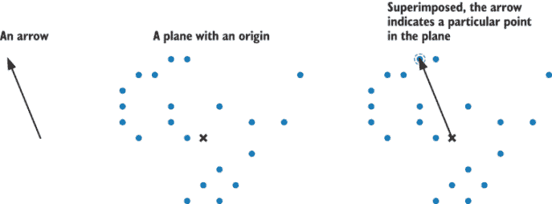

图 2.2 在平面上叠加箭头表示相对于原点的点。

在本章以及之后的章节中，我们将使用箭头和点来表示向量。点很有用，因为我们可以用它们构建更有趣的图形。如果我像图 2.3 那样连接图 2.2 中的点，我就能得到一个恐龙的图形：

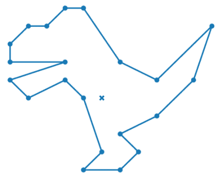

图 2.3 在平面上连接点以绘制形状

每当计算机显示 2D 或 3D 图形时，从我的简陋恐龙到一部完整的皮克斯电影，它都是由点或向量连接起来以显示所需形状定义的。要创建你想要的图形，你需要选择正确的位置向量，这需要仔细的测量。让我们看看如何在平面上测量向量。

### 2.1.1 表示 2D 向量

使用尺子，我们可以测量一个维度，例如物体的长度。要测量两个维度，我们需要两个尺子*.* 这些尺子被称为*坐标轴*（单数形式为*axis*），我们将它们布局在平面中相互垂直，并在原点相交。用坐标轴绘制的图 2.4 显示了我们的恐龙具有上下和左右的概念。水平轴被称为*x 轴*，垂直轴被称为*y 轴*。

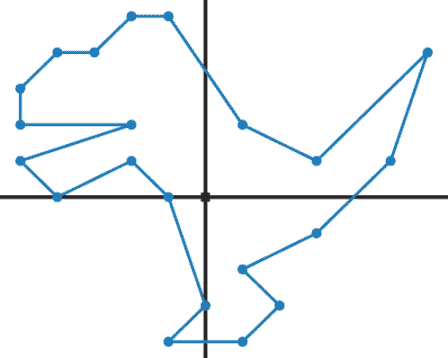

图 2.4 使用 x 轴和 y 轴绘制的恐龙。

使用标尺来定位，我们可以说，“四个点位于原点的上方和右侧。”但我们会希望比这更量化。尺子上带有刻度，显示我们沿着它测量的单位数。同样，在我们的二维图中，我们可以添加与坐标轴垂直的网格线，以显示点相对于它们的位置。按照惯例，我们在 x 轴和 y 轴的刻度 0 处放置原点（见图 2.5）。

在这个网格的背景下，我们可以测量平面中的向量。例如，在图 2.5 中，恐龙尾巴的尖端与 x 轴的正 6 和 y 轴的正 4 对齐。我们可以将这些距离视为厘米、英寸、像素或其他长度单位，但通常我们除非有特定的应用，否则不指定单位。

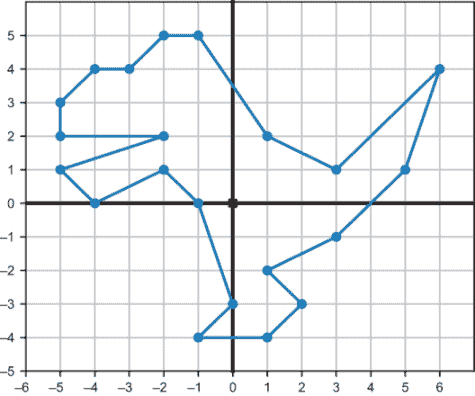

图 2.5 网格线让我们能够测量点相对于坐标轴的位置。

数字 6 和 4 被称为该点的**x-和 y 坐标**，这足以告诉我们正在讨论哪个点。我们通常将坐标写成**有序对**（或**元组**），先写 x 坐标，再写 y 坐标，例如（6，4）。图 2.6 展示了我们现在可以用三种方式描述同一个向量。

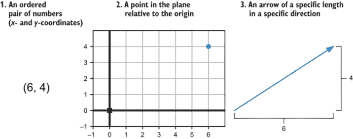

图 2.6 描述相同向量的三个心智模型。

从另一对坐标（-3，4.5）出发，我们可以找到平面上的点或表示它们的箭头。要到达具有这些坐标的平面上的点，从原点开始，然后向左移动三个网格线（因为 x 坐标是-3），然后向上移动四个半网格线（y 坐标是 4.5）。点不会位于两条网格线的交点处，但这没关系；任何一对实数都会给我们一个平面上的点。相应的箭头将是原点到该位置的直线路径，它指向上方和左方（如果你愿意，西北方）。试着自己画这个例子作为练习！

### 2.1.2 Python 中的 2D 绘图

当你在屏幕上生成图像时，你是在一个 2D 空间中工作。屏幕上的像素是该平面上的可用点。这些点用整数坐标而不是实数坐标标记，并且你不能照亮像素之间的空间。尽管如此，大多数图形库都允许你使用浮点坐标工作，并自动处理将图形转换为屏幕上的像素。

我们有很多语言选择和库来指定图形并将它们显示在屏幕上：OpenGL、CSS、SVG 等等。Python 有像 Pillow 和 Turtle 这样的库，非常适合用矢量数据创建绘图。在本章中，我使用一组自定义构建的函数来创建绘图，这些函数建立在另一个名为 Matplotlib 的 Python 库之上。这使得我们可以专注于使用 Python 构建矢量数据的图像。一旦你理解了这个过程，你将能够轻松地掌握其他任何库。

我包括的最重要函数是名为`draw`的函数，它接受表示几何对象的输入和指定你想要绘图外观的关键字参数。表 2.1 中列出的 Python 类代表每种可绘制的几何对象。

表 2.1 一些表示几何图形的 Python 类，可用于`draw`函数。

| 类别 | 构造函数示例 | 描述 |
| --- | --- | --- |
| `Polygon` | `Polygon(*vectors)` | 绘制一个多边形，其顶点（角）由向量列表表示 |
| `Points` | `Points(*vectors)` | 表示要绘制的点（圆点）的列表，每个输入向量对应一个点 |
| `Arrow` | `Arrow(tip)``Arrow(tip, tail)` | 从原点绘制到`tip`向量的箭头，或者如果指定了尾部，则从`tail`向量绘制到`head`向量 |
| `Segment` | `Segment(start,end)` | 从起点到向量终点绘制线段 |

你可以在源代码的`vector_drawing.py`文件中找到这些函数的实现。在章节末尾，我会简要说明这些是如何实现的。

注意：对于本章（以及后续的每一章），源代码文件夹中都有一个 Jupyter 笔记本，展示了如何按顺序运行本章中的所有代码，包括从`vector_drawing`模块导入函数。如果您还没有设置，可以查阅附录 A 来配置 Python 和 Jupyter。

拥有这些绘图函数后，我们可以绘制恐龙轮廓的点（图 2.5）：

```
from vector_drawing import *
dino_vectors = [(6,4), (3,1), (1,2), (−1,5), (−2,5), (−3,4), (−4,4),
     # insert 16 remaining vectors here
]

draw(
    Points(*dino_vectors)
)
```

我没有列出完整的`dino_vectors`列表，但有了合适的向量集合，代码会给出图 2.7 中显示的点（也匹配图 2.5）。

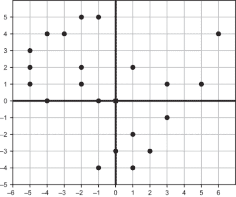

图 2.7 使用 Python 的`draw`函数绘制恐龙的点

在我们的绘图过程中，下一步我们可以连接一些点。第一个线段可能连接恐龙尾巴上的点（6, 4）和点（3, 1）。我们可以使用这个函数调用绘制这些点以及新的线段，图 2.8 显示了结果：

```
draw(
    Points(*dino_vectors),
    Segment((6,4),(3,1))
)
```

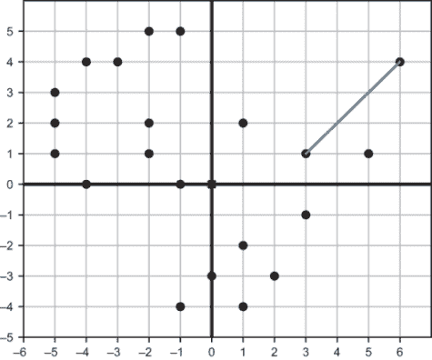

图 2.8 恐龙的两个点（6, 4）和（3, 1）之间的线段连接

线段实际上是包含点（6, 4）和（3, 1）以及它们之间所有点的集合。`draw`函数自动将这些点的所有像素着色为蓝色。`Segment`类是一个有用的抽象，因为我们不需要从构成我们的几何对象（在这种情况下，是恐龙）的点构建每个线段。绘制 20 更多线段，我们得到恐龙的完整轮廓（图 2.9）。


图 2.9 总共 21 次函数调用产生了 21 条线段，完成了恐龙轮廓的绘制。

从原则上讲，我们现在可以绘制任何我们想要的 2D 形状，只要我们拥有指定它的所有向量。手动计算所有坐标可能会很繁琐，所以我们将开始研究使用向量进行计算以自动找到它们的坐标的方法。

### 2.1.3 练习

| **练习 2.1**：恐龙脚尖的点的 x 和 y 坐标是什么？**解答**：（−1, −4） |
| --- |
| **练习 2.2**：在平面上绘制点（2, −2）及其对应的箭头。**解答**：表示为平面上的点和箭头，（2, −2）看起来像这样：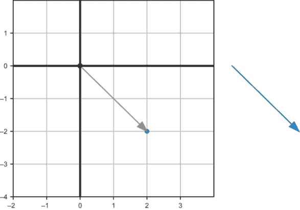表示（2, −2）的点和箭头 |

| **练习 2.3**：通过观察恐龙点的位置，推断出`dino_vectors`列表中未包含的剩余向量。例如，我已经包含了（6, 4），这是恐龙尾巴的尖端，但我没有包含点（-5, 3），这是恐龙鼻尖上的一个点。当你完成时，`dino_vectors`应该是一个包含 21 个向量的列表，表示为坐标对。**解答**：恐龙轮廓的完整向量集如下：

```
dino_vectors = [(6,4), (3,1), (1,2), (−1,5), (−2,5), (−3,4), (−4,4), 
    (−5,3), (−5,2), (−2,2), (−5,1), (−4,0), (−2,1), (−1,0), (0,−3), 
    (−1,−4), (1,−4), (2,−3), (1,−2), (3,−1), (5,1)
]
```

|

| **练习 2.4**：通过构建一个以`dino_vectors`作为顶点的`Polygon`对象来连接点绘制恐龙。**解答**：

```
draw(
    Points(*dino_vectors),
    Polygon(*dino_vectors)
)
```

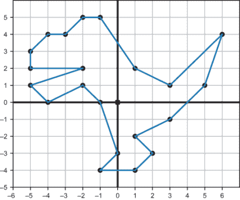将恐龙绘制为多边形。|

| **练习 2.5**：使用`draw`函数绘制*x*在从*x* = -10 到*x* = 11 范围内的`(x,x²)`向量作为点（圆点）。结果是什么？**解答**：这些点绘制了函数 y = x²的图像，绘制了从 10 到 10 的整数：

```
draw(
    Points(*[(x,x**2) for *x* in range(−10,11)]),
    grid=(1,10),
    nice_aspect_ratio=False
)
```

|

## 2.2 平面向量算术

就像数字一样，向量也有它们自己的算术类型；我们可以通过操作来组合向量，从而得到新的向量。与向量不同的是，我们可以可视化结果。向量算术中的所有操作都完成了有用的几何变换，而不仅仅是代数变换。我们将从最基本操作开始：*向量加法*。

向量加法计算简单：给定两个输入向量，将它们的*x*坐标相加得到结果*x*坐标，然后将它们的*y*坐标相加得到结果*y*坐标。用这些相加的坐标创建一个新的向量，就得到了原始向量的*向量和*。例如，（4, 3）+（-1, 1）=（3, 4），因为 4 +（-1）= 3，3 + 1 = 4。在 Python 中实现向量加法是一行代码：

```
def add(v1,v2):
    return (v1[0] + v2[0], v1[1] + v2[1])
```

由于我们可以将向量解释为箭头或平面上的点，因此我们可以用这两种方式可视化加法的结果（图 2.10）。作为一个平面上的点，你可以从原点（0, 0）开始，向左移动一个单位，向上移动一个单位，就能到达点（-1, 1）。通过从点（4, 3）开始，向左移动一个单位，向上移动一个单位，你可以得到向量之和（4, 3）+（-1, 1）。这也可以理解为先遍历一个箭头，然后遍历第二个箭头。

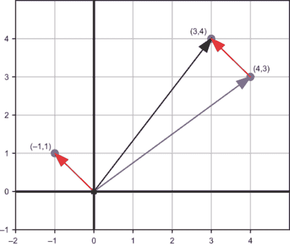

图 2.10 展示（4, 3）和（-1, 1）的向量和

箭头向量加法的规则有时被称为*尾对尾*相加。这是因为如果你将第二个箭头的尾端移动到第一个箭头的尖端（不改变其长度或方向！），那么和就是从第一个箭头的起点到第二个箭头的终点的箭头（图 2.11）。

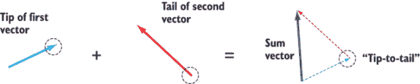

图 2.11 向量的尾对尾相加

当我们谈论箭头时，我们实际上是指“在特定方向上的特定距离。”如果你在一个方向上走一段距离，然后在另一个方向上走另一段距离，向量相加会告诉你你旅行的总距离和方向（图 2.12）。

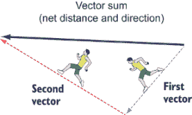

图 2.12 平面中旅行的总距离和方向向量和。

添加一个向量会影响到移动或*平移*现有的点或点的集合。如果我们将向量（-1.5, -2.5）添加到`dino_vectors`中的每一个向量，我们就会得到一个新的向量列表，其中每个向量都相对于原始向量向左移动 1.5 个单位，向下移动 2.5 个单位。以下是相应的代码：

```
dino_vectors2 = [add((−1.5,−2.5), v) for *v*  in dino_vectors]
```

结果是相同的恐龙形状，通过向量（-1.5, -2.5）向下和向左移动。为了看到这一点（图 2.13），我们可以将两个恐龙都画成多边形：

```
draw(
    Points(*dino_vectors, color=blue),
    Polygon(*dino_vectors, color=blue),
    Points(*dino_vectors2, color=red),
    Polygon(*dino_vectors2, color=red)
)
```

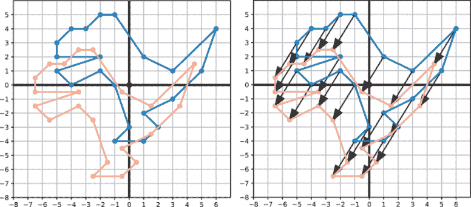

图 2.13 原始恐龙（蓝色）和平移副本（红色）。平移后的恐龙上的每个点都从原始恐龙的位置向下和向左移动了（-1.5, -2.5）。

右侧副本中的箭头显示每个点都通过相同的向量向下和向左移动：(-1.5, -2.5)。这种平移在例如，如果我们想将恐龙变成一个 2D 电脑游戏中的移动角色时很有用。根据用户按下的按钮，恐龙可以在屏幕上相应地平移。我们将在第七章和第九章中实现这样的真实游戏，使用移动向量图形。

### 2.2.1 向量分量和长度

有时，将我们已有的向量分解为较小向量的和是有用的。例如，如果我需要纽约市的步行路线，听到“向东走四个街区，向北走三个街区”会比听到“向东北方向走 800 米”更有用。同样，将向量视为指向*x*方向的向量与指向*y*方向的向量的和也是有用的。

例如，图 2.14 显示了向量（4, 3）被重写为和（4, 0）+（0, 3）。将向量（4, 3）视为平面上的导航路径，和（4, 0）+（0, 3）将我们带到相同的位置，但路径不同。

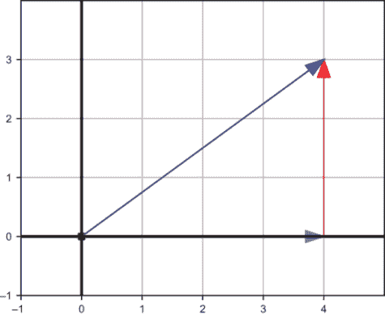

图 2.14 将向量（4, 3）分解为和（4, 0）+（0, 3）

两个向量(4, 0)和(0, 3)分别称为**x 和 y 分量**。如果你不能在这个平面上斜着走（就像纽约市一样），你需要向右走四个单位，然后向上走三个单位才能到达同一个目的地，总共七个单位。

向量的**长度**是表示它的箭头的长度，或者等价地，从原点到表示它的点的距离。在纽约市，这可能是两个交叉口的“飞鸟距离”。向量在**x**或**y**方向的长度可以立即作为对应轴上经过的刻度数来衡量：(4, 0)或(0, 4)都是长度相同的向量，都是 4，尽管方向不同。然而，一般来说，向量可以沿着对角线放置，我们需要进行计算来得到它们的长度。

你可能还记得相关的公式：**勾股定理**。对于直角三角形（两个边在 90°角相遇的三角形），勾股定理表明最长边的长度的平方是其他两边长度的平方和。最长边称为**斜边**，其长度用公式中的*c*表示，即*a*² + *b*² = *c*²，其中*a*和*b*是其他两边的长度。当*a* = 4 且*b* = 3 时，我们可以通过计算 4² + 3²的平方根来找到*c*（如图 2.15）。

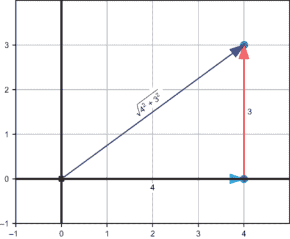

图 2.15 使用勾股定理从 x 和 y 分量的长度找到向量的长度

将向量分解为分量是有用的，因为它总是给我们一个直角三角形。如果我们知道分量的长度，我们可以计算斜边的长度，即向量的长度。我们的向量(4, 3)等于(4, 0) + (0, 3)，这是两个垂直向量的和，其边长分别为 4 和 3。向量(4, 3)的长度是 4² + 3²的平方根，即 25 的平方根，或 5。在一个完美方形的街区中，向东走 4 个街区，向北走 3 个街区，相当于向东北方向走了 5 个街区。

这是一个特殊情况，其中距离结果是整数，但通常，来自勾股定理的长度不是整数。向量(−3, 7)的长度通过以下计算以其组成部分 3 和 7 的长度表示：

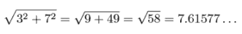

我们可以将这个公式转换为 Python 中的`length`函数，它接受一个二维向量并返回其浮点长度：

```
from math import sqrt
def length(*v*):
    return sqrt(v[0]**2 + v[1]**2)
```

### 2.2.2 向量乘以数字

向量的重复相加是不含糊的；你可以一直将箭头尾对尾堆叠，直到你想要为止。如果一个名为***v***的向量坐标为(2, 1)，那么五次相加***v*** + ***v*** + ***v*** + ***v*** + ***v***将看起来像图 2.16 所示的那样。

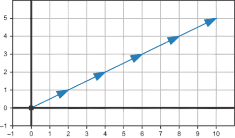

图 2.16 向量*v* = (2, 1)与其自身的重复相加

如果 ***v*** 是一个数，我们不会费心写出 ***v*** + ***v*** + ***v*** + ***v*** + ***v***。相反，我们会写更简单的乘积 5 · ***v***。我们没有理由不能对向量做同样的事情。向量的结果

将 ***v*** 加上自己 5 次是一个方向相同但长度增加 5 倍的向量。我们可以继续使用这个定义，它允许我们用任何整数或分数数乘以向量。

将向量乘以数字的操作称为 *标量乘法*。当处理向量时，普通数字通常称为 *标量*。这也是一个合适的术语，因为这种操作的效果是 *按给定因子缩放* 目标向量。标量是否为整数无关紧要；我们可以轻松地画出一个长度是另一个向量 2.5 倍的向量（图 2.17）。

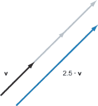

图 2.17 向量 *v* 的标量乘法为 2.5

向量分量的结果是每个分量都按相同的因子缩放。你可以将标量乘法想象成改变由向量及其分量定义的直角三角形的尺寸，但不会影响其纵横比。图 2.18 叠加了一个向量 ***v*** 和其标量乘积 1.5 · ***v***，其中标量乘积是 1.5 倍长。其分量也是 ***v*** 原始分量的 1.5 倍长。

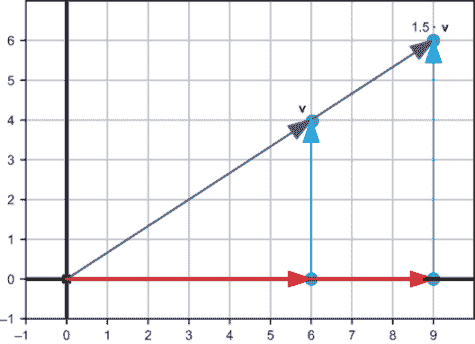

图 2.18 向量的标量乘法按相同因子缩放两个分量。

在坐标中，向量 ***v*** = (6, 4) 的 1.5 倍标量乘法给我们一个新的向量 (9, 6)，其中每个分量是其原始值的 1.5 倍。在计算上，我们通过将向量的每个坐标乘以标量来执行任何标量乘法。作为第二个例子，将向量 ***w*** = (1.2, −3.1) 以因子 6.5 进行缩放可以这样做：

6.5 · *w* = 6.5 · (1.2, −3.1) = (6.5 · 1.2, 6.5 · −3.1) = (7.8, −20.15)

我们测试了这个方法，将分数数作为标量，但我们也应该测试负数。如果我们的原始向量是 (6, 4)，那么该向量的−½倍是多少？乘以坐标，我们预计答案将是 (−3, −2)。图 2.19 显示这个向量是原始长度的一半，并且指向相反方向。

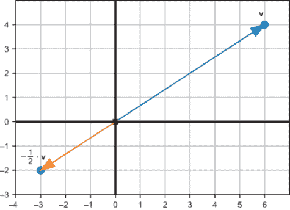

图 2.19 向量乘以负数，−½

### 2.2.3 减法、位移和距离

标量乘法与我们对乘以数字的直觉一致。一个数的整数倍与重复求和相同，对于向量也是如此。我们可以对负向量和向量减法提出类似的论点。

给定一个向量 ***v***，其 *相反向量*，-***v***，与标量乘法 −1 · ***v*** 相同。如果 ***v*** 是 (−4, 3)，其相反向量，-***v***，是 (4, −3)，如图 2.20 所示。我们通过将每个坐标乘以-1 得到这个结果，换句话说，改变每个坐标的符号。

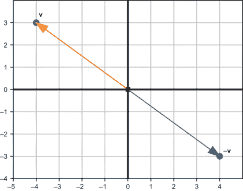

图 2.20 向量 *v* = (−4, 3) 和其相反向量 −*v* = (4, −3)。

在数轴上，从零只有两个方向：正方向和负方向。在平面上，有无数个方向（实际上确实如此），所以我们不能说 ***v*** 和 -***v*** 中的一个为正，另一个为负。我们可以说的是，对于任何向量 ***v***，其相反向量 -***v*** 将具有相同的长度，但方向相反。

有向量取反的概念后，我们可以定义 *向量减法*。对于数字，*x* − *y* 与 *x* + (−*y*) 相同。我们为向量设定相同的规则。要从向量 ***v*** 中减去向量 ***w***，你需要在 ***v*** 中加上向量 -***w***。将向量 ***v*** 和 ***w*** 视为点，***v*** − ***w*** 是 ***v*** 相对于 ***w*** 的位置。相反，将 ***v*** 和 ***w*** 视为从原点开始的箭头，图 2.21 显示 ***v*** − ***w*** 是从 ***w*** 的尖端到 ***v*** 的尖端的箭头。

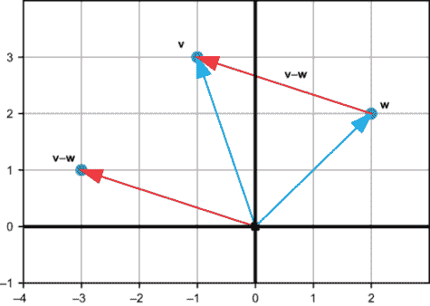

图 2.21 减去 *v* − *w* 的结果是 *w* 的尖端到 *v* 的尖端的箭头。

***v*** − ***w*** 的坐标是 ***v*** 和 ***w*** 的坐标之差。在图 2.21 中，***v*** = (−1, 3) 和 ***w*** = (2, 2)。***v*** − ***w*** 的差异坐标为 (−1 − 2, 3 − 2) = (−3, 1)。

让我们再次看看向量 ***v*** = (−1, 3) 和 ***w*** = (2, 2) 的差异。你可以使用我给你的 `draw` 函数来绘制点 ***v*** 和 ***w***，并在它们之间绘制线段。代码如下：

```
draw(
    Points((2,2), (−1,3)),
    Segment((2,2), (−1,3), color=red)
)
```

向量 ***v*** − ***w*** = (−3, 1) 的差异告诉我们，如果我们从点 *w* 出发，我们需要向左移动三个单位，向上移动一个单位才能到达点 *v*。这个向量有时被称为从 ***w*** 到 ***v*** 的 *位移*。图 2.22 中由这段 Python 代码绘制的从 ***w*** 到 ***v*** 的直线、红色线段显示了这两个点之间的 *距离*。


图 2.22 平面上两点之间的距离

线段长度的计算使用勾股定理如下：

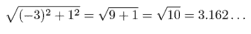

虽然位移是一个向量，但距离是一个标量（一个单一的数字）。仅距离本身不足以指定如何从 ***w*** 到 ***v***；有许多点与 ***w*** 的距离相同。图 2.23 显示了一些具有整数坐标的其他点。


图 2.23 与 *w* = (2, 2) 等距离的几个点

### 2.2.4 练习

| **练习 2.6**: 如果向量 *u* = (−2, 0)，向量 *v* = (1.5, 1.5)，以及向量 *w* = (4, 1)，那么 *u* + *v*，*v* + *w*，以及 u *+* *w* 的结果是什么？*u* + v *+* *w* 的结果是什么？**解答**：给定向量 *z* = (−2, 0)，向量 *v* = (1.5, 1.5)，以及向量 *w* = (4, 1)，结果如下：*u + v* = (−0.5, 1.5)*v + w* = (5.5, 2.5)*u + w* = (2, 1)*u* + *v* + *w* = (3.5, 2.5) |
| --- |

| **练习 2.7-迷你项目**：你可以通过将所有向量的 *x* 坐标和所有向量的 *y* 坐标相加来相加任意数量的向量。例如，四重和 (1, 2) + (2, 4) + (3, 6) + (4, 8) 的 *x* 分量为 1 + 2 + 3 + 4 = 10，*y* 分量为 2 + 4 + 6 + 8 = 20，因此结果是 (10, 20)。实现一个修改后的 `add` 函数，该函数接受任意数量的向量作为参数。**解答**:

```
def add(*vectors):
    return (sum([v[0] for *v*  in vectors]), sum([v[1] for *v*  in vectors]))
```

|

| **练习 2.8**：编写一个函数 `translate(translation, vectors)`，该函数接受一个平移向量和输入向量的列表，并返回一个列表，其中所有输入向量都通过平移向量进行了平移。例如，`translate ((1,1), [(0,0), (0,1,), (−3,−3)])` 应返回 `[(1,1),(1,2),(−2, −2)]`。**解答**:

```
def translate(translation, vectors):
    return [add(translation, v) for *v*  in vectors]
```

|

| **练习 2.9-迷你项目**：任意向量之和 *v* + *w* 给出的结果与 *w* + v 相同。使用坐标上的向量加法定义解释为什么这是真的。同时，画一个图来展示为什么在几何上这也是真的。**解答**：如果你将两个向量 *z* = (*a, b*) 和 *v* = (*c*, *d*) 相加，坐标 *a*，*b*，*c*，和 *d* 都是实数。向量加法的结果是 *z* + *v* = (a + c, b + d)。结果 |
| --- |
| 结果为 *v* + *z* 是 (c + a, d + b)，这是一对相同的坐标，因为加实数时顺序无关。无论以何种顺序尾对尾加法，都会得到相同的和向量。从视觉上看，我们可以通过添加一个示例向量对尾对尾来看到这一点：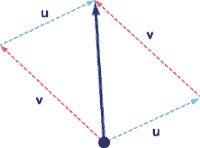无论以何种顺序尾对尾加法，都会得到相同的和向量。无论你加 *z* + *v* 还是 *v* + *z*（虚线），你都会得到相同的结果向量（实线）。在几何术语中，***u*** 和 ***v*** 定义了一个平行四边形，向量之和是对角线的长度。 |
| **练习 2.10**：在以下三个箭头向量（标记为 *u*，*v* 和 *w*）中，哪一对的和给出了最长的箭头？哪一对的和给出了最短的箭头？！[](../Images/CH02_F23_Orland_UN05.png)哪一对的和给出了最长或最短的箭头？**解答**：我们可以通过将向量尾对尾放置来测量每个向量之和：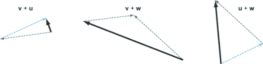尾对尾加法检查结果，我们可以看到 *v* + *z* 是最短的向量（*u* 和 *v* 几乎在相反的方向上，几乎相互抵消）。最长的向量是 *v* + *w*。 |

| **练习 2.11-迷你项目**：编写一个 Python 函数，使用向量加法来显示 100 个同时且不重叠的恐龙副本。这展示了计算机图形的强大功能；想象一下，如果用手动指定所有 2,100 个坐标对将多么繁琐！**解答**：通过一些尝试和错误，你可以将恐龙在垂直和水平方向上平移，使它们不重叠，并适当地设置边界。我决定省略网格线、坐标轴、原点和点，以使绘图更清晰。我的代码如下：

```
def hundred_dinos():
    translations = [(12*x,10*y) 
                    for *x* in range(−5,5) 
                    for y in range(−5,5)]
    dinos = [Polygon(*translate(t, dino_vectors),color=blue)
                for t in translations]
    draw(*dinos, grid=None, axes=None, origin=None)

hundred_dinos()
```

结果如下：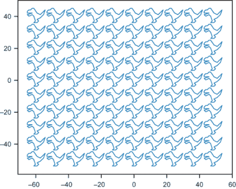100 只恐龙。快跑吧！ |

| **练习 2.12**：在向量(3, −2) + (1, 1) + (−2, −2)中，*x*分量和*y*分量哪个更长？**解答**：向量(3, −2) + (1, 1) + (−2, −2)的和是(2, −3)。*x*分量是(2, 0)，*y*分量是(0, −3)。*x*分量的长度是 2 个单位（向右），而*y*分量的长度是 3 个单位（向下，因为它是负数）。这使得*y*分量更长。 |
| --- |
| **练习 2.13**：向量(−6, −6)和(5, −12)的分量和长度是什么？**解答**：(−6, −6)的分量是(−6, 0)和(0, −6)，两者长度都是 6。向量(−6, −6)的长度是 6² + 6²的平方根，大约是 8.485。向量(5, −12)的分量是(5, 0)和(0, −12)，长度分别为 5 和 12。向量(5, −12)的长度由 5² + 12² = 25 + 144 = 169 的平方根给出。平方根的结果正好是 13。 |
| **练习 2.14**：假设我有一个向量***v***，其长度为 6，*x*分量为(1, 0)。***v***的可能坐标是什么？**解答**：(1, 0)的*x*分量长度为 1，总长度为 6，因此*y*分量的长度 b 必须满足方程 1² + b² = 6²，即 1 + b² = 36。然后 b² = 35，*y*分量的长度大约为 5.916。然而，这并没有告诉我们*y*分量的方向。向量***v***可以是(1, 5.916)或(1, −5.916)。 |

| **练习 2.15**：`dino_vectors`列表中的哪个向量长度最长？使用我们编写的`length`函数快速计算答案。**解答**：

```
>>> max(dino_vectors, key=length)
(6, 4)
```

|

| **练习 2.16**：假设向量*w*的坐标是(√2, √3)。*π*乘以*w*的大致坐标是什么？画出原始向量和新向量的近似图。**解答**：(√2, √3)的值大约是(1.4142135623730951, 1.7320508075688772)。将每个坐标乘以*π*（pi）的因子，我们得到(4.442882938158366, 5.441398092702653)。缩放后的向量比原始向量更长，如图所示：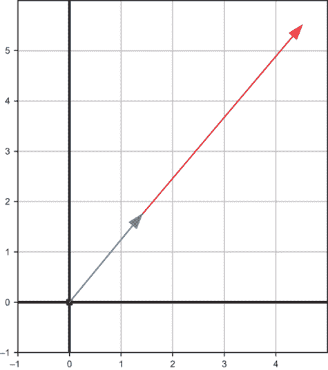原始向量（较短）及其缩放版本（较长） |
| --- |

| **练习 2.17**：编写一个 Python 函数`scale(s,v)`，该函数将输入向量***v***乘以输入标量*s*。**解答**：

```
def scale(scalar,v):
    return (scalar * v[0], scalar * v[1])
```

|

| **练习 2.18-迷你项目**：通过代数证明通过一个因子缩放坐标也会以相同的因子缩放向量的长度。假设一个长度为 *c* 的向量坐标为 (*a, b*). 证明对于任何非负实数 *s*，向量 (*s *· *a, s* · *b*) 的长度是 *s* · *c*。 (对于 *s* 的负值，这是不可能的，因为向量不能有负长度。)**解答**：我们使用符号 &#124;(*a, b*)&#124; 表示向量 (*a, b*) 的长度。因此，练习的前提告诉我们：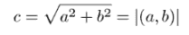从那，我们可以计算 (*sa*, *sb*) 的长度：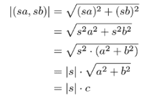只要 s 不是负数，它就与其绝对值相同：*s* = &#124;*s*&#124;。然后缩放向量的长度是 sc，正如我们希望证明的那样。 |
| --- |

| **练习 2.19-迷你项目**：假设 *z* = (−1, 1) 和 *v* = (1, 1)，并且假设 *r* 和 *s* 是实数。具体来说，让我们假设 −3 < r < 3 和 −1 < s < 1\. 在平面上，哪些可能的点使得向量 r · *z* + *s* · *v* 可能结束？请注意，向量的运算顺序与数字相同。我们假设标量乘法先进行，然后是向量加法（除非括号有其他指定）。**解答**：如果 *r* = 0，可能的位置在从 (−1, −1) 到 (1, 1) 的线段上。如果 r 不为零，可能的位置可以通过向 (−1, 1) 或 −(−1, 1) 方向移动最多三个单位离开那条线段。可能结果的范围是顶点在 (2, 4)，(4, 2)，(2, −4)，和 (4, −2) 的平行四边形。我们可以测试许多随机、允许的 **r** 和 **s** 的值来验证这一点：

```
from random import uniform
u = (−1,1)
v = (1,1)
def random_r():
    return uniform(−3,3)
def random_s(): 
    return uniform(−1,1)

possibilities = [add(scale(random_r(), u), scale(random_s(), v))
                 for i in range(0,500)]
draw(
    Points(*possibilities)
)
```

如果你运行此代码，你会得到以下图片，显示了在给定约束条件下 r • *z* + s • *v* 可能结束的可能点：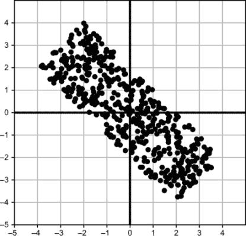给定约束条件下 *r* ∙ *u* + s ∙ *v* 的可能点位置。|

| **练习 2.20**：通过代数证明一个向量及其相反向量具有相同的长度。**提示**：将坐标及其相反数代入勾股定理。**解答**：向量 (*a*, *b*) 的相反向量坐标为 (− *a*, − *b*), 但这不会影响长度：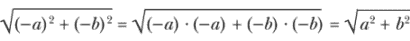向量 (−*a*, −b) 与 (*a, b*) 具有相同的长度。 |
| --- |
| **练习 2.21**：在以下七个向量中，哪些两个是相反向量的一对？！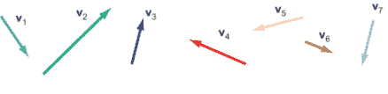**解答**：向量 v3 和 v7 是一对相反向量。 |
| **练习 2.22**：假设*z*是任意二维向量。*z* + -u 的坐标是什么？**解答**：二维向量*z*有一些坐标(*a*, *b*)。它的相反向量有坐标(− *a*, − *b*)，所以:*u* + (−*u*) = (*a*, *b*) + (− *a*, − *b*) = (*a* − *a*, *b* − *b*) = (0, 0)答案是(0, 0)。从几何学上来说，这意味着如果你跟随一个向量然后是其相反向量，你最终会回到原点，(0, 0)。 |
| **练习 2.23**：对于向量*u* = (−2, 0)，*v* = (1.5, 1.5)，和*w* = (4, 1)，向量减法*v* − *w*，*z* − *v*，和*w* − v 的结果是什么？**解答**：给定*z* = (−2, 0)，*v* = (1.5, 1.5)，和*w* = (4, 1)，我们有*v* − *w* = (−2.5, 0.5)*u* − *v* = (−3.5, −1.5)*w* − *v* = (2.5, -0.5) |

| **练习 2.24**：编写一个 Python 函数`subtract(v1,v2)`，该函数返回`v1`  - `v2`的结果，接受两个二维向量作为输入，并返回一个二维向量作为输出。**解答**：

```
def subtract(v1,v2):
    return (v1[0] − v2[0], v1[1] − v2[1])
```

|

| **练习 2.25**：编写一个 Python 函数`distance(v1,v2)`，该函数返回两个输入向量之间的距离。（注意，前一个练习中的`subtract`函数已经给出了位移。）再编写另一个 Python 函数`perimeter(vectors)`，该函数接受一个向量列表作为参数，并返回每个向量到下一个向量的距离之和，包括最后一个向量到第一个向量的距离。由`dino_vectors`定义的恐龙的周长是多少？**解答**：距离只是两个输入向量之差的长度：

```
def distance(v1,v2):
    return length(subtract(v1,v2))
```

对于周长，我们计算列表中每对后续向量的距离，以及第一对和最后一对向量的距离：

```
def perimeter(vectors):
    distances = [distance(vectors[i], vectors[(i+1)%len(vectors)])
                 for i in range(0,len(vectors))]
    return sum(distances)
```

我们可以用边长为 1 的正方形作为合理性检查：

```
>>> perimeter([(1,0),(1,1),(0,1),(0,0)])
4.0
```

然后，我们可以计算恐龙的周长：

```
>>> perimeter(dino_vectors)
44.77115093694563
```

|

| **练习 2.26-迷你项目**：设*z*为向量(1, −1)。假设存在另一个向量*v*，其坐标为正整数(*n*, *m*)，且*n* > xm，与 u 的距离为 13。从*z*到*v*的位移是多少？**提示**：你可以使用 Python 来搜索向量 v。**解答**：我们只需要搜索可能的整数对(*n*, *m*)，其中*n*在 1 的 13 个单位内，*m*在-1 的 13 个单位内：

```
for n in range(−12,15):
    for m in range(−14, 13):
        if distance((n,m), (1,−1)) == 13 and n > m > 0:
            print((n,m))
```

有一个结果：(13, 4)。它位于(1, −1)的右侧 12 个单位，上方 5 个单位，所以位移是(12, 5)。|

向量的长度不足以描述它，两个向量之间的距离也不足以从其中一个向量得到另一个向量。在这两种情况下，缺少的成分是*方向*。如果你知道一个向量的长度以及它指向的方向，你就可以识别它并找到它的坐标。在很大程度上，这就是*三角学*所涉及的内容，我们将在下一节中回顾这个主题。

## 2.3 平面中的角度和三角学

到目前为止，我们使用了两个“尺子”（称为 x 轴和 y 轴）来测量平面上的向量。从原点发出的箭头在水平和垂直方向上覆盖了一些可测量的位移，这些值唯一地指定了向量。我们完全可以只用一把尺子和一个量角器。从向量（4，3）开始，我们可以测量或计算出它的长度为 5 个单位，然后使用我们的量角器来确定方向，如图 2.24 所示。

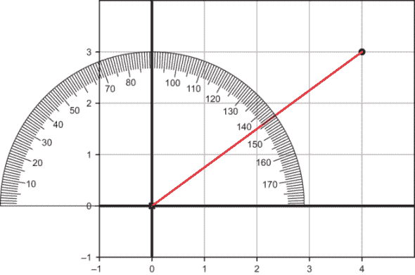

图 2.24 使用量角器测量向量指向的角度

这个向量长度为 5 个单位，它指向从正 x 轴正半轴逆时针大约 37°的方向。这给我们一组新的数字（5，37°），就像我们的原始坐标一样，唯一地指定了这个向量。这些数字被称为*极坐标*，和之前我们使用的*笛卡尔坐标*一样，可以很好地描述平面上的点。

有时候，比如当我们加向量时，使用笛卡尔坐标更容易；其他时候，极坐标更有用；例如，当我们想查看旋转了某个角度的向量时。在代码中，我们没有实际的尺子或量角器可用，所以我们使用三角函数来转换。

### 2.3.1 从角度到分量

让我们看看相反的问题：假设我们已经有了一个角度和距离，比如说 116.57°和 3。这些定义了一对极坐标（3，116.57°）。我们如何通过几何方法找到这个向量的笛卡尔坐标？

首先，我们可以将量角器放在原点以找到正确的方向。我们测量从正 x 轴逆时针 116.57°，并沿着这个方向画一条线（图 2.25）。我们的向量（3，116.57°）位于这条线上某处。

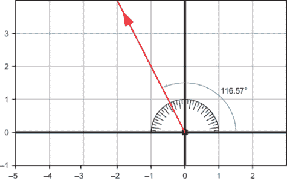

图 2.25 使用量角器从正 x 轴测量 116.57°

下一步是拿一把尺子，测量从这个方向起距离原点三个单位的点。一旦我们找到了它，就像图 2.26 中所示，我们可以测量分量并得到我们的近似坐标（-1.34，2.68）。

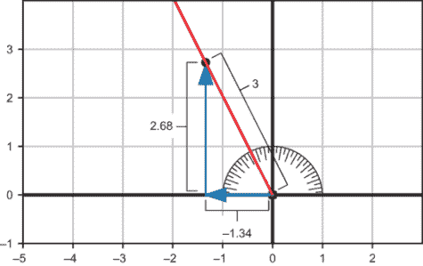

图 2.26 使用尺子测量距离原点三个单位的点的坐标

看起来 116.57°是一个随机选择的角度，但它有一个有用的性质。从原点开始并朝那个方向移动，每向左移动一个单位，就向上移动两个单位。大约沿着这条线的向量包括（-1，2），（-3，6）和当然还有（-1.34，2.68）；*y*坐标是*x*坐标的两倍（图 2.27）。

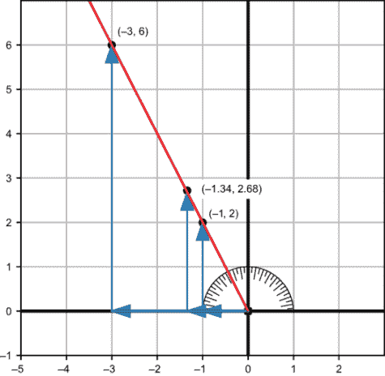

图 2.27 沿着 116.57°的方向前进，每向左移动一个单位，就向上移动两个单位。

奇怪的角度 116.57°恰好给出了一个很好的整数比率-2。我们并不总是这么幸运，能得到整数比率，但每个角度都给出一个*恒定*的比率。45°的角度给我们每个水平单位一个垂直单位，或者比率是 1。图 2.28 显示了另一个角度，200°。这给我们每覆盖-1 个水平单位 0.36 个垂直单位的恒定比率或 0.36。

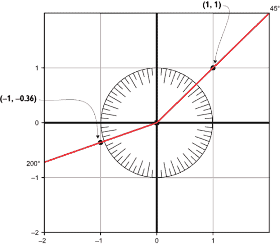

图 2.28 在不同角度下，每单位水平距离覆盖的垂直距离是多少？

给定一个角度，该角度上的向量的坐标将有一个恒定的比例。这个比例称为该角度的*正切*，正切函数写作*tan*。你之前已经看到了它的一些近似值：

tan(37°) ≈ 3/4

tan(116.57°) ≈ -2

tan(45°) = 1

tan(200°) ≈ 0.36

在这里，为了表示*近似*相等，我使用符号≈而不是符号=。正切函数是一个*三角*函数，因为它帮助我们测量三角形。（“trigon”在“trigonometry”中的意思是三角形，“metric”的意思是测量。）请注意，我还没有告诉你*如何*计算正切，只是告诉你它的一些值。Python 有一个内置的正切函数，我很快会向你展示如何使用它。你几乎永远不必担心自己计算（或测量）角度的正切。

正切函数显然与我们的原始问题有关，即给定一个角度和距离来找到一个向量的笛卡尔坐标。但它实际上并不提供坐标，只提供它们的比率。为此，其他两个三角函数是有帮助的：*正弦*和*余弦*。如果我们以某个角度测量一些距离（图 2.29），该角度的正切给出了垂直距离除以水平距离。

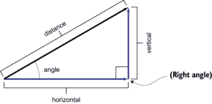

图 2.29 给定向量的距离和角度示意图

通过比较，正弦和余弦给出了相对于总距离的垂直和水平距离。这些简写为*sin*和*cos*，这个方程显示了它们的定义：

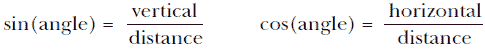

让我们以 37°的角度来看一个具体的例子（图 2.30）。我们看到了点（4，3）在这个角度下距离原点 5 个单位。

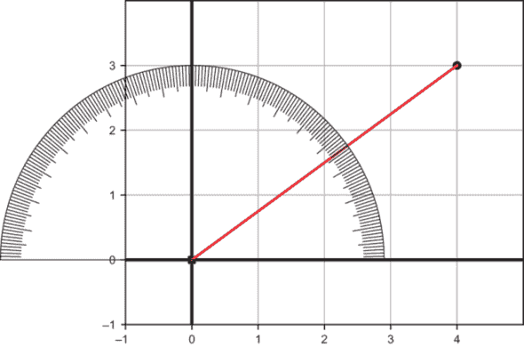

图 2.30 使用量角器测量到点（4，3）的角度

对于每 5 个单位的 37°行进，你大约覆盖 3 个垂直单位。因此，我们可以写成：

sin(37°) ≈ 3/5

同样，对于每 5 个单位的 37°行进，你大约覆盖 4 个水平单位，因此我们可以写成：

cos(37°) ≈ 4/5

这是一个将极坐标中的向量转换为相应笛卡尔坐标的一般策略。如果你知道角度 θ（希腊字母 theta，通常用于角度）的正弦和余弦以及在该方向上走过的距离 *r*，笛卡尔坐标由 (*r* · cos(θ), *r* · sin(θ)) 给出，并在图 2.31 中展示。

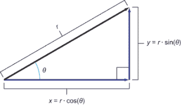

图 2.31 展示了从极坐标到直角坐标系转换的图像

### 2.3.2 Python 中的弧度和三角学

让我们将我们关于三角学的复习内容转化为 Python 代码。具体来说，让我们构建一个函数，它接受一对极坐标（长度和角度）并输出一对笛卡尔坐标（*x* 和 *y* 分量的长度）。

主要的难点是 Python 的内置三角函数使用的单位与我们使用的不同。例如，我们期望 tan(45°) = 1，但 Python 给出的结果却大不相同：

```
>>> from math import tan
>>> tan(45)
1.6197751905438615
```

Python 不使用度数，大多数数学家也不使用。相反，他们使用称为 *弧度* 的单位来测量角度。转换系数是

1 弧度 ≈ 57.296°

这可能看起来像是一个任意的转换系数。以下是一些关于度和弧度之间更具有启发性的关系，这些关系以特殊数字 *π*（pi）的形式给出，其值约为 3.14159。这里有一些例子：

*π* 弧度 = 180°

2*π* 弧度 = 360°

在弧度中，半圈是一个 *π* 弧度，整个旋转是 2*π*。这分别与半径为 1 的圆的半周和整个周长相对应（图 2.32）。


图 2.32 半圈是 *π* 弧度，而整个旋转是 2*π* 弧度。

你可以将弧度视为另一种比例：对于给定的角度，其弧度测量值告诉你围绕圆周走了多少半径。由于这个特殊性质，没有单位的角测量值被认为是弧度。注意到 45° = *π*/4 (弧度)，我们可以得到这个角度的正切值的正确结果：

```
>>> from math import tan, pi
>>> tan(pi/4)
0.9999999999999999
```

我们现在可以利用 Python 的三角函数编写一个 `to_cartesian` 函数，它接受一对极坐标并返回相应的笛卡尔坐标：

```
from math import sin, cos
def to_cartesian(polar_vector):
    length, angle = polar_vector[0], polar_vector[1]
    return (length*cos(angle), length*sin(angle))
```

使用这个，我们可以验证 5 个单位在 37° 的角度下可以接近点 (4, 3)：

```
>>> from math import pi
>>> angle = 37*pi/180
>>> to_cartesian((5,angle))
(3.993177550236464, 3.0090751157602416)
```

现在我们已经可以从极坐标转换为笛卡尔坐标，让我们看看如何进行相反的转换。

### 2.3.3 从分量回到角度

给定一对笛卡尔坐标，例如 (−2, 3)，我们知道如何使用勾股定理来找到长度。在这种情况下，它确实是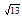，这是我们正在寻找的两个极坐标中的第一个。第二个是角度，我们可以称之为 θ (theta)，表示这个向量的方向（图 2.33）。

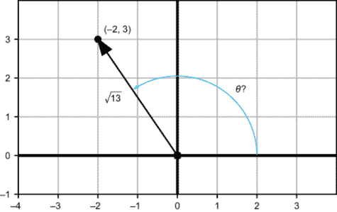

图 2.33 向量 (−2, 3) 指向什么角度？

我们可以对我们寻找的角度θ说一些事实。它的正切，tan(θ)，是 3/2，而 sin(θ) = 3/√13，cos(θ) = −2/√13。剩下要做的就是找到一个满足这些条件的θ值。如果你愿意，你可以暂停并尝试通过猜测和检查来近似这个角度。

理想情况下，我们希望有一个比这更有效的方法。如果有一个函数可以接受 sin(θ)的值，例如，并返回θ，那将是极好的。这听起来比实际做起来容易，但 Python 的`math.asin`函数做出了良好的尝试。这是一个称为**反正弦函数**的反三角函数实现，并返回令人满意的θ值：

```
>>> from math import asin
>>> sin(1)
0.8414709848078965
>>> asin(0.8414709848078965)
1.0
```

到目前为止，一切顺利。但我们的角度 3/√13 的正弦值是多少呢？

```
>>> from math import sqrt
>>> asin(3/sqrt(13))
0.9827937232473292
```

这个角度大约是 56.3°，如图 2.34 所示，这是错误的方向！

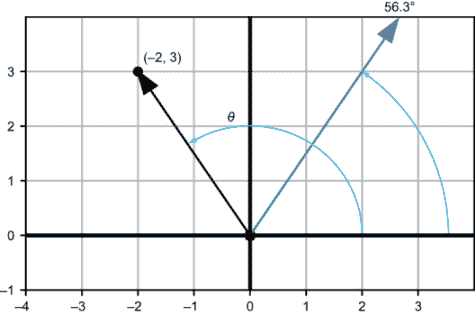

图 2.34 Python 的`math.asin`函数似乎给出了错误的角度。

`math.asin`给出这个答案并不错误；另一个点（2，3）**确实**位于这个方向上。它距离原点有长度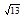。这就是为什么`math.asin`对我们来说不是完整的解决方案。存在多个角度可以有相同的正弦值。

反三角函数，称为**余弦反函数**，在 Python 中通过`math.acos`实现，恰好给出了正确的值：

```
>>> from math import acos
>>> acos(−2/sqrt(13))
2.1587989303424644
```

这样多的弧度大约等于 123.7°，我们可以用量角器来确认这是正确的。但这只是巧合；还有其他角度也可以给出相同的余弦值。例如，(−2，−3)也有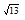距离原点，因此它位于与θ相同余弦的角度上：−2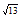。为了找到我们真正想要的θ值，我们必须确保正弦和余弦都与我们的预期相符。Python 返回的角度，大约是 2.159，满足这个条件：

```
>> cos(2.1587989303424644)
-0.5547001962252293
>>> −2/sqrt(13)
-0.5547001962252291
>>> sin(2.1587989303424644)
0.8320502943378435
>>> 3/sqrt(13)
0.8320502943378437
```

任何反正弦、反余弦或反正切函数都不足以找到平面上的点到角度。通过你可能在上高中的三角学课程中学到的巧妙几何论证，确实可以找到正确角度。我将把它留作练习，直接切入正题−Python 可以为你做这项工作！`math.atan2`函数接受平面内一个点的笛卡尔坐标（顺序相反！）并返回它所在的角度。例如，

```
>>> from math import atan2
>>> atan2(3,−2)
2.158798930342464
```

我为埋没了重点表示歉意，但我这样做是因为了解使用反正切函数的潜在陷阱是值得的。总的来说，反三角函数在逆向操作时很棘手；多个不同的输入可以产生相同的输出，因此输出不能追溯到唯一的输入。这使得我们可以完成我们最初设定的函数：一个从笛卡尔坐标系到极坐标系的转换器：

```
def to_polar(vector):
    x, y = vector[0], vector[1]
    angle = atan2(y,x)
    return (length(vector), angle)
```

我们可以验证一些简单的例子：`to_polar((1,0))` 应该是正 x 方向的一个单位或者零度角。确实，这个函数给我们一个零度角和长度为 1：

```
>>> to_polar((1,0))
(1.0, 0.0)
```

（输入和输出相同是巧合；它们有不同的几何意义。）同样，我们得到了预期的答案 (−2, 3)：

```
>>> to_polar((−2,3))
(3.605551275463989, 2.158798930342464)
```

### 2.3.4  练习

| **练习 2.27**: 确认由笛卡尔坐标 (−1.34, 2.68) 给出的向量长度约为 3，正如预期的那样。**解答**:

```
>>> length((−1.34,2.68))
2.9963310898497184
```

差不多就是了！ |

| **练习 2.28**: 图中显示了一条与正 x 轴逆时针形成 22° 角的直线。根据以下图片，tan(22°)的大致值是多少？！[](../Images/CH02_F34_Orland_UN12.png)**解答**: 这条线接近点 (10, 4)，所以 4 / 10 = 0.4 是 tan(22°) 的一个合理的近似，如图所示：！[](../Images/CH02_F34_Orland_UN13.png) |
| --- |
| **练习 2.29**: 反过来，如果我们知道一个向量的长度和方向，想要找到它的分量。长度为 15 且指向 37° 角的向量的 x 和 y 分量是什么？**解答**: 37°的正弦值大约是 3/5，这告诉我们，在这个角度上，每 5 个单位的距离会向上移动 3 个单位。所以，15 个单位的距离给我们一个垂直分量是 3/5 · 15，即 9。37°的余弦值大约是 4/5，这告诉我们，在这个方向上，每 5 个单位的距离会向右移动 4 个单位，所以水平分量是 4/5 · 15 或 12。总之，极坐标 (15, 37°) 大约对应于笛卡尔坐标 (12, 9)。 |
| **练习 2.30**: 假设我从原点出发，以逆时针从正 x 轴测量的 125° 角度移动了 8.5 个单位。已知 sin(125°) = 0.819 和 cos(125°) = -0.574，我的最终坐标是什么？画一个图来显示角度和走过的路径。**解答**: x = r · cos(θ) = 8.5 · -0.574 = −4.879，y = r · sin(θ) = 8.5 · 0.819 = 6.962。以下图显示了最终位置，(−4.879, 6.962)：！[](../Images/CH02_F34_Orland_UN14.png) |
| **练习 2.31**: 0°、90°、180°的正弦和余弦值是多少？换句话说，在这些方向上，每单位距离覆盖了多少垂直和水平单位？**解答**: 在 0° 时，没有覆盖垂直距离，所以 sin(0°) = 0；相反，每单位距离的移动都是水平距离的单位，所以 cos(0°) = 1。对于 90°（逆时针四分之一转），每单位移动都是正垂直单位，所以 sin(90°) = 1，而 cos(90°) = 0。最后，在 180° 时，每单位距离的移动都是 x 方向的负单位，所以 cos(180°) = −1 和 sin(180°) = 0。 |
| **练习 2.32**: 下图给出了一些直角三角形的精确测量值：首先，确认这些长度对于直角三角形是有效的，因为它们满足勾股定理。然后，使用图中的测量值计算 sin(30°)、cos(30°) 和 tan(30°) 的值，精确到小数点后三位！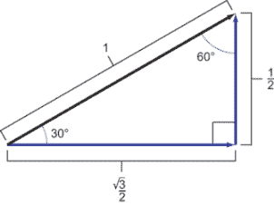**解答**：这些边长确实满足勾股定理！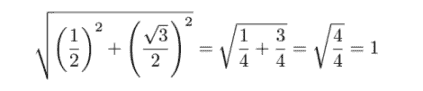将边长代入勾股定理，三角函数的值由边长适当的比值给出！通过它们的定义计算正弦、余弦和正切值 |
| **练习 2.33**: 从不同角度观察上一个练习中的三角形，使用它来计算 sin(60°)、cos(60°) 和 tan(60°) 的值，精确到小数点后三位。**解答**：旋转和反射上一个练习中的三角形不会影响其边长或角度！上一个练习中三角形的旋转副本，边长的比值给出了 60° 的三角函数值！当水平和垂直分量交换时，计算定义比值 |
| **练习 2.34**: 50° 的余弦值是 0.643。sin(50°) 和 tan(50°) 是多少？画一个图来帮助你计算答案。**解答**：已知 50° 的余弦值是 0.643，以下三角形是有效的！也就是说，它具有两个已知边长的正确比例：0.643 / 1 = 0.643。要找到未知边长，我们可以使用勾股定理！有了已知的边长，sin(50°) = 0.766/1 = 0.766。同样，tan(50°) = 0.766/0.643 = 1.192。 |

| **练习 2.35**: 116.57° 是多少弧度？使用 Python 计算这个角度的正切值，并确认它接近我们之前看到的 -2。**解答**：116.57° · (1 弧度/57.296°) = 2.035 弧度：

```
>>> from math import tan
>>> tan(2.035)
−1.9972227673316139
```

|

| **练习 2.36**: 找到角度 10π/6。你预计 cos(10π/6) 和 sin(10π/6) 的值是正还是负？使用 Python 计算它们的值并确认。**解答**：整个圆是 2π 弧度，所以 π/6 是圆的十二分之一。你可以想象将披萨切成 12 片，并从正 x 轴逆时针计数；10π/6 的角度是离完整旋转两片。这意味着它指向下方和右侧。余弦应该是正的，而正弦应该是负的，因为在这个方向上的距离对应于正的水平位移和负的垂直位移：

```
>>> from math import pi, cos, sin
>>> sin(10*pi/6)
-0.8660254037844386
>>> cos(10*pi/6)
0.5000000000000001
```

|

| **练习 2.37**: 以下列表推导创建了 1,000 个极坐标点：

```
[(cos(5*x*pi/500.0), 2*pi*x/1000.0) for *x* in range(0,1000)]
```

在 Python 代码中，将它们转换为笛卡尔坐标系，并用线段连接成闭合回路以绘制图形。**解答**: 包括设置和原始数据列表，代码如下：

```
polar_coords = [(cos(x*pi/100.0), 2*pi*x/1000.0) for *x* in range(0,1000)]
vectors = [to_cartesian(p) for p in polar_coords]
draw(Polygon(*vectors, color=green))
```

结果是一个五瓣花：1,000 个连接点的图是一个花形。|

| **练习 2.38**: 通过“猜测和检查”找到到达点 (−2, 3) 的角度。到达点 (−2, 3) 的角度是多少？**提示**: 我们可以直观地看出答案在 π/2 和 π 之间。在这个区间内，正弦和余弦的值随着角度的增加而总是减少。**解答**: 这是一个略小于顺时针方向四分之一转的例子。这里是在 π/2 和 π 之间猜测和检查，寻找切线接近 −3/2 = −1.5 的角度：

```
>>> from math import tan, pi
>>> pi, pi/2
(3.141592653589793, 1.5707963267948966)
>>> tan(1.8)
−4.286261674628062
>>> tan(2.5)
-0.7470222972386603
>>> tan(2.2)
−1.3738230567687946
>>> tan(2.1)
−1.7098465429045073
>>> tan(2.15)
−1.5289797578045665
>>> tan(2.16)
−1.496103541616277
>>> tan(2.155)
−1.5124173422757465
>>> tan(2.156)
−1.5091348993879299
>>> tan(2.157)
−1.5058623488727219
>>> tan(2.158)
−1.5025996395625054
>>> tan(2.159)
−1.4993467206361923
```

值必须在 2.158 和 2.159 之间。|

| **练习 2.39**: 找到平面上与 θ 相同切线的另一点，即 −3/2。使用 Python 的反正切函数 `math.atan` 来找到这个角度的值。**解答**: 切线为 −3/2 的另一点是 (3, −2)。Python 的 `math.atan` 找到这个点的角度：

```
>>> from math import atan
>>> atan(−3/2)
-0.982793723247329
```

这略小于顺时针方向的四分之一转。|

| **练习 2.40**: 不使用 Python，对应于笛卡尔坐标系 (1, 1) 和 (1, −1) 的极坐标是什么？一旦找到答案，使用 `to_polar` 来检查你的工作。**解答**: 在极坐标中，(1, 1) 变为 (√2, π/4) 和 (1, −1) 变为 (√2, −π/4)。通过一些小心，你可以找到由已知向量组成的形状上的任何角度。两个向量之间的角度是这些角度与 x 轴的求和或差。你将在下一个迷你项目中测量一些更复杂的角度。 |
| --- |
| **练习 2.41-迷你项目**: 恐龙的嘴巴角度是多少？恐龙的脚趾角度是多少？它的尾巴尖端的角度是多少？！[](../Images/CH02_F34_Orland_UN20.png)我们可以在我们的恐龙上测量或计算一些角度。 |

## 2.4 向量集合的转换

向量集合存储空间数据，如恐龙的绘画，无论我们使用什么坐标系：极坐标或笛卡尔坐标系。结果是，当我们想要操作向量时，一个坐标系可能比另一个坐标系更好。我们已经看到，使用笛卡尔坐标系移动（或平移）向量集合很容易。在极坐标系中，这要困难得多。因为极坐标系内置了角度，这使得执行旋转变得简单。

在极坐标中，向角度增加会使向量进一步逆时针旋转，而从中减去会使向量顺时针旋转。极坐标 (1, 2) 距离为 1，角度为 2 弧度。（记住，如果没有度数符号，我们是在弧度下工作！）从角度 2 开始，增加或减少 1 将使向量分别逆时针或顺时针旋转 1 弧度（见图 2.35）。


图 2.35 从角度上添加或减去旋转会使向量绕原点旋转。

同时旋转多个向量会使这些向量所代表的图形绕原点旋转。`draw`函数只理解笛卡尔坐标，因此在使用之前我们需要将其从极坐标转换为笛卡尔坐标。同样，我们只看到了如何在极坐标中旋转向量，因此我们需要在执行旋转之前将笛卡尔坐标转换为极坐标。使用这种方法，我们可以这样旋转恐龙：

```
rotation_angle = pi/4
dino_polar = [to_polar(*v*) for *v*  in dino_vectors]
dino_rotated_polar = [(l,angle + rotation_angle) for l,angle in dino_polar]
dino_rotated = [to_cartesian(p) for p in dino_rotated_polar]
draw(
    Polygon(*dino_vectors, color=gray),
    Polygon(*dino_rotated, color=red)
)
```

此代码的结果是原始恐龙的灰色副本，加上一个叠加的红色副本，该副本旋转了π/4，即四分之一完整的逆时针旋转（见图 2.36）。


图 2.36 原始恐龙以灰色呈现，以及一个旋转后的红色副本

作为本节末尾的一个练习，你可以编写一个通用的`rotate`函数，该函数将相同指定的角度旋转向量列表。我将在接下来的几个示例中使用这样的函数，你可以使用我在源代码中提供的实现，或者自己编写一个。

### 2.4.1 组合向量变换

到目前为止，我们已经看到了如何平移、缩放和旋转向量。将这些变换应用于向量集合会在平面上定义的形状上产生相同的效果。这些向量变换的全部力量在于我们按顺序应用它们。

例如，我们首先旋转恐龙，然后进行平移。使用 2.2.4 节中的`translate`函数和`rotate`函数，我们可以简洁地写出这样的变换（见图 2.37 的结果）：

```
new_dino = translate((8,8), rotate(5 * pi/3, dino_vectors))
```

旋转首先进行，将恐龙逆时针旋转 5π/3，即大部分逆时针旋转。然后恐龙向上和向右平移 8 个单位。正如你所想象的那样，适当地组合旋转和平移可以将恐龙（或任何形状）移动到平面上的任何所需位置和方向。无论我们是在电影中还是在游戏中动画化我们的恐龙，使用向量变换来移动它的灵活性让我们能够通过编程赋予它生命。


图 2.37 原始恐龙以灰色呈现，以及一个旋转并平移后的红色副本

我们的应用很快就会超越卡通恐龙；还有许多其他对向量的操作，并且许多可以推广到更高维度。现实世界的数据集通常存在于数十或数百个维度中，因此我们也将对这些数据应用相同的变换。通常，对数据集进行平移和旋转可以使重要特征更加清晰。我们无法想象 100 维度的旋转，但我们总是可以将二维视为一个可靠的隐喻。

### 2.4.2 练习

| **练习 2.42**：创建一个 `rotate(angle, vectors)` 函数，该函数接受一个输入向量的笛卡尔坐标数组，并按指定角度旋转这些向量（根据角度的正负，逆时针或顺时针旋转）。解决方案

```
def rotate(angle, vectors):
    polars = [to_polar(*v*) for *v*  in vectors]
    return [to_cartesian((l, a+angle)) for l,a in polars]
```

|

| **练习 2.43**：创建一个名为 `regular_polygon(n)` 的函数，该函数返回正 *n* 边形（即所有角度和边长都相等）的顶点的笛卡尔坐标。例如，`polygon(7)` 生成定义以下七边形的向量：一个具有七个均匀分布角度的点的正七边形**提示**：在这张图中，我使用了向量 (1, 0) 和围绕原点旋转的七个均匀分布的角度的副本。解决方案

```
def regular_polygon(n):
    return [to_cartesian((1, 2*pi*k/n)) for k in range(0,n)]
```

|

| **练习 2.44**：首先将恐龙平移向量 (8, 8)，然后旋转 5π/3，结果是什么？结果与先旋转再平移相同吗？解决方案先平移再旋转恐龙结果不同。一般来说，以不同的顺序应用旋转和平移会产生不同的结果。 |
| --- |

## 2.5 使用 Matplotlib 绘图

正如承诺的那样，我将通过向你展示如何从 Matplotlib 库中构建本章使用的绘图函数“从头开始”来结束。在用 pip 安装 Matplotlib 后，你可以导入它（以及一些它的子模块）；例如，

```
import matplotlib
from matplotlib.patches import Polygon
from matplotlib.collections import PatchCollection
```

`Polygon`、`Points`、`Arrow` 和 `Segment` 类并不那么有趣；它们只是简单地在其构造函数中存储传递给它们的数据。例如，`Points` 类只包含一个构造函数，该构造函数接收并存储一个向量列表和一个颜色关键字参数：

```
class Points():
    def __init__(self, *vectors, color=black):
        self.vectors = list(vectors)
        self.color = color
```

`draw` 函数首先确定绘图的大小，然后逐个绘制传递给它的每个对象。例如，要在表示 `Points` 对象的平面上绘制点，`draw` 使用 Matplotlib 的散点图功能：

```
def draw(*objects, ...
    # ...                                         ❶
    for object in objects:                        ❷
    # ... 
        elif type(object) == Points:              ❸
            xs = [v[0] for *v*  in object.vectors]
            ys = [v[1] for *v*  in object.vectors]
            plt.scatter(xs, ys, color=object.color)
        # ...
```

❶ 这里发生了一些设置，但未显示。

❷ 遍历传入的对象

❸ 如果当前对象是 Points 类的实例，则使用 Matplotlib 的 scatter 函数为其所有向量绘制点

箭头、线段和多边形以类似的方式处理，使用不同的预构建 Matplotlib 函数使几何对象出现在图上。你可以在源代码文件 vector_drawing.py 中找到所有这些实现。我们将在这本书中使用 Matplotlib 绘制数据和数学函数，并且随着我们的使用，我会定期提供其功能的更新。

现在你已经掌握了二维空间，你准备好添加另一个维度。有了第三个维度，我们可以完全描述我们所生活的世界。在下一章中，你将看到如何在代码中建模三维对象。

## 摘要

+   向量是存在于多维空间中的数学对象。这些可以是几何空间，如计算机屏幕上的二维（2D）平面或我们居住的三维（3D）世界。

+   你可以将向量等价地视为具有指定长度和方向的箭头，或者视为相对于称为*原点*的参考点的平面上的点。给定一个点，有一个相应的箭头显示如何从原点到达该点。

+   你可以在平面上连接点集合，形成像恐龙这样的有趣形状。

+   在 2D 中，坐标是帮助我们测量平面上点位置的数字对。写成元组（*x*，*y*），*x*和*y*的值告诉我们水平方向和垂直方向要移动多远才能到达该点。

+   我们可以在 Python 中将点存储为坐标元组，并从多个库中选择来在屏幕上绘制这些点。

+   向量加法的效果是将第一个向量在第二个加向量方向上移动（或移动）。将向量集合视为旅行路径，它们的向量和给出了整体的方向和行进距离。

+   向量与一个数值因子进行标量乘法运算会产生一个新的向量，其长度增加该因子，且方向与原始向量相同。

+   从第二个向量中减去一个向量给出了第二个向量相对于第一个向量的相对位置。

+   向量可以通过其长度和方向（作为一个角度）来指定。这两个数字定义了给定二维向量的极坐标。

+   正弦、余弦和正切等三角函数用于在普通（笛卡尔）坐标系和极坐标系之间进行转换。

+   在极坐标系中，通过向量集合定义的形状很容易旋转。你只需将给定的旋转角度加到或从每个向量的角度中减去。在平面上旋转和移动形状，使我们能够将它们放置在任何位置和任何方向。
