# 3 升级到三维世界

本章涵盖

+   为 3D 矢量建立心理模型

+   进行 3D 矢量运算

+   使用点积和叉积来测量长度和方向

+   在 2D 中渲染 3D 对象

2D 世界容易可视化，但现实世界有三个维度。无论我们是用软件设计建筑、制作动画电影还是运行动作游戏，我们的程序都需要意识到我们生活的三个空间维度。

在一个 2D 空间中，就像这本书的页面一样，我们有一个垂直和水平方向。增加一个第三维度，我们也可以谈论页面外的点或垂直于页面的箭头。但即使程序模拟三维，大多数计算机显示器仍然是二维的。本章的使命是构建我们需要的工具，将 3D 矢量测量的 3D 对象转换为 2D，以便我们的对象可以在屏幕上显示。

球体是 3D 形状的一个例子。一个成功绘制的 3D 球体可能看起来像图 3.1 中所示的那样。如果没有阴影，它看起来就像一个圆。

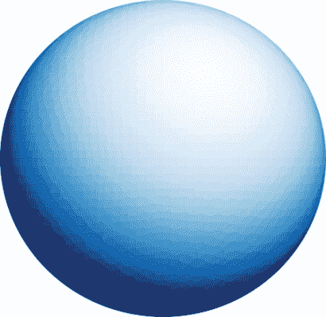

图 3.1 在 2D 圆上的阴影使其看起来像一个 3D 球体。

阴影表明光线以一定的角度击中我们的球体，给它一种深度错觉。我们的总体策略不是绘制一个完美的球体，而是一个由多边形组成的近似。每个多边形都可以根据它与光源形成的精确角度进行着色。信不信由你，图 3.1 不是圆球的图片，而是 8,000 个不同阴影的三角形。图 3.2 显示了另一个具有较少三角形的例子。

 

图 3.2 使用许多小、单色的三角形绘制阴影球体

我们有数学工具在 2D 屏幕上定义一个三角形：我们只需要定义角落的三个 2D 矢量。但除非我们也认为它们在三维空间中有生命，否则我们无法决定如何给它们上色。为此，我们需要学会与 3D 矢量一起工作。

当然，这已经是一个已解决的问题，我们首先使用预构建的库来绘制我们的 3D 形状。一旦我们对 3D 矢量的世界有了感觉，我们就可以构建自己的渲染器，并展示如何绘制球体。

## 3.1 在 3D 空间中描绘矢量

在 2D 平面上，我们使用了三个可互换的矢量心理模型：坐标对、固定长度和方向的箭头，以及相对于原点的点。由于这本书的页面大小有限，我们只将视野限制在平面的一小部分——一个高度和宽度固定的矩形，如图 3.3 所示。

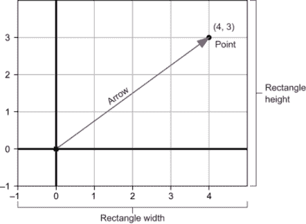

图 3.3 2D 平面上一个小段的高度和宽度

我们可以用类似的方式解释 3D 向量。我们不是查看平面的矩形部分，而是从一个有限的 3D 空间盒子开始。如图 3.4 所示，这样的 3D 盒子具有有限的高度、宽度和深度。在 3D 中，我们保持*x*和*y*方向的概念，并添加一个*z*方向来测量深度。

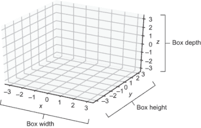

图 3.4 一个 3D 空间的小有限盒子具有宽度(*x*)、高度(*y*)和深度(*z*)。

我们可以将任何 2D 向量视为存在于 3D 空间中，具有相同的大小和方向，但固定在一个平面上，其中深度*z*为零。图 3.5 显示了向量(4, 3)在 3D 空间中的 2D 绘制，保留了它之前所有的特征。第二幅图（在底部）标注了所有仍然包含的特征。

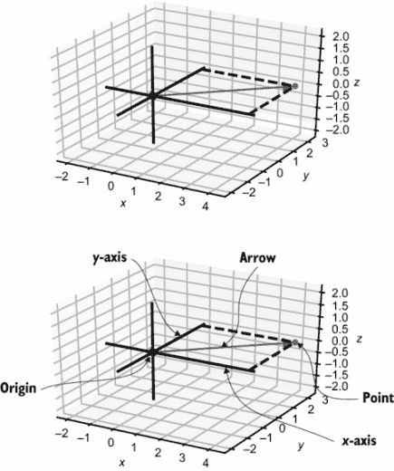

图 3.5 包含在 3D 世界中的 2D 世界和居民向量(4, 3)

虚线形成了一个在深度为零的 2D 平面上的矩形。画虚线相交成直角有助于我们在 3D 中定位点。否则，我们的视角可能会欺骗我们，一个点可能不在我们认为它所在的位置。

我们的向量仍然生活在平面上，但现在我们也可以看到它生活在更大的 3D 空间中。我们可以在原始平面上方绘制另一个 3D 向量（一个新的箭头和一个新的点），它延伸到更高的深度值（图 3.6）。

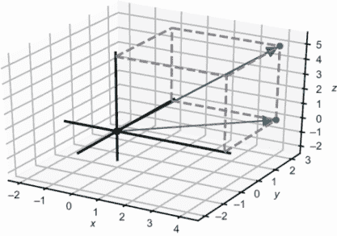

图 3.6 与图 3.5 的 2D 世界及其居民向量(4, 3)相比，一个向量延伸到第三维度

为了使第二个向量的位置清晰，我画了一个虚线盒子而不是图 3.5 中的虚线矩形。在图 3.6 中，这个盒子显示了向量在 3D 空间中覆盖的长度、宽度和深度。箭头和点在 3D 中作为向量的心理模型，就像在 2D 中一样，我们可以用坐标相似地测量它们。

### 3.1.1 使用坐标表示 3D 向量

这一对数字(4, 3)足以指定 2D 中的一个单独的点或箭头，但在 3D 中，有无数个点具有*x*坐标为 4 和*y*坐标为 3。事实上，如图 3.7 所示，有一个整个点线在 3D 空间中具有这些坐标，每个点在*z*（或深度）方向上都有不同的位置。

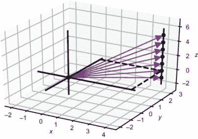

图 3.7 几个具有相同的 x 和 y 坐标但具有不同 z 坐标的向量

要指定 3D 中的一个唯一点，我们需要总共三个数字。像(4, 3, 5)这样的数字组合被称为 3D 向量中的*x*、*y*和*z*坐标。和之前一样，我们可以将这些读作找到所需点的指令。如图 3.8 所示，要到达点(4, 3, 5)，我们首先在*x*方向上移动+4 个单位，然后在*y*方向上移动+3 个单位，最后在*z*方向上移动+5 个单位。

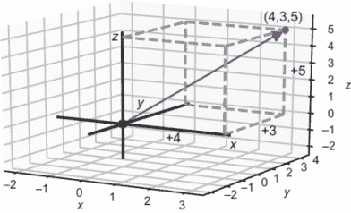

图 3.8 三个坐标(4, 3, 5)为我们提供了到达 3D 中一个点的方向。

### 3.1.2 使用 Python 进行 3D 绘制

与上一章一样，我使用 Python 的 Matplotlib 库的包装器来绘制 3D 向量图。您可以在本书的源代码中找到实现，但我会坚持使用包装器来关注绘制的过程概念，而不是 Matplotlib 的细节。

我的包装器使用新的类如 `Points3D` 和 `Arrow3D` 来区分 3D 对象和它们的 2D 对应物。一个新的函数 `draw3d` 知道如何解释和渲染这些对象，以便使它们看起来是三维的。默认情况下，`draw3d()` 显示坐标轴和原点，以及一个小型的 3D 空间框（图 3.9），即使没有指定要绘制的对象。

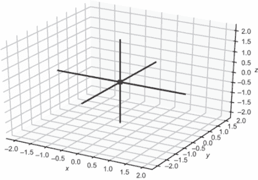

图 3.9 使用 Matplotlib 的 `draw3d()` 绘制空 3D 区域

尽管由于我们的视角而显得倾斜，但绘制的 x、y 和 z 轴在空间中是垂直的。为了提高视觉效果，Matplotlib 将单位显示在框外，但原点和坐标轴本身显示在框内。原点是坐标 (0, 0, 0)，坐标轴从它向正负 *x*、*y* 和 *z* 方向延伸。

`Points3D` 类存储了我们想要将其视为点并因此绘制为 3D 空间中点的向量集合。例如，我们可以使用以下代码绘制向量 (2, 2, 2) 和 (1, −2, −2)，该代码生成图 3.10：

```
draw3d(
    Points3D((2,2,2),(1,−2,−2))
)
```

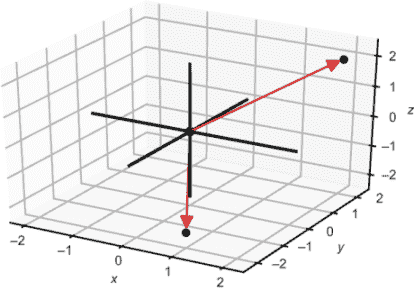

图 3.10 绘制点 (2, 2, 2) 和 (1, −2, −2)

要将这些向量可视化为箭头，我们可以将向量表示为 `Arrow3D` 对象。我们还可以使用 `Segment3D` 对象连接箭头的尖端，如下所示，生成图 3.11：

```
draw3d(
    Points3D((2,2,2),(1,−2,−2)),
    Arrow3D((2,2,2)),
    Arrow3D((1,−2,−2)),
    Segment3D((2,2,2), (1,−2,−2))
)
```

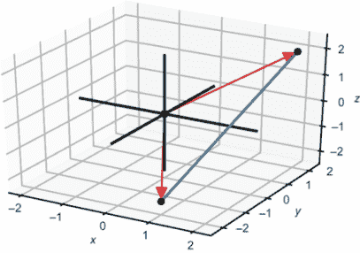

图 3.11 绘制 3D 箭头

在图 3.11 中，箭头指向的方向有点难以看清。为了使其更清晰，我们可以围绕箭头绘制虚线框，使其看起来更有三维感。由于我们将频繁地绘制这些框，我创建了一个 `Box3D` 类来表示一个角落位于原点，相对角落位于给定点的框。图 3.12 展示了 3D 框，但首先，这是代码：

```
draw3d(
    Points3D((2,2,2),(1,−2,−2)),
    Arrow3D((2,2,2)),
    Arrow3D((1,−2,−2)),
    Segment3D((2,2,2), (1,−2,−2)),
    Box3D(2,2,2),
    Box3D(1,−2,−2)
)
```

图 3.12 绘制框以使我们的箭头看起来像 3D

*在本章中*，我使用了多个（希望是自解释的）关键字参数，而没有明确介绍它们。例如，可以将 `color` 关键字参数传递给这些构造函数中的大多数，以控制绘制中出现的对象的颜色。

### 3.1.3 练习

| **练习 3.1**：绘制表示坐标 (−1, −2, 2) 的 3D 箭头和虚线框，使箭头看起来像 3D。为了练习，请手动绘制此图，但从现在起，我们将使用 Python 来绘制。**解答**：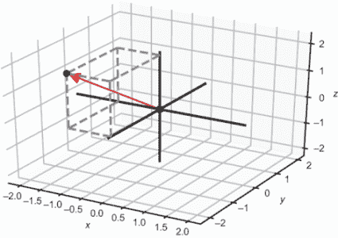向量 (−1, −2, 2) 和使其看起来像 3D 的框 |
| --- |

| **练习 3.2-迷你项目**：恰好有八个三维向量的坐标都是+1 或-1。例如，(1, -1, 1)就是其中之一。将这些八个向量作为点绘制出来。然后找出如何使用`Segment3D`对象通过线段将它们连接起来，以形成立方体的轮廓。**提示**：总共需要 12 条线段。**解决方案**：因为只有 8 个顶点和 12 条边，所以列出它们并不太繁琐，但我决定使用列表推导来枚举它们。对于顶点，我让*x*、*y*和*z*在可能的值列表`[1,−1]`上遍历，并收集了八个结果。对于边，我将它们分为三组，每组四条，指向每个坐标方向。例如，有四条边从*x* = −1 到*x* = 1，而它们的*y*和*z*坐标在两端点都是相同的：

```
pm1 = [1,−1]
vertices = [(x,y,z) for *x* in pm1 for y in pm1 for z in pm1]
edges = [((−1,y,z),(1,y,z)) for y in pm1 for z in pm1] +\
            [((x,−1,z),(x,1,z)) for *x* in pm1 for z in pm1] +\
            [((x,y,−1),(x,y,1)) for *x* in pm1 for y in pm1]
draw3d(
    Points3D(*vertices,color=blue),
    *[Segment3D(*edge) for edge in edges]
)
```

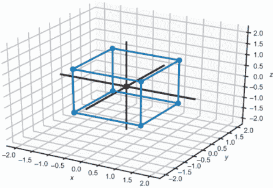所有顶点坐标都等于+1 或-1 的立方体 |

## 3.2 三维空间的向量运算

拥有这些 Python 函数，我们可以轻松地可视化三维空间中向量运算的结果。我们在二维空间中看到的所有算术运算在三维空间中都有类似之处，并且它们的几何效果也相似。

### 3.2.1 三维向量的加法

在三维空间中，向量的加法仍然可以通过加坐标来完成。向量(2, 1, 1)和(1, 2, 2)相加得到(2 + 1, 1 + 2, 1 + 2) = (3, 3, 3)。我们可以从原点开始，以任意顺序将两个输入向量尾对尾放置，以得到和点(3, 3, 3)（图 3.13）。

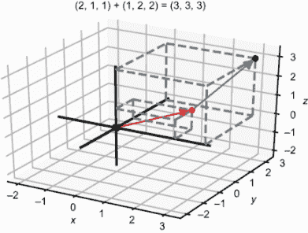 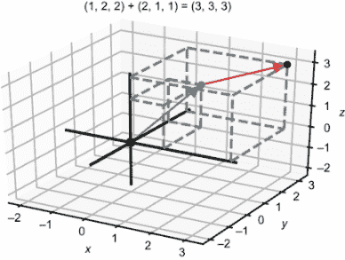

图 3.13 两个三维向量加法的视觉示例

与二维空间类似，我们可以通过将所有三维向量的*x*坐标、*y*坐标和*z*坐标相加来相加任意数量的三维向量。这三个总和给出了新向量的坐标。例如，在求和(1, 1, 3) + (2, 4, −4) + (4, 2, −2)中，相应的*x*坐标是 1、2 和 4，总和为 7。*y*坐标的总和也是 7，*z*坐标的总和为-3；因此，向量之和是(7, 7, −3)。尾对尾地，这三个向量看起来就像图 3.14 中的那些。

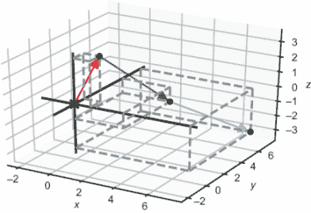

图 3.14 在三维空间中尾对尾相加三个向量

在 Python 中，我们可以编写一个简洁的函数来求和任意数量的输入向量，这适用于二维或三维（或我们稍后将看到的更高维数）。下面是它的样子：

```
def add(*vectors):
    by_coordinate = zip(*vectors)
    coordinate_sums = [sum(coords) for coords in by_coordinate]
    return tuple(coordinate_sums)
```

让我们分解一下。在输入向量上调用 Python 的`zip`函数可以提取它们的 x 坐标、*y*坐标和*z*坐标。例如，

```
>>> list(zip(*[(1,1,3),(2,4,−4),(4,2,−2)]))
[(1, 2, 4), (1, 4, 2), (3, −4, −2)]
```

（您需要将`zip`的结果转换为列表以显示其值。）如果我们对每个分组的坐标应用 Python 的`sum`函数，我们将分别得到*x*、*y*和*z*值的总和：

```
[sum(coords) for coords in [(1, 2, 4), (1, 4, 2), (3, −4, −2)]]
[7, 7, −3]
```

最后，为了保持一致性，我们将这个列表转换为元组，因为我们已经将所有向量表示为元组。结果是元组 (7, 7, 3)。我们也可以将 `add` 函数写成以下单行代码（这可能不太符合 Python 风格）：

```
def add(*vectors):
    return tuple(map(sum,zip(*vectors)))
```

### 3.2.2 三维中的标量乘法

要将一个三维向量乘以一个标量，我们需要将其所有分量乘以标量因子。例如，向量 (1, 2, 3) 乘以标量 2 得到 (2, 4, 6)。这个结果向量长度是原来的两倍，但方向与二维情况相同。图 3.15 展示了 ***v*** = (1, 2, 3) 和其标量倍数 2 · ***v*** = (2, 4, 6)。

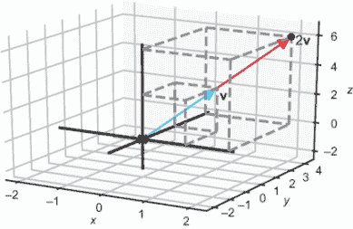

图 3.15 将向量乘以 2 的标量乘法得到一个指向相同方向的向量，其长度是原始向量的两倍。

### 3.2.3 减去三维向量

在二维中，两个向量 ***v*** − ***w*** 的差是“从 ***w*** 到 ***v***”的向量，这被称为 *位移*。在三维中，故事是一样的；换句话说，***v*** − ***w*** 是从 ***w*** 到 ***v*** 的位移，这是你可以加到 ***w*** 上以得到 ***v*** 的向量。将 ***v*** 和 ***w*** 视为从原点出发的箭头，***v*** − ***w*** 的差是一个箭头，可以定位使其尖端在 ***v*** 的尖端，其尾部在 ***w*** 的尖端。图 3.16 展示了 ***v*** = (−1, −3, 3) 和 ***w*** = (3, 2, 4) 的差，既作为从 ***w*** 到 ***v*** 的箭头，也作为一个独立的点。

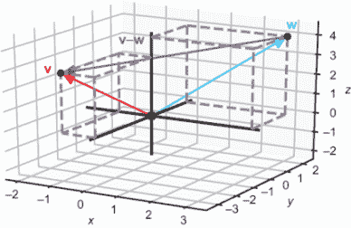 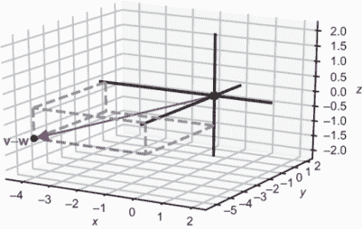

图 3.16 从向量 *v* 中减去向量 *w* 得到从 *w* 到 *v* 的位移。

从向量 ***v*** 中减去向量 ***w*** 在坐标上是通过取 ***v*** 和 ***w*** 的坐标之差来完成的。例如，***v*** − ***w*** 得到 (−1 −3, −3 − 2, 3 − 4) = (−4, −5, −1) 作为结果。这些坐标与图 3.16 中 ***v*** − ***w*** 的图像一致，它显示它是一个指向负 *x*、负 *y* 和负 *z* 方向的向量。

当我声称标量乘以二会使向量“长度加倍”时，我是从几何相似性的角度考虑的。如果 ***v*** 的三个分量都加倍，对应于长、宽和深的加倍，那么从一个角到另一个角的斜对角距离也应该加倍。为了实际测量和确认这一点，我们需要知道如何计算三维空间中的距离。

### 3.2.4 计算长度和距离

在二维中，我们使用勾股定理计算向量的长度，利用事实是箭头向量和其分量构成一个直角三角形。同样，平面上两点之间的距离只是它们差向量的长度。

我们需要更仔细地观察，但我们仍然可以在三维中找到一个合适的直角三角形来帮助我们计算向量的长度。让我们尝试找到向量(4, 3, 12)的长度。*x*和*y*分量仍然给我们一个在*z* = 0 的平面上的直角三角形。这个三角形的斜边，或对角边，长度为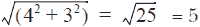。如果这是一个二维向量，我们就完成了，但 12 的*z*分量使这个向量变得相当长（图 3.17）。

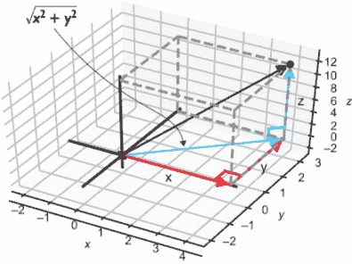

图 3.17 在 x,y 平面上应用勾股定理找到斜边长度

到目前为止，我们考虑的所有向量都位于*z* = 0 的*x*,*y*平面中。*x*分量是(4, 0, 0)，*y*分量是(0, 3, 0)，它们的向量和是(4, 3, 0)。向量(0, 0, 12)的*z*分量垂直于这三个分量。这很有用，因为它给我们图中的第二个直角三角形：由(4, 3, 0)和(0, 0, 12)组成的三角形，并放置在尖端。这个三角形的斜边是我们原始的向量(4, 3, 12)，我们想要找到其长度。让我们专注于这个第二个直角三角形，并再次应用勾股定理来找到斜边长度（如图 3.18 所示）。

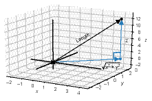

图 3.18 第二次应用勾股定理给出了三维向量的长度。

对已知的两边进行平方并取平方根应该给出长度。在这里，长度是 5 和 12，所以结果是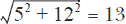。一般来说，以下方程显示了三维向量长度的公式：

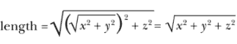

这与二维长度公式非常相似。在二维或三维中，向量的长度是其各分量平方和的平方根。由于在下面的`length`函数中我们没有明确引用输入元组的长度，因此它适用于二维或三维向量：

```
from math import sqrt
def length(*v*):
    return sqrt(sum([coord ** 2 for coord in v]))
```

例如，`length((3,4,12))`返回 13。

### 3.2.5 计算角度和方向

与二维类似，你可以将三维向量视为箭头或一定长度和方向的位移。在二维中，这意味着两个数字−一个长度和一个角度，形成一个极坐标对−足以指定任何二维向量。在三维中，一个角度不足以指定一个方向，但两个角度可以。

对于第一个角度，我们再次考虑没有其*z*-坐标的向量，就像它仍然生活在*x*,*y*平面中一样。另一种思考方式是，这是向量从非常高的*z*位置发出的影子。这个影子与正*x*轴形成一些角度，这与极坐标中使用的角度类似，我们用希腊字母φ（phi）来标记它。第二个角度是向量与 z 轴形成的角度，用希腊字母θ（theta）来标记。图 3.19 显示了这些角度。

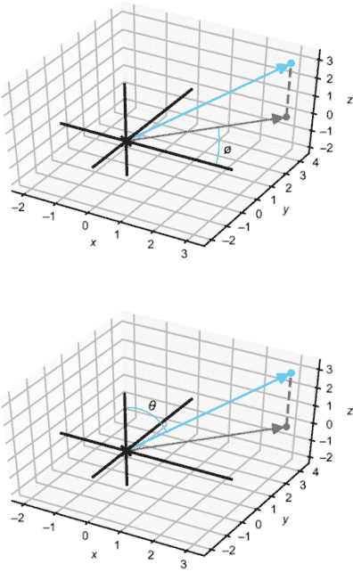

图 3.19 两个角度共同测量 3D 向量的方向

向量的长度，标记为**r**，以及角度φ和θ可以描述三维空间中的任何向量。这三个数字*r*、φ和θ合在一起被称为**球坐标**，而不是笛卡尔坐标*x*、*y*和*z*。从笛卡尔坐标计算球坐标是一个只需要我们已覆盖的三角学的可完成的练习，但在这里我们不会深入探讨。*实际上，我们在这本书中不会再使用球坐标，但我想要简要地比较一下它们与极坐标。*

极坐标很有用，因为它们允许我们通过简单地加减角度来执行一组平面向量的任何旋转。我们还能通过取它们极坐标角度的差来读取两个向量之间的角度。在三维空间中，角度φ和θ中的任何一个都不能立即决定两个向量之间的角度。虽然我们可以通过加减角度φ轻松地在 z 轴周围旋转向量，但在球坐标中围绕任何其他轴旋转则不太方便。

我们需要一些更通用的工具来处理 3D 中的角度和三角学。在下一节中，我们将介绍两个这样的工具，称为**向量积**。

### 3.2.6 练习

| **练习 3.3**：将(4, 0, 3)和(−1, 0, 1)作为`Arrow3D`对象绘制，使它们在 3D 中以尾对尾的方式排列。它们的向量和是什么？**解答**：我们可以使用我们构建的`add`函数来找到向量和：

```
>>> add((4,0,3),(−1,0,1))
(3, 0, 4)
```

然后为了绘制这些尾对尾的箭头，我们绘制从原点到每个点以及从每个点到向量和(3, 0, 4)的箭头。像 2D 的`Arrow`对象一样，`Arrow3D`首先取箭头的尖端向量，然后，如果它不是原点，可选地取尾向量：

```
draw3d(
    Arrow3D((4,0,3),color=red),
    Arrow3D((−1,0,1),color=blue),
    Arrow3D((3,0,4),(4,0,3),color=blue),
    Arrow3D((−1,0,1),(3,0,4),color=red),
    Arrow3D((3,0,4),color=purple)
)
```

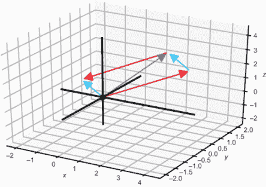尾对尾加法显示(4, 0, 3) + (−1, 0, 1) = (−1, 0, 1) + (4, 0, 3) = (3, 0, 4)。|

| **练习 3.4**：假设我们设置了`vectors1=[(1,2,3,4,5),(6,7,8,9,10)]`和`vectors2=[(1,2),(3,4),(5,6)]`。在不使用 Python 评估的情况下，`zip(*vectors1)`和`zip(*vectors2)`的长度是多少？**解答**：第一个`zip`的长度是 5。因为两个输入向量中每个都有五个坐标，所以`zip(*vectors1)`包含五个元组，每个元组有两个元素。同样，`zip(*vectors2)`的长度是 2；`zip(*vectors2)`的两个条目是包含所有*x*分量和所有*y*分量的元组。 |
| --- |

| **练习 3.5-迷你项目**：以下理解创建了一个包含 24 个 Python 向量的列表：

```
from math import sin, cos, pi
vs = [(sin(pi*t/6), cos(pi*t/6), 1.0/3) for t in range(0,24)]
```

24 个向量的和是多少？将所有 24 个向量以尾对尾的方式作为`Arrow3D`对象绘制。**解答**：绘制这些向量尾对尾最终会产生一个螺旋形状：

```
from math import sin, cos, pi
vs = [(sin(pi*t/6), cos(pi*t/6), 1.0/3) for t in range(0,24)]

running_sum = (0,0,0)                            ❶
arrows = []
for *v*  in vs:
    next_sum = add(running_sum, v)               ❷
    arrows.append(Arrow3D(next_sum, running_sum)) 
    running_sum = next_sum
print(running_sum)
draw3d(*arrows)
```

❶ 从 (0, 0, 0) 开始进行累加，这是尾对尾加法开始的点❷ 要绘制每个后续向量的尾对尾，我们将它加到累加和中。最新的箭头连接了前一个累加和到下一个点。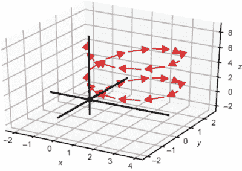在三维空间中求 24 个向量的向量和这个和是

```
(−4.440892098500626e−16, −7.771561172376096e−16, 7.9999999999999964)
```

这大约是 (0, 0, 8)。|

| **练习 3.6**: 编写一个函数 `scale(scalar,vector)`，它返回输入标量乘以输入向量。具体来说，编写它使其适用于 2D 或 3D 向量，或任何数量的坐标向量。**解答**：使用理解，我们将向量中的每个坐标乘以标量。这是一个将生成器理解转换为元组的理解：

```
def scale(scalar,v):
    return tuple(scalar * coord for coord in v)
```

|

| **练习 3.7**: 设 ***u*** = (1, −1, −1) 和 ***v*** = (0, 0, 2)。***u*** + ½ · (***v*** − ***u****) 的结果是什么？**解答**：给定 ***u*** = (1, −1, −1) 和 ***v*** = (0, 0, 2)，我们首先计算 (***v*** − ***u****) = (0 − 1, 0 − (−1), 2 − (−1)) = (−1, 1, 3)。然后 ½ · (***v*** − ***u****) 是 (−½, ½, 3/2)。最终 ***u*** + ½ · (***v*** − ***u****) 的结果是 (½, −½, ½)。顺便说一下，这是点 *u* 和点 *v* 之间的中点。 |
| --- |
| **练习 3.8**: 尝试不使用代码来回答这个练习题，然后检查你的工作。2D 向量 (1, 1) 的长度是多少？3D 向量 (1, 1, 1) 的长度是多少？我们还没有讨论 4D 向量，但它们有四个坐标而不是两个或三个。如果你必须猜测，坐标为 (1, 1, 1, 1) 的 4D 向量的长度是多少？**解答**：(1, 1) 的长度是 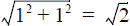。 (1, 1, 1) 的长度是 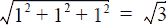。正如你可能猜到的，我们同样使用相同的距离公式来计算高维向量。 (1, 1, 1, 1) 的长度遵循相同的模式：它是 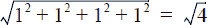，即 2。 |

| **练习 3.9-迷你项目**：坐标 3, 4, 12 以任何顺序创建一个长度为 13 的向量，这是一个整数。这是不寻常的，因为大多数数字不是完全平方数，所以长度公式中的平方根通常返回一个无理数。找到另一个定义具有整数长度的向量坐标的整数三元组。**解答**：以下代码搜索小于 100（一个任意选择）的递减整数三元组：

```
def vectors_with_whole_number_length(max_coord=100):
    for *x* in range(1,max_coord):
        for y in range(1,x+1):
          for z in range(1,y+1):
                if length((x,y,z)).is_integer():
                    yield (x,y,z)
```

它找到了 869 个具有整数坐标和整数长度的向量。其中最短的是长度正好为 3 的 (2, 2, 1)，最长的长度正好为 150 的向量是 (99, 90, 70)。|

| **练习 3.10**: 找到一个与 (−1, −1, 2) 方向相同但长度为 1 的向量。**提示**：找到适当的标量来乘以原始向量以适当改变其长度。**解答**：(−1, −1, 2) 的长度大约是 2.45，所以我们需要将这个向量的标量乘以 (1/2.45) 来使其长度为 1：

```
>>> length((−1,−1,2))
2.449489742783178
>>> s = 1/length((−1,−1,2))
>>> scale(s,(−1,−1,2))
(−0.4082482904638631, -0.4082482904638631, 0.8164965809277261)
>>> length(scale(s,(−1,−1,2)))
1.0
```

将每个坐标四舍五入到最接近的百分位，该向量是（-0.41，-0.41，0.82）。

## 3.3 点积：测量向量对齐

我们已经看到的一种向量乘法是标量乘法，它将一个标量（一个实数）和一个向量组合起来得到一个新的向量。我们还没有讨论过任何一种将一个向量与另一个向量相乘的方法。实际上，有两种重要的方法可以做到这一点，这两种方法都提供了重要的几何洞察。一种被称为*点积*，我们用点运算符（例如，***u*** · ***v***）来表示它，而另一种被称为*叉积*（例如，***u*** × ***v***）。对于数字，这些符号意味着相同的事情，所以例如 3 · 4 = 3 × 4。对于两个向量，***u*** · ***v***和***u*** × ***v***的操作不仅仅是不同的符号，它们意味着完全不同的事情。

点积接受两个向量并返回一个标量（一个数字），而叉积接受两个向量并返回另一个向量。然而，这两个操作都是帮助我们推理三维空间中向量的长度和方向的运算。让我们首先关注点积。

### 3.3.1 点积的图像

点积（也称为*内积*）是作用于两个向量的运算，返回一个标量。换句话说，给定两个向量***u***和***v***，***u*** · ***v***的结果是一个实数。点积可以在 2D、3D 或任何数量的维度上的向量上工作。你可以将其视为测量输入向量对“如何对齐”。让我们首先看看*x*，*y*平面上的某些向量，并展示它们的点积，以给你一些关于这个运算如何工作的直观感受。

向量***u***和***v***的长度分别为 4 和 5，它们几乎指向同一方向。它们的点积是正的，这意味着它们是对齐的（图 3.20）。

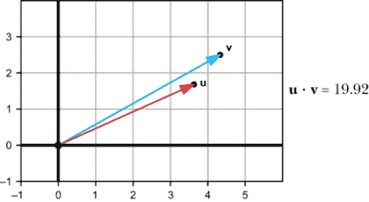

图 3.20 相对对齐的两个向量给出较大的正点积。

指向相似方向的两个向量具有正的点积，向量越大，乘积越大。相似对齐的较短的向量具有较小的但仍然是正的点积。新的向量***u***和***v***的长度均为 2（图 3.21）。

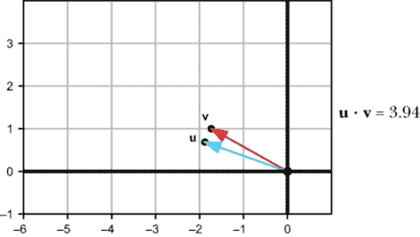

图 3.21 指向相似方向的较短的向量给出较小的但仍然是正的点积。

相比之下，如果两个向量指向相反方向或几乎指向相反方向，它们的点积是负的（图 3.22 和图 3.23）。向量的幅度越大，它们的点积越负。

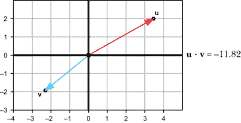

图 3.22 指向相反方向的向量具有负的点积。

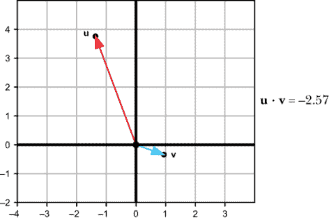

图 3.23 指向相反方向的较短的向量具有较小的但仍然是负的点积。

并非所有向量的对都明显指向相似或相反的方向，而点积可以检测到这一点。如图 3.24 所示，如果两个向量指向完全垂直的方向，无论它们的长度如何，它们的点积都是零。

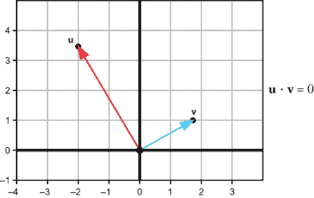

图 3.24 垂直向量总是具有零点积。

这实际上是点积最重要的应用之一：它让我们能够计算两个向量是否垂直，而无需进行任何三角计算。这种垂直情况还用于区分其他情况：如果两个向量之间的角度小于 90°，则它们的点积为正。如果角度大于 90°，则它们的点积为负。虽然我还没有告诉你如何计算点积，但你现在知道如何解释这个值。我们继续计算它。

### 3.3.2 计算点积

给定两个向量的坐标，有一个简单的公式可以计算点积：将相应的坐标相乘，然后将乘积相加。例如，在点积（1, 2, −1）·（3, 0, 3）中，*x*坐标的乘积是 3，*y*坐标的乘积是 0，*z*坐标的乘积是−3。总和是 3 + 0 + (−3) = 0，所以点积是零。如果我的说法正确，这两个向量应该是垂直的。从正确的角度绘制它们（图 3.25）可以证明这一点！

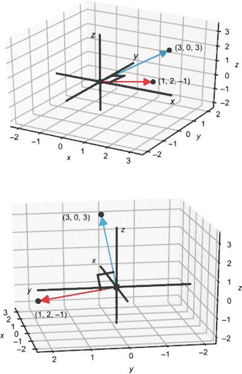

图 3.25 两个点积为零的向量在三维空间中确实是垂直的。

在三维空间中，我们的视角可能会误导，因此能够计算相对方向而不是凭直觉判断就更加有价值。作为另一个例子，图 3.26 显示，二维向量（2, 3）和（4, 5）在*x*，*y*平面上具有相似的方向。*x*坐标的乘积是 2 · 4 = 8，而*y*坐标的乘积是 3 · 5 = 15。总和 8 + 15 = 23 是点积。作为一个正数，这个结果证实了这两个向量之间的角度小于 90°。无论我们在二维还是三维中考虑它们，这些向量都具有相同的相对几何形状，因为它们恰好位于*z* = 0 的平面上，即向量（2, 3, 0）和（4, 5, 0）。

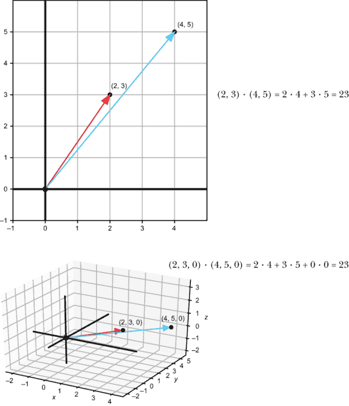

图 3.26 计算点积的另一个例子

在 Python 中，我们可以编写一个点积函数，只要输入的向量都具有相同数量的坐标，就可以处理任何一对输入向量。例如，

```
def dot(u,v):
    return sum([coord1 * coord2 for coord1,coord2 in zip(u,v)])
```

此代码使用 Python 的`zip`函数来配对适当的坐标，然后在理解中乘以每一对，并将结果列表相加。让我们用这个来进一步探索点积的行为。

### 3.3.3 通过示例计算点积

两个位于不同轴上的向量具有零点积并不令人惊讶。我们知道它们是垂直的：

```
>>> dot((1,0),(0,2))
0 
>>> dot((0,3,0),(0,0,−5))
0 
```

我们还可以确认较长的向量会产生较长的点积。例如，将输入向量之一按 2 倍因子缩放，将点积的输出翻倍：

```
>>> dot((3,4),(2,3))
18 
>>> dot(scale(2,(3,4)),(2,3))
36 
>>> dot((3,4),scale(2,(2,3)))
36 
```

结果表明点积与其输入向量的长度成正比。如果你取两个同方向向量的点积，点积恰好等于长度的乘积。例如，(4, 3) 的长度为 5，(8, 6) 的长度为 10。点积等于 5 · 10：

```
>>> dot((4,3),(8,6))
50 
```

当然，点积并不总是等于其输入长度的乘积。向量 (5, 0)，(−3, 4)，(0, −5) 和 (−4, −3) 都有相同的长度 5，但与原始向量 (4, 3) 的点积不同，如图 3.27 所示。

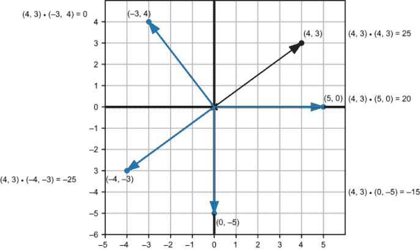

图 3.27 同长度的向量与向量 (4, 3) 的点积不同，这取决于它们的方向。

长度为 5 的两个向量的点积从它们对齐时的 5 · 5 = 25 变化到它们指向相反方向时的 −25。在下一组练习中，我邀请你证明两个向量的点积可以从长度的乘积变化到该值的相反数。

### 3.3.4 使用点积测量角度

我们已经看到点积根据两个向量之间的角度而变化。具体来说，向量 ***u*** · ***v*** 的点积从 0° 到 180° 角度范围内，从 ***u*** 和 ***v*** 长度的乘积到该值的相反数变化。我们已经看到了一个具有这种行为的函数，即余弦函数。结果证明点积有一个替代公式。如果 |***u***| 和 |***v***| 表示向量 ***u*** 和 ***v*** 的长度，点积由以下公式给出

*u* · *v* = |*u*| · |*v*| · cos(θ)

其中 θ 是向量 ***u*** 和 ***v*** 之间的角度。原则上这为我们计算点积提供了一种新的方法。我们可以测量两个向量的长度，然后测量它们之间的角度来得到结果。假设，如图 3.28 所示，我们有两个长度分别为 3 和 2 的已知向量，并使用我们的量角器发现它们之间相隔 75°。

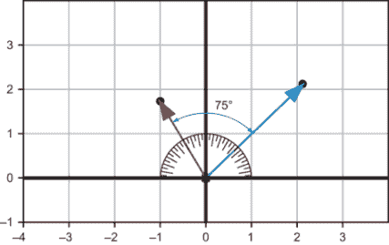

图 3.28 长度分别为 3 和 2 的两个向量，相隔 75°

图 3.28 中两个向量的点积是 3 · 2 · cos(75°)。通过适当的弧度转换，我们可以在 Python 中计算出大约为 1.55：

```
>>> from math import cos,pi
>>> 3 * 2 * cos(75 * pi / 180)
1.5529142706151244 
```

在进行向量计算时，通常从坐标开始，并从它们计算角度。我们可以将两个公式结合起来恢复一个角度：首先使用坐标计算点积和长度，然后求解角度。

让我们找出向量 (3, 4) 和 (4, 3) 之间的角度。它们的点积是 24，每个向量的长度都是 5。我们新的点积公式告诉我们：

(3, 4) · (4, 3) = 24 = 5 · 5 · cos(θ) = 25 · cos(θ)

从 24 = 25 · cos(θ) 中，我们可以简化为 cos(θ) = 24/25。使用 Python 的 `math.acos`，我们找到 θ 值为 0.284 弧度或 16.3° 时，余弦值为 24/25。

这个练习提醒我们为什么在 2D 中不需要点积。在第二章中，我们展示了如何从正 x 轴得到向量的角度。通过创造性地使用那个公式，我们可以在平面上找到任何我们想要的角。点积在 3D 中真正开始发光，因为在 3D 中，坐标变换不能像在 2D 中那样帮助我们。

例如，我们可以使用相同的公式来找到 (1, 2, 2) 和 (2, 2, 1) 之间的角度。点积是 1 · 2 + 2 · 2 + 2 · 1 = 8，长度都是 3。这意味着 8 = 3 · 3 · cos(θ)，所以 cos(θ) = 8/9，θ = 0.476 弧度或 27.3°。

这个过程在 2D 或 3D 中都是一样的，我们会反复使用。我们可以通过实现一个 Python 函数来找到两个向量之间的角度来节省一些力气。由于我们的点积函数和长度函数都没有硬编码的维度数，这个新函数也不会。我们可以利用 ***u*** · ***v*** = |***u***| · |***v***| · cos(θ) 的事实，因此，

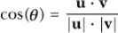

和


这个公式可以很好地转换为以下 Python 代码：

```
def angle_between(v1,v2):
    return acos(
                dot(v1,v2) /
                (length(v1) * length(v2))
            )
```

这段 Python 代码中的任何内容都不依赖于向量 ***v***[1] 和 ***v***[2] 的维度数。这两个都可以是 2 个坐标的元组或 3 个坐标的元组（实际上，也可以是 4 个或更多坐标的元组，我们将在接下来的章节中讨论）。相比之下，我们接下来遇到的下一个向量积（叉积）只在三维空间中有效。

### 3.3.5 练习

| **练习 3.11**：根据以下图片，从大到小排列 ***u*** · ***v***，***u*** · ***w***，和 ***v*** · ***w***：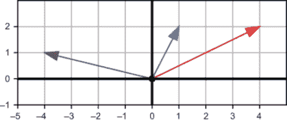**解答**：***u*** · ***v*** 是唯一的正点积，因为 ***u*** 和 ***v*** 是唯一一对之间小于直角的组合。此外，***u*** · ***w*** 小于（更负）于 ***v*** · ***w***，因为 ***u*** 既是更大的也是离 ***w*** 更远的，所以 ***u*** · ***v*** > x**v** · ***w*** > x**u** · ***w***。 |
| --- |
| **练习 3.12**：(-1, -1, 1) 和 (1, 2, 1) 的点积是多少？这两个 3D 向量之间的距离是大于 90°，小于 90°，还是正好 90°？**解答**：(-1, -1, 1) 和 (1, 2, 1) 的点积是 -1 · 1 + -1 · 2 + 1 · 1 = -2。因为这个是一个负数，所以这两个向量之间的距离大于 90°。 |
| **练习 3.13-迷你项目**: 对于两个 3D 向量 ***u*** 和 ***v***，(2***u***) · ***v*** 和 ***u*** · (2***v***) 的值都等于 2(***u*** · ***v***)。在这种情况下，***u*** · ***v*** = 18，并且 (2***u***) · ***v*** 和 ***u*** · (2***v***) 都是 36，是原始结果的两倍。证明这对于任何实数 *s* 都成立，而不仅仅是 2\. 换句话说，证明对于任何 *s*，(*s* ***u***) · ***v*** 和 ***u*** · (*s* ***v***) 的值都等于 *s*(***u*** · ***v***)。 |
| **解答**: 让我们命名 ***u*** 和 ***v*** 的坐标，比如说 ***u*** = (*a*, *b*, *c*) 和 ***v*** = (*d*, *e*, *f* )。那么 ***u*** · ***v*** = *ad* + *be* + *cf*。因为 *s* ***u*** = (*sa*, *sb*, *sc*) 和 *s* ***v*** = (*sd*, *se*, *sf*), 我们可以通过展开点积来展示这两个结果：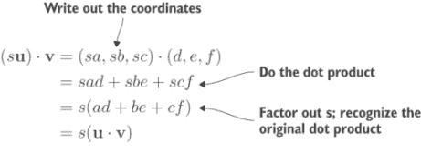证明标量乘法相应地缩放点积的结果。并且另一个乘积也是同样的方式工作：***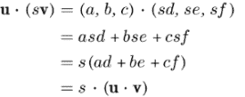*** 证明对于点积的第二个向量输入，这个事实同样成立。 |
| **练习 3.14-迷你项目**: 用代数方法解释为什么一个向量与自身的点积等于其长度的平方。**解答**: 如果一个向量的坐标是 (*a*, *b*, *c*)，那么它与自身的点积是 *a* · *a* + *b* · *b* + *c* · *c*。它的长度是  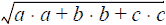，所以这确实是平方。 |

| **练习 3.15-迷你项目**: 找到一个长度为 3 的向量 ***u*** 和一个长度为 7 的向量 ***v***，使得 ***u*** · ***v*** = 21\. 找到另一对向量 ***u*** 和 ***v***，使得 ***u*** · ***v*** = −21\. 最后，找到三对长度分别为 3 和 7 的向量，并证明它们的长度都在 −21 和 21 之间。**解答**: 方向相同的两个向量（例如，沿着正 x 轴）将具有可能的最大点积：

```
>>> dot((3,0),(7,0))
21
```

方向相反的两个向量（例如，正负 *y* 方向）将具有可能的最小点积：

```
>>> dot((0,3),(0,−7))
−21
```

使用极坐标，我们可以轻松生成一些长度为 3 和 7 的随机角度的更多向量：

```
from vectors import to_cartesian
from random import random
from math import pi

def random_vector_of_length(l):
    return to_cartesian((l, 2 *pi*random()))

pairs = [(random_vector_of_length(3), random_vector_of_length(7))
            for i in range(0,3)]
for u,v in pairs:
    print("u = %s, v  = %s" % (u,v))
    print("length of u: %f, length of v: %f, dot product :%f" %
                (length(u), length(v), dot(u,v)))
```

|

| **练习 3.16**: 设 ***u*** 和 ***v*** 是向量，其中 &#124;***u***&#124; = 3.61 和 &#124;***v***&#124; = 1.44\. 如果 ***u*** 和 ***v*** 之间的角度是 101.3°，那么 ***u*** · ***v*** 是多少？

+   5.198

+   5.098

+   −1.019

+   1.019

**解答**: 再次，我们可以将这些值代入新的点积公式，并通过适当的弧度转换，在 Python 中评估结果：

```
>>> 3.61 * 1.44 * cos(101.3 * pi / 180)
−1.0186064362303022
```

四舍五入到小数点后三位，答案与 *c* 相符。|

| **练习 3.17-迷你项目**: 通过将它们转换为极坐标并取角度之差来找到 (3, 4) 和 (4, 3) 之间的角度。答案是

+   1.569

+   0.927

+   0.643

+   0.284

**提示**：结果应该与点积公式的值一致。**解答**：向量(3, 4)相对于正*x*轴逆时针更远，因此我们从(3, 4)的角度减去(4, 3)的角度来得到我们的答案。它与答案 *d* 完全匹配：

```
>>> from vectors import to_polar
>>> r1,t1 = to_polar((4,3))
>>> r2,t2 = to_polar((3,4))
>>> t1-t2
-0.2837941092083278 
>>> t2-t1
0.2837941092083278 
```

|

| **练习 3.18**：向量(1, 1, 1)和向量(−1, −1, 1)之间的角度是多少度？

+   180°

+   120°

+   109.5°

+   90°

**解答**：这两个向量的长度都是√3 或大约 1.732。它们的点积是 1 · (−1) + 1 · (−1) + 1 · 1 = −1，所以−1 = √3 · √3 · cos(θ)。因此，cos(θ) = −1/3。这使得角度大约是 1.911 弧度或 109.5°（答案 *c*）。

## 3.4 叉积：测量有向面积

如前所述，叉积将两个 3D 向量***u***和***v***作为输入，其输出***u*** × ***v***是另一个 3D 向量。它与点积类似，输入向量的长度和相对方向决定了输出，但不同之处在于输出不仅有大小，还有方向。我们需要仔细思考 3D 空间中的方向概念，以理解叉积的强大功能。

### 3.4.1 在 3D 空间中定位自己

在本章开头介绍 x-, y-, 和 z-轴时，我做出了两个明确的声明。首先，我承诺熟悉的*x*,*y*平面存在于 3D 世界中。其次，我将*z*方向设置为垂直于*x*,*y*平面，而*x*,*y*平面位于*z* = 0 的位置。我没有明确宣布的是，正*z*方向是向上而不是向下。

换句话说，如果我们从通常的角度看*x*,*y*平面，我们会看到正*z*轴从平面中指向我们。我们还可以选择让正*z*轴离开我们（如图 3.29 所示）。

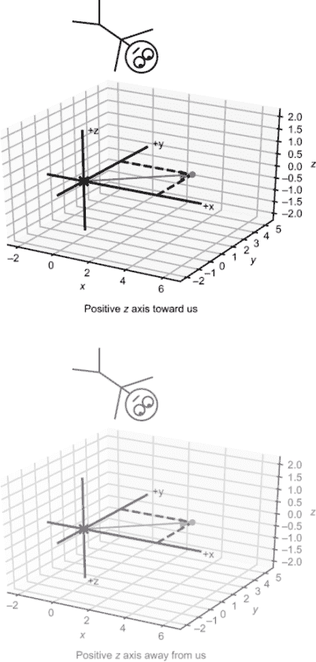

图 3.29 将自己在 3D 空间中定位，以便像在第二章中看到的那样看到 x,y 平面。当我们看*x*,*y*平面时，我们选择了正*z*轴指向我们而不是离开我们。

这里的区别不是视角问题；这两个选择代表了 3D 空间的不同方向，并且从任何视角都可以区分它们。假设我们像图 3.29 左边的棍状人物一样漂浮在某个正*z*坐标上。我们应该看到正*y*轴位于正*x*轴顺时针方向四分之一转的位置；否则，轴的排列方向是错误的。

世界上许多事物都有方向性，并且与它们的镜像看起来并不相同。例如，左右脚的鞋大小和形状相同，但方向不同。一个普通的咖啡杯没有方向；我们无法通过两张未标记的咖啡杯图片来判断它们是否不同。但如图 3.30 所示，两个在相对侧面有图案的咖啡杯是可以区分的。

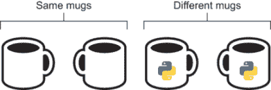

图 3.30 一个没有图像的杯子与其镜像图像是同一个物体。一个侧面有图像的杯子与其镜像图像并不相同。

大多数数学家用来检测取向的现成对象是手。我们的手是有取向的对象，因此即使它们不幸与我们的身体分离，我们也能区分左右手。你能判断图 3.31 中的手是右手还是左手吗？


图 3.31 这是一只右手还是左手？

显然，这是一个右手：我们的左手指尖上没有指甲！数学家可以用他们的手来区分坐标轴的两个可能取向，他们称之为右手取向和左手取向。这是如图 3.32 所示的规定：如果你将你的右食指指向正 x 轴，并将你的剩余手指向正 y 轴卷曲，你的大拇指就会告诉你正 z 轴的方向。

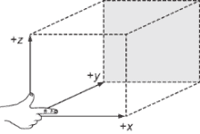

图 3.32 右手定则帮助我们记住我们选择的取向。

这被称为*右手定则*，如果它与你的坐标轴一致，那么你就是在（正确地！）使用右手取向。取向很重要！如果你正在编写一个控制无人机或腹腔镜手术机器人的程序，你需要保持你的上下、左右、前后的一致性。叉积是一个有取向的机器，因此它可以帮助我们在所有的计算中跟踪取向。

### 3.4.2 寻找叉积的方向

再次，在我告诉你如何计算叉积之前，我想先展示一下它的样子。给定两个输入向量，叉积输出一个与两个输入都垂直的结果。例如，如果***u*** = (1,0,0)和***v*** = (0,1,0)，那么叉积***u*** × ***v***就是(0, 0, 1)，如图 3.33 所示。

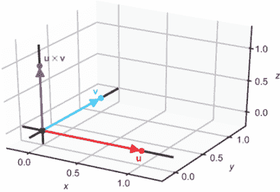

图 3.33 *z* = (1, 0, 0)和*v* = (0, 1, 0)的叉积

事实上，如图 3.34 所示，*x*，*y*平面上的任意两个向量都有一个位于 z 轴上的叉积。

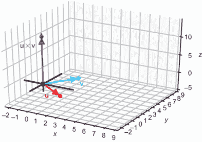 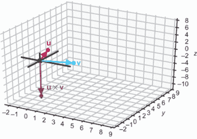

图 3.34 x,y 平面上的任意两个向量的叉积位于 z 轴上。

这清楚地说明了为什么叉积在二维空间中不起作用：它返回一个位于包含两个输入向量的平面外的向量。即使输入不在*x*，*y*平面上，我们也能看到叉积的输出与两个输入都垂直（如图 3.35 所示）。

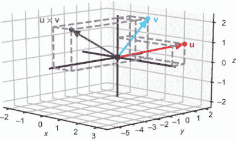

图 3.35 叉积总是返回一个与两个输入都垂直的向量。

但是有两个可能的垂直方向，而叉积只选择其中一个。例如，(1, 0, 0) × (0, 1, 0) 的结果是 (0, 0, 1)，指向正 *z* 方向。z 轴上的任何向量，无论是正还是负，都会与这两个输入向量垂直。为什么结果是正方向？

这里就涉及到方向性：叉积也遵循右手法则。一旦你找到了与两个输入向量 ***u*** 和 ***v*** 垂直的方向，叉积 ***u*** × ***v*** 就位于一个使得三个向量 ***u***、***v*** 和 ***u*** × ***v*** 处于右手配置的方向。也就是说，我们可以将右手的食指指向 ***u*** 的方向，将其他手指弯曲向 ***v*** 的方向，而大拇指则指向 ***u*** × ***v*** 的方向（图 3.36）。


图 3.36 右手法则告诉我们叉积指向哪个垂直方向。

当输入向量位于两个坐标轴上时，找到它们的叉积的确切方向并不太难：它就是剩余轴上的两个方向之一。一般来说，不计算叉积就很难描述两个向量的垂直方向。这正是我们一旦学会了如何计算它，它就变得非常有用的一项特性。但一个向量不仅指定了一个方向；它还指定了 *一个* 长度。叉积的长度编码了有用的信息。

### 3.4.3 计算叉积的长度

就像点积一样，叉积的长度是一个数字，它给我们提供了关于输入向量相对位置的信息。它不是测量两个向量有多对齐，而是告诉我们“它们有多垂直”。更精确地说，它告诉我们两个输入向量所围成的面积有多大（图 3.37）。


图 3.37 叉积的长度等于平行四边形的面积。

正如图 3.37 所示，由 ***u*** 和 ***v*** 所围成的平行四边形面积与叉积 ***u*** × ***v*** 的长度相同。对于给定长度的两个向量，如果它们垂直，它们所围成的面积最大。另一方面，如果 ***u*** 和 ***v*** 在同一方向上，它们不围成任何面积；叉积的长度为零。这是方便的；如果两个输入向量平行，我们无法选择一个唯一的垂直方向。

结合结果的方向，结果的长度给我们一个确切的向量。平面上的两个向量保证它们的叉积指向 +*z* 或 − *z* 方向。我们可以从图 3.38 中看到，平面向量所围成的平行四边形越大，叉积就越长。

  

图 3.38 在 x,y 平面上的向量对，其叉积的大小取决于它们所围成的平行四边形的面积。

这个平行四边形的面积有一个三角公式：如果 **u** 和 **v** 之间的角度是 θ，则面积是 |**u**| · |**v**| · sin(θ)。我们可以将长度和方向结合起来，看看一些简单的叉积。例如，(0, 2, 0) 和 (0, 0, −2) 的叉积是什么？这些向量分别位于 y 轴和 z 轴上，因此要垂直于两者，叉积必须位于 x 轴上。让我们使用右手定则来找到结果的方向。

将我们的食指指向第一个向量的方向（正 *y* 方向）并弯曲我们的手指指向第二个向量的方向（负 *z* 方向），我们发现我们的拇指指向负 *x* 方向。叉积的大小是 2 · 2 · sin(90°)，因为 y 轴和 z 轴在 90°角处相交。（在这个情况下，平行四边形恰好是一个正方形，边长为 2）。这得出结果是 4，所以结果是 (−4, 0, 0)：一个长度为 4 的向量，方向在负 *x* 方向。

通过几何计算来证明叉积是一个定义良好的操作是件好事。但通常情况下，当向量不总是位于轴上，且不明显需要找到什么坐标以获得垂直结果时，这并不实用。幸运的是，有一个显式公式，用于根据输入向量的坐标来计算叉积的坐标。

### 3.4.4 计算三维向量的叉积

叉积的公式乍一看很复杂，但我们可以快速将其封装在一个 Python 函数中，轻松计算。让我们从两个向量 **u** 和 **v** 的坐标开始。我们可以将坐标命名为 **u** = (*a*, *b*, *c*) 和 **v** = (*d*, *e*, *f* )，但如果我们使用更好的符号会更清晰：**u** = (*ux*, *uy*, *uz*) 和 **v** = (*v[x]*, *v[y]*, *vz*). 记住称为 *v[x]* 的数字是 **v** 的 *x* 坐标，比如果将其称为任意字母 *d* 更容易。在这些坐标下，叉积的公式是


图 3.39 叉积可以指示多边形是否对观察者可见。

**u** × **v** = (*u[y]v[z]* − *u[z]v[y]*, *u[z]v[x]* − *u[x]v[z]*, *u[x]v[y]* − *u[y]v[x]*)

或者，在 Python 中：

```
def cross(u, v):
    ux,uy,uz = u
    vx,vy,vz = v
    return (uy*vz − uz*vy, uz*vx − ux*vz, ux*vy − uy*vx)
```

你可以在练习中尝试这个公式。注意，与迄今为止我们使用的多数公式不同，这个公式似乎不太适用于其他维度。它要求输入向量恰好有三个分量。

这个代数过程与我们本章建立的几何描述一致。因为它告诉我们面积和方向，叉积帮助我们决定 3D 空间中的占用者是否会看到与他们一起漂浮在空间中的多边形。例如，如图 3.39 所示，站在 x 轴上的观察者将不会看到由***u*** = (1, 1, 0)和***v*** = (−2, 1, 0)张成的平行四边形。

换句话说，图 3.39 中的多边形与观察者的视线平行。使用叉积，我们可以不画图就能判断这一点。因为叉积垂直于人的视线，所以多边形中没有任何一个是可见的。

现在是我们最终项目的时候了：用多边形构建一个 3D 对象并在 2D 画布上绘制它。你将使用到目前为止看到的所有矢量运算。特别是，叉积将帮助你决定哪些多边形是可见的。

### 3.4.5 练习

| **练习 3.19**: 以下每个图都显示了三个相互垂直的箭头，指示正*x*、*y*和*z*方向。为了视角，显示了一个 3D 箱子，箱子的背面涂成灰色。哪个图与我们所选择的图兼容？也就是说，哪个图显示了与我们绘制的 x 轴、y 轴和 z 轴，即使是从不同的视角？！哪个轴与我们的一致？**解答**: 从上方向下看图*a*，我们会看到 x 轴和 y 轴如常，z 轴指向我们。与我们方向一致的图是*a*。在图*b*中，z 轴朝向我们，而+y 方向相对于+x 方向顺时针 90°。这与我们的方向不一致。 |
| --- |
| 如果我们从正 z 方向（箱子的左侧）的点观察图*c*，我们会看到+y 方向相对于+x 方向逆时针 90°。图*c*也与我们的一致。从箱子的左侧观察图*d*，+z 方向会朝向我们，而+y 方向会再次相对于+x 方向逆时针。这也与我们的一致。 |
| **练习 3.20**: 如果你面前放一面镜子，并竖立起三个坐标轴，镜中的图像会有相同的方向还是不同的方向？**解答**: 镜中的图像方向是反转的。从这个角度来看，z 轴和 y 轴保持指向相同方向。在原始图像中，x 轴是顺时针从 y 轴开始的，但在镜中图像中，它变为逆时针方向！x 轴、y 轴、z 轴及其镜像 |
| **练习 3.21**：叉积 (0, 0, 3) × (0, −2, 0) 的结果指向什么方向？**解答**：如果我们将右手的食指指向 (0, 0, 3) 的方向，即正 *z* 方向，并将其他手指向 (0, −2, 0) 的方向卷曲，即负 *y* 方向，那么我们的拇指指向正 *x* 方向。因此，(0, 0, 3) × (0, −2, 0) 指向正 *x* 方向。 |
| **练习 3.22**: (1, −2, 1) 和 (−6, 12, −6) 的叉积的坐标是什么？**解答**：由于这两个向量是彼此的负标量倍数，它们指向相反的方向，并且不跨越任何区域。因此，叉积的长度为零。唯一的长度为零的向量是 (0, 0, 0)，所以这就是答案。 |

| **练习 3.23-迷你项目**：平行四边形的面积等于其底边长度乘以其高度，如下所示：鉴于这一点，解释为什么公式

```
&#124;***u***&#124; · &#124;***v***&#124; · sin(φ) makes sense.
```

**解答**：在图中，向量 ***u*** 定义了底边，因此底边长度是 &#124;***u***&#124;。从 ***v*** 的尖端到基边，我们可以画一个直角三角形。***v*** 的长度是斜边，三角形的垂直边是我们正在寻找的高度。根据正弦函数的定义，高度是 &#124;***v***&#124; · sin(φ)。以一个角度的正弦值表示平行四边形面积的公式由于底边长度是 &#124;***u***&#124;，高度是 &#124;***v***&#124; · sin(φ)，因此平行四边形的面积确实是 &#124;***u***&#124; · &#124;***v***&#124; · sin(φ)。 |

| **练习 3.24**：叉积 (1, 0, 1) × (−1, 0, 0) 的结果是什么？

+   (0, 1, 0)

+   (0, −1, 0)

+   (0, −1, −1)

+   (0, 1, −1)

**解答**：这些向量位于 *x*，*z* 平面上，因此它们的叉积位于 y 轴上。将右手的食指指向 (1, 0, 1) 的方向，并使手指向 (−1, 0, 0) 方向卷曲，需要我们的拇指指向 − *y* 方向。通过几何方法计算 (1, 0, 1) 和 (−1, 0, 0) 的叉积我们可以找到向量的长度和它们之间的角度来得到叉积的大小，但我们已经从坐标中得到了底边和高度。这两个都是 1，所以长度是 1。因此，叉积是 (0, −1, 0)，一个长度为 1 的在 − *y* 方向的向量；答案是 *b*。 |

| **练习 3.25**：使用 Python 的 `cross` 函数计算 (0, 0, 1) × ***v*** 对于第二个向量 ***v*** 的几个不同值。每个结果的 *z* 坐标是什么，为什么？**解答**：无论选择什么向量 ***v***，*z* 坐标都是零：

```
>>> cross((0,0,1),(1,2,3))
(−2, 1, 0)
>>> cross((0,0,1),(−1,−1,0))
(1, −1, 0)
>>> cross((0,0,1),(1,−1,5))
(1, 1, 0)
```

因为 ***u*** = (0,0,1)，所以 ***u*** *x* 和 ***u*** *y* 都是零。这意味着在叉积公式中的项 *u* *x* *v[y]* − *uyvx* 是零，无论 *v* *x* 和 *v[y]* 的值如何。从几何学的角度来看，这是有意义的：叉积应该垂直于两个输入，并且要垂直于 (0, 0, 1)，*z* 分量必须是零。|

| **练习 3.26-迷你项目**：通过代数证明 ***u*** × ***v*** 不论 ***u*** 和 ***v*** 的坐标如何，都垂直于 ***u*** 和 ***v***。**提示**：通过将这些展开成坐标来证明 (***u*** × ***v***) · ***u*** 和 (***u*** × ***v***) · ***v***。**解答**：在以下方程中，设 ***u*** = (*u*[x], *u*[y], *u*[z]) 和 ***v*** = (*v[x]*, *v[y]*, *v*[z])。我们可以将 (***u*** × ***v***) · ***u*** 用坐标表示如下：*u× v = (u[y]v[z] − u[z]v[y], u[z]v[x] − u[x]v[z], u[x]v[y] − u[y]v[x]) · (u[x], u[y], u[z])*展开叉积的点积在展开点积后，我们看到有 6 项。这些项中的每一项都与另一项相抵消。*= (u[y]v[z] − u[z]v[y])u[x] + (u[z]v[x] − u[x]v[z])u[y] + (u[x]v[y] − u[y]v[x])u[z]**= u[y]v[z]u[x] − u[z]v[y]u[x] + u[z]v[x]u[y] − u[x]v[z]u[y] + u[x]v[y]u[z] − u[y]v[x]u[z]*在完全展开后，所有项都相互抵消。因为所有项都相互抵消，结果是零。为了节省“墨水”，我不会展示 (***u*** × ***v***) · ***v*** 的结果，但发生的情况相同：出现 6 项并相互抵消，结果为零。这意味着 (***u*** × ***v***) 垂直于 ***u*** 和 ***v***。 |
| --- |

## 3.5 在 2D 中渲染 3D 对象

让我们尝试使用我们所学到的知识来渲染一个简单的三维形状，称为八面体。一个立方体有六个面，都是正方形，而八面体有八个面，都是三角形。你可以把八面体想象成两个四棱锥叠加在一起。图 3.40 显示了八面体的骨架。


图 3.40 八面体的骨架，一个有八个面和六个顶点的形状。虚线显示的是相对于我们的八面体的对面边。

如果这是一个实心体，我们就看不到对面。相反，我们会看到如图 3.41 所示的八个三角形中的四个。


图 3.41 八面体的四个编号面，在我们当前的位置可见

渲染八面体归结为识别我们需要显示的四个三角形，并适当地着色它们。让我们看看如何做到这一点。

### 3.5.1 使用向量定义 3D 对象

八面体是一个简单的例子，因为它只有六个角或顶点。我们可以给它们简单的坐标：(1, 0, 0)，(0, 1, 0)，(0, 0, 1)以及它们在图 3.42 中所示的反向向量。

这六个向量定义了形状的边界，但并不提供我们绘制它所需的所有信息。我们还需要决定这些顶点中的哪些需要绘制。

这些顶点连接形成形状的边。例如，图 3.42 中的顶部点是 (0, 0, 1)，并通过边与 *x*、*y* 平面（图 3.43）中的所有四个点相连。


图 3.42 八面体的顶点


图 3.43 八面体的四个由箭头指示的边

这些边勾勒出了八面体的顶部金字塔。请注意，没有从 (0, 0, 1) 到 (0, 0, −1) 的边，因为那段线会在八面体内部，而不是外部。每条边由一对向量定义：边作为线段的起点和终点。例如，(0, 0, 1) 和 (1, 0, 0) 定义了其中一条边。

边界数据仍然不足以完成绘图。我们还需要知道哪些顶点和边的三元组定义了我们想要用实心、阴影颜色填充的三角形面。这就是方向发挥作用的地方：我们不仅想知道哪些线段定义了八面体的面，还要知道它们是朝向我们还是远离我们。

这里的策略是：我们将三角形面建模为三个向量 ***v***[1]、***v***[2] 和 ***v***[3]，定义其边。请注意，在这里我使用下标 1、2 和 3 来区分三个不同的向量，而不是同一向量的分量。具体来说，我们将 ***v***[1]、***v***[2] 和 ***v***[3] 排序，使得 (***v***[2] - ***v***[1]) × (***v***[3] − ***v***[1]) 指向八面体外部（图 3.44）。如果一个向外指向的向量朝向我们，这意味着从我们的视角可以看到这个面。否则，这个面被遮挡，我们不需要绘制它。


图 3.44 八面体的一个面。定义面的三个点按顺序排列，使得 (v2 − v1) × (v3 − v1) 指向八面体外部。

我们可以将八个三角形面定义为三个向量的三元组 ***v***[1]、***v***[2] 和 ***v***[3]，如下所示：

```
octahedron = [
    [(1,0,0), (0,1,0), (0,0,1)],
    [(1,0,0), (0,0,−1), (0,1,0)],
    [(1,0,0), (0,0,1), (0,−1,0)],
    [(1,0,0), (0,−1,0), (0,0,−1)],
    [(−1,0,0), (0,0,1), (0,1,0)],
    [(−1,0,0), (0,1,0), (0,0,−1)],
    [(−1,0,0), (0,−1,0), (0,0,1)],
    [(−1,0,0), (0,0,−1), (0,−1,0)],
]
```

实际上，我们只需要面的数据来渲染形状；这些数据隐含了边和顶点。例如，我们可以使用以下函数从面中获取顶点：

```
def vertices(faces):
    return list(set([vertex for face in faces for vertex in face]))
```

### 3.5.2 投影到二维

要将三维点转换为二维点，我们必须选择我们观察的 3D 方向。一旦我们有了两个定义“向上”和“向右”的 3D 向量，我们就可以将任何 3D 向量投影到它们上，并得到两个而不是三个分量。`component` 函数通过点积提取任何 3D 向量指向给定方向的部分：

```
def component(v,direction):
    return (dot(v,direction) / length(direction))
```

预设两个方向（在这种情况下，(1, 0, 0) 和 (0, 1, 0)）后，我们可以建立一种从三维坐标投影到二维坐标的方法。这个函数接受一个三维向量或三个数字的元组，并返回一个二维向量或两个数字的元组：

```
def vector_to_2d(*v*):
    return (component(v,(1,0,0)), component(v,(0,1,0)))
```

我们可以想象这是“展平”3D 向量到平面。删除*z*分量移除了向量所具有的任何深度（图 3.45）。


图 3.45 删除 3D 向量的 z 分量将其展平到 x,y 平面。

最后，为了将三角形从 3D 转换为 2D，我们只需将此函数应用于定义面的所有顶点：

```
def face_to_2d(face):
    return [vector_to_2d(vertex) for vertex in face]
```

### 3.5.3 面向和着色

为了给我们的 2D 绘图着色，我们根据每个三角形面对给定光源的程度为每个三角形选择一个固定的颜色。假设我们的光源位于从原点出发的向量(1, 2, 3)。那么，三角形面的亮度取决于它对光的垂直程度。另一种衡量方法是，与面的垂直向量与光源的排列程度。我们不必担心计算颜色；Matplotlib 有一个内置库为我们完成这项工作。例如，

```
blues = matplotlib.cm.get_cmap('Blues')
```

给我们一个名为`blues`的函数，它将 0 到 1 的数字映射到从暗到亮的蓝色值谱。我们的任务是找到一个 0 到 1 之间的数字，表示一个面应该有多亮。

给定每个面的垂直（或*法线*）向量和指向光源的向量，它们的点积告诉我们它们有多对齐。此外，因为我们只考虑方向，我们可以选择长度为 1 的向量。然后，如果面指向光源，点积将在 0 和 1 之间。如果它比 90°远离光源，它将完全不发光。这个辅助函数接受一个向量并返回另一个方向相同但长度为 1 的向量：

```
def unit(*v*):
    return scale(1./length(*v*), v)
```

这个第二个辅助函数接受一个面并给我们一个垂直于它的向量：

```
def normal(face):
    return(cross(subtract(face[1 ], face[0 ]), subtract(face[2 ], face[0 ])))
```

将所有这些放在一起，我们有一个函数，它使用我们的`draw`函数绘制所有必要的三角形，以渲染 3D 形状。（我已经将`draw`重命名为`draw2d`，并将相应的类相应地重命名，以区分它们与 3D 对应物。）

```
def render(faces, light=(1,2,3), color_map=blues, lines=None):
    polygons = []
    for face in faces:
        unit_normal = unit(normal(face))                    ❶
        if unit_normal[2 ] > 0 :                            ❷
            c = color_map(1 − dot(unit(normal(face)), 
                          unit(light)))                     ❸
            p = Polygon2D(*face_to_2d(face), 
                          fill=c, color=lines)              ❹
            polygons.append(p)
    draw2d(*polygons,axes=False, origin=False, grid=None)
```

❶ 对于每个面，计算一个长度为 1 的垂直于它的向量

❷ 只有当这个向量的 z 分量是正的，换句话说，如果它指向观察者时，才进行操作

❸ 正交向量与光源向量的点积越大，着色

❹ 为每个三角形的边缘指定一个可选的线条参数，揭示我们正在绘制的形状的骨架

使用下面的`render`函数，只需几行代码就可以生成一个八面体。图 3.46 显示了结果。

```
render(octahedron, color_map=matplotlib.cm.get_cmap('Blues'), lines=black)

```


图 3.46 八面体的四个可见面，以蓝色色调着色

从侧面看，着色的八面体并不特别，但增加更多面后，我们可以看出着色效果正在起作用（图 3.47）。您可以在本书的源代码中找到具有更多面的预构建形状。


图 3.47 一个具有许多三角形边的 3D 形状。着色效果更为明显。

### 3.5.4 练习

| **练习 3.27-迷你项目**：找到定义八面体 12 条边的向量对，并在 Python 中绘制所有边。**解答**：八面体的顶部是 (0, 0, 1)。它通过四条边连接到 *x*、*y* 平面的所有四个点。同样，八面体的底部是 (0, 0, −1)，它也连接到 *x*、*y* 平面的所有四个点。最后，*x*、*y* 平面的四个点以正方形的形式相互连接：

```
top = (0,0,1)
bottom = (0,0,−1)
xy_plane = [(1,0,0),(0,1,0),(−1,0,0),(0,−1,0)]
edges = [Segment3D(top,p) for p in xy_plane] +\
            [Segment3D(bottom, p) for p in xy_plane] +\
            [Segment3D(xy_plane[i],xy_plane[(i+1)%4 ]) for i in range(0,4)] 
draw3d(*edges)
```

八面体的结果边 |

| **练习 3.28**：八面体的第一个面是 [(1, 0, 0), (0, 1, 0), (0, 0, 1)]。这是唯一有效的顶点顺序吗？**解答**：不是，例如 [(0, 1, 0), (0, 0, 1), (1, 0, 0)] 是相同的三点集合，并且在这个顺序中叉积仍然指向相同方向。 |
| --- |

## 摘要

+   与二维向量有长度和宽度不同，三维向量还有深度。

+   三维向量由称为 *x*、*y* 和 *z* 坐标的数字三元组定义。它们告诉我们到达三维点需要沿每个方向移动多远。

+   与二维向量一样，三维向量可以进行加法、减法和与标量相乘。我们可以使用三维版本的勾股定理来找到它们的长度。

+   点积是乘以两个向量并得到一个标量的方法。它衡量两个向量的对齐程度，我们可以使用它的值来找到两个向量之间的角度。

+   叉积是乘以两个向量并得到一个垂直于两个输入向量的第三个向量的方法。叉积输出的幅度是两个输入向量所围成的平行四边形的面积。

+   我们可以将任何三维物体的表面表示为三角形的集合，其中每个三角形分别由表示其顶点的三个向量定义。

+   使用叉积，我们可以决定从 3D 中三角形可见的方向。这可以告诉我们观察者是否可以看到它或它被给定光源照亮的程度。通过绘制和着色定义物体表面的所有三角形，我们可以使其看起来是三维的。
