# 4 向量和图形的变换

本章涵盖了

+   通过应用数学函数变换和绘制 3D 对象

+   使用变换创建计算机动画，用于矢量图形

+   识别保持直线和多边形不变的线性变换

+   计算线性变换对向量和 3D 模型的影响

通过前两章的技术和一点创意，你可以渲染你所能想到的任何 2D 或 3D 图形。整个物体、角色和世界都可以由向量定义的线段和多边形构建。但是，仍然有一件事介于你和你的第一部特长篇计算机动画电影或逼真的动作视频游戏之间−你需要能够绘制随时间变化的物体。

动画在计算机图形学和电影中工作方式相同：你渲染静态图像，然后每秒显示数十个。当我们看到这么多移动对象的快照时，它看起来就像图像在持续变化。在第二章和第三章中，我们研究了几个数学运算，它们接受现有的向量并将它们几何变换成新的向量。通过将一系列小变换链接起来，我们可以创造出连续运动的错觉。

作为这个模型的心理模型，你可以记住我们旋转二维向量的例子。你看到你可以写一个 Python 函数，`rotate`，它接受一个二维向量并将其逆时针旋转 45°。如图 4.1 所示，你可以把`rotate`函数想象成一个机器，它接受一个向量并输出相应变换后的向量。


图 4.1 将向量函数想象成一个具有输入槽和输出槽的机器

如果我们将这个函数的 3D 类比应用于定义 3D 形状的每个多边形的每个向量，我们就可以看到整个形状旋转。这个 3D 形状可以是前一章中的八面体，或者是一个更有趣的形状，比如茶壶。在图 4.2 中，这个旋转机器接受茶壶作为输入，并返回旋转后的副本作为输出。


图 4.2 可以将变换应用于构成 3D 模型的每个向量，从而以相同的方式变换整个模型。

如果我们不是一次旋转 45°，而是旋转 45 次，每次旋转 1 度，我们就可以生成显示旋转茶壶的电影帧（图 4.3）。

旋转是很好的例子，因为当我们围绕原点以相同角度旋转线段上的每个点时，我们仍然有一个相同长度的线段。因此，当你旋转构成二维或三维对象的向量时，你仍然可以识别出该对象。

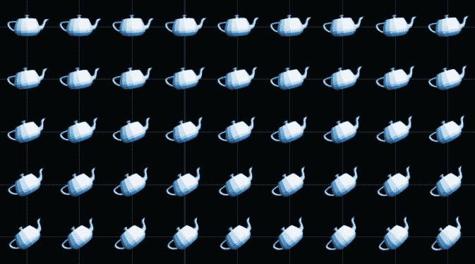

图 4.3 每次旋转茶壶 1°，连续旋转 45 次，从左上角开始

我将向您介绍一类称为**线性变换**的广泛向量变换，它们与旋转类似，将位于直线上的向量映射到新的位于直线上的向量。线性变换在数学、物理和数据分析中有着广泛的应用。当您在这些背景下再次遇到它们时，了解如何从几何角度想象它们是有帮助的。

为了可视化本章中的旋转、线性变换和其他向量变换，我们将升级到更强大的绘图工具。我们将用 OpenGL 替换 Matplotlib，OpenGL 是一个用于高性能图形的行业标准库。大多数 OpenGL 编程是用 C 或 C++完成的，但我们将使用一个友好的 Python 包装器 PyOpenGL。我们还将使用一个名为 PyGame 的 Python 视频游戏开发库。具体来说，我们将使用 PyGame 中的功能，这些功能使得将连续图像渲染成动画变得容易。所有这些新工具的设置都在附录 C 中介绍，因此我们可以直接进入并专注于向量的数学变换。如果您想跟随本章的代码（我强烈推荐！），那么您应该跳转到附录 C，一旦代码运行正常，再返回这里。

## 4.1 变换 3D 对象

本章的主要目标是取一个 3D 对象（如茶壶）并改变它以创建一个新的 3D 对象，该对象在视觉上不同。在第二章中，我们已经看到我们可以平移或缩放二维恐龙中的每个向量，整个恐龙形状会相应地移动或改变大小。我们在这里采取相同的方法。我们研究的每个变换都接受一个向量作为输入并返回一个向量作为输出，类似于以下伪代码：

```
def transform(*v*):
    old_x, old_y, old_z = v
    # ... do some computation here ...
    return (new_x, new_y, new_z)
```

让我们从将熟悉的二维平移和缩放示例适应到三维空间开始。

### 4.1.1 绘制变换后的对象

如果您已安装附录 C 中描述的依赖项，您应该能够在第四章的源代码中运行 draw_teapot.py 文件（有关从命令行运行 Python 脚本的说明，请参阅附录 A）。如果它运行成功，您应该看到一个显示图 4.4 中图像的 PyGame 窗口。

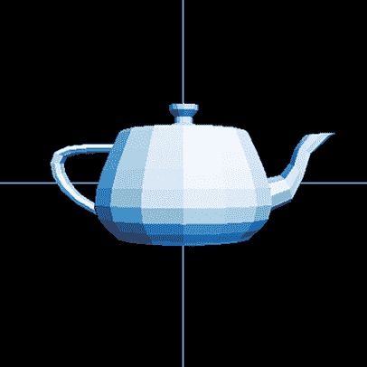

图 4.4 运行 draw_teapot.py 的结果

在接下来的几个示例中，我们将修改定义茶壶的向量，然后重新渲染它，以便我们可以看到几何效果。作为一个例子，我们可以将所有向量按相同的因子缩放。以下函数`scale2`将输入向量乘以标量 2.0 并返回结果：

```
from vectors import scale
def scale2(*v*):
    return scale(2.0, v)
```

这个`scale2(*v*)`函数与本章开头给出的`transform(*v*)`函数具有相同的形式；当输入一个 3D 向量时，`scale2`返回一个新的 3D 向量作为输出。为了在茶壶上执行这种变换，我们需要变换它的每个顶点。我们可以一个三角形一个三角形地做这件事。对于构建茶壶的每个三角形，我们创建一个新的三角形，其顶点是应用`scale2`变换后的原始顶点：

```
original_triangles = load_triangles()        ❶
scaled_triangles = [
    [scale2(vertex) for vertex in triangle]  ❷
    for triangle in original_triangles       ❸
]
```

❶ 使用附录 C 中的代码加载三角形

❷ 将 `scale2` 应用到给定三角形中的每个顶点上以获得新顶点

❸ 对原始三角形列表中的每个三角形都这样做

现在我们已经得到了一组新的三角形，我们可以通过调用 `draw_model(scaled_triangles)` 来绘制它们。图 4.5 显示了调用此函数后的茶壶，你可以通过在源代码中运行文件 scale_teapot.py 来重现这个结果。


图 4.5 将 `scale2` 应用到每个三角形的每个顶点上，我们得到了一个两倍大的茶壶。

这个茶壶看起来比原来的大，实际上，它大了两倍，因为我们把每个向量乘以 2。现在让我们对每个向量应用另一个变换：通过向量 (−1, 0, 0) 进行平移。

回想一下，“通过向量转换”是“加向量”的另一种说法，所以我真正要讨论的是将向量 (−1, 0, 0) 加到茶壶的每个顶点上。这应该将整个茶壶向负 *x* 方向移动一个单位，即从我们的视角来看是向左移动。这个函数为单个顶点完成了转换：

```
from vectors import add
def translate1left(*v*):
    return add((−1,0,0), v)
```

从原始三角形开始，我们现在想要像以前一样缩放每个顶点，然后应用平移。图 4.6 显示了结果。你可以使用源文件 scale_translate_teapot.py 来重现它：

```
scaled_translated_triangles = [
    [translate1left(scale2(vertex)) for vertex in triangle]
    for triangle in original_triangles
]
draw_model(scaled_translated_triangles)
```

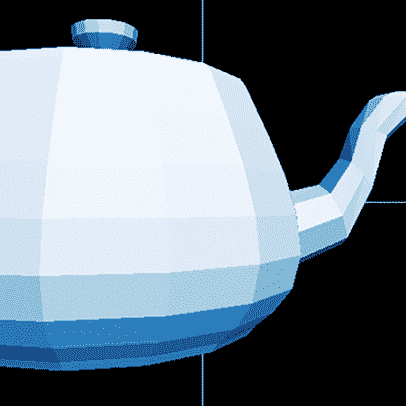

图 4.6 茶壶变大了，并且像我们希望的那样向左移动了！

不同的标量倍数以不同的因素改变茶壶的大小，不同的平移向量将茶壶移动到空间中的不同位置。在接下来的练习中，你将有机会尝试不同的标量倍数和平移，但到目前为止，让我们专注于组合和应用更多的变换。

### 4.1.2 组合向量变换

依次应用任意数量的变换定义了一个新的变换。例如，在上一节中，我们通过缩放然后平移来变换茶壶。我们可以将这个新变换打包成它自己的 Python 函数：

```
def scale2_then_translate1left(*v*):
    return translate1left(scale2(*v*))
```

这是一个重要的原则！因为向量变换以向量作为输入并返回向量作为输出，我们可以通过函数的**组合**来组合尽可能多的它们。如果你之前没有听说过这个术语，它意味着通过以指定顺序应用两个或多个现有函数来定义新函数。如果我们把 `scale2` 和 `translate1left` 函数想象成接受 3D 模型并输出新模型的机器（图 4.7），我们可以通过将第一个机器的输出作为第二个机器的输入来组合它们。

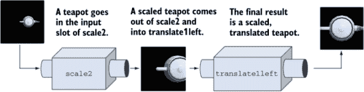

图 4.7 在茶壶上调用 `scale2` 和 `translate1left` 以输出转换后的版本

我们可以想象通过将第一个机器的输出槽焊接到第二个机器的输入槽来隐藏中间步骤（图 4.8）。


图 4.8 将两个函数机器焊接在一起以得到一个新的机器，该机器一步完成两种转换

我们可以把结果想象成一个新机器，它一步完成原始函数的工作。这种函数的“焊接”也可以在代码中实现。我们可以编写一个通用的`compose`函数，它接受两个 Python 函数（例如，用于向量变换的函数）并返回一个新的函数，这是它们的组合：

```
def compose(f1,f2):
    def new_function(input):
        return f1(f2(input))
    return new_function
```

我们不必为`scale2_then_translate1left`定义一个单独的函数，我们可以这样写

```
scale2_then_translate1left = compose(translate1left, scale2)
```

你可能听说过 Python 将函数视为“一等对象”的想法。这个口号通常意味着 Python 函数可以被分配给变量，作为其他函数的输入传递，或者即时创建并作为输出值返回。这些都是*函数式编程*技术，意味着它们通过组合现有函数来构建新的函数，帮助我们构建复杂的程序。

关于函数式编程在 Python 中是否合适（或者说，作为一个 Python 粉丝可能会说，函数式编程是否“Pythonic”），有一些争议。我不会对编码风格发表意见，但我使用函数式编程，因为函数，特别是向量变换，是我们研究的核心对象。在介绍了`compose`函数之后，我将向你展示一些更多的函数式“食谱”，以证明这种偏离是有道理的。这些都是在本书源代码中的新辅助文件`transforms.py`中添加的。

我们将反复进行的一项操作是将向量变换应用于定义 3D 模型的每个三角形的每个顶点。我们可以为这个操作编写一个可重用的函数，而不是每次都编写一个新的列表推导式。以下`polygon_map`函数接受一个向量变换和一个多边形列表（通常是三角形），并将变换应用于每个多边形的每个顶点，生成一个新的多边形列表：

```
def polygon_map(transformation, polygons):
    return [
        [transformation(vertex) for vertex in triangle]
        for triangle in polygons
    ]
```

使用这个辅助函数，我们可以一行代码就将`scale2`应用于原始的茶壶：

```
draw_model(polygon_map(scale2, load_triangles()))
```

`compose`和`polygon_map`函数都接受向量变换作为参数，但拥有返回向量变换的函数也很有用。例如，我们可能觉得将一个函数命名为`scale2`并将数字二硬编码到其定义中有些麻烦。这种做法的一个替代方案是`scale_by`函数，它返回一个指定标量的缩放变换：

```
def scale_by(scalar):
    def new_function(*v*):
        return scale(scalar, v)
    return new_function
```

使用这个函数，我们可以写`scale_by(2)`，返回值将是一个新的函数，其行为与`scale2`完全相同。当我们把函数想象成具有输入和输出槽位的机器时，你可以把`scale_by`想象成一个机器，它在其输入槽位中接受数字，并从其输出槽位输出新的函数机器，如图 4.9 所示。

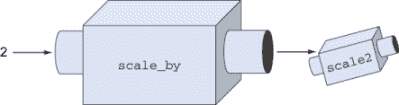

图 4.9 一个函数机器，它接受数字作为输入并产生新的函数机器作为输出

作为练习，你可以编写一个类似的 `translate_by` 函数，它接受一个平移向量作为输入，并返回一个平移函数作为输出。在函数式编程的术语中，这个过程称为 *currying* *.* Currying 将接受多个输入的函数重构为返回另一个函数的函数。

结果是一个程序化的机器，其行为相同，但调用方式不同；例如，`scale_by(s)(*v*)` 对于任何输入 *s* 和 *v* 都会产生与 `scale(s,v)` 相同的结果。优点是 `scale(...)` 和 `add(...)` 可以接受不同类型的参数，因此生成的函数 `scale_by(s)` 和 `translate_by(*w*)` 可以互换使用。接下来，我们将类似地考虑旋转：对于任何给定的角度，我们可以生成一个向量变换，使我们的模型绕该角度旋转。

### 4.1.3 绕轴旋转对象

你已经在第二章中看到了如何在二维中进行旋转：你将笛卡尔坐标转换为极坐标，通过旋转因子增加或减少角度，然后转换回来。尽管这是一个二维技巧，但在三维中也很有用，因为所有三维

向量旋转在某种意义上是孤立在平面上的。例如，想象一个点在三维空间中绕 *z* 轴旋转。它的 *x* 和 *y* 坐标会改变，但它的 *z* 坐标保持不变。如果给定点绕 *z* 轴旋转，它将保持在具有恒定 *z* 坐标的圆上，无论旋转角度如何（图 4.10）。

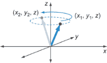

图 4.10 绕 z 轴旋转点

这意味着我们可以通过保持 *z* 坐标不变，并将我们的二维旋转函数仅应用于 *x* 和 *y* 坐标来绕 *z* 轴旋转一个三维点。我们将在代码中实现这一点，你还可以在源代码中的 rotate_teapot.py 文件中找到它。首先，我们编写一个二维旋转函数，该函数是从我们在第二章中使用的方法改编而来的：

```
def rotate2d(angle, vector):
    l,a = to_polar(vector)
    return to_cartesian((l, a+angle))
```

此函数接受一个角度和一个二维向量，并返回一个旋转后的二维向量。现在，让我们创建一个函数 `rotate_z`，它只应用于三维向量的 *x* 和 *y* 分量：

```
def rotate_z(angle, vector):
    x,y,z = vector
    new_x, new_y = rotate2d(angle, (x,y))
    return new_x, new_y, z
```

继续在函数式编程范式下思考，我们可以对函数进行 currying。给定任何角度，curried 版本会产生一个向量变换，执行相应的旋转：

```
def rotate_z_by(angle):
    def new_function(*v*):
        return rotate_z(angle,v)
    return new_function
```

让我们看看它的实际效果。以下行生成了图 4.11 中的茶壶，它绕 *π*/4 或 45° 旋转：

```
draw_model(polygon_map(rotate_z_by(pi/4.), load_triangles()))
```

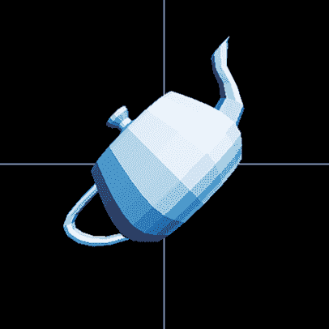

图 4.11 茶壶绕 z 轴逆时针旋转 45°。

我们可以编写一个类似的函数来绕 x 轴旋转茶壶，这意味着旋转只影响向量的 *y* 和 *z* 分量：

```
def rotate_x(angle, vector):
    x,y,z = vector
    new_y, new_z = rotate2d(angle, (y,z))
    return x, new_y, new_z
def rotate_x_by(angle):
    def new_function(*v*):
        return rotate_x(angle,v)
    return new_function
```

在 `rotate_x_by` 函数中，通过固定 *x* 坐标并在 *y*、*z* 平面上执行 2D 旋转来实现绕 x 轴的旋转。以下代码绘制了 90° 或 *π*/2 弧度（逆时针）的旋转，结果如图 4.12 所示：

```
draw_model(polygon_map(rotate_x_by(pi/2.), load_triangles()))
```


图 4.12 茶壶绕 x 轴旋转 *π*/2。

你可以使用源文件 rotate_teapot_x.py 重新生成图 4.12。这些旋转茶壶的阴影是一致的；它们最亮的多边形位于图象的右上角，这是预期的，因为光源仍然位于 (1, 2, 3)。这是一个好迹象，表明我们正在成功移动茶壶，而不是像以前那样仅仅改变我们的 OpenGL 视角。

结果表明，通过在 *x* 和 *z* 方向上组合旋转，我们可以得到我们想要的任何旋转。在章节末尾的练习中，你可以尝试一些更多的旋转，但到目前为止，我们将继续探讨其他类型的向量变换。

### 4.1.4 发明你自己的几何变换

到目前为止，我主要关注我们在前几章中以一种方式看到过的向量变换。现在，让我们大胆尝试，看看我们还能想出哪些有趣的变换。记住，3D 向量变换的唯一要求是它接受一个单一的 3D 向量作为输入，并返回一个新的 3D 向量作为输出。让我们看看一些不太符合我们之前看到过的类别的变换。

对于我们的茶壶，让我们一次修改一个坐标。这个函数通过（硬编码的）四倍因子拉伸向量，但只在 *x* 方向上：

```
def stretch_x(vector):
    x,y,z = vector
    return (4.*x, y, z)
```

结果是沿着 x 轴或把手到壶嘴的方向出现一个细长的茶壶（图 4.13）。这在 stretch_teapot.py 中完全实现。

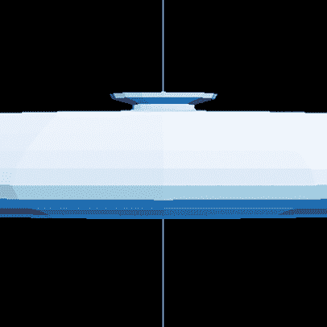

图 4.13 沿 x 轴拉伸的茶壶。

类似的 `stretch_y` 函数可以使茶壶从上到下变长。你可以自己实现 `stretch_y` 并将其应用于茶壶，你应该得到图 4.14 中的图像。否则，你可以查看源代码中 stretch_teapot_y.py 中的实现。

我们甚至可以更有创意，通过将 *y* 坐标立方而不是简单地乘以一个数字来拉伸茶壶。这种变换在 cube_teapot.py 中实现，并在图 4.15 中展示：

```
def cube_stretch_z(vector):
    x,y,z = vector
    return (x, y*y*y, z)
```

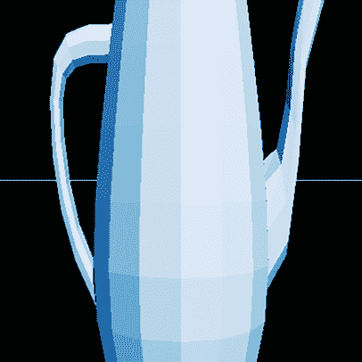

图 4.14 在 y 方向上拉伸茶壶而不是其他方向

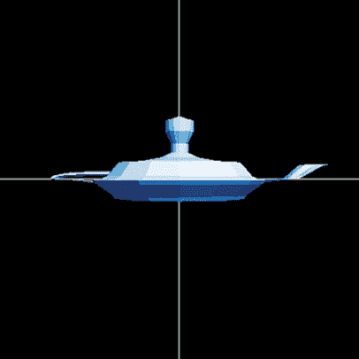

图 4.15 茶壶的垂直维度立方

如果我们选择性地在变换的公式中添加三个坐标中的两个，例如 *x* 和 *y* 坐标，我们可以使茶壶倾斜。这已在 slant_teapot.py 中实现，并在图 4.16 中展示：

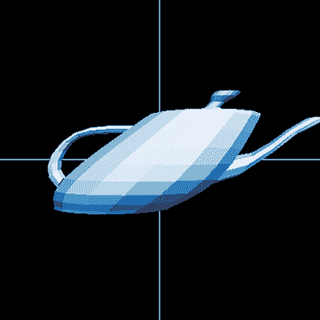

图 4.16 将 y 坐标添加到现有的 x 坐标会使茶壶在*x*方向上倾斜。

```
def slant_xy(vector):
    x,y,z = vector
    return (x+y, y, z)
```

关键点不是这些变换中的任何一个都很重要或有用，而是构成 3D 模型的向量的任何数学变换都会对模型的外观产生某种几何影响。过度使用变换可能会导致模型过度扭曲，以至于无法识别或成功绘制。实际上，一些变换在一般情况下表现得更好，我们将在下一节中对其进行分类。

### 4.1.5 练习

| **练习 4.1**：实现一个`translate_by`函数（在 4.1.2 节中提到），它接受一个平移向量作为输入，并返回一个平移函数作为输出。**解答**：

```
def translate_by(translation):
    def new_function(*v*):
        return add(translation,v)
    return new_function
```

|

| **练习 4.2**：渲染沿负*z*方向平移 20 单位的茶壶。结果图像看起来像什么？**解答**：我们可以通过将`translate_by((0,0,−20))`应用于每个多边形的每个向量，使用`polgyon_map`来完成这项工作：

```
draw_model(polygon_map(translate_by((0,0,−20)), load_triangles()))
```

记住，我们是从 z 轴上方五单位处观察茶壶的。这个变换将茶壶带到我们前方 20 单位处，所以它看起来比原始的茶壶小得多。你可以在源代码中的 translate_teapot_down_z.py 中找到完整的实现。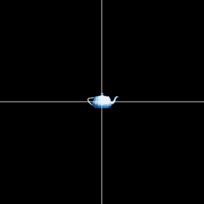茶壶沿 z 轴向下平移了 20 单位。它看起来更小，因为它离观察者更远。|

| **练习 4.3-迷你项目**：当你将每个向量按 0 到 1 之间的标量缩放时，茶壶会发生什么变化？当你将其按-1 的因子缩放时会发生什么？**解答**：我们可以通过应用`scale_by(0.5)`和`scale_by(−1)`来查看结果：

```
draw_model(polygon_map(scale_by(0.5), load_triangles()))
draw_model(polygon_map(scale_by(−1), load_triangles()))
```

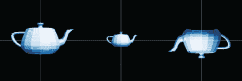从左到右，原始的茶壶、放大 0.5 倍的茶壶和放大-1 倍的茶壶。如图所示，`scale_by(0.5)`将茶壶缩小到原来的一半大小。`scale_by(−1)`的动作看起来像是将茶壶旋转了 180°，但实际上情况要复杂一些。它实际上被翻转了！每个三角形都被反射了，所以每个法向量现在指向茶壶内部而不是从其表面向外！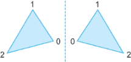反射改变了三角形的方向。左边的索引顶点按逆时针顺序排列，右边的反射按顺时针顺序排列。这些三角形的法向量指向相反的方向。旋转茶壶，你可以看到它渲染得并不完全正确，这是由于这个原因！我们应该小心处理我们的图形的反射！！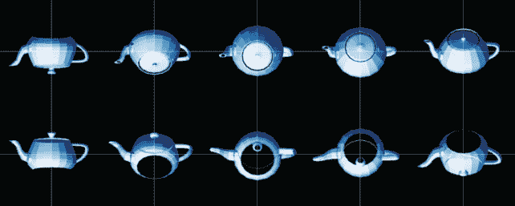旋转并反射的茶壶看起来并不完全正确。一些特征出现了，但应该被隐藏。例如，在右下角的框架中，我们可以看到盖子和空心底部。|

| **练习 4.4**: 首先对茶壶应用 `translate1left`，然后应用 `scale2`。与逆序组合的效果有何不同？为什么？**解答**：我们可以按指定顺序组合这两个函数，然后使用 `polygon_map:` 应用它们。|

```
draw_model(polygon_map(compose(scale2, translate1left), load_triangles()))
```

结果是茶壶仍然是原始大小的两倍，但这个茶壶向左平移得更远。这是因为当缩放因子 2 在平移之后应用时，平移的距离也会加倍。你可以通过运行源文件 `scale_translate_teapot.py` 和 `translate_scale_teapot.py` 并比较结果来证实这一点！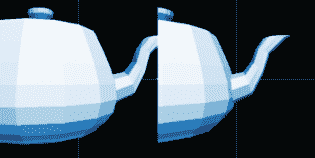先缩放后平移茶壶（左）与先平移后缩放（右）|

| **练习 4.5**: 变换 `compose(scale_by (0.4), scale_by(1.5))` 的效果是什么？**解答**：应用此变换到向量上，首先将其缩放为 1.5 倍，然后缩放为 0.4 倍，最终缩放因子为 0.6。生成的图形将是原始大小的 60%。 |
| --- |

| **练习 4.6**: 将 `compose(f,g)` 函数修改为 `compose(*args)`，它接受多个函数作为参数，并返回一个新的函数，该函数是它们的组合。**解答**：

```
def compose(*args):
    def new_function(input):         ❶
        state = input                ❷
        for f in reversed(args):     ❸
            state = f(state)         ❹
        return state
    return new_function
```

❶ 开始定义 compose 返回的函数❷ 将当前状态设置为输入❸ 以相反的顺序遍历输入函数，因为组合的内函数先应用。例如，`compose(f,g,h)(*x*)` 应等于 `f(g(h(*x*)))`，所以第一个要应用的函数是 h。❹ 在每一步中，通过应用下一个函数来更新状态。最终状态包含所有 |

| 为了验证我们的工作，我们可以构建一些函数并将它们组合起来：

```
def prepend(string):
    def new_function(input):
        return string + input
    return new_function

f = compose(prepend("P"), prepend("y"), prepend("t"))
```

然后，运行 `*f*(“hon”)` 返回字符串 `“Python”`。一般来说，构造的函数 `f` 将字符串 `“Pyt”` 追加到它所接受的任何字符串上。|

| **练习 4.7**: 编写一个 `curry2(f)` 函数，该函数接受一个具有两个参数的 Python 函数 `f(x,y)` 并返回一个柯里化版本。例如，一旦你编写了 `g = curry2(f)`，两个表达式 `f(x,y)` 和 `*g*(*x*)(*y*)` 应该返回相同的结果。**解答**：返回值应该是一个新函数，当它被调用时，会再次产生一个新的函数：

```
def curry2(f):
    def *g*(*x*):
        def new_function(*y*):
            return f(x,y)
        return new_function
    return g
```

作为例子，我们可以这样构建 `scale_by` 函数：

```
>>> scale_by = curry2(scale)
>>> scale_by(2)((1,2,3))

(2, 4, 6)
```

|

| **练习 4.8**: 不运行它，应用变换 `compose(rotate_z_by(pi/2),rotate_x_by(pi/2))` 的结果是什么？如果你交换组合的顺序呢？**解答**：这个组合等价于绕 y 轴顺时针旋转 *π*/2。逆序则给出绕 y 轴逆时针旋转 *π*/2。 |
| --- |

| **练习 4.9**: 编写一个函数 `stretch_x(scalar,vector)`，该函数通过给定的因子缩放目标向量，但仅在 *x* 方向上缩放。同时编写一个柯里化版本 `stretch_x_by`，使得 `stretch_x_by(scalar)(vector)` 返回相同的结果。**解答**：

```
def stretch_x(scalar,vector):
    x,y,z = vector
    return (scalar*x, y, z)

def stretch_x_by(scalar):
    def new_function(vector):
        return stretch_x(scalar,vector)
    return new_function
```

|

## 4.2 线性变换

我们将要关注的良好行为的向量变换被称为 *线性变换*。与向量一样，线性变换是线性代数中研究的其他主要对象。线性变换是一种特殊的变换，其中向量算术在变换前后看起来相同。让我们绘制一些图表来展示这究竟意味着什么。

### 4.2.1 保持向量算术

向量上的两个最重要的算术运算分别是加法和标量乘法。让我们回到这些操作的 2D 图像，看看在应用变换前后它们看起来如何。

我们可以将两个向量的和想象成我们将它们尾对尾放置时到达的新向量，或者想象成定义的平行四边形的顶点向量。例如，图 4.17 表示向量和 ***u*** + ***v*** = ***w***。

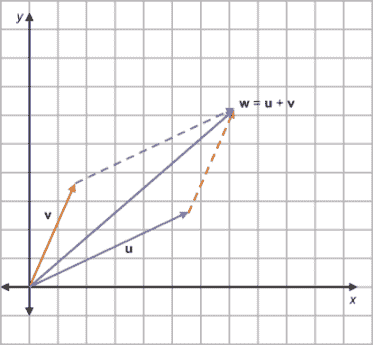

图 4.17 向量和 *z* + *v* = w 的几何演示

我们想要问的问题是，如果我们将相同的向量变换应用到这个图中的三个向量上，它是否仍然看起来像向量和？让我们尝试一个向量变换，这是一个关于原点的逆时针旋转，我们称这个变换为 *R*。图 4.18 显示了 ***u***，***v*** 和 ***w*** 通过变换 *R* 以相同的角度旋转。

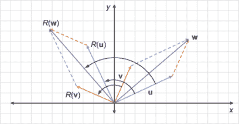

图 4.18 在将 *u*，*v* 和 *w* 通过相同的旋转 R 旋转后，和仍然成立。

旋转后的图表正好是表示向量和 *R*(*u*) + *R*(*v*) = *R*(*w*) 的图表。你可以为任何三个向量 ***u***，***v*** 和 ***w*** 绘制图像，只要 ***u*** + ***v*** = ***w***，并且如果你将相同的旋转变换 *R* 应用到每个向量上，你会发现 *R*(*u*) + *R*(*v*) = *R*(*w*)。为了描述这个属性，我们说旋转 *保持* 向量和。

同样，旋转保持标量乘法。如果 ***v*** 是一个向量，而 s***v*** 是通过标量 *s* 乘以 ***v*** 得到的，那么 s***v*** 指向相同的方向，但按 *s* 的因子缩放。如果我们用相同的旋转 *R* 旋转 ***v*** 和 s***v***，我们会看到 *R*(*s* ***v***) 是 *R*(*v**) 的一个标量倍数，倍数为相同的 *s*（图 4.19）。

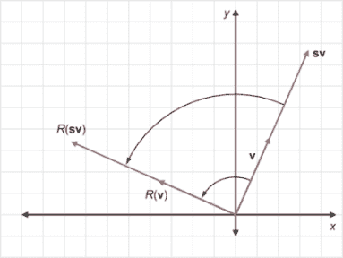

图 4.19 旋转保持了标量乘法。

再次强调，这只是一个视觉示例，而不是一个证明，但你会发现对于任何向量 ***v***，标量 *s* 和旋转 *R*，同样的图像是成立的。保持向量加法和标量乘法的旋转或其他向量变换被称为 *线性变换*。

| 线性变换 | *线性变换* 是一个保持向量加法和标量乘法的向量变换 *T*。也就是说，对于任何输入向量 ***u*** 和 ***v***，我们有 *T*(*u*) + *T*(*v*) = *T*(*u* + v*)，并且对于任何一对标量 *s* 和向量 ***v***，我们有 *T*(*sv*) = *sT*(*v*) |
| --- | --- |

确保你暂停一下，消化这个定义；线性变换如此重要，以至于整个线性代数主题都是以它们的名称命名的。为了帮助你识别当你看到它们时的线性变换，我们将再看看几个例子。

### 4.2.2 图形化线性变换

首先，让我们来看一个反例：一个非线性的向量变换。这样的例子是一个变换 *S*(*v*)，它将向量 ***v*** = (*x*, *y*) 转换为坐标都平方的向量：*S*(*v*) = (*x*², *y*²)。作为一个例子，让我们来看 ***u*** = (2, 3) 和 ***v*** = (1, −1) 的和。和是 (2, 3) + (1, −1) = (3, 2)。这如图 4.20 中的向量加法所示。

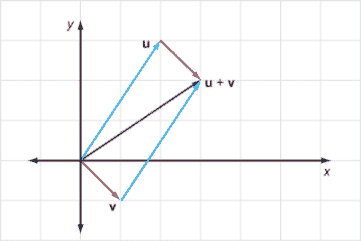

图 4.20 描绘了向量 *z* = (2, 3) 和 *v* = (1, −1) 的和，*z* + *v* = (3, 2)

现在，让我们将 *S* 应用到这些向量上：*S*(***u***) = (4, 9)，*S*(***v***) = (1, 1)，以及 *S*(***u*** + ***v***) = (9, 4)。图 4.21 清楚地显示 *S*(***u***) + *S*(***v***) 与 *S*(***u*** + ***v***) 不一致。

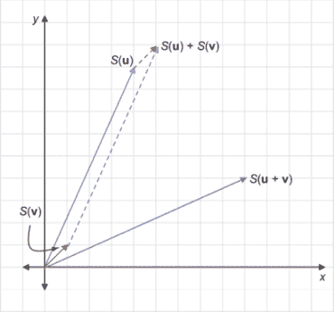

图 4.21 S 不尊重和！S(*u*) + S(*v*) 与 S(*u + v*) 相去甚远。

作为练习，你可以尝试找到一个反例来证明 *S* 也不保留标量乘法。现在，让我们检查另一个变换。设 *D*(***v***) 是将输入向量按因子 2 放大的向量变换。换句话说，*D*(***v***) = 2***v***。这确实保留了向量和：如果 ***u*** + ***v*** = ***w***，那么 2***u*** + 2***v*** 也等于 2***w***。图 4.22 提供了一个视觉示例。

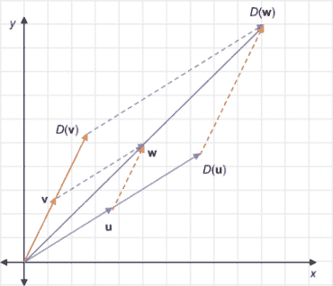

图 4.22 向量的长度加倍保留了它们的和：如果 *z* + *v* = *w*，那么 *D*(*u*) + *D*(*v*) = *D*(*w*).

同样地，*D*(***v***) 保留了标量乘法。这有点难以绘制，但你可以从代数上看到这一点。对于任何标量 *s*，*D*(*sv*) = 2(*sv*) = *s*(2*v*) = *sD*(*v*).

翻译呢？假设 *B*(***v***) 将任何输入向量 ***v*** 平移到 (7, 0)。令人惊讶的是，这 *不是* 一个线性变换。图 4.23 提供了一个视觉反例，其中 ***u*** + ***v*** = ***w***，但 *B*(***v***) + *B*(***w***) 并不等于 *B*(***v*** + ***w***).

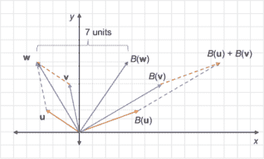

图 4.23 平移变换 B 不保留向量和，因为 *B*(*u*) + *B*(*v*) 不等于 *B*(*u + v*).

结果表明，为了使一个变换成为线性变换，它必须不移动原点（为什么稍后作为练习说明）。任何非零向量的平移都会将原点移动到不同的点，因此它不能是线性的。

线性变换的其他例子包括反射、投影、剪切以及前面线性变换的任何 3D 类比。这些在练习部分定义，你应该通过几个例子来确信每个这些变换都保持向量加法和标量乘法。通过练习，你可以识别出哪些变换是线性的，哪些不是。接下来，我们将探讨线性变换的特殊性质为什么有用。

### 4.2.3 为什么是线性变换？

由于线性变换保持向量之和和标量乘积，它们也保持更广泛的向量算术运算类。最一般的运算称为 *线性组合*。向量集合的线性组合是它们的标量倍数之和。例如，两个向量 ***u*** 和 ***v*** 的一个线性组合可以是 3***u*** − 2***v***。给定三个向量 ***u***、***v*** 和 ***w***，表达式 0.5*u* − *v* + 6 *w 是 ***u***、***v*** 和 ***w*** 的线性组合。因为线性变换保持向量之和和标量乘积，所以它们也保持线性组合。

我们可以用代数方式重述这个事实。如果你有一组 *n* 个向量 ***v***[1]、***v***[2]、...、***v*** *n*，以及任何选择的 *n* 个标量 *s*[1]、*s*[2]、*s*[3]、...、*s[n]*，线性变换 *T* 保持线性组合：

*T*(*s*[1] *v*[1] + *s*[2] *v*[2] + *s*[3] *v*[3] + ... + *s[n]v[n]*) = *s*[1] *T*(*v*[1]) + *s*[2] *T*(*v*[2]) + *s*[3] *T*(*v*[3]) + ... + *s[n]T*(*v[n]*)

我们之前看到的一个容易理解的线性组合是向量 ***u*** 和 ***v*** 的 ½ ***u*** + ½ ***v***，这相当于 ½ (***u*** + ***v***)。图 4.24 显示，这两个向量的这种线性组合给出了它们之间线段的中点。

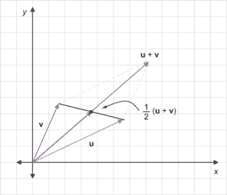

图 4.24 两个向量 *z* 和 *v* 之间的中点可以表示为线性组合 ½ *z* + ½ *v* = ½ (*u + v*)。

这意味着线性变换将中点映射到其他中点：例如，*T*(½ ***u*** + ½ ***v***) = ½ *T*(***u***) + ½ *T*(***v***)，如图 4.25 所示，这是连接 *T*(***u***) 和 *T*(***v***) 的线段的中点。

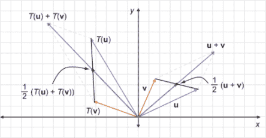

图 4.25 因为两个向量之间的中点是向量的线性组合，线性变换 T 将 *z* 和 *v* 之间的中点设置为 T(*u*) 和 T(*v*) 之间的中点。

这一点可能不太明显，但像 0.25*u* + 0.75*v* 这样的线性组合也位于 ***u*** 和 ***v*** 之间的线段上（图 4.26）。具体来说，这是从 ***u*** 到 ***v*** 的 75% 处的点。同样，0.6*u* + 0.4*v* 是从 ***u*** 到 ***v*** 的 40% 处，以此类推。

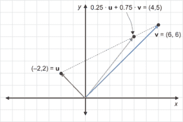

图 4.26 点 0.25*u* + 0.75*v*位于连接*z*和*v*的线段上，从*z*到*v*的 75%。你可以通过*u* = (−2, 2)和*v* = (6, 6)具体地看到这一点。

事实上，两个向量之间的线段上的*每一个*点都是这样的“加权平均”，具有以下形式：*su* + (1 − *s*)*v*，其中*s*是介于 0 和 1 之间的某个数。为了让你信服，图 4.27 显示了***u*** = (−1, 1)和***v*** = (3, 4)在 0 和 1 之间 10 个值和 100 个值的*s*的向量*su* + (1 − *s*)*v*。

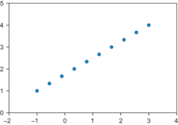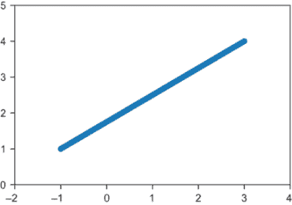

图 4.27 以 0 到 1 之间 10 个值和 100 个值的*s*绘制(−1, 1)和(3, 4)的各种加权平均（左侧）和右侧）。

这里的关键思想是，连接两个向量***u***和***v***的线段上的每一个点都是一个加权平均，因此是点*u*和***v***的线性组合。考虑到这一点，我们可以思考线性变换对整个线段的影响。

连接***u***和***v***的线段上的任意点都是***u***和***v***的加权平均，因此它具有以下形式：*s* · ***u*** + (1 − *s*) · ***v***，其中*s*是某个值。线性变换*T*将***u***和***v***变换为一些新的向量**T**(***u***)和**T**(***v***)。线段上的点被变换为新的点*T*(*s* · ***u*** + (1 − *s*) · ***v***)或*s* · *T*(***u***) + (1 − *s*) · *T*(***v***)。这反过来又是一个**T**(***u***)和**T**(***v***)的加权平均，因此它是一个位于**T**(***u***)和**T**(***v***)连接线段上的点，如图 4.28 所示。

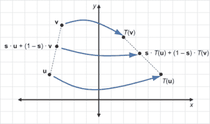

图 4.28 线性变换 T 将*z*和*v*的加权平均转换为 T(*u*)和 T(*v*)的加权平均。原始的加权平均位于连接*z*和*v*的线段上，变换后的加权平均位于连接 T(*u*)和 T(*v*)的线段上。

由于这个原因，线性变换*T*将连接***u***和***v***的线段上的每一个点变换为连接**T**(***u***)和**T**(***v***)的线段上的一个点。这是线性变换的一个关键特性：它们将每一个现有的线段映射到新的线段。因为我们的 3D 模型由多边形组成，而多边形由线段勾勒出来，所以线性变换可以在一定程度上保留我们的 3D 模型的结构（如图 4.29 所示）。

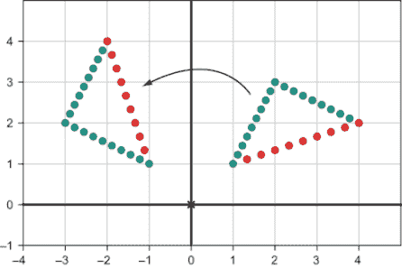

图 4.29 将组成三角形的点应用线性变换（旋转 60°）。结果是旋转后的三角形（在左侧）。

相比之下，如果我们使用非线性变换 *S*(***v***)，将 ***v*** = (*x*, *y*) 映射到 (*x*², *y*²)，我们可以看到线段被扭曲。这意味着由向量 ***u***，***v*** 和 ***w*** 定义的三角形实际上并没有被映射到由 *S*(***u***)，*S*(***v***)，和 *S*(***w***) 定义的另一个三角形，如图 4.30 所示。

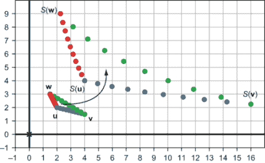


总结来说，线性变换尊重向量的代数性质，保持和、标量乘积和线性组合。它们也尊重向量集合的几何性质，将向量定义的线段和多边形映射到由变换向量定义的新线段和多边形。接下来，我们将看到线性变换不仅在几何上特殊；它们也易于计算。

### 4.2.4 计算线性变换

在第二章和第三章中，你看到了如何将 2D 和 3D 向量分解成分量。例如，向量 (4, 3, 5) 可以分解为和 (4, 0, 0) + (0, 3, 0) + (0, 0, 5)。这使得我们可以想象向量在我们所在空间的三个维度中延伸有多远。我们可以进一步将其分解为线性组合（图 4.31）：

(4, 3, 5) = 4 · (1, 0, 0) + 3 · (0, 1, 0) + 5 · (0, 0, 1)

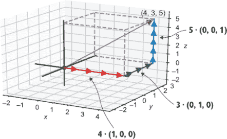

图 4.31 3D 向量 (4, 3, 5) 是 (1, 0, 0)，(0, 1, 0) 和 (0, 0, 1) 的线性组合

这个事实可能看起来很无聊，但它是从线性代数中得出的深刻见解之一：任何 3D 向量都可以分解为三个向量 (1, 0, 0)，(0, 1, 0) 和 (0, 0, 1) 的线性组合。在这个分解中出现的标量正好是向量 ***v*** 的坐标。

三个向量 (1, 0, 0)，(0, 1, 0) 和 (0, 0, 1) 被称为三维空间的标准基。这些表示为 ***e***[1]，***e***[2] 和 ***e***[3]，因此我们可以将之前的线性组合写成 (3, 4, 5) = 3 ***e***[1] + 4 ***e***[2] + 5 ***e***[3]。当我们工作在 2D 空间时，我们称 ***e***[1] = (1, 0) 和 ***e***[2] = (0, 1)；例如，(7, −4) = 7 ***e***[1] − 4 ***e***2。(当我们说 ***e***[1] 时，我们可能指的是 (1, 0) 或 (1, 0, 0)，但一旦我们确定了我们在二维还是三维空间中工作，通常就可以清楚地知道我们指的是哪一个。)

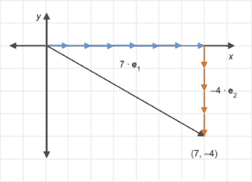

图 4.32 2D 向量 (7, −4) 是标准基向量 e1 和 e2 的线性组合

我们只是以稍微不同的方式写下了相同的向量，但结果证明这种视角的改变使得计算线性变换变得容易。因为线性变换尊重线性组合，所以我们只需要知道线性变换如何影响标准基向量。

让我们来看一个视觉示例（图 4.33）。假设我们对二维向量变换 *T* 一无所知，除了它具有线性性质，并且我们知道 *T*(***e***[1]) 和 *T*(***e***[2]) 是什么。

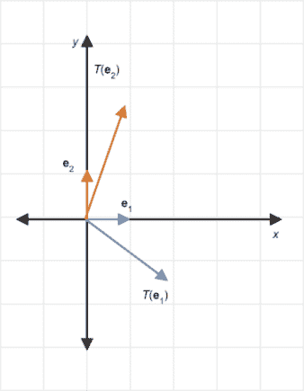

图 4.33 当线性变换作用于二维中的两个标准基向量时，我们得到两个新的向量作为结果。

对于任何其他向量 ***v***，我们自动知道 *T*(***v***) 最终会落在何处。假设 ***v*** = (3, 2)，那么我们可以断言：

*T*(***v***) = *T*(3e[1] + 2e[2]) = 3*T*(e[1]) + 2*T*(e[2])

因为我们已经知道 *T*(***e***[1]) 和 *T*(***e***[2]) 的位置，我们可以根据图 4.34 定位 *T*(***v***)。

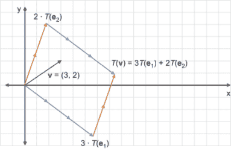

图 4.34 我们可以计算 T(*v*) 为 T(e1) 和 T(e2) 的线性组合。

为了使这个问题更具体，让我们在三维空间中做一个完整的例子。假设 *a* 是一个线性变换，我们只知道 *a*(***e***[1]) = (1, 1, 1)，*a*(***e***[2]) = (1, 0, −1)，和 *a*(***e***[3]) = (0, 1, 1)。如果 ***v*** = (−1, 2, 2)，那么 *a*(***v***) 是什么？首先，我们可以将 ***v*** 展开为三个标准基向量的线性组合。因为 ***v*** = (−1, 2, 2) = ***−e***[1] + 2***e***[2] + 2***e***[3]，我们可以进行替换：

*a*(*v*) = *a*(−e[1] + 2e[2] + 2e[3])

接下来，我们可以利用 *a* 是线性且保持线性组合的事实：

= − *a*(e[1]) + 2*a*(e[2]) + 2*a*(e[3])

最后，我们可以代入已知的 *a*(***e***[1])、*a*(***e***[2]) 和 *a*(***e***[3]) 的值，并进行简化：

= − (1, 1, 1) + 2 · (1, 0, −1) + 2 · (0, 1, 1)

= (1, 1, −1)

为了证明我们确实知道 *a* 如何工作，我们可以将其应用于茶壶：

```
Ae1 = (1,1,1)                                        ❶
Ae2 = (1,0,−1)
Ae3 = (0,1,1)

def apply_A(v):                                      ❷
    return add(                                      ❸
        scale(v[0], Ae1),
        scale(v[1], Ae2),
        scale(v[2], Ae3)
    )

draw_model(polygon_map(apply_A, load_triangles()))   ❹
```

❶ 应用 A 到标准基向量的已知结果

❷ 构建一个函数 apply_A(*v*)，它返回 A 对输入向量 v 的作用结果

❸ 结果应该是这些向量的线性组合，其中标量是目标向量 v 的坐标。

❹ 使用 polygon_map 将 A 应用到茶壶中每个三角形的每个向量上

图 4.35 显示了这次变换的结果。

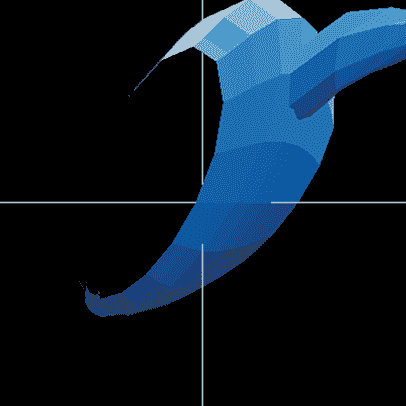

图 4.35 在这个旋转、倾斜的配置中，我们看到茶壶没有底部！

这里的要点是，二维线性变换 *T* 完全由 *T*(***e***[1]) 和 *T*(***e***[2]) 的值定义；总共是两个向量或四个数字。同样，三维线性变换 *T* 完全由 *T*(***e***[1])、*T*(***e***[2]) 和 *T*(***e***[3]) 的值定义，总共是三个向量或九个数字。在任何数量的维度中，线性变换的行为由向量列表或数字的数组-数组指定。这种数组-数组称为 *矩阵*，我们将在下一章中看到如何使用矩阵。

### 4.2.5 练习

| **练习 4.10**: 再次考虑 *S*，即平方所有坐标的向量变换，通过代数证明对于所有选择的标量 *s* 和 2D 向量 ***v***，*S*(*s**v***) = *sS*(*v*) 不成立。***解答***：设 ***v*** = (*x*, *y*)。那么 *s* *v* = (*sx*, *sy*)，且 *S*(*s**v***) = (*s*² *x*², *s*² *y*²) = *s*² · (*x*², *y*²) = *s*² · *S*(***v***)。对于大多数 *s* 值和大多数向量 ***v***，*S*(*s**v***) = *s*² · *S*(*v*) 不会等于 *s* · *S*(***v***)。一个具体的反例是 *s* = 2 和 ***v*** = (1, 1, 1)，其中 *S*(*s**v***) = (4, 4, 4) 而 *s* · *S*(***v***) = (2, 2, 2)。这个反例表明 *S* 不是线性的。 |
| --- |
| **练习 4.11**: 假设 *T* 是一个向量变换，且 *T*(**0**) ≠ 0，其中 **0** 代表所有坐标都等于零的向量。为什么根据定义，*T* 不是线性的？***解答***：对于任何向量 ***v***，***v*** + **0** = ***v***。为了保持向量加法，*T* 应该满足 *T*(*v* + **0**) = *T*(*v*) + *T*(0)。因为 *T*(*v* + **0**) = *T*(*v*)，这要求 *T*(*v*) = *T*(*v*) + *T*(**0**) 或 **0** = *T*(**0**)。鉴于这种情况并不成立，*T* 不能是线性的。 |
| **练习 4.12**: **恒等变换**是返回相同向量的向量变换。它用大写 *I* 表示，因此我们可以将其定义写为 *I*(***v***) = ***v*** 对于所有向量 ***v***。解释为什么 *I* 是一个线性变换。***解答***：对于任何向量 ***v*** 和 ***w***，*I*(v + w) = *v* + *w* = *I*(*v*) + *I*(*w*)，对于任何标量 *s*，*I*(*s**v***) = *s* *v* = *s* · *I*(*v*)。这些等式表明恒等变换保持了向量加法和标量乘法。 |
| **练习 4.13**: (5, 3) 和 (−2, 1) 之间的中点是什么？绘制这三个点以验证你的答案。***解答***：中点是 ½ (5, 3) + ½ (−2, 1) 或 (5/2, 3/2) + (−1, ½)，等于 (3/2, 2)。这在以下按比例绘制的图中可以验证：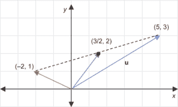连接 (5, 3) 和 (−2, 1) 的线段的中点是 (3/2, 2)。 |
| **练习 4.14**: 再次考虑非线性变换 *S*(***v***)，它将 ***v*** = (*x*, *y*) 映射到 (*x², y²)。使用第二章中的绘图代码，将所有坐标为 0 到 5 的 36 个向量 **v** 作为点绘制出来，然后为每个点绘制 S(**v**)。在 S 的作用下，向量在几何上会发生什么变化？***解答***：最初点之间的空间是均匀的，但在变换后的图像中，随着 *x* 和 *y* 坐标的增加，水平方向和垂直方向上的间距分别增加。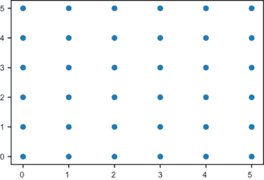 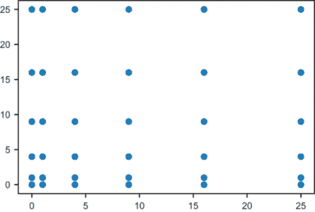 点的网格最初是均匀分布的，但在应用变换 S 之后，点之间的间距发生变化，甚至在同一直线上也是如此。 |
| **练习 4.15-迷你项目**: *基于属性的测试*是一种单元测试，它涉及为程序发明任意输入数据，然后检查输出是否满足期望条件。有像 Hypothesis（通过 pip 可用）这样的流行 Python 库，可以轻松设置此功能。使用您选择的库，实现基于属性的测试，检查向量变换是否线性。具体来说，给定一个作为 Python 函数实现的向量变换 *T*，生成大量随机向量的成对，并断言所有这些向量在 *T* 下都保持其和。然后，对标量和向量的成对做同样的事情，并确保 *T* 保持标量倍数。你应该会发现像 `rotate_x_by(pi/2)` 这样的线性变换可以通过测试，但像坐标平方变换这样的非线性变换则不能通过。 |
| **练习 4.16**: 一个 2D 向量变换是沿 *x* 轴的 *反射*。这种变换将一个向量转换成另一个向量，它是相对于 x 轴的镜像。它的 *x* 坐标应该保持不变，而它的 *y* 坐标应该改变其符号。表示这个变换为 *S[x]*，下面是一个向量 ***v*** = (3, 2) 和变换后的向量 *S[x]*(*v*) 的图像。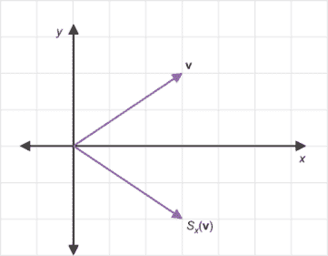向量 *v* = (3, 2) 和它在 x 轴上的反射 (3, −2)画两个向量及其和，以及这三个向量的反射，以证明这个变换保持向量加法。再画一个图，以类似的方式展示标量乘法也得到保持，从而证明线性性的两个标准。 |
| **解答**: 下面是一个关于 x 轴反射保持向量和的例子！[](../Images/CH04_F35_Orland_UN09.png)对于 *z* + *v* = *w* 如所示，x 轴反射保持和；也就是说，*S[x]*(*u*) + *S[x]*(*v*) = *S[x]*(*w*)。下面是一个显示反射保持标量倍的例子：*S[x]*(*s**v***)位于预期 *sS[x]*(*v*) 应该出现的位置。为了 *证明* *S[x]* 是线性的，你需要展示你可以为每个向量之和和每个标量倍数绘制类似的图像。这些有无限多个，所以最好使用代数证明。（你能想出如何代数地展示这两个事实吗？）！[](../Images/CH04_F35_Orland_UN10.png)x 轴反射保持这个标量倍数。 |
| **练习 4.17-迷你项目**：假设*S*和*T*都是线性变换。解释为什么*S*和*T*的复合也是线性的。**解答**：如果对于任何向量之和***u*** + ***v*** = ***w***，我们有*S*(*T*(*u*)) + *S*(*T*(*v*)) = *S*(*T*(*w*))，并且对于任何标量乘积*s* *v*，我们有*S*(*T*(*s**v***)) = *s* · *S*(*T*(*v*))，那么复合*S*(*T*(*v*))是线性的。这是一个必须满足的定义的陈述。现在让我们看看为什么它是正确的。首先假设对于任何给定的输入向量***u***和***v***，***u*** + ***v*** = ***w***。那么根据*T*的线性，我们也知道*T*(*u*) + *T*(*v*) = *T*(*w*)。因为这个和成立，*S*的线性告诉我们这个和在*S*下得到保留：*S*(*T*(*u*)) + *S*(*T*(*v*)) = *S*(*T*(*w*))。这意味着*S*(*T*(*v*))保留了向量之和。同样，对于任何标量乘积*s* *v*，*T*的线性告诉我们*s* · *T*(*v*) = *T*(*s**v***)。根据*S*的线性，*s* · *S*(*T*(*v*)) = *S*(*T*(*s**v***))同样成立。这意味着*S*(*T*(*v*))保留了标量乘法，因此*S*(*T*(*v*))满足之前所述的线性定义的完整定义。我们可以得出结论，两个线性变换的复合是线性的。 |
| **练习 4.18**：设*T*是由 Python 函数`rotate_x_by(pi/2)`执行的线性变换，*T*(***e***[1])，*T*(***e***[2])和*T*(***e***[3])是什么？**解答**：任何绕轴的旋转都不会影响轴上的点，因此因为*T*(***e***[1])位于 x 轴上，所以*T*(***e***[1]) = ***e***[1] = (1, 0, 0)。在*y*，*z*平面内逆时针旋转***e***[2] = (0, 1, 0)将这个向量从正*y*方向的一个单位点旋转到正*z*方向的一个单位点，所以*T*(***e***[2]) = ***e***[3] = (0, 0, 1)。同样，***e***[3]从正*z*方向逆时针旋转到负*y*方向。*T*(***e***[3])在这个方向上的长度仍然为 1，所以它是-***e***[2]或(0, −1, 0)。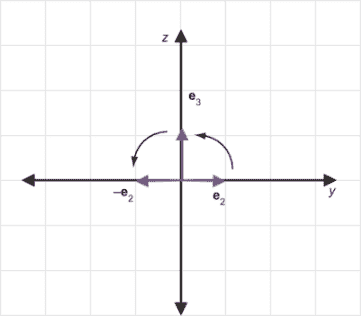在 y,z 平面内逆时针旋转 90 度将*e*[2]发送到*e*[3]，将*e*[3]发送到- *e*[2]。 |

| **练习 4.19**：编写一个`linear_combination(scalars, *vectors)`函数，它接受一个标量列表和相同数量的向量，并返回一个单个向量。例如，`linear_combination([1,2,3], (1,0,0), (0,1,0), (0,0, 1))`应该返回 1 · (1, 0, 0) + 2 · (0, 1, 0) + 3 · (0, 0, 1)或(1, 2, 3)。**解答**：

```
from vectors import *
def linear_combination(scalars,*vectors):
    scaled = [scale(s,v) for s,v in zip(scalars,vectors)]
    return add(*scaled)
```

我们可以确认这给出了之前描述的预期结果：

```
>>> linear_combination([1,2,3], (1,0,0), (0,1,0), (0,0,1))
(1, 2, 3)
```

|

| **练习 4.20**：编写一个函数`transform_standard_basis(transform)`，它接受一个 3D 向量变换作为输入，并输出它对标准基的影响。它应该输出一个包含 3 个向量的元组，这些向量分别是`transform`作用于***e***[1]，***e***[2]和***e***[3]的结果。**解答**：正如建议的那样，我们只需要将`transform`应用于每个标准基向量：

```
def transform_standard_basis(transform):
    return transform((1,0,0)), transform((0,1,0)), transform((0,0,1))
```

它在浮点误差范围内确认了我们之前练习中的解决方案，其中我们寻求`rotate_x_by(pi/2)`的输出：

```
>>> from math import *
>>> transform_standard_basis(rotate_x_by(pi/2))
((1, 0.0, 0.0), (0, 6.123233995736766e−17, 1.0), (0, −1.0,
    1.2246467991473532e−16))
```

这些向量大约是（1, 0, 0），（0, 0, 1），和（0, −1, 0）。|

| **练习 4.21**：假设 *B* 是一个线性变换，其中 *B*(***e***[1]) = (0, 0, 1)，*B*(***e***[2]) = (2, 1, 0)，*B*(***e***[3]) = (−1, 0, −1)，并且 ***v*** = (−1, 1, 2)。*B*(***v***)是什么？**解答**：因为 ***v*** = (−1, 1, 2) = -***e***[1] + ***e***[2] + 2***e***[3]，所以 *B*(***v***) = *B*(−***e***[1] + ***e***[2] + 2***e***[3])。因为 *B* 是线性的，它保持这种线性组合：*B*(***v***) = − *B*(***e***[1]) + *B*(***e***[2]) + 2 · *B*(***e***[3])。现在我们有了所有需要的信息：*B*(***v***) = −(0, 0, 1) + (2, 1, 0) + 2 · (−1, 0, −1) = (0, 1, −3)。 |
| --- |
| **练习 4.22**：假设 *a* 和 *B* 都是线性变换，其中 *a*(***e***[1]) = (1, 1, 1)，*a*(***e***[2]) = (1, 0, −1)，*a*(***e***[3]) = (0, 1, 1)，和 *B*(***e***[1]) = (0, 0, 1)，*B*(***e***[2]) = (2, 1, 0)，*B*(***e***[3]) = (−1, 0, −1)。*a*(*B*(***e***[1])), *a*(*B*(***e***[2])), 和 *a*(*B*(***e***[3]))是什么？**解答**：*a*(*B*(***e***[1]))是*a*应用于*B*(***e***[1]) = (0, 0, 1) = ***e***[3]。我们已知*a*(***e***[3]) = (0, 1, 1)，所以*B*(*a*(***e***[1])) = (0, 1, 1)。*a*(*B*(***e***[2]))是*a*应用于*B*(***e***[2]) = (2, 1, 0)。这是*a*(***e***[1]), *a*(***e***[2]), 和 *a*(***e***[3])的线性组合，标量是(2, 1, 0)：2 · (1, 1, 1) + 1 · (1, 0, −1) + 0 · (0, 1, 1) = (3, 2, 1)。最后，*a*(*B*(***e***[3]))是*a*应用于*B*(***e***[3]) = (−1, 0, −1)。这是线性组合−1 · (1, 1, 1) + 0 · (1, 0, −1) + −1 · (0, 1, 1) = (−1, −2, −2)。注意，现在我们知道了*a*和*B*对所有标准基向量的组合结果，因此我们可以计算*a*(*B*(***v***))对于任何向量***v***。 |

线性变换因为所需数据很少，所以既表现良好又易于计算。我们将在下一章中更深入地探讨这一点，届时我们将使用**矩阵**符号来计算线性变换。

## 摘要

+   向量变换是接受向量作为输入并返回向量作为输出的函数。向量变换可以作用于 2D 或 3D 向量。

+   要对模型进行几何变换，将向量变换应用于 3D 模型中每个多边形的每个顶点。

+   你可以通过函数的组合来组合现有的向量变换，以创建新的变换，这些变换相当于依次应用现有的向量变换。

+   函数式编程是一种强调函数组合和操作的编程范式。

+   柯里化（currying）的功能操作将接受多个参数的函数转换为一个接受一个参数并返回一个新函数的函数。柯里化允许你将现有的 Python 函数（如`scale`和`add`）转换为向量变换。

+   线性变换是向量变换，它们保持向量之和和标量乘积。特别是，在应用线性变换后，位于线段上的点仍然位于线段上。

+   线性组合是标量乘法和向量加法最一般的组合。每一个三维向量都是三维标准基向量的线性组合，这些标准基向量表示为***e***[1] = (1, 0, 0)，***e***[2] = (0, 1, 0)，和***e***[3] = (0, 0, 1)。同样，每一个二维向量都是二维标准基向量的线性组合，这些标准基向量表示为***e***[1] = (1, 0)和***e***[2] = (0, 1)。

+   一旦你知道一个给定的线性变换如何作用于标准基向量，你就可以通过将向量表示为标准基的线性组合，并利用线性组合的性质来决定它对任何向量如何作用。

    +   在三维空间中，三个向量或九个总数可以指定一个线性变换。

    +   在二维空间中，两个向量或四个总数执行相同的操作。

    最后这一点至关重要：线性变换因为只需要很少的数据就能被指定，所以它们既表现良好又易于计算。
