# 5 使用矩阵计算变换

本章涵盖了

+   将线性变换写成矩阵

+   通过矩阵相乘来组合和应用线性变换

+   使用线性变换对不同维度的向量进行操作

+   使用矩阵在 2D 或 3D 中平移向量

在第四章的总结中，我提出了一个重要观点：*任何*三维线性变换都可以仅用三个向量或总共九个数字来指定。通过正确选择这九个数字，我们可以实现绕任意轴旋转任意角度，沿任意平面反射，在任意平面上投影，沿任意方向按任意因子缩放，或任何其他三维线性变换。

表达为“绕 z 轴逆时针旋转 90°的旋转”的变换可以等价地描述为它对标准基向量***e***[1] = (1, 0, 0)，***e***[2] = (0, 1, 0)，和***e***[3] = (0, 0, 1)的作用。具体来说，结果是(0, 1, 0)，(−1, 0, 0)，和(0, 0, 1)。无论我们是从几何角度还是通过这三个向量（或九个数字）来考虑这个变换，我们都是在思考同一个想象中的机器（图 5.1）对 3D 向量进行操作。实现可能不同，但机器仍然产生不可区分的结果。

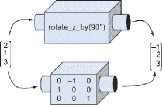

图 5.1：执行相同线性变换的两个机器。顶部的机器通过几何推理工作，而底部的机器通过九个数字工作。

当这些描述如何执行线性变换的数字适当地排列成网格时，这些数字被称为*矩阵*。本章的重点是使用这些数字网格作为计算工具，因此本章比前几章有更多的数字计算。不要被这吓倒！归根结底，我们还是在执行向量变换。

矩阵让我们能够通过该变换对标准基向量的作用来计算给定的线性变换。本章中所有的符号都是为了组织这个过程，我们在 4.2 节中已经讨论了这一点，而不是为了引入任何不熟悉的概念。我知道学习新的复杂符号可能会感到痛苦，但我保证，这会得到回报。我们最好能够将向量视为几何对象或数字元组。同样，我们将通过将线性变换视为数字矩阵来扩展我们的心理模型。

## 5.1 使用矩阵表示线性变换

让我们回到一个具体的例子，这个例子指定了 3D 线性变换的九个数字。假设*a*是一个线性变换，并且我们知道*a*(***e***[1]) = (1, 1, 1)，*a*(***e***[2]) = (1, 0, −1)，和*a*(***e***[3]) = (0, 1, 1)。这三个向量总共包含九个分量，包含了指定线性变换*a*所需的所有信息。

由于我们反复使用这个概念，它需要一个特殊的符号。我们将采用一种新的符号，称为 *矩阵符号*，来处理这些九个数字作为 *a* 的表示。

### 5.1.1 将向量和线性变换表示为矩阵

矩阵是数字的矩形网格，它们的形状告诉我们如何解释它们。例如，我们可以将只有一个数字列的矩阵解释为一个向量，其条目是坐标，从上到下排序。在这种形式中，向量被称为 *列向量*。例如，三维标准基可以写成如下三个列向量：

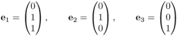

对于我们的目的，这个符号意味着与 ***e***[1] = (1, 0, 0), ***e***[2] = (0, 1, 0), 和 ***e***[3] = (0, 0, 1) 相同的意思。我们也可以用这个符号来表示 *a* 如何变换标准基向量：

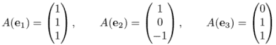

表示线性变换 *a* 的矩阵是一个由这些向量并排挤压而成的 3×3 网格：

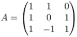

在二维中，一个列向量包含两个条目，因此两个变换后的向量总共包含 4 个条目。我们可以看看线性变换 *D* 如何通过 2 的倍数缩放输入向量。首先，我们写出它在基向量上的作用方式：

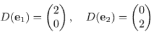

然后通过将这些列并排放置，我们得到 *D* 的矩阵：

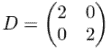

矩阵可以有不同的形状和大小，但我们现在将专注于这两种形状：表示向量的单列矩阵和表示线性变换的方阵。

记住，这里没有新的概念，只是从第 4.2 节的核心思想的新写法：线性变换由其在标准基向量上的作用结果定义。从线性变换得到矩阵的方法是找到它从所有标准基向量产生的向量，并将结果并排组合。现在，我们将看看相反的问题：如何根据其矩阵评估一个线性变换。

### 5.1.2 矩阵与向量的乘法

如果一个线性变换 *B* 被表示为一个矩阵，并且一个向量 ***v*** 也被表示为一个矩阵（一个列向量），我们就有了评估 *B*(***v***) 所需的所有数字。例如，如果 *B* 和 ***v*** 由以下给出

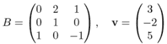

那么，向量 *B*(***e***[1])，*B*(***e***[2])，和 *B*(***e***[3]) 可以从 *B* 的矩阵中读出，作为其列。从那个点开始，我们使用之前相同的过程。因为 ***v*** = 3***e***[1] − 2***e***[2] + 5***e***[3]，所以 *B*(***v***) = 3 *B*(***e***[1]) − 2 *B*(***e***[2]) + 5 *B*(***e***[3])。展开这个，我们得到

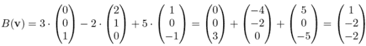

结果是向量 (1, −2, −2)。将一个方阵视为作用于列向量的函数是矩阵乘法的一个特殊情况。同样，这会影响我们的符号和术语，但我们只是在做同样的事情：对一个向量应用线性变换。写成矩阵乘法的形式，它看起来像这样：

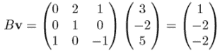

与乘以数字不同，当你用矩阵乘以向量时，顺序很重要。在这种情况下，*B* ***v*** 是一个有效的乘积，但 ***v*** *B* 不是。简而言之，我们很快就会看到如何乘以各种形状的矩阵，以及矩阵乘法的顺序的一般规则。现在，请相信我，认为这个乘法是有效的，因为它意味着对一个 3D 向量应用 3D 线性算子。

我们可以编写 Python 代码来将矩阵与向量相乘。假设我们像往常一样将矩阵 *B* 编码为元组元组，将向量 ***v*** 编码为元组：

```
 *B* = (
    (0,2,1),
    (0,1,0),
    (1,0,−1)
)

v = (3,−2,5)
```

这与我们对矩阵 *B* 的原始想法有点不同。我们最初是通过组合三列来创建它的，但在这里 *B* 是作为一个行序列创建的。将矩阵定义为 Python 中的行元组的好处是数字的排列顺序与我们写在纸上的顺序相同。然而，我们可以通过使用 Python 的 `zip` 函数（在附录 B 中介绍）在任何时候获取列：

```
>>> list(zip(*B))
[(0, 0, 1), (2, 1, 0), (1, 0, −1)]
```

这个列表的第一个元素是 (0, 0, 1)，它是 *B* 的第一列，以此类推。我们想要的是这些向量的线性组合，其中标量是 ***v*** 的坐标。为了得到这个结果，我们可以使用第 4.2.5 节练习中的 `linear_combination` 函数。`linear_combination` 的第一个参数应该是 ***v***，它作为标量的列表，后续参数应该是 *B* 的列。下面是这个完整的函数：

```
def multiply_matrix_vector(matrix, vector):
    return linear_combination(vector, *zip(*matrix))
```

它确认了我们用 *B* 和 ***v*** 手动做的计算：

```
>>> multiply_matrix_vector(B,v)
(1, −2, −2)
```

有两种其他记忆法来乘以矩阵和向量，它们都给出相同的结果。为了看到这些，让我们写一个典型的矩阵乘法：


这个计算的结果是矩阵列与坐标 *x*、*y* 和 *z* 作为标量的线性组合：

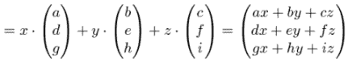

这是 3×3 矩阵与 3D 向量的乘积的显式公式。你可以为 2D 向量写一个类似的公式：

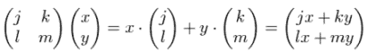

第一个记忆法是输出向量的每个坐标都是输入向量所有坐标的函数。例如，3D 输出向量的第一个坐标是函数 *f*(*x*, *y*, *z*) = *ax* + *by* + *cz*。此外，这是一个*线性函数*（在高中代数中你用这个词的意思）；它是每个变量的数乘之和。我们最初引入“线性变换”这个术语是因为线性变换保持直线。使用这个术语的另一个原因是：线性变换是输入坐标上的线性*函数*的集合，这些函数给出了相应的输出坐标。

第二个记忆法以不同的方式呈现了相同的公式：输出向量的坐标是矩阵的行与目标向量的点积。例如，3x3 矩阵的第一行是(*a*, *b*, *c*)，乘积向量是(*x*, *y*, *z*)，所以输出向量的第一个坐标是(*a*, *b*, *c*) · (*x*, *y*, *z*) = *ax* + *by* + *cz*。我们可以结合我们的两种表示法，用公式表达这个事实：

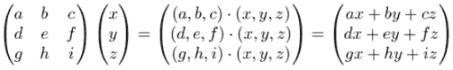

如果你因为看着数组中的这么多字母和数字而眼睛开始发花，不要担心。一开始，这种表示法可能会让人感到不知所措，并且需要一些时间才能将其与你的直觉联系起来。本章中有更多矩阵的例子，下一章提供了更多的复习和实践。

### 5.1.3 通过矩阵乘法组合线性变换

我们迄今为止看到的线性变换的一些例子包括旋转、反射、缩放以及其他几何变换。更重要的是，任何数量的线性变换串联在一起都会给我们一个新的线性变换。在数学术语中，任何数量的线性变换的*组合*也是一个线性变换。

因为任何线性变换都可以用一个矩阵来表示，所以任何两个组合的线性变换也可以。实际上，如果你想组合线性变换来构建新的变换，矩阵是完成这项工作的最佳工具。

注意：让我暂时摘下数学家的帽子，戴上程序员的帽子。假设你想计算对向量进行 1,000 次组合线性变换的结果。如果你在动画中通过在动画的每一帧中应用额外的、小的变换来动画化一个对象，这种情况可能会发生。在 Python 中，应用 1,000 个连续函数的计算成本很高，因为每个函数调用都有计算开销。然而，如果你找到一个表示 1,000 个线性变换组合的矩阵，你就可以将整个过程简化为少量数字和少量计算。

让我们看看两个线性变换的组合：*a*(*B*(***v***))，其中*a*和*B*的矩阵表示是已知的：

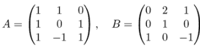

下面是逐步组合的过程。首先，将变换 *B* 应用到 ***v*** 上，得到一个新的向量 *B*(***v***)，或者如果我们写作乘法，就是 *B* ***v***。其次，这个向量成为变换 *a* 的输入，得到最终的 3D 向量作为结果：*a*(*B* ***v***)。再次，我们将括号省略，并将 *a*(*B* ***v***) 写作乘积 *AB* ***v***。将这个乘积展开为 ***v*** = (*x*, *y*, *z*) 给出如下公式：


如果我们从右到左正确操作，我们知道如何评估这个。现在我要声称，我们也可以从左到右操作并得到相同的结果。具体来说，我们可以给乘积矩阵 *AB* 赋予意义；它将是一个新的矩阵（待发现），表示线性变换 *a* 和 *B* 的组合：

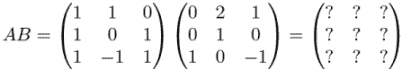

现在，这个新矩阵的元素应该是什么？它的目的是表示变换 *a* 和 *B* 的组合，这给我们一个新的线性变换，*AB*。正如我们所见，矩阵的列是将其变换应用于标准基向量得到的结果。矩阵 *AB* 的列是应用变换 *AB* 到 ***e***[1]、***e***[2] 和 ***e***[3] 的结果。

因此，*AB* 的列是 *AB*(***e***[1])、*AB*(***e***[2]) 和 *AB*(***e***[3])。以第一列为例，它应该是 *AB*(***e***[1]) 或者 *a* 应用到向量 *B*(***e***[1])。换句话说，要得到 *AB* 的第一列，我们需要将一个矩阵乘以一个向量，这是我们已经练习过的操作：

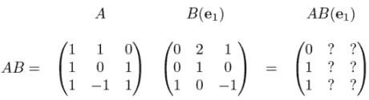

同样，我们发现 *AB*(***e***[2]) = (3, 2, 1) 和 *AB*(***e***[3]) = (1, 0, 0)，这是 *AB* 的第二列和第三列：


这就是我们进行矩阵乘法的方式。你可以看到，除了仔细组合线性算子之外，没有其他的事情要做。同样，你也可以使用助记符而不是每次都通过推理来完成这个过程。因为将一个 3x3 矩阵与一个列向量相乘相当于做三个点积，将两个 3x3 矩阵相乘相当于做九个点积——即第一矩阵的行与第二矩阵的列之间所有可能的点积，如图 5.2 所示。

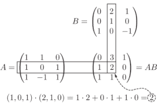

图 5.2 乘积矩阵的每个元素是第一矩阵的行与第二矩阵的列之间的点积。

我们所说的关于 3x3 矩阵乘法的一切也适用于 2x2 矩阵。例如，要找到这些 2x2 矩阵的乘积

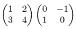

我们可以将第一个矩阵的行与第二个矩阵的列进行点积。第一个矩阵的第一行与第二个矩阵的第一列的点积是 (1, 2) · (0, 1) = 2。这告诉我们结果矩阵的第一行和第一列的元素是 2：

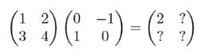

重复此过程，我们可以找到乘积矩阵的所有元素：

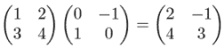

你可以做一些矩阵乘法的练习来熟悉它，但很快你就会更喜欢让计算机为你做这项工作。让我们在 Python 中实现矩阵乘法，以便使其成为可能。

### 5.1.4 实现矩阵乘法

我们可以以几种方式编写我们的矩阵乘法函数，但我更喜欢使用点积技巧。因为矩阵乘法的结果应该是一个元组的元组，我们可以将其写为一个嵌套的列表推导式。它也接受两个嵌套的元组，称为 `a` 和 `b`，代表我们的输入矩阵 *a* 和 *B*。输入矩阵 `a` 已经是第一个矩阵行的元组，我们可以用 `zip(*b)` 将它们配对，`zip(*b)` 是第二个矩阵列的元组。最后，对于每一对，我们应该计算点积并在内部推导式中产生它。以下是实现方式：

```
from vectors import *

def matrix_multiply(a,b):
    return tuple(
        tuple(dot(row,col) for col in zip(*b))
        for row in a
    )
```

外部推导式构建结果矩阵的行，内部推导式构建每一行的元素。因为输出行是由与 `a` 的行进行的各种点积形成的，所以外部推导式遍历 `a`。

我们的 `matrix_multiply` 函数没有硬编码的维度。这意味着我们可以使用它来执行前面 2D 和 3D 示例中的矩阵乘法：

```
>>> xa = ((1,1,0),(1,0,1),(1,−1,1))
>>> b = ((0,2,1),(0,1,0),(1,0,−1))
>>> matrix_multiply(a,b)
((0, 3, 1), (1, 2, 0), (1, 1, 0))
>>> xc = ((1,2),(3,4))
>>> d = ((0,−1),(1,0))
>>> matrix_multiply(c,d)
((2, −1), (4, −3))
```

配备了矩阵乘法的计算工具，我们现在可以对我们的 3D 图形进行一些简单的操作。

### 5.1.5 使用矩阵变换进行 3D 动画

要动画化一个 3D 模型，我们需要在每一帧中重新绘制原始模型的变换版本。为了让模型看起来随时间移动或改变，我们需要使用不同的变换。如果这些变换是由矩阵指定的线性变换，那么我们需要为动画的每一帧提供一个新矩阵。

因为 PyGame 的内置时钟跟踪时间（以毫秒为单位），我们可以做的一件事是生成其元素依赖于时间的矩阵。换句话说，我们不是将矩阵的每个元素视为一个数字，而是将其视为一个函数，该函数接受当前时间 *t* 并返回一个数字（图 5.3）。

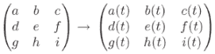

图 5.3 将矩阵元素视为时间的函数允许整体矩阵随时间变化。

例如，我们可以使用以下九个表达式：

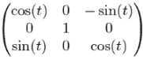

正如我们在第二章中提到的，余弦和正弦都是接受一个数字并返回另一个数字作为结果的函数。其他五个条目恰好随时间不变，但如果你追求一致性，可以将这些视为常数函数（如在中心条目中的 *f*(*t*) = 1）。给定任何 *t* 的值，这个矩阵表示与 `rotate_y_by(*t*)` 相同的线性变换。时间向前推进，*t* 的值增加，因此如果我们将这个矩阵变换应用于每个帧，我们每次都会得到更大的旋转。

让我们给 `draw_model` 函数（在第 C 附录中介绍并在第四章中广泛使用）一个 `get_matrix` 关键字参数，其中传递给 `get_matrix` 的值是一个函数，该函数接受毫秒数作为时间并返回在该时间应应用的变换矩阵。在源代码文件 animate_teapot.py 中，我这样调用它来动画化第四章中的旋转茶壶：

```
from teapot import load_triangles
from draw_model import draw_model
from math import sin,cos

def get_rotation_matrix(t):                   ❶
    seconds = t/1000                          ❷
    return (
        (cos(seconds),0,−sin(seconds)),
        (0,1,0),
        (sin(seconds),0,cos(seconds))
    )
draw_model(load_triangles(), 
           get_matrix=get_rotation_matrix)    ❸
```

❶ 为任何表示时间的数值输入生成一个新的变换矩阵

❷ 将时间转换为秒，以便变换不会发生得太快

❸ 将函数作为关键字参数传递给 draw_model

现在，`draw_model` 被传递了随时间变换底层茶壶模型所需的数据，但我们需要在函数的主体中使用它。在遍历茶壶面之前，我们执行适当的矩阵变换：

```
def draw_model(faces, color_map=blues, light=(1,2,3),
               camera=Camera("default_camera",[]),
               glRotatefArgs=None,
               get_matrix=None):
        #...                                                ❶
        def do_matrix_transform(*v*):                         ❷
            if get_matrix:                                  ❸
               m = get_matrix(pygame.time.get_ticks())
               return multiply_matrix_vector(m, v)
            else:
               return *v*                                      ❹
        transformed_faces = polygon_map(do_matrix_transform, 
                                        faces)              ❺
        for face in transformed_faces:
        #...                                                ❻
```

❶ 函数主体的大部分保持不变，因此我们在这里不打印它。

❷ 在主 while 循环内部创建一个新的函数，用于应用此帧的矩阵

❸ 使用 pygame.time.get_ticks() 提供的经过毫秒数以及提供的 get_matrix 函数来计算此帧的矩阵

❹ 如果未指定 get_matrix，则不执行任何变换，并返回未改变的向量

❺ 使用 polygon_map 对每个多边形应用该函数

❻ draw_model 的其余部分与附录 C 中描述的相同

通过这些更改，你可以运行代码并看到茶壶旋转（图 5.4）。

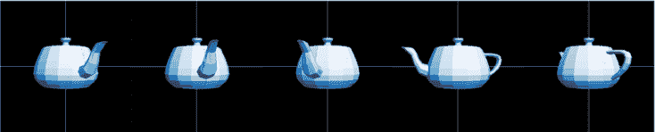

图 5.4 茶壶在每个帧中通过一个新的矩阵进行变换，这取决于绘制帧时的经过时间

希望通过前面的示例，我已经说服你矩阵完全可以与线性变换互换。我们已经成功地将茶壶进行了变换和动画化，仅使用九个数字来指定每个变换。你可以在下面的练习中进一步练习你的矩阵技能，然后我会向你展示从我们已实现的 `matrix_multiply` 函数中还有更多可以学习的内容。

### 5.1.6 练习

| **练习 5.1**: 编写一个函数 `infer_matrix(n, transformation)`，它接受一个维度（如 2 或 3）和一个向量变换函数，该函数假设为线性变换。它应该返回一个 *n* × *n* 的方阵（一个由 *n* 个 *n* 元组组成的元组，这是表示线性变换的矩阵）。当然，只有当输入变换是线性的时，输出才有意义！否则，它代表一个完全不同的函数！**解答**：

```
def infer_matrix(n, transformation):
    def standard_basis_vector(i):
        return tuple(1 if i==j else 0 for j in range(1,n+1))         ❶
    standard_basis = [standard_basis_vector(i) for i in range(1,n+1)]❷
    cols = [transformation(*v*) for *v*  in standard_basis]               ❸
    return tuple(zip(*cols))                                         ❹
```

❶ 创建第 i 个标准基向量，它是一个包含一个在 i 坐标上的 1 和其他所有坐标上的 0 的元组❷ 创建标准基，它是 n 个向量的列表❸ 定义矩阵的列是应用相应的线性变换到标准基向量得到的结果❹ 重新排列矩阵，使其成为行的元组而不是列的列表，遵循我们的约定我们可以在像 `rotate_z_by(pi/2)` 这样的线性变换上测试它：

```
>>> from transforms import rotate_z_by
>>> from math import pi
>>> infer_matrix(3,rotate_z_by(pi/2))
((6.123233995736766e−17, −1.0, 0.0), (1.0, 1.2246467991473532e−16, 0.0), (0, 0, 1))
```

|

| **练习 5.2**: 以下 2 × 2 矩阵与 2D 向量相乘的结果是什么？！[](../Images/CH05_F04_Orland_EQ22.png)**解答**：向量与矩阵第一行的点积是 −2.5 · 1.3 + 0.3 · -0.7 = −3.46。向量与矩阵第二行的点积是 −2.5 · 6.5 + 0.3 · 3.2 = −15.29。这些是输出向量的坐标，所以结果是：！[](../Images/CH05_F04_Orland_EQ23.png) |
| --- |

| **练习 5.3-迷你项目**：编写一个 `random_matrix` 函数，该函数生成具有指定大小和随机整数元素的矩阵。使用该函数生成五对 3 × 3 矩阵。手动（为了练习）将每对矩阵相乘，然后使用 `matrix_multiply` 函数检查你的工作。**解答**：首先，我们给 `random_matrix` 函数提供参数来指定行数、列数以及元素的最小值和最大值：

```
from random import randint
def random_matrix(rows,cols,min=−2,max=2):
    return tuple(
        tuple(
        randint(min,max) for j in range(0,cols))
        for i in range(0,rows)
    )
```

接下来，我们可以生成一个随机的 3 × 3 矩阵，其元素介于 0 和 10 之间，如下所示：

```
>>> random_matrix(3,3,0,10)
((3, 4, 9), (7, 10, 2), (0, 7, 4))
```

|

| **练习 5.4**: 对于上一个练习中的每一对矩阵，以相反的顺序相乘。你得到相同的结果吗？**解答**：除非你非常幸运，否则你的结果都会不同。大多数矩阵对在以不同的顺序相乘时都会得到不同的结果。在数学术语中，我们说一个操作是 *交换律*，如果它无论输入顺序如何都会得到相同的结果。例如，乘法是一个交换律操作，因为对于任何选择的数字 *x* 和 *y*，*xy* = *yx*。然而，矩阵乘法 *不是* 交换律的，因为对于两个方阵 *a* 和 *B*，*AB* 不一定等于 *BA*。 |
| --- |
| **练习 5.5**：在二维或三维中，有一个既无聊又重要的向量变换，称为**单位变换**，它接受一个向量并返回相同的向量作为输出。这种变换是线性的，因为它接受任何输入向量的和、标量乘积或线性组合，并返回相同的结果。二维和三维中代表单位变换的矩阵分别是什么？ |
| **解答**：在二维或三维中，单位变换作用于标准基向量，并保持它们不变。因此，在任意维度中，这个变换的矩阵有标准基向量作为其列。在二维和三维中，这些**单位矩阵**分别表示为*I*[2]和*I*[3]，它们的形状如下：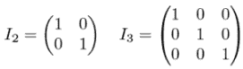 |

| **练习 5.6**：将矩阵`((2,1,1),(1,2,1),(1,1,2))`应用于定义茶壶的所有向量。茶壶会发生什么变化？为什么？**解答**：以下函数包含在源文件 matrix_transform_teapot.py 中：

```
def transform(*v*):
    m = ((2,1,1),(1,2,1),(1,1,2))
    return multiply_matrix_vector(m,v)
draw_model(polygon_map(transform, load_triangles()))
```

运行代码，我们看到茶壶的前部被拉伸到*x*、*y*和*z*都为正的区域！[](../Images/CH05_F04_Orland_UN01.png)将给定的矩阵应用于茶壶的所有顶点这是因为在所有标准基向量都被变换为具有正坐标的向量：分别是(2, 1, 1)，(1, 2, 1)，和(1, 1, 2)。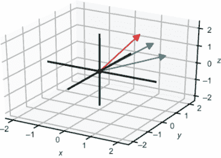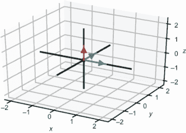由这个矩阵定义的线性变换如何影响标准基向量。这些新向量与正标量的线性组合在+*x*、+*y*和+*z*方向上比标准基向量的相同线性组合拉伸得更远。 |

| **练习 5.7**：通过使用两个嵌套列表推导式以不同的方式实现`multiply_matrix_vector`，一个遍历矩阵的行，另一个遍历每行的条目。**解答**：

```
def multiply_matrix_vector(matrix,vector):
    return tuple(
        sum(vector_entry * matrix_entry
            for vector_entry, matrix_entry in zip(row,vector))
        for row in matrix
    )
```

|

| **练习 5.8**：利用输出坐标是输入矩阵行与输入向量点积的事实，以另一种方式实现`multiply_matrix_vector`。**解答**：这是先前练习解答的简化版本：

```
def multiply_matrix_vector(matrix,vector):
    return tuple(
        dot(row,vector)
        for row in matrix
    )
```

|

| **练习 5.9-迷你项目**：我首先向你介绍了线性变换的概念，然后展示了任何线性变换都可以用矩阵来表示。现在我们来证明相反的事实：所有矩阵都表示线性变换。从乘以 2x2 矩阵的 2D 向量或乘以 3x3 矩阵的 3D 向量的显式公式开始，从代数上证明。也就是说，要证明矩阵乘法保持和以及标量乘积。**解答**：我将展示 2D 的证明；3D 的证明结构相同，但需要更多的文字。假设我们有一个名为 *a* 的 2x2 矩阵，其元素为任意四个数字 *a*、*b*、*c* 和 *d*。让我们看看 *a* 如何作用于两个向量 ***u*** 和 ***v***：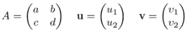你可以通过显式进行矩阵乘法来找到 *a* ***u*** 和 *a* ***v***：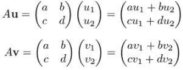然后我们可以计算 *a* ***u*** + *a* ***v*** 和 *a*(***u*** + ***v***)，并看到结果是一致的：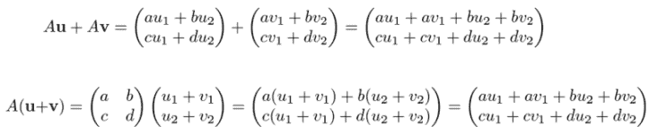这告诉我们，通过乘以任何 2x2 矩阵定义的 2D 向量变换保持向量之和。同样，对于任何数字 *s*，我们有！图片所以 *s* · (*a* ***v***) 和 *a*(*s* ***v***) 给出相同的结果，我们看到乘以矩阵 *a* 保持了标量乘积。这两个事实意味着乘以任何 2x2 矩阵是 2D 向量的线性变换。 |
| --- |

| **练习 5.10**：再次使用 5.1.3 节中的两个矩阵：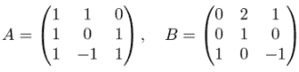编写一个名为 `compose_a_b` 的函数，该函数执行 *a* 和 *B* 的线性变换的组合。然后使用本节之前练习中的 `infer_matrix` 函数来证明 `infer_matrix(3, compose_a_b)` 与矩阵乘积 *AB* 相同。**解答**：首先，我们实现两个函数 `transform_a` 和 `transform_b`，它们执行由矩阵 *a* 和 *B* 定义的线性变换。然后，我们使用我们的 `compose` 函数将它们组合起来：

```
from transforms import compose

a = ((1,1,0),(1,0,1),(1,−1,1))
b = ((0,2,1),(0,1,0),(1,0,−1))

def transform_a(*v*):
    return multiply_matrix_vector(a,v)

def transform_b(*v*):
    return multiply_matrix_vector(b,v)

compose_a_b = compose(transform_a, transform_b)
```

现在我们可以使用我们的 `infer_matrix` 函数来找到这个线性变换组合对应的矩阵，并将其与矩阵乘积 *AB* 进行比较：

```
>>> infer_matrix(3, compose_a_b)
((0, 3, 1), (1, 2, 0), (1, 1, 0))
>>> matrix_multiply(a,b)
((0, 3, 1), (1, 2, 0), (1, 1, 0))
```

|

| **练习 5.11-迷你项目**：找到两个 2×2 矩阵，它们都不是单位矩阵 *I*[2]，但它们的乘积 *是* 单位矩阵。**解答**：一种方法是编写两个矩阵，并调整它们的元素，直到得到作为乘积的单位矩阵。另一种方法是考虑这个问题在线性变换的术语中。如果两个矩阵相乘得到单位矩阵，那么它们对应线性变换的复合应该产生单位变换。考虑到这一点，有哪些二维线性变换的复合是单位变换？当依次应用于给定的二维向量时，这些线性变换应该返回原始向量作为输出。这样一对变换是顺时针旋转 90°，然后旋转 270°。应用这两个变换执行 360° 的旋转，将任何向量返回到其原始位置。270° 旋转和 90° 旋转的矩阵如下，它们的乘积是单位矩阵： |
| --- |

| **练习 5.12**: 我们可以对一个方阵进行任意次数的自乘。然后我们可以将连续的矩阵乘法视为“将矩阵提升到幂”。对于一个方阵 *a*，我们可以将 AA 写作 *a*²；我们可以将 AAA 写作 *a*³；以此类推。编写一个 `matrix_power(power,matrix)` 函数，该函数将矩阵提升到指定的（整数）幂。**解答**：以下是一个实现，它适用于大于或等于 1 的整数幂：

```
def matrix_power(power,matrix):
    result = matrix
    for _ in range(1,power):
        result = matrix_multiply(result,matrix)
    return result
```

|

## 5.2 不同形状矩阵的解释

`matrix_multiply` 函数没有硬编码输入矩阵的大小，因此我们可以用它来相乘 2×2 或 3×3 矩阵。实际上，它还可以处理其他大小的矩阵。例如，它可以处理这两个 5×5 矩阵：

```
>>> xa = ((−1, 0, −1, −2, −2), (0, 0, 2, −2, 1), (−2, −1, −2, 0, 1), (0, 2, −2,
−1, 0), (1, 1, −1, −1, 0))
>>> b = ((−1, 0, −1, −2, −2), (0, 0, 2, −2, 1), (−2, −1, −2, 0, 1), (0, 2, −2,
−1, 0), (1, 1, −1, −1, 0))
>>> matrix_multiply(a,b)
((−10, −1, 2, −7, 4), (−2, 5, 5, 4, −6), (−1, 1, −4, 2, −2), (−4, −5, −5, -9,
4), (−1, −2, −2, −6, 4))
```

没有理由我们不认真对待这个结果——我们的向量加法、标量乘法、点积以及因此矩阵乘法的函数都不依赖于我们使用的向量的维度。尽管我们无法想象五维向量，但我们可以在五个数字的元组上进行所有相同的代数运算，就像我们在二维和三维中分别对数字对和三元组进行运算一样。在这个五维乘积中，结果矩阵的元素仍然是第一个矩阵的行与第二个矩阵的列的点积（如图 5.5）：

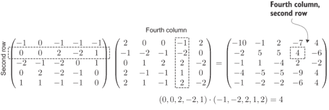

图 5.5 第一个矩阵的行与第二个矩阵的列的点积产生矩阵乘积的一个元素。

你不能以同样的方式可视化它，但你可以通过代数证明一个 5×5 矩阵指定了五维向量的线性变换。我们将在下一章讨论在四维、五维或更多维度中存在的对象类型。

### 5.2.1 列向量作为矩阵

让我们回到矩阵乘以列向量的例子。我已经向你展示了如何进行这种乘法，但我们将其作为一个单独的案例，使用`multiply_matrix_vector`函数来处理。结果发现`matrix_multiply`也能够进行这些乘法，但我们必须将列向量写成矩阵的形式。作为一个例子，让我们将以下方阵和单列矩阵传递给我们的`matrix_multiply`函数：

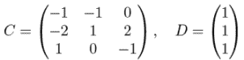

我之前说过，你可以将向量和单列矩阵互换地考虑，所以我们可以将`d`编码为向量（1,1,1）。但这次，让我们强迫自己将其视为一个矩阵，有三个行，每个行只有一个元素。请注意，我们必须写成（1,）而不是（1），这样 Python 才会将其视为一个 1 元组而不是一个数字。

```
>>> xc = ((−1, −1, 0), (−2, 1, 2), (1, 0, −1))
>>> d = ((1,),(1,),(1,))
>>> matrix_multiply(c,d)
((−2,), (1,), (0,))
```

结果有三个行，每个行只有一个元素，因此它也是一个单列矩阵。以下是这个乘积在矩阵表示法中的样子：

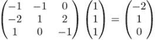

我们的`multiply_matrix_vector`函数可以评估相同的乘积，但格式不同：

```
>>> multiply_matrix_vector(c,(1,1,1))
(−2, 1, 0)
```

这表明矩阵和列向量的乘法是矩阵乘法的一个特例。最终我们并不需要一个单独的`multiply_matrix_vector`函数。我们还可以进一步看到输出中的项是第一个矩阵的行与第二个矩阵的单列的点积（如图 5.6 所示）。

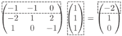

图 5.6 结果向量的一个元素，作为点积计算得出

在纸上，你会看到向量可以互换地表示为元组（带有逗号）或列向量。但对我们编写的 Python 函数来说，这种区别是关键的。元组（−2, 1, 0）不能与元组-of-元组（（−2,），（1,），（0,））互换使用。同样，另一种表示相同向量的方式是作为*行向量*，或者是一个只有一行的矩阵。以下是三种表示方法的比较：

表 5.1 向量数学符号与相应的 Python 表示的比较

| 表示法 | 数学符号 | Python 表示 |
| --- | --- | --- |
| 有序三元组（有序元组） | 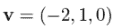 | `v = (−2,1,0)` |
| 列向量 | 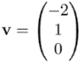 | `v = ((−2,),(1,),(0,))` |
| 行向量 |  | `v = ((−2,1,0),)` |

如果你曾在数学课上看到过这种比较，你可能认为这只是繁琐的符号区别。然而，一旦我们在 Python 中代表这些，我们会发现它们实际上是三个需要不同对待的不同对象。虽然它们都代表相同的空间几何数据，即一个 3D 箭头或空间中的点，但只有其中之一，即列向量，可以与 3×3 矩阵相乘。行向量不行，因为，如图 5.7 所示，我们无法将第一个矩阵的行与第二个矩阵的列进行点积。

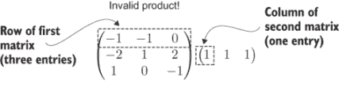

图 5.7 不能相乘的两个矩阵

为了使我们的矩阵乘法定义保持一致，我们只能将矩阵与一个*列向量*相乘。这引发了下一节提出的一般问题。

### 5.2.2 哪些矩阵对可以相乘？

我们可以制作任何维度的数字网格。我们的矩阵乘法公式何时可以工作，它工作时的意义是什么？

答案是，第一矩阵的列数必须与第二矩阵的行数相匹配。当我们用点积来做矩阵乘法时，这一点是明显的。例如，我们可以将任何有三个列的矩阵与一个有三个行的第二个矩阵相乘。这意味着第一矩阵的行和第二矩阵的列各有三个元素，因此我们可以计算它们的点积。图 5.8 显示了第一矩阵的第一行与第二矩阵的第一列的点积，这给出了乘积矩阵的一个元素。

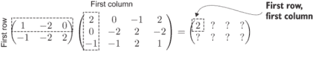

图 5.8 求乘积矩阵的第一个元素

我们可以通过计算剩余的七个点积来完成这个矩阵乘法。图 5.9 显示了另一个元素，它是通过点积计算得出的。

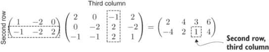

图 5.9 求乘积矩阵的另一个元素

这个约束也符合我们原始的矩阵乘法定义：输出矩阵的每一列都是第一矩阵的列与第二矩阵的行给出的标量线性组合（图 5.10）。

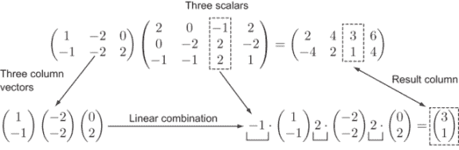

图 5.10 结果的每一列都是第一矩阵的列的线性组合。

我之前称那些平方矩阵为 2-by-2 和 3-by-3 矩阵。最后一个例子（图 5.10）是 2-by-3 和 3-by-4 矩阵的乘积。当我们这样描述矩阵的*维度*时，我们首先说行数，然后说列数。例如，一个 3D 列向量将是一个 3-by-1 矩阵。

注意：有时你会看到矩阵维度用乘号写成 3×3 矩阵或 3×1 矩阵。

在这种语言中，我们可以对可以相乘的矩阵形状做出一般性陈述：只有当*m = p*时，你才能将一个*n* -by- *m*矩阵与一个*p* -by- *q*矩阵相乘。当这一点成立时，结果矩阵将是一个*n* -by- *q*矩阵。例如，一个 17×9 矩阵不能与一个 6×11 矩阵相乘。然而，一个 5×8 矩阵可以与一个 8×10 矩阵相乘。图 5.11 显示了后者的结果，它是一个 5×10 矩阵。

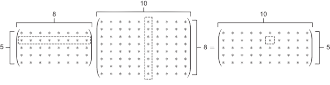

图 5.11 第一矩阵的每一行都可以与第二矩阵的十列之一配对，以产生乘积矩阵的 5×10=50 个元素之一。我使用星号而不是数字来表明任何这些尺寸的矩阵都是兼容的。

与之相反，你不能以相反的顺序乘这些矩阵：一个 10×8 的矩阵不能被一个 5×8 的矩阵相乘。现在我们已经清楚如何乘更大的矩阵，但结果意味着什么呢？结果表明我们可以从结果中学到一些东西：**所有**矩阵都代表向量函数，所有有效的矩阵乘积都可以解释为这些函数的组合。让我们看看这是如何工作的。

### 5.2.3 将方阵和非方阵视为向量函数

我们可以将 2×2 矩阵视为执行二维向量给定线性变换所需的数据。如图 5.12 所示的机器，这种变换将二维向量输入其输入插槽，并从其输出插槽产生二维向量作为结果。

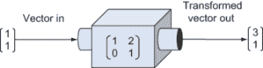

图 5.12 将矩阵可视化为一个输入向量并输出向量的机器

在底层，我们的机器执行以下矩阵乘法：

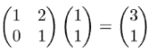

将矩阵视为输入向量并输出向量的机器是合理的。然而，图 5.13 显示，矩阵不能接受任何向量作为输入；它是一个 2×2 矩阵，因此它对二维向量进行线性变换。相应地，这个矩阵只能与一个有两个条目的列向量相乘。让我们将机器的输入和输出插槽分开，以表明它们接受和产生二维向量或数字对。

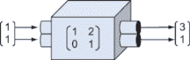

图 5.13 通过重新绘制机器的输入和输出插槽来细化我们的心理模型，以表明其输入和输出是数字对

同样，由 3×3 矩阵供电的线性变换机器（图 5.14）只能接受 3D 向量并产生 3D 向量作为结果。

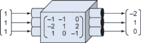

图 5.14 由 3×3 矩阵供电的线性变换机器接受 3D 向量并输出 3D 向量。

现在，我们可以问自己，如果机器由一个非方阵供电，它看起来会是什么样子？也许矩阵看起来会像这样：

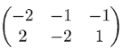

作为具体例子，这个 2×3 矩阵可以作用于哪些类型的向量？如果我们打算用这个矩阵乘以一个列向量，这个列向量必须有三个条目以匹配这个矩阵的行的大小。将我们的 2×3 矩阵乘以一个 3×1 的列向量，我们得到一个 2×1 的矩阵作为结果，或者一个二维列向量。例如，

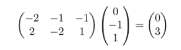

这告诉我们这个 2×3 矩阵代表一个将 3D 向量映射到 2D 向量的函数。如果我们将其绘制成机器，如图 5.15 所示，它将接受 3D 向量作为其输入插槽，并从其输出插槽产生 2D 向量。

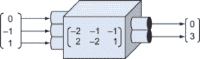

图 5.15 由 2×3 矩阵供电的机器，接受 3D 向量并输出 2D 向量

通常，一个*m*×*n*矩阵定义了一个函数，它接受*n*维向量作为输入，并返回*m*维向量作为输出。任何这样的函数都是线性的，因为它保持向量之和和数乘。它不是一个变换，因为它不仅仅修改输入，它返回的是完全不同类型的输出：一个存在于不同维数的向量。因此，我们将使用一个更一般的术语；我们将称之为*线性函数*或*线性映射*。让我们考虑一个从 3D 到 2D 的熟悉线性映射的深入例子。

### 5.2.4 从 3D 到 2D 的投影作为线性映射

我们已经看到了一个接受 3D 向量并产生 2D 向量的向量函数：将 3D 向量投影到*x*,*y*平面（第 3.5.2 节）。这种变换（我们可以称之为*P*）接受形式为(*x*, *y*, *z*)的向量，并返回删除其*z*分量的这些向量：(*x*, *y*)。我将花一些时间仔细说明为什么这是一个线性映射以及它是如何保持向量加法和数乘的。

首先，让我们将*P*写成矩阵的形式。为了接受 3D 向量并返回 2D 向量，它应该是一个 2×3 矩阵。让我们遵循我们可靠的矩阵寻找公式，通过测试*P*对标准基向量的作用。记住，在 3D 中，标准基向量定义为***e***[1] = (1, 0, 0)，***e***[2] = (0, 1, 0)，和***e***[3] = (0, 0, 1)，当我们对这三个向量应用投影时，我们分别得到(1, 0)，(0, 1)，和(0, 0)。我们可以将这些写成列向量

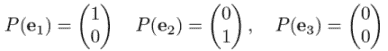

然后将它们并排放在一起以形成一个矩阵：

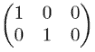

为了检查这一点，让我们用一个测试向量(*a*, *b*, *c*)乘以它。(*a*, *b*, *c*)与(1, 0, 0)的点积是*a*，所以这是结果的第一项。第二项是(*a*, *b*, *c*)与(0, 1, 0)的点积，即*b*。你可以想象这个矩阵就像从(*a*, *b*, *c*)中抓取*a*和*b*，而忽略*c*（如图 5.16）。

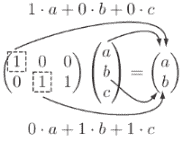

图 5.16 只有 1 · a 对乘积的第一项有贡献，只有 1 · *b*对第二项有贡献。其他项被置零（在图中以灰色表示）。

这个矩阵做了我们想要的事情；它删除了 3D 向量的第三个坐标，只留下前两个坐标。我们可以把这个投影写成矩阵是个好消息，但让我们也给出一个代数*证明*，说明这是一个线性映射。为此，我们必须证明线性性的两个关键条件得到满足。

证明投影保持向量之和

如果*P*是线性的，那么任何向量之和***u*** + ***v*** = ***w***都应该被*P*所尊重。也就是说，*P*(***u***) + *P*(***v***)应该等于*P*(***w***)。让我们使用这些方程来确认这一点：***u*** = (*u*[1], *u*[2], *u*[3])和***v*** = (*v*[1], *v*[2], *v*[3])。那么***w*** = ***u*** + ***v***，所以

w = (*u*[1] + *v*[1], *u*[2] + *v*[2], *u*[3] + *v*[3])

对所有这些向量执行 *P* 是简单的，因为我们只需要移除第三个坐标：

*P*(*u*) = (*u*[1], *u*[2])

*P*(*v*) = (*v*[1], *v*[2])

所以

*P*(*w*) = (*u*[1] + *v*[1], *u*[2] + *v*[2])

将 *P*(***u***) 和 *P*(***v***）相加，我们得到 (*u*[1] + *v*[1], *u*[2] + *v*[2])，这与 *P*(***w***) 相同。对于任何三个三维向量 ***u*** + ***v*** = ***w***，因此我们也有 *P*(***u***) + *P*(***v***) = *P*(***w***)。这验证了我们的第一个条件。

证明投影保持标量乘积

我们需要证明的第二件事是 *P* 保持了标量乘积。让 *s* 代表 *任何* 实数，并让 ***u*** = (*u*[1], *u*[2], *u*[3])，我们想要证明 *P*(*s* u) 与 *sP*(*u*) 相同。

删除第三个坐标并进行标量乘法，无论这些操作以何种顺序执行，都会得到相同的结果。*s* *z* 的结果是 (*su*[1], *su*[2], *su*[3])，所以 *P*(*s* u) = (*su*[1], *su*[2])。*P*(***u***) 的结果是 (***u***[1], ***u***[2])，所以 *sP*(*u*) = (*su*[1], *su*[2])。这验证了第二个条件，并确认 *P* 满足线性的定义。

这类证明通常比理解起来更容易，所以我给你们提供了一个练习题。在练习题中，你可以检查一下，一个从二维到三维的函数，由一个给定的矩阵指定，是否可以使用相同的方法来证明它是线性的。

比代数证明更有说明性的是例子。当我们把一个三维向量的和投影到二维时，它看起来会是什么样子？我们可以分三步来看。首先，我们可以像图 5.17 所示的那样，在三维空间中画出两个向量 ***u*** 和 ***v*** 的和。


图 5.17 两个任意向量 *z* 和 *v* 在三维空间中的向量和

然后，我们可以从每个向量画一条线到 *x*，*y* 平面，以显示这些向量在投影后的位置（图 5.18）。


图 5.18 展示了 *u*，*v* 和 *z* + *v* 在投影到 x,y 平面后的位置

最后，我们可以观察这些新向量，并看到它们 *仍然* 构成了一个向量和（图 5.19）。


图 5.19 投影后的向量形成一个和：P(*v*) + P(*v*) = P(*u + v*)。

换句话说，如果三个向量 ***u***，***v*** 和 ***w*** 构成了一个向量和 ***u*** + ***v*** = ***w***，那么它们在 *x*，*y* 平面上的“影子”也形成一个向量和。现在你已经对从三维到二维的线性变换及其表示的矩阵有了些了解，让我们回到对线性映射的一般讨论。

### 5.2.5 线性映射的合成

矩阵的美丽之处在于它们存储了评估给定向量上的线性函数所需的所有数据。更重要的是，矩阵的维度告诉我们底层函数的输入向量和输出向量的维度。我们在图 5.20 中通过绘制不同维度的矩阵机器来直观地捕捉这一点，这些机器的输入和输出槽具有不同的形状。以下是四个我们看到的例子，用字母标记以便我们可以回过来引用。


图 5.20 以机器形式表示的四个线性函数，具有输入和输出槽。槽的形状告诉我们它接受或产生向量的维度。

这样画出来，很容易找出哪些线性函数机器的配对可以焊接在一起来构建一个新的。例如，*M* 的输出槽与 *P* 的输入槽形状相同，因此我们可以为 3D 向量 ***v*** 构造组合 *P*(*M*(***v***))。*M* 的输出是一个 3D 向量，可以直接传递到 *P* 的输入槽中（图 5.21）。


图 5.21 P 和 M 的组合。一个向量被传递到 M 的输入槽中，M(*v*) 的输出无形中穿过管道进入 P，P(M(*v*)) 的输出从另一端出现。

相比之下，图 5.22 显示我们无法组合 *N* 和 *M*，因为 *N* 没有足够的输出槽来填充 *M* 的每个输入。


图 5.22 N 和 M 的组合是不可能的，因为 N 的输出是 2D 向量，而 M 的输入是 3D 向量。

我现在通过谈论槽位来使这个想法可视化，但隐藏在下面的推理与决定两个矩阵是否可以相乘的推理是相同的。第一个矩阵的列数必须与第二个矩阵的行数相匹配。当维度以这种方式匹配时，槽位也匹配，我们可以组合线性函数并乘以它们的矩阵。

将 *P* 和 *M* 视为矩阵，*P* 和 *M* 的组合写作 *PM* 作为矩阵乘积。（记住，如果 *PM* 对向量 ***v*** 作用为 *PM* ***v***，则先应用 *M*，然后是 *P*。）当 ***v*** = (1, 1, 1) 时，乘积 *PM* ***v*** 是两个矩阵和一个列向量的乘积，如果我们评估 *PM*（图 5.23），它可以简化为一个矩阵乘以一个列向量。


图 5.23 应用 M 和 P 等同于应用组合 PM。我们通过矩阵乘法将组合合并为一个单一的矩阵。

作为程序员，你习惯于从函数消耗和产生数据类型的角度来考虑函数。到目前为止，我在本章中已经给了你很多符号和术语来消化，但只要你掌握了这个核心概念，你最终会掌握它的。

我强烈建议你完成以下练习，以确保你理解矩阵的语言。在本章的其余部分和下一章中，不会有太多新的重大概念，只有对我们之前所学的应用。这些应用将使你在矩阵和向量计算方面有更多的实践机会。

### 5.2.6 练习

| **练习 5.13**: 这个矩阵的维度是什么？！[](../Images/CH05_F23_Orland_EQ38.png)

+   5×3

+   3×5

**解答**：这是一个 3×5 矩阵，因为它有三行五列。|

| **练习 5.14**: 将一个二维列向量视为矩阵时，它的维度是什么？二维行向量呢？三维列向量？三维行向量？**解答**：一个二维列向量有两行一列，因此它是一个 2×1 矩阵。一个二维行向量有一行两列，因此它是一个 1×2 矩阵。同样，三维列向量和行向量作为矩阵的维度分别是 3×1 和 1×3。 |
| --- |

| **练习 5.15-迷你项目**：我们的大多数向量和矩阵操作都使用了 Python 的 `zip` 函数。当给定不同大小的输入列表时，这个函数会截断较长的列表而不是失败。这意味着当我们传递无效输入时，我们会得到无意义的结果。例如，二维向量和三维向量之间没有点积，但我们的 `dot` 函数仍然返回某些内容：

```
>>> from vectors import dot
>>> dot((1,1),(1,1,1))
2
```

为所有向量算术函数添加安全措施，以便它们对无效大小的向量抛出异常，而不是返回值。一旦你完成了这个，就证明 `matrix_multiply` 不再接受 3×2 和 4×5 矩阵的乘积。|

| **练习 5.16**: 以下哪些是有效的矩阵乘积？对于有效的乘积，乘积矩阵的维度是多少？A.B.C.D.**解答**：A. 这个 2×2 矩阵和 4×4 矩阵的乘积是不有效的；第一个矩阵有两列，但第二个矩阵有四行。B. 这个 2×4 矩阵和 4×2 矩阵的乘积是有效的；第一个矩阵的四个列与第二个矩阵的四个行相匹配。结果是 2×2 矩阵。C. 这个 3×1 矩阵和 1×8 矩阵的乘积是有效的；第一个矩阵的单列与第二个矩阵的单行相匹配。结果是 3×8 矩阵。D. 这个 3×3 矩阵和 2×3 矩阵的乘积是不有效的；第一个矩阵的三列不匹配第二个矩阵的两行。 |
| --- |

| **练习 5.17**：一个有 15 个总条目的矩阵乘以一个有 6 个总条目的矩阵。这两个矩阵的维度是什么，乘积矩阵的维度是什么？**解答**：让我们称矩阵的维度为 *m* -by- *n* 和 *n* -by- *k*，因为第一个矩阵的列数必须与第二个矩阵的行数相匹配。那么 *mn* = 15 和 *nk* = 6。实际上有两种可能性：

+   第一种可能性是 *m* = 5, *n* = 3, 和 *k* = 2。那么这将是一个 5×3 矩阵乘以一个 3×2 矩阵，结果是一个 5×2 矩阵。

+   第二种可能性是 *m* = 15, *n* = 1, 和 *k* = 6。那么这将是一个 15×1 矩阵乘以一个 1×6 矩阵，结果是一个 15×6 矩阵。

|

| **练习 5.18**：编写一个函数，将列向量转换为行向量，或反之亦然。像这样翻转矩阵称为**转置**，得到的矩阵称为原始矩阵的**转置**。**解答**：

```
def transpose(matrix):
    return tuple(zip(*matrix))
```

调用 `zip(*matrix)` 返回矩阵的列的列表，然后我们将它们元组化。这会交换任何输入矩阵的行和列，具体来说，将列向量转换为行向量，反之亦然：

```
>>> transpose(((1,),(2,),(3,)))
((1, 2, 3),)
>>> transpose(((1, 2, 3),))
((1,), (2,), (3,))
```

|

| **练习 5.19**：画一个图来展示一个 10×8 和一个 5×8 矩阵**不能**按那种顺序相乘。**解答**：第一个矩阵的行有十个条目，但第二个矩阵的列有五个，这意味着我们无法评估这个矩阵乘积。 |
| --- |
| **练习 5.20**：我们想将三个矩阵相乘：*a* 是 5×7，*B* 是 2×3，*C* 是 3×5。它们可以按什么顺序相乘，结果的大小是多少？**解答**：一个有效乘积是 *BC*，一个 2x3 乘以一个 3×5 矩阵得到一个 2×5 矩阵。另一个是 *CA*，一个 3×5 矩阵乘以一个 5×7 矩阵得到一个 3×7 矩阵。三个矩阵的乘积 *BCA*，无论你使用什么顺序都是有效的。(*BC*) *a* 是一个 2×5 矩阵乘以一个 5×7 矩阵，而 *B*(*CA*) 是一个 2×3 矩阵乘以一个 3×7 矩阵。每个都得到相同的 2×7 矩阵作为结果。以不同的顺序乘以三个矩阵 |
| **练习 5.21**：将投影到 *y*，*z* 平面和 *x*，*z* 平面也是从 3D 到 2D 的线性映射。它们的矩阵是什么？**解答**：投影到 *y*，*z* 平面删除了 *x* 坐标。这个操作的矩阵是。同样，投影到 *x*，*z* 平面删除了 *y* 坐标：。例如， |

| **练习 5.22**：通过示例说明之前练习中的`infer_matrix`函数可以创建具有不同维度输入和输出的线性函数的矩阵。**解答**：我们可以测试的一个函数是将投影到*x*，*y*平面的函数，它接受 3D 向量并返回 2D 向量。我们可以将这个线性变换实现为一个 Python 函数，然后推断其 2×3 矩阵：

```
>>> def project_xy(*v*):
...     x,y,z = v
...     return (x,y)
...
>>> infer_matrix(3,project_xy)
((1, 0, 0), (0, 1, 0))
```

注意，我们必须将输入向量的维度作为参数提供，这样我们才能构建正确的标准基向量以在`project_xy`的作用下进行测试。一旦`project_xy`传递了 3D 标准基向量，它就会自动输出 2D 向量以提供矩阵的列。|

| **练习 5.23**：编写一个 4×5 矩阵，它通过删除其五个条目中的第三个来作用于一个 5D 向量，从而产生一个 4D 向量。例如，将其与列向量形式（1, 2, 3, 4, 5）相乘应该返回（1, 2, 4, 5）。**解答**：这个矩阵是你可以看到输入向量的第一个、第二个、第四个和第五个坐标构成了输出向量的四个坐标！[](../Images/CH05_F23_Orland_UN05.png)矩阵中的 1 表示输入向量的坐标最终出现在输出向量中的位置。 |
| --- |
| **练习 5.24-迷你项目**：考虑六个变量（*l*，*e*，*m*，*o*，*n*，*s*）的向量。找到作用于该向量并产生向量（*s*，*o*，*l*，*e*，*m*，*n*）的线性变换的矩阵。**提示**：输出向量的第三个坐标等于输入向量的第一个坐标，因此变换必须将标准基向量（1, 0, 0, 0, 0, 0）映射到（0, 0, 1, 0, 0, 0）。**解答**：这个矩阵以指定方式重新排列了 6D 向量的条目。 |
| **练习 5.25**：从 5.2.5 节中的矩阵 *M*，*N*，*P* 和 *Q* 中可以制作哪些有效的乘积？在考虑矩阵乘积时，包括矩阵与自身的乘积。对于有效的乘积，矩阵乘积的维度是什么？**解答**：*M* 是 3×3，*N* 是 2×2，而 *P* 和 *Q* 都是 2×3。*M* 与自身的乘积 *MM* = *M*² 是有效的，是一个 3×3 矩阵，同样 *NN* = *N*² 也是一个 2×2 矩阵。除此之外，*PM*，*QM*，*NP* 和 *NQ* 都是 3×2 矩阵。 |

## 5.3 使用矩阵转换向量

矩阵的一个优点是，在任意数量的维度中计算看起来都是一样的。我们不需要担心在 2D 或 3D 中想象向量的配置；我们只需将它们插入到矩阵乘法的公式中，或者将它们用作 Python `matrix_multiply`的输入。当我们想要在超过三个维度中进行计算时，这特别有用。

人类的大脑并没有被设计成想象四维或五维的向量，更不用说 100 维了，但我们已经看到我们可以在高维向量上进行计算。在本节中，我们将介绍一个*需要*在高维中进行计算的计算：使用矩阵进行向量的平移。

### 5.3.1 使平面平移线性化

在上一章中，我们展示了平移不是线性变换。当我们将平面上的每个点移动一个给定的向量时，原点会移动，向量之和不会保持不变。如果它不是一个线性变换，我们怎么能希望用矩阵执行二维变换呢？

小技巧在于我们可以将我们的二维点想象成生活在三维空间中。让我们回到第二章中的恐龙。这只恐龙由 21 个点组成，我们可以按顺序连接这些点来创建图形的轮廓：

```
from vector_drawing import *

dino_vectors = [(6,4), (3,1), (1,2), (−1,5), (−2,5), (−3,4), (−4,4),
    (−5,3), (−5,2), (−2,2), (−5,1), (−4,0), (−2,1), (−1,0), (0,−3),
    (−1,−4), (1,−4), (2,−3), (1,−2), (3,−1), (5,1)
]

draw(
    Points(*dino_vectors),
    Polygon(*dino_vectors)
)
```

结果就是熟悉的二维恐龙（图 5.24）。


图 5.24 第二章中熟悉的二维恐龙

如果我们想将恐龙向右平移 3 个单位，向上平移 1 个单位，我们只需将向量（3, 1）加到恐龙的每个顶点上即可。但这不是一个线性映射，因此我们无法生成一个 2×2 的矩阵来完成这种平移。如果我们将恐龙想象成三维空间而不是二维平面的居民，那么我们发现*可以*将平移表示为一个矩阵。

请稍等，让我向你展示这个技巧；我很快就会解释它是如何工作的。让我们给恐龙的每个点赋予 z 坐标为 1。然后我们可以通过连接每个点来在三维空间中绘制它，并看到结果的多边形位于*z* = 1 的平面上（图 5.25）。我创建了一个名为`polygon_segments_3d`的辅助函数，用于获取恐龙多边形在三维空间中的段。

```
from draw3d import *
def polygon_segments_3d(points,color='blue'):
    count = len(points)
    return [Segment3D(points[i], points[(i+1) % count],color=color) for i in range(0,count)]

dino_3d = [(x,y,1) for x,y in dino_vectors]

draw3d(
    Points3D(*dino_3d, color='blue'),
    *polygon_segments_3d(dino_3d)
)
```


图 5.25 给恐龙的每个顶点赋予 z 坐标为 1 的相同恐龙

图 5.26 显示了一个“扭曲”三维空间的矩阵，使得原点保持不变，但*z* = 1 的平面按所需平移。现在就相信我吧！我已经突出显示了与平移相关的数字，你应该注意这些。


图 5.26 一个神奇的矩阵，将平面*z* = 1 在*x*方向上移动+3，在*y*方向上移动+1

我们可以将这个矩阵应用到恐龙的每个顶点上，然后 voila！恐龙在其平面内平移了（3, 1）（图 5.27）。


图 5.27 将矩阵应用到每个点，使恐龙保持在同一平面内，但在平面内平移了（3, 1）。

这里是代码：

```
magic_matrix = (
    (1,0,3),
    (0,1,1),
    (0,0,1))

translated = [multiply_matrix_vector(magic_matrix, v) for *v*  in dino_vectors_3d]
```

为了清晰起见，我们随后可以再次删除 z 坐标，并显示与原始恐龙在同一平面上的平移后的恐龙（图 5.28）。


图 5.28 将平移后的恐龙放回二维空间

你可以复制代码并检查坐标，以确认恐龙在最终图片中确实平移了 (3, 1)。现在让我向你展示这个技巧是如何工作的。

### 5.3.2 为 2D 平移找到一个 3D 矩阵

我们“神奇”矩阵的列，就像任何矩阵的列一样，告诉我们标准基向量在变换后最终的位置。将这个矩阵称为 *T*，向量 ***e***[1]、***e***[2] 和 ***e***[3] 将被变换为向量 *T* ***e***[1] = (1, 0, 0)，*T* ***e***[2] = (0, 1, 0)，和 *T* ***e***[3] = (3, 1, 1)。这意味着 ***e***[1] 和 ***e***[2] 没有受到影响，而 ***e***[3] 只改变了它的 *x* 和 *y* 分量（图 5.29）。


图 5.29 这个矩阵不会移动 e1 或 e2，但它确实会移动 e3。

3D 中的任何一点，因此，我们恐龙上的任何一点都是作为 ***e***[1]、***e***[2] 和 ***e***[3] 的线性组合构建的。例如，恐龙尾巴的尖端位于 (6, 4, 1)，即 6***e***[1] + 4***e***[2] + ***e***[3]。因为 *T* 不会移动 ***e***[1] 或 ***e***[2]，只有对 ***e***[3] 的影响会移动点，*T*(***e***[3]) = ***e***[3] + (3, 1, 0)，所以点在 *x* 方向上平移了 +3，在 *y* 方向上平移了 +1。你也可以从代数上看到这一点。任何向量 (*x*, *y*, 1) 都可以通过这个矩阵平移 (3, 1, 0)：


如果你想通过某个向量 (*a*, *b*) 平移一组 2D 向量，一般步骤如下：

1.  将 2D 向量移动到 3D 空间中的平面，其中 *z* = 1，每个向量都有一个 z 坐标为 1。

1.  将向量乘以矩阵，并插入你给定的 *a* 和 *b* 选择：

    

1.  删除所有向量的 z 坐标，这样你最终会得到 2D 向量。

现在我们可以用矩阵进行平移，我们可以创造性地将它们与其他线性变换结合。

### 5.3.3 将平移与其他线性变换结合

在之前的矩阵中，前两列正好是 ***e***[1] 和 ***e***[2]，这意味着只有 ***e***[3] 的变化会移动图形。我们不希望 *T*(***e***[1]) 或 *T*(***e***[2]) 有任何 z 分量，因为这会将图形移出平面 *z* = 1。但我们可以修改或交换其他分量（图 5.30）。


图 5.30 让我们看看当我们移动 T(e1) 和 T(e2) 到 x,y 平面时会发生什么。

结果表明，你可以通过在第三列指定的平移之外进行相应的线性变换，将任何 2×2 矩阵放入左上角（如图 5.30 所示）。例如，这个矩阵


产生一个 90° 逆时针旋转。将其插入平移矩阵中，我们得到一个新的矩阵，它将 *x*，*y* 平面旋转 90°，然后按图 5.31 所示平移 (3, 1)。


图 5.31 一个矩阵，将 e1 和 e3 旋转 90°，并将 e3 平移到(3, 1)。任何在 z = 1 的平面上的图形都会经历这两种变换。

为了展示这是可行的，我们可以在 Python 中对所有 3D 恐龙顶点执行这种转换。图 5.32 显示了以下代码的输出：

```
rotate_and_translate = ((0,−1,3),(1,0,1),(0,0,1))
rotated_translated_dino = [
    multiply_matrix_vector(rotate_and_translate, v) 
    for v  in dino_vectors_3d]
```


图 5.32 原始恐龙（左）和第二个恐龙（右），它们都通过一个单一的矩阵进行了旋转和平移

一旦你掌握了使用矩阵进行 2D 平移的方法，你就可以将相同的方法应用于 3D 平移。要做到这一点，你将不得不使用 4×4 矩阵并进入神秘的 4D 世界。

### 5.3.4 在四维世界中转换 3D 对象

第四维度是什么？一个 4D 向量将是一个具有某些长度、宽度、深度和另一个维度的箭头。当我们从 2D 空间构建 3D 空间时，我们添加了一个 z 坐标。这意味着 3D 向量可以生活在*x*，*y*平面，其中*z* = 0，或者它们可以生活在任何其他平行平面中，其中*z*具有不同的值。图 5.33 显示了这些平行平面中的几个。


图 5.33 通过堆叠平行平面构建 3D 空间，每个平面看起来像 x,y 平面，但在不同的 z 坐标上

我们可以将四个维度类比为这个模型：一组由某个第四个坐标索引的 3D 空间。解释第四个坐标的一种方式是“时间”。在给定时间的一个快照是一个 3D 空间，但所有快照的集合是一个称为*时空*的第四维度。时空的起点是当时间*t*等于 0 时空间的原点（图 5.34）。


图 5.34 4D 时空的示意图，类似于在给定的 z 值处 3D 空间的切片是一个二维平面，在给定的 t 值处 4D 时空的切片是一个三维空间

这是爱因斯坦相对论理论的起点。（事实上，你现在有资格去阅读有关这个理论的内容，因为它基于 4D 时空和由 4×4 矩阵给出的线性变换。）

向量数学在更高维度中是必不可少的，因为我们很快就会用尽好的类比。对于五维、六维、七维或更多维度，我很难想象它们，但坐标数学并不比二维或三维更难。对于我们当前的目的，我们可以将四维向量视为一个由四个数字组成的四元组。

让我们复制适用于在 3D 中转换 2D 向量的技巧。如果我们从一个 3D 向量(*x*，*y*，*z*)开始，并且我们想要通过向量(*a*，*b*，*c*)进行平移，我们可以在目标向量上附加一个第四个坐标 1，并使用类似的 4D 矩阵进行平移。进行矩阵乘法确认我们得到了期望的结果（图 5.35）。


图 5.35 给向量 (*x*, *y*, *z*) 添加一个第四个坐标 1，我们可以使用这个矩阵通过 (*a*, *b*, *c*) 来平移向量。

这个矩阵将 *x* 坐标增加 *a*，*y* 坐标增加 *b*，*z* 坐标增加 *c*，因此它执行了通过向量 (*a*, *b*, *c*) 所需的变换。我们可以将添加第四个坐标、应用这个 4×4 矩阵以及然后删除第四个坐标的工作封装在一个 Python 函数中：

```
def translate_3d(translation):
    def new_function(target):                    ❶
        a,b,*c* = translation
        x,y,z = target
        matrix = ((1,0,0,a),
            0,1,0,b),
            (0,0,1,c),
            (0,0,0,1))                           ❷
        vector = (x,y,z,1)
        x_out, y_out, z_out, _ =\
          multiply_matrix_vector(matrix,vector)  ❸
        return (x_out,y_out,z_out)
    return new_function
```

❶ translate_3d 函数接受一个平移向量，并返回一个新的函数，该函数将平移应用于 3D 向量。

❷ 构建平移的 4×4 矩阵，并在下一行，将 (*x*, *y*, *z*) 转换为具有第四个坐标 1 的 4D 向量

❸ 执行 4D 矩阵变换

最后，绘制茶壶以及通过 (2, 2, −3) 平移的茶壶，我们可以看到茶壶适当地移动了。你可以通过运行 matrix_translate_teapot.py 来确认这一点。你应该看到与图 5.36 中相同的图像。


图 5.36 未翻译的茶壶（左）和已翻译的茶壶（右）。正如预期的那样，已翻译的茶壶向上和向右移动，并远离我们的视角。

将平移封装为矩阵运算后，我们现在可以将该操作与其他 3D 线性变换结合，并一次性完成。结果证明，你 *可以* 将这个设置中的虚拟第四个坐标解释为时间，*t*。

图 5.36 中的两个图像可能是 *t* = 0 和 *t* = 1 时茶壶的快照，它以恒定速度沿 (2, 2, −3) 方向移动。如果你在寻找一个有趣的挑战，你可以将此实现中的向量 (*x*, *y*, *z*, 1) 替换为形式为 (*x*, *y*, *z*, *t*) 的向量，其中坐标 *t* 随时间变化。当 *t* = 0 和 *t* = 1 时，茶壶应该与图 5.36 中的帧相匹配，而在两个时间之间，它应该在两个位置之间平滑移动。如果你能弄清楚这是如何工作的，你将赶上爱因斯坦！

到目前为止，我们一直专注于将向量作为空间中的点渲染到计算机屏幕上。这显然是一个重要的用例，但它只是触及了我们可以用向量和矩阵做什么的表面。研究向量和线性变换如何在一般情况下一同工作的研究被称为 *线性代数*，我将在下一章中给你一个更广泛的这个主题的图景，以及一些与程序员相关的全新示例。

### 5.3.5 练习

| **练习 5.26**：证明如果你将我们一直在使用的恐龙这样的 2D 图形移动到 *z* = 2 的平面上，3D 的“魔法”矩阵变换将不起作用。会发生什么？**解答**：使用 `[(x,y,2) for x,y in dino_vectors]` 并应用相同的 3×3 矩阵，恐龙被向量 (6, 2) 平移了两次，而不是 (3, 1)。这是因为向量 (0, 0, 1) 被平移了 (3, 1)，变换是线性的。在 z = 2 的平面上，恐龙被相同的矩阵平移了更远的距离。 |
| --- |
| **练习 5.27**：想出一个矩阵，将恐龙在 *x* 方向上平移 -2 个单位，在 *y* 方向上平移 -2 个单位。执行变换并展示结果。**解答**：将原始矩阵中的值 3 和 1 替换为 -2 和 -2，我们得到！[](../Images/CH05_F36b_Orland_UN06_EQ51b.png)恐龙确实沿着向量 (−2, −2) 向下和向左平移了。 |
| **练习 5.28**：证明任何形式为！[](../Images/CH05_F36b_Orland_UN07_EQ52.png)的矩阵都不会影响它乘以的 3D 列向量的 z 坐标。**解答**：如果 3D 向量的初始 z 坐标是一个数字 *z*，这个矩阵不会改变该坐标： |

| **练习 5.29-迷你项目**：找到一个 3×3 矩阵，它能在 *z* = 1 的平面上将 2D 图形旋转 45°，将其大小缩小到原来的 1/2，并通过向量 (2, 2) 进行平移。通过将其应用于恐龙的顶点来证明它的工作原理。**解答**：首先，让我们找到一个用于将 2D 向量旋转 45° 的 2×2 矩阵：

```
>>> from vectors import rotate2d
>>> from transforms import *
>>> from math import pi
>>> rotate_45_degrees = curry2(rotate2d)(pi/4)          ❶
>>> rotation_matrix = infer_matrix(2,rotate_45_degrees)
>>> rotation_matrix
((0.7071067811865476, -0.7071067811865475), (0.7071067811865475, 0.7071067811865476))
```

❶ 编写一个函数，该函数使用 45°（或 4 弧度）的角度执行 rotate2d，对于输入的 2D 向量 This matrix is approximately:同样，我们可以找到一个缩放因子为 ½ 的矩阵：将这些矩阵相乘，我们一次使用这段代码就完成了两种变换：

```
>>> from matrices import *
>>> scale_matrix = ((0.5,0),(0,0.5))
>>> rotate_and_scale = matrix_multiply(scale_matrix,rotation_matrix)
>>> rotate_and_scale
((0.3535533905932738, -0.35355339059327373), (0.35355339059327373, 0.3535533905932738))
```

这是一个 3×3 矩阵，它将恐龙在 *z* = 1 的平面上平移 (2, 2)：我们可以将我们的 2×2 旋转和缩放矩阵插入到这个矩阵的左上角，得到我们想要的最终矩阵：

```
>>> ((a,b),(c,d)) = rotate_and_scale
>>> final_matrix = ((a,b,2),(c,d,2),(0,0,1))
>>> final_matrix
((0.3535533905932738, -0.35355339059327373, 2), (0.35355339059327373, 0.3535533905932738, 2), (0, 0, 1))
```

将恐龙移动到平面 *z* = 1，应用这个矩阵进行 3D 变换，然后将其投影回 2D，我们得到了旋转、缩放和平移后的恐龙，这里只使用了一次矩阵乘法，如图所示： |

| **练习 5.30**: 在前面的练习中，矩阵将恐龙旋转了 45°，然后通过 (3, 1) 进行平移。使用矩阵乘法，构建一个以相反顺序执行此操作的矩阵。**解答**：如果恐龙位于 *z* = 1 的平面上，则以下矩阵执行 90° 旋转且没有平移：我们想要先平移再旋转，因此我们将这个旋转矩阵与平移矩阵相乘：这与另一个矩阵不同，它先旋转再平移。在这种情况下，我们看到平移向量 (3, 1) 受到 90° 旋转的影响。新的有效平移是 (−1, 3)。 |
| --- |

| **练习 5.31**: 编写一个类似于 `translate_3d` 的函数，称为 `translate_4d`，它使用一个 5×5 矩阵通过另一个 4D 向量来平移一个 4D 向量。运行一个示例以显示坐标已平移。**解答**：设置与之前相同，只是我们将 4D 向量提升到 5D，给它一个第五个坐标为 1：

```
def translate_4d(translation):
    def new_function(target):
        a,b,c,d = translation
        x,y,z,w = target
        matrix = (
            (1,0,0,0,a),
            (0,1,0,0,b),
            (0,0,1,0,c),
            (0,0,0,1,d),
            (0,0,0,0,1))
        vector = (x,y,z,w,1)
        x_out,y_out,z_out,w_out,_ = multiply_matrix_vector(matrix,vector)
        return (x_out,y_out,z_out,w_out)
    return new_function
```

我们可以看到平移是有效的（效果与添加两个向量相同）：

```
>>> translate_4d((1,2,3,4))((10,20,30,40))
(11, 22, 33, 44)
```

|

在前面的章节中，我们使用 2D 和 3D 的视觉示例来激发向量和矩阵算术。随着我们的进行，我们更多地强调了计算。在本章的末尾，我们在没有物理洞察力的情况下计算了高维向量变换。这是线性代数的一个好处：它为你提供了解决过于复杂而无法想象的几何问题的工具。我们将在下一章中概述这一广泛的应用范围。

## 概述

+   线性变换由其对标准基向量的作用来定义。当你将线性变换应用于标准基时，结果向量包含执行变换所需的所有数据。这意味着指定任何类型的 3D 线性变换只需要九个数字（这三个结果向量的三个坐标）。对于 2D 线性变换，需要四个数字。

+   在矩阵表示法中，我们通过将这些数字放入矩形网格中来表示线性变换。按照惯例，你通过将变换应用于标准基向量并将结果坐标向量并排放置作为列来构建矩阵。

+   使用矩阵来评估它对给定向量所表示的线性变换的结果称为 *矩阵乘以向量*。当你进行这种乘法时，向量通常按从上到下的顺序写成其坐标的列，而不是作为元组。

+   两个方阵也可以相乘。结果矩阵表示原始两个矩阵的线性变换的合成。

+   要计算两个矩阵的乘积，你需要计算第一个矩阵的行与第二个矩阵的列的点积。例如，第一个矩阵的第 *i* 行与第二个矩阵的第 *j* 列的点积给出了乘积矩阵的第 *i* 行和第 *j* 列的值。

+   由于方阵代表线性变换，非方阵代表从一维向量到另一维向量的线性函数。也就是说，这些函数将向量加和映射到向量加和，将标量乘积映射到标量乘积。

+   矩阵的维度告诉你其对应的线性函数接受和返回什么类型的向量。一个有 *m* 行和 *n* 列的矩阵被称为 *m* -by- *n* 矩阵（有时写作 *m* × *n*）。它定义了一个从 *n* 维空间到 *m* 维空间的线性函数。

+   翻译**不是**一个线性函数，但如果在更高维度下进行，它可以被转化为线性。这个观察结果使我们能够通过矩阵乘法来进行翻译（同时与其他线性变换一起进行）。
