# 6 将概念推广到高维

本章涵盖

+   实现一个 Python 抽象基类以实现通用向量

+   定义向量空间并列举它们的 useful properties

+   将函数、矩阵、图像和声波解释为向量

+   寻找包含感兴趣数据的向量空间的有用子空间

即使你对动画茶壶不感兴趣，向量、线性变换和矩阵的机制仍然很有用。事实上，这些概念非常有用，以至于有一个整个数学分支专门研究它们：*线性代数*。线性代数将我们关于 2D 和 3D 几何的已知知识概括到研究任何数量的维度中的数据。

作为程序员，你可能擅长概括思想。在编写复杂的软件时，你可能会发现自己一遍又一遍地编写相似的代码。在某个时刻，你会发现自己正在这样做，并将代码合并到一个可以处理你所看到的所有情况的类或函数中。这可以节省你的打字时间，并经常改善代码的组织和可维护性。数学家遵循同样的过程：在反复遇到相似的图案后，他们可以更好地陈述他们所看到的内容，并完善他们的定义。

在本章中，我们使用这种逻辑来定义*向量空间*。向量空间是我们可以将它们视为向量的对象集合。这些可以是平面上的箭头、数字的元组，或者与我们迄今为止所看到的不同完全的对象。例如，你可以将图像视为向量，并对它们进行线性组合（图 6.1）。


图 6.1 两个图像的线性组合产生了一个新的图像。

向量空间中的关键操作是向量加法和数乘。有了这些，你可以进行线性组合（包括取反、减法、加权平均等），并且可以推理哪些变换是线性的。结果证明，这些操作帮助我们理解“维度”这个词的含义。例如，我们将看到图 6.1 中使用的图像是 270,000 维的对象！我们很快就会涵盖更高维甚至无限维的空间，但让我们先回顾一下我们已知的 2D 和 3D 空间。

## 6.1 概括我们向量的定义

Python 支持面向对象编程（OOP），这是一个很好的概括框架。具体来说，Python 类支持*继承*：你可以创建新的对象类，这些类继承现有父类的属性和行为。在我们的例子中，我们希望将我们已看到的 2D 和 3D 向量实现为更一般类对象的实例，这个类简单地称为向量。然后，任何从父类继承行为的其他对象也可以正确地被称为向量（图 6.2）。

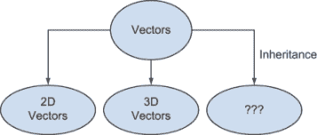

图 6.2 使用继承将 2D 向量、3D 向量和其他对象视为向量的特殊情况

如果你还没有做过面向对象编程，或者你没有在 Python 中见过它，不要担心。我在本章中坚持简单的用例，并且会在我们前进的过程中帮助你掌握它。如果你想在开始之前更多地了解 Python 中的类和继承，我在附录 B 中进行了介绍。

### 6.1.1 为二维坐标向量创建一个类

在代码中，我们的二维和三维向量是 *坐标* 向量，这意味着它们被定义为数字的元组，即它们的坐标。（我们也看到向量算术可以基于箭头在几何上定义，但我们不能直接将这种方法转换为 Python 代码。）对于二维坐标向量，数据是 *x* 和 *y* 坐标的有序对。元组是存储这种数据的好方法，但我们可以等效地使用一个类。我们将代表二维坐标向量的类称为 `Vec2`：

```
class Vec2():
    def __init__(self,x,y):
        self.x = x
        self.y = y
```

我们可以初始化一个向量，例如 `v = Vec2(1.6,3.8)`，并检索其坐标为 `v.x` 和 `v.y`。接下来，我们可以给这个类添加进行二维向量算术运算所需的方法，特别是加法和标量乘法。加法函数 `add` 接收一个第二个向量作为参数，并返回一个新的 `Vec2` 对象，其坐标分别是 *x* 和 *y* 坐标的和：

```
class Vec2():
    ...                 ❶
    def add(self, v2):
        return Vec2(self.x + v2.x, self.y + v2.y)
```

❶ 当向现有类添加内容时，我有时会使用 ... 作为现有代码的占位符。

使用 `Vec2` 进行向量加法可能看起来像这样：

```
v = Vec2(3,4)          ❶
w = v.add(Vec2(−2,6))  ❷
print(w.x)             ❸
```

❶ 创建一个新的名为 *v* 的 Vec2，其 x 坐标为 3，y 坐标为 4

❷ 将第二个 Vec2 添加到 *v* 中，以产生一个新的名为 w 的 Vec2 实例。这个操作返回 (3,4) + (−2,6) = (1,10)。

❸ 打印 w 的 x 坐标。结果是 1。

就像我们原始的向量加法实现一样，我们不执行“就地”加法。也就是说，两个输入向量不会被修改；创建一个新的 `Vec2` 对象来存储和。我们可以以类似的方式实现标量乘法，接收一个标量作为输入，并返回一个新的、缩放后的向量作为输出：

```
class Vec2():
    ...
    def scale(self, scalar):
        return Vec2(scalar * self.x, scalar * self.y)
```

`Vec(1,1).scale(50)` 返回一个新的向量，其 *x* 和 *y* 坐标都等于 50。还有一个关键细节我们需要注意：目前比较操作 `Vec2(3,4) == Vec2(3,4)` 的结果是 `False`。这是有问题的，因为这些实例代表的是同一个向量。默认情况下，Python 通过引用（询问它们是否位于内存中的同一位置）来比较实例，而不是通过它们的值。我们可以通过重写相等方法来修复这个问题，这将导致 Python 对 `Vec2` 类的对象使用 `==` 操作符的方式不同。（如果你之前没有见过，附录 B 会更深入地解释。）

```
class Vec2():
    ...
    def __eq__(self,other):
        return self.x == other.x and self.y == other.y
```

我们希望两个二维坐标向量相等，如果它们的 *x* 和 *y* 坐标相同，这个新的相等定义正是如此。实现后，你会发现 `Vec2(3,4) == Vec2(3,4)`。

我们的`Vec2`类现在具有基本的向量运算，如加法和标量乘法，以及一个有意义的相等性测试。现在我们可以将注意力转向一些语法糖。

### 6.1.2 改进 Vec2 类

由于我们改变了`==`运算符的行为，我们还可以自定义 Python 运算符`+`和`*`，分别表示向量加法和标量乘法。这被称为*运算符重载*，它在本附录 B 中有详细说明：

```
class Vec2():
    ...
    def __add__(self, v2):
        return self.add(v2)
    def __mul__(self, scalar):     ❶
        return self.scale(scalar)
    def __rmul__(self,scalar): 
        return self.scale(scalar)
```

❶ `__mul__`和`__rmul__`方法定义了乘法的两种顺序，因此我们可以从左或右将向量与标量相乘。从数学上讲，我们考虑这两种顺序意味着相同的事情。

我们现在可以简洁地写出线性组合。例如，`3.0 * Vec2(1,0) + 4.0 * Vec2(0,1)`给我们一个新的`Vec2`对象，其*x*坐标为 3.0，*y*坐标为 4.0。然而，在交互式会话中阅读它很困难，因为 Python 没有很好地打印`Vec2`：

```
>>> 3.0 * Vec2(1,0) + 4.0 * Vec2(0,1)
<__main__.Vec2 at 0x1cef56d6390>
```

Python 为我们提供了结果`Vec2`实例的内存地址，但我们已经观察到这并不是我们关心的。幸运的是，我们可以通过重写`__repr__`方法来改变`Vec2`对象的字符串表示：

```
class Vec2():
    ...
    def __repr__(self):
        return "Vec2({},{})".format(self.x,self.y)
```

这种字符串表示法显示了对于`Vec2`对象来说最重要的坐标数据。现在`Vec2`算术的结果更加清晰：

```
>>> 3.0 * Vec2(1,0) + 4.0 * Vec2(0,1)
Vec2(3.0,4.0)
```

我们在这里做的数学运算与我们在原始元组向量上所做的相同，但在我看来，这要优雅得多。构建一个类需要一些样板代码，比如我们想要的定制相等性，但它也使得向量的算术运算可以进行运算符重载。定制的字符串表示法也清楚地表明，我们不仅仅是在处理任何元组，而是在以某种特定方式使用 2D 向量。现在，我们可以实现由自己的特殊类表示的 3D 向量。

### 6.1.3 使用 3D 向量重复此过程

我将 3D 向量类称为`Vec3`，它看起来与 2D 的`Vec2`类非常相似，除了它的定义数据将是三个坐标而不是两个。在显式引用坐标的每个方法中，我们需要确保正确使用`Vec3`的*x*、*y*和*z*值。

```
class Vec3():
    def __init__(self,x,y,z): #1
        self.x = x
        self.y = y
        self.z = z
    def add(self, other):
        return Vec3(self.x + other.x, self.y + other.y, self.z + other.z)
    def scale(self, scalar):
        return Vec3(scalar * self.x, scalar * self.y, scalar * self.z)
    def __eq__(self,other):
        return (self.x == other.x 
                and self.y == other.y 
                and self.z == other.z)
    def __add__(self, other):
        return self.add(other)
    def __mul__(self, scalar):
        return self.scale(scalar)
    def __rmul__(self,scalar):
        return self.scale(scalar)
    def __repr__(self):
        return "Vec3({},{},{})".format(self.x,self.y, self.z)
```

我们现在可以使用 Python 的内置算术运算符编写 3D 向量数学：

```
>>> 2.0 * (Vec3(1,0,0) + Vec3(0,1,0))
Vec3(2.0,2.0,0.0)
```

这个`Vec3`类，就像`Vec2`类一样，使我们处于一个很好的位置来考虑泛化。我们可以走几个不同的方向，就像许多软件设计选择一样，这个决定是主观的。例如，我们可以专注于简化算术。我们不需要为`Vec2`和`Vec3`实现不同的`add`函数，它们都可以使用我们在第三章中构建的`add`函数，该函数已经可以处理任何大小的坐标向量。我们还可以将坐标内部存储为元组或列表，让构造函数接受任意数量的坐标并创建 2D、3D 或其他坐标向量。然而，我将这些可能性留给你作为练习，并带我们走向不同的方向。

我想要关注的一般化是基于我们如何使用向量，而不是它们是如何工作的。这使我们达到一个既能很好地组织代码又与向量的数学定义相一致的心理模型。例如，我们可以编写一个通用的 `average` 函数，它可以用于任何类型的向量：

```
def average(v1,v2):
    return 0.5 * v1 + 0.5 * v2
```

我们可以插入 3D 向量或 2D 向量；例如，`average(Vec2(9.0, 1.0), Vec2(8.0,6.0))` 和 `average(Vec3(1,2,3), Vec3(4,5,6))` 都会给出正确且有意义的结果。作为预告，我们很快就能将图片一起平均。一旦我们实现了适合图像的类，我们就能编写 `average(img1, img2)` 并得到一个新的图像。

这就是我们看到一般化带来的美和经济效益的地方。我们可以编写一个单一的通用函数，如 `average`，并用于广泛的输入类型。对输入的唯一约束是它需要支持与标量相乘和相互相加。算术的实现因 `Vec2` 对象、`Vec3` 对象、图像或其他类型的数据而异，但它们之间始终存在一个重要的重叠，即我们可以用它们做什么算术。当我们把“做什么”与“怎么做”分开时，我们为代码重用和广泛的数学陈述打开了大门。

我们如何最好地描述我们可以用向量做什么，而不是我们如何执行这些操作的细节？我们可以使用 Python 中的抽象基类来捕捉这一点。

### 6.1.4 构建向量基类

我们可以用 `Vec2` 或 `Vec3` 做的基本事情包括构造一个新的实例、与其他向量相加、乘以一个标量、测试与另一个向量的相等性，以及将实例表示为字符串。在这些操作中，只有加法和标量乘法是独特的向量操作。任何新的 Python 类都会自动包含其余的操作。这促使我们定义一个 `Vector` 基类：

```
from abc import ABCMeta, abstractmethod

class Vector(metaclass=ABCMeta):
    @abstractmethod
    def scale(self,scalar):
        pass
    @abstractmethod
    def add(self,other):
        pass
```

`abc` 模块包含辅助类、函数和方法装饰器，这些可以帮助定义一个抽象基类，一个不打算实例化的类。相反，它被设计成用作继承自它的类的模板。`@abstractmethod` 装饰器意味着基类中没有实现该方法，并且任何子类都需要实现它。例如，如果你尝试使用如下代码实例化一个向量 `v = Vector()`，你会得到以下 `TypeError`：

```
TypeError: Can't instantiate abstract class Vector with abstract methods add, scale
```

这是有意义的；不存在“仅仅是一个向量”的向量。它需要有一些具体的体现，比如坐标列表、平面上的箭头或其他东西。但这个基类仍然很有用，因为它迫使任何子类都包含必需的方法。此外，拥有这个基类也很有用，因为我们可以在其中装备所有只依赖于加法和标量乘法的依赖方法，就像我们的运算符重载一样：

```
class Vector(metaclass=ABCMeta):
    ...
    def __mul__(self, scalar):
        return self.scale(scalar)
    def __rmul__(self, scalar):
        return self.scale(scalar)
    def __add__(self,other):
        return self.add(other)
```

与抽象方法`scale`和`add`相比，这些实现自动适用于任何子类。我们可以简化`Vec2`和`Vec3`，使它们继承自`Vector`。以下是`Vec2`的新实现：

```
class Vec2(Vector):
    def __init__(self,x,y):
        self.x = x
        self.y = y
    def add(self,other):
        return Vec2(self.x + other.x, self.y + other.y)
    def scale(self,scalar):
        return Vec2(scalar * self.x, scalar * self.y)
    def __eq__(self,other):
        return self.x == other.x and self.y == other.y
    def __repr__(self):
        return "Vec2({},{})".format(self.x, self.y)
```

这确实让我们免于重复自己！在`Vec2`和`Vec3`之间相同的那些方法现在都生活在`Vector`类中。`Vec2`上剩余的所有方法都是针对二维向量的；它们需要修改才能为`Vec3`（你将在练习中看到）或任何其他坐标数的向量工作。

`Vector`基类是向量的一个很好的表示。如果我们可以向它添加任何有用的方法，那么它们很可能会对 *任何* 类型的向量都很有用。例如，我们可以向`Vector`添加两个方法：

```
class Vector(metaclass=ABCMeta):
    ...
    def subtract(self,other):
        return self.add(−1 * other)
    def __sub__(self,other):
        return self.subtract(other)
```

在没有任何修改的情况下，我们可以自动从`Vec2`中减去它们：

```
>>> Vec2(1,3) − Vec2(5,1)
Vec2(−4,2)
```

这个抽象类使得实现一般的向量运算变得更容易，并且它与向量的数学定义一致。让我们从 Python 语言切换到英语，看看这种抽象是如何从代码转化为真正的数学定义的。

### 6.1.5 定义向量空间

在数学中，向量是通过它的作用来定义的，而不是通过它的本质，这与我们定义的抽象`Vector`类非常相似。这里是一个向量的第一个（不完整）定义。

定义 一个向量是一个具有将自身添加到其他向量以及乘以标量的合适方式的对象。

我们的`Vec2`或`Vec3`对象，或任何从`Vector`类继承的对象，可以相互相加，并且可以与标量相乘。这个定义是不完整的，因为我没有说“合适”是什么意思，而这最终是定义中最重要的一部分！

有一些重要的规则禁止奇怪的行为，其中许多你可能已经假设了。没有必要记住所有这些规则。如果你发现自己正在测试一种新的对象是否可以被视为向量，你可以参考这些规则。第一组规则说加法应该表现得很好。具体来说：

1.  以任何顺序添加向量不应该有关系：对于任何向量 ***v*** 和 ***w***，***v*** + ***w*** = ***w*** + ***v***。

1.  在任何分组中添加向量不应该有关系：***u*** + (***v*** + ***w***) 应该等于 (***u*** + ***v***) + ***w***，这意味着像 ***u*** + ***v*** + ***w*** 这样的陈述应该是无歧义的。

一个好的反例是通过连接字符串。在 Python 中，你可以做 `sum `"hot" + "dog"`，但这不支持字符串可以作为向量的情况，因为 `"hot" + "dog"` 和 `"dog" + "hot"` 的和不相等，违反了规则 1。

标量乘法也需要表现得很好，并且与加法兼容。例如，一个整数标量乘数应该等于重复加法（如 3***v*** = ***v*** + ***v*** + ***v***）。以下是具体的规则：

1.  将向量乘以多个标量应该与一次乘以所有标量相同。如果 *a* 和 *b* 是标量，而 ***v*** 是一个向量，那么 *a* · (*b* · ***v***) 应该与 (*a* · *b*) · ***v*** 相同。

1.  将向量乘以 1 应该不会改变它：1 · ***v*** = ***v***。

1.  标量的加法应该与标量乘法兼容：*a* · ***v*** + *b* · ***v*** 应该与 (*a* + *b*) · ***v*** 相同。

1.  向量的加法也应该与标量乘法兼容：*a* · (***v*** + ***w***) 应该与 *a* · ***v*** + *a* · ***w*** 相同。

这些规则中没有任何一条应该令人惊讶。例如，3 · ***v*** + 5 · ***v*** 可以翻译成英语为“3 个 ***v*** 相加再加上 5 个 ***v*** 相加。”当然，这等同于 8 个 ***v*** 相加，或者 8 · ***v***，与规则 5 一致。

这些规则得出的结论是，并非所有的加法和乘法运算都是平等的。我们需要验证每一条规则，以确保加法和乘法的行为符合预期。如果是这样，那么所讨论的对象就可以正确地被称为向量。

**向量空间** 是一组兼容的向量集合。以下是定义：

**定义** 向量空间是一组称为向量的对象集合，配备了适当的向量加法和标量乘法运算（遵守上述规则），使得该集合中向量的每个线性组合都产生一个也在集合中的向量。

类似于 `[Vec2(1,0), Vec2(5,−3), Vec2(1.1,0.8)]` 的集合是一组可以适当相加和乘以的向量，但它不是一个向量空间。例如，`1 * Vec2(1,0) + 1 * Vec2(5,−3)` 是一个线性组合，其结果是 `Vec2(6,−3)`，它不在集合中。向量空间的一个例子是所有可能的 2D 向量的无限集合。事实上，你遇到的绝大多数向量空间都是无限集合；毕竟，使用无限多个标量可以有无限多个线性组合！

向量空间需要包含所有它们的标量倍数的事实有两个含义，并且这些含义足够重要，可以单独提及。首先，无论你在向量空间中选取什么向量 ***v***，0 · ***v*** 都会得到相同的结果，这个结果被称为 *零向量*，表示为 **0**（粗体，以区别于数字 0）。将零向量加到任何向量上都不会改变该向量：**0** + ***v*** = ***v*** + **0** = ***v***。第二个含义是每个向量 ***v*** 都有一个相反向量，表示为 -1 · ***v***，写作 -***v***。由于规则 #5，***v*** + -***v*** = (1 + −1) · ***v*** = 0 · ***v*** = **0**。对于每个向量，向量空间中都有一个向量可以通过加法“抵消”它。作为一个练习，你可以通过添加零向量和否定函数作为必需的成员来改进 `Vector` 类。

类似于 `Vec2` 或 `Vec3` 的类本身不是集合，但它确实描述了一组值。这样，我们可以将 `Vec2` 和 `Vec3` 类视为代表两个不同的向量空间，它们的实例代表向量。在下一节中，我们将看到更多由表示它们的类实现的向量空间示例，但首先，让我们看看如何验证它们是否满足我们已讨论的特定规则。

### 6.1.6 单元测试向量空间类

使用抽象的 `Vector` 基类来思考向量应该能够做什么，而不是如何做，这很有帮助。但即使给基类提供一个抽象的 `add` 方法，也不能保证每个继承类都会实现合适加法操作。

在数学中，我们通常通过 *写出证明* 来保证适宜性。在代码中，尤其是在像 Python 这样的动态语言中，我们能做的最好的事情就是编写单元测试。例如，我们可以通过创建两个向量和标量，并确保它们相等来检查上一节中的规则 #6：

```
>>> s = −3
>>> xu, *v*  = Vec2(42,−10), Vec2(1.5, 8)
>>> s * (*u + v*) == s * v  + s * u
True
```

这通常是编写单元测试的方式，但这是一个相当弱的测试，因为我们只尝试了一个例子。我们可以通过插入随机数字并确保它工作来使其更强。在这里，我使用 `random.uniform` 函数生成介于 -10 和 10 之间的均匀分布的浮点数：

```
from random import uniform

def random_scalar():
    return uniform(−10,10)

def random_vec2():
    return Vec2(random_scalar(),random_scalar())

a = random_scalar()
u, v  = random_vec2(), random_vec2()
assert a * (u + v) == a * v  + a * u
```

除非你很幸运，否则这个测试将以 `AssertionError` 失败。以下是我测试失败时 *a*、*u* 和 *v* 的值：

```
>>> a, *u*, v
(0.17952747449930084,
 Vec2(0.8353326458605844,0.2632539730989293),
 Vec2(0.555146137477196,0.34288853317521084))
```

并且上一段代码中 `assert` 调用左边和右边的等号表达式具有这些值：

```
>>> a * (u + v), a * *z* + a * v
(Vec2(0.24962914431749222,0.10881923333807299),
 Vec2(0.24962914431749225,0.108819233338073))
```

这两个向量是不同的，但仅仅因为它们的分量相差几个十亿分之一（非常、非常小的数字）。这并不意味着数学是错误的，只是说明浮点运算是大致而非精确的。

为了忽略这样的小差异，我们可以使用适合测试的另一种相等性概念。Python 的 `math.isclose` 函数检查两个浮点值之间的差异不是很大（默认情况下，大于较大值的十亿分之一）。使用该函数代替，测试可以连续通过 100 次：

```
from math import isclose

def approx_equal_vec2(v,w):
    return isclose(v.x,w.x) and isclose(v.y,w.y)  ❶

for _ in range(0,100):                            ❷
    a = random_scalar()
    u, v  = random_vec2(), random_vec2()
    assert approx_equal_vec2(a * (u + v), 
                             a * v + a * u)       ❸
```

❶ 检查 *x* 和 *y* 分量是否接近（即使不相等）

❷ 对 100 个不同随机生成的标量和向量对运行测试

❸ 使用新函数替换严格的相等性检查

从方程中移除浮点误差后，我们可以以这种方式测试所有六个向量空间属性：

```
def test(eq, a, b, u, v, w):           ❶
    assert eq(u + v, v  + u)
    assert eq(u + (v + w), (u + v) + w)
    assert eq(a * (b * v), (a * b) * v)
    assert eq(1 * v, v)
    assert eq((a + b) * v, a * v  + b * v)
    assert eq(a * v  + a * w, a * (v + w))

for i in range(0,100):
    a,b = random_scalar(), random_scalar()
    u,v,w = random_vec2(), random_vec2(), random_vec2()
    test(approx_equal_vec2,a,b,u,v,w)
```

❶ 将相等性测试函数作为 eq 传入。这使测试函数对传入的特定具体向量实现保持无偏见。

这个测试表明，对于 100 个不同的随机选择的标量和向量，所有六个规则（性质）都成立。600 个随机单元测试通过是一个很好的迹象，表明我们的 `Vec2` 类满足上一节中列出的性质列表。一旦你在练习中实现了 `zero()` 属性和否定运算符，你就可以测试更多性质。

这种设置并不完全通用；我们不得不编写特殊函数来生成随机的 `Vec2` 实例，以及进行比较。重要的是，`test` 函数本身以及其中的表达式是完全通用的。只要我们测试的类继承自 `Vector`，它就可以运行像 `*a* * *v* + *a* * *w*` 和 `*a* * (v + w)` 这样的表达式，然后我们可以测试它们的相等性。现在，我们可以尽情探索所有可以作为向量对待的不同对象，并且我们知道如何测试它们。

### 6.1.7 练习

| **练习 6.1**: 实现一个从 `Vector` 继承的 `Vec3` 类。**解决方案**：

```
class Vec3(Vector):
    def __init__(self,x,y,z):
        self.x = x
        self.y = y
        self.z = z
    def add(self,other):
        return Vec3(self.x + other.x, 
                    self.y + other.y, 
                    self.z + other.z)
    def scale(self,scalar):
        return Vec3(scalar * self.x, 
                    scalar * self.y, 
                    scalar * self.z)
    def __eq__(self,other):
        return (self.x == other.x 
                and self.y == other.y 
                and self.z == other.z)
    def __repr__(self):
        return "Vec3({},{},{})".format(self.x, self.y, self.z)
```

|

| **练习 6.2-迷你项目**：实现一个从 `Vector` 继承的 `CoordinateVector` 类，具有表示维度的抽象属性。这应该在实现特定的坐标向量类时节省重复工作。从 `CoordinateVector` 继承并设置维度为 `6` 应该是你实现 `Vec6` 类所需做的全部工作。**解决方案**：我们可以使用第二章和第三章中的维度无关操作 `add` 和 `scale`。在以下类中没有实现的是维度，而不知道我们正在处理多少维度阻止了我们实例化一个 `CoordinateVector`：

```
from abc import abstractproperty
from vectors import add, scale

class CoordinateVector(Vector):
    @abstractproperty
    def dimension(self):
        pass
    def __init__(self,*coordinates):
        self.coordinates = tuple(*x* for *x* in coordinates)
    def add(self,other):
        return self.__class__(*add(self.coordinates, other.coordinates))
    def scale(self,scalar):
        return self.__class__(*scale(scalar, self.coordinates))
    def __repr__(self):
        return "{}{}".format(self.__class__.__qualname__, self.coordinates)
```

一旦我们选择了一个维度（比如说 6），我们就有一个具体的类可以实例化：

```
class Vec6(CoordinateVector):
    def dimension(self):
        return 6
```

加法、标量乘法等定义是从 `CoordinateVector` 基类中获取的：

```
>>> Vec6(1,2,3,4,5,6) + Vec6(1, 2, 3, 4, 5, 6)
Vec6(2, 4, 6, 8, 10, 12)
```

|

| **练习 6.3**: 向 `Vector` 类添加一个返回给定向量空间中零向量的 `zero` 抽象方法，以及否定运算符的实现。这些方法很有用，因为我们需要有一个零向量以及向量空间的任何向量的否定。**解决方案**

```
from abc import ABCMeta, abstractmethod, abstractproperty

class Vector(metaclass=ABCMeta):
    ...
    @classmethod             ❶
    @abstractproperty        ❷
    def zero():
        pass

    def __neg__(self):       ❸
        return self.scale(−1)
```

❶ 零是一个类方法，因为任何向量空间只有一个零值。❷ 它也是一个抽象属性，因为我们还没有定义什么是零。❸ 特殊方法名称用于重载否定运算符。我们不需要为任何子类实现 `__neg__`，因为它的定义仅基于标量乘法包含在父类中。然而，我们确实需要为每个类实现 `zero`：

```
class Vec2(Vector):
    ...
    def zero():
        return Vec2(0,0)
```

|

| **练习 6.4**: 编写单元测试以显示 `Vec3` 的加法和标量乘法运算满足向量空间的性质。**解决方案**：因为测试函数是通用的，我们只需要为 `Vec3` 对象提供一个新的相等性函数和 100 组随机输入：

```
def random_vec3():
    return Vec3(random_scalar(),random_scalar(),random_scalar())

def approx_equal_vec3(v,w):
    return isclose(v.x,w.x) and isclose(v.y,w.y) and isclose(v.z, w.z)

for i in range(0,100):
    a,b = random_scalar(), random_scalar()
    u,v,w = random_vec3(), random_vec3(), random_vec3()
    test(approx_equal_vec3,a,b,u,v,w)
```

|

| **练习 6.5**：添加单元测试以检查对于任何向量***v***，**0** + *v* = *v*，0 · *v* = **0**，和-v + *v* = **0**。再次，0 是数字零，**0**是零向量。**解决方案**：因为零向量取决于我们正在测试的类，我们需要将其作为参数传递给函数：

```
def test(zero,eq,a,b,u,v,w):
    ...
    assert eq(zero + *v*, v)
    assert eq(0 * v, zero)
    assert eq(−v + v, zero)
```

我们可以使用实现了`zero`方法的任何向量类进行测试（参见练习 6.3）：

```
for i in range(0,100):
    a,b = random_scalar(), random_scalar()
    u,v,w = random_vec2(), random_vec2(), random_vec2()
    test(Vec2.zero(), approx_equal_vec2, a,b,u,v,w)
```

|

| **练习 6.6**：由于`Vec2`和`Vec3`实现了相等性，结果`Vec2(1,2) == Vec3(1,2,3)`返回`True`。Python 的鸭子类型对自己过于宽容！通过添加一个检查，确保在测试向量相等性之前类必须匹配来修复这个问题。**解决方案**：实际上，我们还需要对加法进行检查！

```
class Vec2(Vector):
    ...
    def add(self,other):
        assert self.__class__ == other.__class__
        return Vec2(self.x + other.x, self.y + other.y)
    ...
    def __eq__(self,other):
        return (self.__class__ == other.__class__
            and self.x == other.x and self.y == other.y)
```

为了安全起见，您还可以将此类检查添加到`Vector`的其他子类中。|

| **练习 6.7**：在`Vector`上实现一个`__truediv__`函数，允许您用标量除以向量。您可以通过乘以标量的倒数（1.0/scalar）来除以非零标量。**解决方案**：

```
class Vector(metaclass=ABCMeta):
    ...
    def __truediv__(self, scalar):
        return self.scale(1.0/scalar)
```

实现了这一点，您就可以进行除法，如`Vec2(1,2)/2`，返回`Vec2(0.5,1.0)`。|

## 6.2 探索不同的向量空间

现在您已经知道了向量空间是什么，让我们看看一些例子。在每种情况下，我们取一种新的对象类型，并将其实现为一个从`Vector`继承的类。到那时，无论它是什么类型的对象，我们都可以用它进行加法、标量乘法或其他任何向量运算。

### 6.2.1 列举所有坐标向量空间

我们到目前为止已经花费了很多时间在坐标向量`Vec2`和`Vec3`上，所以 2D 和 3D 中的坐标向量不需要更多的解释。然而，值得回顾的是，坐标向量的向量空间可以具有任何数量的坐标。`Vec2`向量有两个坐标，`Vec3`向量有三个，我们也可以有一个具有 15 个坐标的`Vec15`类。我们无法在几何上想象它，但`Vec15`对象代表 15 维空间中的点。

值得一提的一个特殊情况是我们可能称之为`Vec1`的类，它具有单个坐标的向量。其实现如下：

```
class Vec1(Vector):
    def __init__(self,x):
        self.x = x
    def add(self,other):
        return Vec1(self.x + other.x)
    def scale(self,scalar):
        return Vec1(scalar * self.x)
    @classmethod
    def zero(cls):
        return Vec1(0)
    def __eq__(self,other):
        return self.x == other.x
    def __repr__(self):
        return "Vec1({})".format(self.x)
```

这是一大堆样板代码，只是为了包装一个单个数字，而且它并没有给我们带来任何我们已有的算术。添加和乘以`Vec1`标量对象只是底层数字的加法和乘法：

```
>>> Vec1(2) + Vec1(2)
Vec1(4)
>>> 3 * Vec1(1)
Vec1(3)
```

因此，我们可能永远不需要`Vec1`类。但重要的是要知道，单独的数字本身就是向量。所有实数的集合（包括整数、分数和像*π*这样的无理数）表示为ℝ，它本身就是一个向量空间。这是一个特殊情况，其中标量和向量是同一种类型的对象。

坐标向量空间表示为 ℝ^(*n*)，其中 *n* 是维度或坐标的数量。例如，二维平面表示为 ℝ²，三维空间表示为 ℝ³。只要你的标量是实数，你遇到的任何向量空间都是某种伪装的 ℝ^(*n*)。1 这就是为什么我们需要提到向量空间 ℝ，即使它很无聊。我们还需要提到的另一个向量空间是*零维*的，即 ℝ⁰。这是由零坐标组成的向量集合，我们可以将其描述为空元组或作为从 `Vector` 继承的 `Vec0` 类：

```
class Vec0(Vector):
    def __init__(self):
        pass
    def add(self,other):
        return Vec0()
    def scale(self,scalar):
        return Vec0()
    @classmethod
    def zero(cls):
        return Vec0()
    def __eq__(self,other):
        return self.__class__ == other.__class__ == Vec0
    def __repr__(self):
        return "Vec0()"
```

没有坐标并不意味着没有可能的向量；这意味着恰好有一个零维向量。这使得零维向量数学非常简单；任何结果向量总是相同的：

```
>>> − 3.14 * Vec0()
Vec0()
>>> Vec0() + Vec0() + Vec0() + Vec0()
Vec0()
```

从面向对象的角度来看，这就像是一个单例类。从数学的角度来看，我们知道每个向量空间都必须有一个零向量，因此我们可以将 `Vec0()` 视为零向量。

这就涵盖了零维、一维、二维、三维或更多维度的坐标向量。现在，当你看到自然界中的向量时，你将能够将其与这些向量空间之一相匹配。

### 6.2.2 在自然界中识别向量空间

让我们回到第一章的一个例子，并查看一个二手丰田普锐斯的数据集。在源代码中，你会看到如何加载由我的朋友 Dan Rathbone 在 CarGraph.com 提供的慷慨数据集。为了使车辆易于处理，我将它们加载到一个类中：

```
class CarForSale():
    def __init__(self, model_year, mileage, price, posted_datetime, 
                 model, source, location, description):
        self.model_year = model_year
        self.mileage = mileage
        self.price = price
        self.posted_datetime = posted_datetime
        self.model = model
        self.source = source
        self.location = location
        self.description = description
```

将 `CarForSale` 对象视为向量是有用的。例如，我可以将它们作为一个线性组合的平均值来查看典型的销售普锐斯是什么样的。为了做到这一点，我需要将这个类修改为从 `Vector` 继承。

我们如何将两辆车相加？数值字段 `model_year`、`mileage` 和 `price` 可以像向量的分量一样相加，但字符串属性无法以有意义的方式相加。（记住，你看到我们不能将字符串视为向量。）当我们对车辆进行算术运算时，结果不是一辆真正的销售车辆，而是一个由其属性定义的*虚拟*车辆。为了表示这一点，我将所有的字符串属性更改为字符串

`“(虚拟）”` 以提醒我们这一点。最后，我们无法添加日期时间，但我们可以添加时间跨度。在图 6.3 中，我使用我获取数据的那天作为参考点，并添加了自车辆发布以来经过的时间跨度。整个过程的代码在列表 6.1 中显示。

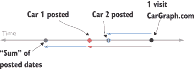

图 6.3 发布销售车辆的时序图

所有这些也适用于标量乘法。我们可以将数值属性和自发布以来的时间跨度乘以一个标量。然而，字符串属性不再有意义。

列表 6.1 通过实现所需方法使 `CarForSale` 表现得像 `Vector`

```
from datetime import datetime

class CarForSale(Vector):
    retrieved_date = datetime(2018,11,30,12)                         ❶
    def __init__(self, model_year, mileage, price, posted_datetime, 
                 model="(virtual)", 
                         source="(virtual)",                         ❷
                 location="(virtual)", description="(virtual)"):
        self.model_year = model_year
        self.mileage = mileage
        self.price = price
        self.posted_datetime = posted_datetime
        self.model = model
        self.source = source
        self.location = location
        self.description = description
    def add(self, other):
        def add_dates(d1, d2):                                       ❸
            age1 = CarForSale.retrieved_date − d1
            age2 = CarForSale.retrieved_date − d2
            sum_age = age1 + age2
            return CarForSale.retrieved_date − sum_age
        return CarForSale(                                           ❹
            self.model_year + other.model_year,
            self.mileage + other.mileage,
            self.price + other.price,
            add_dates(self.posted_datetime, other.posted_datetime)
        )
    def scale(self,scalar):
        def scale_date(d):                                           ❺
            age = CarForSale.retrieved_date − d
            return CarForSale.retrieved_date − (scalar * age)
        return CarForSale(
            scalar * self.model_year,
            scalar * self.mileage,
            scalar * self.price,
            scale_date(self.posted_datetime)
        )
    @classmethod
    def zero(cls):
        return CarForSale(0, 0, 0, CarForSale.retrieved_date)
```

❶ 我在 2018 年 11 月 30 日中午从 CarGraph.com 获取了数据集。

❷ 为了简化虚拟汽车的构建，所有的字符串参数都是可选的，默认值为“(virtual)”。

❸ 辅助函数，通过添加从参考日期的时间跨度来添加日期

❹ 通过添加底层属性并构建一个新的对象来添加 CarForSale 对象

❺ 辅助函数，通过缩放从参考日期的时间跨度来缩放日期时间

在源代码中，你可以找到类的完整实现以及加载样本汽车数据的代码。加载了汽车列表后，我们可以尝试一些向量运算：

```
>>> (cars[0] + cars[1]).__dict__
{'model_year': 4012,
 'mileage': 306000.0,
 'price': 6100.0,
 'posted_datetime': datetime.datetime(2018, 11, 30, 3, 59),
 'model': '(virtual)',
 'source': '(virtual)',
 'location': '(virtual)',
 'description': '(virtual)'}
```

前两辆车的总和显然是一辆 4012 年款的普锐斯（也许它能飞？），行驶里程为 306,000 英里，要价 6,100 美元。它是在我查看 CarGraph.com 的同一天早上 3:59 AM 发布的。这辆不同寻常的汽车看起来不太有用，但请耐心等待，平均数（如下所示）看起来要更有意义：

```
>>> average_prius = sum(cars, CarForSale.zero()) * (1.0/len(cars))
>>> average_prius.__dict__

{'model_year': 2012.5365853658536,
 'mileage': 87731.63414634147,
 'price': 12574.731707317074,
 'posted_datetime': datetime.datetime(2018, 11, 30, 9, 0, 49, 756098),
 'model': '(virtual)',
 'source': '(virtual)',
 'location': '(virtual)',
 'description': '(virtual)'}
```

我们可以从这个结果中学习到真实的东西。市场上平均的普锐斯车龄约为 6 年，行驶里程约为 88,000 英里，售价约为 12,500 美元，而我访问网站的那天早上 9:49 AM 就已经发布了。（在第三部分，我们将花费大量时间通过将数据集视为向量来学习数据集。）

忽略文本数据，`CarForSale`的行为就像一个向量。实际上，它就像一个具有价格、车型年份、里程和发布日期的 4D 向量。它不是一个坐标向量，因为发布日期不是一个数字。尽管数据不是数字的，但该类满足向量空间属性（你可以在练习中的单元测试中验证这一点），因此其对象是向量，可以像这样操作。具体来说，它们是 4D 向量，因此可以在`CarForSale`对象和`Vec4`对象之间编写一对一的映射（这也是你的一个练习）。在我们的下一个例子中，我们将看到一些看起来更像坐标向量但仍然满足定义属性的对象。

### 6.2.3 将函数视为向量

结果表明，数学函数可以被看作是向量。具体来说，我指的是那些接受一个实数并返回一个实数的函数，尽管还有许多其他类型的数学函数。用数学简写来说，函数*f*接受任何实数并返回实数是*f*: ℝ: → ℝ。在 Python 中，我们将考虑接受`float`值并返回`float`值的函数。

就像 2D 或 3D 向量一样，我们可以通过直观或代数方法进行函数的加法和标量乘法。首先，我们可以代数地写出函数；例如，*f*(*x*) = 0.5 · *x* + 3 或 *g*(*x*) = sin(*x*)。或者，我们可以用图形来可视化这些函数。

在源代码中，我编写了一个简单的`plot`函数，该函数可以在指定的输入范围内绘制一个或多个函数的图形（图 6.4）。例如，以下代码在-10 到 10 的*x*值之间绘制了我们的两个函数*f*(*x*)和*g*(*x*)：

```
def f(x):
    return 0.5 * *x* + 3
def *g*(*x*):
    return sin(*x*)
plot([f,g],−10,10)
```

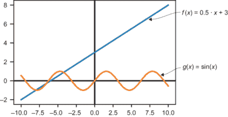

图 6.4 函数 *f*(*x*) = 0.5 · *x* + 3 和 *g*(*x*) = sin(*x*) 的图像

从代数上讲，我们可以通过相加定义它们的表达式来相加函数。这意味着 *f* + *g* 是一个由 (*f* + *g*)(*x*) = *f*(*x*) + *g*(*x*) = 0.5 · *x* + 3 + sin(*x*) 定义的函数。从图形上看，每个点的 *y* 值被相加，所以它就像将两个函数堆叠在一起，如图 6.5 所示。

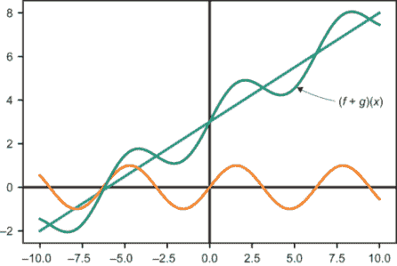

图 6.5 在图上可视化两个函数的和

要实现这个和，你可以编写一些功能性的 Python 代码。这段代码接受两个函数作为输入，并返回一个新的函数，即它们的和：

```
def add_functions(f,g):
    def new_function(*x*):
        return *f*(*x*) + *g*(*x*)
    return new_function
```

同样，我们可以通过将函数的表达式乘以标量来乘以一个函数。例如，3 *g* 定义为 (3 *g*)(*x*) = 3 · *g*(*x*) = 3 · sin(*x*)。这会使函数 *g* 在 *y* 方向上拉伸 3 倍（如图 6.6 所示）。


图 6.6 函数 (3g) 看起来就像函数 g 在 *y* 方向上拉伸了 3 倍。

可以将 Python 函数封装在一个继承自向量的类中，这留作你的练习。完成之后，你可以编写令人满意的函数算术表达式，如 3 · *f* 或 2 · *f* − 6 · *g*。你甚至可以使这个类 *可调用* 或接受参数，就像它是一个函数一样，允许表达式如 (*f* + *g*)(6)。不幸的是，为了确定函数是否满足向量空间属性，单元测试要困难得多，因为很难生成随机函数或测试两个函数是否相等。要真正知道两个函数是否相等，你必须知道它们对每个可能的输入都返回相同的输出。这意味着要对每个实数或至少每个 `float` 值进行测试！

这引出了另一个问题：函数向量空间的 *维度* 是什么？或者，更具体地说，需要多少个实数坐标才能唯一标识一个函数？

与将 `Vec3` 对象的坐标命名为 *x*、*y* 和 *z* 不同，你可以从 *i* = 1 到 3 对它们进行索引。同样，你也可以从 *i* = 1 到 15 对 `Vec15` 的坐标进行索引。然而，一个函数有无限多个定义它的数字；例如，任何 *x* 值的 *f*(*x*)。换句话说，你可以将 *f* 的坐标视为它在每个点的值，通过所有实数而不是前几个整数进行索引。这意味着函数向量空间是 *无限维的*。这有重要的含义，但它主要使得所有函数的向量空间难以处理。我们稍后会回到这个空间，具体来看一些更简单的子集。现在，让我们回到有限维度的舒适区，看看两个更多的例子。

### 6.2.4 将矩阵视为向量

因为一个 *n* × *m* 矩阵是一系列 *n* · *m* 个数字，尽管它们排列成一个矩形，但我们仍然可以将其视为一个 *n* · *m* 维向量。例如，5×3 矩阵的向量空间与 15D 坐标向量的向量空间之间的唯一区别是坐标以矩阵的形式呈现。我们仍然逐个坐标地相加和进行标量乘法。图 6.7 展示了这种加法是如何进行的。

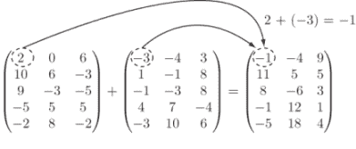

图 6.7 通过相加对应项来加两个 5×3 矩阵

实现 5×3 矩阵的类继承自 `Vector` 比简单地实现一个 `Vec15` 类需要更多的输入，因为你需要两个循环来遍历矩阵。然而，算术运算并不比本列表中展示的更复杂。

列表 6.2 将 5×3 矩阵视为向量的类

```
class Matrix5_by_3(Vector):
    rows = 5                                          ❶
    columns = 3
    def __init__(self, matrix):
        self.matrix = matrix
    def add(self, other):
        return Matrix5_by_3(tuple(
            tuple(a + b for a,b in zip(row1, row2))
            for (row1, row2) in zip(self.matrix, other.matrix)
        ))
    def scale(self,scalar):
        return Matrix5_by_3(tuple(
            tuple(scalar * *x* for *x* in row)
            for row in self.matrix
        ))
    @classmethod
    def zero(cls):
        return Matrix5_by_3(tuple(                    ❷
            tuple(0 for j in range(0, cls.columns))
            for i in range(0, cls.rows)
        ))
```

❶ 你需要知道行数和列数才能构造零矩阵。

❷ 5×3 矩阵的零向量是一个由所有零组成的 5×3 矩阵。将这个向量加到任何其他 5×3 矩阵 M 上，结果仍然是 M。

你同样可以创建一个 `Matrix2_by_2` 类或一个 `Matrix99_by_17` 类来表示不同的向量空间。在这些情况下，大部分实现都是相同的，但维度将不再是 15，而是 2 × 2 = 4 或 99 × 17 = 1,683。作为一个练习，你可以创建一个继承自 `Vector` 的 `Matrix` 类，包括所有数据，除了指定的行数和列数。然后任何 `MatrixM_by_N` 类都可以继承自 `Matrix`。

矩阵的有趣之处不在于它们是排列成网格的数字，而在于我们可以将它们视为表示线性函数。我们已经看到数字列表和函数是向量空间的两种情况，但结果是矩阵在两种意义上都是向量。如果一个矩阵 *a* 有 *n* 行和 *m* 列，它表示从 *m* 维空间到 *n* 维空间的线性函数。（你可以用 *a* : ℝ^(*m*) → ℝ^(*n*) 来用数学简写表达同样的句子。）

正如我们添加和标量乘以从 ℝ → ℝ 的函数一样，我们也可以添加和标量乘以从 ℝ^(*m*) → ℝ^(*n*) 的函数。在本节末尾的小型项目中，你可以尝试运行矩阵的向量空间单元测试，以检查它们在两种意义上都是向量。这并不意味着数字网格本身没有用处；有时我们并不关心将它们解释为函数。例如，我们可以使用数字数组来表示图像。

### 6.2.5 使用向量运算操作图像

在计算机上，图像以称为 *像素* 的彩色方块的数组形式显示。典型的图像可以有几百像素高和几百像素宽。在彩色图像中，需要三个数字来指定任何给定像素的颜色（RGB）的红色、绿色和蓝色内容（图 6.8）。总共，一个 300×300 像素的图像由 300 · 300 · 3 = 270,000 个数字指定。当将这种大小的图像视为向量时，像素存在于一个 270,000 维的空间中！

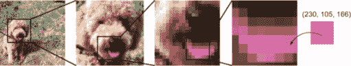

图 6.8 将我的狗梅尔巴的图片放大，直到我们可以挑选出一个包含红色、绿色和蓝色内容（分别为 230、105、166）的像素

根据你阅读的格式，你可能看不到梅尔巴舌头的粉红色。但因为我们将在这次讨论中以数值而不是视觉方式表示颜色，所以一切应该仍然有意义。你还可以在本书的源代码中查看全彩图片。

Python 有一个事实上的标准图像处理库 PIL，它以 `pillow` 包名在 pip 中分发。你不需要学习很多关于这个库的知识，因为我们立即将我们对它的使用封装在一个新的类（列表 6.3）中。这个类 `ImageVector` 从 `Vector` 继承，存储 300×300 图像的像素数据，并支持加法和标量乘法。

列表 6.3 表示图像为向量的类

```
from PIL import Image
class ImageVector(Vector):
    size = (300,300)                                                ❶
    def __init__(self,input):
        try:
            img = Image.open(input).\
                  resize(ImageVector.size)                          ❷
            self.pixels = img.getdata()
        except:
            self.pixels = input                                     ❸
    def image(self):
        img = Image.new('RGB', ImageVector.size)                    ❹
        img.putdata([(int(r), int(g), int(b)) 
                     for (r,g,b) in self.pixels])
        return img
    def add(self,img2):                                             ❺
        return ImageVector([(r1+r2,g1+g2,b1+b2) 
                            for ((r1,g1,b1),(r2,g2,b2)) 
                            in zip(self.pixels,img2.pixels)])
    def scale(self,scalar):                                         ❻
        return ImageVector([(scalar*r,scalar*g,scalar*b) 
                      for (r,g,b) in self.pixels])
    @classmethod
    def zero(cls):                                                  ❼
        total_pixels = cls.size[0] * cls.size[1]
        return ImageVector([(0,0,0) for _ in range(0,total_pixels)])
    def _repr_png_(self):                                           ❽
        return self.image()._repr_png_()
```

❶ 处理固定大小的图像：例如 300×300 像素

❷ 构造函数接受图像文件的名称。我们使用 PIL 创建一个 Image 对象，将其调整大小为 300×300，然后使用 getdata() 方法提取其像素列表。每个像素是一个由红色、绿色和蓝色值组成的元组。

❸ 构造函数还接受像素列表。

❹ 此方法返回由类上存储的像素重建的基本 PIL 图像。值必须转换为整数以创建可显示的图像。

❺ 通过为每个像素的相应红色、绿色和蓝色值执行向量加法来对图像执行向量加法

❻ 通过将每个像素的红色、绿色和蓝色值乘以给定的标量来执行标量乘法

❼ 零图像在任何像素处都没有红色、绿色或蓝色内容。

❽ Jupyter 笔记本可以显示 PIL 图像的内联，只要我们传递底层图像的 _repr_png_ 函数的实现。

配备了这个库，我们可以通过文件名加载图像，并对图像执行向量运算。例如，两个图片的平均值可以按以下方式计算为线性组合，结果如图 6.9 所示：

```
0.5 * ImageVector("inside.JPG") + 0.5 * ImageVector("outside.JPG")

```


图 6.9 梅尔巴两张图像的平均值作为线性组合

虽然任何 `ImageVector` 都是有效的，但渲染为视觉上不同的最小和最大颜色值分别是 0 和 255。因此，任何导入的图像的负值将是黑色，因为每个像素的亮度都低于最小亮度。同样，正标量乘数很快就会变得苍白，因为大多数像素都超过了可显示的最大亮度。图 6.10 展示了这些特性。

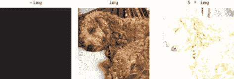

图 6.10 图像的否定和标量乘法

要创建视觉上有趣的变化，您需要执行将您带入所有颜色正确亮度范围的运算。零向量（黑色）和所有值都等于 255 的向量（白色）是很好的参考点。例如，从图像中减去一个全白色图像的效果是反转颜色。如图 6.11 所示，对于以下白色向量

```
white = ImageVector([(255,255,255) for _ in range(0,300*300)])
```

减去一个图像会产生一个令人毛骨悚然的重新着色的图片。（即使你在黑白图片中查看，差异也应该很显著。）

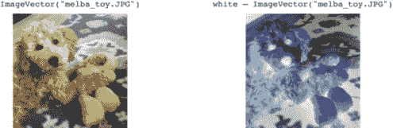

图 6.11 通过从纯白色图像中减去图像来反转图像的颜色

向量代数显然是一个通用概念：加法和标量乘法的定义概念适用于数字、坐标向量、函数、矩阵、图像以及许多其他类型的对象。当我们将相同的数学应用于无关领域时，看到这样的视觉结果是非常引人注目的。我们将记住所有这些向量空间的例子，并继续探索它们之间可以做出的推广。

### 6.2.6 练习

| **练习 6.8**：使用 `u`、`v` 和 `w` 的浮点值而不是从 `Vector` 类继承的对象来运行向量空间单元测试。这表明实数确实是向量。**解决方案**：使用随机标量作为向量、零向量作为零向量，以及 `math.isclose` 作为相等测试，100 次随机测试通过：

```
for i in range(0,100):
    a,b = random_scalar(), random_scalar()
    u,v,w = random_scalar(), random_scalar(), random_scalar()
    test(0, isclose, a,b,u,v,w)
```

|

| **练习 6.9-迷你项目**：运行 `CarForSale` 的向量空间单元测试以显示其对象形成一个向量空间（忽略它们的文本属性）。**解决方案**：大部分工作是在生成随机数据并构建一个近似相等测试，如下所示，该测试处理日期和时间：

```
from math import isclose
from random import uniform, random, randint
from datetime import datetime, timedelta

def random_time():
    return CarForSale.retrieved_date − timedelta(days=uniform(0,10))

def approx_equal_time(t1, t2):
    test = datetime.now()
    return isclose((test-t1).total_seconds(), (test-t2).total_seconds())

def random_car():
    return CarForSale(randint(1990,2019), randint(0,250000), 
              27000\. * random(), random_time())

def approx_equal_car(c1,c2):
    return (isclose(c1.model_year,c2.model_year) 
            and isclose(c1.mileage,c2.mileage) 
            and isclose(c1.price, c2.price)
            and approx_equal_time(c1.posted_datetime, c2.posted_datetime))

for i in range(0,100):
    a,b = random_scalar(), random_scalar()
    u,v,w = random_car(), random_car(), random_car()
    test(CarForSale.zero(), approx_equal_car, a,b,u,v,w)
```

|

| **练习 6.10**：实现一个名为 `Function(Vector)` 的类，该类将其构造函数的参数为一个单变量函数，并实现一个 `__call__` 方法，以便您可以将其视为一个函数。您应该能够运行 `plot([f,g,f+g,3*g],−10,10)`。**解决方案**：

```
class Function(Vector):
    def __init__(self, f):
        self.function = f
    def add(self, other):
        return Function(lambda x: self.function(*x*) + other.function(*x*))
    def scale(self, scalar):
        return Function(lambda x: scalar * self.function(*x*))
    @classmethod
    def zero(cls):
        return Function(lambda x: 0)
    def __call__(self, arg):
        return self.function(arg)

f = Function(lambda x: 0.5 * *x* + 3)
g = Function(sin)

plot([f, g, f+g, 3*g], −10, 10)
```

最后行的结果是显示在这个图中：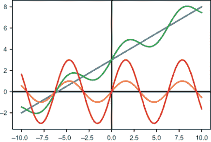我们的对象 `f` 和 `g` 的行为像向量，因此我们可以将它们相加并标量乘以它们。因为它们也像函数一样，我们可以绘制它们。|

| **练习 6.11-迷你项目**：测试函数的等价性是困难的。尽力编写一个函数来测试两个函数是否相等。**解答**：因为我们通常对行为良好、连续的函数感兴趣，所以检查它们在几个随机输入值上的值是否接近可能就足够了，如下所示：

```
def approx_equal_function(f,g):
    results = []
    for _ in range(0,10):
        x = uniform(−10,10)
        results.append(isclose(f(x),g(x)))
    return all(results)
```

不幸的是，这可能会给我们带来误导性的结果。以下返回`True`，尽管函数不能等于零：

```
approx_equal_function(lambda x: (x*x)/x, lambda x: x)
```

结果表明，计算函数的等价性是一个**不可解**的问题。也就是说，已经证明没有算法可以保证任意两个函数是否相等。|

| **练习 6.12-迷你项目**：对`Function`类进行单元测试，以证明函数满足向量空间的属性。**解答**：测试函数等价性很困难，生成随机函数也很困难。在这里，我使用了一个`Polynomial`类（你将在下一节中遇到）来生成一些随机的多项式函数。使用前一个迷你项目中的`approx_equal_function`，我们可以使测试通过：

```
def random_function():
    degree = randint(0,5)
    p = Polynomial(*[uniform(−10,10) for _ in range(0,degree)])
    return Function(lambda x: *p*(*x*))

for i in range(0,100):
    a,b = random_scalar(), random_scalar()
    u,v,w = random_function(), random_function(), random_function()
    test(Function.zero(), approx_equal_function, a,b,u,v,w)
```

|

| **练习 6.13-迷你项目**：实现一个`Function2(Vector)`类，它存储一个像*f(x, y)* = *x* + *y*这样的两个变量的函数。**解答**：定义与`Function`类没有太大区别，但所有函数都给出了两个参数：

```
class Function(Vector):
    def __init__(self, f):
        self.function = f
    def add(self, other):
        return Function(lambda x,y: self.function(x,y) + other.function(x,y))
    def scale(self, scalar):
        return Function(lambda x,y: scalar * self.function(x,y))
    @classmethod
    def zero(cls):
        return Function(lambda x,y: 0)
    def __call__(self, *args):
        return self.function(*args)
```

例如，*f(x, y)* = *x* + *y*和*g(x, y)* = *x* − *y* +1 的和应该是 2*x* + 1。我们可以确认这一点：

```
>>> f = Function(lambda x,y:x+y)
>>> g = Function(lambda x,y: x-y+1)
>>> (f+g)(3,10)
7
```

|

| **练习 6.14**：9×9 矩阵的向量空间的维度是多少？

1.  9

1.  18

1.  27

1.  81

**解答**：一个 9×9 矩阵有 81 个条目，所以有 81 个独立的数字（或坐标）来决定它。因此，它是一个 81 维的向量空间，答案*d*是正确的。|

| **练习 6.15-迷你项目**：实现一个从`Vector`继承的`Matrix`类，具有表示行数和列数的抽象属性。你不应该能够实例化一个`Matrix`类，但你可以通过从`Matrix`继承并显式指定行数和列数来创建一个`Matrix5_by_3`类。**解答**：

```
class Matrix(Vector):
    @abstractproperty
    def rows(self):
        pass
    @abstractproperty
    def columns(self):
        pass
    def __init__(self,entries):
        self.entries = entries
    def add(self,other):
        return self.__class__(
            tuple(
                tuple(self.entries[i][j] + other.entries[i][j]
                        for j in range(0,self.columns()))
                for i in range(0,self.rows())))
    def scale(self,scalar):
        return self.__class__(
            tuple(
                tuple(scalar * e for e in row) 
                for row in self.entries))
    def __repr__(self):
        return "%s%r" % (self.__class__.__qualname__, self.entries)
    def zero(self):
        return self.__class__(
            tuple(
                tuple(0 for i in range(0,self.columns())) 
                for j in range(0,self.rows())))
```

|

| 现在我们可以快速实现任何表示固定大小矩阵的向量空间类，例如，2×2：

```
class Matrix2_by_2(Matrix):
    def rows(self):
        return 2
    def columns(self):
        return 2  
```

然后，我们可以像向量一样使用 2×2 矩阵：

```
>>> 2 * Matrix2_by_2(((1,2),(3,4))) + Matrix2_by_2(((1,2),(3,4)))
Matrix2_by_2((3, 6), (9, 12))
```

|

| **练习 6.16**：对`Matrix5_by_3`类进行单元测试，以证明它遵循向量空间的定义属性。**解答**：

```
def random_matrix(rows, columns):
    return tuple(
        tuple(uniform(−10,10) for j in range(0,columns))
        for i in range(0,rows)
    )

def random_5_by_3():
    return Matrix5_by_3(random_matrix(5,3))

def approx_equal_matrix_5_by_3(m1,m2):
    return all([
        isclose(m1.matrix[i][j],m2.matrix[i][j]) 
        for j in range(0,3)
        for i in range(0,5)
    ])

for i in range(0,100):
    a,b = random_scalar(), random_scalar()
    u,v,w = random_5_by_3(), random_5_by_3(), random_5_by_3()
    test(Matrix5_by_3.zero(), approx_equal_matrix_5_by_3, a,b,u,v,w)
```

|

| **练习 6.17-迷你项目**：编写一个从`Vector`继承的`LinearMap3d_to_5d`类，它使用 5×3 矩阵作为其数据，但实现`__call__`以作为从ℝ³到ℝ⁵的线性映射。证明它与`Matrix5_by_3`在底层计算上是一致的，并且它独立地通过了向量空间的定义属性。 |
| --- |
| **练习 6.18-迷你项目**：编写一个 Python 函数，使你能够将 `Matrix5_by_3` 对象与 `Vec3` 对象按矩阵乘法的方式进行乘法。更新向量类和矩阵类的 `*` 操作符的重载，以便你可以将向量左乘以标量或矩阵。 |
| **练习 6.19**: 证明对于 `ImageVector` 类的零向量，当它被添加时不会明显改变任何图像。**解决方案**：对于你选择的任何图像，查看 `ImageVector ("my_image.jpg") + ImageVector.zero()` 的结果。 |

| **练习 6.20**: 选择两张图像，并显示它们的 10 个不同加权平均值。这些将在 270,000 维空间中连接图像的线段上的点！**解决方案**：我运行了以下代码，其中 *s* = 0.1, 0.2, 0.3, ..., 0.9, 1.0：

```
s * ImageVector("inside.JPG") + (1-s) * ImageVector("outside.JPG")
```

当你并排放置你的图像时，你会得到类似这样的东西！两张图像的多个不同加权平均值

| **练习 6.21**: 将向量空间单元测试适配到图像并运行它们。你的随机单元测试作为图像看起来是什么样子？**解决方案**：生成随机图像的一种方法是在每个像素处放置随机的红色、绿色和蓝色值，例如，

```
def random_image():
    return ImageVector([(randint(0,255), randint(0,255), randint(0,255))
                            for i in range(0,300 * 300)])
```

|

| 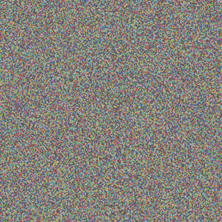结果是模糊的一团糟，但这对我们来说无关紧要。单元测试比较每个像素。使用以下近似相等测试，我们可以运行测试：

```
def approx_equal_image(i1,i2):
    return all([isclose(c1,c2)
        for p1,p2 in zip(i1.pixels,i2.pixels)
        for c1,c2 in zip(p1,p2)])

for i in range(0,100):
    a,b = random_scalar(), random_scalar()
    u,v,w = random_image(), random_image(), random_image()
    test(ImageVector.zero(), approx_equal_image, a,b,u,v,w)
```

|

## 6.3 寻找更小的向量空间

300×300 彩色图像的向量空间有 270,000 维，这意味着我们需要列出这么多数字来指定任何这种大小的图像。这本身并不是一个问题的数据量，但当我们有更大的图像、大量的图像，或者将成千上万的图像连接起来制作电影时，数据量就会累积起来。

在本节中，我们探讨如何从一个向量空间开始，找到更小的空间（具有更少的维度），同时保留原始空间中的大部分有趣数据。对于图像，我们可以减少图像中使用的不同像素的数量，或者将其转换为黑白。结果可能不美丽，但仍然可以辨认。例如，图 6.12 右侧的图像需要 900 个数字来指定，而左侧的图像需要 270,000 个数字来指定。

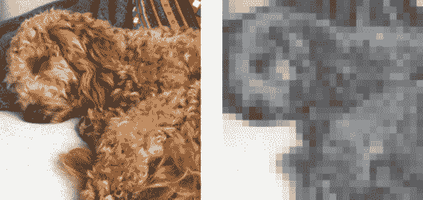

图 6.12 将由 270,000 个数字指定的图像（左侧）转换为由 900 个数字指定的另一个图像（右侧）

看起来像右侧的图片生活在 270,000 维空间的 900 维 *子空间* 中。这意味着它们仍然是 270,000 维的图像向量，但可以用只有 900 个坐标来表示或存储。这是研究 *压缩* 的起点。我们不会深入探讨压缩的最佳实践，但我们会仔细研究向量空间的子空间。

### 6.3.1 识别子空间

向量子空间，或简称子空间，正如其名所示：存在于另一个向量空间内部的向量空间。我们已经多次看过的例子是 3D 空间内的 2D *x*, *y*平面，即*z* = 0 的平面。具体来说，这个子空间由形式为(*x*, *y*, 0)的向量组成。这些向量有三个分量，因此它们是真正的 3D 向量，但它们形成了一个恰好位于平面上的子集。因此，我们说这是ℝ³的 2D 子空间。

注意：为了避免过于繁琐，由有序对(*x*, *y*)组成的 2D 向量空间ℝ²，在技术上不是 3D 空间ℝ³的子空间。这是因为形式为(*x*, y)的向量不是 3D 向量。然而，它与向量(*x*, *y*, 0)的集合一一对应，向量代数在是否有额外的零*z*坐标的情况下看起来都一样。因此，我认为称ℝ²为ℝ³的子空间是可以的。

并非 3D 向量的每个子集都是子空间。*z* = 0 的平面是特殊的，因为向量(x, y, 0)形成了一个自包含的向量空间。在这个平面上，无法构建向量的线性组合，使其“逃离”这个平面；第三个坐标始终为零。在数学术语中，精确地说一个子空间是自包含的，可以说它是线性组合下的*封闭*。

为了了解向量子空间在一般情况下是什么样的，让我们寻找向量空间的子集，这些子集也是子空间（见图 6.13）。平面上哪些向量的子集可以构成一个独立的向量空间？我们能否仅仅在平面上画任何区域，然后只取其内部的向量？

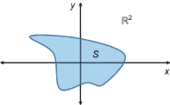

图 6.13 S 是平面ℝ²中点的（向量）子集。S 是ℝ²的子空间吗？

答案是否定的：图 6.13 中的子集包含一些位于 x 轴上的向量和一些位于 y 轴上的向量。这些向量分别可以被缩放，给我们标准的基向量***e***[1] = (1, 0)和***e***[2] = (0, 1)。从这些向量中，我们可以通过线性组合得到平面上的任何点，而不仅仅是*S*（见图 6.14）。

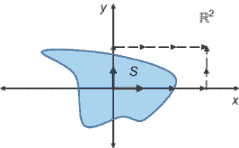

图 6.14 *S*中两个向量的线性组合为我们提供了一个“逃离”*S*的途径。它不能是平面的子空间。

而不是画一个随机的子空间，让我们模仿 3D 空间中平面的例子。没有*z*坐标，所以我们选择*y* = 0 的点。这留下了 x 轴上的点，形式为(*x*, 0)。无论我们如何努力，我们都无法找到这种形式的向量的线性组合，它们具有非零的*y*坐标（见图 6.15）。

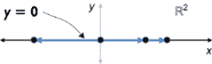

图 6.15 关注 y = 0 的直线。这是一个向量空间，包含其所有点的线性组合。

这条线，*y* = 0，是 ℝ² 的向量子空间。正如我们最初在三维空间中找到一个二维子空间一样，我们也找到了二维空间中的一个一维子空间。与三维 *空间* 或二维 *平面* 不同，这样的 1 维向量空间被称为 *线*。实际上，我们可以将这个子空间识别为实数线 ℝ。

下一步可以是设置 *x* = 0。一旦我们将 *x* = 0 和 *y* = 0 都设置为 0，就只剩下一个点：零向量。这同样是一个向量子空间！无论你如何取零向量的线性组合，结果都是零向量。这是 1 维线、2 维平面和 3 维空间的零维子空间。从几何上看，零维子空间是一个点，而这个点必须是零。如果它是其他点，例如 *v*，它也会包含 0 · *v* = 0 和无数其他不同的标量倍数，如 3 · *v* 和 −42 · *v*。让我们继续这个想法。

### 6.3.2 从单个向量开始

包含非零向量 ***v*** 的向量子空间包含（至少）***v*** 的所有标量倍数。从几何上看，非零向量 ***v*** 的所有标量倍数都位于原点的一条线上，如图 6.16 所示。

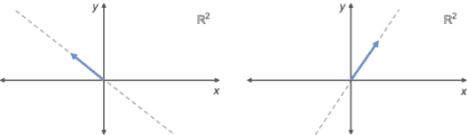

图 6.16 两条不同的向量，用虚线表示它们所有标量倍数的位置。

通过原点的每条线都是一个向量空间。无法通过添加或缩放该空间内的向量来逃离任何这样的线。这在三维空间中通过原点的线也是成立的：它们都是单个三维向量的线性组合，并形成一个向量空间。这是构建子空间的一般方法的第一例：选择一个向量，并查看所有必须与之一起出现的线性组合。

### 6.3.3 生成更大的空间

给定一组一个或多个向量，它们的 *span* 被定义为所有线性组合的集合。span 的重要之处在于它自动是一个向量子空间。为了重新表述我们刚才发现的，单个向量 ***v*** 的 span 是通过原点的一条线。我们通过在大括号中包含对象来表示一组对象，因此只包含 ***v*** 的集合是 {***v***}，这个集合的 span 可以写成 span({***v***})。

一旦我们包含另一个向量 ***w***，它不与 ***v*** 平行，空间就会变大，因为我们不再局限于单一线性方向。由两个向量 {***v***, ***w***} 生成的空间包括两条线，即 span({***v***}) 和 span({***w***})，以及包含 ***v*** 和 ***w*** 的线性组合，这些组合既不在任何一条线上（见图 6.17）。

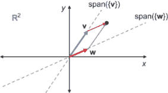

图 6.17 两条非平行向量的空间。每个向量单独生成一条线，但它们一起生成更多的点，例如，*v* + *w* 不在任何一条线上。

虽然可能不太明显，但这两个向量的张成空间是整个平面。这在平面上任何一对非平行向量中都是成立的，但对于标准基向量来说尤为显著。任何点(*x*, *y*)都可以表示为线性组合*x* · (1, 0) + *y* · (0, 1)。对于其他非平行向量对，如**v** = (1, 0)和**w** = (1, 1)，也是如此，但需要更多的代数运算来证明。

你可以通过(1, 0)和(1, 1)的适当线性组合得到任何点，如(4, 3)。要得到 3 的*y*坐标，需要三个向量(1, 1)。那就是(3, 3)而不是(4, 3)，所以可以通过添加一个单位的(1, 0)来纠正*x*坐标。这样我们就得到了线性组合 3 · (1, 1) + 1 · (1, 0)，它将我们带到了图 6.18 中显示的点(4, 3)。

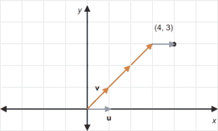

图 6.18 通过(1, 0)和(1, 1)的线性组合得到任意点(4, 3)

单个非零向量在 2D 或 3D 中张成一条线，而且，两个非平行向量可以张成整个 2D 平面或在 3D 空间中通过原点的平面。由两个 3D 向量张成的平面可能看起来像图 6.19 中所示的那样。

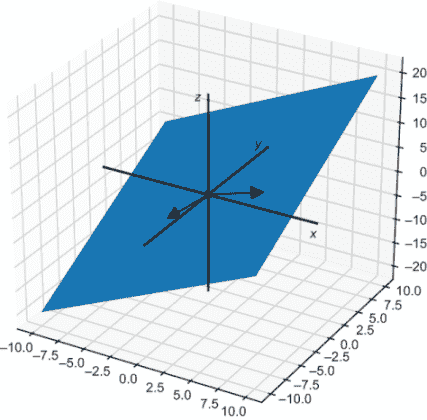

图 6.19 由两个 3D 向量张成的平面

它是斜的，所以它看起来不像*z* = 0 的平面，它也不包含三个标准基向量中的任何一个。但仍然是一个平面，是 3D 空间的一个向量子空间。一个向量张成 1D 空间，两个非平行向量张成 2D 空间。如果我们向其中添加一个第三个非平行向量，这三个向量是否张成 3D 空间？图 6.20 清楚地表明答案是否定的。

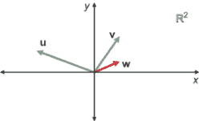

图 6.20 只能张成 2D 空间的三个非平行向量

向量**u**、**v**和**w**的任意一对都不平行，但这些向量并不张成 3D 空间。它们都位于 2D 平面上，因此它们的任意线性组合都不能张成 3D 空间。

神奇地获得一个*z*坐标。我们需要对“非平行”向量的概念进行更好的推广。

如果我们要将一个向量添加到集合中并生成一个更高维度的空间，新的向量需要指向一个不在现有向量张成空间中的新方向。在平面上，三个向量总是存在一些冗余。例如，如图 6.21 所示，**u**和**w**的线性组合给出了**v**。

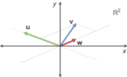

图 6.21 *z*和*w*的线性组合返回*v*，因此**u**、**v**和**w**的张成空间不应大于**z**和*w*的张成空间。

“非平行”的正确推广是**线性无关**。如果一个向量集合中的任何一个向量都可以表示为其他向量的线性组合，那么这个向量集合就是**线性相关**的。两个平行的向量是线性相关的，因为它们是彼此的标量倍数。同样，向量集合{***u***, ***v***, ***w***}是线性相关的，因为我们可以用***u***和***w***的线性组合来得到***v***（或者用***w***的线性组合来得到***u***和***v***，以此类推）。你应该确保自己对这个概念有深刻的理解。作为本节末尾的一个练习，你可以检查一下三个向量（1, 0），（1, 1）和（−1, 1）中的任何一个都可以写成另外两个向量的线性组合。

相比之下，集合{***u***, ***v***}是**线性无关**的，因为它们的分量非平行，不能是彼此的标量倍数。这意味着***u***和***v***张成的空间比它们各自单独张成的空间要大。同样，标准基{***e***[1], ***e***[2], ***e***[3] }对于ℝ³是一个线性无关的集合。这些向量中的任何一个都不能由其他两个向量构建，而且需要所有三个向量来张成三维空间。我们开始接触到向量空间或子空间的性质，这些性质表明了它的维度。

### 6.3.4 定义维度

这是一个激励人心的问题：以下这组三维向量是否线性无关？

{(1, 1, 1), (2, 0, −3), (0, 0, 1), (−1, −2, 0)}

要回答这个问题，你可以在三维空间中绘制这些向量，或者尝试找到三个向量的线性组合来得到第四个向量。但有一个更简单的答案：只需要三个向量就可以张成整个三维空间，所以任何包含四个三维向量的列表都必须有一些冗余。

我们知道，一个包含一个或两个三维向量的集合将分别张成一条线或一个平面，而不是整个ℝ³。三个向量是魔法数字，既可以张成三维空间，又可以保持线性无关。这正是我们称之为三维的原因：毕竟有三个独立的方向。

一个张成整个向量空间（如ℝ³的{***e***[1], ***e***[2], ***e***[3] }）的线性无关向量集合被称为**基**。任何空间的一个基都有相同数量的向量，这个数量就是它的**维度**。例如，我们看到了（1, 0）和（1, 1）是线性无关的，并且张成了整个平面，因此它们是向量空间ℝ²的一个基。同样，（1, 0, 0）和（0, 1, 0）是线性无关的，并且张成了ℝ³中*z* = 0 的平面。这使得它们成为这个二维子空间的基，尽管不是整个ℝ³的基。

我已经在“标准基”的上下文中使用了“基”这个词，对于 ℝ² 和 ℝ³。它们被称为“标准”，因为它们是如此自然的选择。在标准基中分解坐标向量不需要计算；坐标 *就是* 这个分解中的标量。例如，(3, 2) 表示线性组合 3 · (1, 0) + 2 · (0, 1) 或 3***e***[1] + 2***e***[2]。

通常，判断向量是否线性无关需要一些工作。即使你知道一个向量是某些其他向量的线性组合，找到这个线性组合也需要做一些代数运算。在下一章中，我们将介绍如何做到这一点；这最终成为线性代数中的一个普遍计算问题。但在那之前，让我们再练习一下识别子空间和测量它们的维度。

### 6.3.5 寻找函数向量空间的子空间

从 ℝ 到 ℝ 的数学函数包含无限多的数据，即当它们被给以无限多个实数作为输入时的输出值。但这并不意味着描述一个函数需要无限多的数据。例如，线性函数只需要两个实数。它们是这个通用公式中 *a* 和 *b* 的值，你可能已经见过：

*f*(*x*) = *ax* + *b*

其中 *a* 和 *b* 可以是任何实数。这比所有函数的无限维空间更容易处理。任何线性函数都可以由两个实数指定，所以看起来线性函数的子空间将是 2D。

注意：我在过去几章中使用了“线性”这个词的许多新上下文。在这里，我回到了你在高中代数中使用的含义：一个 *线性函数* 是其图形是一条直线的函数。不幸的是，这种形式的函数在我们花了整个第四章讨论的意义上不是线性的，你可以在练习中自己证明这一点。因此，我将尽力在任何时候都清楚地说明我使用的“线性”这个词的含义。

我们可以快速实现一个继承自 `Vector` 的 `LinearFunction` 类。它不是持有函数作为其底层数据，而是可以持有两个数字作为系数 *a* 和 *b*。我们可以通过相加系数来添加这些函数，因为

(*ax* + *b*) + (*cx* + *d*) = (*ax* + *cx*) + (*b* + *d*) = (*a* + *c*)*x* + (*b* + *d*)

我们可以通过将两个系数乘以标量来缩放函数：*r*(*ax* + *b*) = *rax* + *rb*。最后，结果证明零函数 *f*(*x*) = 0 也是线性的。这是 *a* = *b* = 0 的情况。以下是实现方法：

```
class LinearFunction(Vector):
    def __init__(self,a,b):
        self.a = a
        self.b = b
    def add(self,v):
        return LinearFunction(self.a + v.a, self.b + v.b)
    def scale(self,scalar):
        return LinearFunction(scalar * self.a, scalar * self.b)
    def __call__(self,x):
        return self.a * *x* + self.b
    @classmethod
    def zero(cls):
        return LinearFunction(0,0,0)
```

如图 6.22 所示，结果是线性函数 `plot([LinearFunction (−2,2)],−5,5)` 给出了 *f*(*x*) = −2*x* + 2 的直线图。

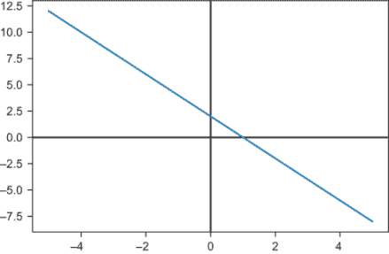

图 6.22 代表 *f*(*x*) = −2*x* + 2 的 `LinearFunction(−2,2)` 的图形

我们可以通过写一个基来证明线性函数形成了一个维度为 2 的向量子空间。基向量应该是函数，它们应该覆盖整个线性函数空间，并且应该是线性无关的（不是彼此的倍数）。这样的集合是{*x*, 1}，或者更具体地说，是{*f*(*x*) = *x*, *g*(*x*) = 1}。这样命名，形式为*ax* + *b*的函数可以写成线性组合*a* · *f* + *b* · *g*。

这是我们能接近线性函数标准基的最接近的方法；*f*(*x*) = *x*和*f*(*x*) = 1 是明显不同的函数，不是彼此的标量倍数。相比之下，*f*(*x*) = *x*和*h*(*x*) = 4*x*是彼此的标量倍数，不会是一个线性无关的对。但是{*x*, 1}不是我们唯一能选择的基；{4 *x* + 1, *x* − 3}也是一个基。

同样的概念适用于形式为*f*(*x*) = *ax*² + *bx* + *c*的*二次函数*。这些构成了函数向量空间中的一个 3 维子空间，其中一个基的选择是{*x*², *x*, 1}。线性函数构成了一个向量子空间，其中二次函数的*x*²分量是零。线性函数和二次函数是*多项式函数*的例子，它们是*x*的幂的线性组合；例如，

*f*(*x*) = *a*[0] + *a*[1] *x* + *a*[2] *x*² + ... + *a[n]* *x^n*

线性函数和二次函数分别具有*次数*1 和 2，因为每个函数中出现的最高次幂是*x*。前面方程中写的多项式具有*n*次幂，总共有*n* + 1 个系数。在练习中，你会看到任何次数的多项式空间构成了函数空间中的另一个向量子空间。

### 6.3.6 图像子空间

由于我们的`ImageVector`对象由 270,000 个数字表示，我们可以遵循标准基公式并构建一个由 270,000 个图像组成的基，每个图像中有一个 270,000 个数字等于 1，其余都等于 0。列表显示了第一个基向量将看起来是什么样子。

列表 6.4 构建第一个标准基向量的伪代码

```
ImageVector([
    (1,0,0), (0,0,0), (0,0,0), ..., (0,0,0),  ❶
    (0,0,0), (0,0,0), (0,0,0), ..., (0,0,0),  ❷
    ...                                       ❸
])
```

❶ 只有第一行的第一个像素是非零的：它有一个红色值为 1。所有其他像素的值为(0,0,0)。

❷ 第二行由 300 个黑色像素组成，每个像素的值为(0,0,0)。

❸ 我跳过了接下来的 298 行，但它们都与第 2 行相同；没有任何像素有任何颜色值。

这个单个向量覆盖了一个一维子空间，其中图像除了左上角有一个红色像素外都是黑色的。这个图像的标量倍数在这个位置可以有更亮或更暗的红色像素，但其他像素不能被照亮。为了显示更多像素，我们需要更多的基向量。

从列出这些 270,000 个基向量中学习的东西并不多。相反，让我们寻找一组可以覆盖有趣子空间的向量。这里有一个由每个位置上的深灰色像素组成的单个`ImageVector`：

```
gray = ImageVector([
    (1,1,1), (1,1,1), (1,1,1), ..., (1,1,1),
    (1,1,1), (1,1,1), (1,1,1), ..., (1,1,1),
    ...
])
```

更简洁地说，我们可以这样写：

```
gray = ImageVector([(1,1,1) for _ in range(0,300*300)])
```

想象由单个向量灰度生成的子空间的一种方法是通过查看属于它的某些向量。图 6.23 显示了灰度的标量倍数。

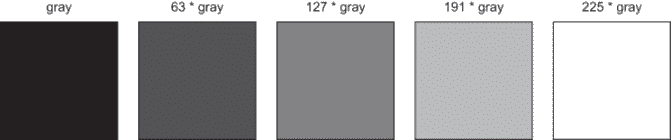

图 6.23 由`ImageVector`的灰度实例生成的 1D 子空间中的一些向量。

这组图像在通俗意义上是“一维”的。它们只有一个属性在变化，那就是亮度。

另一种看待这个子空间的方法是考虑像素值。在这个子空间中，任何图像在每个像素处的值都相同。对于任何给定的像素，有一个由红、绿、蓝坐标测量的 3D 颜色可能性空间。灰度像素形成这个空间的 1D 子空间，包含所有坐标为*s* · (1, 1, 1)的点，其中*s*是一个标量（图 6.24）。

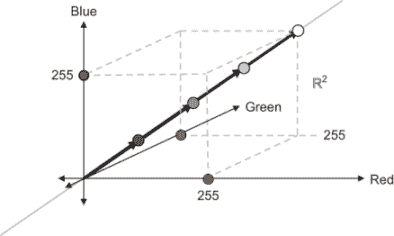

图 6.24 一条线上的不同亮度的灰度像素。灰度像素形成像素值 3D 向量空间的 1D 子空间。

基础中的每个图像都会是黑色，除了一个像素会是非常暗的红色、绿色或蓝色。一次改变一个像素不会产生显著的结果，所以让我们寻找更小、更有趣的子空间。

你可以探索许多图像的子空间。你可以查看任何颜色的纯色图像。这些图像的形式如下：

```
ImageVector([
    (r,g,b), (r,g,b), (r,g,b), ..., (r,g,b),
    (r,g,b), (r,g,b), (r,g,b), ..., (r,g,b),
    ...
])
```

像素本身没有约束；纯色图像的唯一约束是每个像素都相同。作为一个最终的例子，你可以考虑由图 6.25 所示的类似低分辨率、灰度图像组成的子空间。

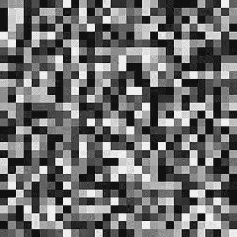

图 6.25 一个低分辨率的灰度图像。每个 10×10 像素块具有相同的值。

每个像素块在其像素之间具有恒定的灰度值，使其看起来像一个 30×30 的网格。定义这个图像的只有 30×30=900 个数字，所以像这样的图像定义了图像 270,000 维空间中的 900 维子空间。数据量少得多，但仍然可以创建可识别的图像。

在这个子空间中创建图像的一种方法是从任何图像开始，并平均每个 10×10 像素块中的所有红、绿和蓝色值。这个平均值给出了亮度*b*，你可以将块中的所有像素设置为(*b*, *b*, *b*)来构建你的新图像。这实际上是一个线性映射（图 6.26），你可以将其作为迷你项目稍后实现。


图 6.26 线性映射将任何图像（左侧）转换为一个新图像（右侧），该图像位于 900 维子空间中。

我家的狗，梅尔巴，在第二张照片中并不那么上镜，但照片仍然可以辨认。这就是我在本节开头提到的例子，令人惊奇的是，你只需用 0.3% 的数据就能判断出这是同一张照片。显然还有改进的空间，但将映射到子空间的方法是更深入探索的起点。在第十三章中，我们将看到如何以这种方式压缩音频数据。

### 6.3.7 练习题

| **练习 6.22**: 给出几何论证，说明以下平面区域 *S* 为什么不能成为平面的向量子空间。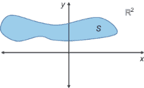**解答**: 这个区域中许多点的线性组合最终不会落在该区域内。更明显的是，这个区域不能成为向量空间，因为它不包含零向量。零向量是任何向量的标量倍数（通过标量零），因此它必须包含在任何向量空间或子空间中。 |
| --- |
| **练习 6.23**: 证明平面上 *x* = 0 的区域形成一个 1D 向量空间。**解答**: 这些是位于 y 轴上的向量，形式为 (0, *y*)，其中 *y* 是实数。形式为 (0, *y*) 的向量的加法和标量乘法与实数相同；只是碰巧有一个额外的 0 一起出现。我们可以得出结论，这实际上是 ℝ 的伪装，因此是一个 1D 向量空间。如果你想要更严谨，你可以明确检查所有向量空间性质。 |
| **练习 6.24**: 通过将每个向量表示为其他两个向量的线性组合，证明三个向量 (1, 0), (1, 1), 和 (−1, 1) 是线性相关的。**解答**:(1, 0) = ½ · (1, 1) − ½ · (−1, 1)(1, 1) = 2 · (1, 0) + (−1, 1)(−1, 1) = (1, 1) − 2 · (1, 0) |
| **练习 6.25**: 证明你可以将任意向量 (*x*, *y*) 表示为 (1, 0) 和 (1, 1) 的线性组合。**解答**: 我们知道 (1, 0) 不能对 *y*-坐标做出贡献，因此我们需要 *y* 倍的 (1, 1) 作为线性组合的一部分。为了使代数运算成立，我们需要 (*x* − *y*) 单位的 (1, 0)：(*x*, *y*) = (*x* − *y*) · (1, 0) + *y*(1, 1) |
| **练习 6.26**: 给定一个单个向量 ***v***，解释为什么所有 ***v*** 的线性组合的集合与所有 ***v*** 的标量倍数的集合相同。**解答**: 向量的线性组合和自身根据向量空间的一条法则简化为标量倍数。例如，线性组合 *a* · ***v*** + *b* · ***v*** 等于 (*a* + *b*) · ***v***。 |
| **练习 6.27**: 从几何角度解释为什么不通过原点的直线不是向量子空间（平面或三维空间的子空间）。**解答**: 这不能成为子空间的一个简单原因是它不包含原点（零向量）。另一个原因是这样的直线将有两个非平行向量。它们的生成空间将是整个平面，这比直线大得多。 |
| **练习 6.28**: {***e***[1], ***e***[2], ***e***[3] } 中的任意两个向量都无法张成整个 ℝ³，而是会张成 3D 空间中的 2D 子空间。这些子空间是什么？**解答**: 集合 {***e***[1], ***e***[2] } 的张成由所有线性组合 *a* · ***e***[1] + *b* · ***e***[2] 组成，或者 *a* · (1, 0, 0) + *b* · (0, 1, 0) = (*a*, *b*, 0)。根据 *a* 和 *b* 的选择，这可以是平面上 *z* = 0 的任意一点，通常称为 *x*,*y* 平面。通过同样的论证，向量 {***e***[2], ***e***[3] } 张成 *x* = 0 的平面，称为 *y*,*z* 平面，而向量 {***e***[1], ***e***[3] } 张成 *y* = 0 的平面，称为 *x*,*z* 平面。 |
| **练习 6.29**: 将向量 (−5, 4) 写成 (0, 3) 和 (−2, 1) 的线性组合。**解答**: 只有 (−2, 1) 可以对 *x* 坐标做出贡献，因此我们需要在和中包含 2.5 · (−2, 1)。这使我们得到 (−5, 2.5)，因此我们需要在 *x* 坐标上额外 1.5 个单位或 0.5 · (0, 3)。线性组合是(−5, 4) = 0.5 · (0, 3) + 2.5 · (−2, 1) |
| **练习 6.30-迷你项目**: 向量 (1, 2, 0), (5, 0, 5), 和 (2, −6, 5) 是线性无关还是线性相关？**解答**: 找到这一点并不容易，但前两个向量的一个线性组合可以得到第三个向量：−3 · (1, 2, 0) + (5, 0, 5) = (2, −6, 5)。这意味着第三个向量是多余的，向量*是*线性相关的。它们只张成 3D 空间中的 2D 子空间，而不是整个 3D 空间。 |
| **练习 6.31**: 解释为什么线性函数 *f*(*x*) = *ax* + *b* 除非 *b* = 0，否则不是从向量空间 ℝ 到自身的线性映射。**解答**: 我们可以直接转向定义：线性映射必须保持线性组合。我们看到 *f* 并不保持实数的线性组合。例如，*f*(1+1) = 2*a* + *b*，而 *f*(1) + *f*(1) = (*a* + *b*) + (*a* + *b*) = 2*a* + 2*b*。除非 *b* = 0，否则这不会成立。作为另一种解释，我们知道线性函数 ℝ: → ℝ 应该可以表示为 1x1 矩阵。1D 列向量 [*x* ] 与 1x1 矩阵 [ *a* ] 的矩阵乘法给出 [ *ax* ]。这是一个不寻常的矩阵乘法情况，但第五章中的实现确认了这一结果。如果一个函数 ℝ: → ℝ 将要成为线性函数，它必须与 1x1 矩阵乘法一致，因此必须是乘以一个标量。 |

| **练习 6.32**: 通过继承 `Vec2` 类并实现 `__call__` 方法来重建 `LinearFunction` 类。**解答**: `Vec2` 的数据称为 *x* 和 *y* 而不是 *a* 和 *b*；否则，功能相同。你只需要实现 `__call__` 方法：

```
class LinearFunction(Vec2):
    def __call__(self,input):
        return self.x * input + self.y
```

|

| **练习 6.33**: 证明（代数地！）形式为 *f*(*x*) = *ax* + *b* 的线性函数构成了所有函数向量空间的一个向量子空间。**解答**：为了证明这一点，你需要确保两个线性函数的线性组合仍然是另一个线性函数。如果 *f*(*x*) = *ax* + *b* 和 *g*(*x*) = *cx* + *d*，那么 *r* · *f* + *s* · *g* 返回 *r* · *f* + *s* · *g* = *r* · (*ax* + *b*) + *s* · (*cx* + *d*) = *rax* + *b* + *scx* + *d* = (*ra* + *sc*) · *x* + (*b* + *d*)因为 (*ra* + *sc*) 和 (*b* + *d*) 是标量，这符合我们想要的形式。我们可以得出结论，线性函数在线性组合下是封闭的，因此它们构成一个子空间。 |
| --- |
| **练习 6.34**: 找到一个 3x3 矩阵集合的基。这个向量空间的维数是多少？**解答**：这里有一个由九个 3x3 矩阵组成的基！它们是线性无关的；每个矩阵都对任何线性组合贡献了一个独特的项。它们也张成了这个空间，因为任何矩阵都可以被表示为这些矩阵的线性组合；任何特定矩阵的系数决定了结果中的一个项。因为这九个向量提供了 3x3 矩阵空间的基，所以这个空间有九个维度。 |

| **练习 6.35-迷你项目**：实现一个类 `QuadraticFunction(Vector)`，它表示形式为 *ax*² + *bx* + *c* 的函数向量子空间。这个子空间的基是什么？**解答**：这个实现看起来很像 `LinearFunction`，除了有三个系数而不是两个，并且 `__call__` 函数有一个平方项：

```
class QuadraticFunction(Vector):
    def __init__(self,a,b,c):
        self.a = a
        self.b = b
        self.*c* = c
    def add(self,v):
        return QuadraticFunction(self.a + v.a, 
                                 self.b + v.b, 
                                 self.c + v.c)
    def scale(self,scalar):
        return QuadraticFunction(scalar * self.a, 
                                 scalar * self.b, 
                                 scalar * self.c)
    def __call__(self,x):
        return self.a * *x* * *x* + self.b * *x* + self.c
    @classmethod
    def zero(cls):
        return QuadraticFunction(0,0,0)
```

|

| 我们可以注意到 *ax*² + *bx* + *c* 看起来像是集合 {*x*², *x*, 1} 的线性组合。确实，这三个函数张成了这个空间，而且这三个函数中的任何一个都不能被表示为其他函数的线性组合。例如，通过将线性函数相加无法得到 *x*² 项。因此，这是一个基。因为有三个向量，我们可以得出结论，这是函数空间的 3D 子空间。 |
| --- |
| **练习 6.36-迷你项目**：我声称 {4 *x* + 1, *x* − 2} 是线性函数集合的一个基。证明你可以将 −2*x* + 5 表示为这两个函数的线性组合。**解答**：(\( \frac{1}{9} \)) · (4*x* + 1) − (\( \frac{22}{9} \)) · (*x* − 2) = −2*x* + 5。如果你的代数技能不是很生疏，你可以手动解决这个问题。否则，不用担心；我们将在下一章中介绍如何解决这类难题。 |

| **练习 6.37-迷你项目**：所有多项式的向量空间是一个无限维的子空间。实现这个向量空间作为一个类，并描述一个基（这必须是一个无限集！）**解答**：

```
class Polynomial(Vector):
    def __init__(self, *coefficients):
        self.coefficients = coefficients
    def __call__(self,x):
        return sum(coefficient * *x* ** power 
                   for (power,coefficient) 
                   in enumerate(self.coefficients))
    def add(self,p):
        return Polynomial([a + b 
                          for a,b 
                          in zip(self.coefficients, 
                                 p.coefficients)])
    def scale(self,scalar):
        return Polynomial([scalar * a  
                           for a in self.coefficients])
        return "$ %s $" % (" + ".join(monomials))
    @classmethod
    def zero(cls):
        return Polynomial(0)
```

所有多项式的集合的基是无限集 {1, *x*, *x*², *x*³, *x*⁴, ...}。给定所有可用的 *x* 的幂，你可以将任何多项式表示为线性组合。|

| **练习 6.38**：我向你展示了 270,000 维图像空间的基向量的伪代码。第二个基向量看起来会是什么样子？**解答**：第二个基向量可以通过在下一个可能的位置放置一个 1 来给出。它将在图像的非常左上角产生一个深绿色像素：

```
ImageVector([
    (0,1,0), (0,0,0), (0,0,0), ..., (0,0,0),  ❶
    (0,0,0), (0,0,0), (0,0,0), ..., (0,0,0),  ❷
    ...
])
```

❶ 对于第二个基向量，1 已经移动到第二个可能的位置。❷ 所有其他行保持为空 |

| **练习 6.39**：编写一个函数`solid_color(r,g,b)`，该函数返回一个具有给定红色、绿色和蓝色内容的每个像素的纯色`ImageVector`。**解答**：

```
def solid_color(r,g,b):
    return ImageVector([(r,g,b) for _ in range(0,300*300)])
```

|

| **练习 6.40-迷你项目**：编写一个线性映射，它从 30×30 的灰度图像生成一个`ImageVector`，该图像实现为一个 30×30 的亮度值矩阵。然后，实现一个线性映射，它将 300×300 的图像转换为 30×30 的灰度图像，通过在每个像素处平均亮度（红色、绿色和蓝色的平均值）来实现。**解答**：

```
image_size = (300,300)
total_pixels = image_size[0] * image_size[1]
square_count = 30                                ❶
square_width = 10

def ij(n):
    return (n // image_size[0], n % image_size[1])

def to_lowres_grayscale(img):                    ❷

    matrix = [
        [0 for i in range(0,square_count)]
        for j in range(0,square_count)
    ]
    for (n,p) in enumerate(img.pixels):
        i,j = ij(n)
        weight = 1.0 / (3 * square_width * square_width)
        matrix[i // square_width][ j // square_width] += (sum(p) * weight)
    return matrix
def from_lowres_grayscale(matrix):            ❸
    def lowres(pixels, ij):
        i,j = ij
        return pixels[i // square_width][ j // square_width]
    def make_highres(limg):
        pixels = list(matrix)
        triple = lambda x: (x,x,x)
        return ImageVector([triple(lowres(matrix, ij(n))) for n in range(0,total_pixels)])
    return make_highres(matrix)
```

❶ 表示我们将图片分割成 30×30 的网格❷ 函数接受一个 ImageVector 并返回一个包含 30 个 30 值数组的数组，每个值代表一个灰度值，按平方排列。❸ 第二个函数接受一个 30×30 的矩阵，并返回一个由 10×10 像素块组成的图像，亮度由矩阵值给出。调用`from_lowres_grayscale(to_lowres_grayscale(img))`将图像`img`转换为我在章节中展示的方式。|

## 摘要

+   向量空间是二维平面和三维空间的一般化：一组可以加法和标量乘法的对象。这些加法和标量乘法操作必须以某种方式表现（在 6.1.5 节中列出），以模仿在二维和三维中更熟悉的操作。

+   你可以通过在 Python 中将不同数据类型的共同特性拉入一个抽象基类并从中继承来泛化。

+   你可以在 Python 中重载算术运算符，以便无论使用什么类型的向量，代码中的向量数学看起来都一样。

+   加法和标量乘法需要以某种方式表现，以符合你的直觉，你可以通过编写涉及随机向量的单元测试来验证这些行为。

+   实际对象，如二手车，可以用几个数字（坐标）来描述，因此可以被视为向量。这使得我们可以考虑像“两辆车的加权平均值”这样的抽象概念。

+   函数可以被看作是向量。你可以通过添加或乘以定义它们的表达式来添加或乘以它们。

+   矩阵可以被看作是向量。一个*m* × *n*矩阵的条目可以被看作是一个(*m* · *n*)-维向量的坐标。添加或标量乘以矩阵的效果与添加或标量乘以它们定义的线性函数的效果相同。

+   固定高度和宽度的图像组成一个向量空间。它们在每个像素处由红色、绿色和蓝色（RGB）值定义，因此坐标的数量以及空间的维度由像素数量的三倍定义。

+   向量空间的一个子空间是向量空间中向量的一个子集，它本身也是一个向量空间。也就是说，子空间中向量的线性组合仍然保持在子空间内。

+   对于通过原点的任意二维或三维直线，位于其上的向量集形成一个一维子空间。对于通过原点的任意三维平面，位于其上的向量形成一个二维子空间。

+   向量集的张成是指所有向量的线性组合的集合。它保证是向量所在空间的子空间。

+   如果你不能将任何一个向量表示为其他向量的线性组合，那么这个向量集是线性**独立**的。否则，该集合是线性**相关**的。一个能够张成向量空间（或子空间）的线性独立向量集被称为该空间的**基**。对于给定的空间，任何基都将包含相同数量的向量。这个数量定义了空间的维度。

+   当你可以将你的数据视为存在于向量空间中时，子空间通常由具有相似属性的数据组成。例如，由纯色图像向量组成的子集形成一个子空间。

* * *

1. 也就是说，只要你能保证你的向量空间只有有限多个维度！存在一个称为ℝ∞的向量空间，但它并不是唯一的无穷维向量空间。
