# 7 解决线性方程组

本章涵盖

+   在 2D 视频游戏中检测物体碰撞

+   编写方程来表示直线，并找到平面上直线的交点

+   在 3D 或更高维度中描绘和解决线性方程组

+   将向量重写为其他向量的线性组合

当你想到代数时，你可能想到需要“解出 *x*”的问题。例如，你可能花了相当多的时间在代数课上学习如何解方程 3*x*² + 2*x* + 4 = 0；也就是说，找出哪些 *x* 的值可以使方程成立。

线性代数作为代数的一个分支，具有相同类型的计算问题。不同之处在于你想要解决的问题可能是一个向量或矩阵，而不是一个数字。如果你参加传统的线性代数课程，你可能会覆盖很多算法来解决这类问题。但因为你手头有 Python，你只需要知道如何识别你面临的问题，并选择合适的库来为你找到答案。

我将介绍你在现实世界中会遇到的最重要一类线性代数问题：*线性方程组*。这些问题归结为找到直线、平面或其更高维的类似物相交的点。一个例子是臭名昭著的高中数学问题，涉及两列火车在不同时间和速度下从波士顿和纽约出发。但由于我不假设你对铁路运营感兴趣，我将使用一个更有趣的例子。

在本章中，我们构建了一个经典的《小行星》街机游戏的简单重制（图 7.1）。在这个游戏中，玩家控制一个代表宇宙飞船的三角形，并向漂浮在其周围的代表小行星的多边形发射激光。玩家必须摧毁小行星，以防止它们撞击并摧毁宇宙飞船。


图 7.1 经典《小行星》街机游戏的设置

游戏中的关键机制之一是判断激光是否击中了一颗小行星。这需要我们弄清楚定义激光束的直线是否与勾勒小行星的线段相交。如果这些直线相交，小行星将被摧毁。我们首先设置游戏，然后我们将看到如何解决背后的线性代数问题。

在我们实现游戏之后，我将向你展示这个 2D 示例如何推广到 3D 或任何数量的维度。本章的后半部分涵盖了一些更多的理论，但它将完善你的线性代数教育。我们将涵盖许多你在大学水平的线性代数课程中会找到的主要概念，尽管深度不如。完成本章后，你应该为打开一本更密集的线性代数教科书并填补细节做好了充分准备。但就目前而言，让我们专注于构建我们的游戏。

## 7.1 设计街机游戏

在本章中，我专注于一个简化的版本的小行星游戏，其中飞船和小行星是静态的。在源代码中，你会发现我已经使小行星移动，我们将在第二部分介绍如何根据物理定律使它们移动。

2 本书。为了开始，我们建模游戏实体——飞船、激光和小行星——并展示如何在屏幕上渲染它们。

### 7.1.1 游戏建模

在本节中，我们将飞船和小行星作为游戏中的多边形显示。与之前一样，我们将它们建模为向量的集合。例如，我们可以用八个向量（如图 7.2 中的箭头所示）表示一个八边形小行星，并将它们连接起来绘制其轮廓。

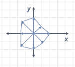

图 7.2 代表小行星的八边形

小行星或宇宙飞船在穿越太空时会进行平移或旋转，但其形状保持不变。因此，我们将表示这种形状的向量与中心点的 *x* 和 *y* 坐标分开存储，这些坐标会随时间变化。我们还存储一个角度，表示物体在当前时刻的旋转角度。`PolygonModel` 类代表一个游戏实体（飞船或小行星），它保持其形状但可以进行平移或旋转。它通过一组定义小行星轮廓的向量点进行初始化，默认情况下，其中心 *x* 和 *y* 坐标及其旋转角度被设置为零：

```
class PolygonModel():
    def __init__(self,points):
        self.points = points
        self.rotation_angle = 0
        self.x = 0
        self.y = 0
```

当飞船或小行星移动时，我们需要通过 `self .x,self.y` 应用平移，并通过 `self.rotation_angle` 应用旋转，以找出其实际位置。作为一个练习，你可以给 `PolygonModel` 添加一个方法来计算围绕其实际变换的向量。

飞船和小行星是 `PolygonModel` 的特例，它们会自动初始化为各自的形状。例如，飞船具有固定的三角形形状，由三个点给出：

```
class Ship(PolygonModel):
    def __init__(self):
        super().__init__([(0.5,0), (−0.25,0.25), (−0.25,-0.25)])
```

对于小行星，我们通过在等间距的角度和 0.5 到 1.0 之间的随机长度下初始化 5 到 9 个向量。这种随机性赋予了小行星一些特征：

```
class Asteroid(PolygonModel):
    def __init__(self):
        sides = randint(5,9)                                          ❶
        vs = [vectors.to_cartesian((uniform(0.5,1.0), 2*pi*i/sides)) 
                for i in range(0,sides)]                              ❷
        super().__init__(vs)
```

❶ 小行星具有介于 5 到 9 之间的随机边数。

❷ 长度在 0.5 和 1.0 之间随机选择，角度是 2*π*/n 的倍数，其中 n 是边的数量。

定义了这些对象后，我们可以将它们实例化并在屏幕上渲染。

### 7.1.2 渲染游戏

对于游戏的初始状态，我们需要一艘飞船和几个小行星。飞船可以开始于屏幕中心，但小行星应该在屏幕上随机分布。我们可以显示一个平面区域，范围从-10 到 10，在 *x* 和 *y* 方向上如下所示：

```
ship = Ship()

asteroid_count = 10
asteroids = [Asteroid() for _ in range(0,asteroid_count)]   ❶

for ast in asteroids:                                       ❷
    ast.x = randint(−9,9)
    ast.y = randint(−9,9)
```

❶ 创建一个指定数量的 Asteroid 对象列表，在这种情况下，10 个

❷ 将每个对象的位置设置为介于-10 和 10 之间的随机点，以便在屏幕上显示

我使用一个 400×400 像素的屏幕，这需要在渲染之前将*x*和*y*坐标进行转换。使用 PyGame 内置的 2D 图形而不是 OpenGL，屏幕左上角的像素坐标是(0, 0)，右下角是(400, 400)。这些坐标不仅更大，而且它们是平移的，并且是颠倒的，因此我们需要编写一个`to_pixels`函数（如图 7.3 所示）来完成从我们的坐标系到 PyGame 像素的转换。

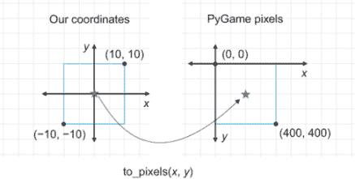

图 7.3 `to_pixels`函数将对象从我们的坐标系中心映射到 PyGame 屏幕中心。

通过实现`to_pixels`函数，我们可以编写一个函数将定义多边形的点绘制到 PyGame 屏幕上。首先，我们取定义多边形的变换点（平移和旋转），并将它们转换为像素。然后，我们使用 PyGame 函数绘制它们：

```
GREEN = (0, 255, 0)
def draw_poly(screen, polygon_model, color=GREEN):
    pixel_points = [to_pixels(x,y) for x,y in polygon_model.transformed()]
    pygame.draw.aalines(screen, color, True, pixel_points, 10)            ❶
```

❶ 绘制连接给定点到指定 PyGame 对象的线条。True 参数将第一个和最后一个点连接起来，创建一个封闭的多边形。

你可以在源代码中看到整个游戏循环，但基本上每次渲染帧时都会调用`draw_poly`函数来绘制船和每个小行星。结果是我们在 PyGame 窗口中的简单三角形太空船，周围环绕着小行星场（如图 7.4）。

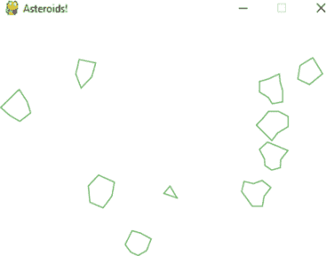

图 7.4 在 PyGame 窗口中渲染的游戏

### 7.1.3 射击激光

现在是至关重要的部分：给我们的船提供一种防御方式！玩家应该能够使用左右箭头键瞄准船，然后按空格键发射激光。激光束应该从太空船的尖端发出，延伸到屏幕的边缘。

在我们发明的 2D 世界中，激光束应该是一条从太空船的*变换*尖端开始，并指向船所指方向的线段。我们可以通过使其足够长来确保它达到屏幕的末端。因为激光的线段与`Ship`对象的状态相关联，我们可以在`Ship`类中创建一个方法来计算它：

```
class Ship(PolygonModel):
    ...
   def laser_segment(self):
        dist = 20\. * sqrt(2)                        ❶
        x,y = self.transformed()[0]                 ❷
        return ((x,y), 
            (*x* + dist * cos(self.rotation_angle), 
             y + dist*sin(self.rotation_angle)))    ❸
```

❶ 使用勾股定理找到适合屏幕的最长线段

❷ 获取定义点中的第一个值（船的尖端）

❸ 使用三角学找到激光如果从尖端（x,y）延伸 dist 单位，在 self.rotation_angle 角度的终点（如图 7.5）

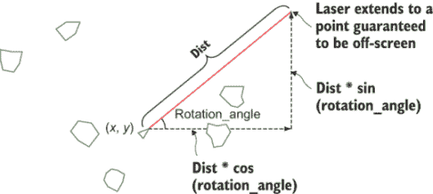

图 7.5 使用三角学找到激光束结束的屏幕外点

在源代码中，你可以看到如何让 PyGame 响应按键并仅在按下空格键时将激光绘制为线段。最后，如果玩家发射激光并击中了一颗小行星，我们想知道发生了什么。在游戏循环的每一次迭代中，我们都要检查每一颗小行星是否被激光击中。我们通过`PolygonModel`类上的`does_intersect(segment)`方法来完成这项工作，该方法计算输入线段是否与给定的`PolygonModel`的任何线段相交。最终的代码包括以下类似的几行：

```
laser = ship.laser_segment()                  ❶
keys = pygame.key.get_pressed()               ❷
    if keys[pygame.K_SPACE]:
    draw_segment(*laser)

    for asteroid in asteroids:
        if asteroid.does_intersect(laser):    ❸
            asteroids.remove(asteroid)
```

❶ 根据飞船的当前位置和方向计算代表激光束的线段

❷ 检测哪些键被按下。如果按下空格键，则使用辅助函数 draw_segment（类似于 draw_poly）将激光束渲染到屏幕上。

❸ 对于每一颗小行星，检查激光线段是否与之相交。如果是这样，通过从小行星列表中删除它来销毁给定的小行星。

剩下的工作是实现`does_intersect(segment)`方法。在下一节中，我们将介绍实现该方法的数学原理。

### 7.1.4 练习

| **练习 7.1**：在`PolygonModel`上实现一个`transformed()`方法，该方法返回模型通过对象的*x*和*y*属性平移以及通过其`rotation_angle`属性旋转的点。**解决方案**：确保首先应用旋转；否则，平移向量也会被旋转角度旋转；例如，

```
class PolygonModel():
    ...
    def transformed(self):
        rotated = [vectors.rotate2d(self.rotation_angle, v) for *v*  in self.points]
        return [vectors.add((self.x,self.y),v) for *v*  in rotated]
```

|

| **练习 7.2**：编写一个函数`to_pixels(x,y)`，它接受在-10 < x < 10 和 -10 < y < 10 的正方形中的*x*和*y*坐标对，并将它们映射到相应的 PyGame *x*和*y*像素坐标，每个坐标的范围从 0 到 400。**解决方案**：

```
width, height = 400, 400
def to_pixels(x,y):
    return (width/2 + width * *x*/ 20, height/2 − height * y / 20)
```

|

## 7.2 线的交点查找

当前的问题是判断激光束是否击中小行星。为此，我们将查看定义小行星的每个线段，并判断它是否与定义激光束的线段相交。我们可以使用几种算法，但我们将将其作为一个*两个变量的线性方程组*来解决这个问题。从几何学的角度来看，这意味着查看由小行星的边缘和激光束定义的直线，并观察它们的交点（图 7.6）。

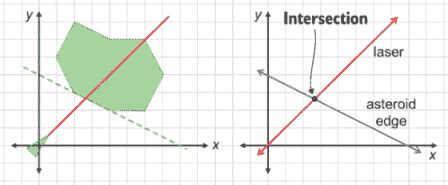

图 7.6 激光击中小行星的边缘（左侧）以及相应的线性方程组（右侧）

一旦我们知道了交点的位置，我们就可以判断它是否位于两个线段的范围之内。如果是这样，线段就发生了碰撞，小行星被击中。我们首先回顾平面内直线的方程，然后介绍如何找到两条直线的交点。最后，我们为游戏编写`does_intersect`方法的代码。

### 7.2.1 选择合适的直线公式

在上一章中，我们看到了二维平面的 1D 子空间是直线。这些子空间由单个选择的向量***v***的所有标量倍数*t* · ***v***组成。因为这样的标量倍数中有一个是 0 · ***v***，所以这些直线总是通过原点，因此*t* · ***v***并不是我们遇到的任何直线的通用公式。

如果我们从通过原点的直线开始，并通过另一个向量***u***进行平移，我们可以得到任何可能的直线。这条直线上的点具有形式***u*** + *t* · ***v***，其中*t*是某个标量。例如，取***v*** = (2, −1)。形式为*t* · (2, −1)的点位于通过

如果我们通过第二个向量进行平移，***u*** = (2, 3)，那么现在的点是(2, 3) + *t* · (2, −1)，这些点构成了一条不通过原点的直线（图 7.7）。

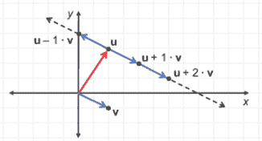

图 7.7 向量*z* = (2, 3)和***v*** = (2, −1)。形式为*z* + t · ***v***的点位于一条直线上。

任何直线都可以描述为某些向量***u***和***v***以及所有可能的标量倍数*t*的点***u*** + *t* · ***v***。这可能不是你习惯的直线的一般公式。我们不是将*y*作为*x*的函数来写，而是给出了直线上点的*x*和*y*坐标作为另一个参数*t*的函数。有时，你会看到直线写成 r(*t*) = ***u*** + *t* · ***v***，以表明这条直线是标量参数*t*的向量值函数 r。输入*t*决定了从起点***u***到输出 r(*t*)需要走多少个单位的***v***。

这种直线公式的优点是，如果你在线上有两个点，那么找到它非常简单。如果你的点是***u***和***w***，那么你可以使用***u***作为平移向量，而***w*** − ***u***作为缩放向量（图 7.8）。

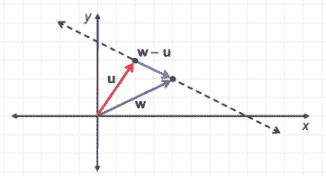

图 7.8 给定*z*和*w*，连接它们的直线是 r(*t*) = *z* + t · (*w* − u)。

公式 r(*t*) = ***u*** + *t* · ***v***也有其缺点。正如你在练习中将会看到的，用这种形式写同一条直线有多个方法。额外的参数*t*也使得解方程更困难，因为有一个额外的未知变量。让我们看看一些具有其他优点的替代公式。

如果你回忆起高中时的直线公式，那可能就是*y* = *m* · *x* + *b*。这个公式很有用，因为它明确地将*y*-坐标作为*x*-坐标的函数给出。在这个形式下，画直线很容易；你通过一系列*x*值，计算相应的*y*值，并在得到的(*x*, *y*)点上画点。但这个公式也有一些局限性。最重要的是，你不能表示像 r(*t*) = (3, 0) + *t* · (0, 1)这样的垂直线。这是由*x* = 3 组成的向量线。

我们将继续使用*参数*公式 r(*t*) = ***u*** + *t* · ***v***，因为它避免了这个问题，但有一个没有额外参数*t*的公式可以表示任何直线会更好。我们使用的公式是*ax* + *by* = *c*。例如，我们在最后几张图片中看到的直线可以写成*x* + 2*y* = 8（见图 7.9）。它是满足该方程的平面上的(*x*, *y*)点集。

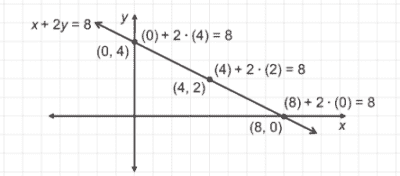

图 7.9 线上的所有(*x, y*)点满足*x* + 2*y = 8。

形式*ax* + *by* = *c*没有额外参数，可以表示任何直线。即使是垂直线也可以用这种形式表示；例如，*x* = 3 可以写成 1 · *x* + 0 · *y* = 3。任何表示直线的方程都称为*线性*方程，而此方程特别称为线性方程的*标准形式*。我们更喜欢在本章中使用它，因为它使得组织我们的计算变得容易。

### 7.2.2 求直线标准形式方程

公式*x* + 2*y* = 8 是包含示例小行星上某一段的直线方程。接下来，我们将看看另一个（见图 7.10），然后尝试系统地找到线性方程的标准形式。准备好一点代数！我会仔细解释每个步骤，但阅读起来可能有点枯燥。如果你自己用铅笔和纸跟着做，会更有趣。

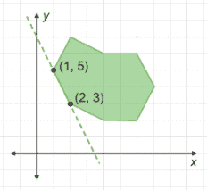

图 7.10 点(1, 5)和(2, 3)定义了小行星的第二段。

向量(1, 5) − (2, 3)是(−1, 2)，与直线平行。因为(2, 3)位于直线上，所以直线的参数方程是*r*(*t*) = (2, 3) + *t* · (−1, 2)。知道直线上所有点的形式为(2, 3) + *t* · (−1, 2)（对于某个*t*），我们如何将这个条件改写为标准形式方程？我们需要做一些代数运算，特别是消除*t*。因为(*x*, *y*) = (2, 3) + *t* · (−1, 2)，我们实际上有两个起始方程：

*x* = 2 − *t*

*y* = 3 + 2*t*

我们可以操作这两个方程，得到两个具有相同值(2*t*)的新方程：

4 − 2*x* = 2*t*

*y* − 3 = 2*t*

因为左侧的两个表达式都等于 2*t*，所以它们相等：

4 - 2*x* = *y* - 3

现在，我们已经消除了*t*！最后，将*x*和*y*项移到一边，我们得到标准形式方程：

2*x* + *y* = 7

这个过程并不太难，但如果我们要将其转换为代码，就需要更精确地了解如何操作。让我们尝试解决一般问题：给定两个点(*x*[1], *y*[1])和(*x*[2], *y*[2])，通过这两个点的直线方程是什么（见图 7.11）？

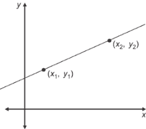

图 7.11 通过两个已知点求直线方程的一般问题

使用参数公式，直线上的点具有以下形式：

(*x*, *y*) = (*x*[1], *y*[1]) + t · (*x*[2] - *x*[1], *y*[2] - *y*[1])

这里有很多 *x* 和 *y* 变量，但记住，*x*[1]，*x*[2]，*y*[1]，和 *y*[2] 在这次讨论中都是常数。我们假设我们有两个已知坐标的点，我们也可以像 (*a*, *b*) 和 (*c*, *d*) 一样称呼它们。变量是 *x* 和 *y*（没有下标），它们代表线上任何点的坐标。像之前一样，我们可以将这个方程分成两部分：

*x* = *x*[1] + *t* · (*x*² − *x*[1])

*y* = *y*[1] + *t* · (*y*² − *y*[1])

我们可以将 *x*[1] 和 *y*[1] 移到它们各自方程的左边：

*x* − *x*[1] = *t* · (*x*[2] − *x*[1])

*y* − *y*[1] = *t* · (*y*[2] − *y*[1])

我们接下来的目标是使两个方程的右边看起来相同，这样我们就可以将左边设置为相等。将第一个方程的两边乘以 (*y*[2] − *y*[1])，将第二个方程的两边乘以 (*x*[2] − *x*[1])，我们得到

(*y*[2] − *y*[1]) · (*x* − *x*[1]) = *t* · (*x*[2] − *x*[1]) · (*y*[2] − *y*[1])

(*x*[2] − *x*[1]) · (*y* − *y*[1]) = *t* · (*x*[2] − *x*[1]) · (*y*[2] − *y*[1])

因为右边是相同的，我们知道第一个和第二个方程的左边也相等。这让我们可以创建一个没有 *t* 的新方程：

(*y*[2] − *y*[1]) · (*x* − *x*[1]) = (*x*[2] − *x*[1]) · (*y* − *y*[1])

记住，我们想要一个形式为 *ax* + *by* = *c* 的方程，所以我们需要将 *x* 和 *y* 放在同一侧，并将常数放在另一侧。我们可以做的第一件事是展开两边：

(*y*[2] − *y*[1]) · *x* − (*y*[2] − *y*[1]) · *x* = (*x*[2] − *x*[1]) · y − (*x*[2] − *x*[1]) · *y*[1]

然后，我们可以将常数移到左边，将变量移到右边：

(*y*[2] − *y*[1]) · *x* − (*x*[2] − *x*[1]) · y = (*y*[2] − *y*[1]) · *x*[1] − (*x*[2] − *x*[1]) · *y*[1]

展开右边，我们看到一些项相互抵消：

(*y*[2] − *y*[1]) · *x* − (*x*[2] − *x*[1]) · y = *y*[2]*x*[1] − *y*[1]*x1 − *x*[2]*y*[1] + *x*[1]*y*[1] = *x*[1]*y*[2] − *x*[2]*y*[1]

我们做到了！这是一个标准形式的线性方程 *ax* + *by* = *c*，其中 *a* = (*y*[2] − *y*[1])，*b* = −(*x*[2] − *x*[1])，或者说，(*x*[1] − *x*[2])，而 *c* = (*x*[1] *y*[2] − *x*[2] *y*[1])。让我们用之前做的例子来检查这个，使用两个点 (*x*[1], *y*[1]) = (2, 3) 和 (*x*[2], *y*[2]) = (1, 5)。在这种情况下，

*a* = *y*[2] − *y*[1] = 5 − 3 = 2

*b* = −(*x*[2] − *x*[1]) = −(1 − 2) = 1

and

*c* = *x*[1]*y*[2] − *x*[2]*y*[1] = 2 · 5 − 3 · 1 = 7

如预期的那样，这意味着标准形式的方程是 2*x* + *y* = 7。这个公式看起来很可信！作为最后的运用，让我们找到由激光定义的线的标准形式方程。它看起来像它穿过我之前画过的 (2, 2) 和 (4, 4)（图 7.12）。

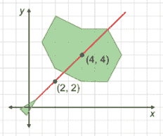

图 7.12 激光穿过点 (2, 2) 和 (4, 4)。

在我们的小行星游戏中，激光线段的起始点和终点是精确的，但这些数字对于例子来说很合适。将这些数字代入公式，我们得到

*a* = *y*[2] − *y*[1] = 4 − 2 = 2

*b* = −(*x*[2] − *x*[1]) = −(4 − 2) = −2

和

*c* = *x*[1]*y*[2] − *x*[2]*y*[1] = 2 · 4 − 2 · 4 = 0

这意味着直线是 2*y* − 2*x* = 0，这相当于说 *x* − *y* = 0（或者简单地 *x* = *y*）。为了决定激光是否击中小行星，我们必须找到直线 *x* − *y* = 0 与直线 *x* + 2*y* = 8、直线 2*x* + *y* = 7 或任何其他界定小行星的直线相交的地方。

### 7.2.3 矩阵表示法中的线性方程

让我们关注一个我们可以看到的交点：激光显然击中了小行星最近的边缘，其线的方程为 *x* + 2*y* = 8（图 7.13）。

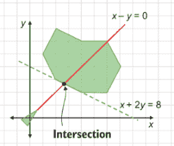

图 7.13 激光击中小行星，其线 *x* − y = 0 和 *x* + 2y = 8 相交。

经过一番铺垫，我们遇到了第一个真正的线性方程组。通常我们会像下面这样以网格的形式写出线性方程组，以便变量 *x* 和 *y* 对齐：

*x* − *y* = 0

*x* + 2*y* = 8

回想第五章，我们可以将这些两个方程组织成一个矩阵方程。一种方法是写一个列向量的线性组合，其中 *x* 和 *y* 是系数：

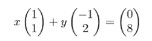

另一种方法是将它进一步合并，并以矩阵乘法的形式写出。系数为 *x* 和 *y* 的 (1,−1) 和 (−1,−2) 的线性组合与矩阵乘积相同：

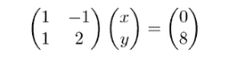

当我们这样写时，解线性方程组的任务看起来就像解矩阵乘法问题中的向量。如果我们称 2×2 矩阵为 *a*，问题就变成了什么向量 (*x*, *y*) 乘以矩阵 *a* 得到 (0, 8)？换句话说，我们知道线性变换 *a* 的输出是 (0, 8)，我们想知道什么输入会产生它（图 7.14）。

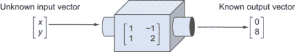

图 7.14 将问题表述为寻找产生所需输出向量的输入向量

这些不同的符号展示了看待同一问题的新的方法。解线性方程组相当于找到一些向量的线性组合，这些组合产生另一个给定的向量。这也相当于找到一个线性变换的输入向量，该变换产生一个给定的输出。因此，我们将看到如何一次性解决所有这些问题。

### 7.2.4 使用 NumPy 解线性方程

找到 *x* − *y* = 0 和 *x* + 2*y* = 8 的交点等同于找到满足矩阵乘法方程的向量 (*x*, *y*)：

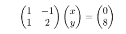

这只是一个符号上的差异，但以这种形式表述问题使我们能够使用预先构建的工具来解决它。具体来说，Python 的 NumPy 库有一个线性代数模块和一个函数可以解决这类方程。以下是一个例子：

```
>>> import numpy as np
>>> matrix = np.array(((1,−1),(1,2)))       ❶
>>> output = np.array((0,8))                ❷

>>> np.linalg.solve(matrix,output)          ❸
array([2.66666667, 2.66666667])             ❹
```

❶ 将矩阵打包为 NumPy 数组对象

❷ 将输出向量打包为 NumPy 数组（尽管它不需要重塑为列向量）

❸ `numpy.linalg.solve`函数接受一个矩阵和一个输出向量，并找到产生它的输入向量。

❹ 结果是(*x, y*) = (2.66..., 2.66...)。

NumPy 告诉我们，交点的*x*和*y*坐标大约是 22/3 或 8/3，这在几何上看起来是正确的。通过目测图，看起来交点的两个坐标应该在 2 和 3 之间。我们可以通过将其代入两个方程来检查这个点是否同时位于两条直线上：

1*x* − 1*y* = 1 ⋅ (2.66666667) − 1 ⋅ (2.66666667) = 0

1*x* + 2*y* = 1 ⋅ (2.66666667) + 2 ⋅ (2.66666667) = 8.00000001

这些结果足够接近(0, 8)，并且确实是一个精确解。这个解向量，大约是(8/3, 8/3)，也是满足矩阵方程 7.1 的向量。


如图 7.15 所示，我们可以将(8/3, 8/3)视为我们传递给由矩阵定义的线性变换机器的向量，该矩阵给出了我们期望的输出向量。

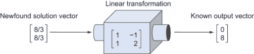

图 7.15 将向量(8/3, 8/3)传递给线性变换会产生期望的输出(0, 8)。

我们可以将 Python 函数`numpy.linalg.solve`视为一个不同形状的机器，它接受矩阵和输出向量，并返回它们所代表的线性方程的“解”向量（图 7.16）。

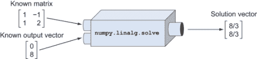

图 7.16 `numpy.linalg.solve`函数接受一个矩阵和一个向量，并输出它们所代表的线性系统的解向量。

这可能是线性代数中最重要的计算任务；从矩阵*a*和一个向量***w***开始，找到向量***v***使得*a* ***v*** = ***w***。这样的向量给出了由*a*和***w***表示的线性方程组的解。我们很幸运有一个 Python 函数可以为我们完成这项工作，这样我们就不必担心手动完成所需的繁琐代数。现在我们可以使用这个函数来找出我们的激光击中小行星的时刻。

### 7.2.5 判断激光是否击中小行星

我们游戏缺失的部分是`PolygonModel`类上的`does_intersect`方法的实现。对于这个类的任何实例，它代表存在于我们的 2D 游戏世界中的多边形对象，这个方法应该返回`True`，如果输入的线段与多边形的任何线段相交。

为了做到这一点，我们需要一些辅助函数。首先，我们需要将给定的线段从端点向量对转换为标准形式的一次方程。在本节的末尾，我给你一个练习来实现函数 `standard_form`，它接受两个输入向量并返回一个元组 (*a*, *b*, *c*)，其中 *ax* + *by* = *c* 是部分所在的线。

接下来，给定两个部分，每个部分由其端点向量对表示，我们想要找出它们的线在哪里相交。如果 *u* 1 和 *u* 2 是第一部分的端点，而 *v* 1 和 *v* 2 是第二部分的端点，我们需要首先找到标准形式方程，然后将它们传递给 NumPy 求解。例如，

```
def intersection(u1,u2,v1,v2):
    a1, b1, c1 = standard_form(u1,u2)
    a2, b2, c2 = standard_form(v1,v2)
    m = np.array(((a1,b1),(a2,b2)))
    c = np.array((c1,c2))
    return np.linalg.solve(m,c)
```

输出是两条部分所在的线相交的点。但这个点可能不在图 7.17 所示的任一部分上。


图 7.17 一个部分连接 *u*[1] 和 *u*[2]，另一个部分连接点 *v*[1] 和 *v*[2]。延伸这些部分的两条线相交，但部分本身并不相交。

要检测两个部分是否相交，我们需要检查它们线的交点是否位于两对端点之间。我们可以使用距离来检查。在图 7.17 中，交点距离点 *v*[2] 比点 *v*[1] 更远。同样，它比 *u*[1] 更远于 *u*[2]。这表明该点不在任一部分上。通过四个总距离检查，我们可以确认线的交点 (*x*, *y*) 是否也是部分的交点：

```
def do_segments_intersect(s1,s2):
    u1,u2 = s1
    v1,v2 = s2
    d1, d2 = distance(*s1), distance(*s2)         ❶
    x,y = intersection(u1,u2,v1,v2)               ❷
    return (distance(u1, (x,y)) <= d1 and         ❸
            distance(u2, (x,y)) <= d1 and
            distance(v1, (x,y)) <= d2 and
            distance(v2, (x,y)) <= d2)
```

❶ 将第一和第二部分的长度分别存储为 d1 和 d2

❷ 找到部分所在的线的交点 (*x, y*)

❸ 进行四个检查以确保交点位于线段四端点之间，确认部分相交

最后，我们可以通过检查 `do _segments_intersect` 对于输入部分和（变换后的）多边形的任何边返回 `True` 来编写 `does_intersect` 方法：

```
class PolygonModel():
    ...
    def does_intersect(self, other_segment):
        for segment in self.segments():
            if do_segments_intersect(other_segment,segment):
                return True                                  ❶
        return False
```

❶ 如果多边形的任何部分与其他部分 intersect，该方法返回 True。

在接下来的练习中，你可以通过构建具有已知坐标点的彗星和具有已知起点和终点的激光束来确认这实际上有效。如果 `does_intersect` 实现如源代码所示，你应该能够旋转宇宙飞船以瞄准彗星并摧毁它们。

### 7.2.6 识别不可解系统

让我给你最后的忠告：二维中的每一个线性方程组都可以求解！在像彗星游戏这样的应用中很少见，但二维中的一些线性方程对可能没有唯一解，甚至没有解。如果我们向 NumPy 传递一个无解的线性方程组，我们会得到一个异常，因此我们需要处理这种情况。

当二维空间中的一对直线不平行时，它们会在某处相交。即使图 7.18 中的两条直线几乎是平行的（但并不完全平行），它们也会在远处某处相交。

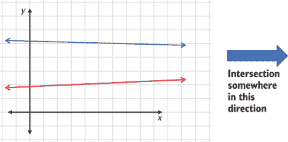

图 7.18 中，两条并非完全平行的直线在远处某处相交。

我们遇到麻烦的地方在于当直线平行时，这意味着直线永远不会相交（或者它们是同一条线！），如图 7.19 所示。


图 7.19 一对永不相交的平行线和一对实际上是同一条线但方程不同的平行线

在第一种情况下，没有交点，而在第二种情况下，有*无限*多个交点−直线上每个点都是一个交点。这两种情况在计算上都有问题，因为我们的代码要求一个单一、唯一的结果。如果我们尝试用 NumPy 解决这两个系统中的任何一个，例如，由 2*x* + *y* = 6 和 4*x* + 2*y* = 8 组成的系统，我们会得到一个异常：

```
>>> import numpy as np
>>> m = np.array(((2,1),(4,2)))
>>> v  = np.array((6,4))
>>> np.linalg.solve(m,v)
Traceback (most recent call last):
  File "<stdin>", line 1, in <module>
...
numpy.linalg.linalg.LinAlgError: Singular matrix
```

NumPy 将错误归咎于矩阵。该矩阵

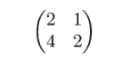

被称为*奇异*矩阵，意味着线性系统没有唯一解。线性方程组由一个矩阵和一个向量定义，但仅矩阵本身就足以告诉我们直线是否平行以及系统是否有唯一解。对于任何非零的*w*，都不会有一个唯一的*v*来解这个系统。

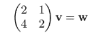

我们将在后面更深入地探讨奇异矩阵，但就目前而言，你可以看到行（2, 1）和（4, 2）以及列（2, 4）和（1, 2）都是平行的，因此它们线性相关。这是告诉我们直线平行并且系统没有唯一解的关键线索。线性系统的可解性是线性代数中的一个核心概念；它与线性无关性和维数的概念密切相关。我们将在本章的最后两节中讨论这一点。

为了我们的小行星游戏，我们可以做出简化的假设，即任何平行的线段都不会相交。鉴于我们是用随机浮点数构建游戏，两个线段完全平行的情况非常不可能。即使激光正好对准小行星的边缘，这也会是一个擦肩而过，玩家不配让小行星被摧毁。我们可以修改`do_segments_intersect`来捕获异常并返回默认结果`False`：

```
def do_segments_intersect(s1,s2):
    u1,u2 = s1
    v1,v2 = s2
    l1, l2 = distance(*s1), distance(*s2)
    try:
        x,y = intersection(u1,u2,v1,v2)
        return (distance(u1, (x,y)) <= l1 and
                distance(u2, (x,y)) <= l1 and
                distance(v1, (x,y)) <= l2 and
                distance(v2, (x,y)) <= l2)
    except np.linalg.linalg.LinAlgError:
        return False
```

### 7.2.7 练习

| **练习 7.3**: ***u*** + *t* · ***v*** 可能是一条通过原点的直线。在这种情况下，关于向量 ***u*** 和 ***v*** 你可以说什么？**解答**: 一种可能性是 ***u*** = **0** = (0, 0)；在这种情况下，直线自动通过原点。在这种情况下，***u*** + 0 · ***v*** 是原点，无论 ***v*** 是什么。否则，如果 ***u*** 和 ***v*** 是标量倍数，例如 ***u*** = *s* · ***v***，那么直线也会通过原点，因为 ***u*** − *s* · ***v*** = **0** 在这条直线上。 |
| --- |
| **练习 7.4**: 如果 ***v*** = **0** = (0, 0)，形式为 ***u*** + *t* · ***v*** 的点是否代表一条直线？**解答**: 不，无论 *t* 的值如何，我们都有 ***u*** + *t* · ***v*** = ***u*** + *t* · (0, 0) = ***u***。这种形式的所有点都等于 ***u***。 |
| **练习 7.5**: 结果表明公式 ***u*** + *t* · ***v*** 不是唯一的；也就是说，你可以选择不同的 ***u*** 和 ***v*** 值来表示同一条直线。另一条表示 (2, 2) + *t* · (−1, 3) 的直线是什么？**解答**: 一种可能性是将 ***v*** = (−1, 3) 替换为其自身的标量倍数，例如 (2, −6)。当 *t* = −2 · *s* 时，形式为 (2, 2) + *t* · (−1, 3) 的点与形式为 (2, 2) + *s* · (2, −6) 的点一致。你也可以用线上的任何点来替换 ***u***。因为 (2, 2) + 1 · (−1, 3) = (1, 5) 在这条线上，所以 (1, 5) + *t* · (2, −6) 也是同一条直线的有效方程。 |
| **练习 7.6**: *a* · *x* + *b* · *y* = *c* 对于 *a*，*b* 和 *c* 的任何值都代表一条直线吗？**解答**: 不，如果 *a* 和 *b* 都为零，则该方程不描述一条直线。在这种情况下，公式将是 0 · *x* + 0 · *y* = *c*。如果 *c* = 0，这始终是真的，如果 *c* ≠ 0，则永远不是真的。无论如何，它不建立 *x* 和 *y* 之间的关系，因此它不会描述一条直线。 |
| **练习 7.7**: 找到 2*x* + *y* = 3 这条直线的另一个方程，以表明 *a*，*b* 和 *c* 的选择不是唯一的。**解答**: 另一个方程的例子是 6*x* + 3*y* = 9。实际上，将方程两边乘以相同的非零数会得到同一条直线的不同方程。 |
| **练习 7.8**: 方程 *ax* + *by* = *c* 等价于涉及两个二维向量点积的方程：(*a*, *b*) · (*x*, *y*) = *c*。因此，可以说一条直线是一组向量，这些向量与给定向量的点积是常数。这个陈述的几何解释是什么？**解答**: 请参阅 7.3.1 节的讨论。 |
| **练习 7.9**: 确认向量 (0, 7) 和 (3.5, 0) 都满足方程 2*x* + *y* = 7。**解答**: 2 · 0 + 7 = 7 和 2 · (3.5) + 0 = 7. |
| **练习 7.10**: 画出 (3, 0) + *t* · (0, 1) 的图形，并使用公式将其转换为标准形式。**解答**： (3, 0) + *t* · (0, 1) 得到一条垂直线，其中 *x* = 3：公式 *x* = 3 已经是标准形式的直线方程，但我们可以用公式来确认这一点。我们线上的第一个点已经给出：(*x*[1], *y*[1]) = (3, 0)。线上的第二个点是 (3, 0) + (0, 1) = (3, 1) = (*x*[2], *y*[2])。我们有 *a* = *y*[2] − *y*[1] = 1，*b* = *x*[1] − *x*[2] = 0，*c* = *x*[1] *y*[2] − *x*[2]*y*[1] = 3 · 1 − 1 · 0 = 3。这给我们 1 · *x* + 0 · *y* = 3 或简单地 *x* = 3.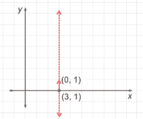 |

| **练习 7.11**: 编写一个 Python 函数 `standard_form`，它接受两个向量 ***v*** 1 和 ***v*** 2，并找到通过它们的直线 *ax* + *by* = *c*。具体来说，它应该输出常数的元组 (*a*, *b*, *c*)。**解答**：你所需要做的就是翻译你在 Python 中写的公式：

```
def standard_form(v1, v2):
    x1, y1 = v1
    x2, y2 = v2
    *a* = y2 − y1
    b = x1 − x2
    c = x1 * y2 − y1 * x2
    return a,b,c
```

|

| **练习 7.12-迷你项目**：对于 `do _segments_intersect` 中的四个距离检查中的每一个，找到一对线段，它们在一个检查中失败，但在其他三个检查中通过。**解答**：为了更容易运行实验，我们可以创建 `do_segments_intersect` 的一个修改版本，该版本返回每个四个检查返回的 True/False 值的列表：

```
def segment_checks(s1,s2):
    u1,u2 = s1
    v1,v2 = s2
    l1, l2 = distance(*s1), distance(*s2)
    x,y = intersection(u1,u2,v1,v2)
    return [
        distance(u1, (x,y)) <= l1,
        distance(u2, (x,y)) <= l1,
        distance(v1, (x,y)) <= l2,
        distance(v2, (x,y)) <= l2
    ]
```

通常，当线段的一个端点比交点更接近另一个端点时，这些检查会失败。以下是我使用 *y* = 0 和 *x* = 0 上的线段找到的一些其他解决方案，这些线段在原点相交。这些解决方案中的每一个都恰好失败四个检查中的一个。如果有疑问，请自己画出它们以了解发生了什么。

```
>>> segment_checks(((−3,0),(−1,0)),((0,−1),(0,1)))
[False, True, True, True]
>>> segment_checks(((1,0),(3,0)),((0,−1),(0,1)))
[True, False, True, True]
>>> segment_checks(((−1,0),(1,0)),((0,−3),(0,−1)))
[True, True, False, True]
>>> segment_checks(((−1,0),(1,0)),((0,1),(0,3)))
[True, True, True, False]
```

|

| **练习 7.13**: 对于示例激光线和陨石，确认 `does_intersect` 函数返回 `True`。（提示：使用网格线找到陨石的顶点并构建表示它的 `PolygonModel` 对象。）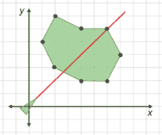 激光击中了陨石。**解答**：逆时针顺序，从最上面的点开始，顶点是 (2, 7)，(1, 5)，(2, 3)，(4, 2)，(6, 2)，(7, 4)，(6, 6)，和 (4, 6)。我们可以假设激光束的端点是 (1, 1) 和 (7, 7)：

```
>>> from asteroids import PolygonModel
>>> asteroid = PolygonModel([(2,7), (1,5), (2,3), (4,2), (6,2), (7,4), (6,6), (4,6)])
>>> asteroid.does_intersect([(0,0),(7,7)])
True
```

这证实了激光击中了小行星！相比之下，从 (0, 0) 到 (0, 7) 直接向上射击的子弹没有击中：

```
>>> asteroid.does_intersect([(0,0),(0,7)])
False
```

|

| **练习 7.14**: 编写一个 `does_collide(other_polygon)` 方法，通过检查定义两个多边形的任何线段是否相交，来判断当前的 `PolygonModel` 对象是否与另一个 `other_polygon` 发生碰撞。这可以帮助我们判断小行星是否撞击了飞船或另一个小行星。**解决方案**：首先，在 `PolygonModel` 中添加一个 `segments()` 方法是方便的，以避免重复返回构成多边形（变换后的）线段的工作。然后，我们可以检查另一个多边形的每个线段，看它是否对当前的一个返回 `does_intersect` 为真：

```
class PolygonModel():
    ...
    def segments(self):
        point_count = len(self.points)
        points = self.transformed()
        return [(points[i], points[(i+1)%point_count])
                for i in range(0,point_count)]

    def does_collide(self, other_poly):
        for other_segment in other_poly.segments():
            if self.does_intersect(other_segment):
                return True
        return False
```

我们可以通过构建一些应该重叠和不应该重叠的正方形来测试这一点，并查看 `does_collide` 方法是否正确地检测出哪些是哪些。确实，它做到了：

```
>>> square1 = PolygonModel([(0,0), (3,0), (3,3), (0,3)])
>>> square2 = PolygonModel([(1,1), (4,1), (4,4), (1,4)])
>>> square1.does_collide(square2)
True
>>> square3 = PolygonModel([(−3,−3),(−2,−3),(−2,−2),(−3,−2)])
>>> square1.does_collide(square3)
False
```

|

| **练习 7.15-迷你项目**：我们无法选择一个向量 ***w***，使得以下系统有唯一解 *v*。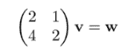找到一个向量 ***w***，使得该系统有**无限**多个解；也就是说，有无限多个满足该方程的 *v* 值。**解决方案**：例如，如果 ***w*** = (0, 0)，那么系统表示的两条直线是相同的。（如果你怀疑，可以画出来！）解的形式是 *v* = (*a*, −2*a*)，其中 *a* 是任意实数。以下是 ***w*** = (0, 0) 时 *v* 的无限多种可能性的几个例子：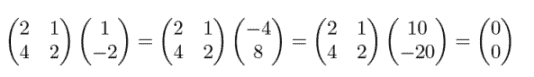 |
| --- |

## 7.3 将线性方程推广到高维

现在我们已经构建了一个功能性的（尽管是基本的）游戏，让我们拓宽我们的视野。我们可以将各种问题表示为线性方程组，而不仅仅是街机游戏。野外的线性方程通常有超过两个“未知”变量 *x* 和 *y*，而不仅仅是两个。这样的方程描述了超过两个维度的点的集合。在超过三个维度的情况下，很难想象任何东西，但三维情况可以是一个有用的心理模型。三维中的平面是二维中线的类比，它们也由线性方程表示。

### 7.3.1 在三维中表示平面

要理解为什么线和面是相似的，用点积来考虑线是有用的。正如你在之前的练习中看到的那样，或者你可能自己注意到的，方程 *ax* + *by* = *c* 是在 2D 平面上，与固定向量 (*a*, *b*) 的点积等于固定数 *c* 的点的集合。也就是说，方程 *ax* + *by* = *c* 等价于方程 (*a*, *b*) · (*x*, *y*) = *c*。如果你在练习中没有想出如何从几何上解释这一点，让我们在这里过一遍。

如果我们在 2D 中有一个点和（非零）向量，那么存在一条唯一的直线，它垂直于该向量，并且通过该点，如图 7.20 所示。

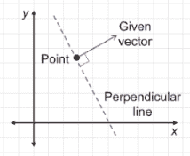

图 7.20 通过给定点且垂直于给定向量的唯一直线

如果我们将给定的点 (*x*[0], *y*[0]) 和给定的向量 (*a*, *b*) 分别称为 (*x*, *y*) 和 (*a*, *b*)，我们可以为点 (*x*, *y*) 在直线上提供一条标准。具体来说，如果 (*x*, *y*) 位于直线上，那么 (*x* − *x*[0], *y* − *y*[0]) 与直线平行并且垂直于 (*a*, *b*)，如图 7.21 所示。

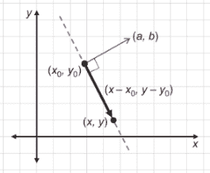

图 7.21 向量 (*x* − *x*[0], *y* − *y*[0]) 与直线平行，因此垂直于 (*a, b*).

因为两个垂直向量的点积为零，所以这与代数陈述等价：

(*a*, *b*) · (*x* − *x*[0], *y* − *y*[0]) = 0

那个点积可以展开为

*a*(*x* − *x*[0]) + *b*(*y* − *y*[0]) = 0

或者

*ax* + *by* = *ax*[0] + *by*[0]

这个方程右侧的量是一个常数，因此我们可以将其重命名为 *c*，从而得到直线的通用形式方程：*ax* + *by* = *c*。这是公式 *ax* + *by* = *c* 的一个方便的几何解释，并且我们可以将其推广到三维空间。

给定一个点和三维空间中的一个向量，存在一个唯一垂直于该向量并通过该点的平面。如果向量是 (*a*, *b*, *c*)，点为 (*x*[0], *y*[0], *z*[0])，我们可以得出结论，如果向量 (*x*, *y*, *z*) 位于该平面上，那么 (*x* − *x*[0], *y* -y[0], *z* − *z*[0]) 是垂直于 (*a*, *b*, *c*) 的。图 7.22 展示了这一逻辑。

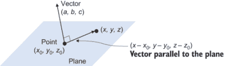

图 7.22 一个平行于向量 (*a*, *b*, *c*) 的平面通过点 (*x*[0], *y*[0], *z*[0] )。

平面上的每一个点都给我们提供了一个垂直于 (*a*, *b*, *c*) 的向量，而每一个垂直于 (*a*, *b*, *c*) 的向量都指向平面上的一个点。我们可以将这种垂直性表达为两个向量的点积，因此，平面上的每一个点 (*x*, *y*, *z*) 满足的方程是

(*a*, *b*, *c*) · (*x* − *x*[0], *y* − *y*[0], *z* − *z*[0]) = 0

这可以展开为

*ax* + *by* + *cz* = *ax*[0] + *by*[0] + *cz*[0]

并且因为方程的右侧是一个常数，我们可以得出结论，三维空间中的每一个平面都有一个形式为 *ax* + *by* + *cz* = *d* 的方程。在三维空间中，计算问题是要决定这些平面的交点在哪里，或者哪些 (*x*, *y*, *z*) 的值同时满足多个这样的线性方程。

### 7.3.2 解三维线性方程

平面上的非平行直线在 exactly one point 相交。这个单一点交对于平面也是成立的吗？如果我们画一对相交的平面，我们可以看到非平行平面可以在多个点上相交。事实上，图 7.23 显示，存在一条由无限多个点组成的 whole *line*，这些点是两个非平行平面相交的点。

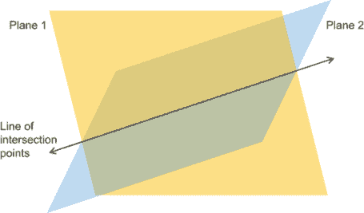

图 7.23 两个非平行平面沿一条直线相交。

如果你添加一个不平行于这条交线的第三个平面，你可以找到一个唯一的交点。图 7.24 显示了三个平面中的每一对都沿一条线相交，而这些线共享一个单一的点。

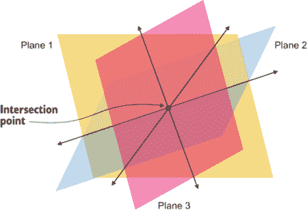

图 7.24 两个非平行平面沿一条线相交。

通过代数方法找到这个点需要找到三个变量三个线性方程的公共解，每个变量代表一个平面，形式为 *ax* + *by* + *cz* = *d*。这样的三个线性方程组的形式如下：

*a*[1]*x* + *b*[1]*y* + *c*[1]*z* = *d*[1]

*a*[2]*x* + *b*[2]*y* + *c*[2]*z* = *d*[2]

*a*[3]*x* + *b*[3]*y* + *c*[3]*z* = *d*[3]

每个平面由四个数字确定：*a[i]*、*b[i]*、*c[i]* 和 *d[i]*，其中 *i* = 1、2 或 3，是我们要看的平面的索引。这样的下标在有许多变量需要命名的线性方程组中很有用。这十二个数字总共足以找到平面相交的点 (*x*, *y*, *z*)，如果有的话。为了解这个系统，我们可以将系统转换为矩阵方程：

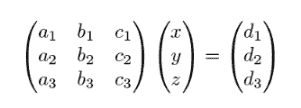

让我们尝试一个例子。假设我们的三个平面由以下方程给出：

*x* + *y* − *z* = −1

2*y* − *z* = 3

*x* + *z* = 2

你可以在本书的源代码中看到如何在 Matplotlib 中绘制这些平面。图 7.25 显示了结果。

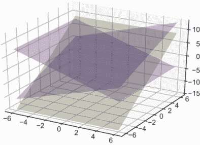

图 7.25 在 Matplotlib 中绘制的三个平面

不容易看出，但三个平面在某处相交。为了找到这个交点，我们需要满足所有三个线性方程的 *x*、*y* 和 *z* 的值。再次，我们可以将系统转换为矩阵形式并使用 NumPy 来求解。与这个线性系统等价的矩阵方程是

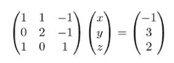

在 Python 中将矩阵和向量转换为 NumPy 数组，我们可以快速找到解向量：

```
>>> matrix = np.array(((1,1,−1),(0,2,−1),(1,0,1)))
>>> vector = np.array((−1,3,2))
>>> np.linalg.solve(matrix,vector)
array([−1., 3., 3.])
```

这告诉我们，(−1, 3, 3) 是 (*x*, *y*, *z*) 点，所有三个平面相交于此点，并且该点同时满足所有三个线性方程。

虽然使用 NumPy 计算这个结果很容易，但你也可以看到在 3D 中可视化线性方程组已经有点困难了。在 3D 之外，可视化线性方程组是困难的（如果不是不可能的），但求解它们是机械上相同的。任何数量维度的线或平面的类比称为 *超平面*，问题归结为找到多个超平面相交的点。

### 7.3.3 代数方法研究超平面

严格来说，*n* 维超平面是 *n* 个未知变量的线性方程的解。一条线是存在于 2D 中的 1D 超平面，一个平面是存在于 3D 中的 2D 超平面。正如你可能猜到的，4D 中标准形式的线性方程具有以下形式：

*aw* + *bx* + *cy* + *dz* = *e*

解集(*w*, *x*, *y*, *z*)形成一个位于 4 维空间中的 3 维超平面区域。当我们使用形容词 3D 时需要小心，因为这并不一定是ℝ⁴的 3 维向量子空间。这与二维情况类似：通过二维空间原点的线是ℝ²的向量子空间，但其他线则不是。无论是否是向量空间，3 维超平面在解集中有三个线性无关的方向可以旅行，就像在任何平面上你可以旅行两个线性无关的方向一样。我在本节的末尾包含了一个小项目，以帮助你检查你对这一点的理解。

当我们在更高维度的空间中写线性方程时，我们可能会用完字母来表示坐标和系数。为了解决这个问题，我们将使用带有下标索引的字母。例如，在 4 维空间中，我们可以将线性方程写成标准形式：

*a*[1] *x*[1] + *a*[2] *x*[2] + *a*[3] *x*[3] + *a*[4] *x*[4] = *b*

在这里，系数是*a*[1]，*a*[2]，*a*[3]，和*a*[4]，4 维向量的坐标是(*x*[1]，*x*[2]，*x*[3]，*x*[4])。我们同样可以写出 10 维的线性方程：

*a*[1] *x*[1] + *a*[2] *x*[2] + *a*[3] *x*[3] + *a*[4] *x*[4] + *a*[5] *x*[5] + *a*[6] *x*[6] + *a*[7] *x*[7] + *a*[8] *x*[8] + *a*[9] *x*[9] + *a*[10] *x*[10] = *b*

当我们求和的项的规律清晰时，我们有时会使用省略号(...)来节省空间。你可能看到像前面的方程一样写的方程 *a*[1] *x*[1] + *a*[2] *x*[2] + ... + *a*[10] *x*[10] = *b*。你还会看到另一种紧凑的表示法，涉及到求和符号Σ，它是希腊字母 sigma。如果我想写形式为*aixi*的项的和，其中索引*i*从*i* = 1 到*i* = 10，并且我想声明这个和等于某个其他数字*b*，我可以使用数学简写：

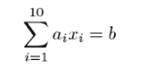

这个方程与前面的方程表达的意思相同；它只是更简洁的写法。无论我们在多少维度的空间中工作，线性方程的标准形式都有相同的形状：

*a*[1] *x*[1] + *a*[2] *x*[2] + ... + *a*[n] *x*[n]* = *b*

为了表示在 n 维空间中具有 m 个线性方程的系统，我们需要更多的索引。等号左边的常数数组可以用*aij*表示，其中下标*i*表示我们正在讨论哪个方程，下标*j*表示常数(*x[j]*)乘以哪个坐标。例如，

*a*[11] *x*[1] + *a*[12] *x*[2] + ... + *a*[1n] *x*[n] = *b*[1]

*a*[21] *x*[1] + *a*[22] *x*[2] + ... + *a*[2n] *x*[n] = *b*[2]

...

*a*[m1] *x*[1] + *a*[m2] *x*[2] + ... + *a*[mn] *x*[n] = *b*[m]

你可以看到，我也使用了省略号来跳过中间的三个方程到 *m* -1。每个方程中有 *n* 个常数，所以总共有 *mn* 个形式为 *aij* 的常数。在等式的右边，总共有 *m* 个常数，每个方程一个：*b*[1]，*b*[2]，...，*bm*。

无论维度数（与未知变量的数量相同）和方程的数量如何，我们都可以将这样的系统表示为一个线性方程。具有 *n* 个未知数和 *m* 个方程的先前系统可以重写如图 7.26 所示。

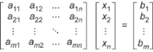

图 7.26 具有 n 个未知数和 m 个方程的线性方程组以矩阵形式表示

### 7.3.4 计算维度、方程和解的数量

我们在二维和三维中都看到，可以写出没有解或至少不是唯一解的线性方程。我们如何知道一个包含 *n* 个未知数的 *m* 个方程组是可解的？换句话说，我们如何知道 *n* 维空间中的 *m* 个超平面有一个唯一的交点？我们将在本章的最后部分详细讨论这个问题，但现在我们可以得出一个重要的结论。

在二维中，一对直线可以在一个点上相交。它们并不总是这样（例如，如果直线是平行的），但它们可以。这个陈述的代数等价物是，在两个变量中的两个线性方程组可以有一个唯一的解。

在三维中，三个平面可以相交于一个点。同样，这并不总是这样，但三个是确定三维空间中一个点的最小平面数（或线性方程数）。只有两个平面时，你至少有一个一维的可能解空间，即交线。从代数上来说，这意味着你需要两个线性方程在二维中获取一个唯一解，三个线性方程在三维中获取一个唯一解。一般来说，你需要 *n* 个线性方程才能在 *n* 维空间中获取一个唯一解。

这里有一个例子，当在四维空间中工作时，使用坐标 (*x*[1]，*x*[2]，*x*[3]，*x*[4])，这可能会显得过于简单，但因为它具体而有用。让我们将我们的第一个线性方程设为 *x*[4] = 0\. 这个线性方程的解形成一个三维超平面，由形式为 (*x*[1]，*x*[2]，*x*[3]，0) 的向量组成。这显然是一个三维解空间，并且它实际上是 ℝ⁴ 的一个向量子空间，其基为 (1, 0, 0, 0)，(0, 1, 0, 0)，(0, 0, 1, 0)。

第二个线性方程可以是 *x*[2] = 0\. 这个方程的解本身也是一个三维超平面。这两个三维超平面的交集是一个二维空间，由形式为 (*x*[1], 0, *x*[3], 0) 的向量组成，这些向量满足两个方程。如果我们能想象这样的东西，我们会看到这是一个存在于四维空间中的二维平面。具体来说，它是通过 (1, 0, 0, 0) 和 (0, 0, 1, 0) 这两个向量张成的平面。

添加一个额外的线性方程，*x*[1] = 0，它定义了自己的超平面，现在所有三个方程的解是一个一维空间。这个一维空间中的向量位于 4 维空间中的一条线上，形式为 (0, 0, *x*[3], 0)。这条线正好是 x[3] -轴，它是 ℝ⁴ 的一个一维子空间。

最后，如果我们施加第四个线性方程，*x*[3] = 0，唯一的可能解是 (0, 0, 0, 0)，一个零维的向量空间。*x*[4] = 0，*x*[2] = 0，*x*[1] = 0，和 *x*[3] = 0 这些陈述实际上都是线性方程，但它们非常简单，可以精确地描述解：(*x*[1], *x*[2], *x*[3], *x*[4]) = (0, 0, 0, 0)。每次我们添加一个方程，我们都会减少解空间的维度，直到我们得到一个由单个点 (0, 0, 0, 0) 组成的零维空间。

如果我们选择了不同的方程，每一步可能就不会那么清晰；我们就必须测试每个后续的超平面是否真正减少了解空间的维度。例如，如果我们从

*x*[1] = 0

和

*x*[2] = 0

我们会将解集减少到二维空间，但随后添加另一个方程到其中

*x*[1] + *x*[2] = 0

对解空间没有影响。因为 *x*[1] 和 *x*[2] 已经被限制为零，方程 *x*[1] + *x*[2] = 0 自动满足。因此，第三个方程没有给解集添加更多的具体性。

在第一种情况下，四个维度和三个线性方程需要满足，给我们留下了一个 4 − 3 = 1 维的解空间。但在第二种情况下，三个方程描述了一个更不具体的 2D 解空间。如果你有 *n* 维度（*n* 个未知变量）和 *n* 个线性方程，可能存在一个唯一的解−一个零维的解空间−但这并不总是如此。更一般地，如果你在 *n* 维空间中工作，使用 *m* 个线性方程可以得到最低维度的解空间是 *n* − *m*。在这种情况下，我们称线性方程组为*独立的*。

空间中的每个基向量都给我们提供了一个新的独立方向，我们可以在空间中移动。空间中的独立方向有时被称为*自由度*；例如，*z*方向，“解放”了我们从平面到更大的 3D 空间。相比之下，我们引入的每个独立线性方程都是一个约束；它减少了一个自由度，并限制了解空间的维度数减少。当独立自由度（维度）的数量等于独立约束（线性方程）的数量时，就不再有任何自由度，我们只剩下了一个唯一的点。

这是在线性代数中的一个重要哲学观点，你可以在接下来的某些小项目中进一步探索。在本章的最后部分，我们将连接独立方程和（线性）独立向量的概念。

### 7.3.5 练习

| **练习 7.16**：通过点 (5, 4) 且垂直于 (−3, 3) 的直线的方程是什么？**解答**：这里是设置！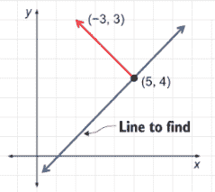。对于直线上的每个点 (*x*, *y*)，向量 (*x* − 5, *y* − 4) 与直线平行，因此与 (−3, 3) 垂直。这意味着对于直线上的任何 (*x*, *y*)，向量 (*x* − 5, *y* − 4) 与 (−3, 3) 的点积为零。这个方程展开为 −3*x* + 15 + 3*y* − 12 = 0，重新排列后得到 −3*x* + 3*y* = −3。我们可以将两边都除以 −3 来得到一个更简单、等价的方程：*x* − *y* = 1。 |
| --- |
| **练习 7.17-迷你项目**：考虑一个 4 维线性方程组：*x*[1] + 2*x*[2] + 2*x*[3] + *x*[4] = 0*x*[1] − *x*[4] = 0。用代数方法（而不是几何方法）解释为什么解构成 4 维向量子空间。**解答**：我们可以证明，如果 (*a*[1], *a*[2], *a*[3], *a*[4]) 和 (*b*[1], *b*[2], *b*[3], *b*[4]) 是两个解，那么它们的线性组合也是一个解。这意味着解集包含其向量的所有线性组合，因此它是一个向量子空间。让我们从假设 (*a*[1], *a*[2], *a*[3], *a*[4]) 和 (*b*[1], *b*[2], *b*[3], *b*[4]) 是两个线性方程的解开始，这明确意味着：*a*[1] + 2*a*[2] + 2*a*[3] + *a*[4] = 0*b*[1] + 2*b*[2] + 2*b*[3] + *b*[4] = 0*a*[1] − *a*[4] = 0*b*[1] − *b*[4] = 0。选择标量 *c* 和 *d*，线性组合 *c*(*a*[1], *a*[2], *a*[3], *a*[4]) + *d*(*b*[1], *b*[2], *b*[3], *b*[4]) 等于 (*ca*[1] + *db*[1], *ca*[2] + *db*[2], *ca*[3] + *db*[3], *ca*[4] + *db*[4])。这是这两个方程的解吗？我们可以通过将四个坐标代入 *x*[1]，*x*[2]，*x*[3] 和 *x*[4] 来找出答案。在第一个方程中，*x*[1] + 2*x*[2] + 2*x*[3] + *x*[4] 变为 (*ca*[1] + *db*[1]) + 2(*ca*[2] + *db*[2]) + 2(*ca*[3] + *db*[3]) + (*ca*[4] + *db*[4])。这展开为给我们 *ca*[1] + *db*[1] + 2*ca*[2] + 2*db*[2] + 2*ca*[3] + 2*db*[3] + *ca*[4] + *db*[4]，这重新排列为 *c*(*a*[1] + 2*a*[2] +2*a*[3] + *a*[4]) + *d*(*b*[1] + 2*b*[2] + 2*b*[3] + *b*[4])。因为 *a*[1] + 2*a*[2] + 2*a*[3] + *a*[4] 和 *b*[1] + 2*b*[2] + 2*b*[3] + *b*[4] 都是零，这个表达式是零：*c*(*a*[1] + 2*a*[2] + 2*a*[3] + *a*[4]) + *d*(*b*[1] + 2*b*[2] + 2*b*[3] + *b*[4]) = *c* · 0 + *d* · 0 = 0。这意味着线性组合是第一个方程的解。同样，将线性组合代入第二个方程，我们看到它也是那个方程的解：(*ca*[1] + *db*[1]) − (*ca*[4] + *db*[4]) = *c*(*a*[1] − *a*[4]) + *d*(*b*[1] − *b*[4]) = *c* · 0 + *d* · 0 = 0。任何两个解的任何线性组合也是解，所以解集包含其所有线性组合。这意味着解集是 4 维向量子空间。 |
| **练习 7.18**：通过点 (1, 1, 1) 且垂直于向量 (1, 1, 1) 的平面的标准形式方程是什么？**解答**：对于平面上的任意点 (*x*, *y*, *z*)，向量 (*x* − 1, *y* − 1, *z* − 1) 都垂直于 (1, 1, 1)。这意味着对于平面上的任何 *x*，*y*，和 *z* 值，点积 (*x* − 1, *y* − 1, *z* − 1) · (1, 1, 1) 都为零。这展开后给出 (*x* − 1) + (*y* − 1) + (*z* − 1) = 0 或 *x* + *y* + *z* = 3，这是平面的标准形式方程。 |

| **练习 7.19-迷你项目**：编写一个 Python 函数，该函数接受三个 3D 点作为输入，并返回它们所在的平面的标准形式方程。例如，如果标准形式方程是 *ax* + *by* + *cz* = *d*，则该函数可以返回元组 (*a*, *b*, *c*, *d*)。**提示**：三个向量的任意两对之差都与平面平行，所以差分的叉积垂直于平面。**解答**：如果给定的点是 *p*[1]，*p*[2]，和 *p*[3]，那么向量差如 *p*[3] − *p*[1] 和 *p*[2] − *p*[1] 都与平面平行。那么 (*p*[2] − *p*[1]) × (*p*[3] − *p*[1]) 的叉积就垂直于平面。只要点 *p*[1]，*p*[2]，和 *p*[3] 形成一个三角形（所以差分不平行），一切就都很好了。有了平面上的一个点（例如，*p*[1]）和一个垂直向量，我们就可以重复寻找解的标准形式的过程，就像前两个练习中那样：

```
from vectors import *

def plane_equation(p1,p2,p3):
    parallel1 = subtract(p2,p1)
    parallel2 = subtract(p3,p1)
    a,b,c = cross(parallel1, parallel2)
    d = dot((a,b,c), p1)
    return a,b,c,d
```

例如，以下是从先前的练习中得到的平面 *x* + *y* + *z* = 3 的三个点：

```
>>> plane_equation((1,1,1), (3,0,0), (0,3,0))
(3, 3, 3, 9)
```

结果是 (3, 3, 3, 9)，意味着 3*x* + 3*y* + 3*z* = 9，这相当于 *x* + *y* + *z* = 3。这意味着我们做对了！|

| **练习 7.20**: 在以下矩阵方程中，总共有多少个常数 *aij*？有多少个方程？有多少个未知数？写出完整的矩阵方程（不带点）和完整的线性方程组（不带点）。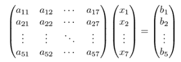矩阵形式的简略线性方程组**解答**：为了清晰起见，我们首先写出完整的矩阵方程：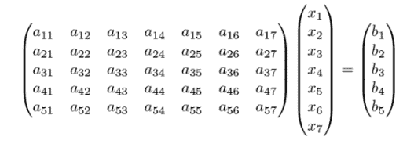矩阵方程的非简略版本。这个矩阵中有 5 · 7 = 35 个条目，线性系统方程左侧有 35 个 *aij* 常数。有 7 个未知变量：*x*[1]，*x*[2]，...，*x*[7] 和 5 个方程（每个矩阵的行一个）。你可以通过执行矩阵乘法得到完整的线性方程组：*a*[11]*x*[1] + *a*[12]*x*[2] + *a*[13]*x*[3] + *a*[14]*x*[4] + *a*[15]*x*[5] + *a*[16]*x*[6] + *a*[17]*x*[7] = *b*[1]*a*[21]*x*[1] + *a*[22]*x*[2] + *a*[23]*x*[3] + *a*[24]*x*[4] + *a*[25]*x*[5] + *a*[26]*x*[6] + *a*[27]*x*[7] = *b*[2]*a*[31]*x*[1] + *a*[32]*x*[2] + *a*[33]*x*[3] + *a*[34]*x*[4] + *a*[35]*x*[5] + *a*[36]*x*[6] + *a*[37]*x*[7] = *b*[3]*a*[41]*x*[1] + *a*[42]*x*[2] + *a*[43]*x*[3] + *a*[44]*x*[4] + *a*[45]*x*[5] + *a*[46]*x*[6] + *a*[47]*x*[7] = *b*[4]*a*[5]1*x*[1] + *a*[5]2*x*[2] + *a*[5]3*x*[3] + *a*[54]*x*[4] + *a*[55]*x*[5] + *a*[56]*x*[6] + *a*[57]*x*[7] = *b*[5]这个矩阵方程表示的完整线性方程组。你可以看到为什么我们用缩写来避免这种繁琐的写作！ |
| --- |
| **练习 7.21**: 将以下线性方程写成不带求和简写的形式。从几何上看，解集是什么样的？！[](../Images/CH07_F26_Orland_UN03_EQ37.png)**解答**：这个方程的左侧是形式为 *x[i]* 的项的和，其中 *i* 从 1 到 3。这给出了 *x*[1] + *x*[2] + *x*[3] = 1。这是三个变量的线性方程的标准形式，因此其解形成了一个三维空间中的平面。 |
| **练习 7.22**: 绘制三个平面，这三个平面之间没有平行关系，并且没有唯一的交点。（更好的方法是找到它们的方程并绘制它们！）**解答**：这里有三个平面：*z* + *y* = 0，*z* − *y* = 0，和 *z* = 3，以及图表：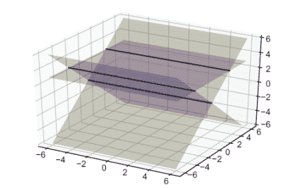三个不平行且没有交点的平面。我画出了三对平面的交点，这些交点是平行线。因为这些线永远不会相交，所以这三个平面没有唯一的交点。这就像你在第六章中看到的例子：即使其中没有一对向量平行，三个向量也可以线性相关。 |

| **练习 7.23**: 假设我们有一个 *m* 个线性方程和 *n* 个未知变量。以下 *m* 和 *n* 的值说明了是否存在唯一解？

1.  *m* = 2, *n* = 2

1.  *m* = 2, *n* = 7

1.  *m* = 5, *n* = 5

1.  *m* = 3, *n* = 2

**解答**：

1.  当有两个线性方程和两个未知数时，可能有唯一的解。这两个方程代表平面上的线，除非它们平行，否则它们会在一个唯一点上相交。

1.  当有两个线性方程和七个未知数时，不可能有唯一的解。假设由这些方程定义的 6 维超平面不是平行的，那么将会有一个 5 维的解空间。

1.  当有五个线性方程和五个未知数时，只要方程是独立的，就可能有唯一的解。

1.  当有三个线性方程和两个未知数时，可能会有一个唯一的解，但这需要一些运气。这意味着第三条线恰好通过前两条线的交点，这是不太可能但可能的。

!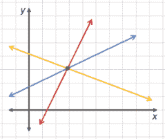平面上三条恰好相交于一点的线 |

| **练习 7.24**: 找出三个相交于一点的平面，三个相交于一条线的平面，以及三个相交于一个平面的平面。**解答**: 平面 *z* − *y* = 0, *z* + *y* = 0, 和 *z* + *x* = 0 相交于单一点 (0, 0, 0)。大多数随机选择的平面都会相交于这样一个唯一的点！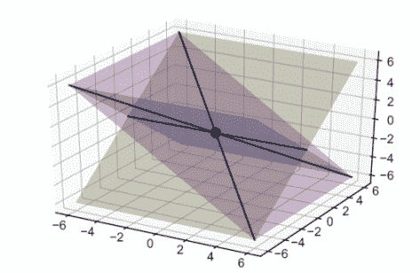三个平面相交于一点 |
| --- |
| 平面 *z* − *y* = 0, *z* + *y* = 0, 和 *z* = 0 在一条线上相交，具体是 x 轴。如果你玩弄这些方程，你会发现 *y* 和 *z* 都被限制为零，但 *x* 甚至没有出现，所以它没有约束。因此，x 轴上的任何向量 (*x*, 0, 0) 都是解！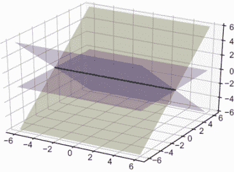三个平面相交于一条线最终，如果三个方程都代表同一个平面，那么整个平面就是解集。例如，*z* − *y* = 0, 2*z* − 2*y* = 0, 和 3*z* − 3*y* = 0 都代表同一个平面。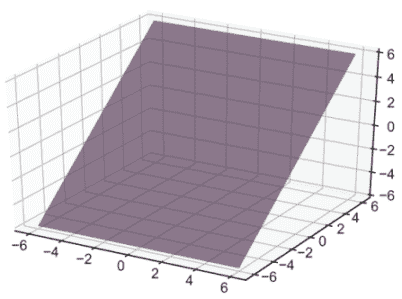三个相同的平面叠加；它们的解集是整个平面。 |

| **练习 7.25**: 不使用 Python，5 维线性方程组的解是什么？*x*[5] = 3, *x*[2] = 1, *x*[4] = −1, *x*[1] = 0, 和 *x*[1] + *x*[2] + *x*[3] = −2？使用 NumPy 验证答案。**解答**: 因为这四个线性方程指定了坐标的值，我们知道解的形式是 (0,1, *x*[3], −1,3)。我们需要使用最后一个方程进行一些代数运算来找出 *x*[3] 的值。因为 *x*[1] + *x*[2] + *x*[3] = −2，我们知道 0 + 1 + *x*[3] = −2，所以 *x*[3] 必须是 −3。因此，唯一的解点是 (0, 1, −3, −1, 3)。将这个系统转换为矩阵形式，我们可以使用 NumPy 来解它，以确认我们得到了正确的答案：

```
>>> matrix = np.array(((0,0,0,0,1),(0,1,0,0,0),(0,0,0,1,0),(1,0,0,0,0),(1,1,1,0,0)))
>>> vector = np.array((3,1,−1,0,−2))
>>> np.linalg.solve(matrix,vector)
array([ 0., 1., −3., −1., 3.])
```

|

| **练习 7.26-迷你项目**：在任何维度中，都有一个单位矩阵充当单位映射。也就是说，当你将*n*维单位矩阵*I*乘以任何向量***v***时，你得到的结果向量***v***相同；因此，*I* ***v*** *=* ***v*** *.*这意味着*I* ***v*** *=* ***w***是一个容易解决的线性方程组：***v***的一个可能答案是***v*** = ***w***。这个迷你项目的想法是，你可以从一个线性方程组*a* ***v*** = ***w***开始，将两边乘以另一个矩阵*B*，使得(*BA*) = *I*。如果是这样，那么你就有(*BA*)***v*** = *B* ***w*** 和 *I* ***v*** = *B* ***w*** 或 ***v*** = *B* ***w***。换句话说，如果你有一个系统*a* ***v*** = ***w***，并且有一个合适的矩阵*B*，那么*B* ***w***是系统的解。这个矩阵*B*被称为*a*的*逆矩阵*。让我们再次看看我们在 7.3.2 节中解决的方程组！[](../Images/CH07_F26_Orland_UN08_EQ38.png)使用 NumPy 函数`numpy.linalg.inv(matrix)`，它返回给定矩阵的逆，来找到方程左边矩阵的逆。然后，将两边乘以这个矩阵以找到线性方程组的解。将你的结果与我们从 NumPy 的求解器得到的结果进行比较。**提示**：你可能还想使用 NumPy 的内置矩阵乘法例程`numpy.matmul`来简化计算。 |
| --- |

| **解决方案**：首先，我们可以使用 NumPy 计算矩阵的逆：

```
>>> matrix = np.array(((1,1,−1),(0,2,−1),(1,0,1)))
>>> vector = np.array((−1,3,2))
>>> inverse = np.linalg.inv(matrix)
>>> inverse
array([[ 0.66666667, -0.33333333,  0.33333333],
       [-0.33333333,  0.66666667,  0.33333333],
       [-0.66666667,  0.33333333,  0.66666667]])
```

逆矩阵与原矩阵的乘积给出了单位矩阵，对角线上的值为 1，其他地方为 0，尽管存在一些数值误差：

```
>>> np.matmul(inverse,matrix)
array([[ 1.00000000e+00,  1.11022302e−16, −1.11022302e−16],
       [ 0.00000000e+00,  1.00000000e+00,  0.00000000e+00],
       [ 0.00000000e+00,  0.00000000e+00,  1.00000000e+00]])
```

诀窍是将矩阵方程的两边都乘以这个逆矩阵。在这里，为了便于阅读，我已经对逆矩阵中的值进行了四舍五入。我们已经知道，左边的第一个乘积是一个矩阵及其逆，因此我们可以相应地简化！[](../Images/CH07_F26_Orland_UN08_EQ39.png)将系统方程的两边乘以逆矩阵并进行简化

```
>>> np.matmul(inverse, vector)
array([−1., 3., 3.])
```

这与我们从求解器得到的解相同。|

## 7.4 通过解线性方程改变基

向量线性无关的概念显然与线性方程独立性的概念有关。这种联系来自于解线性方程组相当于用不同的基重新表示向量的事实。让我们探讨这在二维空间中的含义。当我们为向量（4，3）写坐标时，我们隐式地将该向量表示为标准基向量的线性组合：

(4, 3) = 4***e***[1] + 3***e***[2]

在上一章中，你学习了标准基由 ***e***[1] = (1, 0) 和 ***e***[2] = (0, 1) 组成，但这并不是唯一可用的基。例如，像 ***u***[1] = (1, 1) 和 ***u***[2] = (−1, 1) 这样的向量对形成了一个基，用于 ℝ²。由于任何二维向量都可以写成 ***e***[1] 和 ***e***[2] 的线性组合，所以任何二维向量也可以写成 ***u***[1] 和 ***u***[2] 的线性组合。对于某些 *c* 和 *d*，我们可以使以下方程成立，但并不立即明显 *c* 和 *d* 的值是什么：

*c* · (1, 1) + *d* · (−1, 1) = (4, 2)

图 7.27 展示了这一点的直观表示。

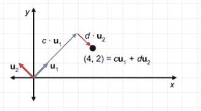

图 7.27 将 (4, 2) 写成 u1 = (1, 1) 和 u2 = (−1, 1) 的线性组合

作为线性组合，这个方程等价于一个矩阵方程，即：

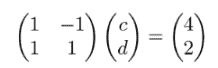

这同样是一个线性方程组！在这种情况下，未知向量是 (*c*, *d*) 而不是 (*x*, *y*)，矩阵方程中隐藏的线性方程是 *c* − *d* = 4 和 *c* + *d* = 2。存在一个二维向量空间 (*c*, *d*)，它定义了 ***u***[1] 和 ***u***[2] 的不同线性组合，但只有一种组合同时满足这两个方程。

任何 (*c*, *d*) 对的选择都定义了一个不同的线性组合。例如，让我们考虑一个任意的 (*c*, *d*) 值，比如 (*c*, *d*) = (3, 1)。向量 (3, 1) 不在 ***u***[1] 和 ***u***[2] 的同一向量空间中；它存在于 (*c*, *d*) 对的向量空间中，每个都描述了 ***u***[1] 和 ***u***[2] 的不同线性组合。点 (*c*, *d*) = (3, 1) 描述了我们原始二维空间中的一个特定线性组合：3***u***[1] + 1***u***[2] 将我们带到点 (*x*, *y*) = (2, 4)（图 7.28）。

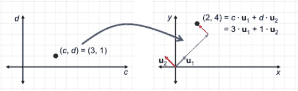

图 7.28 存在一个二维值空间 (*c*, *d*)，其中 (*c*, *d*) = (3, 1) 并产生线性组合 3*u*[1] + 1*u*[2] = (2, 4)。

回想一下，我们正在尝试将 (4, 2) 作为 ***u***[1] 和 ***u***[2] 的线性组合，所以这不是我们寻找的线性组合。为了使 *c* ***u***[1] + *d* ***u***[2] 等于 (4, 2)，我们需要满足 *c* − *d* = 4 和 *c* + *d* = 2，正如我们之前看到的。

让我们在 *c*, *d* 平面上绘制线性方程组。直观上，我们可以看出 (3, −1) 是一个满足 *c* + *d* = 2 和 *c* − *d* = 4 的点。这给我们提供了用于线性组合的标量对，以将 ***u***[1] 和 ***u***[2] 组合成 (4, 2)，如图 7.29 所示。

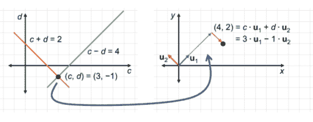

图 7.29 点 (*c*, *d*) = (3, −1) 满足 *c* + *d* = 2 和 *c* − *d* = 4。因此，它描述了我们寻找的线性组合。

现在我们可以将 (4, 2) 写成两个不同基向量的线性组合：\( (4, 2) = 4\***e***[1] + 2\***e***[2] \) 和 \( (4, 2) = 3\***u***[1] − 1\***u***[2] \)。记住，坐标 (4, 2) 正是线性组合 \( 4\***e***[1] + 2\***e***[2] \) 中的标量。如果我们画轴的方式不同，\***u***[1] 和 \***u***[2] 也可以是我们的标准基；我们的向量将是 \( 3\***u***[1] − \***u***[2] \)，我们可以说它的坐标是 (3, 1)。为了强调坐标是由我们选择的基决定的，我们可以这样说，这个向量相对于标准基的坐标是 (4, 2)，但相对于由 \***u***[1] 和 \***u***[2] 组成的基的坐标是 (3, −1)。

找到向量相对于不同基的坐标是一个计算问题，实际上是一个隐藏的线性方程组。这是一个重要的例子，因为每个线性方程组都可以这样考虑。让我们再试一个例子，这次是 3D 的，看看我的意思。

### 7.4.1 解决一个 3D 例子

让我们先写一个 3D 线性方程组的例子，然后我们将解释它。与 2x2 矩阵和 2D 向量不同，我们可以从一个 3x3 矩阵和 3D 向量开始：

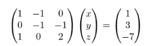

这里的未知数是一个 3D 向量；我们需要找到三个数字来识别它。进行矩阵乘法，我们可以将其分解为三个方程：

\( 1 \cdot x − 1 \cdot y + 0 \cdot z = 1 \)

\( 0 \cdot x − 1 \cdot y − 1 \cdot z = 3 \)

\( 1 \cdot x + 0 \cdot y + 2 \cdot z = −7 \)

这是一个有三个未知数和三个线性方程的系统，\( ax + by + cz = d \) 是 3D 线性方程的标准形式。在下一节中，我们将探讨 3D 线性方程的几何解释。（实际上，它们在 3D 中代表平面，而不是 2D 中的线。）

现在，让我们把这个系统看作是一个待定系数的线性组合。前面的矩阵方程等价于以下方程：

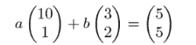

解这个方程等价于问：什么线性组合 \( (1, 0, 1) \)，\( (−1, −1, 0) \)，和 \( (0, −1, 2) \) 产生向量 \( (1, 3, −7) \)？这比 2D 例子更难想象，手动计算答案也更困难。幸运的是，我们知道 NumPy 可以处理三个未知数的线性方程组，所以我们只需将 3x3 矩阵和 3D 向量作为输入传递给求解器，如下所示：

```
>>> import numpy as np
>>> xw = np.array((1,3,−7))
>>> xa = np.array(((1,−1,0),(0,−1,−1),(1,0,2)))
>>> np.linalg.solve(a,w)
array([ 3., 2., −5.])
```

解决我们的线性方程组的值是：\( x = 3 \)，\( y = 2 \)，和 \( z = −5 \)。换句话说，这些是我们构建所需线性组合的系数。我们可以这样说，向量 \( (1, 3, −7) \) 相对于基 \( (1, 0, 1) \)，\( (−1, −1, 0) \)，\( (0, −1, 2) \) 的坐标是 \( (3, 2, −5) \)。

在更高维度的故事也是一样的；只要可能，我们可以通过求解相应的线性方程组来将一个向量表示为其他向量的线性组合。但是，并不是总能写出线性组合，并不是每个线性方程组都有一个唯一解，甚至可能没有解。一个向量集合是否构成基的问题在计算上等同于一个线性方程组是否有唯一解的问题。

这种深刻的联系是一个很好的地方，可以用来结束第一部分，其重点是线性代数。整本书中会有很多关于线性代数的精华，但当我们把它们与第二部分的核心主题——微积分相结合时，它们就更有用了。

### 7.4.2 练习

| **练习 7.27**：如何将向量 (5, 5) 写成向量 (10, 1) 和 (3, 2) 的线性组合？**解答**：这相当于询问哪些数字 *a* 和 *b* 满足方程或者哪个向量 (*a*, *b*) 满足矩阵方程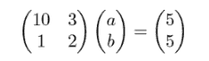。我们可以使用 NumPy 找到一个解：

```
>>> matrix = np.array(((10,3),(1,2)))
>>> vector = np.array((5,5))
>>> np.linalg.solve(matrix,vector)
array([-0.29411765, 2.64705882])
```

这意味着线性组合（你可以检查！）如下所示 |

| **练习 7.28**：将向量 (3, 0, 6, 9) 写成向量 (0, 0, 1, 1)，(0, −2, −1, −1)，(1, −2, 0, 2) 和 (0, 0, −2, 1) 的线性组合。**解答**：要解决的线性系统是，其中 4×4 矩阵的列是我们想要构建线性组合的向量。NumPy 给出了这个系统的解：

```
>>> matrix = np.array(((0, 0, 1, 0), (0, −2, −2, 0), (1, −1, 0, −2), (1, −1, 2, 1)))
>>> vector = np.array((3,0,6,9))
>>> np.linalg.solve(matrix,vector)
array([ 1., −3., 3., −1.])
```

这意味着线性组合是 |

## 概述

+   2D 视频游戏中的模型对象可以是线段构成的多边形形状。

+   给定两个向量 ***u*** 和 ***v***，形式为 *u* + *tv* 的点对于任何实数 *t* 都在一条直线上。事实上，任何直线都可以用这个公式来描述。

+   给定实数 *a*，*b* 和 *c*，其中至少有一个 *a* 或 *b* 不为零，满足 *ax* + *by* = *c* 的平面上的点 (*x*, *y*) 在一条直线上。这被称为直线的**标准形式**，任何直线都可以通过某种选择 *a*，*b* 和 *c* 的方式写成这种形式。直线的方程被称为**线性方程**。

+   在平面上找到两条直线的交点等价于找到同时满足两个线性方程的值 (*x*, *y*)。我们试图同时求解的一组线性方程称为**线性方程组**。

+   求解两个线性方程组等价于找到什么向量可以乘以一个已知的 2×2 矩阵，以得到一个已知的向量。

+   NumPy 有一个内置函数，`numpy.linalg.solve`，它接受一个矩阵和一个向量，并在可能的情况下自动求解相应的线性方程组。

+   一些线性方程组无法求解。例如，如果两条直线平行，它们可能没有交点，或者有无限多个交点（这意味着它们是同一条直线）。这意味着没有(*x*, *y*)值可以同时满足这两条直线的方程。表示这种系统的矩阵被称为**奇异的**。

+   3D 空间中的平面是 2D 空间中直线的类似物。它们是满足形式为*ax* + *by* + *cz* = *d*的方程的点集(*x*, *y*, *z*)。

+   3D 空间中的两个非平行平面在无限多个点上相交，并且具体来说，它们共有的点集在 3D 空间中形成一条 1D 线。三个平面可以有一个唯一的交点，这个交点可以通过求解表示这些平面的三个线性方程组来找到。

+   2D 空间中的直线和 3D 空间中的平面都是**超平面**的例子，它们是**n**维空间中满足单个线性方程的点集。

+   在**n**维空间中，你需要至少**n**个线性方程组来找到一个唯一解。如果你恰好有**n**个线性方程，并且它们有唯一解，那么这些方程被称为**独立方程**。

+   确定如何将一个向量表示为给定向量集的线性组合在计算上等同于求解一个线性方程组。如果向量集是空间的基，这总是可能的。
