# 8 理解变化率

本章涵盖

+   计算数学函数的平均变化率

+   近似某点的瞬时变化率

+   想象变化率本身是如何变化的

+   从其变化率重建函数

在本章中，我向你介绍了微积分中最重要的一些概念：导数和积分。这两个操作都与函数一起工作。*导数*接受一个函数并给你另一个函数，该函数测量其变化率。*积分*做的是相反的事情；它接受一个表示变化率的函数，并给你一个测量原始累积值的函数。

我将专注于我从自己的石油生产数据分析工作中提取的一个简单例子。我们将设想的情况是一个泵从油井中抽出原油，然后通过管道流入油罐。管道配备了一个连续测量流体流速的仪表，油罐配备了一个传感器，它可以检测油罐中液体的高度并报告存储在其中的油的体积（图 8.1）。

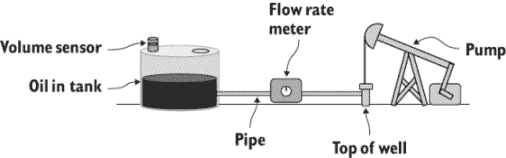

图 8.1 从油井中抽取油并将其泵入油罐的泵的示意图

体积传感器的测量告诉我们油罐中油的体积作为时间的函数，而流量计的测量告诉我们每小时流入油罐的体积，这也是作为时间的函数。在这个例子中，体积是累积值，流速是其变化率。

在本章中，我们解决两个主要问题。首先，在我们的例子中，我们从一个已知的时间累积体积开始，使用导数计算作为时间的函数的流速。其次，我们执行相反的任务，从一个作为时间的函数的流速开始，使用积分计算油罐中油的累积体积。图 8.2 展示了这个过程。

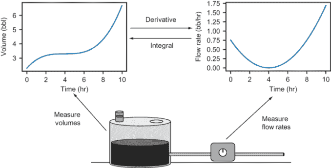

图 8.2 使用导数从体积中找到随时间变化的流速，然后使用积分从流速中找到随时间变化的体积

我们将编写一个名为`get_flow_rate(volume_function)`的函数，它接受体积函数作为输入，并返回一个新 Python 函数，该函数在任何时间给出流速。然后我们将编写第二个函数`get_volume(flow_rate_function)`，它接受流速函数并返回一个 Python 函数，该函数给出随时间变化的体积。我在过程中穿插一些较小的例子作为热身，帮助你思考变化率。

尽管它的基本思想并不复杂或陌生，但微积分因其需要大量的繁琐代数而名声不佳。因此，我在本章中侧重于介绍新思想，而不是很多新技术。大多数例子只需要我们在第七章中覆盖的线性函数数学。让我们开始吧！

## 8.1 从体积计算平均流速

让我们先假设我们知道随时间变化的罐中体积，这被编码为一个名为 `volume` 的 Python 函数。这个函数接受一个参数，即从预定义的起始点之后的小时数，并返回该时间点的油罐体积，以桶（缩写为“bbl”）为单位。为了将重点放在思想上而不是代数上，我甚至不会告诉你 `volume` 函数的公式（尽管如果你好奇可以在源代码中看到它）。你现在需要做的只是调用它并绘制它。当你绘制它时，你会看到类似于图 8.3 的东西。

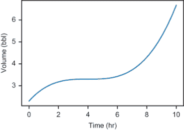

图 8.3 `volume` 函数的绘图显示了随时间变化的油罐体积。

我们希望朝着在任何时间点找到进入罐中流速的方向前进，因此，作为我们的第一步，让我们以直观的方式计算这个值。在这个例子中，让我们编写一个函数 `average_flow_rate(v, t1, t2)`，它接受一个体积函数 `v`，一个起始时间 `t1` 和一个结束时间 `t2`，并返回一个数字，表示在时间间隔内进入罐的平均流速。也就是说，它告诉我们每小时进入罐中的总桶数。

### 8.1.1 实现 average_flow_rate 函数

“每小时桶数”中的“每”一词表明我们将进行一些除法来得到答案。计算平均流速的方法是将总体体积变化除以经过的时间：

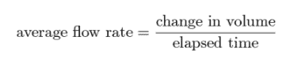

从起始时间 *t*[1] 到结束时间 *t*[2] 测量的时间（以小时为单位）是 *t*[2] − *t*[1]。如果我们有一个函数 *V*(*t*)，它告诉我们体积作为时间的函数，总体体积变化是 *t*[2] 时的体积减去 *t*[1] 时的体积，即 *V*(*t*[2]) − *V*(*t*[1])。这给了我们一个更具体的方程来工作：

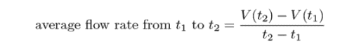

这是我们计算不同情境中变化率的方法。例如，当你开车时，你的速度是你相对于时间覆盖距离的速率。为了计算你的平均速度，你将行驶的总英里数除以经过的小时数，以每小时英里（mph）的结果。为了知道行驶的距离和经过的时间，你需要在旅行的开始和结束时检查你的时钟和里程表。

我们的平均流速公式依赖于体积函数 *V* 和起始时间 *t*[1] 和结束时间 *t*[2]，这些是我们将传递给相应 Python 函数的参数。函数的主体是将这个数学公式直接翻译成 Python：

```
def average_flow_rate(v,t1,t2):
    return (v(t2) - v(t1))/(t2 - t1)
```

这个函数很简单，但重要到足以作为一个示例计算来讲解。让我们使用`volume`函数（如图 8.3 所示，并包含在本书的源代码中），并假设我们想知道在 4 小时标记和 9 小时标记之间油罐的平均流速。在这种情况下，`t1` `=` `4` 和 `t2` `=` `9`。为了找到起始和结束的体积，我们可以在这两个时间点上评估`volume`函数：

```
>>> volume(4)
3.3
>>> volume(9)
5.253125
```

为了简化计算，两个体积之间的差值是 5.25 bbl − 3.3 bbl = 1.95 bbl，总经过时间是 9 hr − 4 hr = 5 hr。因此，油罐的平均流速大约是 1.95 bbl 除以 5 hr，即 0.39 bbl/hr。我们的函数确认我们得到了正确的结果：

```
>>> average_flow_rate(volume,4,9)
0.390625
```

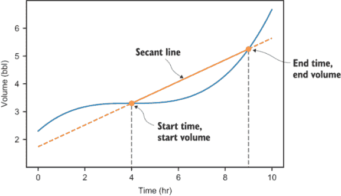

图 8.4 一条割线连接了体积图上的起始点和结束点。

这完成了我们寻找函数变化率的第一个基本示例。这并不太难！在我们继续一些更有趣的例子之前，让我们花更多的时间来解释体积函数的作用。

### 8.1.2 使用割线描绘平均流速

考虑到体积随时间变化的平均变化率，另一种有用的思考方式是查看体积图。让我们专注于我们计算平均流速的两个体积图上的点。在图 8.4 中，这些点在图上显示为点，我画了一条穿过它们的线。穿过这种图上两点的一条线被称为**割线**。

如您所见，由于在这个时间段内油罐中的油量增加，所以在 9 小时时的图形比 4 小时时更高。这导致连接起始点和结束点的割线向上倾斜。结果证明，割线的斜率**精确地**告诉我们时间间隔内的平均流速。

原因如下。给定直线上的两个点，斜率是垂直坐标变化除以水平坐标变化。在这种情况下，垂直坐标从*V*(*t*[1])变为*V*(*t*[2])，变化为*V*(*t*[2]) − *V*(*t*[1])，水平坐标从*t*[1]变为*t*[2]，变化为*t*[2] − *t*[1]。斜率因此是(*V*(*t*[2]) − *V*(*t*[1]))除以(*t*[2] − *t*[1])，这与平均流速的计算完全相同（图 8.5）！

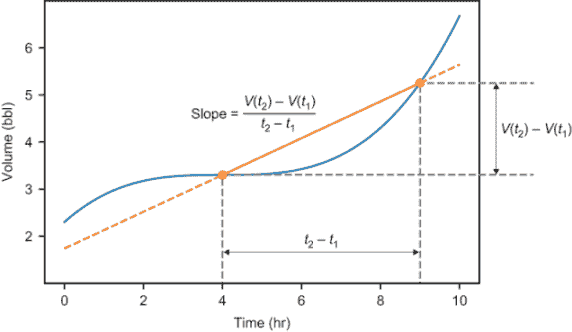

图 8.5 我们以计算`volume`函数平均变化率相同的方式计算割线的斜率。

在我们继续的过程中，您可以在图上想象割线来推理函数的平均变化率。

### 8.1.3 负变化率

值得简要提及的一个例子是割线可以具有**负**斜率。图 8.6 显示了不同**体积**函数的图形，您可以在本书的源代码中找到作为`decreasing_volume`实现的代码。图 8.6 显示了油罐中体积随时间减少的情况。

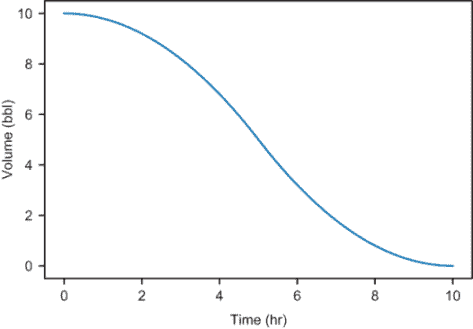

图 8.6 不同的 `volume` 函数显示油箱中的体积随时间减少。

这个例子与我们的前一个例子不兼容，因为我们不期望油会从油箱流回地面。但它确实说明了割线可以向下延伸，例如，从 *t* = 0 到 *t* = 4。在这个时间段内，体积变化为 -3.2 bbl（图 8.7）。

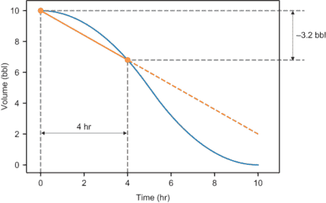

图 8.7 定义具有负斜率的割线的图上的两个点

在这种情况下，斜率为 -3.2 bbl 除以 4 小时，即 -0.8 bbl/小时。这意味着油进入油箱的速度为 -0.8 bbl/小时。更合理的说法是，油以 0.8 bbl/小时的速度*离开*油箱。无论 `volume` 函数是增加还是减少，我们的 `average_flow_rate` 函数都是可靠的。在这种情况下，

```
>>> average_flow_rate(decreasing_volume,0,4)
-0.8
```

配备了这个函数来测量平均流速，我们可以在下一节中更进一步−了解流速随时间的变化。

### 8.1.4 练习

| **练习 8.1**：假设您在中午出发开始长途旅行，当时您的里程表读数为 77,641 英里，您在下午 4:30 结束旅行，当时里程表读数为 77,905 英里。旅行中的平均速度是多少？**解答**：总行程为 77,905 − 77,641 = 264 英里，覆盖了 4.5 小时。平均速度为 264 英里 / 4.5 小时，约为 58.7 英里/小时。 |
| --- |

| **练习 8.2**：编写一个 Python 函数 `secant_line(f,x1,x2)`，该函数接受一个函数 `*f*(*x*)` 和两个值 `x1` 和 `x2`，并返回一个表示随时间变化的割线的函数。例如，如果您运行 `line` `=` `secant_line (f,x1,x2)`，那么 `line(3)` 将给出在 *x* = 3 处的割线的 *y* 值。**解答**：

```
def secant_line(f,x1,x2):
    def line(*x*):
        return f(x1) + (x-x1) * (f(x2)-f(x1))/(x2-x1)
    return line
```

|

| **练习 8.3**：编写一个函数，使用前一个练习中的代码来绘制两个给定点之间函数 `f` 的割线。**解答**：

```
def plot_secant(f,x1,x2,color='k'):
    line = secant_line(f,x1,x2)
    plot_function(line,x1,x2,c=color)
    plt.scatter([x1,x2],[f(x1),f(x2)],c=color)
```

|

## 8.2 随时间绘制平均流速

我们本章的一个主要目标是，从体积函数开始，恢复流速函数。为了找到流速作为时间的函数，我们需要了解油箱在不同时间点的体积变化速度。首先，我们可以从图 8.8 中看到，流速随时间变化−体积图上的不同割线具有不同的斜率。

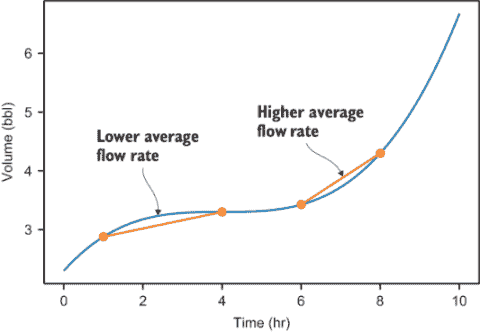

图 8.8 体积图上的不同割线具有不同的斜率，表明流速在变化。

在本节中，我们通过在不同时间段计算平均流速来更接近找到流速作为时间的函数。我们将 10 小时的时间段分成多个较短且固定持续时间的小时间段（例如，十个 1 小时的时间段），并为每个时间段计算平均流速。

我们将这项工作封装在一个名为`interval_flow_rates(v,t1, t2,dt)`的函数中，其中`v`是体积函数，`t1`和`t2`是起始和结束时间，`dt`是时间间隔的固定持续时间。此函数返回时间与流速的成对列表。例如，如果我们将 10 小时分成 1 小时段，结果应该如下所示：

```
[(0,...), (1,...), (2,...), (3,...), (4,...), (5,...), (6,...), (7,...),
     (8,...), (9,...)]
```

其中每个`...`将被相应小时的流速所替换。一旦我们得到这些成对，我们就可以将它们作为散点图绘制在章节开头的流速函数旁边，并比较结果。

### 8.2.1 在不同时间间隔中寻找平均流速

作为实现`interval_flow_rates()`的第一步，我们需要找到每个时间间隔的起始点。这意味着找到从起始时间`t1`到结束时间`t2`的时间值列表，增量是时间间隔长度`dt`。Python 的 NumPy 库中有一个方便的函数叫做`arange`，它可以为我们完成这个任务。例如，从时间零开始，以 0.5 小时为增量到时间 10，我们得到以下时间间隔起始时间：

```
>>> import numpy as np
>>> np.arange(0,10,0.5)
array([0\. , 0.5, 1\. , 1.5, 2\. , 2.5, 3\. , 3.5, 4\. , 4.5, 5\. , 5.5, 6\. ,
       6.5, 7\. , 7.5, 8\. , 8.5, 9\. , 9.5])
```

注意，10 小时结束时间不包括在列表中。这是因为我们列出每个半小时的起始时间，而从`t` =10 到`t` =10.5 的半小时不是我们考虑的整体时间间隔的一部分。

对于这些时间间隔的起始时间，加上`dt`将返回相应的结束时间。例如，在前面列表中，从 3.5 小时开始的时间间隔结束于 3.5 + 0.5 = 4.0 小时。要实现`interval_flow_rates`函数，我们只需在各个时间间隔上使用我们的`average_flow_rate`函数。下面是这个完整函数的示例：

```
def interval_flow_rates(v,t1,t2,dt):
    return [(t,average_flow_rate(v,t,t+dt))      ❶
                for t in np.arange(t1,t2,dt)]
```

❶ 对于每个时间间隔的起始时间`t`，计算从`t`到`t+dt`的平均流速。（我们想要的是`t`与相应流速的成对列表。）

如果我们将`volume`函数与 0 小时和 10 小时作为起始和结束时间，以及 1 小时作为时间间隔长度传递，我们将得到一个列表，告诉我们每个小时的流速：

```
>>> interval_flow_rates(volume,0,10,1)
[(0, 0.578125),
 (1, 0.296875),
 (2, 0.109375),
 (3, 0.015625),
 (4, 0.015625),
 (5, 0.109375),
 (6, 0.296875),
 (7, 0.578125),
 (8, 0.953125),
 (9, 1.421875)]
```

通过查看这个列表，我们可以得出一些结论。平均流速始终为正，这意味着在每小时中油罐中都有净增加的油量。流速在 3 小时和 4 小时左右降至最低值，然后在最后一小时增加到最高值。如果我们在图上绘制，这会更加清晰。

### 8.2.2 绘制时间间隔流速图

我们可以使用 Matplotlib 的`scatter`函数快速绘制这些流速随时间变化的图表。该函数在给定的水平坐标列表后面跟一个垂直坐标列表的情况下，在图上绘制一系列点。我们需要提取时间和流速作为两个单独的 10 数字列表，然后将它们传递给该函数。为了避免重复这个过程，我们可以将其全部构建到一个函数中：

```
def plot_interval_flow_rates(volume,t1,t2,dt):
    series = interval_flow_rates(volume,t1,t2,dt)
    times = [t for (t,_) in series]
    rates = [q for (_,q) in series]
    plt.scatter(times,rates)
```

调用`plot_interval_flow_rates(volume,0,10,1)`生成由`interval_flow_rates`产生的数据的散点图。图 8.9 显示了从 0 小时到 10 小时以 1 小时为增量绘制`volume`函数的结果。

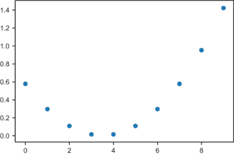

图 8.9 每小时的平均流量图

这证实了我们从数据中看到的情况：平均流量在 3 小时和 4 小时左右降至最低值，然后在此之后再次增加，达到近 1.5 桶/小时的最高速率。让我们将这些平均流量与实际流量函数进行比较。同样，我不想让你担心流量随时间变化的公式。我在这本书的源代码中包含了一个`flow_rate`函数，我们可以绘制它（图 8.10），以及散点图。


图 8.10 每小时的平均流量图（点）和每小时的实际流量图（平滑曲线）

这两个图表讲述的是同一个故事，但它们并不完全吻合。区别在于点测量平均流量，而`flow_rate`函数显示了在任何时间点的流量*瞬时值*。

为了理解这一点，再次思考长途旅行的例子可能会有所帮助。如果你在 1 小时内行驶了 60 英里，你的平均速度是 60 英里/小时。然而，你的速度计在每小时的每一瞬间都显示 60 英里/小时的可能性不大。在开阔道路上某个地方，你的*瞬时速度*可能达到 70 英里/小时，而在交通中，你可能会减速到 50 英里/小时。

同样，管道上的流量计不需要与下一小时的平均流量一致。实际上，如果你使时间间隔更小，图表会更接近。图 8.11 显示了 20 分钟间隔（1/3 小时）的平均流量图，与流量函数并排。

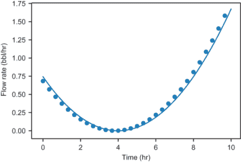

图 8.11 流量随时间变化的图表与 20 分钟间隔的平均流量图

平均流量仍然与瞬时流量不完全匹配，但它们要接近得多。在下一节中，我们将继续这个想法，并计算极小时间间隔的流量，其中平均流量和瞬时流量的差异几乎不可察觉。

### 8.2.3 练习

| **练习 8.4**：以 0.5 小时为间隔绘制`decreasing_volume`流量随时间的变化。何时其流量最低？也就是说，何时油罐中油流出速度最快？**解答**：运行`plot_interval_flow_rates(decreasing_volume,0, 10,0.5)`，我们可以看到在 5 小时前流量最低（最负值）！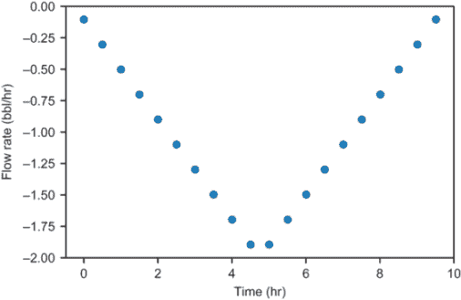 |
| --- |

| **练习 8.5**：编写一个`linear_volume_function`并绘制流量随时间的变化图以显示它是恒定的。**解答**：一个`linear_volume_function(*t*)`的形式为 *V*(*t*) = *at* + *b*，其中 *a* 和 *b* 是常数。例如，

```
def linear_volume_function(t):
    return 5*t + 3

plot_interval_flow_rates(linear_volume_function,0,10,0.25)
```

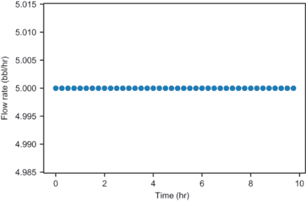此图显示，对于线性体积函数，流量随时间保持恒定。|

## 8.3 近似瞬时流量

随着我们计算体积函数在越来越小的时段时间内的平均变化率，我们越来越接近测量单个瞬间的实际情况。但如果我们尝试测量单个瞬间的体积平均变化率，即起始时间和结束时间相同的区间，我们会遇到麻烦。在时间 *t* 时，平均流量公式的读数如下：

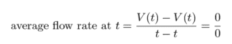

0 除以 0 是未定义的，所以这种方法不起作用。这就是代数不再帮助我们，我们需要转向微积分推理的地方。在微积分中，有一个称为**导数**的运算，它绕过这个未定义的除法问题，告诉你函数的瞬时变化率。

在本节中，我将解释瞬时流量函数（在微积分中称为体积函数的**导数**）为何定义良好，以及如何近似它。我们将编写一个函数 `instantaneous_flow_rate(v,t)`，它接受一个体积函数 *v* 和一个时间点 *t*，并返回油流入油罐的瞬时流量的近似值。这个结果是以每小时桶数表示的，应该与 `instantaneous_flow_rate` 函数的值完全匹配。

一旦我们这样做，我们将编写第二个函数 `get_flow_rate_function(*v*)`，它是 `instantaneous_flow_rate()` 的柯里化版本。它的参数是一个体积函数，它返回一个函数，该函数接受一个时间并返回一个瞬时流量。这个函数完成了我们本章的两个主要目标中的第一个：从一个体积函数开始，生成相应的流量函数。

### 8.3.1 求小割线的斜率

在我们进行任何编码之前，我想说服你首先讨论“瞬时流量”是有意义的。为此，让我们放大单个瞬间的体积图，看看发生了什么（图 8.12）。让我们选择 *t* = 1 小时的位置，并观察它周围的小窗口。

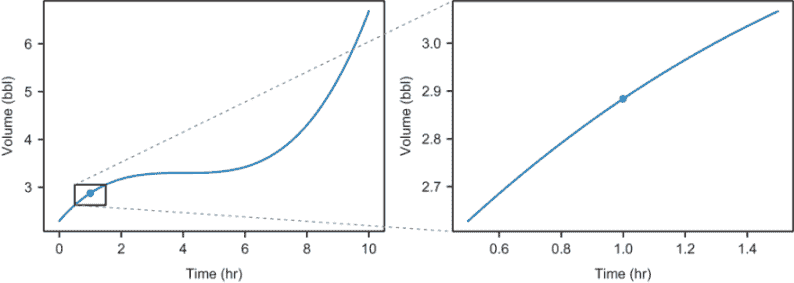

图 8.12 在 *t* = 1 小时附近的 1 小时窗口放大

在这个较短的时间间隔内，我们不再看到体积图曲线的很多部分。也就是说，图形的陡峭程度在整个 10 小时窗口中变化较小。我们可以通过绘制一些割线并观察它们的斜率相当接近（图 8.13）来测量这一点。

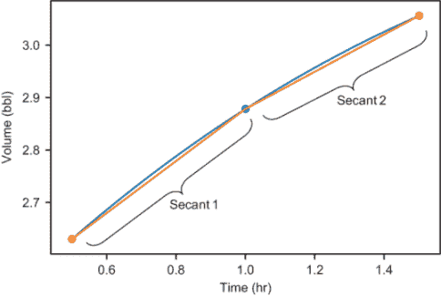

图 8.13 在 *t* = 1 小时附近的两个割线具有相似的斜率，这意味着在这个时间间隔内流量变化不大。

如果我们进一步放大，图表的陡峭度看起来越来越恒定。将放大到 0.9 小时和 1.1 小时之间的间隔，体积图几乎是一条直线。如果你在这段间隔上画一条割线，几乎看不到图表高于割线的上升（图 8.14）。

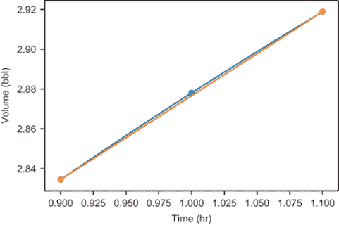

图 8.14 在 *t* = 1 小时附近的较小时间间隔内，体积图看起来几乎是直线。

最后，如果我们放大到 *t* = 0.99 小时和 *t* = 1.01 小时之间的窗口，体积图与直线无法区分（图 8.15）。在这个层面上，割线似乎与函数图完全重叠，看起来像一条线。

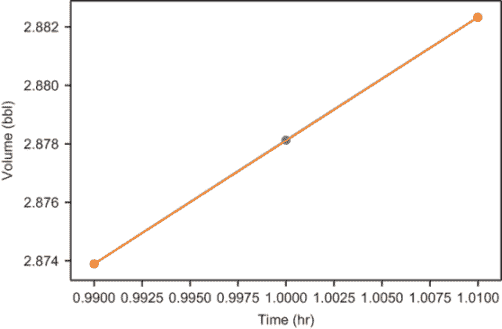

图 8.15 进一步放大，体积图在视觉上与直线无法区分。

如果你继续放大，图表看起来会越来越像一条线。并不是图表在这个点**就是**一条线，而是当你放大时，它越来越接近看起来像一条线。在微积分中，我们可以做出的推理飞跃是，在任何一点，都有一个单一的、最佳的线来逼近像体积图这样的平滑图表。以下是一些计算，表明越来越小的割线斜率会收敛到一个单一的值，这表明我们确实正在接近斜率的单一“最佳”逼近：

```
>>> average_flow_rate(volume,0.5,1.5)
0.42578125
>>> average_flow_rate(volume,0.9,1.1)
0.4220312499999988
>>> average_flow_rate(volume,0.99,1.01)
0.42187656249998945
>>> average_flow_rate(volume,0.999,1.001)
0.42187501562509583
>>> average_flow_rate(volume,0.9999,1.0001)
0.42187500015393936
>>> average_flow_rate(volume,0.99999,1.00001)
0.4218750000002602
```

除非这些零点是极大的巧合，我们趋近的数字是 0.421875 bbl/hr。我们可以得出结论，在 *t* = 1 小时时体积函数的最佳逼近线的斜率为 0.421875。如果我们再次放大（图 8.16），我们可以看到这条最佳逼近线的外观。

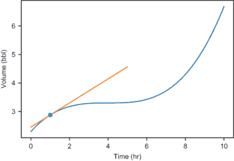

图 8.16 在时间 *t* = 1 小时时，斜率为 0.421875 的线是体积函数的最佳逼近。

这条线被称为在点 *t* = 1 处体积图的**切线**，它之所以与众不同，是因为它在该点与体积图平行。因为切线是最佳逼近体积图的线，所以它的斜率是衡量该图瞬时斜率（即，*t* = 1 处的瞬时流速）的最佳指标。瞧瞧，我提供的源代码中的`flow_rate`函数给出的数字正是越来越小的割线斜率所趋近的数字：

```
>>> flow_rate(1)
0.421875
```

要有一条切线，一个函数需要是“平滑”的。在本节末尾的迷你项目中，你可以尝试用不平滑的函数重复这个练习，你会发现没有最佳逼近线。当我们能在某一点找到函数图的切线时，该点的斜率被称为该函数的**导数**。例如，体积函数在 *t* = 1 处的导数等于 0.421875（桶/小时）。

### 8.3.2 构建瞬时流速函数

现在我们已经看到了如何计算体积函数的瞬时变化率，我们有了实现`instantaneous_flow_rate`函数所需的一切。我们之前使用的程序自动化的一个主要障碍是，Python 无法“目测”几条小割线段的斜率并决定它们收敛到哪个数字。为了解决这个问题，我们可以计算越来越小的割线线段的斜率，直到它们稳定到一定的小数位数。

例如，我们可能决定要找到一系列割线线的斜率，每一条都比前一条窄十分之一，直到数值稳定到四位小数。以下表格再次显示了斜率。

| 割线线段间隔 | 割线线段斜率 |
| --- | --- |
| 0.5 to 1.5 | 0.42578125 |
| 0.9 to 1.1 | 0.4220312499999988 |
| 0.99 to 1.01 | 0.42187656249998945 |
| 0.999 to 1.001 | 0.42187501562509583 |

在最后两行中，斜率在四位小数上是一致的（它们之间的差异小于 10^(-4)），因此我们可以将最终结果四舍五入到 0.4219，并将其称为我们的结果。这并不是 0.421875 的确切结果，但它是对指定小数位数的良好近似。

固定近似数的小数位数后，我们现在有了一种方法来判断是否完成。如果在经过大量步骤之后，我们还没有收敛到指定的小数位数，我们可以认为不存在最佳近似线，因此在该点没有导数。以下是这个程序如何转换为 Python 代码：

```
def instantaneous_flow_rate(v,t,digits=6):
    tolerance = 10 ** (−digits)                      ❶
    h = 1
    approx = average_flow_rate(v,t-h,t+h)            ❷
    for i in range(0,2*digits):                      ❸
        h = h / 10
        next_approx = average_flow_rate(v,t-h,t+h)   ❹
        if abs(next_approx − approx) < tolerance:
            return round(next_approx,digits)         ❺
        else:
            approx = next_approx                     ❻
    raise Exception("Derivative did not converge")   ❼
```

❶ 如果两个数字之间的差异小于 10^(-*d*)的容差，则它们在 d 位小数上一致。

❷ 在目标点 t 两侧各 1 个单位长度的间隔上计算第一条割线线的斜率

❸ 作为粗略近似，我们在放弃收敛之前只尝试 2·digits 次迭代。

❹ 在每一步，计算围绕点 t 在 10 倍更小间隔上的新割线线的斜率

❺ 如果最后两个近似值之间的差异小于容差，则四舍五入结果并返回

❻ 否则，以更小的间隔再次运行循环

❼ 如果我们超过了最大迭代次数，则程序没有收敛到结果。

我任意选择了六位数字作为默认精度，因此这个函数与我们在 1 小时标记处的瞬时流速结果相匹配：

```
>>> instantaneous_flow_rate(volume,1)
0.421875
```

我们现在可以计算任何时间点的瞬时流速，这意味着我们有了流速函数的完整数据。接下来，我们可以绘制它并确认它是否与我在源代码中提供的`flow_rate`函数相匹配。

### 8.3.3 对瞬时流速函数进行柯西和绘图

对于一个像源代码中的`flow_rate`函数那样表现的行为，接受一个时间变量并返回一个流速，我们需要对`instantaneous_flow_rate`函数进行柯西。柯西函数接受一个体积函数（`v`）并返回一个流速函数：

```
def get_flow_rate_function(*v*):
    def flow_rate_function(t):
        instantaneous_flow_rate(v,t)
    return flow_rate_function
```

`get_flow_rate_function(v*)`的输出是一个函数，它应该与源代码中的`flow_rate`函数相同。我们可以在 10 小时的时间段内绘制这两个函数以确认，确实，图 8.17 显示它们的图形无法区分：

```
plot_function(flow_rate,0,10)
plot_function(get_flow_rate_function(volume),0,10)
```

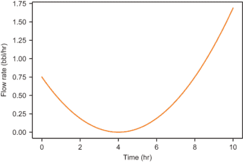

图 8.17 将`flow_rate`函数与`get_flow_rate`函数一起绘制，显示它们的图形无法区分。

我们已经完成了本章的第一个主要目标，从体积函数中产生了流量函数。正如我在本章开头提到的，这个过程被称为**求导**。

给定一个像“体积”函数这样的函数，另一个在任意给定点给出其瞬时变化率的函数被称为其**导数**。你可以将导数想象成一个操作，它接受一个（足够平滑的）函数并返回另一个函数，测量原始函数的变化率（图 8.18）。在这种情况下，可以说流量函数是体积函数的导数。

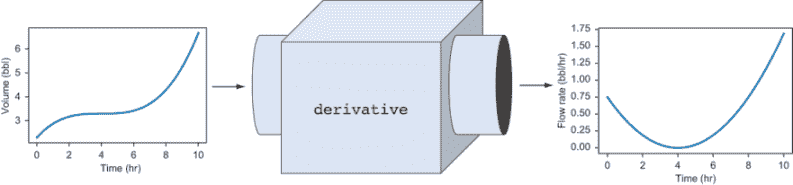

图 8.18 你可以将导数想象成一个机器，它接受一个函数并返回另一个函数，测量输入函数的变化率。

导数是一个通用的过程，它适用于任何足够平滑以在每一点都有切线的函数 f(x)。函数 f 的导数写作 f'（并读作“f 的导数”），所以 f'(x)表示 f 相对于 x 的瞬时变化率。具体来说，f'(5)是 f(x)在 x = 5 处的导数，测量 f 在 x = 5 处的切线斜率。函数导数还有一些其他常见的表示法，包括：

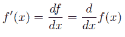

df 和 dx 分别表示 f 和 x 的无限小（无限小）变化，它们的商给出了无限小割线的斜率。这三个表示法中的最后一个很好，因为它使 d/dx 看起来像是对 f(x)应用的操作。在许多情况下，你会看到独立的导数运算符，如 d/dx。这特别意味着“对 x 求导的操作。”图 8.19 显示了这些表示法如何结合在一起。

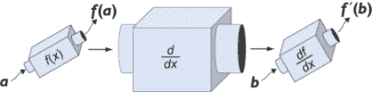

图 8.19 “关于 x 的导数”作为一个操作，它接受一个函数并返回一个新的函数

在本书的其余部分，我们将更多地使用导数，但就目前而言，让我们转向其对应操作——积分。

### 8.3.4 练习

| **练习 8.6**：确认“体积”函数在 0.999 小时到 1.001 小时的时间间隔内**不是**一条直线。**解答**：如果它是一条直线，那么在每一个点上它都等于其割线。然而，从 0.999 小时到 1.001 小时的割线在 t = 1 小时时的值与“体积”函数不同：

```
>>> volume(1)
2.878125
>>> secant_line(volume,0.999,1.001)(1)
2.8781248593749997
```

|

| **练习 8.7**：通过计算围绕`t` = 8 的越来越小的割线的斜率，来近似`t` = 8 时体积图的切线斜率。**解答**：

```
>>> average_flow_rate(volume,7.9,8.1)
0.7501562500000007
>>> average_flow_rate(volume,7.99,8.01)
0.750001562499996
>>> average_flow_rate(volume,7.999,8.001)
0.7500000156249458
>>> average_flow_rate(volume,7.9999,8.0001)
0.7500000001554312
```

看起来在`t` = 8 时的瞬时变化率是 0.75 桶/小时。|

| **练习 8.8**：对于 Python 中定义的`sign`函数，说服自己它在`x` = 0 处没有导数：

```
def sign(*x*):
    return *x*/ abs(*x*)
```

**解答**：在越来越小的间隔内，割线的斜率越来越大，而不是收敛到一个单一的数字：

```
>>> average_flow_rate(sign,-0.1,0.1)
10.0
>>> average_flow_rate(sign,-0.01,0.01)
100.0
>>> average_flow_rate(sign,-0.001,0.001)
1000.0
>>> average_flow_rate(sign,−0.000001,0.000001)
1000000.0
```

这是因为`sign`函数在`x` = 0 处立即从-1 跳到 1，当你放大查看时，它看起来并不像一条直线。|

## 8.4 近似体积变化

在本章的剩余部分，我将专注于我们的第二个主要目标：从一个已知的流量函数中恢复体积函数。这是求导过程的逆过程，因为我们假设我们知道函数的变化率，我们想要恢复原始函数。在微积分中，这被称为**积分**。

我会将恢复体积函数的任务分解成几个更小的例子，这将帮助你了解积分是如何工作的。对于第一个例子，我们编写两个 Python 函数来帮助我们找到在指定时间段内油箱中的体积变化。

我们称第一个函数为`brief_volume_change(q,t,dt)`，它接受一个流量函数`q`，一个时间`t`，以及一个短的时间持续时间`dt`，该函数返回从时间`t`到时间`t + dt`的体积变化的近似值。这个函数通过假设时间间隔非常短，流量变化不大来计算其结果。

我们称第二个函数为`volume_change(q,t1,t2,dt)`，正如命名上的差异所暗示的，我们用它来计算任何时间间隔的体积变化，而不仅仅是短暂的时间间隔。它的参数是流量函数`q`，一个起始时间`t1`，一个结束时间`t2`，以及一个小的时间间隔`dt`。该函数将时间间隔分解为持续时间`dt`的增量，这些增量足够短，可以使用`brief_volume_change`函数。返回的总体积变化是所有短时间间隔体积变化的总和。

### 8.4.1 在短时间间隔内寻找体积变化

要理解`brief_volume_change`函数背后的原理，让我们回到熟悉的汽车速度表例子。如果你瞥了一眼速度表，它显示正好是 60 英里/小时，你可能会预测在接下来的 2 小时内，你会行驶 120 英里，这是 2 小时乘以 60 英里/小时。如果你运气好，这个估计可能是正确的，但也有可能速度限制提高了，或者你离开了高速公路并停车。关键是，仅仅看一眼速度表并不能帮助你估计长时间内的行驶距离。

另一方面，如果你使用 60 英里/小时的速度来计算你在查看速度表后单秒内行驶的距离，你可能会得到一个非常准确的答案；你的速度在一秒内不会变化太多。一秒是小时的 1/3600，所以 60 英里/小时乘以每小时的 1/3600 给你 1/60 英里，或 88 英尺。除非你正在积极地踩刹车或油门到底，这很可能是一个好的估计。

返回到流速和体积，假设我们正在处理一个足够短的时间段，使得流速大致恒定。换句话说，时间间隔内的流速接近时间间隔内的平均流速，因此我们可以应用我们的原始方程：

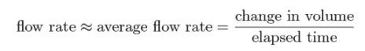

重新排列这个方程，我们可以得到体积变化的近似：


我们的`small_volume_change`函数只是将这个假设公式翻译成 Python 代码。给定一个流速函数`q`，我们可以找到输入时间`t`的流速为`q(*t*)`，我们只需要将其乘以持续时间`dt`以得到体积的变化：

```
def small_volume_change(q,t,dt):
    return q(t) * dt
```

因为我们现在有一对实际的体积和流速函数，我们可以现在测试我们的近似有多好。正如预期的那样，对于整个小时的间隔，预测并不太好：

```
>>> small_volume_change(flow_rate,2,1)
0.1875
>>> volume(3) − volume(2)
0.109375
```

这个近似值偏差大约 70%。相比之下，我们在 0.01 小时的时间间隔上得到了很好的近似。结果是实际体积变化的 1%以内：

```
>>> small_volume_change(flow_rate,2,0.01)
0.001875
>>> volume(2.01) − volume(2)
0.0018656406250001645
```

因为我们可以得到小时间间隔内体积变化的良好近似，我们可以将它们拼接起来以得到较长时间间隔的体积变化。

### 8.4.2 将时间分成更小的间隔

要实现函数`volume_change(q,t1,t2,dt)`，我们将从`t1`到`t2`的时间分成持续时间为`dt`的间隔。为了简单起见，我们只会处理可以均匀除尽`t2` - `t1`的`dt`值，这样我们就可以将时间周期分成整数的间隔。

再次，我们可以使用 NumPy 的`arange`函数来获取每个间隔的起始时间。函数调用`np.arange(t1,t2,dt)`给我们一个从`t1`到`t2`，以`dt`为增量的时间数组。对于这个数组中的每个时间值`t`，我们可以使用`small_volume_change`找到随后时间间隔的体积变化。最后，我们需要将结果相加以得到所有间隔的总体积变化。这可以在大约一行代码中完成：

```
def volume_change(q,t1,t2,dt):
    return sum(small_volume_change(q,t,dt)
               for t in np.arange(t1,t2,dt))
```

使用这个函数，我们可以将 0 到 10 小时的时间分成 100 个持续时间为 0.1 小时的时间间隔，并计算每个时间间隔内的体积变化。结果与实际体积变化匹配到小数点后一位：

```
>>> volume_change(flow_rate,0,10,0.1)
4.32890625
>>> volume(10) − volume(0)
4.375
```

如果我们将时间分成越来越小的间隔，结果会越来越好。例如：

```
>>> volume_change(flow_rate,0,10,0.0001)
4.3749531257812455
```

就像求导的过程一样，我们可以使间隔越来越小，我们的结果将收敛到预期的答案。从某个区间内的变化率计算函数的整体变化被称为**定积分**。我们将在最后一节回到定积分的定义，但现在是时候关注如何描绘它了。

### 8.4.3 在流量图上描绘体积变化

假设我们将 10 小时的时间段划分为 1 小时的间隔，即使我们知道这不会给我们非常准确的结果。我们唯一关心的流量图上的 10 个点，是每个间隔的开始时间：0 小时，1 小时，2 小时，3 小时，以此类推，直到 9 小时。图 8.20 显示了这些点在图上的标记。

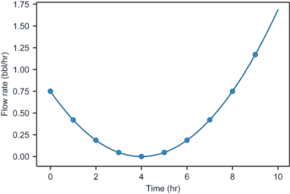

图 8.20 绘制用于计算`volume_change(flow_rate,0,10,1)`的点

我们的计算假设每个间隔内的流量保持恒定，这显然是不正确的。在每个这样的间隔内，流量明显是变化的。在我们的假设中，这就像我们正在使用一个不同的流量函数，其图形在每小时都是恒定的。图 8.21 显示了这些间隔与原始图形并排的样子。

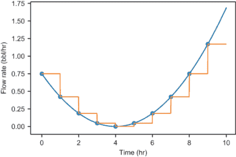

图 8.21 如果我们假设每个间隔内的流量是恒定的，其图形将看起来像一座上下起伏的楼梯。

在每个间隔内，我们计算流量（即每个平坦图形段的高度）乘以 1 小时的经过时间（即每个图形段的宽度）。我们计算出的每个小体积是图上的高度乘以宽度，或者是一个想象中的矩形的面积。图 8.22 显示了填充的矩形。

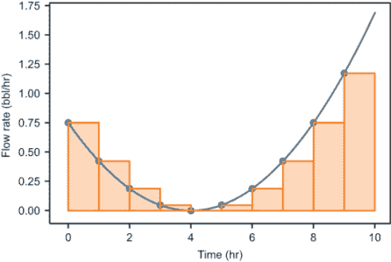

图 8.22 体积的整体变化是 10 个矩形面积的累加

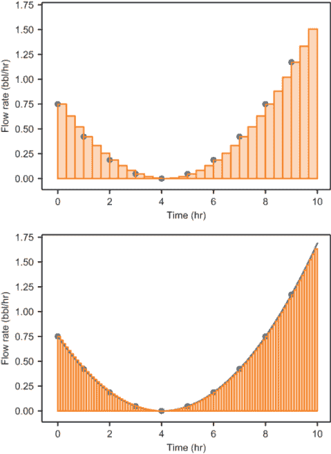

图 8.23 流量图下方的体积是 30 个矩形面积（顶部）或 100 个矩形面积（底部）的累加

随着时间间隔的缩短，我们看到我们的结果在改善。直观上看，这对应着更多的矩形可以更紧密地贴合图形。图 8.23 显示了使用 30 个 1/3 小时（20 分钟）的间隔或 100 个 0.1 小时间隔的矩形的样子。

从这些图片中，你可以看到，随着我们的间隔变小，我们的计算结果接近实际的体积变化，矩形越来越接近填充流量图下方的空间。这里的见解是，在给定时间间隔下流量图下方的面积（近似地）等于同一时间间隔内添加到水箱中的体积。

将近似图形下方的矩形面积之和称为**黎曼和**。由越来越瘦的矩形组成的黎曼和收敛到图形下的面积，这与越来越小的割线斜率收敛到切线斜率的方式非常相似。我们将回到黎曼和与定积分的收敛性，但首先让我们在找到随时间变化的体积方面取得更多进展。

### 8.4.4 练习

| **练习 8.9**：在前 6 小时内大约向油罐中添加了多少油？在最后 4 小时内？在哪个时间段添加的更多？**解答**：在前 6 小时内，大约有 1.13 桶油被泵入油罐，这比在最后 4 小时内泵入油罐的大约 3.24 桶油要少：

```
>>> volume_change(flow_rate,0,6,0.01)
1.1278171874999996
>>> volume_change(flow_rate,6,10,0.01)
3.2425031249999257
```

|

## 8.5 随时间绘制体积

在上一节中，我们能够从流速开始，对给定时间间隔内的体积变化进行近似。我们的主要目标是得到任何给定时间点的油罐**总**体积。

这里有一个技巧问题：如果油以每小时 1.2 桶的恒定速率流入油罐 3 小时，3 小时后油罐中有多少油？答案是：我们不知道，因为我没有告诉你最初油罐中有多少油！幸运的是，如果告诉我，那么答案就很容易找出。例如，如果最初油罐中有 0.5 桶油，那么在这段时间内添加了 3.6 桶油，0.5 + 3.6 = 4.1 桶油在 3 小时结束时在油罐中。将时间零的初始体积加到任何时间*T*的体积变化上，我们可以找到时间*T*的总体积。

在本节的最后几个例子中，我们将这个想法转化为代码来重建体积函数。我们实现了一个名为`approximate_volume(q,v0, dt,T)`的函数，它接受一个流速`q`，油罐中初始的油体积`v0`，一个小的时间间隔`dt`，以及一个需要的时间`T`。该函数的输出是时间`T`时油罐中总体积的近似值，通过将起始体积`v0`加到从时间零到时间`T`的体积变化上。

一旦我们做到了这一点，我们就可以通过它得到一个名为`approximate_volume_function(q,v0,dt)`的函数，该函数产生一个作为时间函数的近似体积。`approximate_volume_function`返回的函数是我们可以在与原始体积函数进行比较时绘制的体积函数。

### 8.5.1 随时间找到体积

我们将使用的公式如下：

时间*T*的体积 = (时间 0 的体积) + (从时间 0 到时间*T*的体积变化)

我们需要提供求和的第一个项，即时间零时的罐内体积，因为没有方法可以从流速函数中推断它。然后我们可以使用我们的`volume_change`函数来找到从时间零到时间*T*的体积。下面是实现的示例：

```
def approximate_volume(q,v0,dt,T):
    return v0 + volume_change(q,0,T,dt)
```

为了计算这个函数，我们可以定义一个新的函数，它将前三个参数作为参数，并返回一个新的函数，该函数接受最后一个参数`T`：

```
def approximate_volume_function(q,v0,dt):
    def volume_function(T):
        return approximate_volume(q,v0,dt,T)
    return volume_function
```

这个函数直接从我们的`flow_rate`函数生成一个可绘制的体积函数。因为我在源代码中提供的`volume`函数的`volume(0)`等于 2.3，所以让我们用这个值作为`v0`。最后，让我们尝试一个`dt`值为 0.5，这意味着我们以半小时（30 分钟）的间隔计算体积变化。让我们看看这与原始体积函数（图 8.24）的对比效果：

```
plot_function(approximate_volume_function(flow_rate,2.3,0.5),0,10)
plot_function(volume,0,10)
```

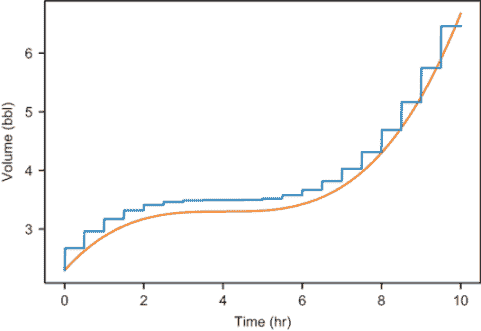

图 8.24 `approximate_volume_function`（锯齿线）与原始`volume`函数（平滑线）的输出对比图

好消息是，输出非常接近我们的原始体积函数！但是`approximate_volume_function`产生的结果是锯齿状的，每隔 0.5 小时有一个步骤。你可能猜测这与我们的`dt`值 0.5 有关，如果我们减小这个值，我们会得到更好的近似。这是正确的，但让我们深入了解体积变化是如何计算的，以确切地了解为什么图表看起来是这样的，以及为什么更小的时间间隔会改善它。

### 8.5.2 体积函数的黎曼和图示

在任何时间点，我们通过近似`volume`函数计算的罐中体积是初始罐中体积加上到该点的体积变化。对于`t` = 4 小时，方程看起来是这样的：

4 小时时的体积 = （0 小时时的体积）+ （从 0 小时到 4 小时的体积变化）

这个和的结果给我们提供了图表上 4 小时标记的一个点。任何其他时间的值都是用相同的方式计算的。在这种情况下，和包括时间零点的 2.3 桶，以及一个黎曼和，给出了从 0 小时到 4 小时的变化。这是八个矩形的和，每个矩形的宽度为 0.5 小时，它们均匀地分布在 4 小时的窗口内。结果是大约 3.5 桶（图 8.25）。

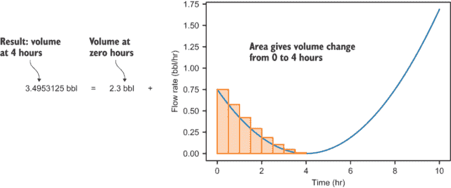

图 8.25 使用黎曼和计算 4 小时时罐中的体积

我们可以为任何其他时间点做同样的事情。例如，图 8.26 显示了 8 小时的结果。

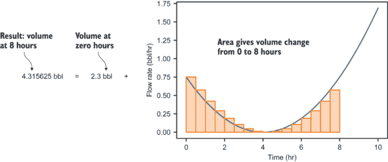

图 8.26 使用黎曼和计算 8 小时时罐中的体积

在这种情况下，答案是 8 小时标记时罐中大约 4.32 桶。这需要求和 8/0.5 = 16 个矩形面积。这两个值出现在我们生成的图表上（图 8.27）的点：

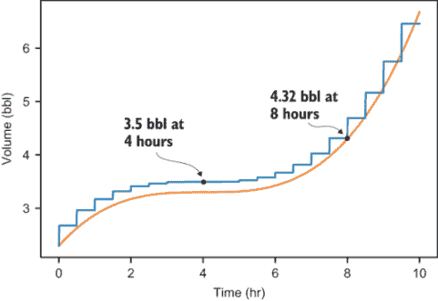

图 8.27 在近似体积图上显示的前两个结果

在这两种情况下，我们可以通过使用整数的 timesteps 从零到问题中的时间点。为了生成这个图表，我们的 Python 代码计算了大量的黎曼和，对应于整数小时和半小时，以及所有绘制在之间的点。

我们如何得到 3.9 小时的近似体积，这个值不能被 0.5 小时的 *dt* 值整除？回顾 `volume_change(q,t1,t2,dt)` 的实现，我们在体积计算中做了一点点改变，对应于 `np.arange(t1,t2,dt)` 中每个起始时间的一个矩形的面积。当我们用 0.5 的 *dt* 值从 0 到 3.9 小时计算体积变化时，我们的矩形如下所示：

```
>>> np.arange(0,3.9,0.5)
array([0\. , 0.5, 1\. , 1.5, 2\. , 2.5, 3\. , 3.5])
```

尽管宽度为 0.5 小时的八个矩形超过了 3.9 小时的标记，我们计算了所有八个矩形的面积！为了完全干净，我们可能应该缩短最后一个时间间隔到 0.4 小时，从第 7 个时间间隔的结束时间 3.5 小时持续到 3.9 小时的结束时间，不再继续。作为一个本节末尾的小型项目，你可以尝试更新 `volume_change` 函数，如果需要的话，使用更短的时间间隔。现在，我将忽略这个疏忽。

在上一节中，我们看到了通过缩小 *dt* 值以及因此矩形的宽度，我们得到了更好的结果。除了更好地拟合图表外，较小的矩形即使略微超出时间间隔的末端，也可能会产生更少的误差。例如，0.5 小时的时间间隔只能累计到 3.5 小时或 4.0 小时，但不能累计到 3.9 小时，而 0.1 小时的时间间隔可以均匀累计到 3.9 小时。

### 8.5.3 改进近似

让我们尝试使用更小的 *dt* 值，对应于更小的矩形尺寸，并看看我们得到的改进。这是 `dt` = 0.1 小时的近似（图 8.28 展示了结果）。图表上的步骤几乎看不见，但它们更小，并且图表比 0.5 小时的时间间隔更接近实际的体积图表：

```
plot_function(approximate_volume_function(flow_rate,2.3,0.1),0,10)
plot_function(volume,0,10)
```

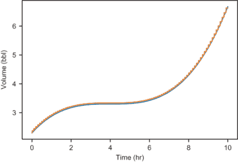

图 8.28 当 `dt` = 0.1 小时时，图表几乎吻合。

使用更小的步长，例如 `dt` = 0.01 小时，图表几乎无法区分（见图 8.29）：

```
plot_function(approximate_volume_function(flow_rate,2.3,0.01),0,10)
plot_function(volume,0,10)
```

尽管图表看起来完全匹配，但我们仍然可以问这个近似有多准确。随着 `dt` 值越来越小，近似 `体积` 函数的图表在每一个点都越来越接近实际的体积图表，因此我们可以说这些值正在 *收敛* 到实际的体积值。但在每一步，近似仍然可能与实际的体积测量值不一致。

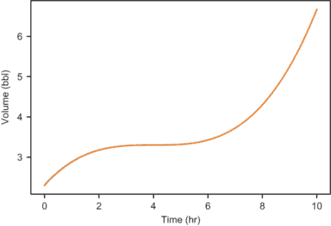

图 8.29 当时间步长为 0.01 小时时，近似 `体积` 函数的图表与实际 `体积` 函数几乎无法区分。

这里有一种方法，我们可以找到任意点的体积，达到任意精度（在任意我们想要的公差范围内）。对于时间点 `t`，我们可以通过使用越来越小的 `dt` 值重新计算 `volume_change(q,0,t,dt)`，直到输出停止变化超过公差值。这很像我们用来重复近似导数直到它们稳定下来的函数：

```
def get_volume_function(q,v0,digits=6):
    def volume_function(T):
        tolerance = 10 ** (−digits)
        dt = 1
        approx = v0 + volume_change(q,0,T,dt)
        for i in range(0,digits*2):
            dt = dt / 10
            next_approx = v0 + volume_change(q,0,T,dt)
            if abs(next_approx − approx) < tolerance:
                return round(next_approx,digits)
            else:
                approx = next_approx
        raise Exception("Did not converge!")
    return volume_function
```

例如，体积 *v*(1) 精确为 2.878125 桶，我们可以要求任何精度的结果。例如，对于三位数字，我们得到

```
>>> xv  = get_volume_function(flow_rate,2.3,digits=3)
>>> v(1)
2.878
```

对于六位数字，我们得到精确答案：

```
>>> xv  = get_volume_function(flow_rate,2.3,digits=6)
>>> v(1)
2.878125
```

如果你亲自运行这段代码，你会看到第二次计算花费了相当长的时间。这是因为它必须运行包含数百万个小体积变化的黎曼和，以得到这个精确度的答案。这个函数计算任意精度的体积值可能没有实际用途，但它说明了随着 *dt* 值越来越小，我们的体积近似值会**收敛**到 `volume` 函数的精确值。它收敛到的结果被称为流速的**积分**。

### 8.5.4 定积分与不定积分

在最后两节中，我们**积分**了流速函数以获得体积函数。就像求导数一样，求积分是一个通用的步骤，你可以对函数进行操作。我们可以对任何指定变化率的函数进行积分，以得到一个提供兼容累积值的函数。例如，如果我们知道汽车的速度是时间的函数，我们可以对其进行积分，以得到随时间变化的行驶距离。在本节中，我们将探讨两种类型的积分：定积分和不定积分。

**定积分**告诉你函数在某个区间上的总变化，这个区间是从其导数函数得到的。函数和参数的起始和结束值对，在我们的例子中是时间，指定了定积分。输出是一个单一的数字，它给出了累积变化。例如，如果 *f*(*x*) 是我们感兴趣的功能，而 *f*'(*x*) 是 *f*(*x*) 的导数，那么 *f* 从 *x* = *a* 到 *x* = *b* 的变化是 *f*(*b*) − *f*(*a*)，并且可以通过取定积分（图 8.30）来找到。

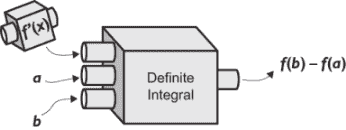

图 8.30 定积分取函数的速率变化（导数）和指定的区间，并恢复该区间上函数的累积变化。

在微积分中，从 *x* = *a* 到 *x* = *b* 的 *f*(*x*) 的定积分写作如下：

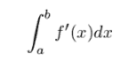

其值为 *f*(*b*) − *f*(*a*)。大写的积分符号 ʃ 是积分符号，*a* 和 *b* 被称为积分的**界限**，f*'(*x*) 是被积函数，而 *dx* 表示积分是相对于 *x* 进行的。

我们的 `volume_change` 函数近似定积分，正如我们在第 8.4.3 节中看到的，它也近似流速图下的面积。结果证明，函数在区间上的定积分等于该区间速率图下的面积。对于你在野外遇到的多数速率函数，图形将足够好，你可以用越来越瘦的矩形来近似它们下面的面积，并且你的近似值会收敛到一个单一的值。

在计算定积分之后，让我们看看不定积分。*不定积分*取函数的导数并恢复原始函数。例如，如果你知道 *f*(*x*) 是 *f*(*x*) 的导数，那么为了重建 *f*(*x*)，你必须找到 *f*(*x*) 的不定积分。

但问题是，导数 *f*(*x*) 单独不足以重建原始函数 *f*(*x*)。正如我们在 `get_volume_function` 中看到的那样，它计算了一个定积分，你需要知道 *f*(*x*) 的初始值，例如 *f*(0)。然后可以通过将定积分加到 *f*(0) 上来找到 *f*(*x*) 的值。因为

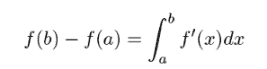

我们可以得到 *f*(*x*) 的任何值：

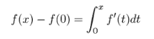

注意我们必须为 *f* 的自变量使用不同的名字 *t*，因为在这里 *x* 成为了积分的界限。函数 *f*(*x*) 的不定积分写作

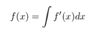

这看起来像是一个定积分，但没有指定界限。例如，如果 *g*(*x*) = ʃ *f*(*x*) *dx*，那么 *g*(*x*) 被称为 *f*(*x*) 的*反导数*。反导数不是唯一的，实际上，对于你选择的任何初始值 *g*(0)，都有一个不同的函数 *g*(*x*)，其导数是 *f*(*x*)。

在短时间内吸收这么多术语确实很多，但幸运的是，我们在这本书的第二部分剩余部分会回顾它们。我们将继续使用导数和积分在它们之间相互切换，来处理函数及其变化率。

## 概述

+   函数的平均变化率，比如 *f*(*x*)，是 *f* 在某个 *x* 间隔上的值的变化除以间隔的长度。例如，从 *x* = *a* 到 *x* = *b* 的 *f*(*x*) 的平均变化率是

    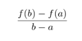

+   函数的平均变化率可以想象成一条*割线*的陡度，这是一条穿过函数图形上两点的线。

+   在一个光滑函数的图形上放大，它看起来与一条直线无法区分。看起来像的线是该区域内函数的最佳线性近似，其斜率被称为函数的*导数*。

+   你可以通过取包含该点的连续更小的间隔上的割线的斜率来近似导数。这近似了函数在感兴趣点的瞬时变化率。

+   函数的导数是另一个函数，它告诉你每个点的瞬时变化率。你可以绘制函数的导数来观察其随时间的变化率。

+   从一个函数的导数开始，你可以通过将其分解为短暂的时间间隔并假设在每个间隔上速率是恒定的，来找出它随时间的变化情况。如果每个间隔足够短，速率将大致保持恒定，并累加以找到总量。这近似于函数的定积分。

+   知道函数的初始值，并在各种时间间隔上对其速率取定积分，你可以重建该函数。这被称为函数的**不定积分**。
