# 9 模拟移动物体

本章涵盖

+   在代码中实现牛顿运动定律以模拟真实运动

+   计算速度和加速度向量

+   使用欧拉方法近似移动物体的位置

+   使用微积分找到移动物体的精确轨迹

我们在第七章中的小行星游戏虽然功能齐全，但挑战性并不强。为了使其更有趣，我们需要让小行星真正地移动！而且，为了让玩家有机会躲避移动的小行星，我们需要让太空船也能移动和转向。

为了在 asteroid 游戏中实现运动，我们将使用第八章中提到的许多相同的微积分概念。我们将考虑的数值量是小行星和太空船的 *x* 和 *y* 位置。如果我们想让小行星移动，这些值在时间上的不同点会有所不同，因此我们可以将它们视为时间的函数：*x*(*t*) 和 *y*(*t*)。位置函数对时间的导数称为 *速度*，而速度对时间的导数称为 *加速度*。因为我们有两个位置函数，所以我们有两个速度函数和两个加速度函数。这使我们能够将速度和加速度视为向量。

我们的首要目标是让小行星移动。为此，我们将为小行星提供随机的、恒定的速度函数。然后我们将这些速度函数在“实时”中积分，使用称为 *Euler’s method* 的算法来获取每一帧中每个小行星的位置。欧拉方法在数学上与第八章中我们做的积分相似，但它有一个优点，那就是我们可以在游戏运行时进行。

之后，我们可以允许用户控制太空船。当用户按下键盘上的上箭头时，太空船应该朝其指向的方向加速。这意味着 *x*(*t*) 和 *y*(*t*) 的二阶导数变为非零；速度开始变化，位置也开始变化。同样，我们将使用欧拉方法实时积分加速度函数和速度函数。

欧拉方法仅仅是积分的一个近似，在这个应用中，它类似于第八章中的黎曼和。我们可以计算小行星和太空船随时间变化的精确位置，并在本章末尾简要比较欧拉方法的结果和精确解。

## 9.1 模拟恒定速度运动

在日常用语中，单词 *velocity* 是单词 *speed* 的同义词。在数学和物理学中，速度有特殊的意义；它包括速度和运动方向的概念。因此，速度将是我们要关注的概念，我们将将其视为一个向量。

我们想要做的是给每个小行星对象提供一个随机的速度向量，即一对数字 (*v[x]*, *v[y]*)，并将这些解释为位置对时间导数的常数值。也就是说，我们假设 *x*(*t*) = *v[x]* 和 *y*(*t*) = *v[y]*。有了这些信息编码，我们可以更新游戏引擎，使小行星在游戏进行过程中以这些速度移动。

由于我们的游戏是二维的，我们处理位置和速度的对。我交替使用 *x*(*t*) 和 *y*(*t*) 作为一对位置函数以及 *x*'(*t*) 和 *y*'(*t*) 作为一对速度函数，并将它们写成 *向量值* 函数：*s*(*t*) = (*x*(*t*), *y*(*t*)) 和 *v*(*t*) = (*x*'(*t*), *y*'(*t*))。这种表示法只是意味着 *s*(*t*) 和 *v*(*t*) 都是函数，它们接受一个时间值并返回一个向量，分别表示在那个时间点的位置和速度。

小行星已经具有位置向量，由它们的 *x* 和 *y* 属性表示，但我们需要给它们也提供速度向量，以指示它们在 *x* 和 *y* 方向上的移动速度。这是我们让它们逐帧移动的第一步。

### 9.1.1 向小行星添加速度

为了给每个小行星提供一个速度向量，我们可以在 `PolygonModel` 对象（在源代码中 `asteroids.py` 的第九章版本）上添加向量的两个分量作为属性：

```
class PolygonModel():
    def __init__(self,points):
        self.points = points     ❶
        self.angle = 0
        self.x = 0
        self.y = 0
        self.vx = 0              ❷
        self.vy = 0
```

❶ 前四个属性保留自第七章中此类的原始实现。

❷ 这些 vx 和 vy 属性存储了当前值 *v[x]* = *x*(*t*) 和 *v[y]* = *y*(*t*)。默认情况下，它们被设置为 0，这意味着对象没有移动。

接下来，为了使我们的小行星移动得更加不规则，我们可以给它们速度的两个分量赋予随机值。这意味着在 `Asteroid` 构造函数的底部添加两行：

```
class Asteroid(PolygonModel):
    def __init__(self):
        sides = randint(5,9)
        vs = [vectors.to_cartesian((uniform(0.5,1.0), 2 * pi * i / sides))
                for i in range(0,sides)]
        super().__init__(vs)              ❶
        self.vx = uniform(−1,1)           ❷
        self.vy = uniform(−1,1)
```

❶ 到这一行，代码与第七章没有变化；它初始化小行星的形状为一个具有随机位置顶点的多边形。

❷ 在最后两行，*x* 和 *y* 速度被设置为介于 -1 和 1 之间的随机值。

记住，负导数意味着函数正在减少，而正值则意味着函数正在增加。*x* 和 *y* 速度可以是正也可以是负的事实意味着 *x* 和 *y* 位置各自可以是增加或减少。这意味着我们的小行星可以向右或向左以及向上或向下移动。

### 9.1.2 更新游戏引擎以移动小行星

接下来我们需要做的是使用速度来更新位置。无论我们是在谈论宇宙飞船、小行星还是其他 `PolygonModel` 对象，速度分量 *v[x]* 和 *v[y]* 告诉我们如何更新位置分量 *x* 和 *y*。

如果在帧之间经过一段时间 Δ*t*，我们通过 *v[x]* · Δ*t* 更新 *x*，通过 *v[y]* · Δ*t* 更新 *y*。 (符号 Δ 是大写希腊字母 delta，常用来表示变量的变化)。这是我们在第八章中用来从流量的小变化中找到体积小变化的相同近似。在这种情况下，由于速度是恒定的，速度乘以经过的时间给出位置的变化，所以这个近似比其他近似更好。

我们可以在 `PolygonModel` 类中添加一个 `move` 方法，根据这个公式更新对象的位置。唯一对象本身不会内在意识到的是经过的时间，所以我们将其传递进来（以毫秒为单位）：

```
class PolygonModel():
    ...
    def move(self, milliseconds):
        dx, dy = (self.vx * milliseconds / 1000.0, 
                  self.vy * milliseconds / 1000.0        ❶
        self.x, self.y = vectors.add((self.x,self.y), 
                                     (dx,dy))            ❷
```

❶ *x* 位置的变化称为 dx，y 位置的变化称为 dy。两者都是通过将陨石的速度乘以经过的秒数来计算的。

❷ 完成框架的运动，通过添加相应的变化 dx 和 dy 更新位置

这是对 Euler 方法算法的一个简单应用。算法包括跟踪一个或多个函数的值（在我们的情况下，是位置 *x*(*t*) 和 *y*(*t*) 以及它们的导数 *x*'(*t*) = *v[x]* 和 *y*'(*t*) = *v[y]*)，并在每一步根据它们的导数更新函数。如果导数是恒定的，这会非常完美，但如果导数本身在变化，它仍然是一个相当好的近似。当我们转向宇宙飞船时，我们将处理变化的速率值并更新我们的 Euler 方法实现。

### 9.1.3 保持陨石在屏幕上

我们可以添加一个额外的功能来提高游戏体验。一个具有随机速度的陨石注定会在某个时刻从屏幕上漂移出去。为了保持陨石在屏幕区域内，我们可以添加一些逻辑来确保两个坐标都在 -10 和 10 的最小和最大值之间。例如，当 *x* 属性从 10.0 增加到 10.1 时，我们减去 20，使其成为可接受值 -9.9。这会产生将陨石从屏幕的右侧“传送”到左侧的效果。这种游戏机制与物理学无关，但通过保持陨石在游戏中，使游戏更有趣（图 9.1）。

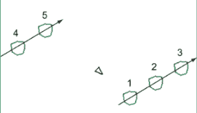

图 9.1 通过在对象即将离开屏幕时将其“传送”到屏幕的另一侧，保持所有对象的坐标在 -10 和 10 之间

这是传送代码：

```
class PolygonModel():
    ...
    def move(self, milliseconds):
        dx, dy = (self.vx * milliseconds / 1000.0, 
                  self.vy * milliseconds / 1000.0)
        self.x, self.y = vectors.add((self.x,self.y), 
                                     (dx,dy))
        if self.x < −10:
            self.x += 20      ❶
        if self.y < −10:      ❷
            self.y += 20
        if self.x > 10:
            self.x -= 20
        if self.y > 10:
            self.y -=20
```

❶ 如果 *x* < −10，陨石会从屏幕的左侧漂移出去，所以我们向 *x* 位置添加 20 个单位，将其传送到屏幕的右侧。

❷ 如果 y < −10，陨石会从屏幕的底部漂移出去，所以我们向 y 位置添加 20 个单位，将其传送到屏幕的顶部。

最后，我们需要为每个在游戏中运行的陨石调用 `move` 方法。为了做到这一点，我们需要在绘图开始之前在我们的游戏循环中添加以下几行：

```
milliseconds = clock.get_time()   ❶
for ast in asteroids:
    ast.move(milliseconds)        ❷
```

❶ 计算自上一帧以来经过的毫秒数

❷ 向所有陨石发送信号以根据它们的速度更新它们的位置

当打印在这页上时，这并不引人注目，但当你自己运行代码时，你会看到陨石在屏幕上随机移动，每个陨石都朝一个随机方向移动。但如果你专注于一个陨石，你会看到它的运动并不是随机的；它在每一秒内以相同的距离和方向改变位置（图 9.2）。

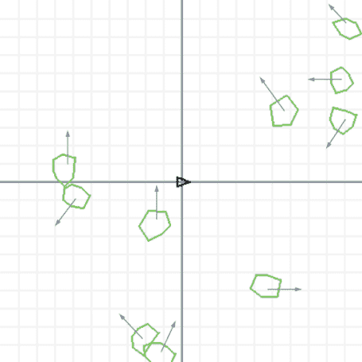

图 9.2 包含前面的代码后，每个陨石都以随机恒定的速度移动。

由于有移动的陨石，飞船现在处于危险之中−它需要移动以避开它们。但即使以恒定速度移动，飞船也可能会在某一点撞上陨石。玩家需要改变飞船的速度，这意味着它的速度和方向。接下来，我们将探讨如何模拟速度的变化，这被称为*加速度*。

### 9.1.4 练习

| **练习 9.1**：一颗陨石的速度向量为 ***v*** = (*v[x]*, *v[y]*) = (−3, 1)。它在屏幕上移动的方向是什么？

+   向上并向右

+   向上并向左

+   向下并向左

+   向下并向右

**解答**：因为在这个时刻，*x*'(*t*) = *v[x]* = −3，所以陨石正在向负 *x* 方向移动，即向左。因为 *y*'(*t*) = *v[y]* = 1，所以陨石在这个时刻正在向正 *y* 方向移动，即向上。因此，答案是 *b*。 |

## 9.2 模拟加速度

让我们想象我们的宇宙飞船装备了一个燃烧火箭燃料的推进器，膨胀的气体将宇宙飞船推向它指向的方向（图 9.3）。

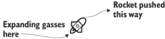

图 9.3 火箭推进自身的示意图

我们假设当火箭点燃其推进器时，它以恒定的速率在其指向的方向上加速。因为加速度被定义为速度的导数，恒定的加速度值意味着速度在时间上以恒定的速率在两个方向上变化。当加速度不为零时，速度 *v[x]* 和 *v[y]* 不是常数；它们是随时间变化的函数 *v[x]*(*t*) 和 *v[y]*(*t*)。我们假设加速度是恒定的，意味着有两个数字，*a[x]* 和 *a[y]*，所以 *v'[x]*(*t*) = *a[x]* 和 *v'[y]*(*t*) = *a[y]*。作为一个向量，我们用 *a* = (*a[x]*, *a[y]*) 表示加速度。

我们的目标是为 Python 飞船提供一对属性，代表 (*a[x]* 和 *a[y]*)，并使其根据这些值加速并在屏幕上移动。当用户没有按下任何按钮时，飞船在两个方向上应该都没有加速度，而当用户按下上箭头键时，加速度值应立即更新，使得 (*a[x]*, *a[y]*) 是一个非零向量，指向飞船前进的方向。当用户按下上箭头键时，飞船的速度和位置都应该以逼真的方式改变，使其逐帧移动。

### 9.2.1 加速飞船

无论飞船指向哪个方向，我们都希望它看起来以相同的速率加速。这意味着当推进器正在发射时，向量 (*a[x]*, *a[y]*) 的大小应该有一个固定的值。通过试错，我发现加速度大小为 3 可以使飞船足够灵活。让我们将这个常数包含到我们的游戏代码中：

```
acceleration = 3
```

将我们游戏中的距离单位视为米，这代表每秒每秒 3 米（m/s/s）的值。如果飞船从静止开始，并且玩家按下上箭头键，飞船将以每秒 3 m/s 的速度在其指向的方向上增加速度。PyGame 以毫秒为单位工作，因此相关的速度变化将是每毫秒 0.003 m/s，或者每毫秒每秒 0.003 米。

让我们来看看如何在按下上箭头键时计算加速度向量 *a* = (*a[x]*, *a[y]*)。如果飞船指向一个旋转角度 θ，那么我们需要使用三角学来找到加速度的垂直和水平分量，其大小为 |*a*| = 3。根据正弦和余弦的定义，水平和垂直分量分别是 |*a*| · cos(θ) 和 |*a*| · sin(θ)（见图 9.4）。换句话说，加速度向量是分量对 ( |*a*| · cos(θ), |*a*| · sin(θ))。顺便提一下，你也可以使用我们在第二章中编写的 `from_polar` 函数，从加速度的大小和方向得到这些分量。

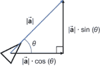

图 9.4 使用三角学从加速度的大小和方向找到加速度分量

在游戏循环的每次迭代中，我们可以在飞船移动之前更新其速度。在经过的时间 Δ*t* 内，*v[x]* 的更新将是 *a[x]* · Δ*t*，而 *v[y]* 的更新将是 *a[y]* · Δ*t*。在代码中，我们需要将适当的速度变化添加到飞船的 `vx` 和 `vy` 属性中：

```
while not done:
    ...
        if keys[pygame.K_UP]:                               ❶
            ax = acceleration * cos(ship.rotation_angle)    ❷
            ay = acceleration * sin(ship.rotation_angle)
            ship.vx += ax * milliseconds/1000               ❸
            ship.vy += ay * milliseconds/1000

        ship.move(milliseconds)                             ❹
```

❶ 检测上箭头键是否被按下

❷ 根据加速度的固定大小和飞船指向的角度计算 *a*[x] 和 *a*[y] 的值

❸ 分别通过 *a*[x] · Δ*t* 和 *a*[y] · Δ*t* 更新 *x* 和 *y* 速度

❹ 使用更新的速度来更新飞船的位置，从而移动飞船

就这样！添加了这段代码后，当按下上箭头键时，宇宙飞船应该会加速。使用左右箭头键旋转宇宙飞船的代码类似，包含在源代码中，但这里不会详细介绍。实现了左右和上箭头的功能后，你可以将飞船指向任何方向，以便在需要避开小行星时加速。

这是对欧拉方法的一个稍微高级的应用，其中我们有了 *二阶* 导数：*x*''(*t*) = v* '*x*(*t*) = *ax* 和 *y*''(*t*) = v* '*y*(*t*) = *ay*。在每一步中，我们首先更新速度，然后使用更新的速度在 `move` 方法中确定更新的位置。我们完成了本章的游戏编程，但在接下来的几节中，我们将更深入地研究欧拉方法并评估它对运动的逼近程度。

## 9.3 深入研究欧拉方法

欧拉方法的核心思想是从一个量的初始值（如位置）和一个描述其导数的方程（如速度和加速度）开始。导数然后告诉我们如何更新这个量。让我们通过逐步分析一个例子来回顾我们是如何做到这一点的。

假设一个物体在时间 *t* = 0 时从位置 (0, 0) 开始，以初始速度 (1, 0) 和恒定加速度 (0, 0.2) 运动。（为了表述清晰，我在本节中省略了单位，但你可以继续以秒、米、米/秒等单位思考。）这个初始速度指向正 *x* 方向，加速度指向正 *y* 方向。这意味着如果我们观察平面，物体开始时直接向右移动，但随时间向上偏移。

我们的任务是使用欧拉方法找到从 *t* = 0 到 *t* = 10 每两秒的位置矢量值。首先，我们将手动完成它，然后我们将在 Python 中进行相同的计算。有了这些结果位置，我们将在 *x*，*y* 平面上绘制它们，以显示宇宙飞船遵循的路径。

### 9.3.1 手动执行欧拉方法

我们将继续将位置、速度和加速度视为时间的函数：在任何给定的时间，物体将具有这些量的某些矢量值。我将称这些矢量值函数为：*s*(*t*) *, v* (*t*) 和 *a*(*t*)，其中 *s*(*t*) = (*x*(*t*), *y*(*t*)), *v*(*t*) = (*x*'(*t*), *y*'(*t*)), 和 *a*(*t*) = (*x*''(*t*), *y*''(*t*)). 这里是时间 *t* = 0 时给出的初始值表：

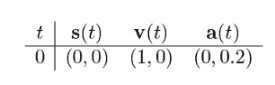

在我们的彗星游戏中，PyGame 决定了每次计算位置之间的毫秒数。在这个例子中，为了快速起见，让我们以 2 秒的增量从时间 *t* = 0 到 *t* = 10 重建位置。我们需要完成的表格如下：

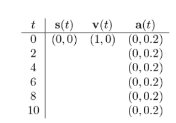

我已经为我们填写了加速度列，因为我们已经规定加速度是恒定的。在 *t* = 0 和 *t* = 2 之间的 2 秒期间会发生什么？速度会根据以下一对方程中计算出的加速度发生变化。在这些方程中，我们再次使用希腊字母 Δ（delta）来表示我们考虑的区间内变量的变化。例如，Δ*t* 是时间的变化，所以 Δ*t* = 2 秒，对于这 5 个区间中的每一个。因此，在 2 秒时的速度分量是：

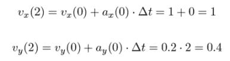

在时间 *t* = 2 时，速度的新向量值是 *v*(2) = (*v[x]* (2), *v[y]* (2)) = (1, 0.4)。位置也根据速度 *v*(0) 发生变化：

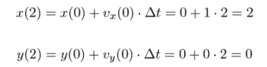

它的更新值是 *s* = (*x, y*) = (2, 0)。这为我们提供了表格的第二行：

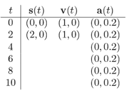

在 *t* = 2 和 *t* = 4 之间，加速度保持不变，因此速度增加的量相同，*a* · Δ*t* = (0, 0.2) · 2 = (0, 0.4)，到一个新的值，*v*(4) = (1, 0.8)。位置根据速度 *v*(2) 增加：

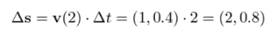

这将位置提升到 *s*(4) = (4, 0.8)。现在我们已经完成了表格的三行，并且计算了我们想要的五个位置中的两个：

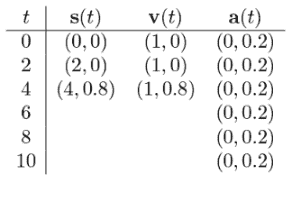

我们可以继续这样做，但如果让 Python 为我们完成这项工作会更好——这是我们下一步要做的事情。但首先，让我们暂停一下。在过去的几段中，我已经带你们经历了很多算术。我的任何假设看起来可疑吗？我会给你一个提示：我这样使用方程 Δ*s* = *v* · Δ*t* 并不完全合法，所以表格中的位置只是近似正确的。如果你还没有看到我如何偷偷使用近似值，不要担心。一旦我们在图上绘制了位置向量，一切就会变得清晰。

### 9.3.2 在 Python 中实现算法

在 Python 中描述这个程序并不需要太多工作。我们首先需要设置时间、位置、速度和加速度的初始值：

```
t = 0
s = (0,0)
v = (1,0)
a = (0,0.2)
```

我们还需要指定的其他值是我们感兴趣的时间点：0、2、4、6、8 和 10 秒。我们不必列出所有这些，我们可以使用 *t* = 0 作为起点，并指定每个时间步长为 2 秒的恒定 Δ*t*，总共有 5 个时间步长：

```
dt = 2
steps = 5
```

最后，我们需要在每个时间步长更新一次时间、位置和速度。在这个过程中，我们可以将位置存储在数组中以供以后使用：

```
from vectors import add, scale
positions = [s]
for _ in range(0,5):
    t += 2
    s = add(s, scale(dt,v))    ❶

    v  = add(v, scale(dt,a))   ❷
    positions.append(s)
```

❶ 通过将位置变化 Δs = v·Δt 加到当前位置 *s* 上来更新位置。 (我使用了第二章中的缩放和加法函数。)

❷ 通过将速度变化 Δv = a·Δt 加到当前速度 v 上来更新速度

如果我们运行此代码，位置列表将填充六个向量`s`的值，对应于时间`t` = 0, 2, 4, 6, 8, 10。现在我们有了代码中的值，我们可以绘制它们并想象物体的运动。如果我们使用第二章和第三章中的绘图模块在 2D 中绘制它们，我们可以看到物体最初向右移动，然后像预期的那样向上倾斜（图 9.5）。以下是 Python 代码及其生成的图表：

```
from draw2d import *
draw2d(Points2D(*positions))
```

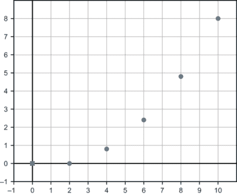

图 9.5 根据我们的欧拉方法计算得到的物体轨迹上的点。

在我们的近似中，物体似乎在每个五段时间间隔内以不同的速度沿着五条直线移动（图 9.6）。

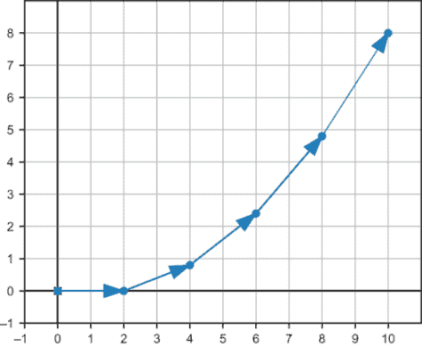

图 9.6 通过直线连接轨迹上各点的五个位移向量。

物体应该一直在加速，所以你可能期望它移动在一个平滑的曲线上而不是直线。现在我们已经在 Python 中实现了欧拉方法，我们可以快速用不同的参数重新运行它，以评估近似的质量。

## 9.4 使用更小的时间步长运行欧拉方法

我们可以通过将`dt`设置为`1`和`steps`设置为`10`来重新运行计算，使用两倍的时间步数。这仍然模拟了 10 秒的运动，但用 10 条直线路径来建模（图 9.7）。

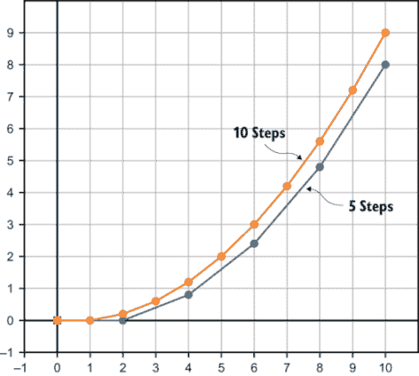

图 9.7 使用相同的初始值和不同步数，欧拉方法产生了不同的结果。

再次尝试使用 100 步和`dt` `=` `0.1`，我们在同样的 10 秒内看到了另一条轨迹（图 9.8）。

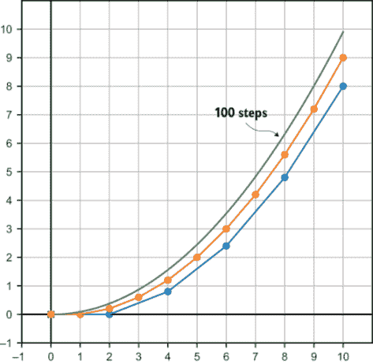

图 9.8 使用 100 步而不是 5 或 10 步，我们得到了另一条轨迹。由于点太多，这条轨迹中的点被省略了。

为什么尽管三个计算都使用了相同的方程，我们得到的结果却不同？看起来我们使用的步数越多，`y`坐标就越大。如果我们仔细观察前两秒，就能看到这个问题。

在 5 步近似中，没有加速度；物体仍在 x 轴上移动。在 10 步近似中，物体已经更新了一次速度，因此它已经上升到 x 轴以上。最后，100 步近似在`t` = 0 和`t` = 1 之间有 19 次速度更新，因此它的速度增加最大（图 9.9）。

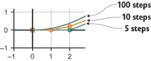

图 9.9 仔细观察前两个段落，100 步近似值最大，因为它的速度更新最频繁。

这就是我之前忽略的事情。方程 Δ*s* = *v* · Δ*t* 仅在速度恒定时才正确。当使用大量时间步长时，欧拉方法是一个很好的近似，因为在较短的时间间隔内，速度变化不大。为了证实这一点，你可以尝试一些大时间步长和小的 *dt* 值。例如，使用 100 步，每步 0.1 秒，最终位置是

```
(9.99999999999998, 9.900000000000006)
```

以及使用 100,000 步，每步 0.0001 秒，最终位置是

```
(9.999999999990033, 9.999899999993497)
```

最终位置的精确值是 (10.0, 10.0)，随着我们使用欧拉方法添加越来越多的步骤，我们的结果似乎 *收敛* 到这个值。现在你必须相信我，(10.0, 10.0) 是精确值。我们将在下一章中介绍如何进行精确积分来证明这一点。请耐心等待！

### 练习

| **练习 9.2-迷你项目**：创建一个函数，该函数可以自动对匀加速物体执行欧拉方法。你需要向该函数提供加速度向量、初始速度向量、初始位置向量，以及可能的其他参数。**解决方案**：我还包括了总时间和步数作为参数，以便于测试解决方案中的各种答案。

```
def eulers_method(s0,v0,a,total_time,step_count):
    trajectory = [s0]
    s = s0
    v  = v0
    dt = total_time/step_count     ❶
    for _ in range(0,step_count):
        s = add(s,scale(dt,v))     ❷
        v  = add(v,scale(dt,a))
        trajectory.append(s)
    return trajectory
```

❶ 每个时间步长 dt 的持续时间是总时间除以时间步长的数量。❷ 对于每一步，更新位置和速度，并将最新的位置作为轨迹（位置列表）中的下一个位置。

| **练习 9.3-迷你项目**：在 9.4 节的计算中，我们低估了位置坐标的 *y* 值，因为我们是在每个时间间隔结束时更新速度的 *y* 分量。在每个时间间隔开始时更新速度，并展示你如何随着时间的推移高估 *y* 位置。**解决方案**：我们可以通过将 `eulers_method` 函数的 `s` 和 `v` 更新顺序进行切换来调整迷你项目 9.2 中的实现：

```
def eulers_method_overapprox(s0,v0,a,total_time,step_count):
    trajectory = [s0]
    s = s0
    v  = v0
    dt = total_time/step_count
    for _ in range(0,step_count):
        v  = add(v,scale(dt,a))
        s = add(s,scale(dt,v))
        trajectory.append(s)
    return trajectory
```

使用相同的输入，这确实给出了比原始实现更高的 *y* 坐标近似值。如果你仔细观察以下图中的轨迹，你可以看到它已经在第一个时间步中向 *y* 方向移动。

```
eulers_method_overapprox((0,0),(1,0),(0,0.2),10,10)

```

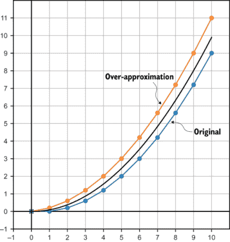 原始的欧拉方法轨迹和新的轨迹。为了比较，精确轨迹用黑色显示。

| **练习 9.4-迷你项目**：任何像投掷的棒球、子弹或空中滑雪板运动员这样的抛射体都会经历相同的加速度向量：9.81 m/s/s 指向地球。如果我们把平面的 x 轴看作是平坦的地面，正 y 轴向上，那么加速度向量就是(0, 9.81)。如果一个棒球从肩高处以*x* = 0 的位置投出，我们可以说它的初始位置是(0, 1.5)。假设它以 30 m/s 的初始速度，从正*x*方向向上 20°的角度投出，并使用欧拉方法模拟其轨迹。棒球在击中地面之前在大约 x 轴的 67 米处能飞多远？**解答**：初始速度是(30 · cos(20°), 30 · sin(20°))。我们可以使用迷你项目 9.2 中的`eulers_method`函数来模拟棒球在几秒钟内的运动：

```
from math import pi,sin,cos
angle = 20 * pi/180
s0 = (0,1.5)
v0 = (30*cos(angle),30*sin(angle))
a = (0,−9.81)

result = eulers_method(s0,v0,a,3,100)
```

绘制得到的轨迹，这个图显示了棒球在空中形成一个弧线，在大约 x 轴的 67 米处返回地球。轨迹继续地下延伸，因为我们没有告诉它停止。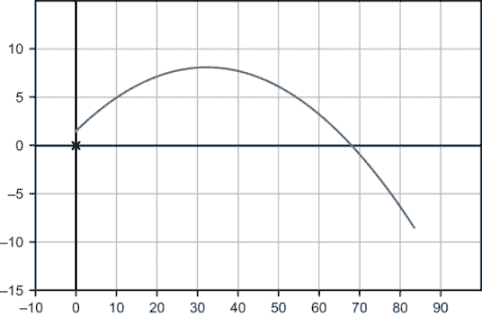 |

| **练习 9.5-迷你项目**：重新运行之前迷你项目中使用的欧拉方法模拟，初始速度相同为 30，但使用初始位置(0, 0)并尝试不同的初始速度角度。哪个角度使棒球在击中地面之前飞得最远？**解答**：为了模拟不同的角度，你可以将这段代码打包成一个函数。使用新的起始位置(0, 0)，你可以在下面的图中看到各种轨迹。结果发现，棒球在 45°的角度下飞得最远。（注意，我已经过滤掉了轨迹上具有负*y*分量的点，只考虑棒球击中地面之前的运动。）

```
def baseball_trajectory(degrees):
    radians = degrees * pi/180
    s0 = (0,0)
    v0 = (30*cos(radians),30*sin(radians))
    *a* = (0,−9.81)
    return [(x,y) for (x,y) in eulers_method(s0,v0,a,10,1000) if y>=0]
```

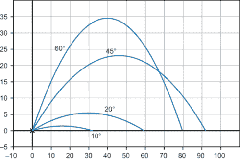以 30 m/s 的速度从不同角度投掷棒球 |

| **练习 9.6-迷你项目**：一个在 3D 空间中移动的物体具有初始速度(1, 2, 0)和恒定的加速度向量(0, −1, 1)。如果它从原点开始，10 秒后它在哪里？使用第三章的绘图函数绘制其在 3D 空间中的轨迹。**解答**：我们的`eulers_method`实现已经可以处理 3D 向量了！代码片段之后的图显示了 3D 空间中的轨迹。

```
from draw3d import *
traj3d = eulers_method((0,0,0), (1,2,0), (0,−1,1), 10, 10)
draw3d(
    Points3D(*traj3d)
)
```

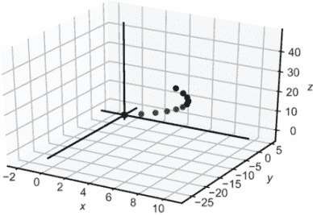使用 1,000 步以提高精度，我们可以找到最后的位置：

```
>>> eulers_method((0,0,0), (1,2,0), (0,−1,1), 10, 1000)[−1]
(9.999999999999831, −29.949999999999644, 49.94999999999933)
```

它接近于(10, −30, 50)，这最终是确切的位置。|

## 概述

+   速度是位置对时间的导数。它是一个向量，由每个位置函数的导数组成。在 2D 中，使用位置函数*x*(*t*)和*y*(*t*)，我们可以将位置向量写成一个函数*s*(*t*) = (*x*(*t*), *y*(*t*))，速度向量写成一个函数*v*(*t*) = (*x*'(*t*), *y*'(*t*)).

+   在一款视频游戏中，你可以通过在每一帧更新对象的位置来使对象以恒定速度移动。测量帧之间的时间并乘以对象的速度，可以得到该帧的位置变化。

+   加速度是速度对时间的导数。它是一个向量，其分量是速度分量的导数，例如，*a*(t) = (*v*'*x*(t), *v*'*y*(t))。

+   要在视频游戏中模拟加速对象，你需要不仅更新每一帧的位置，还要更新速度。

+   如果你知道一个量相对于时间的改变率，你可以通过计算该量在许多小时间间隔内的变化来计算该量随时间的变化值。这被称为*欧拉法*。
