# 使用符号表达式进行工作

本章涵盖

+   将代数表达式建模为数据结构

+   编写代码来分析、转换或评估代数表达式

+   通过操作定义函数的表达式来求函数的导数

+   编写 Python 函数来计算导数公式

+   使用 SymPy 库计算积分公式

如果你已经跟随着第八章和第九章中的所有代码示例并完成了所有练习，那么你已经对微积分中最重要的两个概念有了坚实的掌握：导数和积分。首先，你学习了如何通过取越来越小的割线斜率来近似函数在某点的导数。然后，你学习了如何通过估计图形下瘦长矩形的面积来近似积分。最后，你学习了如何通过在每个坐标中进行相关的微积分运算来用向量进行微积分。

这可能听起来像是一个大胆的声明，但我真的希望在这本书的几个章节中，你已经学到了在一年制的大学微积分课程中会学到的重要概念。这里的关键是：因为我们使用 Python，所以我跳过了传统微积分课程中最费力的部分，即通过手工进行大量的公式操作。这类工作使你能够对函数的公式，如 *f*(*x*) = *x*³，找到一个导数 *f*'(*x*) 的确切公式。在这种情况下，有一个简单的答案，*f*'(*x*) = 3*x*²，如图 10.1 所示。

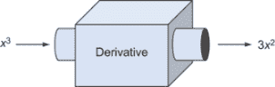

图 10.1 函数 *f*(*x*) = *x*³ 的导数有一个确切的公式，即 *f*'(*x*) = 3x²。

你可能想要知道无限多个公式的导数，而且你不可能记住所有这些公式的导数，所以在微积分课程中，你最终学到的是一组小规则以及如何系统地应用这些规则将一个函数转换为其导数。总的来说，这对程序员来说并不是一个非常有用的技能。如果你想知道导数的确切公式，你可以使用一个称为 *计算机代数系统* 的专用工具来为你计算。

## 10.1 使用计算机代数系统求精确导数

最受欢迎的计算机代数系统之一是 *Mathematica*，你可以在名为 Wolfram Alpha 的网站上免费在线使用其引擎（[wolframalpha.com](http://www.wolframalpha.com)）。根据我的经验，如果你想为正在编写的程序找到一个导数的确切公式，最好的方法是咨询 Wolfram Alpha。例如，当我们第十六章构建神经网络时，了解函数的导数将是有用的：

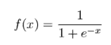

要找到这个函数导数的公式，你只需访问 [wolframalpha.com](http://www.wolframalpha.com) 并在输入框中输入公式（图 10.2）。Mathematica 有自己的数学公式语法，但 Wolfram Alpha 令人印象深刻地宽容，并能理解你输入的大多数简单公式（甚至包括 Python 语法！）。

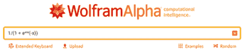

图 10.2 在 wolframalpha.com 的输入框中输入函数

当你按下 Enter 键时，Wolfram Alpha 后面的 Mathematica 引擎会计算关于这个函数的许多事实，包括它的导数。如果你向下滚动，你会看到一个关于函数导数的公式（图 10.3）。

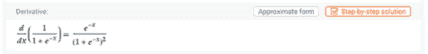

图 10.3 Wolfram Alpha 报告了该函数导数的公式。

对于我们的函数 *f*(*x*)，它在任何 *x* 值处的瞬时变化率由以下公式给出

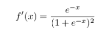

如果你理解了“导数”和“瞬时变化率”的概念，学习如何在 Wolfram Alpha 中输入公式是一项比你在微积分课程中学到的任何其他单一技能都更重要的技能。我并不是要表现得愤世嫉俗；通过手动求导数，我们可以学到很多关于特定函数行为的知识。只是在你作为专业软件开发者的生活中，当你有像 Wolfram Alpha 这样的免费工具可用时，你可能永远不需要去计算导数或积分的公式。

话虽如此，你内心的极客可能会问，“Wolfram Alpha 是如何做到的？”通过在各个点取图形的近似斜率来找到导数的粗略估计是一件事情，但生成一个精确公式则是另一回事。Wolfram Alpha 成功地解释了你输入的公式，通过一些代数操作对其进行转换，并输出一个新的公式。这种与公式本身而不是数字打交道的方法被称为 *符号编程*。

我内心的实用主义者想告诉你“就使用 Wolfram Alpha 吧”，而我内心的数学爱好者则想教你如何手动求导数和积分，因此在本章中，我将折中处理。我们将在 Python 中进行一些符号编程，直接操作代数公式，并最终找出它们的导数公式。这让你熟悉了寻找导数公式的过程，同时仍然让计算机为你做大部分工作。

### 10.1.1 在 Python 中进行符号代数

让我先向你展示我们如何在 Python 中表示和操作公式。假设我们有一个数学函数，例如

*f*(*x*) = (3*x*² + *x*) sin(*x*)

在 Python 中表示它的常用方法是如下所示：

```
from math import sin
def f(x):
    return (3*x**2 + *x*) * sin(*x*)
```

虽然这段 Python 代码使得评估公式变得容易，但它并没有给我们提供计算关于公式的事实的方法。例如，我们可以询问

+   这个公式是否依赖于变量 *x*？

+   它是否包含三角函数？

+   是否涉及到除法运算？

我们可以快速查看这些问题并决定答案：是、是、否。没有简单、可靠的方法来编写一个 Python 程序来为我们回答这些问题。例如，编写一个函数 `contains_division(f)`，它接受函数 *f* 并返回如果它在定义中使用除法操作则返回 true，是困难的，如果不是不可能的话。

这正是这种技巧派上用场的地方。为了调用一个代数规则，你需要知道正在应用哪些操作以及它们的顺序。例如，函数 *f*(*x*) 是正弦(*x*)与和的乘积，如图 10.4 所示，有一个已知的代数过程可以展开和的乘积。

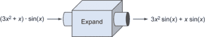

图 10.4 因为 (3x2+x) sin(*x*) 是和的乘积，它可以被展开。

我们的策略是将代数表达式建模为数据结构，而不是直接将它们转换为 Python 代码，这样它们就更容易被操作。一旦我们能够对函数进行符号操作，我们就可以自动化微积分的规则。

大多数用简单公式表示的函数也有它们导数的简单公式。例如，*x*³的导数是 3*x*²，这意味着对于任何 x 的值，函数 *f*(*x*) = *x*³ 的导数由 3*x*² 给出。到本章结束时，你将能够编写一个 Python 函数，它接受一个代数表达式并给出其导数表达式。我们的代数公式数据结构将能够表示变量、数字、和、差、积、商、幂以及正弦和余弦等特殊函数。如果你这么想，我们可以用那几个构建块表示大量不同的公式，并且我们的导数将适用于所有这些（图 10.5）。


图 10.5 目标是编写一个 Python 中的导数函数，它接受一个函数的表达式并返回其导数表达式。

我们将从将表达式建模为数据结构而不是 Python 代码中的函数开始。然后，为了热身，我们可以使用这些数据结构进行一些简单的计算，比如为变量插入数字或展开和的乘积。之后，我将教你一些求导公式的规则，我们将编写自己的导数函数并在我们的符号数据结构上自动执行这些操作。

## 10.2 建模代数表达式

让我们集中关注一下函数 *f*(*x*) = (3*x*² + *x*) sin(*x*)，看看我们如何将其分解成片段。这是一个很好的示例函数，因为它包含了许多不同的构建块：变量 *x*，以及数字、加法、乘法、幂次和一个特别命名的函数，sin(*x*)。一旦我们有了将这个函数分解成概念片段的策略，我们就可以将其翻译成 Python 数据结构。这个数据结构是函数的*符号*表示，而不是像 `"(3*x**2` `+` `x)` `*` `sin(*x*)"` 这样的字符串表示。

第一个观察结果是，*f* 是这个函数的任意名称。例如，无论我们称其为什么，这个方程的右侧都以相同的方式展开。正因为如此，我们只需关注定义函数的表达式，在这种情况下是 (3*x*² + *x*) sin(*x*)。这被称为表达式，与必须包含等号 (=) 的方程相对。*表达式* 是一些数学符号（数字、字母、运算符等）以某些有效方式组合而成的集合。因此，我们的第一个目标是通过 Python 模拟这些符号和组合这个表达式的有效方式。

### 10.2.1 将表达式分解成片段

我们可以通过将代数表达式分解成更小的表达式来开始模拟代数表达式。分解表达式 (3*x*² + *x*) sin(*x*) 只有一种有意义的分解方式。也就是说，它是 (3*x*² + *x*) 和 sin(*x*) 的乘积，如图 10.6 所示。

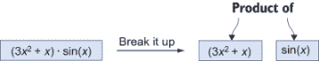

图 10.6 以有意义的方式将代数表达式分解成两个更小的表达式

相比之下，我们不能在加号周围拆分这个表达式。如果我们尝试，我们可以理解加号两边的表达式，但结果并不等同于原始表达式（图 10.7）。

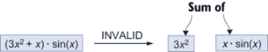

图 10.7 在加号周围拆分表达式没有意义，因为原始表达式不是 3*x*² 和 *x* · sin(*x*) 的和。

如果我们看表达式 3*x*² + *x*，它可以分解成一个和：3*x*² 和 *x*。同样，传统的运算顺序告诉我们，3*x*² 是 3 和 *x*² 的乘积，而不是 3*x* 的平方。

在本章中，我们将把乘法、加法等操作视为将两个（或更多）代数表达式并排放置以形成一个新的大代数表达式的方式。同样，运算符是拆分现有代数表达式为更小表达式的有效位置。

在函数式编程的术语中，将较小的对象组合成较大的对象，如这种函数通常被称为 *组合子*。以下是我们表达式中隐含的一些组合子：

+   3*x*² 是表达式 3 和 *x*² 的*乘积*。

+   *x*² 是一个*幂次*：一个表达式 *x* 被提升到另一个表达式 2 的幂次。

+   表达式 sin(*x*) 是一个 *函数应用*。给定表达式 sin 和表达式 *x*，我们可以构建一个新的表达式 sin(*x*)。

变量 *x*、数字 2 或名为 sin 的函数不能进一步分解。为了区分这些与组合符，我们称它们为 *元素*。这里的教训是，虽然 (3*x*² + *x*) sin(*x*) 只是在这一页上打印的一堆符号，但这些符号以某种方式组合起来以传达某些数学意义。为了使这个概念更加清晰，我们可以可视化这个表达式是如何从其基本元素构建而成的。

### 10.2.2 构建表达式树

元素 3、*x*、2 和 sin，以及加法、乘法、幂运算和函数应用的组合符足够重建整个表达式 (3*x*² + *x*) sin(*x*)。让我们一步一步地走，绘制我们将要构建的结构。我们可以构建的第一个结构之一是 *x*²，它使用幂组合符将 *x* 和 2 结合起来（图 10.8）。

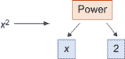

图 10.8 使用幂组合符将 *x* 和 2 结合起来表示更大的表达式 x²

一个好的下一步是将 *x*² 与数字 3 通过乘法组合符结合，得到表达式 3*x*²（图 10.9）。

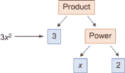

图 10.9 使用幂将数字 3 与一个幂结合来表示乘积 3x2

这个结构有两层深度：输入到乘法组合符的表达式本身就是一个组合符。当我们添加更多表达式的项时，它变得更深。下一步是使用加法组合符将元素 *x* 添加到 3*x*² 中（图 10.10），这代表了加法操作。

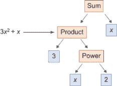

图 10.10 使用表达式 3x²、元素 *x* 和加法组合符得到 3*x*² + *x*

最后，我们需要使用函数应用组合符将 sin 应用到 *x* 上，然后使用乘法组合符将 sin(*x*) 与我们迄今为止构建的内容结合起来（图 10.11）。

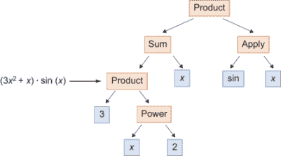

图 10.11 一个完成的图，展示了如何从元素和组合符构建 (3x2 + *x*) sin(*x*)

你可能会认出我们构建的结构是一个 *树*。树的根是乘法组合符，从中伸出两个分支：`Sum` 和 `Apply`。树中出现的每个组合符都会添加额外的分支，直到你达到没有分支的叶子元素。任何使用数字、变量和命名函数作为元素以及操作符为组合符的代数表达式都对应于一个独特的树，揭示了其结构。接下来，我们可以用 Python 构建相同的树。

### 10.2.3 将表达式树转换为 Python

当我们在 Python 中构建这个树时，我们就实现了将表达式表示为数据结构的目标。我将使用附录 B 中介绍的 Python 类来表示每种元素和每个组合器。随着我们的进行，我们将修改这些类，使它们具有更多的功能。如果你想跟随文本，可以查看第十章的 Jupyter 笔记本，或者你可以跳到 Python 脚本文件 expressions.py 中的更完整的实现。

在我们的实现中，我们将组合器建模为包含所有输入的容器。例如，一个幂 *x* 的 2，或 *x*²，有两块数据：基数 *x* 和幂 2\. 这里是一个设计用来表示幂表达式的 Python 类：

```
class Power():
    def __init__(self,base,exponent):
        self.base = base
        self.exponent = exponent
```

我们可以写 `Power("x",2)` 来表示表达式 *x*²。但而不是使用原始字符串和数字，我将创建特殊的类来表示数字和变量。例如，

```
class Number():
    def __init__(self,number):
        self.number = number

class Variable():
    def __init__(self,symbol):
        self.symbol = symbol
```

这可能看起来像是多余的负担，但能够区分 `Variable("x")`，这意味着将字母 *x* 作为变量考虑，与字符串 `"x"`，它仅仅是一个字符串，是有用的。使用这三个类，我们可以将表达式 *x*² 建模为

```
Power(Variable("x"),Number(2))
```

每个我们的组合器都可以实现为一个具有适当名称的类，该类存储它组合的任何表达式的数据。例如，一个乘积组合器可以是一个存储要相乘的两个表达式的类：

```
class Product():
    def __init__(self, exp1, exp2):
        self.exp1 = exp1
        self.exp2 = exp2
```

使用这个组合器可以表示乘积 3*x*²

```
Product(Number(3),Power(Variable("x"),Number(2)))
```

在介绍了我们需要的其余类之后，我们可以模拟原始表达式以及无限多的其他可能性。（注意，我们允许 `Sum` 组合器有任意数量的输入表达式，我们也可以为 `Product` 组合器做同样的事情。我限制 `Product` 组合器的输入为两个，以使我们在第 10.3 节开始计算导数时代码更简单。）

```
class Sum():
    def __init__(self, *exps):            ❶
        self.exps = exps

class Function():                         ❷
    def __init__(self,name):
        self.name = name

class Apply():                            ❸
    def __init__(self,function,argument):
        self.function = function
        self.argument = argument

f_expression = Product(>                  ❹
               Sum(
                   Product(
                       Number(3),
                       Power(
                           Variable("x"),
                           Number(2))), 
                   Variable("x")), 
               Apply(
                   Function("sin"),
                   Variable("x")))
```

❶ 允许任何数量的项之和，因此我们可以将两个或多个表达式相加

❷ 存储一个字符串，它是函数的名称（例如“sin”）

❸ 存储一个函数及其应用到的参数

❹ 我使用额外的空白来使表达式的结构更清晰可见。

这是对原始表达式（3*x*² + *x*）sin(*x*)的忠实呈现。我的意思是，我们可以查看这个 Python 对象，并看到它描述的是代数表达式，而不是另一个表达式。对于另一个表达式，例如

```
Apply(Function("cos"),Sum(Power(Variable("x"),Number("3")), Number(−5)))
```

我们可以仔细阅读它，并看到它代表了一个不同的表达式：cos(*x*³ + −5)。在接下来的练习中，你可以练习将一些代数表达式翻译成 Python，反之亦然。你会发现，输入整个表达式的表示可能会很繁琐。好消息是，一旦你在 Python 中将其编码，手动工作就结束了。在下一节中，我们将看到如何编写 Python 函数来自动处理我们的表达式。

### 10.2.4 练习

| **练习 10.1**: 你可能已经遇到过自然对数，这是一个特殊的数学函数，写作 ln(*x*)。将表达式 ln(*yz*) 绘制成由前一小节描述的元素和组合器构成的树。**解答**：最外层的组合器是一个 Apply。被应用的是 ln 函数，即自然对数，参数是 *yz*。反过来，*yz* 是一个以 *y* 为底，*z* 为指数的幂。结果看起来像这样：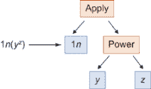 |
| --- |
| **练习 10.2**: 在自然对数由 Python 函数 `math.log` 计算的情况下，将前一个练习中的表达式翻译成 Python 代码。请将其作为 Python 函数和由元素和组合器构建的数据结构写出。 |

| **解答**：你可以将 ln(*yz*) 视为两个变量 *y* 和 *z* 的函数。它可以直接翻译成 Python，其中 ln 被称为 `log`：

```
from math import log
def *f*(y,z):
    return log(y**z)
```

表达式树是这样构建的：

```
Apply(Function("ln"), Power(Variable("y"), Variable("z")))
```

|

| **练习 10.3**: 表达式 `Product(Number(3), Sum(Variable("y"),Variable("z")))` 表示的是什么？**解答**：这个表达式表示 3 · (*y* + *z*)。注意，由于运算顺序，括号是必要的。 |
| --- |

| **练习 10.4**: 实现一个表示一个表达式除以另一个表达式的 `Quotient` 组合器。如何表示以下表达式？！[](../Images/CH10_F11_Orland_UN01_EQ04.png)**解答**：`Quotient` 组合器需要存储两个表达式：上面的表达式称为**分子**，下面的称为**分母**：

```
class Quotient():
    def __init__(self,numerator,denominator):
        self.numerator = numerator
        self.denominator = denominator
```

样本表达式是和 *a* + *b* 与数字 2 的商：

```
Quotient(Sum(Variable("a"),Variable("b")),Number(2))
```

|

| **练习 10.5**: 实现一个表示一个表达式从另一个表达式中减去的 `Difference` 组合器。如何表示表达式 *b*² − 4 *ac*？**解答**：`Difference` 组合器需要存储两个表达式，它表示第二个表达式从第一个表达式中减去：

```
class Difference():
    def __init__(self,exp1,exp2):
        self.exp1 = exp1
        self.exp2 = exp2
```

表达式 *b*² − 4 *ac* 是表达式 *b*² 和 4 *ac* 的差，表示如下：

```
Difference(
    Power(Variable('b'),Number(2)),
    Product(Number(4),Product(Variable('a'), Variable('c'))))
```

|

| **练习 10.6**: 实现一个表示表达式取反的 `Negative` 组合器。例如，*x*² + *y* 的取反是 −(*x*² + *y*)。使用你新创建的组合器以代码形式表示后者表达式。**解答**：`Negative` 组合器是一个包含一个表达式的类：

```
class Negative():
    def __init__(self,exp):
        self.exp = exp
```

要对 *x*² + *y* 取反，我们将其传递给 `Negative` 构造器：

```
Negative(Sum(Power(Variable("x"),Number(2)),Variable("y")))
```

|

| **练习 10.7**: 添加一个名为 `Sqrt` 的函数来表示平方根，并使用它来编码以下公式：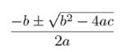 **解答**：为了节省一些打字，我们可以在一开始就命名我们的变量和平方根函数：

```
A = Variable('a')
B = Variable('b')
C = Variable('c')
Sqrt = Function('sqrt')
```

然后只需将代数表达式翻译成适当的元素和组合器的结构。在最高级别上，你可以看到这是一个和（在上面）与积（在下面）的商：

```
Quotient(
    Sum(
        Negative(B),
        Apply(
            Sqrt, 
            Difference(
                Power(B,Number(2)),
                Product(Number(4), Product(A,C))))),
    Product(Number(2), A))
```

|

| **练习 10.8-迷你项目**：创建一个抽象基类 `Expression` 并使所有元素和组合子从它继承。例如，`class Variable()` 将变为 `class Variable(Expression)`。然后重载 Python 算术运算 `+`，`-`，`*` 和 `/`，以便它们产生 `Expression` 对象。例如，代码 `2*Variable("x")+3` 应该产生 `[cos(x)%20%5C%2C%20dx%250">](https://www.codecogs.com/eqnedit.php?latex=%5Cint%20%5C%3Cspan%20class=)Sum(Product(Number(2),Variable("x")),Number(3))`。**解决方案**：请参阅本章源代码中的 `expressions.py` 文件。 |
| --- |

## 10.3 将符号表达式投入应用

对于我们迄今为止研究过的函数，*f*(*x*) = (3*x*² + *x*) sin(*x*)，我们编写了一个 Python 函数来计算它：

```
def f(x):
    return (3*x**2 + x)*sin(x)
```

作为 Python 中的一个实体，这个函数只适用于一件事：对于给定的输入值 *x* 返回一个输出值。Python 中的 *f* 并没有使其特别容易以编程方式回答我们在本章开头提出的问题：*f* 是否依赖于其输入，*f* 是否包含三角函数，或者如果 *f* 以代数方式展开，其主体会是什么样子。在本节中，我们看到一旦我们将表达式翻译成由元素和组合子构成的 Python 数据结构，我们就可以回答所有这些问题以及更多！

### 10.3.1 在表达式中查找所有变量

让我们编写一个函数，它接受一个表达式并返回其中出现的所有不同变量的列表。例如，*h*(*z*) = 2*z* + 3 使用输入变量 *z* 定义，而 *g*(*x*) = 7 的定义不包含任何变量。我们可以编写一个 Python 函数，`distinct_variables`，它接受一个表达式（意味着我们的任何元素或组合子）并返回一个包含变量的 Python 集合。

如果我们的表达式是一个元素，如 *z* 或 7，答案很明确。仅包含变量的表达式包含一个不同的变量，而仅包含数字的表达式则不包含任何变量。我们期望我们的函数按预期行为：

```
>>> distinct_variables(Variable("z"))
{'z'}
>>> distinct_variables(Number(3))
set()
```

当表达式由一些组合子如 *y* · *z* + *x^z* 构成时，情况变得更加复杂。人类阅读所有变量，*y*，*z* 和 *x*，很容易，但我们在 Python 中如何从表达式中提取这些变量呢？这实际上是一个表示 *y* · *z* 和 *x^z* 之和的 Sum 组合子。求和中的第一个表达式包含 *y* 和 *z*，而第二个包含 *x* 和 *z*。求和包含了这两个表达式中的所有变量。

这表明我们应该使用递归解决方案：组合子的 `distinct_variables` 是它包含的每个表达式的 `distinct_variables` 的收集。行尾的变量和数字显然包含一个或零个变量。为了实现 `distinct_variables` 函数，我们需要处理构成有效表达式的每个元素和组合子的情况：

```
def distinct_variables(exp):
    if isinstance(exp, Variable):
        return set(exp.symbol)
    elif isinstance(exp, Number):
        return set()
    elif isinstance(exp, Sum):
        return set().union(*[distinct_variables(exp) for exp in exp.exps])
    elif isinstance(exp, Product):
        return distinct_variables(exp.exp1).union(distinct_variables(exp.exp2))
    elif isinstance(exp, Power):
        return distinct_variables(exp.base).union(distinct_variables(exp.exponent))
    elif isinstance(exp, Apply):
        return distinct_variables(exp.argument)
    else:
        raise TypeError("Not a valid expression.")
```

这段代码看起来很复杂，但实际上它只是一个长 if/else 语句，每个可能的元素或组合器对应一行。可以说，给每个元素和组合器类添加一个`distinct_variables`方法会是一个更好的编码风格，但这会使单个代码列表中的逻辑更难理解。正如预期的那样，我们的`f_expression`只包含变量*x*：

```
>>> distinct_variables(f_expression)
{'x'}
```

如果你熟悉树形数据结构，你会认出这是对表达式树的递归遍历。当这个函数完成时，它已经对目标表达式中的每个表达式调用了`distinct_variables`，这些表达式是树中的所有节点。这确保了我们看到每个变量，并且得到我们预期的正确答案。在本节末尾的练习中，你可以使用类似的方法找到所有的数字或所有的函数。

### 10.3.2 评估表达式

现在，我们有了同一个数学函数*f*(*x*)的两种表示形式。一个是 Python 函数`f`，它适用于评估给定输入值*x*的函数。新的一个是这个描述定义*f*(*x*)的表达式结构的树形数据结构。结果是后者表示形式兼具两者之长；我们可以用它来评估*f*(*x*)，只需做一点额外的工作。

从机械的角度来看，在*x* = 5 这样的值上评估函数*f*(*x*)意味着将 5 的值插入*x*的所有地方，然后进行算术运算以找到结果。如果表达式只是*f*(*x*) = *x*，插入*x* = 5 会告诉我们*f*(5) = 5。另一个简单的例子是*g*(*x*) = 7，其中用 5 替换*x*没有任何影响；在等式右边没有*x*的出现，所以*g*(5)的结果只是 7。

在 Python 中评估表达式的代码与我们刚刚编写的用于查找所有变量的代码类似。我们需要评估每个子表达式，而不是查看每个子表达式中出现的变量集合，然后组合器告诉我们如何将这些结果组合起来得到整个表达式的值。

我们需要起始数据是插入哪些值以及哪些变量来替换。像*z*(*x*, *y*) = 2*xy*³这样的两个不同变量的表达式需要两个值来得到结果；例如，*x* = 3 和*y* = 2。在计算机科学术语中，这些被称为*变量绑定*。有了这些，我们可以评估子表达式*y*³为(2)³，等于 8。另一个子表达式是 2*x*，它评估为 2 · (3) = 6。这两个子表达式通过乘法组合器组合在一起，所以整个表达式的值是 6 和 8 的乘积，即 48。

当我们将此过程转换为 Python 代码时，我将向您展示与上一个示例略有不同的风格。我们不需要一个单独的 `evaluate` 函数，而是可以为每个表示表达式的类添加一个 `evaluate` 方法。为了强制执行这一点，我们可以创建一个具有抽象 `evaluate` 方法的抽象 `Expression` 基类，并让每种表达式都从它继承。如果您需要回顾 Python 中的抽象基类，请花点时间回顾第六章中我们与 `Vector` 类一起完成的工作，或者在附录 B 中的概述。以下是一个包含 `evaluate` 方法的 `Expression` 基类：

```
from abc import ABC, abstractmethod

class Expression(ABC):
    @abstractmethod
    def evaluate(self, **bindings):
        pass
```

由于一个表达式可以包含多个变量，我设置了这样的结构，您可以通过关键字参数传递变量绑定。例如，绑定 `{"x":3,"y":2}` 表示用 3 替换 *x*，用 2 替换 *y*。这在评估表达式时提供了一些语法糖。如果 *z* 代表表达式 2*xy*³，那么一旦我们完成，我们就能执行以下操作：

```
>>> z.evaluate(x=3,y=2)
48
```

到目前为止，我们只有一个抽象类。现在我们需要让所有的表达式类都从 `Expression` 继承。例如，一个 `Number` 实例作为一个单独的数字（如 7）是一个有效的表达式。无论提供的变量绑定如何，数字都会评估为自身：

```
class Number(Expression):
    def __init__(self,number):
        self.number = number
    def evaluate(self, **bindings):
        return self.number
```

例如，评估 `Number(7).evaluate(x=3,y=6,q=−15)` 或任何其他评估，都会返回基础数字 7。

处理变量也很简单。如果我们查看表达式 `Variable("x")`，我们只需要查看绑定，看看变量 *x* 被设置为哪个数字。当我们完成时，我们应该能够运行 `Variable("x").evaluate(x=5)` 并得到 5 作为结果。如果我们找不到 *x* 的绑定，那么我们无法完成评估，并需要引发异常。以下是 `Variable` 类的更新定义：

```
class Variable(Expression):
    def __init__(self,symbol):
        self.symbol = symbol
    def evaluate(self, **bindings):
        try:
            return bindings[self.symbol]
        except:
            raise KeyError("Variable '{}' is not bound.".format(self.symbol))
```

处理这些元素后，我们需要将注意力转向组合子。请注意，我们不会将 `Function` 对象视为单独的 `Expression`，因为像正弦这样的函数不是一个独立的表达式。它只能在 `Apply` 组合子提供的参数上下文中进行评估。）对于像 `Product` 这样的组合子，评估它的规则很简单：评估产品中包含的两个表达式，然后将结果相乘。在产品中不需要进行替换，但我们将绑定传递给两个子表达式，以防其中任何一个包含 `Variable`：

```
class Product(Expression):
    def __init__(self, exp1, exp2):
        self.exp1 = exp1
        self.exp2 = exp2
    def evaluate(self, **bindings):
        return self.exp1.evaluate(**bindings) * self.exp2.evaluate(**bindings)
```

在这三个类更新了 `evaluate` 方法之后，我们现在可以评估由变量、数字和乘积构建的任何表达式。例如，

```
>>> Product(Variable("x"), Variable("y")).evaluate(x=2,y=5)
10
```

同样，我们可以为 `Sum`、`Power`、`Difference` 或 `Quotient` 组合子（以及您可能作为练习创建的任何其他组合子）添加 `evaluate` 方法。一旦我们评估了它们的子表达式，组合子的名称就会告诉我们可以使用哪种操作来获得整体结果。

`Apply`组合子的工作方式略有不同，因此值得特别注意。我们需要动态地查看像 sin 或 sqrt 这样的函数名，并找出如何计算其值。有几种可能的方法可以做到这一点，但我选择在`Apply`类上保留已知函数的字典作为数据。作为第一步，我们可以让我们的评估器意识到三个命名函数：

```
_function_bindings = {
    "sin": math.sin,
    "cos": math.cos,
    "ln": math.log
}
class Apply(Expression):
    def __init__(self,function,argument):
        self.function = function
        self.argument = argument
    def evaluate(self, **bindings):
        return _function_bindingsself.function.name)
```

你可以自己练习编写其余的评估方法，或者在本书的源代码中找到它们。一旦你完全实现了所有这些，你将能够评估第 10.1.3 节中的`f_expression`：

```
>>>  f_expression.evaluate(x=5)
−76.71394197305108
```

这里的结果并不重要，重要的是它与普通 Python 函数*f*(*x*)给出的结果相同：

```
>>> xf(5)
−76.71394197305108
```

配备了评估函数，我们的`Expression`对象可以执行与其对应的普通 Python 函数相同的工作。

### 10.3.3 展开一个表达式

我们可以用我们的表达式数据结构做很多事情。在练习中，你可以尝试构建一些更多以不同方式操作表达式的 Python 函数。现在，我将展示一个例子，这是我在这章开头提到的：展开一个表达式。我的意思是从任何乘积或幂的和开始执行。

代数的相关规则是和与积的**分配律**。这个规则说明，形式为(*a* + *b*) · *c*的乘积等于*ac* + *bc*，同样，*x*(*y* *+* *z*) = *xy* + *xz*。例如，我们的表达式(3*x*² + *x*) sin(*x*)等于 3*x*² sin(*x*) + *x* sin(*x*)，这就是第一个乘积的展开形式。你可以使用这个规则多次展开更复杂的表达式，例如：

(*x* + *y*)³ = (*x* + *y*)(*x* + *y*)(*x* + *y*)

= *x*(*x* + *y*)(*x* + *y*) + *y*(*x* + *y*)(*x* + *y*)

= *x*²(*x* + *y*) + *x**y*(*x* + *y*) + *y**x*(*x* + *y*) + *y*²(*x* + *y*)

= *x*³ + *x*²*y* + *x*²*y* + *x**y*² + *y**x*² + *y*²*x* + *y*²*x* + *y*³

= *x*³ + 3*x*²*y* + 3*y*²*x* + *y*³

如你所见，展开一个短的表达式如(*x* + *y*)³可能需要很多写作。除了展开这个表达式外，我还稍微简化了结果，将看起来像*xyx*或*xxy*的乘积重写为*x*² *y*，例如。这是可能的，因为乘法中顺序并不重要。然后我进一步通过*合并*同类项来简化，注意到每个*x*² *y*和*y*² *x*各有三个加和，并将它们组合成 3*x*² *y*和 3*y*² *x*。在下面的例子中，我们只看如何进行展开；你可以将简化作为练习来实现。

我们可以从向`Expression`基类添加一个抽象的`expand`方法开始：

```
class Expression(ABC):
    ...
    @abstractmethod
    def expand(self):
        pass
```

如果一个表达式是变量或数字，它已经展开。对于这些情况，`expand`方法返回对象本身。例如，

```
class Number(Expression):
    ...
    def expand(self):
        return self
```

和已经被视为展开的表达式，但和的各个项不能展开。例如，5 + *a*(*x* + *y*) 是一个和，其中第一个项 5 已经完全展开，但第二个项 *a*(*x* + *y*) 没有展开。要展开一个和，我们需要展开每个项并将它们相加：

```
class Sum(Expression):
    ...
    def expand(self):
        return Sum(*[exp.expand() for exp in self.exps])
```

同样的程序也适用于函数应用。我们无法展开 `Apply` 函数本身，但我们可以展开其参数。这将展开一个像 sin(*x*(*y* + *z*)) 这样的表达式到 sin(*xy* + *xz*)：

```
class Apply(Expression):
    ...
    def expand(self):
        return Apply(self.function, self.argument.expand())
```

当我们展开乘积或幂时，表达式的结构会完全改变，这才是真正的挑战。例如，*a*(*b* + *c*) 是一个变量与两个变量的和的乘积，而其展开形式是 *ab* + *ac*，即两个变量的乘积之和。为了实现分配律，我们必须处理三种情况：乘积的第一个项可能是一个和，第二个项可能是一个和，或者两者都不是和。在后一种情况下，不需要展开：

```
class Product(Expression):
    ...
    def expand(self):
        expanded1 = self.exp1.expand()                 ❶
        expanded2 = self.exp2.expand()
        if isinstance(expanded1, Sum):                 ❷
            return Sum(*[Product(e,expanded2).expand() 
                         for e in expanded1.exps])
        elif isinstance(expanded2, Sum):               ❸
            return Sum(*[Product(expanded1,e) 
                         for e in expanded2.exps])
        else:
            return Product(expanded1,expanded2)        ❹
```

❶ 展开乘积的两个项

❷ 如果乘积的第一个项是一个和，它将每个项与乘积的第二个项相乘，然后对结果调用 `expand` 方法，如果乘积的第二个项也是一个和。

❸ 如果乘积的第二个项是一个和，它将每个项乘以乘积的第一个项。

❹ 否则，两个项都不是和，不需要使用分配律。

实现了所有这些方法后，我们可以测试 `expand` 函数。通过适当的 `__repr__` 实现（见练习），我们可以在 Jupyter 或交互式 Python 会话中清楚地看到结果字符串表示。它正确地将 (*a* + *b*) (*x* + *y*) 展开为 *ax* + *ay* + *bx* + *by* :

```
Y = Variable('y')
Z = Variable('z')
A = Variable('a')
B = Variable('b')
>>> Product(Sum(A,B),Sum(Y,Z))
Product(Sum(Variable("a"),Variable("b")),Sum(Variable("x"),Variable("y")))
>>> Product(Sum(A,B),Sum(Y,Z)).expand()
Sum(Sum(Product(Variable("a"),Variable("y")),Product(Variable("a"),
Variable("z"))),Sum(Product(Variable("b"),Variable("y")),
Product(Variable("b"),Variable("z"))))
```

我们的表达式 (3*x*² + *x*) sin(*x*) 正确地展开为 3*x*² sin(*x*) + *x* sin(*x*):

```
>>> f_expression.expand()
Sum(Product(Product(3,Power(Variable("x"),2)),Apply(Function("sin"),Variable("x"))),Product(Variable("x"),Apply(Function("sin"),Variable("x"))))
```

到目前为止，我们已经编写了一些 Python 函数，它们真正为我们做代数运算，而不仅仅是算术运算。这种类型的编程（称为 *符号编程*，或更具体地说，*计算机代数*）有很多令人兴奋的应用，我们无法在本书中涵盖所有这些应用。你应该尝试以下练习中的几个，然后我们继续到我们最重要的例子：求导数的公式。

### 10.3.4 练习

| **练习 10.9**：编写一个函数 `contains(expression, variable)`，该函数检查给定的表达式是否包含指定变量的任何出现。**解决方案**：你可以轻松地检查变量是否出现在 `distinct_variables` 的结果中，但这里是从头开始实现的：

```
def contains(exp, var):
    if isinstance(exp, Variable):
        return exp.symbol == var.symbol
    elif isinstance(exp, Number):
        return False
    elif isinstance(exp, Sum):
        return any([contains(e,var) for e in exp.exps])
    elif isinstance(exp, Product):
        return contains(exp.exp1,var) or contains(exp.exp2,var)
    elif isinstance(exp, Power):
        return contains(exp.base, var) or contains(exp.exponent, var)
    elif isinstance(exp, Apply):
        return contains(exp.argument, var)
    else:
        raise TypeError("Not a valid expression.")
```

|

| **练习 10.10**：编写一个 `distinct_functions` 函数，该函数接受一个表达式作为参数，并返回表达式中出现的不同、命名的函数（如 sin 或 ln）。**解决方案**：实现看起来与第 10.3.1 节中的 `distinct_variables` 函数非常相似：

```
def distinct_functions(exp):
    if isinstance(exp, Variable):
        return set()
    elif isinstance(exp, Number):
        return set()
    elif isinstance(exp, Sum):
        return set().union(*[distinct_functions(exp) for exp in exp.exps])
    elif isinstance(exp, Product):
        return distinct_functions(exp.exp1).union(distinct_functions(exp.exp2))
    elif isinstance(exp, Power):
        return distinct_functions(exp.base).union(distinct_functions(exp.exponent))
    elif isinstance(exp, Apply):
        return set([exp.function.name]).union(distinct_functions(exp.argument))
    else:
        raise TypeError("Not a valid expression.")
```

|

| **练习 10.11**：编写一个函数 `contains_sum`，它接受一个表达式并返回 `True` 如果它包含一个 `Sum`，否则返回 `False`。**解决方案**：

```
def contains_sum(exp):
    if isinstance(exp, Variable):
        return False
    elif isinstance(exp, Number):
        return False
    elif isinstance(exp, Sum):
        return True
    elif isinstance(exp, Product):
        return contains_sum(exp.exp1) or contains_sum(exp.exp2)
    elif isinstance(exp, Power):
        return contains_sum(exp.base) or contains_sum(exp.exponent)
    elif isinstance(exp, Apply):
        return contains_sum(exp.argument)
    else:
        raise TypeError("Not a valid expression.")
```

|

| **练习 10.12-迷你项目**：在 `Expression` 类上编写一个 `__repr__` 方法，以便在交互会话中清晰显示。**解决方案**：请参阅第十章的教程笔记本或参阅附录 B 中对 `__repr__` 和 Python 类上的其他特殊方法的讨论。 |
| --- |
| **练习 10.13-迷你项目**：如果你知道如何使用 LaTeX 语言编码方程，请在 `Expression` 类上编写一个 `_repr_latex_` 方法，该方法返回表示给定表达式的 LaTeX 代码。在添加此方法后，你应该能在 Jupyter 中看到你表达式的精美排版渲染！添加 `_repr_latex_` 方法会导致 Jupyter 在 REPL 中以优美的形式渲染方程。**解决方案**：请参阅第十章的教程笔记本。 |

| **练习 10.14-迷你项目**：编写一个方法来生成表示表达式的 Python 代码。使用 Python 的 `eval` 函数将其转换为可执行的 Python 函数。将结果与评估方法进行比较。例如，`Power(Variable("x"),Number(2))` 表示表达式 *x*²。这应该生成 Python 代码 `x**2`。然后使用 Python 的 `eval` 函数执行此代码，并展示它如何与评估方法的结果相匹配。**解决方案**：请参阅实现教程笔记本。完成后，你可以运行以下代码：

```
>>> Power(Variable("x"),Number(2))._python_expr()
'(*x*) ** (2)'
>>> Power(Variable("x"),Number(2)).python_function(x=3)
9
```

|

## 10.4 求函数的导数

虽然可能看起来不明显，但函数的导数通常有一个干净代数公式。例如，如果 *f*(*x*) = *x*³，那么其导数 *f*(*x*)，它衡量的是在任意点 *x* 处 *f* 的瞬时变化率，由 *f*(*x*) = 3*x*² 给出。如果你知道这样的公式，你可以得到一个精确的结果，例如 *f*'(2) = 12，而不需要使用小割线相关的数值问题。

如果你曾在高中或大学学习过微积分，那么你很可能花了很多时间学习和练习如何找到导数的公式。这是一个不需要太多创造力的直接任务，可能会很繁琐。这就是为什么我们将简要地介绍规则，然后专注于让 Python 为我们完成剩下的工作。

### 10.4.1 幂的导数

即使不知道任何微积分，你也可以找到形式为 *f*(*x*) = *mx* + *b* 的线性函数的导数。这条线上任何割线的斜率，无论多小，都与线的斜率 *m* 相同；因此，*f*(*x*) 不依赖于 *x*。具体来说，我们可以得出 *f*(*x*) = *m*。这很有意义：线性函数 *f*(*x*) 相对于其输入 *x* 的变化率是恒定的，因此其导数是一个常数函数。此外，常数 *b* 对线的斜率没有影响，因此它不会出现在导数中（图 10.12）。

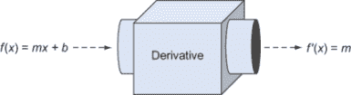

图 10.12 线性函数的导数是常数函数。

结果表明，二次函数的导数是一次函数。例如，*q*(*x*) = *x*²的导数是*q*'(*x*) = 2*x*。如果你绘制*q*(*x*)的图形，这也很有道理。*q*(*x*)的斜率开始是负的，然后增加，最终在*x* = 0 后变成正的。函数*q*'(*x*) = 2*x*与这种定性描述相符。

作为另一个例子，我向你展示了*x*³的导数是 3*x*²。所有这些事实都是一般规则的特例：当你对一个函数*f*(*x*)求导，该函数是*x*的幂时，你得到的是一个比原来低一级的幂的函数。具体来说，图 10.13 展示了形式为*axn*的函数的导数是*nax^n*的负一次方。

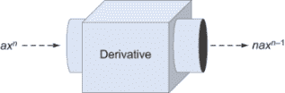

图 10.13 幂函数导数的一般规则：对一个函数*f*(*x*)求导，该函数是*x*的幂，得到的是一个比原来低一级的幂的函数。

让我们通过一个具体的例子来分析这个问题。如果*g*(*x*) = 5*x*⁴，那么这个函数的形式是*axn*，其中*a* = 5，*n* = 4。导数是*nax^n*的负一次方，这变成了 4 · 5 · *x*^(4−1) = 20*x*³。像本章中我们讨论的任何其他导数一样，你可以通过将图形与第九章中我们的数值导数函数的结果并排绘制来双重检查这个结果。图形应该完全一致。

线性函数*f*(*x*)是*x*的幂：*f*(*x*) = *mx*¹。幂规则在这里同样适用：*mx*¹的导数是 1 · *mx*⁰，因为*x*⁰ = 1。通过几何考虑，添加一个常数*b*不会改变导数；它会使图形上下移动，但不会改变斜率。

### 10.4.2 变换函数的导数

给函数添加一个常数永远不会改变它的导数。例如，*x*¹⁰⁰的导数是 100*x*⁹⁹，而*x*¹⁰⁰ − *π*的导数也是 100*x*⁹⁹。但是，函数的一些修改确实会改变导数。例如，如果你在函数前加上一个负号，图形会翻转过来，任何割线的图形也会翻转。如果翻转前的割线斜率是*m*，翻转后就是- *m*；*x*的变化与之前相同，但*y* = *f*(*x*)的变化现在方向相反（图 10.14）。

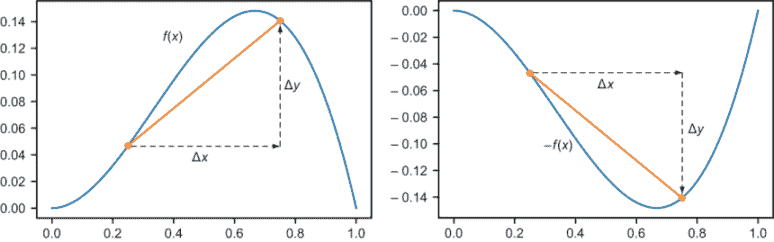

图 10.14 对于*f*(*x*)上的任何割线，*f*(*x*)的同一*x*区间的割线具有相反的斜率。

因为导数是由割线的斜率决定的，所以负函数-*f*(−*x*)的导数等于负导数-*f*'(*x*)。这与我们之前看到的公式一致：如果*f*(*x*) = −5*x*²，那么*a* = −5，*f*'(*x*) = −10*x*（与导数为+10*x*的 5*x*²相比）。另一种说法是，如果你将一个函数乘以-1，那么它的导数也会乘以-1。

对于任何常数也是如此。如果你将 f(x)乘以 4 得到 4f(x)，图 10.15 显示这个新函数在每一点上都变得四倍陡峭，因此它的导数是 4f'(x)。

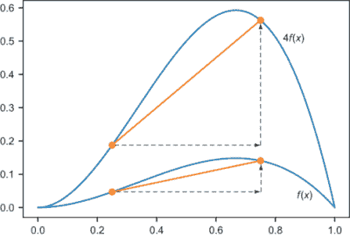

图 10.15 将一个函数乘以 4 会使每条割线变得四倍陡峭。

这与我所展示的导数的幂规则一致。知道 x²的导数是 2x，你也知道 10x²的导数是 20x，−3x²的导数是−6x，等等。我们还没有涉及这一点，但如果我告诉你 sin(x)的导数是 cos(x)，你将立刻知道 1.5 · sin(x)的导数是 1.5 · cos(x)。

一个重要的最终变换是将两个函数相加。如果你观察图 10.16 中任意一对函数 f 和 g 的 f(x) + g(x)的图像，任何割线的垂直变化都是该区间内 f 和 g 的垂直变化的和。

当我们处理公式时，我们可以独立地对和中的每一项求导。如果我们知道 x²的导数是 2x，x³的导数是 3x²，那么 x² + x³的导数是 2x + 3x²。这个规则给出了为什么 mx + b 的导数是 m 的更精确的理由；项的导数分别是 m 和 0，因此整个公式的导数是 m + 0 = m。

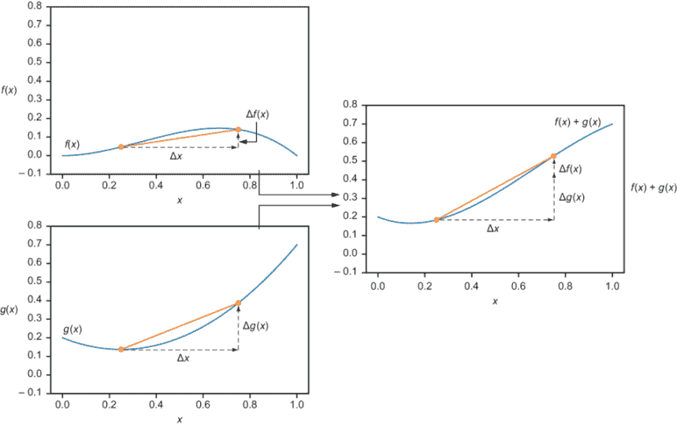

图 10.16 在某个 x 区间上 f(x)的垂直变化是 f(x)和 g(x)在该区间的垂直变化的和。

### 10.4.3 一些特殊函数的导数

有许多函数不能写成 ax^n 的形式，甚至不能写成这种形式的项的和。例如，三角函数、指数函数和对数都需要单独考虑。在微积分课程中，你学习如何从头开始计算这些函数的导数，但这超出了本书的范围。我的目标是向你展示如何求导，这样当你遇到这些函数时，你将能够解决手头的问题。为此，我给你一个快速列表，其中包含一些其他重要的导数规则（表 10.1）。

表 10.1 一些基本的导数（续）

| 函数名称 | 公式 | 导数 |
| --- | --- | --- |
| 正弦 | sin(x) | cos(x) |
| 余弦 | cos(x) | −sin(x) |
| 指数 | e^x | e^x |
| 指数（任何底数） | a^x | ln(a) · a^x |
| 自然对数 | ln(x) | 1/x |
| 对数（任何底数） | log_a(x) | 1/ln(a) · x |

你可以使用这个表格以及之前的规则来找出更复杂的导数。例如，让 *f*(*x*) = 6*x* + 2 sin(*x*) + 5 *ex*。第一项的导数是 6，根据第 10.4.1 节中的幂法则。第二项包含 sin(*x*)，其导数是 cos(*x*)，因子 2 将结果加倍，得到 2 cos(*x*)。最后，*ex* 是它自己的导数（一个非常特殊的情况！），所以 5 *ex* 的导数是 5 *ex*。所有这些加在一起，导数是 *f*'(*x*) = 6 + 2 cos(*x*) + 5 *ex*。

你必须小心，只使用我们之前提到的规则：幂法则（第 10.4.1 节）、表 10.1 中的规则以及和与标量乘法的规则。如果你的函数是 *g*(*x*) = sin(sin(*x*))，你可能会想写成 *g*'(*x*) = cos(cos(*x*))，在两个出现的地方都代入正弦的导数。但这是不正确的！你也不能推断出乘积 *ex* cos(*x*) 的导数是 − *ex* sin(*x*)。当函数以除了加法和减法以外的其他方式组合时，我们需要新的规则来求它们的导数。

### 10.4.4 乘积和复合函数的导数

让我们看看像 *f*(*x*) = *x*² sin(*x*) 这样的乘积。这个函数可以写成两个其他函数的乘积：*f*(*x*) = *g*(*x*) · *h*(*x*)，其中 *g*(*x*) = *x*² 和 *h*(*x*) = sin(*x*)。正如我刚才警告你的，*f*'(*x*) 并不等于 *g*'(*x*) · *h*'(*x*)。幸运的是，还有一个正确的公式，它被称为**乘积法则**。

乘积法则 如果 *f*(*x*) 可以写成两个其他函数 *g* 和 *h* 的乘积，即 *f*(*x*) = *g*(*x*) · *h*(*x*)，那么 *f*(*x*) 的导数由以下公式给出：

*f*'(*x*) = *g*'(*x*) · *h*(*x*) + *g*(*x*) · *h*'(*x*)

让我们练习将这个规则应用到 *f*(*x*) = *x*² sin(*x*) 上。在这种情况下，*g*(*x*) = *x*² 和 *h*(*x*) = sin(*x*)，所以 *g*'(*x*) = 2*x* 和 *h*'(*x*) = cos(*x*)，正如我之前所展示的。将这些值代入乘积法则公式 *f*'(*x*) = *g*'(*x*) · *h*(*x*) + *g*(*x*) · *h*'(*x*)，我们得到 *f*'(*x*) = 2*x* sin(*x*) + *x*² cos(*x*)。这就是全部内容！

你可以看到，这个乘积法则与第 10.4.1 节中的幂法则是兼容的。如果你将 *x*² 写成 *x* · *x* 的乘积，乘积法则会告诉你它的导数是 1 · *x* + *x* · 1 = 2*x*。

另一条重要的规则告诉我们如何对像 ln(cos(*x*)) 这样的复合函数求导。这个函数的形式是 *f*(*x*) = *g*(*h*(*x*))，其中 *g*(*x*) = ln(*x*) 和 *h*(*x*) = cos(*x*)。我们并不能简单地将导数代入我们看到的函数中，得到 −1/sin(*x*)；答案要复杂一些。形式为 *f*(*x*) = *g*(*h*(*x*)) 的函数的导数公式被称为**链式法则**。

链式法则 如果 *f*(*x*) 是两个函数的复合，意味着它可以写成 *f*(*x*) = *g*(*h*(*x*)) 的形式，对于某些函数 *g* 和 *h*，那么 *f* 的导数由以下公式给出：

*f*'(*x*) = *h*'(*x*) · *g*'(*h*(*x*))

在我们的例子中，*g*'(*x*) = 1/*x* 和 *h*'(*x*) = −sin(*x*) 都是从表 10.1 中读取的。然后将它们代入链式法则公式，我们得到以下结果：

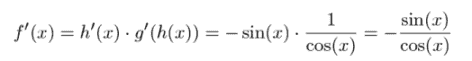

你可能记得 sin(*x*)/cos(*x*) = tan(*x*)，因此我们可以更简洁地写出 ln(cos(*x*)) 的导数 = tan(*x*)。我会在练习中给你更多练习乘积和链式法则的机会，你也可以查阅任何微积分书籍，以获取计算导数的丰富示例。你不必相信我的话，如果你找到一个导数的公式或者使用第九章中的导数函数，你应该得到相同的结果。在下一节中，我将向你展示如何将导数规则转换为代码。

### 10.4.5 练习

| **练习 10.15**：通过绘制数值导数（使用第八章中的导数函数）和符号导数 *f*'(*x*) = 5*x*⁴ 并排，来证明 *f*(*x*) = *x*⁵ 的导数确实是 *f*'(*x*) = 5*x*⁴。**解答**：

```
def *p*(*x*):
    return x**5
plot_function(derivative(p), 0, 1)
plot_function(lambda x: 5*x**4, 0, 1)
```

两个图完全重叠！[](../Images/CH10_F16_Orland_UN03.png)5x⁴ 的图像和 x⁵ 的（数值）导数 |

| **练习 10.16-迷你项目**：让我们再次将一元函数视为向量空间，就像我们在第六章中所做的那样。解释为什么求导数的规则意味着导数是这个向量空间的线性变换。（具体来说，你必须将注意力限制在处处有导数的函数上。）**解答**：将函数 *f* 和 *g* 视为向量，我们可以将它们相加，并用标量乘以它们。记住，(*f* + *g*)(*x*) = *f*(*x*) + *g*(*x*) 和 (*c* · *f* )(*x*) = *c* · *f*(*x*)。一个 *线性变换* 是一个保持向量加法和标量乘法的变换。如果我们把导数写成函数 *D*，我们可以把它看作是输入一个函数并返回其导数的输出。例如，*Df* = *f*'。两个函数和的导数是导数的和：*D*(*f* + *g*) = *Df* + *Dg* 函数乘以一个数 *c* 的导数是原始函数导数的 *c* 倍：*D*(*c* · *f* ) = *c* · *Df* 这两个规则意味着 *D* 是一个线性变换。特别地，函数线性组合的导数与它们的导数的线性组合相同：*D*(*a* · *f* + *b* · *g*) = *a* · *Df* + *b* · *Dg* |
| --- |
| **练习 10.17-迷你项目**：找到一个商的导数公式：*f*(*x*) / *g*(*x*)。**提示**：使用以下事实！[](../Images/CH10_F16_Orland_UN03_EQ12.png)幂法则对负指数也成立；例如，*x*^(−1) 的导数是 − *x*^(−2) = −1/*x*²。**解答**：根据链式法则，*g*(*x*)^(−1) 的导数是 − *g*(*x*)^(−2) · *g*'(*x*) 或！[](../Images/CH10_F16_Orland_UN03_EQ13.png) |
| 利用这些信息，商 *f*(*x*)/ *g*(*x*) 的导数等于乘积 *f*(*x*)/ *g*(*x*)^(−1) 的导数，由乘积法则给出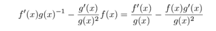将第一项乘以 *g*(*x*)/ *g*(*x*) 使得两项有相同的分母，因此我们可以将它们相加 |
| **练习 10.18**: sin(*x*) · cos(*x*) · ln(*x*) 的导数是什么？**解答**: 这里有两个乘积，幸运的是，我们可以以任何顺序应用乘积法则，并得到相同的结果。sin(*x*) · cos(*x*) 的导数是 sin(*x*) · −sin(*x*) + cos(*x*) · cos(*x*) = cos(*x*)² − sin(*x*)²。ln(*x*) 的导数是 1/*x*，所以乘积法则告诉我们整个乘积的导数是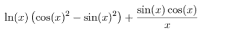 |
| **练习 10.19**: 假设我们知道三个函数 *f*、*g* 和 *h* 的导数，分别写作 *f*'、*g* ' 和 *h* '。*f*(*g*(*h*(*x*))) 关于 *x* 的导数是什么？**解答**: 这里我们需要应用链式法则两次。一个项是 *f*'(*g*(*h*(*x*)))，但我们需要乘以 *g*(*h*(*x*)) 的导数。这个导数是 *g*'(*h*(*x*)) 乘以内函数 *h*(*x*) 的导数。因为 *g*(*h*(*x*)) 的导数是 *h*'(*x*) · *g*'(*h*(*x*))，所以 *f*(*g*(*h*(*x*))) 的导数是 *f*'(*x*) · *g*'(*h*(*x*)) · *f*'(*g*(*h*(*x*)))。 |

## 10.5 自动求导

尽管我只教了你一些求导的规则，但你现在已经准备好处理无限多可能的函数了。只要函数是由和、积、幂、复合、三角函数和对数函数构成的，你就能够使用链式法则、乘积法则等来找出它的导数。

这与我们在 Python 中构建代数表达式所使用的方法相似。尽管可能性无限，但它们都是由相同的构建块和少量预定义的组装方式构成的。为了自动求导，我们需要将可表示的表达式的每一种情况（无论是元素还是组合器）与求导的适当规则相匹配。最终结果是 Python 函数，它接受一个表达式并返回一个表示其导数的新表达式。

### 10.5.1 为表达式实现求导方法

再次，我们可以将求导函数实现为 `Expression` 类中的方法。为了强制它们都具有这个方法，我们可以在抽象基类中添加一个抽象方法：

```
class Expression(ABC):
    ...
    @abstractmethod
    def derivative(self,var):
        pass
```

该方法需要接受一个参数`var`，表示我们对哪个变量求导。例如，*f*(*y*) = *y*²就需要对*y*求导。作为一个更复杂的例子，我们处理过像*axn*这样的表达式，其中*a*和*n*代表常数，而*x*是变量。从这个角度来看，导数是*nax^n*的(-1)次方。然而，如果我们将其视为*a*的函数，例如*f*(*a*) = *ax^n*，那么导数是*x^n*的(-1)次方，这是一个常数乘以一个常数的幂。如果我们将其视为*n*的函数：如果*f*(*n*) = *axn*，那么*f*'(*n*) = *a* ln(*n*) *x^n*。为了避免混淆，在以下讨论中，我们将考虑所有表达式都是关于变量*x*的函数。

与往常一样，我们最容易的例子是元素：`Number`和`Variable`对象。对于`Number`，导数始终是表达式 0，无论传入的变量是什么：

```
class Number(Expression):
    ...
    def derivative(self,var):
        return Number(0)
```

如果我们求函数*f*(*x*) = *x*的导数，结果是*f*'(*x*) = 1，这是直线的斜率。求函数*f*(*x*) = *c*的导数应该给出 0，因为在这里*c*代表一个常数，而不是函数*f*的参数。因此，只有当我们对所求导的变量进行求导时，变量的导数才是 1；否则，导数是 0：

```
class Variable(Expression):
    ...
    def derivative(self, var):
        if self.symbol == var.symbol:
            return Number(1)
        else:
            return Number(0)
```

求导最容易的组合器是 Sum；`Sum`函数的导数只是其项的导数之和：

```
class Sum(Expression):
    ...
    def derivative(self, var):
        return Sum(*[exp.derivative(var) for exp in self.exps])
```

实现了这些方法后，我们可以做一些基本的例子。例如，表达式`Sum(Variable("x"),Variable("c"),Number(1))`代表*x* + *c* + 1，将其视为*x*的函数，我们可以对其关于*x*求导：

```
>>> Sum(Variable("x"),Variable("c"),Number(1)).derivative(Variable("x"))
Sum(Number(1),Number(0),Number(0))
```

这正确地报告了*x* + *c* + 1 关于*x*的导数是 1 + 0 + 0，等于 1。这是一种报告结果的方式，但至少我们得到了正确的结果。

我鼓励你进行一个迷你项目，编写一个简化方法，该方法可以消除多余的项，如添加的零。我们可以在计算导数时添加一些逻辑来简化表达式，但最好是将我们的关注点分开，并专注于现在正确地得到导数。记住这一点，让我们继续介绍其他组合器。

### 10.5.2 实现乘积法则和链式法则

乘积法则证明是剩余组合器中最容易实现的。给定构成乘积的两个表达式，乘积的导数定义为这些表达式及其导数。记住，如果乘积是*g*(*x*) · *h*(*x*)，那么导数是*g*'(*x*) · *h*(*x*) + *g*(*x*) · *h*'(*x*)。这转化为以下代码，它将结果作为两个乘积的和返回：

```
class Product(Expression):
    ...
    def derivative(self,var):
        return Sum(
            Product(self.exp1.derivative(var), self.exp2),
            Product(self.exp1, self.exp2.derivative(var)))
```

再次，这给我们带来了正确（尽管未简化）的结果。例如，*cx*关于*x*的导数是

```
>>> Product(Variable("c"),Variable("x")).derivative(Variable("x"))
Sum(Product(Number(0),Variable("x")),Product(Variable("c"),Number(1)))
```

那个结果代表 0 · *x* + *c* · 1，这当然是*c*。

现在我们已经处理了 `Sum` 和 `Product` 组合子，所以让我们看看 `Apply`。要处理像 sin(*x*²) 这样的函数应用，我们需要编码正弦函数的导数以及由于括号内的 *x*² 而使用的链式法则。 

首先，让我们用占位符变量来编码一些特殊函数的导数，这个占位符变量不太可能与我们实际使用的任何变量混淆。这些导数存储为一个字典，从函数名映射到表示其导数的表达式：

```
_var = Variable('placeholder variable')                       ❶

_derivatives = {
    "sin": Apply(Function("cos"), _var),                      ❷
    "cos": Product(Number(−1), Apply(Function("sin"), _var)),
    "ln": Quotient(Number(1), _var)
}
```

❶ 创建一个占位符变量，设计得使其不会与任何我们可能实际使用的符号（如 *x* 或 y）混淆

❷ 记录正弦的导数是余弦，余弦用占位符变量表示的表达式来表示

下一步是为 `Apply` 类添加 `derivative` 方法，从 `_derivatives` 字典中查找正确的导数并适当地应用链式法则。记住，*g*(*h*(*x*)) 的导数是 *h*'(*x*) · *g*'(*h*(*x*))。例如，如果我们正在查看 sin(*x*²)，那么 *g*(*x*) = sin(*x*) 和 *h*(*x*) = *x*²。我们首先去字典中获取 sin 的导数，我们得到的是余弦和一个占位符值。我们需要将 *h*(*x*) = *x*² 插入占位符以获取链式法则中的 *g*'(*h*(*x*)) 项。这需要一个替换函数，该函数用表达式替换变量的所有实例（这是本章早期的一个小项目）。如果您没有完成那个小项目，您可以在源代码中查看实现。`Apply` 的导数方法如下：

```
class Apply(Expression):
    ...
    def derivative(self, var):
        return Product(
                self.argument.derivative(var),                    ❶
                _derivatives[self.function.name].substitute(_var, self.argument))                                                   ❷
```

❶ 返回链式法则公式中的 h'(*x*) = h'(*x*) · g'(h(*x*))

❷ 这是链式法则公式的 g'(h(*x*))，其中导数字典查找 g'，并将 h(*x*) 替换进去。

例如，对于 sin(*x*²)，我们有

```
>>> Apply(Function("sin"),Power(Variable("x"),Number(2))).derivative(*x*)
Product(Product(Number(2),Power(Variable("x"),Number(1))),Apply(Function("cos"),Power(Variable("x"),Number(2))))
```

事实上，这个结果可以翻译为 (2*x*¹) · cos(*x*²)，这是链式法则的正确应用。

### 10.5.3 实现幂法则

我们需要处理的最后一种表达式是 Power 组合子。实际上，我们需要在 `Power` 类的 `derivative` 方法中包含三个导数规则。第一个是称为幂法则的规则，它告诉我们当 *n* 是常数时，*x^n* 的导数是 *nx^n* ^(−1)。第二个是函数 *ax* 的导数，其中基数 *a* 假设是常数，而指数变化。这个函数相对于 *x* 的导数是 ln(*a*) · *a^x*。 

最后，我们需要处理这里的链式法则，因为可能涉及到基数或指数的表达式，如 sin(*x*)⁸ 或 15^(cos(*x*))。还有一种情况是基数和指数都是变量，如 *n^x* 或 ln(*x*)^(sin(*x*))。在我多年的求导经历中，我从未见过一个实际应用中出现这种情况，所以我会跳过它，并抛出一个异常。

因为 *x^n*，*g*(*x*)^n，*a^x* 和 *a*^(*g*(*x*)) 在 Python 中都表示为 `Power(expression1, expression2)` 的形式，我们必须进行一些检查以确定使用哪个规则。如果指数是数字，我们使用 *x^n* 规则，但如果基数是数字，我们使用 *a^x* 规则。在这两种情况下，我默认使用链式法则。毕竟，*x^n* 是 *f*(*x*)^(*n*) 的特例，其中 *f*(*x*) = *x*。以下是代码的示例：

```
class Power(Expression):
    ...
    def derivative(self,var):
        if isinstance(self.exponent, Number):                            ❶
            power_rule = Product(
                    Number(self.exponent.number), 
                    Power(self.base, Number(self.exponent.number − 1)))
            return Product(self.base.derivative(var),power_rule)         ❷
        elif isinstance(self.base, Number):                              ❸
            exponential_rule = Product(
                Apply(Function("ln"),
                Number(self.base.number)
            ), 
            self)
            return Product(
                self.exponent.derivative(var), 
                exponential_rule)                                        ❹
        else:
            raise Exception(
            "can't take derivative of power {}".format(
            self.display()))
```

❶ 如果指数是数字，则使用幂规则

❷ *f*(*x*)^n 的导数是 *f*'(*x*) · *nf*(*x*)^(n−1)，因此我们根据链式法则乘以 *f*'(*x*) 的因子。

❸ 检查基数是否为数字；如果是，我们使用指数规则。

❹ 如果我们试图对 *a*^(*f*(*x*)) 求导，则根据链式法则乘以 *f*'(*x*) 的因子

在最终情况下，如果基数或指数都不是数字，我们将引发一个错误。实现了这个最后的组合器后，你就有了一个完整的导数计算器！它可以处理（几乎）由你的元素和组合器构建的任何表达式。如果你用我们的原始表达式（3*x*² + *x*）sin(*x*）来测试它，你会得到如下详尽但正确的结果：

0 · *x*² + 3 · 1 · 2 · *x*¹ + 1 · sin(*x*) + (*e* · *x*² + *x*) · 1 · cos(*x*)

这简化为 (6*x* + 1) sin(*x*) + (3*x*² + *x*) cos(*x*)，并展示了正确使用乘积和幂规则。进入这一章之前，你已经知道如何使用 Python 进行算术运算，然后你学习了如何让 Python 进行代数运算。现在，你真的可以说，你已经在 Python 中进行微积分了！在最后一节，我会告诉你一些关于在 Python 中使用 SymPy 库进行符号积分的信息。

### 10.5.4 练习

| **练习 10.20**：我们的代码已经处理了一个表达式构成乘积且为常数的情形，即形式为 *c* · *f*(*x*) 或 *f*(*x*) · *c* 的乘积，对于某个表达式 *f*(*x*)。无论哪种方式，导数都是 *c* · *f*'(*x*)。你不需要乘积规则的第二项，即 *f*(*x*) · 0 = 0。更新代码以直接处理这种情况，而不是展开乘积规则并包含一个零项。**解决方案**：我们可以检查乘积中的任一表达式是否是 `Number` 类的实例。更通用的方法是查看乘积的任一项是否包含我们对它求导的变量。例如，对 (3 + sin(5^(*a*))) *f*(*x*) 关于 *x* 的导数不需要乘积规则，因为第一项不包含 *x* 的任何出现。因此，其导数（关于 *x*）是 0。我们可以使用之前练习中的 `contains(expression, variable)` 函数来为我们进行检查：

```
class Product(Expression):
    ...
    def derivative(self,var):
        if not contains(self.exp1, var):                         ❶
            return Product(self.exp1, self.exp2.derivative(var))
        elif not contains(self.exp2, var):                       ❷
            return Product(self.exp1.derivative(var), self.exp2)
        else:                                                    ❸
            return Sum(
                Product(self.exp1.derivative(var), self.exp2),
                Product(self.exp1, self.exp2.derivative(var)))
```

❶ 如果第一个表达式对变量没有依赖，则返回第一个表达式乘以第二个表达式的导数❷ 如果第二个表达式对变量没有依赖，则返回第一个表达式的导数乘以未修改的第二个表达式❸ 否则，使用乘积法则的一般形式 |

| **练习 10.21**: 将平方根函数添加到已知函数字典中，并自动求其导数。**提示**: *x* 的平方根等于 *x*^(1/2)。**解答**: 使用幂法则，*x* 的平方根相对于 *x* 的导数是 ½ · *x*^(−1/2)，也可以写成如下所示：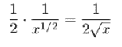 |
| --- |

| 我们可以将那个导数公式编码成如下表达式：

```
_function_bindings = {
    ...
    "sqrt": math.sqrt
}

_derivatives = {
    ...
    "sqrt": Quotient(Number(1), Product(Number(2), Apply(Function("sqrt"), _var)))
}
```

|

## 10.6 符号积分函数

在前两章中，我们学习过的另一种微积分运算是积分。虽然导数接受一个函数并返回描述其变化率的函数，但积分则相反−它从其变化率重建一个函数。

### 10.6.1 积分作为原函数

例如，当 *y* = *x*² 时，导数告诉我们 *y* 相对于 *x* 的瞬时变化率是 2*x*。如果我们从 2*x* 开始，不定积分回答的问题是：哪个 *x* 的函数的瞬时变化率等于 2*x*？因此，不定积分也被称为 *原函数*。

2*x* 关于 *x* 的不定积分的一个可能答案是 *x*²，但其他可能性还有 *x*² − 6 或 *x*² + *π*。因为任何常数项的导数都是 0，所以不定积分没有唯一的结果。记住，即使你知道整个旅程中汽车的速度表读数，它也不会告诉你汽车是从哪里开始或结束旅程的。因此，我们说 *x*² 是 2*x* 的 *一个* 原函数，但不是 *唯一的* 原函数。

如果我们要谈论 *不定积分* 或 *不定积分*，我们必须添加一个未指定的常数，写成类似 *x*² + *C* 的形式。*C* 被称为积分常数，在微积分课程中有些臭名昭著；它似乎是一个技术性细节，但很重要，如果学生忘记这一点，大多数老师都会扣分。

如果你已经足够练习了导数，一些积分是显而易见的。例如，*x* 关于 cos(*x*) 的积分写成

∫ cos(*x*)*dx*

结果是 sin(*x*) + *C*，因为对于任何常数 *C*，sin(*x*) + *C* 的导数是 cos(*x*)。如果你对幂法则记忆犹新，你可能能够解决这个积分：

∫ 3*x*²*dx*

当你将幂法则应用于 *x*³ 时，得到的表达式是 3*x*²，因此积分是

∫ 3*x*²*dx* = *x*³ + *C*

有些积分比较难，例如

∫ tan(*x*)*dx*

这些没有明显的解。你需要反向调用多个导数规则来找到答案。在微积分课程中，大量的时间都用于解决这类棘手的积分。使情况变得更糟的是，有些积分是*不可能的*。著名的是，函数

*f*(*x*) = *e*^(*x*²)

这是一个无法找到其不定积分公式（至少在没有创造一个新函数来表示它的情况下）的地方。与其让你忍受一大堆积分规则，不如让我展示如何使用一个带有`integrate`函数的预构建库，这样 Python 就可以为你处理积分了。

### 10.6.2 介绍 SymPy 库

SymPy（*Sym* bolic *Py* thon）库是一个开源的 Python 符号数学库。它有自己的表达式数据结构，就像我们构建的那样，以及重载运算符，使它们看起来像普通的 Python 代码。在这里，你可以看到一些看起来像我们一直在编写的 SymPy 代码：

```
>>> from sympy import *
>>> from sympy.core.core import *
>>> Mul(Symbol('y'),Add(3,Symbol('x')))
y*(x + 3)
```

`Mul`、`Symbol`和`Add`构造函数替换了我们的`Product`、`Variable`和`Sum`构造函数，但结果相似。SymPy 还鼓励你使用缩写；例如，

```
>>> y = Symbol('y')
>>> xx = Symbol('x')
>>> y*(3+x)
y*(x + 3)
```

创建了一个等效的表达式数据结构。你可以通过我们的替换和求导能力看到它是一个数据结构：

```
>>> y*(3+x).subs(x,1)
4*y
>>> (x**2).diff(*x*)
2*x
```

当然，SymPy 是一个比我们在本章中构建的库更健壮的库。正如你所见，表达式会自动简化。

我介绍 SymPy 的原因是展示其强大的符号积分功能。你可以这样找到表达式 3*x*²的积分：

```
>>> (3*x**2).integrate(*x*)
x**3
```

这告诉我们，

∫ 3*x*²*dx* = *x*³ + *C*

在接下来的几章中，我们将继续使用导数和积分。

### 10.6.3 练习

| **练习 10.22**：*f*(*x*) = 0 的积分是什么？用 SymPy 确认你的答案，记住 SymPy 不会自动包含积分常数。**解答**：另一种问这个问题的方式是询问什么函数的导数是零？任何常数值函数在所有地方都有一个零斜率，因此它有一个零导数。积分是∫ *f*(*x*)*dx* = ∫ *dx* = *C*在 SymPy 中，代码`Integer(0)`给你一个作为表达式的数字 0，所以对变量*x*的积分是

```
>>> Integer(0).integrate(*x*)
0
```

零作为一个函数，是零的一个反导数。加上积分常数，我们得到 0 + *C*或者就是*C*，这与我们得出的结果相符。任何常数函数都是常数零函数的反导数。|

| **练习 10.23**：*x* cos(*x*)的积分是什么？**提示**：看看*x* sin(*x*)的导数。用 SymPy 确认你的答案。 |
| --- |

| **解答**：让我们从提示开始−根据乘积法则，*x* sin(*x*) 的导数是 sin(*x*) + *x* cos(*x*)。这几乎是我们想要的，但多了一个 sin(*x*) 项。如果我们有一个出现在导数中的 −sin(*x*) 项，它就会抵消这个额外的 sin(*x*)，而 cos(*x*) 的导数是 −sin(*x*)。也就是说，*x* sin(*x*) + cos(*x*) 的导数是 sin(*x*) + *x* cos(*x*) − sin(*x*) = *x* cos(*x*)。这是我们想要的结果，所以积分是∫ *x* cos(*x*)*d*x* = *x* sin(*x*) + cos(*x*) + *C*。我们的答案在 SymPy 中得到了验证：

```
>>> (x*cos(*x*)).integrate(*x*)
x*sin(*x*) + cos(*x*)
```

这种将导数作为乘积的一个项进行逆向工程的方法被称为*分部积分*，并且是所有微积分教师的喜爱技巧。|

| **练习 10.24**：*x*² 的积分是什么？用 SymPy 验证你的答案。**解答**：如果 *f*(*x*) = *x*²，那么 *f*(*x*) 可能包含 *x*³，因为幂律将幂次降低一个。*x*³ 的导数是 3*x*²，所以我们想要一个函数，它给出这个结果的三分之一。我们想要的是 *x*³/3，它的导数是 *x*²。换句话说，∫ *x*²*d*x* = *x*³/3 + *C*。SymPy 验证了这一点：

```
>>> (x**2).integrate(x)
x**3/3
```

|

## 摘要

+   将代数表达式建模为数据结构而不是代码字符串，让你能够编写程序来回答更多关于这些表达式的问题。

+   在代码中建模代数表达式最自然的方式是将其视为一个*树*。树的节点可以分为元素（变量和数字）这些是独立的表达式，以及组合器（和、积等）这些包含两个或更多子表达式的组合。

+   通过递归遍历表达式树，你可以回答关于它的问题，例如它包含哪些变量。你也可以评估或简化表达式，或者将其翻译成另一种语言。

+   如果你知道定义函数的表达式，你可以应用一些规则来将其转换成函数导数的表达式。其中包含乘积法则和链式法则，它们告诉你如何对表达式的乘积和函数的复合求导。

+   如果你为你的 Python 表达式树中的每个组合器编程相应的导数规则，你将得到一个 Python 函数，它可以自动找到导数的表达式。

+   SymPy 是一个强大的 Python 库，用于在 Python 代码中处理代数表达式。它具有内置的简化、替换和导数函数。它还有一个符号积分函数，可以告诉你函数不定积分的公式。
