# 11 模拟力场

本章涵盖

+   使用标量和矢量场建模像重力这样的力

+   使用梯度计算力矢量

+   在 Python 中计算函数的梯度

+   为小行星游戏添加引力

+   在高维空间中计算梯度场和操作矢量场

在我们的小行星游戏宇宙中刚刚发生了一场灾难性事件：屏幕中央出现了一个黑洞！由于这个新物体（如图 11.1 所示）的出现，飞船和所有的小行星都将感受到“引力吸引”向屏幕中央。这使得游戏更具挑战性，同时也给我们带来了一个新的数学挑战−理解 *力场*。

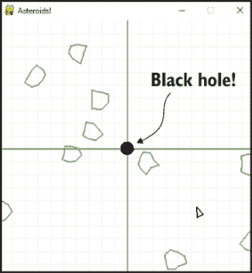

图 11.1 哎呀，黑洞！

重力是距离作用力的熟悉例子，这意味着你不需要接触一个物体就能感受到它的引力。例如，当你乘坐飞机时，你仍然可以正常行走，因为即使在

30,000 英尺的高度，地球正在向下拉着你。磁力和静电是其他熟悉的距离作用力。在物理学中，我们想象这些力的来源，如磁铁或静电充气的气球，在它们周围产生一个看不见的力场。在任何地球引力场（称为引力场）中的任何地方，一个物体都会感受到向地球的拉力。

本章的核心编码挑战是为小行星游戏添加引力场，一旦完成这个任务，我们将更普遍地介绍数学。具体来说，力场是用称为矢量场的数学函数建模的。矢量场通常作为微积分运算（称为 *梯度*）的输出，而梯度是我们在第三部分中涵盖的机器学习示例中的关键工具。

本章中的数学和代码并不特别难，但有很多新的概念需要熟悉。因此，在深入探讨之前，我想先展示本章的故事线。

## 11.1 使用矢量场建模重力

一个 *矢量场* 是在空间中的每一个点分配一个矢量。一个 *引力场* 是一个矢量场，它告诉我们从任何给定点引力有多强以及引力方向是什么。你可以通过选择一些点并从每个点开始绘制分配给该点的矢量作为箭头来可视化矢量场。例如，我们小行星游戏中由黑洞产生的引力场可能看起来像图 11.2。

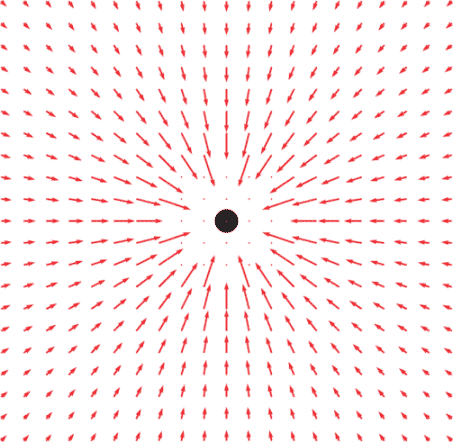

图 11.2 在我们的小行星游戏中描绘由黑洞产生的引力场

图 11.2 与我们关于引力的直觉一致；围绕黑洞的所有箭头都指向黑洞，因此任何放置在这个区域的物体都会感受到被黑洞吸引。靠近黑洞的地方，它的引力更强，因此箭头更长。

本章的第一件事是将引力场建模为函数，通过空间中的一个点来告诉我们物体在该点会感受到的力的强度和方向。在 Python 中，一个二维矢量场是一个函数，它接受一个表示点的二维矢量，并返回一个在该点的二维矢量，即该点的力。

一旦我们构建了这个函数，我们就用它来为我们的小行星游戏添加引力场。它将告诉我们宇宙飞船和小行星在它们的位置上感受到的引力，因此，它们的加速度速率和方向应该是什么。一旦我们实现了加速度，我们将在小行星游戏中看到物体向黑洞加速。

### 11.1.1 使用势能函数建模引力

在建模引力场之后，我们将探讨第二个等效的心理模型，即称为*势能*的远程力。你可以将势能视为储存的能量，准备转换为运动。例如，一开始弓箭没有势能，但是当你拉弓时，它就获得了势能。当弓被释放时，这种能量就转换为运动（图 11.3）。

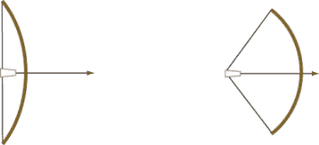

图 11.3 左边，弓没有势能。右边，它具有大量的势能，准备用来使箭运动。

你可以想象将宇宙飞船从黑洞拉远就像拉回一个想象中的弓箭。你将宇宙飞船拉得越远，它就具有越多的势能，释放后它最终的速度就越快。我们将势能建模为另一个 Python 函数，它接受游戏世界中物体的二维位置矢量，并返回该点势能的数值。将数值（而不是矢量）分配给空间中的每个点称为*标量场*。

使用势能函数，我们将使用几个 Matplotlib 可视化来查看其外观。一个重要的例子是称为*热图*，它使用深浅不同的颜色来显示标量场在二维空间中的值如何变化（图 11.4）。

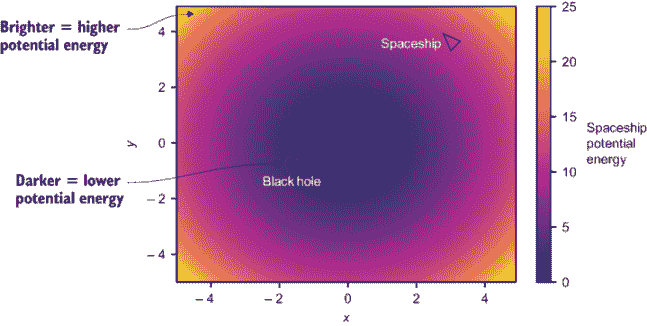

图 11.4 使用较亮的颜色表示较高势能值的热图

如图 11.4 所示，在这个热力图上，你离黑洞越远，颜色越亮，这意味着势能越大。表示势能的标量场与表示引力场的矢量场是不同的数学模型，但它们代表相同的物理现象。它们还通过称为“梯度”的运算在数学上相互关联。

标量场的梯度是一个矢量场，它告诉我们标量场中最大增加的方向和大小。在我们的例子中，势能随着你远离黑洞而增加，因此势能的梯度是一个在每个点上指向外部的矢量场。将梯度矢量场叠加在势能热力图上，图 11.5 显示箭头指向势能增加的方向。

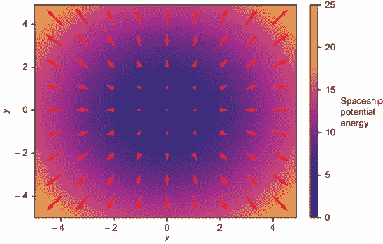

图 11.5 展示了势能函数作为热力图绘制，其梯度，一个矢量场，叠加在上面。梯度指向势能增加的方向。

图 11.5 中的梯度矢量场看起来类似于黑洞的引力场，但箭头指向相反的方向，大小相反。要从势能函数中获得引力场，我们需要取梯度，然后通过添加负号来反转力场矢量的方向。在本章结束时，我将向您展示如何使用导数来计算标量场的梯度，这使我们能够从重力的势能模型切换到力场模型。

既然你对本章的内容有了大致的了解，我们就准备深入研究了。我们将首先更仔细地研究矢量场，并看看如何将它们转换为 Python 函数。

## 11.2 建模引力场

矢量场是对空间中每个点分配一个矢量，例如，在我们的小行星游戏中，每个位置的引力力矢量。我们将专门研究二维矢量场，它将二维矢量分配给二维空间中的每个点。我们将首先

我们要做的是构建矢量场的具体表示，作为 Python 函数，它接受二维矢量作为输入，并返回二维矢量作为输出。我在源代码中提供了一个函数`plot_vector_field`，它接受这样的函数作为参数，并通过在二维的大量输入点上绘制输出矢量来绘制它的图像。

然后，我们将编写代码将黑洞添加到我们的小行星游戏中。对我们来说，黑洞只是一个黑色圆圈，它对周围的物体施加吸引力，如图 11.6 所示。

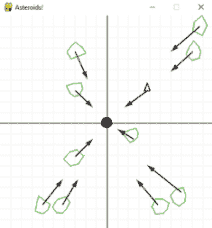

图 11.6 显示，在我们的小行星游戏中，黑洞是一个黑色圆圈，游戏中的每个物体都感受到向它施加的引力。

要使这起作用，我们实现一个 `BlackHole` 类，定义其相应的引力场为一个函数，然后更新我们的游戏循环，使太空船和小行星根据牛顿定律对力做出反应。

### 11.2.1 定义向量场

让我们简要介绍一些向量场的基本符号。二维平面上的向量场是一个函数 **F**(*x*, *y*)，它接受由其两个坐标 *x* 和 *y* 表示的向量。它返回另一个二维向量，这是向量场在点 (*x*, *y*) 处的值。粗体 **F** 表示其返回值是向量，我们可以说 **F** 是一个向量值函数。当我们谈论向量场时，我们通常将输入解释为平面上的点，将输出解释为箭头。图 11.7 显示了向量场 **F**(*x*, *y*) = (−2*y*, *x*) 的示意图。

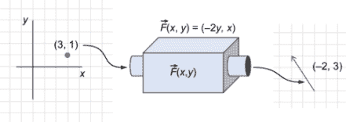

图 11.7 向量场 F(*x, y*) = (−2y, x) 以点 (3, 1) 为输入，并产生输出箭头 (−2, 3)。

通常，我们将输出向量绘制为从平面上的输入向量点开始的箭头，这样输出向量就“附加”到输入点上（图 11.8）。

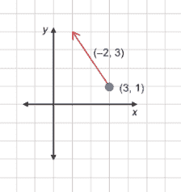

图 11.8 将向量 (−2, 3) 附加到点 (3, 1)

如果你计算 **F** 的几个值，你可以通过同时绘制多个附加到点的箭头来开始想象向量场。图 11.9 显示了三个额外的点 (−2, 2)，(−1, −2)，和 (−1, −2)，它们各自附加了表示 **F** 在这些点上的值的箭头。结果分别是 (−4, −2)，(4, −1)，和 (4, 3)。

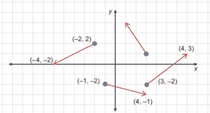

图 11.9 将箭头附加到点，表示向量场 F(*x, y*) = (−2y, x) 的更多值

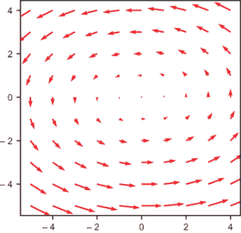

图 11.10 以向量形式绘制 F(*x, y*)，这些向量从由 Matplotlib 生成的 (*x, y*) 点发散出来

如果我们画很多箭头，它们开始重叠，图变得难以辨认。为了避免这种情况，我们通常通过一个常数因子缩小向量的长度。我在 Matplotlib 上包含了一个名为 `plot_vector_field` 的包装函数，你可以按照以下方式使用它来生成向量场的可视化。你可以看到向量场 **F**(*x*, *y*) 以逆时针方向围绕原点循环（图 11.10）：

```
def f(x,y):
    return (−2*y, x)

plot_vector_field(f, −5,5,−5,5)     ❶
```

❶ 第一个参数是向量场；下一个参数是绘图的范围 *x* 界限，然后是 y 界限。

物理学的一个重大思想是某些类型的力如何通过向量场建模。我们接下来要关注的例子是重力的一种简化模型。

### 11.2.2 定义简单的力场

如您所预期，随着您靠近它们的来源，引力会变得更强。尽管太阳的引力比地球强，但您离地球更近，所以您只感觉到地球的引力。为了简化，我们不会使用真实的引力场。相反，我们将使用向量场 **F**(**r**) = −**r**，在平面上的表示为 **F**(*x*, *y*) = (−*x*, − *y*)。以下是它在代码中的样子，图 11.11 显示了它在图上的样子：

```
def f(x,y):
    return (−x,-y)

plot_vector_field(f,−5,5,−5,5)
```

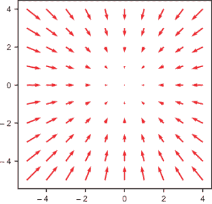

图 11.11 向量场 F(*x, y*) = (−x, -y) 的可视化

这个向量场就像一个引力场，它在任何地方都指向原点，但它有一个优点，即随着距离的增加，场变得更强。这保证了模拟物体无法达到逃逸速度并完全消失在视野中；任何偏离的物体最终都会到达一个力场足够强大以减慢其速度并将其拉回原点的点。让我们通过在我们的小行星游戏中实现这个引力场来验证这一点。

## 11.3 在小行星游戏中添加引力

我们游戏中的黑洞是一个具有 20 个等距顶点的 `PolygonModel` 对象，因此它将大致呈圆形。我们通过一个数字指定黑洞的引力强度，我们将称之为其引力。这个数字传递给了黑洞的构造函数：

```
class BlackHole(PolygonModel):
    def __init__(self,gravity):
        vs = [vectors.to_cartesian((0.5, 2 * pi * i / 20))
                for i in range(0,20)]                     ❶
        super().__init__(vs)
        self.gravity = gravity #<2>
```

❶ 定义 BlackHole 的顶点为 PolygonModel

注意，我们的 `BlackHole` 中的 20 个顶点都位于原点 0.5 个单位距离处，角度均匀分布，因此黑洞看起来大致呈圆形。添加以下行

```
black_hole = BlackHole(0.1)
```

创建了一个 `BlackHole` 对象，其 `gravity` 值为 `0.1`，默认情况下位于原点。为了使黑洞出现在屏幕上（图 11.12），我们需要用以下方式绘制它：

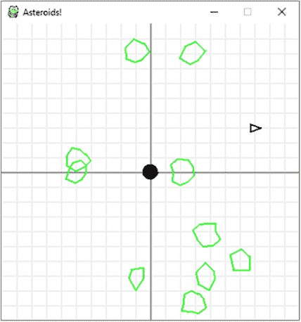

图 11.12 使黑洞出现在我们的游戏屏幕中心

游戏循环的每次迭代。在下面的内容中，我向 `draw_poly` 函数添加了一个 `fill` 关键字参数来填充黑洞，使其（适当地）变黑：

```
draw_poly(screen, black_hole, fill=True)
```

我们的黑洞产生的引力场灵感来源于向量场 **F**(*x*, *y*) = (−*x*, − *y*)，它指向原点。如果黑洞位于 (*x[bh]*, *y[bh]*)，则向量场 **g**(*x*, *y*) = (*x[bh]* − *x*, *y[bh]* − *y*) 指向从 (*x*, *y*) 到 (*x[bh]*, *y[bh]*) 的方向。这意味着，如果将箭头附着在点 (*x*, *y*) 上，它将指向黑洞的中心。为了使力场的强度与黑洞的引力成正比，我们可以将向量场的向量乘以引力值：

```
def gravitational_field(source, x, y):
    relative_position = (*x* − source.x, y − source.y)
    return vectors.scale(− source.gravity, relative_position)
```

在这个函数中，`source` 是一个 `BlackHole` 对象，其 `x` 和 `y` 属性表示其中心作为一个 `PolygonModel`，而其 `gravity` 属性是在其构造函数中传递给它的值。用数学符号表示的等效力场可以写成这样：

***g***(*x*, *y*) = *G[bh]* ·(*x* − *x[bh]*, *y* − *y[bh]*)

这里，*Gbh* 代表黑洞的虚构 `gravity` 属性，而 (*x[bh]*, *y[bh]*)，再次，代表其位置。下一步是使用这个重力场来决定物体应该如何移动。

### 11.3.1 使游戏对象感受到重力

如果这个矢量场像重力场一样工作，它告诉我们位于 (*x*, *y*) 位置的单位质量物体上的力。换句话说，质量为 *m* 的物体上的力将是 **F**(*x*, *y*) = *m* · **g**(*x*, *y*)。如果这是物体感受到的唯一力，我们可以使用牛顿第二定律来计算其加速度：

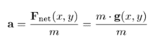

这个加速度的最后一个表达式在分子和分母中都有质量 *m*，所以它们相互抵消。结果发现，重力场矢量等于由重力引起的加速度矢量——它与物体的质量无关。这个计算对于真实重力场同样适用，这就是为什么在地球表面附近，不同质量的物体都以大约每秒 9.81 米的相同速率下落。在游戏循环的一次迭代中，考虑经过的时间 Δ*t*，宇宙飞船或小行星的速度变化由其 (*x*, *y*) 位置决定：

Δ*v* = *a* · Δ*t* = *g*(*x*, *y*) · Δt

我们需要在游戏循环的每次迭代中添加一些代码来更新宇宙飞船以及每个小行星的速度。关于如何组织我们的代码，有几个选择，而我将选择将所有物理封装到 `PolygonModel` 对象的 `move` 方法中。你可能也记得，我们不是让物体飞离屏幕，而是将它们传送到另一边。我在这里做的另一个小改动是添加一个全局 `bounce` 标志，表示物体是传送还是简单地从屏幕边缘弹回。我这样做是因为如果物体传送，它们会立即感受到不同的重力场；如果它们弹回，我们得到更直观的物理现象。下面是新的 `move` 方法：

```
def move(self, milliseconds, 
         thrust_vector, gravity_source):             ❶
    tx, ty = thrust_vector
    gx, gy = gravitational_field(src, self.x, self.y)
    ax = tx + gx                                     ❷
    ay = ty + gy
    self.vx += ax * milliseconds/1000                ❸
    self.vy += ay * milliseconds/1000

    self.x += self.vx * milliseconds / 1000.0        ❹
    self.y += self.vy * milliseconds / 1000.0

    if bounce:                                       ❺
        if self.x < −10 or self.x > 10:
            self.vx = − self.vx
        if self.y < −10 or self.y > 10:
            self.vy = − self.vy
    else:                                            ❻
        if self.x < −10:
            self.x += 20
        if self.y < −10:
            self.y += 20
        if self.x > 10:
            self.x -= 20
        if self.y > 10:
            self.y -=20
```

❶ 将推力矢量（可以是 (0,0)）和重力源（黑洞）作为参数传递给移动方法

❷ 这里，合力是推力矢量和重力矢量的和。假设质量 = 1，加速度是推力和重力场的和。

❸ 如前所述更新速度，使用 Δv = a*Δt

❹ 如前所述更新位置矢量，使用 Δs = v*Δt

❺ 如果全局反弹标志为真，则在物体即将离开屏幕的左侧或右侧时翻转速度的 *x* 分量，或者在物体即将通过顶部或底部离开屏幕时翻转速度的 *y* 分量

❻ 否则，当物体即将离开屏幕时，使用之前相同的传送效果

剩下的工作是在游戏循环中调用太空船的 `move` 方法以及每个小行星：

```
while not done:
    ...
    for ast in asteroids:
        ast.move(milliseconds, (0,0), black_hole)                        ❶

    thrust_vector = (0,0)                                                ❷

    if keys[pygame.K_UP]:                                                ❸
        thrust_vector=vectors.to_cartesian((thrust, ship.rotation_angle))

    elif keys[pygame.K_DOWN]:
        thrust_vector=vectors.to_cartesian((−thrust, ship.rotation_angle))

    ship.move(milliseconds, thrust_vector, black_hole)                   ❹
```

❶ 对于每个小行星，使用推力向量为 0 调用其 move 方法

❷ 船的推力矢量默认也是 (0,0)。

❸ 如果按下上箭头或下箭头，则使用太空船的方向和固定的推力标量值计算 thrust_vector

❹ 调用太空船的 move 方法使其移动

运行游戏后，你会看到物体开始被黑洞吸引，并且从零速度开始，太空船直接掉入其中！图 11.13 显示了飞船加速的延时照片。

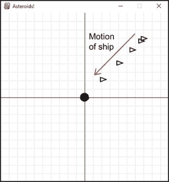

图 11.13 在没有初始速度的情况下，太空船掉入黑洞。

在任何其他起始速度和没有推力的情况下，太空船开始围绕黑洞轨道运动，描绘出椭圆或拉长的圆形状（图 11.14）。

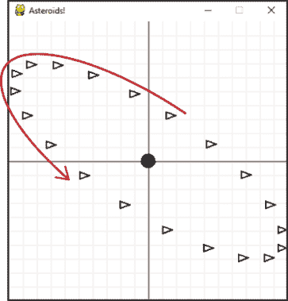

图 11.14 在与黑洞垂直的初始速度下，太空船开始椭圆轨道运动。

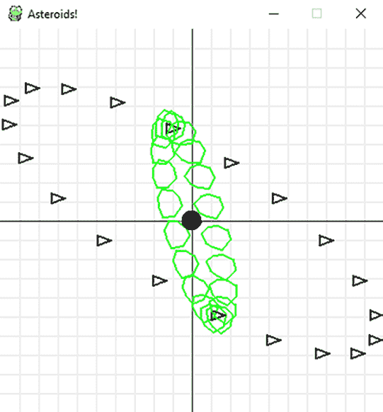

图 11.15 在我们的黑洞周围另一个椭圆轨道上的小行星

结果表明，任何只感受到黑洞引力的物体要么直接掉入黑洞，要么进入椭圆轨道。图 11.15 显示了一个随机初始化的小行星和太空船。你可以看到它的轨迹是一个不同的椭圆。

你可以尝试将所有的小行星重新添加进来。你会发现，随着 11 个同时加速的物体，游戏变得更有趣了！

### 11.3.2 练习

| **练习 11.1**: 向量场 (−2 − *x*, 4 − *y*) 中的所有向量都指向哪里？绘制向量场以确认你的答案。**解答**: 这个向量场与位移向量 (−2, 4) − (*x*, *y*) 相同，这是一个从点 (*x*, *y*) 指向 (−2, 4) 的向量。因此，我们预计这个向量场中的每个向量都指向 (−2, 4)。绘制这个向量场可以确认这一点。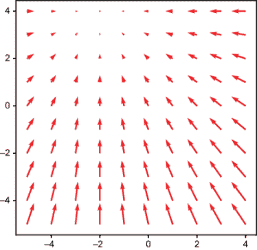 |
| --- |
| **练习 11.2-迷你项目**：假设我们有两个黑洞，它们的引力均为 0.1，分别位于（-3，4）和（2，1）。引力场分别为**g**1(*x*, *y*) = 0.1 · (−3 − *x*, 4 − *y*)和**g**2(*x*, *y*) = 0.1 · (2 − *x*, 1 − *y*)。计算由这两个黑洞产生的总引力场**g**(*x*, *y*)的公式。它是否等同于一个黑洞？如果是，为什么？**解答**：在每一个位置(*x*, *y*)，一个质量为*m*的物体感受到两个引力：*m* · **g**1(*x*, *y*)和*m* · **g**2(*x*, *y*)。这些力的矢量之和是*m*(**g**1(*x*, *y*) + **g**2(*x*, *y*))。按单位质量计算，感受到的力将是**g**1(*x*, *y*) + **g**2(*x*, *y*)，这证实了总引力场矢量是每个黑洞产生的引力场矢量的和。这个总引力场是*g*(*x*, *y*) = *g*1 + *g*2            = 0.1 · (−3 − *x*, 4 − *y*) + 0.1 · (2 − *x*, 1 − *y*)我们可以除以一个因子 2，并重写为*g*(*x*, *y*) = 0.1 · 2 · (0.5 − *x*, 2.5 − *y*)            = 0.2 · (0.5 − *x*, 2.5 − *y*)这与一个位于(0.5, 2.5)且引力为 0.2 的单个黑洞相同。 |

| **练习 11.3-迷你项目**：在彗星游戏中，添加两个黑洞，并允许它们感受到彼此的引力。然后移动，同时这两个黑洞也对彗星和宇宙飞船施加引力。**解答**：为了完整实现，请参阅源代码。关键的增加是在游戏循环的每次迭代中调用每个黑洞的`move`方法，并传递给它所有其他黑洞作为引力源的黑名单：

```
for bh in black_holes:
    others = [other for other in black_holes if other != bh]
    bh.move(milliseconds, (0,0), others)
```

|

## 11.4 引入势能

现在我们已经看到了宇宙飞船和彗星在我们引力场中的行为，我们可以使用*势能*来构建它们行为的第二个模型。我们已经在彗星游戏中使用了黑洞，所以本章剩余部分的目的在于拓宽你对底层数学的视野。矢量场，包括引力场，通常作为微积分运算梯度（在本书的剩余章节中是一个关键工具）的结果出现。

基本思想如下：我们不是将重力想象成在每个点上的力矢量，将物体拉向源头，而是可以将处于引力场中的物体想象成在碗边滚动的弹珠。弹珠可能会来回滚动，但它们在滚动远离碗边时，总是会“被拉回”碗底。势能函数本质上定义了这个碗的形状。你可以在图 11.16 的中心图像中预览这个碗的形状。

我们将势能写成函数的形式，它接受一个点(*x*, *y*)并返回一个单一的数值，代表该点的重力势能。从碗的类比来说，这就像是在某个特定点的碗的高度。一旦我们在 Python 中实现了势能函数，我们可以用三种方式来可视化它：作为热图，这是你在本章开头看到的；作为 3D 图表；以及如图 11.16 所示的等高线图。

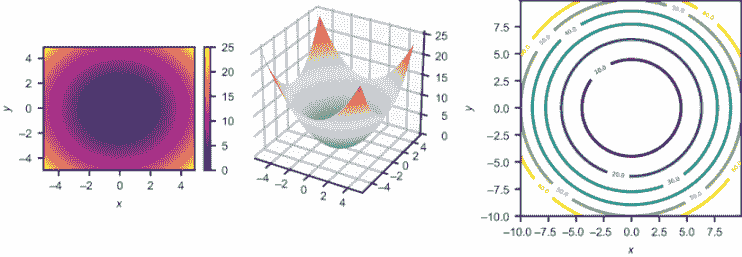

图 11.16 标量场的三个图像：热图、图表和等高线图

这些可视化将帮助我们想象本章最后部分以及本书剩余章节中的势能函数。

### 11.4.1 定义势能标量场

就像场一样，我们可以将标量场视为一个函数，它接受(*x*, *y*)点作为输入。然而，这个函数的输出是标量，而不是向量。例如，让我们考虑函数*U*(*x*, *y*) = ½(*x*² + *y*²)，它定义了一个标量场。图 11.17 显示，你可以插入一个二维向量，输出是由*U*(*x*, *y*)的公式确定的某个标量。

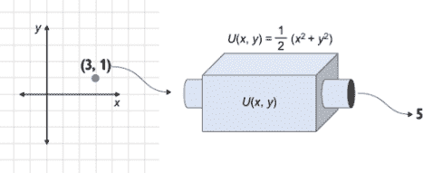

图 11.17 作为函数，标量场将平面上的一个点映射为一个相应的数值。在这种情况下，(*x, y*) = (3, 1)，*U*(*x, y*)的值为½ · (32 + 12) = 5。

函数*U*(*x*, *y*)实际上是与矢量场**F**(*x*, *y*) = (−*x*, − *y*)相对应的势能函数。我需要做一些额外的工作来从数学上解释这一点，但我们可以通过想象标量场*U*(*x*, *y*)来从定性上确认它。

想象*U*(*x*, *y*)的一种方法是通过绘制一个类似于图 11.18 的 3D 图表，其中*U*(*x*, *y*)是(*x*, *y*, *z*)点的表面，其中*z* = *U*(*x*, *y*)。例如，*U*(3, 1) = 5，因此我们会在 x,y 平面上点(3, 1)的上方绘制一个 z 坐标为 5 的点。

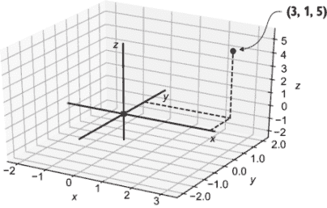

图 11.18 要绘制*U*(*x, y*) = ½(x² + y²)的一个点，使用(*x, y*) = (3, 1)，然后使用*U*(3, 1) = 5 作为 z 坐标。

对于每个(*x*, *y*)的值绘制一个 3D 点，我们可以得到一个表示标量场*U*(*x*, *y*)及其在平面上变化的整个表面。在源代码中，你会找到一个名为`plot_scalar_field`的函数，它接受定义标量场的函数以及*x*和*y*的界限，并绘制代表该场的 3D 点表面：

```
def u(x,y):
    return 0.5 * (x**2 + y**2)

plot_scalar_field(u, −5, 5, −5, 5)
```

尽管有几种方法可以可视化标量场，但我将参考图 11.19 中所示的*U*(*x*, *y*)函数的图表。

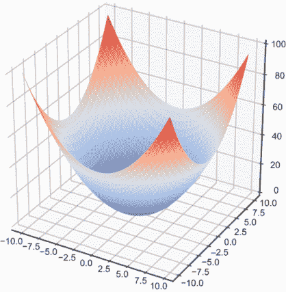

图 11.19 势能标量场*U*(*x*, *y*) = ½(x² + y²)的图表

这就是之前类比中的“碗”。结果证明，这个势能函数给出的重力模型与矢量场 **F**(*x*, *y*)= (−*x*, − *y*) 相同。我们将在第 11.5 节中详细解释为什么是这样，但到目前为止，我们可以确认势能随着从原点（0, 0）的距离增加而增加。在所有径向方向上，图形的高度增加，意味着 *U* 的值增加。

### 11.4.2 将标量场绘制为热图

另一种表示标量函数的方法是绘制热图。我们不是使用 *z* 坐标来可视化 *U*(*x*, *y*) 的值，而是可以使用颜色方案。这允许我们在二维空间内绘制标量场。通过在旁边包含一个颜色图例（如图 11.20 所示），我们可以从图上该点的颜色中看到 (*x*, *y*) 处的大致标量值。

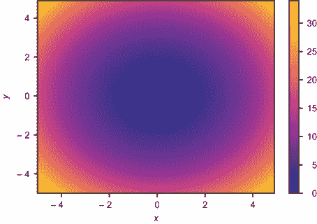

图 11.20 函数 *U*(*x, y*) 的热图

在图 11.20 的中心，靠近 (0, 0) 的地方，颜色较暗，意味着 *U*(*x*, *y*) 的值较低。向边缘移动时，颜色较浅，意味着 *U*(*x*, *y*) 的值较高。你可以使用源代码中找到的 `scalar_field_heatmap` 函数来绘制势能函数。

### 11.4.3 将标量场绘制为等高线图

与热图类似的是 *等高线图*。你可能之前见过等高线图，它是地形图的格式，一种显示地理区域内地形高程的地图。这类地图由高程恒定的路径组成，所以如果你沿着地图上显示的路径行走，你既不上坡也不下坡。图 11.21 显示了 *U*(*x*, *y*) 的类似等高线图，显示了 *x*,*y* 平面上的路径，其中 *U*(*x*, *y*) 等于 10, 20, 30, 40, 50 和 60。

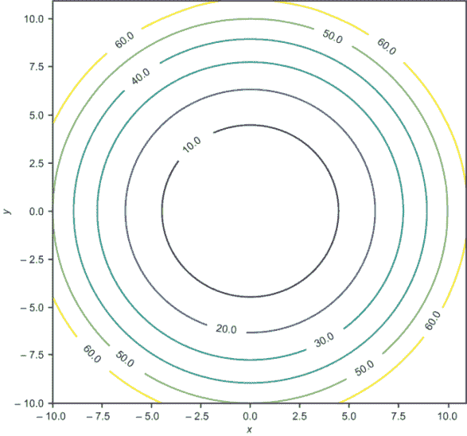

图 11.21 *U*(*x, y*) 的等高线图，显示了 *U*(*x, y*) 值恒定的曲线

你可以看到曲线都是圆形的，并且随着向外延伸而彼此靠得更近。我们可以解释这一点意味着 *U*(*x*, *y*) 随着我们离原点越来越远而变得更加陡峭。例如，*U*(*x*, *y*) 在较短的距离上从 30 增加到 40，而增加从 10 到 20 的距离更长。你可以使用源代码中的 `scalar_field_contour` 函数将标量场 *U* 绘制为等高线图。

## 11.5 使用梯度将能量和力联系起来

这个关于 *陡峭度* 的概念很重要——势能函数的陡峭度告诉我们物体在某个方向上移动需要施加多少能量。正如你所期望的，在给定方向上移动所需的努力是 *相反方向* 力的量度。在本节的剩余部分，我们将得到这个陈述的精确和定量版本。

正如我在本章引言中提到的，梯度是一个操作，它将标量场（如势能）转换为向量场（如引力场）。在平面上每个位置(*x*, *y*)，该位置的梯度向量场指向标量场最快增加的方向。在本节中，我将向您展示如何取标量场*U*(x, *y*)的梯度，这需要分别对*U*关于*x*和*y*求导。我们将能够证明我们一直在使用的势能函数*U*(x, *y*)的梯度是-**F**(*x*, *y*)，其中**F**(*x*, *y*)是我们在我们的小行星游戏中实现的引力场。我们将在本书的剩余章节中广泛使用梯度。

### 11.5.1 使用横截面测量陡度

有一种可视化函数*U*(x, *y*)的方法，可以让我们很容易地看到它在各个点的陡度。让我们关注一个特定的点：（*x*, *y*) = (-5, 2)。在一个像图 11.22 中显示的等高线图上，这个点位于*U* = 10 和*U* = 20 曲线之间，实际上，*U*(-5, 2) = 14.5。如果我们沿+*x*方向移动，我们会碰到*U* = 10 曲线，这意味着*U*在+*x*方向上减小。如果我们相反地沿+*y*方向移动，我们会碰到*U* = 20 曲线，这意味着*U*在这个方向上增加。

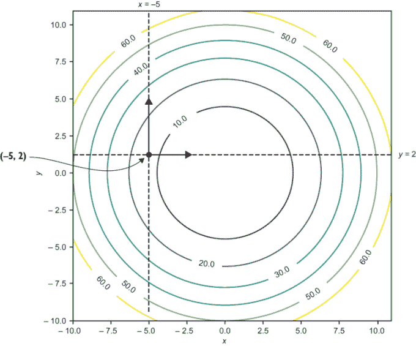

图 11.22 从（-5，2）在+x 和+y 方向上探索*U*(x, y)的值

图 11.22 显示，*U*(x, *y*)的陡度取决于方向。我们可以通过绘制*U*(x, *y*)的横截面来想象这一点，其中*x* = -5 和*y* = 2。*横截面*是*U*(x, *y*)在固定的*x*或*y*值处的图形切片。例如，图 11.23 显示，在*x* = -5 时，*U*(x, *y*)的横截面是*x* = -5 平面上*U*(x, *y*)的切片。

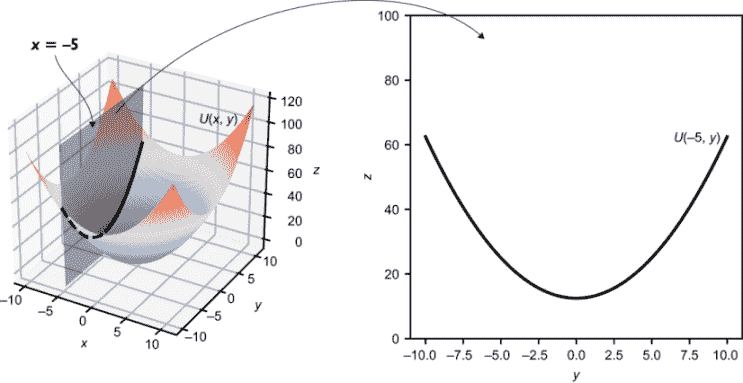

图 11.23 *U*(x, y)在*x* = -5 处的横截面

使用第四章中的函数式编程术语，我们可以将*x* = -5 的*U*部分应用到一个函数上，该函数接受一个单独的数字*y*并返回*U*的值。在(5, 2)处也有一个*y*方向的横截面。这是*y* = 2 的*U*(x, *y*)横截面。图 11.24 显示了使用*y* = 2 部分应用后的*U*(x, *y*)的形状作为图形。

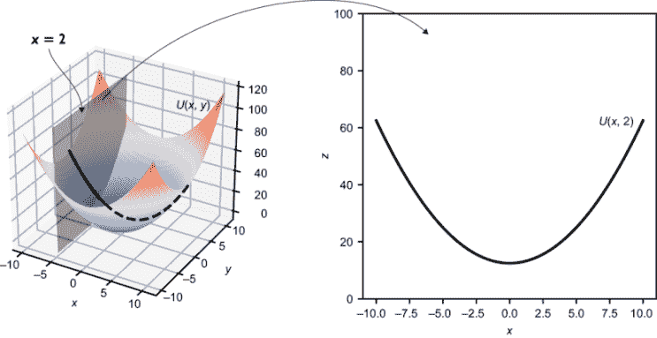

图 11.24 *U*(x, y)在 y = 2 处的横截面

这些横截面一起告诉我们，在（-5，2）处，*U*在*x*和*y*方向上的变化情况。在*x* = -5 时，*U*(x, 2)的斜率为负，这告诉我们从（-5，2）沿+*x*方向移动会使*U*减小。同样，在*y* = 2 时，*U*(−5, *y*)的斜率为正，这告诉我们从（-5，2）沿+*y*方向移动会使*U*增加（图 11.25）。

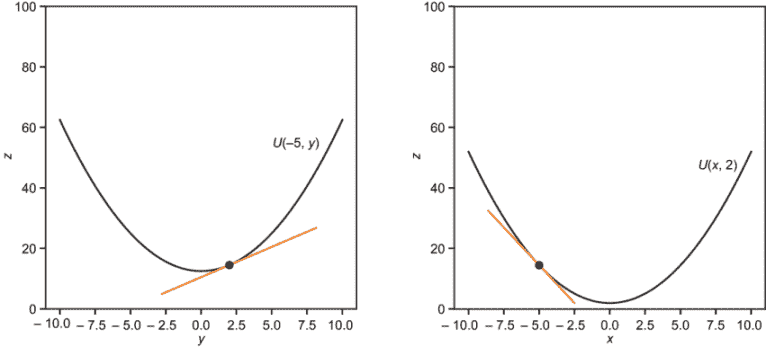

图 11.25 横截面显示，*U*(*x, y*)在+y 方向上增加，在+x 方向上减少。

我们还没有找到标量场*U*(*x*, *y*)在这个点的斜率，但我们已经找到了可以称为*x*方向和*y*方向的斜率。这些值被称为*U*的*偏导数*。

### 11.5.2 计算偏导数

你已经知道找到之前斜率所需的一切。*U*(−5, *y*)和*U*(*x*, 2)都是单变量函数，因此你可以通过计算小割线的斜率来近似它们的导数。

例如，如果我们想在点(−5, 2)处找到*U*(*x*, *y*)关于*x*的偏导数，我们是在询问*U*(*x*, 2)在*x* = −5 处的斜率。也就是说，我们想知道*U*(*x*, *y*)在点(*x*, *y*) = (−5, 2)处*x*方向的改变速度。我们可以通过将一个小的Δ*x*值代入以下斜率计算来近似这个值：

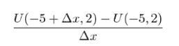

我们也可以通过写出*U*(*x*, 2)的公式来精确计算导数。因为*U*(*x*, *y*) = ½(*x*² + *y*²)，所以*U*(*x*, 2) = ½(*x*² + 2²) = ½(*x*² + 4) = 2 + (*x*²/2)。使用导数的幂规则，*U*(*x*, 2)关于*x*的导数是 0 + 2*x*/2 = *x*。在*x* = −5 时，导数是−5。

注意，在斜率近似和符号导数过程中，变量*y*都没有出现。相反，我们正在处理常数 2。这是可以预料的，因为当我们考虑*x*方向的偏导数时，*y*并没有变化。计算偏导数的通用方法是，将导数视为只有一个符号（如*x*）是变量，而所有其他符号（如*y*）都是常数。

使用这种方法，*U*(*x*, *y*)关于*x*的偏导数是½(2*x* + 0) = *x*，关于*y*的偏导数是½(0 + 2*y*) = *y*。顺便说一下，我们之前用于函数*f*(*x*)导数的记号*f*'(*x*)对于扩展到偏导数是不够的。在求偏导数时，你可以对不同的变量求导，并且需要指定你正在处理的是哪一个。对于*f*'(*x*)的导数，还有一个等效的记号：

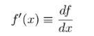

（我使用≡符号来表示这些符号是等价的；它们代表相同的概念。）这让人联想到斜率公式Δf/Δx，但在这个符号中，df 和 dx 代表的是 f 和 x 值的**无穷小**变化。df/dx 表示的含义与 f'(x)相同，但它使得导数是相对于 x 取的这一点更加清晰。对于一个像 U(x, y)这样的函数的偏导数，我们可以相对于 x 或 y 取导数。传统上，使用不同形状的 d 来表示我们不是取一个普通导数（称为全导数）。U 相对于 x 和 y 的偏导数（分别相对于 y）可以写成以下形式：

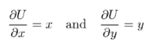

这里还有一个函数 q(x, y) = x sin(xy) + y 的例子。如果我们把 y 看作常数并对 x 求导，我们需要使用乘积规则和链式规则。结果是相对于 x 的偏导数：

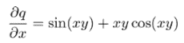

要对 y 求偏导数，我们把 x 看作常数，并需要使用链式规则和加法规则：

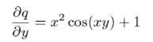

确实，每个偏导数只讲述了函数像 U(x, y)在任意一点如何变化的其中一部分故事。接下来，我们将它们结合起来，以获得全面的理解，类似于单变量函数的全导数。

### 11.5.3 使用梯度找到图形的陡度

让我们放大 U(x, y)图形上的点(−5, 2)（图 11.26）。正如任何光滑函数 f(x)在足够小的 x 值范围内看起来像一条直线一样，结果是一个光滑标量场的图形在 x,y 平面的足够小的邻域内看起来像是一个平面。


图 11.26 从近距离看，U(x, y)在(x, y) = (−5, 2)附近的图形区域看起来像一个平面。

正如导数 df/dx 告诉我们关于在给定点近似 f(x)的线的斜率一样，偏导数∂U/∂x 和∂U/∂y 告诉我们关于在给定点近似 U(x, y)的平面的信息。图 11.26 中的虚线显示了 U(x, y)在此点的 x 和 y 截面。在这个窗口中，它们近似为直线，它们在 x,z 和 y,z 平面上的斜率接近偏导数∂U/∂x 和∂U/∂y。

我还没有证明它，但假设存在一个最佳逼近于 *U*(*x*, *y*) 的平面，且该平面在 (−5, 2) 附近，因为我们无法区分它，我们可以暂时假设图 11.26 中的图形就是那个平面。偏导数告诉我们它在 *x* 和 *y* 方向上的倾斜程度。在一个平面上，实际上有两个更好的方向可以考虑。首先，有一个方向在平面上你可以行走而不会升高或降低高度。换句话说，这就是平面上与 *x*,*y* 平面平行的线。对于在 (−5, 2) 处逼近 *U*(*x*, *y*) 的平面，结果是在方向 (2, 5) 上，如图 11.27 所示。

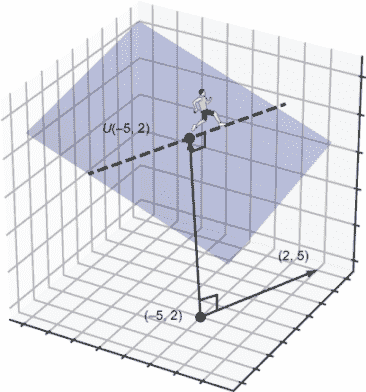

图 11.27 从 (*x, y*) = (−5,2) 沿着 *U*(*x, y*) 的图形在方向 (2,5) 上行走，你不会升高或降低高度。

图 11.27 中的行进者行走起来很轻松，因为他们在这个方向上行走时不会爬升或下降平面。然而，如果行进者向左转 90°，他们就会在可能的最陡方向上上山。这就是方向 (−5, 2)，它与 (2, 5) 垂直。

这个最陡上升的方向恰好是一个向量，其分量是 *U* 在给定点的偏导数。我给出了一幅示意图而不是证明，但这个事实在一般情况下是正确的。对于函数 *U*(*x*, *y*)，其偏导数的向量被称为其 *梯度*，表示为 ∇*U*。它给出了 *U* 在给定点的最陡上升的幅度和方向：

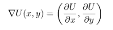

由于我们有偏导数的公式，我们可以知道，例如，对于我们的函数，∇*U*(*x*, *y*) = (*x*, *y*)。函数 ∇*U*，即 *U* 的梯度，是将一个向量分配给平面上每一个点，因此它确实是一个向量场！∇*U* 的图示告诉我们，在每一个点 (*x*, *y*) 上，*U*(*x*, *y*) 的图形上哪个方向是上坡，以及它有多陡（图 11.28）。

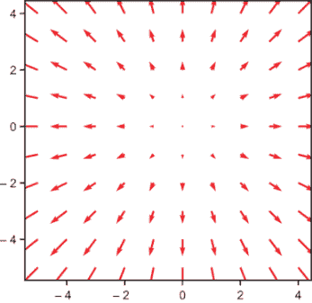

图 11.28 梯度 ∇U 是一个向量场，它告诉我们 U 在任何点 (*x, y*) 的图形上最陡上升的幅度和方向。

梯度是连接标量场和向量场的一种方式。结果，这给出了势能与力之间的联系。

### 11.5.4 使用梯度从势能计算力场

梯度是标量场的普通导数的最佳类比。它包含了找到标量场最陡上升方向、沿 *x* 或 *y* 方向的斜率，或最佳逼近平面的所有必要信息。但从物理学的角度来看，最陡上升的方向并不是我们寻找的。毕竟，自然界中没有物体会自发向上移动。

在小行星游戏中的太空船和在碗边滚动的球都不会感受到推动它们向势能更高的区域移动的力。正如我们之前讨论的，它们需要施加力或牺牲一些动能来获得更多的势能。因此，描述物体感受到的力的正确方式是势能的*负梯度*，它指向最陡的*下降*方向，而不是最陡的*上升*方向。如果 *U*(*x*, *y*) 代表势能的标量场，那么相关的力场 **F**(*x*, *y*) 可以通过以下方式计算：

***F***(*x, y*) = −∇*U*(*x, y*)

让我们尝试一个新例子。以下势能函数会产生什么样的力场？

*V*(*x, y*) = 1 + *y*² − 2*x*² + *x*⁶

通过绘制这个函数，我们可以对其行为有一个大致的了解。

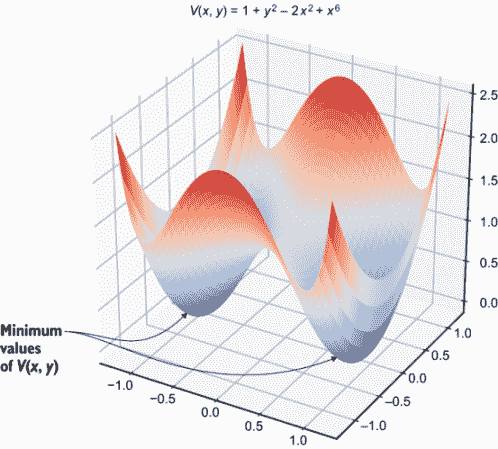

图 11.29 3D 显示的势能函数 V(*x, y*)

图 11.29 说明这个势能函数具有双碗形状，有两个最小值点，它们之间有一个驼峰。与这个势能函数相关的力场看起来是什么样子？为了找出答案，我们需要计算 *V* 的负梯度：

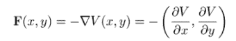

我们可以通过将 *y* 视为一个常数来得到 *V* 对 *x* 的偏导数，因此项 1 和 *y*² 不贡献于结果。结果是 -2*x*² + *x*⁶ 对 *x* 的导数，即 -4*x* + 6*x*⁵。

对于 *V* 对 *y* 的偏导数，我们将 *x* 视为一个常数，因此只有 *y*² 有导数 2*y* 贡献于结果。因此，*V*(*x*, *y*) 的负梯度是

*F*(*x, y*) = −∇*V*(*x, y*) = (4*x* − 6*x*⁵, −2*y*)

通过绘制这个矢量场，图 11.30 显示力场指向势能最低的点。感受到这个力场的物体会将这些点视为施加吸引力的点。

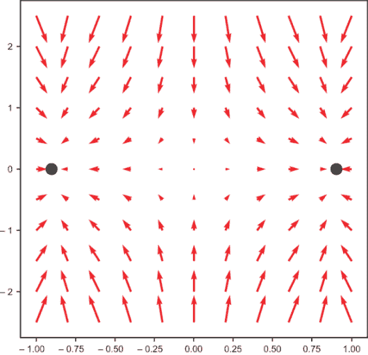

图 11.30 是矢量场 -∇V(*x, y*) 的图，这是与势能函数 V(*x, y*) 相关的力场。这是一种指向图中所示两点的吸引力的力。

势能的负梯度是自然界偏好的方向；它是释放储存能量的方向。物体自然地被推向使它们的势能最小化的状态。梯度是寻找标量场最优值的重要工具，我们将在下一章中看到。具体来说，在这本书的最后一部分，我将向你展示如何通过跟随负梯度寻找最优值来模拟某些机器学习算法中的“学习”过程。

### 11.5.5 练习题

| **练习 11.4**: 绘制函数 *h*(*x*, *y*) = *ey* sin(*x*) 在 *y* = 1 时的横截面。然后绘制 *h*(*x*, *y*) 在 *x* = *π*/6 时的横截面。**解答**：当 *y* = 1 时，*h*(*x*, *y*) 的横截面仅是 *x* 的函数：*h*(*x*, 1) = *e*¹ sin(*x*) = *e* · sin(*x*)，如图所示：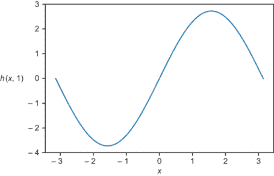。当 *x* = *π*/6 时，*h*(*x*, *y*) 的值仅取决于 *y*。也就是说，*h*(*π*/6, *y*) = *ey* sin(*π*/6) = *ey*/2。图形如下所示：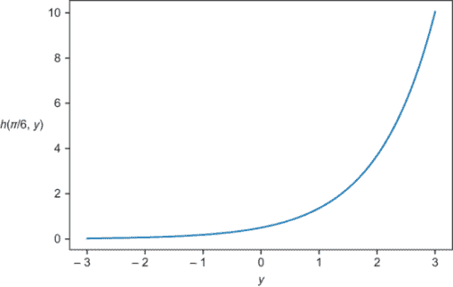 |
| --- |
| **练习 11.5**: 第一个练习中的函数 *h*(*x*, *y*) 的偏导数是什么？梯度是什么？梯度在 (*x*, *y*) = (*π*/6, 1) 处的值是多少？**解答**：求 *ey* sin(*x*) 关于 *x* 的偏导数时，将 *y* 视为常数。因此，*ey* 也被视为常数。结果是！[](../Images/CH11_F30_Orland_UN03_EQ16.png)。同样，通过将 *x* 和 sin(*x*) 视为常数，我们得到关于 *y* 的偏导数：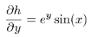。梯度 ∇*h*(*x*, *y*) 是一个向量场，其分量是偏导数：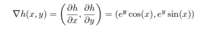。在 (*x*, *y*) = (*π*/6, 1) 处，这个向量场评估如下：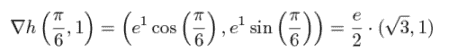。 |
| **练习 11.6**: 证明点 (−5, 2) 与点 (2, 5) 垂直。**解答**：这是对第二章内容的复习。这两个向量是垂直的，因为它们的点积为零：(−5, 2) · (2, 5) = −10 + 10 = 0。 |
| **练习 11.7-迷你项目**：设 *z* = *p*(*x*, *y*) 为在 (−5, 2) 处最佳逼近 *U*(*x*, *y*) 的平面方程。从零开始！找出 *p*(*x*, *y*) 的一个方程以及包含在 *p* 中并通过 (−5, 2) 的直线，该直线平行于 *x*, *y* 平面。这条直线应该与我在上一个练习中提到的向量 (2, 5, 0) 平行。**解答**：记住 *U*(*x*, *y*) 的公式是 ½(*x*² + *y*²)。*U*(−5, 2) 的值是 14.5，所以点 (*x*, *y*, *z*) = (−5, 2, 14.5) 在 3D 中 *U*(*x*, *y*) 的图像上。在我们考虑 *U*(*x*, *y*) 的最佳逼近平面方程之前，让我们回顾一下我们是如何得到函数 *f*(*x*) 的最佳逼近线的。在点 *x*[0] 处最佳逼近函数 *f*(*x*) 的线是通过点 (*x*[0], *f*(*x*[0])) 并具有斜率 *f*'(*x*[0]) 的线。这两个事实确保了 *f*(*x*) 的值和导数与逼近它的线相一致。遵循这个模型，让我们寻找平面 *p*(*x*, *y*)，其值和 *x*, *y* 在 (*x*, *y*) = (−5, 2) 处的偏导数都匹配。这意味着我们必须有 *p*(−5, 2) = 14.5，同时 *∂**p**/*∂**x* = −5 和 *∂**p**/*∂**y* = 2。作为一个平面，*p*(*x*, *y*) 的形式是 *p*(*x*, *y*) = *ax* + *by* + *c*，其中 *a* 和 *b* 是一些数字（你记得为什么吗？）。偏导数是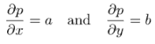。为了使它们匹配，公式必须是 *p*(*x*, *y*) = −5*x* + 2*y* + *c*，为了满足 *p*(−5, 2) = 14.5，必须满足 *c* = −14.5。因此，最佳逼近平面的公式是 *p*(*x*, *y*) = −5*x* + 2*y* − 14.5。现在，让我们寻找平面 *p*(*x*, *y*) 中通过 (−5, 2) 且平行于 *x*, *y* 平面的直线。这是满足 *p*(*x*, *y*) = *p*(−5, 2) 的点集 (*x*, *y*)，这意味着在 (−5, 2) 和 (*x*, *y*) 之间没有高度变化。如果 *p*(*x*, *y*) = *p*(−5, 2)，那么 −5*x* + 2*y* − 14.5 = −5 · −5 + 2 · 2 − 14.5。这简化为一条直线的方程：−5*x* + 2*y* = 29。这条直线等价于向量集 (−5, 2, 14.5) + *r* · (2, 5, 0)，其中 *r* 是一个实数，因此它确实平行于 (2, 5, 0)。 |

## 摘要

+   向量场是一个函数，它既接受向量作为输入，也接受向量作为输出。具体来说，我们将其想象为将箭头向量分配到空间中的每一个点。

+   重力可以通过向量场来模拟。向量场在空间中任何一点的值告诉你物体受到重力作用的大小和方向。

+   要模拟物体在向量场中的运动，你需要使用它的位置来计算它所在位置的力场的强度和方向。反过来，力场的值告诉你物体受到的力，而牛顿第二定律告诉你由此产生的加速度。

+   *势能*是储存的能量，具有产生运动的可能性。一个物体在力场中的势能取决于物体的位置。

+   势能可以被建模为一个标量场：为空间中的每一个点分配一个数值，这个数值代表物体在该点的势能。

+   有几种方式可以在二维中想象标量场：作为一个三维表面，一个热图，一个等高线图，或者一对横截面图。

+   标量场的偏导数给出了场值相对于坐标的变化率。例如，如果 *U*(*x*, *y*) 是二维中的标量场，那么存在关于 *x* 和 *y* 的偏导数。

+   偏导数与标量场的横截面导数相同。你可以通过将其他变量视为常数来计算关于一个变量的偏导数。

+   标量场 *U* 的梯度是一个矢量，其分量是 *U* 对每个坐标的偏导数。梯度指向 *U* 最陡上升的方向，或者 *U* 增加最快的方向。

+   与力场对应的势能函数的负梯度告诉我们该点的力场矢量值。这意味着物体会被推向势能较低的区域。
