# 12 优化物理系统

本章涵盖

+   构建和可视化弹道模拟

+   使用导数寻找函数的最大值和最小值

+   使用参数调整模拟

+   可视化模拟的输入参数空间

+   实现梯度上升以最大化多个变量的函数

在过去几章的大部分时间里，我们一直专注于视频游戏的物理模拟。这是一个有趣且简单的例子，但还有更多重要且有利可图的用途。对于任何像向火星发射火箭、建造桥梁或钻油井这样的重大工程壮举，在尝试之前知道它将安全、成功且在预算范围内是非常重要的。在这些项目中的每一个，都有你想要优化的量。例如，你可能希望最小化火箭的旅行时间，最小化桥梁中混凝土的量或成本，或者最大化油井的产油量。

要了解优化，我们将关注一个简单的例子，即弹道，即从大炮中发射的弹丸。假设弹丸每次从炮管中出来时的速度都相同，发射角度将决定轨迹（图 12.1）。

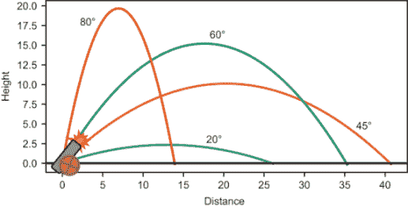

图 12.1 从四个不同发射角度发射弹道的轨迹

如您在图 12.1 中看到的，四个不同的发射角度产生了四个不同的轨迹。在这些轨迹中，45°是使弹道飞得最远的发射角度，而 80°是使弹道飞得最高的角度。这些只是 0 到 90°之间所有可能值中的一部分角度，所以我们不能确定它们是最好的。我们的目标是系统地探索可能的发射角度范围，以确保我们已经找到了优化射程的那个角度。

要做到这一点，我们首先为弹道构建一个模拟器。这个模拟器将是一个 Python 函数，它接受发射角度作为输入，运行欧拉方法（正如我们在第九章所做的那样）来模拟弹道在击中地面之前的每一刻的运动，并输出弹道随时间变化的各个位置列表。从结果中，我们将提取弹道的最终水平位置，这将是着陆位置或射程。将这些步骤组合起来，我们实现了一个函数，该函数接受发射角度并返回该角度下弹道的射程（图 12.2）。

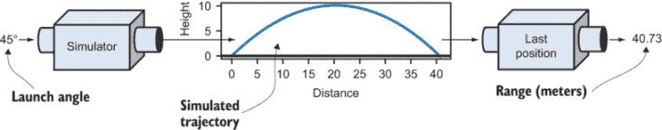

图 12.2 使用模拟器计算弹道射程

一旦我们将所有这些逻辑封装在一个名为 `landing_position` 的单个 Python 函数中，该函数将弹道作为发射角度的函数来计算，我们就可以考虑寻找最大化射程的发射角度的问题。我们可以有两种方法来做这件事：首先，我们绘制射程与发射角度的图表，寻找最大的值（图 12.3）。

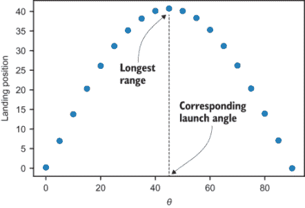

图 12.3 通过观察射程与发射角度的图表，我们可以看到产生最长射程的发射角度的大致值。

我们找到最优发射角度的第二种方式是将我们的模拟器放在一边，找到一个公式来表示发射角度θ作为弹道射程*r*(θ)的函数。这应该会产生与模拟相同的结果，但由于它是一个数学公式，我们可以使用第十章中的规则对其求导。关于发射角度的着陆位置的导数告诉我们，对于发射角度的小幅度增加，我们将获得多少射程的增加。在某个角度，我们可以看到我们得到了递减的回报−增加发射角度会导致射程*减少*，我们将超过最优值。在此之前，*r*(θ)的导数将瞬间为零，导数为零的θ值恰好是最大值。

一旦我们使用这两种优化技术在我们的二维模拟中进行了预热，我们就可以尝试一个更具挑战性的三维模拟，在这个模拟中，我们可以控制大炮的仰角以及发射的方向。如果地形在大炮周围变化，方向会影响炮弹在击中地面之前飞行的距离（图 12.4）。

对于这个例子，让我们构建一个函数*r*(θ, φ)，它接受两个输入角度θ和φ，并输出一个着陆位置。挑战在于找到一对(θ, φ)，以最大化大炮的射程。这个例子让我们涵盖了我们的第三种也是最重要的优化技术：*梯度上升*。

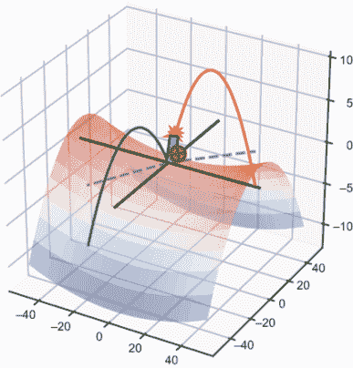

图 12.4 在不均匀的地形上，我们发射大炮的方向可以影响炮弹的射程。

正如我们在上一章所学，点(θ, φ)处函数*r*(θ, φ)的梯度是一个指向使*r*增加最快的方向的向量。我们将编写一个名为`gradient_ascent`的 Python 函数，它接受一个要优化的函数、一对起始输入，并使用梯度找到越来越高的值，直到达到最优值。

优化数学领域非常广泛，我希望能够让你对一些基本技术有一个大致的了解。我们将要使用的所有函数都是光滑的，因此你将能够利用你迄今为止学到的许多微积分工具。此外，我们在本章中处理优化的方式为在机器学习算法中优化计算机“智能”奠定了基础，这在本书的最后几章中会进行探讨。

## 12.1 测试弹道模拟

我们的首要任务是构建一个计算炮弹飞行路径的模拟器。这个模拟器将是一个名为`trajectory`的 Python 函数，它接受发射角度以及我们可能想要控制的几个其他参数，并返回炮弹在撞击地球之前的各个时间点的位置。为了构建这个模拟，我们转向第九章的老朋友——欧拉方法。

作为提醒，我们可以通过在时间上以小增量前进来使用欧拉方法模拟运动（我们将使用 0.01 秒）。在每一个时刻，我们将知道炮弹的位置，以及它的导数：速度和加速度。速度和加速度使我们能够近似下一个时刻的位置变化，我们将重复这个过程，直到炮弹击中地面。在这个过程中，我们可以保存炮弹在每个步骤的时间和*x*、*y*位置，并将它们作为`trajectory`函数的结果输出。

最后，我们将编写函数，这些函数将测量从`trajectory`函数返回的结果的一个数值属性。函数`landing_position`、`hang_time`和`max_height`分别告诉我们炮弹的射程、空中时间和最大高度。这些都将是我们随后可以优化的值。

### 12.1.1 使用欧拉方法构建模拟

在我们的第一个 2D 模拟中，我们将水平方向称为*x*方向，将垂直方向称为*z*方向。这样，当我们添加另一个水平方向时，我们就不必重命名这两个方向中的任何一个。我们将炮弹发射的角度称为θ，将炮弹的速度称为***v***，如图 12.5 所示。

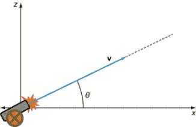

图 12.5 我们抛体模拟中的变量

移动物体的速度*v*定义为它的速度向量的模，因此*v* = |***v***|。给定发射角度θ，炮弹的*x*和*z*速度分量是*v[x]* = |***v***| · cos(θ)和*v[z]* = |***v***| · sin(θ)。我将假设炮弹在时间*t* = 0 离开炮筒，其(*x*, *z*)坐标为(0, 0)，但我也会包括一个可配置的发射高度。以下是使用欧拉方法的基本模拟：

```
def trajectory(theta,speed=20,height=0,
               dt=0.01,g=−9.81):           ❶
    vx = speed * cos(pi * theta / 180)     ❷
    vz = speed * sin(pi * theta / 180)
    t,x,z = 0, 0, height
    ts, xs, zs = [t], [x], [z]             ❸
    while z >= 0:                          ❹
        t += dt                            ❺
        vz += g * dt
        *x* += vx * dt
        z += vz * dt
        ts.append(*t*)
        xs.append(*x*)
        zs.append(*z*)
    return ts, xs, zs                      ❻
```

❶ 额外输入：时间步长 dt、重力场强度 g 和角度 theta（以度为单位）

❷ 计算初始*x*和*z*速度分量，将输入角度从度转换为弧度

❸ 初始化列表，用于存储模拟过程中所有时间值和*x*、*z*位置值

❹ 仅在炮弹在地面以上时运行模拟

❺ 更新时间、z 速度和位置。在*x*方向上没有作用力，因此*x*速度保持不变。

❻ 返回 t、x 和 z 值的列表，给出炮弹的运动轨迹

你可以在本书的源代码中找到一个`plot_trajectories`函数，它接受一个或多个`trajectory`函数的结果，并将它们传递给 Matplotlib 的`plot`函数，绘制出显示每个炮弹路径的曲线。例如，图 12.6 显示了 45°发射角度与 60°发射角度的对比，这是通过以下代码实现的：

```
plot_trajectories( 
    trajectory(45),
    trajectory(60))
```

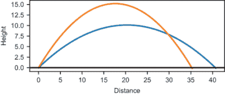

图 12.6 `plot_trajectories`函数的输出，显示了 45°和 60°发射角度的结果。

我们已经可以看到，45°的发射角度产生了更远的射程，而 60°的发射角度产生了更高的最大高度。为了能够优化这些属性，我们需要从轨迹中测量它们。

### 12.1.2 测量轨迹的属性

保留轨迹的原始输出是有用的，以防我们想要绘制它，但有时我们可能只想关注一个最重要的数字。例如，抛射体的射程是轨迹的最后一个*x*坐标，这是炮弹击中地面之前的最后一个*x*位置。以下是一个函数，它接受`trajectory`函数的结果（包含时间和*x*和*z*位置的并行列表），并提取射程或着陆位置。对于输入轨迹`traj`，`traj[1]`列出*x*坐标，而`traj[1][−1]`是该列表的最后一个条目：

```
def landing_position(traj):
    return traj[1][−1]
```

这是我们对抛射体轨迹感兴趣的主要指标，但我们也可以测量其他一些指标。例如，我们可能想知道悬停时间（或炮弹在空中停留的时间）或其最大高度。我们可以轻松创建其他 Python 函数，从模拟轨迹中测量这些属性；例如，

```
def hang_time(traj):
    return traj[0][−1]   ❶
def max_height(traj):
    return max(traj[2])  ❷
```

❶ 空中总时间是最后一个时间值，即当抛射体击中地面时的时钟时间。

❷ 最大高度是 z 位置中的最大值，轨迹输出中的第三个列表。

要为这些指标中的任何一个找到最佳值，我们需要探索参数（即发射角度）如何影响它们。

### 12.1.3 探索不同的发射角度

`trajectory`函数接受一个发射角度，并生成炮弹在飞行过程中的完整时间和位置数据。像`landing_position`这样的函数接受这些数据并生成一个单一数字。将这两个函数组合起来（如图 12.7 所示），我们得到一个关于发射角度的着陆位置函数，其中假设模拟的所有其他属性都是恒定的。

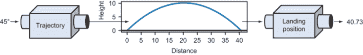

图 12.7 发射角度作为着陆位置函数

测试发射角度对着陆位置影响的一种方法是为几个不同的发射角度绘制着陆位置的图（图 12.8）。为此，我们需要计算`theta`的几个不同值的结果，并将这些值传递给 Matplotlib 的`scatter`函数。例如，我使用`range(0,95,5)`作为发射角度。这是从 0 到 90 度，以 5 度为增量：

```
import matplotlib.pyplot as plt
angles = range(0,90,5)
landing_positions = [landing_position(trajectory(theta)) 
                     for theta in angles]
plt.scatter(angles,landing_positions)
```

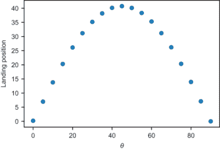

图 12.8 对于几个不同的发射角度，抛射物的着陆位置与发射角度的图

从这张图中，我们可以猜测最佳值是多少。在发射角度为 45°时，着陆位置在发射位置 40 米多一点处达到最大。在这种情况下，45°恰好是使着陆位置最大化的角度的*确切*值。在下一节中，我们将使用微积分来确认这个最大值，而无需进行任何模拟。

### 12.1.4 练习

| **练习 12.1**：当从初始高度为零的角度为 50°发射时，炮弹能飞多远？如果从 130°发射呢？**解决方案**：在 50°时，炮弹在正方向上大约飞行 40.1 米，而在 130°时，它在负方向上飞行 40.1 米：

```
>>> landing_position(trajectory(50))
40.10994684444007
>>> landing_position(trajectory(130))
−40.10994684444007
```

这是因为从正 x 轴 130°与从负 x 轴 50°是相同的。|

| **练习 12.2-迷你项目**：增强`plot_trajectories`函数，以便在轨迹图上每个经过的秒数处绘制一个大的点，这样我们就可以在图上看到时间的流逝。**解决方案**：以下是函数的更新。它寻找每个整秒之后最近的索引，并在这些索引处绘制(*x*, *z*)值的散点图：

```
def plot_trajectories(*trajs,show_seconds=False):
    for traj in trajs:
        xs, zs = traj[1], traj[2]
        plt.plot(xs,zs)
        if show_seconds:
            second_indices = []
            second = 0
            for i,t in enumerate(traj[0]):
                if t>= second:
                    second_indices.append(i)
                    second += 1
            plt.scatter([xs[i] for i in second_indices], 
                        [zs[i] for i in second_indices])
      ...
```

因此，你可以想象出你绘制的每个轨迹所经过的时间；例如，

```
plot_trajectories(
    trajectory(20), 
    trajectory(45),
    trajectory(60),
    trajectory(80), 
    show_seconds=True)
```

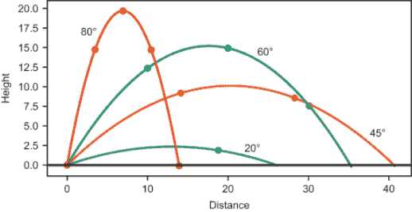显示每个整数秒位置的四条轨迹图。|

| **练习 12.3**：绘制 0°到 180°之间角度的悬挂时间与角度的散点图。哪个发射角度产生了最大的悬挂时间？**解决方案**：

```
test_angles = range(0,181,5)
hang_times = [hang_time(trajectory(theta)) for theta in test_angles]
plt.scatter(test_angles, hang_times)

```

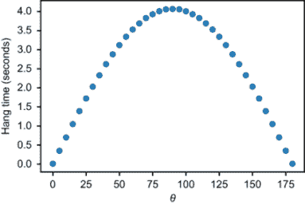抛射物悬挂时间作为发射角度的函数的图 |

| 看起来大约 90°的发射角度产生了大约 4 秒的最长悬挂时间。这很有道理，因为θ = 90°提供了最大的垂直分量初始速度。 |
| --- |

| **练习 12.4-迷你项目**：编写一个函数`plot_trajectory_metric`，该函数可以绘制我们想要在给定的 theta（θ）值集上的任何度量结果。例如，

```
plot_trajectory_metric(landing_position,[10,20,30]) 
```

为发射角度 10°、20° 和 30° 绘制了着陆位置与发射角度的散点图。作为额外奖励，将 `plot_trajectory_metric` 函数的键值参数传递给 `trajectory` 函数的内部调用，这样你可以使用不同的模拟参数重新运行测试。例如，以下代码使用 10 米的初始发射高度进行相同的绘图：

```
plot_trajectory_metric(landing_position,[10,20,30], height=10)
```

**解答**:

```
def plot_trajectory_metric(metric,thetas,**settings):
    plt.scatter(thetas,
                [metric(trajectory(theta,**settings)) 
                 for theta in thetas])
```

我们可以通过运行以下代码来制作之前练习中的图表：

```
plot_trajectory_metric(hang_time, range(0,181,5))
```

|

| **练习 12.5-迷你项目**：对于初始发射高度为 10 米的炮弹，产生最大射程的大约发射角度是多少？**解答**：使用前面迷你项目中提供的 `plot_trajectory_metric` 函数，我们可以简单地运行 `plot_trajectory_metric(landing_position,range(0,90,5), height=10)`！[](../Images/CH12_F08_Orland_UN03.png)炮弹射程与发射角度的图表，发射高度为 10 米最佳发射角度大约为 40°。 |
| --- |

## 12.2 计算最佳射程

使用微积分，我们可以计算出大炮的最大射程以及产生该射程的发射角度。这实际上需要应用微积分两次。首先，我们需要找到一个精确的函数，它告诉我们射程 *r* 是发射角度 θ 的函数。作为警告，这需要相当多的代数运算。我会仔细地引导你通过所有步骤，所以如果你感到困惑，不要担心；你将能够跳到函数 *r*(θ) 的最终形式并继续阅读。

然后，我将向你展示一个使用导数来找到该函数 *r*(θ) 的最大值以及产生该最大值的发射角度 θ 的技巧。也就是说，使导数 *r*'(θ) 等于零的 θ 值也是产生 *r*(θ) 最大值的 θ 值。这可能不是立即显而易见的，但一旦我们检查 *r*(θ) 的图形并研究其变化斜率，它就会变得清晰。

### 12.2.1 将射程作为发射角度的函数找到

炮弹飞行的水平距离实际上相当简单计算。速度 *v[x]* 的 *x* 分量在其整个飞行过程中是恒定的。对于总飞行时间 Δ*t*，弹丸飞行总距离为 *r* = *v[x]* · Δ*t*。挑战在于找到那个经过时间 Δ*t* 的确切值。

那次，反过来，取决于弹丸随时间变化的 *z* 位置，这是一个函数 *z*(*t*)。假设炮弹是从初始高度为零发射的，那么 *z*(*t*) = 0 的第一次是它在 *t* = 0 时发射。第二次是我们要找的经过时间。图 12.9 显示了 θ = 45° 的模拟中 *z*(*t*) 的图形。注意，它的形状看起来非常像轨迹，但现在水平轴 (*t*) 代表时间。

```
trj = trajectory(45)
ts, zs = trj[0], trj[2]
plt.plot(ts,zs)
```

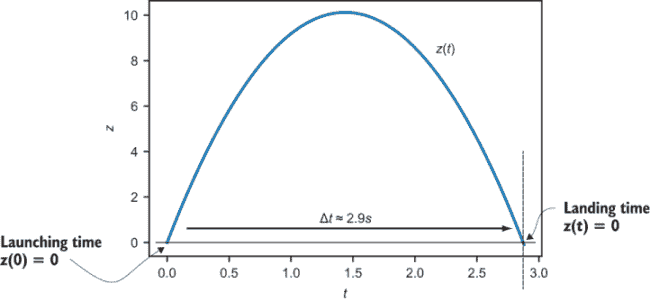

图 12.9 抛体 z(*t*)的图像，显示了发射和着陆时间，其中 z = 0。我们可以从图中看到经过的时间大约是 2.9 秒。

我们知道*z* ''(*t*) = *g* = −9.81，这是重力加速度。我们还知道初始*z*速度*z*'(0) = |***v***| · sin(θ)和初始*z*位置*z*(0) = 0。为了恢复位置函数*z*(*t*)，我们需要对加速度*z* ''(*t*)进行两次积分。第一次积分给出了速度：

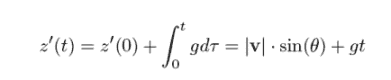

第二个积分给出了位置：

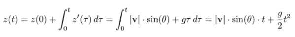

我们可以通过绘制它（图 12.10）来确认这个公式与模拟相匹配。它与模拟几乎无法区分。

```
def z(t):                                         ❶
    return 20*sin(45*pi/180)*t + (−9.81/2)*t**2

plot_function(z,0,2.9)
```

❶ 将积分结果 z(*t*)直接转换为 Python 代码

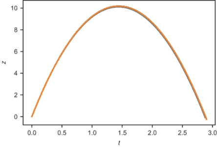

图 12.10 在模拟值上方绘制精确函数 z(*t*)的图像

为了符号简单，让我们将初始速度|***v***| · sin(θ)写成*v[z]*，这样*z*(*t*) = *v[z]t* + *gt*²/2。我们想要找到使*z*(*t*) = 0 的*t*值，这是炮弹的总悬挂时间。你可能记得如何从高中代数中找到这个值，但如果忘记了，让我快速提醒你。如果你想知道什么值的*t*可以解方程*at*² + *bt* + *c* = 0，你只需要将值*a*，*b*和*c*代入*二次公式*：

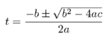

方程*at*² + *bt* + *c* = 0 可以满足两次；两次都是当我们的抛体击中*z* = 0 时。符号±是简写，让你知道在这个方程的这个点使用+或−会得到两个不同的（但有效的）答案。

在解*z*(*t*) = *v[z]t* + *gt*²/2 = 0 的情况下，我们有*a* = *g*/2，*b* = *v[z]*和*c* = 0。将它们代入公式，我们得到

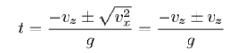

将±符号视为+（加号），结果是*t* = (− *v[z]* + *v[z]*)/*g* = 0。这意味着*z* = 0 当*t* = 0 时，这是一个很好的合理性检查；它证实了炮弹从*z* = 0 开始。有趣的是，当我们把±视为−（减号）时。在这种情况下，结果是*t* = (− *v[z]* − *v[z]*)/*g* = −2*v[z]*/*g*。

让我们确认结果是有意义的。以 20 米/秒的初始速度和 45°的发射角度（我们在模拟中使用），初始*z*速度*v[z]*是−2 · (20 · sin(45°))/−9.81 ¼ 2.88。这接近我们从图中读取的 2.9 秒的结果。

这使我们相信计算悬挂时间Δ*t*为Δ*t* = −2*v[z]*/*g*或Δ*t* = −2|***v***|sin(θ)/*g*。因为射程*r* = *v[x]* · Δ*t* = |***v***|cos(θ) · Δ*t*，所以射程*r*作为发射角度θ的函数的完整表达式是

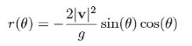

我们可以将其与图 12.11 中各种角度的模拟着陆位置并排绘制，并看到它们是一致的。

```
def r(theta):
    return (−2*20*20/−9.81)*sin(theta*pi/180)*cos(theta*pi/180)

plot_function(r,0,90)
```

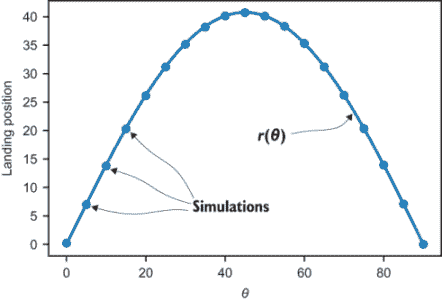

图 12.11 我们将射程作为发射角度*r*(θ)的函数的计算，这与我们的模拟着陆位置相匹配

拥有*r*(θ)函数比反复运行模拟器有很大的优势。首先，它告诉我们大炮在*每个*发射角度的射程，而不仅仅是我们在模拟中模拟的一小部分角度。其次，评估这个函数比运行数百次欧拉方法的迭代要计算成本低得多。对于更复杂的模拟，这可能会产生很大的差异。此外，这个函数给出了确切的结果而不是近似值。下一个我们将利用的最终好处是，函数*r*(θ)是平滑的，因此我们可以求它的导数。这让我们了解了射程如何随着发射角度的变化而变化。

### 12.2.2 求最大射程

观察图 12.12 中*r*(θ)的图像，我们可以设定对导数*r*'(θ)的预期。随着发射角度从零增加，射程在一段时间内也会增加，但增加的速率在减小。最终，增加发射角度开始减少射程。

关键的观察是，当*r*'(θ)为正时，射程相对于θ是增加的。然后导数*r*'(θ)穿过零点，射程从那里开始减少。正是在这个角度（导数为零的地方），函数*r*(θ)达到了它的最大值。你可以通过观察图 12.12 中*r*(θ)的图像在斜率为零时达到最大值来可视化这一点。

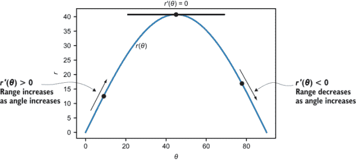

图 12.12 *r*(θ)的图像在导数为零时达到最大值，因此图像的斜率为零。

我们应该能够对*r*(θ)进行符号求导，找到它在 0°到 90°之间等于零的位置，并且这应该与 45°的大致最大值一致。记住*r*的公式是

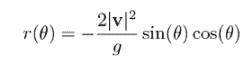

因为与θ无关的-2|***v***|²/*g*是常数，所以唯一困难的工作就是使用乘积法则对 sin(θ)cos(θ)进行求导。结果是

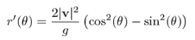

注意我已经提取了负号。如果你以前没有见过这种符号，sin²(θ)意味着(sin(θ))²。当表达式 sin²(θ) − cos²(θ)为零时（换句话说，我们可以忽略常数），导数*r*'(θ)的值为零。有几种方法可以找出这个表达式在哪里为零，但特别好的一个方法是使用三角恒等式，cos(2θ) = cos²(θ) − sin²(θ)，这进一步简化了我们的问题。现在我们需要找出 cos(2θ) = 0 的位置。

余弦函数在*π*/2 加上任何*π*的倍数时为零，或者 90°加上任何 180°的倍数（即 90°，270°，430°等等）。如果 2θ等于这些值，θ可以是这些值的一半：45°，135°，215°等等。

在这些结果中，有两个有趣的结果。首先，θ = 45° 是 θ = 0 和 θ = 90° 之间的解，因此它既是我们所期望的解，也是我们正在寻找的解！第二个有趣解是 135°，因为这与以 45° 的角度向相反方向射击炮弹相同（图 12.13）。

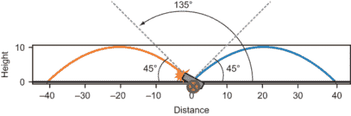

图 12.13 在我们的模型中，以 135° 的角度射击炮弹就像以 45° 的角度向相反方向射击。

在 45° 和 135° 的角度下，得到的射程是

```
>>> r(45)
40.774719673802245
>>> r(135)
−40.77471967380224
```

结果表明，这些是炮弹可能到达的极限位置，其他参数都相等。以 45° 的发射角度产生最大的着陆位置，而以 135° 的发射角度产生最小的着陆位置。

### 12.2.3 识别极大值和极小值

为了区分 45° 的最大射程和 135° 的最小射程，我们可以扩展 *r*(θ) 的图。记住，我们找到这两个角度是因为它们是在导数 *r*'(θ) 为零的地方（图 12.14）。

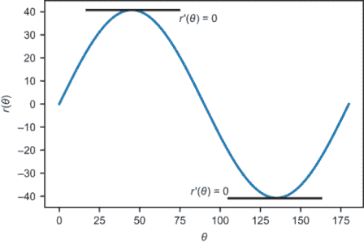

图 12.14 θ = 45° 和 θ = 135° 是在 0 和 180 之间，r'(θ) = 0 的两个值。

虽然平滑函数的极大值出现在导数为零的地方，但反过来不一定成立；导数为零的每个地方不一定产生最大值。正如我们在图 12.14 中看到的那样，在 θ = 135° 处，它也可以产生函数的 *最小* 值。

你还需要注意函数的全局行为，因为导数可以在所谓的 *局部* 极大值或极小值处为零，函数在短时间内获得最大值或最小值，但它的真实，*全局* 最大值或最小值可能位于其他地方。图 12.15 显示了一个经典例子：*y* = *x*³ − *x*。在 −1 < *x* < 1 的区域内放大，有两个导数为零的地方，分别看起来像最大值和最小值。当你放大时，你会看到这两个都不是整个函数的最大值或最小值，因为它在两个方向上都趋向于无穷大。

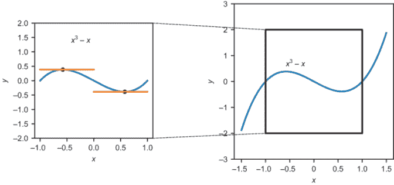

图 12.15 两个局部最小值和局部最大值，但都不是函数的最小值或最大值

作为另一种令人困惑的可能性，导数为零的点甚至可能不是局部最小值或最大值。例如，函数 *y* = *x*³ 在 *x* = 0 处导数为零（图 12.16）。这个点恰好是函数 *x*³ 短暂停止增加的地方。

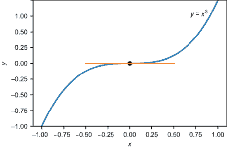

图 12.16 对于 *y* = *x*³，导数在 *x* = 0 处为零，但这不是最小值或最大值。

我不会深入讲解如何判断一个导数为零的点是最小值、最大值还是都不是，或者如何区分局部最小值和最大值与全局最小值和最大值。关键思想是，在自信地说你已经找到了最优值之前，你需要完全理解函数的行为。有了这个想法，让我们继续探讨一些更复杂的函数优化以及一些新的优化技术。

### 12.2.4 练习

| **练习 12.6**：使用关于发射角度θ的经过时间Δ*t*公式，找出使炮弹悬停时间最大的角度。**解答**：在空中的时间是 *t* = 2*v[z]*/*g* = 2*v* sin(θ)/*g*，其中炮弹的初始速度是 *v* = &#124;***v***&#124;。当 sin(θ)最大时，这个值达到最大。我们不需要微积分来做这个；对于 0 ≤ θ ≤ 180°，sin(θ)的最大值发生在θ = 90°。换句话说，当所有其他参数保持不变时，炮弹直接向上发射时悬停时间最长。 |
| --- |
| **练习 12.7**：确认 sin(*x*)在*x* = 11*π*/2 处的导数为零。这是 sin(*x*)的最大值还是最小值？**解答**：sin(*x*)的导数是 cos(*x*)，因此 sin(*x*)在*x* = 11*π*/2 处的导数确实是零。因为 sin(11*π*/2) = sin(3*π*/2) = −1，且正弦函数的范围在−1 和 1 之间，我们可以确定这是一个局部最大值。以下是 sin(*x*)的图像，以确认这一点：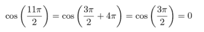 |
| **练习 12.8**：函数*f*(*x*) = *x*³ − *x*的局部最大值和最小值在哪里？这些值是多少？**解答**：从函数的图像中可以看出，*f*(*x*)在某个*x* > 0 处达到局部最小值，在某个*x* < 0 处达到局部最大值。让我们找到这两个点。导数是*f*'(*x*) = 3*x*² − 1，因此我们想要找到 3*x*² − 1 = 0 的地方。我们可以使用二次公式来解*x*，但这足够简单，可以直观地找到解。如果 3*x*² − 1 = 0，那么*x*² = 1/3，所以*x* = −1/ 或 *x* = 1/。这些是*f*(*x*)达到局部最小值和最大值的*x*值。局部最大值是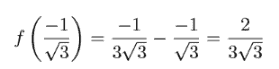，局部最小值是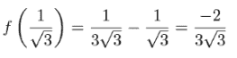。 |
| **练习 12.9-迷你项目**：二次函数*q*(*x*) = *ax*² + *bx* + *c*（*a* ≠ 0）的图像是一个*抛物线*，一个具有单一最大值或单一最小值的拱形。根据数字*a*、*b*和*c*，*q*(*x*)在何处达到最大值或最小值？如何判断这个点是最大值还是最小值？**解答**：导数*q*'(*x*)由 2*ax* + *b*给出。当*x* = - *b*/2*a*时，导数为零。如果*a*是正的，导数在某个低的*x*值开始为负，然后在*x* = - *b*/2*a*时达到零，之后为正。这意味着*q*在*x* = - *b*/2*a*之前是递减的，之后是递增的；这描述了*q*(*x*)的*最小值*。如果*a*是负的，你可以讲述相反的故事。因此，如果*a*是正的，*x* = - *b*/2*a*是*q*(*x*)的*最小值*；如果*a*是负的，它是*最大值*。 |

## 12.3 增强我们的模拟

随着你的模拟器变得越来越复杂，可能会有多个参数控制其行为。对于我们的原始大炮，发射角度θ是我们唯一操作的参数。为了优化大炮的射程，我们与一个一元函数*r*(θ)一起工作。在本节中，我们将使大炮在 3D 中发射，这意味着我们需要改变两个发射角度作为参数来优化炮弹的射程。

### 12.3.1 添加另一个维度

第一件事是为我们的模拟添加一个*y*维度。现在我们可以想象大炮坐在*x*、*y*平面的原点，以某个角度θ将炮弹射向*z*方向。在这个版本的模拟器中，你可以控制角度θ以及第二个角度，我们将称之为φ（希腊字母 phi）。这衡量了大炮从+*x*方向横向旋转的距离（图 12.17）。

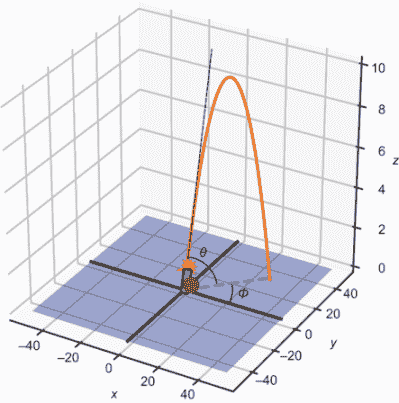

图 12.17 3D 展示大炮发射。两个角度θ和ϕ决定了大炮发射的方向。

为了在 3D 中模拟大炮，我们需要在*y*方向上添加运动。在*z*方向上的物理保持完全相同，但水平速度在*x*和*y*方向上根据角度φ的值进行分配。而之前初始速度的*x*分量是*v[x]* = |***v***|cos(θ)，现在它乘以一个因子 cos(φ)，给出*v[x]* = |***v***|cos(θ)cos(φ)。初始速度的*y*分量是*v[y]* = |***v***|cos(θ)sin(φ)。因为重力在*y*方向上不起作用，我们不需要在模拟过程中更新*v[y]*。以下是更新的轨迹函数：

```
def trajectory3d(theta,phi,speed=20,
                 height=0,dt=0.01,g=−9.81):          ❶
    vx = speed * cos(pi*theta/180)*cos(pi*phi/180)
    vy = speed * cos(pi*theta/180)*sin(pi*phi/180)   ❷
    vz = speed * sin(pi*theta/180)
    t,x,y,z = 0, 0, 0, height
    ts, xs, ys, zs = [t], [x], [y], [z]              ❸
    while z >= 0:
        t += dt
        vz += g * dt
        x += vx * dt
        y += vy * dt                                 ❹
        z += vz * dt
        ts.append(t)
        xs.append(x)
        ys.append(y)
        zs.append(z)
    return ts, xs, ys, zs
```

❶ 横向角度ϕ是模拟的输入参数。

❷ 计算初始 y 速度

❸ 在整个模拟过程中存储时间以及 x、y 和 z 位置值

❹ 在每次迭代中更新 y 位置

如果这个模拟成功，我们预计它不会改变产生最大射程的角度 θ。无论你在 +*x* 方向上方 45° 水平发射弹丸，还是在 − *x* 方向上方 45° 水平发射，或者在任何其他平面上方发射，弹丸应该飞行相同的距离。也就是说，φ 不影响飞行的距离。接下来，我们在发射点周围添加具有可变高度的地形，这样飞行的距离就会改变。

### 12.3.2 建模大炮周围的地形

大炮周围的山丘和山谷意味着其射击的持续时间会根据射击方向的不同而不同。我们可以通过一个函数来模拟 *z* = 0 平面以上或以下的高度，该函数为每个 (*x*,*y*) 点返回一个数字。例如，

```
def flat_ground(x,y):
    return 0
```

表示平坦地面，其中每个 (*x*,*y*) 点的高度为零。我们将使用的另一个函数是两个山谷之间的山脊：

```
def ridge(x,y):
    return (x**2 − 5*y**2) / 2500
```

在这个山脊上，地面从原点向正负 *x* 方向上升，向正负 *y* 方向下降。 (您可以在 *x* = 0 和 *y* = 0 处绘制该函数的横截面来确认这一点。)

无论我们是要模拟平坦地面上的弹丸还是山脊上的弹丸，我们都必须调整 `trajectory3d` 函数，使其在弹丸击中地面时终止，而不仅仅是当其高度为零时。为此，我们可以传递定义地形的 elevation 函数作为关键字参数，默认为平坦地面，并修改测试弹丸是否在地面以上的条件。以下是函数中更改的行：

```
def trajectory3d(theta,phi,speed=20,height=0,dt=0.01,g=−9.81,
                    elevation=flat_ground):
    ...
    while z >= elevation(x,y):
       ...
```

在源代码中，我还提供了一个名为 `plot_trajectories_3d` 的函数，它绘制了 `trajectory3D` 的结果以及指定的地形。为了确认我们的模拟工作正常，我们看到当炮弹从下山发射时，轨迹在 *z* = 0 以下结束，而当它从上山发射时，轨迹在 *z* = 0 以上结束（图 12.18）：

```
plot_trajectories_3d(
    trajectory3d(20,0,elevation=ridge),
    trajectory3d(20,270,elevation=ridge),
    bounds=[0,40,−40,0],
    elevation=ridge)
```

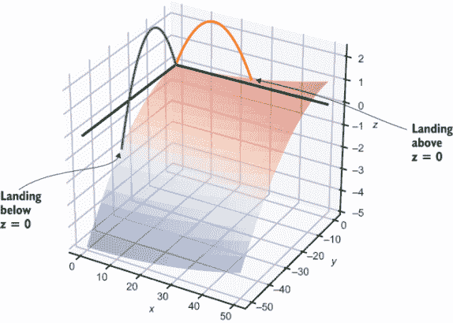

图 12.18 向下发射的弹丸在 z = 0 以下着陆，向上发射的弹丸在 z = 0 以上着陆。

如果你必须猜测，大炮的最大射程似乎是在下山方向而不是上山方向达到的。在下山的过程中，炮弹有更长的下落距离，需要更多的时间，这允许它飞得更远。由于我们的 45° 计算假设地面是平坦的，所以不清楚垂直角度 θ 是否会产生最佳射程。为了回答这个问题，我们需要将弹丸的射程 *r* 写成 θ 和 φ 的函数。

### 12.3.3 在 3D 中求解弹丸的射程

尽管在我们的最新模拟中炮弹是在三维空间中发射的，但其轨迹位于一个垂直平面内。因此，给定一个角度 φ，我们只需要处理炮弹发射方向的地形切片。例如，如果炮弹以角度 φ = 240° 发射，我们只需要考虑当 (*x*, *y*) 沿着从原点出发的 240° 线时地形值。这就像只考虑轨迹投射下的地形高程点（图 12.19）。

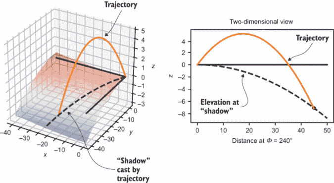

图 12.19 我们只需要考虑投体发射平面上的地形高程。这就是轨迹阴影投射的地方。

我们的目标是在阴影轨迹的平面内进行所有计算，以从原点到 *x*, *y* 平面的距离 *d* 作为我们的坐标，而不是 *x* 和 *y* 本身。在某个距离处，炮弹的轨迹和地面的高程将具有相同的 *z* 值，这就是炮弹停止的地方。这个距离是我们想要找到一个表达式的射程。

让我们继续称投体的高度为 *z*。作为时间的函数，高度与我们的二维示例完全相同

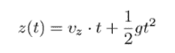

其中 *v[z]* 是初始速度的 *z* 分量。*x* 和 *y* 位置也作为时间 *t* 的简单函数给出，*x*(*t*) = *v[x]t* 和 *y*(*t*) = *v[y]t*，因为 *x* 或 *y* 方向上没有作用力。

在脊上，高程是作为 *x*, *y* 位置的函数给出的，公式为 (*x*² − 5*y*²)/2500。我们可以将这个高程写成 *h*(*x*, *y*) = *B[x]*² − *C[y]*²，其中 *B* = 1/2500 = 0.0004 和 *C* = 5/2500 = 0.002。知道在给定时间 *t* 投体正下方的地形高程是有用的，我们可以称之为 *h*(*t*)。我们可以在任何时间 *t* 计算投体下方的 *h* 值，因为投体的 *x* 和 *y* 位置由 *v[x]t* 和 *v[y]t* 给出，并且在相同的 (*x*, *y*) 点上的高程将是 *h*(*v[x]t*, *v[y]t*) = *Bv[x]*² *t*² − *Cv[y]*² *t*²。

投体在时间 *t* 的高度相对于地面的高度是 *z*(*t*) 和 *h*(*t*) 的差值。碰撞时间是指这个差值为零的时间，即 *z*(*t*) − *h*(*t*) = 0。我们可以用 *z*(*t*) 和 *h*(*t*) 的定义来展开这个条件：

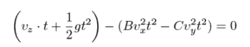

再次，我们可以将其重塑为形式 *at*² + *bt* + *c* = 0：

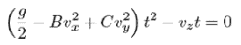

具体来说，*a* = *g*/2 − *Bv[x]*² + *Cv[y]*²，*b* = *v[z]*，*c* = 0。为了找到满足这个方程的时间 *t*，我们可以使用二次公式：

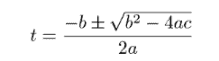

因为 *c* = 0，所以形式更加简单：

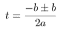

当我们使用+运算符时，我们找到*t* = 0，确认炮弹在发射的瞬间处于地面水平。有趣的是，使用-运算符得到的解，这是投射物落地的时间。这个时间是*t* = (− *b* − *b*)/2*a* = − *b*/*a*。将*a*和*b*的表达式代入，我们得到一个关于我们已知如何计算的数量落地时间的表达式：

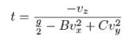

投射物在(*x*,*y*)平面上的落点距离为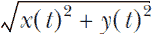对于这个时间*t*。这扩展到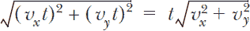。你可以把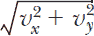看作是初始速度平行于*x*,*y*平面的分量，所以我将这个数字称为*vxy*。落点距离是


表达式中的所有这些数字要么是我指定的常数，要么是关于初始速度*v* = |***v***|和发射角度θ和φ的计算值。将这个表达式翻译成 Python（尽管有点繁琐）是直接的，这样我们可以清楚地看到我们如何将距离视为θ和φ的函数：

```
B = 0.0004                                         ❶
C = 0.005
v = 20
g = −9.81

def velocity_components(v,theta,phi):              ❷
    vx = v  * cos(theta*pi/180) * cos(phi*pi/180)
    vy = v  * cos(theta*pi/180) * sin(phi*pi/180)
    vz = v  * sin(theta*pi/180)
    return vx,vy,vz

def landing_distance(theta,phi):
    vx, vy, vz = velocity_components(v, theta, phi)
    v_xy = sqrt(vx**2 + vy**2)                     ❸
    a = (g/2) − B * vx**2 + C * vy**2              ❹
    b = vz
    landing_time = -b/a                            ❺
    landing_distance = v_xy * landing_time         ❻
    return landing_distance
```

❶ 山脊形状、发射速度和重力加速度的常数

❷ 一个辅助函数，用于找到初始速度的 x, y 和 z 分量

❸ 初始速度的水平分量（平行于 x,y 平面）

❹ 常数 a 和 b

❺ 解落点时间的二次方程，即-b/a

❻ 水平距离

水平距离是水平速度乘以经过的时间。将这个点与模拟轨迹一起绘制，我们可以验证我们计算出的落点位置与使用欧拉方法进行的模拟（图 12.20）相匹配。

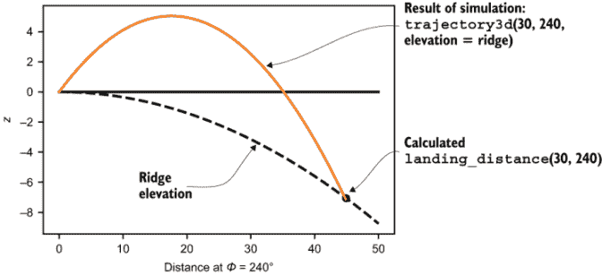

图 12.20 比较计算出的落点与θ = 30°和ϕ = 240°的模拟结果

现在我们有了关于发射角度θ和φ的函数*r*(θ, φ)来表示大炮的射程，我们可以将注意力转向寻找优化射程的角度。

### 12.3.4 练习

| **练习 12.10**：如果 | ***v*** | = *v*是炮弹的初始速度，验证初始速度向量的大小等于*v*。换句话说，证明向量(*v* cos θ cos φ, *v cos* θ sin φ, *v* sin θ)的长度是*v*。**提示**：根据正弦和余弦的定义以及勾股定理，sin² *x* + cos² *x* = 0 对于任何*x*的值都成立。**解答**：向量(*v* cos θ cos φ, *v cos* θ sin φ, *v* sin θ)的大小由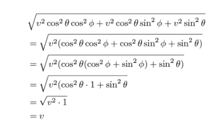给出 |
| --- | --- | --- |
| **练习 12.11**：明确写出在脊地形上，以 *Bx*² − *Cy*² 为函数的炮弹射程公式，其中 θ 和 φ 为变量。出现的常数包括 *B* 和 *C*，以及初始发射速度 *v* 和重力加速度 *g*。**解答**：从公式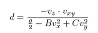开始，我们可以将 *v[z]* = *v* sin θ，*vxy* = *v* cos θ，*v[y]* = *v* cos θ sin φ，和 *v[x]* = *v* cos θ cos φ 代入，得到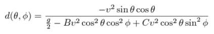。通过在分母中进行一些简化，这变成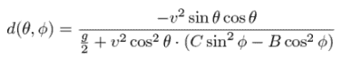 |

| **练习 12.12-迷你项目**：当一个物体如炮弹快速通过空气时，它会受到空气的摩擦力，称为 *drag*，这会将其推向相反的方向。阻力取决于许多因素，包括炮弹的大小和形状以及空气的密度，但为了简化，让我们假设它如下工作。如果 *v* 是炮弹在任何点的速度向量，那么阻力，**F**[*d*]，是**F**[*d*] = −α**v**其中α（希腊字母 alpha）是一个数字，表示特定物体在空气中感受到的阻力大小。阻力与速度成正比的事实意味着，随着物体速度的增加，它感受到的阻力越来越大。找出如何向炮弹模拟中添加阻力参数，并展示阻力会导致炮弹减速。**解答**：我们想在模拟中添加基于阻力的加速度。力将是 -α*v*，因此它引起的加速度是 -α*v*/*m*。由于我们没有改变炮弹的质量，我们可以使用一个单一的阻力常数，即α/ *m*。阻力引起的加速度分量是 *v[x]*α/ *m*，*v[y]*α/ *m* 和 *v[z]*α/ *m*。以下是代码更新的部分：

```
def trajectory3d(theta,phi,speed=20,height=0,dt=0.01,g=−9.81,
                 elevation=flat_ground, drag=0):
    ...
    while z >= elevation(x,y):
        t += dt
        vx -= (drag * vx) * dt         ❶
        vy -= (drag * vy) * dt
        vz += (g − (drag * vz)) * dt   ❷
        ...
    return ts, xs, ys, zs
```

❶ 按照阻力大小成比例地减少 vx 和 vy❷ 通过重力和阻力的影响改变 z 速度 (vz) 你可以看到，一个小的阻力常数 0.1 明显地减慢了炮弹的速度，导致它没有阻力的情况下无法达到轨迹！[](../Images/CH12_F20_Orland_UN05.png)阻力分别为 `drag` `=` `0` 和 `drag` `=` `0.1` 的炮弹轨迹 |

## 12.4 使用梯度上升优化射程

让我们继续假设我们在脊地形上以某些发射角度 θ 和 φ 发射大炮，并将所有其他发射参数设置为默认值。在这种情况下，函数 *r*(θ, φ) 告诉我们大炮在这些发射角度下的射程。为了定性了解角度如何影响射程，我们可以绘制函数 *r* 。

### 12.4.1 绘制射程与发射参数的关系图

在上一章中，我向你展示了多种绘制二维变量函数的方法。我偏好使用热图来绘制 *r*(θ, φ)。在一个二维画布上，我们可以在一个方向上改变 θ，在另一个方向上改变 φ，然后使用颜色来表示相应弹道物体的射程（图 12.21）。

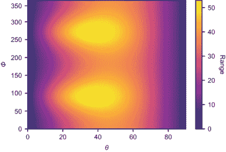

图 12.21 大炮射程作为发射角度 θ 和 ϕ 的函数的热图

这个二维空间是一个抽象的空间，具有 θ 和 φ 坐标。也就是说，这个矩形并不是我们建模的 3D 世界二维切片的绘制。相反，它只是显示范围 *r* 随两个参数变化而变化的一种方便方式。

在图 12.22 的图表中，亮度值表示更高的范围，并且似乎有两个最亮的点。这些是大炮射程的可能最大值。

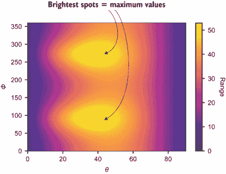

图 12.22 最亮的点出现在弹道范围最大化的时刻。

这些点出现在大约 θ = 40, φ = 90 和 φ = 270 的位置。φ 值是有意义的，因为它们是脊的下坡方向。我们的下一个目标是找到 θ 和 φ 的确切值以最大化范围。

### 12.4.2 射程函数的梯度

正如我们使用一元函数的导数来找到它的最大值一样，我们将使用函数 *r*(θ, φ) 的梯度 ∇*r*(θ, φ) 来找到它的最大值。对于一个一元变量的光滑函数 *f*(*x*)，我们看到了当 *f* 达到最大值时 *f*'(*x*) = 0。这是当 *f*(*x*) 的图表暂时平直时，意味着 *f*(*x*) 的斜率为零，或者更精确地说，给定点的最佳近似线的斜率为零。同样，如果我们绘制 *r*(θ, φ) 的三维图，我们可以看到它在最大点处是平的（图 12.23）。

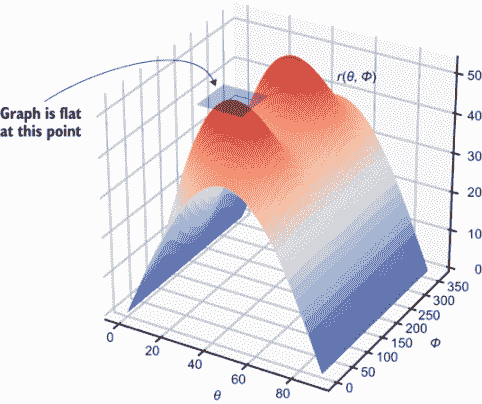

图 12.23 *r*(θ, ϕ) 的图表在其最大点处是平的。

让我们精确地说明这意味着什么。因为 *r*(θ, φ) 是光滑的，所以存在一个最佳近似平面。这个平面在 θ 和 φ 方向上的斜率分别由偏导数 ∂*r*/∂θ 和 ∂*r*/∂φ 给出。只有当这两个都为零时，平面才是平的，这意味着 *r*(θ, φ) 的图表是平的。

因为 *r* 的偏导数被定义为 *r* 梯度的分量，这个平直的条件等同于说 ∇*r*(θ, φ) = 0。为了找到这样的点，我们必须对 *r*(θ, φ) 的完整公式求梯度，然后求解 θ 和 φ 的值，使得它为零。求这些导数并求解它们是很多工作，而且并不那么启发人心，所以我把这个作为你的练习。接下来，我将向你展示一种沿着图表斜坡向上追踪近似梯度到最大点的方法，这不会要求任何代数。

在我继续之前，我想重申一下前一部分的一个观点。仅仅因为你在图表上找到一个梯度为零的点，并不意味着它是一个最大值。例如，在 *r*(θ, φ) 的图表中，在两个最大值之间有一个点，图表是平的，梯度为零（图 12.24）。

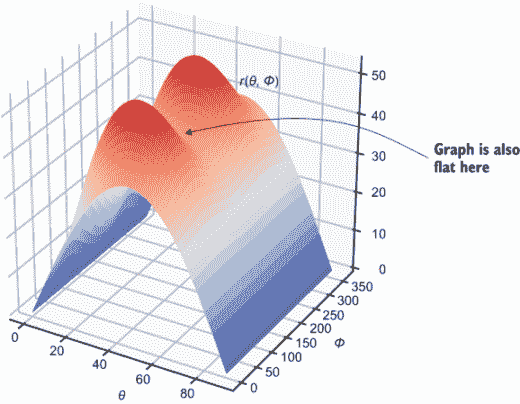

图 12.24 *r*(θ, ϕ) 的图形平坦的点 (θ, ϕ)。梯度为零，但函数没有达到最大值。

这个点并非没有意义，它恰好告诉你当你在 φ = 180° 射击抛体时最佳的角度 θ，这是最糟糕的方向，因为它是最陡的上升方向。这样的点被称为 *鞍点*，函数在某一变量上达到最大值，而在另一变量上达到最小值。这个名字来源于图表看起来有点像马鞍。

再次，我不会深入讲解如何识别极大值、极小值、鞍点或其他梯度为零的位置，但请注意：随着维度的增加，图形平坦的方式也会变得更为奇特。

### 12.4.3 使用梯度找到上升方向

我们不必对复杂的函数 *r*(θ, φ) 进行符号求偏导数，我们可以找到偏导数的近似值。它们给出的梯度方向告诉我们，对于任何给定的点，函数增加最快的方向。如果我们沿着这个方向跳到新的点，我们应该向上移动并朝向最大值。这个过程被称为 *梯度上升*，我们将在 Python 中实现它。

第一步是能够近似任何点的梯度。为了做到这一点，我们使用我在第九章中介绍的方法：取小割线的斜率。以下是作为提醒的函数：

```
def secant_slope(f,xmin,xmax):                ❶
    return (f(xmax) − f(xmin)) / (xmax − xmin)

def approx_derivative(f,x,dx=1e−6):           ❷
    return secant_slope(f,x-dx,x+dx)
```

❶ 找到介于 xmin 和 xmax 之间的割线，*f*(*x*) 的斜率

❷ 近似导数是介于 *x* − 10 − 6 和 *x* + 10 − 6 之间的割线。

要找到函数 *f*(*x*, *y*) 在点 (*x*[0], *y*[0]) 处的近似偏导数，我们想要固定 *x* = *x*[0] 并对 *y* 求导，或者固定 *y* = *y*[0] 并对 *x* 求导。换句话说，(*x*[0], *y*[0]) 处的偏导数 ∂*f*/∂*x* 是 *f*(*x*, *y*[0]) 在 *x* = *x*[0] 时关于 *x* 的普通导数。同样，偏导数 ∂*f*/∂*y* 是 *f*(*x*[0], *y*) 在 *y* = *y*[0] 时关于 *y* 的普通导数。梯度是这些偏导数的矢量（元组）：

```
def approx_gradient(f,x0,y0,dx=1e−6):
    partial_x = approx_derivative(lambda x: f(x,y0), x0, dx=dx)
    partial_y = approx_derivative(lambda y: f(x0,y), y0, dx=dx)
    return (partial_x,partial_y)
```

在 Python 中，函数 *r*(θ, φ) 被编码为 `landing_distance` 函数，我们可以存储一个特殊函数，`approx_gradient`，代表其梯度：

```
def landing_distance_gradient(theta,phi):
    return approx_gradient(landing_distance_gradient, theta, phi)
```

这，就像所有梯度一样，定义了一个矢量场：为空间中的每个点分配一个矢量。在这种情况下，它告诉我们任何一点上 *r* 的最大增加矢量。图 12.25 显示了在 *r*(θ, φ) 的热图上 `landing_distance_gradient` 的绘图。

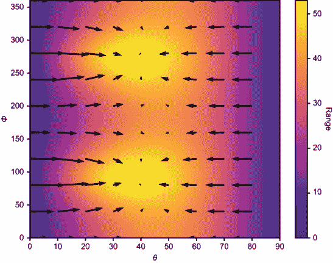

图 12.25 在函数 *r*(θ, ϕ) 的热图上显示的梯度矢量场 ∇r(θ, ϕ) 的绘图。箭头指向 r 增加的方向，指向热图上更亮的点。

如果放大查看（图 12.26），梯度箭头会汇聚到函数的最大点。


图 12.26 与图 12.25 相同的图表，在（θ, ϕ）=（37.5°, 90°）附近，这是最大值之一的近似位置

下一步是实现 *梯度上升* 算法，我们从任意选择的点（θ, φ）开始，沿着梯度场移动，直到我们到达 *一个* 最大值。

### 12.4.4 实现梯度上升

梯度上升算法将我们要最大化的函数以及一个起始点作为输入，我们将从这里开始我们的探索。我们的简单实现计算起始点的梯度并将其加到起始点上，从而得到一个新的点，该点在原点附近，沿着梯度的方向有一定距离。重复此过程，我们可以移动到越来越接近最大值的点。

最终，当我们接近最大值时，梯度将接近零，因为图表达到一个平台期。当梯度接近零时，我们就没有更多的上坡路可走了，算法应该终止。为了实现这一点，我们可以传递一个 *tolerance*，这是我们应跟随的最小梯度值。如果梯度更小，我们可以确信图表是平的，我们已经到达了函数的最大值。以下是实现方式：

```
def gradient_ascent(f,xstart,ystart,tolerance=1e−6):
    *x* = xstart                                       ❶
    y = ystart
    grad = approx_gradient(f,x,y)                    ❷
    while length(grad) > tolerance:                  ❸
        *x* += grad[0]                                 ❹
        y += grad[1]
        grad = approx_gradient(f,x,y)                ❺
    return x,y                                       ❻
```

❶ 将 (*x, y*) 的初始值设置为输入值

❷ 告诉我们如何从当前的 (*x, y*) 值向上移动

❸ 只有当梯度大于最小长度时才向新点移动

❹ 将 (*x, y*) 更新为 (*x, y*) + ∇*f*(*x, y*)

❺ 更新此新点的梯度

❻ 当没有更多的上坡路可走时，返回 *x* 和 *y* 的值

让我们测试一下，从（θ, φ）=（36°, 83°）的值开始，这个值看起来相当接近最大值：

```
>>> gradient_ascent(landing_distance,36,83)
(37.58114751557887, 89.99992616039857)
```

这是一个很有希望的结果！在我们的热图（图 12.27）中，我们可以看到从初始点（θ, φ）=（36°, 83°）移动到一个新的位置大约为（θ, φ）=（37.58, 90.00），看起来它具有最大的亮度。


图 12.27 梯度上升的起始点和结束点

为了更好地理解算法的工作原理，我们可以追踪梯度上升在 θ, φ 平面上的轨迹。这与我们迭代欧拉方法时跟踪时间和位置值的方式类似：

```
def gradient_ascent_points(f,xstart,ystart,tolerance=1e−6):
    *x* = xstart
    y = ystart
    xs, ys = [x], [y]
    grad = approx_gradient(f,x,y)
    while length(grad) > tolerance:
        *x* += grad[0]
        y += grad[1]
        grad = approx_gradient(f,x,y)
        xs.append(*x*)
        ys.append(*y*)
    return xs, ys
```

实现了这一点后，我们可以运行

```
gradient_ascent_points(landing_distance,36,83)
```

我们得到了两个列表，包含上升过程中的每个步骤的 θ 值和 φ 值。这两个列表都有 855 个数字，这意味着这个梯度上升需要 855 步才能完成。当我们把 θ 和 φ 点绘制在热图（图 12.28）上时，我们可以看到我们的算法上升图所采取的路径。


图 12.28 梯度上升算法达到范围函数最大值所采取的路径

注意，由于有两个最大值，路径和目的地都取决于我们选择的初始点。如果我们从 φ = 90° 附近开始，我们很可能会达到那个最大值，但如果我们更接近 φ = 270°，我们的算法会找到那个最大值（图 12.29）。


图 12.29 从不同的点开始，梯度上升算法可以找到不同的最大值。

发射角度 (37.58°, 90°) 和 (37.58°, 270°) *都* 最大化了函数 *r*(θ, φ)，因此它们是产生大炮最大射程的发射角度。这个射程大约是 53 米

```
>>> landing_distance(37.58114751557887, 89.99992616039857)
52.98310689354378
```

我们可以将相关的轨迹绘制如图 12.30 所示。


图 12.30 具有最大射程的大炮轨迹

随着我们探索一些机器学习应用，我们将继续依赖梯度来找出如何优化函数。具体来说，我们将使用梯度上升的对立面，称为*梯度下降*。通过在梯度相反的方向探索参数空间，它找到函数的最小值，从而向下而不是向上移动。因为梯度上升和下降可以自动执行，我们将看到它们为机器提供了一种自主学习问题最优解的方法。

### 12.4.5 练习

| **练习 12.13**：在热图中，同时绘制从 20 个随机选择点开始的梯度上升路径。所有路径都应该结束在两个最大值之一。**解答**：在已经绘制了热图的情况下，我们可以运行以下代码来执行并绘制 20 次随机的梯度上升：

```
from random import uniform
for *x* in range(0,20):
    gap = gradient_ascent_points(landing_distance, 
                                 uniform(0,90), 
                                 uniform(0,360))
    plt.plot(*gap,c='k')
```

结果表明，所有路径都导向了同一个地方！从 20 个随机初始点开始的梯度上升路径

| **练习 12.14-迷你项目**：符号地找到 ∂r/∂θ 和 ∂r/∂φ 的偏导数，并写出梯度 ∇r(θ, φ) 的公式。 |
| --- |

| **练习 12.15**：找到 *r*(θ, φ) 上梯度为零但函数不是最大化的点。**解答**：我们可以通过将 φ 初始化为 180° 来欺骗梯度上升。由于设置的对称性，我们可以看到当 φ = 180° 时，∂r/∂φ = 0，因此梯度上升没有理由离开 φ = 0 的线：

```
>>> gradient_ascent(landing_distance,0,180)
(46.122613357930206, 180.0)
```

|

| 如果你将 φ 固定为 0 或 180°，这就是最佳发射角度，因为你是向上发射的！通过在 ∂r/∂ϕ = 0 的横截面上初始化梯度上升来欺骗梯度上升。 |
| --- |

| **练习 12.16**: 梯度上升从 (36, 83) 到达原点需要多少步？而不是跳过一个梯度，跳 1.5 个梯度。证明你可以用更少的步骤到达那里。如果你在每一步中跳得更远会发生什么？**解答**：让我们向梯度上升计算中引入一个参数 `rate`，它表示上升尝试的速度。速率越高，我们越信任当前计算的梯度，并朝那个方向跳跃：

```
def gradient_ascent_points(f,xstart,ystart,rate=1,tolerance=1e−6):
    ...
    while length(grad) > tolerance:
        *x* += rate * grad[0]
        y += rate * grad[1]
        ...
    return xs, ys
```

这是一个函数，它计算梯度上升过程收敛所需的步数：

```
def count_ascent_steps(f,x,y,rate=1):
    gap = gradient_ascent_points(f,x,y,rate=rate)
    print(gap[0][−1],gap[1][−1])
    return len(gap[0])
```

使用 `rate` 参数等于 1 进行原始上升需要 855 步：

```
>>> count_ascent_steps(landing_distance,36,83)
855
```

当 `rate=1.5` 时，我们每步跳一个半梯度。不出所料，我们更快地到达最大值，只需 568 步：

```
>>> count_ascent_steps(landing_distance,36,83,rate=1.5)
568
```

尝试更多的值，我们发现增加速率可以使我们在更少的步骤中达到解：

```
>>> count_ascent_steps(landing_distance,36,83,rate=3)
282
>>> count_ascent_steps(landing_distance,36,83,rate=10)
81
>>> count_ascent_steps(landing_distance,36,83,rate=20)
38
```

但不要过于贪婪！当我们使用速率为 20 时，我们可以在更少的步骤中得到答案，但一些步骤似乎超出了答案，并且下一步会加倍回退。如果你将速率设置得太高，算法可能会越来越远离解；在这种情况下，我们说它发散而不是收敛！速率为 20 的梯度上升。算法最初超出了最大 θ 值，并不得不回退。|

| 如果你将速率提高到 40，你的梯度上升将不会收敛。每次跳跃都比上一次跳得更远，参数空间的探索会跑到无限远处。 |
| --- |
| **练习 12.17**: 当你尝试直接使用模拟结果（将 *r* 作为 θ 和 φ 的函数）而不是计算结果来运行 `gradient_ascent` 时会发生什么？**解答**：结果并不理想。这是因为模拟结果依赖于数值估计（例如决定弹丸何时击中地面），因此当发射角度发生微小变化时，这些估计会迅速波动。以下是我们导数近似器在计算偏导数 ∂*r*/∂θ 时会考虑的横截面 *r*(θ, 270°) 的图像：模拟轨迹的横截面显示，我们的模拟器没有产生一个平滑的函数 *r*(θ, ϕ)。导数的值波动很大，因此梯度上升会在随机方向上移动。 |

## 摘要

+   我们可以通过使用欧拉方法并记录所有的时间和位置来模拟移动物体的轨迹。我们可以计算关于轨迹的事实，如最终位置或经过的时间。

+   改变我们模拟的一个参数，如大炮的发射角度，可能会导致不同的结果——例如，弹丸的射程不同。如果我们想找到最大化射程的角度，将射程写成角度 *r*(θ) 的函数会有所帮助。

+   光滑函数 *f*(*x*) 的最大值出现在其导数 *f*'(*x*) 为零的地方。不过，你需要小心，因为当 *f*'(*x*) = 0 时，函数 *f* 可能处于最大值，也可能是最小值，或者是一个函数 *f* 临时停止变化的点。

+   要优化两个变量的函数，例如将射程 *r* 作为垂直发射角 θ 和水平发射角 φ 的函数进行优化，你需要探索所有可能的输入 (θ, φ) 的二维空间，并找出哪一对产生最优值。

+   对于两个变量的光滑函数 *f*(*x*, *y*) 的最大值和最小值，发生在两个偏导数都为零的情况下；也就是说，∂*f*/∂*x* = 0 和 ∂*f*/∂*y* = 0，因此 ∇*f*(*x*, *y*) = 0（根据定义）。如果偏导数为零，它也可能是一个鞍点，相对于一个变量最小化函数，相对于另一个变量最大化函数。

+   梯度上升算法通过从二维空间中任意选择一个点开始，沿着梯度 ∇*f*(*x*, *y*) 的方向移动，来寻找函数 *f*(*x*, *y*) 的近似最大值。由于梯度指向函数 *f* 增加最快的方向，因此该算法找到的 (*x*, *y*) 点具有增加的 *f* 值。当梯度接近零时，算法终止。
