# 13 使用傅里叶级数分析声波

本章涵盖

+   使用 Python 和 PyGame 定义和播放声波

+   将正弦函数转换为可演奏的音乐音符

+   通过将声波作为函数相加来组合两个声音

+   将声波函数分解为其傅里叶级数以查看其音乐音符

在第二部分的很多内容中，我们专注于使用微积分来模拟运动物体。在本章中，我将向你展示一个完全不同的应用：处理音频数据。数字音频数据是计算机对声波的表示，声波是我们耳朵感知为声音的空气压力的重复变化。我们将声波视为可以像向量一样相加和缩放的函数，然后我们可以使用积分来理解它们代表的声音类型。因此，我们对声波的研究结合了你在前几章中学到的关于线性代数和微积分的很多内容。

我不会深入探讨声波的物理原理，但了解它们在基本层面的工作方式是有用的。我们感知到的声音并不是空气压力本身，而是空气压力的快速变化，这些变化导致我们的耳膜振动。例如，如果你拉小提琴，你会将弓拉过一根弦，使弦振动。振动的弦使其周围的空气快速改变压力，压力的变化以声波的形式传播，直到到达你的耳朵。在那个时刻，你的耳膜以相同的速率振动，你感知到声音（图 13.1）。

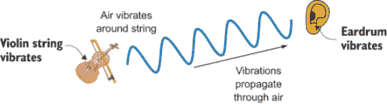

图 13.1 小提琴声到达耳膜示意图

你可以将数字音频文件视为描述随时间变化的振动的函数。音频软件解释该函数并指示你的扬声器相应地振动，在扬声器周围的空气中产生形状相似的声波。就我们的目的而言，函数的确切表示并不重要，但你可以将其松散地解释为描述随时间变化的空气压力（图 13.2）。

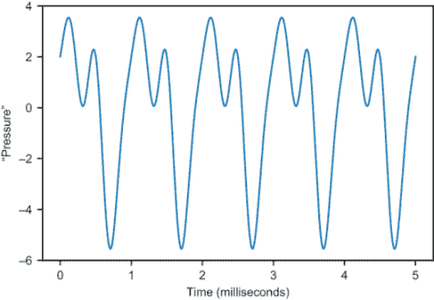

图 13.2 将声波视为函数，松散地解释为表示随时间变化的压力

像音乐音符这样的有趣声音具有重复模式的声波，如图 13.2 所示。函数重复自身的速率称为*频率*，它告诉我们音乐音符的高低。声音的*音色*由重复模式的形状控制，例如，它听起来更像是小提琴、喇叭还是人声。

## 13.1 结合声波并分解它们

在本章中，我们对函数进行数学运算，并使用 Python 将它们作为实际声音播放。我们将做的主要两件事是将现有的声波组合成新的声波，然后将复杂的声波分解成更简单的声波。例如，我们可以将几个音符组合成一个和弦，然后我们可以将和弦分解以查看其音符。

然而，在我们这样做之前，我们需要了解基本构建块：声波和音符。我先向您展示如何使用 Python 将代表声波的一系列数字转换为从您的扬声器中发出的真实声音。为了制作与函数相对应的声音，我们从函数的图形中提取一些*y*值，并将这些值作为数组传递给音频库。这个过程被称为*采样*(图 13.3)。

我们将使用的主要声波函数是*周期性*函数，其图形由相同的重复形状构成。具体来说，我们将使用*正弦波*函数，这是一个包括正弦和余弦在内的周期函数族，可以产生自然音调的音符。在将它们采样转换为数字序列后，我们将构建 Python 函数来播放音符。

一旦我们能够产生单个音符，我们将编写 Python 代码来帮助我们组合不同的音符以创建和弦和其他复杂的声音。我们将通过将定义每个声波的函数相加来实现这一点。我们将看到，组合几个音符可以形成一个和弦，而组合几十个音符可以产生一些相当有趣且在性质上不同的声音。

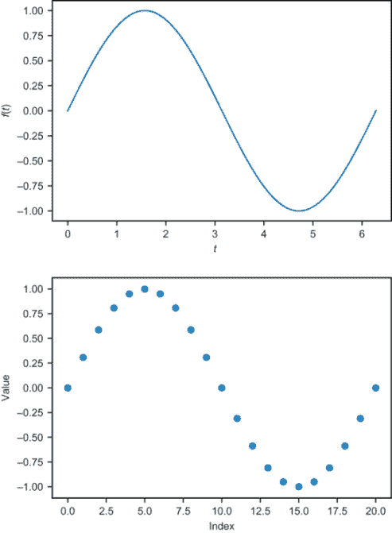

图 13.3 从函数*f(t)*的图形（顶部）开始，采样一些*y*值（底部）以发送到音频库

我们最后一个目标是将表示任何声波的函数分解为（纯）音符及其对应音量的和，这些音符构成了声波（图 13.4）。这种分解成和的过程称为*傅里叶级数*(发音为*FOR-ee-yay*)。一旦我们找到了构成傅里叶级数的声波，我们就可以一起播放它们，得到原始声音。

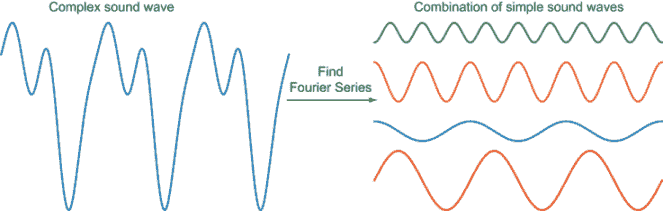

图 13.4 使用傅里叶级数将声波函数分解为更简单的组合

从数学上讲，找到傅里叶级数意味着将一个函数写成和的形式，或者更具体地说，是正弦和余弦函数的线性组合。这个程序及其变体是所有时间中最重要的算法之一。与我们将要介绍的方法类似的方法被用于常见的应用，如 MP3 压缩，以及更宏伟的应用，如最近获得诺贝尔奖的引力波探测。

看这些声波作为图形是一回事，但真正听到它们从您的扬声器中发出是另一回事。让我们制造一些噪音！

## 13.2 在 Python 中播放声波

要在 Python 中播放声音，我们转向在前面几个章节中使用过的 PyGame 库。这个库中的一个特定函数接受一个数字数组作为输入，并播放声音作为结果。作为第一步，我们使用 Python 中的随机数字序列，并编写代码来使用 PyGame 解释和播放这些声音。目前这将是*噪音*（是的，这是一个技术术语！）而不是美丽的音乐，但我们需要从某个地方开始。

在产生一些噪音之后，我们将通过在具有重复模式的数字序列上运行相同的过程，而不是完全随机的数字序列，来制作一个稍微更有吸引力的声音。这为我们设置了下一节的内容，我们将通过采样周期函数来获取重复数字的序列。

### 13.2.1 生成我们的第一个声音

在我们将表示声音的数字数组传递给 PyGame 之前，我们需要告诉它如何解释这些数字。这里有一些关于音频数据的详细技术信息，我会解释它们，这样你就知道 PyGame 是如何考虑这些的，但这些细节对于本章的其余部分不是关键的。

在这个应用中，我们使用 CD 音频中常用的约定。具体来说，我们将用包含 44,100 个值的数组来表示一秒钟的音频，每个值都是一个 16 位整数（介于-32,768 和 32,767 之间）。这些数字大致代表了每个时间步骤的声音强度，每秒钟有 44,100 个步骤。这与我们在第六章中表示图像的方式类似。而不是一个表示像素亮度的值数组，我们有一个表示不同时间点的声音波强度的值数组。最终，我们将这些数字作为声音波图上点的*y*坐标，但就目前而言，我们将随机选择它们来制造*一些*噪音。

我们还使用单个*通道*，这意味着我们只播放一个声音波，而不是*立体声*音频，后者同时产生两个声音波，一个在左扬声器，一个在右扬声器。我们配置的另一件事是声音的比特深度。虽然频率类似于图像的分辨率，但*比特深度*就像允许的像素颜色数量，比特深度越高，意味着声音强度范围越精细。我们使用介于 0 到 256 之间的三个数字来表示像素的颜色，但在这里，我们使用一个 16 位数字来表示某一时刻的声音强度。选择这些参数后，我们代码中的第一步是导入 PyGame 并初始化声音库：

```
>>> import pygame, pygame.sndarray
>>> pygame.mixer.init(frequency=44100, 
                      size=−16,          ❶
                      channels=1) 
```

❶ -16 表示 16 位比特深度，输入为 16 位有符号整数，范围从-32,768 到 32,767

首先，我们可以通过创建一个包含 44,100 个介于-32,768 和 32,767 之间的随机整数的 NumPy 数组来生成一秒钟的音频。我们可以使用 NumPy 的`randint`函数在一行内完成此操作：

```
>>> import numpy as np
>>> arr = np.random.randint(−32768, 32767, size=44100)
>>> arr
array([−16280, 30700, −12229, ..., 2134, 11403, 13338])
```

要将这个数组解释为声波，我们可以在散点图上绘制它的前几个值。我在这本书的源代码中包含了一个`plot_sequence`函数，以帮助您快速绘制这样的整数数组。如果你运行`plot_sequence (arr, max=100)`，你会得到这个数组前 100 个值的图像。与从平滑函数中采样的数字相比，这些数字分布得非常广泛（图 13.5）。

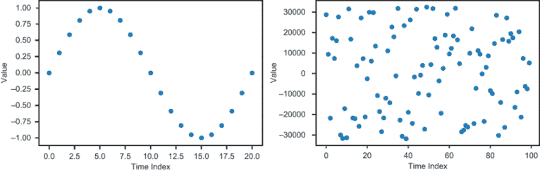

图 13.5 声波采样值（左）与我们的随机值（右）的比较

如果你连接这些点，你可以想象它们定义了这个时间段内的一个函数。图 13.6 显示了连接点的数字数组的两张图，分别显示了前 100 个和 441 个数字。这些数据是完全随机的，所以没有什么特别有趣的东西可以看，但这将是我们将要播放的第一个声波。

因为 44,100 个值定义了一秒钟的声音，所以底部的 441 个值定义了第一个百分之一秒内的声音。接下来，我们可以使用一个库调用来播放声音。

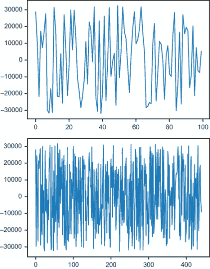

图 13.6 连接到定义函数的前 100 个值（顶部）和前 441 个值（底部）

注意：在运行下面的几行 Python 代码之前，请确保你的扬声器音量不要太大。我们制作的第一个声音不会那么愉快，更不用说，你也不想伤害你的耳朵！

要播放声音，你可以运行：

```
sound = pygame.sndarray.make_sound(arr)
sound.play()
```

结果应该听起来像一秒钟的静电，就像你打开了收音机但没有调到任何频道一样。这种随时间变化随机值的声波被称为*白噪音*。

关于白噪音，你唯一能调整的可能是音量。人耳对压力的变化有反应，声音波越大，压力变化越大，听到的声音就越响。如果你觉得这个白噪音对你来说声音太大，你可以通过生成由较小数字组成的声数据来创建一个更安静版本。例如，这个白噪音是由从-10,000 到 10,000 的数字生成的：

```
arr = np.random.randint(−10000, 10000, size=44100)
sound = pygame.sndarray.make_sound(arr)
sound.play()
```

这个声音应该几乎与你播放的第一个白噪音相同，只是它更安静。声波的响度取决于函数值的大小，这种测量的结果被称为波的*振幅*。在这种情况下，因为值从平均值的 0 变化了 10,000 个单位，所以振幅被认为是 10,000。

尽管有些人觉得白噪音很舒缓，但它并不很有趣。让我们产生一个更有趣的声音，即一个音符。

### 13.2.2 演奏一个音符

当我们听到一个音符时，我们的耳朵正在检测振动中的模式，与白噪声的随机性形成对比。我们可以组合一系列具有明显模式的 44,100 个数字，你会听到它们产生一个音符。具体来说，让我们先重复数字 10,000 五十次，然后重复数字-10,000 五十次。我选择 10,000 是因为我们刚刚看到它有足够大的振幅，可以使声音波可听。图 13.7 显示了以下代码片段返回的前 100 个数字的图表：

```
form = np.repeat([10000,−10000],50)     ❶
plot_sequence(form)
```

❶ 列表中每个值重复指定的次数

如果我们重复这个 100 个数字的序列 441 次，我们就有 44,100 个总值来定义一秒的音频。为了实现这一点，我们可以使用另一个方便的 NumPy 函数，称为`tile`，它将给定的数组重复指定的次数：

```
arr = np.tile(form,441)
```

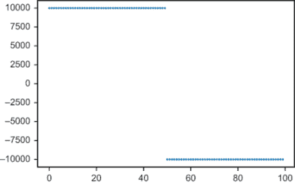

图 13.7 由数字 10,000 重复 50 次，然后是数字-10,000 重复 50 次组成的序列的图表。

图 13.8 显示了数组前 1,000 个值的图表，其中“点”是连接的。你可以看到它每隔 50 个数字在 10,000 和-10,000 之间跳来跳去。这意味着模式每 100 个数字重复一次。

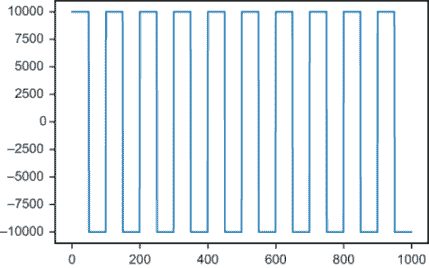

图 13.8 展示了 44,100 个数字中的前 1,000 个的图表，显示了重复的模式。

这个波形被称为**方波**，因为它的图形有尖锐的 90°角。（注意，垂直线只是为了说明 MatPlotLib 连接了所有的点；在 10,000 和-10,000 之间没有序列的值，只是在 10,000 处有一个点连接到-10,000 处的点。）

44,100 个数字代表一秒，所以图 13.8 中绘制的 1,000 个数字代表 1/44.1 秒（或 0.023 秒）的音频。使用以下行播放这些声音数据会产生一个清晰的音符。这大约是音符 A（或科学音高记号中的 A[4]）。你可以使用与第 13.2.1 节中相同的`play()`方法来听它。

```
sound = pygame.sndarray.make_sound(arr)
sound.play()
```

重复的速率（在这种情况下，每秒 441 次重复）称为声音波的**频率**，它决定了音符的**音调**，即音符听起来有多高或多低。重复频率的单位是*赫兹*，缩写为 Hz，其中 441 Hz 意味着每秒 441 次。音调 A 最常见的规定是 440 Hz，但 441 足够接近，并且它方便地除以每秒 44,100 个值的 CD 采样率。

有趣的声波来自**周期性**的函数，它们在固定的区间内重复，就像图 13.8 中的方波。方波的重复序列由 100 个数字组成，我们重复它 441 次来得到 44,100 个数字，从而得到一秒钟的音频。这是 441 Hz 的重复率，或者每 0.0023 秒一次。我们耳朵检测到的音乐音符就是这个重复率。在下一节中，我们将播放与最重要的周期性函数正弦和余弦在不同频率下相对应的声音。

### 13.2.3 练习

| **练习 13.1**：我们的音符 A 在一秒钟内重复了 441 次。创建一个在一秒钟内重复 350 次的类似模式，这将产生音符 F。**解答**：幸运的是，44,100 Hz 的频率可以被 350 整除：44,100 / 350 = 126。我们有 63 个 10,000 和 63 个-10,000 的值，我们可以重复这个序列 350 次来创建一秒钟的音频。这个音符听起来比 A 低，确实是一个 F：

```
form = np.repeat([10000,−10000],63)
arr = np.tile(form,350)
sound = pygame.sndarray.make_sound(arr)
sound.play()
```

|

## 13.3 将正弦波转换为声音

我们用方波播放的声音是一个可识别的音符，但听起来并不很自然。这是因为在大自然中，事物通常不会以方波形式振动。更常见的是振动是**正弦波形的**，这意味着如果我们测量并绘制这些波形，我们会得到类似于正弦或余弦函数的图形。这些函数在数学上也是自然的，因此我们可以将它们作为我们即将制作的音乐的构建块。在采样音符并将它们传递给 PyGame 之后，你将能够听到方波和正弦波之间的区别。

### 13.3.1 从正弦函数制作音频

我们在这本书中已经多次使用过的正弦和余弦函数，本质上是有周期性的函数。这是因为它们的输入被解释为角度；如果你旋转 360°或 2*π*弧度，你将回到起点，正弦和余弦函数将返回相同的值。因此，sin(*t*)和 cos(*t*)每隔 2*π*单位重复一次，如图 13.9 所示。

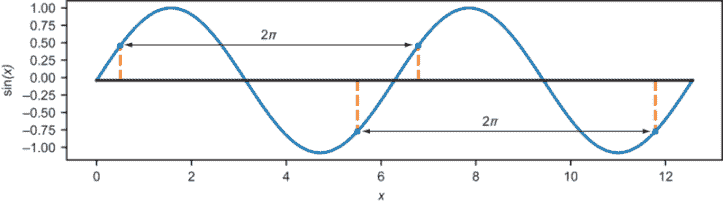

图 13.9 每隔 2*π*单位，函数 sin(*t*)重复相同的值。

这个重复的区间被称为周期函数的**周期**，所以对于正弦和余弦，周期是 2*π*。当你绘制它们时（图 13.10），你可以看到它们在 0 到 2*π*之间看起来和 2*π*到 4*π*之间，或者 4*π*到 6*π*之间，以及如此等等，看起来是一样的。

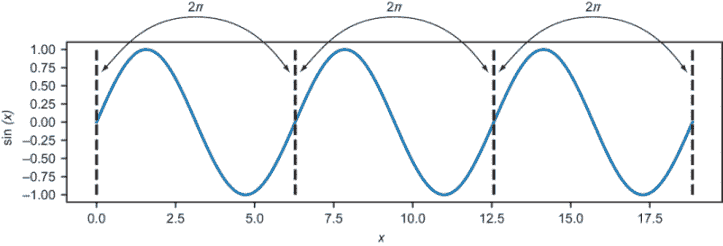

图 13.10 因为正弦函数的周期是 2*π*，所以它的图形在每个 2*π*区间内都有相同的形状。

对于余弦函数，唯一的区别是图形向左移动了*π*/2 个单位，但它仍然每隔 2*π*单位重复一次（图 13.11）。

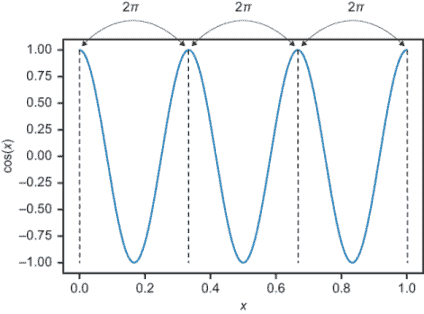

图 13.11 余弦函数的图形与正弦函数的图形形状相同，但它向左移动。它也每 2*π*个单位重复一次。

对于音频来说，每 2*π*秒重复一次的频率是 1/2*π*或大约 0.159 Hz，这对人类耳朵来说太小，无法听到。1.0 的振幅也太小，在 16 位音频中无法听到。为了解决这个问题，让我们编写一个 Python 函数`make_sinusoid(frequency,amplitude)`，该函数产生一个正弦函数，垂直和水平拉伸或压缩以具有更理想的频率和振幅。441 Hz 的频率和 10,000 的振幅应该代表一个可听到的声波。

一旦我们生成了那个函数，我们希望提取 44,100 个均匀分布的函数值传递给 PyGame。提取这种函数值的过程称为*采样*，因此我们可以编写一个名为`sample(f,start,end,count)`的函数，该函数在`t`值在`start`和`end`之间的范围内获取*f*(*t*)的指定计数值。一旦我们得到了所需的正弦函数，我们可以运行`sample (sinusoid,0,1,44100)`来获取一个包含 44,100 个样本的数组，传递给 PyGame，我们就能听到正弦波的声音。

### 13.3.2 改变正弦波的频率

作为第一个例子，让我们创建一个频率为 2 的正弦波，这意味着一个类似于正弦图形的函数，但在零和一之间重复两次。正弦函数的周期是 2*π*，所以默认情况下，它需要 4*π*个单位来重复两次（图 13.12）。

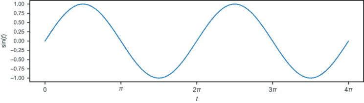

图 13.12 正弦函数在 t = 0 和 t = 4*π*之间重复两次。

要得到正弦函数图形的两个周期，我们需要正弦函数接收从 0 到 4*π*的输入值，但我们希望输入变量*t*从 0 到 1 变化。为了实现这一点，我们可以使用函数 sin(4*π**t**)。从*t* = 0 到*t* = 1，0 到 4*π*之间的所有值都传递给正弦函数。图 13.13 中 sin(4*π**t**)的图形与图 13.12 相同，但将正弦函数的两个完整周期挤压到第一个 1.0 单位内。

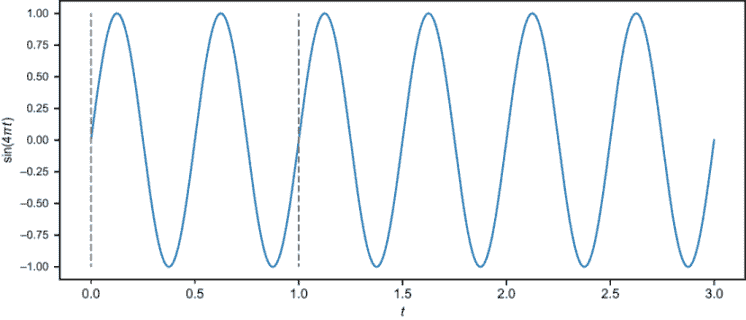

图 13.13 sin(4*π*t)的图形是正弦的，在 t 的每个单位内重复两次，频率为 2。

函数 sin(4*π**t**)的周期是½而不是 2*π*，所以“挤压因子”是 4*π*。也就是说，原始周期是 2*π*，而缩短后的周期是 4*π*的 1/4。一般来说，对于任何常数*k*，形式为*f*(*t*) = sin(*kt*)的函数的周期将缩短*k*倍到 2*π*/ *k*。频率将增加*k*倍，从通常的 1/(2*π*)增加到*k*/2*π*。

如果我们想要一个频率为 441 的正弦函数，适当的*k*值将是 441 · 2 · *π*。这给我们一个频率为

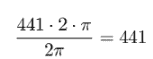

与此相比，增加正弦波的振幅要简单得多。你只需要将正弦函数乘以一个常数因子，振幅就会以相同的因子增加。有了这个，我们就有了定义我们的`make_sinusoid`函数所需的一切：

```
def make_sinusoid(frequency,amplitude):
    def f(t):                                      ❶
        return amplitude * sin(2*pi*frequency*t)   ❷
    return f
```

❶ 定义*f*(*t*) - 返回的正弦函数

❷ 将输入 t 乘以 2 ⋅ *π*倍的频率，然后将正弦函数的输出乘以振幅

我们可以通过创建一个频率为 5、振幅为 4 的正弦函数并从*t* = 0 到*t* = 1 绘制它（图 13.14）来测试这一点：

```
>>> plot_function(make_sinusoid(5,4),0,1)
```

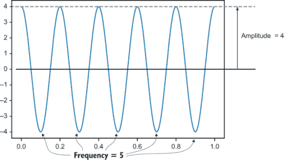

图 13.14 `make_sinusoid(5,4)`的图形高度（振幅）为 4，从 t = 0 到 t = 5 重复 5 次，因此频率为 5。

接下来，我们处理由`make_sinusoid (441,8000)`得到的声音波函数，其频率为 441 Hz，振幅为 8,000。

### 13.3.3 采样和播放声音波

要播放上一节中提到的声音波，我们需要对其进行采样以获取 PyGame 可播放的数字数组。让我们设置

```
sinusoid = make_sinusoid(441,8000)
```

因此，从*t* = 0 到*t* = 1 的正弦函数代表我们尝试播放的声音波的 1 秒钟。我们选择 44,100 个*t*的值，在 0 和 1 之间均匀分布，并且相应的函数值是正弦函数(*t*)的对应值。

我们可以使用 NumPy 函数`np.arange`，它提供了一个给定区间上的均匀分布的数字。例如，`np.arange(0,1,0.1)`给出 10 个均匀分布的值，从 0 开始，在 0.1 单位间隔下小于 1：

```
>>> np.arange(0,1,0.1)
array([0\. , 0.1, 0.2, 0.3, 0.4, 0.5, 0.6, 0.7, 0.8, 0.9])
```

对于我们的应用，我们希望在 0 和 1 之间使用 44,100 个时间值，这些值由 1/44100 单位均匀分布：

```
>>> np.arange(0,1,1/44100)
array([0.00000000e+00, 2.26757370e-05, 4.53514739e-05, ...,
       9.99931973e-01, 9.99954649e-01, 9.99977324e-01])
```

我们希望将正弦函数应用于数组的每个条目，以产生另一个作为结果的 NumPy 数组。NumPy 函数`np.vectorize(f)`接受一个 Python 函数`f`并产生一个新的函数，该函数将相同的操作应用于数组的*每个*条目。因此，对于我们来说，`np.vectorize(sinusoid)(arr)`将正弦函数应用于数组的每个条目。

这几乎是一个完整的函数采样过程。我们需要包含的最后细节是将输出转换为使用 NumPy 数组的`astype`方法得到的 16 位整数值。将这些步骤组合起来，我们可以构建以下通用的采样函数：

```
def sample(f,start,end,count):                    ❶
    mapf = np.vectorize(f)                        ❷
    ts = np.arange(start,end,(end-start)/count)   ❸
    values = mapf(ts)                             ❹
    return values.astype(np.int16)                ❺
```

❶ 输入是函数 f，用于采样范围的起始和结束以及我们想要的值的数量。

❷ 创建一个可以应用于 NumPy 数组的 f 版本

❸ 为函数在所需范围内创建均匀分布的输入值

❹ 将函数应用于 NumPy 数组中的每个值

❺ 将结果数组转换为 16 位整数并返回

配备以下函数，你可以听到 441 Hz 正弦波的声波：

```
sinusoid = make_sinusoid(441,8000)
arr = sample(sinusoid, 0, 1, 44100)
sound = pygame.sndarray.make_sound(arr)
sound.play()
```

如果你将它与 441 Hz 的方波一起播放，你会注意到它演奏的是同一个音符；换句话说，它有相同的音高。然而，声音的质量大不相同；正弦波演奏的声音要平滑得多。它听起来几乎像是来自长笛而不是老式电子游戏。这种声音的质量被称为 *音色*(发音为 *TAM-ber)*。

在本章的剩余部分，我们将专注于由正弦波组合而成的声波。结果是，通过正确的组合，你可以近似任何波形的波，因此可以近似任何你想要的音色。

### 13.3.4 练习

| **练习 13.2**：绘制正切函数 tan(t) = sin(t)/cos(t)。它的周期是多少？**解答**：正切函数在每个周期内都会变得无限大，因此最好在限制的 y 值范围内绘制它：

```
from math import tan
plot_function(tan,0,5*pi)
plt.ylim(−10,10)            ❶
```

❶ 将图形窗口限制在 y 范围 -10 < y < 10 内。一个周期性的 tan(x) 图形看起来是这样的！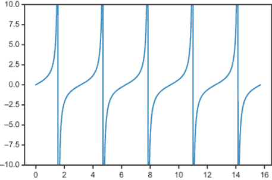因为 tan(t) 只依赖于 cos(t) 和 sin(t) 的值，它至少应该在每 2π 个单位重复一次。实际上，它在每 2π 个单位重复两次；我们可以从图中看到它的周期是 π。|

| **练习 13.3**：sin(3πt) 的频率是多少？周期是多少？**解答**：sin(t) 的频率是 1/(2π)，将自变量乘以 3π 会将这个频率增加 3π 倍。得到的频率是 (3π)/(2π) = 3/2。周期是这个值的倒数，即 2/3。 |
| --- |

| **练习 13.4**：找到 k 的值，使得 cos(kt) 的频率为 5。绘制从零到一的 cos(kt) 函数，并证明它重复了 5 次。**解答**：cos(t) 的默认频率是 1/(2π)，所以 cos(kt) 的频率是 k/(2π)。如果我们想这个值等于 5，我们需要 k = 10π。得到的函数是 cos(10πt)：

```
>>> plot_function(lambda t: cos(10*pi*t),0,1)
```

这里是它的图形，它在 t = 0 到 t = 1 之间重复了五次！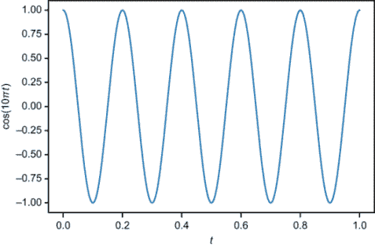|

## 13.4 将声波组合成新的声波

在第六章中，你学习了函数可以被当作向量来处理；你可以将函数相加或者用标量乘以它们来产生新的函数。当你创建定义声波的函数的线性组合时，你可以创造出新的、有趣的声音。

在 Python 中将两个声波组合的最简单方法是采样两个声波，然后将两个数组的对应值相加来创建一个新的声波。我们首先编写一些 Python 代码来添加不同频率的采样声波，它们产生的结果听起来就像是一个音乐和弦，就像你同时弹奏吉他上的几根弦一样。

一旦我们做到了这一点，我们就可以进行一个更高级、更令人惊讶的例子——我们将把几十个不同频率的正弦声波按照规定的线性组合加在一起，其结果看起来和听起来就像之前那个方波一样。

### 13.4.1 将采样声音波相加以构建和弦

NumPy 数组可以使用 Python 中的普通 `+` 运算符进行相加，这使得添加采样声音波变得容易。以下是一个小示例，说明 NumPy 通过将每个数组的对应值相加以构建新数组来进行加法操作：

```
>>> np.array([1,2,3]) + np.array([4,5,6])
array([5, 7, 9])
```

结果表明，使用两个采样声音波进行此操作会产生与同时播放两个声音相同的音效。这里有两组样本：我们 441 Hz 的正弦波和第二个正弦波，其频率约为第一个的 5/4：

```
sample1 = sample(make_sinusoid(441,8000),0,1,44100)
sample2 = sample(make_sinusoid(551,8000),0,1,44100)
```

如果你让 PyGame 同时开始播放一个并立即开始播放下一个，它会几乎同时播放两个声音。如果你运行以下代码，你应该听到由两个不同的音符组成的和弦。如果你单独运行最后两行中的任何一行，你会听到两个单独的音符之一：

```
sound1 = pygame.sndarray.make_sound(sample1)
sound2 = pygame.sndarray.make_sound(sample2)
sound1.play()
sound2.play()
```

现在，使用 NumPy，我们可以将两个样本数组相加以生成一个新的数组，并用 PyGame 播放它。当 `sample1` 和 `sample2` 相加时，会创建一个长度为 44,100 的新数组，包含来自 `sample1` 和 `sample2` 的条目之和。如果你播放这个结果，听起来就像播放之前的声音一样：

```
chord = pygame.sndarray.make_sound(sample1 + sample2)
chord.play()
```

### 13.4.2 绘制两个声音波的叠加

让我们看看在声音波形的图形方面这看起来是什么样子。以下是 `sample1`(441 Hz) 和 `sample2`(551 Hz) 的前 400 个点。在图 13.15 中，你可以看到样本 1 完成了四个周期，而样本 2 完成了五个周期。

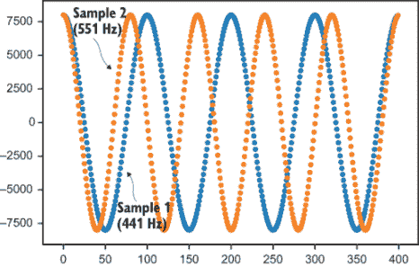

图 13.15 绘制 `sample1` 和 `sample2` 的前 400 个点

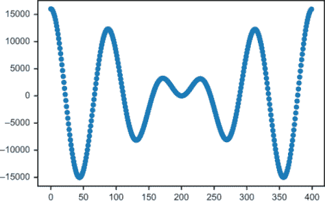

图 13.16 绘制两个波的叠加，`sample1 + sample2`

可能会令人惊讶，尽管 `sample1` 和 `sample2` 是由两个正弦波构建的，但它们的和并不产生正弦波。相反，`sample1 + sample2` 的序列绘制出一个振幅似乎波动的波形。图 13.16 显示了总和的外观。

让我们仔细看看叠加，看看我们是如何得到这个形状的。在样本的第 85 个点附近，两个波都是大的正值，所以总和的第 85 个点也是大的正值。在 350 个点附近，两个波都有大的负值，它们的和也是如此。当两个波对齐时，它们的和甚至更大（更响亮），这被称为 *构造性干涉*。

图 13.17 中有一个有趣的效果，其中值是相反的（在第 200 个点）。例如，`sample1` 是大的正值，而 `sample2` 是大的负值。这导致它们的和接近零，尽管单独的每个波都不接近零。当两个波以这种方式相互抵消时，这被称为 *破坏性干涉*。

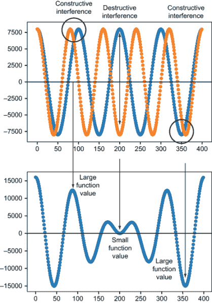

图 13.17 总波的绝对值在发生构造性干涉的地方很大，而在发生破坏性干涉的地方很小。

由于波具有不同的频率，它们会相互进入和退出同步，在建设性和破坏性干涉之间交替。因此，波的叠加不是一个正弦波；相反，它似乎随时间改变振幅。图 13.17 显示了两个图形并排排列，显示了两个样本及其总和之间的关系。

如您所见，叠加正弦波的相对频率会影响结果的图形形状。接下来，我将向您展示一个更极端的例子，当我们使用几十个正弦函数构建线性组合时。

### 13.4.3 构建正弦波的线性组合

让我们从一大堆不同频率的正弦波开始。我们可以制作一个（只要我们想要）正弦函数的列表，从：

sin(2*π*t)，sin(4*π*t)，sin(6*π*t)，sin(8*π*t)，...

这些函数的频率为 1，2，3，4，等等。同样，余弦函数的列表，从

cos(2*π*t)，cos(4*π*t)，cos(6*π*t)，cos(8*π*t)，...

分别具有 1，2，3，4 等频率。我们的想法是，有了这么多不同的频率可供选择，我们可以通过这些函数的线性组合创建各种不同的形状。由于我们将在后面看到的原因，我还会在线性组合中包括一个常量函数 *f*(*x*) = 1。如果我们选择某个最高频率 *N*，正弦、余弦和常量的最一般线性组合如图 13.18 所示。

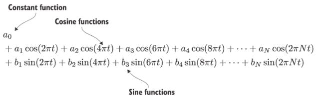

图 13.18 我们线性组合中的正弦和余弦函数

这个线性组合是一个傅里叶级数，它本身是变量 *t* 的函数。它由 2 *N* + 1 个数字指定：常数项 *a* 0，余弦函数上的系数 *a*[1] 到 *aN*，以及正弦函数上的系数 *b*[1] 到 *bN*。我们可以通过将给定的 *t* 值插入每个正弦和余弦函数，并将结果的线性组合相加来评估该函数。让我们在 Python 中这样做，这样我们可以轻松地测试几个不同的傅里叶级数。

`fourier_series` 函数接受一个单个常数 *a* 0，并列出 *a* 和 *b* 包含的系数 *a*[1]，... ，*aN* 和 *b*[1]，... ，*bN*，分别。此函数即使在数组长度不同的情况下也能正常工作；未指定的系数被视为零。请注意，正弦和余弦频率从 1 开始，而 Python 的 `enumerate` 从 0 开始，因此 (*n* + 1) 是对应于任一数组中索引 *n* 处系数的频率：

```
def const(n):                                ❶
    return 1

def fourier_series(a0,a,b):
    def result(t):
        cos_terms = [an*cos(2*pi*(n+1)*t) 
            for (n,an) in enumerate(a)]      ❷
        sin_terms = [bn*sin(2*pi*(n+1)*t)
            for (n,bn) in enumerate(b)]      ❸
        return a0*const(t) + \
            sum(cos_terms) + sum(sin_terms)  ❹
    return result
```

❶ 创建一个常量函数，对于任何输入都返回 1

❷ 使用各自的常量评估所有余弦项，并将结果相加

❸ 使用各自的常量评估正弦项，并将结果相加

❹ 将两个结果与常量系数 *a*[0] 乘以常量函数（1）的值相加

这里有一个示例，调用此函数时 *b*[4] = 1 和 *b*[5] = 1，而所有其他常数为 0。这是一个非常短的傅里叶级数，sin(8πt) + sin(10πt)，其图形如图 13.19 所示。因为频率之比为 4:5，所以结果的形状应该类似于我们最后绘制的图形（图 13.17）：

```
>>> f = fourier_series(0,[0,0,0,0,0],[0,0,0,1,1])
>>> plot_function(f,0,1)
```

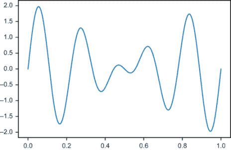

图 13.19 傅里叶级数 sin(8πt) + sin(10πt) 的图形

这是一个很好的测试，看看我们的函数是否工作，但它还没有展示傅里叶级数的全部威力。接下来，我们尝试一个具有更多项的傅里叶级数。

### 13.4.4 使用正弦波构建熟悉函数

让我们创建一个傅里叶级数，它仍然没有常数项和余弦项，但有很多正弦项。具体来说，我们使用以下序列的值来设置 *b*[1]，*b*[2]，*b*[3]，等等：

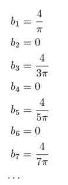

或者 *b[n]* = 0 对于每个偶数 *n*，而当 *n* 为奇数时，*b[n]* = 4/(nπ)。这为我们提供了一个基础，可以构建任意项数的傅里叶级数。例如，第一个非零项是

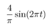

并且在添加下一个项之后，级数变为

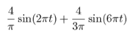

图 13.20 傅里叶级数的第一项和前两项的图形

这是代码，图 13.20 显示了这两个函数同时绘制的图形。

```
>>> f1 = fourier_series(0,[],[4/pi])
>>> f3 = fourier_series(0,[],[4/pi,0,4/(3*pi)])
>>> plot_function(f1,0,1)
>>> plot_function(f3,0,1)
```

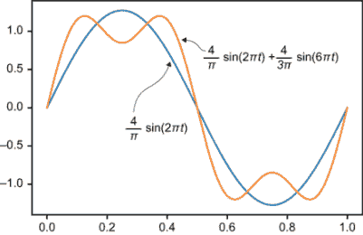

图 13.20 傅里叶级数的第一项和前两项的图形

使用列表推导，我们可以创建一个更长的系数列表，*b[n]*，并程序化地构建傅里叶级数。我们可以留出余弦系数列表为空，那么所有 *a[n]* 的值都将被设置为 0：

```
*b* = [4/(n * pi) 
    if n%2 != 0 else 0 for n in range(1,10)]    ❶
f = fourier_series(0,[],b)
```

❶ 列出 bn = 4/nπ 对于 n 的奇数值和 bn = 0，否则

这个列表涵盖了 1 ≤ *n* < 10，所以非零系数是 *b*[1]，*b*[3]，*b*[5]，*b*[7]，和 *b*[9]。有了这些项，级数的图形看起来像图 13.21。

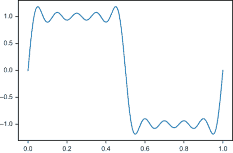

图 13.21 傅里叶级数前 5 个非零项的总和

这是一个有趣的构造性和破坏性干涉模式！在 *t* = 0 和 *t* = 1 附近，所有的正弦函数同时增加，而在 *t* = 0.5 附近，它们同时减少。这种构造性干涉是主要效应，而交替的构造性和破坏性干涉使其他区域的图形相对平坦。当 *n* 的范围达到 19 时，如图 13.22 所示，有 10 个非零项，这种效应更加明显。

```
>>> b = [4/(n * pi) if n%2 != 0 else 0 for n in range(1,20)]
>>> f = fourier_series(0,[],b)
```

如果我们将 *n* 的范围扩展到 99，我们得到 50 个正弦函数的总和，函数在几个大的跳跃之外几乎变得平坦（图 13.23）。

```
>>> b = [4/(n * pi) if n%2 != 0 else 0 for n in range(1,100)]
>>> f = fourier_series(0,[],b)

```


图 13.22 傅里叶级数的前 10 个非零项

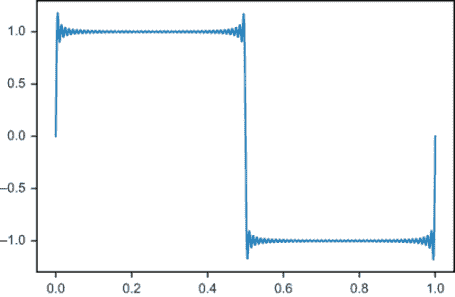

图 13.23 使用 99 项时，傅里叶级数的图形几乎平坦，除了在 0、0.5 和 1.0 处的大步。

如果你放大查看，你可以看到这个傅里叶级数接近我们在本章开头绘制的方波（图 13.24）。

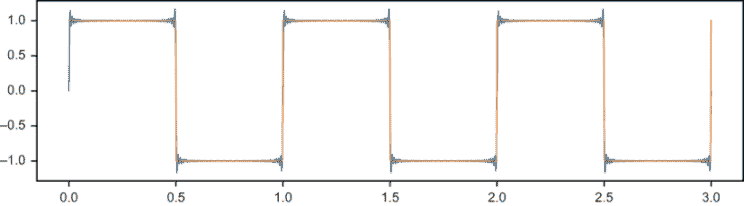

图 13.24 傅里叶级数的前 50 个非零项接近方波，就像我们在本章遇到的第一项函数。

我们在这里所做的是将方波函数构建为一个正弦波的线性组合的近似。我们能够做到这一点是反直觉的！毕竟，傅里叶级数中的所有正弦波都是圆滑的，而方波是平坦且锯齿状的。我们将通过展示如何从任何周期函数开始并恢复其傅里叶级数的系数来逆向工程这个近似，以结束本章。

### 13.4.5 练习

| **练习 13.5-迷你项目**：创建一个方波傅里叶级数的处理版本，使其频率为 441 Hz，然后对其进行采样并确认它不仅看起来像方波。它应该听起来也像方波。 |
| --- |

## 13.5 将声音波分解为其傅里叶级数

我们最后的目的是将任意周期函数，如方波，找出如何将其（或至少其近似）表示为正弦函数的线性组合。这意味着将任何声音波分解为纯音符的组合。作为一个基本示例，我们将查看定义和弦的声音波，并确定哪些音符构成了和弦。更深刻的是，我们可以将任何声音分解为音乐音符：一个人说话，一只狗吠叫，或一辆汽车轰鸣。在这个结果背后是一些优雅的数学思想，而现在你已经拥有了理解它们所需的所有背景知识。

将一个函数分解为其傅里叶级数的过程类似于我们在第一部分中将一个向量表示为基向量的线性组合。这个类比是如何工作的。我们将在函数的向量空间中工作，并将一个函数，如方波，视为一个感兴趣的函数。然后，我们将基视为函数集 sin(2*π**t**)、sin(4*π**t**)、sin(6*π**t**) 等等。在第 13.3 节中，我们将方波近似为从

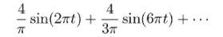

你可以将两个基向量 sin(2*π**t**) 和 sin(6*π**t**) 视为定义无限维函数空间中的两个垂直方向，其他方向由其他基向量定义。方波在 sin(2*π**t**) 方向有一个长度为 4/*π* 的分量，在 sin(6*π**t**) 方向有一个长度为 4/3*π* 的分量。这些是这个基下方波无限列表中的前两个坐标（图 13.25）。

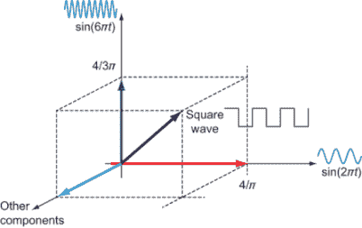

图 13.25 你可以将方波视为函数空间中的一个向量，其 sin(2*π*t)方向上的分量长度为 4/*π*，sin(6*π*t)方向上的分量长度为 4/3*π*。方波在这两个分量之外还有无限多个分量。

我们可以编写一个 `fourier_coefficients(f,N)` 函数，该函数接受一个周期为 1 的函数 *f* 和一个所需的系数数量 *N*。该函数将常数函数以及从 1 ≤ *n* < *N* 的 cos(2*n**π**t*)和 sin(2*n**π**t*)函数视为函数空间中的方向，并找到 *f* 在这些方向上的分量。它返回表示常数函数的傅里叶系数 *a*[0]，以及一系列傅里叶系数 *a*[1]，*a*[2]，...，*aN* 和一系列傅里叶系数 *b*[1]，*b*[2]，...，*bN*。

### 13.5.1 使用内积找到向量分量

在第六章中，我们介绍了如何使用函数进行向量加法和标量乘法，这些操作与 2D 和 3D 向量的操作类似。我们还需要一个与点积相对应的工具。点积是**内积**的一个例子，它通过将两个向量相乘得到一个标量，该标量衡量了两个向量的对齐程度。

让我们暂时回顾一下 3D 世界，并展示如何使用点积找到 3D 向量的分量，然后我们将做同样的事情来找到正弦函数基中的函数分量。假设我们的目标是找到向量 ***v*** = (3, 4, 5) 在标准基向量 ***e***[1] = (1, 0, 0)，***e***[2] = (0, 1, 0)，和 ***e***[3] = (0, 0, 1) 方向上的分量。这个问题如此明显，以至于我们从未深入思考过。分量分别是 3，4，和 5，这就是坐标(3, 4, 5)的含义！

在这里，我将向您展示另一种使用点积找到 ***v*** = (3, 4, 5) 的分量方法。这将是多余的，因为我们已经有了答案，但对于函数向量的情况将很有用。请注意，***v*** 与标准基向量的每个点积都给我们回一个分量：

*v* · *e*[1] = (3, 4, 5) · (1, 0,0) = 3 + 0 + 0 = 3

*v* · *e*[2] = (3, 4, 5) · (0, 1,0) = 0 + 4 + 0 = 4

*v* · *e*[3] = (3, 4, 5) · (0, 0,1) = 0 + 0 + 5 = 5

这些点积立即告诉我们如何将 *v* 表示为标准基的线性组合：***v*** = 3***e***[1] + 4***e***[2] + 5***e***[3]。请注意，这仅因为点积与我们的长度和角度定义一致。任何一对垂直的标准基向量都具有零点积：

*e*[1] · *e*[2] = *e*[2] · *e*[3] = *e*[3] · *e*[1] = 0

标准基向量与自身的点积产生它们的（平方）长度为 1：

*e*[1] · *e*[1] = *e*[2] · *e*[2] = *e*[3] · *e*[3] = |*e*[1]|² = |*e*[2]|² = |*e*[3]|² = 1

另一种看待这些关系的方法是，根据点积，标准基向量在另一个标准基向量的方向上没有分量。此外，每个标准基向量在其自身方向上的分量是 1。如果我们想发明一个内积来计算函数的分量，我们需要我们的基具有相同的理想特性。换句话说，我们需要知道我们的基函数，如 sin(2*π**t*)，cos(2*π**t*) 等，都是垂直的并且长度为 1。我们将为函数创建一个内积并测试这些事实。

### 13.5.2 为周期函数定义内积

假设 *f*(*t*) 和 *g*(*t*) 是在区间 *t* = 0 到 *t* = 1 上定义的两个函数，并且它们每隔一个单位的 *t* 重复一次。我们可以将 *f* 和 *g* 的内积写作 <*f* , *g* >，并通过一个定积分来定义它：


让我们在 Python 代码中实现这一点，将积分近似为 Riemann 和（就像我们在第八章中做的那样），这样你就可以了解这个内积是如何像熟悉的点积一样工作的。这个 Riemann 和默认为 1,000 个时间步长，如下所示：

```
def inner_product(f,g,N=1000):
    dt = 1/N                                    ❶
    return 2*sum([f(t)*g(t)*dt 
                  for t in np.arange(0,1,dt)])  ❷
```

❶ dt 的大小默认为 1/1000 = 0.001。

❷ 对于每个时间步长，积分的贡献是 *f*(*t*) * g(*t*) * dt。根据公式，积分的结果乘以 2。

与点积类似，这个积分近似是输入向量值的乘积之和。它不是坐标乘积之和，而是函数值乘积之和。你可以将函数的值视为一组无限多的坐标，而这个内积可以看作是这些坐标上的“无限点积”。 

让我们深入探讨这个内积。为了方便起见，让我们定义一些 Python 函数来创建我们基中的第 *n* 次正弦和余弦函数，然后我们可以使用 `inner_product` 函数来测试它们。这些函数类似于第 13.3.2 节中 `make_sinusoid` 函数的简化版本：

```
def s(n):                     ❶
    def f(t):
        return sin(2*pi*n*t)
    return f

def c(n):                      ❷
    def f(t):
        return cos(2*pi*n*t)
    return f
```

❶ s(n) 接受一个整数 n 并返回函数 sin(2n*π*t)。

❷ c(n) 接受一个整数 n 并返回函数 cos(2n*π*t)。

两个三维向量（1, 0, 0）和（0, 1, 0）的点积为零，这证实了它们是垂直的。我们的内积表明，我们所有的基函数对（近似地）都是垂直的。例如，

```
>>> inner_product(s(1),c(1))
4.2197487366314734e−17
>>> inner_product(s(1),s(2))
−1.4176155163484784e−18
>>> inner_product(c(3),s(10))
−1.7092447249233977e−16
```

这些数字非常接近零，证实了 sin(2*π**t*) 和 cos(2*π**t*) 是垂直的，以及 sin(2*π**t*) 和 sin(4*π**t*) 也是垂直的，同样 cos(6*π**t*) 和 cos(20*π**t*) 也是垂直的。使用我们在这里不会介绍的精确积分公式，可以 *证明* 对于任何整数 *n* 和 *m*：

〈sin(2*n*π*t*), cos(2*m*π*t*)〉 = 0

对于任何两个不同的整数 *n* 和 *m*，都有

〈sin(2*n*π*t*), sin(2*m*π*t*)〉 = 0

和

〈cos(2*n*π*t*), cos(2*m*π*t*)〉 = 0

这意味着，相对于这个内积，我们所有的正弦基函数都是相互垂直的；没有一个在另一个方向上有分量。我们还需要检查的是，内积意味着我们的基向量在自己的方向上有 1 的分量。实际上，在数值误差范围内，这似乎是真的：

```
>>> inner_product(s(1),s(1))
1.0000000000000002
>>> inner_product(c(1),c(1))
0.9999999999999999
>>> inner_product(c(3),c(3))
1.0
```

尽管我们在这里不会详细讲解，但使用积分公式可以直接证明，对于任何整数 *n*

〈sin(2*n*π*t*), sin(2*n*π*t*)〉 = 1

和

〈cos(2*n*π*t*), cos(2*n*π*t*)〉 = 1

我们需要做的最后一件整理工作是将常数函数包含在这个讨论中。我之前承诺过要解释为什么我们需要在傅里叶级数中包含常数项，现在我可以给出一个初步的解释。常数函数是构建完整函数基所必需的；如果不包含它，就像在 3D 空间的基中省略 ***e***[2]，只使用 ***e***[1] 和 ***e***[3] 一样。如果你这样做，有些函数你就无法用基向量构建出来。

任何常数函数都垂直于我们基中的所有正弦和余弦函数，但我们需要选择常数函数的值，使其在自身方向上的分量是 1。也就是说，如果我们实现一个 Python 函数 `const(*t*)`，我们应该找到 `inner_product(const,const)` 返回 1。`const` 返回的正确常数值是 1/√2（你可以在下面的练习中检查这个值是否合理！）：

```
from math import sqrt

def const(n):
    return 1 /sqrt(2)
```

在此定义的基础上，我们可以确认常数函数具有正确的属性：

```
>>> inner_product(const,s(1))
−2.2580204307905138e−17
>>> inner_product(const,c(1))
−3.404394821604484e−17
>>> inner_product(const,const)
1.0000000000000007
```

我们现在已经拥有了寻找周期函数傅里叶系数所需的工具。这些系数不过是函数在我们定义的基中的组成部分。

### 13.5.3 编写一个寻找傅里叶系数的函数

在 3D 示例中，我们看到了向量 ***v*** 与基向量 ***e*** *i* 的点积给出了 ***v*** 在 ***e*** *i* 方向上的分量。我们将对周期函数 *f* 使用相同的过程。

对于 *n* ≥ 1 的系数 *a[n]* 告诉我们 *f* 在基函数 cos(2*n**π**t*) 方向上的分量。它们是通过计算 *f* 与这些基函数的内积来得到的：

*a[n]* = 〈*f*, cos(2*n*π*t*)〉 , n ≥ 1

同样，每个傅里叶系数 *b[n]* 告诉我们 *f* 在基函数 sin(2*n**π**t*) 方向上的分量，也可以通过内积来计算：

*b[n]* = 〈*f*, sin(2*n*π*t*)〉

最后，系数 *a* 0 是 *f* 与常数函数的内积，其值为 1/√2。所有这些傅里叶系数都可以使用我们之前编写的 Python 函数来计算，因此我们准备好编写 `fourier_coefficients` 函数。记住，函数的第一个参数是我们想要分析的功能，第二个参数是我们想要的最大正弦和余弦项数：

```
def fourier_coefficients(f,N):
    a0 = inner_product(f,const)     ❶
    an = [inner_product(f,c(n)) 
          for n in range(1,N+1)]    ❷
    bn = [inner_product(f,s(n)) 
          for n in range(1,N+1)]    ❸
    return a0, an, bn
```

❶ 常数项 *a*[0] 是 f 与常数基函数的内积。

❷ 系数 an 是 f 与 cos(2n*π*t) 的内积，对于 1 < *n* < *N* + 1。

❸ 系数 bn 是 f 与 sin(2n*π*t) 的内积，对于 1 ≤ *n* < *N* + 1。

作为合理性检查，傅里叶级数应该返回其自身的系数。例如

```
>>> f = fourier_series(0,[2,3,4],[5,6,7])
>>> fourier_coefficients(f,3)
(−3.812922200197022e−15,
 [1.9999999999999887, 2.999999999999999, 4.0],
 [5.000000000000002, 6.000000000000001, 7.0000000000000036])
```

注意：如果你想让输入和输出匹配非零常数项，你需要将 const 函数修改为 *f*(*t*) = 1/√2 而不是 *f*(*t*) = 1。参见练习 13.8。

现在我们能够自动计算傅里叶系数，我们可以通过构建一些有趣形状的周期函数的傅里叶近似来结束我们的探索。

### 13.5.4 求方波的傅里叶系数

我们在上一个章节中看到，方波的傅里叶系数除了奇数 *n* 值的 *b[n]* 系数外都是零。也就是说，傅里叶级数是由 sin(2*n**π**t*) 的奇数 *n* 值的线性组合构成的。对于奇数 *n*，系数是 *bn = 4/n**π*。我没有解释为什么这些是系数，但现在我们可以检查我们的工作。

为了使周期为 *t* 的方波重复出现，我们可以在 Python 中使用 `t%1` 的值，它计算 *t* 的分数部分。因为，例如，`2.3` `%` `1` 是 `0.3`，而 `0.3` `%` `1` 仍然是 `0.3`，以 `t` `%` 1 为术语编写的函数自动具有周期 1。当 `t` `%` `1` `<` `0.5` 时，方波值为 +1，否则为 −1。

```
def square(t):
    return 1 if (t%1) < 0.5 else −1
```

让我们看看这个方波的第一个 10 个傅里叶系数。运行

```
a0, a, b = fourier_coefficients(square,10)
```

你会看到 *a*[0] 和 *a* 的条目都很小，就像 *b* 的其他条目一样。*b*[1]、*b*[3]、*b*[5] 等的值由 `b[0]`、`b[2]`、`b[4]` 等表示，因为 Python 数组是零索引的。这些值都接近预期的值：

```
>>> b[0], 4/pi
(1.273235355942202, 1.2732395447351628)
>>> b[2], 4/(3*pi)
(0.4244006151333577, 0.4244131815783876)
>>> b[4], 4/(5*pi)
(0.2546269646514865, 0.25464790894703254)
```

我们已经看到，具有这些系数的傅里叶级数是对方波图的稳健近似。让我们通过查看两个我们之前没有见过的示例函数，并将傅里叶级数与原始函数一起绘制来结束本节，以展示近似是如何工作的。

### 13.5.5 其他波形的傅里叶系数

接下来，我们考虑更多可以用傅里叶变换建模的函数，而不仅仅是方波图。图 13.26 显示了新的、有趣形状的波形，称为锯齿波。

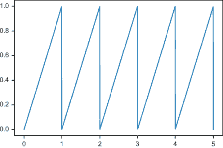

图 13.26 一个锯齿波在五个周期内绘制

在 *t* = 0 到 *t* = 1 的区间内，锯齿波与函数 *f*(*t*) = *t* 相同，然后每单位重复一次。为了将锯齿波定义为 Python 函数，我们可以简单地写出

```
def sawtooth(t):
    return t%1
```

要看到其包含最多 10 个正弦和余弦项的傅里叶级数近似，我们可以直接将傅里叶系数代入我们的傅里叶级数函数中。如图 13.27 所示，将其与锯齿波一起绘制，我们可以看到它有很好的拟合度。

```
>>> approx = fourier_series(*fourier_coefficients(sawtooth,10))
>>> plot_function(sawtooth,0,5)
>>> plot_function(approx,0,5)
```

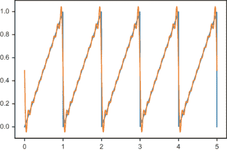

图 13.27 图 13.26 中的原始锯齿波及其傅里叶级数近似

再次强调，使用仅由平滑的正弦和余弦波线性组合来逼近具有尖锐角的功能，其接近程度令人印象深刻。这个函数恰好有一个非零的常数系数 *a*[0]。这是必需的，因为此函数的值仅在零以上，而正弦和余弦函数贡献的是负值。

作为最后的例子，看看这本书源代码中定义的以下函数 `speedbumps(*t*)`。图 13.28 显示了该函数的图形。

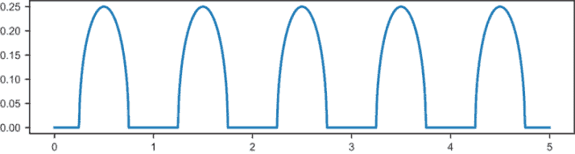

图 13.28 在源代码中定义为 `speedbumps(*t*)` 的函数，它在平坦的延伸和圆形突起之间交替

这个函数的实现并不重要，但这个例子很有趣，因为它对于余弦函数有非零系数，而对于正弦函数则全部为零。即使有 10 项，我们也能得到一个好的近似。图 13.29 显示了包含 *a*[0] 和十个余弦项（系数 *b[n]* 全为零）的傅里叶级数的图形。

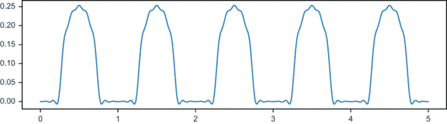

图 13.29 `speedbumps(*t*)` 函数傅里叶级数的常数项和前 10 个余弦项

当我们绘制这些近似时，可以看到一些波动，但当这些波形转换为声音时，傅里叶级数可以足够好。因为我们能够将所有形状的波形转换为它们的傅里叶系数列表，我们可以有效地存储和传输音频文件。

### 13.5.6 练习

| **练习 13.6**: 向量 ***u***[1] = (2, 0, 0), ***u***[2] = (0, 1, 1), 和 ***u***[3] = (1, 0, −1) 构成 ℝ³ 的一个基。对于向量 ***v*** = (3, 4, 5)，计算三个点积 *a*[1] = *v* · ***u***[1], *a*[2] = *v* · ***u***[2], 和 *a*[3] = *v* · ***u***[3]。证明 ***v*** 不等于 *a*[1] ***u***[1] + *a*[2] ***u***[2] + *a*[3] ***u***[3]。为什么它们不相等？**解答**: 点积为*a*[1] = ***v*** · ***u***[1] = (3, 4, 5) · (2, 0, 0) = 6*a*[2] = ***v*** · ***u***[2] = (3, 4, 5) · (0, 1, 1) = 9*a*[3] = ***v*** · ***u***[3] = (3, 4, 5) · (1, 0,−1) = −2。这使得线性组合 6 · (2, 0, 0) + 9 · (0, 1, 1) − 2 · (1, 0, −1) = (16, 9, 2)，这并不等于 (3, 4, 5)。这种方法不能给出正确的结果，因为这些基向量长度不为 1，且它们之间不垂直。 |
| --- |
| **练习 13.7-迷你项目**: 假设 *f*(*t*) 是常数，即 *f*(*t*) = *k*。使用内积的积分公式找到一个值 *k* 使得 <*f* , *f* > = 1。是的，我已经告诉你 *k* =1/√2，但看看你是否能自己得到这个值！ |
| **解答**：如果 *f*(*t*) = *k*，那么 <*f* , *f* > 由以下积分给出：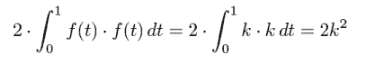（常数函数 *k*² 从 0 到 1 下的面积是 *k*²。）如果我们想使 2 *k*² 等于 1，那么 *k*² = ，*k* = √1/2 = 1/√2。 |

| **练习 13.8**：更新 `fourier_series` 函数，使用 *f*(*t*) = 1/√2 作为常数函数，而不是 *f*(*t*) = 1。**解答**：

```
def fourier_series(a0,a,b):
    def result(t):
        cos_terms = [an*cos(2*pi*(n+1)*t) for (n,an) in enumerate(a)]
        sin_terms = [bn*sin(2*pi*(n+1)*t) for (n,bn) in enumerate(b)]
        return a0/sqrt(2) + sum(cos_terms) + sum(sin_terms)          ❶
    return result
```

❶ 将系数 *a*[0] 乘以常数函数 *f*(*t*) = 1/√2，并将其加到傅里叶级数的结果中，无论 t 的值如何 |

| **练习 13.9-迷你项目**：播放 441 Hz 的锯齿波，并将其与您在该频率下播放的方波和正弦波进行比较。**解答**：我们可以创建一个振幅为 8,000、频率为 441 的修改后的锯齿波函数，然后对其进行采样，传递给 PyGame：

```
def modified_sawtooth(t):
    return 8000 * sawtooth(441*t)
arr = sample(modified_sawtooth,0,1,44100)
sound = pygame.sndarray.make_sound(arr)
sound.play()
```

人们常常将锯齿波的声音与弦乐器，如小提琴的声音相比较。|

## 概述

+   声波是随时间传播的空气压力变化，到达我们的耳朵时，我们将其感知为声音。我们可以将声波表示为一个函数，该函数大致表示随时间变化的空气压力变化。

+   PyGame 和大多数其他数字音频系统使用 *采样* 音频。这些系统不是使用定义声波函数，而是使用函数在均匀间隔下的值数组。例如，CD 音频通常每秒使用 44,100 个值。

+   形状随机的声波听起来像噪音，而形状在固定间隔内重复的波产生明确的音乐音符。在某个间隔上重复其值的函数称为 *周期函数*。

+   正弦和余弦函数是周期函数，它们的图形重复称为 *正弦波* 的曲线形状。

+   正弦和余弦函数每 2*π* 个单位重复其值。这个值称为它们的 *周期*。周期函数的 *频率* 是周期的倒数，对于正弦和余弦来说，是 1/(2*π*)。

+   形式为 sin(2*n**π**t*) 或 cos(2*n**π**t*) 的函数具有频率 *n*。高频声波函数产生高音调的音符。

+   周期函数的最大高度称为其 *振幅*。将正弦或余弦函数乘以一个数字会增加函数的振幅和相应声波的音量。

+   要创建同时播放两个声音的效果，您可以添加定义它们对应声波的函数，以创建一个新的函数和一个新的声波。通常，您可以通过现有声波的任何线性组合来创建一个新的声波。

+   由一个常数函数以及形式为 sin(2*n**π**t*) 和 cos(2*n**π**t*) 的函数的线性组合，对于各种 *n* 的值，称为傅里叶级数。尽管傅里叶级数是由平滑的正弦和余弦函数构建的，但它可以很好地近似任何周期函数，甚至那些具有尖锐拐角的函数，如方波。

+   你可以将不同频率的正弦和余弦函数以及常数函数视为周期函数向量空间的基。这些基向量的线性组合，用以最佳逼近给定函数的，被称为**傅里叶系数**。

+   我们可以使用二维或三维向量与标准基向量的点积来找到其在该基向量方向上的分量。

+   类似地，我们可以取一个周期函数与正弦或余弦函数的特殊内积，以找到与该函数相关联的分量。周期函数的内积是在指定范围内取定的定积分，在我们的例子中，是从零到一。
