# 14 将函数拟合到数据中

本章涵盖了

+   测量函数与数据集拟合的紧密程度

+   探索由常数确定的函数空间

+   使用梯度下降优化“拟合”质量

+   使用不同类型的函数建模数据集

在第二部分中你学到的微积分技术需要适用性良好的函数。为了存在导数，函数需要足够平滑，并且为了计算精确的导数或积分，你需要一个具有简单公式的函数。对于大多数现实世界的数据，我们并不这么幸运。由于随机性或测量误差，我们在野外很少遇到完全平滑的函数。在本章中，我们介绍了如何将杂乱的数据用简单的数学函数进行建模−这是一个称为 *回归* 的任务。

我将带您通过一个真实数据集的例子，这个数据集包括在 CarGraph.com 网站上出售的 740 辆二手车的信息。这些车都是丰田普锐斯，并且都报告了行驶里程和销售价格。将这些数据绘制在散点图上，如图 14.1 所示，我们可以看到随着里程的增加，价格呈下降趋势。这反映了汽车在使用过程中会贬值。我们的目标是找到一个简单的函数来描述二手普锐斯价格随里程增加的变化。

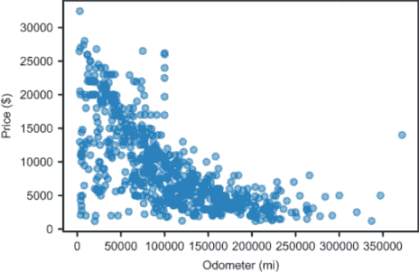

图 14.1 CarGraph.com 上出售的二手丰田普锐斯的售价与里程的对比图

我们无法绘制一个穿过所有这些点的平滑函数，即使我们能够做到，那也是没有意义的。其中许多点是 *异常值*，可能存在错误（例如，图 14.1 中那些售价低于 5000 美元的几乎全新的汽车）。当然，还有其他因素会影响二手车的再销售价格。我们不应该期望仅凭里程就能准确评估价格。

我们能做的是找到一个函数来近似这些数据的变化趋势。我们的函数 *p*(*x*) 以里程 *x* 作为输入，并返回给定里程的普锐斯的典型价格。为了做到这一点，我们需要对这个函数的类型做出一个 *假设*。我们可以从最简单的例子开始：一个线性函数。

在第七章中，我们以多种形式探讨了线性函数，但在这章中，我们将以 *p*(*x*) = *ax* + *b* 的格式来书写这些函数，其中 *x* 是汽车的行驶里程，*p* 是其价格，而 *a* 和 *b* 是决定函数形状的数字。通过选择 *a* 和 *b*，这个函数就是一个想象中的机器，它根据丰田普锐斯的行驶里程预测其价格，如图 14.2 所示。

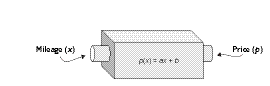

图 14.2 从里程 x 预测价格 p 的线性函数示意图

记住，*a*是线的斜率，*b*是它在零点的值。对于像*a* = −0.05 和*b* = 20,000 这样的值，函数的图形变成了一条从 20,000 美元的价格开始，每增加一英里里程就减少 0.05 美元的线（图 14.3）。

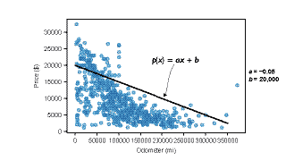

图 14.3 基于里程预测普锐斯的价格，使用形式为*p*(x) = *ax* + *b*的函数，其中*a* = −0.05 和*b* = 20,000

这种预测函数的选择意味着新普锐斯的价值为 20,000 美元，并且以每英里 0.05 美元的速度折旧或损失价值。这些值可能正确也可能不正确；事实上，我们有理由相信它们并不完美，因为这条线的图形与大多数数据相差甚远。找到*a*和*b*的值，使得*p*(x)尽可能好地遵循数据趋势的任务被称为线性回归。一旦我们找到最佳值，我们就可以说*p*(x)是最佳拟合线。

如果*p*(x)要接近真实数据，那么斜率*a*应该是负的，这样随着里程的增加，预测的价格就会下降，这似乎是合理的。然而，我们不必假设这一点，因为我们可以直接从原始数据中实现一个算法来解决这个问题。这就是为什么回归是机器学习算法的一个简单例子；它仅基于数据，推断出趋势，然后对新数据点做出预测。

我们施加的唯一真正约束是，我们的算法寻找线性函数。线性函数假设折旧率是恒定的−即汽车在前 1,000 英里内的价值损失与在 10 万到 10 万 1,000 英里内的价值损失相同。传统智慧认为这不是事实，实际上，汽车一旦离开停车场就会损失很大一部分价值。我们的目标不是找到完美的模型，而是找到一个简单但仍然表现良好的模型。

我们需要做的第一件事是能够衡量一个给定的线性函数（即给定*a*和*b*的选择）如何预测普锐斯的价格。为此，我们编写一个 Python 函数，称为成本函数，它接受一个函数*p*(x)作为输入，并返回一个数字，告诉我们它距离原始数据有多远。对于任何一对数字*a*和*b*，我们都可以使用成本函数来衡量函数*p*(x) = *ax* + *b*如何拟合数据集。对于每一对(*a*, *b*)，都有一个线性函数，因此我们可以将我们的任务视为探索这种对对的 2D 空间，并评估它们所暗示的线性函数。

图 14.4 显示，选择正的*a*和*b*值会产生一条向上倾斜的线。如果这是我们的价格函数，那么它将意味着汽车在行驶过程中会增值，这不太可能。


图 14.4 一对数字 (*a, b*) 定义了一个线性函数，我们可以在图上作为一条线来绘制。对于 a 的正值，图线向上倾斜。

我们的成本函数将此类线与实际数据进行比较，并返回一个大的数字，表示该线远离数据。线越接近数据，成本越低，拟合度越好。

我们希望的是 *a* 和 *b* 的值，不仅使成本函数变小，而且使其成为可能的最小函数。我们将编写的第二个主要函数称为 `linear_regression`，它自动找到这些最佳的 *a* 和 *b* 值。这反过来又告诉我们最佳拟合线。为了实现这一点，我们构建一个函数，它告诉我们任何 *a* 和 *b* 值的成本，并使用第十二章中提到的梯度下降技术来最小化它。让我们从在 Python 中实现一个成本函数来衡量函数与数据集的拟合程度开始。

## 14.1 测量函数拟合质量

我们将编写我们的成本函数，使其能够适用于任何数据集，而不仅仅是我们的二手车集合。这允许我们在更简单（虚构的）数据集上测试它，这样我们就可以看到它是如何工作的。考虑到这一点，成本函数是一个接受两个输入的 Python 函数。其中一个是我们要测试的 Python 函数 *f*(*x*)，另一个是要测试的数据集，即 (*x*, *y*) 对的集合。对于二手车示例，我们的 *f*(*x*) 可能是一个线性函数，它为任何里程数提供美元成本，而 (*x*, *y*) 对是数据集中里程和价格的实际值。

成本函数的输出是一个单一的数字，衡量 *f*(*x*) 的值与正确的 *y* 值之间的距离。如果 *y* = *f*(*x*)，对于每一个 *x*，函数是数据的完美拟合，因此成本函数返回零。更现实的情况是，函数不会与所有数据点完全一致，它将返回一些正数。我们实际上将编写两个成本函数来比较它们，并给你一个成本函数是如何工作的感觉：

+   `sum_error` − 将数据集中每个 (*x*, *y*) 值的 *f*(*x*) 到 *y* 的距离相加

+   `sum_square_error` − 将这些距离的平方相加

这其中第二个是实践中最常用的成本函数，你很快就会明白原因。

### 14.1.1 从函数测量距离

在本书的源代码中，你可以找到一个名为 `test_data` 的虚构数据集。它是一个 (*x*, *y*) 值的 Python 列表，其中 *x* 值从 -1 到 1。我故意选择了 *y* 值，使得点靠近线 *f*(*x*) = 2*x*。图 14.5 显示了 `test_data` 数据集的散点图，并显示在那条线旁边。

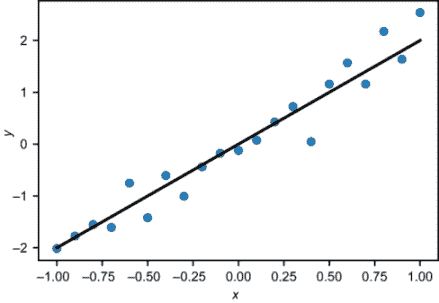

图 14.5 一组故意靠近线 *f*(*x*) = 2x 的随机生成数据

事实是 *f*(*x*) = 2*x* 与数据集保持接近，意味着对于数据集中的任何 *x* 值，2*x* 是对应 *y* 值的一个相当好的猜测。例如，这个点

(*x*, *y*) = (0.2, 0.427)

是数据集中的实际值。仅给定 *x* = 0.2 的值，我们的 *f*(*x*) = 2*x* 会预测 *y* = 0.4。|*f*(0.2) − 0.4| 的绝对值告诉我们这个误差的大小，大约是 0.027。

误差值，即实际 *y* 值与函数 *f*(*x*) 预测的值之间的差异，可以想象为实际 (*x*, *y*) 点到 *f* 图像的垂直距离。图 14.6 显示了误差距离被绘制为垂直线。

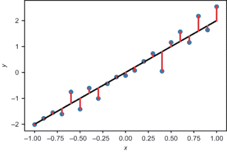

图 14.6 误差值是函数 *f*(*x*) 和实际 y 值之间的差异。

这些误差中有些比其他的小，但我们如何量化拟合的质量？让我们将此与函数 *g*(*x*) = 1 − *x* 的图像进行比较，它显然是一个不好的拟合（图 14.7）。

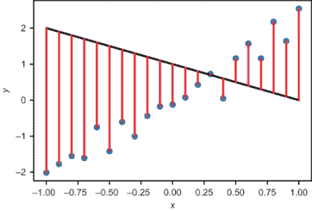

图 14.7 展示了具有较大误差值的函数

我们的功能，*g*(*x*) = 1 − *x*，恰好接近一个点，但误差总和要大得多。因此，我们可以通过添加所有误差来编写我们的第一个成本函数。误差总和越大，拟合越差，而值越低，拟合越好。要实现此功能，我们只需遍历 (*x*, *y*) 对，取 *f*(*x*) 和 *y* 之间差异的绝对值，并求和结果：

```
def sum_error(f,data):
    errors = [abs(*f*(*x*) − y) for (x,y) in data]
    return sum(errors)
```

要测试这个函数，我们可以将我们的 *f*(*x*) 和 *g*(*x*) 转换为代码：

```
def f(x): 
    return 2*x

def *g*(*x*): 
    return 1-x
```

如预期，*f*(*x*) = 2*x* 的总误差低于 *g*(*x*) = 1 − *x*：

```
>>> sum_error(f,test_data)
5.021727176394801
>>> sum_error(g,test_data)
38.47711311130152
```

这些输出的确切值并不重要；重要的是它们之间的比较。因为 *f*(*x*) 的误差总和低于 *g*(*x*)，我们可以得出结论，*f*(*x*) 是给定数据的更好拟合。

### 14.1.2 误差平方和

`sum_error` 函数可能是衡量数据点到直线距离的最明显方式，但在实践中，我们将使用一个求和所有误差平方的成本函数。这样做有几个很好的理由。最简单的是，平方距离函数是光滑的，因此我们可以使用导数来最小化它，而绝对值函数不是光滑的，所以我们不能在所有地方取其导数。记住函数 |*x*| 和 *x*² 的图像（图 14.8），两者在 *x* 离 0 更远时都返回更大的值，但只有后者在 *x* = 0 处是光滑的，并且在该处有导数。

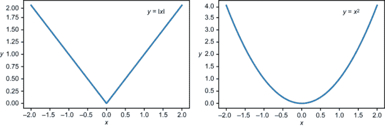

图 14.8 *y* = |*x*| 的图像在 *x* = 0 处不光滑，但 *y* = *x*² 的图像是光滑的。

给定一个测试函数*f*(*x*)，我们可以查看每个(*x*, *y*)对，并将(*f*(*x*) − *y*)²的值添加到成本中。`sum_squared_error`函数就是这样做的，它的实现与`sum_error`没有太大区别。我们只需要平方误差而不是取其绝对值：

```
def sum_squared_error(f,data):
    squared_errors = [(f(x) − y)**2 for (x,y) in data]
    return sum(squared_errors)
```

我们还可以可视化这个成本函数。我们不是通过观察点与函数图像之间的垂直距离来观察这些距离，我们可以将这些距离视为正方形的边缘。每个正方形的面积是该数据点的平方误差，所有正方形的总面积是`sum_squared_error`的结果。图 14.9 中正方形的总面积显示了`test_data`与*f*(*x*) = 2*x*之间的平方误差之和。（注意，由于 x 轴和 y 轴有不同的刻度，这些正方形看起来并不像正方形！）

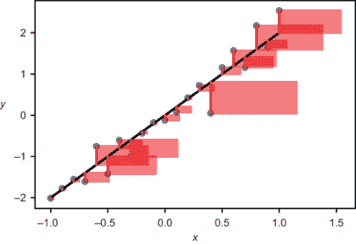

图 14.9 展示函数与数据集之间平方误差之和的图像

图 14.9 中的*y*值，其距离图中的图形是图 14.9 的两倍，通过四倍的因子对平方误差总和做出贡献。选择这个成本函数的一个原因是它更严厉地惩罚不良拟合。对于*h*(*x*) = 3*x*，你可以看到正方形相当大（图 14.10）。

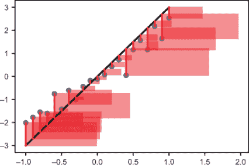

图 14.10 相对于测试数据展示 h(*x*) = 3*x*的`sum_squared_error`

对于*g*(*x*) = 1 − *x*，绘制平方误差是不值得的，因为正方形太大，几乎填满了整个图表区域，并且相互重叠很大。尽管如此，你可以看到，对于*f*(*x*)和*g*(*x*)，`sum_squared_error`的值差异甚至比`sum_error`的差异更剧烈：

```
>>> sum_squared_error(f,test_data)
2.105175107540148
>>> sum_squared_error(g,test_data)
97.1078879283203
```

图 14.8 中的*y* = *x*²的图像非常平滑，而且如果你通过改变定义它的参数*a*和*b*来移动这条线，成本函数也会“平滑”地改变。因此，我们将继续使用`sum_squared_error`成本函数。

### 14.1.3 计算汽车价格函数的成本

我将首先对普锐斯随着行驶里程的增加而贬值的情况进行一个有根据的猜测。丰田普锐斯有多种不同的型号，但我猜测平均零售价格约为$25,000。为了简化计算，我们的第一个、直观的模型假设它们在行驶了 125,000 英里后仍保持在道路上，之后它们的市值正好为$0。这意味着汽车的平均折旧率为每英里$0.20。这意味着以里程*x*为条件的普锐斯价格*p*可以通过从起始价格$25,000 中减去 0.2*x*美元的折旧来计算，这意味着*p*(*x*)是一个线性函数，因为它具有熟悉的形式，*p*(*x*) = *ax* + *b*，其中*a* = −0.2 和*b* = 25,000：

*p*(*x*) = −0.2*x* + 25,000

让我们通过将其与 CarGraph 数据（图 14.11）并排放置来查看这个函数在图上的样子。你可以在本章的源代码中找到这些数据和绘制它的 Python 代码。

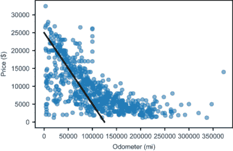

图 14.11 使用我假设的折旧函数的二手普锐斯价格与里程的散点图

很明显，数据集中许多汽车已经超过了我对 125,000 英里的猜测。这意味着我对折旧率的猜测可能太高了。让我们尝试每英里 0.10 美元的折旧率，这意味着定价函数：

*p*(*x*) = −0.10*x* + 25,000

这也不是完美的。我们可以从图 14.12 中的图表中看到，这个函数高估了大多数汽车的价格。


图 14.12 绘制一个假设每英里折旧$0.10 的不同函数

我们还可以实验起始值，我们假设它是$25,000。根据经验，一辆车一旦离开停车场就会失去很大一部分价值，所以对于行驶里程很少的二手车来说，$25,000 可能是一个高估。如果一辆车在离开停车场时价值下降了 10%，那么零里程时的$22,500 可能给我们更好的结果（图 14.13）。


图 14.13 测试二手丰田普锐斯的起始价值 $22,500

我们可以花很多时间猜测最适合数据的最佳线性函数，但要看看我们的猜测是否在改进，我们需要使用成本函数。使用`sum_squared_error`函数，我们可以衡量我们的有根据的猜测哪一个最接近数据。以下是三个定价函数转换为 Python 代码：

```
def p1(x):
    return 25000 − 0.2 * x

def p2(x):
    return 25000 − 0.1 * x

def p3(x):
    return 22500 − 0.1 * x
```

`sum_squared_error`函数接受一个函数以及代表数据的数字对列表。在这种情况下，我们想要里程和价格的对：

```
prius_mileage_price = [(p.mileage, p.price) for p in priuses]
```

使用`sum_squared_error`函数对三个定价函数中的每一个进行计算，我们可以比较它们与数据的拟合质量：

```
>>> sum_squared_error(p1, prius_mileage_price)
88782506640.24002
>>> sum_squared_error(p2, prius_mileage_price)
34723507681.56001
>>> sum_squared_error(p3, prius_mileage_price)
22997230681.560013
```

这些是一些很大的数值，分别是大约 8870 亿、3470 亿和 2290 亿。再次强调，数值本身并不重要，重要的是它们的相对大小。因为最后一个数值最低，我们可以得出结论，`p3`是三个定价函数中最好的。考虑到我在构造这些函数时是多么的不科学，我似乎可以继续猜测并找到一个使成本更低的线性函数。与其猜测和检查，我们将探讨如何系统地探索可能的线性函数空间。

### 14.1.4 练习

| **练习 14.1**：创建一组位于直线上的数据点，并证明`sum_error`和`sum_squared_error`成本函数对于适当的线性函数都返回正好为零。**解答**：这是一个线性函数和一些位于其图形上的点：

```
def line(*x*):
    return 3*x−2
points = [(x,line(*x*)) for *x* in range(0,10)]
```

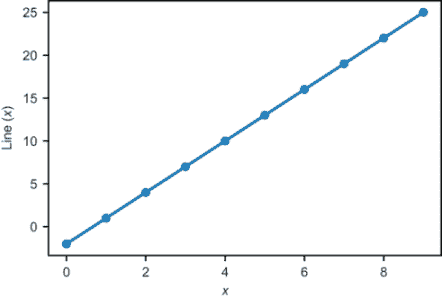Both `sum_error(line,points)` and `sum_squared_error(line,points)`返回零，因为没有任何一个点到直线的距离。|

| **练习 14.2**：计算两个线性函数，*x* + 0.5 和 2*x* − 1 的成本值。哪一个相对于 `test_data` 产生更低的平方和误差，这说明了拟合质量如何？**解答**：

```
>>> sum_squared_error(lambda x:2*x−1,test_data)
23.1942461283472
>>> sum_squared_error(lambda x:x+0.5,test_data)
16.607900877665685
```

函数 *x* + 0.5 产生的 `sum_squared_error` 值更低，因此它更适合 `test_data`。|

| **练习 14.3**：找到一个比 `p1`、`p2` 或 `p3` 更好的线性函数 `p4`。通过显示成本函数比 `p1`、`p2` 或 `p3` 更低来证明它是更好的拟合。**解答**：我们迄今为止找到的最佳拟合是 `p3`，表示为 *p*(*x*) = 22,500 − 0.1 · *x*。为了得到更好的拟合，你可以尝试调整这个公式中的常数，直到成本降低。你可能观察到 `p3` 是更好的拟合，因为我们把 *b* 值从 25,000 降低到 22,500。如果我们进一步降低它，拟合会更好。如果我们定义一个新的函数 `p4`，其 *b* 值为 20,000

```
def p4(*x*):
    return 20000 − 0.1 * x
```

结果表明 `sum_squared_error` 甚至更低：

```
>>> sum_squared_error(p4, prius_mileage_price)
18958453681.560005
```

这比前三个函数的值都要低，表明它更适合数据。|

## 14.2 探索函数空间

我们在上一个部分通过猜测一些定价函数的形式 *p*(*x*) = *ax* + *b* 结束，其中 *x* 代表二手丰田普锐斯的里程数，而 *p* 是其价格的预测。通过选择不同的 *a* 和 *b* 值并绘制结果函数 *p*(*x*)，我们可以判断哪些选择比其他选择更好。成本函数为我们提供了一种衡量函数接近数据程度的方法，而不是仅仅凭肉眼判断。本节的目标是系统地尝试不同的 *a* 和 *b* 值，以使成本函数尽可能小。

如果你完成了 14.1 节的最后一个练习并手动搜索更好的拟合，你可能已经注意到挑战的一部分是同时调整 *a* 和 *b*。如果你还记得第六章，所有像 *p*(*x*) = *ax* + *b* 这样的函数构成一个 2D 向量空间。当你猜测和检查时，你在这个 2D 空间中盲目地选择各个方向上的点，并希望成本函数降低。

在本节中，我们将通过绘制关于参数 *a* 和 *b* 的 `sum_squared_error` 成本函数图来尝试理解可能的线性函数的 2D 空间。具体来说，我们可以绘制成本作为两个参数 *a* 和 *b* 的函数，这两个参数定义了 *p*(*x*) 的选择（图 14.14）。

我们将要绘制的实际函数接受两个数字，*a* 和 *b*，并返回一个数字，即函数 *p*(*x*) = *ax* + *b* 的成本。我们称这个函数为 `coefficient_cost(a,b)`，因为数字 *a* 和 *b* 是 *系数*。为了绘制这样的函数，我们使用类似于第十二章中的热图。

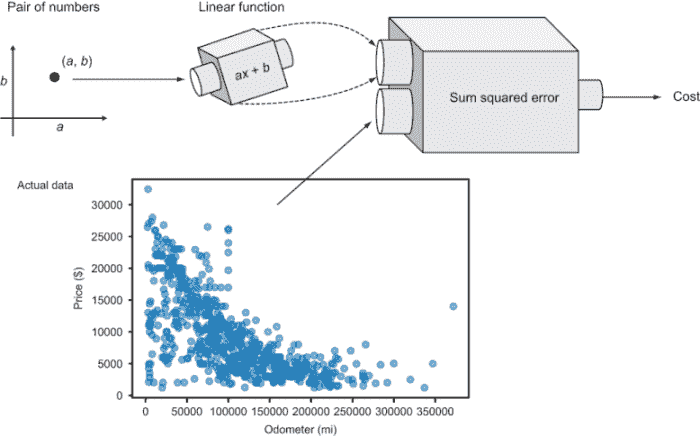

图 14.14 显示了一对数字 (*a, b*) 定义了一个线性函数。将其与固定实际数据比较，产生一个单一的成本数值。

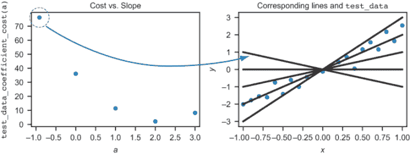

图 14.15 不同斜率 *a* 值的线和对应的成本

作为热身，我们可以尝试将函数 *f*(*x*) = *ax* 拟合到之前使用的 `test_data` 数据集。这是一个更简单的问题，因为 `test_data` 没有那么多数据点，而且我们只有一个参数需要调整：*f*(*x*) = *ax* 是一个线性函数，其 *b* 的值固定为零。这种形式函数的图表是通过原点的一条线，系数 *a* 控制其斜率。这意味着只有一个维度需要探索，我们可以绘制平方和误差值与 *a* 值的普通函数图。

### 14.2.1 通过原点的线的成本图示

让我们使用之前相同的 `test_data` 数据集，并从形式为 *f*(*x*) = *ax* 的函数中计算 `sum_squared_error`。然后我们可以编写一个函数 `test_data_coefficient_cost`，它接受参数 *a*（斜率）并返回 *f*(*x*) = *ax* 的成本。为此，我们首先从输入 *a* 的值创建函数 *f*，然后我们可以将其和测试数据传递给 `sum_squared_error` 成本函数：

```
def test_data_coefficient_cost(a):
    def f(x):
        return a * x
    return sum_squared_error(f,test_data)
```

这个函数的每个值对应于斜率 *a* 的一个选择，因此，它告诉我们可以绘制在 `test_data` 旁边的线的成本。图 14.15 展示了几个 *a* 值及其对应线的散点图。我特别指出了斜率为 *a* = −1 的情况，这会产生最高的成本和最差的拟合线。

`test_data_coefficient_cost` 函数最终证明是一个平滑的函数，我们可以在一系列 *a* 值的范围内绘制它。图 14.16 显示，成本逐渐降低，直到在 *a* ≈ 2 处达到最小值，然后开始增加。

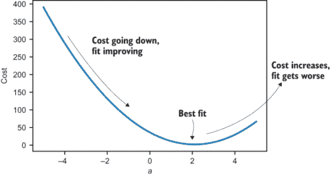

图 14.16 成本与斜率 *a* 的图表，显示了不同斜率值的拟合质量

图 14.16 中的图表告诉我们，通过原点产生的成本最低的线，因此，是 *最佳拟合*，其斜率大约为 2（我们很快就会找到确切值）。为了找到最佳线性函数来拟合二手车数据，让我们看看在一个多一个维度的空间上的成本。

### 14.2.2 所有线性函数的空间

我们正在寻找一个函数 *p*(*x*) = *ax* + *b*，它通过 `sum_squared_error` 函数最接近地预测普锐斯的售价。为了评估系数 *a* 和 *b* 的不同选择，我们首先需要编写一个函数 `coefficient_cost(a,b)`，它给出 *p*(*x*) = *ax* + *b* 相对于汽车数据的平方和误差。这看起来像 `test_data_coefficient_cost` 函数，除了有两个参数，我们使用不同的数据集：

```
def coefficient_cost(a,b):
    def *p*(*x*):
        return a * *x* + b
    return sum_squared_error(p,prius_mileage_price)
```

现在，有一个二维空间，包含系数对 (*a*, *b*) 的组合，其中任何一个都能给我们一个不同的候选函数 *p*(*x*) 来与价格数据进行比较。图 14.17 显示了 *a*, *b* 平面上的两个点以及相应的图形上的线条。

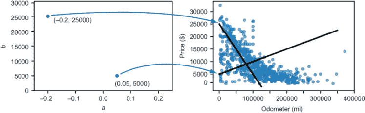

图 14.17 不同的 (*a, b*) 数字对对应不同的价格函数

对于每一对 (*a*, *b*) 和相应的函数 *p*(*x*) = *ax* + *b*，我们可以计算 `sum_squared_error` 函数；这正是 `coefficient_cost` 函数为我们一步完成的事情。这为我们提供了 *a*, *b* 平面上每个点的成本值，我们可以将其绘制为热图（图 14.18）。

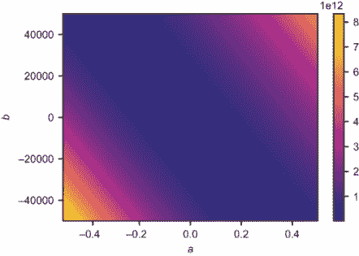

图 14.18 线性函数的成本作为 a 和 b 值的热图

在这个热图中，你可以看到当 (*a*, *b*) 处于极端时，成本函数较高。热图在中间部分最暗，但视觉上并不清楚成本是否有最小值或确切的位置。幸运的是，我们有一种方法可以找到在 (*a*, *b*) 平面上成本函数最小化的位置−梯度下降。

### 14.2.3 练习

| **练习 14.4**：找到通过原点并通过一点 (3, 4) 的直线的确切公式。通过找到函数 *f*(*x*) = *ax*，该函数相对于这个一点数据集最小化平方误差。**解答**：我们需要找到一个系数，即 *a*。平方误差之和是 *f*(3) = *a* · 3 和 4 之间的平方差。这是 (3 *a* − 4)²，展开为 9 *a*² − 24 *a* + 16。我们可以将其视为关于 *a* 的成本函数，即 *c*(*a)* = 9 *a*² − 24 *a* + 16。*a* 的最佳值是使成本函数的导数为零的值。使用第十章中的导数规则，我们找到 *c*'(*a*) = 18 *a* − 24。当 *a* = 4/3 时，这被解决，这意味着我们的最佳拟合线是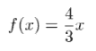。这显然包含原点和点 (4, 3)。 |
| --- |
| **练习 14.5**：假设我们使用线性函数来模拟跑车与其里程数的关系，系数为 (*a*, *b*) = (−0.4, 80000)。用英语来说，这说明了汽车随时间贬值的情况？**解答**：当 *x* = 0 时，*ax* + *b* 的值只是 *b* = 80,000。这意味着在里程数为 0 时，我们预计汽车可以卖 80,000 美元。*a* 的值为 −0.4 表示，对于 *x* 的每增加一个单位，函数值 *ax* + *b* 会以 0.4 个单位的速率减少。这意味着汽车的价值平均每行驶一英里就会减少 40 美分。 |

## 14.3 使用梯度下降法找到最佳拟合线

在第十二章中，我们使用了梯度下降算法来最小化形式为 *f*(*x*, *y*) 的光滑函数。用更简单的话说，这意味着找到 *x* 和 *y* 的值，使得 *f*(*x, y*) 的值尽可能小。因为我们已经实现了 `gradient_descent` 函数，所以我们可以简单地将我们想要最小化的函数的 Python 版本传递给它，它将自动找到最小化它的输入。

现在，我们想要找到 *a* 和 *b* 的值，使得 *p*(*x*) = *ax* + *b* 的成本尽可能小，换句话说，最小化 Python 函数 `coefficient _cost(a,b)`。当我们把 `coefficient_cost` 插入到我们的 `gradient_descent` 函数中时，我们得到 (*a*, *b*) 这一对值，使得 *p*(*x*) = *ax* + *b* 是最佳拟合线。我们可以使用我们找到的 *a* 和 *b* 的值来绘制 *ax* + *b* 的线，并直观地确认它很好地拟合了数据。

### 14.3.1 数据重缩放

在应用梯度下降之前，我们还需要处理一个棘手的细节。我们一直在处理的数据有不同的规模：折旧率在 0 和 -1 之间，价格在数万之间，成本函数返回的结果在数千亿。如果我们不指定其他，我们的导数近似将使用 10^(-6) 的 `dx` 值。因为这些数字的量级差异很大，如果我们尝试以这种方式运行梯度下降，我们可能会遇到数值错误。

注意，我不会深入探讨出现的数值问题的细节；我的目标是向您展示如何应用数学概念，而不是编写健壮的数值代码。相反，我将只向您展示如何通过重塑我们使用的数据来解决这个问题。

根据我们对数据集的直觉，我们可以确定 *a* 和 *b* 的某些保守界限，从而产生最佳拟合线。*a* 的值代表折旧，所以最佳值可能大于 0.5 或每英里 50 美分。*b* 的值代表零里程的普锐斯车的价格，应该安全地低于 50,000 美元。

如果我们通过 *a* = 0.5 · *c* 和 *b* = 50,000 · *d* 定义新的变量 *c* 和 *d*，那么当 *c* 和 *d* 的大小小于 1 时，*a* 和 *b* 应该分别小于 0.5 和 50,000。对于小于这些值的 *a* 和 *b* 的值，成本函数不会超过 10¹³。如果我们把成本函数的结果除以 10¹³ 并用 *c* 和 *d* 表示，我们就得到了一个新的成本函数版本，其输入和输出所有绝对值都在零和一之间：

```
def scaled_cost_function(c,d):
    return coefficient_cost(0.5*c,50000*d)/1e13
```

如果我们找到最小化这个缩放成本函数的 *c* 和 *d* 的值，我们可以找到最小化原始函数的 *a* 和 *b* 的值，使用的事实是 *a* = 0.5 · *c* 和 *b* = 50,000 · *d*。

这是一种相当简化的方法，还有更多科学的方法可以缩放数据，使其更易于数值处理，其中之一我们将在第十五章中看到。如果您想了解更多，通常在机器学习文献中称为 *特征缩放* 的过程。现在，我们已经得到了我们需要的−一个可以插入梯度下降算法的函数。

### 14.3.2 寻找和绘制最佳拟合线

我们将要优化的函数是 `scaled_cost_function`，我们可以预期最小值出现在一个点 (*c*, *d*)，其中 |*c*| < 1 和 |*d*| < 1。因为最优的 *c* 和 *d* 与原点相当接近，我们可以从 (0,0) 开始梯度下降。以下代码找到最小值，但具体运行时间取决于您使用的机器类型：

```
c,d = gradient_descent(scaled_cost_function,0,0)
```

当它运行时，它会找到以下 *c* 和 *d* 的值：

```
>>> (c,d)
(−0.12111901781176426, 0.31495422888049895)
```

为了恢复 *a* 和 *b*，我们需要乘以相应的系数：

```
>>> xa = 0.5*c
>>> b = 50000*d
>>> (a,b)
(−0.06055950890588213, 15747.711444024948)
```

最后，我们找到了我们一直在寻找的系数！四舍五入后，我们可以说价格函数

*p*(*x*) = −0.0606 · *x* + 15,700

这是（近似地）在整个汽车数据集上最小化平方误差的线性函数。它意味着一辆零里程的丰田普锐斯的价格平均为 15,700 美元，普锐斯的价格平均贬值率略超过每英里 6 美分。图 14.19 显示了这条线在图上的样子。

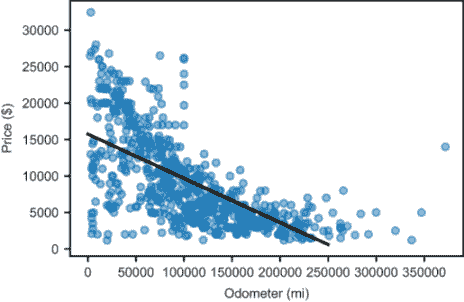

图 14.19 汽车价格数据的最佳拟合线

这看起来至少与其他我们尝试过的线性函数 *p*1, *p*2, 和 *p*3 一样好，如果不是更好。我们可以确信，根据成本函数衡量，它对我们的数据拟合得更好：

```
>>> coefficient_cost(a,b)
14536218169.403479
```

自动找到最佳拟合线，最小化成本函数后，我们可以说我们的算法“学会了”如何根据里程来评估普锐斯，我们实现了本章的主要目标。

有许多方法可以计算线性回归以获得最佳拟合线，包括许多优化的 Python 库。无论采用哪种方法，它们都应该得到相同的线性函数，该函数最小化平方误差之和。我选择使用梯度下降法来采用这种方法，这不仅是因为它是我们在第一部分和第二部分中覆盖的许多概念的出色应用，而且还因为它具有高度的可推广性。在最后一节中，我将向您展示梯度下降法在回归中的另一个应用，我们将在接下来的两个章节中也会使用梯度下降法和回归。

### 14.3.3 练习

| **练习 14.6**: 使用梯度下降法找到最佳拟合测试数据的线性函数。您得到的结果函数应该接近 2*x* + 0，但不是完全一样，因为数据是围绕该线随机生成的。**解答**: 首先，我们需要编写一个函数来计算 *f*(*x*) = *ax* + *b* 相对于测试数据中系数 *a* 和 *b* 的成本：

```
def test_data_linear_cost(a,b):
    def f(x):
        return a*x+b
    return sum_squared_error(f,test_data)
```

使这个函数最小化的 *a* 和 *b* 的值给我们提供了最佳拟合的线性函数。我们预计 *a* 和 *b* 分别接近 2 和 0，因此我们可以围绕这些点绘制一个热图来理解我们正在最小化的函数：

```
scalar_field_heatmap(test_data_linear_cost,-0,4,−2,2)
```

相对于测试数据，*ax* + *b* 的成本作为 *a* 和 *b* 的函数 |

| 如预期，在 (*a*, *b*) = (2,0) 附近，这个成本函数似乎有一个最小值。使用梯度下降法最小化这个函数，我们可以找到确切的值：

```
>>> gradient_descent(test_data_linear_cost,1,1)
(2.103718204728344, 0.0021207385859157535)
```

这意味着最佳拟合线到测试数据的大致方程是 2.10372 · *x* + 0.00212。 |

## 14.4 拟合非线性函数

在我们迄今为止所做的工作中，没有一步是 *需要* 价格函数 *p*(*x*) 为线性的。线性函数是一个好的选择，因为它简单，但我们可以用任何由两个常数定义的单变量函数应用相同的方法。作为一个例子，让我们找到形式为 *p*(*x*) = *qe^(rx)* 的最佳拟合指数函数，并最小化相对于汽车数据的平方误差之和。在这个方程中，*e* 是特殊的常数 2.71828……，我们将找到 *q* 和 *r* 的值，以给出最佳拟合。

### 14.4.1 理解指数函数的行为

如果你已经有一段时间没有处理指数函数了，让我们快速回顾一下它们是如何工作的。你可以通过当自变量 *x* 在指数中时，识别一个函数 *f*(*x*) 为指数函数。例如，*f*(*x*) = 2*x* 是一个指数函数，而 *f*(*x*) = *x*² 则不是。实际上，*f*(*x*) = 2*x* 是最熟悉的指数函数之一。在 *x* 的每个整数处，2*x* 的值是 2 乘以自身 *x* 次。表 14.1 给出了 2*x* 的一些值。

表 14.1 熟悉的指数函数 2x 的值

| x | 0 | 1 | 2 | 3 | 4 | 5 | 6 | 7 | 8 | 9 |
| --- | --- | --- | --- | --- | --- | --- | --- | --- | --- | --- |
| 2x | 1 | 2 | 4 | 8 | 16 | 32 | 64 | 128 | 256 | 512 |

被提升到 *x* 次方的数被称为底数，所以对于 2*x* 的情况，底数是 2。如果底数大于 1，当 *x* 增加时函数增加，但如果它小于 1，当 *x* 增加时函数减少。例如，在 (½)*x* 中，每个整数值是前一个值的一半，如表 14.2 所示。

表 14.2 减少指数函数 (½)x 的值

| x | 0 | 1 | 2 | 3 | 4 | 5 | 6 | 7 | 8 | 9 |
| --- | --- | --- | --- | --- | --- | --- | --- | --- | --- | --- |
| (½)*x* | 1 | 0.5 | 0.25 | 0.125 | ~0.06 | ~0.03 | ~0.015 | ~0.008 | ~0.004 | ~0.002 |

这被称为指数衰减，它更符合我们汽车折旧模型的需求。指数衰减意味着函数的值在固定大小的每个 *x* 间隔内按相同的比例减少。一旦我们有了模型，它就可以告诉我们，普锐斯每行驶 50,000 英里就会损失一半的价值，这意味着在 100,000 英里时，它的价值是其原始价格的 ¼，依此类推。

直观上看，这可能是一种更好的折旧建模方式。丰田车，作为可靠且耐用的汽车，只要能驾驶就会保留一些价值。相比之下，我们的线性模型表明，它们的值在长时间后会变成负数（图 14.20）。

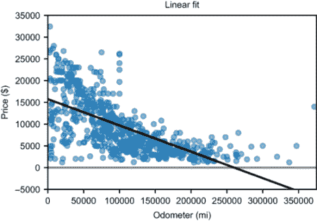

图 14.20 线性模型预测普锐斯的值为负，而指数模型在任何里程数下都显示正值。

我们可以使用的指数函数形式是 *p*(*x*) = *qe^(rx)*，其中 *e* = 2.71828 . . . 是固定的底数，*r* 和 *q* 是我们可以调整的系数。（使用底数 *e* 可能看起来是任意的，甚至不方便，但 *ex* 是标准的指数函数，所以值得习惯。）在指数衰减的情况下，*r* 的值是负的。因为 *er*^(·0) = *e*⁰ = 1，我们有 *p*(*0*) = *qer*^(·0) = *q*，所以 *q* 仍然代表零里程的普锐斯价格。常数 *r* 决定了折旧率。

### 14.4.2 寻找最佳拟合的指数函数

在心中牢记公式 *p*(*x*) = *qe^(rx)*，我们可以使用前几节中的方法来找到最佳拟合的指数函数。第一步是编写一个函数，它接受系数 *q* 和 *r* 并返回相应函数的成本：

```
def exp_coefficient_cost(q,r):
    def f(x):
        return q*exp(r*x)                           ❶
    return sum_squared_error(f,prius_mileage_price)
```

❶ Python 的 exp 函数计算指数函数 ex。

我们接下来需要做的是为系数 *q* 和 *r* 选择一个合理的范围，分别设置起始价格和折旧率。对于 *q*，我们期望它接近我们线性模型中 *b* 的值，因为 *q* 和 *b* 都代表零里程的汽车价格。我将使用从 $0 到 $30,000 的范围以确保安全。

控制折旧率的 *r* 值理解起来有点复杂，并且需要设定限制。具有负 *r* 值的方程 *p*(*x*) = *qe^(rx)* 表明，每当 *x* 增加 -1/*r* 单位时，价格就会以 *e* 的 *因子* 减少，这意味着它乘以 1/ *e* 或大约 0.36。（我在本节末尾添加了一个练习，帮助你确信这一点！）

为了保守起见，让我们假设一辆车在行驶了 10,000 英里后，价格降低到原始价值的 1/ *e*，即 36%。这将给我们 *r* = 10^(−4)。较小的 *r* 值意味着更慢的折旧率。这些基准量级告诉我们如何重新缩放函数，如果我们除以 10¹¹，成本值也会保持较小。以下是缩放成本函数的实现，图 14.21 显示了其输出的热图：

```
def scaled_exp_coefficient_cost(s,t):
    return exp_coefficient_cost(30000*s,1e−4*t) / 1e11

scalar_field_heatmap(scaled_exp_coefficient_cost,0,1,−1,0)
```


图 14.21 成本作为重新缩放后的 *q* 和 *r* 值的函数，分别称为 *s* 和 *t*。

图 14.21 中热力图顶部的深色区域表明，在*t*的小值和 0 到 1 范围内的某个值*s*处，成本最低。我们准备好将缩放的成本函数插入梯度下降算法中。梯度下降函数的输出是使成本函数最小化的*s*和*t*值，我们可以取消缩放以得到*q*和*r*：

```
>>> s,t = gradient_descent(scaled_exp_coefficient_cost,0,0)
>>> (s,t)
(0.6235404892859356, -0.07686877731125034)
>>> q,r = 30000*s,1e−4*t
>>> (q,r)
(18706.214678578068, −7.686877731125035e-06)
```

这意味着，从里程数来预测普锐斯价格的最佳指数函数大约是

*p*(*x*) = 18,700 · *e*^(−0.00000768) · *x*

图 14.22 显示了实际价格数据的图表。

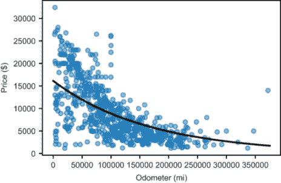

图 14.22 普锐斯和其里程数的最佳拟合指数函数

你可以争辩说，这个模型甚至比我们的线性模型更好，因为它产生了更小的总和平方误差，这意味着根据成本函数，它（略微）更好地拟合了数据：

```
>>> exp_coefficient_cost(q,r)
14071654468.28084
```

使用像指数函数这样的非线性函数只是这种回归技术众多变化中的一种。我们可以使用其他非线性函数，例如定义超过两个常数的函数或数据拟合超过 2 维的函数。在接下来的两章中，我们将继续使用成本函数来衡量回归模型的质量，然后使用梯度下降法使拟合尽可能好。

### 14.4.3 练习

| **练习 14.7**：通过选择一个样本值*r*，确认当*x*增加 1/*r*单位时，*e*^(−*rx*)的值会减少一个因子*e**。**解答**：让我们取*r* = 3，因此我们的测试函数是*e*^(−3*x*)。我们想要确认每次*x*增加 1/3 时，这个函数会减少一个*因子*。将函数在 Python 中定义为以下内容

```
def test(x):
    return exp(−3*x)
```

我们可以看到，它在*x* = 0 时从 1 的值开始，并且每次*x*增加 1/3 时，都会减少一个因子*e*：

```
>>> test(0)
1.0
>>> from math import e
>>> test(1/3), test(0)/e
(0.36787944117144233, 0.36787944117144233)
>>> test(2/3), test(1/3)/e
(0.1353352832366127, 0.1353352832366127)
>>> test(1), test(2/3)/e
(0.049787068367863944, 0.04978706836786395)
```

在这些情况中，将`test`的输入增加 1/3 得到的结果与将前一个结果除以*e*相同。|

| **练习 14.8**：根据最佳拟合的指数函数，每行驶 10,000 英里，普锐斯的价值会损失多少百分比？**解答**：价格函数是*p*(*x*) = 18,700 · *e*^(−0.00000768) · *x*，其中值*q* = $18,700 代表初始价格，而不是价格下降的速度。我们可以关注*erx* = *e*^(−0.00000768) · *x*这一项，并查看它在 10,000 英里内的变化。对于*x* = 0，这个表达式的值是 1，而对于*x* = 10,000，这个值是

```
>>> exp(r * 10000)
0.9422186306357088
```

这意味着，在行驶了 10,000 英里之后，普锐斯的价值仅为原始价值的 94.2%，下降了 5.8%。鉴于指数函数的行为，这种情况将在*任何*10,000 英里里程增加的情况下发生。|

| **练习 14.9**：断言零售价格（零英里处的价格）为$25,000，什么是最适合数据的指数函数？换句话说，固定*q* = 25,000，什么值*r*能产生*q*·*e^(rx*)的最佳拟合？**解答**：我们可以编写一个单独的函数，该函数以单个未知系数*r*为条件给出指数函数的代价：

```
def exponential_cost2(r):
    def f(x):
        return 25000 * exp(r*x)
    return sum_squared_error(f,prius_mileage_price)
```

以下图表确认了存在一个介于−10^(−4)和 0 之间的*r*值，该值最小化了代价函数：

```
plot_function(exponential_cost2,−1e−4,0)
```

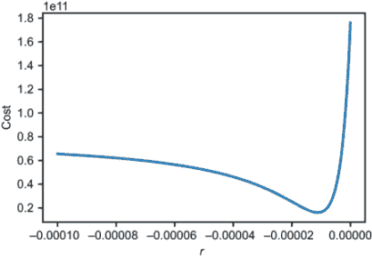它看起来像*r* = −10^(−5)的近似值最小化了代价函数。为了自动最小化这个函数，我们需要编写梯度下降的一维版本或使用另一个最小化算法。如果你喜欢，可以尝试这种方法，但由于只有一个参数，我们可以简单地猜测并检查*r* = −1.12 · 10^(−5)是否是产生最小代价的*r*值。这表明最佳拟合函数是*p*(*x*) = 25,000 · *e*^(−0.0000112) · *x*。以下是新的指数拟合图，与原始价格数据一起绘制： |

## 摘要

+   *回归*是找到一个模型来描述各种数据集之间关系的过程。在本章中，我们使用线性回归来近似汽车的价格，将其里程作为线性函数。

+   对于一组许多(*x*, *y*)数据点，可能没有一条线能穿过所有这些点。

+   对于一个建模数据的函数*f*(*x*, *y*)，你可以通过计算指定点(*x*, *y*)处的*f*(*x*)和*y*之间的距离来衡量它接近数据的程度。

+   测量一个模型如何适应数据集的函数被称为*代价函数*。一个常用的代价函数是从(*x*, *y*)点到相应模型值*f*(*x*)的距离平方和。最适合数据的函数具有最低的代价函数。

+   考虑形式为*f*(*x*)的线性函数，每一对系数(*a*, *b*)定义了一个唯一的线性函数。存在一个这样的系数对的二维空间，因此也存在一个二维空间来探索线条。

+   编写一个函数，该函数接受一对系数(*a*, *b*)并计算*ax* + *b*的代价，得到一个函数，它接受一个二维点并返回一个数字。最小化这个函数给出了定义最佳拟合线的系数。

+   与线性函数*p*(*x*)在*x*的常数变化下增加或减少一个常数量不同，指数函数在*x*的常数变化下按一个常数比率增加或减少。

+   要将指数方程拟合到数据中，你可以遵循与线性方程相同的程序；你需要找到一对(*q*, *r*)，它产生一个指数函数*q*·*e^(rx*)，并使代价函数最小化。
