# 15 使用逻辑回归对数据进行分类

本章涵盖

+   理解分类问题和衡量分类器

+   寻找决策边界以对两种数据进行分类

+   使用逻辑函数近似分类数据集

+   为逻辑回归编写成本函数

+   执行梯度下降以找到最佳拟合的逻辑函数

机器学习中最重要的问题类别之一是*分类*，我们将在这本书的最后两章中重点关注。分类问题是指我们有一份或多份原始数据，我们想要说明每一份数据代表的是哪种类型的对象。例如，我们可能希望一个算法查看进入我们收件箱的所有电子邮件的数据，并将每一封电子邮件分类为有趣的邮件或不受欢迎的垃圾邮件。作为一个更有影响力的例子，我们可以编写一个分类算法来分析医学扫描数据集，并决定它们是否包含良性或恶性的肿瘤。

我们可以构建机器学习算法进行分类，我们的算法看到的真实数据越多，它学到的就越多，在分类任务上的表现就越好。例如，每次电子邮件用户将电子邮件标记为垃圾邮件或放射科医生识别出恶性肿瘤时，这些数据都可以反馈给算法以改进其校准。

在本章中，我们将查看与上一章相同的简单数据集：二手车的里程和价格。与上一章使用单一车型数据不同，我们将查看两种车型：丰田普锐斯和宝马 5 系列轿车。仅基于车辆的里程和价格等数值数据以及已知示例的参考数据集，我们希望我们的算法能够给出一个肯定或否定的答案，即该车辆是否为宝马。与接受一个数字并产生另一个数字的回归模型不同，分类模型将接受一个向量并产生一个介于零和一之间的数字，表示该向量代表宝马而不是普锐斯的置信度（图 15.1）。

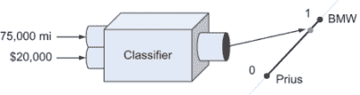

图 15.1 我们的分类器接受一个包含两个数字的向量，即二手车的里程和价格，并返回一个表示其对车辆是宝马的置信度的数字。

尽管分类与回归的输入和输出不同，但结果表明我们可以使用回归的一种类型来构建我们的分类器。本章我们将实现的算法称为逻辑回归。为了训练这个算法，我们从一个已知的数据集开始，该数据集包含二手车的里程和价格，如果它们是宝马则标记为 1，如果是普锐斯则标记为 0。表 15.1 显示了用于训练我们的算法的该数据集中的样本点。

表 15.1 用于训练算法的样本数据点

| 里程（英里） | 价格（美元） | 是否为宝马？ |
| --- | --- | --- |
| 110,890.0 | 13,995.00 | 1 |
| 94,133.0 | 13,982.00 | 1 |
| 70,000.0 | 9,900.00 | 0 |
| 46,778.0 | 14,599.00 | 1 |
| 84,507.0 | 14,998.00 | 0 |
| . . . | . . . | . . . |

我们希望一个函数能够接受前两列的值，并产生一个介于零和一之间的结果，并且希望这个结果尽可能接近正确的汽车选择。我将向你介绍一种特殊类型的函数，称为*逻辑函数*，它接受一对输入数字并产生一个始终介于零和一之间的单个输出数字。我们的分类函数是“最佳拟合”我们提供的样本数据的逻辑函数。

我们的分类函数并不总是能得到正确的答案，但同样，人类也不总是能得到正确的答案。宝马 5 系列轿车是豪华车，所以我们预计，与宝马相比，普锐斯的售价会低一些。出乎我们的意料，表 5.1 中的最后两行显示，普锐斯和宝马的价格大致相同，而普锐斯的里程几乎是宝马的两倍。由于这样的意外例子，我们不会期望逻辑函数对每个宝马或普锐斯都能产生精确的 1 或 0。相反，它可以返回 0.51，这是函数告诉我们它不确定，但数据稍微更有可能代表宝马。

在上一章中，我们了解到我们选择的线性函数是由公式 *f*(*x*) = *ax* + *b* 中的两个参数 *a* 和 *b* 决定的。在本章中，我们将使用的逻辑函数由三个参数参数化，因此逻辑回归的任务可以归结为找到三个数字，使逻辑函数尽可能接近提供的样本数据。我们将为逻辑函数创建一个特殊的成本函数，并使用梯度下降法找到最小化成本函数的三个参数。这里有很多步骤，但幸运的是，它们都与我们在上一章中做的事情平行，所以如果你是第一次学习回归，这将是一个有用的复习。

将逻辑回归算法编码为分类汽车是本章的重点，但在做这件事之前，我们花更多的时间让你熟悉分类的过程。在我们训练计算机进行分类之前，让我们衡量我们能够完成这个任务的程度。然后，一旦我们构建了逻辑回归模型，我们可以通过比较来评估它的表现。

## 15.1 在实际数据上测试分类函数

让我们看看我们如何能够使用一个简单的标准来识别数据集中的宝马。也就是说，如果一辆二手车的价格高于 25,000 美元，那么它可能太贵了，不能是普锐斯（毕竟，你可以以接近这个价格买到一辆全新的普锐斯）。如果价格高于 25,000 美元，我们将说它是宝马；否则，我们将说它是普锐斯。这个分类很容易构建为一个 Python 函数：

```
def bmw_finder(mileage,price):
    if price > 25000:
        return 1
    else:
        return 0
```

这个分类器的性能可能不会很好，因为可以想象，行驶里程很多的宝马可能售价低于 25,000 美元。但我们不必猜测：我们可以衡量这个分类器在实际数据上的表现如何。

在本节中，我们通过编写一个名为 `test_classifier` 的函数来衡量我们算法的性能，该函数接受一个分类函数（如 `bmw_finder`）以及要测试的数据集。数据集是一个包含里程数、价格和 `1` 或 `0` 的元组数组，表示汽车是宝马还是普锐斯。一旦我们用真实数据运行 `test_classifier` 函数，它将返回一个百分比值，告诉我们它正确识别了多少辆车。在章节末尾，当我们实现了逻辑回归时，我们可以将我们的逻辑分类函数传递给 `test_classifier` 并查看其相对性能。

### 15.1.1 加载汽车数据

如果我们首先加载汽车数据，编写 `test_classifier` 函数会更容易。而不是在从 CarGraph.com 或从平面文件加载数据上浪费时间，我已经通过在本书的源代码中提供一个名为 cardata.py 的 Python 文件来简化了这一过程。它包含两个数据数组：一个用于普锐斯，一个用于宝马。你可以如下导入这两个数组：

```
from car_data import bmws, priuses
```

如果你检查 car_data.py 文件中的宝马或普锐斯原始数据，你会看到这个文件包含比我们所需更多的数据。目前，我们专注于每辆汽车的里程数和价格，并且我们知道它属于哪个列表。例如，宝马列表开始如下：

```
[('bmw', '5', 2013.0, 93404.0, 13999.0, 22.09145859494213),
 ('bmw', '5', 2013.0, 110890.0, 13995.0, 22.216458611342592),
 ('bmw', '5', 2013.0, 94133.0, 13982.0, 22.09145862741898),
 ...
```

每个元组代表一辆出售的汽车，其里程数和价格分别由元组的第四和第五个条目给出。在 car_data.py 中，这些被转换为 `Car` 对象，因此我们可以写 `car.price` 而不是 `car[4]`，例如。我们可以通过从宝马元组和普锐斯元组中提取所需的条目来创建一个形状符合我们要求的 `all_car_data` 列表：

```
all_car_data = []
for bmw in bmws:
    all_car_data.append((bmw.mileage,bmw.price,1))
for prius in priuses:
    all_car_data.append((prius.mileage,prius.price,0))
```

一旦运行，`all_car_data` 就是一个以宝马车开始并以普锐斯车结束的 Python 列表，分别用 1 和 0 标记：

```
>>> all_car_data
[(93404.0, 13999.0, 1),
 (110890.0, 13995.0, 1),
 (94133.0, 13982.0, 1),
 (46778.0, 14599.0, 1),
 ....
(45000.0, 16900.0, 0),
(38000.0, 13500.0, 0),
(71000.0, 12500.0, 0)]
```

### 15.1.2 测试分类函数

当数据以合适的格式存在时，我们现在可以编写 `test_classifier` 函数。`bmw_finder` 的任务是查看一辆汽车的里程数和价格，并告诉我们这些是否代表一辆宝马。如果答案是肯定的，它返回 1；否则，它返回 0。很可能会出现 `bmw_finder` 预测错误的情况。如果它预测一辆车是宝马（返回 1），但实际上是普锐斯，我们将称之为 *假阳性*。如果它预测汽车是普锐斯（返回 0），但实际上是宝马，我们将称之为 *假阴性*。如果它正确地识别出宝马或普锐斯，我们将称之为 *真阳性* 或 *真阴性*，分别。

为了测试分类函数对所有汽车数据集，我们需要在该列表中的每个里程数和价格上运行分类函数，并查看结果 1 或 0 是否与给定的值匹配。以下是代码中的样子：

```
def test_classifier(classifier, data):
    trues = 0
    falses = 0
    for mileage, price, is_bmw in data:
        if classifier(mileage, price) == is_bmw:  ❶
            trues += 1
        else:
            falses += 1                           ❷
    return trues / (trues + falses)
```

❶ 如果分类正确，则将 trues 计数器加 1

❷ 否则，将 falses 计数器加 1

如果我们用 `bmw_finder` 分类函数和所有汽车数据集运行这个函数，我们看到它的准确率是 59%：

```
>>> test_classifier(bmw_finder, all_car_data)
0.59
```

这还不错；我们大部分的答案都对了。但我们会看到我们可以做得比这更好！在下一节中，我们将数据集绘制出来，以了解 `bmw_finder` 函数在定性上有什么问题。这有助于我们了解如何通过我们的逻辑分类函数改进分类。

### 15.1.3 练习

| **练习 15.1**：更新 `test_classifier` 函数以打印出真正的正例、真正的负例、错误的正例和错误的负例的数量。对于 `bmw_finder` 分类器打印这些信息，你能对分类器的性能有什么了解？**解答**：我们不仅跟踪正确和错误的预测，还可以分别跟踪真正的正例、真正的负例、错误的正例和错误的负例：

```
def test_classifier(classifier, data, verbose=False):   ❶
    true_positives = 0                                  ❷
    true_negatives = 0
    false_positives = 0
    false_negatives = 0
    for mileage, price, is_bmw in data:
        predicted = classifier(mileage,price)
        if predicted and is_bmw:                       ❸
            true_positives += 1
        elif predicted:
            false_positives += 1
        elif is_bmw:
            false_negatives += 1
        else:
            true_negatives += 1

    if verbose:        
        print("true positives %f" % true_positives)    ❹
        print("true negatives %f" % true_negatives)
        print("false positives %f" % false_positives)
        print("false negatives %f" % false_negatives)

    total = true_positives + true_negatives

    return total / len(data)                           ❺
```

❶ 我们现在有 4 个计数器来跟踪。❷ 指定是否打印数据（我们可能不想每次都打印）。❸ 根据汽车是普锐斯还是宝马以及它是否被正确分类，增加 4 个计数器中的一个❹ 打印每个计数器的结果❺ 返回正确分类的数量（真正的正例或负例）除以数据集的长度。对于 `bmw_finder` 函数，这会打印以下文本：

```
true positives 18.000000
true negatives 100.000000
false positives 0.000000
false negatives 82.000000
```

因为分类器没有返回任何误报，这告诉我们它总是正确地识别出汽车不是宝马。但我们还不能过于自豪我们的函数，因为它说大部分的汽车都不是宝马，包括很多确实是宝马的汽车！在下一个练习中，你可以放宽限制以获得更高的整体成功率。|

| **练习 15.2**：找到一种方法来更新 `bmw_finder` 函数以提高其性能，并使用 `test_classifier` 函数来确认你的改进函数的准确率超过 59%。**解答**：如果你解决了上一个练习，你会看到 `bmw_finder` 在说汽车不是宝马时过于激进。我们可以降低价格阈值到 $20,000 看看是否有所改变：

```
def bmw_finder2(mileage,price):
    if price > 20000:
        return 1
    else:
        return 0
```

|

| 确实，通过降低这个阈值，`bmw_finder` 提高了成功率到 73.5%：

```
>>> test_classifier(bmw_finder2, all_car_data)
0.735
```

|

## 15.2 描绘决策边界

在我们实现逻辑回归函数之前，让我们看看另一种衡量我们在分类中成功的方法。因为里程和价格这两个数字定义了我们的二手车数据点，我们可以把它们看作是二维向量，并将它们绘制在二维平面上作为点。这个图让我们更好地了解我们的分类函数在宝马和普锐斯之间“划线”的位置，我们可以看到如何改进它。结果发现，使用我们的 `bmw_finder` 函数相当于在二维平面上画一条实际的线，任何在线上方的点被称作宝马，任何在下方的不被称作宝马。

在本节中，我们使用 Matplotlib 绘制我们的图表，并查看`bmw_finder`在宝马和普锐斯之间放置的分割线。这条线被称为**决策边界**，因为一个点位于线的哪一侧，有助于我们决定它属于哪个类别。在图表上查看汽车数据后，我们可以找出绘制更好分割线的地方。这使得我们可以定义`bmw_finder`函数的改进版本，并可以精确地测量它的性能提升。

### 15.2.1 想象汽车的空间

我们数据集中的所有汽车都有里程和价格值，但其中一些代表宝马，一些代表普锐斯，这取决于它们是否被标记为 1 或 0。为了使我们的图表易于阅读，我们希望在散点图上使宝马和普锐斯在视觉上明显不同。

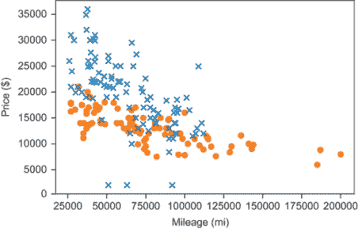

图 15.2 数据集中所有汽车的售价与里程对比图，其中每个宝马用 X 表示，每个普锐斯用圆圈表示

源代码中的`plot_data`辅助函数接受整个汽车数据列表，并自动用 X 标记宝马，用圆圈标记普锐斯。图 15.2 显示了该图表。

```
>>> plot_data(all_car_data)
```

通常情况下，我们可以看到宝马比普锐斯更贵；大多数宝马在价格轴上更高。这证明了我们将更贵的汽车分类为宝马的策略是合理的。具体来说，我们在 25,000 美元的价格上画了这条线（图 15.3）。在图表上，这条线将图表上更贵的汽车顶部与更便宜的汽车底部分开。

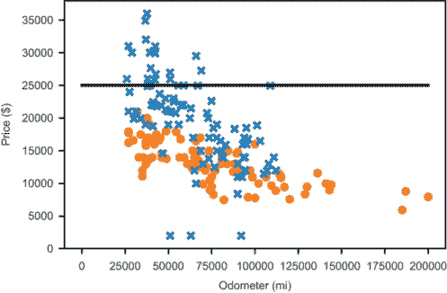

图 15.3 展示了绘制了汽车数据的决策线

这是我们决策边界。线上的每一个 X 都被正确地识别为宝马，而线下的每一个圆都被正确地识别为普锐斯。所有其他点都被错误地分类。很明显，如果我们移动这个决策边界，我们可以提高我们的准确度。让我们试一试。

### 15.2.2 绘制更好的决策边界

根据图 15.3 中的图表，我们可以降低线并正确识别更多的宝马，同时不会错误地识别任何普锐斯。图 15.4 显示了如果我们把截止价格降低到 21,000 美元，决策边界看起来会是什么样子。

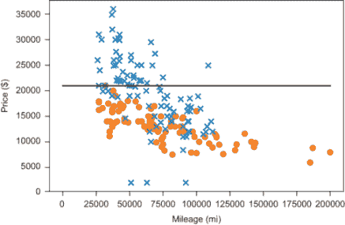

图 15.4 降低决策边界线似乎提高了我们的准确度。

21,000 美元的截止点可能适合低里程汽车，但里程越高，阈值越低。例如，看起来大多数 75,000 英里或以上的宝马价格都低于 21,000 美元。为了建模这一点，我们可以使我们的截止价格与里程相关。从几何上讲，这意味着绘制一条向下倾斜的线（图 15.5）。

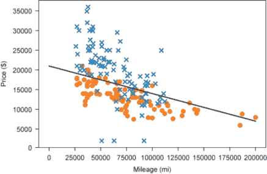

图 15.5 使用向下倾斜的决策边界

这条线由函数*p*(x) = 21,000 − 0.07 · *x*给出，其中*p*是价格，*x*是里程。这个方程式没有什么特别之处；我只是随意调整数字，直到我绘制出一条看起来合理的线。但它看起来甚至可以正确识别比以前更多的宝马车，只有少数误判（将普锐斯错误地分类为宝马）。与其只是凭直觉判断这些决策边界，我们不如将它们转换成分类函数并衡量它们的性能。

### 15.2.3 实现分类函数

为了将这个决策边界转换成一个分类函数，我们需要编写一个 Python 函数，它接受汽车里程和价格作为参数，并根据该点是否位于直线之上或之下返回一个或零。这意味着需要将给定的里程值插入到决策边界函数*p*(x)中，以查看阈值价格是多少，并将结果与给定的价格进行比较。这看起来是这样的：

```
def decision_boundary_classify(mileage,price):
    if price > 21000 − 0.07 * mileage:
        return 1
    else:
        return 0
```

通过测试，我们可以看到它比我们的第一个分类器要好得多；80.5%的汽车被这条线正确分类。不错！

```
>>> test_classifier(decision_boundary_classify, all_car_data)
0.805
```

你可能会问为什么我们不能直接对定义决策边界线的参数进行梯度下降。如果 20,000 和 0.07 不能给出最准确的决策边界，也许它们附近的某个数字对可以。这不是一个疯狂的想法。当我们实现逻辑回归时，你将看到在底层，它使用梯度下降移动决策边界，直到找到最佳位置。

我们将实现更复杂的逻辑回归算法，而不是对决策边界函数*ax* + *b*的参数*a*和*b*进行梯度下降，有两个重要的原因。第一个原因是，如果在梯度下降的任何步骤中决策边界接近垂直，*a*和*b*的值可能会变得非常大，导致数值问题。另一个原因是没有明显的成本函数。在下一节中，我们将看到逻辑回归如何处理这两个问题，以便我们可以使用梯度下降来寻找最佳决策边界。

### 15.2.4 练习

| **练习 15.3-迷你项目**：哪种形式的决策边界*p* = *constant*在测试数据集上给出最佳的分类准确率？**解答**：以下函数为任何指定的、常数的截止价格构建一个分类器函数。换句话说，生成的分类器如果测试汽车的价格高于截止值则返回 true，否则返回 false：

```
def constant_price_classifier(cutoff_price):
    def c(x,p):
        if p > cutoff_price:
            return 1
        else:
            return 0
    return c
```

这个函数的准确性可以通过将生成的分类器传递给`test_classify`函数来衡量。这里有一个辅助函数，可以自动检查我们想要测试的任何价格作为截止值的情况：

```
def cutoff_accuracy(cutoff_price):
    c = constant_price_classifier(cutoff_price)
    return test_classifier(c,all_car_data)
```

最佳的截断价格位于我们列表中的两个价格之间。检查每个价格并查看它是否是最佳截断价格就足够了。我们可以使用 Python 中的 `max` 函数快速做到这一点。关键字参数 `key` 允许我们选择通过哪个函数来最大化。在这种情况下，我们想要找到列表中最佳的截断价格，因此我们可以通过 `cutoff_accuracy` 函数来最大化：

```
>>> max(all_prices,key=cutoff_accuracy)
17998.0
```

这告诉我们，根据我们的数据集，$17,998 是决定汽车是宝马 5 系列还是普锐斯时作为截断的最佳价格。对于我们的数据集来说，它相当准确，准确率为 79.5%：

```
>>> test_classifier(constant_price_classifier(17998.0), all_car_data)
0.795
```

|

## 15.3 将分类问题作为回归问题来处理

我们可以将我们的分类任务重新构造成回归问题的方法是通过创建一个函数，该函数接受汽车的里程和价格作为输入，并返回一个数字，衡量它成为宝马而不是普锐斯的可能性。在本节中，我们实现了一个名为 `logistic_classifier` 的函数，从外部看，它与我们迄今为止构建的分类器非常相似；它接受里程和价格，并输出一个数字，告诉我们汽车是宝马还是普锐斯。唯一的区别是，它不是输出一个或零，而是输出一个介于零和一之间的值，告诉我们汽车是宝马的可能性有多大。

你可以将这个数字看作是里程和价格描述的是宝马的概率，或者更抽象地说，你可以将其视为给出数据点的“宝马特性”（图 15.6）。（是的，这是一个虚构的词，我读作“bee-em-doubleyou-ness。”它的意思是有多像宝马。也许我们可以将反义词称为“普锐斯性”。）

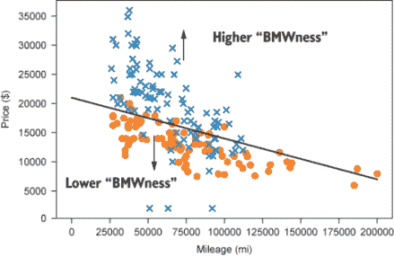

图 15.6 “宝马特性”的概念描述了平面上一个点有多像宝马。

要构建逻辑分类器，我们从一个好的决策边界线的猜测开始。位于线上的点具有高的“宝马特性”，意味着这些点很可能是宝马，逻辑函数应该返回接近一的值。位于线下的数据点具有低的“宝马特性”，意味着这些点更有可能是普锐斯，我们的函数应该返回接近零的值。在决策边界上，“宝马特性”值将是 0.5，这意味着该点的宝马和普锐斯的概率是相等的。

### 15.3.1 缩放原始汽车数据

在回归过程中，我们迟早需要处理一项任务，所以现在处理它也无妨。正如我们在上一章中讨论的，里程和价格的大数值可能会引起数值错误，所以最好将它们缩放到一个小的、一致的大小。如果我们将所有里程和价格线性缩放到零到一之间的值，我们应该是安全的。

我们需要能够缩放和未缩放里程和价格中的每一个，因此我们需要总共四个函数。为了使这个过程稍微不那么痛苦，我编写了一个辅助函数，它接受一个数字列表并返回用于将这些数字线性缩放和未缩放到零和一之间的函数，使用列表中的最大和最小值。将此辅助函数应用于里程和价格的整个列表，我们得到了所需的四个函数：

```
def make_scale(data):
    min_val = min(data)                           ❶
    max_val = max(data)
    def scale(*x*):                                 ❷
        return (x-min_val) / (max_val − min_val)
    def unscale(*y*):                               ❸
        return y * (max_val − min_val) + min_val
    return scale, unscale                         ❹

price_scale, price_unscale =\ 
    make_scale([x[1] for *x* in all_car_data])      ❺
mileage_scale, mileage_unscale =\
    make_scale([x[0] for *x* in all_car_data])
```

❶ 最大值和最小值提供了当前数据集的范围。

❷ 将数据点放置在 0 到 1 之间的相同分数位置，就像它在 min_val 到 max_val 之间一样

❸ 将缩放数据点放置在 min_val 到 max_val 之间的相同分数位置，就像它在 0 到 1 之间一样

❹ 返回用于缩放或未缩放此数据集成员时的缩放和未缩放函数（如果你熟悉这个术语，则是闭包）。

❺ 返回两组函数，一组用于价格，另一组用于里程

现在，我们可以将这些缩放函数应用于我们列表中的每个汽车数据点，以获得数据集的缩放版本：

```
scaled_car_data = [(mileage_scale(mileage), price_scale(price), is_bmw) 
                    for mileage,price,is_bmw in all_car_data]
```

好消息是，图表看起来相同（图 15.7），只是坐标轴上的数值不同。

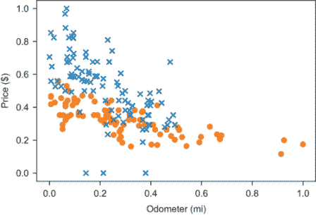

图 15.7 将里程和价格数据缩放，使所有值都在零和一之间。图表看起来与之前相同，但我们的数值误差风险降低了。

因为缩放数据集的几何形状相同，这应该让我们有信心，这个缩放数据集的良好决策边界将转化为原始数据集的良好决策边界。

### 15.3.2 测量汽车的“宝马”程度

让我们从与上一节中相似的决策边界开始。函数 *p*(*x*) = 0.56 − 0.35 · *x* 给出了决策边界上价格作为里程的函数。这非常接近我在上一节中通过目测找到的，但它适用于缩放后的数据集（图 15.8）。

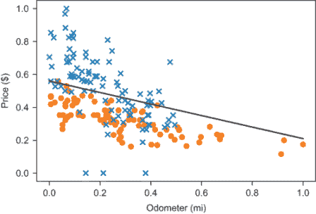

图 15.8 缩放数据集上的决策边界 *p*(*x*) = 0.56 − 0.35 · *x*

我们仍然可以使用我们的 `test_classifier` 函数在缩放后的数据集上测试分类器；我们只需要确保传入缩放后的数据而不是原始数据。结果发现这个决策边界给我们提供了 78.5%准确度的数据分类。

结果表明，这个决策边界函数可以被重新排列，以给出数据点的“宝马”程度的度量。为了使我们的代数更简单，让我们将决策边界写成

*p* = *ax* + *b*

其中 *p* 是价格，*x* 仍然是里程，而 *a* 和 *b* 是直线的斜率和截距（在这种情况下，*a* = -0.35 和 *b* = 0.56），分别。我们不必将其视为函数，我们可以将其视为满足决策边界上点 (*x*, *p*) 的方程。如果我们从方程的两边减去 *ax* + *b*，我们得到另一个正确的方程：

*p* − *ax* − *b* = 0

决策边界上的每一个点 (*x*, *p*) 都满足这个方程。换句话说，对于决策边界上的每一个点，*p* − *ax* − *b* 的值都是零。

这段代数的关键在于，*p* − *ax* − *b* 是点 (*x*, *p*) 的“宝马度”的度量。如果 (*x*, *p*) 在决策边界之上，这意味着相对于 *x*，*p* 太大，所以 *p* − *ax* − *b* > 0。相反，如果 (*x*, *p*) 在决策边界之下，这意味着相对于 *x*，*p* 太小，那么 *p* − *ax* − *b* < 0。否则，表达式 *p* − *ax* − *b* 精确为零，点正好位于将解释为普锐斯或宝马的阈值。这可能在第一次阅读时有点抽象，所以表 15.2 列出了三种情况。

表 15.2 可能情况的总结

| (*x*, *p*) 在决策边界之上 | *p* − *ax* − *b* > 0 | 很可能是一辆宝马 |
| --- | --- | --- |
| (*x*, *p*) 在决策边界上 | *p* − *ax* − *b* = 0 | 可能是任何车型 |
| (*x*, *p*) 在决策边界之下 | *p* − *ax* − *b* < 0 | 很可能是一辆普锐斯 |

如果你还没有确信 *p* − *ax* − *b* 是与决策边界兼容的“宝马度”的度量，一个更简单的方法是查看 *f*(*x*, *p*) = *p* − *ax* − *b* 的热图，以及数据（图 15.9）。当 *a* = -0.35 和 *b =* 0.56 时，函数是 *f*(*x*, *p*) = *p* − 0.35 · *x* − 0.56。

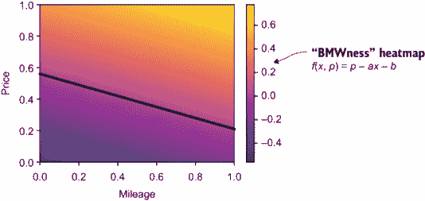

图 15.9 展示了热图和决策边界的图，显示明亮的值（正“宝马度”）位于决策边界之上，而暗的值（负“宝马度”）出现在决策边界之下

函数 *f*(*x*, *p*) 几乎满足我们的要求。它接受里程和价格作为输入，并输出一个数字，如果这个数字可能代表宝马车，则数值较高；如果数值可能代表普锐斯，则数值较低。唯一缺少的是输出数字没有限制在零到一之间，截止值在零而不是期望的 0.5。幸运的是，有一个方便的数学辅助函数我们可以用来调整输出。

### 15.3.3 介绍 Sigmoid 函数

函数 *f*(*x*, *p*) = *p* − *ax* − *b* 是线性的，但这不是关于线性回归的章节！当前的主题是 *逻辑回归*，要进行逻辑回归，你需要使用逻辑函数。最基本的逻辑函数如下，通常称为 *Sigmoid* 函数：


我们可以使用 Python 中的 `exp` 函数来实现这个函数，它代表 *ex*，其中 *e* = 2.71828... 是我们之前用于指数底数的常数：

```
from math import exp
def sigmoid(*x*):
    return 1 / (1+exp(−x))
```

图 15.10 展示了其图像。

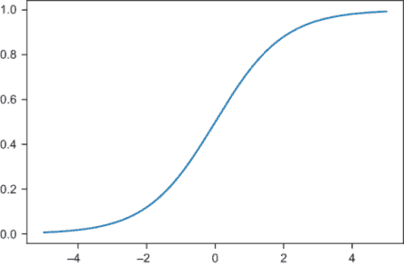

图 15.10 Sigmoid 函数 σ(*x*) 的图像

在这个函数中，我们使用希腊字母σ（西格玛），因为σ是字母*S*的希腊版本，σ(*x*)的图形看起来有点像字母*S*。有时“逻辑函数”和“S 形函数”这两个词可以互换使用，指的是像图 15.10 中的那种函数，它从一个值平滑地过渡到另一个值。在本章（以及下一章）中，当我提到 S 形函数时，我会谈论这个特定的函数：σ(*x*)。

你不需要过于担心这个函数是如何定义的，但你确实需要理解图形的形状及其含义。这个函数将任何输入数字映射到 0 到 1 之间的一个值，大负数产生接近 0 的结果，而大正数产生接近 1 的结果。σ(0)的结果是 0.5。我们可以把σ看作是将从-∞到∞的范围转换到更易管理的从 0 到 1 的范围。

### 15.3.4 将 S 形函数与其他函数组合

回到我们的函数*f*(*x*, *p*) = *p* − *ax* − *b*，我们看到了它接受一个里程值和一个价格值，并返回一个衡量这些值看起来像宝马而不是普锐斯的数字。这个数字可以是大的、正的或负的，而零值表示它位于宝马和普锐斯之间的边界上。

我们希望我们的函数返回一个介于 0 到 1 之间的值（接近 0 和 1 的值），分别代表可能是普锐斯或宝马的汽车，而 0.5 的值表示一辆汽车有同等可能性是普锐斯或宝马。我们只需要调整*f*(*x*, *p*)的输出，使其处于预期的范围内，就像图 15.11 中所示的那样通过 S 形函数σ(*x*)。也就是说，我们想要的函数是σ(*f*(*x*, *p*))，其中*x*和*p*是里程和价格。


图 15.11 “BMWness”函数*f*(*x*, *p*)与 S 形函数σ(*x*)组合的示意图

让我们将得到的函数称为*L*(*x*, *p*)，换句话说，*L*(*x*, *p*) = σ(*f*(*x*, *p*))。在 Python 中实现函数*L*(*x*, *p*)并绘制其热图（图 15.12），我们可以看到它沿着与*f*(*x*, *p*)相同的方向增加，但其值不同。

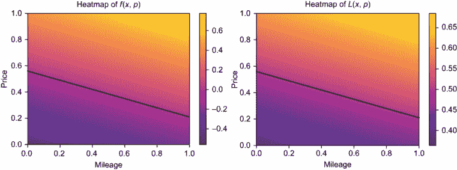

图 15.12 热图看起来基本上是一样的，但函数的值略有不同。

基于这张图，你可能会想知道为什么我们费尽心机将“BMWness”函数通过 S 形函数。从这个角度看，函数看起来几乎一样。然而，如果我们将其图形作为 3D 空间中的 2D 表面来绘制（图 15.13），你会发现 S 形函数的曲线形状有影响。

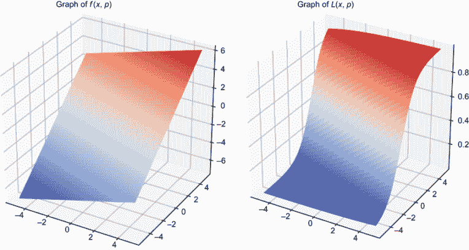

图 15.13 当*f*(*x*, *p*)线性向上倾斜时，*L*(*x*, *p*)从 0 的最小值曲线上升到 1 的最大值。

公平起见，我不得不在 (*x*, *p*) 空间中稍微放大一些，以便使曲率清晰。重点是，如果汽车类型由 0 或 1 表示，函数 *L*(*x*, *p*) 的值实际上接近这些数字，而 *f*(*x*, *p*) 的值则趋向于正负无穷大！

图 15.14 展示了两个夸张的图来展示我的意思。记住，在我们的数据集 scaled_car_data 中，我们用 (mileage, price, 0) 形式的三元组来表示普锐斯，用 (mileage, price, 1) 形式的三元组来表示宝马。我们可以将这些解释为 3D 中的点，其中宝马位于 *z* = 1 的平面上，而普锐斯位于 *z* = 0 的平面上。将 scaled_car_data 作为 3D 散点图绘制，你可以看到线性函数无法像逻辑函数那样接近许多数据点。

对于形状像 *L*(*x*, *p*) 的函数，我们实际上可以希望拟合数据，我们将在下一节中看到如何做到这一点。

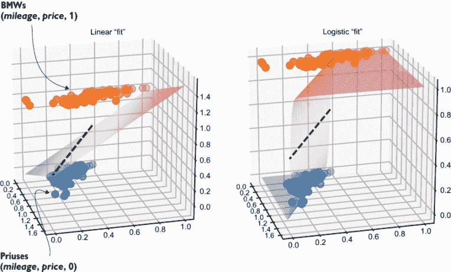

图 15.14 3D 中线性函数的图形无法像逻辑函数的图形那样接近数据点。

### 15.3.5 练习

| **练习 15.4**: 找到一个函数 *h*(*x*)，使得当 *x* 的正值很大时，*h*(*x*) 接近 0，当 *x* 的负值很大时，*h*(*x*) 接近 1，并且 *h*(3) = 0.5。**解答**: 函数 *y*(*x*) = 3 − *x* 在 *y*(3) = 0 时成立，并且当 *x* 很大且为负时，它趋向于正无穷，当 *x* 很大且为正时，它趋向于负无穷。这意味着将 *y*(*x*) 的结果传递到我们的 sigmoid 函数中，可以得到具有所需特性的函数。具体来说，*h*(*x*) = σ(*y*(*x*)) = σ(3 − *x*) 是有效的，其图形如下以说服你： |
| --- |
| **练习 15.5-迷你项目**: 实际上，*f*(*x*, *p*) 的结果有一个下限，因为 *x* 和 *p* 不允许是负数（毕竟，负里程和价格没有意义）。你能找出汽车可能产生的 *f* 的最低值吗？**解答**: 根据热图，函数 *f*(*x*, *p*) 随着我们向下和向左移动而减小。方程也证实了这一点；如果我们减小 *x* 或 *p*，*f* = *p* − *ax* − *b* = *p* + 0.35 · *x* − 0.56 的值会减小。因此，*f*(*x*, *p*) 的最小值发生在 (*x*, *p*) = (0, 0)，并且它为 *f*(0, 0) = -0.056。 |

## 15.4 探索可能的逻辑函数

让我们快速回顾一下步骤。在散点图上绘制我们的一组普锐斯和宝马的里程和价格，我们可以尝试在这些值之间画一条线，称为决策边界，它定义了一个区分普锐斯和宝马的规则。我们将决策边界写成形式 *p*(*x*) = *ax* + *b* 的线，看起来 -0.35 和 0.56 是 *a* 和 *b* 的合理选择，这给我们带来了大约 80% 正确的分类。

重新排列这个函数，我们发现 f(x, p) = p − ax − b 是一个接受里程和价格 (x, p) 作为输入并返回一个数字的函数，这个数字在决策边界的宝马一侧大于零，在普锐斯一侧小于零。在决策边界上，f(x, p) 返回零，这意味着一辆车成为宝马或普锐斯的概率是相等的。因为我们用 1 表示宝马，用 0 表示普锐斯，所以我们希望 f(x, p) 返回的值在零和一之间，其中 0.5 表示一辆车成为宝马或普锐斯的概率相等。将 f 的结果传递给 sigmoid 函数 σ，我们得到了一个新的函数 L(x, p) = σ(f(x, p))，满足这一要求。

但我们不想用肉眼确定的最佳决策边界 L(x, p) 我制作的 L(x, p) — 我们想要的是 *best fits the data* 的 L(x, p)。在我们实现这一目标的过程中，我们将看到有三个参数我们可以控制，以编写一个通用的逻辑函数，它接受二维向量并返回零到一之间的数字，并且具有决策边界 L(x, p) = 0.5，这是一条直线。我们将编写一个 Python 函数 `make_logistic(a,b,c)`，它接受三个参数 *a*、*b* 和 *c*，并返回它们定义的逻辑函数。正如我们在第十四章中探索了 (*a*, *b*) 对的二维空间来选择线性函数一样，我们将探索 (*a*, *b*, *c*) 的三维空间来定义我们的逻辑函数（图 15.15）。

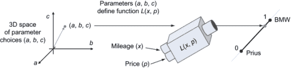

图 15.15 探索参数值 (*a*, *b*, *c*) 的三维空间以定义函数 L(x, p)

然后，我们将创建一个成本函数，这与我们为线性回归创建的成本函数非常相似。我们将称之为 `logistic_cost(a,b,c)` 的成本函数，它接受参数 *a*、*b* 和 *c*，这些参数定义了一个逻辑函数并产生一个数字，衡量逻辑函数与我们的汽车数据集的距离。`logistic_cost` 函数需要以这种方式实现，即其值越低，相关的逻辑函数的预测就越好。

### 15.4.1 逻辑函数的参数化

第一个任务是找到逻辑函数 L(x, p) 的一般形式，其值在零到一之间，其决策边界 L(x, p) = 0.5 是一条直线。我们在上一节中接近了这个目标，从决策边界 p(x) = ax + b 开始，并从那里反向工程出一个逻辑函数。唯一的问题是，形式为 ax + b 的线性函数不能表示平面上的任何直线。例如，图 15.16 显示了一个数据集，其中垂直的决策边界 x = 0.6 是有意义的。然而，这样的线不能用 p = ax + b 的形式表示。

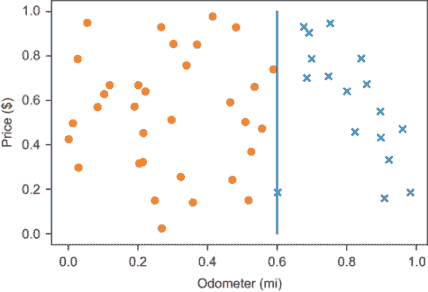

图 15.16 垂直的决策边界可能是有意义的，但它不能以 p = ax + b 的形式表示。

一个有效的工作线的通用形式是我们第七章遇到的形式：*ax* + *by* = *c*。因为我们把我们的变量命名为 *x* 和 *p*，我们将写作 *ax* + *bp* = c。给定这样的方程，函数 *z*(*x*, *p*) = *ax* + *bp* − *c* 在具有正值的这一边和负值的另一边的线上为零。对我们来说，*z*(*x*, *p*) 为正的线的一边是宝马的一边，而 *z*(*x*, *p*) 为负的线的一边是普锐斯的一边。

将 *z*(*x*, *p*) 通过 sigmoid 函数传递，我们得到一个通用的逻辑函数 *L*(*x*, *p*) = σ(*z*(*x*, *p*))，其中当 *z*(*x*, *p*) = 0 时，*L*(*x*, *p*) = 0.5。换句话说，函数 *L*(*x*, *p*) = σ(*ax* + *bp* − *c*) 是我们寻找的通用形式。这很容易翻译成 Python，给我们一个返回对应逻辑函数 *L*(*x*, *p*) = σ(*ax* + *bp* − *c*) 的 *a*，*b* 和 *c* 的函数：

```
def make_logistic(a,b,c):
    def l(x,p):
        return sigmoid(a*x + b*p − c)
    return l
```

下一步是提出一个衡量这个函数接近我们的缩放汽车数据集的指标。

### 15.4.2 测量逻辑函数的拟合质量

对于任何宝马车，`scaled_car_data` 列表中包含一个形式为 (*x*, *p*, 1) 的条目，而对于每辆普锐斯，它包含一个形式为 (*x*, *p*, 0) 的条目，其中 *x* 和 *p* 分别表示（缩放后的）里程和价格值。如果我们对 *x* 和 *p* 值应用一个逻辑函数，*L*(*x*, *p*)，我们将得到一个介于零和一之间的结果。

测量函数 *L* 的错误或成本的一个简单方法就是找出它与正确值（要么是零，要么是一）有多远。如果你把这些错误加起来，你会得到一个总值，告诉你函数 *L*(*x*, *p*) 离数据集有多远。以下是 Python 中的样子：

```
def simple_logistic_cost(a,b,c):
    l = make_logistic(a,b,c)
    errors = [abs(is_bmw-l(x,p)) 
              for x,p,is_bmw in scaled_car_data]
    return sum(errors)
```

这个成本报告了合理的错误，但它还不够好，不能让我们的梯度下降收敛到 *a*，*b* 和 *c* 的最佳值。我不会深入解释为什么是这样，但我将尝试快速给你一个大致的想法。

假设我们有两个逻辑函数，*L*1 和 *L*2，我们想要比较两者的性能。让我们假设它们都查看相同的数据点 (*x*, *p*, 0)，这意味着一个代表普锐斯的数据点。那么，假设 *L*1 返回 0.99，这大于 0.5，因此它错误地预测这辆车是宝马。这个点的错误是 |0-0.99| = 0.99。如果另一个逻辑函数 *L*2 预测值为 0.999，模型更有信心地预测这辆车是宝马，并且错误更大。也就是说，错误将是 |0-0.999| = 0.999，这并没有太大的不同。

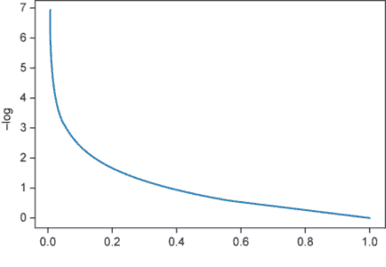

图 15.17 函数 -lo*g*(*x*)对于小的输入返回大值，且 -log(1) = 0。

将*L*[1]视为报告有 99%的可能性数据点代表宝马，有 1%的可能性代表普锐斯，而*L*[2]报告有 99.9%的可能性是宝马，有 0.1%的可能性是普锐斯。与其将其视为比普锐斯预测差 0.09%，我们实际上应该认为它差了十倍！因此，我们可以认为*L*[2]比*L*[1]错误十倍。

我们希望有一个成本函数，如果*L*(*x*, *p*)对错误答案非常确定，那么*L*的成本就很高。为了达到这个目的，我们可以查看*L*(*x*, *p*)与错误答案之间的差异，并通过一个将小值放大成大值的函数。例如，*L*1 对普锐斯返回了 0.99，这意味着它距离错误答案有 0.01 个单位，而*L*2 对普锐斯返回了 0.999，这意味着它距离错误答案有 0.001 个单位。从小的输入返回大值的好函数是−log(*x*)，其中 log 是特殊的自然对数函数。你不必了解−log 函数的具体作用，只需知道它对小的输入返回大数字。图 15.17 显示了−log(*x*)的图像。

为了熟悉−log(*x*)，你可以用一些小的输入对其进行测试。对于*L*1，它距离错误答案有 0.01 个单位，我们得到的成本比*L*2 小，后者距离错误答案有 0.001 个单位：

```
from math import log
>>> −log(0.01)
4.605170185988091
>>> −log(0.001)
6.907755278982137
```

相比之下，如果*L*(*x*, *p*)对普锐斯返回零，它就会给出正确答案。这离错误答案有 1 个单位，所以−log(1) = 0，因此正确答案的成本为零。

现在我们准备实现我们设定的`logistic_cost`函数。为了找到一个给定点的成本，我们计算给定的逻辑函数接近错误答案的程度，然后取结果的负对数。总成本是`scaled_car_data`数据集中每个数据点的成本之和：

```
def point_cost(l,x,p,is_bmw):                     ❶
    wrong = 1 − is_bmw
    return −log(abs(wrong − l(x,p)))

def logistic_cost(a,b,c):
    l = make_logistic(a,b,c)
    errors = [point_cost(l,x,p,is_bmw)            ❷
              for x,p,is_bmw in scaled_car_data]
    return sum(errors)
```

❶ 确定单个数据点的成本

❷ 逻辑函数的整体成本与之前相同，只是我们为每个数据点使用新的 point_cost 函数，而不是仅仅使用误差的绝对值。

结果表明，如果我们尝试使用梯度下降法最小化`logistic_cost`函数，我们会得到好的结果。但在我们这样做之前，让我们进行一个合理性检查，并确认`logistic_cost`对于具有（显然）更好的决策边界的逻辑函数返回更低的值。

### 15.4.3 测试不同的逻辑函数

让我们尝试两个具有不同决策边界的逻辑函数，并确认一个是否比另一个具有更明显的更好决策边界，或者它是否具有更低的成本。作为我们的两个例子，让我们使用*p* = 0.56 − 0.35 · *x*，这是我最好的猜测决策边界，它与 0.35 · *x* + 1 · *p* = 0.56 相同，还有一个任意选择的，比如*x* + *p* = 1。显然，前者是普锐斯和宝马之间更好的分割线。

在源代码中，你可以找到一个 `plot_line` 函数，用于根据方程 *ax* + *by* = *c* 中的值 *a*、*b* 和 *c* 绘制一条线（并且作为本节末尾的练习，你可以尝试自己实现这个函数）。相应的 (*a*, *b*, *c*) 值是 (0.35, 1, 0.56) 和 (1, 1, 1)。我们可以用这三条线与汽车数据的散点图（如图 15.18 所示）一起绘制：

```
plot_data(scaled_car_data)
plot_line(0.35,1,0.56)
plot_line(1,1,1)
```

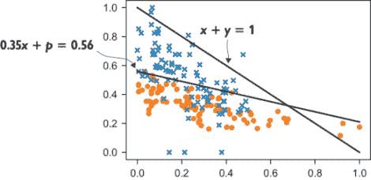

图 15.18 两个决策边界线的图形。其中一条在将普锐斯与宝马分开方面明显优于另一条。

相应的逻辑函数是 σ(0.35 · *x* + *p* − 0.56) 和 σ(*x* + *p* − 1)，我们预计第一个函数在数据方面具有更低的成本。我们可以使用 `logistic_cost` 函数来确认这一点：

```
>>> logistic_cost(0.35,1,0.56)
130.92490748700456
>>> logistic_cost(1,1,1)
135.56446830870456
```

如预期，直线 *x* + *p* = 1 是一个较差的决策边界，因此逻辑函数 σ(*x* + *p* − 1) 具有更高的成本。第一个函数 σ(0.35 · *x* + *p* − 0.56) 具有更低的成本和更好的拟合度。但它是最佳拟合吗？当我们下一节中对 `logistic_cost` 函数进行梯度下降时，我们将找到答案。

### 15.4.4 练习

| **练习 15.6**：实现 15.4.3 节中提到的 `plot_line(a,b,c)` 函数，该函数绘制直线 *ax* + *by* = *c*，其中 0 ≤ *x* ≤ 1 和 0 ≤ *y* ≤ 1。**解答**：请注意，我使用了除了 *a*、*b* 和 *c* 之外的其他名称作为函数参数，因为 `c` 是一个关键字参数，用于设置 Matplotlib 的 `plot` 函数绘制的线条颜色，我经常使用这个函数：

```
def plot_line(acoeff,bcoeff,ccoeff,**kwargs):
    a,b,*c* = acoeff, bcoeff, ccoeff
    if b == 0:
        plt.plot([c/a,c/a],[0,1])
    else:
        def y(*x*):
            return (c-a*x)/b
        plt.plot([0,1],[y(0),y(1)],**kwargs)
```

|

| **练习 15.7**：使用 S 型函数 σ 的公式，写出 σ(*ax* + *by* − *c*) 的展开公式。**解答**：鉴于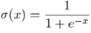，我们可以写出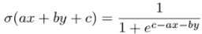 |
| --- |
| **练习 15.8-迷你项目**：函数 *k*(*x*, *y*) = σ(*x*² + y² − 1) 的图形是什么样的？决策边界是什么样的，即 *k*(*x*, *y*) = 0.5 的点的集合。**解答**：我们知道 σ(*x*² + y² − 1) = 0.5，无论 *x*² + y² − 1 = 0 还是 *x*² + y² = 1。你可以识别出这个方程的解为距离原点一个单位的点或半径为 1 的圆。在圆内，从原点的距离较小，因此 *x*² + y² < 1 且 σ(*x*² + y²) < 0.5，而在圆外 *x*² + y² > 1，因此 σ(*x*² + y² − 1) > 0.5。随着我们沿任何方向远离原点，这个函数的图形趋近于 1，而在圆内下降到原点处的最小值约为 0.27。以下是图形！[](../Images/CH15_F18_Orland_UN02.png)。σ(*x*² + *y*² − 1) 的图形。在半径为 1 的圆内，其值小于 0.5，而在该圆外的每个方向上增加到 1。 |
| **练习 15.9-迷你项目**：两个方程 2*x* + *y* = 1 和 4*x* + 2*y* = 2 定义了同一条线，因此也定义了相同的决策边界。逻辑函数 σ(2*x* + *y* − 1) 和 σ(4*x* + 2*y* − 2) 是否相同？**解答**：它们不是同一个函数。与 *x* 和 *y* 的增加相比，量 4*x* + 2*y* − 2 的增加速度更快，因此后一个函数的图像更陡峭：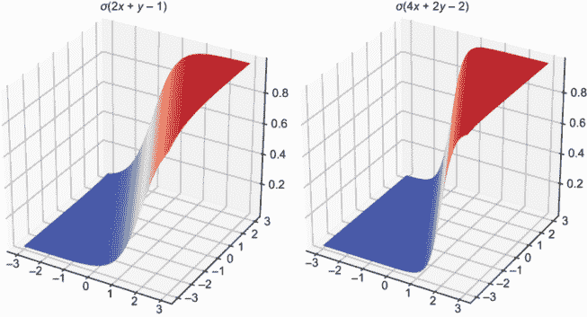第二个逻辑函数的图像比第一个更陡峭。 |
| **练习 15.10-迷你项目**：给定一条直线 *ax* + *by* = *c*，定义这条线以上和以下的部分并不容易。你能描述函数 *z*(*x*, *y*) = *ax* + *by* − *c* 返回正值的那一侧吗？**解答**：直线 *ax* + *by* = *c* 是点集，其中 *z*(*x*, *y*) = *ax* + *by* − *c* = 0。正如我们在第七章中看到的那样，这种形式的方程的 *z*(*x*, *y*) = *ax* + *by* − *c* 的图像是一个平面，因此它从直线开始在一个方向上增加，在另一个方向上减少。*z*(*x*, *y*) 的梯度是 ∇*z*(*x*, *y*) = (*a*, *b*)，因此 *z*(*x*, *y*) 在向量 (*a*, *b*) 的方向上增加最快，在相反方向（− *a*, − *b*）上减少最快。这两个方向都与直线的方向垂直。 |

## 15.5 寻找最佳逻辑函数

我们现在有一个直接的最小化问题要解决；我们希望找到使 `logistic_cost` 函数尽可能小的 *a*，*b* 和 *c* 的值。然后相应的函数，*L*(*x*, *p*) = σ(*ax* + *bp* − *c*) 将是数据的最佳拟合。我们可以使用这个结果函数通过插入未知汽车的里程 *x* 和价格 *p* 来构建一个分类器，如果 *L*(*x*, *p*) > 0.5，则将其标记为宝马，否则标记为普锐斯。我们将这个分类器命名为 `best_logistic_classifier(x,p)`，并将其传递给 `test_classifier` 以查看其表现如何。

我们在这里要做的唯一一项主要工作是升级我们的 `gradient_descent` 函数。到目前为止，我们只对那些接受二维向量并返回数字的函数进行了梯度下降。`logistic_cost` 函数接受一个三维向量 (*a*, *b*, *c*) 并输出一个数字，因此我们需要一个新的梯度下降版本。幸运的是，我们已经为每个二维向量操作覆盖了三维类比，所以这不会太难。

### 15.5.1 三维梯度下降

让我们看看我们在第十二章和第十四章中用来处理两个变量函数的现有梯度计算方法。函数 *f*(*x*, *y*) 在点 (*x*[0], *y*[0]) 的偏导数是相对于 *x* 和 *y* 的单独导数，同时假设另一个变量是常数。例如，将 *y*[0] 插入到 *f*(*x*, *y*) 的第二个槽中，我们得到 *f*(*x*, *y*[0])，我们可以将其视为仅关于 *x* 的函数并对其求普通导数。将这两个偏导数作为二维向量的分量放在一起，我们就得到了梯度：

```
def approx_gradient(f,x0,y0,dx=1e-6):
    partial_x = approx_derivative(lambda x:f(x,y0),x0,dx=dx)
    partial_y = approx_derivative(lambda y:f(x0,y),y0,dx=dx)
    return (partial_x,partial_y)
```

对于三个变量的函数，区别在于我们还可以取另一个偏导数。如果我们看 *f*(*x*, *y*, *z*) 在点 (*x*[0], *y*[0], *z*[0])，我们可以将 *f*(*x*, *y*[0], *z*[0])、*f*(*x*[0], *y*, *z*[0]) 和 *f*(*x*[0], *y*[0], *z*) 分别视为 *x*、*y* 和 *z* 的函数，并对其求普通导数以得到三个偏导数。将这些三个偏导数作为一个向量放在一起，我们就得到了梯度的三维版本：

```
def approx_gradient3(f,x0,y0,z0,dx=1e-6):
    partial_x = approx_derivative(lambda x:f(x,y0,z0),x0,dx=dx)
    partial_y = approx_derivative(lambda y:f(x0,y,z0),y0,dx=dx)
    partial_z = approx_derivative(lambda z:f(x0,y0,z),z0,dx=dx)
    return (partial_x,partial_y,partial_z)
```

在三维空间中进行梯度下降，过程正如你所期望的那样；我们从三维空间中的某个点开始，计算梯度，然后朝那个方向迈出小一步到达一个新的点，在那里，希望 *f*(*x*, *y*, *z*) 的值会更小。作为额外的增强，我添加了一个 `max_steps` 参数，这样我们就可以设置梯度下降过程中可以采取的最大步数。有了这个参数设置为合理的限制，即使算法没有收敛到容差内的点，我们也不必担心我们的程序会停滞。以下是 Python 中的结果：

```
def gradient_descent3(f,xstart,ystart,zstart,
                      tolerance=1e-6,max_steps=1000):
    x = xstart
    y = ystart
    z = zstart
    grad = approx_gradient3(f,x,y,z)
    steps = 0
    while length(grad) > tolerance and steps < max_steps:
        x -= 0.01 * grad[0]
        y -= 0.01 * grad[1]
        z -= 0.01 * grad[2]
        grad = approx_gradient3(f,x,y,z)
        steps += 1
    return x,y,z
```

剩下的就是插入 `logistic_cost` 函数，然后 `gradient_descent3` 函数会找到最小化它的输入。

### 15.5.2 使用梯度下降法寻找最佳拟合

为了谨慎起见，我们可以先使用少量的 `max_steps`，比如 100：

```
>>> gradient_descent3(logistic_cost,1,1,1,max_steps=100)
(0.21114493546399946, 5.04543972557848, 2.1260122558655405)
```

如果我们允许它走 200 步而不是 100 步，我们会看到它实际上需要走得更远：

```
>>> gradient_descent3(logistic_cost,1,1,1,max_steps=200)
(0.884571531298388, 6.657543188981642, 2.955057286988365)
```

记住，这些结果是定义逻辑函数所需的参数，但它们也是定义形式为 *ax* + *bp* = *c* 的决策边界的参数 (*a*, *b*, *c*)。如果我们对梯度下降进行 100 步、200 步、300 步等，并用 `plot_line` 绘制相应的线，我们可以看到决策边界如图 15.19 所示的那样收敛。

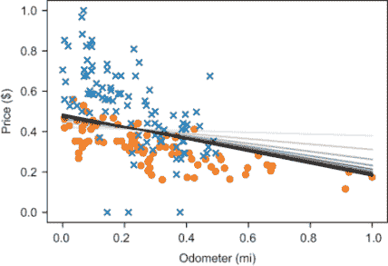

图 15.19 随着步数的增加，梯度下降法返回的 (*a*, *b*, *c*) 值似乎正在稳定在一个清晰的决策边界上。

在 7,000 到 8,000 步之间，算法实际上收敛了，这意味着它找到了一个梯度长度小于 10^(-6)的点。大致来说，这就是我们寻找的最小点：

```
>>> gradient_descent3(logistic_cost,1,1,1,max_steps=8000)
(3.7167003153580045, 11.422062409195114, 5.596878367305919)
```

我们可以看到这个决策边界相对于我们一直在使用的决策边界（图 15.20 显示了结果）的样子：

```
plot_data(scaled_car_data)
plot_line(0.35,1,0.56)
plot_line(3.7167003153580045, 11.422062409195114, 5.596878367305919)
```

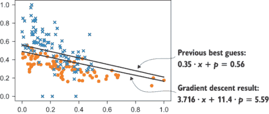

图 15.20 比较我们之前最佳猜测的决策边界与梯度下降结果所暗示的决策边界

这个决策边界与我们猜测的并不太远。逻辑回归的结果似乎将决策边界稍微向下移动，以换取一些假阳性（现在错误地位于图 15.20 中的线上方的普锐斯）和一些更多的真阳性（现在正确地位于线上方的宝马）。

### 15.5.3 测试和理解最佳逻辑分类器

我们可以轻松地将(*a*, *b*, *c*)的这些值插入到逻辑函数中，然后使用它来创建一个汽车分类函数：

```
def best_logistic_classifier(x,p):
    l = make_logistic(3.7167003153580045, 11.422062409195114, 5.596878367305919)
    if l(x,p) > 0.5:
        return 1
    else:
        return 0
```

将这个函数插入到`test_classifier`函数中，我们可以看到它在测试数据集上的准确率大约与我们的最佳尝试结果一致，精确到 80%：

```
>>> test_classifier(best_logistic_classifier,scaled_car_data)
0.8
```

决策边界相当接近，所以性能没有偏离我们在第 15.2 节中的猜测也就不足为奇了。然而，如果我们之前的结果已经很接近，为什么决策边界会如此果断地收敛到那个位置呢？

结果表明，逻辑回归不仅仅是找到最优的决策边界。实际上，我们在本节早期就看到了一个决策边界，它的性能比这个最佳拟合逻辑分类器高出 0.5%，所以逻辑分类器并没有在测试数据集上最大化准确率。相反，逻辑回归从整体上审视数据集，并找到在所有示例中最有可能准确性的模型。而不是稍微移动决策边界以获取测试集上的一两个百分点的准确率，算法基于对数据集的整体视角来定位决策边界。如果我们的数据集具有代表性，我们可以相信我们的逻辑分类器在未见过的数据上也能表现良好，而不仅仅是训练集中的数据。

我们的逻辑分类器还有其他信息，那就是对每个分类点的确定性程度。仅基于决策边界的分类器对位于该边界之上的点是一辆宝马，位于该边界之下的点是一辆普锐斯的 100%确定。我们的逻辑分类器有更细微的看法；我们可以将它在 0 到 1 之间返回的值解释为汽车是宝马而不是普锐斯的概率。在现实世界的应用中，了解机器学习模型的最佳猜测以及它认为自己的可信度如何可能非常有价值。如果我们根据医学扫描将良性肿瘤与恶性肿瘤分类，如果算法告诉我们肿瘤有 99%的确定性是恶性的，而不是 51%，我们可能会采取截然不同的行动。

确定性在分类器形状中体现为系数的幅度（*a*，*b*，*c*）。例如，你可以看到在我们猜测的 (0.35, 1, 0.56) 中，(*a*，*b*，*c*) 的比例与最优值 (3.717, 11.42, 5.597) 中的比例相似。最优值大约是我们最佳猜测的十倍。造成这种变化的最大差异是逻辑函数的陡峭程度。最优逻辑函数比第一个更确定决策边界。它告诉我们，一旦你越过决策边界，结果确定性就会显著增加，如图 15.21 所示。

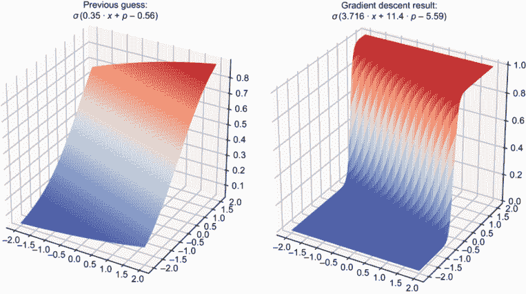

图 15.21 优化后的逻辑函数更陡峭，这意味着当你越过决策边界时，它确定一辆车是宝马而不是普锐斯的确定性会迅速增加。

在最后一章，我们将继续使用 Sigmoid 函数来生成介于零和一之间的结果确定性，当我们使用神经网络实现分类时。

### 15.5.4 练习

| **练习 15.11**: 修改 `gradient_descent3` 函数，使其在返回结果前打印出所采取的总步数。梯度下降法对 `logistic_cost` 的收敛需要多少步？**解答**：你只需要在 `gradient_descent3` 返回结果前添加一行 `print(steps)` 即可：

```
def gradient_descent3(f,xstart,ystart,zstart,tolerance=1e−6,max_steps=1000):
    ...
    print(steps)
    return x,y,z
```

运行以下梯度下降

```
gradient_descent3(logistic_cost,1,1,1,max_steps=8000)
```

打印出的数字是 `7244`，这意味着算法在 7,244 步中收敛。|

| **练习 15.12-迷你项目**：编写一个 `approx_gradient` 函数，该函数可以计算任何数量维度的函数的梯度。然后编写一个 `gradient_descent` 函数，该函数可以在任何数量维度上工作。为了测试你的 `gradient_descent` 在 *n* 维函数上的效果，你可以尝试一个函数，例如 *f*(*x*[1]，*x*[2]，... ，*x^n* ) = (*x*[1] − 1)² + (*x*[2] − 1)² + ... + (*x^n* − 1)²，其中 *x*[1]，*x*[2]，... ，*x^n* 是函数 *f* 的 *n* 个输入变量。这个函数的最小值应该是 (1, 1, ..., 1)，一个每个条目都是数字 1 的 *n* 维向量。**解答**：让我们将任意维度的向量建模为数字列表。为了在向量 ***v*** = (*v*[1]，*v*[2]，... ，*v[n]*）的 *i*^(th) 坐标上求偏导数，我们想要对 *i*^(th) 坐标 *x[i]* 求普通导数。也就是说，我们想要查看函数:*f*(*v*[1]，*v*[2]，... ，*v*[*i*−1]，*x[i]*，*v*[*i*+1]，... ，*v[n]*)，换句话说，就是将 ***v*** 的每个坐标都插入到 *f* 中，除了 *i*^(th) 条目，它被留作变量 *x[i]*。这给我们一个单变量 *x[i]* 的函数，它的普通导数就是 *i*^(th) 偏导数。偏导数的代码看起来像这样：

```
def partial_derivative(f,i,v,**kwargs):
    def cross_section(*x*):
        arg = [(vj if j != i else x) for j,vj in enumerate(*v*)]
        return *f*(*arg)
    return approx_derivative(cross_section, v[i], **kwargs)
```

注意，我们的坐标是零索引的，输入到 *f* 的维度从 ***v*** 的长度推断出来。其余的工作相对容易。要构建梯度，我们只需取 *n* 个偏导数并将它们按顺序放入列表：

```
def approx_gradient(f,v,dx=1e−6):
    return [partial_derivative(f,i,v) for i in range(0,len(*v*))]
```

要进行梯度下降，我们将所有对命名坐标变量的操作，如 *x*、*y* 和 *z*，替换为对坐标列表向量 ***v*** 的列表操作：*

```
def gradient_descent(f,vstart,tolerance=1e−6,max_steps=1000):
    v  = vstart
    grad = approx_gradient(f,v)
    steps = 0
    while length(grad) > tolerance and steps < max_steps:
        v  = [(vi − 0.01 * dvi) for vi,dvi in zip(v,grad)]
        grad = approx_gradient(f,v)
        steps += 1
    return v
```

|

| 要实现建议的测试函数，我们可以编写一个通用版本，它接受任意数量的输入，并返回它们与一个值的平方差的和：

```
def sum_squares(*v):
    return sum([(x−1)**2 for *x* in v])
```

这个函数不能低于零，因为它是由平方和组成的，而平方不能小于零。当输入向量 ***v*** 的每个元素都是一的时候，得到零值，这就是最小值。我们的梯度下降法确认了这一点（只有很小的数值误差），所以一切看起来都很正常！请注意，因为起始向量 ***v*** 是 5 维的，所以计算中的所有向量都是自动 5 维的。

```
>>> xv  = [2,2,2,2,2]
>>> gradient_descent(sum_squares,v)
[1.0000002235452137,
 1.0000002235452137,
 1.0000002235452137,
 1.0000002235452137,
 1.0000002235452137]
```

|

| **练习 15.13-迷你项目**：尝试使用 `simple_logistic_cost` 成本函数运行梯度下降。会发生什么？**解决方案**：它似乎没有收敛。尽管决策边界稳定，但 *a*、*b* 和 *c* 的值仍然无限增加。这意味着随着梯度下降探索越来越多的逻辑函数，这些函数保持同一方向，但变得越来越陡峭。它被激励着越来越接近大多数点，而忽略了它已经错误分类的点。正如我提到的，可以通过惩罚逻辑函数最自信的错误分类来解决此问题，我们的 `logistic_cost` 函数就很好地做到了这一点。 |
| --- |

## 摘要

+   分类是一种机器学习任务，其中算法被要求查看未标记的数据点，并将每个点识别为某一类的成员。在本章的示例中，我们查看二手车里程和价格数据，并编写了一个算法来将它们分类为 5 系列宝马或丰田普锐斯。

+   在 2D 空间中对向量数据进行分类的一种简单方法就是建立决策边界；这意味着在数据存在的 2D 空间中绘制一个实际的边界，边界的一侧的点被分类为一类，另一侧的点被分类为另一类。简单的决策边界是一条直线。

+   如果我们的决策边界线具有形式 *ax* + *by* = *c*，那么 *ax* + *by* − *c* 的值在直线的一侧为正，在另一侧为负。我们可以将这个值解释为衡量数据点看起来像宝马的程度的一个指标。正值意味着数据点看起来像宝马，而负值则意味着它更像普锐斯。

+   定义如下，sigmoid 函数将介于 -∞ 和 ∞ 之间的数字压缩到从零到一的有限区间：

    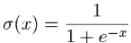

+   将 Sigmoid 函数与函数*ax* + *by* − *c*组合，我们得到一个新的函数σ(*ax* + *by* − *c*)，它也衡量数据点看起来有多像宝马，但它只返回介于零和一之间的值。这种类型的函数是二维中的对数函数。

+   对数分类器输出的介于零和一之间的值可以解释为它有多自信地认为一个数据点属于某一类而不是另一类。例如，返回值 0.51 或 0.99 都表明模型认为我们正在看一辆宝马，但后者将是一个更加自信的预测。

+   使用一个对自信但错误的分类进行惩罚的适当代价函数，我们可以使用梯度下降法找到最佳拟合的对数函数。这是根据数据集得出的最佳对数分类器。
