# 16 训练神经网络

本章涵盖了

+   将手写数字图像分类为向量数据

+   设计一种称为多层感知器的神经网络类型

+   将神经网络作为向量变换进行评估

+   使用成本函数和梯度下降法拟合神经网络

+   在反向传播中计算神经网络的偏导数

在本书的最后一章，我们将你迄今为止学到的几乎所有内容结合起来，介绍今天最著名的机器学习工具之一：人工神经网络。*人工神经网络*，简称神经网络，是一种数学函数，其结构大致基于人脑的结构。这些被称为“人工”的，是为了与大脑中存在的“有机”神经网络相区别。这听起来可能是一个高远且复杂的目标，但它全部基于对大脑工作原理的一个简单隐喻。

在解释这个隐喻之前，我想先提醒你，我不是神经学家。粗略的想法是，大脑是一大团相互连接的细胞，称为*神经元*，当你思考某些想法时，实际上发生的是特定神经元的电活动。你可以在适当的脑扫描中看到这种电活动，大脑的各个部分会亮起（图 16.1）。

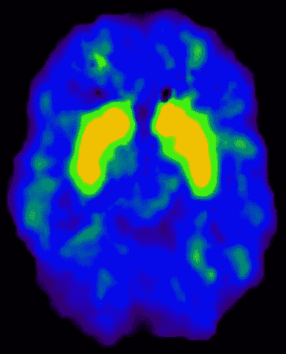

图 16.1 不同类型的脑活动导致不同的神经元电激活，在脑扫描中显示出明亮区域。

与人脑中的数十亿个神经元相比，我们在 Python 中构建的神经网络只有几十个神经元，而特定神经元被激活的程度由一个称为其*激活*的单个数字表示。当一个神经元在大脑或我们的人工神经网络中激活时，它可以导致相邻的、连接的神经元也被激活。这允许一个想法导致另一个想法，我们可以将其松散地视为创造性思维。

从数学的角度来看，我们神经网络中神经元的激活是一个函数，该函数取决于与之相连的神经元的数值激活值。如果一个神经元连接到四个其他神经元，其激活值分别为 *a*[1] ， *a*[2] ， *a*[3] 和 *a*[4] ，那么它的激活将是一个数学函数应用于这四个值的结果，比如说 *f*(*a*[1] ， *a*[2] ， *a*[3] ， *a*[4] )。

图 16.2 显示了一个示意图，其中所有神经元都被绘制成圆形。我以不同的阴影来表示它们具有不同的激活水平，有点像脑扫描中较亮或较暗的区域。

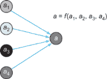

图 16.2 将神经元激活描绘为数学函数，其中 *a*[1] ， *a*[2] ， *a*[3] 和 *a*[4] 是应用于函数 f 的激活值。

如果*a*[1]、*a*[2]、*a*[3]和*a*[4]的值依赖于其他神经元的激活，那么*a*的值可能依赖于更多的数字。随着神经元和连接的增加，您可以构建一个任意复杂的数学函数，目标是模拟任意复杂的思想。

我刚刚向您解释的内容是对神经网络的一种哲学性的介绍，但这绝对不足以让您开始编码。在本章中，我将详细向您展示如何运用这些想法并构建您自己的神经网络。正如上一章一样，我们将使用神经网络解决的问题是**分类**。构建神经网络并训练其在分类任务上表现良好有许多步骤，因此在深入之前，我会先制定计划。

## 16.1 使用神经网络进行数据分类

在本节中，我专注于神经网络的一个经典应用：图像分类。具体来说，我们将使用手写数字的低分辨率图像（从 0 到 9 的数字），我们希望我们的神经网络能够识别给定图像中显示的是哪个数字。图 16.3 展示了这些数字的一些示例图像。

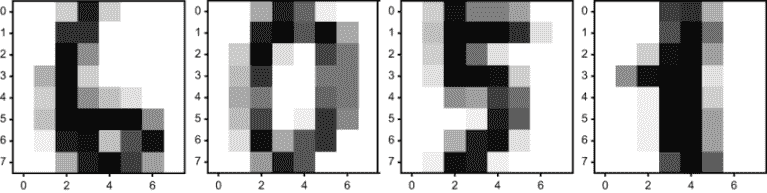

图 16.3 一些手写数字的低分辨率图像

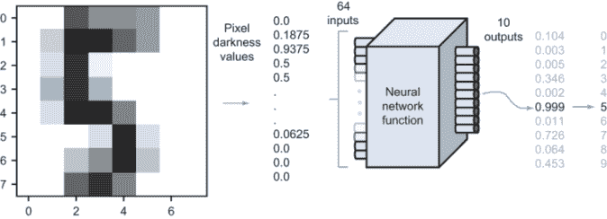

图 16.4 我们的 Python 神经网络函数如何对数字图像进行分类。

如果您将图 16.3 中的数字识别为 6、0、5 和 1，那么恭喜您！您的有机神经网络（即您的头脑）训练得很好。我们的目标在这里是构建一个人工神经网络，它可以观察这样的图像并将其分类为十个可能的数字之一，也许和人类一样好。

在第十五章中，分类问题相当于观察一个二维向量并将其分类为两个类别之一。在本问题中，我们观察 8x8 像素的灰度图像，其中每个 64 像素由一个数字描述，该数字告诉我们其亮度。正如我们在第六章中将图像视为向量一样，我们将 64 像素的亮度值视为一个 64 维向量。我们希望将每个 64 维向量放入十个类别之一，表示它代表的数字。因此，我们的分类函数将比第十五章中的函数有更多的输入和输出。

具体来说，我们将用 Python 构建的神经网络分类函数将看起来像一个具有 64 个输入和 10 个输出的函数。换句话说，它是一个从ℝ⁶⁴到ℝ¹⁰的（非线性！）向量变换。输入数字是像素的亮度值，从 0 到 1 缩放，十个输出值代表图像是十个数字中的哪一个的可能性。最大输出值的索引是答案。在以下情况（如图 16.4 所示）中，一个 5 的图像被传入，神经网络在第五个槽位返回其最大值，因此它正确地识别了图像中的数字。

图 16.4 中间的神经网络函数不过是一个数学函数。它的结构将比我们之前看到的更复杂，实际上，定义它的公式太长了，无法写在纸上。评估神经网络更像是在执行一个算法。我将向您展示如何做这件事，并在 Python 中实现它。

正如我们在上一章测试了许多不同的逻辑函数一样，我们也可以尝试许多不同的神经网络，看看哪一个具有最佳的预测准确性。再次强调，系统地做这件事的方法是梯度下降。虽然一个线性函数由公式 *f*(*x*) = *ax* + *b* 中的两个常数 *a* 和 *b* 决定，但给定形状的神经网络可以有数千个常数决定其行为方式。这需要计算很多偏导数！幸运的是，由于连接我们神经网络中神经元的函数的形式，存在一个用于计算梯度的快捷算法，这被称为*反向传播*。

从头开始推导反向传播算法并仅使用我们至今为止所学的数学知识来实现它是有可能的，但不幸的是，这个项目太大，不适合放在这本书中。相反，我将向您展示如何使用一个名为 scikit-learn（“sci”发音类似于“science”）的著名 Python 库来为我们执行梯度下降，这样它就可以自动训练神经网络，以尽可能好地预测我们的数据集。最后，我将向您透露反向传播背后的数学原理。我希望这将是您在机器学习领域辉煌职业生涯的起点。

## 16.2 手写数字图像分类

在我们开始实现神经网络之前，我们需要准备数据。我使用的数字图像是 scikit-learn 数据中附带的大量免费测试数据之一。一旦我们下载了这些数据，我们需要将它们转换为介于零和一之间的 64 维向量。数据集还包含了每个数字图像的正确答案，表示为从零到九的 Python 整数。

然后，我们构建了两个 Python 函数来练习分类。第一个是一个名为`random_classifier`的假数字识别函数，它接受代表图像的 64 个数字，并（随机地）输出代表图像代表从 0 到 9 每个数字的确定性的 10 个数字。第二个是一个名为`test_digit_classify`的函数，它接受一个分类器，并自动将数据集中的每个图像插入其中，返回正确答案的数量。由于我们的`random_classifier`产生随机结果，它应该只有 10%的时间猜对答案。这为我们用真正的神经网络替换它时提供了改进的基础。

### 16.2.1 构建 64 维图像向量

如果你正在使用附录 A 中描述的 Anacondas Python 发行版，你应该已经有了名为`sklearn`的 scikit-learn 库。如果没有，你可以使用 pip 安装它。要打开`sklearn`并导入数字数据集，你需要以下代码：

```
from sklearn import datasets
digits = datasets.load_digits()
```

数字中的每个条目都是一个 2D NumPy 数组（一个矩阵），给出了一个图像的像素值。例如，`digits.images[0]`给出了数据集中第一张图像的像素值，它是一个 8x8 的值矩阵：

```
>>> digits.images[0]
array([[ 0.,  0.,  5., 13.,  9.,  1.,  0.,  0.],
       [ 0.,  0., 13., 15., 10., 15.,  5.,  0.],
       [ 0.,  3., 15.,  2.,  0., 11.,  8.,  0.],
       [ 0.,  4., 12.,  0.,  0.,  8.,  8.,  0.],
       [ 0.,  5.,  8.,  0.,  0.,  9.,  8.,  0.],
       [ 0.,  4., 11.,  0.,  1., 12.,  7.,  0.],
       [ 0.,  2., 14.,  5., 10., 12.,  0.,  0.],
       [ 0.,  0.,  6., 13., 10.,  0.,  0.,  0.]])
```

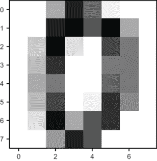

图 16.5 sklearn 数字数据集中的第一张图像，看起来像零

你可以看到灰度值的范围是有限的。矩阵仅由 0 到 15 的整数组成。

Matplotlib 有一个有用的内置函数叫做`imshow`，它可以将矩阵的条目显示为图像。使用正确的灰度指定，矩阵中的零值显示为白色，较大的非零值显示为较深的灰色阴影。例如，图 16.5 显示了数据集中的第一张图像，看起来像零，这是由`imshow`生成的：

```
import matplotlib.pyplot as plt
plt.imshow(digits.images[0], cmap=plt.cm.gray_r)

```

为了再次强调我们将如何将此图像视为一个 64 维向量，图 16.6 显示了图像的一个版本，其中每个 64 像素的亮度值都叠加在相应的像素上。

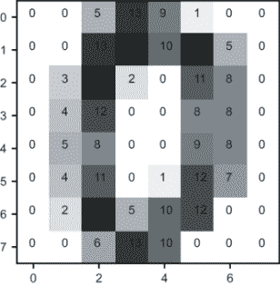

图 16.6 数字数据集中的一张图像，每个像素的亮度值都叠加在相应的像素上。

要将这个 8x8 的数字矩阵转换成一个包含 64 个元素的向量，我们可以使用一个内置的 NumPy 函数，称为`np.matrix.flatten`。这个函数从矩阵的第一行开始构建一个向量，接着是第二行，以此类推，从而给我们一个与第六章中使用的类似图像的向量表示。将第一张图像矩阵展平确实给我们一个包含 64 个元素的向量：

```
>>> import numpy as np
>>> np.matrix.flatten(digits.images[0])
array([ 0.,  0.,  5., 13.,  9.,  1.,  0.,  0.,  0.,  0., 13., 15., 10.,
       15.,  5.,  0.,  0.,  3., 15.,  2.,  0., 11.,  8.,  0.,  0.,  4.,
       12.,  0.,  0.,  8.,  8.,  0.,  0.,  5.,  8.,  0.,  0.,  9.,  8.,
        0.,  0.,  4., 11.,  0.,  1., 12.,  7.,  0.,  0.,  2., 14.,  5.,
       10., 12.,  0.,  0.,  0.,  0.,  6., 13., 10.,  0.,  0.,  0.])
```

为了保持我们的分析在数值上整洁，我们再次将数据缩放，使值在 0 到 1 之间。因为数据集中每个条目的像素值都在 0 到 15 之间，我们可以将这些向量乘以 1/15 来得到缩放版本。NumPy 重载了`*`和`/`运算符，以便自动作为向量的标量乘法（和除法）操作，所以我们只需简单地输入

```
np.matrix.flatten(digits.images[0]) / 15
```

我们将得到一个缩放的结果。现在我们可以构建一个样本数字分类器来将这些值插入其中。

### 16.2.2 构建随机数字分类器

数字分类器的输入是一个 64 维向量，就像我们刚才构建的那样，输出是一个包含每个元素值在 0 到 1 之间的 10 维向量。在我们的第一个例子中，输出向量的元素可以随机生成，但我们将它们解释为分类器对图像代表十个数字中的每一个的确定性。

由于我们现在对随机输出没有问题，这很容易实现；NumPy 有一个函数，`np.random.rand`，它产生一个指定大小的介于 0 和 1 之间的随机数数组。例如，`np.random.rand(10)` 给我们一个介于 0 和 1 之间的 10 个随机数的 NumPy 数组。我们的 `random_classifier` 函数接受一个输入向量，忽略它，并返回一个随机向量：

```
def random_classifier(input_vector):
    return np.random.rand(10)
```

要对数据集中的第一张图像进行分类，我们可以运行以下代码：

```
>>> xv  = np.matrix.flatten(digits.images[0]) / 15.
>>> result = random_classifier(*v*)
>>> result
array([0.78426486, 0.42120868, 0.47890909, 0.53200335, 0.91508751,
       0.1227552 , 0.73501115, 0.71711834, 0.38744159, 0.73556909])
```

这个输出中的最大条目大约是 `0.915`，出现在索引 4 处。返回这个向量，我们的分类器告诉我们，图像代表任何数字的可能性，它最可能是 4。要程序化地获取最大值的索引，我们可以使用以下 Python 代码：

```
>>> list(result).index(max(result))
4
```

在这里，`max(result)` 找到数组中的最大条目，`list(result)` 将数组视为普通的 Python 列表。然后我们可以使用内置的 `list` 索引函数来找到最大值的索引。返回值 4 是不正确的；我们之前看到这张图片是 0，我们也可以检查官方结果。

每个图像的正确数字存储在 `digits.target` 数组的相应索引中。对于图像 `digits.images[0]`，正确值是 `digits.target[0]`，正如我们所期望的是零：

```
>>> digits.target[0]
0
```

我们的随机分类器预测图像为 4，而实际上它是 0。因为它是在随机猜测，所以 90%的时间应该是错误的，我们可以通过在大量测试示例上测试它来确认这一点。

### 16.2.3 测量数字分类器的性能

现在我们将编写函数 `test_digit_classify`，它接受一个分类器函数并测量其在大量数字图像上的性能。任何分类器函数都将具有相同的形状；它接受一个 64 维输入向量并返回一个 10 维输出向量。`test_digit_classify` 函数遍历所有测试图像和已知正确答案，查看分类器是否产生正确答案：

```
def test_digit_classify(classifier,test_count=1000):
    correct = 0                                          ❶
    for img, target in zip(digits.images[:test_count], 
digits.target[:test_count]):                             ❷
        v  = np.matrix.flatten(img) / 15\.                ❸
        output = classifier(*v*)                           ❹
        answer = list(output).index(max(output))         ❺
        if answer == target:
            correct += 1                                 ❻
    return (correct/test_count)                          ❼
```

❶ 将正确分类的计数器从 0 开始

❷ 在测试集中循环图像对及其对应的目标，给出数字的正确答案

❸ 将图像矩阵展平成一个 64D 向量，并适当地缩放

❹ 将图像向量通过分类器以获得一个 10D 结果

❺ 找到这个结果中最大条目的索引，这是分类器的最佳猜测

❻ 如果这与我们的答案匹配，则增加计数器

❼ 返回正确分类的数量与总测试数据点的比例

我们预计我们的随机分类器大约能正确回答 10%的问题。因为它随机行动，它可能在某些试验中做得比其他试验好，但由于我们在这么多图像上进行了测试，结果应该每次都接近 10%。让我们试一试：

```
>>> test_digit_classify(random_classifier)
0.107
```

在这个测试中，我们的随机分类器在 10.7%的准确率上略好于预期。这本身并不太有趣，但现在我们已经组织好了数据并有了可以超越的基线示例，因此我们可以开始构建我们的神经网络。

### 16.2.4 练习

| **练习 16.1**：假设一个数字分类器函数输出以下 NumPy 数组。它推断图像中包含的是哪个数字？

```
array([5.00512567e-06, 3.94168539e-05, 5.57124430e-09, 9.31981207e-09,
       9.98060276e-01, 9.10328786e-07, 1.56262695e-03, 1.82976466e-04,
       1.48519455e-04, 2.54354113e-07])
```

**解决方案**：此数组中的最大数是`9.98060276e-01`，或大约 0.998，出现在第五位，或索引 4。因此，这个输出表示图像被分类为 4。

| **练习 16.2-迷你项目**：以我们在第六章中取平均值的方式，找到数据集中所有 9 的图像的平均值。绘制结果图像。**解决方案**：此代码接受一个整数*i*，并计算表示数字*i*的数据集中图像的平均值。因为数字图像以 NumPy 数组的形式表示，支持加法和标量乘法，我们可以使用普通的 Python `sum`函数和除法运算符来计算平均值：

```
def average_img(i):
    imgs = [img for img,target in zip(digits.images[1000:], digits.target[1000:]) if target==i]
    return sum(imgs) / len(imgs)
```

使用此代码，`average_img(9)`计算一个 8-by-8 矩阵，表示所有 9 的图像的平均值，其外观如下：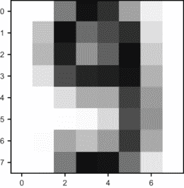 |

| **练习 16.3-迷你项目**：通过找到测试数据集中每种数字的平均图像并与目标图像进行比较，构建一个比随机分类器更好的分类器。具体来说，返回目标图像与每个平均数字图像的点积向量。**解决方案**：

```
avg_digits = [np.matrix.flatten(average_img(i)) for i in range(10)]
def compare_to_avg(*v*):
    return [np.dot(v,avg_digits[i]) for i in range(10)]
```

测试这个分类器，我们在测试数据集中正确识别了 85%的数字。还不错！

```
>>> test_digit_classify(compare_to_avg)
0.853
```

|

## 16.3 设计神经网络

在本节中，我向您展示如何将神经网络视为一个数学函数，以及根据其结构，您可以期望它如何表现。这为我们下一节做准备，在那里我们将我们的第一个神经网络作为 Python 函数实现，以便对数字图像进行分类。

对于我们的图像分类问题，我们的神经网络有 64 个输入值和 10 个输出值，需要数百次操作来评估。因此，在本节中，我坚持使用一个更简单的神经网络，它有三个输入和两个输出。这使得我们可以想象整个网络并逐步了解其评估的每一步。一旦我们覆盖了这一点，编写适用于任何大小神经网络的评估步骤在一般 Python 代码中就会变得容易。

### 16.3.1 组织神经元和连接

正如我在本章开头所描述的，神经网络的模型是一组神经元，其中给定神经元的激活取决于其连接神经元的激活程度。从数学上讲，激活一个神经元是连接神经元激活的函数。根据使用的神经元数量、连接的神经元以及连接它们的函数，神经网络的行为可能不同。在本章中，我们将关注最简单且有用的神经网络类型之一−*多层感知器*。

多层感知器，简称 MLP，由从左到右排列的几列神经元组成，称为*层*。每个神经元的激活是前一层激活的函数，即紧靠左侧的一层。最左侧的层不依赖于其他任何神经元，其激活基于训练数据。图 16.7 展示了四层 MLP 的示意图。

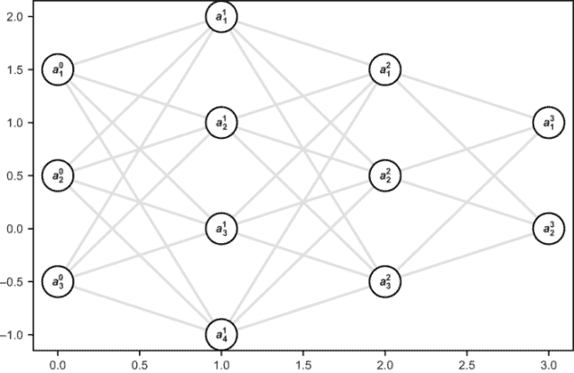

图 16.7 多层感知器（MLP）的示意图，由几层神经元组成

在图 16.7 中，每个圆圈代表一个神经元，圆圈之间的线条表示连接的神经元。一个神经元的激活仅取决于前一层的神经元激活，并影响下一层中每个神经元的激活。我任意选择了每层的神经元数量，在这个特定的示意图中，层分别由三个、四个、三个和两个神经元组成。

因为总共有 12 个神经元，所以总共有 12 个激活值。通常可以有更多的神经元（我们将在数字分类中使用 90 个），所以不能给每个神经元一个字母变量名。相反，我们用字母 *a* 来表示所有激活，并用上标和下标来索引它们。上标表示层，下标表示层内讨论的神经元。例如，a

 代表第二层第二个神经元的激活。

### 16.3.2 神经网络中的数据流

要将神经网络作为一个数学函数来评估，有三个基本步骤，我将用激活值来描述。我将从概念上解释它们，然后展示公式。记住，神经网络只是一个接受输入向量并产生输出向量的函数。中间的步骤只是从给定输入得到输出的方法。这是管道中的第一步。

第一步：将输入层激活设置为输入向量的条目

**输入**层是第一层或最左侧层的另一种说法。图 16.7 中的网络在输入层有三个神经元，所以这个神经网络可以接受 3D 向量作为输入。如果我们的输入向量是(0.3, 0.9, 0.5)，那么我们可以通过将*a*[1]⁰ = 0.3、*a*[2]⁰ = 0.9 和*a*[3]⁰ = 0.5 来执行这一步。这填满了网络中总共 12 个神经元中的 3 个（图 16.8）。

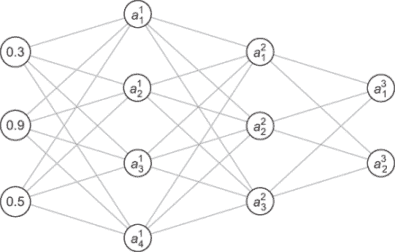

图 16.8 将输入层激活设置为输入向量的条目（左侧）

第一层中的每个激活值都是零层激活的函数。现在我们有了足够的信息来计算它们，所以这是步骤 2。

步骤 2：将下一层的每个激活计算为输入层所有激活的函数

这一步是计算的核心，在我概念性地走完所有步骤之后，我会回到这里。现在需要知道的重要一点是，下一层的每个激活通常是由前一层激活的**一个独特函数**给出的。比如说，我们要计算*a*[0]。这个激活是*a*[1]⁰、*a*[2]⁰和*a*[3]⁰的某个函数，我们可以暂时将其写作*a* 1¹ = *f*(*a*[1]⁰ , *a*[2]⁰ , *a*[3]⁰)。假设，例如，我们计算*f*(0.3, 0.9, 0.5)的结果是 0.6。那么在我们的计算中*a* 1¹的值就变成了 0.6（图 16.9）。

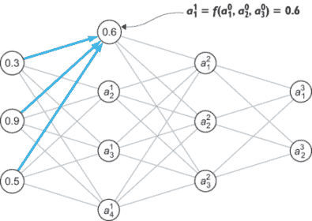

图 16.9 将第一层的激活计算为零层激活的某个函数

当我们计算第一层的下一个激活*a*[2]¹时，它也是输入激活*a*[1]⁰、*a*[2]⁰和*a*[3]⁰的函数，但在一般情况下，它是一个不同的函数，比如说*a*[2]¹ = *g*(*a*[1]⁰ , *a*[2]⁰ , *a*[3]⁰)。结果仍然依赖于相同的输入，但由于是一个不同的函数，我们可能会得到不同的结果。比如说，*g*(0.3, 0.9, 0.5) = 0.1，那么这就是*a*[2]¹的值（图 16.10）。

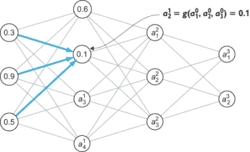

图 16.10 使用输入层激活的另一个函数计算第一层的另一个激活

我使用*f*和*g*作为简单的占位符函数名。关于输入层，*a*[3]¹和*a*[4]¹还有另外两个独特的函数。我不会继续命名这些函数，因为我们很快就会用完字母，但重要的是每个激活都有一个特殊的函数，该函数作用于前一层激活。一旦我们计算出第一层的所有激活，我们就已经填满了 12 个总激活中的 7 个。这里的数字仍然是虚构的，但结果可能看起来像图 16.11 中所示的那样。

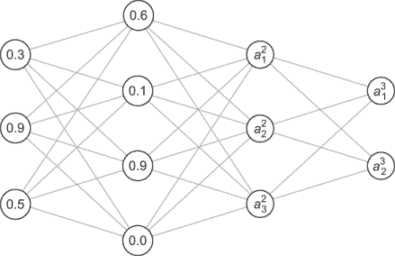

图 16.11 计算了我们的多层感知器（MLP）的两个激活层

从现在开始，我们重复这个过程，直到我们计算出网络中每个神经元的激活，这是步骤 3。

步骤 3：重复此过程，根据前一层的激活计算后续每一层的激活

我们首先计算*a*[1]²作为一层激活*a*[1]¹、*a*[2]¹、*a*[3]¹和*a*[4]¹的函数。然后我们继续计算*a*[2]²和*a*[3]²，它们由它们自己的函数给出。最后，我们计算*a*[1]³和*a*[2]³作为它们自己关于二层激活的函数。此时，网络中每个神经元的激活都已计算出来（图 16.12）。


图 16.12 一个所有激活都已计算的 MLP 示例

到目前为止，我们的计算已经完成。我们已经计算了中间层（称为*隐藏层*）和最终层（称为*输出层*）的激活。我们现在需要做的就是读取输出层的激活以获得我们的结果，这就是步骤 4。

步骤 4：返回一个向量，其条目是输出层的激活

在这种情况下，向量是(0.2, 0.9)，因此将我们的神经网络作为输入向量(0.3, 0.9, 0.5)的函数评估，产生输出向量(0.2, 0.9)。

就这些了！我没有涵盖的唯一内容是如何计算单个激活，这正是神经网络独特之处。除了输入层中的神经元外，每个神经元都有自己的函数，定义这些函数的参数是我们将调整以使神经网络做我们想要的事情的数字。

### 16.3.3 计算激活

好消息是，我们将使用一种熟悉的形式的函数来计算一层的激活作为前一层的函数：逻辑函数。棘手的部分是，我们的神经网络在输入层之外有 9 个神经元，因此有 9 个不同的函数需要跟踪。更重要的是，有几个常数需要确定每个逻辑函数的行为。大部分工作将是跟踪所有这些常数。

为了专注于一个具体的例子，我们注意到在我们的样本 MLP 中，我们的激活依赖于三个输入层激活：*a*[1]⁰、*a*[2]⁰和*a*[3]⁰。给出*a*[1]¹的函数是这些输入（包括一个常数）通过 sigmoid 函数传递的线性函数。这里有四个自由参数，我暂时命名为*a*、*B*、*C*和*D*（图 16.13）。

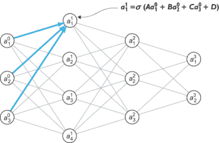


我们需要调整变量*a*、*B*、*C*和*D*，使*a*[1]¹能够适当地响应输入。在第十五章中，我们将逻辑函数视为接受几个数字并就它们做出是或否的决定，将答案报告为零到一的“是”的确定性。从这个意义上说，你可以将网络中间的神经元视为将整体分类问题分解成更小的是或否分类。

网络中的每个连接都有一个常数告诉我们输入神经元激活如何强烈地影响输出神经元激活。在这种情况下，常数 *a* 告诉我们 *a*[1]⁰ 如何强烈地影响 *a*[1]¹，而 *B* 和 *C* 分别告诉我们 *a*[2]⁰ 和 *a*[3]⁰ 如何强烈地影响 *a*[1]¹。这些常数被称为神经网络的 *权重*，网络中每条线段在整章中使用的通用图中都有一个权重。

常数 *D* 不影响连接，而是独立地增加或减少 *a*[1]¹ 的值，这个值不依赖于输入激活。这恰当地被命名为神经元的 *偏置*，因为它衡量了在没有任何输入的情况下做出决策的倾向。单词 *偏置* 有时带有负面含义，但它却是任何决策过程中的重要部分；它有助于避免异常决策，除非有强有力的证据。

尽管看起来可能很混乱，我们需要对这些权重和偏置进行索引，而不是像 *a*、*B*、*C* 和 *D* 这样命名。我们将权重写成 *w[ij]^l* 的形式，其中 *l* 是连接右侧的层，*i* 是层 *l* − 1 中前一个神经元的索引，*j* 是层 *l* 中目标神经元的索引。例如，影响第一层第一个神经元的权重 *a*，基于零层第一个神经元的值，表示为 *w*[11]¹。连接第三层第二个神经元到前一层的第一个神经元的权重是 *w*[21]³（图 16.14）。

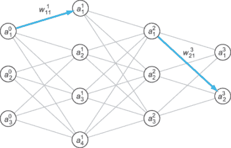

图 16.14 显示了与权重 *w*[11]¹ 和 *w*[32]¹ 对应的连接

偏置对应于神经元，而不是神经元对，因此每个神经元都有一个偏置：*b*[j]^l 表示第 *i* 层中第 *j* 个神经元的偏置。根据这些命名约定，我们可以写出 *a*[1]¹ 的公式如下

*a*[1]¹ = σ(*w*[11]¹ *a*[1]⁰ + *w*[12]² *a*[2]⁰ + *w*[13]³ *a*[3]⁰ + *b*[1]¹)

或者 *a*[3]² 的公式如下

*a*[3]² = σ(*w*[31]² *a*[1]¹ + *w*[32]² *a*[2]¹ + *w*[33]² *a*[3]¹ + *w*[34]² *a*[4]¹ + *b*[3]²)

如您所见，计算激活以评估多层感知器（MLP）并不困难，但变量的数量可能会使其变得繁琐且容易出错。幸运的是，我们可以使用第五章中介绍的矩阵符号来简化这个过程，使其更容易实现。

### 16.3.4 使用矩阵符号计算激活

尽管可能很复杂，让我们做一个具体的例子，并写出整个网络层的激活公式，然后我们将看到如何使用矩阵符号简化它并编写一个可重用的公式。让我们以第二层为例。三个激活的公式如下：

*a*[1]² = σ(*w*[11]² *a*[1]¹ + *w*[12]² *a*[2]¹ + *w*[13]² *a*[3]¹ + *w*[14]² *a*[4]¹ + *b*[1]²)

*a*[2]² = σ(*w*[21]² *a*[1]¹ + *w*[22]² *a*[2]¹ + *w*[23]² *a*[3]¹ + *w*[24]² *a*[4]¹ + *b*[2]²)

*a*[3]² = σ(*w*[31]² *a*[1]¹ + *w*[32]² *a*[2]¹ + *w*[33]² *a*[3]¹ + *w*[34]² *a*[4]¹ + *b*[3]²)

在 sigmoid 函数内部命名这些量是有用的。让我们用 *z*[1]²、*z*[2]² 和 *z*[3]² 来表示这三个量，因此根据定义

*a*[1]² = σ(*z*[1]²)

*a*[2]² = σ(*z*[2]²)

and

*a*[3]² = σ(*z*[3]²)

这些 *z* 值的公式更简洁，因为它们都是前一层激活的线性组合，加上一个常数。这意味着我们可以用矩阵向量表示法来写它们。从以下开始：

*z*[1]² = *w*[11]² *a*[1]¹ + *w*[12]² *a*[2]¹ + *w*[13]² *a*[3]¹ + *w*[14]² *a*[4]¹ + *b*[1]²

*z*[2]² = *w*[21]² *a*[1]¹ + *w*[22]² *a*[2]¹ + *w*[23]² *a*[3]¹ + *w*[24]² *a*[4]¹ + *b*[2]²

*z*[3]² = *w*[31]² *a*[1]¹ + *w*[32]² *a*[2]¹ + *w*[33]² *a*[3]¹ + *w*[34]² *a*[4]¹ + *b*[3]²

我们可以将这三个方程写成一个向量

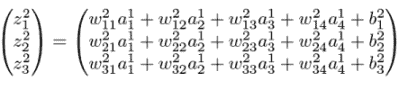

然后将偏差作为一个向量求和：

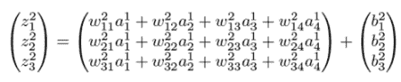

这只是一个三维向量加法。尽管中间的大向量看起来像是一个更大的矩阵，但它实际上只是一个三个求和的列。然而，这个大向量可以展开成如下矩阵乘法：

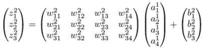

第二层的激活是通过将σ函数应用于结果向量的每个条目来获得的。这仅仅是一个符号简化，但从心理上讲，将数字 *w[ij]^l* 和 *b*[j]^l 提取到它们自己的矩阵中是有用的。这些数字定义了神经网络本身，而不是定义评估增量步骤的激活 *a* jl。

为了说明我的意思，你可以将评估神经网络与评估函数 *f*(*x*) = *ax* + *b* 进行比较。输入变量是 *x*，相比之下，*a* 和 *b* 是定义函数的常数；可能的线性函数空间由 *a* 和 *b* 的选择定义。即使我们将 *ax* 重命名为类似 *q* 的东西，它也仅仅是 *f*(*x*) 计算中的一个增量步骤。类比是，一旦你决定了你的多层感知器（MLP）每层的神经元数量，每层的权重矩阵和偏差向量实际上就是定义神经网络的参数。考虑到这一点，我们可以在 Python 中实现 MLP。

### 16.3.5 练习

| **练习 16.4**：激活 *a*[2]³ 代表哪个神经元和层？在以下图像中，这个激活的值是多少？（神经元和层的索引方式与前面的章节相同。）**解答**：上标表示层，下标表示层内的神经元。因此，激活 *a*[2]³ 对应于第 3 层的第二个神经元。在图像中，它的激活值为 0.9。 |
| --- |
| **练习 16.5**：如果一个神经网络的第 5 层有 10 个神经元，第 6 层有 12 个神经元，第 5 层和第 6 层之间共有多少个神经元连接？**解答**：第 5 层的每个神经元都与第 6 层的每个神经元相连。总共有 120 个连接。 |
| **练习 16.6**：假设我们有一个有 12 层的 MLP。连接第 4 层的第三个神经元到第 5 层的第七个神经元的权重*w[ij]^l*的索引*l*、*i*和*j*是什么？**解答**：记住*l*是连接的目标层，所以在这个例子中*l* = 5。索引*i*和*j*分别指代层*l*和*l* - 1 中的神经元，所以*i* = 7，*j* = 3。这个权重被标记为*w*[73]⁵。 |
| **练习 16.7**：在本节的整个网络中，权重*w*[31]³在哪里使用？**解答**：没有这样的权重。这将连接到第三层的第三个神经元，即输出层，但这个层只有两个神经元。 |
| **练习 16.8**：在本节的神经网络中，*a*[1]³的公式是什么，用第 2 层的激活值、权重和偏差表示？**解答**：前一层激活是*a*[1]²、*a*[2]²和*a*[2]³，连接到*a*[1]³的权重是*w*[11]³、*w*[12]³和*w*[1]³。激活*a*[1]³的偏差表示为*b*[1]³，所以公式如下！[](../Images/CH16_F14_Orland_UN02_EQ09.png) |
| **练习 16.9-迷你项目**：编写一个 Python 函数`sketch_mlp(*layer_sizes)`，它接受神经网络的层大小，并输出本节中使用的类似图表。显示所有神经元及其标签，并用直线绘制它们的连接。调用`sketch_mlp(3,4,3,2)`应该产生我们用来表示整个神经网络所用的示例图。**解答**：请参阅本书的源代码以获取实现方法。 |

## 16.4 在 Python 中构建神经网络

在本节中，我将向您展示如何将我在上一节中解释的评估 MLP 的步骤在 Python 中实现。具体来说，我们将实现一个名为`MLP`的 Python 类，该类存储权重和偏差（最初随机生成），并提供一个`evaluate`方法，该方法接受一个 64 维输入向量并返回一个 10 维输出向量。这段代码是将我在上一节中描述的 MLP 设计转换为 Python 的某种例行公事，但一旦我们完成实现，我们就可以在分类手写数字的任务上对其进行测试。

只要权重和偏差是随机选择的，它可能不会比我们最初构建的随机分类器表现得更好。但一旦我们有了预测为我们工作的神经网络结构，我们就可以调整权重和偏差，使其更具预测性。我们将在下一节中转向这个问题。

### 16.4.1 在 Python 中实现 MLP 类

如果我们想让我们的类表示一个 MLP，我们需要指定我们想要多少层以及每层想要多少个神经元。为了用我们想要的架构初始化我们的 MLP，我们的构造器可以接受一个数字列表，表示每层的神经元数量。

我们需要评估 MLP 的数据是输入层之后每一层的权重和偏差。正如我们刚刚讨论的，我们可以将权重存储为一个矩阵（一个 NumPy 数组）和偏差存储为一个向量（也是一个 NumPy 数组）。首先，我们可以为所有的权重和偏差使用随机值，然后在训练网络时，我们可以逐渐用更有意义的值替换这些值。

让我们快速回顾一下我们想要的权重矩阵和偏差向量的维度。如果我们选择一个有*m*个神经元的层，并且前一层有*n*个神经元，那么我们的权重描述了从*n*维激活向量到*m*维激活向量的转换的线性部分。这由一个*m*×*n*的矩阵描述，换句话说，一个有*m*行和*n*列的矩阵。为了看到这一点，我们可以回到 16.3 节中的例子，其中连接四个神经元层到三个神经元层的权重构成一个 4×3 的矩阵，如图 16.15 所示。

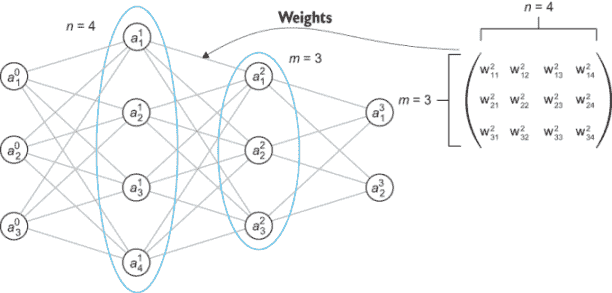

图 16.15 连接四个神经元层到三个神经元层的权重矩阵是一个 3×4 矩阵。

一个*m*个神经元的层的偏差简单地组成一个有*m*个条目的向量，每个条目对应一个神经元。现在我们已经提醒了自己如何找到每一层的权重矩阵和偏差向量的尺寸，我们就可以准备让我们的类构造器创建它们了。注意，我们遍历`layer_sizes[1:]`，这给出了 MLP 中层的尺寸，跳过了最先的输入层：

```
class MLP():
    def __init__(self,layer_sizes):                 ❶
        self.layer_sizes = layer_sizes
        self.weights = [
            np.random.rand(n,m)                     ❷
            for m,n in zip(layer_sizes[:−1],
                           layer_sizes[1:])         ❸
        ]
        self.biases = [np.random.rand(n) 
                       for n in layer_sizes[1:]]    ❹
```

❶ 使用一个包含每层神经元数量的层大小列表初始化 MLP

❷ 权重矩阵是 n×m 的矩阵，包含随机条目...

❸ ... 其中 m 和 n 是神经网络中相邻层的神经元数量。

❹ 每一层的偏差（跳过第一层）是一个包含每层中每个神经元的条目的向量。

实现了这一点之后，我们可以再次确认一个两层的 MLP 恰好有一个权重矩阵和一个偏差向量，并且它们的维度匹配。假设第一层有两个神经元，第二层有三个神经元。然后我们可以运行以下代码：

```
>>> nn = MLP([2,3])
>>> nn.weights
[array([[0.45390063, 0.02891635],
        [0.15418494, 0.70165829],
        [0.88135556, 0.50607624]])]
>>> nn.biases
[array([0.08668222, 0.35470513, 0.98076987])]
```

这确认了我们有一个 3×2 的权重矩阵和一个 3D 的偏差向量，两者都填充了随机条目。

输入层和输出层的神经元数量应该与我们要传递的向量的维度以及作为输出接收的向量的维度相匹配。我们图像分类的问题需要 64 维的输入向量和 10 维的输出向量。对于本章，我坚持使用 64 个神经元的输入层，10 个神经元的输出层，以及一个介于两者之间的 16 个神经元的单层。选择合适的层数和层大小以使神经网络在特定任务上表现良好，这需要一些艺术和科学相结合，这也是机器学习专家获得高薪的原因。为了本章的目的，我说这种结构足以让我们得到一个好的、可预测的模型。

我们可以将神经网络初始化为`MLP([64,16,10])`，它比我们之前画的所有网络都要大得多。图 16.16 显示了它的样子。

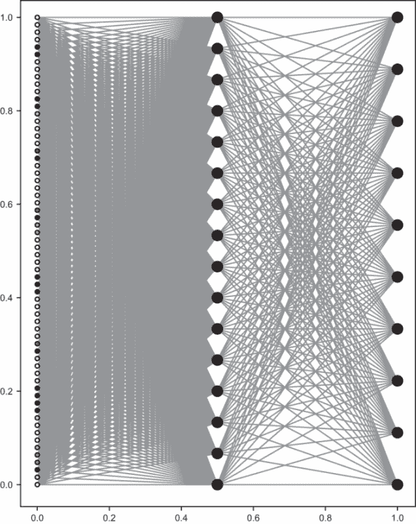

图 16.16 一个具有 64、16 和 10 个神经元的三个层的 MLP

幸运的是，一旦我们实现了评估方法，评估大型神经网络对我们来说并不比评估小型神经网络更难。这是因为 Python 为我们做了所有的工作！

### 16.4.2 评估 MLP

我们`MLP`类的评估方法应该接受一个 64 维向量作为输入，并返回一个 10 维向量作为输出。从输入到输出的过程是基于从输入层到输出层逐层计算激活。正如我们在讨论反向传播时将看到的，在过程中跟踪所有激活，即使是网络中间的隐藏层也很有用。因此，我将分两步构建`evaluate`函数：首先，我将构建一个方法来计算所有的激活，然后我将构建另一个方法来提取最后一层的激活值并生成结果。

我把第一种方法称为`feedforward`，这是按层计算激活过程的常用名称。输入层的激活给出后，为了到达下一层，我们需要将这些激活的向量与权重矩阵相乘，加上下一层的偏差，然后将结果的坐标通过 sigmoid 函数传递。我们重复这个过程，直到到达输出层。下面是这个过程的示意图：

```
class MLP():
    ...
    def feedforward(self,v):
        activations = []                            ❶
        a = v
        activations.append(a)                       ❷
        for w,b in zip(self.weights, self.biases):  ❸
            z = w @ a + b                           ❹
            a = [sigmoid(x) for x in z]             ❺
            activations.append(a)                   ❻
        return activations
```

❶ 使用空激活列表进行初始化

❷ 第一层的激活正好是输入向量的条目；我们将这些添加到激活列表中。

❸ 对每一层的单个权重矩阵和偏差向量进行迭代

❹ 向量 z 是权重矩阵与前一层的激活的矩阵乘积加上偏差向量。

❺ 对 z 的每个条目应用 sigmoid 函数以获得激活

❻ 将新计算的激活向量添加到激活列表中

最后一层的激活是我们想要的结果，因此神经网络的一个评估方法简单地运行输入向量的`feedforward`方法，然后像这样提取最后一个激活向量：

```
class MLP():
    ...
    def evaluate(self,v):
        return np.array(self.feedforward(*v*)[−1])
```

就是这样！你可以看到矩阵乘法为我们节省了很多原本需要编写的神经元激活循环。

### 16.4.3 测试 MLP 的分类性能

现在有了适当大小的 MLP，它现在可以接受一个代表数字图像的向量并输出结果：

```
>>> nn = MLP([64,16,10])
>>> xv  = np.matrix.flatten(digits.images[0]) / 15.
>>> nn.evaluate(*v*)
array([0.99990572, 0.9987683 , 0.99994929, 0.99978464, 0.99989691,
       0.99983505, 0.99991699, 0.99931011, 0.99988506, 0.99939445])
```

这意味着输入一个代表图像的 64 维向量，并返回一个 10 维向量作为输出，因此我们的神经网络正在作为一个正确形状的向量转换器运行。由于权重和偏差是随机的，这些数字不应该是对图像可能代表的数字的良好预测。（顺便说一句，这些数字都接近 1，因为我们的所有权重、偏差和输入数字都是正的，而 sigmoid 函数将大的正数发送到接近 1 的值。）即便如此，输出向量中有一个最大的条目，恰好是索引 2 处的数字。这（错误地）预测数据集中的图像 0 代表数字 2。

随机性表明我们的 MLP 只猜对了 10%的答案。我们可以通过`test_digit_classify`函数来证实这一点。对于我初始化的随机 MLP，它给出了正好 10%：

```
>>> test_digit_classify(nn.evaluate)
0.1
```

这可能看起来没有多少进步，但我们可以为自己感到高兴，因为我们的分类器已经工作，即使它在这个任务上并不擅长。评估神经网络比评估像 *f*(*x*) = *ax* + *b* 这样的简单函数要复杂得多，但当我们训练神经网络以更准确地分类图像时，我们很快就会看到回报。

### 16.4.4 练习

| **练习 16.10-迷你项目**：使用显式遍历层和权重而不是使用 NumPy 矩阵乘法重写`feedforward`方法。确认你的结果与之前的实现完全一致。 |
| --- |

## 16.5 使用梯度下降训练神经网络

训练一个神经网络可能听起来像是一个抽象的概念，但这只是意味着找到最佳权重和偏差，使神经网络尽可能好地完成手头的任务。我们在这里不能涵盖整个算法，但我将向你展示它是如何从概念上工作的，以及如何使用第三方库来自动完成它。在本节结束时，我们将调整我们神经网络的权重和偏差，以高度准确度预测图像代表的数字。然后我们可以再次运行`test_digit_classify`并衡量其表现。

### 16.5.1 将训练视为最小化问题

在前几章中，对于线性函数 *ax* + *b* 或对数函数 σ(*ax* + *by* + *c*)，我们创建了一个成本函数来衡量线性或对数函数的失败，这取决于公式中的常数，以精确匹配数据。线性函数的常数是斜率和 *y* -截距 *a* 和 *b*，因此成本函数的形式是 *C*(*a*, *b*)。对数函数有常数 *a*，*b* 和 *c*（待确定），因此其成本函数的形式是 *C*(*a*, *b*, *c*)。内部，这两个成本函数都依赖于 *所有* 训练示例。为了找到最佳参数，我们将使用梯度下降来最小化成本函数。

对于多层感知器（MLP）来说，一个很大的不同之处在于它的行为可以依赖于数百或数千个常数：它所有层 *l* 和有效神经元索引 *i* 和 *j* 的权重 *w[ij]* 和偏差 *b*[j]^l。我们的具有 64、16 和 10 个神经元及其三层神经网络有第一层和第二层之间 1,024 个权重，第二层和第三层之间 160 个权重。它在隐藏层有 16 个偏差，在输出层有 10 个偏差。总的来说，我们需要调整 1,210 个常数。你可以想象我们的成本函数是这些 1,210 个值的函数，我们需要最小化它。如果我们把它写出来，它看起来可能像这样：

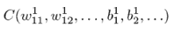

在这个方程中，我写省略号的地方，还有超过一千个未写出的权重和 24 个未写出的偏差。简要思考一下如何创建成本函数是值得的，并且作为一个迷你项目，你可以尝试自己实现它。

我们的神经网络输出向量，但我们认为分类问题的答案是图像所代表的数字。为了解决这个问题，我们可以将正确答案视为一个完美的分类器作为输出的 10 维向量。例如，如果一个图像清楚地表示数字 5，我们希望看到 100%的确定性，即图像是 5，而 0%的确定性表示图像是任何其他数字。这意味着第五个索引处有一个 1，其他地方都是 0（图 16.17）。

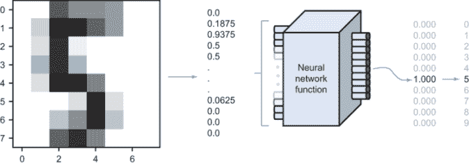

图 16.17 神经网络的理想输出：正确索引处为 1.0，其他地方为 0.0

正如我们之前的回归尝试从未完全拟合数据一样，我们的神经网络也不会。为了衡量我们的 10 维输出向量到理想输出向量的误差，我们可以使用它们在 10 维空间中的距离平方。

假设理想输出是写为 *y* = (*y*[1] , *y*[1] , *y*[2] , ..., *y*[10] )。请注意，我遵循的是从 1 开始的数学索引惯例，而不是 Python 从 0 开始的索引惯例。这实际上是我用于层内神经元的相同惯例，因此输出层（第二层）的激活是按 (*a*[1]² , *a*[2]² , *a*[3]² ,..., *a*[10]¹) 索引的。这些向量之间的平方距离是它们的和：

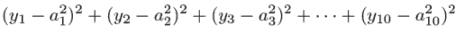

作为另一个可能令人困惑的点，*a* 值上方的上标 2 表示我们的网络中的输出层是第二层，而括号外的 2 表示对数量进行平方。为了得到相对于数据集的总成本，你可以评估所有样本图像的神经网络并取平均平方距离。在本节的末尾，你可以尝试迷你项目，在 Python 中自己实现这一功能。

### 16.5.2 使用反向传播计算梯度

使用在 Python 中编写的成本函数 *C*(*w*[11]¹ ,*w*[12]¹ , ..., *b*[1]¹ , *b*[2]¹ , ...)，我们可以编写一个 1,210 维的梯度下降版本。这意味着在每一步都要计算 1,210 个偏导数以获得一个梯度。这个梯度将是该点的 1,210 维偏导数向量，具有以下形式

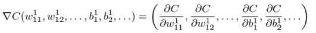

估计如此多的偏导数在计算上会很昂贵，因为每个都需要评估 *C* 两次以测试调整其输入变量的效果。反过来，评估 *C* 需要查看训练集中的每一张图片并通过网络传递。这可能是有可能的，但对于我们这样的大多数现实世界问题，计算时间会过长。

相反，计算偏导数最好的方法是使用与我们在第十章中介绍的方法类似的方法找到它们的精确公式。我不会完全介绍如何做这件事，但我会给你一个预告，在最后一节。关键是虽然需要计算 1,210 个偏导数，但它们都具有以下形式：

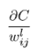

或者

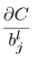

对于某些选择的索引 *l*，*i* 和 *j*。反向传播算法递归地计算所有这些偏导数，从输出层的权重和偏差反向工作到第一层。

如果你想了解更多关于反向传播的信息，请关注本章的最后部分。现在，我将转向 scikit-learn 库来计算成本、执行反向传播并自动完成梯度下降。

### 16.5.3 使用 scikit-learn 进行自动训练

使用 scikit-learn 训练 MLP 不需要任何新概念；我们只需要告诉它以与我们相同的方式设置问题，然后找到答案。我不会解释 scikit-learn 库能做什么，但我将逐步引导你通过代码来训练用于数字分类的 MLP。

第一步是将所有我们的训练数据（在这种情况下，数字图像作为 64 维向量）放入一个单一的 NumPy 数组中。使用数据集中的前 1,000 个图像给我们一个 1,000-by-64 的矩阵。我们还将前 1,000 个答案放入一个输出列表中：

```
*x* = np.array([np.matrix.flatten(img) for img in digits.images[:1000]]) / 15.0
y = digits.target[:1000]
```

接下来，我们使用 scikit-learn 提供的 `MLP` 类来初始化一个 MLP。输入和输出层的尺寸由数据决定，所以我们只需要指定中间隐藏层的尺寸。此外，我们还包括参数来告诉 MLP 我们希望如何训练它。以下是代码：

```
from sklearn.neural_network import MLPClassifier

mlp = MLPClassifier(hidden_layer_sizes=(16,),  ❶
                    activation='logistic',     ❷
                    max_iter=100,              ❸
                    verbose=10,                ❹
                    random_state=1,            ❺
                    learning_rate_init=.1)     ❻
```

❶ 指定我们想要一个包含 16 个神经元的隐藏层

❷ 指定我们希望在网络上使用逻辑（普通 sigmoid）激活函数

❸ 设置梯度下降步骤的最大数量，以防出现收敛问题

❹ 选择训练过程提供详细日志

❺ 使用随机权重和偏差初始化 MLP

❻ 决定学习率或每次梯度下降迭代中移动梯度的倍数

一旦完成这项工作，我们就可以在一行中将神经网络训练到输入数据 *x* 和相应的输出数据 *y*：

```
mlp.fit(x,y)
```

当你运行这一行代码时，你会在终端窗口中看到许多文本打印出来，作为神经网络训练的日志。这些日志显示了它需要多少次梯度下降迭代以及成本函数的值，scikit-learn 将其称为“损失”而不是“成本。”

```
Iteration 1, loss = 2.21958598
Iteration 2, loss = 1.56912978
Iteration 3, loss = 0.98970277
...
Iteration 58, loss = 0.00336792
Iteration 59, loss = 0.00330330
Iteration 60, loss = 0.00321734
Training loss did not improve more than tol=0.000100 for two consecutive epochs. Stopping.
```

在这一点上，经过 60 次梯度下降迭代后，找到了最小值，MLP 已经被训练。你可以使用 `_predict` 方法在图像向量上测试它。此方法接受一个输入数组，意味着一个 64 维向量的数组，并返回所有这些向量的输出向量。例如，`mlp._predict(*x*)` 给出存储在 *x* 中的所有 1,000 个图像向量的 10 维输出向量。对于零^(th) 个训练示例的结果是结果中的零^(th) 个条目：

```
>>> mlp._predict(*x*)[0]
array([9.99766643e-01, 8.43331208e−11, 3.47867059e-06, 1.49956270e-07,
       1.88677660e-06, 3.44652605e-05, 6.23829017e-06, 1.09043503e-04,
       1.11195821e-07, 7.79837557e-05])
```

这些数字在科学记数法中需要仔细观察，但第一个是 0.9998，而其他所有数字都小于 0.001。这正确地预测了零^(th) 个训练示例是一张数字 0 的图片。到目前为止一切顺利！

通过一个小包装器，我们可以编写一个函数，使用这个 MLP 进行 *一次* 预测，接受一个 64 维图像向量并输出一个 10 维结果。因为 scikit-learn 的 MLP 在输入向量的集合上工作并产生结果数组，我们只需要在传递给 `mlp._predict` 之前将我们的输入向量放入一个列表中：

```
def sklearn_trained_classify(*v*):
    return mlp._predict([v])[0]
```

在这一点上，向量具有正确的形状，可以通过我们的 `test_digit_classify` 函数测试其性能。让我们看看它正确识别测试数字图像的百分比：

```
>>> test_digit_classify(sklearn_trained_classify)
1.0
```

这是一个惊人的 100%准确率！你可能对这个结果持怀疑态度；毕竟，我们是在使用神经网络训练所用的相同数据集进行测试。从理论上讲，当存储 1,210 个数字时，神经网络可能只是记住了训练集中的每一个例子。如果你测试神经网络之前未见过的新图像，你会发现情况并非如此；它仍然能够出色地将图像正确分类为数字。我发现它在数据集中接下来的 500 个图像上的准确率为 96.2%，你可以在练习中自己测试这一点。

### 16.5.4 练习

| **练习 16.11**：修改`test_digit_classify`函数，使其能够在测试集的定制范围内工作。它在 1,000 个训练例子之后的下一个 500 个例子上的表现如何？ |
| --- |

| **解答**：在这里，我添加了一个`start`关键字参数来指示从哪个测试例子开始。`test_count`关键字参数仍然表示要测试的例子数量：

```
def test_digit_classify(classifier,start=0,test_count=1000):
    correct = 0
    end = start + test_count                           ❶
    for img, target in zip(digits.images[start:end], 
digits.target[start:end]):                             ❷
        v  = np.matrix.flatten(img) / 15
        output = classifier(*v*)
        answer = list(output).index(max(output))
        if answer == target:
            correct += 1
    return (correct/test_count)
```

❶ 计算我们想要考虑的测试数据的结束索引❷ 只在起始和结束索引之间的测试数据上循环 My trained MLP 正确识别了 96.2%的这些新数字图像：

```
>>> test_digit_classify(sklearn_trained_classify,start=1000,test_count=500)
0.962
```

|

| **练习 16.12**：使用平方距离成本函数，你的随机生成的 MLP 在第一个 1,000 个训练例子上的成本是多少？scikit-learn 的 MLP 的成本是多少？**解答**：首先，我们可以编写一个函数来给出给定数字的理想输出向量。例如，对于数字 5，我们希望输出向量*y*，除了第五个索引处有一个 1 之外，其余都是 0。

```
def y_vec(digit):
    return np.array([1 if i == digit else 0 for i in range(0,10)])
```

一个测试例子的成本是分类器输出与理想结果之间的平方距离之和。这就是坐标差的平方和的总和：

```
def cost_one(classifier,x,i):
    return sum([(classifier(*x*)[j] − y_vec(i)[j])**2 for j in range(10)])
```

一个分类器的总成本是所有 1,000 个训练例子上的平均成本：

```
def total_cost(classifier):
    return sum([cost_one(classifier,x[j],y[j]) for j in range(1000)])/1000.
```

如预期的那样，一个随机初始化的 MLP，其预测准确率为 10%，比由 scikit-learn 生成的 100%准确率的 MLP 具有更高的成本：

```
>>> total_cost(nn.evaluate)
8.995371023185067
>>> total_cost(sklearn_trained_classify)
5.670512721637246e-05
```

|

| **练习 16.13-迷你项目**：使用`MLPClassifier`的属性`coefs_`和`intercepts_`分别提取`MLPClassifier`的权重和偏置。将这些权重和偏置插入到本章前面从头构建的`MLP`类中，并展示你的 MLP 在数字分类上的表现良好。**解答**：如果你尝试这样做，你会注意到一个问题；我们期望权重矩阵是 16-by-64 和 10-by-16，而`MLPClassifier`的`coefs_`属性给出的是一个 64-by-16 的矩阵和一个 16-by-10 的矩阵。看起来 scikit-learn 使用了一个与我们不同的惯例来存储权重矩阵的列。有一个快速的方法可以解决这个问题。NumPy 数组有一个`T`属性，返回矩阵的**转置**（通过旋转矩阵使得行成为结果的列）。有了这个技巧，我们可以将权重和偏置插入到我们的神经网络中，并对其进行测试：

```
>>> nn = MLP([64,16,10])
>>> nn.weights = [w.T for w in mlp.coefs_]       ❶
>>> nn.biases = mlp.intercepts_                  ❷
>>> test_digit_classify(nn.evaluate,
                        start=1000,
                        test_count=500) 0.962    ❸
```

❶ 将我们的权重矩阵设置为 scikit-learn MLP 中的矩阵，在转置后与我们的约定一致❷ 将我们的网络偏差设置为 scikit-learn MLP 中的偏差❸ 使用新的权重和偏差测试我们的神经网络在分类任务中的性能 This is 96.2% accurate on the 500 images after the training data set, just like the MLP produced by scikit-learn directly. |

## 16.6 使用反向传播计算梯度

这一节完全是可选的。坦白说，因为你已经知道如何使用 scikit-learn 训练 MLP，你现在可以解决实际问题了。你可以在分类问题上测试不同形状和大小的神经网络，并尝试它们的结构设计以提高分类性能。因为这是本书的最后一节，我想给你一些最后的、具有挑战性（但可行！）的数学问题来思考−手动计算成本函数的偏导数。

计算多层感知器（MLP）的偏导数的过程称为 *反向传播*，因为它从最后一层的权重和偏差开始，逆向工作非常高效。反向传播可以分为四个步骤：计算与最后一层权重、最后一层偏差、隐藏层权重和隐藏层偏差的偏导数。我将向您展示如何获取与最后一层权重相关的偏导数，您可以用这种方法尝试完成剩余部分。

### 16.6.1 以最后一层权重表示的成本

让我们称 MLP 的最后一层的索引为 *L*。这意味着最后一层的权重矩阵由权重 *w[ij]^L* 组成，其中 *l* = *L*，换句话说，权重 *w[ij]^L*。这一层的偏差是 *b* jL，激活值标记为 *a[j]^L*。

获取最后一层中第 *j* 个神经元的激活值 *a[j]^L* 的公式是层 *L* 中每个神经元贡献的总和，这些贡献由索引 *i* 表示。用虚构的符号表示，它变为

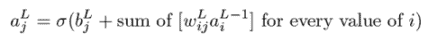

求和是对层 *L* 中从 1 到神经元数量的所有 *i* 值进行的。让我们将层 *l* 中的神经元数量写成 *ni*，其中 *i* 从 *l* 到 *n[L]*[−1] 在我们的求和中。在适当的数学求和符号中，这个求和写成：

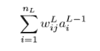

这个公式的英文翻译是“通过将 *L* 和 *j* 的值固定，将表达式 *w[ij]^L* *a*[i]^(*L*−1) 的值从 1 到 *n[L]* 的每个 *i* 相加。”这不过是将矩阵乘法写成求和的形式。在这种形式下，激活如下：

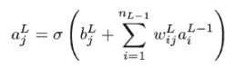

给定一个实际的训练示例，我们可以有一个理想的输出向量 **y**，其中正确的槽位为 1，其他地方为 0。成本是激活向量 *a[j]^L* 和理想输出值 *y[j]* 之间的平方距离。即，

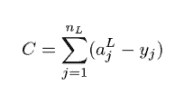

权重 *w[ij]^L* 对 *C* 的影响是间接的。首先，它被前一层的一个激活值乘以，加上偏差，通过 sigmoid 函数，然后通过二次成本函数。幸运的是，我们在第十章中已经介绍了如何求函数复合的导数。这个例子稍微复杂一些，但你应该能够认出它为之前看到的相同的链式法则。

### 16.6.2 使用链式法则计算最后一层权重的偏导数

让我们将它分解为三个步骤，从 *w[ij]^L* 到 *C*。首先，我们可以计算传递给 sigmoid 函数的值，我们之前在章节中称之为 *z[j]^L*：

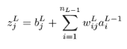

然后，我们可以将 *z[j]^L* 传递给 sigmoid 函数以获得激活 *a[j]^L*：

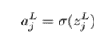

最后，我们可以计算成本：

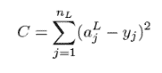

要找到 *C* 对 *w[ij]^L* 的偏导数，我们需要将这些三个“复合”表达式的导数相乘。*z[j]^L* 对一个特定的 *w[ij]^L* 的导数是它乘以的特定激活 *a[j]^L* [−1]。这与 *y*(*x*) = *ax* 对 *x* 的导数相似，其导数是常数 *a*。偏导数是

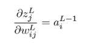

下一步是应用 sigmoid 函数，所以 *a[j]^L* 对 *z[j]^L* 的导数是σ的导数。实际上，你可以作为一个练习来验证这一点，σ(*x*)的导数是σ(*x*)(1 − σ(*x*))。这个漂亮的公式部分来自于 *ex* 是它自己的导数这一事实。这给了我们

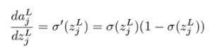

这是一个普通导数，而不是偏导数，因为 *a[j]^L* 只是一个输入的函数：*z[j]^L*。最后，我们需要求 *C* 对 *a[j]^L* 的导数。求和中的只有一个项依赖于 *w[ij]^L*，所以我们只需要求 (*a[j]^L* − *y[j]*)² 对 *a[j]^L* 的导数。在这个上下文中，*y[j]* 是一个常数，所以导数是 2*a[j]^L*。这来自于幂规则，告诉我们如果 *f*(*x*) = *x*²，那么 *f*'(*x*) = 2*x*。对于我们的最后一个导数，我们需要

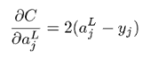

链式法则的多变量版本如下所示：

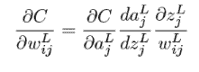

这看起来与我们在第十章中看到的版本有点不同，当时只涉及一个变量的两个函数的复合。但原理在这里是相同的：将 *C* 用 *a[j]^L* 表示，将 *a[j]^L* 用 *z[j]^L* 表示，将 *z[j]^L* 用 *w[ij]^L* 表示，我们就有 *C* 用 *w[ij]^L* 表示。链式法则告诉我们，要得到整个链的导数，我们需要将每一步的导数相乘。将导数代入，结果是


这个公式是我们需要找到整个梯度*C*的四个公式之一。具体来说，这给出了最后一层中任何权重的偏导数。这里有 16 × 10 个这样的，所以我们已经覆盖了 1,210 个总偏导数中的 160 个。

我会在这里停止，因为其他权重的导数需要更复杂的链式法则的应用。激活影响神经网络中的每个后续激活，所以每个权重影响每个后续激活。这并不超出你的能力范围，但我感觉在深入挖掘之前，我需要给你一个更好的多元链式法则的解释。如果你有兴趣深入了解，网上有很好的资源，详细介绍了反向传播的所有步骤。否则，你可以期待这本书的（ fingers crossed）续集。感谢阅读！

### 16.6.3 练习

| **练习 16.14-迷你项目**：使用 SymPy 或第十章中的代码来自动找到 sigmoid 函数的导数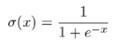证明你得到的答案是σ(*x*)(1 − σ(*x*))。**解答**：在 SymPy 中，我们可以快速得到导数的公式：

```
>>> from sympy import *
>>> X = symbols('x')
>>> diff(1 / (1+exp(-X)),X)
exp(-x)/(1 + exp(-x))**2
```

用数学符号表示，那就是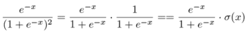证明这个表达式等于σ(*x*)(1 − σ(*x*))需要一点死记硬背的代数，但这是值得的，以使你自己相信这个公式是有效的。将分子和分母都乘以*e^x*，并注意到*e^x* · *e*^(−*x*) = 1，我们得到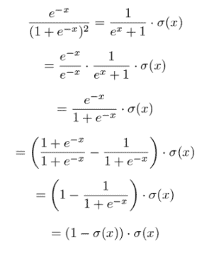 |

## 摘要

+   人工神经网络是一种数学函数，其计算过程与人类大脑中信号流动的流程相似。作为一个函数，它接受一个向量作为输入，并返回另一个向量作为输出。

+   神经网络可以用来对向量数据进行分类：例如，将图像转换为灰度像素值的向量。神经网络的输出是一个表示输入向量应该被分类到任何可能的类别中的置信度的数字向量。

+   多层感知器（MLP）是一种特殊的人工神经网络，由几个有序的神经元层组成，其中每一层的神经元都与前一层的神经元相连并受到其影响。在评估神经网络时，每个神经元都会得到一个表示其激活的数字。你可以将激活看作是在解决分类问题过程中，对中间是或否答案的肯定。

+   为了评估一个神经网络，神经元第一层的激活被设置为输入向量的条目。每个后续层的激活都是作为前一层的一个函数来计算的。最后一层的激活被当作一个向量并作为计算的结果向量返回。

+   神经元的激活基于前一层中所有神经元的激活的线性组合。线性组合中的系数被称为*权重*。每个神经元还有一个*偏差*，这是一个加到线性组合中的数字。这个值通过 sigmoid 函数传递以获得激活函数。

+   训练神经网络意味着调整所有权重和偏差的值，以便它能够最优地执行其任务。为此，你可以使用成本函数来衡量神经网络预测的错误相对于训练数据集中实际答案的错误。在固定的训练数据集下，成本函数只依赖于权重和偏差。

+   梯度下降法使我们能够找到权重和偏差的值，以最小化成本函数并得到最佳的神经网络。

+   神经网络可以高效地训练，因为成本函数关于权重和偏差的偏导数有简单的、精确的公式。这些公式是通过一种称为*反向传播*的算法找到的，该算法反过来又利用了微积分中的链式法则。

+   Python 的 scikit-learn 库有一个内置的`MLPClassifer`类，它可以自动对分类向量数据进行训练。
