# 附录 A：配置 Python 环境

本附录涵盖了安装 Python 和相关工具的基本步骤，以便你可以运行本书中的代码示例。主要要安装的是 Anaconda，这是一个流行的 Python 发行版，适用于数学编程和数据科学。具体来说，Anaconda 包含一个运行 Python 代码的解释器，以及一些最受欢迎的数学和数据科学库，还有一个名为 Jupyter 的编码接口。在任何 Linux、Mac 或 Windows 机器上，步骤大致相同。我将向你展示在 Mac 上的步骤。

## A.1 检查现有 Python 安装

有可能你的电脑上已经安装了 Python，即使你没有意识到。要检查现有安装，打开一个终端窗口（或在 Windows 上打开 CMD 或 PowerShell）并输入`python`。在出厂的 Mac 上，你应该会看到一个 Python 2.7 终端出现。你可以按 Ctrl-D 退出终端。

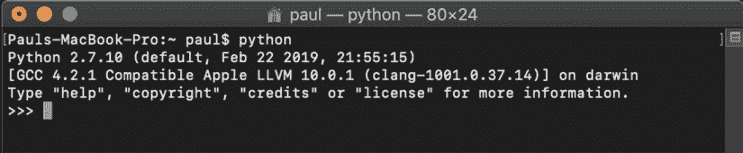

本书中的示例使用 Python 3，它正在成为新的标准，并且特别使用 Anaconda 发行版。作为警告，如果你有一个现有的 Python 安装，以下步骤可能会有些棘手。如果你遇到以下任何指令不起作用，我最好的建议是使用你看到的任何错误信息在 Google 或 StackOverflow 上搜索。

如果你是一位 Python 专家，并且不想安装或使用 Anaconda，你应该能够使用 pip 包管理器找到并安装相关的库，如 NumPy、Matplotlib 和 Jupyter。对于初学者，我强烈建议按照以下步骤安装 Anaconda。

## A.2 下载和安装 Anaconda

访问[`www.anaconda.com/distribution/`](https://www.anaconda.com/distribution/)下载 Anaconda Python 发行版。点击下载并选择以 3 开头的 Python 版本（图 A.1）。在撰写本文时，这是 Python 3.7。

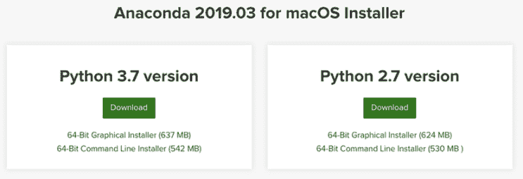

图 A.1 在撰写本文时，点击 Anaconda 网站上的下载后我会看到什么。要安装 Python，请选择 Python 3.x 下载链接。

打开安装程序。它会引导你完成安装过程。安装程序对话框的外观取决于你的操作系统，但图 A.2 显示了在我的 Mac 上的样子。

图 A.2 在我的 Mac 上出现的 Anaconda 安装程序

我使用了默认的安装位置，并且没有添加任何可选功能，如 PyCharm IDE。一旦安装完成，你应该能够打开一个新的终端。输入`python`以进入带有 Anaconda 的 Python 3 会话（图 A.3）。

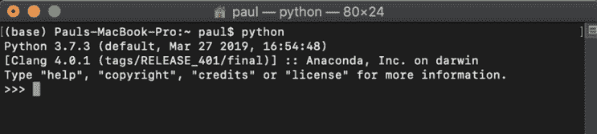

图 A.3 安装 Anaconda 后 Python 交互会话应该看起来像什么。注意出现的 Python 3.7.3 和 Anaconda, Inc.标签。

如果你没有看到以数字 3 和单词*Anaconda*开头的 Python 版本，这可能意味着你卡在了系统上之前的 Python 安装上。你需要编辑你的 PATH 环境变量，以便在终端中输入`python`时，终端知道你想要哪个 Python 版本。希望你不会遇到这个问题，但如果遇到，你可以在网上搜索解决方案。你也可以输入`python3`而不是`python`来显式使用你的 Python 3 安装。

## A.3 使用 Python 的交互模式

在终端窗口中，三个尖括号(`>>>`)提示你输入一行 Python 代码。当你输入`2+2`并按 Enter 键时，你应该看到 Python 解释器对这个语句的评估，结果是`4`（图 A.4）。

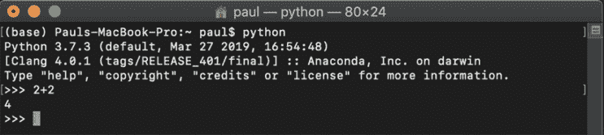

图 A.4 在交互会话中输入一行 Python 代码

交互模式也被称为 REPL（read-evaluate-print loop，即读取-评估-打印循环）。Python 会话读取一行输入的代码，评估它，并打印结果，这个过程可以循环多次。按下 Ctrl-D 表示你已完成代码输入，并返回到你的终端会话。

Python 交互通常可以识别你是否输入了多行语句。例如，`def f(x):`是在定义名为`f`的新 Python 函数时输入的第一行。Python 交互会话显示`...`以表示它期望更多的输入（图 A.5）。

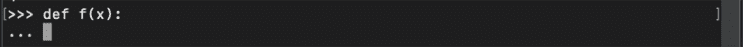

图 A.5 Python 解释器知道你还没有完成你的多行语句。

你可以通过缩进来增强函数，然后你需要按两次 Enter 键来让 Python 知道你已经完成了多行代码输入并实现函数（图 A.6）。

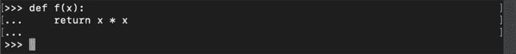

图 A.6 完成你的多行代码后，你需要按两次 Enter 键来提交它。

函数`f`现在已经在你的交互会话中定义了。在下一行，你可以给 Python 输入以进行评估（图 A.7）。

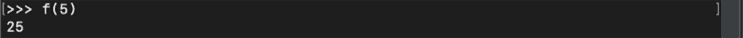

图 A.7 评估之前定义的函数

注意，你在交互会话中编写的任何代码在退出会话时都会消失。因此，如果你要编写大量代码，最好将其放入脚本文件或 Jupyter 笔记本中。我将在下一节中介绍这两种方法。

### A.3.1 创建和运行 Python 脚本文件

你可以使用你喜欢的任何文本编辑器创建 Python 文件。通常，使用专为编程设计的文本编辑器比使用像 Microsoft Word 这样的富文本编辑器更好，因为后者可能会插入不可见或不需要的字符进行格式化。我的首选是 Visual Studio Code，其他流行的选择包括跨平台的 Atom 和 Windows 的 Notepad++。在自行承担风险的情况下，你可以使用基于终端的文本编辑器，如 Emacs 或 Vim。所有这些工具都是免费的，并且可以轻松下载。

要创建一个 Python 脚本，只需在你的编辑器中创建一个以 .py 为文件扩展名的新的文本文件。图 A.8 显示我已经创建了一个名为 first.py 的文件，它位于我的 ~/Documents 目录中。你还可以在图 A.8 中看到，我的文本编辑器 Visual Studio Code 自带 Python 的语法高亮功能。关键字、函数和字面量值被着色，以便于阅读代码。许多编辑器（包括 Visual Studio Code）都有可安装的扩展，这些扩展可以为你提供更多有用的工具，例如在输入时检查简单错误等。

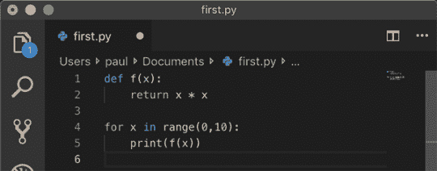

图 A.8 文件中的某些示例 Python 代码。此代码打印出从 0 到 9 所有数字的平方。

图 A.8 展示了输入到 first.py 文件中的几行 Python 代码。因为这是一本数学书，我们可以使用一个比“Hello World”更“数学化”的例子。当我们运行代码时，它会打印出从 0 到 9 所有数字的平方。

在终端中，转到你的 Python 文件所在的目录。在我的 Mac 上，我通过输入 `cd ~/Documents` 来转到 ~/Documents 目录。你可以输入 `ls first.py` 以确认你与你的 Python 脚本在同一目录中（图 A.9）。

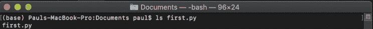

图 A.9 `ls` 命令显示文件 first.py 在目录中。

要执行脚本文件，请在终端窗口中输入 `python first.py`。这会调用 Python 解释器，并告诉它运行 first.py 文件。解释器做了我们希望的事情，并打印了一些数字（图 A.10）。

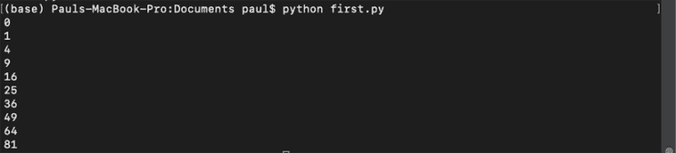

图 A.10 从命令行运行简单 Python 脚本的输出结果

当你解决更复杂的问题时，你可能想要将你的代码拆分成单独的文件。接下来，我将向你展示如何将函数 `f(x)` 放入一个不同的 Python 文件中，该文件可以被 first.py 使用。让我们称这个新文件为 function.py，并将其保存在与 first.py 相同的目录中，然后将 `f(x)` 的代码剪切并粘贴到其中（图 A.11）。

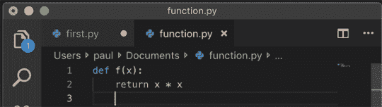

图 A.11 将定义函数 `f(x)` 的代码放入其自己的 Python 文件中

要让 Python 知道你打算将此目录中的多个文件组合在一起，你需要在目录中添加一个名为 __init__.py 的空文本文件。（在单词 *init* 前后各有两个下划线。）

小贴士：在 Mac 或 Linux 机器上创建此空文件的一个快速方法是输入 `touch __init__.py`。

要在脚本 first.py 中使用 function.py 中的函数 `f(x)`，我们需要让 Python 解释器知道去检索它。为此，我们在 first.py 的第一行写入 `from function import f`（图 A.12）。

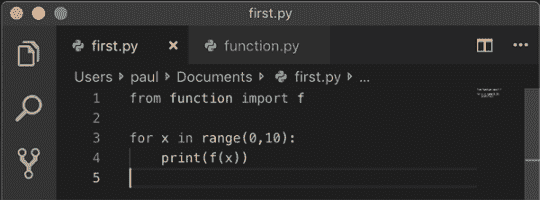

图 A.12 将文件 first.py 重写以包含函数 `f(x)`

当你再次运行命令 `python first.py` 时，你应该得到与上次运行相同的结果。这次，Python 正在从 function.py 文件中获取函数 *f*。

除了在文本文件中完成所有工作并通过命令行运行它们之外，还可以使用 Jupyter 笔记本，我将在下一节中介绍。对于这本书，我大部分的例子都是在 Jupyter 笔记本中完成的，但我将任何可重用的代码写在单独的 Python 文件中，并导入这些文件。

### A.3.2 使用 Jupyter 笔记本

Jupyter 笔记本是一个用于在 Python（以及其他语言）中进行编码的图形界面。与 Python 交互会话一样，你在 Jupyter 笔记本中输入代码行，它会打印结果。区别在于，Jupyter 的界面比你的终端更美观，你可以保存你的会话以供稍后恢复或重新运行。

Jupyter Notebook 应该会自动与 Anaconda 一起安装。如果你使用的是不同的 Python 发行版，你也可以使用 pip 安装 Jupyter。有关自定义安装的文档，请参阅 [`jupyter.org/install`](https://jupyter.org/install)。

要打开 Jupyter 笔记本界面，在你想工作的目录中输入 `jupyter notebook` 或 `python -m notebook`。你应该会在终端中看到大量的文本流过，并且你的默认网页浏览器应该会打开，显示 Jupyter 笔记本界面。

图 A.13 展示了我在终端中输入 `python -m notebook` 后看到的内容。再次强调，具体效果可能因你拥有的 Anaconda 版本而异。

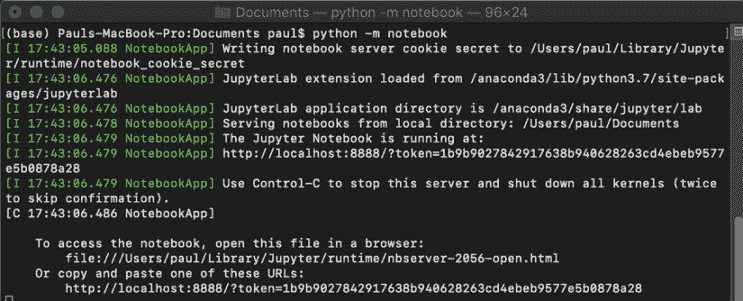

图 A.13 打开 Jupyter 笔记本时终端的外观

你的默认网页浏览器应该会打开，显示 Jupyter 界面。图 A.14 展示了我在 Google Chrome 浏览器中打开 Jupyter 时的界面。

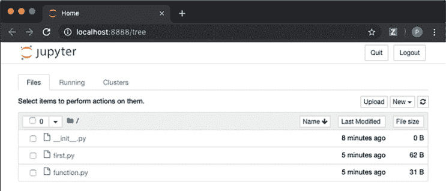

图 A.14 当你启动 Jupyter 时，浏览器标签页会自动打开，看起来像这样。

这里发生的情况是，终端在后台运行 Python 并在地址 localhost:8888 上提供本地网站。从现在开始，你只需要考虑浏览器中发生的事情。浏览器会自动通过网页请求将你编写的代码发送到终端中的 Python 进程。在 Jupyter 术语中，这个 Python 后台进程被称为 *内核*。

在浏览器打开的第一个屏幕上，你可以看到你正在工作的目录中的所有文件。例如，我打开了位于 ~/Documents 文件夹中的笔记本，因此我可以看到我们在上一节中编写的 Python 文件。如果你点击其中一个文件，你会看到你可以在网页浏览器中直接查看和编辑它。图 A.15 展示了当我点击 first.py 时看到的界面。

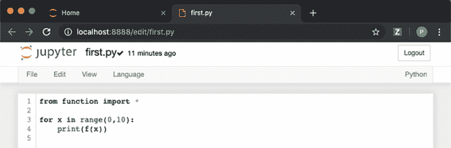

图 A.15 Jupyter 为 Python 文件提供了一个基本的文本编辑器。在这里，我打开了 first.py 文件。

这还不是一个笔记本。笔记本是一种不同于普通 Python 文件的文件类型。要创建一个笔记本，通过点击左上角的 Jupyter 标志返回主视图，然后转到右侧的“新建”下拉菜单，并点击 Python 3（图 A.16）。

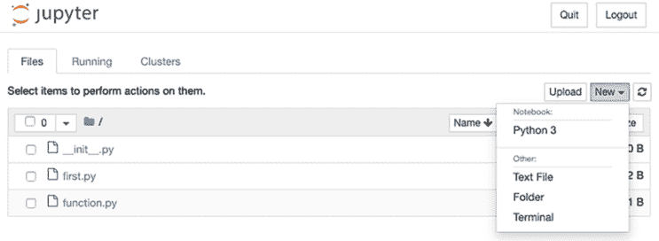

图 A.16 选择创建新的 Python 3 笔记本的菜单选项

一旦您点击 Python 3，您将被带到您的新笔记本。它应该看起来像图 A.17 中所示，其中有一个空白输入行，准备好接受一些 Python 代码。

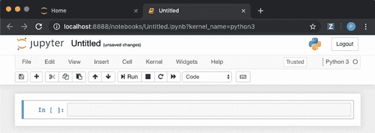

图 A.17 一个新的、空的 Jupyter 笔记本，准备进行编码

您可以在文本框中输入 Python 表达式，然后按 Shift-Enter 来评估它。在图 A.18 中，我输入了`2+2`并按 Shift-Enter 来查看输出，`4`。

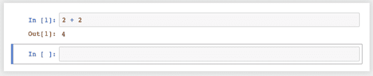

图 A.18 在 Jupyter 笔记本中评估 2 + 2

如您所见，它的工作方式就像一个交互式会话一样，只是看起来更美观。每个输入都显示在一个框中，相应的输出显示在其下方。

如果您只是按 Enter 而不是 Shift-Enter，您可以在输入框内添加新行。在界面中，上方框中定义的变量和函数可以被下方的框使用。图 A.19 显示了我们的原始示例在 Jupyter 笔记本中的样子。

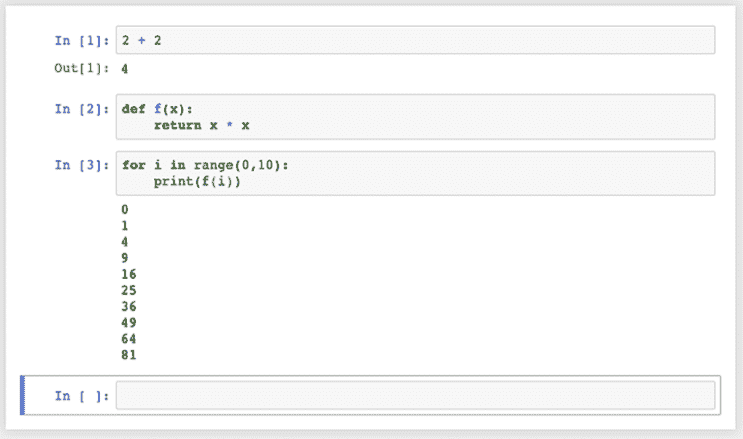

图 A.19 在 Jupyter 笔记本中编写和评估几个 Python 代码片段。注意输入框和相应的输出。

严格来说，每个框不依赖于上面的框，而是依赖于您之前评估的框。例如，如果我在下一个输入框中重新定义函数`f(x)`，然后重新运行前面的框，我将覆盖之前的输出（图 A.20）。

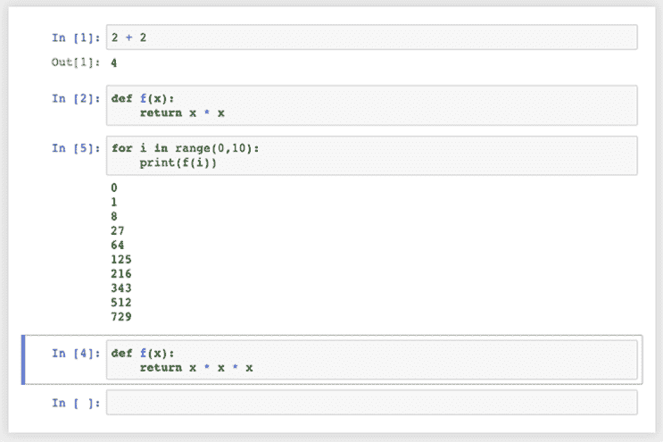

图 A.20 如果您在之前的输出下方重新定义了像`f`这样的符号，然后重新运行上面的框，Python 将使用新的定义。将此图与图 A.19 进行比较，以查看新的单元格。

这可能会让人困惑，但至少 Jupyter 在运行时会重新编号输入框。为了可重复性，我建议您在第一次使用之前定义变量和函数。您可以通过点击菜单项“内核”>“重启并运行所有”（图 A.21）来确认您的代码从上到下运行正确。这将清除您所有的现有计算，但如果您保持组织有序，您应该会得到相同的结果。

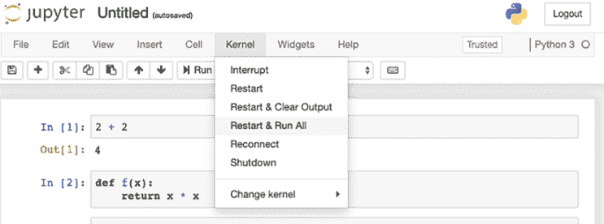

图 A.21 使用“重启并运行所有”菜单项清除输出并从上到下运行所有输入

您的笔记本在您编码时会自动保存。当您完成编码后，您可以通过点击屏幕顶部的“未命名”来命名笔记本，并输入一个新名称（图 A.22）。

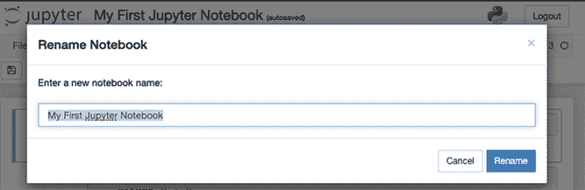

图 A.22 给您的笔记本命名

然后您可以再次点击 Jupyter 标志返回主菜单，您应该会看到您的新的笔记本已保存为具有.ipynb 扩展名的文件（图 A.23）。如果您想返回您的笔记本，您可以点击其名称来打开它。

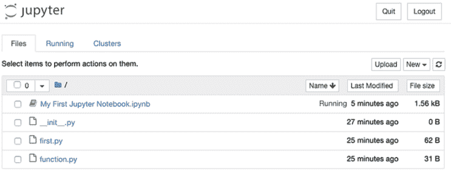

图 A.23 您的新 Jupyter 笔记本出现。

小贴士 为了确保所有文件都已保存，你应该通过点击“退出”来关闭 Jupyter，而不是仅仅关闭浏览器标签页或停止交互过程。

如需了解有关 Jupyter 笔记本更详细的信息，您可以查阅[`jupyter.org/`](https://jupyter.org/)上的全面文档。然而，到目前为止，您已经掌握了足够的信息来下载并尝试这本书的源代码，该代码几乎组织在 Jupyter 笔记本中，用于几乎所有章节。
