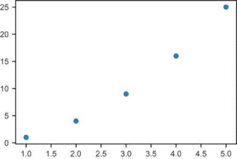
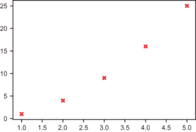
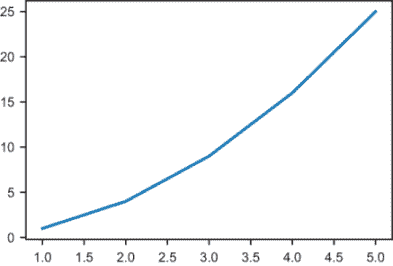
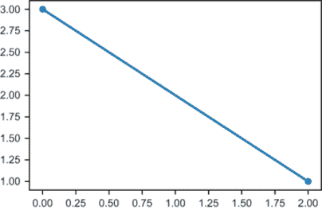
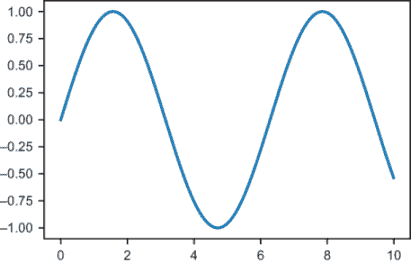
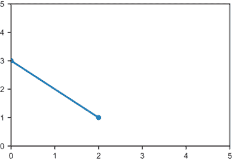
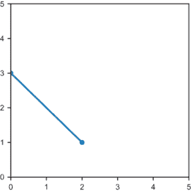
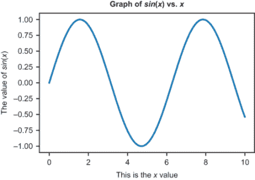

# 附录 B. Python 技巧与窍门

在遵循附录 A 中的设置说明后，你应该能够在你的计算机上运行 Python 代码。如果你是 Python 新手，下一步是学习一些语言特性。如果你以前从未见过 *任何* Python，不要担心！它是目前最简单、最容易学习的编程语言之一。此外，还有许多优秀的在线资源和书籍可以帮助你学习 Python 编程的基础知识，而 [python.org](https://www.python.org/) 是一个很好的起点。

本附录假设你已经对 Python 进行了一些实验，并且对基础知识（如数字、字符串、True 和 False、if/else 语句等）感到舒适。为了使这本书尽可能易于理解，我避免了使用高级 Python 语言特性。本附录涵盖了本书中使用的某些 Python 特性，这些特性要么超出了“基础知识”，要么因为它们在本书中的重要性而需要特别关注。如果你觉得这些内容太多，不要担心；当这些特性在书中出现时，我通常会包括一个快速回顾它们是如何工作的。本附录中的所有代码都在源代码中的“walkthrough”笔记本中进行了覆盖。

## B.1 Python 数字和数学

与大多数语言一样，Python 内置了对基本数学的支持。我假设你已经熟悉了基本的 Python 算术运算符：`+`、`-`、`*` 和 `/`。请注意，在 Python 3 中，当你除以整数时，你可以得到一个分数值，例如，

```
>>> 7/2
3.5
```

与此相反，在 Python 2 中，这将返回 `2`，这是整数除法的结果，余数 1 被丢弃。但有时我们想要得到余数，在这种情况下，我们可以使用 `%` 运算符，称为 *模数* 运算符。运行 `13 % 5` 返回 3，这告诉我们 13 除以 5 的余数是 3（即 13 = 2 × 5 + 3）。请注意，模数运算符也适用于浮点数。特别是，你可以用它来获取一个数的分数部分作为除以 1 时的余数。运行 `3.75 % 1` 返回 `0.75`。

除了基本的前四个运算符之外，还有一个有用的运算符是 `**` 运算符，它可以将数字提升到指定的幂。例如，`2 ** 3` 表示 2 的三次幂，即 2 的立方，等于 8。同样，`4 ** 2` 是 4 的平方，等于 16。

在 Python 中进行数学运算时，还需要注意的一点是浮点数运算不是精确的。我不会深入解释为什么是这样，但我会向你展示它看起来是什么样子，这样你就不会感到意外。例如，1000.1 - 1000.0 显然是 0.1，但 Python 并没有精确地计算这个值：

```
>>> 1000.1 − 1000.0
0.10000000000002274
```

当然，这个结果与正确答案相差一万亿分之一，所以它不会给我们带来问题，但它可能导致看起来不正确的结果。例如，我们期望 (1000.1 - 1000.0) - 0.1 等于零，但 Python 给我们一个庞大、复杂的看起来不正确的结果：

```
>>> (1000.1 − 1000.0) − 0.1
2.273181642920008e-14
```

这个长数字用科学记数法表示，大约是 2.27 乘以 10 的负 14 次方。10 的负 14 次方等同于 1/100,000,000,000,000（1 除以后面跟着 14 个零，或者 1 除以 100 万亿），所以这个数字实际上非常接近于零。

### B.1.1 数学模块

Python 有一个包含更多有用数学值和函数的数学模块。像任何 Python 模块一样，你需要从其中导入你想要使用的对象。例如，

```
from math import pi
```

从 `math` 模块导入变量 `pi`，它代表数字 *π*。你可能还记得从几何课上学到的 *π*；它是圆周长与其直径的比值。导入 `pi` 值后，我们可以在后续代码中像使用任何其他变量一样使用它：

```
>>> pi
3.141592653589793
>>> tau = 2 * pi
>>> tau
6.283185307179586
```

在 Python 中访问模块中的值的另一种方法是导入模块本身，然后根据需要访问值。在这里，我导入了 math 模块，然后使用它来访问数字 *π* 和我们将在几处遇到的另一个特殊数字 *e*。

```
>>> import math
>>> math.pi
3.141592653589793
>>> math.e
2.718281828459045
```

数学模块还包含了一些我们在书中会用到的非常重要的函数。其中就包括平方根函数 `sqrt`，三角函数 `cos` 和 `sin`，指数函数 `exp` 和自然对数函数 `log`。我们将在需要时逐一介绍这些函数，但你现在需要知道的重要一点是，你可以像调用普通的 Python 函数一样调用它们，在括号中提供它们的输入值：

```
>>> math.sqrt(25)
5.0
>>> math.sin(pi/2)
1.0
>>> math.cos(pi/3)
0.5000000000000001
>>> math.exp(2)
7.38905609893065
>>> math.log(math.exp(2))
2.0
```

作为对指数函数的快速提醒，`math.exp(x)` 对于任何 `x` 的值都等同于 `math.e` 的 `**` `x`，`math.log` 函数可以取消 `math.exp` 的效果。三角函数在第二章中介绍。

### B.1.2 随机数

有时候我们想要选择一些任意的数字来测试我们的计算，我们可以使用 Python 的随机数生成器来做这件事。这些生成器存储在 `random` 模块中，因此我们首先需要导入它：

```
import random
```

这个模块中第一个重要的函数是 `randint`，它从一个给定的范围内返回一个随机选择的浮点数。如果你运行 `random.randint(0,10)`，你将得到一个从 0 到 10 的随机选择的整数，0 和 10 都是可能的输出：

```
>>> random.randint(0,10)
7
>>> random.randint(0,10)
1
```

我们用于生成随机数的另一个函数是 `random.uniform`，它在指定的区间内生成一个随机浮点数。以下代码返回一个在 7.5 和 9.5 之间的随机选择的数字：

```
>>> random.uniform(7.5, 9.5)
8.200084576283352
```

词语 *uniform* 表示没有任何子范围比其他子范围更有可能。相比之下，如果你随机挑选人群并返回他们的年龄，你会得到一个 *非均匀* 的随机数分布，这意味着你会在 10-20 岁之间找到比在 100-110 岁之间更多的人。

## B.2 Python 中的数据集合

在本书的整个过程中，我们处理涉及 *集合* 的数学。这些可以是表示平面中点的有序数对、表示来自现实世界的测量数据的数字列表，或者代数表达式中的符号集合。Python 有多种方式来模拟集合，在本节中，我将介绍它们并进行比较。

### B.2.1 列表

Python 中最基本的集合类型是列表。要创建一个列表，只需在方括号内包围一些值并用逗号分隔它们即可。以下是一个包含三个字符串的列表，保存为名为 `months` 的变量：

```
months = ["January", "February", "March"]
```

我们可以通过索引（复数，*indices*）或列表中的数值位置来检索列表中的条目。在 Python 中，列表是 *零索引* 的，这意味着条目是编号的，从零开始计数而不是从一。在 `months` 列表中，三个索引是 0、1 和 2。因此，我们可以得到

```
>>> months[0]
'January'
>>> months[1]
'February'
>>> months[2]
'March'
```

尝试访问超出有效索引范围的列表条目会返回一个错误。例如，没有 `months[3]` 或 `months[17]`。我在书中的一些地方使用了一个技巧，即对索引使用取模运算符以确保有效的条目。对于任何 Python 整数 `n`，表达式 `months[n % 3]` 总是有效的，因为 `n % 3` 总是返回 `0`、`1` 或 `2`。

另一种访问列表条目的方式是 *解包* 它们。如果我们确信月份列表中有三个条目，我们可以写

```
j, f, m = months
```

这将变量 `j`、`f` 和 `m` 分别设置为 `months` 中的三个值。运行此代码后，我们有

```
>>> j
'January'
>>> f
'February'
>>> m
'March'
```

我们可以用列表的 *连接* 或按顺序组合它们来做的另一件基本事情。在 Python 中，这是通过 + 运算符完成的。将 `[1,` `2,` `3]` 和 `[4,` `5,` `6]` 连接起来，我们得到一个新列表，其条目顺序是第一个列表的条目后跟第二个列表的条目：

```
>>> [1,2,3] + [4,5,6]
[1, 2, 3, 4, 5, 6]
```

更多列表索引和切片

Python 还允许你从列表中提取一个 *切片*，即两个索引之间的所有值的列表。例如，

```
>>> months[1:3]
['February', 'March']
```

给出从索引 1 开始到（但不包括）索引 3 的切片。为了更清楚地说明，我们可以看看一个条目等于其对应索引的列表：

```
>>> nums = [0,1,2,3,4,5,6,7,8,9,10]
>>> nums[2:5]
[2, 3, 4]
```

列表的长度可以用 `len` 函数来计算：

```
>>> len(months)
3
>>> len(nums)
11
```

因为列表的条目是从零开始索引的，所以列表中的最后一个条目的索引比列表长度少一。要获取列表（如 `nums`）的最后一个条目，我们可以写

```
>>> nums[len(nums)-1]
10
```

要获取列表的最后一个条目，你也可以使用

```
>>> nums[-1]
10
```

同样地，`nums[-2]` 返回 `nums` 列表的倒数第二个条目，即 `9`。组合正负索引和切片的方式有很多种。例如，`nums[1:]` 返回列表中除了第一个条目（索引为零）之外的所有条目，而 `nums[3:-1]` 返回从索引 3 开始直到倒数第二个条目的 `nums` 中的条目：

```
>>> nums[1:]
[1, 2, 3, 4, 5, 6, 7, 8, 9, 10]
>>> nums[3:-1]
[3, 4, 5, 6, 7, 8, 9]
```

确保不要混淆涉及两个索引的切片语法，与从列表中检索条目，这也涉及两个索引。对于一个像这样的列表

```
list_of_lists = [[1,2,3],[4,5,6],[7,8,9]]
```

数字 8 位于第三个列表（索引 2）中，并且是该列表中的第二个条目（索引 1），因此如果我们运行`list_of_lists[2][1]`，我们得到`8`。

迭代列表

经常当我们对列表进行计算时，我们希望使用列表中的每个值。这意味着*迭代*列表，访问其所有值。在 Python 中，最简单的方法是使用*for 循环*。以下`for`循环为`months`列表中的每个值打印一条语句：

```
>>> for x in months:
>>>     print('Month: ' + x)
Month: January
Month: February
Month: March
```

还可以通过从空列表开始，并使用`append`方法逐个添加条目来构建一个新的列表。以下代码创建了一个名为`squares`的空列表，然后遍历`nums`列表，通过调用`squares.append`将`nums`列表中每个数的平方添加到`squares`列表中：

```
squares = []
for n in nums:
    squares.append(n * n)
```

到`for`循环结束时，`squares`包含`nums`中每个数的平方：

```
>>> squares
[0, 1, 4, 9, 16, 25, 36, 49, 64, 81, 100]
```

列表推导式

Python 有一种特殊的语法来迭代构建列表：*列表推导式*。列表推导式本质上是一种特殊的`for`循环，它位于方括号之间，表示在迭代的每一步中添加列表条目。列表推导式读起来像普通的英语，这使得理解它们的作用变得容易。例如，以下列表推导式构建了一个由`nums`列表中每个值`x`的平方`x * x`组成的列表：

```
>>> [x * x for x in nums]
[0, 1, 4, 9, 16, 25, 36, 49, 64, 81, 100]
```

在列表推导式中，可以迭代多个源列表。例如，以下代码遍历`years`列表和`months`列表的所有可能值，将每个年份和月份的组合转换为字符串：

```
>>> years = [2018,2019,2020]
>>> [m + " " + str(y) for y in years for m in months]
['January 2018',
 'February 2018',
 'March 2018',
 'January 2019',
 'February 2019',
 'March 2019',
 'January 2020',
 'February 2020',
 'March 2020']
```

类似地，我们可以通过将一个推导式放入另一个推导式中来构建一个列表的列表。通过添加另一对方括号，我们将推导式更改为对`months`列表中的每个值返回一个列表：

```
>>> [[m + " " + str(y) for y in years] for m in months]
[['January 2018', 'January 2019', 'January 2020'],
 ['February 2018', 'February 2019', 'February 2020'],
 ['March 2018', 'March 2019', 'March 2020']]
```

### B.2.2 其他可迭代对象

在 Python 中，尤其是在 Python 3.*x*中，还有一些其他类型的集合。特别是，其中一些被称为*可迭代*，因为我们可以像列表一样迭代它们。在这本书中，最常用的是*范围*，它用于按顺序构建数字序列。例如，`range(5,10)`表示从 5 开始到（但不包括）10 的整数序列。如果你在 Python 中单独评估`range(5,10)`，结果可能并不令人兴奋：

```
>>> range(5,10)
range(5, 10)
```

尽管范围没有显示组成它的数字，但我们仍然可以像列表一样迭代它：

```
>>> for i in range(5,10):
>>>    print(i)
5
6
7
8
9
```

由于范围不是列表，这允许我们使用非常大的范围，而无需一次性迭代它们。例如，`range(0,1000000000)`定义了一个包含十亿个数字的范围，我们可以迭代这些数字，但实际上它并没有存储十亿个数字。它只存储了在迭代过程中产生数字的指令。如果你想将一个可迭代的范围转换为列表，你只需要使用`list`函数将其转换：

```
>>> list(range(0,10))
[0, 1, 2, 3, 4, 5, 6, 7, 8, 9]
```

获取连续整数的列表很有用，所以我们经常使用 `range` 函数。关于 `range` 函数的另一个注意事项是，它的某些参数是可选的。如果你只提供一个输入调用它，它将自动从零开始，并增加到输入的数字，如果你提供一个第三个参数，它将按该数字计数。例如，`range(10)` 从 0 计数到 9，而 `range(0,10,3)` 以 3 的增量从 0 计数到 9：

```
>>> list(range(10))
[0, 1, 2, 3, 4, 5, 6, 7, 8, 9]
>>> list(range(0,10,3))
[0, 3, 6, 9]
```

另一个返回其自身特殊类型可迭代对象的函数示例是 `zip` 函数。`zip` 函数接受两个长度相同的可迭代对象，并返回一个由第一和第二个可迭代对象中对应条目组成的可迭代对象：

```
>>> z = zip([1,2,3],["a","b","c"])
>>> z
<zip at 0x15fa8104bc8>
>>> list(z)
[(1, 'a'), (2, 'b'), (3, 'c')]
```

注意，并非所有可迭代对象都支持索引；`z[2]` 是无效的，因此你需要先将其转换为列表（例如 `list(z)[2]`），才能获取 `zip z` 的第三个条目。（范围支持索引，`range(5,10)[3]` 返回 8。）小心 - 一旦迭代过 `zip`，它就不再存在了！如果你打算重复使用它，立即将其转换为列表是个好主意。

### B.2.3 生成器

Python 的 *生成器* 给你一种创建不一次性存储所有值，而是存储生成值的可迭代对象的方法。这允许我们定义大型甚至无限序列的值，而无需在内存中存储它们。生成器可以通过几种方式创建，其中最基本的方式看起来像是一个带有 `yield` 关键字而不是 `return` 的函数。区别在于生成器可以产生多个值，而函数最多返回一次然后结束。

这是一个表示从 0 开始的无限整数序列的生成器，1, 2, 3, 4，等等。`while` 循环会无限进行，在每次循环中，变量 *x* 被产生，然后增加 1。

```
def count():
    x = 0
    while True:
        yield x
        x += 1
```

尽管这代表了一个无限序列，但你可以在不损坏你的电脑的情况下运行 `count()`。它只返回一个生成器对象，而不是一个完整的值列表：

```
>>> count()
<generator object count at 0x0000015FA80EC750>
```

以 `for x` in `count()` 开头的 `for` 循环是有效的，但它会无限运行。以下是一个使用这种无限生成器在 `for` 循环中通过 `break` 跳出而不是无限迭代示例：

```
for x in count():
    if x > 1000:
        break
    else:
        print(x)
```

这是一个更实用的 `count` 生成器版本，它只产生有限数量的值。它的工作方式与 `range` 函数类似，从第一个输入值开始，并增加到第二个：

```
def count(a,b):
    x = a
    while x < b:
        yield x
        x += 1
```

`count(10,20)` 的结果是类似于 `range(10,20)` 的生成器；我们无法直接看到它的值，但我们可以迭代它，例如，在列表理解中：

```
>>> count(10,20)
<generator object count at 0x0000015FA80EC9A8>
>>> [x for x in count(10,20)]
[10, 11, 12, 13, 14, 15, 16, 17, 18, 19]
```

我们可以通过将理解代码包裹在括号中而不是方括号中来创建类似于列表理解的生成器理解。例如，

```
(x*x for x in range(0,10))
```

是一个生成器，它产生从 0 到 9 的数字的平方。它的行为与生成器相同：

```
def squares():
    for x in range(0,10):
        yield x*x
```

当生成器有限时，你可以安全地使用 `list` 函数将其转换为列表：

```
>>> list(squares())
[0, 1, 4, 9, 16, 25, 36, 49, 64, 81]
```

### B.2.4 元组

*元组* 是可迭代的，与列表非常相似，但它们是不可变的；一旦创建，就无法更改。这意味着元组上没有 `append` 方法。特别是，一旦创建了元组，它总是具有相同的固定长度。这使得它们非常适合存储成对或成三的数据。元组的创建方式与列表类似，唯一的区别是我们使用圆括号（或根本不使用括号）而不是方括号：

```
>>> (1,2)
(1, 2)
>>> ("a","b","c")
('a', 'b', 'c')
>>> 1,2,3,4,5
(1, 2, 3, 4, 5)
```

如果您再次查看 B.2.2 节中的 `zip`，您会看到其条目实际上是元组。在某种意义上，元组是 Python 中的默认集合。如果您写 `a` `=` `1,2,3,4,5`（不带括号），那么 `a` 将自动解释为包含这些数字的元组。同样，如果您以 `return` `a,b` 结束函数，输出实际上将是元组 `(a,b)`。

元组通常很短，所以我们通常不需要迭代它们。没有元组推导式这样的东西，但您可以在另一个推导式中迭代元组，并使用内置的 `tuple` 函数将结果转换回元组。这里有一些看起来像元组推导式的东西，但实际上是一个生成器推导式，其结果被传递给 `tuple` 函数：

```
>>> a = 1,2,3,4,5
>>> tuple(x + 10 for x in a)
(11, 12, 13, 14, 15)
```

### B.2.5 集合

Python 的 *集合* 是每个条目都必须是唯一的集合，并且它们不跟踪顺序。在这本书中，我们不会过多地使用集合，除了将列表转换为集合是一种快速保证其没有重复值的方法。`set` 函数将可迭代对象转换为集合，如下所示：

```
>>> dups = [1,2,3,3,3,3,4,5,6,6,6,6,7,8,9,9,9]
>>> set(dups)
{1, 2, 3, 4, 5, 6, 7, 8, 9}
>>> list(set(dups))
[1, 2, 3, 4, 5, 6, 7, 8, 9]
```

Python 集合的写法是使用花括号括起来的条目列表，顺便说一下，这与数学集合的写法相同。您可以通过列出一些条目，用逗号分隔并在花括号中包围它们来从头定义一个集合。由于集合不尊重顺序，如果它们具有完全相同的条目，则集合相等：

```
>>> set([1,1,2,2,3]) == {3,2,1}
True
```

### B.2.6 NumPy 数组

在本书中，我们广泛使用的一种最终集合不是内置的 Python 集合；它来自 NumPy 包，这是数值计算的默认 Python 库（高效的数值计算）。这个集合是 NumPy 的 *数组*，它之所以很重要，主要是因为 NumPy 的普遍性。许多其他 Python 库都有期望输入 NumPy 数组的函数。

要使用 NumPy 数组，请确保您有权访问 NumPy 库。首先，您需要确保 NumPy 已安装。如果您正在使用附录 A 中描述的 Anaconda，那么您应该已经安装了它。否则，您将通过在终端中运行 `pip install numpy` 来使用 pip 软件包管理器安装 NumPy。一旦安装了 NumPy，您需要将其导入到您的 Python 程序中。导入 NumPy 的传统方法是用名称 `np`：

```
import numpy as np
```

要创建 NumPy 数组，只需将可迭代对象传递给 `np.array` 函数：

```
>>> np.array([1,2,3,4,5,6])
array([1, 2, 3, 4, 5, 6])
```

我们使用的一个 NumPy 函数是 `np.arange`，它类似于内置 Python `range` 函数的浮点版本。使用两个参数，`np.arange` 的工作方式与 `range` 相同，生成一个 NumPy 数组而不是 `range` 对象：

```
>>> np.arange(0,10)
array([0, 1, 2, 3, 4, 5, 6, 7, 8, 9])
```

使用第三个参数，你可以指定一个要计数的值，这可以是一个浮点数。以下代码给出了一个包含从 0 到 10 的增量 0.1 的 NumPy 数组，总共有 100 个数字：

```
>>> np.arange(0,10,0.1)
array([0\. , 0.1, 0.2, 0.3, 0.4, 0.5, 0.6, 0.7, 0.8, 0.9, 1\. , 1.1, 1.2,
       1.3, 1.4, 1.5, 1.6, 1.7, 1.8, 1.9, 2\. , 2.1, 2.2, 2.3, 2.4, 2.5,
       2.6, 2.7, 2.8, 2.9, 3\. , 3.1, 3.2, 3.3, 3.4, 3.5, 3.6, 3.7, 3.8,
       3.9, 4\. , 4.1, 4.2, 4.3, 4.4, 4.5, 4.6, 4.7, 4.8, 4.9, 5\. , 5.1,
       5.2, 5.3, 5.4, 5.5, 5.6, 5.7, 5.8, 5.9, 6\. , 6.1, 6.2, 6.3, 6.4,
       6.5, 6.6, 6.7, 6.8, 6.9, 7\. , 7.1, 7.2, 7.3, 7.4, 7.5, 7.6, 7.7,
       7.8, 7.9, 8\. , 8.1, 8.2, 8.3, 8.4, 8.5, 8.6, 8.7, 8.8, 8.9, 9\. ,
       9.1, 9.2, 9.3, 9.4, 9.5, 9.6, 9.7, 9.8, 9.9])
>>> len(np.arange(0,10,0.1))
100
```

### B.2.7 字典

*字典* 是与列表、元组或生成器工作方式相当不同的集合。你无法通过数字索引访问字典条目，而是可以用另一份数据来标记它们，称为 *键*。至少在这本书中，键最常见的是字符串。以下代码定义了一个名为 `dog` 的字典，包含两个键和相应的值；键 `"name"` 与字符串 `"Melba"` 相关联，键 `"age"` 与数字 `2` 相关联：

```
dog = {"name" : "Melba", "age" : 2}
```

为了使字典更易于阅读，我们经常使用一些额外的空白，并将每个键值对单独一行写出。以下是在额外空白下的相同 `dog` 字典：

```
dog = {
    "name" : "Melba",
    "age" : 2
}
```

要访问字典的值，你使用与获取列表条目时类似的语法，但不是传递索引，而是传递键：

```
>>> dog["name"]
'Melba'
>>> dog["age"]
2
```

如果你想要从字典中获取所有值，你可以使用字典上的 `items` 方法获取键值对元组的可迭代对象。字典不排序它们的值，因此不要期望 `items` 的结果有任何特定的顺序：

```
>>> list(dog.items())
[('name', 'Melba'), ('age', 2)]
```

### B.2.8 有用的集合函数

Python 随带了一些有用的内置函数，用于处理可迭代对象，尤其是用于数字的可迭代对象。我们已经看到了 `len` 函数，我们将最频繁地使用它，以及 `zip` 函数，但还有一些其他值得简要提及的函数。`sum` 函数将可迭代的数字相加，而 `max` 和 `min` 函数分别返回最大和最小值：

```
>>> sum([1,2,3])
6
>>> max([1,2,3])
3
>>> min([1,2,3])
1
```

`sorted` 函数返回一个列表，它是可迭代对象的排序副本。需要注意的是，`sorted` 返回一个新的列表；原始列表的顺序不受影响：

```
>>> q = [3,4,1,2,5]
>>> sorted(q)
[1, 2, 3, 4, 5]
>>> q
[3, 4, 1, 2, 5]
```

同样，`reversed` 函数返回给定可迭代对象的反转版本，同时保持原始可迭代对象的顺序不变。结果是可迭代的，但不是列表，因此你需要将其转换为查看结果：

```
>>> q
[3, 4, 1, 2, 5]
>>> reversed(q)
<list_reverseiterator at 0x15fb652eb70>
>>> list(reversed(q))
[5, 2, 1, 4, 3]
```

相反，如果你确实想要原地排序或反转列表，可以使用 `sort` 和 `reverse` 方法，例如 `q.sort()` 或 `q.reverse()`。

## B.3 与函数一起工作

Python 函数就像小程序，它们接受一些输入值（或可能没有），执行一些计算，并可能产生一个输出值。我们已经使用了一些 Python 函数，如 `math.sqrt` 和 `zip`，并看到了它们对不同的输入值产生的输出。

我们可以使用 `def` 关键字定义自己的 Python 函数。以下代码定义了一个名为 `square` 的函数，它接受一个名为 `x` 的输入值，将值 `x` `*` `x` 存储在一个名为 `y` 的变量中，并返回 `y` 的值。就像 `for` 循环或 `if` 语句一样，我们需要使用缩进来表示哪些行属于函数定义：

```
def square(x):
    y = x * x
    return y
```

这个函数的净结果是返回输入值的平方：

```
>>> square(5)
25
```

本节介绍了我们在书中使用函数的一些更高级的方法。

### B.3.1 为函数提供更多输入

我们可以定义我们的函数，让它接受我们想要的任意数量的输入，或 *参数*。以下函数接受三个参数并将它们相加：

```
def add3(x,y,z):
    return x + y + z
```

有时，让一个函数接受可变数量的参数是有用的。例如，我们可能想要编写一个单一的 `add` 函数，其中 `add(2,2)` 返回 `4`，`add(1,2,3)` 返回 `6`，依此类推。我们可以通过在单个输入值上添加一个星号来实现这一点，这通常称为 `args`。星号表示我们将接受所有输入值并将它们存储在一个名为 `args` 的元组中。然后我们可以在函数内部编写逻辑，遍历所有参数。这个 `add` 函数遍历它接收到的所有参数并将它们相加，返回总和：

```
def add(*args):
    total = 0
    for x in args:
        total += x
    return total
```

然后 `add(1,2,3,4,5)` 返回 1 + 2 + 3 + 4 + 5 = 15，正如预期的那样，而 `add()` 返回 0。我们的 `add` 函数与之前的 `sum` 函数工作方式不同；`sum` 函数接受一个可迭代对象，而 `add` 函数直接接受作为参数的底层值。以下是一个比较：

```
>>> sum([1,2,3,4,5])
15
>>> add(1,2,3,4,5)
15
```

`*` 运算符有第二个应用：你可以用它将列表转换为函数的参数。例如，

```
>>> p = [1,2,3,4,5]
>>> add(*p)
15
```

这与评估 `add(1,2,3,4,5)` 等效。

### B.3.2 关键字参数

使用函数的星号参数是一种可选参数的方式。另一种方式是通过传递命名参数，称为 *关键字参数*。以下是一个示例函数，它有两个可选关键字参数，分别称为 `name` 和 `age`，该函数返回一个包含生日祝福的字符串：

```
def birthday(name="friend", age=None):
    s = "Happy birthday, %s" % name
    if age:
        s += ", you're %d years old" % age
    return s + "!"
```

（此函数使用字符串格式化运算符 `%`，它将 `%s` 出现的位置替换为给定的字符串，将 `%d` 出现的位置替换为给定的数字。）因为它们是关键字参数，所以 `name` 和 `age` 都是可选的。名称默认为 `"friend"`，因此如果我们不带参数调用 `birthday`，我们将得到一个通用的问候：

```
>>> birthday()
'Happy birthday, friend!'
```

我们可以可选地指定一个不同的名称。第一个参数被认为是名称，但我们可以通过直接设置 `name` 参数来使其明确：

```
>>> birthday('Melba')
'Happy birthday, Melba!'
>>> birthday(name='Melba')
'Happy birthday, Melba!'
```

`age` 参数也是可选的，默认值为 `None`。我们可以指定一个姓名和一个年龄，或者只指定一个年龄。因为 `age` 是第二个关键字参数，如果我们不提供名称，我们需要识别它。当所有参数都被识别后，我们可以以任何顺序传递它们。以下是一些示例：

```
>>> birthday('Melba', 2)
"Happy birthday, Melba, you're 2 years old!"
>>> birthday(age=2)
"Happy birthday, friend, you're 2 years old!"
>>> birthday('Melba', age=2)
"Happy birthday, Melba, you're 2 years old!"
>>> birthday(age=2,name='Melba')
"Happy birthday, Melba, you're 2 years old!"
```

如果你有很多参数，你可以将它们打包成一个字典，并使用 ** 操作符将它们传递给函数。这类似于 * 操作符，但不同的是，你传递的是一个关键字参数的字典，而不是参数列表：

```
>>> dog = {"name" : "Melba", "age" : 2}
>>> dog
{'name': 'Melba', 'age': 2}
>>> birthday(**dog)
"Happy birthday, Melba, you're 2 years old!"
```

当定义你的函数时，你可以同样使用 `**` 操作符来处理传递给函数的所有关键字参数作为一个单一的字典。我们可以将生日函数重写如下，但这样调用时我们需要指定所有参数的名称：

```
def birthday(**kwargs):
    s = "Happy birthday, %s" % kwargs['name']
    if kwargs['age']:
        s += ", you're %d years old" % kwargs['age']
    return s + "!"
```

具体来说，`name` 和 `age` 变量被替换为 `kwargs['name']` 和 `kwargs['age']`，我们可以以以下两种方式之一运行它：

```
>>> birthday(**dog)
"Happy birthday, Melba, you're 2 years old!"
>>> birthday(age=2,name='Melba')
"Happy birthday, Melba, you're 2 years old!"
```

### B.3.3 函数作为数据

在 Python 中，函数是 *一等* 值，这意味着你可以将它们赋值给变量，将它们传递给其他函数，以及将函数作为其他函数的输出值。换句话说，Python 中的函数看起来就像 Python 中的其他任何数据。在 *函数式编程* 模式（我们在第四章中介绍）中，通常会有操作其他函数的函数。以下这个函数接受两个输入，一个函数 `f` 和一个值 `x`，并返回值 `f(x)`：

```
def evaluate(f,x):
    return f(x)
```

使用 B.3 节中的 `square` 函数，`evaluate(square,10)` 应该返回 `square(10)` 或 `100`：

```
>>> evaluate(square,10)
100
```

一个更实用的函数，它接受一个函数作为输入，是 Python 的 `map` 函数。`map` 函数接受一个函数和一个可迭代对象，并返回一个新的可迭代对象，该对象通过将函数应用于原始对象的每个条目而获得。例如，以下 `map` 将 `square` 函数应用于 `range(10)` 中的每个数字。将其转换为列表，我们可以看到前 10 个平方数：

```
>>> map(square,range(10))
<map at 0x15fb752e240>
>>> list(map(square,range(10)))
[0, 1, 4, 9, 16, 25, 36, 49, 64, 81]
```

`evaluate` 和 `map` 函数是接受其他函数作为输入的函数的例子。一个函数也可以返回另一个函数作为输出。以下这个函数，例如，返回一个将数字提升到某个幂的函数。特别注意的是，一个完整的函数定义可以存在于另一个函数内部：

```
def make_power_function(power):

    def power_function(x):
        return x ** power

    return power_function
```

定义之后，`make_power_function(2)` 返回一个函数，其行为与之前的 `square` 函数完全相同。同样，`make_power_function(3)` 返回一个函数，它对输入进行立方：

```
>>> square = make_power_function(2)
>>> square(2)
4
>>> cube = make_power_function(3)
>>> cube(2)
8
```

当 `make_power_function` 完成评估后，返回的 `power_function` 仍然记得传递给它的 `power` 变量，尽管通常情况下函数运行完成后函数内部的变量就会消失。这种记住其定义中使用的外部变量的函数被称为 *闭包*。

### B.3.4 Lambda：匿名函数

在创建函数时，我们可以使用另一种更简单的语法。`lambda` 关键字允许我们创建一个没有名称的函数，称为 *匿名函数* 或 *lambda*。这个名字来自希腊字母 λ，写作 lambda，发音为 LAM-duh，这是计算机科学家在函数式编程理论中用于函数定义的符号。要定义一个 Lambda 函数，你指定输入变量或变量，用逗号分隔，然后是一个冒号，然后是函数的返回表达式。这个 Lambda 定义了一个函数，它接受单个输入 `x` 并将其加 2：

```
>>> lambda x: x + 2
<function __main__.<lambda>(x)>
```

你可以在使用函数的任何地方使用 Lambda，因此可以直接将其应用于一个值，如下所示：

```
>>> (lambda x: x + 2)(7)
9
```

这里还有一个 Lambda 函数，它接受两个输入变量并返回第一个加上第二个的两倍。在这种情况下，第一个输入是 2，第二个是 3，所以输出是 2 + 2 · 3 = 8：

```
>>> (lambda x,y: x + 2 * y)(2,3)
8
```

你也可以像在 Python 中使用任何函数值一样将 Lambda 绑定到一个名称上，尽管这多少有些违背了使用匿名函数语法的初衷：

```
>>> plus2 = lambda x: x + 2
>>> plus2(5)
7
```

应该谨慎使用 Lambda，因为如果一个函数做了任何有趣的事情，它可能值得有一个名字。你可能使用 Lambda 的情况之一是当你编写一个返回另一个函数的函数时。例如，`make_power_function` 可以用 Lambda 等价地实现，如下所示：

```
def make_power_function(p):
    return lambda x: x ** p
```

我们可以看到这个函数的行为与原始实现相同：

```
>>> make_power_function(2)(3)
9
```

外部函数的名称使这一点很清楚，给返回函数命名也收获不大。还可以将 Lambda 作为函数的输入使用。例如，如果你想将 2 加到从 0 到 9 的每个数字上，你可以简洁地写出

```
map(lambda x: x + 2, range(0,9))
```

要查看数据，我们再次需要将此结果转换为列表。然而，在大多数地方，使用推导式既简洁又易于阅读。等价的列表推导式是

```
[x+2 for x in range(0,9)]
```

### B.3.5 将函数应用于 NumPy 数组

NumPy 有一些内置的 Python 数学函数的版本，这些函数很有用，因为它们可以一次应用于 NumPy 数组的每个条目。例如，`np.sqrt` 是一个平方根函数，它可以取一个数字或整个 NumPy 数组的平方根。例如，`np.sqrt(np.arange(0,10))` 产生一个包含从 0 到 9 的整数的平方根的 NumPy 数组：

```
>>> np.sqrt(np.arange(0,10))
array([0\.        , 1\.        , 1.41421356, 1.73205081, 2\.        ,
       2.23606798, 2.44948974, 2.64575131, 2.82842712, 3\.        ])
```

这不仅仅是一个捷径。NumPy 实际上有一个实现，其速度比在 Python 中遍历数组要快。如果你想将自定义函数应用于 NumPy 数组的每个条目，你可以使用 `np.vectorize` 函数。以下是一个示例，它接受一个数字并返回另一个数字：

```
def my_function(x):
    if x % 2 == 0:
        return x/2
    else:
        return 0
```

以下代码将函数向量化并应用于 NumPy 数组的每个条目：`np.arange(0,10)`。

```
>>> my_numpy_function = np.vectorize(my_function)
>>> my_numpy_function(np.arange(0,10))
array([0., 0., 1., 0., 2., 0., 3., 0., 4., 0.])
```

## B.4 使用 Matplotlib 绘制数据

Matplotlib 是 Python 中最受欢迎的绘图库。在整个书中，我们使用它来创建数据集的图表、函数的图表以及其他几何图形的绘制。为了避免特定于库的讨论，我已经将 Matplotlib 的大多数用法隐藏在包装函数中，因此你可以主要使用这些函数来完成所有练习和迷你项目。如果你想要深入了解实现，这里有一个快速概述，如何在 Matplotlib 中制作图表。你应该已经通过 Anaconda 安装了 Matplotlib，或者你可以使用 `pip install matplotlib` 手动安装。

### B.4.1 制作散点图

散点图用于可视化形式为 (*x*, *y*) 的有序数对集合作为平面上的点（在第二章中更详细地介绍）。要使用 Matplotlib 创建散点图（或任何图表），第一步是安装库并将其导入到你的 Python 脚本中。传统上，使用名称 `plt` 导入 Matplotlib 的绘图模块，pyplot：

```
import matplotlib.pyplot as plt
```

假设我们想要绘制一个散点图，包含点 (1, 1), (2, 4), (3, 9), (4, 16), 和 (5, 25)，这些是一些数字及其平方的配对。将这些视为形式为 (*x*, *y*) 的点，*x* 的值是 1, 2, 3, 4 和 5，而 *y* 的值是 1, 4, 9, 16 和 25。要制作散点图，我们使用 `plt.scatter` 函数，首先传递一个 *x* 值的列表，然后是一个 *y* 值的列表：

```
x_values = [1,2,3,4,5]
y_values = [1,4,9,16,25]
plt.scatter(x_values,y_values)
```



图 B.1 使用 Matplotlib 的 `plt.scatter` 函数创建的散点图

水平位置告诉我们给定点的 *x* 值，而垂直位置告诉我们 *y* 值。请注意，Matplotlib 自动调整图形区域以适应所有点，因此在这种情况下，*y* 轴的比例大于 *x* 轴的比例。

你还可以使用一些关键字参数来自定义散点图的外观。例如，`marker` 关键字参数设置图表上点的形状，而 `c` 关键字参数设置点的颜色。以下行使用红色“x”代替默认的蓝色圆圈绘制相同的数据：

```
plt.scatter(x_values,y_values,marker='x',c='red')
```



图 B.2\. 自定义 Matplotlib 散点图的外观

[`matplotlib.org/`](https://matplotlib.org/) 上的文档涵盖了所有可能的关键字参数和 Matplotlib 图表的可定制的自定义选项。

### B.4.2 制作折线图

如果我们使用 Matplotlib 的 `plt.plot` 函数而不是 `plt.scatter` 函数，我们的点将通过线条连接而不是作为点标记。这有时被称为 *折线图*。例如，

```
plt.plot(x_values,y_values)
```



图 B.3 使用 Matplotlib 的 `plt.plot` 函数创建折线图

这种用法的一个有用之处是只需指定两个点来绘制线段。例如，我们可以编写一个函数，该函数接受两个输入 (*x*, *y*) 点作为元组，并通过提取它们的 *x* 和 *y* 值然后使用 `plt.plot` 来绘制连接它们的线段：

```
def plot_segment(p1,p2):
    x1,y1 = p1
    x2,*y*2 = p2
    plt.plot([x1,x2],[y1,y2],marker='o')
```

这个例子还表明，你可以为 `plt.plot` 设置一个 `marker` 关键字参数来标记单独的点，而不仅仅是绘制线：

```
point1 = (0,3)
point2 = (2,1)
plot_segment(point1,point2)
```



图 B.4 在两个点之间绘制线段的函数

这个 `draw_segment` 函数是一个包装函数的例子；我们现在可以在需要绘制两个 (*x*, *y*) 点之间的线段时，随时使用 `draw_segment`，而不是使用 Matplotlib 函数。

线图的另一个重要用途是绘制函数的 *图像*。也就是说，在 *x* 的某个固定函数 *f* 的值域内绘制所有 (*x*, *f*(*x*)) 对。从理论上讲，一个平滑、连续的图像由无限多个点组成。我们无法使用无限多个点，但使用的点越多，图像看起来就越准确。以下是从 *x* = 0 到 *x* = 10 的 *f*(*x*) = sin(*x*) 的图像，使用 1,000 个点：

```
x_values = np.arange(0,10,0.01)
y_values = np.sin(x_values)
plt.plot(x_values,y_values)

```



图 B.5 使用很多点，我们可以近似一个平滑的函数图像。

### B.4.3\. 更多的绘图定制

正如我提到的，了解如何定制你的 Matplotlib 图表的最佳方式是在你想要完成特定任务时，搜索 [matplotlib.org](https://matplotlib.org/) 上的文档。还有一些其他重要的方式可以控制你的 Matplotlib 图表的外观，我将提到它们，因为它们在这本书的例子中经常出现。



图 B.6 更新带有 x 和 y 范围的图表上的 x 和 y 刻度

第一点是设置你的图表的刻度和大小。你可能已经注意到，`plot _segment(point1,point2)` 的结果并没有按比例绘制。如果我们想按比例看到我们的线段绘制，我们可以显式设置图形的 *x* 和 *y* 范围相同。例如，这段代码将 *x* 和 *y* 范围都设置为从 0 到 5：

```
plt.ylim(0,5)
plt.xlim(0,5)
plot_segment(point1,point2)
```

这仍然不完全按比例。x 轴上的一个单位与 y 轴上的一个单位不同。为了使它们在视觉上大小相同，我们需要将我们的图形设置为正方形。这可以通过 `set_size_inches` 方法完成。该方法实际上属于 Matplotlib 当前正在处理的“图形”对象，我们可以通过在 `plt` 上使用 `gcf`（获取当前图形）方法来检索它。以下代码绘制了线段：

在一个 5 英寸乘 5 英寸的图表区域内按正确比例绘制。根据你的显示，它可能看起来是另一个大小，但比例应该是正确的：

```
plt.ylim(0,5)
plt.xlim(0,5)
plt.gcf().set_size_inches(5,5)
plot_segment(point1,point2)
```



图 B.7 通过设置图尺寸为英寸来正确绘制比例

你可以向你的图表添加的其他重要自定义之一是为坐标轴和整个图表设置标签。你可以使用 `plt.title` 函数给当前图表添加标题，并且可以使用 `plt.xlabel` 和 `plt.ylabel` 函数分别添加 x 轴和 y 轴的标签。以下是一个向正弦函数图表添加标签的示例：

```
x_values = np.arange(0,10,0.01)
y_values = np.sin(x_values)
plt.plot(x_values,y_values)
plt.title('Graph of sin(x) vs. x',fontsize=16)
plt.xlabel('this is the x value',fontsize=16)
plt.ylabel('the value of sin(x)',fontsize=16)

```



图 B.8 带标题和坐标轴标签的 Matplotlib 图

## B.5 Python 中的面向对象编程

面向对象编程（OOP）大致上是一种编程范式，它强调使用 *类* 组织程序数据。类可以存储称为 *属性* 的值以及称为 *方法* 的函数，这些函数在程序中将数据和功能联系起来。你不需要了解很多关于 OOP 的知识就能欣赏这本书，但一些数学思想确实带有面向对象的色彩。特别是在第六章和第十章中，我们使用类和一些面向对象设计原则来帮助理解数学。本节简要介绍了 Python 中的类和面向对象编程。

### B.5.1 定义类

让我们用一个具体的例子来操作。假设你正在编写一个处理几何形状的 Python 程序，例如一个绘图应用程序。你可能想要描述的一种形状是矩形。为此，我们在 Python 中定义一个 `Rectangle` 类来描述矩形的属性，然后我们创建这个类的 *实例* 来代表特定的矩形。

在 Python 中，一个类是通过 `class` 关键字定义的，类的名称通常是大写的，如 `Rectangle`。位于类名称下方缩进的行描述了与类相关的属性（值）和方法（函数）。类最基本的方法是其 *构造函数*，这是一个允许我们创建类实例的函数。在 Python 中，构造函数被赋予特殊的名称 `__init__`。对于一个矩形，我们可能想要通过两个数字来描述它，代表其高度和宽度。在这种情况下，`__init__` 函数接受三个值：第一个代表我们正在构建的新类实例，接下来的两个代表高度和宽度值。构造函数负责将新实例的高度和宽度属性设置为输入值：

```
class Rectangle():
    def __init__(self,w,h):
        self.width = w
        self.height = h
```

创建构造函数后，我们可以像使用一个接受两个数字并返回一个 `Rectangle` 对象的函数一样使用类的名称。例如 `Rectangle(3,4)` 创建了一个宽度属性设置为 3，高度属性设置为 4 的实例。尽管构造函数是用 `self` 参数定义的，但在调用构造函数时你不需要包含它。有了这个 `Rectangle` 对象，我们可以访问其高度和宽度属性：

```
>>> xr = Rectangle(3,4)
>>> type(r)
__main__.Rectangle
>>> r.width
3
>>> r.height
4
```

### B.5.2 定义方法

*方法*是与类相关联的函数，它允许你计算有关实例的信息或给实例提供某种功能。对于一个矩形来说，有一个`area()`方法来计算面积是有意义的，面积是高度乘以宽度。像构造函数一样，任何方法都必须接受一个`self`参数，它代表当前实例。同样，你不需要向方法传递`self`参数；`self`会自动被视为被调用的对象：

```
class Rectangle():
    def __init__(self,w,h):
        self.width = w
        self.height = h

    def area(self):
        return self.width * self.height
```

要计算矩形的面积，我们可以按以下方式调用`area`方法：

```
>>> Rectangle(3,4).area()
12
```

注意，函数中不会传递`self`参数；实例`Rectangle(3,4)`会自动被视为`self`值。作为另一个例子，我们可以有一个`scale`方法，它接受一个数字并返回一个新的`Rectangle`对象，其高度和宽度都按该因子从原始值缩放。（我将开始在打印页上使用“...”作为占位符，以代替`Rectangle`类中我们已编写的代码。）

```
class Rectangle():
    ...
    def scale(self, factor):
        return Rectangle(factor * self.width, factor * self.height)
```

调用`Rectangle(2,1)`会构建一个宽度为 2、高度为 1 的矩形。如果我们将其按 3 的因子缩放，我们得到一个新矩形，其宽度为 6、高度为 3：

```
>>> xr = Rectangle(2,1)
>>> s = r.scale(3)
>>> s.width
6
>>> s.height
3
```

### B.5.3 特殊方法

一些方法在实现后要么自动可用，要么具有特殊效果。例如，`__dict__`方法默认在每个新类的实例上可用，并返回实例所有属性的字典。在不修改`Rectangle`类的情况下，我们可以编写：

```
>>> Rectangle(2,1).__dict__
{'width': 2, 'height': 1}
```

另一个特殊方法名是`__eq__`。当实现此方法时，它描述了类实例上`==`运算符的行为，因此决定了何时两个实例相等。如果没有实现自定义相等方法，类实例总是不相等，即使它们包含相同的数据：

```
>>> Rectangle(3,4) == Rectangle(3,4)
False
```

对于矩形，我们可能希望说如果它们在几何上无法区分，具有相同的宽度和高度，则它们是相同的。我们可以相应地实现`__eq__`方法。该方法接受两个参数，通常是`self`参数，以及一个表示另一个实例的第二个参数，我们将`self`与该实例进行比较：

```
class Rectangle():
    ...
    def __eq__(self,other):
        return self.width == other.width and self.height == other.height
```

完成这些后，如果矩形的宽度和高度相同，则`Rectangle`实例相等：

```
>>> Rectangle(3,4) == Rectangle(3,4)
True
```

另一个有用的特殊方法是`__repr__`，它生成对象的默认字符串表示。以下`__repr__`方法使得一眼就能看到矩形的宽度和高度：

```
class Rectangle():
    ...
    def __repr__(self):
        return 'Rectangle (%r by %r)' % (self.width, self.height)
```

我们可以看到它是如何工作的：

```
>>> Rectangle(3,4)
Rectangle (3 by 4)
```

### B.5.4 运算符重载

我们可以实施更多特殊方法来描述 Python 操作符如何与类的实例一起使用。将具有现有意义的操作符重新用于处理新类的对象称为 *操作符重载*。例如，`__mul__` 和 `__rmul__` 方法描述了类在乘法操作符 *（分别作用于右侧和左侧）方面的行为。对于一个 `Rectangle` 实例 `r`，我们可能想写 `r * 3` 或 `3 * r` 来表示将矩形按 3 倍缩放。以下对 __`mul` __ 和 __`rmul` __ 的实现调用了我们已实现的 `scale` 方法，生成一个按给定因子缩放的新矩形：

```
class Rectangle():
    ...
    def __mul__(self,factor):
        return self.scale(factor)

    def __rmul__(self,factor):
        return self.scale(factor)
```

我们可以看到，无论是 `10 * Rectangle(1,2)` 还是 `Rectangle(1,2) * 10`，都会返回一个新的 `Rectangle` 实例，其宽度为 10，高度为 20：

```
>>> 10 * Rectangle(1,2)
Rectangle (10 by 20)
>>> Rectangle(1,2) * 10
Rectangle (10 by 20)
```

### B.5.5 类方法

*方法* 是只能通过类的现有实例来运行的函数。另一个选择是创建一个 *类方法*，这是一个附加到类本身而不是单个实例的函数。对于一个 `Rectangle` 类，类方法将包含一些与一般矩形相关的功能，而不是与特定矩形相关。

类方法的一个典型用途是创建一个替代构造函数。例如，我们可以在 `Rectangle` 类上创建一个接受单个数字作为参数的类方法，返回一个高度和宽度都等于该数字的矩形。换句话说，这个类方法构建了一个给定边长的正方形矩形。类方法的第一参数代表类本身，通常缩写为 `cls`：

```
class Rectangle():
    ...
    @classmethod
    def square(cls,side):
        return Rectangle(side,side)
```

通过实现这个类方法，我们可以使用 `Rectangle.square(5)` 来得到与 `Rectangle(5,5)` 相同的结果。

### B.5.6 继承和抽象类

在面向对象编程中，我们使用的最后一个主题是 *继承*。如果我们说类 `A` 继承自类 `B`，就像说类 `A` 的实例是类 `B` 的特殊情况；它们像类 `B` 的实例一样工作，但有一些额外的或修改后的功能。在这种情况下，我们也说 `A` 是 `B` 的 *子类*，而 `B` 是 `A` 的 *超类*。作为一个简单的例子，我们可以从 `Rectangle` 创建一个表示正方形的子类 `Square`，同时保留 `Rectangle` 的大部分底层逻辑。编写 `class Square(Rectangle)` 意味着 `Square` 是 `Rectangle` 的子类，并且调用 `super().__init__` 会从 `Square` 构造函数中运行超类（`Rectangle`）的构造函数：

```
class Square(Rectangle):
    def __init__(self,s):
        return super().__init__(s,s)
    def __repr__(self):
        return "Square (%r)" % self.width
```

这就是我们定义 `Square` 类所需做的所有事情，我们可以直接使用任何 `Rectangle` 方法：

```
>> Square(5).area()
25
```

在实践中，你可能需要重新实现或 *重写* 一些更多方法，如 `scale`，它默认返回缩放后的正方形作为矩形。

面向对象编程中的一种常见模式是让两个类从同一个 *抽象基类* 继承，这是一个定义了一些公共方法或代码的类，但你永远不能创建其实例。例如，假设我们有一个类似的类 `Circle`，表示给定半径的圆。`Circle` 类的大部分实现与 `Rectangle` 类类似：

```
from math import pi
class Circle():
    def __init__(self, r):
        self.radius = r
    def area(self):
        return pi * self.radius * self.radius
    def scale(self, factor):
        return Circle(factor * self.radius)
    def __eq__(self,other):
        return self.radius == other.radius
    def __repr__(self):
        return 'Circle (radius %r)' % self.radius
    def __mul__(self,factor):
        return self.scale(factor)
    def __rmul__(self,factor):
        return self.scale(factor)
```

（记得几何课上学到的，半径为 *r* 的圆的面积是 *πr²*。）如果我们程序中处理多种不同的形状，我们可以让 `Circle` 和 `Rectangle` 都继承自一个共同的 `Shape` 类。形状的概念不够具体，以至于我们无法创建其实例，因此只能实现其中的一些方法。其他方法被标记为 *抽象方法*，这意味着它们不能单独为 `Shape` 实现，但可以为任何具体的子类实现。

我们可以使用以下代码在 Python 中创建一个抽象类。*ABC* 代表“抽象基类”，`ABC` 是一个特殊的基类，任何抽象类都必须在 Python 中从它继承：

```
from abc import ABC, abstractmethod
class Shape(ABC):
    @abstractmethod
    def area(self):
        pass
    @abstractmethod
    def scale(self, factor):
        pass
    def __eq__(self,other):
        return self.__dict__ == other.__dict__
    def __mul__(self,factor):
        return self.scale(factor)
    def __rmul__(self,factor):
        return self.scale(factor)
```

等式和乘法重载已完全实现，`__eq__` 方法检查两个形状的所有属性是否一致。面积和缩放功能留待实现，它们的实现取决于我们正在处理的特定形状。

如果我们要根据 `Shape` 抽象基类重新实现 `Rectangle` 类，我们可以先让它继承自 `Shape`，同时为其提供一个自己的构造函数：

```
class Rectangle(Shape):
    def __init__(self,w,h):
        self.width = w
        self.height = h
```

如果我们尝试仅用这段代码实例化一个 `Rectangle`，我们会遇到错误，因为 `area` 和 `scale` 方法尚未实现：

```
>>> Rectangle(1,3)
TypeError: Can't instantiate abstract class Rectangle with abstract methods area, scale
```

我们可以包含之前实现的代码：

```
class Rectangle(Shape):
    def __init__(self,w,h):
        self.width = w
        self.height = h
    def area(self):
        return self.width * self.height
    def scale(self, factor):
        return Rectangle(factor * self.width, factor * self.height)
```

一旦我们有了这些特定于矩形的特定方法，我们就能够访问 `Shape` 基类中的所有功能。例如，等式和乘法运算符重载的行为符合预期：

```
>>> 3 * Rectangle(1,2) == Rectangle(3,6)
True
```

现在我们可以快速实现一个 `Circle` 类、一个 `Triangle` 类，或者任何其他二维形状的类，所有这些类都会通过它们的面积和形状方法以及运算符重载实现统一。
