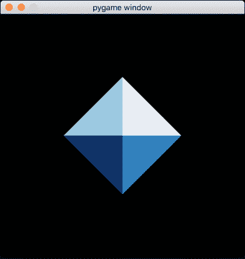
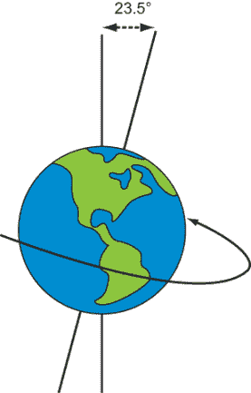
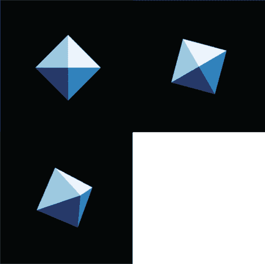
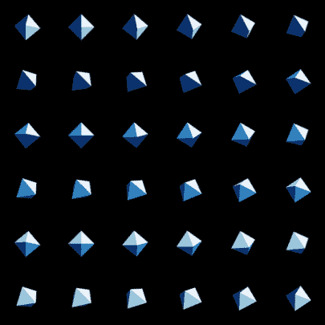
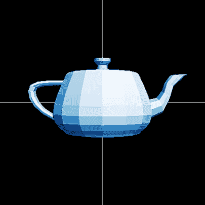
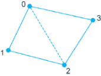

# 附录 C：使用 OpenGL 和 PyGame 加载和渲染 3D 模型

在第三章之后，当我们开始编写转换和动画图形的程序时，我使用 OpenGL 和 PyGame 而不是 Matplotlib。本附录概述了如何在 PyGame 中设置游戏循环并在连续帧中渲染 3D 模型。最终，我们实现了一个 `draw_model` 函数，用于渲染一个 3D 模型的单张图像，就像我们在第四章中使用的水壶一样。

`draw_model` 函数的目标是封装特定库的工作，这样你就不必花费大量时间与 OpenGL 斗争。但如果你想知道这个函数是如何工作的，请随时跟随本附录并亲自尝试代码。让我们从第三章中的八面体开始，使用 PyOpenGL（Python 和 PyGame 的 OpenGL 绑定）重新创建它。

## C.1 重新创建第三章中的八面体

要开始使用 PyOpenGL 和 PyGame 库，你需要安装它们。我建议使用以下 pip 命令：

```
> pip install PyGame
> pip install PyOpenGL
```

我将首先向你展示如何使用这些库来重新创建我们已经完成的工作，渲染一个简单的 3D 对象。

在一个名为 octahedron.py 的新 Python 文件中（你可以在附录 C 的源代码中找到它），我们开始导入一些模块。前几个来自两个新的库，PyGame 和 PyOpenGL，其余的应该与第三章中熟悉的内容相同。特别是，我们将继续使用我们已构建的所有 3D 向量算术函数，这些函数组织在本书源代码中的 vectors.py 文件中。以下是导入语句：

```
import pygame
from pygame.locals import *
from OpenGL.GL import *
from OpenGL.GLU import *
import matplotlib.cm
from vectors import *
from math import *
```

虽然 OpenGL 具有自动着色功能，但让我们继续使用第三章中提到的着色机制。我们可以使用 Matplotlib 的蓝色颜色图来计算八面体的着色面的颜色：

```
def normal(face):
    return(cross(subtract(face[1], face[0]), subtract(face[2], face[0])))

blues = matplotlib.cm.get_cmap('Blues')

def shade(face,color_map=blues,light=(1,2,3)):
    return color_map(1 − dot(unit(normal(face)), unit(light)))
```

接下来，我们必须指定八面体的几何形状和光源。这和第三章中一样：

```
light = (1,2,3)
faces = [
    [(1,0,0), (0,1,0), (0,0,1)],
    [(1,0,0), (0,0,-1), (0,1,0)],
    [(1,0,0), (0,0,1), (0,-1,0)],
    [(1,0,0), (0,-1,0), (0,0,-1)],
    [(−1,0,0), (0,0,1), (0,1,0)],
    [(−1,0,0), (0,1,0), (0,0,-1)],
    [(−1,0,0), (0,-1,0), (0,0,1)],
    [(−1,0,0), (0,0,-1), (0,-1,0)],
]
```

现在是进入一些不熟悉的领域的时候了。我们将以 PyGame 游戏窗口的形式展示八面体，这需要几行样板代码。在这里，我们启动游戏，设置窗口的像素大小，并告诉 PyGame 使用 OpenGL 作为图形引擎：

```
pygame.init()
display = (400,400) 
window = pygame.display.set_mode(display,            ❶
                                 DOUBLEBUF|OPENGL)   ❷
```

❶ 请求 PyGame 在一个 400 × 400 像素的窗口中显示我们的图形

❷ 让 PyGame 知道我们正在使用 OpenGL 进行图形处理，并指出我们想要使用一个名为双缓冲的内置优化，这对于我们的目的来说并不重要

在第 3.5 节的简化示例中，我们从 z 轴上方的某一点观察者的视角绘制了八面体。我们计算了哪些三角形对这样的观察者是可见的，并通过移除 z 轴将它们投影到 2D。OpenGL 内置了更精确地配置我们视角的函数：

```
gluPerspective(45, 1, 0.1, 50.0)
glTranslatef(0.0,0.0, -5)
glEnable(GL_CULL_FACE)
glEnable(GL_DEPTH_TEST)
glCullFace(GL_BACK)
```

为了学习数学，你实际上并不需要知道这些函数具体做什么，但我还是会给你一个简要的概述，以防你感兴趣。对`gluPerspective`的调用描述了我们观察场景的视角，其中我们有一个 45°的观察角度和宽高比为 1。这意味着垂直单位和水平单位显示为相同的大小。作为一个性能优化，数字 0.1 和 50.0 限制了渲染的*z*坐标：没有物体距离观察者超过 50.0 个单位或小于 0.1 个单位将显示出来。我们使用`glTranslatef`表明我们将从 z 轴上的 5 个单位处观察场景，这意味着我们通过向量(0, 0, -5)将场景向下移动。调用`glEnable(GL_CULL_FACE)`打开了一个 OpenGL 选项，该选项会自动隐藏面向观察者之外的多边形，这节省了我们已经在第三章中完成的一些工作，而`glEnable(GL_DEPTH_TEST)`确保我们渲染距离我们更近的多边形在距离我们更远的多边形之上。最后，`glCullFace(GL_BACK)`打开了一个 OpenGL 选项，该选项会自动隐藏面向我们但位于其他多边形后面的多边形。对于球体来说，这不是问题，但对于更复杂的形状来说，可能会有问题。

最后，我们可以实现绘制我们的八面体的主要代码。因为我们的最终目标是动画化物体，所以我们将编写重复绘制物体的代码。这些连续的绘制，就像电影的一帧，随着时间的推移显示了相同的八面体。而且，就像任何静止物体的视频一样，结果是和静态图片无法区分的。

要渲染单个帧，我们遍历向量，决定如何着色它们，使用 OpenGL 绘制它们，并使用 PyGame 更新帧。在一个无限`while`循环中，只要程序运行，这个过程可以尽可能快地自动重复：

```
clock = pygame.time.Clock()                            ❶
while True:
    for event in pygame.event.get():                   ❷
        if event.type == pygame.QUIT:
            pygame.quit()
            quit()

    clock.tick()                                       ❸
    glClear(GL_COLOR_BUFFER_BIT|GL_DEPTH_BUFFER_BIT)
    glBegin(GL_TRIANGLES)                              ❹
    for face in faces:
        color = shade(face,blues,light)
        for vertex in face:
            glColor3fv((color[0], 
                        color[1], 
                        color[2]))                     ❺
            glVertex3fv(vertex)                        ❻
    glEnd()
    pygame.display.flip()                              ❼
```

❶ 初始化一个时钟来测量 PyGame 的时间推进

❷ 在每次迭代中，检查 PyGame 接收的事件，如果用户关闭窗口则退出

❸ 指示时钟时间应该流逝

❹ 指示 OpenGL 我们即将绘制三角形

❺ 对于每个面的每个顶点（三角形），根据着色设置颜色

❻ 指定当前三角形的下一个顶点

❼ 指示 PyGame 最新的动画帧已准备好并使其可见

运行此代码，我们会看到一个 400 × 400 像素的 PyGame 窗口出现，其中包含看起来像第三章（图 C.1）中的图像。



图 C.1 在 PyGame 窗口中渲染的八面体

如果你想要证明有更有趣的事情发生，你可以在`while True`循环的末尾包含以下行：

```
print(clock.get_fps())
```

这打印出 PyGame 渲染和重新渲染八面体的速率（每秒帧数，或 fps）的瞬时值。对于这样的简单动画，PyGame 应该达到或超过其默认的最大帧率 60 fps。

但如果没有任何变化，渲染这么多帧又有什么意义呢？一旦我们为每一帧加入一个矢量变换，我们就能看到八面体以各种方式移动。目前，我们可以通过移动“相机”来欺骗，而不是真正移动八面体。

## C.2 改变我们的视角

上一节中的`glTranslatef`函数告诉 OpenGL 我们想要从哪个位置查看我们正在渲染的 3D 场景。同样，还有一个`glRotatef`函数允许我们改变观察场景的角度。调用`glRotatef (theta, x, y, z)`将整个场景绕由向量(*x*, *y*, *z*)指定的轴旋转角度`theta`。

让我澄清一下“绕轴旋转一个角度”的意思。你可以想想地球在空间中旋转的熟悉例子。地球每天旋转 360°或每小时旋转 15°。*轴*是地球围绕旋转的看不见的线；它穿过北极和南极−这是唯一两个不旋转的点。对于地球来说，旋转轴并不是直接垂直的，而是倾斜了 23.5°（图 C.2）。



图 C.2 一个绕轴旋转的物体的熟悉例子。地球的旋转轴相对于其轨道平面倾斜了 23.5°。

向量(0, 0, 1)沿着 z 轴，所以调用`glRotatef(30,0,0,1)`将场景绕 z 轴旋转 30°。同样，`glRotatef(30,0,1,1)`将场景绕 30°旋转，但绕的是轴(0, 1, 1)，它在 y 轴和 z 轴之间倾斜 45°。如果我们调用`glRotatef (30,0,0,1)`或`glRotatef(30,0,1,1)`在八面体代码中的`glTranslatef(...)`之后，我们会看到八面体旋转（图 C.3）。

注意到图 C.3 中八面体四个可见面的阴影没有改变。这是因为没有任何向量发生变化；八面体的顶点和光源都是相同的！我们只是改变了“相机”相对于八面体的位置。当我们实际改变八面体的位置时，我们也会看到阴影的变化。



图 C3. 使用 OpenGL 的`glRotatef`函数从三个不同的旋转视角看到的八面体

为了使立方体的旋转动画化，我们可以在每一帧调用`glRotate`一个小角度。例如，如果 PyGame 以大约 60 fps 的速度绘制八面体，并且我们在每一帧调用`glRotatef(1,x,y,z)`，那么八面体将绕(*x*, *y*, *z*)轴每秒旋转 60°。在`glBegin`之前无限循环中添加`glRotatef(1,1,1,1)`会导致八面体绕方向(1, 1, 1)的轴每帧旋转 1°，如图 C.4 所示。



图 C.4 我们八面体每帧旋转 1°。经过 36 帧后，八面体完成了一次完整的旋转。

这个旋转速率只有在 PyGame 精确绘制 60 fps 时才是准确的。从长远来看，这可能并不成立；如果复杂场景需要超过六十分之一秒来计算所有向量和绘制所有多边形，实际的运动速度会减慢。为了使场景的运动不受帧率影响而保持恒定，我们可以使用 PyGame 的时钟。

假设我们想让场景每 5 秒旋转一周（360°）。PyGame 的时钟以毫秒为单位思考，即千分之一秒。对于千分之一秒，旋转的角度被除以 1,000：

```
degrees_per_second = 360./5
degrees_per_millisecond = degrees_per_second / 1000
```

我们创建的 PyGame 时钟有一个 `tick()` 方法，它既推进时钟又返回自上次调用 `tick()` 以来经过的毫秒数。这为我们提供了一个自上次渲染帧以来可靠的毫秒数，并允许我们计算场景在此时间内应该旋转的角度：

```
milliseconds = clock.tick()
glRotatef(milliseconds * degrees_per_millisecond, 1,1,1)
```

每帧调用 `glRotatef` 如此保证场景每 5 秒旋转正好 360°。在附录 C 的源代码文件 rotate_octahedron.py 中，你可以看到这段代码是如何插入的。

通过能够在时间上移动我们的视角，我们已经拥有了比第三章中开发的更好的渲染能力。现在，我们可以将注意力转向绘制比八面体或球体更有趣的形状。

## C.3 加载和渲染犹他茶壶

正如我们在第二章中手动识别描绘 2D 恐龙的向量一样，我们可以手动识别任何 3D 对象的顶点，将它们组织成代表三角形的三个一组的顶点，并构建一个由三角形组成的表面列表。设计 3D 模型的艺术家有专门的空间定位顶点和将它们保存到文件中的界面。在本节中，我们使用一个著名的预构建 3D 模型：犹他茶壶。这个茶壶的渲染是图形程序员的 Hello World 程序：一个简单、可识别的示例，用于测试。

茶壶模型保存在源代码中的 teapot.off 文件中，其中 .off 文件扩展名代表对象文件格式。这是一种纯文本格式，指定组成 3D 对象表面的多边形以及构成多边形顶点的 3D 向量。teapot.off 文件看起来就像这个列表中所示的那样。

列表 C.1 teapot.off 文件的示意图

```
OFF                                ❶
480  448  926                      ❷
0  0  0.488037                     ❸
0.00390625  0.0421881  0.476326
0.00390625  -0.0421881  0.476326
0.0107422  0  0.575333
...
4 324 306 304 317                  ❹
4 306 283 281 304
4 283 248 246 281
...
```

❶ 表示此文件遵循对象文件格式

❷ 按顺序包含 3D 模型的顶点数、面数和边数

❸ 指定每个顶点的 3D 向量，作为 x、y 和 z 坐标值

❹ 指定模型的 448 个面

对于此文件的最后几行，指定面时，每行的第一个数字告诉我们该面是何种多边形。数字 3 表示三角形，4 表示四边形，5 表示五边形，依此类推。茶壶的大部分面都是四边形。每行接下来的数字告诉我们构成给定多边形顶点的索引，这些索引来自前面的行。

在附录 C 的源代码文件 teapot.py 中，你会找到 `load_vertices()` 和 `load_polygons()` 函数，它们从 teapot.off 文件中加载顶点和面（多边形）。第一个函数返回一个包含 440 个向量的列表，这些向量是模型的全部顶点。第二个返回一个包含 448 个列表的列表，每个列表包含构成模型中 448 个多边形之一的顶点向量。最后，我还包括了一个第三个函数 `load_triangles()`，它将具有四个或更多顶点的多边形分解，这样我们的整个模型就由三角形组成。

我把它留作一个迷你项目，让你更深入地挖掘我的代码，或者尝试加载 teapot.off 文件。现在，我将继续使用 teapot.py 加载的三角形，这样我们可以更快地进入绘制和玩茶壶的阶段。我跳过的另一个步骤是将 PyGame 和 OpenGL 的初始化组织到一个函数中，这样我们就不必每次绘制模型时都重复它。在 draw_model.py 中，你会找到一个以下函数：

```
def draw_model(faces, color_map=blues, light=(1,2,3)):
        ...
```

它接受一个 3D 模型的面（假设是正确方向的三角形），一个用于着色的颜色图，以及一个表示光源的向量，并据此绘制模型。还有一些我们在第四章和第五章中介绍的关键字参数。就像我们用来绘制八面体的代码一样，它反复循环地绘制传入的任何模型。这个列表展示了我在 draw_teapot.py 中如何将这些组合在一起。

列表 C.2 加载茶壶三角形并将其传递给 `draw_model`

```
from teapot import load_triangles
from draw_model import draw_model

draw_model(load_triangles())
```

结果是一个茶壶的俯视图。你可以看到圆形的盖子，左侧的把手和右侧的壶嘴（图 C.5）。



图 C.5 渲染茶壶

现在我们能够渲染比简单几何图形更有趣的形状，是时候玩耍了！如果你阅读了第四章，你学习了可以对茶壶的所有顶点执行数学变换，以在 3D 空间中移动和扭曲它。这里，我也为你留下了一些练习，如果你想要对渲染代码进行一些有指导的探索。

## C.4 练习

| **练习 C.1**: 修改 `draw_model` 函数以从任何旋转视角显示输入的图形。具体来说，给 `draw_model` 函数一个关键字参数 `glRotatefArgs`，它提供一个包含四个数字的元组，对应于 `glRotatef` 的四个参数。有了这些额外信息，在 `draw_model` 函数体中添加一个适当的 `glRotatef` 调用来执行旋转。**解决方案**: 在本书的源代码中，请参阅 draw_model.py 以获取解决方案，以及 draw_teapot_glrotatef.py 以获取示例用法。 |
| --- |
| **练习 C.2**: 如果我们每帧调用 `glRotatef(1,1,1,1)`，场景完成一次完整旋转需要多少秒？**解决方案**: 答案取决于帧率。这个 `glRotatef` 调用每帧旋转视角 1°。在 60 fps 下，它每秒旋转 60°，并在 6 秒内完成 360° 的完整旋转。 |
| **练习 C.3-迷你项目**: 实现之前展示的 `load_triangles()` 函数，该函数从 teapot.off 文件中加载茶壶，并生成一个包含三角形的 Python 列表。每个三角形应由三个 3D 向量指定。然后，将你的结果传递给 `draw_model()` 并确认你是否看到了相同的结果。**解决方案**: 在源代码中，你可以在文件 teapot.py 中找到 `load_triangles()` 的实现。**提示**: 你可以通过连接它们的对顶点将四边形转换为两个三角形！四边形的四个顶点索引，通过顶点 0, 1, 2 和 0, 2, 3 分别形成两个三角形。 |
| **练习 C.4-迷你项目**: 通过改变 `gluPerspective` 和 `glTranslatef` 的参数来动画化茶壶。这将帮助你可视化每个参数的效果。**解决方案**: 在源代码中的文件 animated_octahedron.py 中，给出了一个通过每帧更新 `glRotatef` 的 `angle` 参数来使八面体每秒旋转 360 / 5 = 72° 的示例。你可以尝试对茶壶或八面体进行类似的修改。 |
