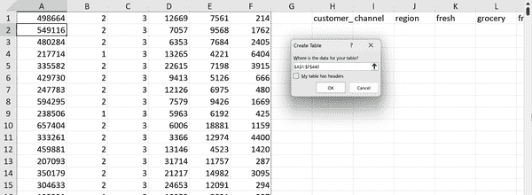
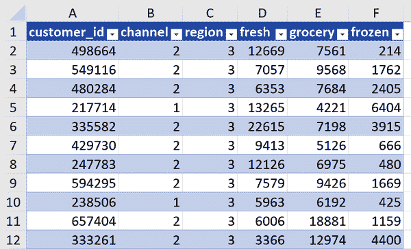
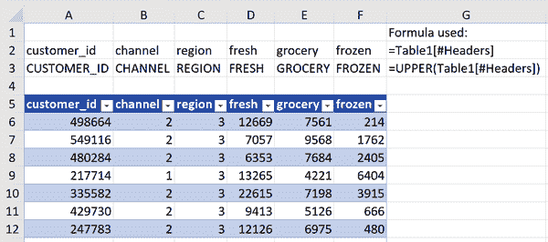
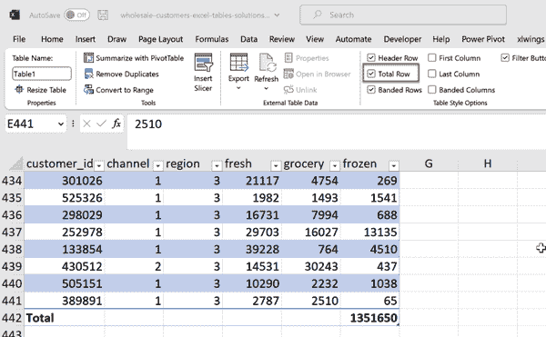
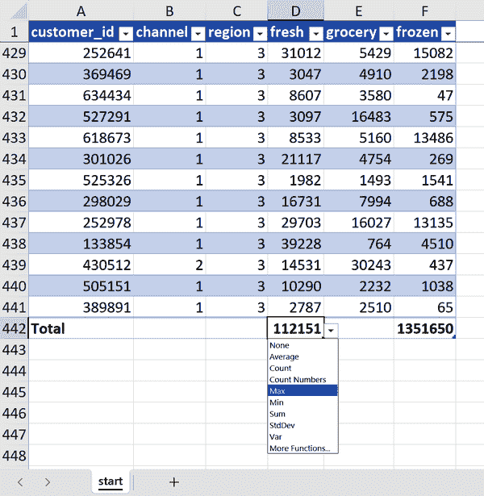
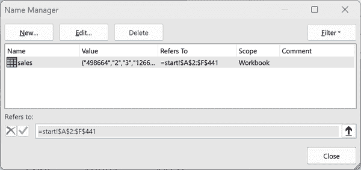
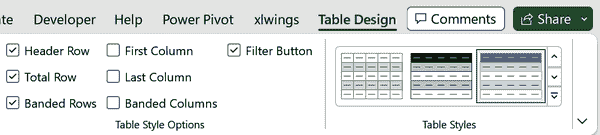
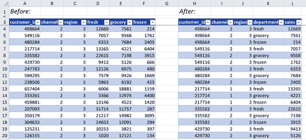

# 第一章：表格：现代 Excel 的入口

Excel 拥有广泛的分析工具，这使得确定最佳起点变得具有挑战性。然而，掌握 Excel 表格是一个基础步骤。本章深入探讨了 Excel 表格的基本要素，作为连接到本书中突出显示的 Power Query、Power Pivot 和其他工具的媒介。它进一步强调了在表格内精心组织数据的重要性。要了解本章内容，请导航至伴随书籍的 *ch_01* 文件夹中的 *ch_01.xlsx*，找到 *ch_01.xlsx* 中的 *ch_01.xlsx*。

# 创建和引用表头

数据集如果没有列标题，就几乎无用，因为缺乏解释每列测量内容的有意义上下文。不幸的是，经常会遇到违反这一基本规则的数据集。Excel 表格充当了一个宝贵的提醒，即数据集的质量取决于具有清晰和信息丰富的标题。

在 *ch_01.xlsx* 的 `start` 工作表中，你会看到列 `A:F` 中的数据没有相应的标题，目前位于列 `H:M` 中。这种设计远远不及理想。要进行调整，请单击主数据源中的任意位置，并从功能区转到“插入”→“表格”→“确定”，如 图 1-1 所示。或者，你可以在数据源内按下 Ctrl+T 或 Ctrl+L 启动相同的创建表格对话框。

###### 图 1-1\. 将数据源转换为表格

创建表格对话框会自动提示你指定数据是否包含标题。当前情况下没有。如果没有标题，则数据集会自动分配一系列名为 `Column1`、`Column2` 等的标题列。

从这里，你可以将列 `H:M` 的标题剪切并粘贴到主表格中，以澄清每列中所测量的内容，例如在 图 1-2 中。

###### 图 1-2\. 具有标题的 Excel 表格

Excel 表格中的**标题列**在数据集中占据着独特的角色。虽然它们是表格的一部分，但其功能更像是元数据而非数据本身。与传统的 Excel 公式不同，Excel 表格提供了通过程序区分标题和数据的能力。

要看到这种差异的实际效果，请转到工作表中的空白单元格，并输入等号。指向单元格 `A1:F1` 作为参考，你会注意到公式变成了 `Table1[#Headers]`。

你还可以在其他函数中使用这个引用。例如，你可以使用 `UPPER()` 动态转换所有标题的大小写，例如在 图 1-3 中。

###### 图 1-3\. Excel 标题引用公式

# 查看表格页脚

正如每个故事都有开头、中间和结尾一样，每个 Excel 表格包括标题、数据和页脚。但是，需要手动启用页脚。要执行此操作，请单击表格中的任意位置，导航到功能区上的“表格设计”，然后在“表格样式选项”组中选择“总行”，如图 1-4（#add_footers）所示。

###### 图 1-4。将页脚添加到表格

默认情况下，表格中的总行将计算数据的最后一列的总和；在本例中为`frozen`。但是，您可以通过单击任何列的页脚上的下拉菜单来自定义此操作。例如，您可以查找`fresh`类别的最大销售金额，如图 1-5（#custom-footers）所示。

###### 图 1-5。自定义 Excel 表格的页脚

表 1-1 总结了 Excel 表格主要组件的关键公式参考，假设表格名称为`Table1`。

表 1-1。Excel 表格公式参考摘要

| 公式 | 所引用的内容 |
| --- | --- |
| `=Table1[#Headers]` | 表头 |
| `=Table1` | 表数据 |
| `=Table1[#Totals]` | 表页脚 |
| `=Table1[#All]` | 表头、数据和页脚 |

随着您在 Excel 表格技能的进步，您将发现更多依赖于标题、正文和页脚基本结构的有用公式参考。

# 命名 Excel 表格

Excel 表格具有强制使用命名范围的优势，这促进了更结构化的数据处理方式。尽管引用`Table1`优于使用像`A1:F22`这样的单元格坐标，但最好选择一个反映数据代表内容的描述性名称。

要完成此操作，请转到功能区上的“公式”选项卡，选择“定义名称”组中的“名称管理器”，然后选择`Table1`名称的“编辑”。将名称更改为`sales`，然后单击“确定”。更改后，“图 1-6”（#name-manager）显示名称管理器的外观。

###### 图 1-6。Excel 中的名称管理器

一旦关闭名称管理器，您将注意到所有对`Table1`的引用已经自动更新，以反映新名称：`sales`。

# 格式化 Excel 表格

作为 Excel 用户，您知道以令人愉悦的方式展示数据的重要性。表格可以是改变游戏规则的因素，即刻提升工作表的视觉吸引力。通过表格，您可以轻松添加交错行、彩色标题等。要自定义表格的外观和感觉，请单击表格内的任意位置，转到功能区上的“表格设计”。查看图 1-7（#table-design），了解各种选项，例如更改表格颜色或切换交错行。

###### 图 1-7。表格设计自定义选项

# 更新表格范围

使用 Excel 表格，数据添加或删除时总计错误的问题得到了有效解决。借助结构引用的使用，公式能够无缝适应数据的变化，保证计算的准确性。此外，表格底部的总计会自动更新以反映这些变化，并且可以轻松地从外部引用中排除，保持计算的完整性。

使用结构化公式`=SUM(sales[fresh])`计算`fresh`列的总和。微软的智能感知功能在您输入时能够高效地完成名称。尝试添加或删除行，或修改`sales`表中的`fresh`数据，您会观察到动态更新和始终保持一致准确性的功能来计算总`fresh`销售额。

引用名称而不是单元格位置可以最大程度地减少由于表格大小和位置变化而引起的潜在公式问题。表格还在防止透视表中出现新行时缺失数据等问题方面变得至关重要。

# 组织数据以进行分析

尽管表格很有价值，但确保数据以合适的形式存储更为重要，以确保轻松且准确的数据分析。

以`sales`表格为例来进行分析。在尝试创建透视表以按地区计算总销售额时，数据存储的格式带来了挑战。理想情况下，所有销售信息应该汇总到一个单独的列中。然而，在当前设置中，每个部门（`fresh`、`grocery`和`frozen`）都有一个独立的销售列。Excel 并不意识到这些列实际上代表的是同一指标，即销售额。

这也是许多数据集变得难以分析的原因之一，因为它们存储的格式不利于分析。整洁数据的规则提供了解决方案。尽管哈德利·韦克汉姆在他的[同名 2014 年论文](https://oreil.ly/vQmgz)中提出了三条规则，但本书专注于第一条规则：*每个变量形成一列*。

`sales`数据集通过在每行内的不同部门中拥有同一变量`field`的多个条目违反了整洁数据的规则。一个有用的经验法则是，如果多列正在测量同一事物，则数据可能不是整洁的。通过将数据转换为整洁格式，分析变得显著简单起来。

在图 1-8 中，您可以看到数据集转换前后的对比，突显了改进后的整洁性和分析的便利性。在第四章，您将学习如何通过几次点击对数据集执行这种基本转换。同时，您可以查看*ch01_solutions.xlsx*中的`sales-tidy`工作表，该表已经完成了转换。亲自查看一下，看看如今通过该表轻松获取各地区总销售额的方式有多简单。

###### 图 1-8。整理前后的批发客户

# 结论

本章为有效利用 Excel 表格奠定了基础。要深入探讨如何最大化表格的潜力，包括使用结构引用来制定计算列，请参考 Zack Barresse 和 Kevin Jones 的《Excel Tables: A Complete Guide for Creating, Using, and Automating Lists and Tables》（Holy Macro! Books, 2014）。此外，本章还深入探讨了数据的精细组织，这是 Excel 中任何成功数据分析项目的基本方面。第二章 Chapter 2 介绍了如何使用 Power Query 简化数据转换。

# 练习

要在 Excel 表格中创建、分析和操作数据，请使用位于书籍[companion repository](https://oreil.ly/modern-analytics-excel-exercises)中*exercises\ch_01_exercises*文件夹中的*ch_01_exercises.xlsx*中的`penguins`数据集：

1.  将数据转换为名为`penguins`的表格。

1.  利用公式引用将每个列标题大写。

1.  生成一个名为`bill_ratio`的新列，计算`bill_length_mm`除以`bill_depth_mm`。

1.  包含一个总行来计算平均`body_mass_g`。

1.  移除表格中的带状行样式。

解决方案，请参考位于同一文件夹中的*ch_01_exercise_solutions.xlsx*文件。
