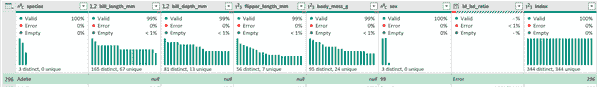

# 第二章：Excel Power Query 的初步步骤

在第一章中，表格被介绍为现代 Excel 分析的入口。第 I 部分的后续章节深入探讨了现代 Excel 工具包，特别是 Power Query。这个工具解决了 Excel 传统限制的许多问题，并提供了一个用户友好的低代码环境。

# 什么是 Power Query？

Power Query 是一种数据连接技术，允许用户在 Excel 内轻松连接、合并和优化来自各种来源的数据。最初作为附加组件引入，它已成为现代 Excel 的核心功能，显著简化了数据导入和清洗过程。Power Query 提供了一个用户友好的界面，用于执行诸如合并表格、转换数据格式和聚合信息等复杂数据操作，而无需高级编程技能。

# Power Query 作为 Excel 的神话破解者

分析师们扮演着神话破解者的角色，挑战假设，揭示真相。即使在 Excel 这样一个传奇的商业工具领域，也可能出现神话。然而，许多这些神话已经不再成立。Power Query 已成功驳斥了许多主张，将自己定位为 Excel 的终极神话破解者。接下来的部分将使用 Power Query 来反驳关于 Excel 的常见主张。

## “Excel 不具备可重复性”

这是一个常见的场景：你发现自己面临压力，面对紧迫的截止日期和过度干预的经理，试图修改上周报告。报告的原始创建者不在，让你感到困惑，不知道它是如何组装的。工作簿似乎是一团删除的列和改变的值的混乱，使得难以理解所需采取的行动。

计算中的可重复性允许用户通过相同的输入和过程始终获得相同的结果。当工作簿由于容易出错的步骤、复杂的计算或其他引入不确定性的因素而无法每次打开时都获得一致的结果时，它未能实现这一目标。

传统 Excel 中缺乏可重复性已成为该软件的一个重要批评点。这一关注点导致许多技术专业人士对完全使用 Excel 持谨慎态度，担心单个删除的列或硬编码的单元格可能会损害结果的完整性。

完全基于其过去的限制而彻底放弃 Excel 的决定是错误的。现在 Excel 通过 Power Query 提供了可重复性的解决方案。使用 Power Query，用户可以创建源数据的副本，应用一致的转换步骤，并在“已应用步骤”列表中记录每个操作。这种方法确保了可重复性，并消除了追踪数据清理操作的需要，解决了以前与 Excel 缺乏可重复性有关的问题。

## “Excel 没有真正的 null”

在关系型数据库中，表示未知或未指定数据的缺失或`null`值的概念是众所周知的。然而，Excel 缺乏保留`null`值的关键字，导致存储和处理方面的挑战。用户可能会采用不同的方法来表示 Excel 中的缺失值，比如将它们留空或硬编码为`NA`。这种差异使得难以识别真正未知值与实际等于零或有意留空的值之间的区别。

为了克服这一限制，Power Query 引入了一个专门的`null`值来表示缺失数据。这种增强功能促进了精确的数据分析、移除和替换缺失值，确保准确性和可重现性。

## “Excel 不能处理超过 1,048,576 行”

Excel 在处理“大数据”时常被批评存在局限性。批评者声称，由于其工作表最多只能容纳约一百万行的数据，Excel 在大数据时代表现不佳。

解决方案再次在于 Power Query，它可以轻松地导入和处理数百万行及更多数据。虽然 Excel 本身确实无法处理超过百万行的数据，但 Power Query 使用户能够在其编辑器中聚合和汇总数据，然后将结果加载到 Excel 工作表中。

要了解如何在 Excel 中超越所谓的百万行限制的引人注目演示，请查看分析顾问 Orlando Mézquita 在[分析五千万行](https://oreil.ly/wve_4)时使用 Excel Power Query 的这篇文章。

# Power Query 作为 Excel 的 ETL 工具

在技术世界中，许多术语乍看起来可能极为复杂。它们甚至可能被混乱的首字母缩写所掩盖。然而，仔细审视后，这些概念揭示出它们的简单性。

一个这样的术语是*ETL*，它代表“提取、转换、加载”。数据库管理员和数据工程师经常热烈地讨论他们的“ETL 管道”和“ETL 软件”。这可能会给人留下只有认证过的数据极客才能处理这些任务的印象。

Power Query 通过直接将其集成到 Excel 电子表格中，使 ETL 过程变得平民化。不要让技术纯粹主义者吓到你！ETL 的本质已经融入其名称中，并且可以使用 Excel 完成。

以下各节详细介绍了这个过程的逐步概述。要跟随进行，打开书中资源文件夹中的*ch_02*文件夹中的*ch_02.xlsx*。

## 提取

ETL 的初始步骤是从外部源“提取”数据。Power Query 具有连接到各种数据源的能力，超越了 Excel 工作簿的范围。以下是一些它可以连接到的数据源的示例：

+   文本和 CSV 文件

+   如 Oracle、Microsoft SQL Server 或 SQLite 等关系型数据库

+   SharePoint

+   XML、HTML 和 Web 数据

不过，对于这个演示，数据方便地位于 Excel 工作簿本身内。

要开始，从 *ch_02.xlsx* 的`sales`工作表中提取数据。在表内任何位置单击，然后转到“数据” → “获取和转换数据” → “从表/范围获取”，如图 2-1 所示。

###### 图 2-1\. 从表中提取数据

将数据放入 Power Query 的表格中的要求部分是我们为什么在第一章中专门讨论表格的原因。表格是访问现代 Excel 工具的重要门户。

尽管“连接并提取”已经存在于工作簿中的数据似乎有些奇怪，但这种方法是合理的，因为 Power Query 能够保留原始数据的原始形式。即使原始数据与分析在同一个工作簿中，建议也提取数据的子集（“E”中的“E”）以便进行进一步的分析。

## 转换

下一步是连接到这些数据并执行必要的转换（ETL 中的“T”）。

数据转换包括多种任务，以使数据可用，例如：

+   排序或过滤行

+   添加、删除、重命名或计算列

+   合并或重塑数据源

当你将表加载到 Power Query 中时，Power Query 编辑器会弹出，提供多种数据清洗和转换选项。这可能会令人感到有些不知所措，特别是如果你习惯了经典的 Excel 环境。然而，我们将在第一部分中逐步介绍这个程序。

你将在本书的后面学习如何执行多个数据清洗任务。现在，通过添加索引列可以实现一个简单的数据转换。要做到这一点，转到 Power Query 标签上的“添加列”，然后选择“索引列” → “从 1”，如图 2-2 所示。

###### 图 2-2\. 从 Power Query 添加索引列

## 加载

最后，在 Power Query 编辑器中，导航到主页选项卡，选择“关闭并加载”。此操作将把略有变化的数据提取加载到另一个 Excel 表格中，并显示在一个新的工作表中，如图 2-3 所示。

###### 图 2-3\. 从 Power Query 加载数据到 Excel 表格

祝贺你完成了一个完整的 ETL 作业：

+   你从 Excel 表格中提取了原始数据。

+   你使用 Power Query 编辑器转换了数据。

+   你把结果加载回了 Excel。

# Power Query 编辑器之旅

现在，你已经完成了一个非常简单的整个 Power Query ETL 过程的示例，让我们更详细地看看 Power Query 编辑器。为此演示，打开 *ch_02.xlsx* 中的`penguins`工作表。

要开始，将`penguins`表格加载到 Power Query 中。如果你需要关于如何操作的复习，请回顾前面的部分。生成的 Power Query 编辑器应该看起来像图 2-4。

###### 图 2-4\. Power Query 编辑器

请稍作停留，深入探索并欣赏你所处的独特环境。它与 Excel 的功能区界面相似，但作为一个独立的独立程序运行。接下来的部分将探讨其各种元素。

## 功能区菜单

在界面顶部，您会注意到一个功能区菜单，其设计紧随 Excel 熟悉的界面，如图 2-5 所示。

###### 图 2-5\. Power Query 功能区

您应该在功能区看到四个选项卡：主页、转换、添加列和视图：

主页

就像普通的 Excel 一样，主页选项卡包含了 Power Query 中最基本的操作，如选择行、删除列等。然而，Power Query 中的主页选项卡专注于基本的数据转换和清理任务，而不是普通 Excel 的格式设置功能。

转换

转换选项卡提供了更多的数据清理和转换选项。您将在接下来的章节中有机会尝试许多这些功能。

添加列

此选项卡专门用于通过各种方法创建新列。在“转换”中，您可以使用此选项卡向数据添加索引列。在第四章中，您将使用它来创建计算列。

视图

视图选项卡定制 Power Query 编辑器的显示。首先，在“布局”组中点击“公式栏”。此举将在数据集上方显示一个类似 Excel 的公式栏，如图 2-6 所示。

###### 图 2-6\. Power Query 公式栏

Power Query 公式栏中显示的公式可能与典型的 Excel 函数不同，因为它是用专为 Power Query 设计的 M 编程语言编写的。通过 Power Query 编辑器的点选接口调整查询时，底层的 M 代码相应地改变。这允许进行调试、定制或共享结果。

尽管公式栏的存在可能暗示掌握复杂的编程语言对于利用 Power Query 的能力至关重要，但这并不一定是真的。大多数日常任务可以通过主页选项卡和其他功能有效完成，无需编写 M 代码。本书专注于这些点选选项，使公式栏对我们的目的来说变得多余。

###### 注意

本书将不会使用 Power Query 编辑器中的公式栏进行未来的演示。您可以通过取消“视图”选项卡中“布局”组中的“公式栏”来隐藏它。

要开始在 Power Query 中编写自己的 M 代码，请首先查看高级编辑器。在 Power Query 编辑器的“查看”选项卡中，单击“高级编辑器”在“高级”组中打开此窗口。这个窗口会以单一的全面视图显示你的整个查询。

## 将注意力从功能区转移到编辑器左上角的查询列表上。在这里，你会找到导入的数据源，可以在之间切换查看。虽然这些数据源都存在于工作簿中，但请记住 Power Query 支持各种数据源，包括 *.csv* 文件、数据库、网页等。

要在特定查询上执行操作，请右键单击其名称，如`penguins`，将会显示一个包含各种选项的菜单，如 图 2-7 所示。这些选项包括重命名查询、删除查询等。

导入的数据

###### 图 2-7\. Power Query 中的查询列表

Power Query 提供了大量的右键选项，因此不要犹豫去探索和尝试它们。

## 现在，将注意力转移到占据编辑器大部分空间的组件：数据本身。与在 Excel 中可以自由操作数据不同，例如隐藏列或插入公式，Power Query 强制实施编辑限制。

图 2-9\. Power Query 中的应用步骤列表

要用警察乐队一首歌的歌词来表述，Power Query 努力观察和跟踪你对查询的每一步和动作。随意硬编码公式或随意隐藏列是不允许的。所有操作必须在 Power Query 的框架内以程序方式执行。

图 2-8\. Power Query 中删除列的操作

###### 查询

图 2-9\. Power Query 中删除列的应用步骤

考虑一个简单的任务，删除一个列。要从`penguins`数据集中移除`island`，只需右键单击列标签，选择“删除”，如 图 2-8 所示。

###### 

Power Query 详细记录每一个动作，包括删除，在显示的“应用步骤”列表中与你的数据一起显示。这确保了所有操作的透明性和可追溯性。

更加精确地说，这个删除操作在“已应用步骤”部分标记为第三步“Removed Columns”。初始步骤是连接到数据，称为源数据。第二步“Changed Type”涉及为表格设置数据类型。与 Excel 不同，Power Query 要求列中的每个值都必须是相同类型的。本书将主要依赖 Power Query 的自动数据类型转换。您可以在[Microsoft 的官方文档](https://oreil.ly/Yz5s1)中了解更多关于 Power Query 数据类型的信息。

通过单击“已应用步骤”列表中的任何步骤，您可以重新查看数据在特定时间点的表现。例如，如果单击“Changed Type”（在删除列之前的步骤），则`island`列将重新出现在您的编辑器视图中。

为了强化本章前面学习的内容，在仍然突出显示“Changed Type”步骤的数据集中添加一个从 1 开始的索引列。您将收到一条消息，确认您希望在查询中插入一个中间步骤，如图 2-10 所示。

###### 图 2-10\. 在 Power Query 中插入一个中间步骤

单击“插入”后，您会注意到“Added Index”被放置在“已应用步骤”列表中“Removed Columns”之前，尽管它是在后来的时间点添加的。这允许根据需求的演变或工作流程中添加新步骤轻松修改查询。

您可以对这些步骤执行各种操作，例如删除或重命名它们。假设您希望在查询中重新引入之前删除的`island`列。您有两个选择：要么单击“删除列”查询步骤左侧的 X 图标，要么右键单击同一步骤以访问一个菜单，该菜单允许您删除、重命名和重新排序步骤，以及其他任务。

###### 警告

尽管“已应用步骤”列表提供了灵活性，但它缺少 Excel 经典功能中珍贵的一个特性：撤销操作的能力。一旦删除了一个步骤，就没有内置的选项来撤销删除。因为大多数这些步骤可以轻松复制，通常手动重复过程与依赖撤销按钮一样方便。

## 退出 Power Query 编辑器

在编辑器中创建所需的查询后，现在是时候退出 Power Query 并返回常规的 Excel 工作簿了。本章前面提到，单击 Power Query 编辑器主页选项卡上的“关闭并加载”会将查询结果加载到 Excel 表中。

还有其他加载选项，您可以通过单击“关闭并加载”旁边的下拉按钮，然后选择“关闭并加载到”。现在您应该能够在图 2-11 中看到对话框。

###### 图 2-11\. Power Query 加载选项

您的第一个决定是将数据加载到表、透视表（这里称为透视表报表）、透视图或选择仅连接选项。当仅加载到连接时，您的查询结果将不会加载到 Excel 中，但查询本身将保持在 Power Query 编辑器中可访问。

如果选择将数据加载到工作簿中，您可以将其放置在新工作表或现有工作表中。

此外，您还可以选择将数据添加到数据模型中。这使您能够构建关系数据模型，并在工作簿中利用高级报表功能。在本书的 第二部分 中，您将介绍数据模型、Power Pivot 和 DAX。

选择练习的任何选项，然后单击确定。

## 返回到 Power Query 编辑器

若要在 Power Query 中恢复转换数据或更改加载查询的方式，请转到 Excel 选项卡上的数据选项卡，然后选择查询和连接。在窗口右侧出现的窗格中查找您的`penguins`查询。

您将看到 Power Query 报告此文件中的两个错误；这些将很快被识别并处理。

右键单击`penguins`，您将看到几个用于处理此查询的选项。要更改查询加载到 Power Query 的方式，请选择加载到。要返回到 Power Query 编辑器，请选择编辑，如图 2-12 所示。

###### 图 2-12\. 查询和连接选项

# Power Query 中的数据概要分析

到目前为止，我们已经强调了 Power Query 作为一个强大的 ETL 工具，旨在简化数据清理过程。然而，在不清楚数据“脏”的确切原因的情况下，着手清理数据集是一种不切实际的方法。

为了缓解这一挑战，Power Query 配备了一系列数据概要分析技术。本节将探讨数据概要分析在 Power Query 中的重要作用，强调其在优化数据质量中的重要性。

## 什么是数据概要分析？

数据概要提供有关数据特征的见解，例如缺失值、值频率和摘要统计信息。这些知识支持明智的决策和高效的数据转换。在概要分析过程中，请考虑以下问题：

+   数据有多精确？

+   是否存在明显的问题？

+   每个变量和观察的目的和测量是否清晰？

+   所有必要的数据是否都可用？是否存在空白？

+   在基于 Excel 的数据中，是否存在影响结果的公式错误？

+   数据是否已准确转录？

回答这些问题允许分析师评估数据的健康状况和可靠性，找出潜在问题，并决定数据清理、转换和分析策略。

## 探索数据预览选项

数据概要分析有点隐藏在 Power Query Editor 中。要访问它，请导航到功能区中的“视图”选项卡，并找到“数据预览”组，如图 2-13 所示。您可以逐个切换这五个选项来探索它们的功能。

###### 图 2-13\. Power Query 中的数据预览选项

### “等宽字体”和“显示空白”

前两个选项修改了数据在 Power Query Editor 中的外观：

+   “等宽字体”将数据呈现为固定宽度文本。

+   “显示空白”将显示数据中的任何前导或尾随空格

尽管这些选项很有用，特别是用于识别需要修剪的文本，但真正的数据概要分析潜力则在后续选项中。

### “列质量”和“列分布”

接下来，选择以下两个选项。每个列上方将显示一个框，提供有关数据的宝贵洞见，如有效值、错误值和空值的百分比。它还呈现了列中值的分布可视化。这些选项为数据的质量和分布提供了全面的概述，有助于有效的分析和决策。

#### 有效单元格是什么？

当 Excel 提到“有效”数据时，它仅意味着该值不为空且不包含任何错误。重要的是要注意，“有效”数据的这一定义不考虑数据的逻辑正确性或含义。因此，Power Query 可能会认为荒谬的数据是“有效”的。例如，看一下第`71`行的`sex`列，如图 2-14 所示。

###### 图 2-14\. Power Query 中的有效单元格是什么？

#### 缺失值

很明显，`99`不是`sex`列的有效值。这似乎是一个转录错误的结果，这些单元格错误地填充为`99`而不是缺失或`null`。要观察 Power Query 中真正的缺失值，请转到第 296 行，如图 2-15 所示。

###### 图 2-15\. 在 Power Query 中检查空值

在这里，您会注意到几个标记为`null`的条目，这是在 Power Query 中表示空值的正确方式。目前，“列质量显示”显示了每个这些列中少于 1%的单元格被分类为“空白”。但是，请记住，这些数据不包括错误转录的缺失值。

#### 单元格错误

要理解错误类别，请停留在第 296 行，并关注`bl_bd_ratio`列。此特定列在 Excel 中是通过将`bill_length_mm`列的值除以`bill_depth_mm`列的值计算得出的。然而，在这一特定行中，公式的分母为空，导致错误。通过单击“错误”旁边的空白处，可以验证其来源是`#DIV/0`错误，如 图 2-16 所示。

###### 图 2-16\. Power Query 数据分析中的单元格错误

此列中发现了两个这类计算错误，导致在 图 2-16 中看到的错误消息。可以通过多种方式解决此错误，包括编写一个基础的 Excel 公式来处理除以零的错误，或者通过过滤掉导致错误的行来解决。在 第三章 中，您将学习如何过滤行并执行其他行操作。

“列分布”选项显示数据分布的可视化，以及其他一些信息，如 图 2-17 所示。

###### 图 2-17\. Power Query 中的列分布

然而，这些功能都可以在“列轮廓”选项中找到，因此我们将在下一步重点关注这里。

#### 列轮廓

最后，选择“列轮廓”复选框，选择特定列，并在数据集下方导航到“列轮廓”输出，以获取详细洞察。例如，考虑`species`列，这是一个定性变量。此选择将提供该列内值的详细分解，包括显示每个值观察频率的可视化，如 图 2-18 所示。

###### 图 2-18\. 分析定性变量

对于像`bill_depth_mm`这样的定量变量，“列轮廓”输出将显示诸如平均值和标准偏差之类的其他度量，如 图 2-19 所示。

###### 注意

如果您对定性和定量变量不熟悉，可以将*定性变量*理解为“是什么类型？”而将*定量变量*理解为“多少？”或“多少个？”有关这些变量类型的深入探讨，请参阅我的书籍 [*进阶分析：从 Excel 到 Python 和 R*](https://www.oreilly.com/library/view/advancing-into-analytics/9781492094333)。在本书的 第 II 部分 中，您将学习维度和度量，这些概念类似于定性和定量变量。

###### 图 2-19\. Power Query 中的列轮廓

## 超过千行限制

如果你处理的数据集超过一千行，请确保在 Power Query 的数据分析中包含所有观察结果。要做到这一点，请点击编辑器底部并选择“基于整个数据集的列分析”，如图 Figure 2-20 所示。

###### 图 2-20\. 覆盖数据分析的千行限制

借助 Power Query 的数据分析功能，您能够：

+   快速发现格式错误的单元格。

+   确定哪些列包含缺失值。

+   可视化每个变量的分布

## 结束数据分析

当您在 Power Query 中完成数据分析后，只需点击“关闭并加载”即可返回到 Excel，而不对查询进行任何更改。请记住，在对数据进行任何更改之前，数据分析是检查数据*首要步骤*。为了减少混乱，本书的其余部分将保持数据预览选项关闭状态。

# 结论

本章通过使用 Power Query 作为 ETL 工具来揭开与 Excel 相关的常见神话。它还探索了 Power Query 编辑器和数据分析过程。现在，您已经准备好使用 Power Query 转换数据，这将是第一部分剩余部分的重点。

# 练习

对于本章的练习，使用 Power Query 探索一个包含计算机价格的数据集。在书的[附属库](https://oreil.ly/modern-analytics-excel-exercises)中的*exercises\ch_02_exercises*文件夹中打开*ch_02_exercises.xlsx*。执行以下操作：

1.  将数据作为表格加载到 Power Query 中。将查询命名为`computers`。

1.  向数据添加从 1 开始的索引列。

1.  将应用步骤列表中的上一步重命名为“添加唯一标识符”。

1.  拖放`Index`列，使其成为数据集中的第一列。

1.  使用 Power Query 的数据分析功能回答以下问题。务必调整列分析以处理整个数据集。

    +   数据集中计算机价格的范围是多少？

    +   数据集中的平均 RAM 量是多少？

    +   数据集中是否存在缺失值？如果有，位于何处？

1.  将查询结果加载到 Excel 透视表中。

解决方案位于同一文件夹中的*ch_02_exercise_solutions.xlsx*中。
