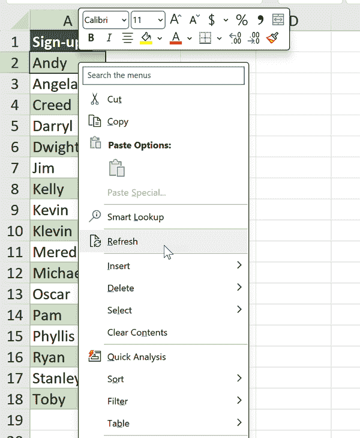

# 第三章：在 Power Query 中转换行

第二章 作为 Power Query 作为 Excel 的 ETL 工具的神话破解能力的介绍。在 第一部分 的本章及即将到来的章节中，您将有机会进行常见数据转换任务的实践。本章的重点是行操作。

数据清理通常涉及行操作任务，如排序、过滤和删除重复项。传统的 Excel 提供了这些任务的界面引导方法，但可能会很繁琐且难以复制。Power Query 提供了一个解决方案，通过使数据清理过程可审计和可重复，无需编码。要跟随本章的演示，请在书的存储库的 *ch_03* 文件夹中访问 *ch_03.xlsx*。

在此工作簿的 `signups` 工作表中，您的组织派对策划委员会一直在收集 RSVP，并希望最终列表按字母顺序排序，消除重复项、空白和印刷错误。委员会厌倦了每当有新数据添加时就手动排序和删除不必要的行。他们希望能轻松刷新和重复使用工作簿，以便更多人注册或安排新的派对时使用。

将此数据加载到 Power Query 中，将查询命名为 `signups`。在继续之前，捕获列 `A` 中的所有相关行，并确保您的表包括标题。

# 移除缺失值

如 第二章 中提到的，Power Query 提供了专用的 `null` 值来表示缺失的数值。`signups` 数据包含三个空值，可能会引起混淆。要消除它们，请在功能区的主页选项卡上导航至删除行 → 删除空行，如 图 3-1 中所示。

###### 图 3-1\. 在 Power Query 中删除空行

接下来，对列表按字母顺序排序。要执行此操作，请单击 `Sign-up` 列旁边的下拉按钮，您将找到与基本 Excel 类似的排序和过滤选项，如 图 3-2 所示。选择升序排序以按字母顺序排序列表。

您可能已经注意到此数据集中多次输入了 *Phyllis*。要去除重复项，请返回到主页选项卡，然后选择删除行 → 删除重复项。

###### 图 3-2\. 在 Power Query 中排序行

列表大多数情况下是干净的，除了一个拼写错误：“Klevin” 在第 9 行。仅仅删除空白或重复项无法捕捉到这种错误，突显了在数据管理中领域知识的重要性。Power Query 在标准清理任务中提供帮助，但某些情况需要对数据有更深入的理解。最后一步是通过过滤它从数据集中移除此拼写错误，如 图 3-3 所示。

###### 图 3-3\. 在 Power Query 中过滤误印

# 刷新查询

恭喜你按照这些步骤清理了派对策划数据。为了使结果更易于访问，将清理后的数据集加载到 Excel 中：在主页选项卡中，点击关闭并加载。

Power Query 提供的不仅仅是从 Excel 中繁琐且容易出错的点按数据清洗过程中解脱出来的途径；其真正的优势在于能够通过单击刷新来更新您的工作。要看到其效果，请在原始的 `signups` 表中添加两行数据。例如，我将插入一行空行和一行来自 Nate 的注册信息。

要重新运行查询，请导航到 Power Query 输出表，右键点击它，并选择刷新，正如图 3-4 中所示。

###### 图 3-4\. 在 Excel 中刷新 Power Query 结果

表格将自动更新，应用所有步骤到刷新后的数据。这个工作簿现在具备了一键可复制的数据清洗流程，适用于未来任何的报名表。

# 将数据拆分成行

你是否曾经遇到过在 Excel 中有一个用逗号分隔的项目列表，希望将它们分割成单独的单元格的情况？看一下显示在图 3-5 中的例子。你可以在 *ch_03.xlsx* 的 `roster` 工作表中找到这些数据。

###### 图 3-5\. 清理名单

这个数据集包含了按部门和姓名分类的项目报名。我们的目标是根据姓名和部门方便地对这些数据进行排序和筛选。在经典的 Excel 中，你可能尝试使用文本分列功能，但结果可能会很混乱和不理想，就像图 3-6 中展示的那样。

###### 图 3-6\. 使用文本分列将 RSVPs 拆分为列

Power Query 提供了一个方便的解决方案，用于分割数据以达到期望的结果。

首先，将 `roster` 数据导入到 Power Query 中并命名查询为 `roster`。在数据集中选择 `Signups` 列。在 Power Query 编辑器中，转到主页选项卡，并点击拆分列选项。从下拉菜单中选择按分隔符分割，如图 3-7 所示，以继续。

###### 图 3-7\. 使用分隔符拆分 Power Query

术语*分隔符*指的是数据中每个项目之间的字符。在这种情况下，分隔符是逗号，Power Query 可能会自动检测到它。如果没有，选择下拉列表中的逗号。接下来，点击高级选项。在这里，你将找到将文本拆分为行而不是标准列的隐藏选项，就像图 3-8 中显示的那样。点击行，然后选择确定。

###### 图 3-8\. 将文本转换为行

此查询即将加载，但还有最后一个任务要完成。要了解详细信息，请导航到 Power Query 编辑器功能区中的“视图”选项卡。在“数据预览”组中，确保“显示空格”已选中。关于 Power Query 的数据预览和分析功能的详细信息，请参阅 第 2 章。

在 `Signups` 列中看到了额外的空格，这是由逗号分隔名单时留下的遗留问题。要删除它们，请右键单击列标题，然后选择“转换” → “修剪”，如 图 3-9 所示。

###### 图 3-9\. 在 Power Query 中修剪空格

您现在可以关闭并加载结果到表中，如 图 3-10 所示：

###### 图 3-10\. RSVP 数据拆分为行

# 填充标题和单元格值

有时您可能会遇到数据集的部分内容错误地被误标记为 `null` 或其他原因导致缺失。这可能是由外部系统的格式问题或不良的数据存储实践所致。

本节展示了 Power Query 如何帮助修复缺失的标题和值。在下一个演示中，请参考 *ch_03.xlsx* 中的 `sales` 工作表。

## 替换列标题

企业资源规划（ERP）提取通常包含一行额外的填充了无关信息。在这个特定的数据集中，第一行在每列都标有 `###`，而实际的列标题可以在第 2 行找到。与其每周手动处理此问题，删除不必要的行，不如通过 Power Query 自动化清理工作。

将数据加载到 Power Query 中，并将查询命名为 `sales`，然后导航到主页选项卡，在“转换”组中，选择“将第一行用作标题”，如 图 3-11 所示。

###### 图 3-11\. 在 Power Query 中使用第一行作为标题

## 填充空白行

现在列标题问题已解决，是时候解决误删空白行的问题了。看起来 ERP 系统未能在每个类别的每个值上重复 `region` 标签，这在使用数据透视表或其他功能分析数据时可能会带来困难。要解决此问题，请选择 `region` 列，然后转到“转换”选项卡，在“任意列”组中，选择填充 → 向下。这可以在 图 3-12 中观察到。

###### 图 3-12\. 填充空白值

数据已成功清理。现在可以关闭并加载结果。

# 结论

Power Query 是清理数据行的强大工具，为排序、筛选、消除重复项和管理缺失值等任务提供了简化和高效的流程。第 4 章 将继续讨论此重点，将注意力转向列的转换。

# 练习

在本书的[配套存储库](https://oreil.ly/modern-analytics-excel-exercises)中的*exercises\ch_03_exercises*文件夹中打开*ch_03_exercises.xlsx*。它包含两个工作表。使用 Power Query 对数据进行操作和分析。

在*states*工作表上：

1.  从数据中删除`United States`行。

1.  填补`region`和`division`列中的空白。

1.  按`population`从高到低排序。

1.  将结果加载到一个透视表中。

在*midwest_cities*工作表上，将这些数据加载到每个城市单独占据一行的表格中。

在同一文件夹中可以找到一个已完成的版本，*ch_03_exercise_solutions.xlsx*。
