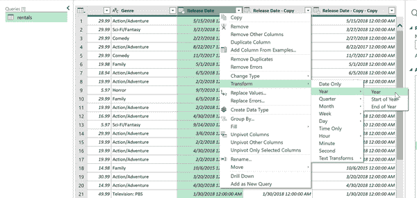
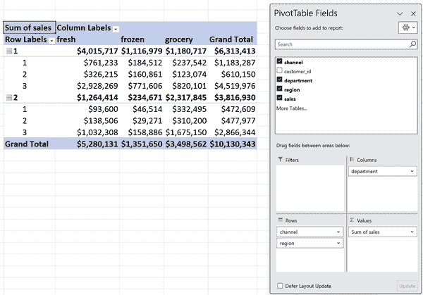

# 第四章：在 Power Query 中转换列

第三章侧重于熟悉对行操作；本章的重点转移到列上。本章包括各种技术，如转换字符串大小写、重新格式化列、创建计算字段等。要按照本章的演示操作，请参考书籍存储库中 *ch_04* 文件夹下 *ch_04.xlsx* 中的 `rentals` 表。继续加载 `rentals` 表到 Power Query 中。

# 更改列大小写

Power Query 简化了在小写、大写和“合适”大小写之间转换文本列的过程（每个单词首字母大写）。要测试此功能，请按住 Ctrl 键并同时选择`Title`和`Artist Name`列。接下来，右键单击其中一列，导航到转换 → 每个单词大写，如图 4-1 所示。


###### 图 4-1\. 在 Power Query 中更改文本大小写

注意，`Title`和`Artist Name`在冒号和逗号后缺少空格。要解决此问题，仍然选择这两列，右键单击任意列，并选择替换值。在替换值对话框中，搜索“`:`”，并用冒号后跟一个空格替换它，如图 4-2 所示。


###### 图 4-2\. 替换 Power Query 中的数值

接下来，对逗号应用相同的过程：用逗号后跟一个空格替换它们。

正如在第三章中展示的，Power Query 在应用步骤列表中捕获您对数据执行的每一步操作。与传统的查找和替换过程相比，这个功能极大地简化了文本更改的审计过程。

# 按列分隔

在第三章中，您学习了如何将逗号分隔的文本拆分为行。现在是时候对列执行相同的操作了。右键单击`Item #`列，并选择分列 → 按分隔符分割。在对话框中，从下拉菜单中选择空格，然后单击确定。再次，与传统的文本到列功能相比，这个过程提供了更好的用户友好性和更广泛的功能。

初始时，分隔的列标记为`Item #.1`和`Item #.2`。要重命名它们，只需在编辑器中双击列标题即可。与 Power Query 中的所有修改一样，这些更改都通过应用步骤记录，允许根据需要轻松地撤消或调整。

# 更改数据类型

在 Power Query 中，每列都被分配了特定的数据类型，这定义了可以对其执行的操作。在导入数据集时，Power Query 会自动尝试为每列确定最合适的数据类型。然而，在某些情况下，可以增强或调整此自动检测。

例如，考虑`UPC`列。默认情况下，它被分配为整数数据类型。然而，由于我们不预期在这一列上进行重要的数学操作，将其存储为文本更合适。要做到这一点，请单击`UPC`列旁边的数字图标，并将其数据类型更改为文本，如在图 4-3 中所示。

进行以下数据类型更改：

+   将`ISBN 13`列转换为文本。

+   将`Retail`列转换为货币。


###### 图 4-3\. 在 Power Query 中更改列数据类型

# 删除列

从数据集中删除不必要的列可简化处理和分析过程。选择`BTkey`列，然后按 Delete 键将其从查询中移除。如果以后决定包含此列，可以通过已应用步骤列表轻松检索，如第二章中所述。

# 处理日期

Power Query 提供了一系列复杂的方法来管理、转换和格式化日期。它便于修改日期类型，允许用户提取诸如月份编号和日期名称等组件，然后将这些组件存储在最合适的数据类型中。

要探索此功能，让我们以几种不同的方式将其应用于`Release Date`列。首先创建此列的副本：右键单击列并选择“复制列”。再执行此操作两次，以生成共三个重复日期列。

右键单击第一个复制的`Release Date`列，然后导航到 Transform → Year → Year，如图 4-4 所示。该列将被重新格式化，并将其类型更改为仅显示年份，而不是完整日期。



###### 图 4-4\. 在 Power Query 中转换日期列

从下两列中提取月份和日期数字。双击列标题，并分别重命名为`Year`、`Month`和`Day`，以反映重新格式化的数据。将您的结果关闭并加载到 Excel 表格中。

在 Power Query 中成功执行一系列面向列的数据操作，做得很好。您已准备好将此查询加载到 Excel 中。

# 创建自定义列

添加*计算列*是数据清理中的常见任务。无论是利润率、日期间隔还是其他内容，Power Query 通过其 M 编程语言处理此过程。

对于下一个演示，请前往*ch_04.xlsx*的`teams`工作表。此数据集包括自 2000 年以来每支大联盟棒球队的赛季记录。我们的目标是创建一个新列，计算每支球队在赛季期间的胜率。这个计算通过将胜利次数除以总胜负次数完成。

当然，第一步是将数据加载到 Power Query 中。然后从编辑器的功能区中，转到“添加列” → “自定义列”。将自定义列命名为`Wpct`，并使用以下公式定义它：

```
[W] / ([W] + [L])
```

Power Query 的 M 编程语言遵循类似 Excel 表格的语法，其中列引用用单方括号括起来。利用 Microsoft 的 IntelliSense，按下 Tab 键在键入这些引用时自动完成代码。此外，您可以从“可用列”列表中双击所需的列，将其插入到公式区域。

如果一切正确，对话框底部将显示绿色的复选标记，表明未检测到语法错误，如图 4-5 所示。


###### 图 4-5\. 创建胜率计算

创建此列后，立即在 Power Query 中更改其数据类型为百分比。

## 加载和检查数据

我们的新列已经计算并准备就绪。在 Power Query Editor 的功能区上，转到主页 → 关闭并加载 → 关闭并加载到，然后选择透视表报表和确定。从那里，您可以分析数据，例如计算每个团队名称的平均`Wpct`，如图 4-6 所示。


###### 图 4-6\. 在透视表中总结结果

## 计算列与度量值

需要注意的是，在透视表中显示的平均`Wpct`是本赛季胜率的简单未加权平均值。这意味着比赛较少的赛季（例如受到疫情影响的 2020 赛季）对计算有不成比例的影响。为了验证这一点，请将透视表中的`Wpct 平均值`与我们自己的 Excel 计算进行比较，如图 4-7 所示。


###### 图 4-7\. 看似出现的透视表计算错误

要解决此问题，一种方法是使用动态度量值进行实时聚合和根据分析上下文进行计算。这是通过诸如 Power Pivot 的数据模型和 DAX 语言实现的，详见本书的第 II 部分。

这并不意味着在 Power Query 中应完全避免计算列。它们易于创建且计算效率高。尽管如此，如果这些列可能导致误导性的聚合，建议选择 DAX 度量值。

# 数据重塑

在第 1 章中，您已经了解了“整洁”数据的概念，其中每个变量都存储在一个且仅一个列中。您可能还记得`sales`工作表作为不整洁数据的一个例子。幸运的是，Power Query 解决了这个关键的数据存储问题。首先，导航到*ch_04.xlsx*工作簿的熟悉`sales`工作表，将此表加载到 Power Query 中以启动数据转换过程。

目标是将所有销售列“unpivot”或“melt”成一个名为`sales`的列，以及这些销售的标签在一个名为`department`的列中。为此，按住 Ctrl 键选择前三个变量：`customer_id`、`channel`和`region`。右键单击并选择 Unpivot Other Columns，如图 4-8 所示。


###### 图 4-8\. 在 Power Query 中对数据集进行 unpivot 操作

默认情况下，两个未整理的列将被称为`Attribute`和`Value`。将它们分别重命名为`department`和`sales`。现在可以将查询加载到数据透视表中，并分析按渠道和地区的销售情况。基于这些重塑数据创建数据透视表的结果和好处见于图 4-9。



###### 图 4-9\. 在未整理的数据集上使用数据透视表操作

# 结论

本章探讨了在 Power Query 中操作列的不同方式。第 5 章进一步讨论了在单个查询中使用多个数据集的方法。您将学习如何合并和附加数据源，以及如何连接外部源如*.csv*文件。

# 练习

使用书本的[附属库](https://oreil.ly/modern-analytics-excel-exercises)中的*exercises\ch_04_exercises*文件夹中的*ch_04_exercises.xlsx*文件，在 Power Query 中练习转换列。对这份工作订单数据集执行以下转换：

1.  将`date`列转换为月份格式，例如将*1/1/2023*更改为*January*。

1.  将`owner`列转换为 Proper Case 格式。

1.  将`location`列拆分为两个单独的列：`zip`和`state`。

1.  重新整理数据集，使得`subscription_cost`、`support_cost`和`services_cost`合并为两列：`category`和`cost`。

1.  引入一个名为`tax`的新列，计算`cost`列值的 7%。

1.  将`zip`变量转换为文本数据类型，并将`cost`和`tax`列更新为货币格式。

1.  将结果加载到表格中。

要查看这些转换的解决方案，请参阅同一文件夹中的*ch_04_solutions.xlsx*。
