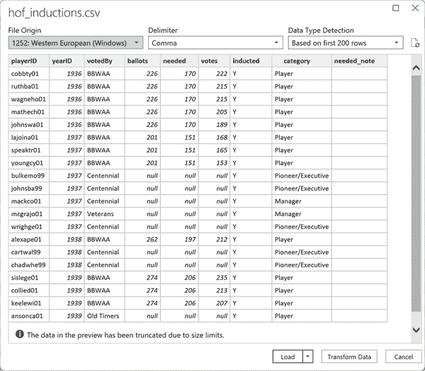
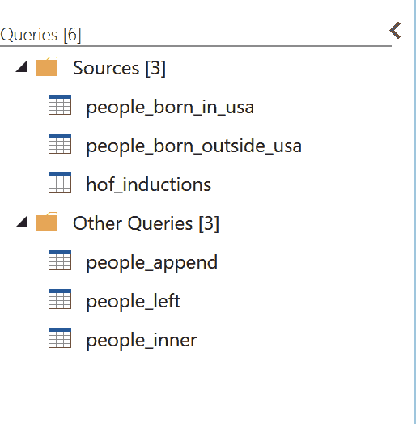

# 第五章：在 Power Query 中合并和追加数据

到目前为止，在第一部分中，您已经学习了使用 Power Query 转换单个表格的行和列的各种操作。然而，数据通常来自多个表格，包括 Excel 外部的数据源。在本章中，您将了解如何将多个文件合并成一个数据集。

由于本章重点是连接到外部文件而不是工作簿内部的表格，请通过打开一个新的工作簿开始跟进。

# 追加多个来源

数据通常以需要垂直堆叠文件的格式到达。例如，图 5-1 展示了一个常见情景，即销售数据分别以单独的表格呈现了一月、二月和三月的数据。在这些情况下，将它们合并为一个来源是很有帮助的。这使得例如计算第一季度的总销售额成为可能。

###### 图 5-1\. 追加数据集的简单示例

在 Power Query 中，追加操作有助于简化此过程。

## 连接到外部 Excel 工作簿

到目前为止，本书已经使用 Power Query 来操作工作簿内部的数据源。然而，Power Query 的实用性远不止于此。它大大扩展了与多种数据源的集成能力，特别是外部的 Excel 文件和 *.csv* 文件，这将是本章的主要关注点。该书配套资料库中的 *ch_05* 文件夹包含了从体育记者肖恩·拉曼的[大联盟棒球数据库](http://seanlahman.com)，直至 2022 赛季结束的数据集。

文件 *people_born_in_usa.xlsx* 和 *people_born_outside_usa.xlsx* 包含了有关出生在美国以及出生在美国以外的个人的信息。目标是使用 Power Query 将这两个文件垂直追加到一个表中。

要开始这个过程，请在功能区的数据选项卡上导航并选择获取数据 → 从文件 → 从 Excel 工作簿获取数据，如 图 5-2 所示。

###### 图 5-2\. 在 Power Query 中连接到 Excel 文件

首先连接到 *people_born_in_usa.xlsx*。请记住，Excel 工作簿可以包含多个工作表、命名范围、表格等内容。这意味着您需要精确选择要加载到 Power Query 中的工作簿实体。在这种情况下，我们希望加载`people_born_in_usa`表格，因此请点击导航对话框中搜索栏下方的该选项，如 图 5-3 所示。

###### 图 5-3\. 将外部 Excel 工作簿加载到 Power Query 中

在将数据加载到工作簿之前，您可以通过访问 Power Query 编辑器来清理或转换数据。可以通过选择“转换数据”按钮来完成此操作。但是，目前我将直接将数据加载到工作簿中。如果以后需要转换数据，则可以返回 Power Query 进行必要的调整。

要继续，请单击“加载”旁边的下拉按钮，然后在导航器对话框中选择“加载到”并选择“仅创建连接”选项。由于目标是稍后将此文件附加到另一个文件以进行联合分析，因此在此阶段无需将数据加载到单独的 Excel 表格中。

接下来，重复这些步骤以加载*people_born_outside_usa.xlsx*。同样，将查询加载为仅创建连接。现在，您已经仅将这两个文件加载为 Power Query 的连接。

在选定“数据”选项卡时，回到功能区的“查询与连接”中。在这里，您将找到列出为连接的`people_born_in_usa`和`people_born_outside_usa`。右键单击`people_born_in_usa`，选择“编辑”以打开 Power Query 编辑器，如图 5-4 所示。

###### 图 5-4\. 在“查询与连接”窗格中查看查询

## 附加查询

接下来，转到 Power Query 编辑器功能区的“主页”，并在“组合”组中单击“附加查询”下拉菜单。选择“附加查询作为新查询”继续，如图 5-5 所示。

###### 图 5-5\. 在 Power Query 中附加查询作为新查询

附加查询将多个表格的数据合并到现有查询中，从而扩展其大小，而“附加查询作为新查询”将它们合并到新查询中，保持原始表格不变。

###### 注意

您希望附加的查询应具有一致的数据结构，包括相同数量的列、列名和数据类型。否则，在附加之前可能需要执行一些数据转换步骤来对齐结构。

现在，您将看到一个附加对话框，询问要合并成单个表格的表格是哪些。选择`people_born_in_usa`和`people_born_outside_usa`，如图 5-6 所示。

###### 图 5-6\. 在 Power Query 中附加两个表格

干得好！您已经附加了两个表格，创建了一个名为`Append1`的新查询。为了清晰起见，将其重命名为`people_append`。关闭并加载您的结果到 Excel 表格中。生成的查询将有 20,370 行，代表了来自两个表格的行的合计。您可以使用 Power Query 的数据分析功能确认此计数，如第 2 章中所述。

# 理解关系连接

将所有个体级别记录附加到一个表后，下一步是将其与其他表格连接以获取进一步的见解。原始的 Lahman 数据库包括各种个体记录的表，包括击球记录、全明星比赛出场记录等。通过利用 `playerID` 列，这些表可以在 Power Query 中高效地互连。

要在当前工作簿中尝试这一功能，请使用 Power Query 连接到同一文件夹中名为 *hof_inductions.csv* 的数据集。该数据集包含了进入棒球名人堂的入选者信息。要继续，请在 Excel 中导航到 数据 → 获取数据 → 从文件 → 从文本/CSV。然后，定位并选择 *hof_inductions.csv*。由于 *.csv* 文件不支持像 Excel 那样的多个工作表或范围，它将立即显示数据，如图 5-7 所示。

###### 图 5-7\. 将 *.csv* 文件加载到 Power Query 中

将 `hof_inductions` 仅作为连接加载到您的工作簿中。

将所有相关数据加载到 Power Query 后，现在是时候找到一种方法，通过共享的 `playerID` 列，将 `people_append` 表中的信息与 `hof_inductions` 表中的信息整合在一起。

可以选择的一个方法是使用 Excel 查找函数，如 `VLOOKUP()`，来检索每个`playerID`值的对应姓名记录。我喜欢称呼 `VLOOKUP()` 为 Excel 的“胶带”，因为它可以将额外的列附加到数据集中。

但是如果 `VLOOKUP()` 是胶带，那么关系连接就是完整的焊接机。我这样说是因为 `VLOOKUP()` 主要设计用于 Excel 环境中的单条件查找。此外，它没有处理缺失值的系统化方法，这可能导致数据不一致。它还可能导致工作簿运行缓慢且不可靠，因为每次工作簿计算时都必须重新计算每个 `VLOOKUP()` 公式。

###### 注意

Excel 中的新 `XLOOKUP()` 函数被设计为 `VLOOKUP()` 的现代升级，解决了其几个限制。然而，与 Power Query 中的关系连接相比，它也不能完全解决所有问题。有关 `XLOOKUP()` 函数的更多信息，请参阅第十章。

Power Query 提供了更全面的解决方案。它允许根据多个条件合并数据，更高效地处理大型数据集，提供系统化的方法来处理缺失值，记录转换步骤以确保数据完整性，并且可以从各种来源获取数据。

这种方法在计算效率上也更高，因为合并只需创建一次，并且仅在查询刷新时重新评估。生成的合并表是一个平面、无公式的对象，更易于使用。这使得 Power Query 成为处理复杂数据集成和转换的**终极**工具。

以下部分探讨了两种最常见的关系连接类型：左外连接和内连接。

## 左外连接：类似于 VLOOKUP()

*左外连接* 保留来自第一个合并表的所有记录，并在第二个表中查找匹配的值。如果找不到匹配项，则返回`null`结果。此连接类型非常类似于`VLOOKUP()`，但有一个显著区别是使用`null`来指示缺失值，而`VLOOKUP()`会返回`#N/A`。

在小数据集上执行左外连接的结果示例如图 5-8 所示。

###### 图 5-8\. 左外连接示例

要开始连接，请返回到 Power Query Editor 并选择`people_append`表。接下来，转到功能区中的合并组，并选择“合并查询为新查询”，如图 5-9 所示：

###### 图 5-9\. 在 Power Query 中合并查询为新查询

要完成连接操作，请在合并对话框的第二个下拉菜单中选择`hof_inductions`。点击两个表中的`playerID`来标识它作为连接依据的列。最后，在第三个下拉菜单中确认左外连接为所需的连接类型。

您的合并对话框应如图 5-10 所示。

###### 图 5-10\. Power Query 中的左外连接

单击“确定”，您将在名为`Merge1`的查询中看到合并结果。双击该名称以重命名查询为`people_left`。

滚动到您的`people_left`数据集右侧。我们查询的数据看起来有点不寻常，特别是`hof_inductions`列，它在数据的每一行中都设置为表。这表示一个嵌套表，包含第二个表中与第一个表中给定行匹配的所有行。

单击`hof_inductions`标题旁边的按钮，然后单击“确定”以展开嵌套数据，如图 5-11 所示。

###### 图 5-11\. 展开左外连接的结果

您可以从此菜单中选择`hof_inductions`表中匹配记录的多个列。您还可以选择使用其源表的名称作为这些列的前缀。为简单起见，我们将使用默认方法加载所有带前缀的列。然而，在实际工作中，为了更简洁的查询，您可能更倾向于减少选择的列数。

将结果加载到 Excel 表中。

`people_left`表，就像原始的`people_append`表一样，有 20,370 条记录。这是因为左外连接包含`people`表中的所有记录，无论左侧是否有匹配记录。连接的结果类似于`VLOOKUP()`，为每位球员拉取相关的名人堂记录。它的优势在于一次性从`hof_inductions`表中获取所有记录，并且不会因为未匹配的记录而出错。

## 内连接：仅保留匹配项

相比之下，*内连接* 只保留在结果表中在两个表中都有对应匹配的记录，如图 5-12 所示。

###### 图 5-12\. 内连接示意图

按照左外连接的逻辑，右表中的`country_id`为 4 的条目将不会出现在结果表中，因为左表中没有对应的匹配。同样地，左表中`country_id`为 99 的条目也将因为同样的原因被排除在结果之外：它在右表中缺少对应项。要包含在结果中，必须在两个表中都找到匹配项。

这种方法非常有用，可以保留仅有完整记录并消除可能存在完整性问题的数据。按照这些规则进行内连接将生成比左外连接更少的行。

按照上述步骤，在 Power Query 中执行内连接。在编辑器中选择`people_append`，然后依次选择 主页 → 合并查询 → 合并查询为新查询。你的合并对话框应该类似于图 5-13。

###### 图 5-13\. 执行内连接的合并设置

你可以按照左外连接的方式扩展嵌套表中的匹配列，然后将查询重命名为`people_inner`。将得到的查询加载到一个表中。该表仅包含 323 条记录。

区分非常直接：内连接仅返回两个表中都有相应匹配的记录。并非所有的`playerID`实例都出现在`hof_inductions`表中，因为并非每位球员都入选名人堂，所以在合并表中缺少他们的`playerID`。

# 管理你的查询

在从各种来源和格式加载和合并数据方面做得非常好！随着你深入使用 Power Query，你的工作簿中可能会累积多个查询。管理和理解这些查询如何相互作用和共同运作将变得至关重要。

## 分组你的查询

在 Power Query 中对查询进行分组可增强组织性并通过对相关查询进行分类来简化维护工作。这种方法使得管理复杂的 Excel 项目更为容易。通过对查询进行分组，你可以清楚地区分基础查询和依赖于这些基础查询（如附加和合并）的查询。

要尝试它，请返回 Power Query 编辑器。

在编辑窗口左侧的查询列表下，按住 Ctrl 键选择源查询：`people_born_in_usa`、`people_born_outside_usa` 和 `hof_inductions`。右键单击，然后选择移动到分组 → 新建分组，如 图 5-14 所示。

###### 图 5-14\. 在 Power Query 中创建分组查询

当新建分组弹出窗口出现时，请将此分组命名为 Sources。点击确定。您现在将看到这三个来源被分组到查询列表中的一个文件夹中。`hof_append`、`hof_left` 和 `hof_inner` 也自动移动到名为其他查询的组中，如 图 5-15 所示。

###### 图 5-15\. 查看分组查询

## 查看查询依赖关系

查看查询依赖关系显示了查询之间的互相关联，有助于识别变更的影响并有效地管理依赖关系，确保复杂项目中的数据完整性并减少错误。要查看它，请转到功能区中的“视图”，然后选择“查询依赖关系”。它应该类似于 图 5-16。

在这里，您可以看到直接从原始数据源（如 *.csv* 文件）派生的查询，这些文件的位置，涉及合并或追加的来源，加载到工作簿中的来源等等。

###### 图 5-16\. 查看查询依赖关系

当您完成查看查询依赖关系图后，请单击关闭。

# 结论

本章重点介绍了在 Power Query 中合并和追加数据的过程以及理解结果的重要性。这些工具允许将各种文件（如 Excel 工作簿和 *.csv* 文件）集成到统一的数据集中。通过有效地连接表格，数据分析变得更加高效。

在 Power Query 中还有其他的连接类型，比如外连接，它会返回两个表中匹配的行。有关连接技术的详细概述，请参阅 [此 Microsoft Learn 文章](https://oreil.ly/MSsYz)。

第一部分 的主题是高效数据分析所需的干净数据的必要性。在建立了数据清理的坚实基础后，数据分析的下一阶段涵盖了使用 Power Pivot 进行建模和报告。这是 第二部分 的重点。

# 练习

练习：结合书中 *exercises\ch_05_exercises* 文件夹中的文件，使用这些文件可以获得 2013 年纽约市三大机场所有出站航班的信息。这些文件位于书的 [伴侣存储库](https://oreil.ly/modern-analytics-excel-exercises) 中。

1.  将*ewr-flights.csv*、*jfk-flights.csv*和*lga-flights.csv*文件追加到一起，包含从纽瓦克自由国际机场、约翰·肯尼迪国际机场和拉瓜迪亚机场的航班记录。将此查询命名为`flights`。（提示：在 Power Query 的追加菜单中选择“三个或更多表格”以加快此过程。）

1.  使用左外连接将此查询与*planes.xlsx*合并，然后再进行内连接。分别将查询命名为`flights_left`和`flights_inner`。每个查询返回多少条记录？（提示：根据`tailnum`合并表格。）

你可以在*ch_05_solutions.xlsx*文件的同一文件夹中找到解决方案。
