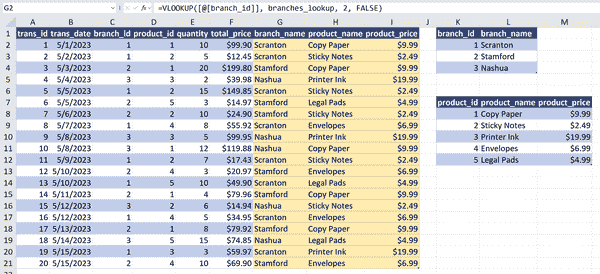
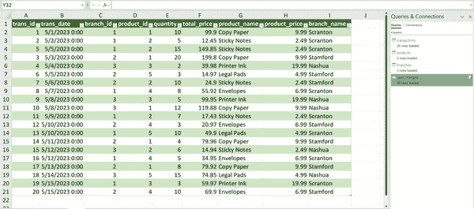
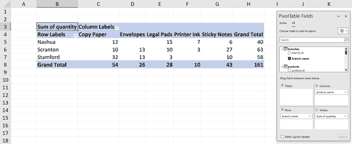
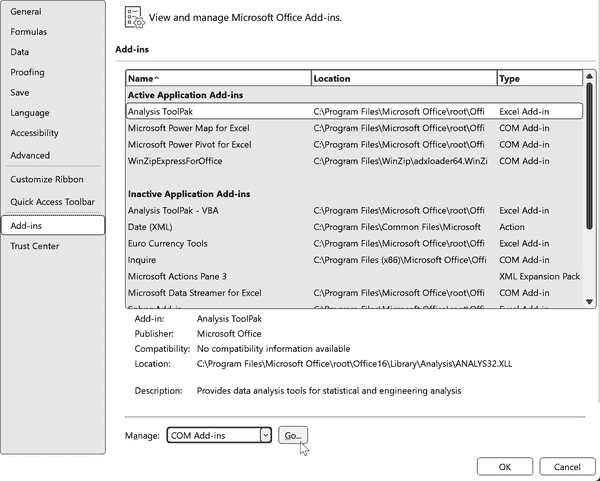
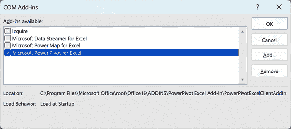
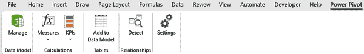

# 第六章：Power Pivot 的第一步

本书的 第 I 部分 专注于使用 Power Query 从各种来源提取数据并将结果转换为可操作的数据集。Power Query 并不作为独立的数据分析工具，而是作为在分析之前优化数据的中介。

要继续分析之旅，请关注 第 II 部分，该部分将专注于 Power Pivot，这是一个专门用于数据分析的工具。使用 Power Pivot，用户可以在数据源之间建立关系并生成高级指标，实现简化的数据分析和报告。

# 什么是 Power Pivot？

Power Pivot 是直接集成到 Excel 中的关系数据建模和分析工具。它使您能够在多个表格之间建立关系，并基于这些数据模型构建仪表板和报告。Power Pivot 提供了多种工具，用于创建强大的分析，显著增强了 Excel 在商业智能和报告方面的能力。

# 为什么要使用 Power Pivot？

要了解 Power Pivot 在 Excel 数据分析中的重要性，请从本书附带的仓库的 *ch_06* 文件夹中打开 *ch_06.xlsx* 文件。请注意，本章节不包括解决方案文件，因为所有步骤都已经为您完成。

在 `sales` 工作表中，有三个包含与销售、位置和产品相关的数据的表格。假设您希望为每个销售交易分配正确的产品和分支名称，以增强清晰度。

在 Excel 中，有几种方法可以实现这一点。一种流行的方法是使用 `VLOOKUP()` 函数从一个表格中提取值到另一个表格中，正如 图 6-1 所示。

###### 图 6-1\. 使用 `VLOOKUP()` 合并数据源

虽然 `VLOOKUP()` 函数经常被使用，但它也有其局限性。正如在 第五章 中指出的那样，查找函数的输出是静态的，仅仅增加现有表格而不是创建新的数据源。当逐列创建查找语句时，这种方法的扩展变得非常繁琐。

使用查找函数意味着 Excel 必须保留并筛选其内存中的所有查找数据。随着数据量的增长和执行更多查找操作，工作簿可能变得缓慢甚至冻结。我将这些超大和笨重的 Excel 数据集称为“Frankentables”。

在 第五章 中，您已经了解到了使用 Power Query 合并数据源的更高效方法。如果您使用了这种方法，如 图 6-2 所示，您将得到一个不带公式的新表格，但其维度与通过查找函数获得的早期结果相匹配（假设应用了左外连接）。

与查找函数相比，Power Query 更为灵活和高效，但并非每项任务都是最佳选择。类似于 `VLOOKUP()`，它将每个数据点整合到一个平面表格中，导致文件大小增加和记录重复。请记住，Power Query 的主要角色是数据*清理*，而不是数据分析。它缺乏创建年度累计计算或动态聚合等高级度量的功能。

###### 图 6-2\. 使用 Power Query 合并数据源

为了获得更强大、高效的分析体验，最好通过建立 Power Pivot 的关系数据模型来组合这些数据源。

表 6-1 总结了每种数据源组合方法的优缺点。

表 6-1\. 使用 XLOOKUP()、Power Query 和 Power Pivot 组合数据源的比较

| 工具 | 优点 | 缺点 |
| --- | --- | --- |
| XLOOKUP() |

+   易于理解

+   可在原生 Excel 中使用

|

+   输出灵活性有限

+   逐个查找列

+   占用内存多

|

| Power Query |
| --- |

+   控制输出更多

+   更容易审计和维护

|

+   关系连接可能令人困惑

+   将数据加载到 Power Query 需要额外的开销

|

| Power Pivot |
| --- |

+   可以创建复杂的数据模型

+   内置计算和聚合函数

|

+   设置数据模型复杂

+   学习曲线陡峭

+   对于许多 Excel 用户来说，关系建模可能不熟悉

|

# Power Pivot 和数据模型

Power Pivot 在数据模型内运行，建立和管理关系。这种方法允许从多个来源创建数据透视表，而无需物理合并它们。

利用 DAX 公式语言，Power Pivot 可以处理数据模型上的复杂计算，包括时间智能、排名、百分位等。

Power Pivot 的一个主要优势在于其有效管理多个数据源的能力。它不需要存储内存密集型的“Frankentable”，并根据需要计算 DAX 度量。然而，由于其陡峭的学习曲线，特别是处理未合并到单个表中的数据源时，掌握 Power Pivot 可能会很具挑战性。

在 *ch_06.xlsx* 的 `sales_pp` 工作表中，我已经创建了一个数据模型，包括三个销售数据源，并将结果加载到了一个数据透视表中。现在，我可以基于所有相关表格进行分析和计算，如图 6-3 所示。

###### 图 6-3\. 使用 Power Pivot 关系整合数据源

# Power Pivot PivotTable 中存在重复的表名称

在本书的 Power Pivot 示例中，每个表名在生成的透视表中显示两次：一次带有橙色圆柱形图标，一次没有。始终选择带有图标的表，因为它们直接连接到数据模型并包含添加的任何计量。如果您从外部源导入表到数据模型，而不是使用工作簿中的表，则可以解决重复表的问题。

要调整这些表之间的关系或添加像计算列或计量一样的功能，需要加载 Power Pivot 加载项。

# 加载 Power Pivot 加载项

要访问 Power Pivot，请在选项卡上的“文件”选项中导航到“选项”→“加载项”。在加载项窗口中，选择“COM 加载项”并单击“前往”，如图 6-4 所示。

###### 图 6-4\. 加载 Power Pivot 加载项

在 COM 加载项对话框中，选择“Microsoft Power Pivot for Excel”并单击“确定”，如图 6-5 所示。现在您已经准备好使用 Power Pivot 了。

###### 图 6-5\. 选择 Power Pivot 加载项

检查选项卡上的新 Power Pivot 选项卡，如图 6-6 所示。

###### 图 6-6\. 选项卡上的 Power Pivot 加载项

# Power Pivot 加载项简介

选项卡中的 Power Pivot 提供了创建和维护数据模型及其相关功能的各种选项。让我们逐个查看这些选项，提供一个高级概述。

## 数据模型

在 Power Pivot 中选择“管理”将打开一个专门的界面，展示数据模型中的表。它允许您可视化这些表之间的关系并提供其他功能。花些时间探索这个编辑器，在完成后简单关闭即可。随着第 II 部分的后续章节的进行，您将获得在此界面中操作的额外经验。

## 计算

在“Power Pivot”选项卡的“Calculations”组中，您可以创建计算度量和关键绩效指标（KPIs），这些内容我们将在第 II 部分的后续章节中详细介绍：

计量

Power Pivot 中的计量使用 DAX 语言执行计算，聚合数据并进行高级数据处理和分析。它们聚合数值，计算总数、平均数和百分比，并且对于高级 Excel 分析至关重要。

KPIs

KPI 是一个可衡量的值，用于说明公司或组织在实现其主要业务目标方面的效果。KPI 对于评估是否达到目标、监控进展并指导决策过程至关重要。Power Pivot 允许用户在基于透视表的仪表板和报告中创建和显示 KPI。

## 表

Power Pivot 的这一部分允许您将工作簿表格导入数据模型。然而，建议通过 Power Query 导入数据，如第七章所讨论的那样。Power Query 提供了连接到各种数据源的功能，例如外部工作簿和*.csv*文件，涵盖在第 I 部分，并且它还可以在创建数据模型之前进行数据清洗。

## 关系

此功能可以自动识别和创建数据模型内表格之间的关系。虽然这是一个有价值的工具，在掌握了本书涵盖的基础知识之后值得探索，但至关重要的是要有足够的理解能力，以便判断数据模型是否已经准确构建。因此，我们的重点将放在手动创建关系上，而不是依赖于这个自动选项。

## 设置

这些设置增强了数据模型的计算性能，并揭示了潜在的问题。深入使用超出了本书的范围。

# 结论

本章揭示了 Power Pivot 的能力，即从多个来源简化数据，而无需将其组合成一个表，使其成为解决“Frankentables”问题的解决方案，就像 Power Query 一样打破了常见的 Excel 神话。尽管 Power Pivot 的功能对传统的 Excel 用户来说可能显得令人畏惧，但其能力是无与伦比的。

第 II 部分的后续章节将更深入地探讨 Power Pivot，研究数据模型的创建和分析的复杂性。Power Pivot 简化了发现洞见、做出明智决策和在 Excel 中制作复杂分析的过程。

# 练习

要检查您对本章涵盖的概念的理解程度，请回答以下复习问题：

1.  Power Pivot 加载项的目的是什么，它可以让您做什么？

1.  解释 Power Pivot 中数据模型的角色及其在数据分析中的重要性。

1.  在 Power Pivot 中，DAX 度量和关键绩效指标的基本作用是什么？

1.  在组合数据源方面，将 Power Query 连接与 Power Pivot 关系进行比较。

1.  使用类似`VLOOKUP()`或`XLOOKUP()`的查找函数来合并 Excel 中的表格有哪些缺点？

关于这些问题的示例答案可以在书的[伴侣存储库](https://oreil.ly/modern-analytics-excel-exercises)的*exercises\ch_06_exercises*文件夹中找到。
