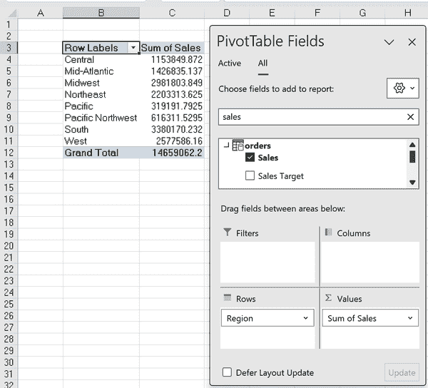

# 第七章：在 Power Pivot 中创建关系模型

第六章 介绍了 Power Pivot 作为处理来自多个来源的数据时的有效工具，尤其是数据分析和报告。本章演示了如何使用 Power Pivot 进行关系数据建模。

# 连接数据到 Power Pivot

如 第六章 所示，数据模型是 Power Pivot 的基础，有助于有效的数据计算和分析的表关系管理。Power Pivot 使用直观的拖放界面简化了这项任务。本章深入讨论了数据模型，使用 *ch_07.xlsx* 文件。该文件包含了分析社区经常引用的零售销售数据集，位于书籍资源的 *ch_07* 文件夹中。

在 第六章 的示例中，数据模型是预定义的。在本章中，我们需要手动定义它。

虽然通过 Power Pivot 直接连接到数据源是可行的，但建议首先通过 Power Query 进行数据通道。这种方法为需要时建立这些表上的任何重复数据清理程序提供了一个便捷的平台。

要开始，请使用数据 → 从表/范围导入`orders`表到 Power Query。跳过任何数据转换步骤，然后在主页选项卡的关闭并加载 → 关闭并加载到中进行操作。

要将此查询加载到 Power Pivot 中，请选择将数据创建为仅连接，然后选择“将此数据添加到数据模型”，如 图 7-1 所示。


###### 图 7-1\. 从 Power Query 加载查询到 Power Pivot

遵循这些步骤，可以使查询在 Power Pivot 中用于数据建模，但不会出现在单独的工作表中供检查。需要注意的是，Power Pivot 的主要目的是将此表与其他表关联起来，构建 DAX 度量等功能。直接将数据加载到工作簿中会掩盖这些功能。

对`returns`和`users`表重复执行这一过程，确保你的工作簿中包含三个仅连接的查询，并将其添加到数据模型中。

# 创建关系

在 Power Pivot 中，表之间的关系优化了数据分析，允许创建复杂的模型，而无需传统繁琐的数据合并工作。这种方法增强了一致性，减少了冗余，并简化了数据集管理。通过这些连接，用户可以实现动态和交互式的数据探索，提升 Excel 的分析能力。

要在`orders`、`returns`和`users`表之间建立关系，请导航到功能区上的 Power Pivot 选项卡。接下来，选择“管理”并选择视图组下的“图表视图”。在图表视图中，将显示三个表及其各自的列名，如 图 7-2 所示。


###### 图 7-2\. Power Pivot 编辑器中的图表视图

如果您的表格不像图 7-2 中显示的顺序一样，不要紧。我们将建立这些表格之间的关系，这些关系将不受图表视图中的排列顺序影响。一旦通过这些关系了解了表格的内容，我们会将它们可视化为更一致和高效的布局。

要创建第一个关系，请先选择`orders`表。然后，在 Power Pivot 的设计选项卡中，转到“关系”组下的“创建关系”并单击，如图 7-3 所示。


###### 图 7-3\. 在 Power Pivot 中创建关系

要在 Power Pivot 中的`orders`和`returns`表之间建立关系，请从下拉菜单中选择`returns`表。在两个表格中突出显示`Order ID`列。完成过程，请单击“确定”，如图 7-4 所示。


###### 图 7-4\. 在`orders`和`returns`之间创建关系

类似于`VLOOKUP()`函数，数据关系基于表格之间的共同列。这里，共享列是`Order ID`。设置此关系并单击“确定”后，将显示连接两个表格的线条，如图 7-5 所示。


###### 图 7-5\. 在`orders`和`returns`之间已创建关系

要在数据模型中建立最终关系并连接所有三个表格，您可以使用同时存在于`orders`和`users`中的`Region`字段。与使用“创建关系”选项不同，更有效的方法是直接将`Region`字段在两个表格之间拖放。此操作将创建所需的关系，如图 7-6 所示。


###### 图 7-6\. 拖放以在`orders`和`users`之间创建关系

# 识别事实表和维度表

创建全面的数据模型后，一个不错的下一步是识别其事实表和维度表。*事实表*通常包含适合计算的定量数据，如平均值、最小值和最大值。另一方面，*维度表*包含提供事实表中测量内容背景的描述性数据。

例如，`orders`表包含多个可测量的数量，如销售额、利润和销售单位，可以对其进行求和、平均值等操作。这些数据代表您正在分析的业务或流程的核心指标。这些定量数据的存在表明这是一个事实表。

事实表通常缺乏对数据解释至关重要的上下文信息。例如，对于`orders`表，了解与公司每个区域相关的经理可能是有用的。`users`表作为维度表，因为它提供描述性上下文；具体来说，指出每个区域由哪个经理负责。维度表在切片、切块和深入了解数据方面发挥着至关重要的作用。

## 安排图表视图

在现实场景中，数据模型中常见的是一打或更多的表。正确组织图表对于用户有效理解数据至关重要。

一个有用的技术是将事实表放在图表的中心，并用维度表围绕它。这种视觉排列有助于理解表之间的关系和依赖性。要使用当前数据实现这一点，请点击并拖动`returns`和`users`表，使它们位于`orders`表的两侧，如图 7-7 所示。


###### 图 7-7\. 在图表视图中查看数据模型

###### 注

在数据模型中，当一个事实表位于中心，并被维度表包围，如图 7-7 所示，这种安排被称为*星型模式*。星型模式是数据模型设计中的基础概念。其名称来源于模式的视觉表示，其中事实表位于中心，维度表向外辐射，类似星星的射线。

## 编辑关系

若要修改 Power Pivot 中定义的关系，您有几个选项。首先，您可以右键单击图表视图中的任何关系线，选择“编辑关系”，重新访问对话框，在那里您可以修改相关的表和列。其次，您可以通过右键单击关系线并从菜单中选择来暂时禁用或删除关系。

第三，您可以从集中位置管理数据模型中的所有关系。要做到这一点，请导航到功能区上的“设计”选项卡，然后单击“管理关系”。这将提供您数据模型中所有关系的全面视图，如图 7-8 所示，使您能够进行必要的调整。


###### 图 7-8\. 在数据模型中管理关系

“管理关系”对话框—如图 7-8 所示—提供了每个关系的基数和过滤方向的洞见。这些概念将在本章后面进一步探讨。

# 将结果加载到 Excel

一旦建立了数据模型，下一步是将结果转移到 Excel 中。这可以通过在 Power Pivot 编辑器的“主页”选项卡中导航，然后从数据透视表下拉菜单中选择一个选项来实现，如图 7-9 所示。


###### 图 7-9\. Power Pivot 加载选项

Power Pivot 提供了各种配置选项，用于将数据透视表加载到工作簿中。这些选项通常涉及数据透视表和数据透视图，因为 Power Pivot 通常用于创建基本的仪表板和报告。最终选项“扁平化数据透视表”会删除所有小计，并将数据以表格化、非嵌套的格式显示。

选择数据透视表选项。在“创建数据透视表”对话框中单击“确定”，将其插入到新工作表中。您现在应该有类似于图 7-10 的内容。


###### 图 7-10\. 由 Power Pivot 生成的数据透视表

现在，将`users`表中的`Region`字段拖到数据透视表的行区域。接下来，将`orders`表中的`Sum of sales`放置到值区域。数据模型将立即利用这些表之间的关系，特别是共享的`Region`值，准确执行计算。您可以在图 7-11 中查看结果。



###### 图 7-11\. 从多个表源的数据透视表

结果显示`Sales`字段舍入到三位小数，这是不寻常的，并且格式不清晰显示货币，使其难以阅读。可以在工作表或数据透视表中调整这些数字，但是持久修复方法是在 Power Pivot 数据模型中格式化数据。要做到这一点，请返回到功能区中的 Power Pivot 选项卡，然后单击“管理”。

在 Power Pivot 主页选项卡上，在“查看”组中单击“数据视图”。在数据视图底部选择`orders`工作表选项卡，以访问和操作此表。然后，单击`Sales`列，并将其格式调整为货币格式，同时启用千位分隔符，如图 7-12 所示。


###### 图 7-12\. 在 Power Pivot 中格式化列

欢迎在此处对源数据进行任何其他格式调整。

退出 Power Pivot 后，增强效果将清晰地显示在数据透视表中，如图 7-13 所示。

本书将继续对 Power Pivot 中列的格式进行更改，而不一定要明确地按照说明进行。


###### 图 7-13\. 数据透视表中格式化列的结果

# 理解基数

在 Power Pivot 中，当数字不按预期聚合或特定字段由于数据模型关系中的问题而无法使用时，通常会出现问题。这些问题通常源于对数据模型结构及其基数的不完全理解。让我们深入探讨这些要素。

较早的部分强调了在 Power Pivot 中创建关系时共享字段的重要性。每个表中唯一记录的计数在确定数据模型中关系功能的运作方式方面起到关键作用。*基数* 是指一个表中与另一个表中条目相关的数量。

## 一对一基数

一个 *一对一* 的关系代表基数中最简单的形式，其中一个表中的每个条目唯一对应于另一个表中的单个条目。

考虑数据模型包含两个表的情况：`product_details` 和 `supplier_details`，如 图 7-14 所示。


###### 图 7-14\. 一对一关系示例

在 图 7-14 中，每条记录由唯一的 `Product ID` 标识，构成了两个表之间的关系基础。

尽管这种结构可能很有用，但通常并不是最有效的。合并表格可以最小化冗余，减少维护工作，并提高性能。作为 Excel 中数据建模工具的 Power Pivot，在实际数据模型中没有一对一基数的选项，突显了其应用的局限性。相反，Power Pivot 被调优用于一对多关系。

## 一对多关系

一个 *一对多* 的关系表示一个表中的多个记录对应另一个表中的单个记录。考虑 图 7-15 中的示例。


###### 图 7-15\. 一对多关系示例

在这种模型中，来自一个表的客户可以在另一个表中拥有多个相关记录，例如订单。通过将相关记录存储在单独的表中，并通过每组的单个项目连接它们，这种方法减少了数据冗余，简化了更新和查询，并确保了数据完整性。这种高效的方法对于构建可扩展、可维护的数据库至关重要，准确捕捉业务运作的复杂性。

## 多对多关系

在两个不同表的实体能够形成多个连接的情况下存在 *多对多* 的关系。像 Power Pivot 这样的工具不直接支持这些关系。管理这些关系的常见方法是通过使用 *桥接* 或 *连接* 表。

考虑在零售设置中跟踪客户在多个促销活动中的购买情况，例如 图 7-16。


###### 图 7-16\. 多对多关系示例

在本例中，每位客户和活动仅列出一次，表明每位客户可能在每个促销活动中购买多次。为了管理这种复杂性，我们引入了一个桥接表，用于映射哪些客户参与了哪些促销活动，如图 Figure 7-17 所示。


###### 图 7-17\. 多对多桥接表示例

这张表简化了多对多关系，展示了每位客户在特定促销活动中的参与情况。

## 为什么基数很重要？

基数在数据建模中起着至关重要的作用，确保数据的准确性和一致性。在一对多关系中，确认每个“一”实体与唯一对应的“多”实体，以及反之，尤为重要。

虽然 Power Pivot 不区分一对一和一对多关系，但掌握这一概念有助于提升 Power BI 中数据模型的性能，后者确实关注这些区别。有关深入了解 Power BI 关系，请参阅 [Microsoft 的文档](https://oreil.ly/fB8-G)。

掌握各种基数，如一对一、一对多和多对多，在所有数据建模工具中都至关重要，不仅限于 Power Pivot。虽然 Power Pivot 强调一对多关系，但理解所有基数确保了组织化数据、保持完整性和平滑的工具集成。这种洞察力对故障排除和与数据同行有效沟通至关重要。简言之，对这些原则的深入理解为适应多样化数据景观提供了灵活性。

# 理解过滤方向

作为关系数据模型，Power Pivot 通过利用公共字段简化跨多张表的数据分析。调整这些字段上的过滤器会影响相关表，体现了*过滤方向*的概念，这与基数密切相关。

在此工作簿的图表视图中，通过 `Region` 字段连接 `users` 和 `orders` 表的关系显而易见。仔细观察表示这种关系的线条，可以看到一个小箭头指向从 `users` 到 `orders`，如图 Figure 7-18 所示。


###### 图 7-18\. `users` 到 `orders` 的过滤方向

###### 注意

在图 Figure 7-18 中看到的星号表示表之间一对多关系中的“多”一侧。这种视觉表示快速展示了表之间关系的本质和基数。

箭头指示了过滤效果从一张表流向另一张表。对左表应用过滤会影响右表，但反之则不成立。

## 用用户筛选订单

要了解通过`users`表筛选`orders`的影响，首先将数据模型中的透视表插入工作簿中。将`users`表中的`Region`字段添加到筛选区域，将`orders`表中的`Sum of Sales`字段添加到值区域。例如，在调整`Region`字段时，选择中心，透视表将展示中心地区的销售总额，如图 7-19 所示。


###### 图 7-19\. 使用`users`表筛选`orders`

这种现象的技术术语是筛选“传播”，从`users`表传播到`orders`表。这是创建筛选时的预期行为，也是您可能已习惯的行为。

## 通过订单筛选用户

现在考虑使用`orders`表中的`Region`字段作为筛选区域和`users`表中的`Manager`字段作为行区域的透视表。

在对中心地区进行筛选后，发生了一些有趣的事情：数据保持完整，没有记录被省略。这在图 7-20 中有所体现。


###### 图 7-20\. 使用`orders`表筛选`users`

这带来了一个问题：为什么应用于`orders`表的筛选不影响`users`表？鉴于 Chris 是中心地区唯一的经理，他不应该是返回的唯一经理吗？答案在于筛选方向的原则。

## 筛选方向和基数

在 Power Pivot 中，筛选方向取决于关系类型。在一对多关系中，筛选从“一”方向到“多”方向。例如，`users`表可以影响`orders`表，但反之则不行。这种方法提高了性能，因为从记录较少的一侧向记录较多的一侧进行筛选更为高效。

## 从设计到实践的 Power Pivot 应用

爵士吉他手 Irving Ashby 曾将节奏吉他比作蛋糕中的香草：“你尝不出它的味道，但当它被遗漏时你会知道。”数据模型中的筛选方向正是如此。通常情况下，它在背景中悄然运行，但当出现问题时，其缺失将变得显而易见。

通过对数据模型方面的基本了解，如筛选方向和基数，我们现在可以深入探讨高级功能。探索计算列和层次结构将进一步完善数据模型，增加灵活性和功能性。

# 在 Power Pivot 中创建列

在第四章中，您已经了解了如何在 Excel Power Query 中创建计算列。现在，让我们深入探讨在 Power Pivot 中执行相同任务的时间和方式，同时考虑每种方法的优缺点。

## Power Query 与 Power Pivot 的计算方法对比

Power Query 和 Power Pivot 是具有互补作用的不同工具，两者都可以生成计算列。要确定使用哪一个，考虑以下几点：

+   在准备阶段使用 Power Query 进行数据清洗和转换。它非常适合一次性任务，如合并字段或更改数据类型，在将数据加载到 Power Pivot 之前通过简化数据来优化模型。

+   使用 Power Pivot 进行高级分析，如动态计算或建立表之间的关系。这些操作在数据加载后完成，可以增强报告和仪表板。然而，过度使用可能会增加文件大小并降低性能。

遵循这些准则，您可以最大化 Power Query 和 Power Pivot 的能力，确保根据数据的状态和处理要求进行最佳的计算列创建。

###### 提示

尽管这些经验法则很有帮助，但确定是在 Power Query 还是 Power Pivot 中创建计算列的最佳方法是尝试使用两种工具，看哪一种最适合您的需求。

## 示例：计算利润率

返回到 Power Pivot 编辑器。在数据视图中，选择`orders`表格。

创建一个名为`Profit margin`的计算列。滚动到表的末尾，在“添加列”内部点击以命名列为`Profit margin,`，然后按图 7-21 中显示的利润率公式（`=orders[Profit]/orders[Sales]`）添加。


###### 图 7-21\. 创建利润率计算列

您的计算列应该像这样：

```
orders[Profit] / orders[Sales]
```

请注意，与 Excel 表相比，您必须手动输入对表内其他列的引用，而不能通过鼠标点击或键盘击键来选择它们。

这是您首次使用 DAX 编程语言管理 Power Pivot 中数据模型。您会注意到，单独列的引用方式与基本 Excel 表的结构化列引用非常相似。您可以在数据视图中将新列格式化为百分比。

要验证此计算，将数据模型加载到新的数据透视表中。将`Customer Segment`拖到行部分，将`Average of Profit Margin`拖到值部分。为了交叉检查准确性，还需将`Sum of Profit`和`Sum of Sales`添加到值部分。

当按照图 7-22 手动计算利润率时，可能会发现与数据透视表值相比存在差异。


###### 图 7-22\. 检查利润率计算

问题出在`Profit margin`计算列计算的是单个利润率的基本平均值，而不考虑总利润和总销售额的聚合。要进行准确的利润率计算，需要动态和即时计算，这不能仅通过计算列来完成。而是需要使用 DAX 度量值，这将在第八章和第九章中广泛讨论。

目前，重要的是记住，在 Power Pivot 中，当存在可能对结果进行聚合时，不应使用计算列。这个问题类似于在 Power Query 中使用计算列时，当进行聚合时可能会产生失真。

在数据模型中，有些情况下计算列确实是合适的选择。其中一个例子是使用`SWITCH()`函数，下面的部分将详细探讨这个例子。

## 使用`SWITCH()`重编码列值

`SWITCH()`函数非常有价值，可用于应用条件逻辑来重新分配值。由于每一行都是独立评估的，通常结果不会被聚合，因此更适合将`SWITCH()`的结果保存为计算列，而不是度量。

举例说明，假设您想要将数字 1、2、3 和 4 分别分配给`Consumer`、`Corporate`、`Home Office`和`Small Business`四个部分。在找不到匹配项时，您希望将值重新编码为`Unknown`。首先在 Power Pivot 中的`orders`表中添加名为`Segment number`的新计算列，如图 7-23 所示。


###### 图 7-23\. 使用`SWITCH()`函数创建`Segment number`列

请记住，数据模型表中某列的所有值必须具有相同的数据类型。因为`Segment number`包含字符串`Unknown`，因此将其他值（1、2、3、4）转换为字符串以保持一致性是非常重要的。

将更新后的数据模型加载到新的 PivotTable 中，或者刷新现有的 PivotTable，以在分析中使用这个新列。例如，图 7-24 总结了按重新编码的段号而不是原始类别进行的销售情况。


###### 图 7-24\. PivotTable 中使用的`SWITCH()`结果

# 创建和管理层次结构

层次结构在我们生活的许多方面起着关键作用。以我撰写本书时的位置为例：俄亥俄州克利夫兰市，美国。这可以组织成一个层次结构，从最广泛的类别（国家：美国）开始，然后是更具体的类别（州：俄亥俄州），最后是最具体的位置（城市：克利夫兰）。将这样的层次结构集成到数据模型中，简化了数据分析和探索的过程，使得可以在不同详细级别上进行更有效的检查。

## 在 Power Pivot 中创建层次结构

让我们在数据模型中创建基于产品的层次结构，包括`产品类别`、`产品子类别`和`产品名称`。要做到这一点，请导航到图示视图。按住 Ctrl 键选择所需的层次顺序中的维度（例如，最上面是`产品类别`）。选择完成后，右键单击并选择“创建层次结构”。为层次结构分配一个名称，例如`产品层次结构`，如图 7-25 所示。


###### 图 7-25\. 在图示视图中看到的层次结构

在图示视图中，根据需要可以轻松添加、修改或删除数据模型中的层次结构。目前，将数据加载到数据透视表中以查看其运行情况。

## 在数据透视表中使用层次结构

关闭 Power Pivot 后，返回您的数据透视表。将`产品层次结构`放置在行部分，将`销售总额`放置在值部分。您将观察到，在数据透视表中，无法单独使用层次结构中的三个维度；它们只能作为层次结构的一部分使用。

现在，您可以单击任何产品类别左侧的小加号，以便在子类别级别和最终单个产品名称级别进入该类别，如图 7-26 所示。


###### 图 7-26\. 在数据透视表中上下钻取

切换按钮回到减号，以在层次结构中向上导航。在数据透视表分析选项卡的“活动字段”组中，您将找到其他简化层次结构操作的功能，例如同时展开或折叠整个层次结构的选项。

在将层次结构纳入数据之前，重要考虑数据质量不一致性的影响。例如，一个单一的子类别映射到多个类别时，该层次结构可能会失去其分析意义。此外，需要注意，对于不太熟悉 Excel 的用户来说，在使用层次结构时可能会面临一些挑战。

# 将数据模型加载到 Power BI 中

到目前为止，您已经掌握了创建数据模型的基本要素，包括如计算列和层次结构等宝贵功能。在第八章和第九章中，我们将探讨创建 DAX 度量和使用 KPI 等工具来改进数据分析和报告的方法。在我们继续之前，让我们简要探讨一种用于分析和可视化数据模型的替代方法：Power BI。我们将探讨 Power BI 的操作方式及其提供的优势。

## Power BI 作为“现代 Excel”的第三个组成部分

到目前为止，本书主要集中在用于数据清理和数据分析的 Power Query 和 Power Pivot。该堆栈的第三个组件用于数据可视化的是 Power View，但最终已被停用。最初为 Excel 开发，Power View 允许创建交互式仪表板和报告。然而，随着时间的推移，Power View 的概念被整合到 Power BI 中，并且较新版本的 Excel 不再包含它或包含非常有限的功能。

微软决定将注意力从 Excel 中的 Power View 转移到 Power BI，是基于多种因素。Power BI 提供先进的数据可视化能力，使用户能够使用各种数据源构建交互式仪表板和报告。这一转变也与微软的云导向策略一致，因为 Power BI 主要作为云平台运行，支持从任何位置进行协作和数据访问。通过强调 Power BI，微软为用户提供了一个更全面、现代化和集成的商业智能解决方案，以满足不断发展的需求。

虽然 Power BI 以生成交互式仪表板而闻名，但一些分析师可能会发现它相对不太熟悉，这可能在构建和分享工作时带来挑战。从 Excel 开始构建数据模型仍然是因其在专业人士中广泛熟悉的实际选择。随着项目复杂度的增加以及对更高级仪表板的需求，从 Excel 过渡到 Power BI 成为一条可行的道路。本节将探讨如何平稳过渡的策略。

## 将数据模型导入 Power BI

由于本书不是关于 Power BI 的，这里的主要目标只是将数据模型加载到 Power BI 中并预览它。要实现这一目标，请确保已安装免费应用程序 Power BI Desktop。你可以在[Microsoft 的官方文档](https://oreil.ly/Jutf1)中找到安装说明。如果你希望更深入地探索 Power BI，请查阅 Jeremey Arnold 的书籍，[*《学习 Microsoft Power BI：将数据转化为见解》*](https://www.oreilly.com/library/view/learning-microsoft-power/9781098112837)（O'Reilly，2022）。

为了看到将 Power Pivot 的工作转移到 Power BI 有多么简单，请练习加载 *ch_07_solutions.xlsx* 文件，或尝试加载你在本章节中一直在使用的工作簿。

在 Excel 中关闭这个工作簿后，打开 Power BI Desktop 并创建一个新报表。从 Power BI Desktop 的功能区，依次点击 文件 → 导入 → Power Query、Power Pivot、Power View，如图 7-27 所示。


###### 图 7-27\. 从 Power Pivot 导入到 Power BI

从这里，浏览到*ch_07_solutions.xlsx*，并选择它。您可能会遇到警告，例如在图 7-28 中显示的内容，指示 Power BI 将尽其所能导入数据。点击开始按钮继续导入过程。


###### 图 7-28\. 导入 Excel 工作簿警告

您可以选择复制 Excel 数据或保持实时连接。链接到 Excel 工作簿可以方便地修改数据，但在 Power BI 中的性能较慢。为了简化操作，我会复制数据而不是保持连接。

现在您应该会收到一条消息，确认 Power BI 已成功导入您的工作簿，包括其查询、数据模型关系以及任何已创建的关键绩效指标（KPI）或度量。您可能会收到一条消息，指出由于导入对象的大小过大，无法复制，因此使用了实时连接。

## 查看 Power BI 中的数据

要验证数据模型是否已正确导入 Power BI，请点击屏幕左侧的第三个小图标，进入模型视图。在模型视图中（类似于 Power Pivot 中的图表视图），我们可以确认表之间的关系已经正确定义，如图 7-29 所示。


###### 图 7-29\. Power BI 中的模型视图

持续滚动`orders`表，您还将看到您在 Power Pivot 中创建的层次结构和计算列已经移植到 Power BI 中。

您可以通过点击模型视图图标上方的小型电子表格图标来查看这些计算列，从而访问表视图。此功能类似于 Power Pivot 的数据视图，使您可以在数据源之间切换。成功导入了`Profit Margin`和`Segment Number`的计算列及其公式，如图 7-30 所示。


###### 图 7-30\. Power BI 中的表视图

Power BI 中的公式编辑器显然比 Power Pivot 中的更先进。这反映了 Power BI 的更广泛能力，提供了创建高级仪表板和报告的多种机会，这在仅仅使用 Excel 中将会非常具有挑战性。

Power BI 已成为微软的现代仪表板和报告开发平台。然而，Excel 仍保留其作为快速和用户友好工具的传统，允许更灵活和探索性的数据建模和分析。最终，Power BI 和 Excel 相辅相成，作为同一团队的不同工具，各自发挥不同的作用。

您的 Power BI 报告现在可以保存。此 Power BI 文件已在您的*ch_07*文件夹中保存，文件名为*ch_07_solutions.pbix*。

# 结论

本章提供了一个实际的、动手操作的方法来构建基本的数据模型，并探索 Power Pivot 中的关键特性。第二部分中的后续章节将深入探讨其数据分析和报告能力。

# 练习

对于此练习，在书的 [伴侣存储库](https://oreil.ly/modern-analytics-excel-exercises) 中的 *exercises\ch_07_exercises* 文件夹中打开名为 *ch_07_exercises.xlsx* 的文件。该工作簿包含三个表：`batting`、`people` 和 `hof`。执行以下操作：

1.  通过 Power Query 将表加载到 Power Pivot 中，并在 Power Pivot 数据模型中建立关系。

1.  识别数据模型中的事实表和维度表，并根据图表视图组织模型。

1.  这些表之间的关系的基数是多少？

1.  使用 `SWITCH()` 函数在 `hof` 表中生成一个 `is_player` 列。如果 `category` 列指示为 Player，则赋值为 Yes，否则赋值为 No。

1.  在 `people` 表中的 `birthCountry`、`birthState` 和 `birthCity` 字段之间创建层次结构。

1.  将数据模型结果加载到 Excel PivotTable 中。计算球员的数量。您可以通过统计 `is_player` 列中为 Yes 的 `playerID` 的数量来实现此目标。

您可以在同一文件夹中的 *ch_07_exercise_solutions.xlsx* 中找到解决方案。
