# 第八章：在 Power Pivot 中创建度量和关键绩效指标

在第七章中，介绍了 Power Pivot 和数据模型的基础知识，包括关系、层次结构和计算列。有了数据模型之后，本章深入探讨了创建 DAX 度量和关键绩效指标，帮助最终用户解释数据。

若要演示，请参阅书籍附带存储库的 *ch_08* 文件夹中的 *ch_08.xlsx*。本章使用与第七章相同的零售销售数据集，并在提供的练习文件中预定义了数据模型。

# 创建 DAX 度量

在第七章中，试图向 `orders` 表中添加 `利润率` 列导致了不理想的结果。要在不同类别和时间段之间进行聚合和重新计算结果，需要使用 DAX 度量。在 Power Pivot 中，可以通过两种方式创建度量：隐含方式和显式方式。要通过实践学习这些方法，请从数据模型插入一个数据透视表。

## 创建隐含度量

要聚合数据，比如按地区查找总订单数量，通常会直接将字段拖放到数据透视表中，如图 8-1 所示。

要调整聚合以确定各地区销售单位的*平均*数量，请导航到数据透视表中“订单数量总和”的下拉菜单。然后，转到“值字段设置”，在“按何种方式汇总值字段”部分，从“求和”切换到“平均值”。

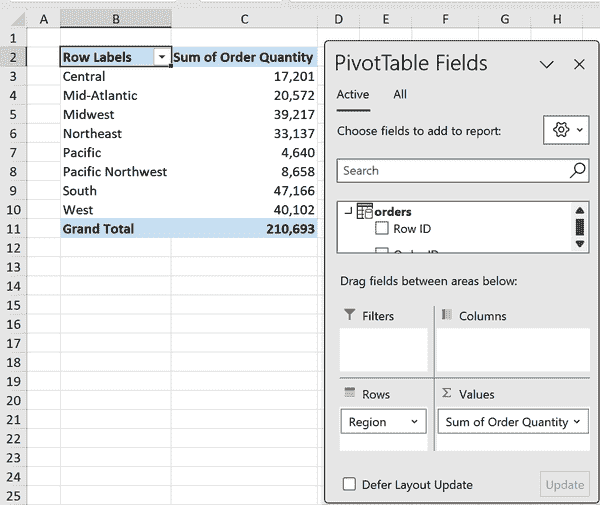

###### 图 8-1\. 经典的拖放数据透视表聚合

要查看数据模型如何管理这些数据透视表计算，请导航到功能区中的 Power Pivot 选项卡，选择“管理”。从主页选项卡的“查看”组中选择“图表视图”。然后，在“高级”选项卡上，启用“显示隐含度量”。这将在 `orders` 表底部添加两个度量，如图 8-2 所示。

早些时候通过数据透视表创建的度量称为*隐含度量*。Power Pivot 会自动生成并存储这些度量。它们提供了快速探索和分析数据的便利，无需开发复杂的计算。

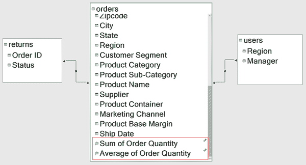

###### 图 8-2\. 图表视图中显示的隐含度量

然而，隐含度量在数据模型中的定制性和重复使用性方面存在挑战。仅仅聚合现有字段并不能建立新的派生度量，比如每销售单位的平均销售额。创建一个独立的显式度量，结合两个字段（销售额和订单数量），变得至关重要。此外，隐含度量的隐藏性质使得它们的管理和组织变得复杂。要解决这些问题，您可以按照以下步骤删除隐含度量：点击其中一个度量，按住 Ctrl 键，然后点击另一个度量，接着右键单击并选择“删除”按钮，如图 8-3 所示。

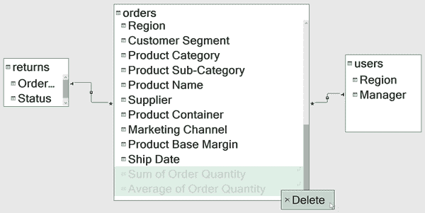

###### 图 8-3\. 删除 Power Pivot 中的隐含度量

## 创建显式度量

不要通过 PivotTable 值隐式创建 DAX 度量，而是可以使用 Power Pivot 的“度量”选项明确地制定它。退出 Power Pivot 编辑器，在功能区中导航到 Power Pivot 选项卡，选择“度量”→“新度量”，如图 8-4 所示。

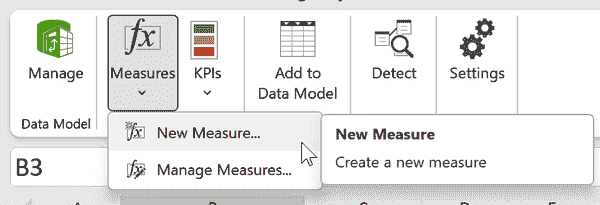

###### 图 8-4\. 在 Power Pivot 中创建新度量

首先要建立一个`总销售额`度量，聚合`orders`表中的`sales`列。这个 DAX 计算与 第一章 中讨论的结构化表引用类似。您还可以继续利用 Microsoft 的 IntelliSense 自动完成函数、表格和其他元素的拼写，用于构建度量。将这个度量与`orders`表关联，指定表名，然后将其格式化为带有 2 位小数的货币格式。

最后，选择“检查公式”按钮验证度量。成功后，会显示“公式无错误”的消息，如图 8-5 所示。

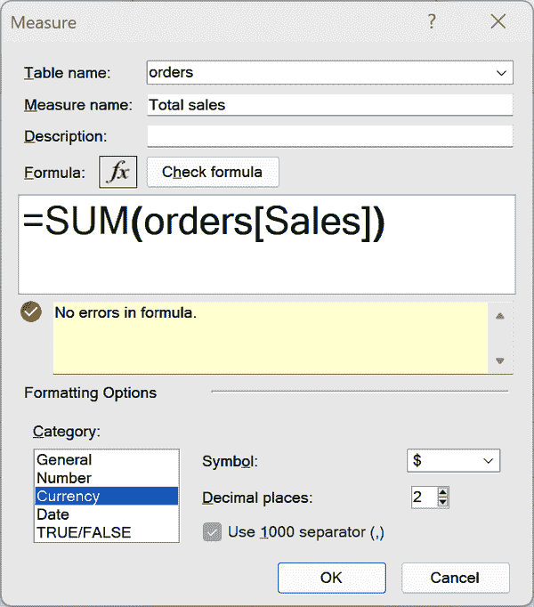

###### 图 8-5\. 创建`总销售额`显式度量

点击“确定”后，该度量将在`orders`表的 PivotTable 字段中可用，以*fx*符号为标志。将`Region`放置在行中，并将新创建的`总销售额`度量放置在数值中，如 图 8-6 所示。

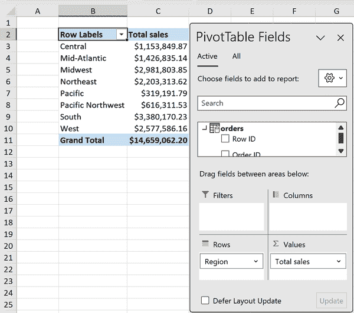

###### 图 8-6\. 在 PivotTable 中使用 DAX 度量

显式度量的聚合类型无法更改，这是隐含度量不适用的限制。要修改度量的计算方式，返回功能区中的 Power Pivot 选项卡，选择“度量”→“管理度量”，然后在`总销售额`度量上点击“编辑”。

接着，制定一个名为`总利润`的度量。您的度量应该与 图 8-7 相似。

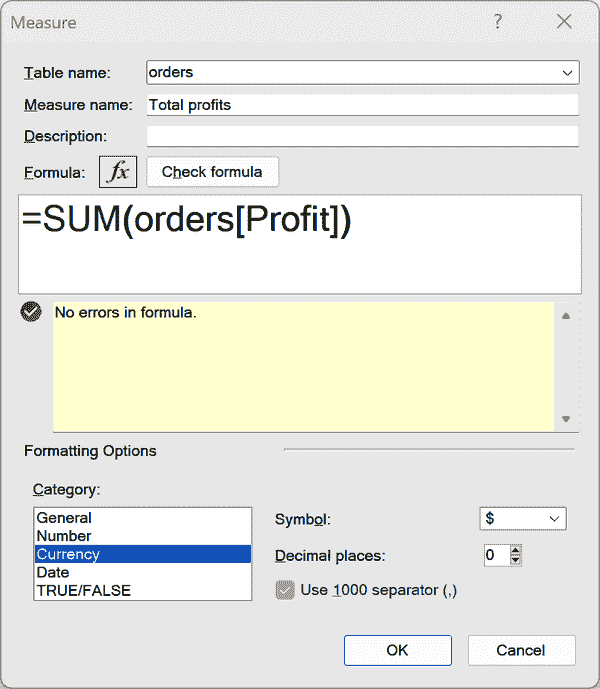

###### 图 8-7\. 创建`总利润`显式度量

当用作其他指标的输入时，计算指标能够发挥光彩，促进超出隐式指标范围的高级计算。例如，利润率可以通过`总利润`和`总销售额`指标确定，如图 8-8 所示。

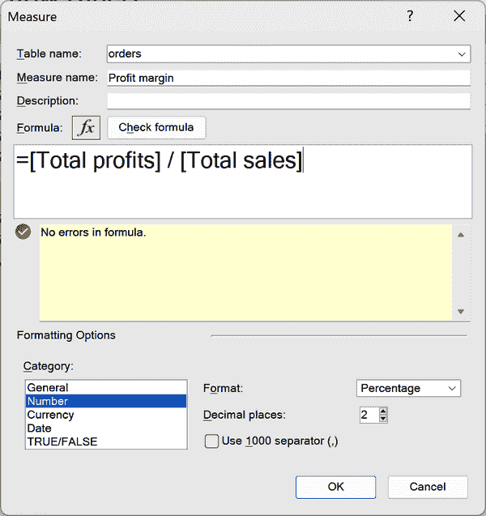

###### 图 8-8\. dax-profit-margin-measure

在数据透视表的数值部分添加`总销售额`、`总利润`和`利润率`，并将`地区`放在行中。使用公式仔细检查利润率的计算是否正确。与第七章中使用的计算列不同，这些计算现在是准确的，如图 8-9 所示。

隐含指标可能很方便，但显式指标提供透明度、定制性和高级计算的能力。投入额外的努力是有益的，建议您将所有 Power Pivot 指标都设为显式，无论它们的简易程度如何。

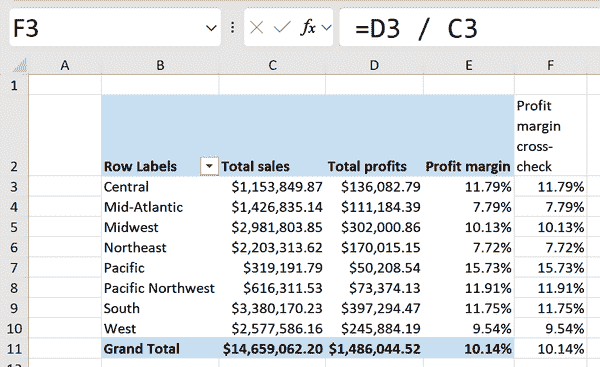

###### 图 8-9\. 双重检查`利润率`指标

表 8-1 比较了隐式和显式指标。

表 8-1\. 隐式与显式指标的比较

| 隐式指标 | 显式指标 |
| --- | --- |

|

根据数据字段由 Power Pivot 自动生成

|

用户定义的计算

|

|

快速而轻松创建，需要最少的努力

|

需要更多时间和技术专长来创建

|

|

适合快速数据探索

|

专为特定业务需求量身定制

|

|

可能无法准确捕捉所需的度量或 KPI

|

准确而具体

|

|

不够可定制和灵活

|

更加可定制和灵活

|

|

适用于简单数据探索

|

适用于复杂分析

|

显式创建的 DAX 指标允许进行广泛的复杂分析。事实上，第九章揭示了只靠 Excel 难以实现甚至不可能实现的方法。

然而，在探索这些高级主题之前，至关重要的是通过 Power Pivot 获得一些即时的胜利，帮助用户更有效地理解和利用他们的数据。数据分析的核心在于简化数据解释和决策过程。因此，本章以关键绩效指标（KPI）讨论结尾。

# 创建关键业绩指标（KPI）

KPI 对于跟踪业务绩效和实现目标至关重要。在 Excel Power Pivot 中，KPI 可以为您的数据分析提供宝贵的见解。本节的目标是创建一个 KPI，比较总销售与销售目标。

要做到这一点，Power Pivot 要求这两个数字都作为显式指标创建。您已经创建了一个`总销售额`指标；现在使用相同的逻辑创建一个`总销售目标`指标，如图 8-10 所示。

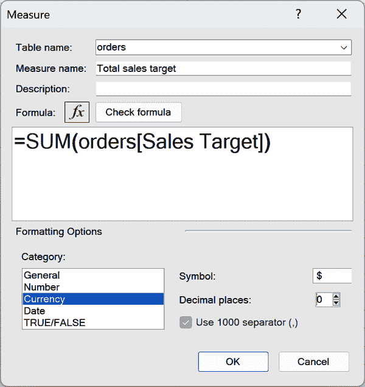

###### 图 8-10\. 创建“总销售额目标”度量

要开始构建 KPI，请转到功能区上的 Power Pivot，然后选择 KPIs → 新建 KPI。将 KPI 基础字段设置为“总销售额”，将目标值设置为“总销售额目标”，如图 8-11 所示。

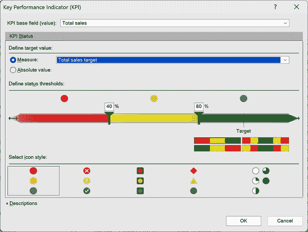

###### 图 8-11\. 定义基础和目标 KPI 值

此设置将比较实际销售与其目标水平。

接下来，设置状态阈值以为目标值提供背景，定义性能的可接受范围。这些阈值将结果分类为“良好”、“满意”或“差”，使用户可以快速评估相对于目标的性能，比简单的命中与未命中评估更具细腻性。

设定三级阈值，以查看哪些值超出、符合和低于预期：

+   当销售百分比目标低于 90%时将标记为红色。

+   当销售百分比目标在 90%到 100%之间时将标记为黄色。

+   当销售百分比目标达到或超过 100%时将标记为绿色。

在 KPI 菜单中点击并拖动阈值，以符合这些规则，如图 8-12 所示。

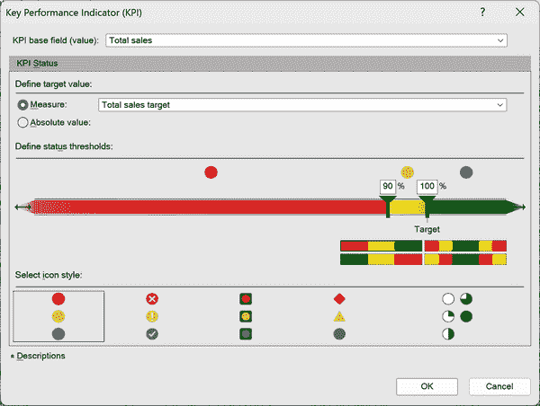

###### 图 8-12\. 定义关键绩效指标状态阈值

## 调整图标样式

接下来，您将发现各种选项来定制 KPI 的外观和设计，这在特定场景中可能会有所帮助。然而，需要注意的是，在数据可视化中使用红色、绿色和黄色的颜色是不鼓励的，因为这可能会对色觉有差异的人造成混淆和误解。

遗憾的是，Power Pivot 没有提供修改其颜色方案的能力，这是工具的一个显著缺陷。这种限制可能促使用户考虑将更复杂的仪表板和报告迁移到更为复杂的 BI 平台，如 Tableau 或 Power BI。这些平台在颜色自定义和其他可视化功能方面提供了更高的灵活性，以满足数据更个性化和视觉上更吸引人的展示需求。

###### 警告

红黄绿色调的色彩搭配通常不建议用于数据可视化，因为这可能会使色盲人士难以准确解释数据。遗憾的是，Power Pivot 不允许修改这些颜色，强调了需要考虑更为多功能的解决方案来创建全面的仪表板和报告的必要性。

## 将 KPI 添加到数据透视表

设置好 KPI 后，点击“确定”。接下来，从数据模型插入新的数据透视表或使用已有的数据透视表。将“区域”放入行，将“客户段”放入列。

在 PivotTable 字段列表中`orders`组的底部，您应该看到一个名为`Total sales`的交通灯图标。选择下拉菜单，并将其中的三个字段放入 PivotTable 中，如图 8-13 所示。

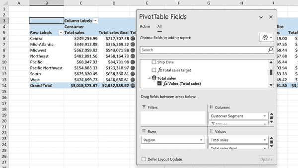

###### 图 8-13\. PivotTable 中的总销售 KPI

如果您的`Total sales Goal`未正确格式化，您可以通过 PivotTable 中的值字段设置进行操作。

KPI 结构设计为在 PivotTable 内按以下方式运行：首先显示实际销售数字，然后是基于`Sales target`列设定的销售目标。此显示由视觉指示器增强，能立即理解销售数字是否达到、超过或未达到目标。

如果您不喜欢阈值并希望对其进行微调，您可以随时返回到功能区上的 Power Pivot，然后选择 KPIs → Manage KPIs，单击您的 KPI，然后单击 Edit。

基于 KPI 和显式测量的 PivotTable 仅代表 Excel 和 Power Pivot 提供的广泛数据报告和可视化能力的起点。要更全面地了解如何利用您的数据模型结果构建包含附加功能（如切片器、条件格式化等）的完整仪表板，请考虑阅读 Bernard Obeng Boateng 的《Data Modeling with Microsoft Excel》（Packt, 2023）。

# 结论

本章探讨了使用 Power Pivot 创建健壮报告和分析的初始步骤，强调了隐式和显式 DAX 测量之间的差异。该章还介绍了 Power Pivot 中 KPI 的概念，突出了它们在创建可操作报告中的有用性，同时指出了它们的一些局限性。

第九章通过深入研究 DAX 的更高级技术和能力，创建基于 PivotTable 的分析，这些分析通常难以或不可能构建，结束了第 II 部分。

# 练习

对于本章的练习，请继续开发您在第八章练习中建立的数据模型。您可以选择继续使用您自己的工作簿，或者从位于书的伴随存储库中*exercises\ch_08_exercises*文件夹中的*ch_08_exercises.xlsx*文件重新开始。执行以下任务：

1.  创建一个 PivotTable，按出生州(`birthState`)分组，呈现按隐式测量计算的全垒打（`HR`）的总数。

1.  删除步骤 1 中创建的隐式测量，并建立一个新的显式测量，命名为`hr_total`，计算全垒打的总数，并以千为单位格式化为整数。将此测量添加到 PivotTable 中。

1.  生成另一个显式测量值，命名为 `hr_pct`，计算出全垒打（`HR`）占打数（`AB`）的百分比。将结果格式化为百分比。可以创建一个额外的打数总计测量来辅助此计算。

1.  基于指标 `hr_pct` 制定一个 KPI，目标绝对值为 1。使用以下状态阈值：

    +   少于 2%：红色状态

    +   在 2% 到 3% 之间：黄色状态

    +   大于 3%：绿色状态

1.  将该 KPI 应用于透视表，透视表按行显示 `teamID`，按列显示 `yearID`。

参考同一文件夹中的 *ch_08_solutions.xlsx* 查看解决方案。
