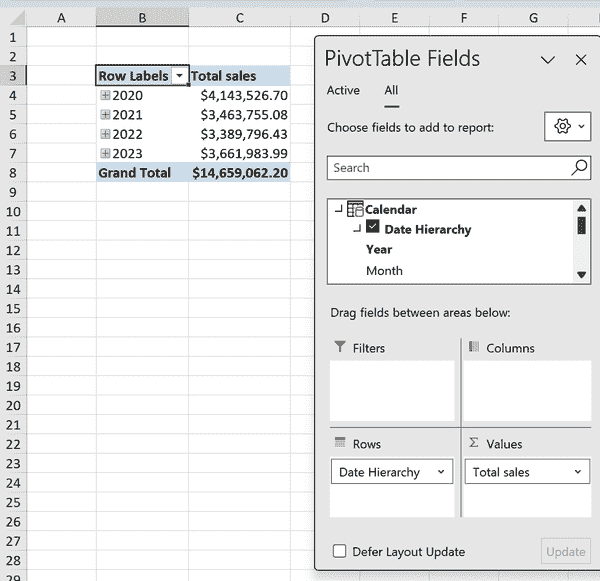

# 第九章：Power Pivot 的中级 DAX

在 第八章 中，您探索了用于报告的基本 DAX 度量。现在，在 第 II 部分 的最后一章中，我们将深入探讨中级 DAX 任务，增强 Excel 中的透视表报告。

要参与演示，请打开位于书的配套存储库的 *ch_09* 文件夹中的 *ch_09.xlsx* 文件。我们将使用与前几章相同的零售销售数据集。

此 Excel 工作簿包括一个链接到数据模型的透视表，并且具有名为 `Total sales` 的预定义度量。该度量计算来自 `orders` 表的 `Sales` 列的总和，并将在随后的各种演示中使用。

# CALCULATE() 和过滤上下文的重要性

在传统的透视表中，所有值都遵循主要过滤器。例如，在 图 9-1 中，如果您按 “Express Air” 过滤 `Ship Mode`，则不能同时看到总销售。您要么得到总销售，要么只有 Express Air 销售，但两者都不会同时出现。

###### 图 9-1\. 现在在过滤上下文中评估 `Total sales`

用简洁的术语来说，透视表中的每个值都遵循其“过滤上下文”。然而，`CALCULATE()` 函数解放了度量不受此约束，使其能够在修改后的过滤上下文中运行。这彻底改变了透视表的功能。

尽管 `CALCULATE()` 函数非常强大，但其语法相当简单，如 表 9-1 所示。

表 9-1\. `CALCULATE()` 的参数解释

| 参数 | 数据类型 | 描述 |
| --- | --- | --- |
| `expression` | 任何有效的 DAX 表达式 | 要评估或计算的表达式。这可以是一个度量、一个列或另一个函数。 |
| `[filter1], [filter2], [...]` | 列、表或布尔表达式 | 可选。要应用于表达式的过滤器或过滤器。这可以是单个列、一个表或一个布尔表达式。 |

# CALCULATE() 与一个条件

首先制定一个名为 `Total express air sales` 的度量。该度量应将 `Total sales` 过滤为 `Ship Mode` 设置为 “Express Air” 的订单，如 图 9-2 所示。

###### 图 9-2\. 带有一个条件的 `CALCULATE()` 函数

一旦您制定了这个度量，将其添加到透视表中，放在 `Total sales` 旁边，并从透视表中移除 `Ship Mode`。这样，您就可以在透视表中同时看到总体销售和 Express Air 销售，如 图 9-3 所示。

###### 图 9-3\. `Total express air sales` 作为独立的过滤上下文

您已经改变了透视表如何评估单个数据点。这是透视表功能的重大进步。

# CALCULATE() 与多个条件

使用`CALCULATE()`还可以通过各种条件修改过滤器上下文。本节将探讨如何在我们的函数中整合和/or 条件。

## AND 条件

鉴于高优先级订单最容易受到航空运输中断的影响，审查同时满足`订单优先级`为高和`发货方式`为 Express Air 的销售数据可能会很有帮助。

将第二个`AND`条件添加到`CALCULATE()`度量中只需添加一个额外的过滤参数，如图 9-4 所示。

###### 图 9-4\. 带有`AND`条件的`CALCULATE()`函数

## OR 条件

在条件逻辑中，始终要注意结果的敏感性。即使是微小的条件更改也可能产生截然不同的结果。

例如，通过过滤`订单优先级`为高*或*`发货方式`为 Express Air 的订单来验证销售金额。在`CALCULATE()`中，使用两个`|`符号结合条件，如图 9-5 所示。

###### 图 9-5\. 带有`OR`条件的`CALCULATE()`函数

# 使用 ALL()的 CALCULATE()

`CALCULATE()`可以添加到过滤器上下文中，但与`ALL()`配对时，它明确地*清除所有过滤器上下文*以获取一个值。要理解这种差异，请考虑图 9-6 中的透视表（#calculate-results-affected-filter）。`总销售额`度量和过滤器上下文修改后的`总 Express Air 销售额`随着总体`产品类别`过滤器的变化而波动。

###### 图 9-6\. `CALCULATE()`的结果受到透视表筛选器的影响

要计算*所有*基准值，无论上下文过滤条件如何，都可以将`ALL()`函数与`CALCULATE()`配对使用。例如，我将创建一个名为`所有总销售额`的度量，如图 9-7 所示。

###### 图 9-7\. 使用`CALCULATE()`与`ALL()`清除所有过滤上下文

通过将`ALL(orders)`应用为过滤条件，表中的每条记录都会被考虑在内进行计算，覆盖透视表中的任何其他现有过滤器上下文。这种差异可以在图 9-8 中看到（#total-vs-total-all-sales-dax）。

这对比较特定的销售数据组合与整体总数是很有用的，无论应用的过滤器如何。

###### 图 9-8\. 透视表中的`所有总销售额`

`CALCULATE()`函数类似于经典 Excel 中的查找函数和透视表。它代表了向高级功能的跃进。要深入了解过滤器上下文和`CALCULATE()`函数，请参考《DAX 定义指南》第二版，作者是 Alberto Ferrari 和 Marco Russo（Microsoft Press，2019 年）。

# 时间智能函数

> 在量化推理的核心是一个问题：与什么比较？
> 
> Edward Tufte

在商业世界中，分析趋势至关重要。分析师会根据历史数据评估当前表现，并评估每月和每年的指标。传统的 Excel 方法对于此目的可能显得笨重，而 Power Pivot 提供了简化的方法。

Power Pivot 引入了*时间智能*功能，提供了能够简化基于时间数据分析的函数，例如年度总计和月度增长。这消除了复杂的公式，简化了在 Excel 中进行趋势分析的过程。

## 添加日历表

要有效地在 Power Pivot 中使用时间智能功能，请首先添加一个日历表。这提供了一个一致和全面的日期时间结构，增强了数据分析的准确性，并使得更复杂的基于时间的计算和比较成为可能。在数据模型中，转到 Power Pivot 选项卡，选择管理，转到设计选项卡，然后选择日期表 → 新建，如图 9-9 所示。

###### 图 9-9\. 将日期表添加到数据模型

现在您应该在数据模型中看到一个日历表。在此表的`日期`列和`订单`表中的`订单日期`列之间建立关系。您的数据模型应该类似于图 9-10。

###### 图 9-10\. 带有日历表的零售销售数据模型

现在，您可以在数据模型中利用来自日历表的各种日期度量，所有这些都与`订单`表中的`订单日期`相关联。

要确保日历表正常运行，请在工作簿中插入一个新的透视表。将日历表中的`日期层次结构`拖到行中，并将`订单`中的`总销售额`拖到值中，如图 9-11 所示。

###### 图 9-11\. 在透视表中使用日历表

## 创建基本的时间智能度量

DAX 提供了丰富的时间智能函数，允许您检索以往的周期、至今的周期及更多功能。例如，要计算年度销售量，可以使用`TOTALYTD()`公式，如图 9-12 所示。

###### 图 9-12\. 在 DAX 中创建年度销售量措施

要验证这个度量的准确性，请将其添加到数据透视表中，并将`日期层次结构`放置在行中。通过点击`+`号展开 2020 年的数据。您应该观察到每个月度量的逐月增加，如图 9-13 所示。

###### 图 9-13\. 在透视表中显示年度销售量

接下来，为了确定上一年同期的销售额，结合熟悉的 `CALCULATE()` 函数和 `SAMEPERIODLASTYEAR()` 函数，如 图 9-14 所示。

###### 图 9-14\. 创建一个 `去年销售` 测量

为了确保准确性，请预览透视表中的数据以及 `Total sales`。您应该看到 2021 年的去年销售额和 2020 年的总销售额，如 图 9-15 所示。

###### 图 9-15\. 比较今年和去年的销售

最后，建立一个 `去年 YTD 销售` 测量，以对比今年的年度销售和前一年的销售。

为了实现这一点，您可以将 `CALCULATE()` 与 `DATESYTD()` 和 `DATEADD()` 函数结合使用。此设置将检索所有年度截至日期，并使用日历表向后调整一年。结果如 图 9-16 所示。

###### 图 9-16\. 创建一个 `去年 YTD 销售` 测量

您现在可以比较当前年度和去年年度的年度趋势，如 图 9-17 所示。

###### 图 9-17\. 比较今年和去年的年度销售

# 结论

DAX 和 Excel 总是提供新的学习内容，您可以以无数种方式组合函数。本章可能即将结束，但使用 Power Pivot 在 Excel 中还有更多发现。

到目前为止，本书已探讨了数据清洗和建模方面的 Power Query 和 Power Pivot。但在 Excel 中还有更多的数据分析。第三部分 触及其他功能，帮助使您的 Excel 项目更加动态和洞察力十足。

# 练习

要练习构建中级的 DAX 测量，使用书中伴随仓库中 *exercises\ch_09_exercises* 文件夹中的 *ch_09_exercises.csv* 中找到的自行车店销售数据集。尽管本书侧重于使用 Power Pivot 在同一工作簿中的多个表格之间建立关系，但单个 *.csv* 文件仍然可以使用。

通过 Power Query 将数据加载到 Power Pivot，并创建以下测量值：

1.  `accessories_rev`: 当 `product_category` 设置为 Accessories 时返回总收入。

1.  `accessories_rev_aus`: 当 `product_category` 设置为 Accessories 且 `country` 设置为 Australia 时返回总收入。

1.  `aov_all`: 计算整个数据集中的总收入除以总订单数量，不考虑应用的筛选器。

1.  `profit_margin_ytd`: 返回年度利润率。

1.  `profit_margin_ly_ytd`: 返回前一年度的年度利润率。

请随意创建辅助度量，以帮助构建所需的度量指标。例如，在寻找年度销售总额时，首先创建一个总销售度量是很有帮助的。

确保通过在 PivotTable 中测试来确保您的度量指标按预期运行。例如，如果您正在构建一个与筛选上下文无关的度量指标，请应用筛选器以观察其行为。在开发年度累计度量时，通过日期对度量进行汇总以验证其适当的响应。此外，即使我们只使用单个表，也有利于包含一个日历表来进行与日期相关的操作。

在同一文件夹中查看 *ch_09_solutions.xlsx* 查看解决方案。
