# 第十章：介绍动态数组函数

到目前为止，本书已经介绍了使用 DAX 构建 Power Pivot 的度量标准，并在 Power Query 中较少地涉及了 M 代码。然而，它并未审视长期以来一直是 Excel 基础的传统工作簿公式和函数。即使在其他如 Power Pivot 和 Power Query 等引人注目的发展活动中，此类程序区域似乎被忽视，但它经历了显著改进，变得更加强大和有能力。

本章介绍了动态数组函数，揭示了它们的功能。您将学习如何使用 Excel 公式栏中熟悉的环境来对数据集进行排序、过滤和连接等任务。

# 动态数组函数解析

*动态数组函数*具有令人印象深刻的功能，诱人地让人立即开始尝试。然而，了解这些函数的特殊之处以及它们与传统 Excel 方法的区别至关重要。接下来的部分将探讨从数组到数组引用再到动态数组函数的路径。

## 在 Excel 中，什么是数组？

要跟随此演示，请在书的资源中的`ch_10`文件夹中打开*ch_10.xlsx*，转到`array-references`工作表。

首先和最重要的是，在 Excel 中，*数组*指的是一组值的集合。例如，一个基本的数组可以由放置在单元格`A2:C2`中的数字 3、4 和 7 组成，如图 10-1 所示。

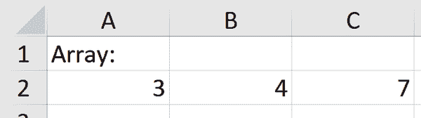

###### 图 10-1。一个基本的 Excel 数组

## 数组引用

理解在 Excel 中构成数组的内容后，本节将探讨构建数组引用的各种方法。

### 静态数组引用

要创建传统的 Excel 数组引用，在单元格`E2`中输入`=A2:C2`，然后按 Ctrl+Shift+Enter，表示您引用的是一组值而不是单个值，如图 10-2 所示。

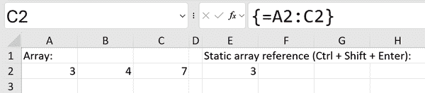

###### 图 10-2。一个基本的 Excel 数组引用

您将看到结果公式被大括号`{}`括起来，但不会在结果中显示所有三个值。这是因为在 Excel 中，每个单元格设计用来存放单个数据点，而不是您可能试图在此处实现的三个值。要将数组数据分布到多个单元格中，请选择范围`E2:G2`并输入相同的引用，如图 10-3 所示。

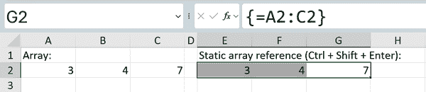

###### 图 10-3。一个改进的 Excel 数组引用

Excel 处理数组的传统方法存在一些限制。使用 Ctrl+Shift+Enter 编写和管理引用的过程可能很繁琐，并且缺乏自动调整功能。

考虑这样一个场景，即在`A2:C2`之间插入或删除单元格时，数组引用无法自动调整大小。因此，这些数组引用可以描述为*静态*，因为它们不会根据电子表格结构或单元格数的变化动态适应。

### 动态数组引用

*动态数组*在 2018 年的 Excel 中引入，以克服传统静态数组的限制。现在，要引用`A2:C2`，只需输入**`=A2:C2`**并按 Enter，例如在图 10-4 的单元格`E5`中。

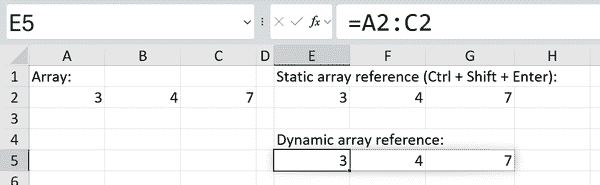

###### 图 10-4\. 动态 Excel 数组引用

使用此引用，Excel 智能识别数组中的单元格数量。这意味着，如果在`A2`和`C2`之间插入或删除单元格，动态数组引用将自动调整大小以适应这些变化。这种动态调整节省了时间和精力，消除了在数据布局更改时手动更新或修改引用的需要。

## 数组公式

对比了经典和现代 Excel 中数组引用的行为后，接下来的部分深入探讨了使用这些引用的函数的影响。

### 静态数组公式

考虑以下示例，它使用静态数组公式列出了交易数据集中售出的唯一产品，正如在图 10-5 中所见。您可以在*ch_10.xlsx*的`array-functions`工作表中跟随此示例。

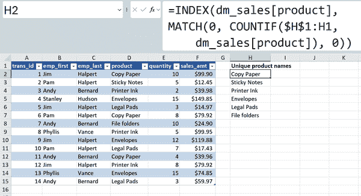

###### 图 10-5\. 静态数组公式

不要过分担心公式的内部工作原理；我们将很快探讨一个更合理的替代方案。现在，观察一下静态数组在确定应返回的输出件数时可能存在的挑战。

类似于数组引用，这种方法缺乏对唯一值正确数量的自动调整，使其显得复杂且不直观。例如，如果在`dm_sales`表中添加更多交易，比如橡皮筋，在数组函数中不会反映出任何额外的唯一值，正如在图 10-6 中所见。

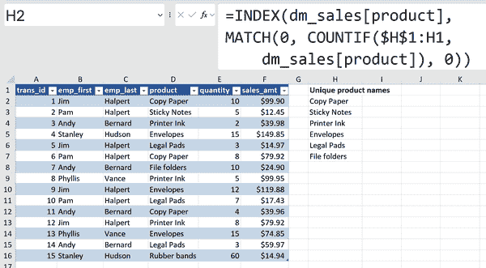

###### 图 10-6\. 橡皮筋（第 16 行）未列为唯一产品

要看到额外的值，您需要在列`H`中扩展您的数组公式再向下一行。

### 动态数组函数

另一方面，动态数组函数在这种情况下表现非常出色。甚至有一个专门设计来处理此任务的`UNIQUE()`函数，正如在图 10-7 中所见。

###### 注意

如果在使用`UNIQUE()`函数后出现`#SPILL`错误，请确保其下方存在空单元格。当函数的结果溢出到非空相邻单元格时，会出现此错误。

动态数组函数通过即时更新输出单元格以响应输入变化，显著提升了传统数组公式的功能。这种动态行为消除了手动重新计算或刷新公式的需要，提供了无缝和高效的工作流程。

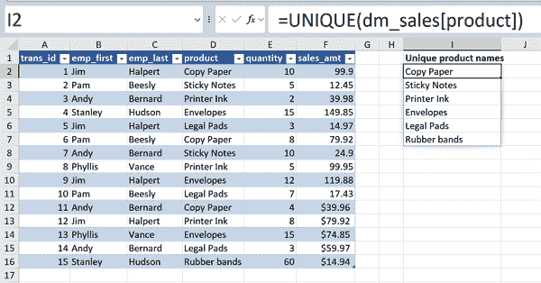

###### 图 10-7\. 使用 `UNIQUE()` 函数查找唯一值

# 动态数组函数概述

考虑到动态数组函数的功能，现在是时候探索一些例子了。第一个例子将深入讨论前文提到的 `UNIQUE()` 函数。

## 使用 `UNIQUE()` 查找不同和唯一值

在前一个例子中，使用 `UNIQUE()` 动态数组函数生成了唯一产品名称列表。要进一步探索此函数和数据集，请继续使用 *ch_10.xlsx* 工作簿中的 `dm_sales` 表。

`UNIQUE()` 函数有三个参数，其中两个是可选的。要理解它们的工作原理，请参考表 10-1。

表 10-1\. `UNIQUE()` 参数

| Parameter | Description |
| --- | --- |
| `range` | 必需的参数，指定要从中提取唯一值的数据范围或数组。 |
| [`by_col`] | 可选参数，确定是否应按列或行提取唯一值。默认情况下，按行提取唯一值。如果将此参数设置为 `TRUE`，则将按列提取唯一值。如果将此参数设置为 TRUE，则将按列提取唯一值。 |
| [`exactly_once`] | 可选参数，指定是否只考虑仅出现一次的值作为唯一值。默认情况下，无论其频率如何，都会提取所有唯一值。如果将此参数设置为 `TRUE`，则仅提取仅出现一次的值。 |

## 查找唯一与不同值的区别

在数据库术语中，*唯一值* 指的是在给定范围内仅出现一次的值。这使得 `UNIQUE()` 函数的名称有些误导性。该函数实际上识别的是*不同的* 值，即出现一次或多次的值，而不是严格意义上的唯一值。然而，通过将函数的第三个参数设置为 `TRUE`，可以获得真正的唯一值，如图 10-8 所示。

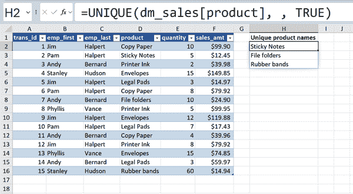

###### 图 10-8\. 使用 `UNIQUE()` 查找真正的唯一值

## 使用溢出运算符

在 Excel 中，常见的做法是在现有计算的基础上进行额外的计算，例如聚合计算列的结果。由井号符号 (`#`) 表示的*溢出运算符* 简化了动态数组函数的聚合过程。像动态数组本身一样，它会自动扩展输出范围以适应数据，消除了手动输入数组公式和调整范围的需要。这一特性在构建 Excel 中用于聚合数据的公式时提高了效率和简洁性。

可以使用 `COUNTA()` 函数来确定在 图 10-8 中显示的公式生成的唯一值的数量。选择范围 `D2:D7` 时，Excel 自动引用以 `#` 运算符指示的溢出范围，如 图 10-9 所示。

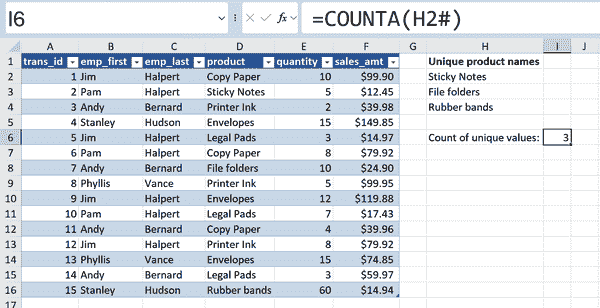

###### 图 10-9\. 使用溢出运算符汇总动态数组

尽管本章未详细介绍，溢出运算符对于构建依赖下拉列表、动态图表和其他各种功能提供了显著的好处。

# 使用 FILTER() 过滤记录

Excel 的传统数据过滤下拉菜单很直观，但存在一些限制。例如，一旦应用了这些过滤，就不再能查看原始数据的完整内容了。最好是创建数据的副本，然后对该副本应用过滤，类似 Power Query 处理数据清洗的方式。此外，跨多列定义复杂的过滤逻辑规则可能既繁琐又重复。

为了解决这些限制，Excel 引入了 `FILTER()` 动态数组函数。`FILTER()` 有三个参数，详细说明在 表 10-2 中。

表 10-2\. `FILTER()` 参数

| 参数 | 描述 |
| --- | --- |
| `array` | 必需的参数，指定要过滤的数据范围或数组。 |
| `include` | 必需的参数，指定过滤条件或条件。它定义了应包含在过滤结果中的值。可以是逻辑表达式、要匹配的值，或者对数组中每个元素求值为 `TRUE` 或 `FALSE` 的公式。 |
| `[if_empty]` | 一个可选参数，指定如果过滤结果为空时返回的值。默认情况下，如果没有值符合过滤条件，该函数将返回一个包含 `#CALC` 错误值的数组。 |

要实现所需的结果，需要过滤 `dm_sales` 表，以便仅返回 `product` 设置为 Sticky Notes 的记录，如图 10-10 所示。


###### 图 10-10\. 一个基本的 `FILTER()` 函数

###### 注意

`FILTER()` 函数默认情况下不区分大小写。在上面的示例中，“Sticky Notes” 和 “sticky notes” 都将产生相同的结果。要执行区分大小写的过滤，请将 `FILTER()` 函数与 `EXACT()` 结合使用；例如：`=FILTER(dm_sales, EXACT(dm_sales[product], "Sticky Notes"))`。

## 添加一个标题列

`FILTER()` 函数已经非常有用，但它缺少一个至关重要的功能—​它仅返回匹配的行，而不包括数据的标题列。要包含这些标题，需要使用动态表头引用。关于结构化引用的快速回顾，请参阅第一章。如 图 10-11 所示，在你的过滤输出上方包含此引用以获取动态标头标签。


###### 图 10-11\. 带有标头标签的 `FILTER()` 结果

###### 警告

将`FILTER()`函数或其他动态数组函数应用于 Excel 表时，结果不包括表头。

## 根据多个条件过滤

`FILTER()`函数通过使用公式来过滤数据与传统的下拉菜单过滤方法区别开来。这种能力不仅能解锁强大的机会，同时保持了一种直观和简单的方法来建立和理解条件。

要在`FILTER()`函数中结合多个条件，使用`*`符号表示`AND`语句，使用`+`符号表示`OR`语句。

### 并且条件

要搜索 `product` 为“复印纸” *且* 数量大于 5 的记录，可以在不同的括号组合内将条件相乘：

```
=FILTER(dm_sales, (dm_sales[product] = "Copy Paper") *
(dm_sales[quantity] > 5))
```

### 或条件

如果你宁愿查找符合*任一*条件的记录，请用`+`符号替换`*`符号来创建一个`OR`语句：

```
=FILTER(dm_sales, (dm_sales[product] = "Copy Paper") +
(dm_sales[quantity] > 5))
```

### 嵌套的 `AND`/`OR` 条件

要创建带有嵌套 `AND` 或 `OR` 语句的过滤函数，将语句用括号分组。这个过滤函数包括了 `sales_amt` 至少为 $100 或 `quantity` 至少为 10 *且* `product` 为“信封”的记录：

```
=FILTER(dm_sales,
(dm_sales[sales_amt] >= 100) +
((dm_sales[quantity] >= 10) * (dm_sales[product] = "Envelopes")))
```

按照这些准则，你可以继续添加和调整多个条件以及 `FILTER()` 函数。

# 使用 SORTBY() 对记录进行排序

`SORTBY()` 是一个动态数组函数，能够根据多个条件同时排序记录，其语法类似于 `SUMIFS()`。表格 10-3 详细介绍了参数。

表格 10-3\. `SORTBY()` 参数

| 参数 | 描述 |
| --- | --- |
| `array` | 必需参数，指定要排序的数组或范围。 |
| `by_array1` | 必需参数，指定要排序的数组或范围。 |
| `[sort_order1]` | 可选参数，指定如何对结果进行排序。1 表示升序，-1 表示降序。默认为升序。 |
| `[by_array2]` | 可选参数，指定要排序的数组或范围。 |
| `[sort_order2]` | 可选参数，指定如何对 `by_array2` 的结果进行排序。1 表示升序，-1 表示降序。默认为升序。 |

举个例子，可以根据 `sales_amt` 的降序对数据集使用 `SORTBY()` 函数进行排序，如 图 10-12 所示。

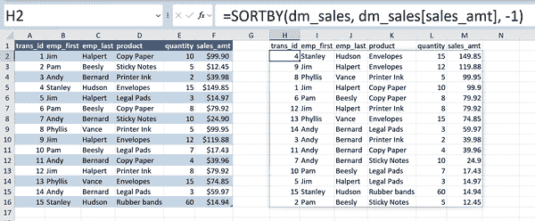

###### 图 10-12\. 使用 `SORTBY()` 对 Excel 表格进行排序

## 根据多个条件排序

`SORTBY()` 允许基于多个条件对数据进行排序，可以灵活地指定每个条件的升序或降序。例如，数据可以按`emp_last`降序排列，并按`product`升序排列：

```
=SORTBY(dm_sales, dm_sales[emp_last], -1, dm_sales[product], 1)
```

您可以扩展此模式以按所需顺序根据更多条件对数据集进行排序。

## 按另一列排序而不打印它

`SORTBY()` 甚至可以按照另一个范围排序，即使在结果中没有包含原始排序范围。

例如，假设您希望按销售额降序获取交易 ID 列表。不要使用整个 `dm_sales` 表作为第一个参数，只选择 `trans_id` 列。接下来的步骤应该很熟悉。结果将包括单列，如 图 10-13 所示。

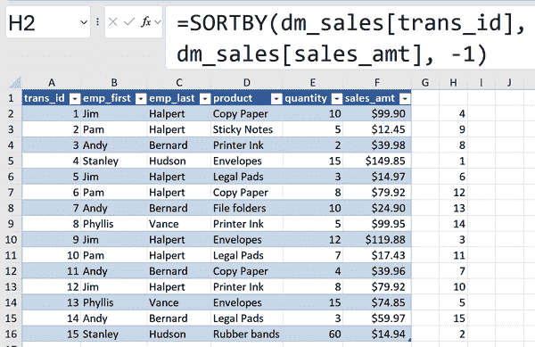

###### 图 10-13\. 在一列中显示 `SORTBY()` 结果

# 使用 `XLOOKUP()` 创建现代查找功能

到目前为止，展示动态数组函数的示例仅使用了单个表格。然而，通常情况下，数据来自多个表格，需要进行合并。尽管 Power Query 和 Power Pivot 提供了各自的技术来从不同来源合并数据，但 Excel 公式的即时、动态和交互特性仍然在诸如基于用户输入构建模型、执行实时数据分析等任务中具有优势。

`XLOOKUP()` 函数通过利用动态数组的能力，提供了传统 `VLOOKUP()` 函数的多功能替代方案。

要进一步探索此功能，请参考 *ch_10.xlsx* 中的 `xlookup` 工作表。该工作表包含与办公用品销售相关联的三个不同的表格。

## `XLOOKUP()` 与 `VLOOKUP()` 比较

`XLOOKUP()` 对于习惯于使用 `VLOOKUP()` 从一个表中检索数据并基于共享查找值将其传输到另一个表的用户来说，提供了一种熟悉的体验。然而，它引入了一系列更为灵活和复杂的附加搜索方法。有关 `VLOOKUP()` 和 `XLOOKUP()` 之间主要差异的概述，请参阅 表 10-4。

表 10-4\. `VLOOKUP()` 对比 `XLOOKUP()`

| 特性 | `VLOOKUP()` | `XLOOKUP()` |
| --- | --- | --- |
| 搜索方向 | 只能垂直搜索 | 可以垂直和水平同时搜索 |
| 返回方向 | 只能返回查找值右侧的值 | 可以返回查找值左右两侧的列中的值 |
| 错误处理 | 如果未找到值则返回 #N/A | 可以指定未匹配项的默认值并处理错误 |

`XLOOKUP()` 总共有六个参数，如 表 10-5 所示。

表 10-5\. `XLOOKUP()` 参数

| 参数 | 描述 |
| --- | --- |
| `lookup_value` | 必填参数，指定在`lookup_array`中搜索的值。 |
| `lookup_array` | 必填参数，指定要在其中搜索`lookup_value`的范围或数组。 |
| `return_array` | 必填参数，指定要从中检索数据的范围或数组。 |
| [`if_not_found`] | 可选参数，指定如果未找到`lookup_value`则返回的值。 |
| [`match_mode`] | 可选参数，指定匹配`lookup_value`的方法。 |
| [`search_mode`] | 可选参数，指定查找`lookup_value`的搜索行为。 |

此演示突出了`XLOOKUP()`的前四个参数。要了解更详细的概述，请查看艾伦·默里（Alan Murray）的《高级 Excel 公式：释放 Excel 公式的光辉》第十二章（Apress，2022）。

## 一个基本的 XLOOKUP()

从一个简单的例子开始：`transactions`表包含一个需要与其对应的`product_name`匹配的`product_id`。在这里，`product_id`作为查找数组，`product_name`作为返回数组，如图 10-14 所示。

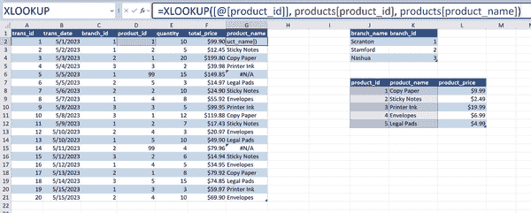

###### 图 10-14\. 基本的`XLOOKUP()`

## XLOOKUP()与错误处理

查找编号为 *99* 的`product_id`会生成一个错误。使用`#N/A`作为缺失匹配的结果是有问题的。它可能会引入计算错误，并对用户造成困惑，因为他们可能不明白为什么会返回`#N/A`。

要定制`XLOOKUP()`语句中的错误消息，请指定第四个可选参数。在这种特定情况下，您发现分配给编号为 *99* 的产品应标记为“其他”。结果在图 10-15 中展示。

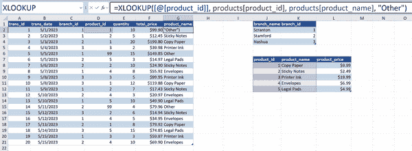

###### 图 10-15\. `XLOOKUP()`与错误处理

在表中查找产品名称后，现在是时候为分支名称执行相同操作了。

## XLOOKUP()和左侧查找

对`VLOOKUP()`的普遍批评是它无法在查找数组的左侧进行搜索，除非使用辅助函数。相反，`XLOOKUP()`可以搜索 Excel 范围中的任何值，包括查找值左侧的表列。此类示例在图 10-16 中展示。

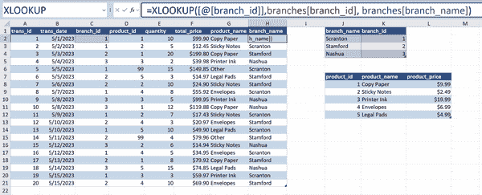

###### 图 10-16\. `XLOOKUP()`与左侧查找

多亏了它在垂直和水平两个方向上搜索的多功能性，以及从匹配的查找值两侧列中检索值，并在其公式内处理错误，`XLOOKUP()`已成为 Excel 中数据检索的首选公式。

# 其他动态数组函数

在这里展示的动态数组函数是 Excel 最初的提供功能之一，随后的增加扩展了其能力范围。

例如，`RANDARRAY()`函数生成一组随机数的数组，您可以指定行数和列数。这有助于生成填充有随机值的动态数组，非常适合模拟。类似地，`SEQUENCE()`函数在数组中创建一系列数字，使用指定的起始数、增量和数组大小。这对于生成线性间隔值或模拟和动态模型中的时间步骤特别有益。

许多其他动态数组函数旨在文本操作，包括用于垂直数组合并的`VSTACK()`和使用指定分隔符拆分文本的`TEXTSPLIT()`。要查看动态数组函数的全面列表并访问教程，[请访问 Exceljet.com 上关于此主题的文章](https://oreil.ly/MTWH6)。

# 动态数组和现代 Excel

鉴于像 Power Query 和 Power Pivot 这样的工具的存在，动态数组函数在 Excel 中可能看起来是倒退的一步。为什么要自愿回到依赖精细公式驱动的工作簿时代，而不使用这些先进功能呢？这种态度忽视了动态数组在现代 Excel 分析堆栈中带来的价值。以下是它们成为重要组成部分的原因：

简洁性

动态数组函数通过在单个公式内执行计算来简化数据操作和分析，增强了理解和可维护性。这与在 Power Query 或 Power Pivot 中构建和管理数据清洗任务所涉及的复杂多步骤过程形成鲜明对比。

熟悉度

动态数组函数通过与熟悉的 Excel 环境集成，与本书中讨论的许多其他工具区别开来。与需要安装或单独编辑器的插件不同，动态数组公式在 Excel 中自带并且易于访问，大大简化了典型用户的采纳过程。

实时更新

动态数组函数提供了当基础数据发生变化时自动更新结果的优势。这消除了手动公式重新计算或连接刷新的需要，并实现了实时分析和洞察。在数据不断变化的动态场景中（如实时仪表板或财务模型），这种功能尤其有益。

# 结论

本章介绍了动态数组函数，使传统且有时笨拙的 Excel 引用和公式焕发新生。这些功能现在与 Excel 分析工具包中的 Power Query 和 Power Pivot 并驾齐驱。

虽然动态数组函数提供简单和低开销的选择，但是第三部分 Part III 中的后续章节深入探讨了更高级的工具。这些工具需要额外的设置，但提供了比单纯使用公式更为复杂的分析洞察。在这些章节中，您将学习如何通过 Python 将人工智能、机器学习技术和高级自动化功能整合到您的 Excel 工作流程中。

# 练习

要练习动态数组函数，请打开书的[companion repository](https://oreil.ly/modern-analytics-excel-exercises)中的*exercises\ch_10_exercises*文件夹中的*ch_10_exercises.xlsx*文件。此工作簿包括两个数据集：`vehicles`和`common`。完成以下练习：

1.  找出`vehicles`数据集中`make`列中的不同和真正唯一的值。每个有多少个？

1.  仅显示城市里程大于 30 的车辆。

1.  仅显示城市里程大于 30 的车辆，或者汽缸少于 6 且燃油为 Regular 的车辆。

1.  根据高速公路里程将`vehicles`数据集按降序排序。

1.  根据`common`数据集中的`years`列，按降序排序`model`列。

1.  将`common`数据集中的`years`列添加到`vehicles`数据集中。如果找不到匹配项，则返回`Not reported`。

解决方案可以在同一文件夹中的*ch_10_solutions.xlsx*中找到。
