# 第十一章：增强型分析和 Excel 的未来

随着数据分析领域的扩展变得越来越广泛和复杂，Excel 将会扮演什么角色？在 AI 驱动的数据生态系统中，它会变得过时吗？本章探讨了增强型分析的出现以及 Excel 在这一转变中的角色，以及一些当前的使用案例。

在我们深入探讨预测分析、人工智能以及正在商业领域发生的变革，包括我们的电子表格内部之前，我们需要意识到这个领域的动态性。新产品不断涌现。即使是像 ChatGPT 和 Microsoft Copilot 这样的老牌工具，也经常会有重大更新和变化。本章旨在专注于理解 Excel 的基础和更稳定的方面。我的目的不是提供最新进展的详尽概述，而是提供一瞥 Excel 中增强型分析的内容，并为您提供在这一领域中导航所需的技能，无论功能和工具如何演变。

# 数据和分析的日益复杂化

2017 年，国际数据公司（IDC），一家市场情报公司，预测从 2016 年到 2025 年，全球数据量将增加 10 倍，达到 163 个 Zettabytes 或一万亿吉字节。

随着数据总量的增加，数据的种类也在扩展。根据 AI 服务提供商 Taiger 的数据，到 2020 年，[80%的数字数据是非结构化的](https://oreil.ly/Ig7PD)——随着生成自然语言处理产品如 ChatGPT 的出现，这个比例可能已经增加。非结构化数据是不遵循特定格式或结构的信息，在传统数据库或 Excel 等电子表格中难以组织和分析。非结构化数据的例子包括文本、图像、视频和社交媒体帖子，所有这些都需要更复杂的处理技术来提取有用信息。

此外，实时数据的重要性也显著提升，IDC 估计到 2025 年，流式数据将占[所有数据的 30%](https://oreil.ly/7So9_)。

由研究咨询公司 Gartner 描述的数据爆炸，其特征是[研究咨询公司 Gartner](https://oreil.ly/MOjJ7)提到的体积、速度和多样性，这迫使我们采用先进的分析方法。数据科学帮助组织利用各种计算和统计方法在数据中发现关系和洞见，而机器学习和人工智能使计算机能够学习和模拟人类智能。这些技术使企业能够自动化决策过程，实时识别趋势，并创建个性化体验。

这场革命已经到来：[94%的商业领袖](https://oreil.ly/FuPPJ)在德勤的一项调查中回应说，AI 在未来五年对成功至关重要，并且[劳工统计局](https://oreil.ly/0wCan)预计未来十年数据科学家的就业人数将增长 36%，从 2021 年的 113,000 人增至。

# Excel 与自助 BI 的传承

自助商业智能（BI），借助 Excel 等工具的支持，已经在企业决策中产生了革命性的影响。它使个人用户能够独立访问和分析数据，无需依赖信息技术（IT）人员的帮助。然而，自助 BI 的范围和复杂性有限。数据必须以与 Excel 兼容的方式结构化，从而限制分析仅限于描述性和诊断性分析。这意味着 Excel 无法处理需要预测性或规范性分析所需的高级算法和机器学习模型。

为了做出更多战略决策，企业需要将自助 BI 与更先进的分析工具和技术如数据挖掘、机器学习和 AI 相结合。

# Excel 用于增强分析

增强分析是一种利用 AI 和机器学习技术增强数据分析过程的方法。它通过自动筛选大数据集，识别趋势、模式和异常，无需人工干预即可生成见解。这种方法显著提高了数据分析和自助 BI 的效率和准确性，使企业和个人能够基于数据见解做出明智决策。

在本章的其余部分，您将深入了解 Excel 增强分析的一些现有用例。首先，您将学习如何利用“分析数据”获取 AI 驱动的见解。接下来，您将使用 XLMiner 构建基本的预测模型。最后，您将使用光学字符识别和 Azure 机器学习进行情感分析。这些示例旨在拓展您对 Excel 在增强分析领域能力的认知，并巩固其在未来充满希望的前景。

# 利用“分析数据”进行 AI 增强见解

Excel 中的“分析数据”功能是一种利用 AI 更有效地提取有意义见解的增强分析产品。尽管如此，AI 并不能完全替代真正的专业知识。要充分利用通过“分析数据”生成的 AI 见解的 Excel 潜力，必须使用适当结构化的数据。

此演示的起始文件可以在书籍资源的*ch_11*文件夹中找到，命名为*ch_11.xlsx*。

分析数据可以在 Excel 中直接使用，无需下载。只需将光标放置在工作簿的第一个工作表中的`wholesale_customers`表上，然后导航到主页 → 分析数据即可开始使用。您将立即获得多种迷人的 AI 生成洞察力，如图 11-1 所示。选择任何洞察力即可直接将其合并到您的工作簿中。

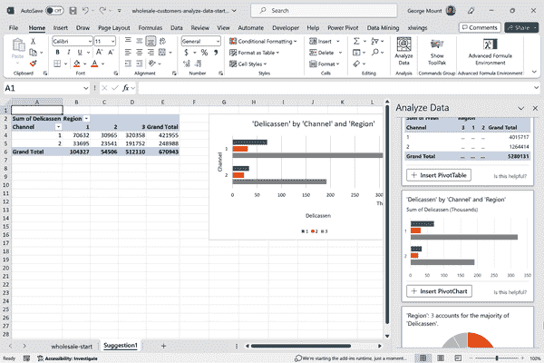

###### 图 11-1\. 插入分析数据洞察

###### 注意

由于人工智能生成的洞察力具有概率性质，例如分析数据生成的结果可能与本书所示不同。这凸显了在使用人工智能时对领域和数据具有扎实理解的重要性，因为您需要解释和导航复杂和动态的结果。

分析数据的强大之处在于其自然语言查询。例如，假设您正在与同事开会，需要快速获取杂货部门的总销售额。您可以直接向分析数据提出问题，立即获取所需信息，如图 11-2 所示。

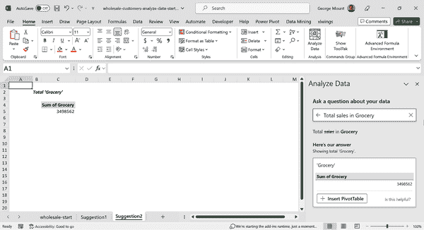

###### 图 11-2\. 分析数据中的自然语言查询

尽管查询此数据集无疑令人印象深刻，但它确实具有某些限制，主要与数据的布局相关。例如，如果尝试向分析数据询问按地区的总销售额，您将收到所有地区号码的总和，如图 11-3 所示。

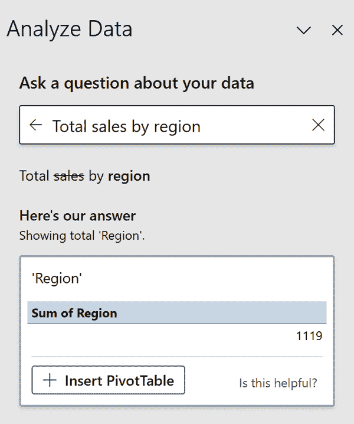

###### 图 11-3\. 分析数据遇到不正确构建的数据

分析数据不确定该怎么做，因为数据以不正确的格式呈现。不是将所有销售数字汇总到一个列中，而是分布在多个列中。因此，分析数据无法确定哪些列包含需要汇总的相关销售数字。这种格式错误的主要问题如图 11-4 所示。

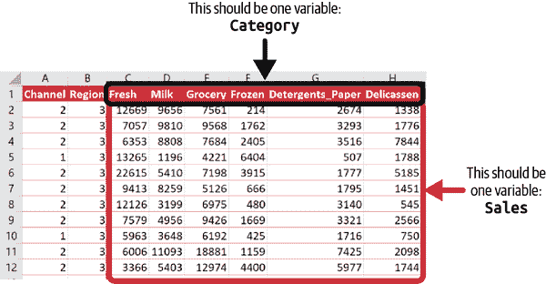

###### 图 11-4\. 如何整理此数据集以获得更好的洞察力

将数据存储在不干净或“不整洁”的格式中是分析中的一个重要障碍。您可能在自己的工作中遇到过这个问题，但没有确切地找出问题所在。对脏数据的概念理解有助于您及早识别项目中的问题，从而节省后续大量时间。要深入了解整洁数据的理论并学习如何有效处理它，请参阅第一章。

要使 AI 充分释放其发现见解的潜力，数据必须以机器可读的整洁格式存在，其中每个变量都位于单独的列中。为了解决这个问题，我们将使用 Power Query 将 `Fresh` 到 `Delicassen` 的列进行反转[¹] 并将它们重命名为 `Department` 和 `Sales`。确保将查询结果加载到 Excel 表格中。如需了解如何在 Power Query 中进行反转和加载数据集，请参考 第四章。

将数据整理成整洁格式后，查询按区域的总销售额就像轻而易举，如 图 11-5 所示。

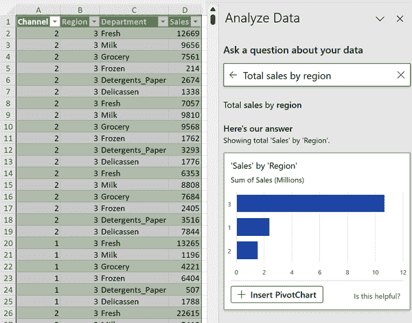

###### 图 11-5\. 在“分析数据”中找到按区域的总销售额

利用“分析数据”的强大功能，您还能从中获得哪些其他见解呢？要获取本章节以及其他演示的解决方案，请从本书伴随代码库的同一文件夹下载 *ch_11_solutions.xlsx* 文件。

分析数据是一款功能强大的增强分析工具，利用 AI 高效地提取有价值的见解。然而，对于获得最佳结果，数据的结构必须合理。通过理解整洁数据的概念并解决格式问题，用户可以充分利用 AI 发现有意义的见解的潜力。

# 使用 XLMiner 构建统计模型

XLMiner 插件为 Excel 增强了分析功能，提供了关键的数据分析和建模工具。它允许用户在 Excel 中访问高级分析功能，改进了增强分析的体验。演示的起始数据集位于 *ch_11.xlsx* 的 `housing` 工作表中。

要开始，请前往功能区，然后选择 插入文件 → 插件 → 获取插件。在 Office 插件对话框中搜索 XLMiner 并点击添加，如 图 11-6 所示。

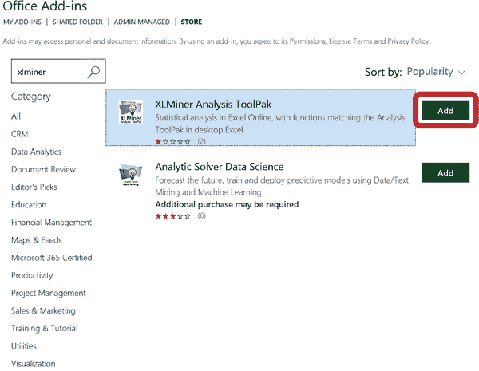

###### 图 11-6\. 获取 XLMiner 插件

同意条款和条件，点击确定，你应该会在工作表的右侧看到 XLMiner 插件。正如你所见，XLMiner 提供了大量的统计工具和技术。让我们专注于“所有模型之母”，即线性回归。

我们将以 `price` 作为因变量，`lotsize`、`airco` 和 `prefarea` 作为自变量。前往 XLMiner 插件的线性回归部分，填写如 图 11-7 所示的内容，然后点击确定。

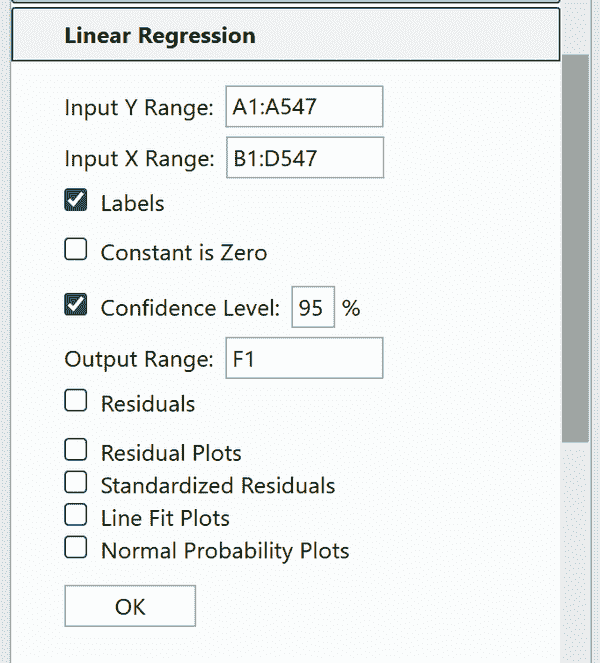

###### 图 11-7\. 在 XLMiner 中设置线性回归

在 XLMiner 中使用拖放功能命名输入范围可能有些挑战，通常需要手动输入单元格位置。

在开始构建模型和进行预测之前，进行数据集的彻底检查以确保其符合所选择模型的假设是至关重要的。虽然 Python 和 R 提供了更广泛的分析和测试工具，但在 Excel 中与数据进行实际互动也可能具有优势。XLMiner 充当了一个会合点，将 Excel 的简单数据操作能力与通常专门用于专业数据科学工具的高级分析严谨的基本方面融为一体。

在运行回归后，您应该在图 11-8 中看到来自 XLMiner 的输出。

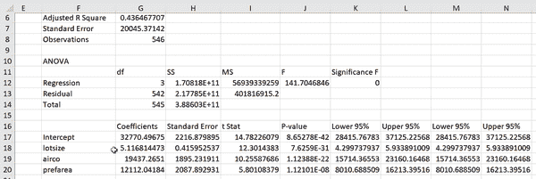

###### 图 11-8\. XLMiner 中线性回归的结果

这里有典型的回归诊断，如系数的 p 值，R 平方等。如果你想了解更多关于解释这些内容的信息，请查看我的书籍[*深入分析：从 Excel 到 Python 和 R*](https://www.oreilly.com/library/view/advancing-into-analytics/9781492094333)（O’Reilly，2021 年）。

XLMiner 通过提供一个可访问的平台进行统计建模，增强了 Excel 的数据分析能力，吸引了各种专业水平的用户。尽管它具有用户友好的界面并与 Excel 无缝集成，但 XLMiner 并不符合全面增强分析工具的标准。这主要是因为它无法支持实时模型部署，缺乏模型随时间调整的持续学习以及对神经网络等高级建模技术的不足支持。

此外，XLMiner 的有限 AI 集成限制了其全面自动化数据分析过程的能力。为了解决更复杂的分析任务，用户可能需要探索 R 或 Python 生态系统中提供的更高级工具。

# 从图像中读取数据

分析员可能会面临只能以打印输出或其他模拟格式获得数据的情况。为了避免缓慢且容易出错的手动数据输入过程，Excel 提供了一项功能，允许直接将图像中的文本转换为工作簿。

将扫描的纸质文件通过光学字符识别（OCR）转换为可编辑的计算机文本文件并非新概念。自 1970 年以来，OCR 技术已经存在并经历了重大进展。今天，它在包括 Excel 在内的各种程序中广泛可用。

对于这个演示，我们有作为打印副本存在的客户评论。我们的目标是将它们导入 Excel 进行情感分析。您可以在书籍资源的*ch_11*文件夹中找到名为*scanned_reviews.png*的文件。

要开始，请打开一个新的 Excel 工作簿，并选择“数据”→“获取和转换数据”→“从图片”→“从文件”选项卡中的“图片”。然后，导航到并选择*scanned_reviews.png*练习文件。导入文件后，您应该在工作簿右侧看到“来自图片的数据”菜单，如图 11-9 所示。

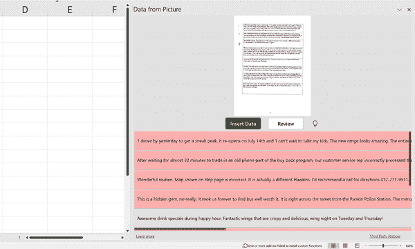

###### 图 11-9\. 来自图片警告的数据

Excel 的 OCR 功能将图像转换为文本——看似神奇，但确实会出错。利用 AI 功能，Excel 还可以预测这些错误可能发生的位置。

在这种情况下，Excel 已将除一条记录外的所有记录标记为可能包含错误。您可以单击“审阅”以扫描和仔细检查每条记录，然后对数据进行任何调整。例如，第一条条目以数字 1 开头，而应该是代词 I，如图 11-10 所示。

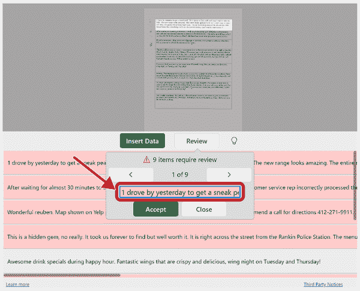

###### 图 11-10\. AI 检测到的 OCR 转录错误

在审查并识别任何潜在错误条目后，单击“插入数据”按钮将结果传输到 Excel。

Excel 的 AI 在预测文本可能含有错误时表现不错，但并非完美。例如，它可能会在条目中检测到错误，而实际上并没有——这在统计学中被称为*假阳性*。另一方面，它可能会批准一个实际上存在错误的条目——*假阴性*。

在统计学和机器学习中，平衡潜在的假阳性和假阴性表示一个重大挑战。目前，我们将依赖于 Excel 的判断，但随着您在分析旅程中的进展，可能会遇到更希望自行做出决策的情况。

插入像文本这样的非结构化数据到 Excel 中可能会带来一些挑战，因为 Excel 并非专为此类数据设计。为了保持组织性，建议为每个评论分配一个单独的单元格，并手动调整。例如，第 6 和第 7 行可以合并成一个单独的评论。

尽管 OCR 技术已存在一段时间，但其集成到 Excel 中尤为方便。此功能特别有利于管理财务报表或类似数字文档，用户可以在 Excel 中进行分析。

此演示的发现将为我们的下一个演示奠定基础。

# 使用 Azure 机器学习进行情感分析

尽管 Excel 传统上被认为是处理小型结构化数据集的工具，但与 AI 和 ML 相关的功能的引入使得这些传统限制变得模糊。这突显了在 Excel 中增强分析的巨大潜力。其中一个典型示例是利用 Excel 进行*情感分析*，从而评估文本评论集合中的情感。

情感分析是一种数据分析工具，利用机器学习算法解读非结构化数据中的情感和观点。它通常将文本分类为正面、负面或中性，帮助企业根据对品牌、产品或服务的整体情感改善客户满意度和解决问题。

手动评估几条评论不是问题，但对数千条或更多条评论进行这样的任务会变得具有挑战性。继续分析从前一节图像导入的一系列评论，我们当前的目标是将每条评论的情感分类为正面、负面或中性。为了自动化此任务，我们将利用 Azure 的文本分析功能。

第一步是将 Azure 机器学习加载项集成到 Excel 中。要做到这一点，导航到 文件 → 获取加载项。在 Office 加载项对话框中，搜索“Azure 机器学习”，点击添加，然后点击继续安装。安装完成后，Azure 机器学习加载项将出现在 Excel 窗口的右侧。接下来，选择第二个选项，“文本情感分析（Excel 加载项求解器）”，如 图 11-11 所示。

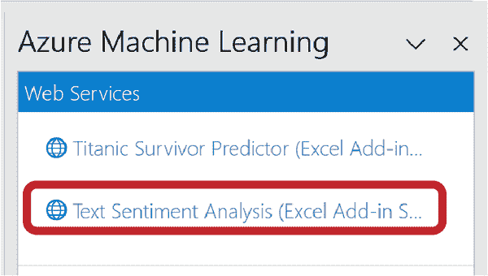

###### 图 11-11\. 选择 Azure 情感分析

Azure 要求用于情感分析的输入数据遵循特定的格式或 *模式*。以下是一个例子，说明将数据结构化为机器友好的格式对 AI 有效运行的重要性。

对于这个特定任务，我们需要在工作簿中创建三个列标题：`tweet_text`、`Sentiment` 和 `Score`。这些列名称应与 Azure 机器学习加载项的“查看模式”部分完全匹配。

第一列标题 `tweet_text` 是我们放置在上一步导入的餐厅评论的位置。尽管名为如此，但该列标题不仅限于处理推文。 `Sentiment` 和 `Score` 列将由 Azure 的情感分析加载项填充，如 图 11-12 所示。

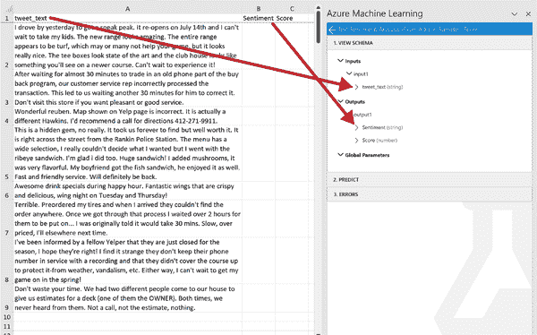

###### 图 11-12\. 创建情感分析的模式

要配置情感分析的输入，请转到加载项的预测部分，并定义输入区域。这应包括单元格 `A1:A9`，包括标题。确保选择“我的数据有标题”的选项。

对于输出区域，情感分析的结果将从单元格 `B1` 开始显示。设置此单元格以确认结果将填充在该位置。确认输入与 图 11-13 类似后，点击预测生成情感分析结果。

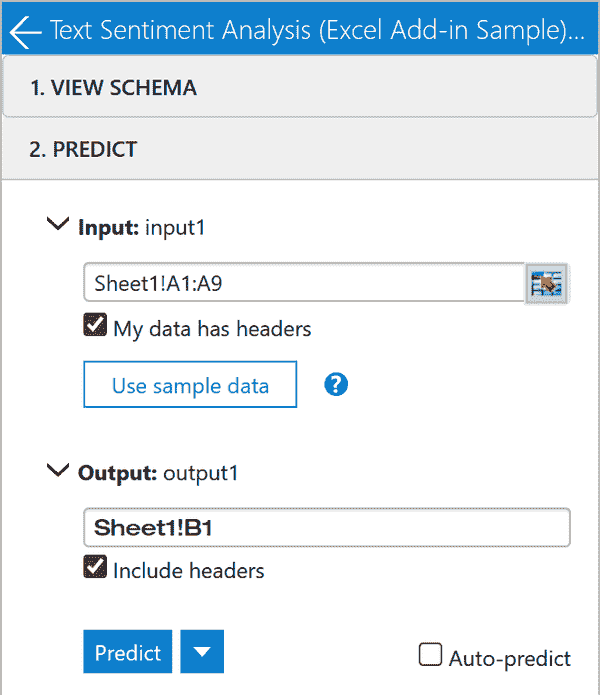

###### 图 11-13\. 定义情感分析的输入和输出

点击预测按钮后，你应该看到`B`和`C`列中填充了结果。不幸的是，这个过程有时可能会出现故障。如果遇到任何问题，请仔细检查架构和输入，或尝试重新启动 Excel。

如预期，Azure 已成功将每条评论分类为正面、负面或中性，并将结果记录在`Sentiment`列中。`Score`列包含一个从 0 到 1 的数值，表示 Azure 生成的情感分数。分数越高，表示情感越正面。这些分数随后被分类为负面、中性和正面组。

如果你想知道 Azure 是如何生成这些分数的，那是通过一个只有 Azure 能解释的复杂机器学习模型。像这样的自动化工具很方便，但它们通常缺乏透明性和可解释性。尽管这些工具无疑很强大，但它们并非没有瑕疵。例如，在图 11-14 中看到的情感分析结果中，第 3 行和第 5 行分别被标记为中性和负面，尽管它们在阅读后是负面和正面的评论。

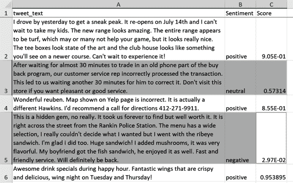

###### 图 11-14\. 情感分析中的误标注评论

故事的寓意在于充分利用人工智能的潜力，同时也要进行批判性思维，不要仅仅依赖它。虽然 AI 具有人工智能，但你具备真正的人类判断力和直觉的力量。通过结合两者的优势，你可以做出更明智的决策。

无结构数据被广泛认为是难以处理的，但 AI 很适合处理这类数据。尽管 Excel 的主要重点是结构化数据，但越来越多地将其用于无结构数据，包括文本和图像。然而，就像分析数据在特定数据布局上表现最佳一样，Azure 的情感分析插件也依赖于精确的架构，以有效地解释无结构数据的输入和输出。

情感分析只是一个开始。即将在 Excel 中集成 GPT 动力语言建模的更新，如 Copilot，在这方面代表了一个重大进步。这种集成承诺增强 Excel 的能力，并使用户能够在其 Excel 工作流中利用强大的语言建模能力。

# 结论

总之，预测分析和人工智能是强大的工具，可以帮助你更深入地了解数据并预测未来的结果。Excel 已经发展到能够整合这些工具，使用户能够利用它们进行从图像识别到创建报告和分析的各种操作。通过使用 AI 动力洞察分析数据、使用 XLMiner 构建预测模型，并将 Excel 与 Azure 机器学习集成，你可以在 Excel 中释放预测分析和人工智能的全部潜力。

# 练习

使用 Excel 的增强分析和 AI 功能进行练习，使用本书附带的[配套代码库](https://oreil.ly/modern-analytics-excel-exercises)中 *exercises\ch_011_exercises* 文件夹中的数据集。打开 *ch_11_exercises.xlsx* 开始：

1.  使用 Azure 机器学习插件对位于 `imdb` 工作表中的电影评论数据集进行情感分析。之后，应用 XLMiner 插件生成获得的分数的描述统计信息。

1.  将 *life_expectancy.png* 图像导入 Excel。使用数据分析功能生成一条线图，显示随时间变化的平均预期寿命。可能需要调整数据格式才能实现这一目标。

您可以在同一文件夹中的 *ch_11_solutions.xlsx* 中找到这些练习的解决方案。

¹ 这是在[原始数据集](https://archive.ics.uci.edu/dataset/292/wholesale+customers)中使用的拼写方式。
