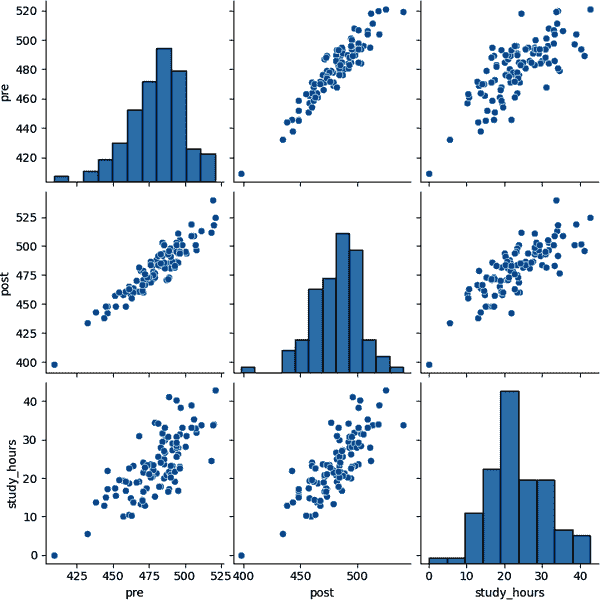
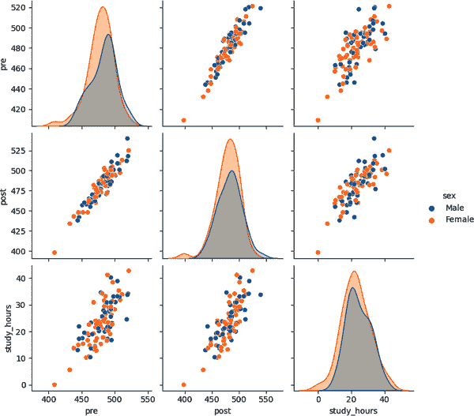

# 第十二章：Python 与 Excel

到目前为止，本书主要关注专为 Microsoft 生态系统设计的工具，如 Power Pivot 和 Power Query。但是，本章结尾讨论的是一种日益流行并与几乎所有可想象的计算机应用兼容的重要编程语言，包括 Excel 在内。欢迎初探 Python 如何增强您的 Excel 体验。

本章故意放置在书的末尾，因为我知道这可能会引起典型 Excel 用户的担忧。尽管如此，如果您已经达到这个阶段并且有兴趣在现代分析领域提升 Excel 的能力，我强烈建议您尝试 Python。

而且，不仅仅是我个人的意见，Microsoft 本身也通过在 Excel 中开发官方的本地 Python 应用程序来认可 Python 与 Excel 之间的协同作用，显著扩展了分析师利用这两个强大工具共同实现的范围。

然而，这只是 Python 与 Excel 结合的较新的专业应用之一，并未完全展示 Python 为 Excel 用户提供的广泛功能。在本章中，我们将探讨两者之间更广泛的概念关系，并附有一些示例。如果您发现本章内容有趣，我鼓励您深入了解 Python 在 Excel 中的原生集成。

###### 注意

本章提供的示例并未利用 Excel 中的原生 Python 集成。相反，它们展示了结合这些工具以实现超越当前 Python-Excel 集成能力的自动化的替代方法。

# 读者先决条件

虽然本章可以在不具备 Python 先验知识的情况下完成，但熟悉列表、索引、循环以及 pandas 和 seaborn 包等概念将极大地增强您的理解能力。

如果您在阅读前想更多了解 Python，我建议先阅读我的书籍[*深入分析：从 Excel 到 Python 和 R*](https://www.oreilly.com/library/view/advancing-into-analytics/9781492094333)，为 Excel 用户提供了 Python 的基本介绍。要更深入地了解这个主题，请查阅 Felix Zumstein 的[*Python for Excel: A Modern Environment for Automation and Data Analysis*](https://www.oreilly.com/library/view/python-for-excel/9781492080992)（O’Reilly，2021）。

本章主要是 Python 编程的实际演示。为了从中获得最大收益，我鼓励您积极参与并使用自己的计算机。您只需下载[Anaconda 发行版](https://www.anaconda.com)，即可免费获得 Python 的完全版本。

# Python 在现代 Excel 中的角色

有意向的学习者经常觉得 Python，作为 Excel 相关的工具，令人生畏。许多 Excel 用户认为它应该是他们学习列表中的最后一项，因为它不是微软产品，并且需要掌握一门新的语言能力。

对于每个 Excel 用户来说，Python 可能并不是最佳选择，但对于那些希望构建复杂自动化、版本控制项目和其他高级开发产品的人来说，认真考虑它是值得的。让我们探讨 Python 在现代分析中的角色及其与现代 Excel 的关系。

## 日益增长的技术栈需要胶水

当我刚开始作为分析师时，我的工具箱从头到尾都是 Excel。数据管理、报告、仪表板——一切都在熟悉的绿白界面下。

几年过去了，随着 Power BI、Office Scripts、Jupyter Notebooks 甚至是 Excel 内部的 Python 集成的引入，整个景观发生了巨大变化。这种扩展反映了更广泛的技术转变：从单一的全能应用向专业化、互连的工具网络转变。

浏览这个多样化的生态系统需要一个“指挥家”或“胶水”，无缝地整合各种组件。无论是在平台间传输数据、以新方式可视化数据，还是将基于云的机器学习模型部署到用户的仪表板上，Python 都是一个出色的选择。其多才多艺涵盖了从编写简单脚本到开发复杂企业级解决方案的各个领域，使其与多种操作系统和编程语言兼容。

微软赞扬 Python 作为一种多才多艺的“胶水”语言，在 Azure、Power BI、SQL Server 等各个领域中广泛应用。Python 在开发者和组织中的普及使其拥有了一个充满活力的用户社区和丰富的资源。

## 网络效应意味着更快的开发时间

“每个人都在做”通常不是参与某事的好理由，但在编程语言的情况下可能有其道理。

*网络效应*，即价值随用户基础增长而增加的概念，适用于编程语言。随着更多程序员的加入，代码共享扩展，为使用和进一步开发提供了更大的代码库，创造了一个良性循环。

Python 作为一种中性的“胶水”语言的多才多艺性导致它在各种职业中被采纳，包括数据库管理、Web 开发和数据分析。这意味着，无论您的 Excel 项目走向何方或需要哪些工具，都很有可能找到“懂”Python 的合作者。

例如，想象一下使用 Excel 开发库存跟踪器或类似工具，只发现它对于基本工作簿来说变得过于复杂，或者因其受欢迎程度而需求转变为独立的 Web 应用程序。这种转变通常代表着一项相当大的挑战。然而，如果最初的编程是用 Python 完成的，这种转变可以显著更加高效和快速。

Python 在 Web 开发领域的多功能性和广泛支持，有助于与各种 Web 技术和平台更顺畅地集成。因此，将你基于 Excel 的解决方案演变为完全运作的 Web 应用程序所需的时间大大缩短。基于 Python 开始使你处于有利地位，并为未来的增长或调整提供了坚实的基础，从而优化项目扩展的发展轨迹。

## 将现代开发引入 Excel

Python 使现代 Excel 开发者能够在软件开发中实施最佳实践，包括单元测试、版本控制和包开发。

### 单元测试

单元测试涉及测试软件的各个组件或单元，以验证每个单元在独立运行时的正确功能。它帮助开发者在开发过程的早期阶段识别和修复错误，确保最终产品的可靠性和性能。

许多编程语言提供单元测试功能，以保证代码按预期运行。然而，Excel 并不原生支持这一能力。虽然有替代工具可用，但 Python 凭借其广泛的网络效应和丰富的包装择，成为单元测试的优秀选择。自动化单元测试提高了可靠性，减少了错误的发生几率，这对技术水平各异的个人使用的 Excel 工作簿尤为有益。

### 版本控制

版本控制系统追踪仓库中的更改，使用户能够查看贡献、恢复到先前版本等操作。如果你曾经为区分多个类似于 *budget-model-final.xlsx* 和 *budget-model-FINAL-final.xlsx* 的工作簿而苦恼过，你一定能体会到版本控制的实用性。

尽管 Excel 提供了有限的版本控制功能，如在 OneDrive 中查看版本历史和使用 Spreadsheet Inquire 插件，但与将代码制作过程转移到 Python 时可用的广泛功能相比，仍然不足。

### 包开发和分发

如果你正在寻找一个立即采纳 Python 进行日常分析任务的理由，让我来强调一个关键优势：*包*。

虽然我喜欢开发自己的工具，但我也相信在满足需求时利用现有解决方案的价值。Python 强大的创建和分发包能力，尤其是通过 Python Package Index，为难以与 Excel 插件或 VBA 模块匹配的工具打开了一扇门。其中绝大多数工具都是开源的，且免费提供。

无论您的目标是从应用程序编程接口（API）收集数据、分析图像还是简单地生成描述性统计信息，Python 包的广泛可用性都充分说明值得投资学习 Python。值得注意的是，其中一些包甚至专为与 Excel 平稳集成而设计。

## 使用 Python 和 Excel 与 pandas 和 `openpyxl` 结合使用

考虑到 Python 在现代 Excel 中的角色，让我们探讨两者如何共同工作。促进此集成的两个关键包是 pandas 和 `openpyxl`。让我们依次考虑这两个。

### 为什么选择 pandas 作为 Excel？

如果您在 Python 中处理任何类型的表格数据，没有 pandas 是无法为您提供帮助的。该包允许您执行以下操作之一：

+   排序和筛选行

+   添加、删除和转换列

+   聚合和重塑表格

+   合并或附加多个表格

这相当于 Power Query 的 Python 等效物，使您能够创建可重用的数据清理和转换工作流程。就像 Power Query 一样，pandas 可以轻松地从各种来源（包括 Excel）导入数据，甚至将分析结果再次导出到 Excel。

### pandas 在处理 Excel 中的限制

尽管如此，pandas 在与 Excel 工作簿的深度交互方面功能有限。例如，它无法处理以下任务：

+   单元格的高级格式选项，如应用特定样式或条件格式

+   支持在工作簿内执行 Excel 宏或 VBA 代码

+   直接访问 Excel 特定功能，如数据验证、图表、数据透视表或公式

+   操作工作表，如修改或删除数据

幸运的是，存在几个包来提供这些更高级的 Python/Excel 功能，其中最显著的是 `openpyxl`。

### `openpyxl` 的贡献

`openpyxl`（发音为 *open pie Excel*）是一个 Python 包，提供处理 Excel 文件（特别是 *.xlsx* 文件格式）的功能。它允许用户以编程方式读取、写入和修改 Excel 电子表格。`openpyxl` 与 pandas 无缝集成，允许用户使用 pandas 清洗数据，并使用 `openpyxl` 为工作簿添加附加功能。

虽然 `openpyxl` 有其局限性，无法覆盖每种 Excel 使用情况，但它仍然是开始自动化 Excel 任务的最佳 Python 包。

### 如何使用 `openpyxl` 与 pandas

让我们来看一个典型的用例，即自动化常规的 Excel 业务报告，分析师需要从多个 Excel 工作表中生成每月销售报告。对于这些及其他任务，使用 pandas 与 openpyxl 的基本工作流程如下：

1.  读取数据：使用 pandas 从各种来源提取数据到表格 DataFrame 中。

1.  清理和分析数据：使用 pandas 清理和操作数据，执行计算，应用过滤器，处理缺失值，并得出相关的见解。

1.  生成报告：使用 openpyxl 创建一个新的 Excel 工作簿或选择一个现有的工作簿。用整理后的数据填充工作簿，应用条件格式，创建图表，并添加任何所需的视觉元素。

1.  保存报告：使用 openpyxl 保存更新后的 Excel 工作簿，指定所需的文件名和位置。

1.  分发和自动化报告：通过电子邮件、文件共享平台或任何首选方法将生成的报告发送给预期的接收者。

## 其他用于 Excel 的 Python 包

尽管在与 pandas 特别是结合使用时对 Excel 任务非常强大，但 openpyxl 有其局限性。幸运的是，其他可以处理特定用例的包也是可用的。以下是一些需要注意的其他包：

[XlsxWriter](https://pypi.org/project/XlsxWriter)

与 openpyxl 类似，XlsxWriter 可用于在*.xlsx*格式中编写数据、添加格式和创建图表到 Excel 文件中。该包在处理大型数据集时性能优化良好。尽管如此，顾名思义，XlsxWriter 只能处理向 Excel 写入数据，而 openpyxl 可以读写数据。

[xlwings](https://www.xlwings.org)

此包使 Excel 任务自动化成为可能，包括与 Excel 工作簿交互、运行 VBA 宏以及在 Windows 上访问 Excel 的 COM（组件对象模型）API。它提供了 Excel 与 Python 之间的完全双向通信，这是 openpyxl 所不能实现的。另一方面，此包需要更复杂的开发环境，在 Windows 上提供许多功能。

[PyXLL](https://www.pyxll.com)

这是一个付费库，允许用户使用 Python 编写 Excel 插件。PyXLL 不仅可以自动化 Excel 工作簿，还允许开发人员构建独立的数据科学、金融交易和其他用途的应用程序。这使用户可以直接在 Excel 中使用 Python 开发的应用程序，而无需执行任何 Python 代码或理解底层 Python 机制。

存在许多其他用于 Excel 相关任务的 Python 包，每个都有其独特的优势和劣势。

# 展示 Excel 自动化演示与 pandas 和 openpyxl

是时候停止讨论并开始构建了！在本节中，我们将使用 pandas、openpyxl 等工具从 Python 自动化生成一个小报告。

首先，我们将使用 pandas 执行在 Excel 中难以实现的复杂数据清理和分析任务。然后，我们将创建一个概述工作表，包括简要的数据摘要和两个图表，一个来自原生 Excel，另一个来自 Python。最后，我们将加载整个数据集到一个新的工作表中，并格式化结果。

这个脚本的完成版本可以在书的配套存储库的 *ch_12* 文件夹中的 *ch_12.ipynb* 中找到。如果你不确定如何打开、导航或与该文件进行交互，请参阅 [*进阶数据分析：从 Excel 到 Python 和 R*](https://www.oreilly.com/library/view/advancing-into-analytics/9781492094333) 的第三部分，作为 Python 和 Jupyter Notebooks 的入门。

让我们导入相关的模块和数据集，开始工作：

```
In [1]: # Data manipulation and visualization
        import pandas as pd
        import seaborn as sns

       # Excel file manipulation
       from openpyxl import Workbook
       from openpyxl.styles import PatternFill
       from openpyxl.chart import BarChart, Reference
       from openpyxl.drawing.image import Image
       from openpyxl.utils import get_column_letter
       from openpyxl.utils.dataframe import dataframe_to_rows
       from openpyxl.worksheet.table import Table, TableStyleInfo
```

pandas 库能够通过 `read_excel()` 函数从各种格式（包括 Excel 工作簿）中导入数据。让我们导入 *contestants.xlsx* 文件，并将结果命名为 `contestants` 的 DataFrame：

```
In [2]: contestants = pd.read_excel('data/contestants.xlsx')
```

## 清理 pandas 中的数据

一个 pandas DataFrame 可能包含数千甚至数百万行数据，因此在每个分析步骤都打印所有行数据是不切实际且计算效率低下的。然而，通过目视检查数据来理解其内容是非常重要的，这是 Excel 用户熟知的好处。为了快速审查数据并确保其符合我们的预期，我们可以使用 `head()` 方法，它显示前五行数据：

```
In [3]: contestants.head()

Out[3]:

  EMAIL                          PRE POST SEX    EDUCATION  STUDY_HOURS
0 smehaffey0@creativecommons.org 485 494  Male   Bachelor's 20.0
1 dbateman1@hao12@.com           462 458  Female Bachelor's 14.8
2 bbenham2@xrea.com              477 483  Female Bachelor's 22.2
3 mwison@@g.co                   480 488  Female Bachelor's 21.3
4 jagostini4@wordpress.org       495 494  Female NaN        26.2
```

基于这些数据预览，我们发现了一些需要解决的问题。首先，似乎一些电子邮件地址的格式不正确。此外，`EDUCATION` 列中有一个名为 `NaN` 的值，看起来不合适。我们可以通过一些方法解决数据集中的这些和其他问题，这在 Excel 的功能中很难或不可能完成。

### 处理元数据

一个良好的数据分析和转换程序应同样擅长处理数据和元数据，例如列标题。在这方面，pandas 是一款特别适合的工具。

目前，我们的 DataFrame 的列名都是大写的。为了更容易输入列名，我更喜欢使用小写名称。幸运的是，在 pandas 中，我们可以用一行代码完成这个操作：

```
In [4]: contestants.columns = contestants.columns.str.lower()
        contestants.head()

Out[4]:

  email                          pre post sex    education  study_hours
0 smehaffey0@creativecommons.org 485 494  Male   Bachelor's 20.0
1 dbateman1@hao12@.com           462 458  Female Bachelor's 14.8
2 bbenham2@xrea.com              477 483  Female Bachelor's 22.2
3 mwison@@g.co                   480 488  Female Bachelor's 21.3
4 jagostini4@wordpress.org       495 494  Female NaN        26.2
```

### 模式匹配/正则表达式

这个 DataFrame 中的 `email` 列列出了每个参赛者的电子邮件地址。我们的目标是从该列中消除任何包含无效电子邮件地址的行。

为了实现这一目标，我们可以使用文本模式匹配，这是由一个称为*正则表达式*的工具包来实现的。尽管 Power Query 提供了基本的文本操作功能，如转换文本大小写，但它不支持搜索特定的文本模式——这是 Python 提供的一项功能。

制作和验证正则表达式可能很复杂；然而，有许多在线资源如 ChatGPT 可以帮助完成这个过程。这是我们将使用的正则表达式：

```
In [5]: # Define a regular expression pattern for valid email addresses
        email_pattern = r'^[a-z0-9]+[\._]?[a-z0-9]+[@]\w+[.]\w{2,3}$'
```

接下来，我们可以使用`str.contains()`方法仅保留符合模式的记录：

```
In [6]: full_emails = contestants[contestants['email'].str.contains(email_pattern)]
```

要确认有多少行已被过滤掉，我们可以比较两个 DataFrame 的`shape`属性：

```
In [7]: # Dimensions of original DataFrame
        contestants.shape

Out[7]: (100, 6)
```

```
In [8]: # Dimensions of DataFrame with valid emails ONLY
        full_emails.shape

Out[8]: (82, 6)
```

将我们的选择精简为仅包含有效电子邮件地址的参与者，将参与者数量从 100 减少到 82。

### 分析缺失值

`info()`方法提供了 DataFrame 的维度和附加属性的全面概述：

```
In [9]: full_emails.info()

    <class 'pandas.core.frame.DataFrame'>
    Index: 82 entries, 0 to 99
    Data columns (total 6 columns):
     #   Column       Non-Null Count  Dtype
    ---  ------       --------------  -----
     0   email        82 non-null     object
     1   pre          82 non-null     int64
     2   post         82 non-null     int64
     3   sex          82 non-null     object
     4   education    81 non-null     object
     5   study_hours  82 non-null     float64
    dtypes: float64(1), int64(2), object(3)
    memory usage: 4.5+ KB
```

在包括 Power Query 在内的许多计算机程序中，术语`null`表示缺失或未定义的值。在 pandas 的 DataFrame 中，这个概念表示为`NaN`，即“不是一个数字”。

虽然基本的 Excel 没有确切对应于`null`，Power Query（如第二章中所述）包含了这个值，显著增强了数据管理和检查过程。然而，在 Power Query 中以编程方式处理这些缺失值，比如在所有列中消除它们，可能会带来挑战。使用 pandas 可以简化这个任务。

例如，如果希望确定哪些列包含最高百分比的缺失值，pandas 可以轻松地进行此分析：

```
In [10]: full_emails.isnull().mean().sort_values(ascending=False)

Out[10]:

    education      0.012195
    email          0.000000
    pre            0.000000
    post           0.000000
    sex            0.000000
    study_hours    0.000000
    dtype: float64
```

由于缺失值很少，且只在一列中，我们将简单地删除任何一行，只要该行的任何一列中存在缺失观察值：

```
In [11]: complete_cases = full_emails.dropna()
```

要确认 DataFrame 中已清除所有缺失观察值，我们可以再次使用`info()`方法：

```
In [12]: complete_cases.info()

    <class 'pandas.core.frame.DataFrame'>
    Index: 81 entries, 0 to 99
    Data columns (total 6 columns):
     #   Column       Non-Null Count  Dtype
    ---  ------       --------------  -----
     0   email        81 non-null     object
     1   pre          81 non-null     int64
     2   post         81 non-null     int64
     3   sex          81 non-null     object
     4   education    81 non-null     object
     5   study_hours  81 non-null     float64
    dtypes: float64(1), int64(2), object(3)
    memory usage: 4.4+ KB
```

### 创建一个百分位数

使用 pandas，我们将为`post`列创建一个百分位数排名，并通过`describe()`运行描述性统计以确认其有效性：

```
In [13]: complete_cases['post_pct'] = complete_cases['post'].rank(pct=True)
         complete_cases['post_pct'].describe()

Out[13]:

         count    81.000000
         mean      0.506173
         std       0.290352
         min       0.012346
         25%       0.265432
         50%       0.506173
         75%       0.759259
         max       1.000000
         Name: post_pct, dtype: float64
```

在 Excel 中创建百分位数列很简单，但通过 pandas 的统计函数、处理缺失值的方法等验证结果更容易。

让我们确认我们的数据集已经通过 pandas 进行了清理和转换：

```
In [14]: complete_cases.describe()

Out[14]:

      pre        post       study_hours post_pct
count 81.000000  81.000000  81.000000   81.000000
mean  480.506173 481.012346 23.445679   0.506173
std   20.626514  23.037737  8.178142    0.290352
min   409.000000 398.000000 0.000000    0.012346
25%   470.000000 467.000000 18.700000   0.265432
50%   484.000000 483.000000 22.600000   0.506173
75%   494.000000 497.000000 29.000000   0.759259
max   521.000000 540.000000 42.800000   1.000000
```

现在让我们使用 openpyxl 创建一个样式化的摘要报告。

## 使用 openpyxl 汇总结果

现在我们已经使用 pandas 中的各种技术正确准备了数据，我们将使用 openpyxl 在 Excel 中创建一个摘要。这将包括关键数字和标签，以及数据可视化。

### 创建一个摘要工作表

要开始使用 openpyxl 构建 Excel 工作簿，我们将声明表示工作簿和工作表对象的变量：

```
In [14]: # Create a new workbook and select the worksheet
         wb = Workbook()

         # Assign the active worksheet to ws
         ws = wb.active
```

从那里，我们可以使用其字母数字引用在活动表的任何单元格中填充。我将在单元格`A1:B2`中插入和标记平均前后分数：

```
In [16]: ws['A1'] = "Average pre score"

         # Round output to two decimals
         ws['B1'] = round(complete_cases['pre'].mean(), 2)
         ws['A2'] = "Average post score"
         ws['B2'] = round(complete_cases['post'].mean(), 2)
```

以这种方式将数据插入工作簿仅构成基本的数据转储；它不会影响数据在 Excel 中的显示方式。根据我的数据格式化经验，我预计 A 列中的标签将需要额外的宽度。我将通过工作表的 `width` 属性来调整它。

```
In [17]: ws.column_dimensions['A'].width = 16
```

本章后面，我们将讨论如何实现类似自动适应的列宽调整。但现在，让我们将注意力转移到向摘要中添加图表上。

使用 Python 生成 Excel 图表有两种方法。一种方法是直接从 Python 代码脚本化创建 Excel 图表，另一种方法是在 Python 中制作图表，然后将其插入到 Excel 工作簿中。这两种策略各有优缺点，将依次探讨。

### 插入图表

使用 Python 生成 Excel 图表有两种方法。一种方法是直接从 Python 代码脚本化创建 Excel 图表，另一种方法是在 Python 中制作图表，然后将其插入到 Excel 工作簿中。这两种策略各有优缺点，将依次探讨。

#### 选项 A：创建本机 Excel 图表

Excel 的数据可视化功能很受欢迎，因为它们易于使用且对于基本的可视化任务非常有效。让我们探讨如何使用 openpyxl 从 Python 创建本机 Excel 图表。

首先，我们需要指定要创建的 Excel 图表类型，并在工作表中标识图表数据的位置：

```
In [18]: # Create a bar chart object
         chart = BarChart()

         # Define the data range
         data = Reference(ws, min_col=2, min_row=1, max_col=2, max_row=2)
```

接下来，我们将将此数据源添加到图表中，并为图表的标题和轴添加标签：

```
In [19]: # Add data to the chart
         chart.add_data(data)

         # Set chart title, axis labels
         chart.title = "Score Comparison"
         chart.x_axis.title = "Score Type"
         chart.y_axis.title = "Score Value"
```

让我们进一步定制这个图表。我们将设置类别标签以反映第一列中的数据，并且还将删除图例：

```
In [20]: # Set category names
         categories = Reference(ws, min_col=1, min_row=1, max_row=2)
         chart.set_categories(categories)

         # Remove the legend
         chart.legend = None
```

在图表完全定义并样式化后，现在是将其插入工作表的时候了：

```
In [21]: # Add the chart to a specific location on the worksheet
         ws.add_chart(chart, "D1")
```

#### 选项 B：插入 Python 图像

Python 在数据可视化方面相比 Excel 具有优势，因为它提供了更多样化的可视化选项，并允许更轻松地定制绘图。例如，Excel 缺乏一种内置解决方案，用于同时分析多个变量之间的关系。然而，seaborn 数据可视化包提供了 `pairplot()` 函数，提供了一种快速方便的方法来探索这些关系。

下面的区块可视化了参赛选手在所选变量之间的关系。您可以在图 12-1 中查看结果：

```
In [22]: sns.pairplot(contestants[['pre', 'post', 'study_hours']])
```



###### 图 12-1\. 使用`seaborn`创建的 Pairplot

Python 不仅包含了一些在 Excel 中难以构建的图表类型，而且它们也很容易进行定制。例如，我想按`sex`来查看这个可视化效果，可以通过将其传递给 `hue` 参数来实现。我将保存此图的结果（见图 12-2）为 `sns_plot`，以便稍后参考：

```
In [23]: sns_plot = sns.pairplot(contestants[['pre', 'post',
            'study_hours', 'sex']], hue='sex')
```



###### 图 12-2\. 按性别绘制的 Pairplot

接下来，让我们将这个 pairplot 的静态图像放入工作簿中。首先需要将图像保存到磁盘，然后指定放置到工作簿中的位置：

```
In [21]: # Save pairplot to disk as an image
         sns_plot.savefig('pairplot.png')

         # Load saved image into the worksheet
         image = Image('pairplot.png')
         ws.add_image(image, 'A20')
```

我特别喜欢 Python 绘图的一个方面是它们易于定制，并且可以在各种类型的图之间轻松迭代。这种试错的方法在 Excel 中更具挑战性，因为其图表选项有限，而且增强它们的视觉吸引力需要相当大的努力。

然而，重要的是要注意，导入到 Excel 中的 Python 绘图本质上是静态图像。如果底层数据发生变化，这些图表不会像本地 Excel 图表那样自动更新。此外，导入的 Python 绘图缺乏诸如标准 Excel 图表中悬停在元素上时出现的工具提示等交互功能。

###### 注意

Python 最近与 Excel 的集成使得可以创建一些具有一定交互性并且可以根据源数据变化而更新的 Python 绘图。关于这一功能的出色演示，请参阅 Excel MVP Mynda Treacy 的 [此博文](https://oreil.ly/jmS0f)。

### Excel 与 Python 图表

这两种方法的优缺点总结如 Table 12-1 所示。

表 12-1\. Python 与 Excel 图表的优缺点

|  | 优点 | 缺点 |
| --- | --- | --- |
| 构建本地 Excel 图表 |

+   图表将随 Excel 数据的变化而更新。

+   用户可以与绘图进行交互并进行自定义。

+   绘图可以与 Excel 的其他功能（如公式和数据透视表）集成。

|

+   Excel 中存在的图表类型数量有限。

+   定制或迭代 Excel 图表可能会有困难。

|

| 插入 Python 绘图的图像 |
| --- |

+   可以访问几个强大的绘图库，如`matplotlib`和`seaborn`。

+   通过源代码可以轻松审计和重现绘图。

|

+   该图是静态图像，缺乏交互性。

+   无法从 Excel 更新或刷新图表。

|

方法选择取决于不同因素，如数据刷新需求以及 Excel 中特定图表类型的可用性。尽管如此，Python 自身的灵活性和多样的选项显示了其在处理 Excel 方面的强大能力。

## 添加一个样式化的数据源

现在我们已经创建了总结工作表，接下来我们将创建第二个样式化的工作表，其中包含`complete_cases` DataFrame。首先是定义这个新工作表：

```
In [25]: ws2 = wb.create_sheet(title='data')
```

接下来，我们将遍历`complete_cases`的每一行，并将每一行单独插入到工作表中：

```
In [26]: for row in dataframe_to_row(complete_cases, index=False, header=True):
            ws2.append(row)
```

将 DataFrame 插入工作表是一种开始，但由此产生的数据可能对用户阅读和操作有挑战性。让我们做一些改进。

### 格式化百分比

默认情况下，`post_pct`列将以小数形式而不是更易读的百分比形式格式化。为了解决这个问题，我们需要指定工作表中此列的位置并重新格式化它。

我将使用`get_loc()`方法来查找 DataFrame 中`post_pct`列的索引位置，并将结果加 1 以适应 Excel 的基于 1 的索引，而不是 Python 的基于 0 的索引。然后，`get_column_letter()`函数将把这个索引号转换为 Excel 的字母列引用：

```
In [27]: post_pct_loc = complete_cases.columns.get_loc('post_pct') + 1
         post_pct_col = get_column_letter(post_pct_loc)
         post_pct_col

Out[27]: 'J'
```

确定了适当的列之后，我将为每一行应用所需的数值格式：

```
In [28]: number_format = '0.0%'

         for cell in ws2[post_pct_col]:
             cell.number_format = number_format
```

#### 转换为表格

如在第一章中讨论的，Excel 表格在数据存储和分析中具有多种好处。我们可以使用以下代码将这个数据集转换为表格：

```
In [29]: # Specify desired table formatting
         style = TableStyleInfo(name='TableStyleMedium9', showRowStripes=True)

         # Name and identify range of table
         table = Table(displayName='contestants',
             ref='A1:' + get_column_letter(ws2.max_column) +
                str(ws2.max_row))

         # Apply styling and insert in worksheet
         table.tableStyleInfo = style
         ws2.add_table(table)
```

#### 应用条件格式

为了提高最终用户的可读性，我们可以对工作表应用条件格式。以下代码将对超过 90 分位数的参与者应用绿色背景填充，对超过 70 分位数的参与者应用黄色背景填充：

```
In [30]: # Define conditional formatting style
         green_fill = PatternFill(start_color="B9E8A2",
             end_color="B9E8A2", fill_type="solid")
         yellow_fill = PatternFill(start_color="FFF9D4",
             end_color="FFF9D4", fill_type="solid")

         # Loop through data table and conditionally apply formatting
         for row in ws2.iter_rows(min_row=2, min_col=1,
                max_col=len(complete_cases.columns)):
             # Convert index to 0-based indexing
             post_pct = row[post_pct_loc - 1].value
             if post_pct > .9:
                for cell in row:
                    cell.fill = green_fill
             elif post_pct > .7:
                 for cell in row:
                    cell.fill = yellow_fill
```

#### 自动调整列宽度

尽管 openpyxl 缺乏自动调整工作表列宽的功能，我们可以使用以下代码实现类似的效果。它查找工作表每列中最宽的行，然后添加足够的填充来相应调整该列的宽度：

```
In [31]: for column in ws2.columns:
         max_length = 0
         column_letter = column[0].column_letter
         for cell in column:
             try:
                if len(str(cell.value)) > max_length:
                max_length = len(cell.value)
            except:
                pass
         adjusted_width = (max_length + 2) * 1.2
         ws2.column_dimensions[column_letter].width = adjusted_width
```

完成工作簿后，我们可以将结果保存到*ch12-output.xlsx*中：

```
In [32]: wb.save('output/ch12-output.xlsx')
```

# 结论

本章深入探讨了 Python 在增强现代 Excel 中的重要作用，强调了其作为开发中“胶水”语言的多功能性以及增强 Excel 功能的能力。通过实际演示，它展示了 Python 如何自动化 Excel 任务，引入了在仅仅电子表格程序内部难以实现的功能特性。

随着微软继续将 Python 整合到其数据分析套件中，Python 与 Excel 之间的协同作用将不断发展。尽管如此，本章为同时利用 Python 和 Excel 打下了坚实的基础，释放它们的全部潜力。

# 练习

要在书的[配套存储库](https://oreil.ly/modern-analytics-excel-exercises)中的*exercises\ch_12_exercises*文件夹中的*websites.xlsx*文件的简明汇总报告中创建，首先使用提供的*ch_12_exercises.ipynb* Jupyter Notebook 作为基础。完成该 Notebook 中的缺失部分，以达到解决方案，解决方案在同一文件夹中命名为*ch_12_exercise_solutions.ipynb*中可用。

要准确编写代码，请参考本章提供的示例。鼓励您通过集成额外的自动化功能来增强您的工作。
