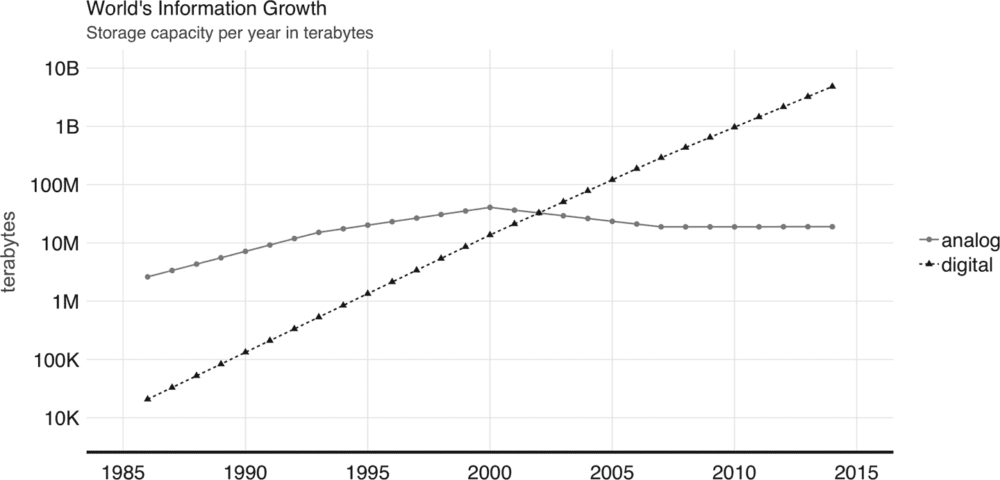
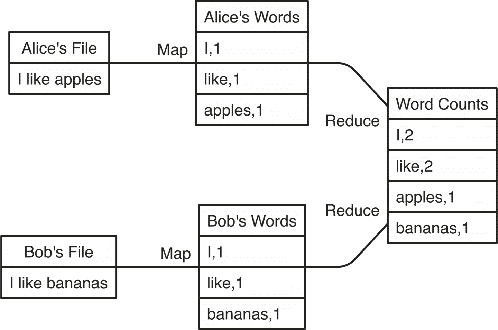
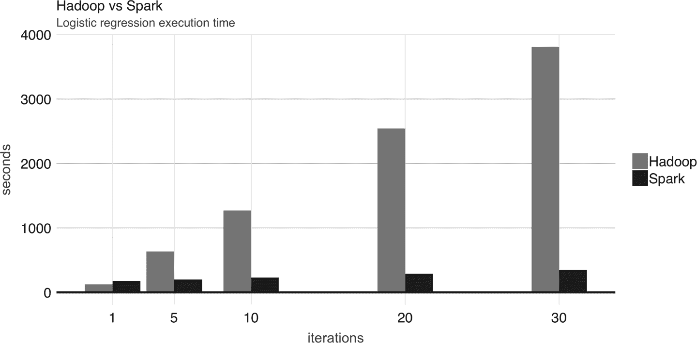
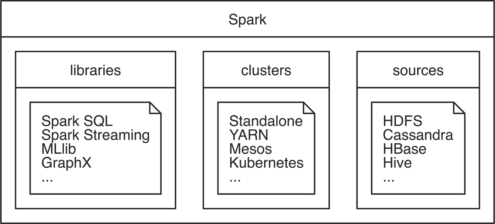
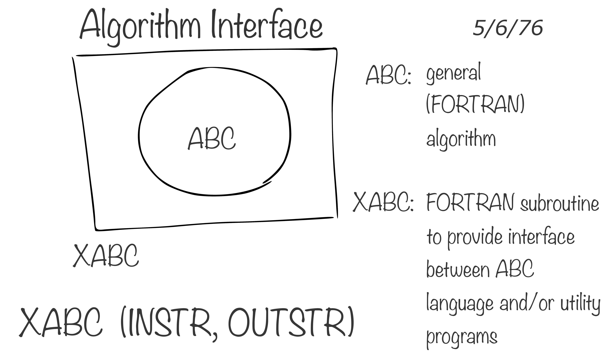
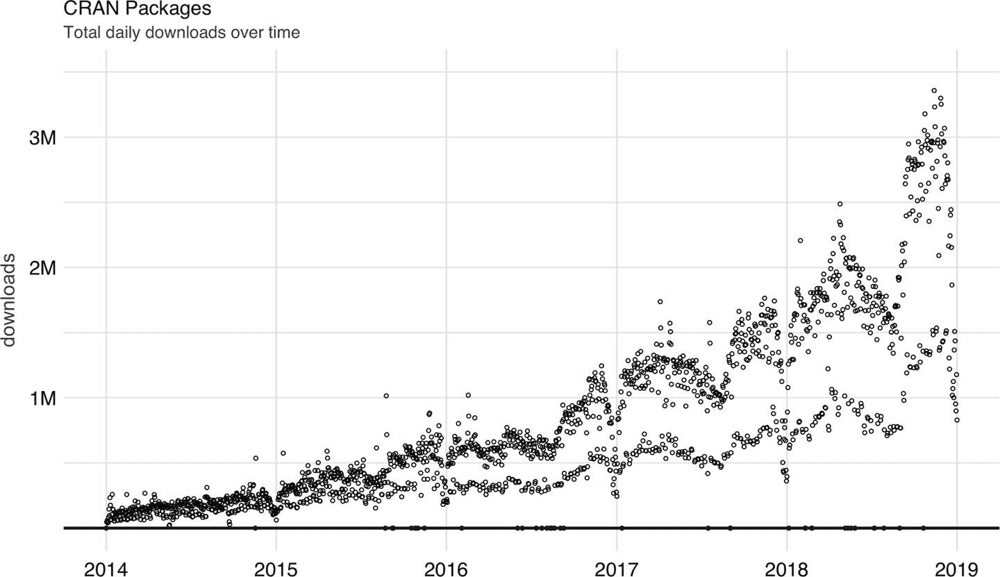

# 第一章·介绍

> 你什么也不知道，琼·雪诺。
> 
> ——伊格丽特

随着信息以指数速度增长，历史学家们将这段历史称为信息时代并不足为奇。数据收集速度的增加创造了新的机会，并肯定会创造更多。本章介绍了用于解决大规模数据挑战的工具。首先，它介绍了 Apache Spark 作为领先的工具，使我们能够处理大型数据集。在此背景下，我们介绍了专门设计简化数据分析的 R 计算语言。最后，我们介绍了`sparklyr`，这是一个将 R 和 Spark 合并为一个强大工具的项目，非常易于所有人使用。

第二章，*入门*介绍了在个人计算机上使 Spark 和 R 工作所需的先决条件、工具和步骤。您将学习如何安装和初始化 Spark，介绍常见操作，并完成您的第一个数据处理和建模任务。该章的目标是帮助任何人掌握开始解决大规模数据挑战所需的概念和工具，这些挑战直到最近只有少数组织才能访问。

然后，您将进入学习如何分析大规模数据，接着是构建能够预测趋势并发现大量信息中隐藏信息的模型。到那时，您将拥有在规模上执行数据分析和建模所需的工具。随后的章节将帮助您摆脱本地计算机，转向解决许多实际问题所需的计算集群。最后几章介绍了额外的主题，如实时数据处理和图分析，这些是您真正掌握在任何规模上分析数据的艺术所需的工具。本书的最后一章为您提供了考虑回馈 Spark 和 R 社区的工具和灵感。

我们希望这是一段让你享受的旅程，它将帮助你解决职业生涯中的问题，并推动世界做出更好的决策，从而造福我们所有人。

# 概述

作为人类，自从苏美尔人在公元前 3000 年左右发展出文字以来，我们一直在存储、检索、操纵和传播信息。根据所采用的存储和处理技术，可以区分出四个不同的发展阶段：前机械时代（公元前 3000 年至公元 1450 年）、机械时代（1450 年至 1840 年）、电机械时代（1840 年至 1940 年）和电子时代（1940 年至今）。¹

数学家乔治·斯蒂比茨在 1942 年首次使用 *digital* 这个词来描述快速的电脉冲，² 至今，我们仍将以电子方式存储的信息称为数字信息。相比之下，*analog* 信息代表我们以非电子方式存储的所有内容，如手写笔记、书籍、报纸等。

世界银行关于数字发展的报告提供了过去几十年存储的数字和模拟信息的估计。³ 报告指出，数字信息在 2003 年左右超过了模拟信息。那时，大约有 1000 万 TB 的数字信息，大致相当于今天的 1000 万个存储驱动器。然而，报告中更重要的发现是，我们的数字信息足迹正以指数速率增长。图 1-1 展示了这份报告的发现；请注意，每隔两年，世界的信息量增长了十倍。

许多公司怀揣着提供工具的雄心，可以搜索所有这些新的数字信息，而今天我们称之为搜索引擎，在搜索网页时使用。鉴于大量的数字信息，管理这种规模的信息是一个具有挑战性的问题。搜索引擎无法在单台计算机上存储支持网页搜索所需的所有网页信息。这意味着它们必须将信息分割成多个文件并存储在许多计算机上。这种方法被称为*Google 文件系统*，并在谷歌于 2003 年发表的研究论文中提出。⁴

###### 图 1-1\. 全球信息存储能力

# Hadoop

一年后，谷歌发布了一篇新论文，描述如何在谷歌文件系统上执行操作，这种方法后来被称为*MapReduce*。⁵ 如您所预料，MapReduce 中有两种操作：map 和 reduce。*Map 操作* 提供了一种任意转换每个文件为新文件的方式，而*reduce 操作* 则将两个文件合并。这两种操作都需要定制的计算机代码，但 MapReduce 框架会自动在许多计算机上执行它们。这两种操作足以处理网页上的所有数据，并且提供足够的灵活性从中提取有意义的信息。

例如，正如在图 1-2 中所示，我们可以使用 MapReduce 来统计存储在不同机器上的两个不同文本文件中的单词。映射操作将原始文件中的每个单词拆分，并输出一个新的单词计数文件，其中包含单词和计数的映射。Reduce 操作可以定义为获取两个单词计数文件并通过聚合每个单词的总数来组合它们；最后生成的文件将包含所有原始文件中单词的计数列表。

计算单词通常是最基本的 MapReduce 示例，但我们也可以将 MapReduce 用于更复杂和有趣的应用。例如，我们可以用它来在 Google 的*PageRank*算法中对网页进行排名，该算法根据指向某个网页的超链接数以及指向它的页面的等级来分配网页排名。

###### 图 1-2\. 跨文件计算单词的 MapReduce 示例

在 Google 发布这些论文后，Yahoo 团队致力于实现 Google 文件系统和 MapReduce 作为一个开源项目。这个项目于 2006 年发布为*Hadoop*，其中 Google 文件系统实现为*Hadoop 分布式文件系统*（HDFS）。Hadoop 项目使得分布式基于文件的计算对更广泛的用户和组织可用，使得 MapReduce 在 Web 数据处理之外也变得有用。

尽管 Hadoop 支持在分布式文件系统上执行 MapReduce 操作，但仍需要每次运行数据分析时编写 MapReduce 操作的代码。为了改善这一繁琐的过程，Facebook 在 2008 年发布了*Hive*项目，为 Hadoop 引入了*结构化查询语言*（SQL）支持。这意味着现在可以在大规模上执行数据分析，而无需为每个 MapReduce 操作编写代码；相反，可以使用 SQL 编写通用的数据分析语句，这样更易于理解和编写。

# Spark

2009 年，*Apache Spark*作为加州大学伯克利分校 AMPLab 的一个研究项目开始，旨在改进 MapReduce。具体来说，Spark 提供了比 MapReduce 更丰富的动词集，以便于优化在多台机器上运行的代码。Spark 还将数据加载到内存中，使操作比 Hadoop 在磁盘存储中更快。最早的结果之一显示，运行*逻辑回归*（一种我们将在第四章介绍的数据建模技术）时，Spark 的运行速度比 Hadoop 快了 10 倍，通过利用内存数据集实现了这一点。⁶ 原始研究出版物中也呈现了类似于图 1-3 的图表。

###### 图 1-3\. 在 Hadoop 和 Spark 中的逻辑回归性能

尽管 Spark 以其内存性能而闻名，但它设计成通用执行引擎，既可在内存中运行，也可在磁盘上运行。例如，Spark 在大规模排序方面创造了[新纪录](http://sortbenchmark.org/)，数据并非加载到内存中；相反，Spark 通过改进网络序列化、网络洗牌和有效利用 CPU 缓存显著提升了性能。如果您需要对大量数据进行排序，没有比 Spark 更快的系统了。

为了让您感受到 Spark 更快、更高效的程度，使用 Hadoop 对 100 TB 数据进行排序需要 72 分钟和 2,100 台计算机，而使用 [Spark](https://oreil.ly/Duram) 仅需 23 分钟和 206 台计算机。此外，Spark 保持了[云端排序记录](https://oreil.ly/lHMjg)，使其成为处理大数据集的最具成本效益的解决方案。

|  | Hadoop 记录 | Spark 记录 |
| --- | --- | --- |
| 数据大小 | 102.5 TB | 100 TB |
| 经过时间 | 72 分钟 | 23 分钟 |
| 节点 | 2,100 | 206 |
| 核心数 | 50,400 | 6,592 |
| 磁盘 | 3,150 GB/s | 618 GB/s |
| 网络 | 10 GB/s | 10 GB/s |
| 排序速率 | 1.42 TB/min | 4.27 TB/min |
| 每节点排序速率 | 0.67 GB/min | 20.7 GB/min |

Spark 也比 Hadoop 更易于使用；例如，Hadoop 中的单词计数 MapReduce 示例大约需要 50 行代码，而在 Spark 中仅需 2 行代码。正如您所见，Spark 比 Hadoop 更快、更高效，更易于使用。

2010 年，Spark 作为一个开源项目发布，然后在 2013 年捐赠给 Apache 软件基金会。Spark 使用[Apache 2.0](https://oreil.ly/cNH5p)许可证，允许您自由使用、修改和分发它。Spark 随后达到了超过 1,000 名贡献者，使其成为 Apache 软件基金会中最活跃的项目之一。

这提供了 Spark 发展历程的概述，现在我们可以正式介绍 Apache Spark，如其在项目的[网站](http://spark.apache.org)定义的那样：

> Apache Spark 是用于大规模数据处理的统一分析引擎。

为了帮助我们理解 Apache Spark 的这一定义，我们将其分解如下：

统一的

Spark 支持许多库、集群技术和存储系统。

分析

分析是发现和解释数据以产生和传达信息的过程。

引擎

Spark 预计将是高效且通用的。

大规模

您可以将大规模解释为*集群*规模，一组连接在一起工作的计算机。

Spark 被描述为一个*引擎*，因为它是通用且高效的。它是通用的，因为它优化和执行通用代码；也就是说，您可以在 Spark 中编写任何类型的代码而没有限制。它是高效的，因为正如我们之前提到的，Spark 通过有效利用内存、网络和 CPU 加速数据处理算法，比其他技术快得多。

这使得 Spark 在许多*分析*项目中成为理想选择，例如像[Netflix 电影排名](http://spark.apache.org)，[蛋白质序列对齐](https://bit.ly/2KUZEdb)，或[分析 CERN 的高能物理](https://bit.ly/2KoTGlc)。

作为*统一*平台，Spark 预期支持许多集群技术和多个数据源，这些你可以在第六章和第八章学习。它还预期支持许多不同的库，如 Spark SQL、MLlib、GraphX 和 Spark Streaming；这些库可用于分析、建模、图处理和实时数据处理，分别介绍在图 1-4 中。总之，Spark 是一个平台，提供访问集群、数据源和库，用于大规模计算。

###### 图 1-4\. Spark 作为大规模数据处理的统一分析引擎

描述 Spark 为*大规模*意味着 Spark 适合解决需要多台机器处理的问题。例如，当数据无法容纳在单个磁盘驱动器或内存中时，Spark 是一个值得考虑的良好选择。然而，你也可以考虑将其应用于可能不是大规模的问题，但使用多台计算机可以加速计算的情况。例如，CPU 密集型模型和科学仿真也受益于在 Spark 中运行。

因此，Spark 擅长处理大规模数据处理问题，通常称为[*大数据*](https://bit.ly/2XnLHec)（比传统数据集更庞大和复杂的数据集），但它也擅长处理大规模计算问题，称为[*大计算*](http://bit.ly/2OVzHOc)（使用大量 CPU 和内存资源以协调方式的工具和方法）。大数据通常需要大计算，但[大计算并不一定需要大数据](https://bit.ly/2FhjStV)。

大数据和大计算问题通常很容易识别——如果数据无法容纳在单台机器中，你可能面临大数据问题；如果数据适合单台机器但处理时间需要数天、数周或甚至数月，你可能面临大计算问题。

然而，还有第三个问题领域，既不需要大规模数据也不需要大规模计算，但使用像 Spark 这样的集群计算框架仍然能带来显著的好处。对于这第三个问题领域，有几个应用案例：

速度

假设你有一个 10 GB 的数据集，并且一个处理这些数据需要 30 分钟运行的流程——从任何角度来看，这既不是大计算也不是大数据。然而，如果你正在研究如何提高模型准确性的方法，将运行时间缩短到三分钟是一项显著的改进，这可以通过增加数据分析速度来实现有意义的进展和生产力增益。或者，你可能需要更快地处理数据——比如股票交易。尽管三分钟可能看起来足够快，但对于实时数据处理来说可能太慢了，你可能需要在几秒钟甚至几毫秒内处理数据。

多样性

你也可以有一个高效的流程，从多个来源收集数据到一个单一的位置，通常是一个数据库；这个过程可能已经在高效地运行，并且接近实时。这些过程被称为*提取、转换、加载*（ETL）；数据从多个来源提取，转换为所需格式，然后加载到单一数据存储中。尽管这种方法多年来一直有效，但其缺点是添加新数据源的成本较高。因为系统是集中管理和严格控制的，进行更改可能会导致整个过程停止；因此，添加新数据源通常需要太长时间来实施。相反，你可以以其自然格式存储所有数据，并根据需要使用集群计算处理它，这种架构被称为*数据湖*。此外，以原始格式存储数据使你能够处理各种新文件格式，如图像、音频和视频，而无需考虑如何将它们适应传统的结构化存储系统中。

真实性

当使用许多数据源时，你可能会发现它们的数据质量差异很大，这需要特殊的分析方法来提高其准确性。例如，假设你有一个包含类似于旧金山、西雅图和波士顿等值的城市表。当数据包含类似于“Bston”的拼写错误条目时会发生什么？在关系数据库中，这个无效条目可能会被删除。然而，在所有情况下，删除值并不一定是最好的方法；你可能希望通过使用地理编码、交叉引用数据源或尝试最佳匹配来更正此字段。因此，理解和改善原始数据源的真实性可以带来更准确的结果。

如果我们将“volume”作为大数据的同义词，您将得到人们称之为[大数据的四个 V](http://bit.ly/2MkF1sp)的记忆法；其他人将其扩展为[五个 V](https://oreil.ly/gU9rP)，甚至[十个 V 的大数据](http://bit.ly/2KBOGbM)。除了记忆法之外，集群计算正在以更加创新的方式使用，不少组织正在实验新的工作流程和传统上不常见的各种任务。大数据所带来的大部分炒作都集中在这个领域，严格来说，并不是在处理大数据，但仍然可以从使用为大数据和大计算设计的工具中获益。

我们希望本书能帮助您了解集群计算的机会和限制，特别是使用 Apache Spark 进行 R 编程的机会和限制。

# R

R 计算语言源自于贝尔实验室创造的 S 语言。[Rick Becker 在 useR 2016 中解释过](https://bit.ly/2MSTm0j)，当时在贝尔实验室，计算是通过调用用 Fortran 语言编写的子程序来完成的，显然这种方式并不理想。S 计算语言被设计为一个接口语言，用来解决特定问题，而不需要担心其他语言（如 Fortran）。S 的创造者之一，[John Chambers](http://bit.ly/2Z5QygX)，在图 1-5 中展示了 S 的设计，旨在提供简化数据处理的接口；他的合作者在 *useR! 2016* 中展示了这幅图，这幅图也是创造 S 的灵感来源。

###### 图 1-5\. John Chambers 的接口语言图表（Rick Becker 在 useR 2016

R 是 S 的现代和免费实现。根据[统计计算的 R 项目](https://www.r-project.org)：

> R 是用于统计计算和绘图的编程语言和自由软件环境。

在处理数据时，我们认为使用 R 有两个强有力的理由：

R 语言

R 是由统计学家为统计学家设计的，这意味着这是为非程序员设计的少数几种成功语言之一，因此学习 R 可能会感觉更自然。此外，因为 R 语言被设计为其他工具和语言的接口，所以可以更专注于理解数据，而不是计算机科学和工程学的细节。

R 社区

R 社区提供了由[全面的 R 存档网络](https://cran.r-project.org/) (CRAN) 提供的丰富的软件包存档，允许您安装用于执行许多任务的即用软件包，其中包括高质量的数据操作、可视化和统计模型，其中许多仅在 R 中提供。此外，R 社区是一个热情活跃的群体，由才华横溢的个体组成，致力于帮助您成功。R 社区提供的许多软件包使得 R 显然成为统计计算的最佳选择。一些最常下载的 R 软件包包括：[`dplyr`](http://bit.ly/2YS3PP3) 用于数据操作，[`cluster`](http://bit.ly/307Tuv7) 用于分析聚类，以及 [`ggplot2`](http://bit.ly/2ZaWMjY) 用于数据可视化。图 1-6 通过绘制 CRAN 中 R 软件包的每日下载量来量化 R 社区的增长。

###### 图 1-6\. CRAN 包的每日下载量

除了统计学，R 还在许多其他领域中使用。以下领域特别与本书相关：

数据科学

数据科学基于统计学和计算机科学的知识和实践，通过使用数据分析和建模技术将原始数据转化为理解⁷。统计方法为理解世界和进行预测提供了坚实的基础，而计算方法提供的自动化则使我们能够简化统计分析并使其更加易于接触。一些人主张应将统计学重新命名为数据科学；⁸ 然而，数据科学不仅仅局限于统计学，还融入了计算科学的进展。⁹ 本书介绍了统计学中常见的分析和建模技术，但应用于大数据集，这需要融合分布式计算的进展。

机器学习

机器学习使用统计学和计算机科学中的实践，但它更加专注于自动化和预测。例如，Arthur Samuel 在自动化一个计算机程序以玩跳棋时创造了术语*机器学习*。¹⁰ 虽然我们可以对特定游戏执行数据科学，但编写一个玩跳棋的程序需要我们自动化整个过程。因此，这属于机器学习的范畴，而不是数据科学。机器学习使得许多用户能够利用统计方法而无需意识到使用它们。机器学习的一个最早的重要应用是过滤垃圾邮件。在这种情况下，对每个电子邮件账户进行数据分析和建模是不可行的；因此，机器学习自动化了发现垃圾邮件并过滤掉它们的整个过程，而无需完全依赖用户。本书介绍了将数据科学工作流程转换为完全自动化机器学习方法的方法——例如，通过支持构建和导出可以在自动化环境中轻松重用的 Spark 流水线。

深度学习

深度学习建立在统计学、数据科学和机器学习的知识基础上，定义了部分受生物神经系统启发的模型。深度学习模型是在解决消失梯度问题后，通过逐层训练逐步演变而来的神经网络模型，¹¹ 并且已经被证明在图像和语音识别任务中非常有用。例如，在像 Siri、Alexa、Cortana 或 Google Assistant 这样的语音助手中，执行音频转文本的模型很可能基于深度学习模型。尽管图形处理单元（GPU）已成功用于训练深度学习模型，¹² 但有些数据集不能在单个 GPU 上处理。此外，深度学习模型需要大量数据，在进入单个 GPU 进行训练之前，需要在许多机器上对其进行预处理。本书并未直接涉及深度学习模型；然而，您可以使用本书中介绍的方法准备深度学习数据，并且在未来几年内，使用深度学习进行大规模计算将成为常见做法。事实上，最新版本的 Spark 已经引入了为在 Spark 中训练深度学习优化的执行模型。

在从事前述任何领域时，您将面临越来越大的数据集或越来越复杂的计算，这些计算执行起来速度缓慢，有时甚至在单台计算机上处理起来不可能。然而，重要的是要理解，Spark 并不需要成为所有计算问题的答案；相反，在面对 R 中的计算挑战时，使用以下技术可能同样有效：

抽样

首先尝试的方法是通过采样来减少处理的数据量。然而，我们必须通过应用 sound 统计原则正确地对数据进行采样。例如，在排序数据集中选择前几个结果是不够的；通过简单随机抽样，可能会存在代表不足的组；我们可以通过分层抽样来克服这些问题，但这又增加了正确选择类别的复杂性。本书的范围不包括教授如何正确进行统计抽样，但是关于这个主题有很多资源可供参考。

分析

您可以尝试理解为什么计算速度慢，并进行必要的改进。分析器是一种检查代码执行以帮助识别瓶颈的工具。在 R 中，R 分析器，[`profvis`](http://bit.ly/2OXGabw) R 包和[RStudio 分析器功能](https://bit.ly/2RqJPw8)允许您轻松检索和可视化配置文件；然而，优化并不总是简单的。

扩展

通常可以通过购买更快或更强大的硬件（例如增加机器内存，升级硬盘驱动器，或者购买具有更多 CPU 的机器）来加速计算，这种方法称为*扩展*。然而，单台计算机能够扩展的限制通常是很严格的，即使具有大量 CPU，您也需要找到能够有效并行化计算的框架。

扩展出

最后，我们可以考虑将计算和存储分布到多台机器上。这种方法提供了最高程度的可扩展性，因为您可以潜在地使用任意数量的机器来执行计算。这种方法通常称为*扩展出*。然而，有效地跨多台机器分布计算是一项复杂的工作，特别是在没有使用专门的工具和框架（如 Apache Spark）的情况下。

这最后一点让我们更接近这本书的目的，即利用 Apache Spark 提供的分布式计算系统的能力来解决数据科学及相关领域中的有意义的计算问题，使用 R。

# sparklyr

当你考虑到 Spark 提供的计算能力和 R 语言的易用性时，自然而然地希望它们可以无缝地一起工作。这也是 R 社区的期望：一个能够提供与其他 R 包兼容、易于使用，并且可以在 CRAN 上获取的接口，用于连接 Spark 的 R 包。基于这个目标，我们开始开发`sparklyr`。第一个版本，[`sparklyr 0.4`](http://bit.ly/2Zhgevy)，是在*useR! 2016*会议期间发布的。这个版本包括对`dplyr`、`DBI`、使用`MLlib`进行建模的支持，以及一个可扩展的 API，支持像[H2O](https://www.h2o.ai/)的[`rsparkling`](http://bit.ly/2z348qO)包等扩展。从那时起，通过[`sparklyr` `0.5`](http://bit.ly/sparklyr05)、[`0.6`](http://bit.ly/sparklyr06)、[`0.7`](http://bit.ly/sparklyr07)、[`0.8`](http://bit.ly/sparklyr08)、[`0.9`](http://bit.ly/2TBnKMt)和[`1.0`](http://bit.ly/sparklyr10)发布了许多新功能和改进。

正式地说，`sparklyr`是 Apache Spark 的 R 接口。它可以在 CRAN 上获取，工作方式与其他 CRAN 包相同，这意味着它与 Spark 版本无关，安装简便，服务于 R 社区，支持 R 社区的其他包和实践等等。它托管在[GitHub](http://bit.ly/30b5NGT)，根据 Apache 2.0 许可，允许您克隆、修改并贡献回这个项目。

当考虑到谁应该使用`sparklyr`时，以下角色值得一提：

新用户

对于新用户，我们相信`sparklyr`提供了使用 Spark 的最简单方式。我们希望本书的前几章能够让你轻松上手，并为你长期的成功打下基础。

数据科学家

对于已经喜欢并使用 R 的数据科学家，`sparklyr`与许多其他 R 实践和包集成，如`dplyr`、`magrittr`、`broom`、`DBI`、`tibble`、`rlang`等，使您在使用 Spark 时感到如同在家。对于新接触 R 和 Spark 的人来说，`sparklyr`提供的高级工作流和低级可扩展性机制相结合，使其成为满足每位数据科学家需求和技能的高效环境。

专家用户

对于那些已经深入研究 Spark 并能够在 Scala 中编写代码的用户，考虑将您的 Spark 库作为 R 包提供给 R 社区。R 社区是一个多样化且技能娴熟的社区，能够很好地利用您的贡献，同时推动[开放科学](http://bit.ly/2yZLrVd)的发展。

我们撰写本书的目的是描述和教授 Apache Spark 与 R 之间令人兴奋的重叠部分。`sparklyr` 是一个将这两个社区、期望、未来方向、包和包扩展汇集在一起的 R 包。我们相信，通过本书，可以将 R 和 Spark 社区连接起来：向 R 社区展示 Spark 为何令人兴奋，向 Spark 社区展示 R 的优秀之处。这两个社区都在用一套不同的技能和背景解决非常相似的问题；因此，我们希望 `sparklyr` 能成为创新的沃土，对新手来说是一个友好的地方，对经验丰富的数据科学家来说是一个高效的环境，并且是一个能够让集群计算、数据科学和机器学习相结合的开放社区。

# 总结

本章将 Spark 描述为一个现代而强大的计算平台，R 作为一个易于使用且在统计方法方面有坚实基础的计算语言，而 `sparklyr` 则是一个连接这两种技术和社区的项目。在信息总量呈指数增长的今天，学会如何进行规模化数据分析将帮助您解决人类面临的问题和机遇。然而，在开始分析数据之前，第二章 将为您提供本书其余部分所需的工具。请务必仔细跟随每一个步骤，并花时间安装推荐的工具，我们希望这些工具能成为您熟悉和喜爱的资源。

¹ Laudon KC, Traver CG, Laudon JP (1996). “信息技术与系统。” *Cambridge, MA: Course Technology*.

² Ceruzzi PE (2012). *计算：简明历史*. MIT Press.

³ 世界银行小组 (2016). *数据革命*. World Bank Publications.

⁴ Ghemawat S, Gobioff H, Leung S (2003). “Google 文件系统。” 在 *第十九届 ACM 操作系统原理研讨会 (OSDI)* 中的论文集。 ISBN 1-58113-757-5.

⁵ Dean J, Ghemawat S (2004). “MapReduce：简化大型集群上的数据处理。” 在 *USENIX 操作系统设计与实现研讨会 (OSDI)* 中。

⁶ Zaharia M, Chowdhury M, Franklin MJ, Shenker S, Stoica I (2010). “Spark: 使用工作集的集群计算。” *HotCloud*, 10(10-10), 95.

⁷ Wickham H, Grolemund G (2016). *数据科学中的 R：导入、整理、转换、可视化和建模数据*. O’Reilly Media, Inc.

⁸ 吴 CJ (1997). “统计学 = 数据科学？”

⁹ 克利夫兰 WS (2001). “数据科学：扩展统计学领域的行动计划？”

¹⁰ Samuel AL (1959). “使用跳棋游戏进行机器学习的一些研究。” *IBM 研究与发展杂志*, 3(3), 210–229.

¹¹ Hinton GE, Osindero S, Teh Y (2006). “深度信念网络的快速学习算法。” *神经计算*, 18(7), 1527–1554.

¹² Krizhevsky A, Sutskever I, Hinton GE (2012). “使用深度卷积神经网络的 Imagenet 分类。” 在 *神经信息处理系统进展* 中，1097–1105.
