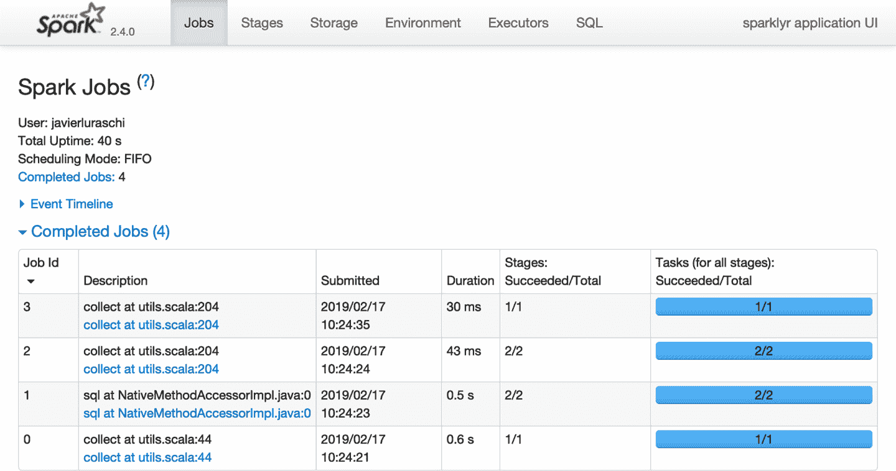
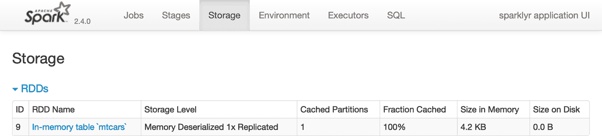
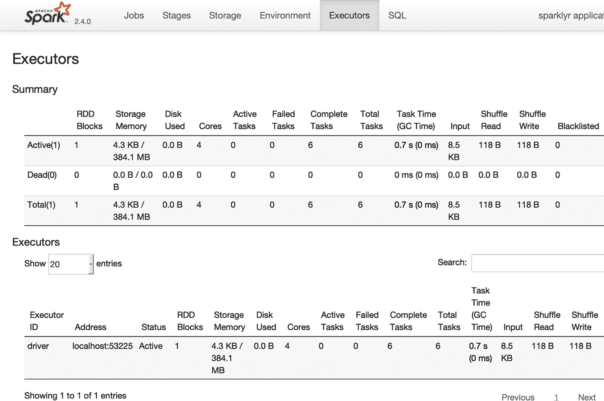
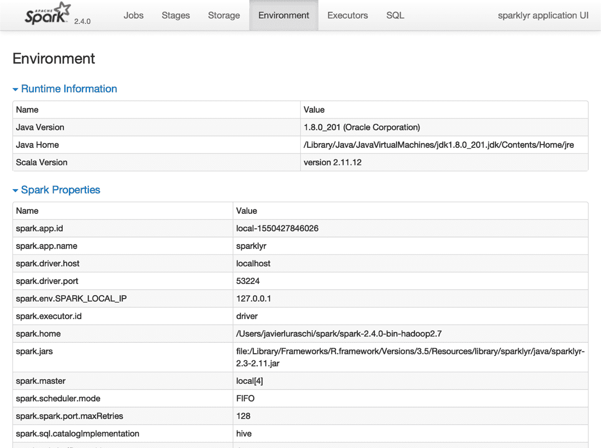
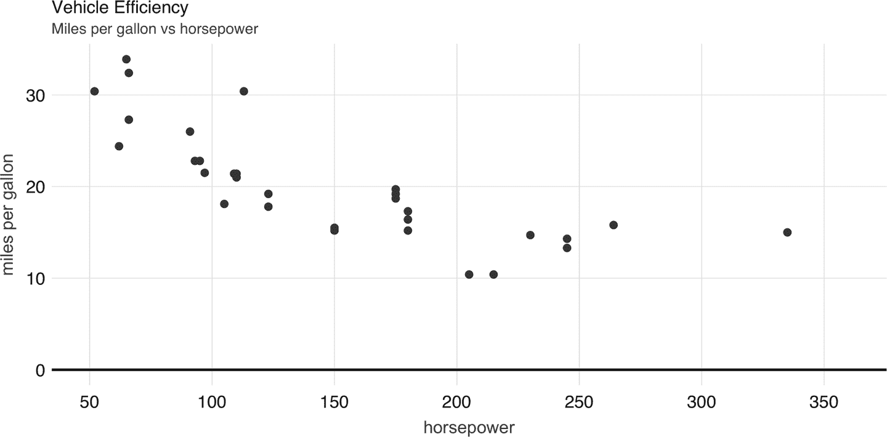
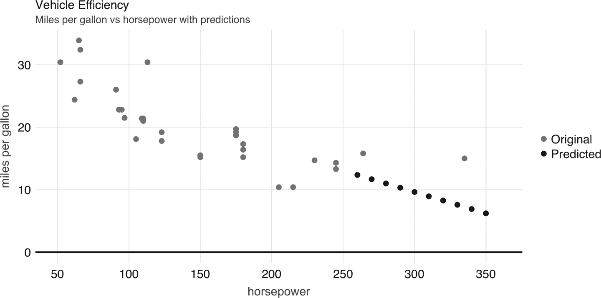
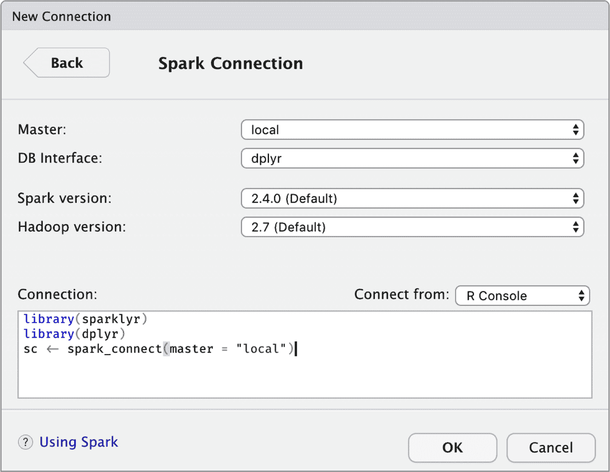
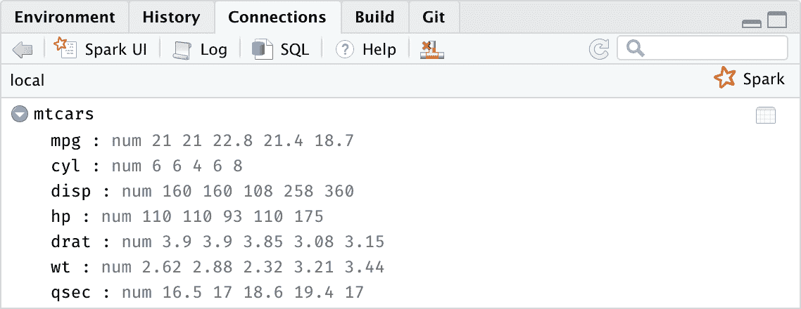

# 第二章：入门

> 我一直想成为一个巫师。
> 
> ——萨姆威尔·塔利

在阅读第一章后，您现在应该熟悉 Spark 可以帮助您解决的问题类型。并且应该清楚，当数据无法在单台机器上容纳或计算速度太慢时，Spark 通过利用多台计算机来解决问题。如果您是 R 的新手，结合数据科学工具如 `ggplot2` 进行可视化和 `dplyr` 进行数据转换，与 Spark 结合使用为进行大规模数据科学带来了一个充满希望的前景。我们也希望您能够兴奋地成为大规模计算的专家。

在本章中，我们将带您了解成为 Spark 熟练使用者所需的工具。我们鼓励您逐步阅读本章的代码，因为这将强迫您通过分析、建模、阅读和写入数据的过程。换句话说，在您完全沉浸于 Spark 的世界之前，您需要进行一些“上蜡，下蜡，反复”操作。

在第三章中，我们深入探讨分析，然后是建模，展示了在单一集群机器（即您的个人计算机）上使用的示例。随后的章节介绍了集群计算以及您将需要成功在多台机器上运行代码的概念和技术。

# 概览

从 R 开始使用 `sparklyr` 和本地集群来启动 Spark 是非常简单的，只需安装和加载 `sparklyr` 包，然后使用 `sparklyr` 安装 Spark；不过，我们假设您是从运行 Windows、macOS 或 Linux 的全新计算机开始，因此在连接到本地 Spark 集群之前，我们将为您讲解必备的先决条件。

尽管本章旨在帮助您准备在个人计算机上使用 Spark，但也有可能一些读者已经有了 Spark 集群或更喜欢从在线 Spark 集群开始。例如，Databricks 提供了一个[免费社区版](http://bit.ly/31MfKuV)的 Spark，您可以轻松从 Web 浏览器访问。如果您选择这条路径，请直接跳至 “先决条件”，但确保为现有或在线 Spark 集群咨询适当的资源。

无论哪种方式，在完成先决条件后，您将首先学习如何连接到 Spark。然后，我们介绍您在本书的其余部分中将使用的最重要的工具和操作。我们不太强调教授概念或如何使用它们——在单独的一章中我们无法详尽解释建模或流处理。但是，通过本章的学习，您应该对未来的挑战性问题有一个简要的了解，并且可以自信地确保正确配置了工具以处理更具挑战性的问题。

您将使用的工具主要分为 R 代码和 Spark Web 界面。所有 Spark 操作都从 R 运行；然而，监视分布式操作的执行是从 Spark 的 Web 界面进行的，您可以从任何 Web 浏览器加载。然后断开与本地集群的连接，这很容易忘记但强烈建议在使用本地集群和共享 Spark 集群时执行！

我们通过向您介绍`sparklyr`实现的 RStudio 扩展功能来结束本章。然而，如果您倾向于使用 Jupyter Notebooks 或者您的集群已经配备了不同的 R 用户界面，可以放心使用纯 R 代码通过 RStudio 更轻松地使用 Spark。让我们继续并正确配置您的先决条件。

# 先决条件

R 可以在许多平台和环境中运行；因此，无论您使用 Windows、Mac 还是 Linux，第一步是从[r-project.org](https://r-project.org/)安装 R；详细说明请参见“安装 R”。

大多数人使用带有提高生产力工具的编程语言；对于 R 语言来说，RStudio 就是这样一款工具。严格来说，RStudio 是一个*集成开发环境*（IDE），它也支持多个平台和环境。如果您还没有安装 RStudio，我们强烈建议您安装；详细信息请参见“安装 RStudio”。

###### 提示

当使用 Windows 时，建议避免路径中带有空格的目录。如果从 R 运行`getwd()`返回带有空格的路径，请考虑使用`setwd("path")`切换到没有空格的路径，或者通过在没有空格的路径中创建 RStudio 项目来解决。

另外，由于 Spark 是使用 Scala 编程语言构建的，而 Scala 是由 Java 虚拟机（JVM）运行的，因此您还需要在系统上安装 Java 8。您的系统可能已经安装了 Java，但您仍应检查版本并根据“安装 Java”中的描述进行更新或降级。您可以使用以下 R 命令检查系统上安装的版本：

```
system("java -version")
```

```
java version "1.8.0_201"
Java(TM) SE Runtime Environment (build 1.8.0_201-b09)
Java HotSpot(TM) 64-Bit Server VM (build 25.201-b09, mixed mode)
```

你还可以使用`JAVA_HOME`环境变量通过运行`Sys.setenv(JAVA_HOME = "path-to-java-8")`来指向特定的 Java 版本；无论哪种方式，在安装`sparklyr`之前，请确保 Java 8 是 R 可用的版本。

## 安装`sparklyr`

与许多其他 R 包一样，您可以按照以下步骤从[CRAN](http://bit.ly/2KLyaoE)安装`sparklyr`：

```
install.packages("sparklyr")
```

本书中的示例假设您正在使用最新版本的`sparklyr`。您可以通过运行以下命令验证您的版本是否与我们使用的版本一样新：

```
packageVersion("sparklyr")
```

```
[1] '1.0.2'
```

## 安装 Spark

首先加载`sparklyr`：

```
library(sparklyr)
```

这样可以在 R 中使所有 `sparklyr` 函数可用，这非常有帮助；否则，你需要在每个 `sparklyr` 命令之前加上 `sparklyr::`。

通过运行 `spark_install()` ，你可以轻松安装 Spark。这会在你的计算机上下载、安装并配置最新版本的 Spark；但是，因为我们是在 Spark 2.3 上编写本书的，你也应该安装这个版本，以确保你能够顺利地跟随所有提供的示例，没有任何意外：

```
spark_install("2.3")
```

你可以运行以下命令显示所有可安装的 Spark 版本：

```
spark_available_versions()
```

```
##   spark
## 1   1.6
## 2   2.0
## 3   2.1
## 4   2.2
## 5   2.3
## 6   2.4
```

你可以通过指定 Spark 版本和可选的 Hadoop 版本安装特定版本。例如，要安装 Spark 1.6.3，你可以运行：

```
spark_install(version = "1.6.3")
```

你还可以通过运行此命令检查已安装的版本：

```
spark_installed_versions()
```

```
  spark hadoop                              dir
7 2.3.1    2.7 /spark/spark-2.3.1-bin-hadoop2.7
```

Spark 安装路径被称为 Spark 的*主目录*，在 R 代码和系统配置设置中使用 `SPARK_HOME` 标识符定义。当你使用通过 `sparklyr` 安装的本地 Spark 集群时，此路径已知，并且不需要进行额外配置。

最后，要卸载特定版本的 Spark，你可以运行 `spark_uninstall()`，并指定 Spark 和 Hadoop 的版本，如下所示：

```
spark_uninstall(version = "1.6.3", hadoop = "2.6")
```

###### 注意

在 macOS 和 Linux 下，默认安装路径是 *~/spark*，在 Windows 下是 *%LOCALAPPDATA%/spark*。要自定义安装路径，你可以在运行 `spark_install()` 和 `spark_connect()` 之前运行 `options(spark.install.dir = "installation-path")`。

# 连接

需要强调的是，到目前为止，我们只安装了一个本地 Spark 集群。本地集群非常有助于开始、测试代码以及轻松排除故障。稍后的章节将解释如何找到、安装和连接具有多台机器的真实 Spark 集群，但在前几章中，我们将专注于使用本地集群。

要连接到这个本地集群，只需运行以下命令：

```
library(sparklyr)
sc <- spark_connect(master = "local", version = "2.3")
```

###### 注意

如果你正在使用自己的或在线的 Spark 集群，请确保按照集群管理员或在线文档指定的方式连接。如果需要一些指引，你可以快速查看第七章，其中详细解释了如何连接到任何 Spark 集群。

`master` 参数标识了 Spark 集群中的“主”机器；这台机器通常称为*驱动节点*。在实际使用多台机器的真实集群时，你会发现大多数机器是工作机器，而其中一台是主节点。由于我们只有一个本地集群，并且只有一台机器，所以我们暂时默认使用 `"local"`。

连接建立后，`spark_connect()` 将获取一个活动的 Spark 连接，大多数代码通常会将其命名为 `sc`；然后你将使用 `sc` 执行 Spark 命令。

如果连接失败，第七章包含一个可以帮助你解决连接问题的故障排除部分。

# 使用 Spark

现在你已连接，我们可以运行一些简单的命令。例如，让我们通过使用`copy_to()`将`mtcars`数据集复制到 Apache Spark 中：

```
cars <- copy_to(sc, mtcars)
```

数据已复制到 Spark 中，但我们可以通过`cars`引用从 R 中访问它。要打印其内容，我们只需输入`*cars*`：

```
cars
```

```
# Source: spark<mtcars> [?? x 11]
     mpg   cyl  disp    hp  drat    wt  qsec    vs    am  gear  carb
   <dbl> <dbl> <dbl> <dbl> <dbl> <dbl> <dbl> <dbl> <dbl> <dbl> <dbl>
 1  21       6  160    110  3.9   2.62  16.5     0     1     4     4
 2  21       6  160    110  3.9   2.88  17.0     0     1     4     4
 3  22.8     4  108     93  3.85  2.32  18.6     1     1     4     1
 4  21.4     6  258    110  3.08  3.22  19.4     1     0     3     1
 5  18.7     8  360    175  3.15  3.44  17.0     0     0     3     2
 6  18.1     6  225    105  2.76  3.46  20.2     1     0     3     1
 7  14.3     8  360    245  3.21  3.57  15.8     0     0     3     4
 8  24.4     4  147\.    62  3.69  3.19  20       1     0     4     2
 9  22.8     4  141\.    95  3.92  3.15  22.9     1     0     4     2
10  19.2     6  168\.   123  3.92  3.44  18.3     1     0     4     4
# … with more rows
```

恭喜！你已成功连接并将第一个数据集加载到 Spark 中。

让我们解释`copy_to()`中发生的情况。第一个参数`sc`给函数提供了一个对之前使用`spark_connect()`创建的活动 Spark 连接的引用。第二个参数指定要加载到 Spark 中的数据集。现在，`copy_to()`返回 Spark 中数据集的引用，R 会自动打印出来。每当 Spark 数据集被打印时，Spark 都会*收集*一些记录并显示给你。在这种特定情况下，该数据集仅包含描述汽车型号及其规格（如马力和预期每加仑英里数）的几行。

## 网络界面

大多数 Spark 命令都是从 R 控制台执行的；然而，监视和分析执行是通过 Spark 的网络界面完成的，如图 2-1 所示。这个界面是由 Spark 提供的一个 Web 应用程序，你可以通过运行以下命令访问：

```
spark_web(sc)
```



###### 图 2-1\. Apache Spark 网络界面

打印`cars`数据集收集了一些记录，以在 R 控制台中显示。你可以在 Spark 网络界面中看到启动了一个作业来从 Spark 中收集这些信息。你还可以选择存储标签，查看在 Spark 中缓存的`mtcars`数据集，如图 2-2 所示。

注意，这个数据集完全加载到内存中，如“内存占用”列所示，显示为 100%；因此，通过“内存大小”列，你可以准确查看此数据集使用了多少内存。



###### 图 2-2\. Apache Spark 网络界面上的存储标签

图 2-3 显示的执行者标签提供了集群资源的视图。对于本地连接，你将只找到一个活动执行者，为 Spark 分配了 2 GB 内存，并为计算可用了 384 MB。在第九章中，你将学习如何请求更多计算实例和资源，以及如何分配内存。



###### 图 2-3\. Apache Spark 网络界面上的执行者标签

探索的最后一个选项卡是环境选项卡，如 Figure 2-4 所示；此选项卡列出了此 Spark 应用程序的所有设置，我们将在 Chapter 9 中研究。正如您将了解的那样，大多数设置不需要显式配置，但是要正确地按规模运行它们，您需要熟悉其中一些设置。



###### 图 2-4\. Apache Spark Web 界面上的环境选项卡

接下来，您将使用我们在 Chapter 3 中深入介绍的实践的一个小子集。

## 分析

当从 R 使用 Spark 分析数据时，您可以使用 SQL（结构化查询语言）或`dplyr`（数据操作语法）。您可以通过`DBI`包使用 SQL；例如，要计算我们的`cars`数据集中有多少条记录，我们可以运行以下命令：

```
library(DBI)
dbGetQuery(sc, "SELECT count(*) FROM mtcars")
```

```
  count(1)
1       32
```

当使用`dplyr`时，你会写更少的代码，通常比 SQL 更容易编写。这也正是为什么在本书中我们不会使用 SQL 的原因；然而，如果你精通 SQL，这对你来说是一个可行的选择。例如，在`dplyr`中计算记录更加紧凑且易于理解：

```
library(dplyr)
count(cars)
```

```
# Source: spark<?> [?? x 1]
      n
  <dbl>
1    32
```

通常，我们通常从 Spark 中使用`dplyr`开始分析数据，然后对行进行抽样并选择可用列的子集。最后一步是从 Spark 中收集数据，在 R 中进行进一步的数据处理，如数据可视化。让我们通过在 Spark 中选择、抽样和绘制`cars`数据集来执行一个非常简单的数据分析示例：

```
select(cars, hp, mpg) %>%
  sample_n(100) %>%
  collect() %>%
  plot()
```

在 Figure 2-5 的图中显示，随着车辆马力的增加，其每加仑英里数的燃油效率会降低。尽管这很有见地，但要数值化地预测增加马力如何影响燃油效率是困难的。建模可以帮助我们克服这一问题。



###### 图 2-5\. 马力与每加仑英里数

## 建模

尽管数据分析可以帮助您深入了解数据，但构建描述和概括数据集的数学模型是非常强大的。在 Chapter 1 中，您了解到机器学习和数据科学领域利用数学模型进行预测和发现额外的见解。

例如，我们可以使用线性模型来近似燃油效率和马力之间的关系：

```
model <- ml_linear_regression(cars, mpg ~ hp)
model
```

```
Formula: mpg ~ hp

Coefficients:
(Intercept)          hp
30.09886054 -0.06822828
```

现在我们可以使用这个模型来预测原始数据集中没有的值。例如，我们可以为马力超过 250 的汽车添加条目，并可视化预测值，如 Figure 2-6 所示。

```
model %>%
  ml_predict(copy_to(sc, data.frame(hp = 250 + 10 * 1:10))) %>%
  transmute(hp = hp, mpg = prediction) %>%
  full_join(select(cars, hp, mpg)) %>%
  collect() %>%
  plot()
```



###### 图 2-6\. 具有预测的马力与每加仑英里数

即使前面的示例缺乏你在建模时应该使用的许多适当技术，它也是一个简单的示例，可以简要介绍 Spark 的建模能力。我们在第四章中介绍了所有 Spark 模型、技术和最佳实践。

## 数据

为简单起见，我们将 `mtcars` 数据集复制到了 Spark 中；然而，通常情况下数据并不会复制到 Spark 中。相反，数据是从现有的各种格式的数据源中读取的，如纯文本、CSV、JSON、Java 数据库连接（JDBC）等，我们会在第八章中详细讨论这些内容。例如，我们可以将我们的 `cars` 数据集导出为 CSV 文件：

```
spark_write_csv(cars, "cars.csv")
```

在实践中，我们将从分布式存储系统（如 HDFS）读取现有数据集，但我们也可以从本地文件系统读取：

```
cars <- spark_read_csv(sc, "cars.csv")
```

## 扩展

就像 R 以其充满活力的包作者社区而闻名一样，在较小的尺度上，许多 Spark 和 R 的扩展已经被编写并对您可用。第十章介绍了许多有趣的扩展，用于执行高级建模、图分析、深度学习数据集预处理等操作。

例如，`sparkly.nested` 扩展是一个 R 包，它扩展了 `sparklyr` 以帮助您管理包含嵌套信息的值。一个常见的用例涉及包含需要预处理才能进行有意义数据分析的嵌套列表的 JSON 文件。要使用这个扩展，我们首先需要按如下方式安装它：

```
install.packages("sparklyr.nested")
```

然后，我们可以使用 `sparklyr.nested` 扩展将所有汽缸数上的马力数据点进行分组：

```
sparklyr.nested::sdf_nest(cars, hp) %>%
  group_by(cyl) %>%
  summarise(data = collect_list(data))
```

```
# Source: spark<?> [?? x 2]
    cyl data
  <int> <list>
1     6 <list [7]>
2     4 <list [11]>
3     8 <list [14]>
```

即使嵌套数据使阅读变得更加困难，但在处理像 JSON 这样的嵌套数据格式时，使用 `spark_read_json()` 和 `spark_write_json()` 函数是必需的。

## 分布式 R

对于少数情况下 Spark 中没有特定功能并且也没有开发扩展的情况，你可以考虑将你自己的 R 代码分布到 Spark 集群中。这是一个强大的工具，但它带来了额外的复杂性，因此你应该将其作为最后的选择。

假设我们需要在数据集的所有列上四舍五入所有值。一种方法是运行自定义的 R 代码，利用 R 的 `round()` 函数：

```
cars %>% spark_apply(~round(.x))
```

```
# Source: spark<?> [?? x 11]
     mpg   cyl  disp    hp  drat    wt  qsec    vs    am  gear  carb
   <dbl> <dbl> <dbl> <dbl> <dbl> <dbl> <dbl> <dbl> <dbl> <dbl> <dbl>
 1    21     6   160   110     4     3    16     0     1     4     4
 2    21     6   160   110     4     3    17     0     1     4     4
 3    23     4   108    93     4     2    19     1     1     4     1
 4    21     6   258   110     3     3    19     1     0     3     1
 5    19     8   360   175     3     3    17     0     0     3     2
 6    18     6   225   105     3     3    20     1     0     3     1
 7    14     8   360   245     3     4    16     0     0     3     4
 8    24     4   147    62     4     3    20     1     0     4     2
 9    23     4   141    95     4     3    23     1     0     4     2
10    19     6   168   123     4     3    18     1     0     4     4
# … with more rows
```

如果你是一个熟练的 R 用户，可能会很容易地为所有事情使用 `spark_apply()`，但请不要这样做！`spark_apply()` 是为 Spark 功能不足的高级用例设计的。您将学习如何在不必将自定义 R 代码分布到集群中的情况下进行正确的数据分析和建模。

## 流处理

虽然处理大型静态数据集是 Spark 的典型用例，实时处理动态数据集也是可能的，并且对某些应用程序而言是必需的。您可以将流式数据集视为一个连续接收新数据的静态数据源，例如股票市场行情。通常从 Kafka（一个开源流处理软件平台）或连续接收新数据的分布式存储中读取流式数据。

要尝试流式处理，让我们首先创建一个包含一些数据的 *input/* 文件夹，作为该流的输入使用：

```
dir.create("input")
write.csv(mtcars, "input/cars_1.csv", row.names = F)
```

然后，我们定义一个流，处理来自 *input/* 文件夹的输入数据，在 R 中执行自定义转换，并将输出推送到 *output/* 文件夹：

```
stream <- stream_read_csv(sc, "input/") %>%
    select(mpg, cyl, disp) %>%
    stream_write_csv("output/")
```

一旦实时数据流开始，*input/* 文件夹将被处理，并转换为*output/* 文件夹下的一组新文件，其中包含新转换的文件。由于输入只包含一个文件，输出文件夹也将包含一个单独的文件，这是应用自定义 `spark_apply()` 转换的结果。

```
dir("output", pattern = ".csv")
```

```
[1] "part-00000-eece04d8-7cfa-4231-b61e-f1aef8edeb97-c000.csv"
```

到目前为止，这类似于静态数据处理；然而，我们可以继续向 *input/* 位置添加文件，Spark 将自动并行处理数据。让我们再添加一个文件并验证它是否被自动处理：

```
# Write more data into the stream source
write.csv(mtcars, "input/cars_2.csv", row.names = F)
```

等待几秒钟，并验证数据是否被 Spark 流处理：

```
# Check the contents of the stream destination
dir("output", pattern = ".csv")
```

```
[1] "part-00000-2d8e5c07-a2eb-449d-a535-8a19c671477d-c000.csv"
[2] "part-00000-eece04d8-7cfa-4231-b61e-f1aef8edeb97-c000.csv"
```

然后，您应该停止流：

```
stream_stop(stream)
```

您可以使用 `dplyr`、SQL、Spark 模型或分布式 R 来实时分析数据流。在第十二章中，我们将详细介绍您可以执行的所有有趣的转换来分析实时数据。

## 日志

日志记录绝对比实时数据处理无聊得多；然而，这是您应该熟悉或了解的工具。*日志*只是 Spark 附加到集群中任务执行相关信息的文本文件。对于本地集群，我们可以通过运行以下命令检索所有最近的日志：

```
spark_log(sc)
```

```
18/10/09 19:41:46 INFO Executor: Finished task 0.0 in stage 5.0 (TID 5)...
18/10/09 19:41:46 INFO TaskSetManager: Finished task 0.0 in stage 5.0...
18/10/09 19:41:46 INFO TaskSchedulerImpl: Removed TaskSet 5.0, whose...
18/10/09 19:41:46 INFO DAGScheduler: ResultStage 5 (collect at utils...
18/10/09 19:41:46 INFO DAGScheduler: Job 3 finished: collect at utils...
```

或者，我们可以使用 `filter` 参数检索包含 `sparklyr` 的特定日志条目，如下所示：

```
spark_log(sc, filter = "sparklyr")
```

```
## 18/10/09 18:53:23 INFO SparkContext: Submitted application: sparklyr
## 18/10/09 18:53:23 INFO SparkContext: Added JAR...
## 18/10/09 18:53:27 INFO Executor: Fetching spark://localhost:52930/...
## 18/10/09 18:53:27 INFO Utils: Fetching spark://localhost:52930/...
## 18/10/09 18:53:27 INFO Executor: Adding file:/private/var/folders/...
```

大多数情况下，您不需要担心 Spark 日志，除非需要排除故障的失败计算；在这些情况下，日志是一个宝贵的资源需要注意。现在您知道了。

# 断开连接

对于本地集群（实际上，任何集群），在处理数据完成后，应通过运行以下命令断开连接：

```
spark_disconnect(sc)
```

这会终止与集群的连接以及集群任务。如果有多个 Spark 连接处于活动状态，或者连接实例 `sc` 不再可用，您也可以通过运行以下命令断开所有 Spark 连接：

```
spark_disconnect_all()
```

请注意，退出 R 或 RStudio，或重新启动您的 R 会话，也会导致 Spark 连接终止，从而终止未显式保存的 Spark 集群和缓存数据。

# 使用 RStudio

由于在 RStudio 中使用 R 非常普遍，`sparklyr`提供了 RStudio 扩展，帮助简化你在使用 Spark 时的工作流程并提高生产力。如果你对 RStudio 不熟悉，请快速查看“使用 RStudio”。否则，还有几个值得强调的扩展功能。

首先，不要从 RStudio 的 R 控制台使用`spark_connect()`开始新的连接，而是使用 Connections 选项卡中的 New Connection 操作，然后选择 Spark 连接，这将打开图 2-7 中显示的对话框。然后，你可以自定义版本并连接到 Spark，这将为你简单生成正确的`spark_connect()`命令，并在 R 控制台中执行。



###### 图 2-7\. RStudio 新的 Spark 连接对话框

连接到 Spark 后，RStudio 会在 Connections 选项卡中显示你可用的数据集，如图 2-8 所示。这是跟踪你现有数据集并轻松探索每个数据集的有用方式。



###### 图 2-8\. RStudio Connections 选项卡

此外，活动连接提供以下自定义操作：

Spark UI

打开 Spark 的 Web 界面；一个`spark_web(sc)`的快捷方式。

日志

打开 Spark 的 Web 日志；一个`spark_log(sc)`的快捷方式。

SQL

打开一个新的 SQL 查询。有关`DBI`和 SQL 支持的更多信息，请参阅第三章。

帮助

在新的 Web 浏览器窗口中打开参考文档。

断开连接

断开与 Spark 的连接；一个`spark_disconnect(sc)`的快捷方式。

本书的其余部分将使用纯粹的 R 代码。你可以选择在 R 控制台、RStudio、Jupyter Notebooks 或任何支持执行 R 代码的工具中执行此代码，因为本书提供的示例在任何 R 环境中均可执行。

# 资源

虽然我们已经大力简化了入门流程，但还有许多额外的资源可以帮助你解决特定问题，帮助你了解更广泛的 Spark 和 R 社区，以便获取具体答案、讨论主题并与许多正在使用 Spark 的用户联系：

文档

托管在[RStudio 的 Spark 网站](https://spark.rstudio.com)上的文档站点应该是你学习使用 R 时了解更多关于 Spark 的首选站点。该文档随时更新，包括示例、参考函数以及许多其他相关资源。

博客

要及时了解主要的`sparklyr`公告，请关注[RStudio 博客](http://bit.ly/2KQBYVK)。

社区

对于一般的`sparklyr`问题，你可以在[RStudio 社区](http://bit.ly/2PfNqzN)中发布标记为`sparklyr`的帖子。

Stack Overflow

对于一般的 Spark 问题，[Stack Overflow](http://bit.ly/2TEfU4L)是一个很好的资源；此外，还有[许多关于`sparklyr`的专题](http://bit.ly/307X5cB)。

GitHub

如果你认为有什么需要修正的地方，请打开一个[GitHub](http://bit.ly/30b5NGT)问题或发送一个拉取请求。

Gitter

对于紧急问题或保持联系，你可以在[Gitter](http://bit.ly/33ESccY)上与我们交流。

# Recap

在本章中，你学习了与 Spark 一起工作所需的先决条件。你了解了如何使用`spark_connect()`连接到 Spark；使用`spark_install()`安装本地集群；加载简单数据集；启动 Web 界面，并分别使用`spark_web(sc)`和`spark_log(sc)`显示日志；最后使用`spark_disconnect()`断开与 RStudio 的连接。我们通过介绍`sparklyr`提供的 RStudio 扩展来结束。

到目前为止，我们希望你已经准备好在接下来的两章中处理实际的 Spark 和 R 数据分析与建模问题。第三章将介绍数据分析，这是通过检查、清洗和转换数据来发现有用信息的过程。建模则是第四章的主题，虽然它是数据分析的一部分，但它需要一个独立的章节来全面描述和利用 Spark 中可用的建模功能。
