# 第三章：分析

> 第一课：用尖锐的一端戳它们。
> 
> —琼·雪诺

前几章重点介绍了使用 R 与 Spark，使您快速上手，并鼓励您尝试基本的数据分析工作流程。然而，它们并没有恰当地介绍数据分析的含义，特别是在 Spark 中。它们呈现了您在本书中需要的工具——这些工具将帮助您花更多时间学习，而不是疑难解答。

本章介绍了在 R 中使用 Spark 进行数据分析的工具和概念。剧透警告：这些工具与您在纯 R 中使用的工具相同！这不仅仅是巧合；我们希望数据科学家可以在一个技术被隐藏的世界中使用他们熟悉和喜爱的 R 包，并且它们在 Spark 中“只是工作”！现在，我们还没有完全实现这一点，但我们也不远了。因此，在本章中，您将学习广泛使用的 R 包和实践，以执行数据分析——如`dplyr`、`ggplot2`、公式、`rmarkdown`等，这些在 Spark 中同样适用。

第四章 将专注于创建统计模型来预测、估计和描述数据集，但首先，让我们开始分析吧！

# 概述

在数据分析项目中，主要目标是理解数据试图“告诉我们”的内容，希望它能回答特定的问题。大多数数据分析项目遵循一套步骤，如图 3-1 所示。

正如图所示，我们首先将数据*导入*到我们的分析流程中，通过尝试不同的数据转换（如聚合）来*整理*它。然后，我们*可视化*数据以帮助我们感知关系和趋势。为了深入了解，我们可以对样本数据拟合一个或多个统计*模型*。这将帮助我们找出这些模式在应用新数据时是否成立。最后，结果会公开或私下与同事和利益相关者交流。

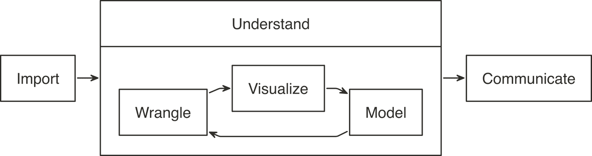

###### 图 3-1 数据分析的一般步骤

当处理不大规模数据集（即适合内存的数据集）时，我们可以使用 R 执行所有这些步骤，而无需使用 Spark。然而，当数据量过大无法放入内存或计算速度太慢时，我们可以略微调整此方法，引入 Spark。但是如何做呢？

对于数据分析，理想的方法是让 Spark 发挥其所擅长的功能。Spark 是一个并行计算引擎，能够在大规模上工作，并提供 SQL 引擎和建模库。您可以使用这些功能执行大多数与 R 相同的操作，包括数据选择、转换和建模。此外，Spark 还包括用于执行特殊计算工作的工具，如图分析、流处理等等。在此，我们将跳过那些非矩形数据集，并在后续章节中介绍它们。

在 Spark 内部可以执行数据*导入*，*整理*和*建模*。您也可以部分使用 Spark 进行*可视化*，这在本章稍后讨论。其思想是使用 R 告诉 Spark 要运行哪些数据操作，然后只将结果带入 R。如图 3-2 所示，理想的方法*将计算推送*到 Spark 集群，然后*收集结果*到 R 中。

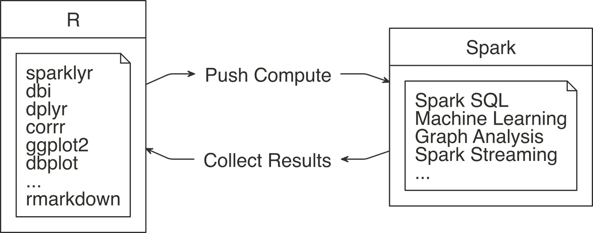

###### 图 3-2\. Spark 在计算时收集结果

`sparklyr`包有助于使用“推送计算，收集结果”的原则。它的大多数功能都是在 Spark API 调用的顶部进行封装。这使我们能够利用 Spark 的分析组件，而不是 R 的。例如，当您需要拟合线性回归模型时，您不会使用 R 熟悉的`lm()`函数，而是使用 Spark 的`ml_linear_regression()`函数。然后，这个 R 函数调用 Spark 来创建这个模型。图 3-3 描绘了这个具体的例子。

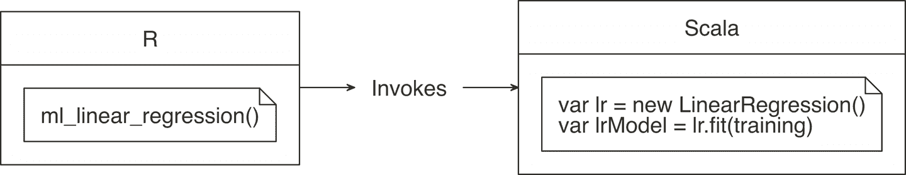

###### 图 3-3\. R 函数调用 Spark 功能

对于更常见的数据处理任务，`sparklyr`为`dplyr`提供了后端支持。这意味着您可以在 R 中使用您已经熟悉的`dplyr`动词，然后`sparklyr`和`dplyr`将这些操作转换为 Spark SQL 语句，通常比 SQL 语句更简洁且更易读（参见图 3-4）。因此，如果您已经熟悉 R 和`dplyr`，则没有什么新东西需要学习。这可能会感到有点令人失望——确实如此——但这也很好，因为您可以将精力集中在学习进行大规模计算所需的其他技能上。

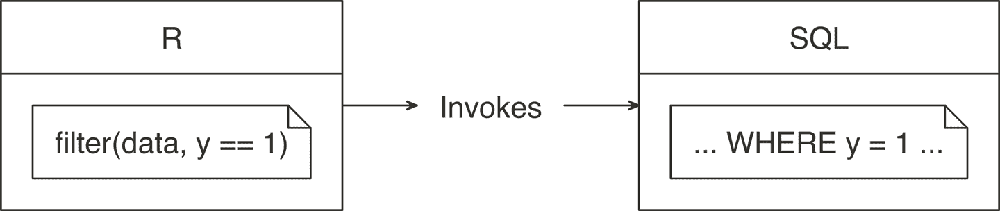

###### 图 3-4\. dplyr 在 Spark 中写 SQL

为了在学习过程中进行实践，本章其余部分的代码使用在*本地* Spark 主节点上运行的单个练习。这样，您可以在个人计算机上复制代码。确保`sparklyr`已经可以工作，如果您已经完成了第二章，那么应该可以工作。

本章将使用您可能尚未安装的包。因此，请首先确保通过运行以下命令安装这些包：

```
install.packages("ggplot2")
install.packages("corrr")
install.packages("dbplot")
install.packages("rmarkdown")
```

首先，加载`sparklyr`和`dplyr`包，然后打开一个新的*本地*连接。

```
library(sparklyr)
library(dplyr)

sc <- spark_connect(master = "local", version = "2.3")
```

环境已准备就绪，因此我们下一个任务是导入稍后可以分析的数据。

# 导入

当使用 Spark 与 R 时，您需要以不同方式处理数据导入。通常，导入意味着 R 将读取文件并将其加载到内存中；当您使用 Spark 时，数据将导入到 Spark 而不是 R 中。在图 3-5 中，请注意数据源如何连接到 Spark 而不是连接到 R。

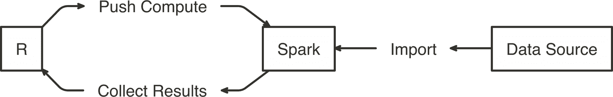

###### 图 3-5\. 将数据导入 Spark 而非 R

###### 注意

当您对大规模数据集执行分析时，大多数必要的数据已经可用于您的 Spark 集群（通常通过 Hive 表或直接访问文件系统向用户提供）。第八章将详细介绍这一点。

与其将所有数据导入 Spark，您可以请求 Spark 访问数据源而不导入它——这是基于速度和性能进行的决策。将所有数据导入 Spark 会产生一次性的前期成本，因为 Spark 需要等待数据加载才能进行分析。如果数据没有导入，通常在每次 Spark 操作时会产生成本，因为 Spark 需要从集群存储中检索子集，这通常是磁盘驱动器，速度比从 Spark 内存读取慢得多。关于这个话题的更多内容将在第九章中讨论。

让我们通过使用`copy_to()`将`mtcars`导入 Spark 来准备一些数据会话；您还可以从多种不同的文件格式中导入分布式文件中的数据，我们将在第八章中讨论这些。

```
cars <- copy_to(sc, mtcars)
```

###### 注意

在使用真实集群时，应使用`copy_to()`从 R 中仅传输小表；大数据传输应使用专门的数据传输工具进行。

现在可以访问数据到 Spark，并且可以轻松应用转换；下一节将介绍如何在 Spark 中运行转换以整理数据，使用`dplyr`。

# 整理

数据整理使用转换来理解数据。通常被称为将数据从一种“原始”形式转换为另一种适合数据分析的格式的过程。

数据中常见的问题包括格式错误或缺失值以及具有多个属性的列，这可能需要修复，因为它们会阻碍你理解数据集。例如，“name”字段包含客户的姓和名。一个单独的列中包含两个属性（姓和名）。为了能够使用，我们需要*转换*“name”字段，*改变*它成为“first_name”和“last_name”字段。

在数据清理完成后，您仍然需要了解其内容的基础知识。其他转换如聚合可以帮助完成此任务。例如，请求所有客户平均余额的结果将返回一行和一列。该值将是所有客户的平均值。当我们查看单个或分组客户余额时，这些信息将为我们提供背景。

主要目标是尽可能使用 R 语法编写数据转换。这样可以避免在完成单一任务时需要在多个计算技术之间切换所带来的认知成本。在这种情况下，最好利用`dplyr`而不是编写 Spark SQL 语句进行数据探索。

在 R 环境中，`cars` 可以被视为本地 DataFrame，因此您可以使用 `dplyr` 动词。例如，我们可以通过使用 `summarise_all()` 找出所有列的均值：

```
summarise_all(cars, mean)
```

```
# Source: spark<?> [?? x 11]
    mpg   cyl  disp    hp  drat    wt  qsec    vs    am  gear  carb
  <dbl> <dbl> <dbl> <dbl> <dbl> <dbl> <dbl> <dbl> <dbl> <dbl> <dbl>
1  20.1  6.19  231\.  147\.  3.60  3.22  17.8 0.438 0.406  3.69  2.81
```

尽管这段代码与在没有 Spark 的情况下使用 `dplyr` 运行的代码完全相同，但在幕后发生了很多事情。数据并没有被导入到 R 中；相反，`dplyr` 将此任务转换为 SQL 语句，然后将其发送到 Spark。`show_query()` 命令使我们能够查看 `sparklyr` 和 `dplyr` 创建并发送给 Spark 的 SQL 语句。我们还可以利用这个时间来介绍管道操作符 (`%>%`)，这是 `magrittr` 包中的自定义操作符，将计算管道化到下一个函数的第一个参数中，使得数据分析变得更加易读：

```
summarise_all(cars, mean) %>%
  show_query()
```

```
<SQL>
SELECT AVG(`mpg`) AS `mpg`, AVG(`cyl`) AS `cyl`, AVG(`disp`) AS `disp`,
       AVG(`hp`) AS `hp`, AVG(`drat`) AS `drat`, AVG(`wt`) AS `wt`,
       AVG(`qsec`) AS `qsec`, AVG(`vs`) AS `vs`, AVG(`am`) AS `am`,
       AVG(`gear`) AS `gear`, AVG(`carb`) AS `carb`
FROM `mtcars`
```

显然，`dplyr` 比 SQL 更加简洁，但请放心，在使用 `dplyr` 时您不需要查看或理解 SQL。您的焦点可以继续集中在从数据中获取洞察力上，而不是弄清楚如何在 SQL 中表达给定的转换集。这里还有一个示例，按 `transmission` 类型对 `cars` 数据集进行分组：

```
cars %>%
  mutate(transmission = ifelse(am == 0, "automatic", "manual")) %>%
  group_by(transmission) %>%
  summarise_all(mean)
```

```
# Source: spark<?> [?? x 12]
  transmission   mpg   cyl  disp    hp  drat    wt  qsec    vs    am  gear  carb
  <chr>        <dbl> <dbl> <dbl> <dbl> <dbl> <dbl> <dbl> <dbl> <dbl> <dbl> <dbl>
1 automatic     17.1  6.95  290\.  160\.  3.29  3.77  18.2 0.368     0  3.21  2.74
2 manmual       24.4  5.08  144\.  127\.  4.05  2.41  17.4 0.538     1  4.38  2.92
```

`dplyr` 提供的大多数数据转换操作都可以与本地 DataFrame 一起使用 Spark 连接。这意味着您可以先专注于学习 `dplyr`，然后在与 Spark 工作时重复使用这些技能。由 Hadley Wickham 和 Garrett Grolemund (O’Reilly) 合著的 [*R for Data Science*](https://r4ds.had.co.nz/) 第五章是深入学习 `dplyr` 的好资源。如果您对 `dplyr` 的熟练掌握不成问题，我们建议您花些时间尝试对 `cars` 表使用不同的 `dplyr` 函数。

有时，我们可能需要执行 `dplyr` 和 `sparklyr` 尚未提供的操作。与其将数据下载到 R 中，通常在 Spark 中有一个 Hive 函数可以完成我们所需的任务。下一节将介绍这种情况。

## 内置函数

Spark SQL 基于 Hive 的 SQL 约定和函数，可以使用 `dplyr` 调用所有这些函数。这意味着我们可以使用任何 Spark SQL 函数来执行可能不通过 `dplyr` 提供的操作。我们可以通过调用它们就像调用 R 函数一样访问这些函数。`dplyr` 不识别的函数会原样传递给查询引擎，而不是失败。这使我们在使用函数方面具有了很大的灵活性。

例如，`percentile()` 函数返回组中列的精确百分位数。该函数期望一个列名，以及一个单一的百分位值或百分位值数组。我们可以使用 `dplyr` 中的这个 Spark SQL 函数，如下所示：

```
summarise(cars, mpg_percentile = percentile(mpg, 0.25))
```

```
# Source: spark<?> [?? x 1]
  mpg_percentile
           <dbl>
1           15.4
```

在 R 中没有 `percentile()` 函数，因此 `dplyr` 将代码部分原样传递给生成的 SQL 查询：

```
summarise(cars, mpg_percentile = percentile(mpg, 0.25)) %>%
  show_query()
```

```
<SQL>
SELECT percentile(`mpg`, 0.25) AS `mpg_percentile`
FROM `mtcars_remote`
```

要传递多个值给 `percentile()`，我们可以调用另一个名为 `array()` 的 Hive 函数。在这种情况下，`array()` 的工作方式类似于 R 的 `list()` 函数。我们可以通过逗号分隔的方式传递多个值。Spark 的输出是一个数组变量，它作为一个列表变量列导入到 R 中：

```
summarise(cars, mpg_percentile = percentile(mpg, array(0.25, 0.5, 0.75)))
```

```
# Source: spark<?> [?? x 1]
  mpg_percentile
  <list>
1 <list [3]>
```

您可以使用 `explode()` 函数将 Spark 数组值结果分隔成它们自己的记录。为此，请在 `mutate()` 命令中使用 `explode()`，并传递包含百分位操作结果的变量：

```
summarise(cars, mpg_percentile = percentile(mpg, array(0.25, 0.5, 0.75))) %>%
  mutate(mpg_percentile = explode(mpg_percentile))
```

```
# Source: spark<?> [?? x 1]
  mpg_percentile
           <dbl>
1           15.4
2           19.2
3           22.8
```

我们在 “Hive 函数” 部分包含了所有 Hive 函数的详尽列表。快速浏览一下，了解您可以使用它们完成的各种操作范围。

## 相关性

非常常见的探索技术是计算和可视化相关性，我们经常计算它们以找出成对变量之间存在的统计关系。Spark 提供了计算整个数据集相关性的函数，并将结果作为 DataFrame 对象返回给 R：

```
ml_corr(cars)
```

```
# A tibble: 11 x 11
      mpg    cyl   disp     hp    drat     wt    qsec
    <dbl>  <dbl>  <dbl>  <dbl>   <dbl>  <dbl>   <dbl>
 1  1     -0.852 -0.848 -0.776  0.681  -0.868  0.419
 2 -0.852  1      0.902  0.832 -0.700   0.782 -0.591
 3 -0.848  0.902  1      0.791 -0.710   0.888 -0.434
 4 -0.776  0.832  0.791  1     -0.449   0.659 -0.708
 5  0.681 -0.700 -0.710 -0.449  1      -0.712  0.0912
 6 -0.868  0.782  0.888  0.659 -0.712   1     -0.175
 7  0.419 -0.591 -0.434 -0.708  0.0912 -0.175  1
 8  0.664 -0.811 -0.710 -0.723  0.440  -0.555  0.745
 9  0.600 -0.523 -0.591 -0.243  0.713  -0.692 -0.230
10  0.480 -0.493 -0.556 -0.126  0.700  -0.583 -0.213
11 -0.551  0.527  0.395  0.750 -0.0908  0.428 -0.656
# ... with 4 more variables: vs <dbl>, am <dbl>,
#   gear <dbl>, carb <dbl>
```

`corrr` R 包专门用于相关性。它包含友好的函数来准备和可视化结果。在该包中还包含了一个用于 Spark 的后端，因此当在 `corrr` 中使用 Spark 对象时，实际的计算也发生在 Spark 中。在后台，`correlate()` 函数运行 `sparklyr::ml_corr()`，因此在运行命令之前无需将任何数据收集到 R 中：

```
library(corrr)
correlate(cars, use = "pairwise.complete.obs", method = "pearson")
```

```
# A tibble: 11 x 12
   rowname     mpg     cyl    disp      hp     drat      wt
   <chr>     <dbl>   <dbl>   <dbl>   <dbl>    <dbl>   <dbl>
 1 mpg      NA      -0.852  -0.848  -0.776   0.681   -0.868
 2 cyl      -0.852  NA       0.902   0.832  -0.700    0.782
 3 disp     -0.848   0.902  NA       0.791  -0.710    0.888
 4 hp       -0.776   0.832   0.791  NA      -0.449    0.659
 5 drat      0.681  -0.700  -0.710  -0.449  NA       -0.712
 6 wt       -0.868   0.782   0.888   0.659  -0.712   NA
 7 qsec      0.419  -0.591  -0.434  -0.708   0.0912  -0.175
 8 vs        0.664  -0.811  -0.710  -0.723   0.440   -0.555
 9 am        0.600  -0.523  -0.591  -0.243   0.713   -0.692
10 gear      0.480  -0.493  -0.556  -0.126   0.700   -0.583
11 carb     -0.551   0.527   0.395   0.750  -0.0908   0.428
# ... with 5 more variables: qsec <dbl>, vs <dbl>,
#   am <dbl>, gear <dbl>, carb <dbl>
```

我们可以将结果传输给其他 `corrr` 函数。例如，`shave()` 函数将所有重复的结果转换为 `NAs`。再次强调，虽然这感觉像是使用现有 R 包的标准 R 代码，但 Spark 实际上在执行相关性计算。

另外，如图 Figure 3-6 所示，可以使用 `rplot()` 函数轻松地进行可视化，如下所示：

```
correlate(cars, use = "pairwise.complete.obs", method = "pearson") %>%
  shave() %>%
  rplot()
```

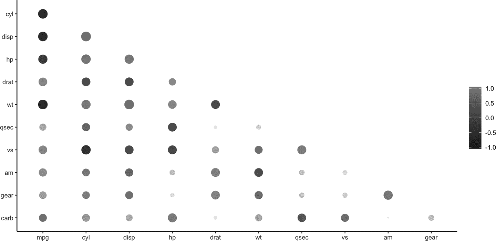

###### Figure 3-6\. 使用 rplot() 可视化相关性

看出哪些关系是正向的或负向的要容易得多：正向关系是灰色的，负向关系是黑色的。圆圈的大小表示它们的关系有多显著。数据可视化的威力在于它能让我们更容易地理解结果。下一节将扩展这个过程的步骤。

# 可视化

可视化是帮助我们在数据中找到模式的重要工具。当在图表中绘制 1000 条观察数据集时，我们更容易识别异常值，而不是从列表中读取它们。

R 在数据可视化方面非常出色。通过许多专注于此分析步骤的 R 包，它的绘图能力得到了扩展。不幸的是，大多数创建图表的 R 函数都依赖于已经在 R 本地内存中的数据，因此在使用 Spark 中的远程表时会失败。

可以从存在于 Spark 中的数据源创建 R 中的可视化。要理解如何做到这一点，让我们首先分解计算机程序如何构建图表。首先，程序获取原始数据并执行某种转换。然后，转换后的数据被映射到一组坐标上。最后，映射的值被绘制成图表。Figure 3-7 总结了每个步骤。


###### Figure 3-7\. R 绘图的阶段

本质上，可视化的方法与数据整理的方法相同：将计算推送到 Spark，然后在 R 中收集结果进行绘制。正如在 Figure 3-8 中所示，准备数据的繁重工作（例如按组或区间聚合数据）可以在 Spark 中完成，然后将较小的数据集收集到 R 中。在 R 中，绘制图表变成了更基本的操作。例如，对于直方图，Spark 计算了区间，然后在 R 中使用简单的柱状图进行绘制，而不是直方图，因为无需重新计算区间。

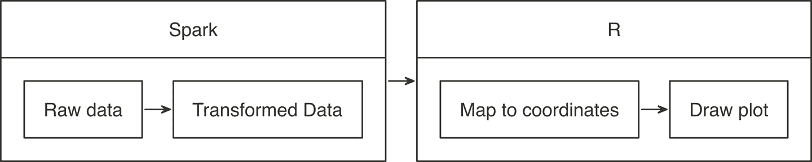

###### Figure 3-8\. 使用 Spark 和 R 进行绘图

在使用 `ggplot2` 时，让我们应用这个概念模型。

## 使用 ggplot2

要使用 `ggplot2` 创建条形图，我们只需调用一个函数：

```
library(ggplot2)
ggplot(aes(as.factor(cyl), mpg), data = mtcars) + geom_col()
```

在这种情况下，`mtcars` 的原始数据被 *自动* 转换为三个离散聚合的数字。接下来，每个结果被映射到 `x` 和 `y` 平面上。然后绘制图表。作为 R 用户，构建图表的所有阶段都为我们方便地抽象化了。

在 Spark 中，编码“推送计算，收集结果”的关键步骤有几个。首先，确保转换操作发生在 Spark 内部。在接下来的示例中，`group_by()` 和 `summarise()` 将在 Spark 内部运行。第二个步骤是在数据被转换后将结果带回 R。确保按照转换然后收集的顺序进行；如果先运行 `collect()`，R 将尝试从 Spark 中摄取整个数据集。根据数据大小，收集所有数据将减慢系统速度，甚至可能使系统崩溃。

```
car_group <- cars %>%
  group_by(cyl) %>%
  summarise(mpg = sum(mpg, na.rm = TRUE)) %>%
  collect() %>%
  print()
```

```
# A tibble: 3 x 2
    cyl   mpg
  <dbl> <dbl>
1     6  138.
2     4  293.
3     8  211.
```

在这个例子中，现在数据已经预先聚合并收集到 R 中，只传递了三条记录给绘图函数：

```
ggplot(aes(as.factor(cyl), mpg), data = car_group) +
  geom_col(fill = "#999999") + coord_flip()
```

Figure 3-9 展示了生成的图表。

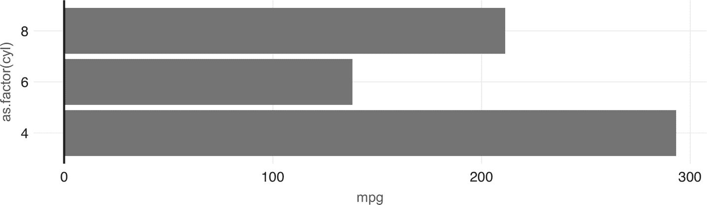

###### Figure 3-9\. 在 Spark 中进行聚合绘图

使用此方法可以制作任何其他 `ggplot2` 可视化；但是，这超出了本书的范围。相反，我们建议您阅读 [*R Graphics Cookbook*](https://oreil.ly/bIF4)，作者 Winston Chang（O’Reilly），以了解适用于 Spark 的其他可视化技术。现在，在可视化之前简化此转换步骤，`dbplot` 包提供了一些自动化聚合在 Spark 中使用的准备就绪的可视化。

## 使用 dbplot

`dbplot` 包提供了用于处理远程数据的辅助函数。R 代码 `dbplot` 被编写成可以转换为 Spark。然后使用这些结果使用 `ggplot2` 包创建图表，数据转换和绘图都由一个单一函数触发。

`dbplot_histogram()` 函数使 Spark 计算 bins 和每个 bin 的计数，并输出一个 `ggplot` 对象，我们可以通过添加更多步骤来进一步优化绘图对象。`dbplot_histogram()` 还接受一个 `binwidth` 参数来控制用于计算 bins 的范围：

```
library(dbplot)

cars %>%
dbplot_histogram(mpg, binwidth = 3) +
labs(title = "MPG Distribution",
     subtitle = "Histogram over miles per gallon")
```

图 3-10 展示了生成的绘图。

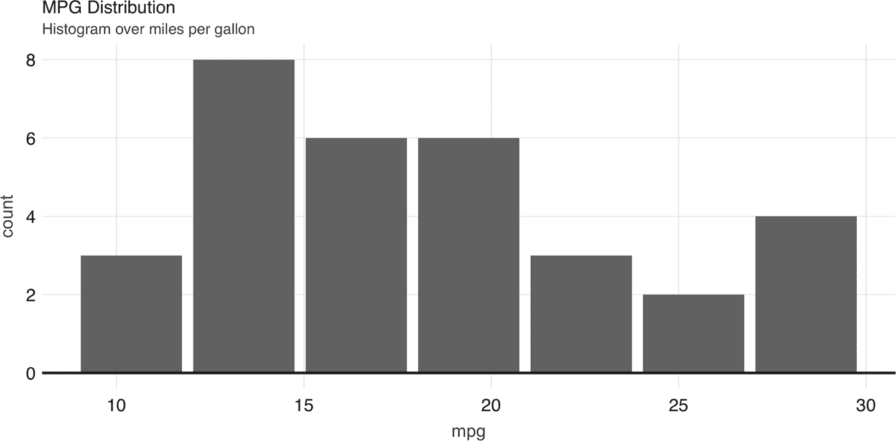

###### 图 3-10\. 由 dbplot 创建的直方图

直方图提供了分析单个变量的绝佳方式。要分析两个变量，通常使用散点图或光栅图。

散点图用于比较两个连续变量之间的关系。例如，散点图将显示汽车重量与其燃油消耗之间的关系。图 3-11 中的图表显示，重量越大，燃油消耗越高，因为点几乎聚集成一条从左上到右下的线。以下是生成该图表的代码：

```
ggplot(aes(mpg, wt), data = mtcars) +
  geom_point()
```

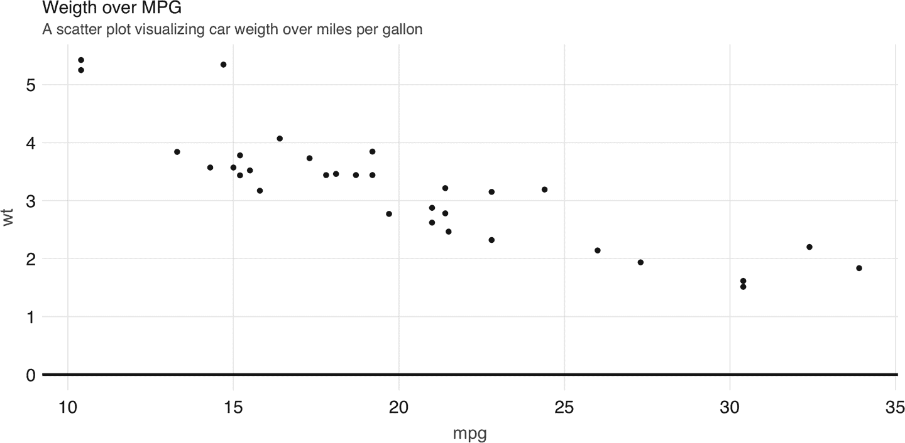

###### 图 3-11\. Spark 中的散点图示例

然而，对于散点图来说，无论如何“将计算推向” Spark 都无法解决这个问题，因为数据必须以单个点的形式绘制。

最佳的替代方案是找到一种能够以易于感知且“物理”绘制的方式表示 x/y 关系和浓度的图表类型。*光栅*图可能是最佳答案。光栅图返回一个 x/y 位置网格和给定聚合结果，通常由方块的颜色表示。

您可以使用 `dbplot_raster()` 在 Spark 中创建类似散点图的图表，同时只检索（收集）远程数据集的小部分：

```
dbplot_raster(cars, mpg, wt, resolution = 16)
```

如 图 3-12 所示，生成的绘图返回的网格不超过 5 x 5。这限制了需要收集到 R 中的记录数为 25。

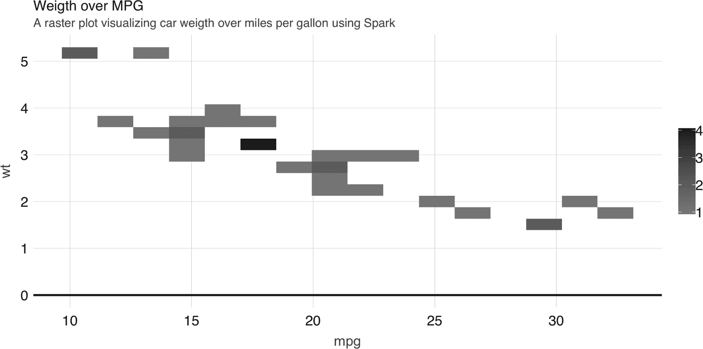

###### 图 3-12\. 使用 Spark 的光栅图

###### 提示

您还可以使用 `dbplot` 通过其他方式检索原始数据并进行可视化；要检索聚合数据但不是绘图，请使用 `db_compute_bins()`、`db_compute_count()`、`db_compute_raster()` 和 `db_compute_boxplot()`。

虽然可视化是不可或缺的，但您可以通过统计模型来补充数据分析，以深入了解我们的数据。下一节描述了如何准备数据以用于 Spark 建模。

# 模型

接下来的两章完全专注于建模，因此我们不打算在本章中详细介绍建模，而是想覆盖在进行数据分析时如何与模型进行交互。

首先，分析项目经历了多次转换和模型以找到答案。这就是为什么我们在图 3-2 中介绍了第一个数据分析图表，展示了可视化、数据处理和建模的循环——我们知道你不仅在 R 中，甚至在使用 Spark 时也不仅仅停留在建模。

因此，理想的数据分析语言使您能够在每个数据处理-可视化-建模迭代中快速调整。幸运的是，使用 Spark 和 R 时就是这种情况。

要说明在 Spark 中迭代数据处理和建模有多容易，请考虑以下示例。我们将从针对所有特征执行线性回归开始，并预测每加仑英里数：

```
cars %>%
  ml_linear_regression(mpg ~ .) %>%
  summary()
```

```
Deviance Residuals:
    Min      1Q  Median      3Q     Max
-3.4506 -1.6044 -0.1196  1.2193  4.6271

Coefficients:
(Intercept)         cyl        disp          hp        drat          wt
12.30337416 -0.11144048  0.01333524 -0.02148212  0.78711097 -3.71530393
      qsec          vs          am        gear        carb
0.82104075  0.31776281  2.52022689  0.65541302 -0.19941925

R-Squared: 0.869
Root Mean Squared Error: 2.147
```

此时，试验不同特征非常容易，我们可以简单地更改 R 公式，例如从`mpg ~ .`到`mpg ~ hp + cyl`，仅使用马力和汽缸作为特征：

```
cars %>%
  ml_linear_regression(mpg ~ hp + cyl) %>%
  summary()
```

```
Deviance Residuals:
    Min      1Q  Median      3Q     Max
-4.4948 -2.4901 -0.1828  1.9777  7.2934

Coefficients:
(Intercept)          hp         cyl
 36.9083305  -0.0191217  -2.2646936

R-Squared: 0.7407
Root Mean Squared Error: 3.021
```

另外，使用其他类型的模型进行迭代也非常容易。以下示例将线性模型替换为广义线性模型：

```
cars %>%
  ml_generalized_linear_regression(mpg ~ hp + cyl) %>%
  summary()
```

```
Deviance Residuals:
    Min      1Q  Median      3Q     Max
-4.4948 -2.4901 -0.1828  1.9777  7.2934

Coefficients:
(Intercept)          hp         cyl
 36.9083305  -0.0191217  -2.2646936

(Dispersion parameter for gaussian family taken to be 10.06809)

   Null  deviance: 1126.05 on 31 degress of freedom
Residual deviance: 291.975 on 29 degrees of freedom
AIC: 169.56
```

通常，在拟合模型之前，您需要使用多个`dplyr`转换来准备数据，以便模型能够有效使用。为了确保模型能够尽可能高效地拟合，您应该在拟合之前缓存数据集，如下所述。

## 缓存

本章的示例是使用一个非常小的数据集构建的。在实际场景中，会使用大量数据来进行建模。如果需要先转换数据，则数据的数量可能会对 Spark 会话产生重大影响。在拟合模型之前，将所有转换的结果保存在新表中，并加载到 Spark 内存中是个好主意。

`compute()`命令可以接受`dplyr`命令的末尾，并将结果保存到 Spark 内存中：

```
cached_cars <- cars %>%
  mutate(cyl = paste0("cyl_", cyl)) %>%
  compute("cached_cars")
```

```
cached_cars %>%
  ml_linear_regression(mpg ~ .) %>%
  summary()
```

```
Deviance Residuals:
     Min       1Q   Median       3Q      Max
-3.47339 -1.37936 -0.06554  1.05105  4.39057

Coefficients:
(Intercept) cyl_cyl_8.0 cyl_cyl_4.0        disp          hp        drat
16.15953652  3.29774653  1.66030673  0.01391241 -0.04612835  0.02635025
          wt        qsec          vs          am       gear        carb
 -3.80624757  0.64695710  1.74738689  2.61726546 0.76402917  0.50935118

R-Squared: 0.8816
Root Mean Squared Error: 2.041
```

随着从数据中获得更多见解，可能会提出更多问题。这就是为什么我们希望通过数据处理、可视化和建模的迭代多次来获得更多见解。每次迭代应该为我们解读数据提供增量见解。当我们达到满意的理解水平时，我们将准备好分享分析结果。这是下一节的主题。

# 沟通

清楚地传达分析结果同样重要——正如分析工作本身一样重要！公众、同事或利益相关者需要理解您发现的内容及其意义。

要有效地进行沟通，我们需要使用报告和演示文稿等工件；这些是我们可以使用*R Markdown*在 R 中创建的常见输出格式。

R Markdown 文档允许你将叙述文本和代码交织在一起。多种输出格式提供了非常强大的理由去学习和使用 R Markdown。有许多可用的输出格式，如 HTML、PDF、PowerPoint、Word、Web 幻灯片、网站、书籍等等。

大多数这些输出格式都包含在 R Markdown 的核心 R 包 `knitr` 和 `rmarkdown` 中。你可以通过其他的 R 包扩展 R Markdown。例如，本书就是使用了 `bookdown` 包提供的扩展来撰写的 R Markdown。深入了解 R Markdown 的最佳资源是官方书籍。¹

在 R Markdown 中，一个单一的文档可能以不同的格式呈现。例如，你可以通过更改报告本身的设置，将同一报告渲染为 HTML 或 PDF 文件。反之亦然，多种类型的文档也可以渲染为相同的输出。例如，一个演示文稿和一个报告都可以渲染为 HTML。

创建一个新的使用 Spark 作为计算引擎的 R Markdown 报告很容易。在顶部，R Markdown 需要一个 YAML 头部。第一行和最后一行是三个连字符 (`---`)。介于连字符之间的内容因文档类型不同而异。YAML 头部中唯一必需的字段是 `output` 值。R Markdown 需要知道需要将报告渲染成什么样的输出。这个 YAML 头部称为 *frontmatter*。在 frontmatter 之后是代码块的部分，称为 *代码块*。这些代码块可以与叙述文本交织在一起。当使用 Spark 和 R Markdown 时没有特别需要注意的地方；一切都像往常一样。

由于 R Markdown 文档是自包含的且旨在可复制，渲染文档之前，我们应首先断开与 Spark 的连接以释放资源：

```
spark_disconnect(sc)
```

下面的示例展示了创建一个完全可复制的报告并使用 Spark 处理大规模数据集是多么容易。叙述性文字、代码以及最重要的是代码输出都记录在生成的 HTML 文件中。你可以复制并粘贴以下代码到一个文件中。将文件保存为 *.Rmd* 扩展名，并选择任何你喜欢的名称：

```
---
title: "mtcars analysis"
output:
  html_document:
    fig_width: 6
    fig_height: 3
---
```{r, setup, include = FALSE}

library(sparklyr)

library(dplyr)

sc <- spark_connect(master = "local", version = "2.3")

cars <- copy_to(sc, mtcars)

```

## Visualize
Aggregate data in Spark, visualize in R.
```{r  fig.align='center', warning=FALSE}

library(ggplot2)

cars %>%

group_by(cyl) %>% summarise(mpg = mean(mpg)) %>%

ggplot(aes(cyl, mpg)) + geom_bar(stat="identity")

```

## Model
The selected model was a simple linear regression that
uses the weight as the predictor of MPG

```{r}

cars %>%

ml_linear_regression(wt ~ mpg) %>%

summary()

```
```{r, include = FALSE}

spark_disconnect(sc)

```
```

要编织此报告，请将文件保存为 *.Rmd* 扩展名，例如 *report.Rmd*，并从 R 中运行 `render()`。输出应如 图 3-13 所示。

```
rmarkdown::render("report.Rmd")
```

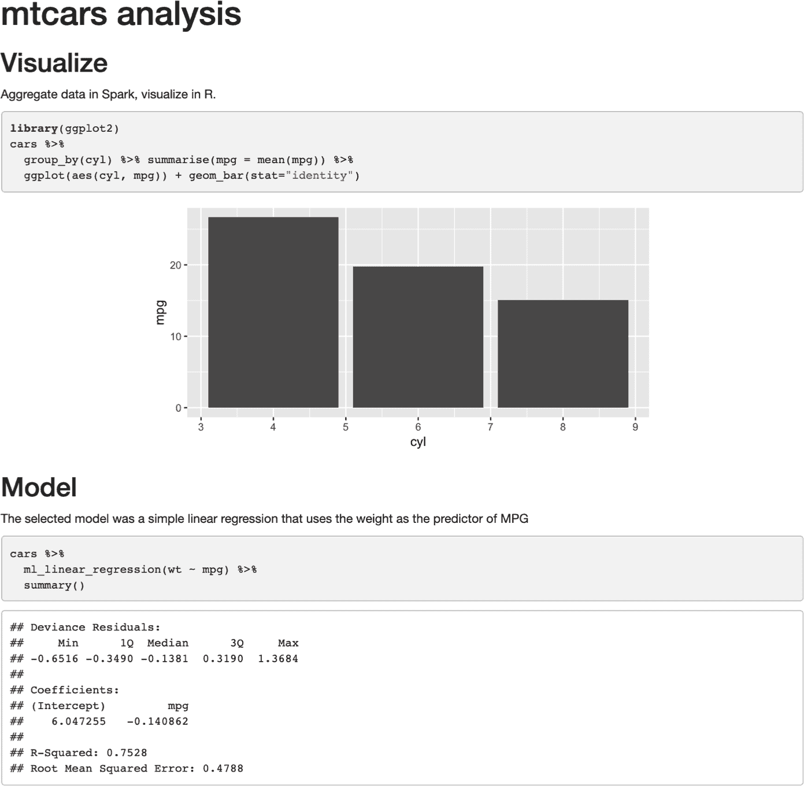

###### 图 3-13\. R Markdown HTML 输出

现在，您可以轻松分享此报告，而查看者无需使用 Spark 或 R 来阅读和消化其内容；它只是一个自包含的 HTML 文件，在任何浏览器中打开都很容易。

将报告的见解提炼到许多其他输出格式中也很常见。切换非常容易：在前言的顶部，将`output`选项更改为`powerpoint_presentation`、`pdf_document`、`word_document`或类似选项。或者，您甚至可以从同一份报告中生成多个输出格式：

```
---
title: "mtcars analysis"
output:
  word_document: default
  pdf_document: default
  powerpoint_presentation: default
---
```

结果将是一个 PowerPoint 演示文稿、一个 Word 文档和一个 PDF。所有原始 HTML 报告中显示的信息都是在 Spark 中计算并在 R 中渲染的。您可能需要编辑 PowerPoint 模板或代码块的输出。

这个简单示例展示了从一种格式转换到另一种格式有多么容易。当然，需要在 R 用户的一侧进行更多编辑，以确保幻灯片只包含相关信息。主要问题在于，不需要学习不同的标记或代码约定就能从一个文档转换到另一个文档。

# 总结

本章介绍了使用 R 和 Spark 进行数据分析的基础知识。许多介绍的技术看起来与仅使用 R 而不是 Spark 非常相似，虽然有些平淡，但确实是帮助已熟悉 R 的用户轻松过渡到 Spark 的正确设计。对于不熟悉 R 的用户，本章还是对 R 中一些最流行（和有用！）包的简要介绍。

现在应该很明显，R 和 Spark 一起是一个强大的组合——一个大规模计算平台，以及一个非常强大的 R 包生态系统，使其成为一个理想的分析平台。

在 Spark 中使用 R 进行分析时，请记住将计算推送到 Spark 并专注于在 R 中收集结果。这种范式应该为通过在各种输出中分享结果来进行数据处理、可视化和沟通设立一个成功的方法。

第四章将深入探讨如何使用更有趣的数据集（比约会数据集更有趣的是什么？）在 Spark 中构建统计模型。您还将从本章的简要建模部分学习更多技术，我们甚至没有提及。

¹ Xie Allaire G（2018）。《R Markdown: The Definite Guide》，第 1 版。CRC Press。
