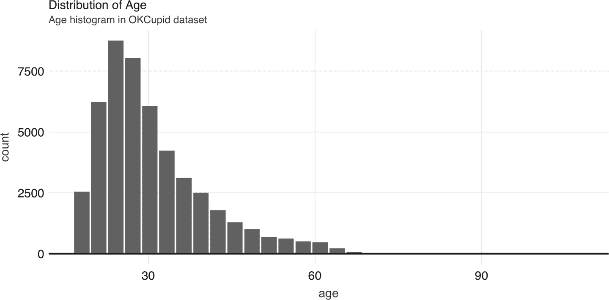
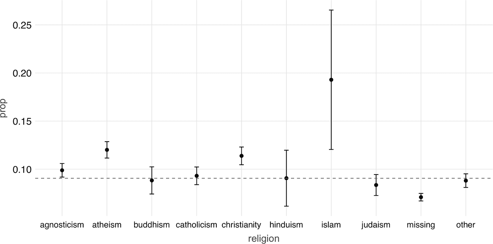
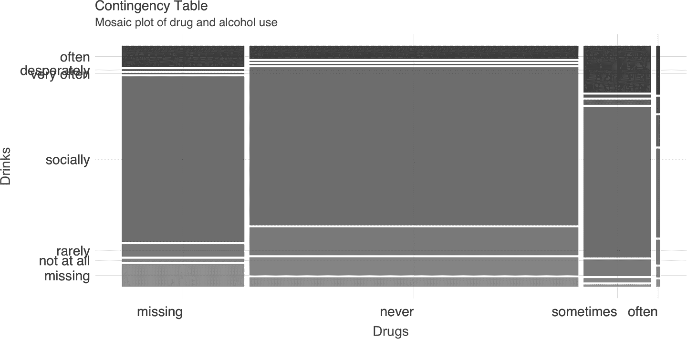
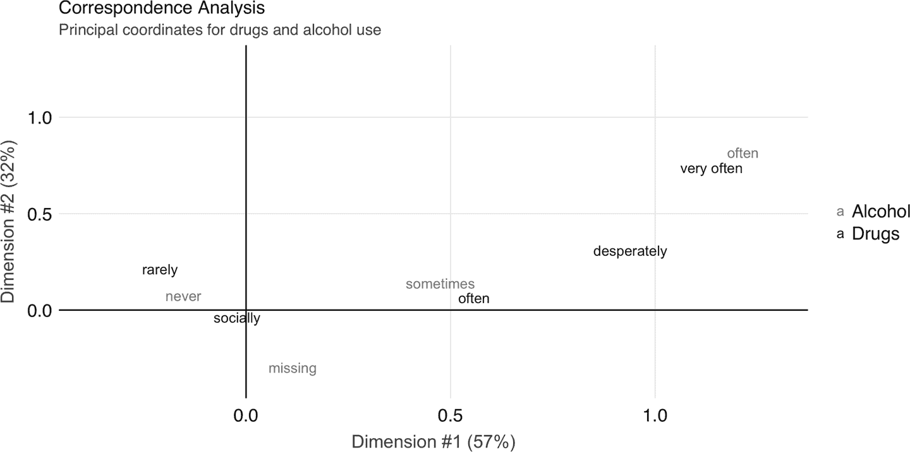
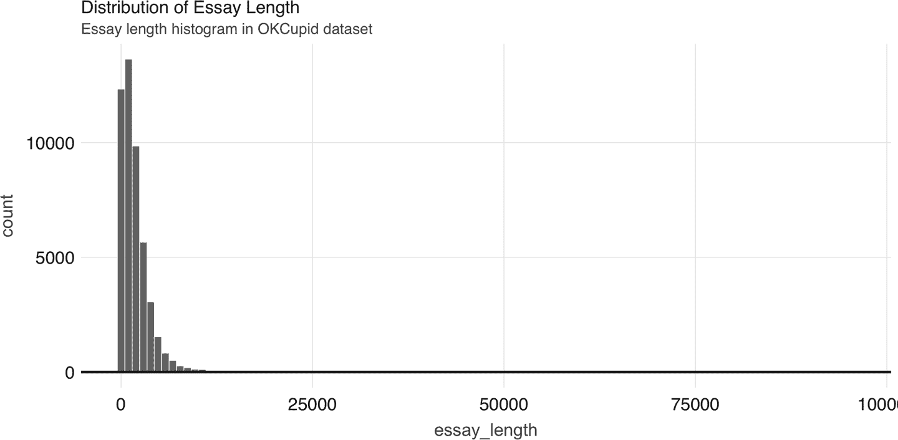
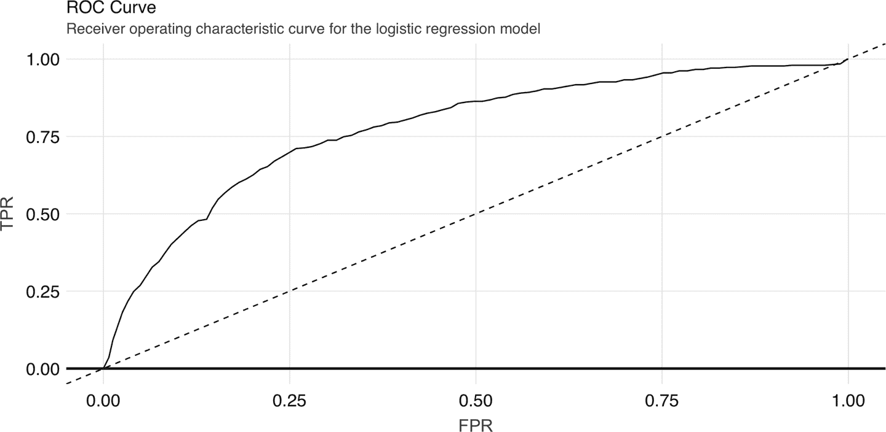
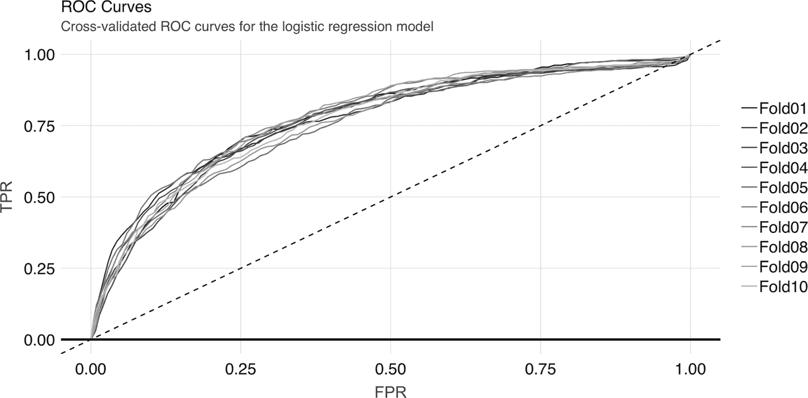
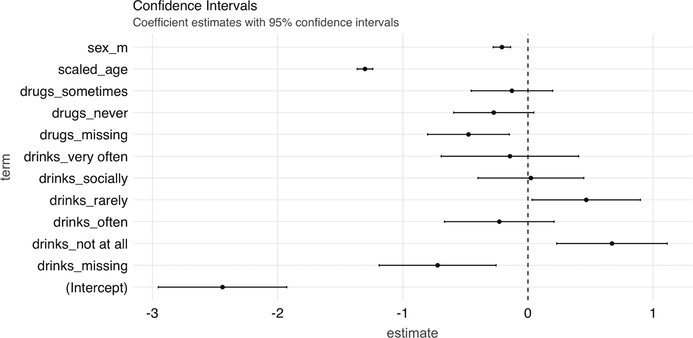
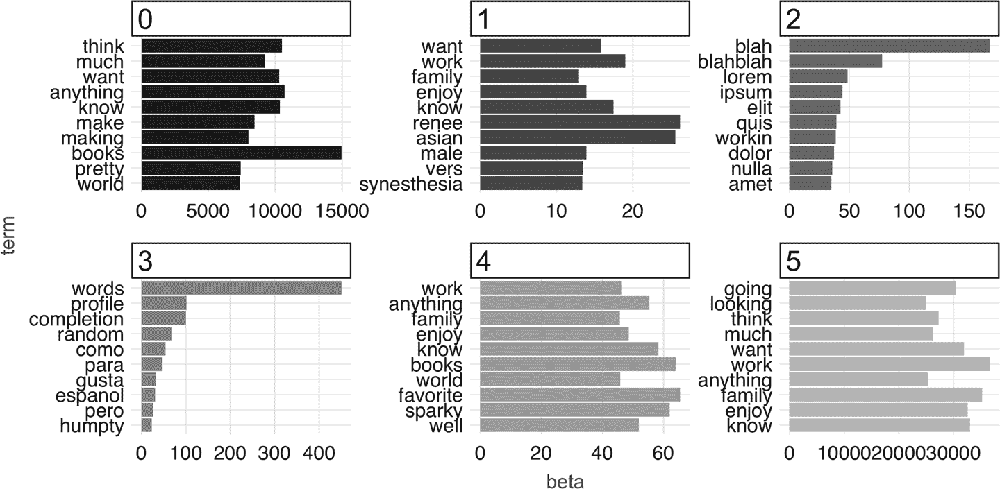

# 第四章：模型化

> 多年来，我一直相信你的幻象和预言。
> 
> —斯坦尼斯·拜拉席恩

在第三章中，您学习了如何使用 Spark 扩展数据分析到大数据集。在本章中，我们详细介绍了在 Spark 中构建预测模型所需的步骤。我们探索了`MLlib`，这是 Spark 的一个组件，允许您编写高级代码在分布式数据上执行预测建模，并在特征工程和探索性数据分析的上下文中使用数据整理。

我们将从介绍 Spark 中的建模和本章节中将使用的数据集开始。然后我们展示一个包括探索性数据分析、特征工程和模型构建的监督学习工作流程。接着，我们将演示一个使用非结构化文本数据的无监督主题建模示例。请记住，我们的目标是展示在大数据上执行数据科学任务的各种技术，而不是进行严格和连贯的分析。在本章中，还有许多其他 Spark 中可用但本章未涵盖的模型，但到了本章结束时，您将具备自行尝试其他模型的正确工具。

虽然手动预测数据集通常是一个合理的方法（“手动”指的是将数据集导入 Spark 并使用已拟合的模型来丰富或预测值），但这引出了一个问题，我们是否可以将这一过程自动化到任何人都可以使用的系统中？例如，我们如何构建一个系统，可以自动识别电子邮件是否为垃圾邮件，而无需手动分析每个电子邮件账户？第五章 提供了用于通过流水线自动化数据分析和建模的工具，但要实现这一目标，我们首先需要了解如何“手动”训练模型。

# 概览

R 接口到 Spark 提供了模型算法，这对 R 用户来说应该是熟悉的。例如，我们已经使用了 `ml_linear_regression(cars, mpg ~ .)`，但我们同样可以运行 `ml_logistic_regression(cars, am ~ .)`。

请花点时间查看本书附录中包含的`MLlib`函数的长列表；快速浏览此列表可以看出，Spark 支持决策树、梯度提升树、加速失效时间生存回归、等距回归、*K*-均值聚类、高斯混合聚类等等。

如您所见，Spark 提供了广泛的算法和特征转换器，在这里我们涉及了功能的代表部分。对预测建模概念的全面讨论超出了本书的范围，因此我们建议结合 Hadley Wickham 和 Garrett Grolemund G（O'Reilly）的[*R for Data Science*](https://r4ds.had.co.nz/)以及*Feature Engineering and Selection: A Practical Approach for Predictive Models*¹，本章中的一些示例和可视化有时候是直接引用的。

本章重点介绍预测建模，因为 Spark 的目标是实现机器学习，而不是统计推断。机器学习通常更关注预测未来，而不是推断生成数据的过程²，然后用于创建自动化系统。机器学习可分为*监督学习*（预测建模）和*无监督学习*。在监督学习中，我们试图学习一个函数，将从数据集中的(x, y)示例映射到 Y。在无监督学习中，我们只有 X 而没有 Y 标签，因此我们尝试学习有关 X 结构的信息。监督学习的一些实际用例包括预测明天的天气、确定信用卡交易是否欺诈以及为您的汽车保险报价。无监督学习的例子包括自动分组个人照片、基于购买历史对客户进行分段以及文档聚类。

`sparklyr` 中的 ML 接口旨在最小化从本地内存中的本机 R 工作流程到集群的认知工作量，以及反向过程。虽然 Spark 生态系统非常丰富，但 CRAN 中仍然有大量的软件包，其中一些实现了您可能需要的功能。此外，您可能希望利用您在 R 中的技能和经验来保持生产力。我们在第三章中学到的内容在这里同样适用——重要的是要跟踪您执行计算的位置，并根据需要在集群和您的 R 会话之间移动。

本章的示例使用了[`OkCupid`数据集](https://oreil.ly/Uv9r_)³。该数据集包含来自在线约会网站的用户资料数据，包括性别、职业等生物特征以及与个人兴趣相关的自由文本字段。数据集中约有 60,000 个用户资料，可以轻松地在现代笔记本电脑的内存中运行，不被视为“大数据”，因此您可以轻松地在本地模式下运行 Spark 进行跟踪。

您可以按以下方式下载此数据集：

```
download.file(
  "https://github.com/r-spark/okcupid/raw/master/profiles.csv.zip",
  "okcupid.zip")

unzip("okcupid.zip", exdir = "data")
unlink("okcupid.zip")
```

我们不建议对该数据集进行抽样，因为模型将远不如丰富；但是，如果您的硬件资源有限，您可以按以下方式对其进行抽样：

```
profiles <- read.csv("data/profiles.csv")
write.csv(dplyr::sample_n(profiles, 10³),
          "data/profiles.csv", row.names = FALSE)
```

###### 注意

本章中的示例使用了小型数据集，以便您可以轻松在本地模式下跟踪。 实际上，如果您的数据集在本地机器的内存中能轻松容纳，您可能最好使用一种高效的、非分布式的建模算法实现。 例如，您可能想使用`ranger`包，而不是`ml_random_forest_classifier()`。

此外，为了跟进，您需要安装一些额外的包：

```
install.packages("ggmosaic")
install.packages("forcats")
install.packages("FactoMineR")
```

为了说明示例的动机，我们考虑以下问题：

> 预测某人目前是否在积极工作——即不是退休、学生或失业。

接下来，我们来探索这个数据集。

# 探索性数据分析

在预测建模的背景下，探索性数据分析（EDA）是查看数据摘录和摘要的练习。 EDA 阶段的具体目标受业务问题的启发，但以下是一些常见目标：

+   检查数据质量；确认缺失值的含义和普遍性，并将统计数据与现有控制进行调和。

+   了解变量之间的单变量关系。

+   对要包括的变量进行初步评估，以及对它们要进行的变换进行评估。

首先，我们连接到 Spark，加载库，并读取数据：

```
library(sparklyr)
library(ggplot2)
library(dbplot)
library(dplyr)

sc <- spark_connect(master = "local", version = "2.3")

okc <- spark_read_csv(
  sc,
  "data/profiles.csv",
  escape = "\"",
  memory = FALSE,
  options = list(multiline = TRUE)
) %>%
  mutate(
    height = as.numeric(height),
    income = ifelse(income == "-1", NA, as.numeric(income))
  ) %>%
  mutate(sex = ifelse(is.na(sex), "missing", sex)) %>%
  mutate(drinks = ifelse(is.na(drinks), "missing", drinks)) %>%
  mutate(drugs = ifelse(is.na(drugs), "missing", drugs)) %>%
  mutate(job = ifelse(is.na(job), "missing", job))
```

我们在这里指定了`escape = "\""`和`options = list(multiline = TRUE)`，以适应论文字段中嵌入的引号字符和换行符。 我们还将`height`和`income`列转换为数值类型，并重新编码字符串列中的丢失值。 请注意，可能需要多次尝试指定不同的参数才能正确进行初始数据摄取，有时在您在建模过程中了解更多关于数据后，您可能需要重新访问这一步。

现在，我们可以使用`glimpse()`来快速查看我们的数据：

```
glimpse(okc)
```

```
Observations: ??
Variables: 31
Database: spark_connection
$ age         <int> 22, 35, 38, 23, 29, 29, 32, 31, 24, 37, 35…
$ body_type   <chr> "a little extra", "average", "thin", "thin…
$ diet        <chr> "strictly anything", "mostly other", "anyt…
$ drinks      <chr> "socially", "often", "socially", "socially…
$ drugs       <chr> "never", "sometimes", "missing", "missing"…
$ education   <chr> "working on college/university", "working …
$ essay0      <chr> "about me:<br />\n<br />\ni would love to …
$ essay1      <chr> "currently working as an international age…
$ essay2      <chr> "making people laugh.<br />\nranting about…
$ essay3      <chr> "the way i look. i am a six foot half asia…
$ essay4      <chr> "books:<br />\nabsurdistan, the republic, …
$ essay5      <chr> "food.<br />\nwater.<br />\ncell phone.<br…
$ essay6      <chr> "duality and humorous things", "missing", …
$ essay7      <chr> "trying to find someone to hang out with. …
$ essay8      <chr> "i am new to california and looking for so…
$ essay9      <chr> "you want to be swept off your feet!<br />…
$ ethnicity   <chr> "asian, white", "white", "missing", "white…
$ height      <dbl> 75, 70, 68, 71, 66, 67, 65, 65, 67, 65, 70…
$ income      <dbl> NaN, 80000, NaN, 20000, NaN, NaN, NaN, NaN…
$ job         <chr> "transportation", "hospitality / travel", …
$ last_online <chr> "2012-06-28-20-30", "2012-06-29-21-41", "2…
$ location    <chr> "south san francisco, california", "oaklan…
$ offspring   <chr> "doesn&rsquo;t have kids, but might want t…
$ orientation <chr> "straight", "straight", "straight", "strai…
$ pets        <chr> "likes dogs and likes cats", "likes dogs a…
$ religion    <chr> "agnosticism and very serious about it", "…
$ sex         <chr> "m", "m", "m", "m", "m", "m", "f", "f", "f…
$ sign        <chr> "gemini", "cancer", "pisces but it doesn&r…
$ smokes      <chr> "sometimes", "no", "no", "no", "no", "no",…
$ speaks      <chr> "english", "english (fluently), spanish (p…
$ status      <chr> "single", "single", "available", "single",…
```

现在，我们将我们的响应变量作为数据集中的一列，并查看其分布：

```
okc <- okc %>%
  mutate(
    not_working = ifelse(job %in% c("student", "unemployed", "retired"), 1 , 0)
  )

okc %>%
  group_by(not_working) %>%
  tally()
```

```
# Source: spark<?> [?? x 2]
  not_working     n
        <dbl> <dbl>
1           0 54541
2           1  5405
```

在我们进一步进行之前，让我们将数据进行初步分割，分为训练集和测试集，并将后者放在一边。 在实践中，这是一个关键的步骤，因为我们希望在建模过程的最后留出一个留置集，以评估模型性能。 如果我们在 EDA 期间包含整个数据集，测试集的信息可能会“泄漏”到可视化和摘要统计数据中，并且偏向我们的模型构建过程，即使数据并没有直接用在学习算法中。 这将损害我们性能指标的可信度。 我们可以使用`sdf_random_split()`函数轻松地将数据进行分割：

```
data_splits <- sdf_random_split(okc, training = 0.8, testing = 0.2, seed = 42)
okc_train <- data_splits$training
okc_test <- data_splits$testing
```

我们可以快速查看我们响应变量的分布：

```
okc_train %>%
  group_by(not_working) %>%
  tally() %>%
  mutate(frac = n / sum(n))
```

```
# Source: spark<?> [?? x 3]
  not_working     n   frac
        <dbl> <dbl>  <dbl>
1           0 43785 0.910
2           1  4317 0.0897
```

使用`sdf_describe()`函数，我们可以获得特定列的数值摘要：

```
sdf_describe(okc_train, cols = c("age", "income"))
```

```
# Source: spark<?> [?? x 3]
  summary age                income
  <chr>   <chr>              <chr>
1 count   48102              9193
2 mean    32.336534863415245 104968.99815076689
3 stddev  9.43908920033797   202235.2291773537
4 min     18                 20000.0
5 max     110                1000000.0
```

正如我们在第三章中所见，我们也可以利用` dbplot `包来绘制这些变量的分布。在图 4-1 中，我们展示了` age `变量的直方图分布，其代码如下所示：

```
dbplot_histogram(okc_train, age)
```



###### 图 4-1\. 年龄分布

一种常见的探索性数据分析（EDA）练习是查看响应变量和各个预测变量之间的关系。通常情况下，您可能已经具备了这些关系应该是什么样子的业务知识，因此这可以作为数据质量检查。此外，意外的趋势可以提示您可能希望在模型中包含的变量交互。例如，我们可以探索` religion `变量：

```
prop_data <- okc_train %>%
  mutate(religion = regexp_extract(religion, "^\\\\w+", 0)) %>%
  group_by(religion, not_working) %>%
  tally() %>%
  group_by(religion) %>%
  summarise(
    count = sum(n),
    prop = sum(not_working * n) / sum(n)
  ) %>%
  mutate(se = sqrt(prop * (1 - prop) / count)) %>%
  collect()

prop_data
```

```
# A tibble: 10 x 4
   religion     count   prop      se
   <chr>        <dbl>  <dbl>   <dbl>
 1 judaism       2520 0.0794 0.00539
 2 atheism       5624 0.118  0.00436
 3 christianity  4671 0.120  0.00480
 4 hinduism       358 0.101  0.0159
 5 islam          115 0.191  0.0367
 6 agnosticism   7078 0.0958 0.00346
 7 other         6240 0.0841 0.00346
 8 missing      16152 0.0719 0.002
 9 buddhism      1575 0.0851 0.007
10 catholicism   3769 0.0886 0.00458
```

注意，` prop_data `是一个小的 DataFrame，已经在我们的 R 会话中收集到内存中，我们可以利用` ggplot2 `创建一个信息丰富的可视化（参见图 4-2）：

```
prop_data %>%
  ggplot(aes(x = religion, y = prop)) + geom_point(size = 2) +
  geom_errorbar(aes(ymin = prop - 1.96 * se, ymax = prop + 1.96 * se),
                width = .1) +
  geom_hline(yintercept = sum(prop_data$prop * prop_data$count) /
                              sum(prop_data$count))
```



###### 图 4-2\. 不同宗教信仰的当前失业者比例

接下来，我们来看一下两个预测变量之间的关系：酒精使用和药物使用。我们预计它们之间会存在一定的相关性。您可以通过` sdf_crosstab() `计算一个列联表：

```
contingency_tbl <- okc_train %>%
  sdf_crosstab("drinks", "drugs") %>%
  collect()

contingency_tbl
```

```
# A tibble: 7 x 5
  drinks_drugs missing never often sometimes
  <chr>          <dbl> <dbl> <dbl>     <dbl>
1 very often        54   144    44       137
2 socially        8221 21066   126      4106
3 not at all       146  2371    15       109
4 desperately       72    89    23        74
5 often           1049  1718    69      1271
6 missing         1121  1226    10        59
7 rarely           613  3689    35       445
```

我们可以使用马赛克图可视化这个列联表（参见图 4-3）：

```
library(ggmosaic)
library(forcats)
library(tidyr)

contingency_tbl %>%
  rename(drinks = drinks_drugs) %>%
  gather("drugs", "count", missing:sometimes) %>%
  mutate(
    drinks = as_factor(drinks) %>%
      fct_relevel("missing", "not at all", "rarely", "socially",
                  "very often", "desperately"),
    drugs = as_factor(drugs) %>%
      fct_relevel("missing", "never", "sometimes", "often")
  ) %>%
  ggplot() +
  geom_mosaic(aes(x = product(drinks, drugs), fill = drinks,
                  weight = count))
```



###### 图 4-3\. 药物和酒精使用的马赛克图

为了进一步探索这两个变量之间的关系，我们可以使用` FactoMineR `包执行对应分析⁴。这种技术使我们能够通过将每个水平映射到平面上的一个点来总结高维因子水平之间的关系。我们首先使用` FactoMineR::CA() `获取映射，如下所示：

```
dd_obj <- contingency_tbl %>%
  tibble::column_to_rownames(var = "drinks_drugs") %>%
  FactoMineR::CA(graph = FALSE)
```

然后，我们可以使用` ggplot `绘制结果，您可以在图 4-4 中看到：

```
dd_drugs <-
  dd_obj$row$coord %>%
  as.data.frame() %>%
  mutate(
    label = gsub("_", " ", rownames(dd_obj$row$coord)),
    Variable = "Drugs"
  )

dd_drinks <-
  dd_obj$col$coord %>%
  as.data.frame() %>%
  mutate(
    label = gsub("_", " ", rownames(dd_obj$col$coord)),
    Variable = "Alcohol"
  )

ca_coord <- rbind(dd_drugs, dd_drinks)

ggplot(ca_coord, aes(x = `Dim 1`, y = `Dim 2`,
                     col = Variable)) +
  geom_vline(xintercept = 0) +
  geom_hline(yintercept = 0) +
  geom_text(aes(label = label)) +
  coord_equal()
```



###### 图 4-4\. 药物和酒精使用的对应分析主坐标

在图 4-4 中，我们看到对应分析过程已将因子转换为称为*主坐标*的变量，这些坐标对应于图中的轴，并表示它们在列联表中包含的信息量。例如，我们可以解释“经常饮酒”和“非常频繁使用药物”的接近表示它们之间的关联。

这就结束了我们对 EDA 的讨论。让我们继续进行特征工程。

# 特征工程

特征工程的练习包括将数据转换以提高模型的性能。这可以包括将数值值居中和缩放以及执行字符串操作以提取有意义的变量。它通常还包括变量选择——选择在模型中使用哪些预测变量的过程。

在图 4-1 中，我们看到`age`变量的范围从 18 到 60 多岁。一些算法，特别是神经网络，在训练时如果我们对输入进行归一化使其具有相同的量级，会更快。现在让我们通过计算其均值和标准差来归一化`age`变量：

```
scale_values <- okc_train %>%
  summarise(
    mean_age = mean(age),
    sd_age = sd(age)
  ) %>%
  collect()

scale_values
```

```
# A tibble: 1 x 2
  mean_age sd_age
     <dbl>  <dbl>
1     32.3   9.44
```

然后我们可以使用这些来转换数据集：

```
okc_train <- okc_train %>%
  mutate(scaled_age = (age - !!scale_values$mean_age) /
           !!scale_values$sd_age)
```

```
dbplot_histogram(okc_train, scaled_age)
```

在图 4-5 中，我们看到缩放年龄变量的值接近零。现在我们继续讨论其他类型的转换，在特征工程工作流程中，您可能希望对要包含在模型中的所有数值变量执行归一化。


###### 图 4-5\. 缩放年龄分布

由于一些个人资料特征是多选的——换句话说，一个人可以选择为变量关联多个选项——我们需要在构建有意义的模型之前对它们进行处理。例如，如果我们看一下种族列，我们会发现有许多不同的组合：

```
okc_train %>%
  group_by(ethnicity) %>%
  tally()
```

```
# Source: spark<?> [?? x 2]
   ethnicity                                     n
   <chr>                                     <dbl>
 1 hispanic / latin, white                    1051
 2 black, pacific islander, hispanic / latin     2
 3 asian, black, pacific islander                5
 4 black, native american, white                91
 5 middle eastern, white, other                 34
 6 asian, other                                 78
 7 asian, black, white                          12
 8 asian, hispanic / latin, white, other         7
 9 middle eastern, pacific islander              1
10 indian, hispanic / latin                      5
# … with more rows
```

一种处理方法是将每种种族组合视为一个单独的级别，但这将导致许多算法中的级别数量非常庞大，从而产生问题。为了更好地编码这些信息，我们可以为每个种族创建虚拟变量，如下所示：

```
ethnicities <- c("asian", "middle eastern", "black", "native american", "indian",
                 "pacific islander", "hispanic / latin", "white", "other")
ethnicity_vars <- ethnicities %>%
  purrr::map(~ expr(ifelse(like(ethnicity, !!.x), 1, 0))) %>%
  purrr::set_names(paste0("ethnicity_", gsub("\\s|/", "", ethnicities)))
okc_train <- mutate(okc_train, !!!ethnicity_vars)
okc_train %>%
  select(starts_with("ethnicity_")) %>%
  glimpse()
```

```
Observations: ??
Variables: 9
Database: spark_connection
$ ethnicity_asian           <dbl> 0, 0, 0, 0, 0, 0, 0, 0, 0, 0…
$ ethnicity_middleeastern   <dbl> 0, 0, 0, 0, 0, 0, 0, 0, 0, 0…
$ ethnicity_black           <dbl> 0, 1, 0, 0, 0, 0, 0, 0, 0, 0…
$ ethnicity_nativeamerican  <dbl> 0, 0, 0, 0, 0, 0, 0, 0, 0, 0…
$ ethnicity_indian          <dbl> 0, 0, 0, 0, 0, 0, 0, 0, 0, 0…
$ ethnicity_pacificislander <dbl> 0, 0, 0, 0, 0, 0, 0, 0, 0, 0…
$ ethnicity_hispaniclatin   <dbl> 0, 0, 0, 0, 0, 0, 0, 0, 0, 0…
$ ethnicity_white           <dbl> 1, 0, 1, 0, 1, 1, 1, 0, 1, 0…
$ ethnicity_other           <dbl> 0, 0, 0, 0, 0, 0, 0, 0, 0, 0…
```

对于自由文本字段，提取特征的一种简单方法是计算字符的总数。我们将使用`compute()`将训练数据集存储在 Spark 的内存中，以加快计算速度。

```
okc_train <- okc_train %>%
  mutate(
    essay_length = char_length(paste(!!!syms(paste0("essay", 0:9))))
  ) %>% compute()
```

```
dbplot_histogram(okc_train, essay_length, bins = 100)
```

我们可以看到在图 4-6 中`essay_length`变量的分布。



###### 图 4-6\. 文章长度分布

我们在第五章中使用这个数据集，所以让我们首先将其保存为 Parquet 文件——这是一个非常适合数值数据的高效文件格式：

```
spark_write_parquet(okc_train, "data/okc-train.parquet")
```

现在我们有了更多特征可以使用，我们可以开始运行一些无监督学习算法了。

# 监督学习

一旦我们对数据集有了充分的掌握，我们可以开始构建一些模型。然而，在此之前，我们需要制定一个计划来调整和验证“候选”模型——在建模项目中，我们通常尝试不同类型的模型和拟合方式，以确定哪些模型效果最佳。由于我们处理的是二元分类问题，可以使用的指标包括准确率、精确度、敏感度和接收者操作特征曲线下面积（ROC AUC），等等。优化的指标取决于具体的业务问题，但在本次练习中，我们将专注于 ROC AUC。

很重要的一点是，在最后阶段之前我们不能窥视测试保留集，因为我们获取的任何信息都可能影响我们的建模决策，从而使我们对模型性能的估计不够可信。为了调整和验证，我们执行 10 折交叉验证，这是模型调整的标准方法。该方案的工作方式如下：首先将数据集分成 10 个大致相等的子集。我们将第 2 到第 10 个集合作为算法的训练集，并在第 1 个集合上验证结果模型。接下来，我们将第 2 个集合作为验证集，并在第 1 和第 3 到第 10 个集合上训练算法。总共，我们训练了 10 个模型并平均性能。如果时间和资源允许，您还可以多次使用不同的随机数据分割执行此过程。在我们的案例中，我们将演示如何执行一次交叉验证。此后，我们将每个分割的训练集称为*分析*数据，将验证集称为*评估*数据。

使用`sdf_random_split()`函数，我们可以从我们的`okc_train`表中创建一个子集列表：

```
vfolds <- sdf_random_split(
  okc_train,
  weights = purrr::set_names(rep(0.1, 10), paste0("fold", 1:10)),
  seed = 42
)
```

接着，我们按以下方式创建我们的第一个分析/评估分割：

```
analysis_set <- do.call(rbind, vfolds[2:10])
assessment_set <- vfolds[[1]]
```

这里我们需要特别注意的一点是变量的缩放。我们必须确保不会从评估集泄漏任何信息到分析集，因此我们仅在分析集上计算均值和标准差，并将相同的变换应用于两个集合。以下是我们如何处理`age`变量的方法：

```
make_scale_age <- function(analysis_data) {
  scale_values <- analysis_data %>%
    summarise(
      mean_age = mean(age),
      sd_age = sd(age)
    ) %>%
    collect()

  function(data) {
    data %>%
      mutate(scaled_age = (age - !!scale_values$mean_age) /
      !!scale_values$sd_age)
  }
}

scale_age <- make_scale_age(analysis_set)
train_set <- scale_age(analysis_set)
validation_set <- scale_age(assessment_set)
```

为简洁起见，这里只展示如何转换`age`变量。然而，在实践中，您会希望归一化每一个连续预测变量，例如我们在前一节中推导的`essay_length`变量。

逻辑回归通常是二元分类问题的合理起点，所以让我们试试看。假设我们的领域知识还提供了一组初始预测变量。然后我们可以使用`Formula`接口拟合模型：

```
lr <- ml_logistic_regression(
  analysis_set, not_working ~ scaled_age + sex + drinks + drugs + essay_length
)
lr
```

```
Formula: not_working ~ scaled_age + sex + drinks + drugs + essay_length

Coefficients:
      (Intercept)        scaled_age             sex_m   drinks_socially
    -2.823517e+00     -1.309498e+00     -1.918137e-01      2.235833e-01
    drinks_rarely      drinks_often drinks_not at all    drinks_missing
     6.732361e-01      7.572970e-02      8.214072e-01     -4.456326e-01
drinks_very often       drugs_never     drugs_missing   drugs_sometimes
     8.032052e-02     -1.712702e-01     -3.995422e-01     -7.483491e-02
     essay_length
     3.664964e-05
```

要获得评估集上性能指标的摘要，我们可以使用`ml_evaluate()`函数：

```
validation_summary <- ml_evaluate(lr, assessment_set)
```

您可以打印`validation_summary`以查看可用的指标：

```
validation_summary
```

```
BinaryLogisticRegressionSummaryImpl
 Access the following via `$` or `ml_summary()`.
 - features_col()
 - label_col()
 - predictions()
 - probability_col()
 - area_under_roc()
 - f_measure_by_threshold()
 - pr()
 - precision_by_threshold()
 - recall_by_threshold()
 - roc()
 - prediction_col()
 - accuracy()
 - f_measure_by_label()
 - false_positive_rate_by_label()
 - labels()
 - precision_by_label()
 - recall_by_label()
 - true_positive_rate_by_label()
 - weighted_f_measure()
 - weighted_false_positive_rate()
 - weighted_precision()
 - weighted_recall()
 - weighted_true_positive_rate()
```

我们可以通过收集`validation_summary$roc()`的输出并使用`ggplot2`来绘制 ROC 曲线：

```
roc <- validation_summary$roc() %>%
  collect()

ggplot(roc, aes(x = FPR, y = TPR)) +
  geom_line() + geom_abline(lty = "dashed")
```

图 4-7 展示了绘图结果。

ROC 曲线将真正例率（灵敏度）绘制为分类阈值的假正例率（1–特异性）。在实践中，业务问题有助于确定在曲线上设置分类阈值的位置。AUC 是用于确定模型质量的总结性测量，我们可以通过调用 `area_under_roc()` 函数来计算它。



###### 图 4-7\. 逻辑回归模型的 ROC 曲线

```
validation_summary$area_under_roc()
```

```
[1] 0.7872754
```

###### 注意

对于广义线性模型（包括线性模型和逻辑回归），Spark 提供了评估方法。对于其他算法，您可以使用评估器函数（例如，在预测 DataFrame 上使用 `ml_binary_classification_evaluator()`）或计算自己的指标。

现在，我们可以轻松重复已有的逻辑，并将其应用于每个分析/评估拆分：

```
cv_results <- purrr::map_df(1:10, function(v) {
  analysis_set <- do.call(rbind, vfolds[setdiff(1:10, v)]) %>% compute()
  assessment_set <- vfolds[[v]]

  scale_age <- make_scale_age(analysis_set)
  train_set <- scale_age(analysis_set)
  validation_set <- scale_age(assessment_set)

  model <- ml_logistic_regression(
    analysis_set, not_working ~ scaled_age + sex + drinks + drugs + essay_length
  )
  s <- ml_evaluate(model, assessment_set)
  roc_df <- s$roc() %>%
    collect()
  auc <- s$area_under_roc()

  tibble(
    Resample = paste0("Fold", stringr::str_pad(v, width = 2, pad = "0")),
    roc_df = list(roc_df),
    auc = auc
  )
})
```

这给我们提供了 10 条 ROC 曲线：

```
unnest(cv_results, roc_df) %>%
  ggplot(aes(x = FPR, y = TPR, color = Resample)) +
  geom_line() + geom_abline(lty = "dashed")
```

图 4-8 展示了绘图结果。



###### 图 4-8\. 逻辑回归模型的交叉验证 ROC 曲线

平均 AUC 指标可以通过以下方式获取：

```
mean(cv_results$auc)
```

```
[1] 0.7715102
```

## 广义线性回归

如果您对广义线性模型（GLM）诊断感兴趣，还可以通过指定 `family = "binomial"` 来通过广义线性回归界面拟合逻辑回归。因为结果是一个回归模型，所以 `ml_predict()` 方法不会给出类别概率。然而，它包括系数估计的置信区间：

```
glr <- ml_generalized_linear_regression(
  analysis_set,
  not_working ~ scaled_age + sex + drinks + drugs,
  family = "binomial"
)

tidy_glr <- tidy(glr)
```

我们可以将系数估计提取到一个整洁的 DataFrame 中，然后进一步处理——例如，创建一个系数图，您可以在 图 4-9 中看到：

```
tidy_glr %>%
  ggplot(aes(x = term, y = estimate)) +
  geom_point() +
  geom_errorbar(
    aes(ymin = estimate - 1.96 * std.error,
       ymax = estimate + 1.96 * std.error, width = .1)
  ) +
  coord_flip() +
  geom_hline(yintercept = 0, linetype = "dashed")
```



###### 图 4-9\. 系数估计及其 95% 置信区间

###### 注意

`ml_logistic_regression()` 和 `ml_linear_regression()` 都支持通过 `reg_param` 和 `elastic_net_param` 参数进行弹性网正则化⁵。`reg_param` 对应于 <math><mi>λ</mi></math> ，而 `elastic_net_param` 对应于 <math><mi>α</mi></math> 。`ml_generalized_linear_regression()` 仅支持 `reg_param`。

## 其他模型

Spark 支持许多标准建模算法，并且可以轻松将这些模型和超参数（控制模型拟合过程的值）应用于特定问题。您可以在附录中找到支持的 ML 相关函数列表。访问这些功能的接口基本相同，因此可以轻松进行实验。例如，要拟合神经网络模型，我们可以运行以下操作：

```
nn <- ml_multilayer_perceptron_classifier(
  analysis_set,
  not_working ~ scaled_age + sex + drinks + drugs + essay_length,
  layers = c(12, 64, 64, 2)
)
```

这为我们提供了一个具有两个隐藏层，每层 64 个节点的前馈神经网络模型。请注意，您必须在`layers`参数中指定输入和输出层的正确值。我们可以使用`ml_predict()`在验证集上获取预测结果：

```
predictions <- ml_predict(nn, assessment_set)
```

然后，我们可以通过`ml_binary_classification_evaluator()`计算 AUC：

```
ml_binary_classification_evaluator(predictions)
```

```
[1] 0.7812709
```

到目前为止，我们尚未深入研究除了进行简单字符计数之外的论文字段中的非结构化文本。在接下来的部分中，我们将更深入地探索文本数据。

# 无监督学习

除了语音、图像和视频外，文本数据是大数据爆炸的组成部分之一。在现代文本挖掘技术及其支持的计算资源出现之前，公司很少使用自由文本字段。如今，文本被视为从医生的笔记到客户投诉等各处获得洞察的丰富信息源。在本节中，我们展示了`sparklyr`的一些基本文本分析功能。如果您希望了解更多有关文本挖掘技术背景的信息，我们建议阅读 David Robinson 和 Julie Silge 的《*Text Mining with R*》（O’Reilly）。

在本节中，我们展示了如何在`OKCupid`数据集中的论文数据上执行基本的主题建模任务。我们的计划是将每个档案的 10 个论文字段连接起来，并将每个档案视为一个文档，然后尝试使用潜在狄利克雷分配（LDA）来发现*主题*（我们很快会定义这些主题）。

## 数据准备

在分析数据集（或其子集）之前，我们总是希望快速查看以对其进行定位。在这种情况下，我们对用户在其约会档案中输入的自由文本感兴趣。

```
essay_cols <- paste0("essay", 0:9)
essays <- okc %>%
  select(!!essay_cols)
essays %>%
  glimpse()
```

```
Observations: ??
Variables: 10
Database: spark_connection
$ essay0 <chr> "about me:<br />\n<br />\ni would love to think that…
$ essay1 <chr> "currently working as an international agent for a f…
$ essay2 <chr> "making people laugh.<br />\nranting about a good sa…
$ essay3 <chr> "the way i look. i am a six foot half asian, half ca…
$ essay4 <chr> "books:<br />\nabsurdistan, the republic, of mice an…
$ essay5 <chr> "food.<br />\nwater.<br />\ncell phone.<br />\nshelt…
$ essay6 <chr> "duality and humorous things", "missing", "missing",…
$ essay7 <chr> "trying to find someone to hang out with. i am down …
$ essay8 <chr> "i am new to california and looking for someone to w…
$ essay9 <chr> "you want to be swept off your feet!<br />\nyou are …
```

就从这个输出中，我们看到以下内容：

+   文本包含 HTML 标签

+   文本包含换行符（`\n`）字符

+   数据中存在缺失值。

HTML 标签和特殊字符会污染数据，因为它们不是用户直接输入的，并且不提供有趣的信息。类似地，由于我们使用“*missing*”字符串对缺失的字符字段进行了编码，我们需要将其删除。（请注意，通过这样做，我们也在删除用户写入的“missing”单词的实例，但是由于这种删除而丢失的信息可能很少。）

在分析您自己的文本数据时，您将很快遇到并熟悉特定数据集的特殊情况。与表格数值数据一样，预处理文本数据是一个迭代过程，经过几次尝试后，我们有了以下转换：

```
essays <- essays %>%
  # Replace `missing` with empty string.
  mutate_all(list(~ ifelse(. == "missing", "", .))) %>%
  # Concatenate the columns.
  mutate(essay = paste(!!!syms(essay_cols))) %>%
  # Remove miscellaneous characters and HTML tags
  mutate(words = regexp_replace(essay, "\\n|&nbsp;|<[^>]*>|[^A-Za-z|']", " "))
```

请注意，这里我们使用了`regex_replace()`，这是一个 Spark SQL 函数。接下来，我们讨论 LDA 以及如何将其应用于我们的清理数据集。

## 主题建模

LDA 是一种用于识别文档集中抽象“主题”的主题模型。它是一种无监督算法，因为我们不为输入文档提供任何标签或主题。LDA 假定每个文档是主题的混合物，而每个主题是单词的混合物。在训练期间，它试图同时估计这两者。主题模型的典型应用包括对许多文档进行分类，其中文档的大量数量使得手动方法不可行。应用领域涵盖从 GitHub 问题到法律文件等多个领域。

在完成上一节中的工作流程后，我们可以使用 `ml_lda()` 拟合一个 LDA 模型：

```
stop_words <- ml_default_stop_words(sc) %>%
  c(
    "like", "love", "good", "music", "friends", "people", "life",
    "time", "things", "food", "really", "also", "movies"
  )

lda_model <-  ml_lda(essays, ~ words, k = 6, max_iter = 1, min_token_length = 4,
                     stop_words = stop_words, min_df = 5)
```

我们还包括一个 `stop_words` 向量，包含常用的英语单词和数据集中常见的单词，指示算法忽略它们。模型拟合后，我们可以使用 `tidy()` 函数从模型中提取相关的 beta 值，即每个主题每个单词的概率。

```
betas <- tidy(lda_model)
betas
```

```
# A tibble: 256,992 x 3
   topic term      beta
   <int> <chr>    <dbl>
 1     0 know      303.
 2     0 work      250.
 3     0 want      367.
 4     0 books     211.
 5     0 family    213.
 6     0 think     291.
 7     0 going     160.
 8     0 anything  292.
 9     0 enjoy     145.
10     0 much      272.
# … with 256,982 more rows
```

我们可以通过查看每个主题的单词概率来可视化这些输出。在 图 4-10 和 图 4-11 中，我们展示了在 1 次迭代和 100 次迭代时的结果。生成 图 4-10 的代码如下；要生成 图 4-11，你需要在运行 `ml_lda()` 时设置 `max_iter = 100`，但要注意，在单台机器上这可能需要很长时间——这是 Spark 集群可以轻松处理的大计算问题。

```
betas %>%
  group_by(topic) %>%
  top_n(10, beta) %>%
  ungroup() %>%
  arrange(topic, -beta) %>%
  mutate(term = reorder(term, beta)) %>%
  ggplot(aes(term, beta, fill = factor(topic))) +
    geom_col(show.legend = FALSE) +
    facet_wrap(~ topic, scales = "free") +
    coord_flip()
```


###### 图 4-10\. 第一次迭代中每个主题中最常见的术语

在 100 次迭代后，“主题”开始显现出来。如果你正在研究一大批你不熟悉的文件，这些信息本身可能是很有趣的。学到的主题还可以作为下游监督学习任务中的特征；例如，在我们的预测建模示例中，我们可以考虑使用主题编号作为模型中的预测因子来预测就业状态。



###### 图 4-11\. 100 次迭代后每个主题中最常见的术语

最后，在结束本章时，你应该从 Spark 断开连接。第 第五章 也使用了 `OKCupid` 数据集，但我们提供了从头重新加载该数据集的指导：

```
spark_disconnect(sc)
```

# 总结

在本章中，我们通过介绍 EDA、特征工程和构建监督模型的主题，探讨了使用逻辑回归和神经网络等多种模型（从 Spark 的数十种模型中挑选出来的）构建预测模型的基础，涵盖了在 Spark 中使用 R 构建预测模型的基础知识。

然后，我们探讨了如何使用无监督学习处理原始文本，您创建了一个可以自动将配置文件分组为六个类别的主题模型。我们演示了使用单台机器构建主题模型可能需要大量时间，这几乎是引入全尺寸计算集群的完美过渡！但请先暂停思考：我们首先需要考虑如何自动化数据科学工作流程。

正如我们在介绍本章时提到的，重点放在了预测建模上。Spark 可以帮助规模化数据科学，但它也可以将数据科学工作流程投入自动化流程中，许多人称之为机器学习。第五章介绍了我们将需要的工具，以将我们的预测模型，甚至整个训练工作流程，带入可以持续运行或导出并在 Web 应用程序、移动应用程序等中消费的自动化环境中。

¹ Kuhn M，Johnson K（2019）。*特征工程和选择：预测模型的实用方法*。（CRC 出版社。）

² 我们承认这些术语可能对不同的人有不同的含义，并且这两种方法之间存在一个连续体；然而，它们是被定义好的。

³ Kim AY，Escobedo-Land A（2015）。“用于初步统计和数据科学课程的 OKCupid 数据。”*统计教育杂志*，23（2）。

⁴ Greenacre M（2017）。*实践中的对应分析*。Chapman and Hall/CRC 出版社。

⁵ Zou H，Hastie T（2005）。“通过弹性网络进行正则化和变量选择。”*皇家统计学会：B 系列（统计方法学）*，67（2），301–320。
