# 第六章：群集

> 我有一支非常庞大的军队和非常庞大的龙。
> 
> —丹妮莉丝·坦格利安

之前的章节侧重于在单个计算实例（您的个人计算机）上使用 Spark。在本章中，我们介绍了在多个计算实例（也称为*计算*集群）上运行 Spark 的技术。本章及后续章节将介绍并利用适用于计算集群的概念；然而，并不需要使用计算集群来跟随我们的内容，因此您仍然可以使用您的个人计算机。值得一提的是，尽管之前的章节侧重于单个计算实例，您也可以在计算集群中使用我们介绍的所有数据分析和建模技术，而无需更改任何代码。

如果您的组织已经拥有一个 Spark 集群，您可以考虑跳到第七章，该章节将教您如何连接到现有的集群。否则，如果您没有集群或者正在考虑改进您现有的基础设施，本章将介绍当今可用的集群趋势、管理者和供应商。

# 概述

簇计算中有三个值得讨论的主要趋势：*本地*、*云*计算和*Kubernetes*。随着时间的推移来描绘这些趋势将帮助我们理解它们是如何形成的，它们是什么，以及它们的未来可能性。为了说明这一点，图 6-1 使用来自谷歌趋势的数据，绘制了这些趋势随时间的变化。

对于本地集群，您或您的组织中的某人购买了旨在用于集群计算的物理计算机。该集群中的计算机由*现成的*硬件制成，这意味着某人下单购买了通常可以在商店货架上找到的计算机，或者*高性能*硬件，这意味着计算供应商提供了高度定制的计算硬件，还优化了高性能网络连接、功耗消耗等。

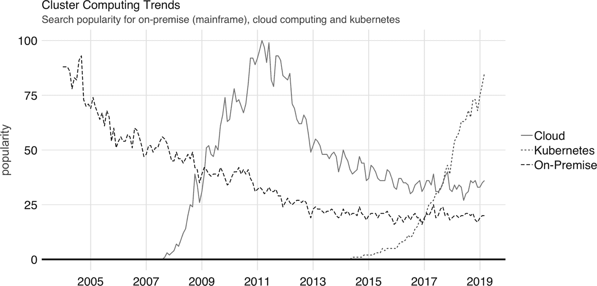

###### 图 6-1 本地（大型机）、云计算和 Kubernetes 的谷歌趋势

当购买数百或数千个计算实例时，将它们放在我们都熟悉的普通计算箱中是没有意义的；相反，将它们尽可能有效地堆叠在一起以减少使用空间是有意义的。这组高效堆叠的计算实例称为[*机架*](https://oreil.ly/zKOr-)。当一个集群增长到数千台计算机时，您还需要托管数百个机架的计算设备；在这个规模下，您还需要显著的物理空间来托管这些机架。

一个提供计算实例机架的建筑通常被称为*数据中心*。在数据中心的规模上，你还需要找到方法使建筑更加高效，特别是冷却系统、电源供应、网络连接等。由于这是耗时的，一些组织联合起来在[Open Compute Project](http://www.opencompute.org/)倡议下开源了他们的基础设施，提供了一套数据中心蓝图供任何人免费使用。

没有什么能阻止你建造自己的数据中心，事实上，许多组织已经走上了这条路。例如，亚马逊起初是一家在线书店，但随着时间的推移，它发展到不仅仅销售书籍。随着在线商店的增长，其数据中心也在规模上增长。2002 年，亚马逊考虑过在他们的数据中心中[向公众出租服务器](https://oreil.ly/Nx3BD)，两年后，亚马逊网络服务(AWS)作为一种方式推出，让任何人都可以按需租用公司数据中心中的服务器，这意味着您不需要购买、配置、维护或拆除自己的集群，而是可以直接从 AWS 租用它们。

这种按需计算模型就是我们今天所知的*云计算*。在云中，您使用的集群不是您拥有的，也不在您的物理建筑中；相反，它是由别人拥有和管理的数据中心。今天，这个领域有许多云服务提供商，包括 AWS、Databricks、Google、Microsoft、Qubole 等等。大多数云计算平台通过 Web 应用程序或命令行提供用户界面来请求和管理资源。

尽管多年来处理云中数据的好处显而易见，但选择云服务提供商却意外地使组织与特定的提供商锁定在一起，使得在不同提供商之间或者回到本地集群之间切换变得困难。*Kubernetes*由 Google 于 2014 年宣布，是一种[用于跨多个主机管理容器化应用程序的开源系统](https://oreil.ly/u6H5X)。在实践中，它使得跨多个云提供商和本地环境部署变得更加容易。

总结来说，我们看到了从本地到云计算，以及最近的 Kubernetes 的过渡。这些技术通常被宽泛地描述为*私有云*、*公有云*和作为可以实现*混合云*的编排服务之一。本章将带您了解 Spark 和 R 在各个集群计算趋势中的背景。

# 本地环境

正如概述部分中提到的，在本地集群代表了一组由您组织的工作人员采购和管理的计算实例。这些集群可以高度定制和控制；然而，它们也可能带来更高的初始费用和维护成本。

当使用本地 Spark 集群时，有两个概念您应该考虑：

集群管理器

就像操作系统（如 Windows 或 macOS）允许您在同一台计算机上运行多个应用程序一样，集群管理器允许在同一集群中运行多个应用程序。在处理本地集群时，您需要自行选择一个集群管理器。

Spark 分发版本

虽然您可以从 Apache Spark 网站安装 Spark，但许多组织与能够为 Apache Spark 提供支持和增强的公司合作，我们通常称之为 Spark 的*分发版本*。

## 管理器

要在计算集群中运行 Spark，您需要运行能够在每台物理机器上初始化 Spark 并注册所有可用计算节点的软件。这种软件称为[集群管理器](https://oreil.ly/Ye4zH)。Spark 中可用的集群管理器包括*Spark Standalone*、*YARN*、*Mesos*和*Kubernetes*。

###### 注意

在分布式系统和集群文献中，我们通常将每台物理机器称为*计算实例*、*计算节点*、*实例*或*节点*。

### Standalone

在*Spark Standalone*中，Spark 使用自身作为其集群管理器，这使您可以在集群中使用 Spark 而无需安装其他软件。如果计划仅使用集群运行 Spark 应用程序，则此方法非常有用；如果此集群不专用于 Spark，则像 YARN、Mesos 或 Kubernetes 这样的通用集群管理器更适合。Spark Standalone 的[文档](http://bit.ly/307YtM6)详细介绍了配置、启动、监控和启用高可用性，如图 6-2 所示。

但是，由于 Spark Standalone 包含在 Spark 安装中，在完成第二章后，您现在可以使用自己的机器上的本地 Spark Standalone 集群初始化可用的 Spark 安装。实际上，您可能希望在不同的机器上启动工作节点，但为简单起见，我们提供了在单台机器上启动独立集群的代码。

首先，通过运行**`spark_home_dir()`**来获取`SPARK_HOME`目录，然后按以下步骤启动主节点和工作节点：

```
# Retrieve the Spark installation directory
spark_home <- spark_home_dir()

# Build paths and classes
spark_path <- file.path(spark_home, "bin", "spark-class")

# Start cluster manager master node
system2(spark_path, "org.apache.spark.deploy.master.Master", wait = FALSE)
```

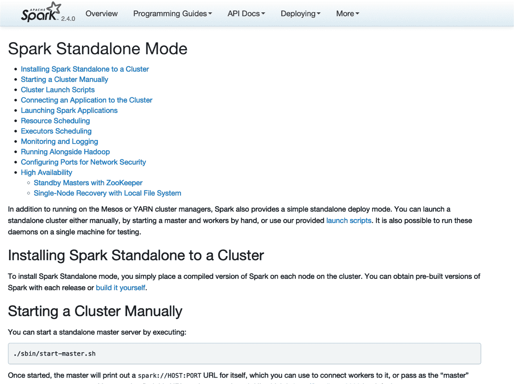

###### 图 6-2\. Spark Standalone 网站

前一个命令初始化了主节点。您可以在[*localhost:8080*](http://localhost:8080)访问主节点界面，如图 6-3 所示。请注意，Spark 主 URL 指定为*spark://address:port*；您将需要此 URL 来初始化工作节点。

然后，我们可以使用主 URL 初始化单个工作节点；但是，您可以通过多次运行代码和潜在地跨不同机器初始化多个工作节点：

```
# Start worker node, find master URL at http://localhost:8080/
system2(spark_path, c("org.apache.spark.deploy.worker.Worker",
                      "spark://address:port"), wait = FALSE)
```

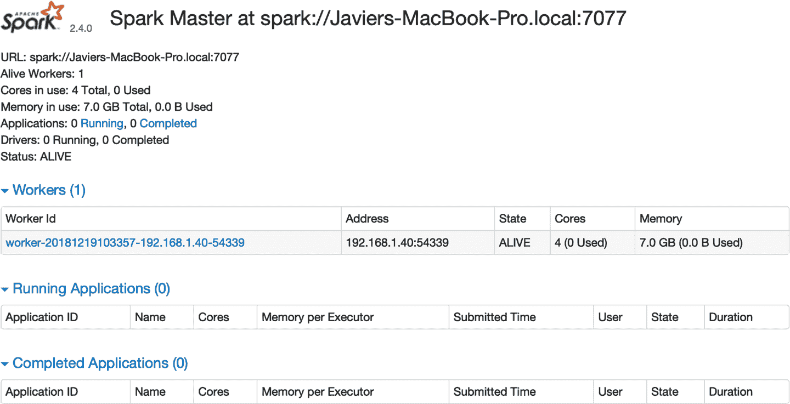

###### 图 6-3\. Spark Standalone 网页界面

在 Spark 独立模式中有一个工作节点注册。点击该工作节点的链接，以查看该特定工作节点的详细信息，如图 6-4 所示。

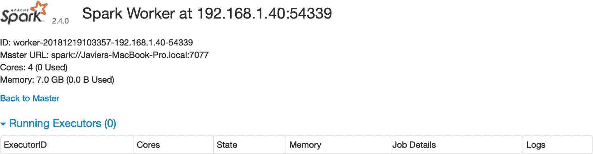

###### 图 6-4. Spark 独立工作节点 Web 界面

当你完成了在这个集群中的计算后，你需要停止主节点和工作节点。你可以使用`jps`命令来识别需要终止的进程号。在以下示例中，`15330`和`15353`是你可以终止的进程，以完成集群的最终操作。要终止一个进程，你可以在 Windows 中使用`system("Taskkill /PID ##### /F")`，或者在 macOS 和 Linux 中使用`system("kill -9 #####")`。

```
system("jps")
```

```
15330 Master
15365 Jps
15353 Worker
1689 QuorumPeerMain
```

你可以按照类似的方法来配置集群，通过在集群中的每台机器上运行初始化代码来实现。

虽然可以初始化一个简单的独立集群，但配置一个能够从计算机重启和故障中恢复，并支持多个用户、权限等的合适的 Spark 独立集群通常是一个更长的过程，超出了本书的范围。接下来的章节将介绍几种在本地或通过云服务上更易于管理的替代方案。我们将从介绍 YARN 开始。

### YARN

Hadoop YARN，简称 YARN，是 Hadoop 项目的资源管理器。它最初在 Hadoop 项目中开发，但在 Hadoop 2 中重构为独立项目。正如我们在第一章中提到的，Spark 是为了加速在 Hadoop 上的计算而构建的，因此在安装了 Hadoop 集群的地方很常见找到 Spark。

YARN 的一个优势是，它很可能已经安装在许多支持 Hadoop 的现有集群中；这意味着你可以在不需要对现有集群基础设施做出任何重大更改的情况下，轻松地在许多现有的 Hadoop 集群上使用 Spark。由于许多集群最初是 Hadoop 集群，随后升级以支持 Spark，因此在 YARN 集群中部署 Spark 也是非常常见的。

你可以以两种模式提交 YARN 应用程序：*yarn-client*和*yarn-cluster*。在 yarn-cluster 模式下，驱动程序可能是远程运行的，而在 yarn-client 模式下，驱动程序是在本地运行的。两种模式都受支持，我们将在第七章中进一步解释它们。

YARN 提供了一个资源管理用户界面，用于访问日志、监控可用资源、终止应用程序等。当你从 R 语言连接到 Spark 后，你将能够在 YARN 中管理运行的应用程序，如图 6-5 所示。

由于 YARN 是 Hadoop 项目的集群管理器，你可以在[hadoop.apache.org](http://bit.ly/2TDGsCX)找到 YARN 的文档。你还可以参考在[spark.apache.org](http://bit.ly/306WsQx)上的“在 YARN 上运行 Spark”指南。

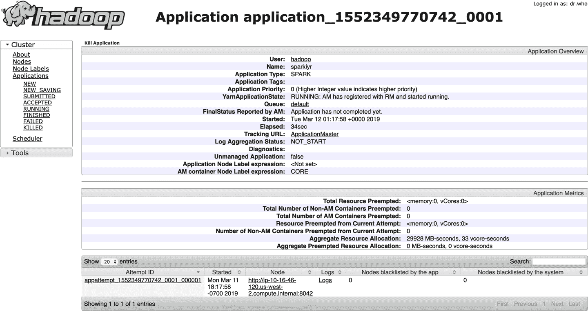

###### 图 6-5. YARN 的资源管理器运行一个 sparklyr 应用程序

### Apache Mesos

Apache Mesos 是一个管理计算机集群的开源项目。Mesos 最初是 UC Berkeley RAD 实验室的一个研究项目。它利用 Linux 的[Cgroups](http://bit.ly/2Z9KEeW)来提供 CPU、内存、I/O 和文件系统访问的隔离。

Mesos 和 YARN 一样，支持执行许多集群框架，包括 Spark。然而，Mesos 的一个特定优势在于它允许像 Spark 这样的集群框架实现自定义的任务调度器。调度器是集群中协调应用程序分配执行时间和分配资源的组件。Spark 使用[粗粒度调度器](https://oreil.ly/9WQvg)，为应用程序的整个执行周期安排资源；然而，其他框架可能使用 Mesos 的细粒度调度器，通过在更短的间隔内调度任务来增加集群的整体效率，使它们能够共享资源。

Mesos 提供了一个 Web 界面来管理正在运行的应用程序、资源等。在从 R 连接到 Spark 后，您的应用程序将像在 Mesos 中运行的任何其他应用程序一样注册。图 6-6 展示了成功从 R 连接到 Spark 的情况。

Mesos 是一个 Apache 项目，其文档可以在[mesos.apache.org](https://mesos.apache.org/)找到。如果选择将 Mesos 作为您的集群管理器，[*在 Mesos 上运行 Spark*](http://bit.ly/31H4LCT)指南也是一个很好的资源。

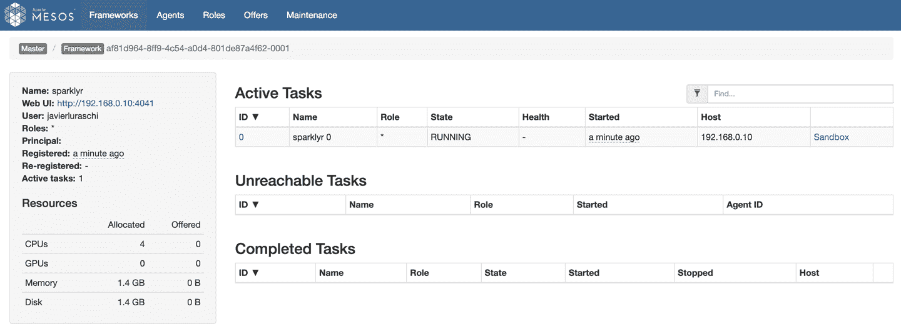

###### 图 6-6. Mesos web 界面运行 Spark 和 R

## 发行版

您可以在本地集群中使用集群管理器，如前一节所述；然而，许多组织，包括但不限于 Apache Spark，选择与提供额外管理软件、服务和资源的公司合作来管理其集群中的应用程序。一些本地集群提供商包括*Cloudera*、*Hortonworks*和*MapR*，我们将在下文简要介绍。

*Cloudera*，Inc.，是一家总部位于美国的软件公司，提供基于 Apache Hadoop 和 Apache Spark 的软件、支持和服务以及培训给商业客户。Cloudera 的混合开源 Apache Hadoop 发行版，Cloudera 分布包括 Apache Hadoop（CDH），针对企业级部署该技术。Cloudera 向组成 Apache Hadoop 平台的各种 Apache 许可的开源项目（如 Apache Hive、Apache Avro、Apache HBase 等）捐赠超过 50%的工程输出。[Cloudera](http://bit.ly/2KJmcfe)也是 Apache 软件基金会的赞助商。

Cloudera 集群使用 [*parcels*](http://bit.ly/33LHpxU)，这些是包含程序文件和元数据的二进制分发物。在 Cloudera 中，Spark 安装为一个 parcel。本书不涵盖如何配置 Cloudera 集群，但资源和文档可以在 [cloudera.com](http://bit.ly/33yUUkp) 和 Cloudera 博客上的 [“Introducing sparklyr, an R Interface for Apache Spark”](http://bit.ly/2HbAtjY) 找到。

Cloudera 提供 Cloudera Manager 网页界面，用于管理资源、服务、parcels、诊断等等。图 6-7 展示了在 Cloudera Manager 中运行的一个 Spark parcel，稍后可以用来从 R 进行连接。

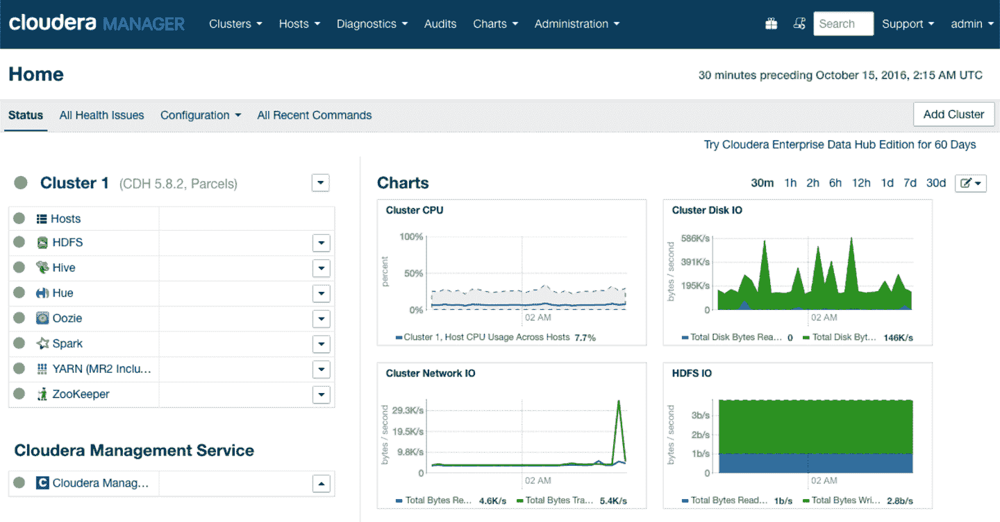

###### 图 6-7\. Cloudera Manager 运行 Spark parcel

[`sparklyr` 已与 Cloudera 认证](http://bit.ly/2z1yydc)，这意味着 Cloudera 的支持团队已了解 `sparklyr`，并能够有效地帮助使用 Spark 和 R 的组织。表 6-1 总结了目前认证的版本。

表 6-1\. 与 Cloudera 认证的 sparklyr 版本

| Cloudera 版本 | 产品 | 版本 | 组件 | Kerberos |
| --- | --- | --- | --- | --- |
| CDH5.9 | sparklyr | 0.5 | HDFS, Spark | Yes |
| CDH5.9 | sparklyr | 0.6 | HDFS, Spark | Yes |
| CDH5.9 | sparklyr | 0.7 | HDFS, Spark | Yes |

*Hortonworks* 是一家总部位于加利福尼亚州圣克拉拉的大数据软件公司。该公司开发、支持并提供广泛的完全开源软件，旨在管理从物联网（IoT）到高级分析和机器学习的数据和处理。[Hortonworks](http://bit.ly/2KTufpV) 认为自己是一家数据管理公司，架设云端与数据中心之间的桥梁。

[Hortonworks 与 Microsoft 合作](http://bit.ly/2NbfuBH) 提升了在 Microsoft Windows 上对 Hadoop 和 Spark 的支持，这曾是与 Cloudera 的区别点；然而，比较 Hortonworks 和 Cloudera 在今天已不那么相关，因为这两家公司于 2019 年 1 月 [合并](http://bit.ly/2Mk1UMt)。尽管合并，Cloudera 和 Hortonworks 的 Spark 发行版仍可获得支持。有关在 Hortonworks 下配置 Spark 的额外资源，请访问 [hortonworks.com](http://bit.ly/2Z8M8Kh)。

*MapR* 是一家总部位于加利福尼亚州圣克拉拉的商业软件公司。[MapR](http://bit.ly/33DU8Cs)提供从单个计算机集群访问各种数据源的服务，包括 Apache Hadoop 和 Apache Spark 等大数据工作负载，分布式文件系统，多模型数据库管理系统以及事件流处理，将实时分析与操作应用程序结合在一起。其技术可在商品硬件和公共云计算服务上运行。

# 云

如果你既没有本地集群也没有多余的机器可供重复使用，从云集群开始会非常方便，因为它将允许你在几分钟内访问一个合适的集群。本节简要提到了一些主要的云基础设施提供商，并为你提供了资源，以帮助你开始使用云服务提供商。

在云服务中，计算实例的计费时间与 Spark 集群运行时间一致；你的计费从集群启动开始算起，集群停止时结束。这项费用需要按照为你的集群预留的实例数量进行乘算。例如，如果一个云服务提供商每小时每个计算实例收费 $1.00，你启动了一个三节点的集群并使用了一小时零十分钟，那么你可能会收到一张 $1.00 x 2 小时 x 3 节点 = $6.00 的账单。有些云服务提供商按分钟计费，但至少你可以依赖它们都是按计算小时计费。

请注意，尽管小规模集群的计算成本可能非常低，但意外地让集群保持运行可能导致显著的计费费用。因此，在你不再需要集群时，花额外的时间检查两次确保集群已经终止是值得的。在使用集群时，每天监控成本以确保你的预期与每日账单相匹配也是一个好习惯。

根据过去的经验，在处理大规模项目时，你还应提前请求计算资源；各种云服务提供商通常不允许你在通过支持请求明确要求之前启动数百台机器的集群。虽然这可能有些繁琐，但这也是帮助你控制组织成本的一种方式。

由于集群大小是灵活的，最佳实践是从小集群开始，根据需要扩展计算资源。即使你事先知道需要一个大型集群，从小开始也提供了以较低成本解决问题的机会，因为第一次尝试时你的数据分析不太可能无缺陷地在大规模上运行。作为经验法则，指数级增加实例；如果你需要在八节点集群上运行计算，从一个节点和八分之一的整个数据集开始，然后两个节点和四分之一，然后四个节点和半个数据集，最后八个节点和整个数据集。随着经验的积累，你会培养出良好的问题解决感觉，了解所需集群的大小，并能跳过中间步骤，但作为初学者，这是一个很好的实践方法。

您还可以使用云提供商获取裸计算资源，然后自行安装前一节介绍的本地分布；例如，您可以在 Amazon Elastic Compute Cloud（Amazon EC2）上运行 Cloudera 分布。这种模型避免了采购共同托管的硬件，但仍允许您紧密管理和自定义集群。本书仅介绍云提供商提供的完全托管的 Spark 服务概述；不过，您通常可以轻松找到在线有关如何在云中安装本地分布的说明。

一些主要的云计算基础设施提供商包括 Amazon、Databricks、Google、IBM、Microsoft 和 Qubole。接下来的小节简要介绍了每个提供商。

## Amazon

Amazon 通过[AWS](https://aws.amazon.com/)提供云服务；具体来说，它通过[Amazon EMR](https://aws.amazon.com/emr/)提供按需 Spark 集群。

使用 Amazon EMR 与 R 的详细说明已在 Amazon 的大数据博客中发布，名为[“在 Amazon EMR 上运行 sparklyr”](https://amzn.to/2OYWMQ5)。该文章介绍了`sparklyr`的启动和配置 Amazon EMR 集群的说明。例如，它建议您可以使用[Amazon 命令行界面](https://aws.amazon.com/cli/)启动一个包含三个节点的集群：

```
aws emr create-cluster --applications Name=Hadoop Name=Spark Name=Hive \
  --release-label emr-5.8.0 --service-role EMR_DefaultRole --instance-groups \
  InstanceGroupType=MASTER,InstanceCount=1,InstanceType=m3.2xlarge \
  InstanceGroupType=CORE,InstanceCount=2,InstanceType=m3.2xlarge \
  --bootstrap-action Path=s3://aws-bigdata-blog/artifacts/aws-blog-emr-\
rstudio-sparklyr/rstudio_sparklyr_emr5.sh,Args=["--user-pw", "<password>", \
  "--rstudio", "--arrow"] --ec2-attributes InstanceProfile=EMR_EC2_DefaultRole
```

您随后可以在 AWS 门户下看到集群的启动和运行情况，如图 6-8 所示。

然后，您可以导航到主公共 DNS 并在端口 8787 下找到 RStudio，例如`ec2-12-34-567-890.us-west-1.compute.amazonaws.com:8787`，然后使用用户名`hadoop`和密码`password`登录。

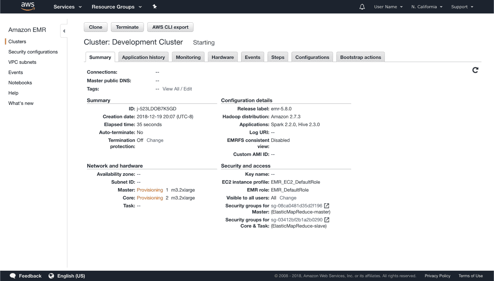

###### 图 6-8\. 启动 Amazon EMR 集群

也可以通过 Web 界面启动 Amazon EMR 集群；同一篇介绍性文章包含了专门为 Amazon EMR 设计的额外细节和操作说明。

记得关闭您的集群，以避免不必要的费用，并在启动 Amazon EMR 集群进行敏感数据分析时使用适当的安全限制。

关于成本，您可以在[Amazon EMR 定价](https://amzn.to/2YRGb5r)处找到最新信息。表 6-2 展示了在`us-west-1`地区（截至本文撰写时）可用的一些实例类型；这旨在提供云处理资源和成本的一瞥。请注意，“EMR 价格另外加上 Amazon EC2 价格（即底层服务器的价格）。”

表 6-2\. Amazon EMR 定价信息

| 实例 | CPU | 内存 | 存储 | EC2 成本 | EMR 成本 |
| --- | --- | --- | --- | --- | --- |
| c1.medium | 2 | 1.7 GB | 350 GB | 每小时$0.148 | 每小时$0.030 |
| m3.2xlarge | 8 | 30 GB | 160 GB | 每小时$0.616 | 每小时$0.140 |
| i2.8xlarge | 32 | 244 GB | 6400 GB | 每小时$7.502 | 每小时$0.270 |

###### 注

我们仅展示了截至 2019 年 Amazon 和其他云服务提供商提供的计算实例的部分列表；然而，请注意硬件（CPU 速度、硬盘速度等）在供应商和地点之间会有所不同；因此，您不能将这些硬件表格用作准确的价格比较依据。准确的比较需要运行特定的工作负载并考虑计算实例成本之外的其他因素。

## Databricks

[Databricks](https://databricks.com) 是由 Apache Spark 的创始人创建的公司，旨在帮助客户通过 Spark 进行基于云的大数据处理。Databricks 起源于加州大学伯克利分校的 [AMPLab](https://oreil.ly/W2Eoe) 项目。

Databricks 提供企业级集群计算方案以及用于探索功能并熟悉其环境的免费/社区层级。

在启动集群后，您可以按照 第二章 中提供的步骤，在 Databricks 笔记本中使用 R 和 `sparklyr`，或者通过在 [Databricks 上安装 RStudio](http://bit.ly/2KCDax6) 来进行操作。图 6-9 展示了使用 `sparkylyr` 在 Databricks 笔记本上运行 Spark 的情况。


###### 图 6-9\. Databricks 社区笔记本运行 sparklyr

额外资源可在 Databricks 工程博客文章 [“在 Databricks 中使用 sparklyr”](http://bit.ly/2N59jyR) 和 [Databricks `sparklyr` 文档](http://bit.ly/2MkOYWC) 中找到。

您可以在 [*databricks.com/product/pricing*](http://bit.ly/305Rnrt) 查找最新的定价信息。表 6-3 列出了撰写本文时提供的计划。

表 6-3\. Databricks 产品信息

| 方案 | 基础 | 数据工程 | 数据分析 |
| --- | --- | --- | --- |
| AWS 标准 | $0.07/DBU | $0.20/DBU | $0.40/DBU |
| Azure 标准 |  | $0.20/DBU | $0.40/DBU |
| Azure 高级 |  | $0.35/DBU | $0.55/DBU |

注意，定价是基于每小时的 DBU 成本。根据 Databricks 的说法，“[Databricks Unit](https://oreil.ly/3muQq)（DBU）是每小时的 Apache Spark 处理能力单位。对于多种实例，DBU 是一种更透明的使用方式，而不是节点小时。”

## Google

Google 提供 Google Cloud Dataproc 作为一种基于云的托管 Spark 和 Hadoop 服务，提供在 Google Cloud Platform（GCP）上运行的服务。Dataproc 利用许多 GCP 技术，如 Google Compute Engine 和 Google Cloud Storage，为运行流行的数据处理框架（如 Apache Hadoop 和 Apache Spark）的完全托管集群提供支持。

您可以通过 Google Cloud 控制台或 Google Cloud 命令行界面（CLI）轻松创建集群，如 图 6-10 所示。

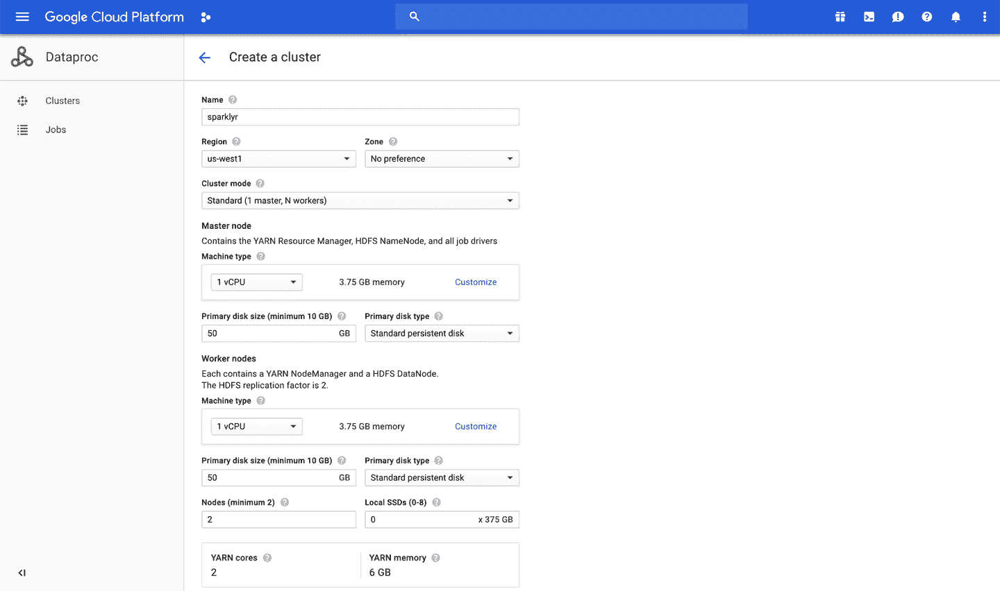

###### 图 6-10\. 启动 Dataproc 集群

创建集群后，可以将端口转发，以便从您的机器访问此集群，例如，通过启动 Chrome 来使用此代理并安全连接到 Dataproc 集群。配置此连接如下所示：

```
gcloud compute ssh sparklyr-m --project=<project> --zone=<region> -- -D 1080 \
  -N "<path to chrome>" --proxy-server="socks5://localhost:1080" \
  --user-data-dir="/tmp/sparklyr-m" http://sparklyr-m:8088
```

有多种[可用的教程](http://bit.ly/2OYyo18)（cloud.google.com/dataproc/docs/tutorials），包括一个详细的[tutorial 配置 RStudio 和`sparklyr`](http://bit.ly/2MhSgKg)。

您可以在[*cloud.google.com/dataproc/pricing*](http://bit.ly/31J0uyC)找到最新的定价信息。在表 6-4 中请注意，成本分为计算引擎和 Dataproc 高级部分。

表 6-4\. Google Cloud Dataproc 定价信息

| 实例 | CPU | 内存 | 计算引擎 | Dataproc 高级部分 |
| --- | --- | --- | --- | --- |
| n1-standard-1 | 1 | 3.75 GB | $0.0475/小时 | $0.010/小时 |
| n1-standard-8 | 8 | 30 GB | $0.3800/小时 | $0.080/小时 |
| n1-standard-64 | 64 | 244 GB | $3.0400/小时 | $0.640/小时 |

## IBM

IBM 云计算是一套面向企业的云计算服务。IBM 云包括基础设施即服务（IaaS）、软件即服务（SaaS）和平台即服务（PaaS），通过公共、私有和混合云交付模型提供，除此之外还包括组成这些云的各个组件。

在 IBM Cloud 内部，打开 Watson Studio 并创建一个数据科学项目，在项目设置下添加一个 Spark 集群，然后在启动 IDE 菜单上启动 RStudio。请注意，截至撰写本文时，提供的`sparklyr`版本并非 CRAN 中最新版本，因为`sparklyr`已经修改以在 IBM Cloud 上运行。无论如何，请遵循 IBM 的文档作为运行 R 和 Spark 在 IBM Cloud 上以及如何适当升级`sparklyr`的权威参考。图 6-11 捕捉了 IBM 云门户启动 Spark 集群的场景。

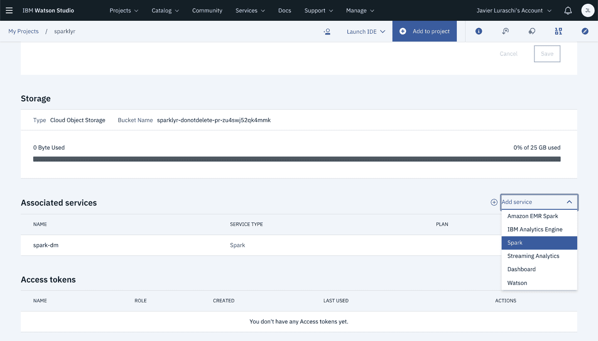

###### 图 6-11\. IBM Watson Studio 启动支持 R 的 Spark

最新的定价信息请访问[*ibm.com/cloud/pricing*](https://www.ibm.com/cloud/pricing)。在表 6-5 中，计算成本使用每月成本的 31 天进行了标准化。

表 6-5\. IBM 云定价信息

| 实例 | CPU | 内存 | 存储 | 成本 |
| --- | --- | --- | --- | --- |
| C1.1x1x25 | 1 | 1 GB | 25 GB | $0.033/小时 |
| C1.4x4x25 | 4 | 4 GB | 25 GB | $0.133/小时 |
| C1.32x32x25 | 32 | 25 GB | 25 GB | $0.962/小时 |

## 微软

Microsoft Azure 是由微软创建的用于构建、测试、部署和管理应用程序和服务的云计算服务，通过全球网络的 Microsoft 托管数据中心提供。它支持 SaaS、PaaS 和 IaaS，并支持许多不同的编程语言、工具和框架，包括 Microsoft 特定和第三方软件和系统。

从 Azure 门户，Azure HDInsight 服务支持按需创建 Spark 集群。你可以通过选择 ML Services 集群类型轻松创建支持 Spark 和 RStudio 的 HDInsight 集群。请注意，提供的 `sparklyr` 版本可能不是 CRAN 中最新的版本，因为默认的软件包存储库似乎是使用 Microsoft R 应用程序网络（MRAN）的快照初始化的，而不是直接从 CRAN 获取的。图 6-12 展示了 Azure 门户启动支持 R 的 Spark 集群。

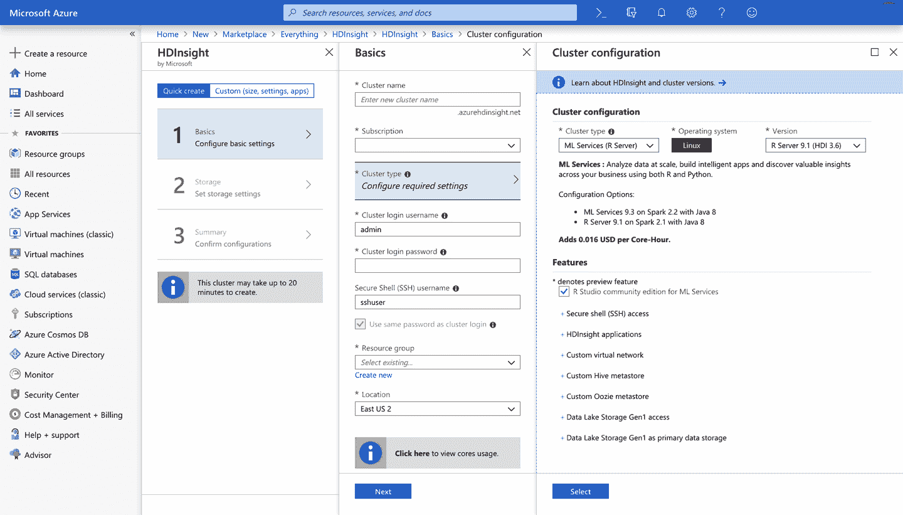

###### 图 6-12\. 创建 Azure HDInsight Spark 集群

HDInsight 的最新定价信息可在 [*azure.microsoft.com/en-us/pricing/details/hdinsight*](http://bit.ly/2H9Ce0X) 上找到；表 6-6 列出了本文撰写时的定价。

表 6-6\. Azure HDInsight 定价信息

| 实例 | CPUs | 内存 | 总成本 |
| --- | --- | --- | --- |
| D1 v2 | 1 | 3.5 GB | $0.074/小时 |
| D4 v2 | 8 | 28 GB | $0.59/小时 |
| G5 | 64 | 448 GB | $9.298/小时 |

## Qubole

[Qubole](https://www.qubole.com) 成立于 2013 年，旨在缩小数据可访问性差距。Qubole 提供一个建立在亚马逊、微软、谷歌和甲骨文云上的自助式大数据分析平台。在 Qubole 中，你可以启动 Spark 集群，并可以从 [Qubole notebooks](http://bit.ly/33ChKYk) 或 RStudio Server 使用。图 6-13 展示了一个使用 RStudio 和 `sparklyr` 初始化的 Qubole 集群。

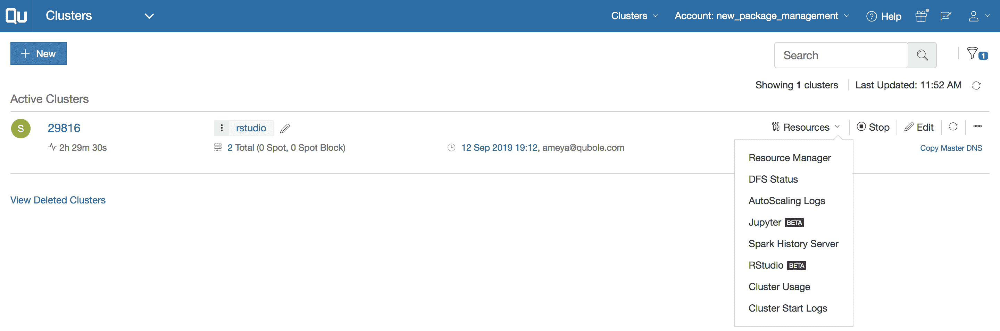

###### 图 6-13\. 使用 RStudio 和 sparklyr 初始化的 Qubole 集群

你可以在 [Qubole 的定价页面](http://bit.ly/33AuKh8) 找到最新的定价信息。表 6-7 列出了 Qubole 当前计划的价格，截至本文撰写时。请注意，定价是基于每小时 QCU（Qubole 计算单元）的成本计算，企业版需要签订年度合同。

表 6-7\. Qubole 定价信息

| 试用 | 完整试用 | 企业版 |
| --- | --- | --- |
| $0 | $0 | $0.14/QCU |

# Kubernetes

Kubernetes 是一个由 Google 最初设计并现由 [Cloud Native Computing Foundation](https://www.cncf.io/)（CNCF）维护的开源容器编排系统，用于自动化部署、扩展和管理容器化应用程序。Kubernetes 最初基于 [Docker](https://www.docker.com/) 开发，与 Mesos 类似，也基于 Linux Cgroups。

Kubernetes 可以执行许多集群应用程序和框架，通过使用具有特定资源和库的容器映像进行高度定制。这使得单个 Kubernetes 集群可以用于超出数据分析之外的许多不同目的，从而帮助组织轻松管理其计算资源。使用自定义映像的一个权衡是它们增加了进一步的配置开销，但使 Kubernetes 集群极其灵活。尽管如此，这种灵活性已被证明对于许多组织轻松管理集群资源至关重要，正如在“概述”中指出的那样，Kubernetes 正在成为一个非常受欢迎的集群框架。

Kubernetes 被所有主要的云服务提供商支持。它们都提供了关于如何启动、管理和撤销 Kubernetes 集群的广泛文档；图 6-14 展示了在创建 Kubernetes 集群时的 GCP 控制台。你可以在任何 Kubernetes 集群上部署 Spark，并且可以使用 R 来连接、分析、建模等。

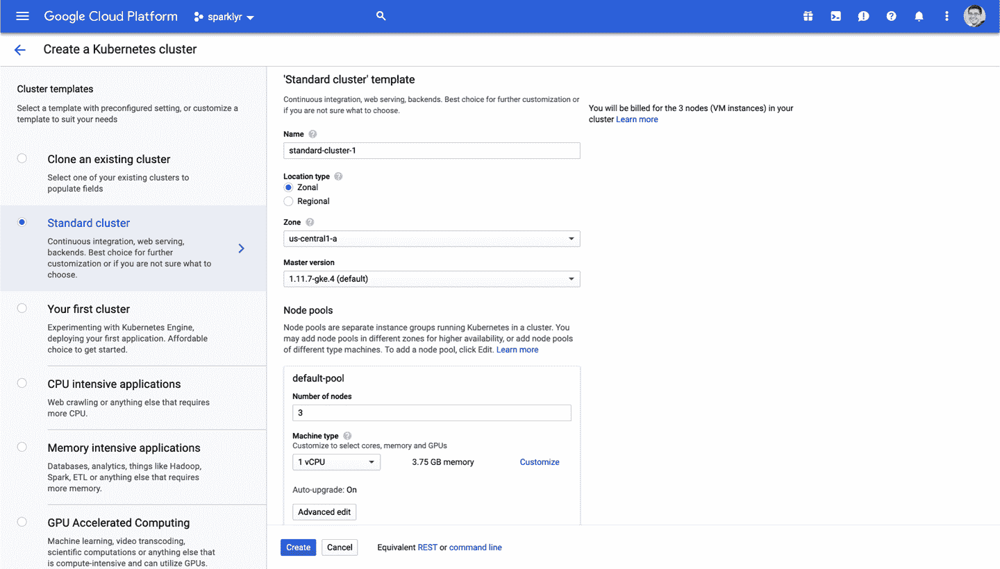

###### 图 6-14\. 在 Google Cloud 上创建用于 Spark 和 R 的 Kubernetes 集群

你可以在[kubernetes.io](https://kubernetes.io/)上了解更多信息，并阅读来自[spark.apache.org](http://bit.ly/2KAZze7)的*在 Kubernetes 上运行 Spark*指南。

严格来说，Kubernetes 是一种集群技术，而不是一种特定的集群架构。然而，Kubernetes 代表了一个更大的趋势，通常被称为*混合云*。混合云是利用本地和公共云服务，并在各个平台之间进行编排的计算环境。现在精确分类将形成混合集群计算的主导技术尚为时过早；尽管如此，如前所述，Kubernetes 是其中领先的技术之一，还可能会有更多技术来补充或甚至替代现有技术。

# 工具

虽然只使用 R 和 Spark 对一些集群来说可能已足够，但通常在集群中安装一些辅助工具是常见的，以改善监控、SQL 分析、工作流协调等，例如[Ganglia](http://ganglia.info/)、[Hue](http://gethue.com/)和[Oozie](https://oozie.apache.org/)。本节并不意味着涵盖所有工具，而是提到了常用的工具。

## RStudio

从阅读第一章可以知道，RStudio 是一个著名且免费的 R 桌面开发环境；因此，你很可能正在使用 RStudio Desktop 来跟随本书中的示例。然而，你可能不知道你可以在 Spark 集群内作为 Web 服务运行 RStudio。这个版本的 RStudio 称为*RStudio Server*。你可以在图 6-15 中看到 RStudio Server 正在运行。与 Spark UI 在集群中运行类似，你可以在集群中安装 RStudio Server。然后你可以连接到 RStudio Server，并且以与使用 RStudio Desktop 相同的方式使用 RStudio，但具有对 Spark 集群运行代码的能力。正如你在图 6-15 中看到的那样，RStudio Server 看起来和感觉都像 RStudio Desktop，但通过位于集群中来运行命令可以高效运行。

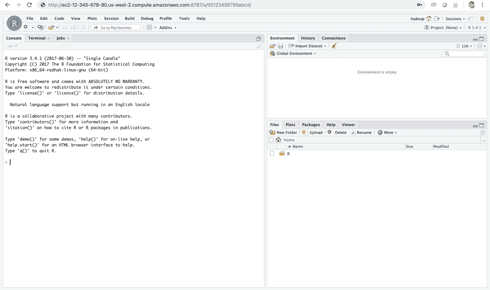

###### 图 6-15\. 在 AWS 中运行的 RStudio Server Pro

如果你熟悉 R，Shiny Server 是一个非常流行的工具，用于从 R 构建交互式 Web 应用程序。我们建议你直接在你的 Spark 集群中安装 Shiny。

RStudio Server 和 Shiny Server 是免费开源的；然而，RStudio 还提供专业产品如 RStudio Server、[RStudio Server Pro](http://bit.ly/2KCaxQn)、[Shiny Server Pro](http://bit.ly/30aV0fK)和[RStudio Connect](http://bit.ly/306fHcY)，你可以在集群内安装以支持额外的 R 工作流。虽然`sparklyr`不需要任何额外的工具，但它们提供了显著的生产力提升，值得考虑。你可以在[*rstudio.com/products/*](http://bit.ly/2MihHLP)了解更多信息。

## Jupyter

[Jupyter](http://jupyter.org/)项目旨在开发跨多种编程语言的交互式计算的开源软件、开放标准和服务。Jupyter 笔记本支持包括 R 在内的各种编程语言。你可以使用`sparklyr`与 Jupyter 笔记本一起使用 R 内核。图 6-16 展示了`sparklyr`在本地 Jupyter 笔记本中的运行。

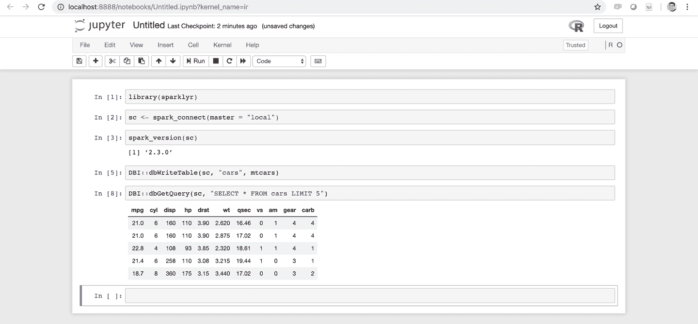

###### 图 6-16\. Jupyter 笔记本运行 sparklyr

## Livy

[Apache Livy](http://bit.ly/2L2TZAn)是 Apache 的孵化项目，通过 Web 界面提供支持，使得可以远程使用 Spark 集群。它非常适合直接连接到 Spark 集群；然而，在无法直接连接到集群的情况下，你可以考虑在集群中安装 Livy，并适当地进行安全设置，以便通过 Web 协议进行远程使用。但要注意，使用 Livy 会带来显著的性能开销。

为了帮助在本地测试 Livy，`sparklyr`提供了支持通过执行`livy_available_versions()`列出、安装、启动和停止本地 Livy 实例的功能。

```
##    livy
## 1 0.2.0
## 2 0.3.0
## 3 0.4.0
## 4 0.5.0
```

这里列出了您可以安装的版本；我们建议安装最新版本，并按以下方式进行验证：

```
# Install default Livy version
livy_install()

# List installed Livy services
livy_installed_versions()

# Start the Livy service
livy_service_start()
```

然后，您可以访问本地的 Livy 会话 [*http://localhost:8998*](http://localhost:8998)。第七章 将详细介绍如何通过 Livy 进行连接。连接成功后，您可以访问 Livy Web 应用程序，如 图 6-17 所示。

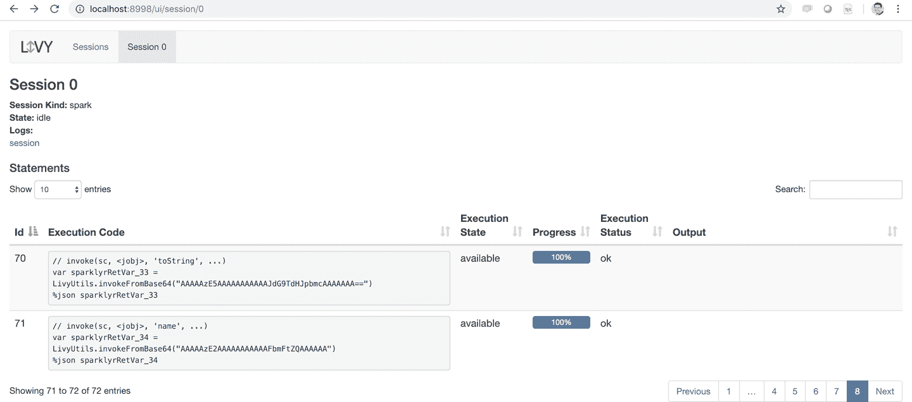

###### 图 6-17\. Apache Livy 作为本地服务运行

在使用本地 Livy 实例时，请确保也停止 Livy 服务（对于在集群中正常运行的 Livy 服务，则无需停止）：

```
# Stops the Livy service
livy_service_stop()
```

# 总结

本章讲解了本地部署和云计算的历史和权衡，并介绍了 Kubernetes 作为一个有前途的框架，可以在本地或多个云服务提供商之间提供灵活性。它还介绍了集群管理器（Spark Standalone、YARN、Mesos 和 Kubernetes）作为运行 Spark 作为集群应用所需的软件。本章简要提到了像 Cloudera、Hortonworks 和 MapR 这样的本地集群提供商，以及主要的 Spark 云提供商：亚马逊、Databricks、IBM、谷歌、微软和 Qubole。

虽然本章为理解当前集群计算趋势、工具和服务提供商奠定了坚实的基础，有助于在规模上进行数据科学，但未提供一个全面的框架来帮助您决定选择哪种集群技术。相反，请将本章作为概述和寻找额外资源的起点，帮助您找到最适合组织需求的集群堆栈。

第七章 将专注于理解如何连接到现有的集群；因此，它假定您已经可以访问像我们在本章中介绍的 Spark 集群之一。
